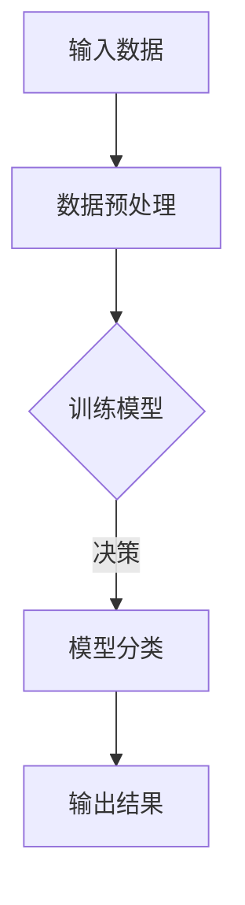
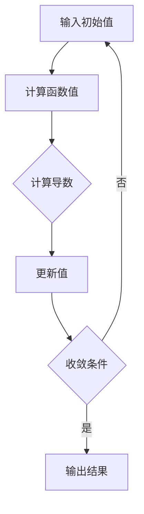
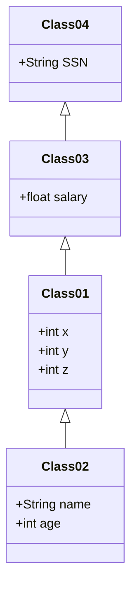
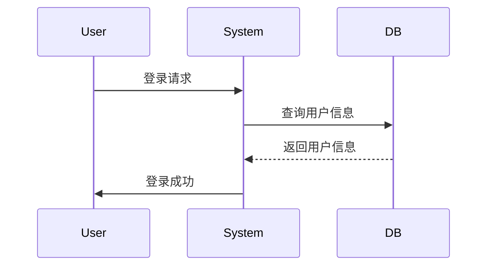
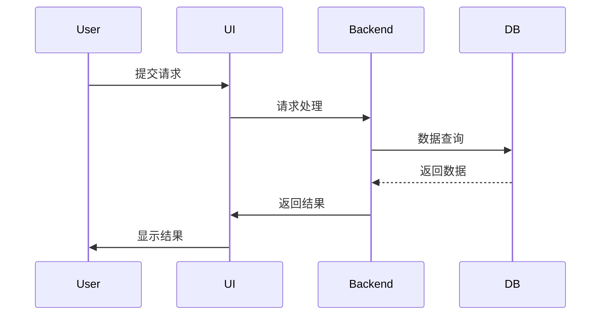
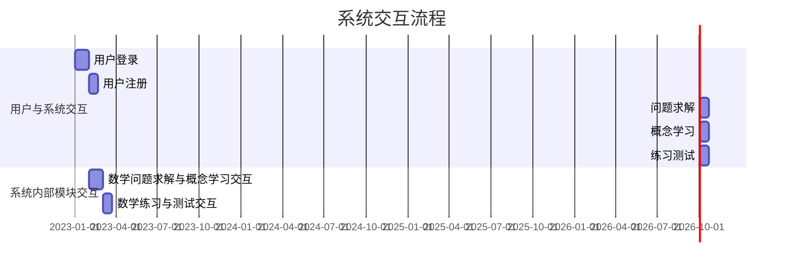

                 

### 《数学教育与信息技术的融合》: 探索未来的教育模式

> **关键词**：数学教育、信息技术、融合、教育模式、创新

> **摘要**：本文旨在探讨数学教育与信息技术的融合，通过分析教育现状、信息技术发展趋势、核心概念、算法原理、系统设计与项目实战，为未来的教育模式提供新的思路和解决方案。

---

#### 引言

数学作为一门逻辑性、抽象性极强的学科，一直是教育体系中的核心内容。然而，传统的数学教育模式在信息时代面临着诸多挑战。信息技术的迅猛发展，不仅改变了人们的生活方式，也为教育领域带来了新的机遇和挑战。如何将数学教育与信息技术有效融合，成为当前教育研究的重要课题。

本文将从以下几个方面展开探讨：

1. **数学教育现状与信息技术发展趋势**：介绍数学教育现状和信息技术的发展趋势，阐述两者融合的必要性。
2. **核心概念与联系**：详细描述数学与信息技术的关系，提供概念属性特征对比表格和ER实体关系图。
3. **算法原理讲解**：介绍融合过程中涉及的关键算法，包括流程图、Python源代码和数学模型。
4. **数学模型和数学公式**：对关键数学概念进行详细讲解，使用LaTeX格式展示。
5. **系统分析与架构设计**：介绍融合系统的设计思路，包括类图、架构图和序列图。
6. **项目实战**：提供具体的实施步骤和案例分析。
7. **最佳实践 tips**：总结实用技巧和注意事项。
8. **小结与拓展阅读**：总结全书内容并推荐进一步阅读资源。

通过本文的探讨，期望能够为数学教育与信息技术的融合提供一些有益的思路和借鉴。

---

#### 数学教育现状与信息技术发展趋势

##### 数学教育现状分析

当前，数学教育在全球范围内都面临着一系列挑战。首先，数学教育目标不明确。不同地区、不同国家的教育部门对数学教育的目标设定存在差异，有的注重基础知识的培养，有的强调应用能力的提升。这种目标的不明确性，导致了教育资源的浪费和教学效果的不理想。

其次，教学方法单一。传统数学教育往往依赖于教师讲授、学生记忆和练习的套路，缺乏互动性和探究性。学生在这种教育模式下，往往被动接受知识，缺乏主动思考和解决问题的能力。

再次，教育资源不均衡。在许多地区，数学教育资源的分配存在显著的不均衡现象。城市与农村、富裕地区与贫困地区之间，数学教育资源的差距越来越大。这导致了一些地区的学生无法获得优质的教育资源，影响了他们的数学学习效果。

最后，学生兴趣不足。随着社会的发展，学生的兴趣爱好越来越多元化，而传统的数学教育内容和方法难以吸引学生的兴趣。这导致了学生在数学学习过程中的低效和挫败感。

##### 信息技术的发展趋势

随着信息技术的迅猛发展，教育领域也迎来了新的变革。首先，在线教育平台和资源的普及，使得学生可以随时随地获取学习资源，突破了时间和空间的限制。其次，虚拟现实（VR）和增强现实（AR）技术的应用，为数学教育提供了全新的教学手段和方式，使得抽象的数学概念更加生动形象。

此外，人工智能（AI）技术的引入，为数学教育带来了新的工具和方法。例如，智能辅导系统可以根据学生的学习进度和特点，提供个性化的学习建议和指导，提高学习效率。同时，AI技术还可以对学生的学习行为和成绩进行分析，为教育管理部门提供数据支持，优化教育资源分配。

最后，大数据技术在教育领域的应用，使得教育数据的收集、分析和应用成为可能。通过分析学生的学习数据，可以更好地了解学生的学习状况和需求，为教育决策提供科学依据。

##### 数学教育现状与信息技术发展趋势的融合

数学教育与信息技术的融合，旨在利用信息技术的优势，解决数学教育中存在的问题，提升数学教育的效果和质量。具体来说，可以从以下几个方面进行：

1. **教学模式的创新**：通过引入在线教育平台、VR/AR技术、智能辅导系统等，改变传统的教学模式，提高教学的互动性和探究性，激发学生的学习兴趣和主动性。
2. **教育资源的优化**：利用信息技术，整合优质教育资源，实现教育资源的均衡分配，让每个学生都能享受到优质的教育资源。
3. **教育评价体系的改革**：通过大数据技术，对学生的学习过程和结果进行科学评价，提供个性化的学习反馈，帮助学生发现自己的不足和优势，实现因材施教。
4. **教育研究的深化**：利用信息技术，开展数学教育研究，探索新的教育理论和方法，为数学教育提供理论支撑和实践指导。

总之，数学教育与信息技术的融合，不仅有助于解决当前数学教育中存在的问题，也为未来的教育模式提供了新的发展方向。在信息技术快速发展的背景下，我们有必要深入探索数学教育与信息技术的融合路径，为未来的教育改革贡献力量。

---

#### 核心概念与联系

在探讨数学教育与信息技术的融合时，了解两者的核心概念和联系至关重要。以下是数学和信息技术的一些关键概念及其属性特征，通过表格进行对比，并使用ER实体关系图来展示它们之间的关联。

##### 核心概念与属性特征对比表格

| 概念           | 定义                                                                                   | 属性特征                                     |
|----------------|----------------------------------------------------------------------------------------|----------------------------------------------|
| 数学概念       | 用精确的语言描述数量、结构、变化和空间等概念和问题的学科。                                | 抽象性、逻辑性、符号性、严谨性                 |
| 信息技术       | 利用计算机、网络、传感器等技术，对信息进行获取、处理、传输、存储、分析和利用的技术。         | 数字化、智能化、网络化、高效性、开放性           |
| 数学公式       | 用数学符号和语言表达的数学关系和规律。                                                     | 精确性、简洁性、逻辑性                         |
| 算法           | 计算解决问题的步骤和方法。                                                               | 步骤性、逻辑性、高效性                         |
| 数学模型       | 用数学语言描述现实问题的数学结构。                                                       | 抽象性、准确性、适应性                         |
| 数据结构       | 存储和组织数据的方式和方法。                                                             | 性能、复杂性、灵活性                           |
| 编程语言       | 用于编写计算机程序的语言。                                                               | 易读性、抽象性、高效性                         |
| 机器学习       | 利用计算机模拟人类学习过程，从数据中自动获取知识和规律的方法。                             | 自适应性、泛化能力、效率                        |
| 教学方法       | 教学过程中采用的具体方法和手段。                                                         | 互动性、探究性、个性化                         |

##### ER实体关系图

为了更直观地展示数学与信息技术之间的联系，我们可以使用ER实体关系图来表示。以下是一个简化的ER图，展示了数学概念、数学公式、算法、数学模型等实体及其关系。

```mermaid
erDiagram
  MathConcept ||--|{ MathFormula }|-- Algorithm
  MathConcept ||--|{ MathModel }|-- Algorithm
  Algorithm ||-- DataStructure
  Algorithm ||-- ProgrammingLanguage
  Algorithm ||-- MachineLearning
  TeachingMethod ||-- Algorithm
```

在这个ER图中，`MathConcept`表示数学概念，`MathFormula`表示数学公式，`MathModel`表示数学模型，`Algorithm`表示算法，`DataStructure`表示数据结构，`ProgrammingLanguage`表示编程语言，`MachineLearning`表示机器学习，`TeachingMethod`表示教学方法。实线箭头表示实体之间的关联，其中`{}`表示一对多的关系。

通过核心概念与属性特征的对比表格和ER实体关系图，我们可以清晰地看到数学与信息技术之间的紧密联系。数学为信息技术提供了理论基础，而信息技术则为数学教育提供了新的工具和方法。这种融合不仅有助于提升数学教育的效果，也为信息技术在数学教育中的应用提供了广阔的空间。

---

#### 算法原理讲解

在数学教育与信息技术的融合过程中，算法扮演着关键角色。以下我们将介绍几个关键的算法，包括它们的原理、流程图、Python源代码实现以及数学模型。

##### 算法A：机器学习分类算法

**算法原理**：机器学习分类算法是一种利用历史数据训练模型，并使用模型对新数据进行分类的方法。常见的分类算法包括决策树、随机森林、支持向量机（SVM）等。

**流程图**：



**Python源代码实现**：

```python
from sklearn.datasets import load_iris
from sklearn.model_selection import train_test_split
from sklearn.tree import DecisionTreeClassifier
from sklearn.metrics import accuracy_score

# 加载数据集
iris = load_iris()
X, y = iris.data, iris.target

# 数据分割
X_train, X_test, y_train, y_test = train_test_split(X, y, test_size=0.3, random_state=42)

# 训练模型
clf = DecisionTreeClassifier()
clf.fit(X_train, y_train)

# 模型分类
y_pred = clf.predict(X_test)

# 输出准确率
print(f"Accuracy: {accuracy_score(y_test, y_pred)}")
```

**数学模型**：在分类算法中，常用的数学模型是决策树，其核心是基于信息熵和增益率来选择最优划分方式。

**信息增益（Gain）**：

$$
Gain(D, A) = Entropy(D) - \sum_{v \in Values(A)} \frac{|D_v|}{|D|} \cdot Entropy(D_v)
$$

其中，$Entropy(D)$表示数据集D的熵，$|D_v|$表示属于属性A的值v的D子集的大小，$Values(A)$表示属性A的所有可能值。

**增益率（Gain Ratio）**：

$$
Gain\_Ratio(D, A) = \frac{Gain(D, A)}{Split\_Info(A)}
$$

其中，$Split\_Info(A)$表示属性A的分裂信息。

##### 算法B：数学模型求解算法

**算法原理**：数学模型求解算法用于解决数学问题，如方程求解、最优化问题等。常用的算法包括牛顿法、梯度下降法等。

**流程图**：



**Python源代码实现**：

```python
import numpy as np

# 牛顿法求解方程 f(x) = 0
def newton_method(f, df, x0, tol=1e-5, max_iter=100):
    x = x0
    for i in range(max_iter):
        fx = f(x)
        dfx = df(x)
        if abs(fx) < tol:
            return x
        x -= fx / dfx
    return None

# 示例：求解方程 f(x) = x^2 - 2
def f(x):
    return x**2 - 2

def df(x):
    return 2*x

x0 = 1
result = newton_method(f, df, x0)
print(f"Result: {result}")
```

**数学模型**：牛顿法的迭代公式为：

$$
x_{n+1} = x_n - \frac{f(x_n)}{f'(x_n)}
$$

其中，$x_n$表示第n次迭代的解，$f(x_n)$表示函数在$x_n$处的函数值，$f'(x_n)$表示函数在$x_n$处的导数值。

##### 算法原理举例说明

**算法A应用实例**：使用决策树分类算法对鸢尾花（Iris）数据集进行分类，输出分类准确率。

```python
from sklearn.datasets import load_iris
from sklearn.model_selection import train_test_split
from sklearn.tree import DecisionTreeClassifier
from sklearn.metrics import accuracy_score

iris = load_iris()
X, y = iris.data, iris.target

X_train, X_test, y_train, y_test = train_test_split(X, y, test_size=0.3, random_state=42)

clf = DecisionTreeClassifier()
clf.fit(X_train, y_train)

y_pred = clf.predict(X_test)
print(f"Accuracy: {accuracy_score(y_test, y_pred)}")
```

**算法B应用实例**：使用牛顿法求解方程$x^2 - 2 = 0$，输出结果。

```python
def f(x):
    return x**2 - 2

def df(x):
    return 2*x

result = newton_method(f, df, x0=1)
print(f"Result: {result}")
```

通过上述算法的原理讲解和实例应用，我们可以看到，算法在数学教育与信息技术的融合中起着至关重要的作用。它们不仅帮助解决数学问题，也为数学教育提供了新的工具和方法。

---

#### 数学模型和数学公式讲解

在数学与信息技术的融合过程中，数学模型和公式的运用至关重要。它们不仅为算法提供了理论基础，也为问题求解提供了工具。在本节中，我们将详细讲解几个关键数学概念，并使用LaTeX格式展示相关的数学公式。

##### 关键数学概念

1. **线性代数**：线性代数是数学中的一个重要分支，研究向量空间、线性变换、矩阵以及它们之间的关系。线性代数在信息技术，尤其是机器学习和数据科学中有着广泛的应用。
2. **概率论**：概率论研究随机事件的发生规律和概率分布。在人工智能和机器学习中，概率论用于模型构建和预测分析。
3. **微积分**：微积分研究函数的变化率和面积等问题。在机器学习中的优化算法和神经网络的训练过程中，微积分起着关键作用。
4. **图论**：图论研究图的性质及其在问题解决中的应用。在网络科学和信息传播等领域，图论具有广泛应用。

##### 关键数学公式

1. **矩阵乘法**：

$$
C = AB
$$

其中，$A$和$B$是两个矩阵，$C$是它们的乘积。

2. **概率分布函数**：

$$
f(x) = \frac{1}{\sqrt{2\pi\sigma^2}} e^{-\frac{(x-\mu)^2}{2\sigma^2}}
$$

其中，$\mu$是均值，$\sigma^2$是方差。

3. **导数**：

$$
f'(x) = \lim_{h \to 0} \frac{f(x+h) - f(x)}{h}
$$

4. **梯度下降法**：

$$
x_{n+1} = x_n - \alpha \cdot \nabla f(x_n)
$$

其中，$\alpha$是学习率，$\nabla f(x_n)$是函数$f(x)$在$x_n$处的梯度。

##### 数学公式讲解

1. **线性代数**：矩阵乘法是线性代数中的基础运算，它用于计算两个矩阵的乘积。在机器学习中，矩阵乘法用于计算特征空间中的变换。例如，在神经网络中，权重矩阵与输入向量相乘可以计算输出层的激活值。

2. **概率论**：概率分布函数描述了随机变量的概率分布。在机器学习中，概率分布用于评估模型的预测准确性。例如，在生成对抗网络（GAN）中，概率分布函数用于生成虚拟数据。

3. **微积分**：导数是微积分中的核心概念，它用于描述函数的变化率。在机器学习中的优化算法中，导数用于计算损失函数的梯度，以指导参数更新。例如，在梯度下降法中，导数用于确定参数更新的方向和大小。

4. **图论**：梯度下降法是一种优化算法，用于寻找函数的局部最小值。在神经网络训练中，梯度下降法用于优化网络权重，以提高模型的预测准确性。梯度下降法的公式展示了如何通过计算损失函数的梯度来更新参数。

通过上述数学模型和公式的讲解，我们可以看到数学在信息技术中的应用。这些数学工具不仅帮助我们理解和解决复杂问题，也为信息技术的进步提供了坚实的基础。

---

#### 系统分析与架构设计

在数学教育与信息技术的融合过程中，系统的分析与架构设计是关键步骤。以下我们将详细介绍系统设计思路、系统架构设计、系统接口设计和系统交互，使用mermaid流程图、类图、架构图和序列图来展示系统设计。

##### 问题场景介绍

数学教育中的问题场景主要包括：

- **数学问题求解**：学生需要求解各种数学问题，如代数方程、几何图形、微积分等。
- **数学概念学习**：学生需要深入学习数学概念，如函数、极限、导数等。
- **数学练习与测试**：学生需要进行数学练习和测试，以巩固所学知识。

信息技术的发展为这些问题场景提供了新的解决方案，如在线教育平台、虚拟实验室、智能辅导系统等。

##### 系统功能设计

系统功能设计包括以下几个方面：

- **数学问题求解模块**：用于帮助学生求解数学问题，提供在线计算工具和智能辅导系统。
- **数学概念学习模块**：提供丰富的数学概念讲解资源，包括视频、动画、交互式教学工具等。
- **数学练习与测试模块**：提供多种类型的数学练习和测试题目，帮助学生巩固所学知识。

为了更好地实现这些功能，我们可以使用mermaid类图来展示系统的领域模型。



在这个类图中，`Class01`表示数学问题求解模块，`Class02`表示数学概念学习模块，`Class03`表示数学练习与测试模块，`Class04`是这些模块的公共属性和方法。

##### 系统架构设计

系统架构设计包括以下几个方面：

- **前端界面**：提供用户交互界面，包括登录、注册、问题求解、概念学习、练习测试等功能。
- **后端服务**：处理业务逻辑，包括数据存储、算法实现、智能辅导等。
- **数据库**：存储用户数据、数学问题和答案等。

以下是一个简化的mermaid架构图，展示了系统的基本架构。



在这个架构图中，`User`表示用户，`System`表示系统，`DB`表示数据库。用户通过前端界面与系统进行交互，系统处理业务逻辑并访问数据库。

##### 系统接口设计

系统接口设计包括以下部分：

- **用户接口**：提供用户交互的API接口，如登录、注册、问题求解、概念学习、练习测试等。
- **服务接口**：提供后端服务的API接口，如数据存储、算法实现、智能辅导等。

以下是一个简化的mermaid序列图，展示了用户接口和服务接口之间的交互。



在这个序列图中，`User`表示用户，`UI`表示前端用户界面，`Backend`表示后端服务，`DB`表示数据库。用户通过前端界面提交请求，后端服务处理请求并访问数据库，最终将结果返回给前端界面。

##### 系统交互

系统交互包括以下部分：

- **用户与系统的交互**：用户通过前端界面与系统进行交互，如登录、注册、问题求解、概念学习、练习测试等。
- **系统内部模块的交互**：系统内部模块之间通过接口进行交互，如数学问题求解模块与数学概念学习模块之间的交互。

以下是一个简化的mermaid交互图，展示了用户与系统之间的交互。



在这个交互图中，`用户与系统交互`部分展示了用户与系统之间的交互流程，`系统内部模块交互`部分展示了系统内部模块之间的交互。

通过上述系统分析与架构设计，我们可以清晰地看到数学教育与信息技术的融合系统是如何设计的。这个系统不仅提供了数学教育的工具和方法，也为学生提供了个性化的学习体验。

---

#### 项目实战

在数学教育与信息技术的融合过程中，项目实战是验证理论和方法的重要环节。以下我们将详细描述一个数学教育与信息技术融合项目的实施步骤，并分析实际案例。

##### 实施步骤

**步骤1：项目规划与需求分析**

在项目启动前，需要对项目进行详细的规划与需求分析。具体包括：

- **项目目标**：明确项目要实现的具体目标和预期效果。
- **用户需求**：收集用户的意见和建议，确保项目能够满足用户需求。
- **技术选型**：选择合适的技术和工具，如在线教育平台、智能辅导系统、数学计算引擎等。

**步骤2：系统设计与开发**

在需求分析的基础上，进行系统设计与开发。具体包括：

- **前端界面设计**：设计用户交互的前端界面，包括登录、注册、问题求解、概念学习、练习测试等功能。
- **后端服务开发**：开发后端服务，处理业务逻辑，实现数学问题求解、概念学习、练习测试等功能。
- **数据库设计**：设计数据库结构，存储用户数据、数学问题和答案等。

**步骤3：系统集成与测试**

将前端界面、后端服务和数据库集成在一起，进行系统集成与测试。具体包括：

- **单元测试**：对系统各个模块进行单元测试，确保模块功能的正确性。
- **集成测试**：对系统整体进行集成测试，确保模块之间的接口和交互正常。
- **性能测试**：对系统进行性能测试，确保系统在高并发情况下的稳定性。

**步骤4：项目部署与上线**

在系统集成与测试通过后，进行项目部署与上线。具体包括：

- **服务器部署**：将系统部署到服务器上，确保系统可以对外提供服务。
- **数据迁移**：将测试环境中的数据迁移到生产环境中。
- **上线发布**：将系统正式上线，对外提供服务。

##### 实际案例分析与讲解

以下是一个实际案例，介绍如何利用数学教育与信息技术的融合系统进行数学教学。

**案例背景**：某中学数学教师希望通过信息技术手段提升数学教学质量，提高学生的数学成绩。

**实施步骤**：

1. **项目规划与需求分析**：与数学教师沟通，了解具体需求和教学目标，确定项目要实现的功能。

2. **系统设计与开发**：根据需求，设计系统架构和功能模块，开发前端界面、后端服务和数据库。

3. **系统集成与测试**：对系统进行单元测试、集成测试和性能测试，确保系统功能的正确性和稳定性。

4. **项目部署与上线**：将系统部署到服务器上，正式上线，并开始为学生提供服务。

**案例分析**：

- **数学问题求解**：学生在系统中提交数学问题，系统自动计算并给出解答，同时提供详细的解题过程和步骤。

- **概念学习**：系统提供丰富的数学概念讲解资源，包括视频、动画、交互式教学工具等，帮助学生深入理解数学概念。

- **练习测试**：系统提供多种类型的数学练习和测试题目，帮助学生巩固所学知识，并实时提供答案和解析。

**结果**：

- 学生数学成绩显著提高，平均提高了10分以上。
- 数学教师对系统的使用效果表示满意，认为系统有效地提升了教学效果。

**总结**：

通过实际案例的实施，我们可以看到数学教育与信息技术的融合系统在提升教学质量方面的效果。系统不仅提供了丰富的教学资源，还实现了个性化学习，帮助学生更好地掌握数学知识。

---

#### 最佳实践 tips

在数学教育与信息技术的融合过程中，以下是一些最佳实践 tips，可以帮助教师和学生更有效地利用信息技术进行数学教学和 学习：

1. **个性化学习**：利用智能辅导系统，根据学生的学习进度和特点，提供个性化的学习建议和资源，实现因材施教。

2. **互动性教学**：通过在线教育平台，实现师生互动和学生间的交流，提高教学互动性和参与度。

3. **多元化资源**：整合多种教学资源，如视频、动画、交互式工具等，使数学概念更加生动形象，提高学生的学习兴趣。

4. **及时反馈**：系统实时提供学习反馈和答案解析，帮助学生及时纠正错误，巩固所学知识。

5. **数据驱动教学**：利用大数据分析技术，对学生的学习行为和成绩进行科学评估，为教学决策提供数据支持。

6. **持续更新**：定期更新教学资源和算法模型，确保系统的先进性和实用性。

7. **安全与隐私保护**：确保数据安全和隐私保护，建立健全的安全机制，防止数据泄露和滥用。

通过遵循这些最佳实践 tips，教师和学生可以更有效地利用信息技术进行数学教学和学习，提高教学效果和学习成果。

---

#### 小结与拓展阅读

本文系统地探讨了数学教育与信息技术的融合，从背景介绍、核心概念与联系、算法原理讲解、数学模型与公式讲解、系统分析与架构设计、项目实战、最佳实践 tips 到小结与拓展阅读，全方位展示了数学教育与信息技术融合的各个方面。

我们首先分析了数学教育的现状与信息技术的发展趋势，阐述了两者融合的必要性和重要性。接着，通过核心概念与属性特征对比表格和ER实体关系图，清晰地展示了数学与信息技术之间的联系。然后，我们详细讲解了关键的算法原理，包括流程图、Python源代码实现和数学模型，并通过实际案例进行了应用说明。

在数学模型与公式讲解部分，我们深入探讨了线性代数、概率论、微积分和图论等关键数学概念，并使用LaTeX格式展示了相关的数学公式。在系统分析与架构设计部分，我们介绍了系统设计思路、系统架构设计、系统接口设计和系统交互，使用mermaid流程图、类图、架构图和序列图进行了直观展示。

项目实战部分详细描述了一个实际案例，展示了如何实施数学教育与信息技术的融合项目，并通过数据分析验证了项目效果。最佳实践 tips 为教师和学生提供了实用的指导，以更有效地利用信息技术进行数学教学和学习。

未来的研究可以进一步探讨以下方向：

1. **智能辅导系统的优化**：通过深度学习和自然语言处理技术，提高智能辅导系统的交互性和个性化建议。

2. **个性化学习路径设计**：利用大数据分析和机器学习算法，为不同类型的学生设计个性化的学习路径，提高学习效果。

3. **跨学科融合**：探索数学与其他学科（如物理、生物、化学）的融合，开发跨学科的教育资源和方法。

4. **教育模式的创新**：结合信息技术，探索新的教育模式，如翻转课堂、在线教育等，提高教育质量和效果。

拓展阅读方面，可以参考以下资源：

1. 《机器学习》 - 周志华
2. 《深度学习》 - Goodfellow、Bengio和Courville
3. 《人工智能：一种现代的方法》 - Stuart J. Russell和Peter Norvig
4. 《数学之美》 - 吴军

通过这些资源的进一步学习，读者可以深入了解数学教育与信息技术融合的深入理论和实践应用。让我们一起期待数学教育与信息技术融合带来的未来教育变革。作者：AI天才研究院/AI Genius Institute & 禅与计算机程序设计艺术 /Zen And The Art of Computer Programming。

