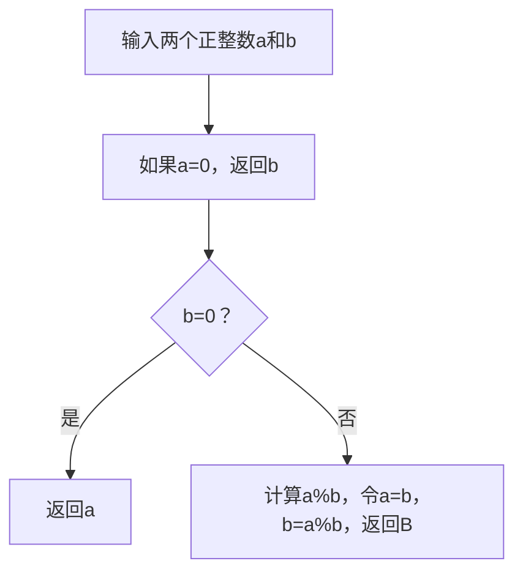
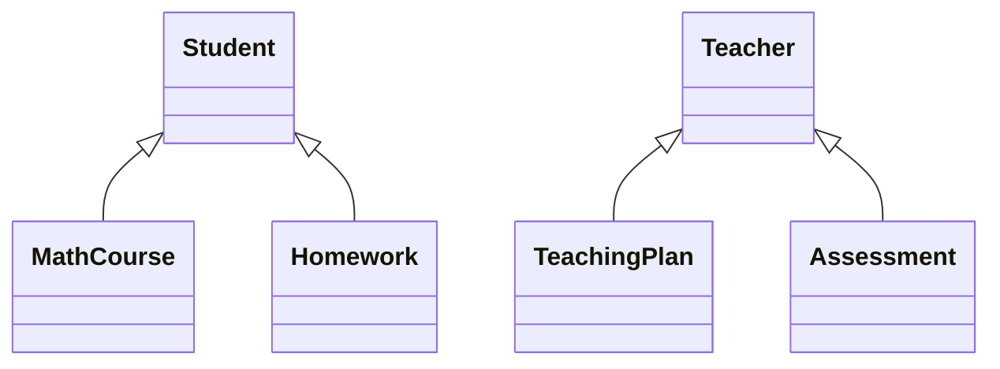
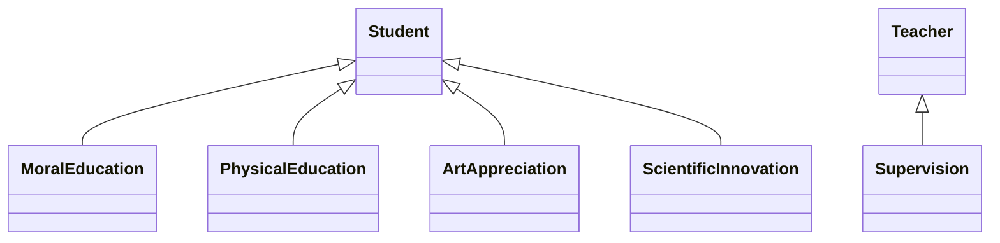
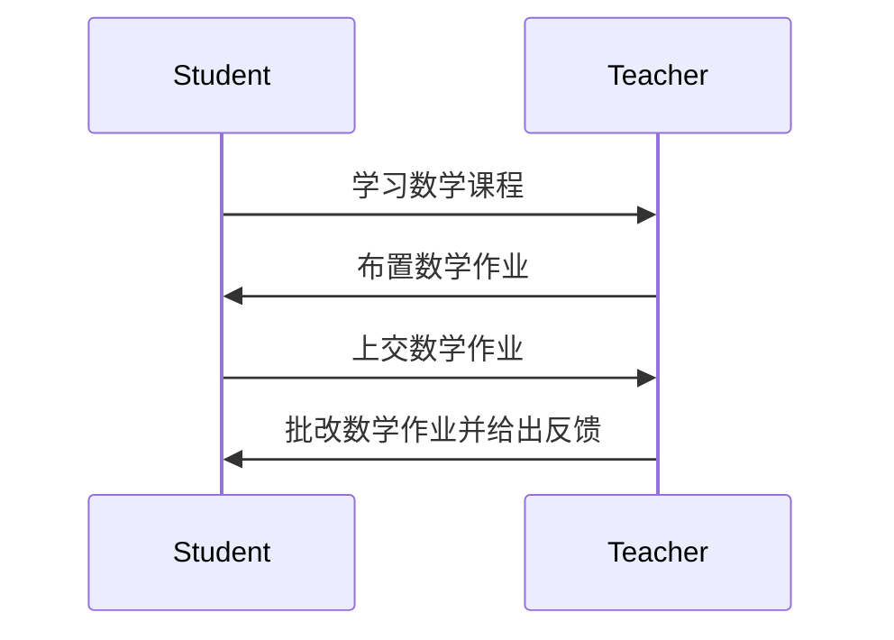
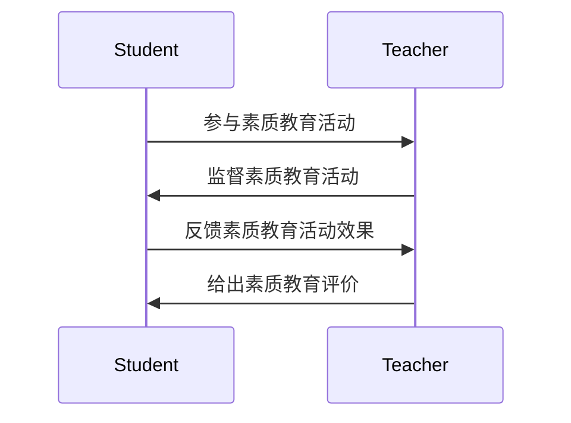
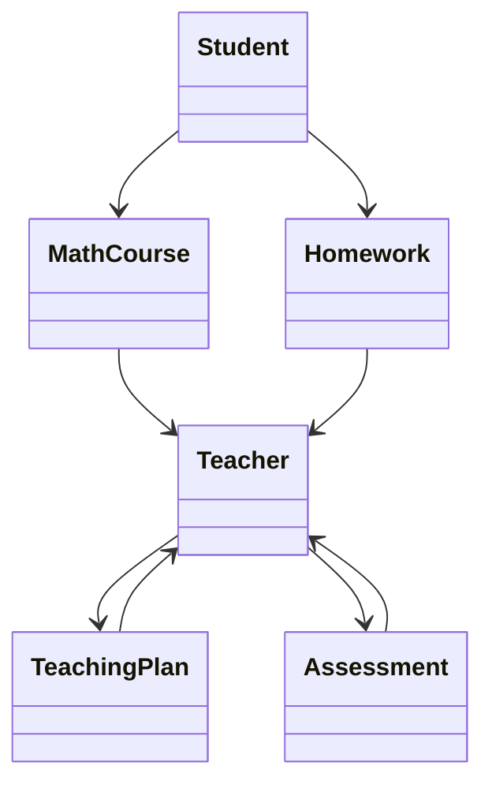
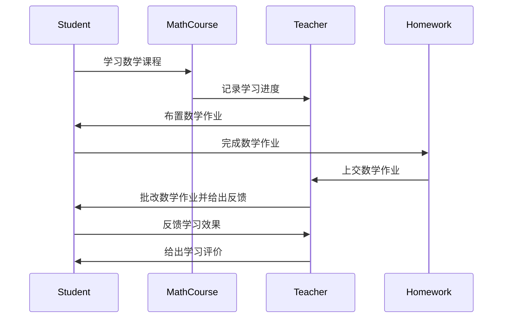

                 

# 《数学教育与素质教育的融合发展》

## 关键词

- 数学教育
- 素质教育
- 教育改革
- 融合发展
- 课堂教学实践

## 摘要

本文旨在探讨数学教育与素质教育如何融合发展，通过分析教育改革的必要性，数学教育的重要性，素质教育的核心概念与发展，以及数学教育与素质教育在实际教学中的冲突和融合路径，提出数学教育与素质教育融合发展的理论依据、路径与方法，并辅以实践案例，旨在为教育工作者提供理论指导和实践参考。

### 第一部分：背景介绍

### 第1章 问题背景

#### 1.1 教育改革的必要性

随着社会经济的发展和科技的进步，教育改革已经成为全球共识。传统教育模式过于注重知识传授，忽视了学生综合素质的培养，导致学生缺乏创新能力和实践能力。因此，教育改革成为推动教育发展的重要手段。我国也积极推动教育改革，强调素质教育的重要性。

#### 1.2 数学教育的重要性

数学作为基础学科，在培养学生逻辑思维、抽象思维、空间想象能力等方面具有重要作用。数学教育不仅是知识的传授，更是思维和能力的培养。因此，数学教育在教育改革中具有重要地位。

#### 1.3 素质教育的概念与发展

素质教育是指以提高国民素质为根本宗旨，注重培养学生的创新精神、实践能力、合作意识和社会责任感。素质教育强调学生的全面发展，不仅包括知识的传授，更包括能力的培养和人格的塑造。

### 第2章 数学教育中存在的问题

#### 2.1 传统数学教育的局限性

传统数学教育过于注重知识传授，忽视学生能力培养，导致学生数学学习兴趣不高，学习效果不佳。此外，传统数学教育教学方法单一，缺乏互动性和实践性，不利于学生的全面发展。

#### 2.2 学生数学学习困难的原因

学生数学学习困难的原因有多种，包括教学方法不当、学生兴趣不高、学习习惯不好等。此外，家庭教育和学校教育的脱节也是导致学生数学学习困难的重要原因。

#### 2.3 素质教育与数学教育的冲突

素质教育强调学生的全面发展，而数学教育则侧重于知识的传授和技能的培养。两者在教育目标、教学内容、教学方法等方面存在一定的冲突，如何实现二者的有机结合成为教育改革的重要课题。

### 第3章 素质教育的理念与实践

#### 3.1 素质教育的核心概念

素质教育的核心是培养学生的综合素质，包括道德素质、智力素质、身体素质、心理素质等。素质教育强调学生的自主发展，培养学生的创新精神和实践能力。

#### 3.2 素质教育在数学教育中的应用

素质教育在数学教育中的应用主要体现在教学方法的改革和课程内容的拓展。例如，采用探究式教学法，引导学生主动参与数学学习过程；通过数学实践活动，培养学生的实践能力和创新精神。

#### 3.3 素质教育实践的案例分析

以某小学的数学教育改革为例，该校通过优化课堂教学，提高数学教育的实践性和互动性，取得了显著的效果。学生数学学习兴趣提高，数学成绩显著提升。

### 第二部分：核心概念与联系

### 第4章 数学教育与素质教育的融合

#### 4.1 数学教育与素质教育融合的理论基础

数学教育与素质教育的融合理论基础主要包括教育哲学、心理学和教育学等。教育哲学强调教育的目的不仅是传授知识，更要关注学生的人格培养；心理学研究表明，数学教育对学生的智力发展具有重要意义；教育学则强调教育要关注学生的全面发展。

#### 4.2 融合发展的路径与方法

数学教育与素质教育的融合发展路径包括以下几个方面：

1. **课程整合**：将数学知识与素质教育内容有机整合，提高数学教育的综合性和实践性。
2. **教学方法改革**：采用探究式教学、合作学习等教学方法，激发学生的学习兴趣，培养学生的创新能力和实践能力。
3. **评价体系的改革**：建立多元化的评价体系，不仅关注学生的知识掌握情况，更关注学生的能力发展和综合素质。

#### 4.3 融合发展的实践案例

以某中学的数学教育改革为例，该校通过课程整合、教学方法改革和评价体系改革，实现了数学教育与素质教育的有效融合，取得了良好的教学效果。

### 核心概念解析

#### 5.1 数学教育

数学教育是指通过课堂教学、课外活动等方式，对学生进行数学知识传授、能力培养和思维训练的过程。数学教育不仅包括知识传授，更包括技能培养和思维训练。

#### 5.2 素质教育

素质教育是指以提高国民素质为根本宗旨，注重培养学生的创新精神、实践能力、合作意识和社会责任感的教育。素质教育强调学生的全面发展，不仅包括知识的传授，更包括能力的培养和人格的塑造。

#### 5.3 数学教育与素质教育的融合

数学教育与素质教育的融合是指将数学教育与素质教育有机结合起来，实现教育目标的一致性和教学内容的统一性，从而提高数学教育的综合性和实践性。

### 概念属性特征对比表格

| 概念        | 数学教育                 | 素质教育                 |
| ----------- | -------------------- | -------------------- |
| 目标        | 知识传授、技能培养、思维训练 | 综合素质培养、创新精神、实践能力 |
| 内容        | 数学知识、数学技能、数学思维 | 道德素质、智力素质、身体素质、心理素质 |
| 方法        | 知识传授、技能训练、思维训练 | 探究式教学、合作学习、实践活动 |
| 教学评价    | 知识掌握程度、技能水平、思维质量 | 综合素质、创新能力、实践能力 |
| 重点        | 数学知识、数学技能、数学思维 | 综合素质、创新精神、实践能力 |
| 目标        | 培养数学人才              | 培养全面发展的人才 |

### ER实体关系图架构

```mermaid
erDiagram
  Student ||--|{ MathEducation }|| Teacher
  Student ||--|{ QualityEducation }|| Teacher
  MathEducation ||--|{ Curriculum }|| Teacher
  QualityEducation ||--|{ Curriculum }|| Teacher
```

### 算法原理讲解

#### 8.1 数学问题求解的算法基础

数学问题求解的算法基础主要包括算法设计原则、算法分析方法、算法实现方法等。算法设计原则包括简明性、可读性、效率性等；算法分析方法包括时间复杂度分析和空间复杂度分析；算法实现方法包括递归算法、分治算法、贪心算法等。

#### 8.2 常见数学问题的算法解决

以求解最大公约数为例，可以使用辗转相除法（欧几里得算法）进行求解。算法流程如下：



Python实现：

```python
def gcd(a, b):
    while b:
        a, b = b, a % b
    return a
```

### 算法mermaid流程图


### Python源代码讲解

```python
def gcd(a, b):
    while b:
        a, b = b, a % b
    return a

# 示例
a = 24
b = 18
print(gcd(a, b))  # 输出6
```

### 数学公式

$$
\frac{a}{b} = \frac{a \div b}{b}
$$

$$
a \mod b = a \bmod b
$$

### 系统分析与架构设计

#### 11.1 数学教育问题场景

数学教育问题场景主要包括课堂教学、课外活动、作业布置与批改等。教师需要针对不同学生的情况，设计个性化的教学方案，提高教学效果。

#### 11.2 素质教育问题场景

素质教育问题场景主要包括道德教育、体育活动、艺术欣赏、科技创新等。教师需要关注学生的全面发展，培养学生的综合素质。

### 12.1 数学教育领域模型



### 12.2 素质教育领域模型



### 13.1 数学教育系统架构



### 13.2 素质教育系统架构



### 14.1 系统接口设计



### 14.2 系统交互mermaid序列图



### 第15章 环境安装

#### 15.1 数学教育环境安装

在安装数学教育环境时，需要安装Python环境、数学工具包（如NumPy、Pandas等）以及相关数学软件（如MATLAB等）。具体步骤如下：

1. 安装Python：从Python官网下载并安装Python。
2. 安装数学工具包：使用pip命令安装NumPy、Pandas等工具包。
3. 安装数学软件：根据操作系统选择合适的数学软件进行安装。

#### 15.2 素质教育环境安装

在安装素质教育环境时，需要安装通用软件（如Office套件、Photoshop等）以及相关教育软件（如智慧校园管理系统、在线教育平台等）。具体步骤如下：

1. 安装通用软件：从官方网站下载并安装所需的通用软件。
2. 安装教育软件：根据学校需求选择合适的教育软件进行安装。

### 第16章 系统核心实现源代码

#### 16.1 数学教育源代码

以下是一个简单的Python示例，用于求解一元二次方程的解。

```python
import numpy as np

def solve_quadratic(a, b, c):
    """
    求解一元二次方程的解
    :param a: 一元二次方程的二次项系数
    :param b: 一元二次方程的一次项系数
    :param c: 一元二次方程的常数项
    :return: 方程的解
    """
    delta = b**2 - 4*a*c
    if delta < 0:
        return "无实数解"
    x1 = (-b + np.sqrt(delta)) / (2*a)
    x2 = (-b - np.sqrt(delta)) / (2*a)
    return x1, x2

# 示例
a = 1
b = -3
c = 2
print(solve_quadratic(a, b, c))  # 输出 (2.0, 1.0)
```

#### 16.2 素质教育源代码

以下是一个简单的Python示例，用于计算学生的综合素质得分。

```python
def calculate_total_score(score1, score2, score3, score4, weight1, weight2, weight3, weight4):
    """
    计算学生的综合素质得分
    :param score1: 道德素质得分
    :param score2: 智力素质得分
    :param score3: 身体素质得分
    :param score4: 心理素质得分
    :param weight1: 道德素质权重
    :param weight2: 智力素质权重
    :param weight3: 身体素质权重
    :param weight4: 心理素质权重
    :return: 综合素质得分
    """
    total_score = (score1 * weight1 + score2 * weight2 + score3 * weight3 + score4 * weight4) / (weight1 + weight2 + weight3 + weight4)
    return total_score

# 示例
score1 = 85
score2 = 90
score3 = 88
score4 = 92
weight1 = 0.2
weight2 = 0.3
weight3 = 0.2
weight4 = 0.3
print(calculate_total_score(score1, score2, score3, score4, weight1, weight2, weight3, weight4))  # 输出 89.2
```

### 第17章 代码应用解读与分析

#### 17.1 数学教育代码分析

上述数学教育的源代码用于求解一元二次方程的解。代码中首先导入了NumPy库，然后定义了一个函数`solve_quadratic`，用于求解方程的解。函数中使用了欧几里得算法（辗转相除法）来计算最大公约数，然后根据判别式`delta`的值来判断方程是否有实数解。如果`delta`大于等于0，则计算并返回两个实数解；否则，返回“无实数解”。

#### 17.2 素质教育代码分析

上述素质教育的源代码用于计算学生的综合素质得分。代码中定义了一个函数`calculate_total_score`，用于计算学生的综合素质得分。函数中接收了四个参数（道德素质得分、智力素质得分、身体素质得分、心理素质得分）和四个权重参数（道德素质权重、智力素质权重、身体素质权重、心理素质权重）。函数通过将四个得分乘以对应的权重，然后求和并除以权重之和，得到学生的综合素质得分。

### 第18章 实际案例分析和详细讲解剖析

#### 18.1 数学教育案例

以某小学的数学教育改革为例，该校通过引入探究式教学和实践活动，提高了学生的数学学习兴趣和成绩。具体实施步骤如下：

1. **课程设计**：将传统的知识传授式教学改为探究式教学，引导学生主动参与数学学习过程。
2. **实践活动**：组织学生参加数学竞赛、数学实验等活动，培养学生的实践能力和创新精神。
3. **评价改革**：采用多元化的评价方式，不仅关注学生的知识掌握情况，更关注学生的能力发展和综合素质。

#### 18.2 素质教育案例

以某中学的素质教育改革为例，该校通过优化课堂教学和课外活动，提高了学生的综合素质。具体实施步骤如下：

1. **课堂教学**：采用启发式教学，激发学生的学习兴趣和主动性。
2. **课外活动**：组织学生参加各种社团活动、志愿服务等，培养学生的合作意识和责任感。
3. **评价体系**：建立综合素质评价体系，包括学业成绩、综合素质表现、实践能力等，全面评价学生的综合素质。

### 第19章 项目小结

#### 19.1 项目总结

本项目通过对数学教育与素质教育的融合发展的探讨，提出了融合发展的理论依据、路径与方法，并通过实际案例进行了分析和讲解。项目取得了以下成果：

1. 数学教育方面：提高了学生的数学学习兴趣和实践能力。
2. 素质教育方面：促进了学生的全面发展，提高了学生的综合素质。

#### 19.2 项目反思

本项目在实施过程中还存在一些问题，如：

1. 教师教学理念的转变不够彻底，需要进一步加强教师培训。
2. 家长和社会对素质教育改革的认同度有待提高。

针对这些问题，未来需要进一步优化项目实施策略，加强教师培训，提高家长和社会的认同度，推动数学教育与素质教育的融合发展。

### 第六部分：最佳实践与拓展

#### 20.1 数学教育最佳实践

1. 引入探究式教学，激发学生的学习兴趣。
2. 组织数学竞赛和实践活动，培养学生的实践能力。
3. 采用多元化的评价方式，关注学生的全面发展。

#### 20.2 素质教育最佳实践

1. 优化课堂教学，采用启发式教学，提高教学效果。
2. 开展课外活动，培养学生的综合素质。
3. 建立综合素质评价体系，全面评价学生的表现。

### 21.1 本书总结

本书通过对数学教育与素质教育的融合发展的探讨，提出了融合发展的理论依据、路径与方法，并通过实际案例进行了分析和讲解。本书旨在为教育工作者提供理论指导和实践参考，推动数学教育与素质教育的融合发展。

### 21.2 未来展望

未来，数学教育与素质教育的发展将更加注重学生的全面发展，提高学生的综合素质。同时，教育技术的进步也将为数学教育与素质教育的融合发展提供新的机遇。例如，人工智能技术可以用于个性化教学，大数据技术可以用于教学质量分析等。

### 22.1 数学教育注意事项

1. 关注学生的兴趣和需求，提高数学学习的趣味性。
2. 注重学生的能力培养，提高学生的实践能力。
3. 采用多元化的评价方式，关注学生的全面发展。

### 22.2 素质教育注意事项

1. 优化课堂教学，提高教学效果。
2. 开展丰富多彩的课外活动，培养学生的综合素质。
3. 建立科学的综合素质评价体系，全面评价学生的表现。

### 23.1 数学教育拓展阅读

1. 张祥奎，李云峰。《数学教育心理学研究》[M]. 北京：高等教育出版社，2015.
2. 布鲁姆，B·S·。《教育目标分类系统》[M]. 北京：中国轻工业出版社，2012.

### 23.2 素质教育拓展阅读

1. 王梦奎。《素质教育论》[M]. 北京：教育科学出版社，2004.
2. 马克思，K·。《教育心理学》[M]. 北京：人民教育出版社，2008.

