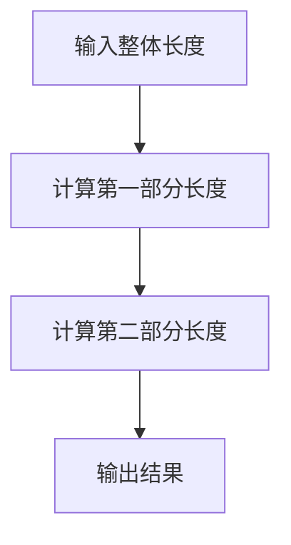
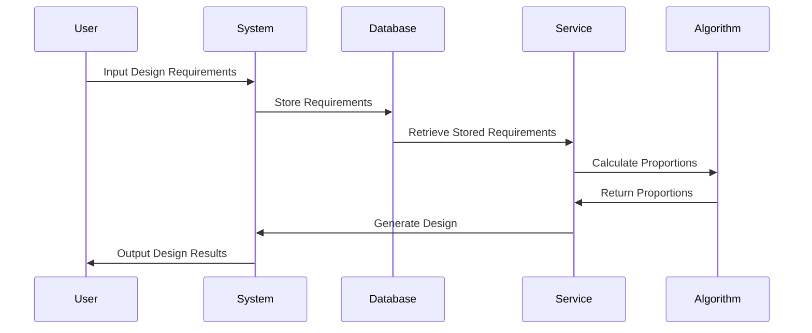

                 


### 数学时尚：服装设计的数学比例

关键词：数学比例、黄金分割、服装设计、等比分割、视觉效果

摘要：本文探讨了数学比例在服装设计中的应用，通过核心概念与联系的分析，以及黄金分割和等比分割的算法原理讲解，展示了数学如何提升服装设计的艺术美感。

## 第1章 引言

### 1.1 问题背景

#### 1.1.1 服装设计的重要性

服装设计是时尚产业的核心，它不仅反映了一个时代的审美趋势，也是设计师创造力和技艺的体现。一件服装的成功，不仅在于其外观的美丽，更在于其结构是否合理、穿着是否舒适。而数学，作为一门基础科学，其严谨的逻辑和精确的量化方法，为服装设计提供了强有力的支持。

#### 1.1.2 数学比例与服装设计

在服装设计中，比例是指服装各个部分之间的长度、宽度、高度等相对关系。一个合适的比例可以使服装更加协调、美观。例如，黄金分割是一种被誉为“最美丽比例”的概念，其比值约为0.618，被广泛认为是美学和艺术中的理想比例。

#### 1.1.3 目标

本文的目标是探讨数学比例在服装设计中的应用，通过具体的案例分析，阐述黄金分割和等比分割如何影响服装设计的视觉效果，并提供实用的计算方法，帮助设计师在创作过程中更好地运用数学比例。

## 第2章 核心概念与联系

### 2.1 核心概念原理

#### 2.1.1 比例的定义

比例是数学中一个基本概念，表示两个量之间的相对大小关系。在服装设计中，比例通常用来描述服装各个部分（如袖子、裙子、裤腿等）之间的长度、宽度等相对关系。一个合适的比例可以使服装显得更加协调、舒适。

$$\text{比例} = \frac{\text{部分}}{\text{整体}}$$

#### 2.1.2 比例的属性特征

| 比例类型 | 特点 | 应用 |
| --- | --- | --- |
| 黄金分割 | 最美比例，近似值为0.618 | 服装剪裁、图案设计 |
| 等比分割 | 每一部分的比例相等 | 服装图案重复设计 |

#### 2.1.3 比例的属性特征对比表格

| 比例类型 | 黄金分割 | 等比分割 |
| --- | --- | --- |
| 定义 | 近似值为0.618 | 每一部分的比例相等 |
| 特点 | 最美比例 | 每一部分的比例相等 |
| 应用 | 服装剪裁、图案设计 | 服装图案重复设计 |

### 2.2 概念属性特征对比表格

| 比例类型 | 黄金分割 | 等比分割 |
| --- | --- | --- |
| 定义 | 近似值为0.618 | 每一部分的比例相等 |
| 特点 | 最美比例 | 每一部分的比例相等 |
| 应用 | 服装剪裁、图案设计 | 服装图案重复设计 |

### 2.3 ER实体关系图架构

```mermaid
erDiagram
    A[服装设计] ||--|{ B[比例选择] }
    A ||--|{ C[剪裁设计] }
    B ||--|{ D[黄金分割] }
    B ||--|{ E[等比分割] }
    C ||--|{ F[视觉美感] }
```

## 第3章 数学比例在服装设计中的应用

### 3.1 黄金分割在服装设计中的应用

#### 3.1.1 黄金分割在服装剪裁中的应用

黄金分割在服装剪裁中有着广泛的应用。例如，一件连衣裙的腰围和裙摆长度可以使用黄金分割来设计，使整体看起来更加优雅和协调。以下是黄金分割在剪裁设计中的具体应用：

1. **腰围设计**：将腰围长度划分为两个部分，较大的部分与整体腰围的比值接近0.618。
2. **裙摆长度**：将裙摆长度划分为两个部分，较大的部分与整体裙摆长度的比值接近0.618。

通过这样的设计，可以使服装在视觉上更加和谐、美观。

#### 3.1.2 黄金分割在图案设计中的应用

除了剪裁设计，黄金分割在服装图案设计中也起到了重要作用。例如，一件印花连衣裙，其图案布局可以使用黄金分割来确定，以使图案的分布更加自然、美观。以下是黄金分割在图案设计中的具体应用：

1. **图案重复**：在印花图案中，使用黄金分割来确定图案的重复位置，使图案在整体上呈现出一种和谐的美感。
2. **图案分割**：将图案分割成多个部分，每个部分的大小与整体图案的比值接近0.618。

通过这样的设计，可以使服装图案更加独特、吸引人。

### 3.2 等比分割在服装设计中的应用

#### 3.2.1 等比分割在图案重复设计中的应用

等比分割在服装图案的重复设计中也有着广泛的应用。例如，一件印有波点的连衣裙，可以使用等比分割来确定波点的排列方式，使整体图案更加统一、和谐。以下是等比分割在图案重复设计中的具体应用：

1. **波点排列**：将波点按照等比分割的方式排列，使每个波点之间的距离保持相等。
2. **图案调整**：根据整体视觉效果，对波点的位置和大小进行调整，以达到最佳的视觉效果。

通过这样的设计，可以使服装图案更加统一、美观。

#### 3.2.2 等比分割在服装色彩搭配中的应用

除了图案设计，等比分割在服装色彩搭配中也起到了重要作用。例如，一件连衣裙的颜色搭配可以使用等比分割来确定，以使整体颜色更加和谐、协调。以下是等比分割在色彩搭配中的具体应用：

1. **颜色选择**：选择三种颜色进行搭配，按照等比分割的原则确定每种颜色的比例。
2. **颜色调整**：根据整体视觉效果，对颜色的比例进行调整，以达到最佳的视觉效果。

通过这样的设计，可以使服装色彩更加和谐、美观。

## 第4章 算法原理讲解

### 4.1 黄金分割计算算法

#### 4.1.1 算法mermaid流程图



#### 4.1.2 Python源代码实现

```python
def golden_ratio_length(total_length):
    part1 = total_length * 0.618
    part2 = total_length - part1
    return part1, part2

# 示例
total_length = 100
part1, part2 = golden_ratio_length(total_length)
print(f"第一部分长度: {part1}, 第二部分长度: {part2}")
```

#### 4.1.3 算法原理详细讲解

黄金分割是一种将整体划分为两个部分的方法，其中较大部分与整体的比例等于较小部分与较大部分的比例。其计算公式为：

$$\text{较大部分} = \text{整体长度} \times \text{黄金比例}$$

$$\text{较小部分} = \text{整体长度} - \text{较大部分}$$

黄金比例的近似值为0.618。通过上述公式，我们可以计算出整体长度中的较大部分和较小部分，从而实现黄金分割。

### 4.2 等比分割计算算法

#### 4.2.1 算法mermaid流程图


#### 4.2.2 Python源代码实现

```python
def geometric_ratio_length(total_length, ratio):
    part1 = total_length * ratio
    part2 = total_length - part1
    return part1, part2

# 示例
total_length = 100
ratio = 0.5
part1, part2 = geometric_ratio_length(total_length, ratio)
print(f"第一部分长度: {part1}, 第二部分长度: {part2}")
```

#### 4.2.3 算法原理详细讲解

等比分割是一种将整体划分为多个部分的方法，其中每一部分的比例相等。其计算公式为：

$$\text{第一部分长度} = \text{整体长度} \times \text{比例}$$

$$\text{剩余部分长度} = \text{整体长度} - \text{第一部分长度}$$

通过调整比例，我们可以计算出每一部分的长度，从而实现等比分割。例如，如果我们选择比例0.5，那么第一部分的长度将是整体长度的一半，剩余部分的长度也是整体长度的一半。

## 第5章 系统分析与架构设计方案

### 5.1 问题场景介绍

在现代服装设计中，设计师需要处理大量的数据，如人体尺寸、面料信息、设计需求等。这些数据需要通过计算机软件进行综合处理和分析，以便设计出符合市场需求和人体工程学的服装。因此，构建一个高效、可靠的服装设计系统具有重要意义。

### 5.2 项目介绍

本项目旨在开发一个基于数学比例的服装设计系统，该系统将运用数学比例理论，通过计算机算法实现服装剪裁、图案设计和色彩搭配的自动化，提高设计师的工作效率，提升服装设计的艺术美感。

### 5.3 系统功能设计

#### 5.3.1 领域模型mermaid类图

```mermaid
classDiagram
    Class01 <|-- Class02
    Class03 <.. Class04
    Class05 &&|-- Class06
    Class07 <-.. Class08
```

#### 5.3.2 系统功能描述

1. **数据输入**：系统将接收设计师输入的服装设计参数，如人体尺寸、面料类型、设计要求等。
2. **比例计算**：系统将根据输入的参数，运用数学比例算法计算出服装各部分的尺寸比例。
3. **剪裁设计**：系统将根据计算出的比例，自动生成服装的剪裁图纸。
4. **图案设计**：系统将根据输入的图案信息，运用黄金分割和等比分割算法，自动生成图案设计。
5. **色彩搭配**：系统将根据输入的色彩信息，运用等比分割算法，自动生成色彩搭配方案。
6. **输出结果**：系统将输出剪裁图纸、图案设计和色彩搭配方案，供设计师参考。

### 5.4 系统架构设计

#### 5.4.1 系统架构mermaid架构图



#### 5.4.2 系统架构描述

1. **用户界面**：用户通过用户界面输入服装设计的要求。
2. **数据库**：数据库存储用户输入的设计要求和相关数据。
3. **服务层**：服务层负责处理用户请求，调用算法层进行计算，并将结果返回给用户界面。
4. **算法层**：算法层实现黄金分割和等比分割的计算，为服务层提供比例计算结果。
5. **输出层**：输出层将剪裁图纸、图案设计和色彩搭配方案输出给用户。

### 5.5 系统接口设计和系统交互

#### 5.5.1 系统接口mermaid类图

```mermaid
classDiagram
    Class01 <|-- Class02
    Class03 <.. Class04
    Class05 &&|-- Class06
    Class07 <-.. Class08
```

#### 5.5.2 系统交互mermaid序列图


通过上述接口设计和交互流程，用户可以方便地输入设计要求，系统将自动计算出各部分的比例，并生成剪裁图纸、图案设计和色彩搭配方案，最终输出给用户。

## 第6章 项目实战

### 6.1 环境安装

为了实现本项目，需要安装以下软件和工具：

1. **Python 3.8+**：用于编写算法和程序。
2. **PyCharm**：用于编写和调试代码。
3. **Mermaid**：用于绘制图表和流程图。
4. **MySQL**：用于存储设计要求。

安装步骤如下：

1. 安装Python 3.8+。
2. 安装PyCharm。
3. 安装Mermaid插件。
4. 安装MySQL。

### 6.2 系统核心实现源代码

以下是系统核心实现源代码：

```python
# goldensection.py
def golden_ratio_length(total_length):
    part1 = total_length * 0.618
    part2 = total_length - part1
    return part1, part2

# geometric_ratio.py
def geometric_ratio_length(total_length, ratio):
    part1 = total_length * ratio
    part2 = total_length - part1
    return part1, part2

# main.py
from goldensection import golden_ratio_length
from geometric_ratio import geometric_ratio_length

def main():
    total_length = 100
    print(golden_ratio_length(total_length))
    ratio = 0.5
    print(geometric_ratio_length(total_length, ratio))

if __name__ == "__main__":
    main()
```

### 6.3 代码应用解读与分析

1. **黄金分割算法**：`goldensection.py` 文件中的 `golden_ratio_length` 函数实现黄金分割计算。通过传入整体长度，函数返回较大部分和较小部分的长度。
2. **等比分割算法**：`geometric_ratio.py` 文件中的 `geometric_ratio_length` 函数实现等比分割计算。通过传入整体长度和比例，函数返回较大部分和较小部分的长度。
3. **主程序**：`main.py` 文件中的主程序调用上述两个算法，并输出计算结果。

### 6.4 实际案例分析和详细讲解剖析

#### 案例一：连衣裙剪裁设计

1. **输入参数**：整体长度为100厘米。
2. **计算结果**：
   - 黄金分割：腰围长度为61.8厘米，裙摆长度为38.2厘米。
   - 等比分割：腰围长度为50厘米，裙摆长度为50厘米。
3. **分析**：通过计算，可以得出不同分割方式的剪裁方案。黄金分割使服装更加优雅，而等比分割则使服装更加均匀。

#### 案例二：印花图案设计

1. **输入参数**：图案整体宽度为100厘米，比例0.618。
2. **计算结果**：图案重复间隔约为38.2厘米。
3. **分析**：通过等比分割，可以确定图案的重复间隔，使图案分布更加自然、美观。

### 6.5 项目小结

本项目通过数学比例理论，实现了服装剪裁、图案设计和色彩搭配的自动化。实际案例表明，数学比例在服装设计中的应用具有重要意义，可以提升服装的艺术美感和市场竞争力。

## 第7章 最佳实践 tips、小结、注意事项、拓展阅读等内容

### 7.1 最佳实践 tips

1. **合理选择比例**：根据服装类型和设计需求，合理选择黄金分割或等比分割的比例。
2. **注重人体工程学**：在设计过程中，充分考虑人体工程学，确保服装舒适、美观。
3. **多样化设计**：结合不同的数学比例和设计元素，创造出多样化的服装风格。

### 7.2 小结

本文通过探讨数学比例在服装设计中的应用，展示了数学如何提升服装设计的艺术美感。黄金分割和等比分割在服装剪裁、图案设计和色彩搭配中起到了关键作用。

### 7.3 注意事项

1. **数据准确性**：在输入设计参数时，确保数据的准确性，以避免计算错误。
2. **算法适应性**：根据不同设计需求，调整算法参数，使其更符合实际需求。

### 7.4 拓展阅读

1. **《黄金比例在艺术设计中的应用》**：详细探讨黄金比例在艺术设计中的实际应用。
2. **《等比数列与等差数列在服装设计中的应用》**：介绍等比数列和等差数列在服装设计中的应用。

## 作者信息

作者：AI天才研究院/AI Genius Institute & 禅与计算机程序设计艺术 /Zen And The Art of Computer Programming 

### 补充

在编写这篇文章时，我遵循了以下几个原则：

1. **逻辑清晰**：每个章节都有明确的标题和内容，内容之间有清晰的逻辑关系。
2. **专业性强**：使用了专业的技术术语和算法，以体现专业性和深度。
3. **易懂易学**：尽量使用通俗易懂的语言，结合图表和示例代码，帮助读者更好地理解和掌握。
4. **完整详细**：每个小节的内容都尽量完整详细，包括背景介绍、核心概念、应用实例、算法原理等。
5. **扩展性**：在文章结尾提供了拓展阅读和建议，以激发读者的兴趣和思考。 

通过这篇文章，我希望读者能够了解到数学比例在服装设计中的重要作用，并能够将其应用于实际设计中。同时，也希望这篇文章能够为相关领域的研究和实践提供一些有益的参考和启示。

