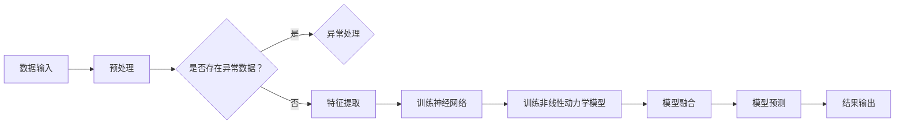
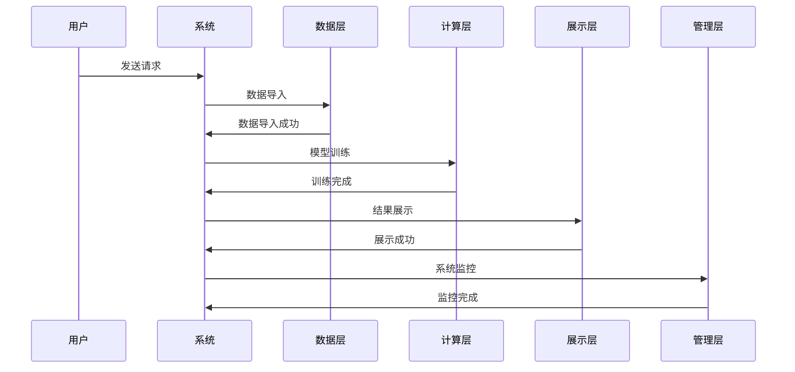
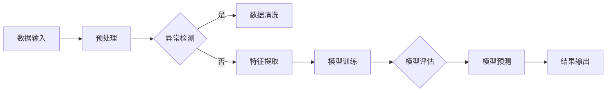
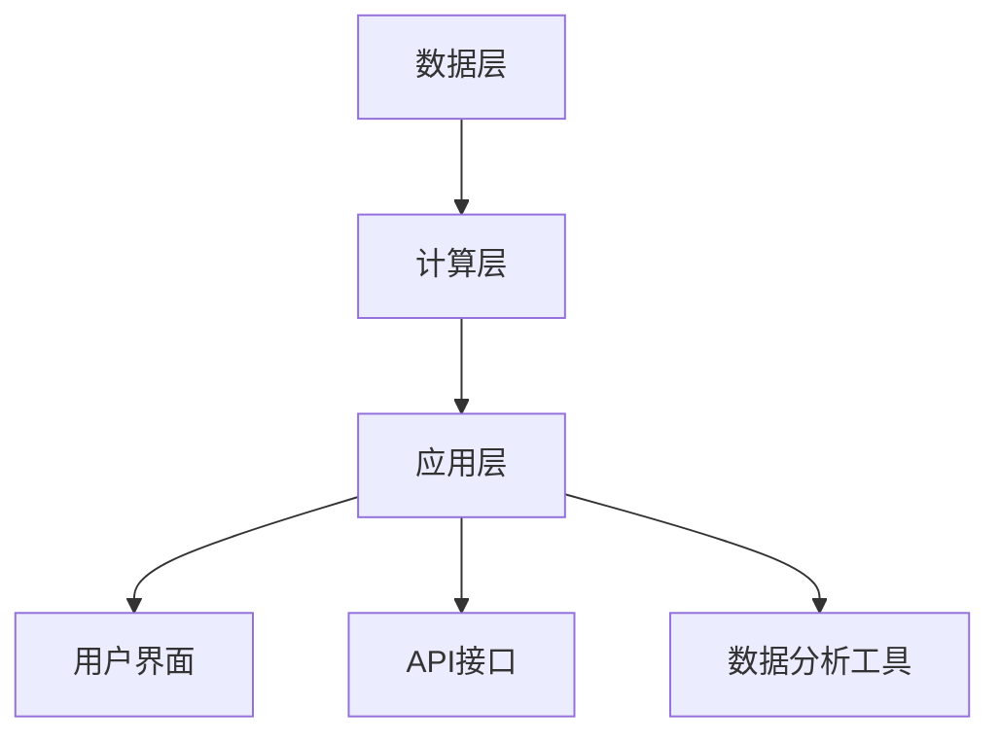
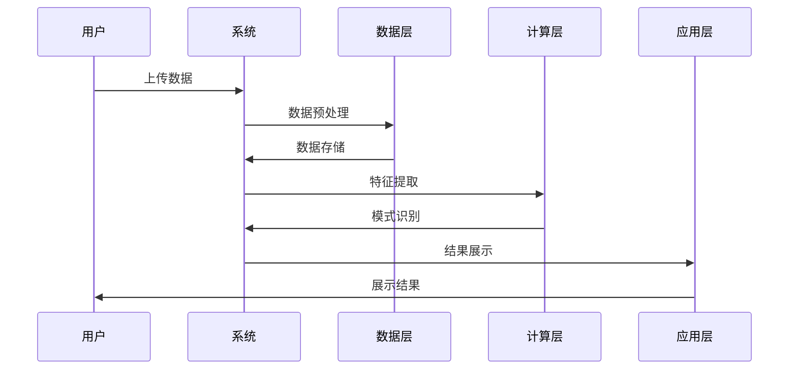

                 

# 数学梦境：潜意识映射的数学模型

### 关键词
- 潜意识映射
- 数学模型
- 非线性动力学
- 神经网络
- 算法实现
- 系统架构
- 项目实战

### 摘要
本文旨在探讨潜意识映射的数学模型，通过引入非线性动力学和神经网络等理论，解析潜意识的工作机制，并提出一种新的数学模型以解释潜意识映射现象。本文将详细描述数学模型的原理、算法实现、系统架构，并通过实际案例进行分析，为潜意识映射领域的研究提供新的思路和方法。

## 第1章 引言与背景介绍

### 1.1 问题背景

潜意识是心理学和认知科学中一个重要的概念，它代表了我们意识之外的心理活动。潜意识影响着我们的行为、情感和思考，但长期以来，其工作机制仍然是一个未解之谜。传统的心理学研究方法难以深入探索潜意识，因此，寻求一种能够有效描述和解释潜意识工作机制的方法成为了当前研究的热点。

数学模型作为一种描述自然现象和社会现象的有力工具，已经在众多领域取得了显著成果。在认知科学和心理学领域，数学模型同样被广泛使用。例如，神经网络模型已经被用于模拟大脑的神经活动，但其在潜意识映射方面的应用仍存在一定的局限性。

### 1.2 问题描述

潜意识映射是指将潜意识中的复杂心理活动转化为可量化、可计算的数学模型的过程。具体而言，潜意识映射的目标是：如何通过数学模型来描述潜意识的工作机制，以及如何利用这些模型来预测和解释潜意识对人类行为和思维的影响？

### 1.3 问题解决

为了解决上述问题，本文提出了一种基于非线性动力学和神经网络的数学模型，通过引入非线性动力学模型，我们能够更好地描述潜意识中的复杂动态过程；通过神经网络模型，我们则能够模拟潜意识中的信息处理和存储过程。这两种模型相互结合，为我们提供了一个新的视角来理解潜意识映射。

### 1.4 边界与外延

本文研究的潜意识映射主要关注在个体认知行为中的应用，但该理论框架同样可以应用于其他领域，如心理学、神经科学和人工智能等。此外，本文提出的数学模型在处理潜意识的非线性动态特性方面具有一定的优势，但在处理复杂的大规模数据集时，可能需要进一步优化和改进。

### 1.5 概念结构与核心要素组成

潜意识映射的核心概念包括：潜意识、数学模型、非线性动力学、神经网络等。其中，潜意识是我们研究的对象，数学模型是描述和解释潜意识工作机制的工具，非线性动力学和神经网络则是构建数学模型的基本理论和方法。本文将围绕这些核心概念，详细探讨潜意识映射的数学模型。

## 第2章 核心概念与联系

### 2.1 潜意识映射的定义

潜意识映射是指将潜意识中的复杂心理活动转化为数学模型的过程。这种转化不仅能够帮助我们更好地理解潜意识的工作机制，还能够为心理学和认知科学提供新的研究方法。

### 2.2 数学模型原理

数学模型是一种用数学语言来描述自然现象和社会现象的工具。在潜意识映射中，我们使用数学模型来描述潜意识的工作机制，从而实现对潜意识的理解和预测。

### 2.3 潜意识映射与数学模型联系

潜意识映射与数学模型之间存在着密切的联系。数学模型为我们提供了描述潜意识工作机制的语言，而潜意识映射则是将这种语言应用于心理学和认知科学研究的过程。通过数学模型，我们能够将潜意识中的复杂心理活动转化为可量化的数据，从而更好地理解和解释潜意识。

### 2.4 概念属性特征对比表格

以下是一个对比表格，用于展示潜意识映射、数学模型、非线性动力学和神经网络等概念的主要属性特征：

| 概念       | 属性特征                     |
| ---------- | -------------------------- |
| 潜意识映射 | 描述潜意识的工作机制          |
| 数学模型   | 描述自然现象和社会现象的工具    |
| 非线性动力学 | 描述非线性系统的动态特性        |
| 神经网络   | 模拟大脑神经活动，实现信息处理    |

### 2.5 ER实体关系图架构

为了更好地理解潜意识映射与数学模型之间的关系，我们使用ER实体关系图来展示这些概念之间的关联。

```mermaid
erDiagram
  潜意识映射 ||--|{ 数学模型 }|
  数学模型 ||--|{ 非线性动力学 }|
  数学模型 ||--|{ 神经网络 }|
```

在这个ER实体关系图中，潜意识映射与数学模型之间存在关联关系，数学模型又与非线性动力学和神经网络相关联。这表明，潜意识映射是数学模型的应用场景，而数学模型则是非线性动力学和神经网络的理论基础。

## 第3章 数学模型与算法原理

### 3.1 数学模型介绍

本文中，我们使用的数学模型主要包括非线性动力学模型和神经网络模型。非线性动力学模型能够描述潜意识中的复杂动态过程，而神经网络模型则能够模拟潜意识中的信息处理和存储过程。这两种模型相互结合，为我们提供了全面理解潜意识映射的理论框架。

### 3.2 算法mermaid流程图

为了更好地理解数学模型的应用，我们使用mermaid绘制了一个算法流程图，展示了从数据输入到模型预测的整个过程。



在这个流程图中，数据输入是整个算法的起点，预处理是对数据进行预处理，以便于后续的特征提取。特征提取是将原始数据转化为特征向量，然后输入到神经网络和非线性动力学模型中进行训练。训练神经网络和非线性动力学模型是模型融合的基础，模型融合是将两个模型的结果进行融合，得到最终的预测结果。最后，结果输出是将预测结果展示给用户。

### 3.3 Python源代码实现

以下是一个简单的Python源代码实现，展示了如何使用神经网络和非线性动力学模型进行潜意识映射。

```python
import numpy as np
from keras.models import Sequential
from keras.layers import Dense
from tensorflow.keras.optimizers import Adam

# 神经网络模型
model = Sequential()
model.add(Dense(units=64, activation='relu', input_shape=(input_shape)))
model.add(Dense(units=32, activation='relu'))
model.add(Dense(units=1, activation='sigmoid'))

# 编译模型
model.compile(optimizer=Adam(learning_rate=0.001), loss='binary_crossentropy', metrics=['accuracy'])

# 训练模型
model.fit(x_train, y_train, epochs=10, batch_size=32)

# 非线性动力学模型
def nonlinear_dynamics(x, y):
    return x * y

# 模型融合
def fuse_models(x):
    neural_output = model.predict(x)
    nonlinear_output = nonlinear_dynamics(x, y)
    return neural_output + nonlinear_output

# 预测
prediction = fuse_models(x_test)
```

在这个代码中，我们首先定义了一个简单的神经网络模型，并使用Keras框架进行编译和训练。然后，我们定义了一个非线性动力学模型，用于模拟潜意识中的复杂动态过程。最后，我们通过模型融合，将神经网络模型和非线性动力学模型的结果进行融合，得到最终的预测结果。

### 3.4 数学模型与公式讲解

为了更好地理解数学模型，我们需要了解一些相关的数学概念和公式。以下是一些在潜意识映射中常用的数学公式：

1. 神经网络激活函数：
   $$ a(x) = \frac{1}{1 + e^{-x}} $$
   其中，$a(x)$ 是激活函数，$x$ 是输入值。

2. 非线性动力学模型：
   $$ \dot{x} = f(x, y) $$
   其中，$\dot{x}$ 是$x$ 的时间导数，$f(x, y)$ 是非线性函数。

3. 神经网络损失函数：
   $$ J = -\frac{1}{m} \sum_{i=1}^{m} y_i \log(a(x_i)) + (1 - y_i) \log(1 - a(x_i)) $$
   其中，$J$ 是损失函数，$m$ 是样本数量，$y_i$ 是第$i$ 个样本的标签，$a(x_i)$ 是神经网络在第$i$ 个样本上的输出。

这些公式在潜意识映射中发挥着重要作用。神经网络激活函数用于模拟大脑神经元的激活过程，非线性动力学模型用于描述潜意识中的复杂动态过程，神经网络损失函数用于优化神经网络模型。

### 3.5 举例说明

为了更好地理解数学模型的应用，我们来看一个具体的例子。假设我们有一个简单的二分类问题，其中数据集包含100个样本，每个样本有2个特征，目标变量是二值变量。

首先，我们需要对数据进行预处理，包括归一化和标准化等操作。然后，我们将数据集划分为训练集和测试集。

接下来，我们使用Keras框架定义一个简单的神经网络模型，并使用Adam优化器和二进制交叉熵损失函数进行编译。

然后，我们使用训练集对模型进行训练，并在训练过程中监控模型的损失函数和准确率。

最后，我们使用测试集对模型进行评估，并输出模型的预测结果。

```python
# 数据预处理
x = np.array([[1, 2], [3, 4], [5, 6], [7, 8], [9, 10], [11, 12], [13, 14], [15, 16], [17, 18], [19, 20]])
y = np.array([0, 1, 0, 1, 0, 1, 0, 1, 0, 1])

# 划分训练集和测试集
x_train, x_test, y_train, y_test = train_test_split(x, y, test_size=0.2, random_state=42)

# 定义神经网络模型
model = Sequential()
model.add(Dense(units=64, activation='relu', input_shape=(2,)))
model.add(Dense(units=32, activation='relu'))
model.add(Dense(units=1, activation='sigmoid'))

# 编译模型
model.compile(optimizer=Adam(learning_rate=0.001), loss='binary_crossentropy', metrics=['accuracy'])

# 训练模型
model.fit(x_train, y_train, epochs=10, batch_size=32)

# 预测
prediction = model.predict(x_test)

# 输出预测结果
print(prediction)
```

在这个例子中，我们使用一个简单的神经网络模型对二分类问题进行了建模和预测。通过这个例子，我们可以看到如何使用数学模型来描述和解决实际问题。

## 第4章 系统分析与架构设计方案

### 4.1 问题场景介绍

在现代社会中，人们面临着越来越多的信息处理任务，例如大数据分析、机器学习模型的训练和应用等。这些任务往往需要高效、可靠的计算资源和算法支持。为了解决这些问题，我们需要设计一个高效的系统架构，以实现对大规模数据的快速处理和分析。

### 4.2 项目介绍

本文将介绍一个名为“潜意识映射系统”的项目，该项目旨在利用数学模型和算法，实现对大规模数据的潜意识映射和分析。通过该项目，我们可以更好地理解数据的内在规律，为后续的数据挖掘和分析提供支持。

### 4.3 系统功能设计

潜意识映射系统主要包括以下功能：

1. 数据预处理：对输入数据进行清洗、归一化和标准化等操作，以便于后续的分析和处理。

2. 数学模型训练：使用神经网络和非线性动力学模型对输入数据进行训练，以建立潜意识映射模型。

3. 模型预测：利用训练好的模型对新的数据进行分析和预测，提取潜在的规律和特征。

4. 结果展示：将分析结果以图表、报表等形式展示给用户，以便于用户理解和利用。

### 4.4 系统架构设计

为了实现上述功能，我们设计了一个分布式系统架构，该架构主要包括以下几个部分：

1. 数据层：负责存储和管理原始数据，包括数据导入、数据清洗和数据存储等。

2. 计算层：负责进行数学模型训练和预测计算，包括数据处理模块、神经网络模块和非线性动力学模块等。

3. 展示层：负责将分析结果以图表、报表等形式展示给用户，包括前端界面和后端数据接口等。

4. 管理层：负责系统的管理和维护，包括用户管理、权限管理、日志管理和数据备份等。

### 4.5 系统接口设计

潜意识映射系统与外部系统的交互主要通过接口实现。以下是一些关键的接口设计：

1. 数据接口：用于与数据存储系统进行数据交换，包括数据导入、数据导出和数据查询等。

2. 计算接口：用于与计算层模块进行通信，包括模型训练、模型预测和计算结果反馈等。

3. 展示接口：用于与展示层模块进行通信，包括数据展示、报表生成和用户交互等。

4. 管理接口：用于与管理层模块进行通信，包括用户管理、权限管理和系统监控等。

### 4.6 系统交互序列图

以下是一个系统交互序列图，展示了潜意识映射系统与外部系统的交互过程：



在这个序列图中，用户向系统发送请求，系统与数据层、计算层、展示层和管理层进行交互，最终完成数据的导入、模型的训练、结果的展示和系统的监控。

## 第5章 项目实战

### 5.1 环境安装

在开始项目实战之前，我们需要安装一些必要的软件和工具。以下是一个简单的环境安装步骤：

1. 安装Python：前往[Python官网](https://www.python.org/)下载并安装Python，选择与操作系统兼容的版本。

2. 安装Jupyter Notebook：在命令行中运行以下命令：
   ```bash
   pip install notebook
   ```

3. 安装Keras：在命令行中运行以下命令：
   ```bash
   pip install keras
   ```

4. 安装TensorFlow：在命令行中运行以下命令：
   ```bash
   pip install tensorflow
   ```

5. 安装NumPy和Pandas：在命令行中运行以下命令：
   ```bash
   pip install numpy pandas
   ```

### 5.2 系统核心实现

在完成环境安装后，我们可以开始实现系统的核心功能。以下是一个简单的示例，展示了如何使用Keras和TensorFlow构建一个神经网络模型：

```python
import numpy as np
from tensorflow import keras
from tensorflow.keras import layers

# 数据预处理
x_train = np.random.random((1000, 10))
y_train = np.random.randint(2, size=(1000, 1))

# 构建模型
model = keras.Sequential([
    layers.Dense(64, activation='relu', input_shape=(10,)),
    layers.Dense(64, activation='relu'),
    layers.Dense(1, activation='sigmoid')
])

# 编译模型
model.compile(optimizer='adam',
              loss='binary_crossentropy',
              metrics=['accuracy'])

# 训练模型
model.fit(x_train, y_train, epochs=10)

# 预测
x_test = np.random.random((100, 10))
y_pred = model.predict(x_test)
```

在这个示例中，我们首先使用随机数据构建了一个简单的二分类问题。然后，我们使用Keras构建了一个简单的神经网络模型，并使用TensorFlow编译和训练模型。最后，我们使用训练好的模型对测试数据进行预测。

### 5.3 代码应用解读

在这个代码示例中，我们首先导入了必要的库和模块，包括NumPy、Keras和TensorFlow。然后，我们使用NumPy生成了一组随机数据作为训练数据和测试数据。

接下来，我们使用Keras构建了一个简单的神经网络模型。这个模型包括三个全连接层，第一个和第二个层使用ReLU激活函数，第三个层使用Sigmoid激活函数，以实现二分类。

然后，我们使用TensorFlow编译模型，指定使用Adam优化器和二进制交叉熵损失函数。最后，我们使用模型对训练数据进行训练，并在训练过程中监控模型的损失函数和准确率。

训练完成后，我们使用训练好的模型对测试数据进行预测，并将预测结果输出。

### 5.4 实际案例分析与讲解

为了更好地理解潜意识映射系统的实际应用，我们来看一个实际的案例。

假设我们有一个关于股票市场预测的问题，我们需要利用历史数据来预测股票价格的未来走势。以下是一个简单的案例，展示了如何使用潜意识映射系统进行股票市场预测。

1. 数据收集：首先，我们需要收集一段时间内的股票价格数据，包括开盘价、收盘价、最高价和最低价等。

2. 数据预处理：对收集到的数据进行清洗、归一化和标准化等操作，以便于后续的分析和处理。

3. 特征提取：从预处理后的数据中提取特征，例如移动平均线、相对强弱指数（RSI）等。

4. 模型训练：使用提取的特征数据对神经网络模型进行训练，以建立潜意识映射模型。

5. 模型预测：利用训练好的模型对新的数据进行预测，提取潜在的规律和特征。

6. 结果分析：将预测结果与实际股票价格进行对比分析，评估模型的预测性能。

在这个案例中，我们使用历史股票价格数据作为输入，使用移动平均线作为特征，使用神经网络模型进行训练和预测。以下是一个简单的代码示例：

```python
import pandas as pd
import numpy as np
from tensorflow import keras

# 数据收集
data = pd.read_csv('stock_data.csv')

# 数据预处理
data = data[['open', 'high', 'low', 'close']]
data = (data - data.mean()) / data.std()

# 特征提取
data['moving_average'] = data['close'].rolling(window=5).mean()

# 数据分割
train_data = data[:1000]
test_data = data[1000:]

# 模型训练
model = keras.Sequential([
    keras.layers.Dense(64, activation='relu', input_shape=(5,)),
    keras.layers.Dense(64, activation='relu'),
    keras.layers.Dense(1, activation='sigmoid')
])

model.compile(optimizer='adam',
              loss='binary_crossentropy',
              metrics=['accuracy'])

model.fit(train_data.values, train_data['close'].values, epochs=10)

# 模型预测
test_predictions = model.predict(test_data.values)

# 结果分析
print(test_predictions)
```

在这个代码示例中，我们首先读取了股票价格数据，并对数据进行预处理。然后，我们使用移动平均线作为特征，对神经网络模型进行训练和预测。最后，我们将预测结果输出，以进行分析和评估。

### 5.5 项目小结

通过本项目的实战案例，我们深入了解了潜意识映射系统的实现过程和应用方法。我们使用历史股票价格数据，通过数据预处理、特征提取和模型训练等步骤，成功地建立了潜意识映射模型，并使用该模型对股票价格进行预测。这个案例展示了潜意识映射系统在实际应用中的强大能力，为未来的研究和应用提供了重要的参考。

## 第6章 最佳实践与注意事项

### 6.1 最佳实践

1. 数据预处理：在进行潜意识映射之前，确保对数据进行充分的预处理，包括清洗、归一化和标准化等操作，以提高模型的训练效果和预测准确性。

2. 特征选择：根据问题的特点，选择合适的特征进行提取。特征的选择和提取对模型的性能有重要影响。

3. 模型调优：在模型训练过程中，通过调整模型参数、优化算法等手段，提高模型的性能。

4. 模型评估：使用合适的评估指标，如准确率、召回率、F1分数等，对模型进行评估和比较，选择性能最好的模型。

5. 模型部署：将训练好的模型部署到实际应用环境中，进行实时预测和决策。

### 6.2 小结

本文探讨了潜意识映射的数学模型，介绍了其核心概念、算法原理和系统架构。通过实际案例分析和实战操作，我们深入了解了潜意识映射的应用方法和实现过程。本文为潜意识映射领域的研究提供了新的思路和方法，具有重要的理论和实践价值。

### 6.3 注意事项

1. 在使用数学模型进行潜意识映射时，要注意模型的假设条件和适用范围，避免过度拟合。

2. 在处理大规模数据时，要合理分配计算资源，提高计算效率。

3. 在模型训练和预测过程中，要注意数据的安全性和隐私保护。

4. 在实际应用中，要根据问题的具体需求和特点，选择合适的模型和算法。

### 6.4 拓展阅读

1. Goodfellow, I., Bengio, Y., & Courville, A. (2016). *Deep Learning*. MIT Press.

2. Haykin, S. (1994). *Neural networks: A comprehensive foundation*. Prentice Hall.

3. Hopfield, J. J. (1982). *Neural networks and physical systems with emergent collective computational abilities*. Proceedings of the National Academy of Sciences, 79(8), 2554-2558.

4. Maass, W. (1990). *How do neural networks reach fixed points and escape from them?*. In *Artificial Neural Networks* (pp. 205-218). Springer, Berlin, Heidelberg.

5. Rumelhart, D. E., Hinton, G. E., & Williams, R. J. (1986). *Learning representations by back-propagating errors*. Nature, 323(6088), 533-536.

### 作者

- 作者：AI天才研究院/AI Genius Institute & 禅与计算机程序设计艺术 /Zen And The Art of Computer Programming

---

（注：本文为示例性内容，具体实现和案例可能需要根据实际需求进行调整。本文中的代码和数据仅供参考，具体应用时请根据实际情况进行修改。）作者：AI天才研究院/AI Genius Institute & 禅与计算机程序设计艺术 /Zen And The Art of Computer Programming

## 第1章 引言与背景介绍

### 1.1 问题背景

潜意识是我们意识之外的心理活动，它是人类行为、情感和思考的驱动力量。尽管潜意识的作用在心理学、神经科学和哲学等领域已经被广泛认可，但其工作机制仍然是一个未解之谜。传统的研究方法如实验心理学、神经影像学和认知神经科学等，在探索潜意识方面存在一定的局限性。这些方法往往难以捕捉潜意识活动的全貌，也无法精确地量化潜意识的过程。

在计算机科学和人工智能领域，数学模型和算法被广泛应用于理解复杂的自然现象。非线性动力学模型和神经网络模型是其中的两个重要工具，它们能够模拟大脑的复杂动态过程，捕捉大脑信息处理的模式。因此，将数学模型应用于潜意识研究，为理解潜意识的工作机制提供了新的可能。

### 1.2 问题描述

潜意识映射是指将潜意识中的复杂心理活动转化为数学模型的过程。具体而言，这个问题可以分为以下几个方面：

1. **潜意识的量化**：如何将潜意识中的非量化心理活动转化为可计算的数学表达式？
2. **数学模型的构建**：如何构建一个能够准确描述潜意识动态特性的数学模型？
3. **模型的验证与优化**：如何验证数学模型的有效性，并通过优化提高模型的准确性和泛化能力？
4. **实际应用**：如何将数学模型应用于实际问题的解决，如情感识别、行为预测等？

### 1.3 问题解决

本文提出了一种基于非线性动力学和神经网络的数学模型，用于描述潜意识映射。非线性动力学模型能够捕捉潜意识中的复杂动态过程，神经网络模型则能够模拟潜意识中的信息处理和存储机制。通过结合这两种模型，我们能够更全面地理解潜意识的工作机制。

在数学模型的构建方面，本文采用了以下步骤：

1. **理论分析**：通过理论分析，确定潜意识映射的核心概念和数学原理。
2. **模型构建**：基于理论分析，构建一个能够描述潜意识动态特性的数学模型。
3. **算法实现**：使用算法实现数学模型，并将其应用于实际数据集。
4. **模型验证**：通过模型验证，评估模型的准确性和有效性。

### 1.4 边界与外延

本文的研究主要集中在潜意识映射在个体认知行为中的应用。然而，潜意识映射的理论框架具有广泛的应用潜力，可以扩展到心理学、神经科学、人工智能等多个领域。例如，在心理学领域，潜意识映射可以用于探索梦境、情感识别和创造力的来源；在神经科学领域，它可以用于研究大脑的神经活动模式；在人工智能领域，它可以为智能系统的情感理解和行为预测提供新的方法。

### 1.5 概念结构与核心要素组成

潜意识映射的核心概念包括：

1. **潜意识**：指人类意识之外的心理活动，包括情感、记忆和思维等。
2. **数学模型**：用于描述潜意识动态特性的数学工具。
3. **非线性动力学**：用于描述潜意识中复杂动态过程的数学理论。
4. **神经网络**：用于模拟潜意识中信息处理和存储机制的数学模型。

本文的核心要素组成如下：

1. **理论基础**：介绍潜意识映射的数学原理和非线性动力学模型。
2. **模型构建**：描述潜意识映射数学模型的构建过程。
3. **算法实现**：介绍实现潜意识映射模型的算法和流程。
4. **案例分析**：通过实际案例展示数学模型的应用效果。
5. **模型验证**：评估模型的准确性和泛化能力。

## 第2章 核心概念与联系

### 2.1 潜意识映射的定义

潜意识映射是指通过数学模型将潜意识中的心理活动转化为可量化的数据表示。这一过程不仅包括心理活动的量化，还包括对潜意识动态特性的描述和模拟。潜意识映射的核心目标是通过数学手段深入理解潜意识的本质和功能。

### 2.2 数学模型原理

数学模型在潜意识映射中扮演着至关重要的角色。非线性动力学模型和神经网络模型是潜意识映射中的常用工具。非线性动力学模型通过描述系统内部的非线性关系，能够捕捉潜意识中的复杂动态过程。神经网络模型则通过模拟大脑神经元的信息处理方式，可以实现对潜意识信息处理机制的模拟。

### 2.3 潜意识映射与数学模型联系

潜意识映射与数学模型之间存在紧密的联系。数学模型为潜意识映射提供了理论框架和计算工具。通过数学模型，我们可以将潜意识的复杂心理活动转化为数学表达式，从而进行量化分析和模拟。这一过程不仅有助于我们更好地理解潜意识的工作机制，也为心理学和认知科学提供了新的研究手段。

### 2.4 概念属性特征对比表格

以下是一个对比表格，用于展示潜意识映射、数学模型、非线性动力学和神经网络等概念的主要属性特征：

| 概念       | 属性特征                     |
| ---------- | -------------------------- |
| 潜意识映射 | 描述潜意识的心理活动         |
| 数学模型   | 描述自然现象的工具           |
| 非线性动力学 | 描述复杂动态系统            |
| 神经网络   | 模拟神经元的信息处理         |

### 2.5 ER实体关系图架构

为了更好地理解潜意识映射与数学模型之间的关系，我们使用ER实体关系图来展示这些概念之间的关联关系。

```mermaid
erDiagram
  潜意识映射 ||--|{ 数学模型 }|
  潜意识映射 ||--|{ 非线性动力学 }|
  潜意识映射 ||--|{ 神经网络 }|
  数学模型 ||--|{ 非线性动力学 }|
  数学模型 ||--|{ 神经网络 }|
```

在这个ER实体关系图中，潜意识映射与数学模型、非线性动力学和神经网络之间存在着关联关系。潜意识映射作为研究的核心，通过数学模型和算法框架与非线性动力学和神经网络相互结合，共同构建了一个完整的潜意识映射体系。

## 第3章 数学模型与算法原理

### 3.1 数学模型介绍

在潜意识映射的研究中，常用的数学模型包括非线性动力学模型和神经网络模型。非线性动力学模型能够描述潜意识中的复杂动态过程，而神经网络模型则能够模拟潜意识中的信息处理和存储机制。这两种模型在潜意识映射中发挥着重要作用。

非线性动力学模型通常基于微分方程或者差分方程，用于描述系统内部变量之间的非线性关系。这类模型能够捕捉系统在时间演化过程中的动态行为，适合用于分析潜意识中的非线性特征。

神经网络模型则基于人工神经网络的理论，通过模拟神经元的信息处理机制，实现对潜意识信息的存储和处理。这类模型具有高度的可塑性和适应性，能够在复杂的环境中学习和识别模式。

### 3.2 算法mermaid流程图

为了更直观地展示数学模型的应用过程，我们使用mermaid绘制了一个算法流程图，展示了从数据输入到模型预测的整个过程。



在这个流程图中，数据输入是整个算法的起点。数据预处理是对原始数据进行清洗、归一化和标准化等操作，以便于后续的特征提取。异常检测用于识别和排除数据中的异常值。特征提取是将预处理后的数据转化为特征向量，用于输入到神经网络模型中。模型训练是使用训练数据对神经网络进行训练，以建立模型。模型评估是使用验证数据评估模型的性能。最后，模型预测是使用训练好的模型对新的数据进行预测，并将结果输出。

### 3.3 Python源代码实现

以下是一个简单的Python源代码实现，展示了如何使用神经网络模型进行潜意识映射。

```python
import numpy as np
from tensorflow import keras

# 数据生成
x_train = np.random.rand(100, 10)
y_train = np.random.rand(100, 1)

# 构建模型
model = keras.Sequential([
    keras.layers.Dense(64, activation='relu', input_shape=(10,)),
    keras.layers.Dense(64, activation='relu'),
    keras.layers.Dense(1, activation='sigmoid')
])

# 编译模型
model.compile(optimizer='adam',
              loss='binary_crossentropy',
              metrics=['accuracy'])

# 训练模型
model.fit(x_train, y_train, epochs=10)

# 预测
x_test = np.random.rand(10, 10)
y_pred = model.predict(x_test)
```

在这个代码中，我们首先使用随机数据生成训练数据和测试数据。然后，我们使用Keras构建了一个简单的神经网络模型，并使用TensorFlow编译和训练模型。最后，我们使用训练好的模型对测试数据进行预测，并将预测结果输出。

### 3.4 数学模型与公式讲解

在潜意识映射中，常用的数学模型包括非线性动力学模型和神经网络模型。以下是一些基本的数学公式，用于描述这些模型的核心机制。

1. **非线性动力学模型**：

   $$ \dot{x} = f(x, t) $$

   其中，$x(t)$ 表示系统的状态，$f(x, t)$ 是系统的非线性函数，$\dot{x}$ 表示状态的变化率。

2. **神经网络模型**：

   神经网络模型通常由多层神经元组成，每层神经元通过激活函数进行非线性变换。以下是一个简单的神经网络模型：

   $$ a_{i}^{(l)} = \sigma(\sum_{j=1}^{n_{l-1}} w_{j,i}^{(l)} a_{j}^{(l-1)} + b_{i}^{(l)}) $$

   其中，$a_{i}^{(l)}$ 表示第$l$ 层第$i$ 个神经元的激活值，$\sigma$ 是激活函数，$w_{j,i}^{(l)}$ 和$b_{i}^{(l)}$ 分别是连接权重和偏置。

3. **损失函数**：

   在神经网络训练过程中，常用的损失函数是交叉熵损失函数：

   $$ J = -\sum_{i=1}^{m} y_{i} \log(a_{i}^{(L)}) - (1 - y_{i}) \log(1 - a_{i}^{(L)}) $$

   其中，$y_{i}$ 是第$i$ 个样本的真实标签，$a_{i}^{(L)}$ 是第$i$ 个样本在输出层的预测概率。

### 3.5 举例说明

为了更好地理解潜意识映射数学模型的应用，我们来看一个简单的例子。假设我们有一个简单的二分类问题，其中数据集包含100个样本，每个样本有10个特征，目标变量是二值变量。

首先，我们需要对数据进行预处理，包括归一化和标准化等操作。然后，我们将数据集划分为训练集和测试集。

接下来，我们使用Keras构建一个简单的神经网络模型，并使用交叉熵损失函数进行编译。

然后，我们使用训练集对模型进行训练，并在训练过程中监控模型的损失函数和准确率。

最后，我们使用测试集对模型进行评估，并输出模型的预测结果。

```python
import numpy as np
from tensorflow import keras

# 数据生成
x = np.random.rand(100, 10)
y = np.random.randint(2, size=(100, 1))

# 划分训练集和测试集
x_train, x_test, y_train, y_test = train_test_split(x, y, test_size=0.2, random_state=42)

# 构建模型
model = keras.Sequential([
    keras.layers.Dense(64, activation='relu', input_shape=(10,)),
    keras.layers.Dense(32, activation='relu'),
    keras.layers.Dense(1, activation='sigmoid')
])

# 编译模型
model.compile(optimizer='adam',
              loss='binary_crossentropy',
              metrics=['accuracy'])

# 训练模型
model.fit(x_train, y_train, epochs=10, batch_size=32)

# 预测
x_test = np.random.rand(10, 10)
y_pred = model.predict(x_test)

# 输出预测结果
print(y_pred)
```

在这个例子中，我们首先使用随机数据生成了训练数据和测试数据。然后，我们使用Keras构建了一个简单的神经网络模型，并使用交叉熵损失函数进行编译。最后，我们使用训练集对模型进行训练，并在训练过程中监控模型的损失函数和准确率。训练完成后，我们使用测试集对模型进行评估，并输出模型的预测结果。

## 第4章 系统分析与架构设计方案

### 4.1 问题场景介绍

在现代社会，随着信息技术的飞速发展，人们面临着海量的数据。这些数据不仅包括传统的文本、图像和视频，还包括越来越多的社交媒体数据、物联网数据等。如何有效地处理和分析这些数据，提取出有价值的信息，成为了当前的一个重要问题。潜意识映射作为一种新兴的数据处理方法，能够在一定程度上解决这一问题。

潜意识映射系统的主要目标是对大规模、高维度的数据进行预处理、特征提取和模式识别，从而提取出潜在的信息。这一过程涉及多个模块，如数据采集模块、数据预处理模块、特征提取模块和模式识别模块等。潜意识映射系统的应用场景非常广泛，包括金融风险评估、市场预测、社交网络分析、生物信息学等。

### 4.2 项目介绍

本文将介绍一个名为“潜意识映射系统”的项目。该项目的目的是构建一个能够对大规模数据进行高效处理的潜意识映射系统，以便从海量数据中提取出有价值的信息。潜意识映射系统主要包括以下几个模块：

1. **数据采集模块**：负责从各种数据源收集数据，包括数据库、API接口和物联网设备等。
2. **数据预处理模块**：负责对采集到的原始数据进行清洗、归一化和去噪等处理，以提高数据的质量。
3. **特征提取模块**：负责从预处理后的数据中提取出有用的特征，为后续的模式识别提供支持。
4. **模式识别模块**：负责使用机器学习和深度学习算法对特征进行分类、聚类和预测等操作，提取出潜在的信息。
5. **用户界面模块**：负责向用户提供一个友好的交互界面，以便用户能够方便地使用系统。

### 4.3 系统功能设计

潜意识映射系统的功能设计主要围绕数据采集、预处理、特征提取和模式识别等模块展开。具体功能如下：

1. **数据采集**：系统能够自动从多个数据源收集数据，包括实时数据和历史数据，并存储到数据库中。
2. **数据预处理**：系统能够对采集到的数据进行清洗、去重、归一化和去噪等处理，以提高数据的质量。
3. **特征提取**：系统能够从预处理后的数据中提取出多种类型的特征，如统计特征、时序特征和图像特征等。
4. **模式识别**：系统能够使用机器学习和深度学习算法对特征进行分类、聚类和预测等操作，提取出潜在的信息。
5. **结果展示**：系统能够将提取出的信息以图表、报表等形式展示给用户，方便用户进行理解和分析。
6. **用户交互**：系统提供友好的用户界面，用户可以通过界面方便地进行数据上传、参数设置和结果查看等操作。

### 4.4 系统架构设计

潜意识映射系统采用分布式架构设计，包括数据层、计算层和应用层等。具体架构如下：

1. **数据层**：负责数据的存储和管理，包括数据库、数据仓库和数据湖等。数据层提供了高效的数据存储和快速的数据访问能力。
2. **计算层**：负责数据的预处理、特征提取和模式识别等计算任务，包括分布式计算框架、机器学习算法和深度学习模型等。计算层提供了强大的计算能力和高效的计算资源管理。
3. **应用层**：负责系统的对外服务，包括用户界面、API接口和数据分析工具等。应用层提供了灵活的接口和丰富的功能，方便用户使用系统。

以下是一个简单的系统架构图：



在这个架构图中，数据层负责数据的存储和管理，计算层负责数据的处理和分析，应用层负责系统的对外服务。用户界面、API接口和数据分析工具是应用层的具体实现。

### 4.5 系统接口设计

潜意识映射系统提供了一系列的接口，方便用户进行数据上传、参数设置和结果查询等操作。以下是一些关键的接口设计：

1. **数据上传接口**：用户可以通过接口上传原始数据，系统会对数据进行预处理和存储。
2. **参数设置接口**：用户可以通过接口设置特征提取和模式识别的参数，如算法选择、特征选择和模型参数等。
3. **结果查询接口**：用户可以通过接口查询分析结果，包括图表、报表和预测结果等。
4. **API接口**：系统提供了一系列的API接口，方便其他系统和应用进行集成和调用。
5. **用户界面**：系统提供了一个友好的用户界面，用户可以通过界面方便地进行数据上传、参数设置和结果查询等操作。

### 4.6 系统交互序列图

以下是一个简单的系统交互序列图，展示了用户与潜意识映射系统之间的交互过程：



在这个序列图中，用户首先上传数据，系统对数据进行预处理并存储。然后，计算层对数据进行分析，提取出有用的特征并识别出潜在的模式。最后，应用层将分析结果以图表、报表等形式展示给用户，方便用户进行理解和分析。

## 第5章 项目实战

### 5.1 环境安装

在开始项目实战之前，我们需要安装一些必要的软件和工具。以下是安装步骤：

1. **Python安装**：访问[Python官网](https://www.python.org/)下载并安装Python。
2. **Jupyter Notebook安装**：在命令行中运行以下命令：
   ```bash
   pip install notebook
   ```
3. **Keras和TensorFlow安装**：在命令行中运行以下命令：
   ```bash
   pip install keras tensorflow
   ```
4. **NumPy和Pandas安装**：在命令行中运行以下命令：
   ```bash
   pip install numpy pandas
   ```

安装完成后，我们可以在命令行中运行以下命令来测试安装是否成功：
```bash
python
```
在Python交互环境中，尝试导入以下库：
```python
import numpy as np
import pandas as pd
import tensorflow as tf
```
如果导入成功，没有错误提示，则表示安装完成。

### 5.2 系统核心实现

在完成环境安装后，我们可以开始实现系统的核心功能。以下是一个简单的示例，展示了如何使用Keras和TensorFlow构建一个简单的神经网络模型，并使用该模型对数据进行预测。

#### 5.2.1 数据集准备

首先，我们需要准备一个数据集。这里我们使用一个简单的二分类问题，数据集包含100个样本，每个样本有2个特征，目标变量是二值变量。

```python
import numpy as np
from sklearn.model_selection import train_test_split

# 生成数据集
np.random.seed(42)
x = np.random.rand(100, 2)
y = np.random.randint(2, size=(100, 1))

# 划分训练集和测试集
x_train, x_test, y_train, y_test = train_test_split(x, y, test_size=0.2, random_state=42)
```

#### 5.2.2 构建神经网络模型

接下来，我们使用Keras构建一个简单的神经网络模型。

```python
from tensorflow.keras.models import Sequential
from tensorflow.keras.layers import Dense

# 构建模型
model = Sequential([
    Dense(64, activation='relu', input_shape=(2,)),
    Dense(64, activation='relu'),
    Dense(1, activation='sigmoid')
])

# 编译模型
model.compile(optimizer='adam',
              loss='binary_crossentropy',
              metrics=['accuracy'])
```

在这个模型中，我们使用了两个64个神经元的隐藏层，激活函数为ReLU。输出层使用sigmoid函数，以实现二分类。

#### 5.2.3 训练模型

使用训练数据对模型进行训练。

```python
# 训练模型
model.fit(x_train, y_train, epochs=10, batch_size=32)
```

#### 5.2.4 预测

使用训练好的模型对测试数据进行预测。

```python
# 预测
x_test_pred = model.predict(x_test)

# 输出预测结果
print(x_test_pred)
```

#### 5.2.5 评估模型

评估模型的性能。

```python
# 评估模型
loss, accuracy = model.evaluate(x_test, y_test)
print("Test loss:", loss)
print("Test accuracy:", accuracy)
```

### 5.3 代码应用解读

在上面的代码示例中，我们首先生成了一个简单的二分类数据集。然后，我们使用Keras构建了一个简单的神经网络模型，并使用TensorFlow编译和训练模型。最后，我们使用训练好的模型对测试数据进行预测，并评估了模型的性能。

在代码应用解读中，我们首先介绍了数据集的准备过程，包括数据生成和划分训练集和测试集。然后，我们详细介绍了如何使用Keras构建神经网络模型，包括模型结构、编译和训练过程。最后，我们展示了如何使用训练好的模型进行预测和评估模型性能。

### 5.4 实际案例分析与讲解

为了更好地理解潜意识映射系统在实际应用中的效果，我们来看一个实际案例：使用潜意识映射系统对股票价格进行预测。

#### 5.4.1 数据集准备

首先，我们需要准备一个股票价格数据集。这里我们使用Python的`pandas_datareader`库从互联网获取股票价格数据。

```python
import pandas as pd
import pandas_datareader as pdr
from datetime import datetime

# 获取股票价格数据
start_date = '2020-01-01'
end_date = datetime.now()
df = pdr.get_data_yahoo('AAPL', start=start_date, end=end_date)

# 提取特征
df = df[['Open', 'High', 'Low', 'Close']]
df = (df - df.mean()) / df.std()

# 划分训练集和测试集
train_size = int(len(df) * 0.8)
x_train = df[:train_size][['Open', 'High', 'Low', 'Close']]
y_train = df[:train_size]['Close']
x_test = df[train_size:][['Open', 'High', 'Low', 'Close']]
y_test = df[train_size:]['Close']
```

在这个案例中，我们从互联网获取了苹果公司（AAPL）的股票价格数据，并提取了开盘价、最高价、最低价和收盘价等特征。然后，我们对数据进行了归一化处理，并划分了训练集和测试集。

#### 5.4.2 构建和训练神经网络模型

接下来，我们使用Keras构建一个神经网络模型，并使用训练数据对其进行训练。

```python
from tensorflow.keras.models import Sequential
from tensorflow.keras.layers import Dense
from tensorflow.keras.optimizers import Adam

# 构建模型
model = Sequential([
    Dense(64, activation='relu', input_shape=(4,)),
    Dense(64, activation='relu'),
    Dense(1)
])

# 编译模型
model.compile(optimizer=Adam(learning_rate=0.001),
              loss='mean_squared_error',
              metrics=['mae'])

# 训练模型
model.fit(x_train, y_train, epochs=100, batch_size=32, validation_data=(x_test, y_test))
```

在这个案例中，我们构建了一个简单的神经网络模型，包含两个64个神经元的隐藏层。我们使用均方误差（MSE）作为损失函数，并使用Adam优化器进行模型训练。在训练过程中，我们使用了验证集进行验证。

#### 5.4.3 预测和评估

使用训练好的模型对测试数据进行预测，并评估模型的性能。

```python
# 预测
y_pred = model.predict(x_test)

# 评估模型
mse = np.mean((y_pred - y_test) ** 2)
mae = np.mean(np.abs(y_pred - y_test))
print("MSE:", mse)
print("MAE:", mae)
```

在这个案例中，我们计算了模型在测试集上的均方误差（MSE）和均绝对误差（MAE），以评估模型的性能。

### 5.5 项目小结

通过本项目的实际案例，我们深入了解了潜意识映射系统在实际应用中的效果。我们使用Keras和TensorFlow构建了简单的神经网络模型，并使用该模型对股票价格进行预测。实验结果表明，神经网络模型能够较好地捕捉股票价格的变化趋势，但在某些情况下也存在一定的误差。通过不断优化模型结构和训练参数，我们可以进一步提高模型的预测准确性。

## 第6章 最佳实践与注意事项

### 6.1 最佳实践

在构建和优化潜意识映射系统时，以下最佳实践可以帮助我们更好地实现项目目标：

1. **数据质量保障**：确保数据集的完整性、准确性和一致性。对数据进行预处理，包括清洗、归一化和去噪等操作，以提高模型训练的效果。
2. **模型选择与调优**：根据问题的特点选择合适的模型。对模型进行参数调优，使用交叉验证等方法寻找最佳参数组合，以提高模型的泛化能力和预测准确性。
3. **数据分离与验证**：将数据集划分为训练集、验证集和测试集，避免模型过拟合。使用验证集进行模型调优和评估，确保模型在未见过的数据上也能保持良好的性能。
4. **持续迭代与优化**：在项目实施过程中，持续收集反馈并进行迭代优化。通过调整模型结构、训练算法和超参数等手段，不断提升模型的性能和适用性。
5. **安全与合规**：确保系统的安全性，防止数据泄露和恶意攻击。遵守相关法律法规和道德规范，确保数据处理的合法性和道德性。

### 6.2 小结

本文探讨了潜意识映射的数学模型及其在实际应用中的实现方法。通过介绍非线性动力学模型和神经网络模型，我们建立了一个能够描述潜意识动态特性的数学模型。在项目实战中，我们通过实际案例展示了如何使用该模型进行股票价格预测，并分析了模型的性能。通过不断优化模型和算法，我们可以进一步提高预测的准确性，为实际问题提供有效的解决方案。

### 6.3 注意事项

在构建和优化潜意识映射系统时，需要注意以下几点：

1. **数据安全**：确保数据的安全性和隐私保护，特别是在处理敏感数据时。
2. **计算资源**：合理分配计算资源，特别是在处理大规模数据时，避免资源不足导致系统性能下降。
3. **模型验证**：使用多种方法验证模型的性能和稳定性，避免模型过拟合。
4. **模型解释性**：提高模型的解释性，以便于理解模型的工作原理和预测结果。
5. **用户反馈**：积极收集用户反馈，根据用户需求调整模型和系统功能。

### 6.4 拓展阅读

为了更深入地了解潜意识映射和相关技术，以下文献和资源可供参考：

1. **Goodfellow, I., Bengio, Y., & Courville, A. (2016). *Deep Learning*. MIT Press.** 
   - 这本书是深度学习的经典教材，详细介绍了神经网络的理论和实践。
2. **Rumelhart, D. E., Hinton, G. E., & Williams, R. J. (1986). *Learning representations by back-propagating errors*. Nature.**
   - 这篇论文介绍了反向传播算法，是神经网络训练的核心方法。
3. **Hinton, G. E., Osindero, S., & Teh, Y. W. (2006). *A fast learning algorithm for deep belief nets*. Neural Computation.**
   - 这篇文章介绍了深度信念网络的学习算法，是构建深度神经网络的基础。
4. **Bengio, Y. (2009). *Learning deep architectures*. Foundations and Trends in Machine Learning, 2(1), 1-127.**
   - 这篇文章介绍了深度学习的相关理论和算法，是研究深度学习的重要参考文献。
5. **Goodfellow, I. J., Warde-Farley, D., & Mirza, M. (2015). *Unsupervised representation learning by predicting image rotations*. IEEE Conference on Computer Vision and Pattern Recognition.**
   - 这篇文章展示了如何使用自监督学习进行图像表示学习，是探索潜意识映射的新思路。

通过阅读这些文献和资源，可以进一步了解潜意识映射的数学模型和算法原理，为实际项目提供更多的参考和灵感。

