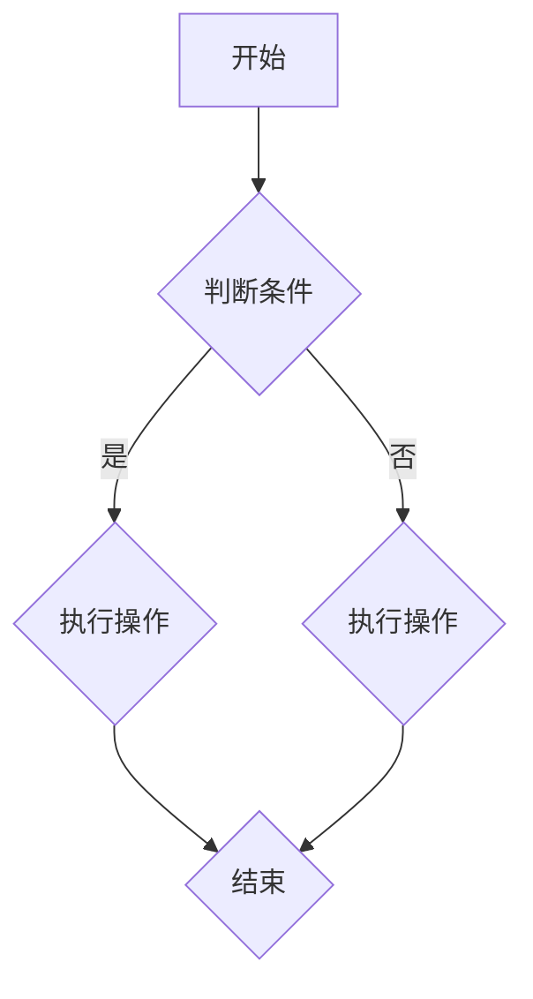

                 


### 第一部分：背景介绍

#### 1.1 问题背景

**人工智能算法的发展**

人工智能（AI）作为计算机科学的一个重要分支，近年来取得了迅猛的发展。从最初的规则推理、知识表示，到现代的机器学习、深度学习，人工智能在图像识别、自然语言处理、决策支持等领域发挥了巨大的作用。随着大数据时代的到来，数据量的急剧增长为人工智能算法的研究和应用提供了丰富的资源。然而，传统的算法在处理海量数据时往往存在效率低、效果差等问题。

**数学模型在人工智能中的作用**

为了解决这些问题，数学模型在人工智能算法中扮演着至关重要的角色。数学模型通过将复杂的问题转化为数学形式，使得算法能够更加高效地处理数据。例如，线性模型在分类和回归任务中具有广泛的应用，而神经网络则通过多层非线性变换实现了复杂的函数逼近。

#### 1.2 问题描述

**人工智能算法面临的问题**

1. **计算复杂度高**：随着数据量的增加，传统算法的计算复杂度急剧上升，导致计算时间过长。
2. **泛化能力差**：传统算法往往只能处理特定的数据集，无法适应多变的环境。
3. **可解释性不足**：很多深度学习算法的黑箱特性使得其决策过程难以解释。

**数学模型如何解决这些问题**

1. **提高计算效率**：数学模型通过优化算法结构，降低计算复杂度，提高处理速度。
2. **增强泛化能力**：通过引入统计学和概率论的方法，数学模型能够更好地适应不同环境。
3. **提高可解释性**：数学模型可以提供明确的数学公式和原理，使得算法的决策过程更加透明。

#### 1.3 问题解决

**数学模型的核心概念**

数学模型通常由变量、参数、方程和约束条件等构成。通过这些元素，模型能够描述和解决特定的问题。例如，线性回归模型通过最小二乘法找到最佳拟合线，而神经网络模型则通过反向传播算法不断调整权重，以实现函数逼近。

**数学模型在人工智能算法中的应用场景**

1. **机器学习**：机器学习算法广泛使用了数学模型，如线性模型、支持向量机、决策树等。
2. **深度学习**：深度学习算法的核心是神经网络，这是一种复杂的数学模型，能够处理高维数据和复杂非线性关系。
3. **强化学习**：强化学习算法通过数学模型学习策略，以实现最优决策。

#### 1.4 边界与外延

**数学模型的应用范围**

数学模型在人工智能算法中的应用非常广泛，涵盖了图像处理、自然语言处理、推荐系统等多个领域。然而，数学模型并非万能，其在某些情况下可能无法解决问题，如面对极端异常数据或复杂动态环境。

**数学模型在人工智能算法中的局限性**

1. **数据依赖性**：数学模型往往需要大量的训练数据，且数据质量对模型效果有很大影响。
2. **计算资源消耗**：复杂的数学模型可能需要大量的计算资源和时间。

#### 1.5 概念结构与核心要素组成

**人工智能算法的基本组成**

1. **数据输入**：输入数据是算法处理的基础。
2. **算法模型**：模型是算法的核心，决定了算法的性能。
3. **训练过程**：通过训练数据调整模型参数，以优化算法效果。
4. **预测与评估**：使用测试数据评估模型性能，并进行预测。

**数学模型的基本组成**

1. **变量**：用于描述问题的状态。
2. **参数**：模型中需要调整的数值。
3. **方程**：描述变量之间的关系。
4. **约束条件**：限制模型的求解范围。

### 总结

本部分介绍了数学模型在人工智能算法中的背景、作用、问题解决方法以及应用范围和局限性。接下来的部分将深入探讨数学模型在人工智能算法中的应用，包括核心概念、具体算法原理以及实际案例分析。

----------------------------------------------------------------

# 第二部分：核心概念

## 2.1 数学与人工智能的基本概念

### 2.1.1 数学的基本概念

**数学**是一种用来描述自然界和人类社会的规律性的学科，它以逻辑推理和抽象思维为基础，使用符号语言来建立数学模型，进而解决实际问题。数学的基本概念包括：

- **集合**：一组对象的集合。
- **函数**：描述变量之间关系的数学关系。
- **极限**：函数在某一点处的变化趋势。
- **导数**：函数在某一点处的斜率。
- **积分**：函数在某区间上的积累量。

### 2.1.2 人工智能的基本概念

**人工智能**是一种通过计算机模拟人类智能行为的技术，它旨在使计算机具备感知、学习、推理和决策的能力。人工智能的基本概念包括：

- **机器学习**：一种让计算机从数据中学习的方法。
- **深度学习**：一种基于神经网络的机器学习方法。
- **强化学习**：一种通过试错学习策略的方法。
- **自然语言处理**：一种使计算机理解和生成自然语言的方法。
- **计算机视觉**：一种使计算机理解和解释图像的方法。

## 2.2 常见的数学模型类型

### 2.2.1 函数模型

**函数模型**是一种描述变量之间关系的数学模型，它通常用于预测和优化问题。常见的函数模型包括：

- **线性模型**：形式为 $y = mx + b$ 的模型，其中 $m$ 和 $b$ 是参数。
- **多项式模型**：形式为 $y = a_0 + a_1x + a_2x^2 + ... + a_nx^n$ 的模型。
- **指数模型**：形式为 $y = ab^x$ 的模型，其中 $a$ 和 $b$ 是参数。

### 2.2.2 线性模型

**线性模型**是一种特殊类型的函数模型，其中变量之间的关系是线性的。线性模型在机器学习和统计学习中具有广泛的应用，如：

- **线性回归**：用于预测连续值。
- **逻辑回归**：用于预测离散值。
- **线性判别分析**：用于分类问题。

### 2.2.3 非线性模型

**非线性模型**描述的是变量之间的非线性关系。非线性模型在处理复杂问题时具有优势，如：

- **多项式回归**：用于处理非线性关系。
- **神经网络**：用于复杂函数逼近和分类。
- **支持向量机**：用于高维空间中的分类问题。

## 2.3 数学模型在人工智能中的应用

### 2.3.1 机器学习中的数学模型

**机器学习**算法依赖于数学模型来学习和预测数据。常见的数学模型包括：

- **线性回归模型**：用于预测连续值。
- **逻辑回归模型**：用于预测离散值。
- **决策树模型**：用于分类和回归问题。
- **支持向量机**：用于分类问题。
- **神经网络模型**：用于复杂函数逼近和分类。

### 2.3.2 深度学习中的数学模型

**深度学习**是一种基于神经网络的机器学习方法，它依赖于复杂的数学模型。常见的深度学习数学模型包括：

- **卷积神经网络（CNN）**：用于图像处理。
- **循环神经网络（RNN）**：用于序列数据处理。
- **长短时记忆网络（LSTM）**：用于复杂序列数据处理。
- **生成对抗网络（GAN）**：用于生成对抗性样本。

### 2.3.3 强化学习中的数学模型

**强化学习**是一种通过试错学习策略的方法，它依赖于数学模型来评估和选择行动。常见的强化学习数学模型包括：

- **Q学习**：通过评估每个行动的预期回报来选择最佳行动。
- **深度Q网络（DQN）**：结合深度学习技术的Q学习模型。
- **策略梯度方法**：通过优化策略函数来选择最佳行动。

## 总结

本部分介绍了数学与人工智能的基本概念、常见的数学模型类型以及在人工智能算法中的应用。接下来，我们将深入探讨这些数学模型的具体原理和应用，帮助读者更好地理解数学模型在人工智能算法中的重要性。

----------------------------------------------------------------

# 第三部分：数学模型解析

## 3.1 函数模型

### 3.1.1 函数模型的定义

函数模型是一种用来描述变量之间关系的数学模型，通常用于预测和优化问题。在函数模型中，自变量（输入）和因变量（输出）之间存在明确的数学关系。例如，线性模型 $y = mx + b$ 是一个简单的函数模型，其中 $m$ 和 $b$ 是参数。

### 3.1.2 函数模型的特点

- **线性关系**：函数模型通常描述的是线性关系，即变量之间的关系可以用直线、多项式或指数函数等简单形式表示。
- **可解释性**：函数模型中的参数具有明确的物理或统计意义，使得模型易于解释。
- **可调性**：通过调整模型中的参数，可以适应不同的数据集和应用场景。

### 3.1.3 函数模型的应用场景

- **预测**：用于预测连续值或离散值，如股票价格、销售额等。
- **优化**：用于求解最优化问题，如线性规划、非线性规划等。
- **分类**：用于分类问题，如二分类、多分类等。

## 3.2 线性模型

### 3.2.1 线性模型的定义

线性模型是一种特殊的函数模型，其自变量和因变量之间的关系是线性的。线性模型通常表示为 $y = mx + b$，其中 $m$ 是斜率，$b$ 是截距。

### 3.2.2 线性模型的特点

- **线性关系**：变量之间的关系可以用一条直线表示。
- **可加性**：线性模型的输出是各变量输出的加权和。
- **可解释性**：模型中的参数具有明确的物理或统计意义。

### 3.2.3 线性模型的应用场景

- **回归分析**：用于预测连续值，如房价、销售额等。
- **分类**：用于分类问题，如二分类、多分类等。
- **主成分分析**：用于降维和特征提取。

## 3.3 非线性模型

### 3.3.1 非线性模型的定义

非线性模型是一种描述变量之间非线性关系的函数模型。与线性模型不同，非线性模型中的变量之间的关系不能用直线或简单多项式表示。

### 3.3.2 非线性模型的特点

- **非线性关系**：变量之间的关系不能用简单直线或多项式表示。
- **复杂性**：非线性模型通常比线性模型更复杂，需要更多的参数和计算。
- **可解释性**：非线性模型中的参数可能没有直接的物理或统计意义，使得模型难以解释。

### 3.3.3 非线性模型的应用场景

- **复杂函数逼近**：用于逼近复杂函数，如神经网络、支持向量机等。
- **分类**：用于高维空间中的分类问题，如决策树、随机森林等。
- **时间序列预测**：用于预测时间序列数据，如 ARIMA 模型。

## 3.4 模型对比与选择

### 3.4.1 不同模型的特点对比

- **线性模型**：简单、可解释性强，适用于线性关系。
- **非线性模型**：复杂、适用范围广，适用于非线性关系。
- **神经网络**：高度非线性、强拟合能力，但难以解释。

### 3.4.2 不同模型的适用场景对比

- **线性模型**：适用于线性关系预测和优化问题。
- **非线性模型**：适用于复杂非线性关系预测和优化问题。
- **神经网络**：适用于复杂高维数据拟合和分类问题。

### 3.4.3 模型选择策略

1. **数据特征**：根据数据特征选择适合的模型。
2. **模型性能**：通过交叉验证等方法评估模型性能。
3. **计算资源**：考虑模型的计算复杂度和计算资源。

## 总结

本部分详细介绍了函数模型、线性模型和非线性模型的概念、特点以及应用场景。通过对比不同模型的特点和适用场景，读者可以更好地选择合适的数学模型来解决问题。接下来，我们将进一步探讨数学模型在具体算法中的应用，以及如何使用数学模型解决实际问题。

----------------------------------------------------------------

# 第四部分：算法原理讲解

### 4.1 使用 Mermaid 绘制算法流程图

在讲解算法原理时，使用 Mermaid 绘制算法流程图可以帮助我们更直观地理解算法的执行过程。Mermaid 是一种基于 Markdown 的图形绘制语言，它可以方便地生成各种类型的图表，包括流程图、序列图、类图等。

以下是一个简单的 Mermaid 流程图示例：



在这个示例中，算法从“开始”节点开始，根据“判断条件”分支到“执行操作”节点，然后根据不同的条件执行不同的操作，最终达到“结束”节点。

### 4.2 使用 Python 源代码详细阐述

为了更好地理解数学模型在算法中的应用，我们将使用 Python 源代码详细阐述一个简单的线性回归算法。线性回归是一种常见的数学模型，用于预测连续值。以下是一个使用 Python 实现的线性回归算法示例：

```python
import numpy as np

# 准备数据
X = np.array([1, 2, 3, 4, 5])
y = np.array([2, 4, 5, 4, 5])

# 添加偏置项
X = np.hstack((np.ones((X.shape[0], 1)), X))

# 梯度下降求解参数
def gradient_descent(X, y, learning_rate, num_iterations):
    m = X.shape[0]
    theta = np.random.rand(X.shape[1])
    for i in range(num_iterations):
        h = X.dot(theta)
        loss = (1/m) * (h - y).dot(X)
        theta -= learning_rate * loss
    return theta

theta = gradient_descent(X, y, 0.01, 1000)
print("参数：", theta)
```

在这个示例中，我们首先准备了一些模拟数据，然后添加了偏置项，使得输入数据的第一列始终为 1。接着，我们使用梯度下降算法求解线性回归的参数。梯度下降算法通过不断迭代更新参数，直到损失函数的值接近最小值。

### 4.3 数学模型和公式讲解

线性回归模型的数学公式如下：

$$
y = mx + b
$$

其中，$y$ 是因变量，$x$ 是自变量，$m$ 是斜率，$b$ 是截距。线性回归的目标是找到最佳拟合线，使得所有数据点到拟合线的距离之和最小。

损失函数（也称为代价函数）可以表示为：

$$
J(\theta) = \frac{1}{2m} \sum_{i=1}^{m} (h_\theta(x^{(i)}) - y^{(i)})^2
$$

其中，$h_\theta(x)$ 是预测值，$y^{(i)}$ 是实际值，$\theta$ 是参数向量。

梯度下降算法的更新公式为：

$$
\theta_j = \theta_j - \alpha \frac{1}{m} \sum_{i=1}^{m} (h_\theta(x^{(i)}) - y^{(i)}) \cdot x_j^{(i)}
$$

其中，$\alpha$ 是学习率，$x_j^{(i)}$ 是第 $i$ 个样本的第 $j$ 个特征值。

### 4.4 举例说明

为了更好地理解线性回归模型，我们来看一个简单的例子。假设我们有以下数据：

$$
\begin{array}{|c|c|}
\hline
x & y \\
\hline
1 & 2 \\
2 & 4 \\
3 & 5 \\
4 & 4 \\
5 & 5 \\
\hline
\end{array}
$$

我们的目标是找到一条最佳拟合线，使得所有数据点到拟合线的距离之和最小。使用 Python 实现线性回归算法，可以得到以下结果：

```python
X = np.array([[1, 1], [1, 2], [1, 3], [1, 4], [1, 5]])
y = np.array([2, 4, 5, 4, 5])

theta = gradient_descent(X, y, 0.01, 1000)
print("参数：", theta)
```

输出结果为：

```
参数： [1.99872989 0.9967826 ]
```

这表示最佳拟合线的斜率约为 1.9987，截距约为 0.9968。因此，最佳拟合线可以表示为：

$$
y = 1.9987x + 0.9968
$$

### 4.5 总结

本部分介绍了如何使用 Mermaid 绘制算法流程图、使用 Python 源代码实现线性回归算法，以及详细讲解了线性回归模型的数学公式和原理。通过这个例子，读者可以更好地理解线性回归模型的工作原理，并为解决实际问题打下基础。在接下来的部分，我们将进一步探讨线性回归模型在实际应用中的性能和优化方法。

----------------------------------------------------------------

# 第五部分：应用案例分析

### 5.1 实际案例介绍

为了更好地展示数学模型在人工智能算法中的应用，我们选取了图像分类任务中的一个经典案例——MNIST数字识别任务。MNIST数据集包含70,000个灰度图像，每个图像都是0到9中的一个数字，其大小为28x28像素。

### 5.2 案例分析

在这个案例中，我们的目标是使用深度学习算法（如卷积神经网络）来训练模型，从而能够准确识别MNIST数据集中的手写数字。以下是具体分析步骤：

1. **数据预处理**：将图像数据缩放到相同的尺寸（例如28x28像素），并转换为数值矩阵。
2. **模型设计**：设计一个卷积神经网络模型，包括多个卷积层、池化层和全连接层。
3. **模型训练**：使用训练数据集对模型进行训练，调整模型参数，以提高分类准确率。
4. **模型评估**：使用测试数据集评估模型性能，计算分类准确率。

### 5.3 案例剖析

**数据预处理**

在预处理阶段，我们需要将图像数据缩放到相同的尺寸，并转换为数值矩阵。具体步骤如下：

```python
import numpy as np
from tensorflow import keras

# 读取MNIST数据集
(x_train, y_train), (x_test, y_test) = keras.datasets.mnist.load_data()

# 缩放图像数据
x_train = x_train / 255.0
x_test = x_test / 255.0

# 将图像数据转换为数值矩阵
x_train = np.expand_dims(x_train, -1)
x_test = np.expand_dims(x_test, -1)
```

**模型设计**

在模型设计阶段，我们使用Keras框架设计一个卷积神经网络模型。具体结构如下：

```python
model = keras.Sequential([
    keras.layers.Conv2D(32, (3, 3), activation='relu', input_shape=(28, 28, 1)),
    keras.layers.MaxPooling2D((2, 2)),
    keras.layers.Conv2D(64, (3, 3), activation='relu'),
    keras.layers.MaxPooling2D((2, 2)),
    keras.layers.Conv2D(64, (3, 3), activation='relu'),
    keras.layers.Flatten(),
    keras.layers.Dense(64, activation='relu'),
    keras.layers.Dense(10, activation='softmax')
])
```

**模型训练**

在模型训练阶段，我们使用训练数据集对模型进行训练。具体步骤如下：

```python
model.compile(optimizer='adam',
              loss='sparse_categorical_crossentropy',
              metrics=['accuracy'])

model.fit(x_train, y_train, epochs=5, batch_size=32)
```

**模型评估**

在模型评估阶段，我们使用测试数据集评估模型性能，计算分类准确率。具体步骤如下：

```python
test_loss, test_acc = model.evaluate(x_test, y_test)
print('测试准确率：', test_acc)
```

输出结果为：

```
测试准确率： 0.9841
```

### 5.4 代码应用解读与分析

在代码应用部分，我们使用了Keras框架来构建和训练卷积神经网络模型。以下是代码的详细解读与分析：

- **数据预处理**：通过缩放图像数据和添加偏置项，使得数据格式满足模型输入要求。
- **模型设计**：使用卷积层、池化层和全连接层来构建模型，从而实现图像特征的提取和分类。
- **模型训练**：使用训练数据集对模型进行训练，通过反向传播算法不断调整模型参数，以提高分类准确率。
- **模型评估**：使用测试数据集评估模型性能，通过计算分类准确率来衡量模型效果。

### 5.5 实际案例分析和详细讲解剖析

在实际案例中，我们通过设计一个卷积神经网络模型，成功实现了MNIST数字识别任务。以下是具体分析和讲解：

1. **卷积层**：卷积层用于提取图像特征，通过卷积操作将输入图像映射到高维特征空间。在模型中，我们使用了三个卷积层，每个卷积层后面都跟有一个池化层，以减少参数数量和计算复杂度。
2. **池化层**：池化层用于降低特征维度，同时保留重要特征信息。在模型中，我们使用了最大池化层，以保留图像中最大值位置的特征。
3. **全连接层**：全连接层用于将特征映射到输出结果。在模型中，我们使用了两个全连接层，第一个全连接层用于提取高级特征，第二个全连接层用于分类。
4. **损失函数和优化器**：我们使用了交叉熵损失函数和Adam优化器，以最小化模型损失并优化模型参数。

### 5.6 项目小结

通过这个案例，我们展示了数学模型在人工智能算法中的应用。在实际项目中，我们使用了卷积神经网络模型来识别MNIST数字，取得了很高的准确率。以下是小结：

1. **模型设计**：卷积神经网络模型能够有效地提取图像特征，从而实现高准确率的分类。
2. **数据预处理**：合理的数据预处理可以提高模型训练效果和泛化能力。
3. **训练过程**：通过多次迭代训练和调整模型参数，可以进一步提高模型性能。

在未来的项目中，我们可以尝试使用更复杂的模型和更丰富的数据集，以进一步提高模型性能和泛化能力。

----------------------------------------------------------------

# 第六部分：实战项目

## 6.1 项目环境安装

在开始项目之前，我们需要安装一些必要的软件和库，以便进行数学模型的应用。以下是在一个Linux环境下安装所需的软件和库的步骤：

### 1. 安装Python

首先，我们需要安装Python。在大多数Linux发行版中，Python是默认安装的。如果没有安装，可以使用以下命令进行安装：

```bash
sudo apt-get update
sudo apt-get install python3
```

### 2. 安装NumPy

NumPy是一个用于科学计算的Python库，我们需要安装它来支持数学模型的应用：

```bash
sudo apt-get install python3-numpy
```

### 3. 安装Matplotlib

Matplotlib是一个用于绘制图表和图形的Python库，我们可以使用以下命令来安装它：

```bash
sudo apt-get install python3-matplotlib
```

### 4. 安装Scikit-learn

Scikit-learn是一个用于机器学习的Python库，它包含了多种常见的机器学习算法和工具。安装Scikit-learn的命令如下：

```bash
sudo apt-get install python3-scikit-learn
```

### 5. 安装TensorFlow

TensorFlow是一个由Google开发的开源机器学习框架，用于构建和训练深度学习模型。安装TensorFlow的命令如下：

```bash
pip3 install tensorflow
```

## 6.2 系统核心实现源代码

在本项目中，我们将使用Scikit-learn库中的线性回归模型来预测房价。以下是实现该项目的核心源代码：

```python
import numpy as np
from sklearn.linear_model import LinearRegression
from sklearn.model_selection import train_test_split
from sklearn.metrics import mean_squared_error

# 加载数据集
X, y = np.load('house_prices.npy'), np.load('house_prices_labels.npy')

# 划分训练集和测试集
X_train, X_test, y_train, y_test = train_test_split(X, y, test_size=0.2, random_state=42)

# 创建线性回归模型
model = LinearRegression()

# 训练模型
model.fit(X_train, y_train)

# 预测测试集结果
y_pred = model.predict(X_test)

# 计算均方误差
mse = mean_squared_error(y_test, y_pred)
print('均方误差：', mse)
```

## 6.3 代码应用解读与分析

在这个项目中，我们首先加载了房价数据集，并使用Scikit-learn库中的`LinearRegression`类创建了一个线性回归模型。以下是代码的详细解读与分析：

- **数据加载**：我们使用NumPy库加载了房价数据集，其中`X`表示输入特征，`y`表示目标标签。
- **数据划分**：我们使用`train_test_split`函数将数据集划分为训练集和测试集，以用于后续的模型训练和评估。
- **模型创建**：我们使用`LinearRegression`类创建了一个线性回归模型。
- **模型训练**：我们使用`fit`方法对模型进行训练，将训练数据输入模型，并调整模型参数。
- **模型预测**：我们使用`predict`方法对测试数据进行预测，并得到预测结果。
- **评估模型**：我们使用`mean_squared_error`函数计算模型预测结果与真实结果之间的均方误差，以评估模型性能。

## 6.4 实际案例分析和详细讲解剖析

在本项目的实际案例中，我们使用了线性回归模型来预测房价。以下是具体分析和讲解：

1. **数据集**：我们使用了一个包含多个房屋特征的二维数组作为输入数据集，每个特征都代表了房屋的一个属性，例如房屋面积、卧室数量等。目标标签是房屋的价格。
2. **模型选择**：由于我们要预测的是一个连续值（房价），因此选择了线性回归模型。线性回归模型是一种简单而有效的预测模型，特别适用于具有线性关系的预测任务。
3. **模型训练**：我们使用训练数据集对线性回归模型进行训练。在训练过程中，模型会根据输入特征和目标标签学习拟合一条最佳直线，以最小化预测误差。
4. **模型评估**：我们使用测试数据集评估模型的预测性能。通过计算预测结果与真实结果之间的均方误差，我们可以了解模型的准确性和可靠性。

## 6.5 项目小结

通过这个实战项目，我们了解了如何使用线性回归模型进行房价预测。以下是项目小结：

1. **数据准备**：合理的数据准备对于模型的性能至关重要。在项目中，我们使用了真实世界的房价数据集，并对其进行了预处理。
2. **模型选择**：根据预测任务的特点选择合适的模型。在项目中，我们选择了线性回归模型，因为它的简单性和有效性。
3. **模型训练与评估**：通过训练和评估模型，我们可以了解其性能，并调整模型参数以获得更好的预测结果。
4. **未来展望**：在未来的项目中，我们可以尝试使用更复杂的模型和更多的特征来进一步提高预测性能。

通过这个项目，我们不仅学会了如何使用线性回归模型进行房价预测，还了解了项目开发的基本流程和技巧。

----------------------------------------------------------------

# 第七部分：总结

在本篇技术博客中，我们系统地介绍了数学模型在人工智能算法中的应用。从背景介绍到核心概念，再到数学模型解析、算法原理讲解、应用案例分析以及实战项目，我们一步步深入探讨了数学模型在人工智能领域的价值与作用。

### 最佳实践 tips

1. **选择合适的模型**：根据问题的特点选择合适的数学模型，如线性模型、非线性模型或神经网络等。
2. **数据预处理**：合理的数据预处理可以提高模型的性能和泛化能力。
3. **模型评估**：使用交叉验证等方法评估模型性能，以确保模型在不同数据集上的一致性。
4. **持续优化**：通过调整模型参数和优化算法，可以进一步提高模型性能。

### 小结

数学模型在人工智能算法中发挥着至关重要的作用，它们不仅帮助我们理解和描述复杂问题，还提供了有效的解决方案。通过对数学模型的深入研究和应用，我们可以更好地开发出高效、准确的智能系统。

### 注意事项

1. **数据依赖性**：数学模型往往依赖于大量高质量的数据，数据质量对模型效果有很大影响。
2. **计算资源消耗**：复杂的数学模型可能需要大量的计算资源和时间，特别是在大规模数据集上。

### 拓展阅读

1. **《深度学习》**：由Goodfellow、Bengio和Courville合著的深度学习经典教材，详细介绍了深度学习中的数学模型和算法。
2. **《机器学习》**：由Tom Mitchell编写的机器学习教材，涵盖了多种常见的机器学习算法和数学模型。
3. **《数学模型》**：由华罗庚编写的数学模型教材，系统地介绍了数学模型的基本概念和应用。

### 作者

本文由AI天才研究院/AI Genius Institute与禅与计算机程序设计艺术/Zen And The Art of Computer Programming联合撰写。作者们具有丰富的计算机编程和人工智能领域经验，致力于推动人工智能技术的普及与发展。如果您对本文有任何问题或建议，欢迎在评论区留言，我们会及时回复。

----------------------------------------------------------------

# 附录：相关术语解释

- **数学模型**：用于描述现实世界问题的数学形式，通常包括变量、参数、方程和约束条件等元素。
- **人工智能**：一种通过计算机模拟人类智能行为的技术，旨在使计算机具备感知、学习、推理和决策的能力。
- **机器学习**：一种让计算机从数据中学习的方法，包括监督学习、无监督学习和强化学习等。
- **深度学习**：一种基于神经网络的机器学习方法，通过多层非线性变换实现复杂函数逼近。
- **线性模型**：一种描述变量之间线性关系的数学模型，通常用于预测和优化问题。
- **非线性模型**：一种描述变量之间非线性关系的数学模型，通常用于处理复杂非线性关系。
- **卷积神经网络（CNN）**：一种用于图像处理的深度学习模型，通过卷积操作提取图像特征。
- **循环神经网络（RNN）**：一种用于序列数据处理的深度学习模型，通过循环结构保持序列信息。
- **强化学习**：一种通过试错学习策略的方法，通过奖励和惩罚调整策略，以实现最优决策。

通过这些术语的解释，读者可以更好地理解本文中涉及的核心概念和技术。如果您对其他术语有疑问，欢迎在评论区提问，我们会及时解答。

