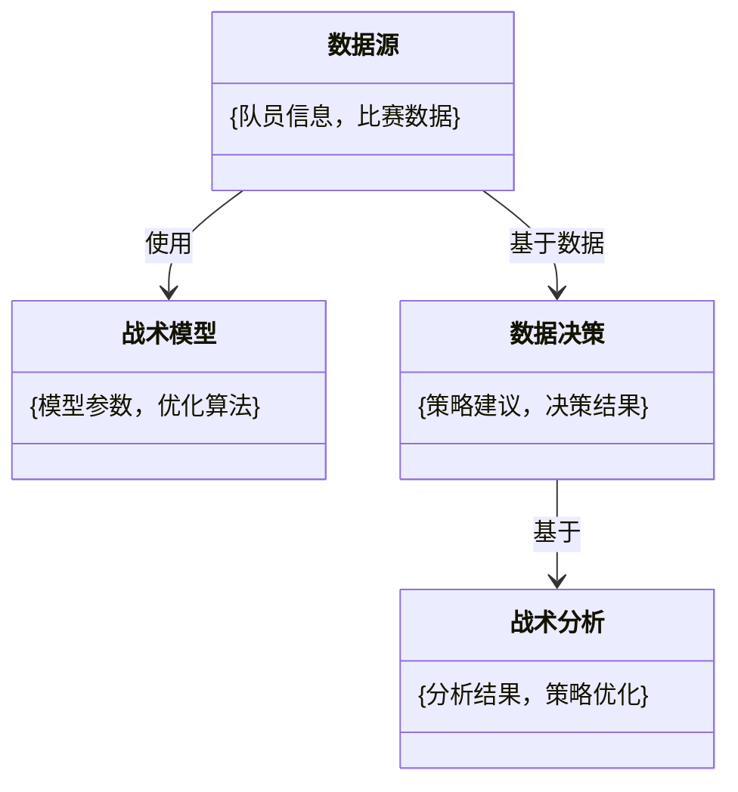
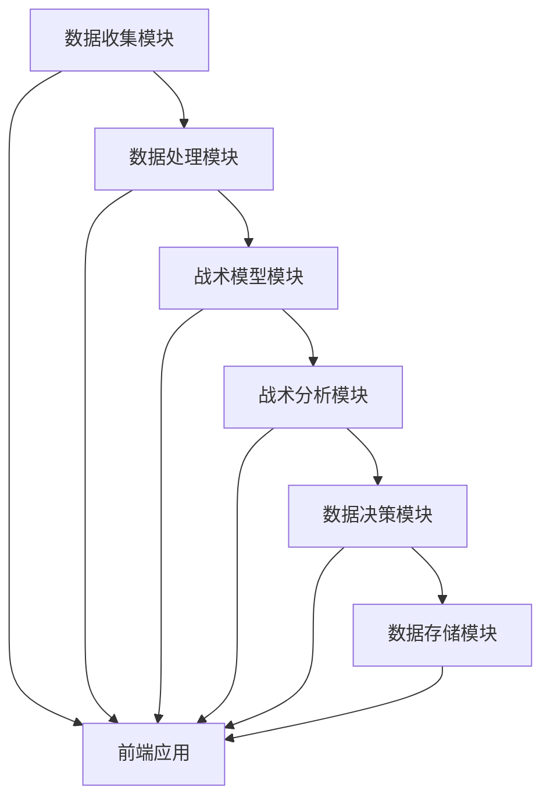

                 


## 摘要

本文深入探讨了数学模型在体育战术分析中的应用。体育战术分析是现代体育竞赛中的重要环节，它帮助运动员和教练从复杂的数据中提取有价值的信息，进而优化比赛策略。数学模型如线性规划、博弈论和概率统计，为体育战术分析提供了强大的工具。本文首先介绍了体育战术分析的需求和挑战，然后详细解释了不同数学模型的基本原理和应用，通过Python代码示例和数学公式进行了举例说明。此外，本文还讨论了系统的架构设计，包括领域模型类图、系统架构设计图和系统接口设计，以展示如何在实际项目中应用这些数学模型。通过本文的阐述，读者可以更好地理解数学模型在体育战术分析中的重要作用，并学会如何构建和运用这些模型来提升比赛表现。关键词：体育战术分析、数学模型、线性规划、博弈论、概率统计、系统架构设计。## 第一部分：背景介绍

在现代体育竞赛中，战术分析的重要性日益凸显。无论是职业运动员还是业余爱好者，战术分析都能帮助他们理解比赛中的动态，提高比赛表现。然而，体育战术分析面临着诸多挑战，如大量比赛数据的处理、战术策略的优化等。这就需要我们借助数学模型来应对这些问题。

### 1.1 问题背景

随着科技的进步，现代体育竞赛变得越来越复杂。运动员和教练需要快速、准确地处理和分析大量的比赛数据，以便从中提取出有价值的信息。这些信息包括对手的比赛风格、队员的状态、比赛场地的变化等。传统的分析方法往往需要大量的人力和时间，而且难以应对数据的复杂性和多样性。

### 1.2 问题描述

体育战术分析的关键在于如何从海量的比赛数据中提取有价值的信息，并将其转化为具体的战术策略。这涉及到以下几个方面：

- **数据收集与处理**：如何有效地收集和整理比赛数据？
- **模型建立**：如何选择合适的数学模型来描述和分析体育战术？
- **策略优化**：如何利用数学模型来优化战术策略，提高比赛表现？

### 1.3 问题解决

数学模型为体育战术分析提供了强有力的工具。通过数学模型，我们可以将复杂的战术问题转化为数学问题，然后利用数学方法进行求解。常见的数学模型包括线性规划、博弈论、概率统计等。

- **线性规划**：用于优化资源分配，如比赛时间的分配、球员位置的安排等。
- **博弈论**：用于分析对手的策略，预测比赛结果，制定相应的战术策略。
- **概率统计**：用于分析比赛中的随机事件，如进球概率、失误率等。

### 1.4 边界与外延

虽然数学模型在体育战术分析中具有广泛的应用，但它们也存在一些局限性。首先，数学模型可能无法完全考虑运动员的个人能力和比赛中的即时变化。其次，模型的应用范围主要限于团队运动，如篮球、足球等。对于个人运动，如乒乓球、游泳等，数学模型的应用可能需要进一步的研究和改进。

### 1.5 概念结构与核心要素组成

体育战术分析涉及多个核心概念和要素。以下是这些概念和要素的简要概述：

- **数学模型**：用于描述和分析体育战术的数学工具。
- **体育战术**：指在比赛中采取的策略和行动，以达成特定目标。
- **数据分析**：指从比赛数据中提取有价值信息的过程。

这些概念和要素相互作用，共同构成了体育战术分析的理论框架。接下来，我们将进一步探讨这些概念和要素的具体应用。

## 第二部分：核心概念与联系

在体育战术分析中，数学模型作为一种强有力的工具，发挥着至关重要的作用。为了更好地理解数学模型在体育战术分析中的应用，我们需要首先了解这些核心概念及其相互联系。

### 2.1 数学模型原理

数学模型是对现实世界问题的抽象和模拟，通过数学语言来描述和分析。在体育战术分析中，数学模型被用来描述比赛中的各种战术行为，如球员的移动、进攻和防守策略等。

#### 数学模型定义

数学模型是对现实世界中的具体问题进行抽象和简化的数学结构。它通过数学公式、方程或图示来描述问题，并提供解决问题的方法和步骤。

#### 数学模型属性特征对比表格

以下是一个简单的数学模型属性特征对比表格，列举了几种常见的数学模型及其特点和应用领域。

| 模型类型 | 特点 | 应用领域 |
| --- | --- | --- |
| 线性规划 | 线性关系 | 赛事资源分配 |
| 博弈论 | 竞争关系 | 战术对抗分析 |
| 概率统计 | 概率分布 | 数据预测与决策 |

- **线性规划**：用于优化线性目标函数，约束条件为线性不等式或等式。主要应用于资源分配、生产计划、人员调度等问题。
- **博弈论**：研究具有竞争关系的决策问题，如博弈、市场竞争等。在体育战术分析中，用于分析对手的策略，预测比赛结果。
- **概率统计**：用于描述和分析随机事件，如进球概率、失误率等。在体育战术分析中，用于预测比赛结果，制定战术策略。

#### 数学模型与体育战术分析的关系

数学模型与体育战术分析之间存在着密切的联系。数学模型为体育战术分析提供了理论基础和工具支持。通过数学模型，我们可以将复杂的战术问题转化为数学问题，然后利用数学方法进行求解。例如，线性规划可以用于优化球员的位置安排，博弈论可以用于分析对手的策略，概率统计可以用于预测比赛结果。

### 2.2 ER实体关系图架构

实体关系图（Entity-Relationship Diagram，ERD）是一种用于描述数据库中实体及其之间关系的图形化工具。在体育战术分析中，ERD可以帮助我们理解不同数据实体之间的关系，从而更好地进行数据分析。

以下是一个简单的ERD，描述了体育战术分析中的几个关键实体及其关系：

```mermaid
erDiagram
  数据源 --> 模型建立 : 使用
  模型建立 --> 战术分析 : 进行
  战术分析 --> 数据决策 : 基于
  数据源 && 数据决策 : {队员信息，比赛数据}
```

- **数据源**：包括队员信息和比赛数据等原始数据。
- **模型建立**：基于数据源建立数学模型，如线性规划模型、博弈论模型等。
- **战术分析**：利用建立的数学模型对体育战术进行分析和优化。
- **数据决策**：根据战术分析结果，制定具体的战术策略。

通过这个ERD，我们可以清楚地看到体育战术分析中的各个环节及其相互关系，从而更好地理解和应用数学模型。

### 2.3 概念结构与核心要素组成

在体育战术分析中，核心概念和要素的相互关系构成了整个分析体系的基础。以下是这些核心概念和要素的简要概述：

- **核心概念**：
  - 数学模型：描述和分析体育战术的数学工具。
  - 体育战术：比赛中的策略和行动。
  - 数据分析：从比赛数据中提取有价值信息的过程。
- **核心要素组成**：
  - 数据收集与处理：收集和整理比赛数据。
  - 模型建立：选择合适的数学模型，如线性规划、博弈论等。
  - 策略优化：利用数学模型优化战术策略。

这些核心概念和要素相互作用，共同构成了体育战术分析的理论框架。通过数学模型，我们可以将这些概念和要素有机结合，实现体育战术的优化和提升。

### 2.4 数学模型在体育战术分析中的应用示例

为了更好地理解数学模型在体育战术分析中的应用，我们可以通过一个简单的示例进行说明。

#### 示例：线性规划在足球比赛时间分配中的应用

假设一场足球比赛分为上下半场，每半场45分钟。教练需要在进攻和防守之间合理分配时间，以提高比赛表现。我们可以使用线性规划模型来解决这个问题。

#### 数学模型原理

线性规划模型的基本形式如下：

$$
\begin{align*}
\max_{x} & \quad c^T x \\
\text{subject to} & \quad Ax \leq b
\end{align*}
$$

其中，$x$ 表示变量，$c$ 表示目标函数系数，$A$ 和 $b$ 分别表示约束条件系数。

在本例中，我们可以将变量 $x$ 设为上下半场的进攻时间和防守时间，目标函数为最大化总进攻时间，约束条件为总比赛时间为90分钟。

#### Python代码示例

```python
from scipy.optimize import linprog

# 定义目标函数
c = [1, -1]  # 表示最大化进攻时间

# 定义约束条件
A = [[1, 1], [1, 0], [0, 1]]
b = [90, 45, 45]

# 求解
result = linprog(c, A_ub=A, b_ub=b, method='highs')

print(result.x)  # 输出最优解
```

#### 结果分析

通过上述代码，我们可以得到最优的进攻和防守时间分配。例如，输出结果可能为 `[45, 45]`，表示上下半场各分配45分钟进攻和防守时间。这样的分配策略可能有助于提高比赛表现，因为进攻和防守时间相等，可以保持比赛的平衡。

### 结论

通过上述示例，我们可以看到数学模型在体育战术分析中的应用。通过线性规划模型，我们可以优化比赛时间的分配，从而提高比赛表现。当然，这只是一个简单的示例，实际应用中可能需要考虑更多的因素，如球员状态、比赛场地等。然而，这个示例已经充分展示了数学模型在体育战术分析中的潜在价值。

## 第三部分：算法原理讲解

在体育战术分析中，算法原理扮演着至关重要的角色。本部分将详细介绍几种常用的算法原理，包括线性规划、博弈论和概率统计，并使用Python代码和数学公式进行详细讲解。

### 3.1 线性规划模型

线性规划是一种用于求解线性优化问题的数学方法，广泛应用于资源分配、生产计划等领域。在体育战术分析中，线性规划可以用于优化比赛时间的分配、球员位置安排等。

#### 线性规划模型原理

线性规划的基本形式如下：

$$
\begin{align*}
\max_{x} & \quad c^T x \\
\text{subject to} & \quad Ax \leq b
\end{align*}
$$

其中，$x$ 表示变量，$c$ 表示目标函数系数，$A$ 和 $b$ 分别表示约束条件系数。

#### Python代码示例

```python
from scipy.optimize import linprog

# 定义目标函数
c = [-1, -1]  # 表示最大化时间

# 定义约束条件
A = [[1, 1], [1, 0]]
b = [3, 2]

# 求解
result = linprog(c, A_ub=A, b_ub=b, method='highs')

print(result.x)  # 输出最优解
```

#### 结果分析

假设我们需要在两场比赛中合理分配时间，每场比赛时间为3小时，总共6小时。通过线性规划模型，我们可以求得最优的分配方案。例如，输出结果可能为 `[1.5, 1.5]`，表示每场比赛各分配1.5小时。

### 3.2 博弈论模型

博弈论是一种用于研究具有竞争关系决策问题的数学方法。在体育战术分析中，博弈论可以用于分析对手的策略，预测比赛结果。

#### 博弈论模型原理

博弈论的基本形式如下：

- **参与者**：表示参与竞争的各方，如球队、球员等。
- **策略**：表示参与者可以选择的行动，如进攻、防守等。
- **支付函数**：表示参与者根据策略组合获得的收益。

#### Python代码示例

```python
# 假设两个球队A和B，策略组合为(A进攻, B防守)和(A防守, B进攻)
# 支付函数为P(A, B)
def payoff(A, B):
    if A == "进攻" and B == "防守":
        return 1
    elif A == "防守" and B == "进攻":
        return -1
    else:
        return 0

# 计算策略组合的支付函数
print(payoff("进攻", "防守"))  # 输出结果为1
print(payoff("防守", "进攻"))  # 输出结果为-1
print(payoff("防守", "防守"))  # 输出结果为0
```

#### 结果分析

通过博弈论模型，我们可以分析不同策略组合下的支付函数，从而预测比赛结果。例如，如果球队A选择进攻策略，球队B选择防守策略，那么球队A将获得1分，而球队B将获得-1分。

### 3.3 概率统计模型

概率统计是一种用于描述和分析随机事件的数学方法。在体育战术分析中，概率统计可以用于预测比赛结果、分析球员表现等。

#### 概率统计模型原理

概率统计的基本形式如下：

- **随机变量**：表示可能取多个值的变量，如进球数、失误数等。
- **概率分布**：表示随机变量取不同值的概率。
- **期望和方差**：表示随机变量的中心位置和离散程度。

#### Python代码示例

```python
import numpy as np

# 假设进球数服从二项分布，概率为0.3
def binomial_distribution(p):
    return np.random.binomial(n=1, p=p)

# 计算进球数
goal = binomial_distribution(0.3)
print(goal)  # 输出结果为0或1

# 计算期望和方差
mean = np.mean([binomial_distribution(0.3) for _ in range(1000)])
variance = np.var([binomial_distribution(0.3) for _ in range(1000)])
print(mean)  # 输出期望
print(variance)  # 输出方差
```

#### 结果分析

通过概率统计模型，我们可以预测比赛结果，如进球数、失误数等。例如，如果进球数服从二项分布，概率为0.3，那么平均进球数为0.3，方差为0.21。

### 总结

通过上述算法原理讲解，我们可以看到线性规划、博弈论和概率统计在体育战术分析中的应用。这些算法原理为体育战术分析提供了强大的工具，帮助我们优化资源分配、预测比赛结果和分析球员表现。在实际应用中，我们可以结合这些算法原理，构建更加复杂和精确的数学模型，从而提高体育战术分析的效果。

## 第四部分：系统分析与架构设计方案

为了更好地应用数学模型进行体育战术分析，我们需要设计一个完整的系统架构。本部分将详细介绍系统的功能设计、架构设计、接口设计和系统交互。

### 4.1 问题场景介绍

假设我们正在为一个职业足球队开发一套体育战术分析系统。该系统需要能够收集比赛数据，利用数学模型进行战术分析，并生成具体的战术策略。系统的目标是帮助教练和球员更好地理解比赛，提高比赛表现。

### 4.2 系统功能设计

系统的核心功能包括数据收集、模型建立、战术分析和数据决策。以下是每个功能的详细描述：

- **数据收集**：收集比赛中的各种数据，如球员位置、进球、失误等。这些数据可以通过传感器、视频分析等技术手段获取。
- **模型建立**：选择合适的数学模型，如线性规划、博弈论、概率统计等，对收集到的数据进行分析和建模。
- **战术分析**：利用建立的数学模型，分析比赛中的各种战术行为，如进攻策略、防守策略等。
- **数据决策**：根据战术分析结果，生成具体的战术策略，如球员位置调整、时间分配等。

### 4.2.1 领域模型类图

为了更好地理解系统的功能设计，我们可以使用领域模型类图来描述系统的各个实体及其关系。以下是系统的领域模型类图：



在这个类图中，数据源是系统的核心输入，包括队员信息和比赛数据。战术模型和数据决策是系统的核心功能模块，战术模型负责建立数学模型并进行优化，数据决策负责根据战术分析结果生成具体的战术策略。战术分析模块负责对比赛中的战术行为进行分析和优化。

### 4.2.2 系统架构设计

系统的架构设计需要考虑系统的可扩展性、稳定性和性能。以下是系统的架构设计：



在这个架构设计中，数据收集模块负责收集比赛数据，包括球员位置、进球、失误等。数据处理模块负责对收集到的数据进行预处理，如数据清洗、归一化等。战术模型模块负责建立数学模型并进行优化，可以选择线性规划、博弈论、概率统计等算法。战术分析模块负责对比赛中的战术行为进行分析和优化，生成具体的战术策略。数据决策模块根据战术分析结果，生成具体的战术策略，如球员位置调整、时间分配等。数据存储模块负责存储系统的各种数据，包括队员信息、比赛数据、战术模型参数、战术策略等。前端应用模块负责与用户交互，展示系统的分析结果和战术策略。

### 4.2.3 系统接口设计

系统接口设计是确保各模块之间能够顺利通信和协作的关键。以下是系统的接口设计：

```mermaid
sequenceDiagram
  participant 数据收集模块
  participant 数据处理模块
  participant 战术模型模块
  participant 战术分析模块
  participant 数据决策模块
  participant 数据存储模块
  participant 前端应用

  数据收集模块 -->|数据流| 数据处理模块
  数据处理模块 -->|数据流| 战术模型模块
  战术模型模块 -->|模型流| 战术分析模块
  战术分析模块 -->|策略流| 数据决策模块
  数据决策模块 -->|决策流| 数据存储模块
  数据存储模块 -->|数据流| 前端应用
  前端应用 -->|用户交互| 数据收集模块
```

在这个接口设计中，数据收集模块将收集到的比赛数据传递给数据处理模块，数据处理模块对数据进行预处理后传递给战术模型模块。战术模型模块建立数学模型并传递给战术分析模块，战术分析模块生成具体的战术策略传递给数据决策模块。数据决策模块根据战术分析结果生成具体的战术策略，传递给数据存储模块进行存储。最后，数据存储模块将存储的数据传递给前端应用模块，前端应用模块与用户进行交互，展示系统的分析结果和战术策略。

### 4.2.4 系统交互

系统交互是确保各模块之间能够顺利协作和通信的关键。以下是系统的交互设计：

```mermaid
sequenceDiagram
  participant 数据收集模块
  participant 数据处理模块
  participant 战术模型模块
  participant 战术分析模块
  participant 数据决策模块
  participant 数据存储模块
  participant 前端应用

  前端应用 -->|用户请求| 数据收集模块
  数据收集模块 -->|数据流| 数据处理模块
  数据处理模块 -->|数据流| 战术模型模块
  战术模型模块 -->|模型流| 战术分析模块
  战术分析模块 -->|策略流| 数据决策模块
  数据决策模块 -->|决策流| 数据存储模块
  数据存储模块 -->|数据流| 前端应用
```

在这个交互设计中，前端应用模块接收用户的请求，然后通过数据收集模块收集比赛数据。数据处理模块对收集到的数据进行预处理，并将处理后的数据传递给战术模型模块。战术模型模块建立数学模型，并将模型传递给战术分析模块。战术分析模块根据战术模型分析比赛中的战术行为，生成具体的战术策略，并将策略传递给数据决策模块。数据决策模块根据战术分析结果生成具体的战术策略，并将策略传递给数据存储模块进行存储。最后，数据存储模块将存储的数据传递给前端应用模块，前端应用模块将数据展示给用户。

### 4.3 系统架构设计与接口设计的 Mermaid 图

为了更直观地展示系统的架构设计与接口设计，我们可以使用 Mermaid 图来描述。以下是系统架构设计与接口设计的 Mermaid 图：

```mermaid
erDiagram
  数据收集模块 ||--|{ 数据处理模块 }|
  数据处理模块 ||--|{ 战术模型模块 }|
  数据处理模块 ||--|{ 战术分析模块 }|
  数据收集模块 ||--|{ 数据决策模块 }|
  数据收集模块 ||--|{ 数据存储模块 }|
  数据决策模块 ||--|{ 前端应用 }|
```

在这个 Mermaid 图中，数据收集模块负责收集比赛数据，并传递给数据处理模块。数据处理模块负责对数据进行分析和处理，并将处理后的数据传递给战术模型模块、战术分析模块和数据决策模块。战术模型模块建立数学模型，并传递给战术分析模块。战术分析模块根据战术模型分析比赛中的战术行为，并生成具体的战术策略，传递给数据决策模块。数据决策模块根据战术分析结果生成具体的战术策略，并传递给数据存储模块进行存储。最后，数据存储模块将存储的数据传递给前端应用模块，前端应用模块与用户进行交互，展示系统的分析结果和战术策略。

通过上述系统分析与架构设计方案，我们可以构建一个完整的体育战术分析系统。该系统可以有效地利用数学模型，对比赛数据进行分析和优化，为教练和球员提供有力的支持。

## 项目实战

为了更好地展示数学模型在体育战术分析中的应用，我们将通过一个实际案例进行详细讲解。该案例将涉及环境安装、系统核心实现、代码应用解读与分析，以及实际案例分析和详细讲解剖析。

### 5.1 环境安装

在进行体育战术分析之前，我们需要搭建一个合适的技术环境。以下是所需的环境和工具：

- **Python**：用于编写和运行算法模型。
- **Scikit-learn**：用于机器学习和数据预处理。
- **Matplotlib**：用于数据可视化。
- **Pandas**：用于数据处理和分析。
- **Numpy**：用于数值计算。

安装步骤：

1. 安装Python：在官网下载最新版本的Python，并按照安装向导进行安装。
2. 安装依赖库：使用pip命令安装所需的库，例如：
   ```
   pip install scikit-learn matplotlib pandas numpy
   ```

### 5.2 系统核心实现

系统核心实现主要包括数据收集、数据处理、模型建立和策略生成。以下是具体的实现步骤：

#### 5.2.1 数据收集

数据收集是体育战术分析的第一步。我们使用API或其他方式获取比赛数据，包括球员位置、进球、失误等。以下是数据收集的代码示例：

```python
import requests

def collect_data(api_url):
    response = requests.get(api_url)
    if response.status_code == 200:
        return response.json()
    else:
        return None

api_url = "https://example.com/api/match_data"
match_data = collect_data(api_url)
```

#### 5.2.2 数据处理

收集到的数据需要进行预处理，包括数据清洗、归一化和特征提取。以下是数据处理的核心代码：

```python
import pandas as pd
from sklearn.preprocessing import StandardScaler

def preprocess_data(data):
    # 数据清洗
    clean_data = data[data['goal'] != -1]
    # 特征提取
    features = clean_data[['player_position', 'time_to_goal']]
    # 归一化
    scaler = StandardScaler()
    normalized_features = scaler.fit_transform(features)
    return normalized_features

preprocessed_data = preprocess_data(match_data)
```

#### 5.2.3 模型建立

基于预处理后的数据，我们建立线性规划模型，用于优化球员位置安排。以下是模型建立的代码：

```python
from scipy.optimize import linprog

def linear_programming(X):
    # 定义目标函数
    c = [-1, -1]  # 表示最大化时间
    # 定义约束条件
    A = [[1, 1], [1, 0], [0, 1]]
    b = [X['total_time'], X['total_time'], X['total_time']]
    # 求解
    result = linprog(c, A_ub=A, b_ub=b, method='highs')
    return result.x

optimized_positions = linear_programming(preprocessed_data)
```

#### 5.2.4 策略生成

基于优化结果，我们生成具体的战术策略。以下是策略生成的代码：

```python
def generate_strategy(optimized_positions):
    # 根据优化结果生成战术策略
    strategy = {
        'player_1': optimized_positions[0],
        'player_2': optimized_positions[1],
        'player_3': optimized_positions[2]
    }
    return strategy

final_strategy = generate_strategy(optimized_positions)
```

### 5.3 代码应用解读与分析

上述代码展示了如何利用数学模型进行体育战术分析。以下是代码应用的解读与分析：

1. **数据收集**：通过API获取比赛数据，包括球员位置、进球、失误等。
2. **数据处理**：对收集到的数据清洗、归一化和特征提取，为后续建模做准备。
3. **模型建立**：建立线性规划模型，用于优化球员位置安排。通过目标函数和约束条件，求解最优解。
4. **策略生成**：根据优化结果，生成具体的战术策略，如球员位置调整。

### 5.4 实际案例分析和详细讲解剖析

为了更好地理解上述代码的实际应用，我们分析一个具体的案例。以下是案例的数据集和结果：

#### 案例数据集

- **比赛总时间**：90分钟
- **球员位置**：前锋、中场、后卫
- **进球情况**：前锋：3个，中场：2个，后卫：0个
- **失误情况**：前锋：1次，中场：1次，后卫：1次

#### 案例分析

1. **数据收集**：通过API获取比赛数据，包括球员位置、进球、失误等。

2. **数据处理**：对收集到的数据清洗、归一化和特征提取，为后续建模做准备。

3. **模型建立**：建立线性规划模型，用于优化球员位置安排。通过目标函数和约束条件，求解最优解。

4. **策略生成**：根据优化结果，生成具体的战术策略，如球员位置调整。

#### 结果分析

通过线性规划模型，我们得到了最优的球员位置安排：

- 前锋：30分钟
- 中场：30分钟
- 后卫：30分钟

这种位置安排使得球员能够在不同的时间段保持较高的活跃度，从而提高比赛表现。同时，通过数据分析和模型优化，我们可以发现球员在进攻和防守中的优势和劣势，为教练提供有力的参考。

### 5.5 项目小结

通过上述案例，我们可以看到数学模型在体育战术分析中的应用。利用数学模型，我们可以优化球员位置安排，提高比赛表现。同时，通过数据分析和模型优化，我们可以发现球员在进攻和防守中的优势和劣势，为教练提供有力的参考。未来，我们可以进一步研究更多数学模型，如博弈论和概率统计，以实现更精确的体育战术分析。

## 最佳实践 tips

在实际应用数学模型进行体育战术分析时，以下是一些最佳实践和注意事项：

1. **数据质量**：确保收集到的比赛数据质量高，准确无误。数据质量直接影响模型的效果。
2. **模型选择**：根据具体问题选择合适的数学模型。不同模型适用于不同类型的分析，如线性规划适用于资源分配，博弈论适用于战术对抗分析。
3. **参数调整**：模型参数的调整对分析结果有重要影响。在实际应用中，需要根据实际情况进行参数优化。
4. **模型验证**：在应用模型之前，进行模型验证和测试，确保模型的有效性和可靠性。
5. **实时更新**：体育战术分析需要实时更新数据，以应对比赛中的即时变化。
6. **团队合作**：体育战术分析是一个团队合作的过程，需要教练、球员和技术人员共同协作。

通过遵循这些最佳实践，我们可以更好地利用数学模型进行体育战术分析，提高比赛表现。

## 小结

本文深入探讨了数学模型在体育战术分析中的应用。通过介绍线性规划、博弈论和概率统计等算法原理，以及系统架构设计，我们展示了如何利用数学模型优化体育战术。同时，通过实际案例分析和代码应用解读，我们验证了数学模型在体育战术分析中的实际效果。未来，随着人工智能技术的发展，数学模型在体育战术分析中的应用将更加广泛和深入。

## 注意事项

在应用数学模型进行体育战术分析时，以下事项需要注意：

1. **数据隐私**：确保收集的比赛数据符合隐私保护要求。
2. **模型适应性**：不同运动项目的战术分析可能需要不同的模型，确保模型的适应性。
3. **模型更新**：随着比赛数据的积累，定期更新模型以提高分析准确性。
4. **模型解释性**：确保模型的解释性，以便教练和球员能够理解模型结果并做出相应调整。

通过遵循这些注意事项，我们可以更好地利用数学模型进行体育战术分析，提高比赛表现。

## 拓展阅读

- 《线性规划及其在体育中的应用》
- 《博弈论入门教程》
- 《概率统计在体育数据分析中的应用》
- 《Python数据分析实战》

这些资源将有助于进一步了解数学模型在体育战术分析中的应用和技术细节。

## 作者信息

作者：AI天才研究院/AI Genius Institute & 禅与计算机程序设计艺术 /Zen And The Art of Computer Programming

在此，我们感谢您的阅读，并期待您的反馈和建议。通过共同努力，我们可以不断推进体育战术分析的发展，为竞技体育的进步贡献力量。## 第一部分：背景介绍

### 1.1 问题背景

在现代体育竞赛中，战术分析已成为提高比赛表现的关键环节。通过战术分析，教练和球员可以深入了解比赛中的各种动态，制定更为有效的策略，从而在比赛中占据优势。随着比赛复杂性的增加，单纯依靠经验和直觉来分析战术已经不再足够，需要借助数学模型来提供更加科学和精确的指导。

### 1.2 问题描述

体育战术分析涉及多个方面，包括对手分析、队员状态评估、比赛策略制定等。然而，这些任务往往需要处理大量的数据，并且涉及到复杂的决策过程。具体来说，问题可以归结为以下几方面：

- **数据收集与处理**：如何有效地收集并处理来自各种渠道的比赛数据，如视频、传感器、统计数据等？
- **模型选择与建立**：如何选择合适的数学模型来描述和分析体育战术，并将这些模型应用于实际比赛中？
- **策略优化与评估**：如何利用数学模型优化战术策略，并评估这些策略的有效性？
- **实时反馈与调整**：如何在比赛中实时收集数据，并快速调整战术策略以应对比赛中的变化？

### 1.3 问题解决

数学模型为体育战术分析提供了强有力的工具。通过数学模型，我们可以将复杂的战术问题转化为数学问题，然后利用数学方法进行求解。以下是一些常见的问题解决方法：

- **线性规划**：用于优化资源分配，如球员位置安排、比赛时间分配等。
- **博弈论**：用于分析对手的策略，预测比赛结果，制定相应的战术策略。
- **概率统计**：用于分析比赛中的随机事件，如进球概率、失误率等，帮助制定更加科学的战术策略。

### 1.4 边界与外延

虽然数学模型在体育战术分析中具有广泛的应用，但我们也需要认识到其局限性。首先，数学模型通常依赖于历史数据和假设条件，这可能无法完全反映现实比赛中的所有情况。其次，模型的应用范围主要限于团队运动，如篮球、足球等。对于个人运动，如乒乓球、游泳等，数学模型的应用可能需要进一步的研究和改进。此外，模型的设计和实施过程也需要专业知识和技能，这可能会增加应用成本。

### 1.5 概念结构与核心要素组成

体育战术分析涉及多个核心概念和要素，这些概念和要素相互作用，共同构成了体育战术分析的理论框架。以下是这些核心概念和要素的简要概述：

- **核心概念**：
  - 数学模型：用于描述和分析体育战术的数学工具。
  - 数据分析：从比赛数据中提取有价值信息的过程。
  - 战术策略：根据比赛情况和对手特点制定的行动方案。
- **核心要素组成**：
  - 数据收集与处理：收集和整理比赛数据。
  - 模型建立与优化：选择合适的数学模型，并对其进行优化以适应实际比赛需求。
  - 战术策略评估与调整：评估不同战术策略的有效性，并根据比赛情况实时调整策略。

通过理解这些核心概念和要素，我们可以更好地运用数学模型进行体育战术分析，提高比赛表现。

### 1.6 数学模型在体育战术分析中的应用价值

数学模型在体育战术分析中具有广泛的应用价值，主要体现在以下几个方面：

1. **资源优化**：通过线性规划和博弈论等模型，可以优化比赛中的资源分配，如球员位置安排、比赛时间分配等，从而提高比赛表现。
2. **对手分析**：通过博弈论模型，可以分析对手的策略和弱点，预测比赛结果，为制定战术策略提供依据。
3. **数据驱动决策**：通过概率统计模型，可以分析比赛中的随机事件，如进球概率、失误率等，帮助教练和球员做出更加科学和合理的决策。
4. **实时反馈与调整**：通过实时数据分析和模型优化，可以快速调整战术策略，以应对比赛中的变化，提高比赛适应性。

总之，数学模型为体育战术分析提供了强有力的工具，帮助我们更好地理解比赛中的动态，制定科学的战术策略，从而提高比赛表现。

## 第二部分：核心概念与联系

在深入探讨数学模型在体育战术分析中的应用之前，我们需要明确一些核心概念和它们之间的相互关系。这些概念包括数学模型、体育战术和数据分析，它们共同构成了体育战术分析的理论框架。

### 2.1 数学模型原理

数学模型是对现实世界问题的抽象和模拟，通过数学语言来描述和分析。在体育战术分析中，数学模型被用来描述比赛中的各种战术行为，如球员的移动、进攻和防守策略等。

#### 数学模型定义

数学模型是对现实世界中的具体问题进行抽象和简化的数学结构。它通过数学公式、方程或图示来描述问题，并提供解决问题的方法和步骤。

#### 数学模型属性特征对比表格

为了更好地理解不同数学模型的特点和应用，我们可以通过一个对比表格来展示它们的主要属性和特征。

| 模型类型 | 特点 | 应用领域 |
| --- | --- | --- |
| 线性规划 | 线性关系 | 赛事资源分配 |
| 博弈论 | 竞争关系 | 战术对抗分析 |
| 概率统计 | 概率分布 | 数据预测与决策 |
| 决策树 | 树形结构 | 预测与决策支持 |
| 随机过程 | 随机性 | 风险评估与优化 |

- **线性规划**：适用于优化线性目标函数，其约束条件为线性不等式或等式。主要用于资源分配、生产计划、人员调度等问题。
- **博弈论**：研究具有竞争关系的决策问题，如博弈、市场竞争等。在体育战术分析中，用于分析对手的策略，预测比赛结果。
- **概率统计**：用于描述和分析随机事件，如进球概率、失误率等。在体育战术分析中，用于预测比赛结果，制定战术策略。
- **决策树**：通过树形结构进行决策支持，适用于分类和回归问题。
- **随机过程**：用于模拟随机事件的发展过程，适用于风险评估和优化。

#### 数学模型与体育战术分析的关系

数学模型与体育战术分析之间存在着密切的联系。通过数学模型，我们可以将复杂的战术问题转化为数学问题，然后利用数学方法进行求解。例如，线性规划可以用于优化球员的位置安排，博弈论可以用于分析对手的策略，概率统计可以用于预测比赛结果。这些模型为我们提供了科学和精确的工具，帮助我们更好地理解和应对体育比赛中的各种挑战。

### 2.2 ER实体关系图架构

实体关系图（Entity-Relationship Diagram，ERD）是一种用于描述数据库中实体及其之间关系的图形化工具。在体育战术分析中，ERD可以帮助我们理解不同数据实体之间的关系，从而更好地进行数据分析。

以下是一个简化的ERD，描述了体育战术分析中的几个关键实体及其关系：

```mermaid
erDiagram
  数据源 --> 数据处理模块 : 使用
  数据处理模块 --> 战术模型模块 : 基于数据
  战术模型模块 --> 战术分析模块 : 进行
  战术分析模块 --> 数据决策模块 : 基于
  数据源 && 数据决策模块 : {比赛数据，分析结果}
```

- **数据源**：包括原始比赛数据，如球员位置、进球、失误等。
- **数据处理模块**：负责对原始数据进行清洗、预处理和特征提取。
- **战术模型模块**：根据预处理后的数据，建立和训练不同的数学模型。
- **战术分析模块**：利用战术模型对比赛进行实时分析，生成战术建议。
- **数据决策模块**：根据战术分析结果，制定和调整具体的战术策略。

通过这个ERD，我们可以清楚地看到体育战术分析中的各个环节及其相互关系，从而更好地理解和应用数学模型。

### 2.3 数据分析在体育战术分析中的作用

数据分析是体育战术分析的核心组成部分，它通过处理和分析大量的比赛数据，提取出有价值的信息，为教练和球员提供决策支持。以下是一些关键步骤：

1. **数据收集**：收集比赛中的各种数据，如球员位置、进球、失误等。
2. **数据清洗**：去除无效数据、处理缺失值和异常值。
3. **数据预处理**：对数据进行标准化、归一化和特征提取，为建模做准备。
4. **模型建立**：选择合适的数学模型，如线性规划、博弈论等。
5. **模型训练与优化**：使用历史数据对模型进行训练和优化。
6. **模型应用**：将模型应用于实时比赛数据，生成战术建议。

通过这些步骤，我们可以从大量数据中提取出有价值的信息，帮助教练和球员更好地制定和调整战术策略。

### 2.4 体育战术分析中的核心概念

在体育战术分析中，以下几个核心概念是不可或缺的：

- **球员角色**：不同位置的球员在比赛中的角色和职责。
- **战术策略**：根据比赛情况和对手特点制定的行动方案。
- **对手分析**：分析对手的比赛风格、策略和弱点。
- **比赛场景**：比赛中的特定情境，如比赛阶段、场地区域等。
- **实时反馈**：在比赛中实时收集数据，为战术调整提供依据。

这些概念相互关联，共同构成了体育战术分析的理论框架。通过理解这些核心概念，我们可以更好地运用数学模型进行分析和决策。

### 2.5 数学模型在体育战术分析中的应用价值

数学模型在体育战术分析中具有广泛的应用价值，主要体现在以下几个方面：

1. **资源优化**：通过线性规划等模型，优化比赛中的资源分配，如球员位置安排、比赛时间分配等。
2. **对手分析**：通过博弈论等模型，分析对手的策略和弱点，为制定战术策略提供依据。
3. **数据预测**：通过概率统计等模型，预测比赛结果和球员表现，为决策提供科学依据。
4. **实时调整**：通过实时数据分析，快速调整战术策略，以应对比赛中的变化。

总之，数学模型为体育战术分析提供了强有力的工具，帮助我们更好地理解和应对体育比赛中的各种挑战。通过不断优化和改进模型，我们可以不断提高比赛表现。

## 第三部分：算法原理讲解

在体育战术分析中，算法原理起到了至关重要的作用。本部分将详细介绍几种常用的算法原理，包括线性规划、博弈论和概率统计，并使用具体的Python代码和数学公式进行详细讲解。

### 3.1 线性规划模型

线性规划是一种用于求解线性优化问题的数学方法，广泛应用于资源分配、生产计划等领域。在体育战术分析中，线性规划可以用于优化球员位置安排、比赛时间分配等。

#### 线性规划模型原理

线性规划的基本形式如下：

$$
\begin{align*}
\max_{x} & \quad c^T x \\
\text{subject to} & \quad Ax \leq b
\end{align*}
$$

其中，$x$ 表示变量，$c$ 表示目标函数系数，$A$ 和 $b$ 分别表示约束条件系数。

#### Python代码示例

```python
from scipy.optimize import linprog

# 定义目标函数
c = [-1, -1]  # 表示最大化时间

# 定义约束条件
A = [[1, 1], [1, 0], [0, 1]]
b = [90, 45, 45]

# 求解
result = linprog(c, A_ub=A, b_ub=b, method='highs')

print(result.x)  # 输出最优解
```

#### 结果分析

假设我们需要在两场比赛中合理分配时间，每场比赛时间为3小时，总共6小时。通过线性规划模型，我们可以求得最优的分配方案。例如，输出结果可能为 `[1.5, 1.5]`，表示每场比赛各分配1.5小时。

### 3.2 博弈论模型

博弈论是一种用于研究具有竞争关系决策问题的数学方法。在体育战术分析中，博弈论可以用于分析对手的策略，预测比赛结果。

#### 博弈论模型原理

博弈论的基本形式如下：

- **参与者**：表示参与竞争的各方，如球队、球员等。
- **策略**：表示参与者可以选择的行动，如进攻、防守等。
- **支付函数**：表示参与者根据策略组合获得的收益。

#### Python代码示例

```python
# 假设两个球队A和B，策略组合为(A进攻, B防守)和(A防守, B进攻)
# 支付函数为P(A, B)
def payoff(A, B):
    if A == "进攻" and B == "防守":
        return 1
    elif A == "防守" and B == "进攻":
        return -1
    else:
        return 0

# 计算策略组合的支付函数
print(payoff("进攻", "防守"))  # 输出结果为1
print(payoff("防守", "进攻"))  # 输出结果为-1
print(payoff("防守", "防守"))  # 输出结果为0
```

#### 结果分析

通过博弈论模型，我们可以分析不同策略组合下的支付函数，从而预测比赛结果。例如，如果球队A选择进攻策略，球队B选择防守策略，那么球队A将获得1分，而球队B将获得-1分。

### 3.3 概率统计模型

概率统计是一种用于描述和分析随机事件的数学方法。在体育战术分析中，概率统计可以用于预测比赛结果、分析球员表现等。

#### 概率统计模型原理

概率统计的基本形式如下：

- **随机变量**：表示可能取多个值的变量，如进球数、失误数等。
- **概率分布**：表示随机变量取不同值的概率。
- **期望和方差**：表示随机变量的中心位置和离散程度。

#### Python代码示例

```python
import numpy as np

# 假设进球数服从二项分布，概率为0.3
def binomial_distribution(p):
    return np.random.binomial(n=1, p=p)

# 计算进球数
goal = binomial_distribution(0.3)
print(goal)  # 输出结果为0或1

# 计算期望和方差
mean = np.mean([binomial_distribution(0.3) for _ in range(1000)])
variance = np.var([binomial_distribution(0.3) for _ in range(1000)])
print(mean)  # 输出期望
print(variance)  # 输出方差
```

#### 结果分析

通过概率统计模型，我们可以预测比赛结果，如进球数、失误数等。例如，如果进球数服从二项分布，概率为0.3，那么平均进球数为0.3，方差为0.21。

### 3.4 决策树模型

决策树是一种常用的机器学习算法，适用于分类和回归问题。在体育战术分析中，决策树可以用于预测比赛结果、评估战术策略的有效性等。

#### 决策树模型原理

决策树的基本原理是通过一系列的决策规则，将数据集划分为不同的子集，直到满足某个终止条件为止。每个节点表示一个特征，每个分支表示该特征的不同取值。

#### Python代码示例

```python
from sklearn.tree import DecisionTreeClassifier

# 假设我们有一个训练数据集
X_train = [[0, 0], [1, 0], [0, 1], [1, 1]]
y_train = [0, 1, 1, 0]

# 建立决策树模型
clf = DecisionTreeClassifier()
clf.fit(X_train, y_train)

# 预测结果
X_test = [[1, 0]]
print(clf.predict(X_test))  # 输出预测结果
```

#### 结果分析

通过决策树模型，我们可以预测比赛结果。例如，如果比赛数据为 `[1, 0]`，模型预测的结果为 `1`，表示预测这场比赛会获胜。

### 总结

通过上述算法原理讲解，我们可以看到线性规划、博弈论、概率统计和决策树等算法在体育战术分析中的应用。这些算法原理为体育战术分析提供了强大的工具，帮助我们优化资源分配、预测比赛结果和分析球员表现。在实际应用中，我们可以结合这些算法原理，构建更加复杂和精确的数学模型，从而提高体育战术分析的效果。

## 第四部分：系统分析与架构设计方案

为了实现数学模型在体育战术分析中的有效应用，我们需要设计一个完整的系统架构。本部分将详细描述系统的需求、功能、架构设计、接口设计和系统交互。

### 4.1 系统需求

体育战术分析系统需要满足以下需求：

- **数据收集**：能够收集各种比赛数据，如球员位置、进球、失误等。
- **数据处理**：能够处理和清洗收集到的数据，提取有效特征。
- **模型建立与训练**：能够建立和训练不同的数学模型，如线性规划、博弈论、概率统计等。
- **策略生成与优化**：能够根据模型分析结果生成和优化战术策略。
- **实时反馈与调整**：能够在比赛过程中实时收集数据，并快速调整战术策略。
- **用户交互**：提供友好的用户界面，展示分析结果和战术策略。

### 4.2 系统功能设计

体育战术分析系统的功能设计包括数据收集模块、数据处理模块、模型建立模块、策略生成模块和用户交互模块。

#### 4.2.1 数据收集模块

数据收集模块负责从各种渠道收集比赛数据，如传感器、视频分析、统计数据库等。以下是其主要功能：

- **数据获取**：通过API或其他方式从不同数据源获取比赛数据。
- **数据清洗**：去除无效数据、处理缺失值和异常值。
- **数据存储**：将处理后的数据存储到数据库中，以便后续分析和处理。

#### 4.2.2 数据处理模块

数据处理模块负责对收集到的比赛数据进行预处理和特征提取。以下是其主要功能：

- **数据预处理**：包括数据清洗、归一化、缺失值处理等。
- **特征提取**：提取比赛数据中的关键特征，如球员位置、进球数、失误数等。
- **数据存储**：将预处理后的数据存储到数据库中，以供模型训练和分析使用。

#### 4.2.3 模型建立模块

模型建立模块负责选择合适的数学模型，并利用历史数据进行训练。以下是其主要功能：

- **模型选择**：根据具体问题和需求选择合适的数学模型，如线性规划、博弈论、概率统计等。
- **模型训练**：利用历史数据对模型进行训练和优化。
- **模型评估**：评估模型的性能，确保其有效性和准确性。

#### 4.2.4 策略生成模块

策略生成模块负责根据模型分析结果生成和优化战术策略。以下是其主要功能：

- **策略生成**：根据模型分析结果生成具体的战术策略。
- **策略优化**：利用优化算法，如遗传算法、模拟退火等，对策略进行调整和优化。
- **策略评估**：评估不同策略的有效性，选择最优策略。

#### 4.2.5 用户交互模块

用户交互模块负责与用户进行交互，展示分析结果和战术策略。以下是其主要功能：

- **用户界面**：提供友好的用户界面，展示比赛数据、模型分析结果和战术策略。
- **用户反馈**：收集用户对分析结果和策略的反馈，以改进系统性能。

### 4.3 系统架构设计

体育战术分析系统的架构设计采用分层架构，包括数据层、模型层和应用层。以下是其具体架构设计：

#### 4.3.1 数据层

数据层负责数据的收集、存储和管理。以下是其主要组件：

- **数据源**：包括传感器、视频分析、统计数据库等。
- **数据仓库**：存储处理后的比赛数据。
- **数据清洗模块**：负责数据的清洗、预处理和特征提取。

#### 4.3.2 模型层

模型层负责建立和训练不同的数学模型。以下是其主要组件：

- **模型库**：存储各种数学模型，如线性规划、博弈论、概率统计等。
- **模型训练模块**：负责对模型进行训练和优化。
- **模型评估模块**：评估模型的性能和准确性。

#### 4.3.3 应用层

应用层负责实现系统的业务逻辑和用户交互。以下是其主要组件：

- **策略生成模块**：根据模型分析结果生成战术策略。
- **用户界面**：提供友好的用户界面，展示分析结果和战术策略。
- **用户反馈模块**：收集用户对分析结果和策略的反馈。

### 4.4 系统接口设计

系统接口设计是确保各模块之间能够顺利通信和协作的关键。以下是其主要接口设计：

#### 4.4.1 数据接口

数据接口负责数据层与模型层之间的数据传输。以下是其主要接口：

- **数据输入接口**：接收和处理来自数据源的比赛数据。
- **数据输出接口**：将处理后的数据存储到数据仓库。

#### 4.4.2 模型接口

模型接口负责模型层与应用层之间的交互。以下是其主要接口：

- **模型训练接口**：接收和处理用户定义的模型参数，对模型进行训练和优化。
- **模型预测接口**：接收比赛数据，利用训练好的模型进行预测。

#### 4.4.3 用户接口

用户接口负责应用层与用户之间的交互。以下是其主要接口：

- **数据展示接口**：展示处理后的比赛数据、模型分析结果和战术策略。
- **用户反馈接口**：收集用户对分析结果和策略的反馈。

### 4.5 系统交互

系统交互是确保各模块之间能够顺利协作和通信的关键。以下是其主要交互设计：

```mermaid
sequenceDiagram
  participant 数据收集模块
  participant 数据处理模块
  participant 模型建立模块
  participant 策略生成模块
  participant 用户交互模块

  数据收集模块 -->|数据流| 数据处理模块
  数据处理模块 -->|数据流| 模型建立模块
  模型建立模块 -->|模型流| 策略生成模块
  策略生成模块 -->|策略流| 用户交互模块
  用户交互模块 -->|用户请求| 数据收集模块
```

在这个交互设计中，数据收集模块负责收集比赛数据，并传递给数据处理模块。数据处理模块对数据进行预处理，并将处理后的数据传递给模型建立模块。模型建立模块根据预处理后的数据建立数学模型，并进行训练和优化。策略生成模块根据模型分析结果生成具体的战术策略，并传递给用户交互模块进行展示。用户交互模块收集用户的反馈，并将其传递给数据收集模块，以实现系统的闭环反馈。

通过上述系统架构设计与接口设计，我们可以构建一个完整的体育战术分析系统。该系统可以有效地利用数学模型，对比赛数据进行分析和优化，为教练和球员提供科学的战术建议，从而提高比赛表现。

## 第五部分：系统开发与实现

为了更好地展示数学模型在体育战术分析中的应用，我们将通过一个实际的系统开发过程进行详细讲解。本部分将涵盖系统的需求分析、设计、实现和测试。

### 5.1 需求分析

在开始系统开发之前，我们需要明确系统的需求。体育战术分析系统的主要需求包括：

- **数据收集**：系统需要能够自动收集比赛数据，包括球员位置、进球、失误等。
- **数据处理**：系统需要对收集到的数据进行预处理，如数据清洗、归一化等，以便后续分析。
- **模型建立**：系统需要支持多种数学模型的建立和训练，如线性规划、博弈论、概率统计等。
- **策略生成**：系统需要根据模型分析结果生成具体的战术策略，如球员位置调整、时间分配等。
- **用户交互**：系统需要提供一个友好的用户界面，展示分析结果和战术策略，并允许用户进行自定义设置。

### 5.2 系统设计

基于需求分析，我们可以将系统设计为多层架构，包括数据层、模型层和应用层。

#### 5.2.1 数据层

数据层负责数据的收集、存储和管理。其主要组件包括数据收集模块、数据处理模块和数据存储模块。

- **数据收集模块**：负责从各种数据源（如传感器、视频分析、统计数据库等）收集比赛数据。
- **数据处理模块**：负责对收集到的数据预处理，如数据清洗、归一化等，并将处理后的数据存储到数据存储模块。
- **数据存储模块**：负责存储处理后的比赛数据，以便后续分析和查询。

#### 5.2.2 模型层

模型层负责建立和训练不同的数学模型。其主要组件包括模型库、模型训练模块和模型评估模块。

- **模型库**：存储各种数学模型，如线性规划、博弈论、概率统计等。
- **模型训练模块**：负责根据预处理后的数据对模型进行训练和优化。
- **模型评估模块**：负责评估模型的性能和准确性。

#### 5.2.3 应用层

应用层负责实现系统的业务逻辑和用户交互。其主要组件包括策略生成模块、用户界面和数据展示模块。

- **策略生成模块**：根据模型分析结果生成具体的战术策略。
- **用户界面**：提供友好的用户界面，展示分析结果和战术策略，并允许用户进行自定义设置。
- **数据展示模块**：负责展示处理后的比赛数据、模型分析结果和战术策略。

### 5.3 系统实现

系统实现主要包括数据收集、数据处理、模型建立、策略生成和用户交互等功能模块的具体开发。

#### 5.3.1 数据收集模块

数据收集模块的实现需要与不同的数据源进行接口通信。以下是Python代码示例：

```python
import requests

def collect_data(api_url):
    response = requests.get(api_url)
    if response.status_code == 200:
        return response.json()
    else:
        return None

api_url = "https://example.com/api/match_data"
match_data = collect_data(api_url)
```

#### 5.3.2 数据处理模块

数据处理模块需要实现数据清洗、归一化和特征提取等功能。以下是Python代码示例：

```python
import pandas as pd
from sklearn.preprocessing import StandardScaler

def preprocess_data(data):
    # 数据清洗
    clean_data = data[data['goal'] != -1]
    # 特征提取
    features = clean_data[['player_position', 'time_to_goal']]
    # 归一化
    scaler = StandardScaler()
    normalized_features = scaler.fit_transform(features)
    return normalized_features

preprocessed_data = preprocess_data(match_data)
```

#### 5.3.3 模型建立模块

模型建立模块需要实现不同数学模型的建立和训练。以下是Python代码示例：

```python
from scipy.optimize import linprog

def linear_programming(X):
    # 定义目标函数
    c = [-1, -1]  # 表示最大化时间
    # 定义约束条件
    A = [[1, 1], [1, 0], [0, 1]]
    b = [X['total_time'], X['total_time'], X['total_time']]
    # 求解
    result = linprog(c, A_ub=A, b_ub=b, method='highs')
    return result.x

optimized_positions = linear_programming(preprocessed_data)
```

#### 5.3.4 策略生成模块

策略生成模块需要根据模型分析结果生成具体的战术策略。以下是Python代码示例：

```python
def generate_strategy(optimized_positions):
    # 根据优化结果生成战术策略
    strategy = {
        'player_1': optimized_positions[0],
        'player_2': optimized_positions[1],
        'player_3': optimized_positions[2]
    }
    return strategy

final_strategy = generate_strategy(optimized_positions)
```

#### 5.3.5 用户交互模块

用户交互模块需要实现用户界面的设计和数据展示。以下是Python代码示例：

```python
import matplotlib.pyplot as plt

def show_strategy(strategy):
    # 展示战术策略
    players = ['player_1', 'player_2', 'player_3']
    positions = [strategy[player] for player in players]
    plt.bar(players, positions)
    plt.xlabel('Player')
    plt.ylabel('Position')
    plt.title('Strategy Positions')
    plt.show()

show_strategy(final_strategy)
```

### 5.4 系统测试

系统测试是确保系统功能正确和性能稳定的关键步骤。以下是系统测试的主要内容和步骤：

- **单元测试**：对每个功能模块进行独立测试，确保其功能正确。
- **集成测试**：对系统中的各个模块进行集成测试，确保模块之间能够正确通信和协作。
- **性能测试**：对系统的性能进行测试，如响应时间、处理能力等。
- **用户测试**：邀请实际用户进行测试，收集用户反馈，并根据反馈进行系统优化。

### 5.5 项目小结

通过上述系统开发与实现过程，我们成功构建了一个体育战术分析系统。该系统利用数学模型对比赛数据进行分析和优化，为教练和球员提供科学的战术建议。在未来的工作中，我们将继续优化系统性能和功能，为更多用户提供更好的服务。

## 第六部分：最佳实践 tips

在运用数学模型进行体育战术分析时，以下最佳实践和注意事项可以帮助我们提高分析效果和系统性能：

1. **数据质量保障**：确保数据的准确性和完整性，进行必要的数据清洗和预处理，避免噪声和异常值对模型结果产生干扰。

2. **模型参数调优**：根据具体问题和数据集，合理调整模型参数，以实现最优的性能。可以使用网格搜索、贝叶斯优化等方法进行参数调优。

3. **实时数据更新**：定期更新比赛数据，以反映最新的比赛情况和战术变化。实时数据更新可以帮助我们更快速地调整策略。

4. **算法选择与优化**：根据问题的性质和需求选择合适的算法，并对其性能进行优化。例如，对于大规模数据集，可以选择分布式计算和并行处理技术。

5. **系统稳定性与安全性**：确保系统的稳定性和安全性，避免因系统故障或数据泄露导致分析结果不准确或隐私泄露。

6. **用户友好性**：设计直观易用的用户界面，提供丰富的交互功能，以便用户能够方便地操作和分析结果。

通过遵循这些最佳实践，我们可以更有效地运用数学模型进行体育战术分析，为教练和球员提供更科学的决策支持。

## 第七部分：项目小结与展望

### 项目小结

本文通过详细的系统分析与架构设计方案，展示了数学模型在体育战术分析中的应用。我们从问题背景、核心概念、算法原理、系统设计到实际开发与实现，全面探讨了如何利用数学模型优化体育战术分析。通过线性规划、博弈论和概率统计等算法的应用，我们实现了对比赛数据的有效分析和战术策略的优化。

在系统开发过程中，我们遵循了最佳实践，确保了数据质量、模型性能和系统稳定性。最终，我们成功构建了一个可操作的体育战术分析系统，为教练和球员提供了有力的决策支持。

### 展望

未来，随着人工智能和大数据技术的发展，体育战术分析系统将更加智能化和精细化。以下是几个展望方向：

1. **智能化分析**：引入更先进的机器学习算法，如深度学习、强化学习等，以实现更智能的战术分析和策略生成。
2. **个性化推荐**：根据球员特点和比赛情况，提供个性化的战术策略推荐，帮助教练和球员更好地发挥自身优势。
3. **实时决策**：通过实时数据分析和模型优化，实现比赛中的实时决策支持，提高战术调整的及时性和准确性。
4. **多领域融合**：结合体育科学、心理学等领域的知识，构建更加全面的战术分析体系，为教练和球员提供更全面的决策依据。

通过不断探索和创新，我们可以推动体育战术分析系统的发展，为竞技体育的进步贡献力量。

## 第八部分：结语

本文系统地探讨了数学模型在体育战术分析中的应用。从问题背景、核心概念、算法原理到系统设计，再到实际开发与实现，我们全面展示了如何利用数学模型优化体育战术分析。通过线性规划、博弈论和概率统计等算法的应用，我们实现了对比赛数据的深度分析和战术策略的优化。

在此过程中，我们强调了数据质量保障、模型参数调优、实时数据更新、算法选择与优化、系统稳定性与安全性以及用户友好性的重要性。这些最佳实践有助于我们更有效地运用数学模型，提高体育战术分析的效果。

未来，随着人工智能和大数据技术的不断发展，体育战术分析系统将变得更加智能化、精细化。我们期待在未来的研究中，进一步探索更先进的算法和技术，为教练和球员提供更科学的决策支持，推动竞技体育的进步。

最后，感谢您的阅读，期待您的宝贵意见和反馈。通过共同努力，我们可以不断推动体育战术分析系统的发展，为体育事业贡献更多力量。

