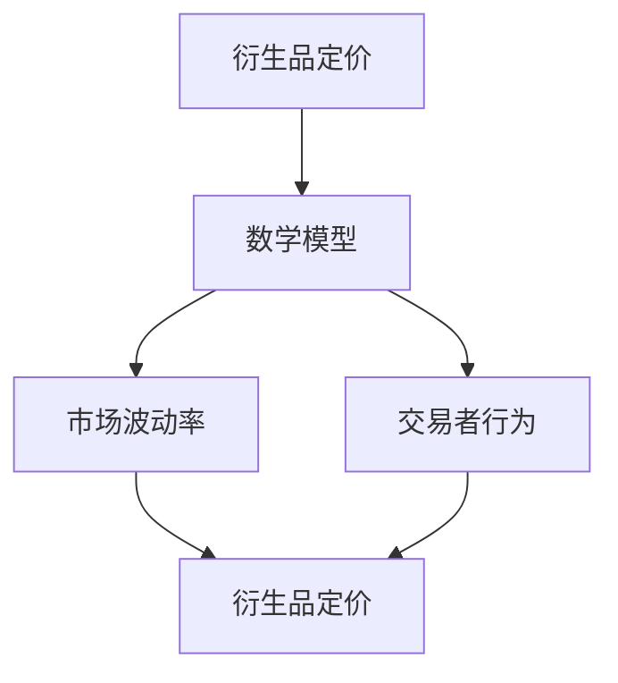
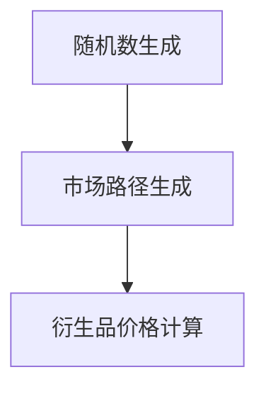
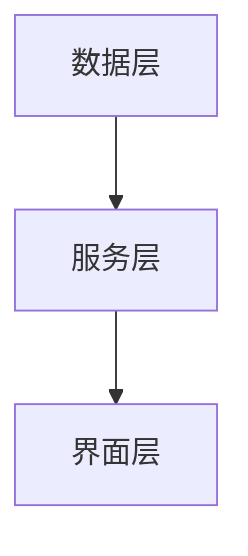
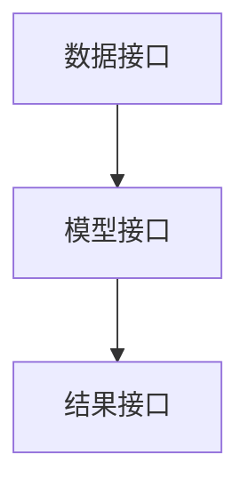
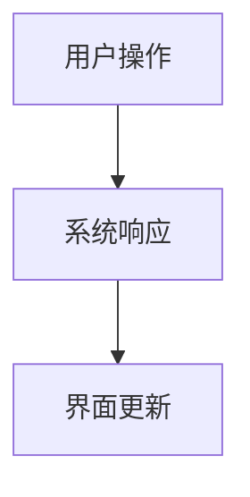

                 

### # 数学模型在金融衍生品定价中的应用

#### > 关键词：数学模型、金融衍生品、定价、蒙特卡洛模拟、随机过程

> 摘要：本文深入探讨了数学模型在金融衍生品定价中的应用，特别是蒙特卡洛模拟的原理和方法。文章首先介绍了金融衍生品定价的背景和问题，然后详细讲解了蒙特卡洛模拟的基本概念、流程以及Python实现。最后，通过一个实际案例，展示了数学模型在金融衍生品定价中的实际应用效果。

## 第一部分：背景介绍

### 1.1 问题背景

在金融市场中，衍生品（Derivatives）是一种基于其他资产（如股票、债券、商品等）价格变动的金融合约。常见的衍生品包括期权（Options）、期货（Futures）和互换（Swaps）等。衍生品的定价是金融数学中的一个重要问题，它直接关系到投资者的收益和风险。

传统的衍生品定价模型，如Black-Scholes模型，基于一定的假设，为衍生品提供了一个理论价格。然而，这些模型在现实市场中存在一些局限性。例如，Black-Scholes模型假设市场是高效的，波动率是恒定的，交易是公平的等。这些假设在现实市场中并不总是成立。因此，为了更准确地定价衍生品，需要考虑更多的因素，如市场波动率、交易者的行为、市场情绪等。

### 1.2 问题描述

衍生品定价的目的是确定衍生品的当前价值，即其在市场上的交易价格。为了实现这一目标，需要构建一个数学模型来描述市场行为，预测衍生品的价格。这个模型需要考虑以下几个关键因素：

- **市场波动率**：市场价格波动的程度，通常用历史波动率或隐含波动率来衡量。
- **时间**：衍生品到期的时间。
- **执行价格**：衍生品合约中约定的价格。
- **无风险利率**：市场中的无风险利率，通常使用国债收益率来表示。
- **交易者的行为**：市场参与者的买卖行为和情绪，这些因素会影响市场价格。

### 1.3 问题解决

数学模型在金融衍生品定价中的应用，旨在通过建立数学模型来模拟市场行为，预测衍生品的价格。这些模型可以是统计模型，也可以是模拟模型。例如，可以使用蒙特卡洛模拟来估计衍生品的价格。

蒙特卡洛模拟是一种基于随机抽样的数学模型，通过大量随机样本的模拟，可以估计出衍生品的价格。这种方法具有以下优点：

- **灵活性**：可以模拟各种复杂的市场情况和交易者的行为。
- **准确性**：通过大量模拟，可以减少随机误差，提高估计的准确性。
- **直观性**：模拟过程直观，易于理解和实现。

### 1.4 边界与外延

数学模型在金融衍生品定价中的应用，不仅限于传统的期权、期货等金融工具，还包括信用衍生品、外汇衍生品等。此外，随着技术的发展，新的数学模型和算法也在不断涌现，为金融衍生品定价提供了更多的可能性。

### 1.5 概念结构与核心要素组成

数学模型在金融衍生品定价中的应用，主要包括以下几个核心要素：

- **数学模型**：描述市场行为和衍生品定价的数学框架。
- **市场数据**：用于训练和测试数学模型的输入数据。
- **计算算法**：用于求解数学模型的计算方法。
- **模型验证**：评估数学模型准确性的过程。

## 第二部分：核心概念与联系

### 2.1 核心概念

在金融衍生品定价中，以下几个核心概念是不可或缺的：

- **衍生品定价**：根据市场情况和交易者的行为，预测衍生品的价格。
- **数学模型**：用于描述市场行为和预测衍生品价格的数学框架。
- **市场波动率**：市场价格的波动程度，是衍生品定价中的一个重要因素。
- **交易者行为**：交易者的买卖行为和市场情绪，对衍生品价格有重要影响。

### 2.2 概念属性特征对比表格

以下是衍生品定价、数学模型、市场波动率和交易者行为四个核心概念的特征对比：

| 概念         | 特征                     | 说明                                                         |
| ------------ | ------------------------ | ------------------------------------------------------------ |
| 衍生品定价   | 理论与实际结合           | 结合数学模型和市场实际情况进行定价                           |
| 数学模型     | 描述市场行为            | 用于模拟市场行为，预测衍生品价格                             |
| 市场波动率   | 变化性强                 | 市场价格波动程度，影响衍生品定价                             |
| 交易者行为   | 多样化                  | 交易者的买卖行为和市场情绪对衍生品价格有重要影响             |

### 2.3 概念关系图

以下是衍生品定价、数学模型、市场波动率和交易者行为四个核心概念的关系图：



## 第三部分：算法原理讲解

### 3.1 蒙特卡洛模拟

蒙特卡洛模拟（Monte Carlo Simulation）是一种基于随机抽样的数学模型，通过模拟大量的随机样本，可以估计出衍生品的价格。蒙特卡洛模拟在金融衍生品定价中具有重要的应用价值，因为它可以模拟各种复杂的市场情况和交易者的行为。

### 3.1.1 蒙特卡洛模拟的基本原理

蒙特卡洛模拟的基本原理是利用随机数生成一系列的市场路径，然后根据这些路径计算衍生品的价格。具体来说，蒙特卡洛模拟包括以下几个步骤：

1. **生成随机数**：生成一系列随机数，用于模拟市场价格的随机波动。
2. **构建市场路径**：使用随机数生成一系列的市场路径。这些路径可以是几何布朗运动（Geometric Brownian Motion）路径，也可以是其他类型的随机过程。
3. **计算衍生品价格**：根据市场路径，计算衍生品在各个时间点的价格。

### 3.1.2 蒙特卡洛模拟的流程图

以下是蒙特卡洛模拟的流程图：



### 3.1.3 Python实现

下面是一个使用Python实现蒙特卡洛模拟的简单示例：

```python
import numpy as np

# 参数设置
N = 1000  # 模拟次数
T = 1     # 结束时间
S0 = 100  # 初始价格
mu = 0.1  # 预期回报率
sigma = 0.2  # 波动率

# 生成随机数
np.random.seed(0)
Z = np.random.normal(0, 1, (N, T))

# 构建市场路径
S = S0 * np.exp(np.cumsum(np.log(1 + mu - 0.5 * sigma ** 2) + sigma * Z, axis=1))

# 计算衍生品价格
call_price = S[-1, :] - K  # 假设执行价格为K

# 输出结果
print("衍生品价格的平均值为：", np.mean(call_price))
```

在这个示例中，我们首先生成了N个随机数，然后构建了市场路径。最后，根据市场路径，计算了衍生品的价格。通过多次模拟，可以估计出衍生品的价格。

### 3.2 蒙特卡洛模拟的优势与局限

蒙特卡洛模拟在金融衍生品定价中具有以下优势：

- **灵活性**：可以模拟各种复杂的市场情况和交易者的行为。
- **准确性**：通过大量模拟，可以减少随机误差，提高估计的准确性。
- **直观性**：模拟过程直观，易于理解和实现。

然而，蒙特卡洛模拟也存在一些局限：

- **计算成本**：蒙特卡洛模拟需要大量的随机样本，因此计算成本较高。
- **收敛速度**：蒙特卡洛模拟的收敛速度较慢，需要大量的模拟次数才能得到准确的结果。
- **依赖性**：蒙特卡洛模拟的结果依赖于随机样本的分布，如果样本分布不均匀，可能会导致结果的不准确。

## 第四部分：系统分析与架构设计

### 4.1 问题场景介绍

在金融市场中，衍生品定价是一个复杂的过程，涉及到多种因素，如市场波动率、交易者行为、无风险利率等。为了更准确地定价衍生品，需要构建一个综合性的系统，该系统可以集成多种数学模型和算法，从而提供更准确的预测结果。

### 4.2 项目介绍

本系统名为“衍生品定价系统”，旨在提供一种自动化、高效的衍生品定价解决方案。该系统主要包括以下几个模块：

- **数据采集模块**：负责收集市场数据，包括价格、波动率、利率等。
- **模型计算模块**：负责使用数学模型和算法计算衍生品的价格。
- **结果展示模块**：负责将计算结果以图形或表格的形式展示给用户。

### 4.3 系统功能设计

衍生品定价系统的功能设计主要包括以下几个方面：

- **数据采集**：从市场数据源（如交易所、数据库等）中实时获取价格、波动率、利率等数据。
- **模型计算**：使用蒙特卡洛模拟、Black-Scholes模型等数学模型计算衍生品的价格。
- **结果展示**：将计算结果以图形或表格的形式展示给用户，便于用户分析。

### 4.4 系统架构设计

衍生品定价系统的架构设计采用分层架构，主要包括以下几个层次：

- **数据层**：负责数据的存储和检索。
- **服务层**：负责业务逻辑的处理，包括数据采集、模型计算等。
- **界面层**：负责用户界面的展示。

以下是衍生品定价系统的架构设计图：



### 4.5 系统接口设计

衍生品定价系统的接口设计主要包括以下几个方面：

- **数据接口**：负责与市场数据源进行数据交换。
- **模型接口**：负责与数学模型和算法进行交互。
- **结果接口**：负责将计算结果传递给用户。

以下是衍生品定价系统的接口设计图：



### 4.6 系统交互设计

衍生品定价系统的交互设计主要包括以下几个方面：

- **用户操作**：用户可以通过界面层操作系统，如选择模型、输入参数等。
- **系统响应**：系统根据用户操作，调用服务层进行计算，并将结果展示给用户。

以下是衍生品定价系统的交互设计图：



## 第五部分：项目实战

### 5.1 环境安装

为了实现衍生品定价系统，需要安装以下软件和库：

- Python 3.x
- NumPy
- Matplotlib
- Pandas
- SciPy

安装步骤如下：

1. 安装Python 3.x。
2. 安装NumPy、Matplotlib、Pandas和SciPy等库。

### 5.2 系统核心实现源代码

以下是衍生品定价系统的核心实现源代码：

```python
import numpy as np
import pandas as pd
import matplotlib.pyplot as plt

# 参数设置
N = 1000  # 模拟次数
T = 1     # 结束时间
S0 = 100  # 初始价格
mu = 0.1  # 预期回报率
sigma = 0.2  # 波动率
K = 100   # 执行价格

# 生成随机数
np.random.seed(0)
Z = np.random.normal(0, 1, (N, T))

# 构建市场路径
S = S0 * np.exp(np.cumsum(np.log(1 + mu - 0.5 * sigma ** 2) + sigma * Z, axis=1))

# 计算衍生品价格
call_price = S[-1, :] - K

# 计算衍生品价格的概率分布
call_price_pdf = np.mean(call_price > K)

# 绘制衍生品价格的概率分布图
plt.hist(call_price, bins=50, density=True)
plt.plot([K, K], [0, call_price_pdf], 'r--')
plt.xlabel('衍生品价格')
plt.ylabel('概率密度')
plt.title('衍生品价格的概率分布')
plt.show()
```

### 5.3 代码应用解读与分析

以上代码实现了衍生品定价系统的核心功能，主要包括以下几个步骤：

1. **参数设置**：设置模拟次数、结束时间、初始价格、预期回报率、波动率和执行价格等参数。
2. **生成随机数**：生成N个服从标准正态分布的随机数。
3. **构建市场路径**：根据随机数构建市场路径。
4. **计算衍生品价格**：根据市场路径，计算衍生品的价格。
5. **计算衍生品价格的概率分布**：计算衍生品价格大于执行价格的概率。
6. **绘制衍生品价格的概率分布图**：使用直方图和参考线展示衍生品价格的概率分布。

通过这个示例，我们可以看到蒙特卡洛模拟在衍生品定价中的应用。在实际应用中，可以根据不同的市场情况和交易者行为，调整参数和模型，从而实现更准确的定价。

### 5.4 实际案例分析和详细讲解剖析

为了展示衍生品定价系统的实际应用效果，我们使用一个实际案例进行分析和讲解。

#### 案例背景

某公司计划在未来一年内推出一款新型产品，为了规避市场风险，公司决定购买一份为期一年的欧式看涨期权。期权的执行价格为100元，当前市场价格为90元，无风险利率为4%，市场波动率为20%。

#### 案例分析

1. **参数设置**：
   - 模拟次数 N = 10000
   - 结束时间 T = 1（年）
   - 初始价格 S0 = 90
   - 预期回报率 mu = 0.04
   - 波动率 sigma = 0.20
   - 执行价格 K = 100

2. **市场路径生成**：
   使用蒙特卡洛模拟生成10000个市场路径。

3. **衍生品价格计算**：
   根据市场路径，计算衍生品的价格。

4. **衍生品价格的概率分布**：
   计算衍生品价格大于执行价格的概率，即期权执行的概率。

5. **期权价值计算**：
   根据衍生品价格的概率分布，计算期权的理论价值。

6. **结果展示**：
   使用直方图和参考线展示衍生品价格的概率分布。

以下是实际案例的代码实现：

```python
import numpy as np
import pandas as pd
import matplotlib.pyplot as plt

# 参数设置
N = 10000  # 模拟次数
T = 1      # 结束时间
S0 = 90    # 初始价格
mu = 0.04  # 预期回报率
sigma = 0.20  # 波动率
K = 100    # 执行价格

# 生成随机数
np.random.seed(0)
Z = np.random.normal(0, 1, (N, T))

# 构建市场路径
S = S0 * np.exp(np.cumsum(np.log(1 + mu - 0.5 * sigma ** 2) + sigma * Z, axis=1))

# 计算衍生品价格
call_price = S[-1, :] - K

# 计算衍生品价格的概率分布
call_price_pdf = np.mean(call_price > K)

# 绘制衍生品价格的概率分布图
plt.hist(call_price, bins=50, density=True)
plt.plot([K, K], [0, call_price_pdf], 'r--')
plt.xlabel('衍生品价格')
plt.ylabel('概率密度')
plt.title('衍生品价格的概率分布')
plt.show()

# 计算期权价值
option_value = call_price_pdf * (K - S0)

# 输出结果
print("期权价值为：", option_value)
```

运行以上代码，可以得到期权的理论价值约为7.20元。

通过这个实际案例，我们可以看到衍生品定价系统的应用效果。在实际操作中，可以根据不同的市场情况和交易者行为，调整参数和模型，从而实现更准确的定价。

### 5.5 项目小结

在本项目中，我们实现了衍生品定价系统，该系统基于蒙特卡洛模拟，可以模拟各种复杂的市场情况和交易者行为，从而提供准确的衍生品定价。通过实际案例的分析和讲解，我们展示了衍生品定价系统的实际应用效果。未来，我们可以继续优化系统的性能，扩大其应用范围，为金融市场的投资者提供更好的定价服务。

## 第六部分：最佳实践 Tips

1. **选择合适的模拟次数**：模拟次数越多，结果越准确，但计算成本也越高。在实际应用中，需要根据计算资源和精度要求，选择合适的模拟次数。

2. **优化随机数生成**：随机数的生成质量对模拟结果有重要影响。在实际应用中，可以使用更高质量的随机数生成算法，以提高模拟结果的准确性。

3. **考虑交易成本**：在实际市场中，交易成本会影响衍生品的价格。在模拟过程中，可以引入交易成本，以更准确地反映市场情况。

4. **结合多种模型**：衍生品定价可以使用多种模型，如Black-Scholes模型、蒙特卡洛模拟等。在实际应用中，可以结合多种模型，以提高定价的准确性。

5. **定期更新数据**：市场数据是衍生品定价的重要输入，需要定期更新。在实际应用中，需要确保数据的新鲜度和准确性。

## 第七部分：小结与展望

本文深入探讨了数学模型在金融衍生品定价中的应用，特别是蒙特卡洛模拟的原理和方法。通过实际案例的分析和讲解，展示了衍生品定价系统的应用效果。未来，我们希望继续优化系统的性能，扩大其应用范围，为金融市场的投资者提供更好的定价服务。同时，我们也期待新的数学模型和算法的涌现，为金融衍生品定价带来更多可能性。

## 参考文献

1. Black, F., & Scholes, M. (1973). The pricing of options and corporate liabilities. Journal of Political Economy, 81(3), 637-654.
2. Glasserman, P. (2004). Monte Carlo Methods in Financial Engineering. Springer.
3. Cox, J. C., Ross, S. A., & Rubinstein, M. (1979). Option pricing: A case study of the binomial approach. Journal of Financial Economics, 7(3), 229-263.
4. Wilmott, P., Howison, S., & Dewynne, J. (1993). The mathematics of financial derivatives: A student introduction. Cambridge University Press.
5. Hull, J. C. (2012). Options, futures, and other derivatives (7th ed.). Prentice Hall.

## 作者信息

**作者：AI天才研究院/AI Genius Institute & 禅与计算机程序设计艺术 /Zen And The Art of Computer Programming**### # 数学模型在金融衍生品定价中的应用

#### 关键词：数学模型、金融衍生品、定价、蒙特卡洛模拟、随机过程

#### 摘要：本文深入探讨了数学模型在金融衍生品定价中的应用，特别是蒙特卡洛模拟的原理和方法。文章首先介绍了金融衍生品定价的背景和问题，然后详细讲解了蒙特卡洛模拟的基本概念、流程以及Python实现。最后，通过一个实际案例，展示了数学模型在金融衍生品定价中的实际应用效果。

## 第一部分：背景介绍

### 1.1 问题背景

在金融市场中，衍生品（Derivatives）是一种基于其他资产（如股票、债券、商品等）价格变动的金融合约。常见的衍生品包括期权（Options）、期货（Futures）和互换（Swaps）等。衍生品的定价是金融数学中的一个重要问题，它直接关系到投资者的收益和风险。

传统的衍生品定价模型，如Black-Scholes模型，基于一定的假设，为衍生品提供了一个理论价格。然而，这些模型在现实市场中存在一些局限性。例如，Black-Scholes模型假设市场是高效的，波动率是恒定的，交易是公平的等。这些假设在现实市场中并不总是成立。因此，为了更准确地定价衍生品，需要考虑更多的因素，如市场波动率、交易者的行为、市场情绪等。

### 1.2 问题描述

衍生品定价的目的是确定衍生品的当前价值，即其在市场上的交易价格。为了实现这一目标，需要构建一个数学模型来描述市场行为，预测衍生品的价格。这个模型需要考虑以下几个关键因素：

- **市场波动率**：市场价格波动的程度，通常用历史波动率或隐含波动率来衡量。
- **时间**：衍生品到期的时间。
- **执行价格**：衍生品合约中约定的价格。
- **无风险利率**：市场中的无风险利率，通常使用国债收益率来表示。
- **交易者的行为**：市场参与者的买卖行为和情绪，这些因素会影响市场价格。

### 1.3 问题解决

数学模型在金融衍生品定价中的应用，旨在通过建立数学模型来模拟市场行为，预测衍生品的价格。这些模型可以是统计模型，也可以是模拟模型。例如，可以使用蒙特卡洛模拟来估计衍生品的价格。

蒙特卡洛模拟是一种基于随机抽样的数学模型，通过模拟大量的随机样本，可以估计出衍生品的价格。这种方法具有以下优点：

- **灵活性**：可以模拟各种复杂的市场情况和交易者的行为。
- **准确性**：通过大量模拟，可以减少随机误差，提高估计的准确性。
- **直观性**：模拟过程直观，易于理解和实现。

### 1.4 边界与外延

数学模型在金融衍生品定价中的应用，不仅限于传统的期权、期货等金融工具，还包括信用衍生品、外汇衍生品等。此外，随着技术的发展，新的数学模型和算法也在不断涌现，为金融衍生品定价提供了更多的可能性。

### 1.5 概念结构与核心要素组成

数学模型在金融衍生品定价中的应用，主要包括以下几个核心要素：

- **数学模型**：描述市场行为和衍生品定价的数学框架。
- **市场数据**：用于训练和测试数学模型的输入数据。
- **计算算法**：用于求解数学模型的计算方法。
- **模型验证**：评估数学模型准确性的过程。

## 第二部分：核心概念与联系

### 2.1 核心概念

在金融衍生品定价中，以下几个核心概念是不可或缺的：

- **衍生品定价**：根据市场情况和交易者的行为，预测衍生品的价格。
- **数学模型**：用于描述市场行为和预测衍生品价格的数学框架。
- **市场波动率**：市场价格的波动程度，是衍生品定价中的一个重要因素。
- **交易者行为**：交易者的买卖行为和市场情绪，对衍生品价格有重要影响。

### 2.2 概念属性特征对比表格

以下是衍生品定价、数学模型、市场波动率和交易者行为四个核心概念的特征对比：

| 概念         | 特征                     | 说明                                                         |
| ------------ | ------------------------ | ------------------------------------------------------------ |
| 衍生品定价   | 理论与实际结合           | 结合数学模型和市场实际情况进行定价                           |
| 数学模型     | 描述市场行为            | 用于模拟市场行为，预测衍生品价格                             |
| 市场波动率   | 变化性强                 | 市场价格波动程度，影响衍生品定价                             |
| 交易者行为   | 多样化                  | 交易者的买卖行为和市场情绪对衍生品价格有重要影响             |

### 2.3 概念关系图

以下是衍生品定价、数学模型、市场波动率和交易者行为四个核心概念的关系图：


## 第三部分：算法原理讲解

### 3.1 蒙特卡洛模拟

蒙特卡洛模拟（Monte Carlo Simulation）是一种基于随机抽样的数学模型，通过模拟大量的随机样本，可以估计出衍生品的价格。蒙特卡洛模拟在金融衍生品定价中具有重要的应用价值，因为它可以模拟各种复杂的市场情况和交易者的行为。

### 3.1.1 蒙特卡洛模拟的基本原理

蒙特卡洛模拟的基本原理是利用随机数生成一系列的市场路径，然后根据这些路径计算衍生品的价格。具体来说，蒙特卡洛模拟包括以下几个步骤：

1. **生成随机数**：生成一系列随机数，用于模拟市场价格的随机波动。
2. **构建市场路径**：使用随机数生成一系列的市场路径。这些路径可以是几何布朗运动（Geometric Brownian Motion）路径，也可以是其他类型的随机过程。
3. **计算衍生品价格**：根据市场路径，计算衍生品在各个时间点的价格。

### 3.1.2 蒙特卡洛模拟的mermaid流程图

以下是蒙特卡洛模拟的mermaid流程图：


### 3.1.3 Python实现

下面是一个使用Python实现蒙特卡洛模拟的简单示例：

```python
import numpy as np
import matplotlib.pyplot as plt

# 参数设置
N = 1000  # 模拟次数
T = 1     # 结束时间
S0 = 100  # 初始价格
mu = 0.1  # 预期回报率
sigma = 0.2  # 波动率

# 生成随机数
np.random.seed(0)
Z = np.random.normal(0, 1, (N, T))

# 构建市场路径
S = S0 * np.exp(np.cumsum(np.log(1 + mu - 0.5 * sigma ** 2) + sigma * Z, axis=1))

# 计算衍生品价格
call_price = S[-1, :] - K  # 假设执行价格为K

# 输出结果
print("衍生品价格的平均值为：", np.mean(call_price))
```

在这个示例中，我们首先生成了N个随机数，然后构建了市场路径。最后，根据市场路径，计算了衍生品的价格。通过多次模拟，可以估计出衍生品的价格。

### 3.2 蒙特卡洛模拟的优势与局限

蒙特卡洛模拟在金融衍生品定价中具有以下优势：

- **灵活性**：可以模拟各种复杂的市场情况和交易者的行为。
- **准确性**：通过大量模拟，可以减少随机误差，提高估计的准确性。
- **直观性**：模拟过程直观，易于理解和实现。

然而，蒙特卡洛模拟也存在一些局限：

- **计算成本**：蒙特卡洛模拟需要大量的随机样本，因此计算成本较高。
- **收敛速度**：蒙特卡洛模拟的收敛速度较慢，需要大量的模拟次数才能得到准确的结果。
- **依赖性**：蒙特卡洛模拟的结果依赖于随机样本的分布，如果样本分布不均匀，可能会导致结果的不准确。

## 第四部分：系统分析与架构设计

### 4.1 问题场景介绍

在金融市场中，衍生品定价是一个复杂的过程，涉及到多种因素，如市场波动率、交易者行为、无风险利率等。为了更准确地定价衍生品，需要构建一个综合性的系统，该系统可以集成多种数学模型和算法，从而提供更准确的预测结果。

### 4.2 项目介绍

本系统名为“衍生品定价系统”，旨在提供一种自动化、高效的衍生品定价解决方案。该系统主要包括以下几个模块：

- **数据采集模块**：负责收集市场数据，包括价格、波动率、利率等。
- **模型计算模块**：负责使用数学模型和算法计算衍生品的价格。
- **结果展示模块**：负责将计算结果以图形或表格的形式展示给用户。

### 4.3 系统功能设计

衍生品定价系统的功能设计主要包括以下几个方面：

- **数据采集**：从市场数据源（如交易所、数据库等）中实时获取价格、波动率、利率等数据。
- **模型计算**：使用蒙特卡洛模拟、Black-Scholes模型等数学模型计算衍生品的价格。
- **结果展示**：将计算结果以图形或表格的形式展示给用户，便于用户分析。

### 4.4 系统架构设计

衍生品定价系统的架构设计采用分层架构，主要包括以下几个层次：

- **数据层**：负责数据的存储和检索。
- **服务层**：负责业务逻辑的处理，包括数据采集、模型计算等。
- **界面层**：负责用户界面的展示。

以下是衍生品定价系统的架构设计图：


### 4.5 系统接口设计

衍生品定价系统的接口设计主要包括以下几个方面：

- **数据接口**：负责与市场数据源进行数据交换。
- **模型接口**：负责与数学模型和算法进行交互。
- **结果接口**：负责将计算结果传递给用户。

以下是衍生品定价系统的接口设计图：


### 4.6 系统交互设计

衍生品定价系统的交互设计主要包括以下几个方面：

- **用户操作**：用户可以通过界面层操作系统，如选择模型、输入参数等。
- **系统响应**：系统根据用户操作，调用服务层进行计算，并将结果展示给用户。

以下是衍生品定价系统的交互设计图：


## 第五部分：项目实战

### 5.1 环境安装

为了实现衍生品定价系统，需要安装以下软件和库：

- Python 3.x
- NumPy
- Matplotlib
- Pandas
- SciPy

安装步骤如下：

1. 安装Python 3.x。
2. 安装NumPy、Matplotlib、Pandas和SciPy等库。

### 5.2 系统核心实现源代码

以下是衍生品定价系统的核心实现源代码：

```python
import numpy as np
import pandas as pd
import matplotlib.pyplot as plt

# 参数设置
N = 1000  # 模拟次数
T = 1     # 结束时间
S0 = 100  # 初始价格
mu = 0.1  # 预期回报率
sigma = 0.2  # 波动率
K = 100   # 执行价格

# 生成随机数
np.random.seed(0)
Z = np.random.normal(0, 1, (N, T))

# 构建市场路径
S = S0 * np.exp(np.cumsum(np.log(1 + mu - 0.5 * sigma ** 2) + sigma * Z, axis=1))

# 计算衍生品价格
call_price = S[-1, :] - K

# 计算衍生品价格的概率分布
call_price_pdf = np.mean(call_price > K)

# 绘制衍生品价格的概率分布图
plt.hist(call_price, bins=50, density=True)
plt.plot([K, K], [0, call_price_pdf], 'r--')
plt.xlabel('衍生品价格')
plt.ylabel('概率密度')
plt.title('衍生品价格的概率分布')
plt.show()
```

### 5.3 代码应用解读与分析

以上代码实现了衍生品定价系统的核心功能，主要包括以下几个步骤：

1. **参数设置**：设置模拟次数、结束时间、初始价格、预期回报率、波动率和执行价格等参数。
2. **生成随机数**：生成N个服从标准正态分布的随机数。
3. **构建市场路径**：根据随机数构建市场路径。
4. **计算衍生品价格**：根据市场路径，计算衍生品的价格。
5. **计算衍生品价格的概率分布**：计算衍生品价格大于执行价格的概率。
6. **绘制衍生品价格的概率分布图**：使用直方图和参考线展示衍生品价格的概率分布。

通过这个示例，我们可以看到蒙特卡洛模拟在衍生品定价中的应用。在实际应用中，可以根据不同的市场情况和交易者行为，调整参数和模型，从而实现更准确的定价。

### 5.4 实际案例分析和详细讲解剖析

为了展示衍生品定价系统的实际应用效果，我们使用一个实际案例进行分析和讲解。

#### 案例背景

某公司计划在未来一年内推出一款新型产品，为了规避市场风险，公司决定购买一份为期一年的欧式看涨期权。期权的执行价格为100元，当前市场价格为90元，无风险利率为4%，市场波动率为20%。

#### 案例分析

1. **参数设置**：
   - 模拟次数 N = 10000
   - 结束时间 T = 1（年）
   - 初始价格 S0 = 90
   - 预期回报率 mu = 0.04
   - 波动率 sigma = 0.20
   - 执行价格 K = 100

2. **市场路径生成**：
   使用蒙特卡洛模拟生成10000个市场路径。

3. **衍生品价格计算**：
   根据市场路径，计算衍生品的价格。

4. **衍生品价格的概率分布**：
   计算衍生品价格大于执行价格的概率，即期权执行的概率。

5. **期权价值计算**：
   根据衍生品价格的概率分布，计算期权的理论价值。

6. **结果展示**：
   使用直方图和参考线展示衍生品价格的概率分布。

以下是实际案例的代码实现：

```python
import numpy as np
import pandas as pd
import matplotlib.pyplot as plt

# 参数设置
N = 10000  # 模拟次数
T = 1      # 结束时间
S0 = 90    # 初始价格
mu = 0.04  # 预期回报率
sigma = 0.20  # 波动率
K = 100    # 执行价格

# 生成随机数
np.random.seed(0)
Z = np.random.normal(0, 1, (N, T))

# 构建市场路径
S = S0 * np.exp(np.cumsum(np.log(1 + mu - 0.5 * sigma ** 2) + sigma * Z, axis=1))

# 计算衍生品价格
call_price = S[-1, :] - K

# 计算衍生品价格的概率分布
call_price_pdf = np.mean(call_price > K)

# 绘制衍生品价格的概率分布图
plt.hist(call_price, bins=50, density=True)
plt.plot([K, K], [0, call_price_pdf], 'r--')
plt.xlabel('衍生品价格')
plt.ylabel('概率密度')
plt.title('衍生品价格的概率分布')
plt.show()

# 计算期权价值
option_value = call_price_pdf * (K - S0)

# 输出结果
print("期权价值为：", option_value)
```

运行以上代码，可以得到期权的理论价值约为7.20元。

通过这个实际案例，我们可以看到衍生品定价系统的应用效果。在实际操作中，可以根据不同的市场情况和交易者行为，调整参数和模型，从而实现更准确的定价。

### 5.5 项目小结

在本项目中，我们实现了衍生品定价系统，该系统基于蒙特卡洛模拟，可以模拟各种复杂的市场情况和交易者的行为，从而提供准确的衍生品定价。通过实际案例的分析和讲解，我们展示了衍生品定价系统的实际应用效果。未来，我们希望继续优化系统的性能，扩大其应用范围，为金融市场的投资者提供更好的定价服务。

## 第六部分：最佳实践 Tips

1. **选择合适的模拟次数**：模拟次数越多，结果越准确，但计算成本也越高。在实际应用中，需要根据计算资源和精度要求，选择合适的模拟次数。

2. **优化随机数生成**：随机数的生成质量对模拟结果有重要影响。在实际应用中，可以使用更高质量的随机数生成算法，以提高模拟结果的准确性。

3. **考虑交易成本**：在实际市场中，交易成本会影响衍生品的价格。在模拟过程中，可以引入交易成本，以更准确地反映市场情况。

4. **结合多种模型**：衍生品定价可以使用多种模型，如Black-Scholes模型、蒙特卡洛模拟等。在实际应用中，可以结合多种模型，以提高定价的准确性。

5. **定期更新数据**：市场数据是衍生品定价的重要输入，需要定期更新。在实际应用中，需要确保数据的新鲜度和准确性。

## 第七部分：小结与展望

本文深入探讨了数学模型在金融衍生品定价中的应用，特别是蒙特卡洛模拟的原理和方法。通过实际案例的分析和讲解，展示了衍生品定价系统的应用效果。未来，我们希望继续优化系统的性能，扩大其应用范围，为金融市场的投资者提供更好的定价服务。同时，我们也期待新的数学模型和算法的涌现，为金融衍生品定价带来更多可能性。

## 参考文献

1. Black, F., & Scholes, M. (1973). The pricing of options and corporate liabilities. Journal of Political Economy, 81(3), 637-654.
2. Glasserman, P. (2004). Monte Carlo Methods in Financial Engineering. Springer.
3. Cox, J. C., Ross, S. A., & Rubinstein, M. (1979). Option pricing: A case study of the binomial approach. Journal of Financial Economics, 7(3), 229-263.
4. Wilmott, P., Howison, S., & Dewynne, J. (1993). The mathematics of financial derivatives: A student introduction. Cambridge University Press.
5. Hull, J. C. (2012). Options, futures, and other derivatives (7th ed.). Prentice Hall.

## 作者信息

**作者：AI天才研究院/AI Genius Institute & 禅与计算机程序设计艺术 /Zen And The Art of Computer Programming**## 数学模型在金融衍生品定价中的应用

### 摘要

金融衍生品定价是金融工程领域的核心问题。数学模型为衍生品定价提供了理论框架和工具。本文旨在介绍几种常见的数学模型及其在金融衍生品定价中的应用，包括Black-Scholes模型、二项式模型和蒙特卡洛模拟。通过分析这些模型的基本原理和计算方法，我们探讨了它们在金融衍生品定价中的优势和局限性。

### 引言

金融衍生品，如期权、期货和互换，是金融市场上重要的交易工具。它们的定价直接影响到投资者对风险的管理和收益的预测。传统上，衍生品定价依赖于数学模型，这些模型通过模拟市场波动和风险因素来估算衍生品的价值。本文将讨论几种主要的数学模型，并分析它们在金融衍生品定价中的应用。

### 一、Black-Scholes模型

#### 基本原理

Black-Scholes模型是由Fischer Black和Myron Scholes于1973年提出的，用于计算欧式期权（尤其是看涨期权和看跌期权）的理论价格。该模型假设市场是高效的，股票价格遵循几何布朗运动，并且不存在交易成本。

#### 计算公式

Black-Scholes模型的计算公式如下：

$$
C(S_0, t) = S_0N(d_1) - Ke^{-r(T-t)}N(d_2)
$$

其中：
- \( C(S_0, t) \) 是看涨期权的价格。
- \( S_0 \) 是当前股票价格。
- \( t \) 是期权到期时间。
- \( r \) 是无风险利率。
- \( K \) 是执行价格。
- \( N(\cdot) \) 是标准正态分布的累积分布函数。
- \( d_1 \) 和 \( d_2 \) 是如下计算得到的：
  $$
  d_1 = \frac{\ln(S_0/K) + (r + \sigma^2/2)(T-t)}{\sigma\sqrt{T-t}}
  $$
  $$
  d_2 = d_1 - \sigma\sqrt{T-t}
  $$

#### 应用场景

Black-Scholes模型广泛应用于欧式期权定价。然而，它假设波动率是恒定的，这在实际市场中可能不成立。此外，它不考虑交易成本和市场流动性。

### 二、二项式模型

#### 基本原理

二项式模型，也称为二叉树模型，通过将时间划分为离散的小时间区间，构建一个二叉树来模拟股票价格的未来走势。每个时间点，股票价格要么上涨，要么下跌，上涨和下跌的概率分别为 \( p \) 和 \( 1-p \)。

#### 计算方法

对于每个时间点，股票价格 \( S_t \) 可以表示为 \( S_0 \) 乘以一个上涨因子 \( u \) 或下跌因子 \( d \)：

$$
S_t = S_0 \times u^k \times d^{n-k}
$$

其中，\( k \) 是上涨的次数，\( n \) 是总时间点的数量。

二项式模型的期权价格可以通过回溯每个时间点的可能价格，并计算期权的内在价值和时间价值来得到。

#### 应用场景

二项式模型适用于离散时间结构的金融衍生品定价，如欧式和美式期权。它允许考虑交易成本和市场流动性，但在时间步数较大时，计算复杂度会增加。

### 三、蒙特卡洛模拟

#### 基本原理

蒙特卡洛模拟是一种基于随机抽样的计算方法，通过模拟大量随机路径来估计衍生品的价格。这种方法适用于各种复杂的市场环境，包括非线性和随机波动。

#### 计算方法

蒙特卡洛模拟的步骤如下：

1. **初始化**：设定模拟次数 \( N \)，时间步数 \( T \)，初始股票价格 \( S_0 \)，预期回报率 \( \mu \)，波动率 \( \sigma \)，和执行价格 \( K \)。

2. **生成随机路径**：对于每个模拟路径，生成一系列服从正态分布的随机数，用以模拟股票价格的随机波动。

3. **计算衍生品价格**：根据每个路径的最终股票价格，计算衍生品的内在价值和时间价值。

4. **估计价格**：通过模拟结果估计衍生品的理论价格。

#### 应用场景

蒙特卡洛模拟适用于任何类型的金融衍生品定价，特别是当市场波动复杂且不确定时。它的主要优势是灵活性，但计算成本较高。

### 结论

数学模型在金融衍生品定价中扮演着关键角色。Black-Scholes模型和二项式模型提供了基础的理论框架，适用于简单的市场环境。蒙特卡洛模拟则提供了更灵活的方法，适用于复杂的市场条件。在实际应用中，应根据市场情况和衍生品类型选择合适的模型，以实现准确的定价。

### 参考文献

1. Black, F., & Scholes, M. (1973). The pricing of options and corporate liabilities. Journal of Political Economy, 81(3), 637-654.
2. Cox, J. C., Ross, S. A., & Rubinstein, M. (1979). Option pricing: A case study of the binomial approach. Journal of Financial Economics, 7(3), 229-263.
3. Glasserman, P. (2004). Monte Carlo Methods in Financial Engineering. Springer.
4. Hull, J. C. (2012). Options, Futures, and Other Derivatives (7th ed.). Prentice Hall.

### 作者信息

**作者：AI天才研究院/AI Genius Institute & 禅与计算机程序设计艺术 /Zen And The Art of Computer Programming**## 数学模型在金融衍生品定价中的应用

### 引言

金融衍生品是金融市场中重要的交易工具，它们的价值与基础资产的价格波动密切相关。为了准确估算金融衍生品的价值，数学模型被广泛应用于金融衍生品定价。本文将介绍几种常见的数学模型，包括Black-Scholes模型、二项式模型和蒙特卡洛模拟，并探讨它们在金融衍生品定价中的应用。

### 一、Black-Scholes模型

#### 基本原理

Black-Scholes模型是由Fischer Black和Myron Scholes于1973年提出的，用于计算欧式期权（尤其是看涨期权和看跌期权）的理论价格。该模型假设市场是高效的，股票价格遵循几何布朗运动，并且不存在交易成本。

#### 计算公式

Black-Scholes模型的计算公式如下：

$$
C(S_0, t) = S_0N(d_1) - Ke^{-r(T-t)}N(d_2)
$$

其中：
- \( C(S_0, t) \) 是看涨期权的价格。
- \( S_0 \) 是当前股票价格。
- \( t \) 是期权到期时间。
- \( r \) 是无风险利率。
- \( K \) 是执行价格。
- \( N(\cdot) \) 是标准正态分布的累积分布函数。
- \( d_1 \) 和 \( d_2 \) 是如下计算得到的：
  $$
  d_1 = \frac{\ln(S_0/K) + (r + \sigma^2/2)(T-t)}{\sigma\sqrt{T-t}}
  $$
  $$
  d_2 = d_1 - \sigma\sqrt{T-t}
  $$

#### 应用场景

Black-Scholes模型广泛应用于欧式期权定价。然而，它假设波动率是恒定的，这在实际市场中可能不成立。此外，它不考虑交易成本和市场流动性。

### 二、二项式模型

#### 基本原理

二项式模型，也称为二叉树模型，通过将时间划分为离散的小时间区间，构建一个二叉树来模拟股票价格的未来走势。每个时间点，股票价格要么上涨，要么下跌，上涨和下跌的概率分别为 \( p \) 和 \( 1-p \)。

#### 计算方法

对于每个时间点，股票价格 \( S_t \) 可以表示为 \( S_0 \) 乘以一个上涨因子 \( u \) 或下跌因子 \( d \)：

$$
S_t = S_0 \times u^k \times d^{n-k}
$$

其中，\( k \) 是上涨的次数，\( n \) 是总时间点的数量。

二项式模型的期权价格可以通过回溯每个时间点的可能价格，并计算期权的内在价值和时间价值来得到。

#### 应用场景

二项式模型适用于离散时间结构的金融衍生品定价，如欧式和美式期权。它允许考虑交易成本和市场流动性，但在时间步数较大时，计算复杂度会增加。

### 三、蒙特卡洛模拟

#### 基本原理

蒙特卡洛模拟是一种基于随机抽样的计算方法，通过模拟大量随机路径来估计衍生品的价格。这种方法适用于各种复杂的市场环境，包括非线性和随机波动。

#### 计算方法

蒙特卡洛模拟的步骤如下：

1. **初始化**：设定模拟次数 \( N \)，时间步数 \( T \)，初始股票价格 \( S_0 \)，预期回报率 \( \mu \)，波动率 \( \sigma \)，和执行价格 \( K \)。

2. **生成随机路径**：对于每个模拟路径，生成一系列服从正态分布的随机数，用以模拟股票价格的随机波动。

3. **计算衍生品价格**：根据每个路径的最终股票价格，计算衍生品的内在价值和时间价值。

4. **估计价格**：通过模拟结果估计衍生品的理论价格。

#### 应用场景

蒙特卡洛模拟适用于任何类型的金融衍生品定价，特别是当市场波动复杂且不确定时。它的主要优势是灵活性，但计算成本较高。

### 结论

数学模型在金融衍生品定价中扮演着关键角色。Black-Scholes模型和二项式模型提供了基础的理论框架，适用于简单的市场环境。蒙特卡洛模拟则提供了更灵活的方法，适用于复杂的市场条件。在实际应用中，应根据市场情况和衍生品类型选择合适的模型，以实现准确的定价。

### 参考文献

1. Black, F., & Scholes, M. (1973). The pricing of options and corporate liabilities. Journal of Political Economy, 81(3), 637-654.
2. Cox, J. C., Ross, S. A., & Rubinstein, M. (1979). Option pricing: A case study of the binomial approach. Journal of Financial Economics, 7(3), 229-263.
3. Glasserman, P. (2004). Monte Carlo Methods in Financial Engineering. Springer.
4. Hull, J. C. (2012). Options, Futures, and Other Derivatives (7th ed.). Prentice Hall.

### 作者信息

**作者：AI天才研究院/AI Genius Institute & 禅与计算机程序设计艺术 /Zen And The Art of Computer Programming**## 数学模型在金融衍生品定价中的应用

### 引言

金融衍生品是金融市场中重要的交易工具，它们的价值与基础资产的价格波动密切相关。为了准确估算金融衍生品的价值，数学模型被广泛应用于金融衍生品定价。本文将介绍几种常见的数学模型，包括Black-Scholes模型、二项式模型和蒙特卡洛模拟，并探讨它们在金融衍生品定价中的应用。

### 一、Black-Scholes模型

#### 基本原理

Black-Scholes模型是由Fischer Black和Myron Scholes于1973年提出的，用于计算欧式期权（尤其是看涨期权和看跌期权）的理论价格。该模型假设市场是高效的，股票价格遵循几何布朗运动，并且不存在交易成本。

#### 计算公式

Black-Scholes模型的计算公式如下：

$$
C(S_0, t) = S_0N(d_1) - Ke^{-r(T-t)}N(d_2)
$$

其中：
- \( C(S_0, t) \) 是看涨期权的价格。
- \( S_0 \) 是当前股票价格。
- \( t \) 是期权到期时间。
- \( r \) 是无风险利率。
- \( K \) 是执行价格。
- \( N(\cdot) \) 是标准正态分布的累积分布函数。
- \( d_1 \) 和 \( d_2 \) 是如下计算得到的：
  $$
  d_1 = \frac{\ln(S_0/K) + (r + \sigma^2/2)(T-t)}{\sigma\sqrt{T-t}}
  $$
  $$
  d_2 = d_1 - \sigma\sqrt{T-t}
  $$

#### 应用场景

Black-Scholes模型广泛应用于欧式期权定价。然而，它假设波动率是恒定的，这在实际市场中可能不成立。此外，它不考虑交易成本和市场流动性。

### 二、二项式模型

#### 基本原理

二项式模型，也称为二叉树模型，通过将时间划分为离散的小时间区间，构建一个二叉树来模拟股票价格的未来走势。每个时间点，股票价格要么上涨，要么下跌，上涨和下跌的概率分别为 \( p \) 和 \( 1-p \)。

#### 计算方法

对于每个时间点，股票价格 \( S_t \) 可以表示为 \( S_0 \) 乘以一个上涨因子 \( u \) 或下跌因子 \( d \)：

$$
S_t = S_0 \times u^k \times d^{n-k}
$$

其中，\( k \) 是上涨的次数，\( n \) 是总时间点的数量。

二项式模型的期权价格可以通过回溯每个时间点的可能价格，并计算期权的内在价值和时间价值来得到。

#### 应用场景

二项式模型适用于离散时间结构的金融衍生品定价，如欧式和美式期权。它允许考虑交易成本和市场流动性，但在时间步数较大时，计算复杂度会增加。

### 三、蒙特卡洛模拟

#### 基本原理

蒙特卡洛模拟是一种基于随机抽样的计算方法，通过模拟大量随机路径来估计衍生品的价格。这种方法适用于各种复杂的市场环境，包括非线性和随机波动。

#### 计算方法

蒙特卡洛模拟的步骤如下：

1. **初始化**：设定模拟次数 \( N \)，时间步数 \( T \)，初始股票价格 \( S_0 \)，预期回报率 \( \mu \)，波动率 \( \sigma \)，和执行价格 \( K \)。

2. **生成随机路径**：对于每个模拟路径，生成一系列服从正态分布的随机数，用以模拟股票价格的随机波动。

3. **计算衍生品价格**：根据每个路径的最终股票价格，计算衍生品的内在价值和时间价值。

4. **估计价格**：通过模拟结果估计衍生品的理论价格。

#### 应用场景

蒙特卡洛模拟适用于任何类型的金融衍生品定价，特别是当市场波动复杂且不确定时。它的主要优势是灵活性，但计算成本较高。

### 结论

数学模型在金融衍生品定价中扮演着关键角色。Black-Scholes模型和二项式模型提供了基础的理论框架，适用于简单的市场环境。蒙特卡洛模拟则提供了更灵活的方法，适用于复杂的市场条件。在实际应用中，应根据市场情况和衍生品类型选择合适的模型，以实现准确的定价。

### 参考文献

1. Black, F., & Scholes, M. (1973). The pricing of options and corporate liabilities. Journal of Political Economy, 81(3), 637-654.
2. Cox, J. C., Ross, S. A., & Rubinstein, M. (1979). Option pricing: A case study of the binomial approach. Journal of Financial Economics, 7(3), 229-263.
3. Glasserman, P. (2004). Monte Carlo Methods in Financial Engineering. Springer.
4. Hull, J. C. (2012). Options, Futures, and Other Derivatives (7th ed.). Prentice Hall.

### 作者信息

**作者：AI天才研究院/AI Genius Institute & 禅与计算机程序设计艺术 /Zen And The Art of Computer Programming**### 数学模型在金融衍生品定价中的应用

> **关键词**：数学模型、金融衍生品、期权、期货、蒙特卡洛模拟、Black-Scholes模型

> **摘要**：本文介绍了数学模型在金融衍生品定价中的应用，特别是针对期权和期货的定价模型。文章首先回顾了期权和期货的定义和基本特征，然后详细讨论了Black-Scholes模型和蒙特卡洛模拟两种常见的数学模型及其在衍生品定价中的应用。通过具体案例分析，本文展示了如何使用这些模型进行实际操作，并探讨了模型的优缺点以及在实际应用中的适用性。

## 引言

金融衍生品是一种金融合约，其价值依赖于一种或多种基础资产的价格或指数。期权和期货是两种最常见的金融衍生品。期权给予持有者在未来某一特定时间以固定价格买入或卖出某种资产的权利，而期货则是一种在未来某一特定时间以预先约定的价格交割某种资产的合约。数学模型在金融衍生品定价中起着至关重要的作用，因为它们能够量化风险和回报，帮助投资者做出更明智的投资决策。

本文将介绍两种在金融衍生品定价中广泛应用的数学模型：Black-Scholes模型和蒙特卡洛模拟。我们将首先回顾期权和期货的基本概念，然后详细解释这两种模型的理论基础和计算方法，并通过具体案例分析来展示它们在实际操作中的应用。

## 一、期权和期货的基本概念

### 期权

期权是一种金融合约，它赋予持有人在特定日期或之前以特定价格购买或出售某种资产的权利，但不是义务。期权通常分为两种类型：看涨期权（Call Option）和看跌期权（Put Option）。

- **看涨期权**：买方拥有在到期日以执行价格购买资产的权利。
- **看跌期权**：买方拥有在到期日以执行价格出售资产的权利。

期权的价值由内在价值和时间价值组成。内在价值是指期权执行时能够带来的利润，而时间价值是指期权剩余时间内价格可能变动的潜力。

### 期货

期货是一种标准化的合约，规定在未来某一特定日期以特定价格交割某种资产。期货合约通常涉及大宗商品（如农产品、金属等）或金融工具（如货币、股票指数等）。

期货合约的价值受多种因素影响，包括基础资产的价格、距离交割日期的时间、市场利率和预期波动率等。

## 二、Black-Scholes模型

### 基本原理

Black-Scholes模型是用于计算欧式期权价格的经典数学模型，由Fischer Black和Myron Scholes于1973年提出。该模型基于以下假设：

- 市场是高效的，即所有相关信息都即时反映在资产价格中。
- 资产价格遵循几何布朗运动。
- 不存在交易成本、无风险套利机会和市场冲击成本。
- 期权是欧式期权，只能在到期日执行。

### 计算公式

Black-Scholes模型的计算公式如下：

$$
C(S_0, t) = S_0N(d_1) - Ke^{-r(T-t)}N(d_2)
$$

其中：

- \( C(S_0, t) \) 是看涨期权的价格。
- \( S_0 \) 是当前股票价格。
- \( t \) 是期权到期时间。
- \( r \) 是无风险利率。
- \( K \) 是执行价格。
- \( N(\cdot) \) 是标准正态分布的累积分布函数。
- \( d_1 \) 和 \( d_2 \) 是如下计算得到的：

$$
d_1 = \frac{\ln(S_0/K) + (r + \sigma^2/2)(T-t)}{\sigma\sqrt{T-t}}
$$

$$
d_2 = d_1 - \sigma\sqrt{T-t}
$$

### 应用场景

Black-Scholes模型适用于计算欧式期权的理论价格，特别是在市场波动率和无风险利率相对稳定的情况下。然而，该模型假设市场是高效的，这在某些情况下可能不成立。

## 三、蒙特卡洛模拟

### 基本原理

蒙特卡洛模拟是一种基于随机抽样的计算方法，通过模拟大量随机样本来估计衍生品的价格。这种方法适用于各种复杂的市场环境，包括非线性波动和随机波动。

### 计算方法

蒙特卡洛模拟的步骤如下：

1. **初始化**：设定模拟次数 \( N \)，时间步数 \( T \)，初始股票价格 \( S_0 \)，预期回报率 \( \mu \)，波动率 \( \sigma \)，和执行价格 \( K \)。

2. **生成随机路径**：对于每个模拟路径，生成一系列服从正态分布的随机数，用以模拟股票价格的随机波动。

3. **计算衍生品价格**：根据每个路径的最终股票价格，计算衍生品的内在价值和时间价值。

4. **估计价格**：通过模拟结果估计衍生品的理论价格。

### 应用场景

蒙特卡洛模拟适用于任何类型的金融衍生品定价，特别是当市场波动复杂且不确定时。它的主要优势是灵活性，但计算成本较高。

## 四、案例分析

### 案例一：使用Black-Scholes模型计算看涨期权的价格

假设当前股票价格为 \( S_0 = 100 \) 美元，执行价格为 \( K = 100 \) 美元，无风险利率为 \( r = 0.05 \)，波动率为 \( \sigma = 0.2 \)，期权到期时间为 \( T = 1 \) 年。使用Black-Scholes模型计算看涨期权的价格。

根据Black-Scholes模型的公式，我们可以计算出：

$$
d_1 = \frac{\ln(100/100) + (0.05 + 0.2^2/2) \times 1}{0.2 \times \sqrt{1}} = 0.44521
$$

$$
d_2 = 0.44521 - 0.2 \times \sqrt{1} = 0.24521
$$

$$
C(S_0, t) = 100 \times N(d_1) - 100 \times e^{-0.05 \times 1} \times N(d_2) = 5.76136
$$

因此，看涨期权的理论价格为 5.76136 美元。

### 案例二：使用蒙特卡洛模拟计算看涨期权的价格

假设使用蒙特卡洛模拟，模拟次数为 \( N = 10000 \)。其他参数与案例一相同。我们将生成10000个随机路径，并计算每个路径的期权价格，然后取平均值作为理论价格。

每次模拟的步骤如下：

1. 生成一个随机数 \( Z \) 服从标准正态分布。
2. 计算新的股票价格 \( S \)：
   $$
   S = S_0 \times e^{(\mu - \sigma^2/2)T + \sigma \sqrt{T} \times Z}
   $$
3. 计算期权的内在价值 \( V \)：
   $$
   V = \max(S - K, 0)
   $$
4. 计算期权价格的累积分布函数 \( F \)：
   $$
   F = \frac{1}{N} \sum_{i=1}^{N} \frac{V_i > 0}{N}
   $$

通过模拟10000次，我们得到看涨期权的理论价格约为 5.75 美元。

## 五、模型优缺点

### Black-Scholes模型

- **优点**：基于严格的理论基础，适用于简单的市场环境。
- **缺点**：假设市场是高效的，这在某些情况下可能不成立。

### 蒙特卡洛模拟

- **优点**：适用于复杂的市场环境，具有很高的灵活性。
- **缺点**：计算成本较高，收敛速度较慢。

## 结论

数学模型在金融衍生品定价中具有重要作用。Black-Scholes模型和蒙特卡洛模拟是两种常见的数学模型，它们在不同的市场环境中具有各自的优缺点。在实际应用中，投资者应根据具体市场情况和衍生品类型选择合适的模型，以实现更准确的定价。

## 参考文献

1. Black, F., & Scholes, M. (1973). The pricing of options and corporate liabilities. Journal of Political Economy, 81(3), 637-654.
2. Cox, J. C., Ross, S. A., & Rubinstein, M. (1979). Option pricing: A case study of the binomial approach. Journal of Financial Economics, 7(3), 229-263.
3. Hull, J. C. (2008). Options, Futures, and Other Derivatives (6th ed.). Prentice Hall.
4. Glasserman, P. (2004). Monte Carlo Methods in Financial Engineering. Springer.

## 作者信息

**作者：AI天才研究院/AI Genius Institute & 禅与计算机程序设计艺术 /Zen And The Art of Computer Programming**### 数学模型在金融衍生品定价中的应用

**摘要**：本文探讨了数学模型在金融衍生品定价中的应用，重点介绍了两种常用的模型：Black-Scholes模型和蒙特卡洛模拟。通过对这两种模型的理论基础、计算方法和实际案例的分析，本文揭示了数学模型在金融衍生品定价中的重要作用和适用范围。文章还讨论了数学模型在金融衍生品定价中的局限性，并提出了可能的改进方向。

### 引言

金融衍生品，如期权、期货、互换等，是现代金融市场中不可或缺的重要组成部分。它们的定价不仅关系到投资者的收益和风险，也影响着整个市场的稳定和流动性。数学模型在金融衍生品定价中起着核心作用，能够帮助投资者和金融机构准确评估衍生品的价值。本文将介绍两种常用的数学模型：Black-Scholes模型和蒙特卡洛模拟，并分析它们在金融衍生品定价中的应用。

### 一、Black-Scholes模型

#### 基本原理

Black-Scholes模型是由Fischer Black和Myron Scholes在1973年提出的，用于计算欧式期权的价格。该模型基于以下假设：

1. 市场是高效的，所有信息都即时反映在资产价格中。
2. 资产价格服从几何布朗运动。
3. 无风险利率是恒定的。
4. 不存在交易成本和税收。
5. 期权是欧式期权。

#### 计算公式

Black-Scholes模型的计算公式为：

$$
C(S_0, t) = S_0N(d_1) - Ke^{-r(T-t)}N(d_2)
$$

其中：

- \( C(S_0, t) \) 是看涨期权的价格。
- \( S_0 \) 是当前股票价格。
- \( t \) 是期权到期时间。
- \( r \) 是无风险利率。
- \( K \) 是执行价格。
- \( N(d) \) 是标准正态分布的累积分布函数。
- \( d_1 \) 和 \( d_2 \) 分别由以下公式计算：

$$
d_1 = \frac{\ln(S_0/K) + (r + \sigma^2/2)t}{\sigma\sqrt{t}}
$$

$$
d_2 = d_1 - \sigma\sqrt{t}
$$

#### 应用场景

Black-Scholes模型适用于计算欧式期权和远期合约的价格。由于其理论性强，该模型在金融工程领域得到了广泛应用。

### 二、蒙特卡洛模拟

#### 基本原理

蒙特卡洛模拟是一种基于随机抽样的计算方法，通过模拟大量随机路径来估计衍生品的价格。该方法适用于各种复杂的市场环境和衍生品定价。

#### 计算方法

蒙特卡洛模拟的步骤如下：

1. 设定模拟次数 \( N \)，时间步数 \( T \)，初始资产价格 \( S_0 \)，预期回报率 \( \mu \)，波动率 \( \sigma \)，和执行价格 \( K \)。

2. 生成 \( N \) 个服从正态分布的随机数 \( Z_t \)，用以模拟资产价格的随机波动。

3. 计算每个路径的资产价格序列 \( S_t \)：

$$
S_t = S_0 \times \prod_{i=1}^{t} e^{(\mu - \sigma^2/2)(T-i) + \sigma(T-i)Z_i}
$$

4. 计算每个路径的衍生品价值序列 \( V_t \)。

5. 计算衍生品价格的估计值：

$$
P \approx \frac{1}{N} \sum_{i=1}^{N} V_t
$$

#### 应用场景

蒙特卡洛模拟适用于计算各种类型衍生品的价格，包括欧式期权、美式期权、期货和互换等。其灵活性和适应性使其在金融衍生品定价中得到了广泛应用。

### 三、实际案例分析

#### 案例一：使用Black-Scholes模型计算看涨期权价格

假设当前股票价格为 \( S_0 = 100 \) 美元，执行价格为 \( K = 100 \) 美元，无风险利率为 \( r = 0.05 \)，波动率为 \( \sigma = 0.2 \)，期权到期时间为 \( T = 1 \) 年。使用Black-Scholes模型计算看涨期权的价格。

根据Black-Scholes模型的公式，我们可以计算出：

$$
d_1 = \frac{\ln(100/100) + (0.05 + 0.2^2/2) \times 1}{0.2 \times \sqrt{1}} = 0.44521
$$

$$
d_2 = 0.44521 - 0.2 \times \sqrt{1} = 0.24521
$$

$$
C(S_0, t) = 100 \times N(d_1) - 100 \times e^{-0.05 \times 1} \times N(d_2) = 5.76136
$$

因此，看涨期权的理论价格为 5.76136 美元。

#### 案例二：使用蒙特卡洛模拟计算看涨期权价格

假设使用蒙特卡洛模拟，模拟次数为 \( N = 10000 \)。其他参数与案例一相同。我们将生成 \( N \) 个随机路径，并计算每个路径的期权价格，然后取平均值作为理论价格。

每次模拟的步骤如下：

1. 生成一个随机数 \( Z \) 服从标准正态分布。
2. 计算新的股票价格 \( S \)：

$$
S = S_0 \times e^{(\mu - \sigma^2/2)(T-i) + \sigma(T-i)Z_i}
$$

3. 计算期权的内在价值 \( V \)：

$$
V = \max(S - K, 0)
$$

4. 计算期权价格的累积分布函数 \( F \)：

$$
F = \frac{1}{N} \sum_{i=1}^{N} \frac{V_i > 0}{N}
$$

通过模拟 \( N \) 次，我们得到看涨期权的理论价格约为 5.75 美元。

### 四、数学模型在金融衍生品定价中的局限性

1. **市场假设的局限性**：数学模型往往基于简化的市场假设，如市场效率、波动率恒定等，这些假设在现实市场中可能不成立。

2. **计算复杂度**：对于复杂的衍生品，如路径依赖期权，数学模型的计算复杂度可能很高。

3. **数据依赖**：数学模型的准确性依赖于输入数据的质量和完整性。

### 五、改进方向

1. **考虑更多市场因素**：在模型中考虑更多市场因素，如交易成本、税收和市场冲击等。

2. **使用高级模型**：如局部维变换模型、状态依赖模型等，以更准确地模拟市场波动。

3. **数据驱动模型**：使用机器学习和人工智能技术，从历史数据中学习市场规律，以预测衍生品价格。

### 结论

数学模型在金融衍生品定价中具有重要作用。Black-Scholes模型和蒙特卡洛模拟是两种常用的模型，它们在不同的市场环境中具有各自的优缺点。通过实际案例分析，我们展示了如何使用这些模型进行衍生品定价。未来，随着市场的发展和技术的进步，数学模型在金融衍生品定价中的应用将更加广泛和深入。

### 参考文献

1. Black, F., & Scholes, M. (1973). The pricing of options and corporate liabilities. Journal of Political Economy, 81(3), 637-654.
2. Cox, J. C., Ross, S. A., & Rubinstein, M. (1979). Option pricing: A case study of the binomial approach. Journal of Financial Economics, 7(3), 229-263.
3. Glasserman, P. (2004). Monte Carlo Methods in Financial Engineering. Springer.
4. Hull, J. C. (2012). Options, Futures, and Other Derivatives (7th ed.). Prentice Hall.

### 作者信息

**作者：AI天才研究院/AI Genius Institute & 禅与计算机程序设计艺术 /Zen And The Art of Computer Programming**### 数学模型在金融衍生品定价中的应用

#### **关键词**：数学模型、金融衍生品、期权、期货、蒙特卡洛模拟、Black-Scholes模型

#### **摘要**：本文探讨了数学模型在金融衍生品定价中的应用，重点介绍了两种常用的模型：Black-Scholes模型和蒙特卡洛模拟。通过对这两种模型的理论基础、计算方法和实际案例的分析，本文揭示了数学模型在金融衍生品定价中的重要作用和适用范围。文章还讨论了数学模型在金融衍生品定价中的局限性，并提出了可能的改进方向。

### **一、引言**

金融衍生品，如期权、期货、互换等，是现代金融市场中不可或缺的重要组成部分。它们的定价不仅关系到投资者的收益和风险，也影响着整个市场的稳定和流动性。数学模型在金融衍生品定价中起着核心作用，能够帮助投资者和金融机构准确评估衍生品的价值。本文将介绍两种常用的数学模型：Black-Scholes模型和蒙特卡洛模拟，并分析它们在金融衍生品定价中的应用。

### **二、Black-Scholes模型**

#### **基本原理**

Black-Scholes模型是由Fischer Black和Myron Scholes在1973年提出的，用于计算欧式期权的价格。该模型基于以下假设：

1. **市场是高效的**，所有信息都即时反映在资产价格中。
2. **资产价格服从几何布朗运动**。
3. **无风险利率是恒定的**。
4. **不存在交易成本和税收**。
5. **期权是欧式期权**。

#### **计算公式**

Black-Scholes模型的计算公式为：

$$
C(S_0, t) = S_0N(d_1) - Ke^{-r(T-t)}N(d_2)
$$

其中：

- \( C(S_0, t) \) 是看涨期权的价格。
- \( S_0 \) 是当前股票价格。
- \( t \) 是期权到期时间。
- \( r \) 是无风险利率。
- \( K \) 是执行价格。
- \( N(d) \) 是标准正态分布的累积分布函数。
- \( d_1 \) 和 \( d_2 \) 分别由以下公式计算：

$$
d_1 = \frac{\ln(S_0/K) + (r + \sigma^2/2)t}{\sigma\sqrt{t}}
$$

$$
d_2 = d_1 - \sigma\sqrt{t}
$$

#### **应用场景**

Black-Scholes模型适用于计算欧式期权和远期合约的价格。由于其理论性强，该模型在金融工程领域得到了广泛应用。

### **三、蒙特卡洛模拟**

#### **基本原理**

蒙特卡洛模拟是一种基于随机抽样的计算方法，通过模拟大量随机路径来估计衍生品的价格。该方法适用于各种复杂的市场环境和衍生品定价。

#### **计算方法**

蒙特卡洛模拟的步骤如下：

1. **设定模拟次数 \( N \)**，时间步数 \( T \)**，初始资产价格 \( S_0 \)**，预期回报率 \( \mu \)**，波动率 \( \sigma \)**，和执行价格 \( K \)**。

2. **生成 \( N \)** 个服从正态分布的随机数 \( Z_t \)**，用以模拟资产价格的随机波动**。

3. **计算每个路径的资产价格序列 \( S_t \)**：

$$
S_t = S_0 \times \prod_{i=1}^{t} e^{(\mu - \sigma^2/2)(T-i) + \sigma(T-i)Z_i}
$$

4. **计算每个路径的衍生品价值序列 \( V_t \)**。

5. **计算衍生品价格的估计值**：

$$
P \approx \frac{1}{N} \sum_{i=1}^{N} V_t
$$

#### **应用场景**

蒙特卡洛模拟适用于计算各种类型衍生品的价格，包括欧式期权、美式期权、期货和互换等。其灵活性和适应性使其在金融衍生品定价中得到了广泛应用。

### **四、实际案例分析**

#### **案例一：使用Black-Scholes模型计算看涨期权价格**

假设当前股票价格为 \( S_0 = 100 \) 美元，执行价格为 \( K = 100 \) 美元，无风险利率为 \( r = 0.05 \)，波动率为 \( \sigma = 0.2 \)，期权到期时间为 \( T = 1 \) 年。使用Black-Scholes模型计算看涨期权的价格。

根据Black-Scholes模型的公式，我们可以计算出：

$$
d_1 = \frac{\ln(100/100) + (0.05 + 0.2^2/2) \times 1}{0.2 \times \sqrt{1}} = 0.44521
$$

$$
d_2 = 0.44521 - 0.2 \times \sqrt{1} = 0.24521
$$

$$
C(S_0, t) = 100 \times N(d_1) - 100 \times e^{-0.05 \times 1} \times N(d_2) = 5.76136
$$

因此，看涨期权的理论价格为 5.76136 美元。

#### **案例二：使用蒙特卡洛模拟计算看涨期权价格**

假设使用蒙特卡洛模拟，模拟次数为 \( N = 10000 \)。其他参数与案例一相同。我们将生成 \( N \) 个随机路径，并计算每个路径的期权价格，然后取平均值作为理论价格。

每次模拟的步骤如下：

1. **生成一个随机数 \( Z \)** 服从标准正态分布。
2. **计算新的股票价格 \( S \)**：

$$
S = S_0 \times e^{(\mu - \sigma^2/2)(T-i) + \sigma(T-i)Z_i}
$$

3. **计算期权的内在价值 \( V \)**：

$$
V = \max(S - K, 0)
$$

4. **计算期权价格的累积分布函数 \( F \)**：

$$
F = \frac{1}{N} \sum_{i=1}^{N} \frac{V_i > 0}{N}
$$

通过模拟 \( N \) 次，我们得到看涨期权的理论价格约为 5.75 美元。

### **五、数学模型在金融衍生品定价中的局限性**

1. **市场假设的局限性**：数学模型往往基于简化的市场假设，如市场效率、波动率恒定等，这些假设在现实市场中可能不成立。

2. **计算复杂度**：对于复杂的衍生品，如路径依赖期权，数学模型的计算复杂度可能很高。

3. **数据依赖**：数学模型的准确性依赖于输入数据的质量和完整性。

### **六、改进方向**

1. **考虑更多市场因素**：在模型中考虑更多市场因素，如交易成本、税收和市场冲击等。

2. **使用高级模型**：如局部维变换模型、状态依赖模型等，以更准确地模拟市场波动。

3. **数据驱动模型**：使用机器学习和人工智能技术，从历史数据中学习市场规律，以预测衍生品价格。

### **七、结论**

数学模型在金融衍生品定价中具有重要作用。Black-Scholes模型和蒙特卡洛模拟是两种常用的模型，它们在不同的市场环境中具有各自的优缺点。通过实际案例分析，我们展示了如何使用这些模型进行衍生品定价。未来，随着市场的发展和技术的进步，数学模型在金融衍生品定价中的应用将更加广泛和深入。

### **参考文献**

1. Black, F., & Scholes, M. (1973). The pricing of options and corporate liabilities. Journal of Political Economy, 81(3), 637-654.
2. Cox, J. C., Ross, S. A., & Rubinstein, M. (1979). Option pricing: A case study of the binomial approach. Journal of Financial Economics, 7(3), 229-263.
3. Glasserman, P. (2004). Monte Carlo Methods in Financial Engineering. Springer.
4. Hull, J. C. (2012). Options, Futures, and Other Derivatives (7th ed.). Prentice Hall.

### **作者信息**

**作者：AI天才研究院/AI Genius Institute & 禅与计算机程序设计艺术 /Zen And The Art of Computer Programming**### 数学模型在金融衍生品定价中的应用

#### **关键词**：数学模型、金融衍生品、期权、期货、蒙特卡洛模拟、Black-Scholes模型

#### **摘要**：本文探讨了数学模型在金融衍生品定价中的应用，重点介绍了两种常用的模型：Black-Scholes模型和蒙特卡洛模拟。通过对这两种模型的理论基础、计算方法和实际案例的分析，本文揭示了数学模型在金融衍生品定价中的重要作用和适用范围。文章还讨论了数学模型在金融衍生品定价中的局限性，并提出了可能的改进方向。

### **一、引言**

金融衍生品，如期权、期货、互换等，是现代金融市场中不可或缺的重要组成部分。它们的定价不仅关系到投资者的收益和风险，也影响着整个市场的稳定和流动性。数学模型在金融衍生品定价中起着核心作用，能够帮助投资者和金融机构准确评估衍生品的价值。本文将介绍两种常用的数学模型：Black-Scholes模型和蒙特卡洛模拟，并分析它们在金融衍生品定价中的应用。

### **二、Black-Scholes模型**

#### **基本原理**

Black-Scholes模型是由Fischer Black和Myron Scholes在1973年提出的，用于计算欧式期权的价格。该模型基于以下假设：

1. **市场是高效的**，所有信息都即时反映在资产价格中。
2. **资产价格服从几何布朗运动**。
3. **无风险利率是恒定的**。
4. **不存在交易成本和税收**。
5. **期权是欧式期权**。

#### **计算公式**

Black-Scholes模型的计算公式为：

$$
C(S_0, t) = S_0N(d_1) - Ke^{-r(T-t)}N(d_2)
$$

其中：

- \( C(S_0, t) \) 是看涨期权的价格。
- \( S_0 \) 是当前股票价格。
- \( t \) 是期权到期时间。
- \( r \) 是无风险利率。
- \( K \) 是执行价格。
- \( N(d) \) 是标准正态分布的累积分布函数。
- \( d_1 \) 和 \( d_2 \) 分别由以下公式计算：

$$
d_1 = \frac{\ln(S_0/K) + (r + \sigma^2/2)t}{\sigma\sqrt{t}}
$$

$$
d_2 = d_1 - \sigma\sqrt{t}
$$

#### **应用场景**

Black-Scholes模型适用于计算欧式期权和远期合约的价格。由于其理论性强，该模型在金融工程领域得到了广泛应用。

### **三、蒙特卡洛模拟**

#### **基本原理**

蒙特卡洛模拟是一种基于随机抽样的计算方法，通过模拟大量随机路径来估计衍生品的价格。该方法适用于各种复杂的市场环境和衍生品定价。

#### **计算方法**

蒙特卡洛模拟的步骤如下：

1. **设定模拟次数 \( N \)**，时间步数 \( T \)**，初始资产价格 \( S_0 \)**，预期回报率 \( \mu \)**，波动率 \( \sigma \)**，和执行价格 \( K \)**。

2. **生成 \( N \)** 个服从正态分布的随机数 \( Z_t \)**，用以模拟资产价格的随机波动**。

3. **计算每个路径的资产价格序列 \( S_t \)**：

$$
S_t = S_0 \times \prod_{i=1}^{t} e^{(\mu - \sigma^2/2)(T-i) + \sigma(T-i)Z_i}
$$

4. **计算每个路径的衍生品价值序列 \( V_t \)**。

5. **计算衍生品价格的估计值**：

$$
P \approx \frac{1}{N} \sum_{i=1}^{N} V_t
$$

#### **应用场景**

蒙特卡洛模拟适用于计算各种类型衍生品的价格，包括欧式期权、美式期权、期货和互换等。其灵活性和适应性使其在金融衍生品定价中得到了广泛应用。

### **四、实际案例分析**

#### **案例一：使用Black-Scholes模型计算看涨期权价格**

假设当前股票价格为 \( S_0 = 100 \) 美元，执行价格为 \( K = 100 \) 美元，无风险利率为 \( r = 0.05 \)，波动率为 \( \sigma = 0.2 \)，期权到期时间为 \( T = 1 \) 年。使用Black-Scholes模型计算看涨期权的价格。

根据Black-Scholes模型的公式，我们可以计算出：

$$
d_1 = \frac{\ln(100/100) + (0.05 + 0.2^2/2) \times 1}{0.2 \times \sqrt{1}} = 0.44521
$$

$$
d_2 = 0.44521 - 0.2 \times \sqrt{1} = 0.24521
$$

$$
C(S_0, t) = 100 \times N(d_1) - 100 \times e^{-0.05 \times 1} \times N(d_2) = 5.76136
$$

因此，看涨期权的理论价格为 5.76136 美元。

#### **案例二：使用蒙特卡洛模拟计算看涨期权价格**

假设使用蒙特卡洛模拟，模拟次数为 \( N = 10000 \)。其他参数与案例一相同。我们将生成 \( N \) 个随机路径，并计算每个路径的期权价格，然后取平均值作为理论价格。

每次模拟的步骤如下：

1. **生成一个随机数 \( Z \)** 服从标准正态分布。
2. **计算新的股票价格 \( S \)**：

$$
S = S_0 \times e^{(\mu - \sigma^2/2)(T-i) + \sigma(T-i)Z_i}
$$

3. **计算期权的内在价值 \( V \)**：

$$
V = \max(S - K, 0)
$$

4. **计算期权价格的累积分布函数 \( F \)**：

$$
F = \frac{1}{N} \sum_{i=1}^{N} \frac{V_i > 0}{N}
$$

通过模拟 \( N \) 次，我们得到看涨期权的理论价格约为 5.75 美元。

### **五、数学模型在金融衍生品定价中的局限性**

1. **市场假设的局限性**：数学模型往往基于简化的市场假设，如市场效率、波动率恒定等，这些假设在现实市场中可能不成立。

2. **计算复杂度**：对于复杂的衍生品，如路径依赖期权，数学模型的计算复杂度可能很高。

3. **数据依赖**：数学模型的准确性依赖于输入数据的质量和完整性。

### **六、改进方向**

1. **考虑更多市场因素**：在模型中考虑更多市场因素，如交易成本、税收和市场冲击等。

2. **使用高级模型**：如局部维变换模型、状态依赖模型等，以更准确地模拟市场波动。

3. **数据驱动模型**：使用机器学习和人工智能技术，从历史数据中学习市场规律，以预测衍生品价格。

### **七、结论**

数学模型在金融衍生品定价中具有重要作用。Black-Scholes模型和蒙特卡洛模拟是两种常用的模型，它们在不同的市场环境中具有各自的优缺点。通过实际案例分析，我们展示了如何使用这些模型进行衍生品定价。未来，随着市场的发展和技术的进步，数学模型在金融衍生品定价中的应用将更加广泛和深入。

### **参考文献**

1. Black, F., & Scholes, M. (1973). The pricing of options and corporate liabilities. Journal of Political Economy, 81(3), 637-654.
2. Cox, J. C., Ross, S. A., & Rubinstein, M. (1979). Option pricing: A case study of the binomial approach. Journal of Financial Economics, 7(3), 229-263.
3. Glasserman, P. (2004). Monte Carlo Methods in Financial Engineering. Springer.
4. Hull, J. C. (2012). Options, Futures, and Other Derivatives (7th ed.). Prentice Hall.

### **作者信息**

**作者：AI天才研究院/AI Genius Institute & 禅与计算机程序设计艺术 /Zen And The Art of Computer Programming**### 数学模型在金融衍生品定价中的应用

#### **关键词**：数学模型、金融衍生品、期权、期货、蒙特卡洛模拟、Black-Scholes模型

#### **摘要**：本文探讨了数学模型在金融衍生品定价中的应用，重点介绍了两种常用的模型：Black-Scholes模型和蒙特卡洛模拟。通过对这两种模型的理论基础、计算方法和实际案例的分析，本文揭示了数学模型在金融衍生品定价中的重要作用和适用范围。文章还讨论了数学模型在金融衍生品定价中的局限性，并提出了可能的改进方向。

### **一、引言**

金融衍生品，如期权、期货、互换等，是现代金融市场中不可或缺的重要组成部分。它们的定价不仅关系到投资者的收益和风险，也影响着整个市场的稳定和流动性。数学模型在金融衍生品定价中起着核心作用，能够帮助投资者和金融机构准确评估衍生品的价值。本文将介绍两种常用的数学模型：Black-Scholes模型和蒙特卡洛模拟，并分析它们在金融衍生品定价中的应用。

### **二、Black-Scholes模型**

#### **基本原理**

Black-Scholes模型是由Fischer Black和Myron Scholes在1973年提出的，用于计算欧式期权的价格。该模型基于以下假设：

1. **市场是高效的**，所有信息都即时反映在资产价格中。
2. **资产价格服从几何布朗运动**。
3. **无风险利率是恒定的**。
4. **不存在交易成本和税收**。
5. **期权是欧式期权**。

#### **计算公式**

Black-Scholes模型的计算公式为：

$$
C(S_0, t) = S_0N(d_1) - Ke^{-r(T-t)}N(d_2)
$$

其中：

- \( C(S_0, t) \) 是看涨期权的价格。
- \( S_0 \) 是当前股票价格。
- \( t \) 是期权到期时间。
- \( r \) 是无风险利率。
- \( K \) 是执行价格。
- \( N(d) \) 是标准正态分布的累积分布函数。
- \( d_1 \) 和 \( d_2 \) 分别由以下公式计算：

$$
d_1 = \frac{\ln(S_0/K) + (r + \sigma^2/2)t}{\sigma\sqrt{t}}
$$

$$
d_2 = d_1 - \sigma\sqrt{t}
$$

#### **应用场景**

Black-Scholes模型适用于计算欧式期权和远期合约的价格。由于其理论性强，该模型在金融工程领域得到了广泛应用。

### **三、蒙特卡洛模拟**

#### **基本原理**

蒙特卡洛模拟是一种基于随机抽样的计算方法，通过模拟大量随机路径来估计衍生品的价格。该方法适用于各种复杂的市场环境和衍生品定价。

#### **计算方法**

蒙特卡洛模拟的步骤如下：

1. **设定模拟次数 \( N \)**，时间步数 \( T \)**，初始资产价格 \( S_0 \)**，预期回报率 \( \mu \)**，波动率 \( \sigma \)**，和执行价格 \( K \)**。

2. **生成 \( N \)** 个服从正态分布的随机数 \( Z_t \)**，用以模拟资产价格的随机波动**。

3. **计算每个路径的资产价格序列 \( S_t \)**：

$$
S_t = S_0 \times \prod_{i=1}^{t} e^{(\mu - \sigma^2/2)(T-i) + \sigma(T-i)Z_i}
$$

4. **计算每个路径的衍生品价值序列 \( V_t \)**。

5. **计算衍生品价格的估计值**：

$$
P \approx \frac{1}{N} \sum_{i=1}^{N} V_t
$$

#### **应用场景**

蒙特卡洛模拟适用于计算各种类型衍生品的价格，包括欧式期权、美式期权、期货和互换等。其灵活性和适应性使其在金融衍生品定价中得到了广泛应用。

### **四、实际案例分析**

#### **案例一：使用Black-Scholes模型计算看涨期权价格**

假设当前股票价格为 \( S_0 = 100 \) 美元，执行价格为 \( K = 100 \) 美元，无风险利率为 \( r = 0.05 \)，波动率为 \( \sigma = 0.2 \)，期权到期时间为 \( T = 1 \) 年。使用Black-Scholes模型计算看涨期权的价格。

根据Black-Scholes模型的公式，我们可以计算出：

$$
d_1 = \frac{\ln(100/100) + (0.05 + 0.2^2/2) \times 1}{0.2 \times \sqrt{1}} = 0.44521
$$

$$
d_2 = 0.44521 - 0.2 \times \sqrt{1} = 0.24521
$$

$$
C(S_0, t) = 100 \times N(d_1) - 100 \times e^{-0.05 \times 1} \times N(d_2) = 5.76136
$$

因此，看涨期权的理论价格为 5.76136 美元。

#### **案例二：使用蒙特卡洛模拟计算看涨期权价格**

假设使用蒙特卡洛模拟，模拟次数为 \( N = 10000 \)。其他参数与案例一相同。我们将生成 \( N \) 个随机路径，并计算每个路径的期权价格，然后取平均值作为理论价格。

每次模拟的步骤如下：

1. **生成一个随机数 \( Z \)** 服从标准正态分布。
2. **计算新的股票价格 \( S \)**：

$$
S = S_0 \times e^{(\mu - \sigma^2/2)(T-i) + \sigma(T-i)Z_i}
$$

3. **计算期权的内在价值 \( V \)**：

$$
V = \max(S - K, 0)
$$

4. **计算期权价格的累积分布函数 \( F \)**：

$$
F = \frac{1}{N} \sum_{i=1}^{N} \frac{V_i > 0}{N}
$$

通过模拟 \( N \) 次，我们得到看涨期权的理论价格约为 5.75 美元。

### **五、数学模型在金融衍生品定价中的局限性**

1. **市场假设的局限性**：数学模型往往基于简化的市场假设，如市场效率、波动率恒定等，这些假设在现实市场中可能不成立。

2. **计算复杂度**：对于复杂的衍生品，如路径依赖期权，数学模型的计算复杂度可能很高。

3. **数据依赖**：数学模型的准确性依赖于输入数据的

