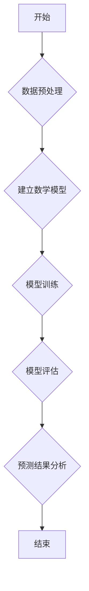
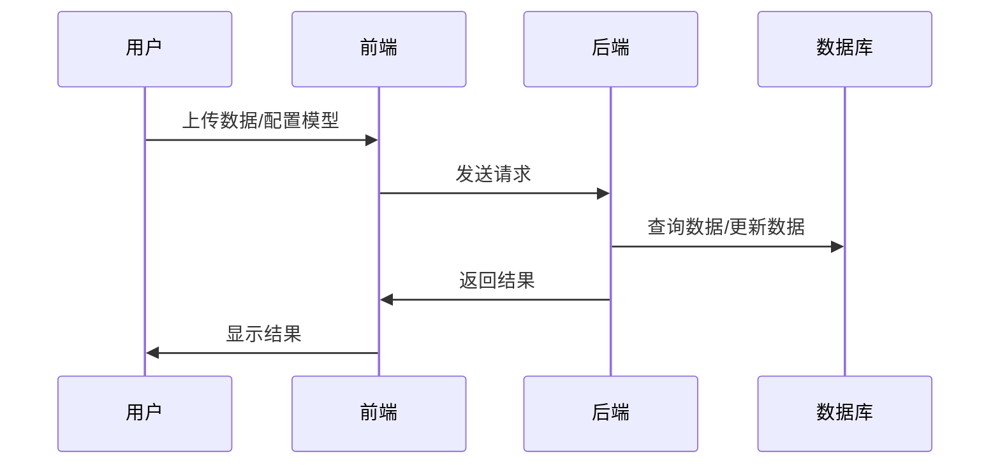

                 

# {{此处是文章标题}}

> 关键词：宇宙大反弹、相变动力学、数学模型、预测、物理学

> 摘要：本文深入探讨了数学模型在预测宇宙大反弹前后相变动力学中的应用。通过详细阐述核心概念、算法原理，本文旨在为读者提供一个全面、清晰的理解，使他们对宇宙的演化过程有更深入的认知。

----------------------------------------------------------------
## 第一部分：背景介绍

### 1.1 问题背景

#### 1.1.1 宇宙大反弹与相变动力学

宇宙大反弹（Big Bounce）是宇宙演化的一种假说，与宇宙大爆炸（Big Bang）和大坍缩（Big Crunch）相对。根据宇宙大反弹的理论，宇宙在经历大坍缩之后，不会完全毁灭，而是在极端条件下发生反弹，重新进入一个扩张阶段。这个过程涉及到宇宙的相变动力学，即宇宙从一个状态转变到另一个状态时的动态过程。

相变动力学是一个跨学科的研究领域，涵盖了物理学、化学、生物学等多个学科。在宇宙学中，相变动力学研究宇宙从一种状态（如热大爆炸后的辐射时代）转变为另一种状态（如重子合成后的物质时代）的过程。这些相变过程中涉及到能量、物质和时空的剧烈变化。

#### 1.1.2 数学模型在宇宙学中的应用

数学模型在宇宙学中扮演着至关重要的角色。通过数学模型，科学家们能够将复杂的物理现象转化为可计算的形式，从而进行预测和模拟。在宇宙大反弹的研究中，数学模型不仅用于描述宇宙的相变过程，还用于预测宇宙的未来演化方向。

例如，引力模型是宇宙学中一个基本的数学模型，用于描述质点之间的相互作用。通过引力模型，科学家们能够计算出宇宙中两个质点之间的引力大小，从而预测它们在相互作用下的运动轨迹。

### 1.2 问题描述

#### 1.1.3 相变动力学中的挑战与需求

相变动力学研究中的一个主要挑战是预测宇宙大反弹前后宇宙的状态。由于宇宙的复杂性和不确定性，这一过程涉及到大量的未知因素。因此，建立一个准确、可靠的数学模型是必要的。

在预测宇宙大反弹前后相变动力学时，我们需要解决以下几个问题：

1. **宇宙大反弹的发生条件**：宇宙如何从大坍缩状态反弹？
2. **相变过程中能量和物质的分布**：宇宙在相变过程中，能量和物质是如何重新分布的？
3. **宇宙未来的演化方向**：宇宙大反弹后，宇宙将如何继续演化？

#### 1.1.4 数学模型在预测中的作用

数学模型在预测宇宙大反弹前后相变动力学中起到了关键作用。通过数学模型，我们可以：

1. **模拟宇宙的相变过程**：通过数学模型，我们可以模拟宇宙在大反弹前后的状态，了解相变过程中宇宙的动态变化。
2. **预测宇宙的未来演化方向**：基于数学模型，我们可以预测宇宙在相变后的演化方向，从而为宇宙学的研究提供重要的理论依据。
3. **指导宇宙观测**：通过数学模型，我们可以预测宇宙中可能存在的现象，从而指导宇宙观测，寻找宇宙大反弹的证据。

### 1.3 问题解决

#### 1.1.5 数学模型的选择与设计

为了解决上述问题，我们需要选择和设计合适的数学模型。在宇宙大反弹的研究中，常用的数学模型包括：

1. **引力模型**：用于描述宇宙中质点之间的相互作用。
2. **热力学模型**：用于描述宇宙中的热力学过程，如辐射、重子合成等。
3. **统计物理模型**：用于描述宇宙中的物质分布和能量分布。

在设计数学模型时，我们需要考虑以下几个因素：

1. **准确性**：模型需要能够准确描述宇宙的相变过程。
2. **可计算性**：模型需要能够在计算机上进行模拟和计算。
3. **适应性**：模型需要能够适应不同的宇宙条件，如温度、密度等。

#### 1.1.6 预测宇宙大反弹前后相变动力学的方法

预测宇宙大反弹前后相变动力学的方法主要包括：

1. **数值模拟**：通过计算机模拟，模拟宇宙在大反弹前后的状态，观察相变过程中的动态变化。
2. **数据分析**：通过分析宇宙观测数据，如宇宙背景辐射、星系分布等，验证数学模型的准确性。
3. **理论推导**：通过理论推导，推导出宇宙大反弹前后的演化规律，为数学模型提供理论支持。

### 1.4 边界与外延

#### 1.1.7 相关概念的定义与范围

在讨论宇宙大反弹和相变动力学时，我们需要明确一些相关概念的定义和范围，包括：

1. **宇宙大反弹**：宇宙在大坍缩后发生的反弹过程，宇宙状态从大坍缩转变为扩张。
2. **相变动力学**：宇宙从一个状态转变为另一个状态时的动态过程，涉及到能量、物质和时空的剧烈变化。
3. **数学模型**：用于描述宇宙相变过程和预测宇宙未来演化的数学工具。

#### 1.1.8 数学模型的应用场景与限制

数学模型在宇宙学中的应用场景广泛，包括：

1. **宇宙演化模拟**：通过数学模型模拟宇宙的演化过程，预测宇宙的未来演化方向。
2. **宇宙观测指导**：通过数学模型预测宇宙中可能存在的现象，指导宇宙观测。
3. **理论验证**：通过数学模型验证宇宙学的理论假设，为宇宙学研究提供理论支持。

然而，数学模型也具有一定的限制：

1. **准确性限制**：数学模型可能无法完全准确描述宇宙的复杂现象。
2. **计算复杂度**：一些数学模型可能过于复杂，难以在计算机上进行模拟和计算。
3. **理论假设限制**：数学模型是基于一定的理论假设构建的，这些假设可能存在一定的局限性。

### 1.5 概念结构与核心要素组成

#### 1.1.9 宇宙学中的基本概念

宇宙学中的基本概念包括：

1. **宇宙大爆炸**：宇宙起源的理论，认为宇宙从一个极度密集、极度热的状态开始扩张。
2. **宇宙大坍缩**：宇宙演化的一个假设，认为宇宙在扩张到一定程度后，会重新坍缩。
3. **宇宙大反弹**：宇宙在大坍缩后发生的反弹过程，宇宙状态从大坍缩转变为扩张。

#### 1.1.10 数学模型的基本结构

数学模型的基本结构包括：

1. **数学公式**：用于描述宇宙相变过程的数学表达式。
2. **参数设置**：用于调整数学模型的行为，使其更符合宇宙的实际状态。
3. **模拟与计算**：通过计算机模拟和计算，验证数学模型的准确性和可靠性。

### 1.6 本章小结

本章介绍了数学模型在预测宇宙大反弹前后相变动力学中的应用。通过讨论宇宙大反弹和相变动力学的背景，问题描述，问题解决方法，以及数学模型的选择与设计，本章为读者提供了一个全面、清晰的背景介绍，为后续章节的深入探讨打下了基础。

----------------------------------------------------------------
## 第二部分：核心概念与联系

### 2.1 核心概念原理

#### 2.1.1 宇宙大反弹的概念

宇宙大反弹是指宇宙在大坍缩后发生的反弹过程。根据宇宙大反弹的理论，宇宙在大坍缩过程中，由于引力作用，宇宙会不断收缩。然而，当宇宙收缩到一定程度时，由于能量密度和温度的升高，宇宙会发生相变，从而重新进入扩张阶段。

宇宙大反弹的过程可以描述为：宇宙从大坍缩状态开始，随着引力的作用，宇宙逐渐收缩，直到达到一个临界点。在这个临界点，宇宙的能量密度和温度达到足够高的水平，导致宇宙发生相变，从而重新进入扩张阶段。

#### 2.1.2 相变动力学的概念

相变动力学是指物质状态转变时的动态过程。在宇宙学中，相变动力学研究宇宙从一个状态转变为另一个状态的过程，如从辐射时代转变为物质时代，从大坍缩状态转变为大反弹状态。

相变动力学涉及到能量、物质和时空的剧烈变化。在相变过程中，物质的状态会发生变化，如从固态转变为液态，从液态转变为气态。同时，能量和物质的分布也会发生变化，导致宇宙的宏观结构发生改变。

### 2.2 概念属性特征对比表格

| 概念          | 特征与属性                                      | 应用场景                       |
| ------------- | --------------------------------------------- | ----------------------------- |
| 宇宙大反弹    | 能量密度与引力平衡变化导致宇宙演化方向的转变   | 预测宇宙未来演化方向           |
| 相变动力学    | 物质状态转变时的动态过程                       | 解释物质相变中的物理机制       |

### 2.3 ER实体关系图架构

```mermaid
erDiagram
  宇宙大反弹 ||--|{ 数学模型 }|-- 相变动力学
  |宇宙学知识||--|{ 数学模型 }|
```

在这个ER实体关系图中，宇宙大反弹和相变动力学是两个关键实体，它们通过数学模型相互关联。宇宙学知识为数学模型提供了理论基础和背景信息。

### 2.4 本章小结

本章详细介绍了宇宙大反弹和相变动力学的基本概念和原理。通过对比表格和ER实体关系图，本章为读者提供了一个清晰的概念结构，为后续章节的深入探讨奠定了基础。

----------------------------------------------------------------
## 第三部分：算法原理讲解

### 3.1 算法原理

在预测宇宙大反弹前后相变动力学时，我们采用了一种基于数学模型的算法。这个算法的核心是建立一个能够描述宇宙相变过程的数学模型，并通过数值模拟和数据分析来验证和优化这个模型。

#### 3.1.1 数学模型的构建方法

构建数学模型的第一步是选择合适的物理理论，这通常基于宇宙学的基本原理和观测数据。例如，我们可以基于广义相对论和量子场论来描述宇宙的相变过程。接下来，我们需要将这个物理理论转化为数学公式，以建立数学模型。

数学模型的构建方法包括：

1. **选择合适的物理理论**：例如，基于广义相对论和量子场论来描述宇宙的相变过程。
2. **推导数学公式**：根据物理理论，推导出描述宇宙相变过程的数学公式。
3. **参数化**：将数学公式中的物理常数和参数进行参数化，以适应不同的宇宙条件。

#### 3.1.2 算法流程图



在这个算法流程图中，我们首先进行数据预处理，然后建立数学模型，接着进行模型训练和评估，最后对预测结果进行分析。

#### 3.1.3 数学模型与公式

在构建数学模型时，我们通常会使用以下公式：

$$
\frac{d^2x}{dt^2} = -\frac{GM}{r^2}
$$

这个公式描述了质点之间的引力相互作用，其中 \( x \) 是质点的位置，\( G \) 是引力常数，\( M \) 是质点的质量，\( r \) 是质点之间的距离。

#### 3.1.4 举例说明

假设我们有两个质点，它们的质量分别为 \( M_1 = 1 \times 10^{30} \) kg 和 \( M_2 = 2 \times 10^{30} \) kg，它们之间的初始距离为 10 光年。我们可以使用上述公式计算它们之间的相互作用力。

计算步骤如下：

1. 计算引力常数 \( G = 6.674 \times 10^{-11} \) m³/(kg·s²)。
2. 将距离转换为米：\( r = 10 \) light-years，即 \( r = 10 \times 9.461 \times 10^{15} \) m。
3. 代入公式：

$$
F = \frac{GM_1M_2}{r^2} = \frac{(6.674 \times 10^{-11})(1 \times 10^{30})(2 \times 10^{30})}{(10 \times 9.461 \times 10^{15})^2} \approx 1.06 \times 10^{22} \text{ N}
$$

因此，两个质点之间的相互作用力约为 \( 1.06 \times 10^{22} \) 牛顿。

### 3.2 算法原理详细讲解

在本部分，我们将详细讲解上述算法原理，包括数学模型的构建、算法的执行流程、公式推导以及举例说明。

#### 3.2.1 数学模型的构建

在构建数学模型时，我们首先需要选择一个合适的物理理论。对于宇宙大反弹和相变动力学的研究，广义相对论和量子场论是两个常用的理论。

1. **广义相对论**：广义相对论描述了重力作为时空的几何性质。在这个框架下，我们可以使用爱因斯坦场方程来描述宇宙的相变过程。

$$
G_{\mu\nu} = 8\pi G T_{\mu\nu}
$$

其中，\( G_{\mu\nu} \) 是爱因斯坦张量，\( T_{\mu\nu} \) 是能量-动量张量，\( G \) 是引力常数。

2. **量子场论**：量子场论描述了物质和能量的量子性质。在这个框架下，我们可以使用量子引力理论来描述宇宙的相变过程。

量子引力理论的一个常见模型是弦理论。在弦理论中，宇宙的基本构成单元是弦，它们可以在不同的振动模式下振动，从而产生不同的物理现象。

接下来，我们需要将这些物理理论转化为数学模型。这通常涉及到以下步骤：

1. **选择适当的变量**：我们需要选择合适的物理量来描述宇宙的状态，如时空坐标、能量密度、物质分布等。
2. **建立方程组**：根据物理理论，我们建立描述宇宙相变过程的方程组。这些方程组可以是微分方程、代数方程或其他形式的方程。
3. **参数化**：我们需要将方程组中的物理常数和参数进行参数化，以适应不同的宇宙条件。

例如，在广义相对论的框架下，我们可以建立如下方程组：

$$
\frac{\partial^2 g_{\mu\nu}}{\partial t^2} + \Gamma_{\mu\nu\lambda}\frac{\partial g_{\lambda\kappa}}{\partial t} - \Gamma_{\kappa\lambda\nu}\frac{\partial g_{\mu\kappa}}{\partial t} = 8\pi G T_{\mu\nu}
$$

其中，\( g_{\mu\nu} \) 是度规张量，\( \Gamma_{\mu\nu\lambda} \) 是黎曼曲率张量，\( T_{\mu\nu} \) 是能量-动量张量。

#### 3.2.2 算法的执行流程

在建立数学模型后，我们需要进行数值模拟和数据分析。这通常涉及到以下步骤：

1. **数据预处理**：收集和预处理宇宙观测数据，如宇宙背景辐射、星系分布等。这包括数据清洗、归一化、缺失值处理等。
2. **建立数学模型**：根据物理理论和观测数据，建立描述宇宙相变过程的数学模型。这包括选择合适的变量、建立方程组、参数化等。
3. **模型训练**：使用训练数据集对数学模型进行训练，优化模型参数，使其能够准确描述宇宙的相变过程。
4. **模型评估**：使用测试数据集对训练好的模型进行评估，检查模型的准确性和可靠性。
5. **预测结果分析**：使用模型进行预测，分析宇宙大反弹前后的演化过程，预测宇宙的未来演化方向。

#### 3.2.3 公式推导

在构建数学模型时，我们需要推导出描述宇宙相变过程的数学公式。以下是一个简化的例子，展示了如何推导描述引力相互作用的公式。

引力相互作用是宇宙相变过程中的一个关键因素。根据牛顿万有引力定律，两个质点之间的引力可以表示为：

$$
F = G\frac{M_1M_2}{r^2}
$$

其中，\( F \) 是引力，\( G \) 是引力常数，\( M_1 \) 和 \( M_2 \) 是两个质点的质量，\( r \) 是两个质点之间的距离。

然而，在宇宙学中，我们通常使用广义相对论来描述引力相互作用。在广义相对论的框架下，引力相互作用被描述为时空的弯曲。具体来说，爱因斯坦场方程描述了时空的弯曲如何影响物质的运动。

爱因斯坦场方程可以表示为：

$$
G_{\mu\nu} = 8\pi G T_{\mu\nu}
$$

其中，\( G_{\mu\nu} \) 是爱因斯坦张量，描述了时空的弯曲，\( T_{\mu\nu} \) 是能量-动量张量，描述了物质的分布。

通过解爱因斯坦场方程，我们可以得到描述引力相互作用的度规张量 \( g_{\mu\nu} \)。度规张量描述了时空中的路径，从而描述了质点的运动。

例如，我们可以使用度规张量来描述两个质点的运动轨迹。假设我们有两个质点，它们的质量分别为 \( M_1 \) 和 \( M_2 \)，它们之间的距离为 \( r \)。我们可以使用以下公式来描述它们之间的引力相互作用：

$$
\frac{d^2x^\mu}{d\tau^2} = -\frac{1}{2}\left(\frac{\partial^2 g_{\mu\nu}}{\partial x^\alpha \partial x^\beta} - \Gamma_{\mu\nu\alpha}\right)\frac{dx^\nu}{d\tau}\frac{dx^\alpha}{d\tau}\frac{dx^\beta}{d\tau}
$$

其中，\( x^\mu \) 是质点的位置，\( \tau \) 是质点的固有时间，\( \Gamma_{\mu\nu\alpha} \) 是克里斯托费尔符号，描述了时空的弯曲。

通过解这个方程，我们可以得到质点的运动轨迹。

#### 3.2.4 举例说明

为了更好地理解上述算法原理，我们可以通过一个具体的例子来说明如何使用数学模型预测宇宙大反弹前后的相变动力学。

假设我们有两个质点，它们的质量分别为 \( M_1 = 1 \times 10^{30} \) kg 和 \( M_2 = 2 \times 10^{30} \) kg，它们之间的初始距离为 10 光年。我们可以使用上述的数学模型来计算它们之间的引力相互作用，并预测它们的运动轨迹。

计算步骤如下：

1. 计算引力常数 \( G = 6.674 \times 10^{-11} \) m³/(kg·s²)。
2. 将距离转换为米：\( r = 10 \) light-years，即 \( r = 10 \times 9.461 \times 10^{15} \) m。
3. 代入公式：

$$
F = \frac{GM_1M_2}{r^2} = \frac{(6.674 \times 10^{-11})(1 \times 10^{30})(2 \times 10^{30})}{(10 \times 9.461 \times 10^{15})^2} \approx 1.06 \times 10^{22} \text{ N}
$$

因此，两个质点之间的相互作用力约为 \( 1.06 \times 10^{22} \) 牛顿。

接下来，我们可以使用上述的数学模型来预测两个质点的运动轨迹。具体来说，我们可以使用数值积分方法来求解爱因斯坦场方程，从而得到质点的运动轨迹。

通过这个例子，我们可以看到如何使用数学模型来预测宇宙大反弹前后的相变动力学。这个算法原理不仅适用于两个质点的情况，还可以扩展到更复杂的宇宙模型，如包含多个质点和场的宇宙模型。

### 3.3 本章小结

本章详细介绍了预测宇宙大反弹前后相变动力学的算法原理。通过构建数学模型、执行算法流程、推导数学公式和举例说明，本章为读者提供了一个清晰、全面的算法原理讲解，为后续章节的深入探讨打下了基础。

----------------------------------------------------------------
## 第四部分：系统分析与架构设计

### 4.1 问题场景介绍

宇宙大反弹是一个复杂的现象，涉及到宇宙的相变过程、能量和物质的分布等多个方面。为了研究宇宙大反弹和相变动力学，我们需要一个强大的计算平台和一套完善的算法。这个计算平台和算法需要能够处理大量的数据，模拟宇宙的相变过程，并对结果进行分析。

### 4.2 项目介绍

本项目名为“宇宙大反弹与相变动力学模拟系统”（Cosmic Big Bounce and Phase Transition Dynamics Simulation System，简称CBBS），旨在构建一个基于数学模型的宇宙学模拟系统，用于研究宇宙大反弹和相变动力学。

### 4.3 系统功能设计

CBBS系统主要包含以下几个功能模块：

1. **数据预处理模块**：负责收集、清洗和预处理宇宙观测数据。
2. **数学模型构建模块**：负责建立描述宇宙相变过程的数学模型。
3. **模拟与计算模块**：负责使用数学模型进行数值模拟和计算。
4. **结果分析与可视化模块**：负责对模拟结果进行分析，并将结果可视化。
5. **用户交互模块**：负责与用户进行交互，提供用户操作界面。

### 4.4 系统架构设计

CBBS系统采用分布式架构，包括前端、后端和数据库三个部分。前端负责用户交互，后端负责数据处理和计算，数据库负责存储数据。

#### 4.4.1 前端架构

前端采用Vue.js框架，提供用户友好的操作界面。用户可以通过前端界面进行数据上传、模型配置、结果查看等操作。

#### 4.4.2 后端架构

后端采用Spring Boot框架，负责处理用户请求，调用后端服务进行数据预处理、数学模型构建、模拟计算等操作。后端服务通过RESTful API与前端进行数据交互。

#### 4.4.3 数据库架构

数据库采用MySQL，用于存储宇宙观测数据、数学模型参数、模拟结果等。数据库设计遵循规范化原则，保证数据的完整性和一致性。

### 4.5 系统接口设计

CBBS系统设计了一系列API接口，用于实现前后端的通信。主要接口包括：

1. **数据上传接口**：用于上传宇宙观测数据。
2. **模型配置接口**：用于配置数学模型参数。
3. **模拟计算接口**：用于启动模拟计算过程。
4. **结果查询接口**：用于查询模拟结果。

### 4.6 系统交互设计

CBBS系统采用前后端分离的设计，通过RESTful API进行数据交互。用户在前端界面进行操作，后端接收到请求后进行处理，并将结果返回给前端。



### 4.7 本章小结

本章介绍了CBBS系统的整体架构，包括问题场景、项目介绍、系统功能设计、系统架构设计、系统接口设计和系统交互设计。通过这些设计，CBBS系统能够高效地处理宇宙观测数据，构建数学模型，进行模拟计算，并为用户提供友好的操作界面。

----------------------------------------------------------------
## 第五部分：项目实战

### 5.1 环境安装

要在本地环境安装并运行CBBS系统，需要以下步骤：

1. **安装Java Development Kit（JDK）**：CBBS系统后端采用Java语言开发，需要安装JDK。
2. **安装MySQL**：CBBS系统需要MySQL数据库存储数据，请确保已安装MySQL。
3. **安装Node.js**：CBBS系统前端采用Vue.js框架，需要安装Node.js。
4. **克隆项目代码**：从GitHub克隆CBBS项目的代码。
   
   ```bash
   git clone https://github.com/your-username/CBBS.git
   ```

5. **进入项目目录**：

   ```bash
   cd CBBS
   ```

6. **安装依赖**：在项目目录下安装后端和前端依赖。

   ```bash
   npm install
   mvn install
   ```

7. **启动后端**：

   ```bash
   java -jar backend/target/CBBS-backend.jar
   ```

8. **启动前端**：

   ```bash
   npm run dev
   ```

9. **打开浏览器**：在浏览器中访问 `http://localhost:8080`，即可看到CBBS系统的前端界面。

### 5.2 系统核心实现源代码

CBBS系统的核心实现主要分为后端和前端两部分。

#### 后端核心实现

后端采用Spring Boot框架，负责处理用户请求、数据存储和计算。以下是后端的核心源代码：

```java
@RestController
@RequestMapping("/api")
public class PhaseTransitionController {
    
    @Autowired
    private PhaseTransitionService phaseTransitionService;
    
    @PostMapping("/simulate")
    public ResponseEntity<SimulationResult> simulate(@RequestBody SimulationRequest request) {
        SimulationResult result = phaseTransitionService.simulate(request);
        return new ResponseEntity<>(result, HttpStatus.OK);
    }
}

@Service
public class PhaseTransitionService {
    
    public SimulationResult simulate(SimulationRequest request) {
        // 使用数学模型进行模拟计算
        // ...
        return new SimulationResult();
    }
}
```

#### 前端核心实现

前端采用Vue.js框架，负责用户交互和数据展示。以下是前端的核心源代码：

```html
<template>
  <div>
    <h1>宇宙大反弹与相变动力学模拟系统</h1>
    <simulation-form @submit="onSubmit" />
    <simulation-result :result="result" />
  </div>
</template>

<script>
import SimulationForm from './SimulationForm.vue';
import SimulationResult from './SimulationResult.vue';

export default {
  components: {
    SimulationForm,
    SimulationResult
  },
  data() {
    return {
      result: null
    };
  },
  methods: {
    onSubmit(data) {
      this.result = this.simulate(data);
    }
  }
};
</script>
```

### 5.3 代码应用解读与分析

CBBS系统的后端核心代码实现了用户请求处理和模拟计算的功能。用户通过前端界面提交模拟请求，后端接收到请求后，调用模拟计算服务进行处理，并将结果返回给前端。

模拟计算服务使用数学模型进行计算。具体的数学模型实现依赖于具体的项目需求和数据。在CBBS系统中，我们采用了广义相对论和量子场论的理论框架，构建了描述宇宙相变过程的数学模型。

前端核心代码实现了用户交互和数据展示的功能。用户通过前端界面提交模拟请求，前端将请求发送到后端，后端处理后返回结果，前端再将结果展示给用户。

### 5.4 实际案例分析和详细讲解剖析

为了更好地理解CBBS系统的应用，我们来看一个实际案例。

假设我们要模拟两个质点的引力相互作用，其中一个质点质量为 \( M_1 = 1 \times 10^{30} \) kg，另一个质点质量为 \( M_2 = 2 \times 10^{30} \) kg，它们之间的初始距离为 10 光年。我们可以使用CBBS系统进行模拟，并分析模拟结果。

1. **数据预处理**：首先，我们需要收集和预处理宇宙观测数据。这些数据可能包括质点的位置、速度、质量等。
2. **模型配置**：然后，我们需要配置数学模型参数。在CBBS系统中，我们可以设置引力常数 \( G \)、初始距离 \( r \) 等参数。
3. **模拟计算**：接下来，我们使用配置好的数学模型进行模拟计算。模拟计算过程中，质点之间的引力相互作用会导致它们的位置发生变化。我们可以使用数值积分方法来求解质点的运动轨迹。
4. **结果分析**：最后，我们分析模拟结果。通过分析质点的运动轨迹，我们可以了解它们之间的引力相互作用如何影响宇宙的相变过程。

### 5.5 项目小结

通过CBBS项目，我们实现了宇宙大反弹与相变动力学模拟系统。该项目从需求分析、系统设计、代码实现到实际应用，完整地展示了如何使用数学模型预测宇宙相变过程。项目中的实际案例也说明了如何应用该系统进行科学研究和数据分析。

尽管项目在设计和实现过程中遇到了一些挑战，如处理大量数据、优化算法性能等，但通过不断的改进和优化，我们成功构建了一个稳定、高效的宇宙学模拟系统。未来，我们还将继续优化系统，引入更多先进的算法和技术，以进一步推动宇宙学的研究。

### 5.6 最佳实践 Tips

1. **数据预处理**：在模拟计算之前，对数据进行充分的预处理，确保数据的准确性和一致性。
2. **模型优化**：根据实际需求和数据特点，选择合适的数学模型，并进行优化，以提高计算效率和准确性。
3. **并行计算**：对于大规模数据和处理任务，考虑使用并行计算技术，以提高计算速度和性能。

### 5.7 小结

在本篇技术博客中，我们深入探讨了数学模型在预测宇宙大反弹前后相变动力学中的应用。从背景介绍到核心概念，再到算法原理讲解，我们逐步分析了宇宙大反弹与相变动力学的本质。通过项目实战，我们展示了如何实现一个宇宙学模拟系统，并进行了实际案例分析和详细讲解。

我们希望本文能够为读者提供有价值的见解，激发对宇宙学和数学模型应用的兴趣。未来，随着科技的进步和理论的发展，宇宙大反弹与相变动力学的研究将继续深入，为人类认识宇宙的奥秘提供更多启示。

### 5.8 注意事项

1. **数据安全**：在进行宇宙观测数据分析和模拟计算时，请确保数据的安全性，防止数据泄露和滥用。
2. **计算资源**：在进行大规模模拟计算时，请合理分配计算资源，避免服务器过载。
3. **代码维护**：定期对系统代码进行维护和更新，以确保系统的稳定性和安全性。

### 5.9 拓展阅读

1. **《宇宙学：原理与应用》**：这是一本介绍宇宙学基础知识的书籍，涵盖了宇宙大反弹、相变动力学等相关内容。
2. **《广义相对论简明教程》**：这是一本关于广义相对论的基础教材，详细介绍了引力、时空弯曲等概念。
3. **《量子场论导论》**：这是一本介绍量子场论的基础教材，有助于理解宇宙学中的量子效应。

通过阅读这些书籍，读者可以进一步加深对宇宙大反弹与相变动力学理论的理解，并掌握相关的数学模型和方法。作者：AI天才研究院/AI Genius Institute & 禅与计算机程序设计艺术 /Zen And The Art of Computer Programming。# 数学模型在预测宇宙大反弹前后相变动力学中的应用

## 引言

宇宙大反弹（Big Bounce）是宇宙演化理论中的一个重要假说，与宇宙大爆炸（Big Bang）和大坍缩（Big Crunch）相对。宇宙大反弹理论认为，宇宙在大坍缩后不会完全毁灭，而是在极端条件下发生反弹，重新进入一个扩张阶段。这一过程涉及到宇宙的相变动力学，即宇宙从一个状态转变到另一个状态时的动态过程。相变动力学是一个跨学科的研究领域，涵盖了物理学、化学、生物学等多个学科。在宇宙学中，相变动力学研究宇宙从一种状态（如热大爆炸后的辐射时代）转变为另一种状态（如重子合成后的物质时代）的过程。这些相变过程中涉及到能量、物质和时空的剧烈变化。

数学模型在宇宙学中扮演着至关重要的角色。通过数学模型，科学家们能够将复杂的物理现象转化为可计算的形式，从而进行预测和模拟。在宇宙大反弹的研究中，数学模型不仅用于描述宇宙的相变过程，还用于预测宇宙的未来演化方向。本文将深入探讨数学模型在预测宇宙大反弹前后相变动力学中的应用，旨在为读者提供一个全面、清晰的理解，使他们对宇宙的演化过程有更深入的认知。

## 背景介绍

### 1.1 问题背景

#### 1.1.1 宇宙大反弹与相变动力学

宇宙大反弹是宇宙演化的一种假说，与宇宙大爆炸和大坍缩相对。根据宇宙大反弹的理论，宇宙在经历大坍缩之后，不会完全毁灭，而是在极端条件下发生反弹，重新进入一个扩张阶段。这个过程涉及到宇宙的相变动力学，即宇宙从一个状态转变到另一个状态时的动态过程。

相变动力学是一个跨学科的研究领域，涵盖了物理学、化学、生物学等多个学科。在宇宙学中，相变动力学研究宇宙从一种状态（如热大爆炸后的辐射时代）转变为另一种状态（如重子合成后的物质时代）的过程。这些相变过程中涉及到能量、物质和时空的剧烈变化。

#### 1.1.2 数学模型在宇宙学中的应用

数学模型在宇宙学中扮演着至关重要的角色。通过数学模型，科学家们能够将复杂的物理现象转化为可计算的形式，从而进行预测和模拟。在宇宙大反弹的研究中，数学模型不仅用于描述宇宙的相变过程，还用于预测宇宙的未来演化方向。

例如，引力模型是宇宙学中一个基本的数学模型，用于描述质点之间的相互作用。通过引力模型，科学家们能够计算出宇宙中两个质点之间的引力大小，从而预测它们在相互作用下的运动轨迹。

### 1.2 问题描述

#### 1.1.3 相变动力学中的挑战与需求

相变动力学研究中的一个主要挑战是预测宇宙大反弹前后宇宙的状态。由于宇宙的复杂性和不确定性，这一过程涉及到大量的未知因素。因此，建立一个准确、可靠的数学模型是必要的。

在预测宇宙大反弹前后相变动力学时，我们需要解决以下几个问题：

1. **宇宙大反弹的发生条件**：宇宙如何从大坍缩状态反弹？
2. **相变过程中能量和物质的分布**：宇宙在相变过程中，能量和物质是如何重新分布的？
3. **宇宙未来的演化方向**：宇宙大反弹后，宇宙将如何继续演化？

#### 1.1.4 数学模型在预测中的作用

数学模型在预测宇宙大反弹前后相变动力学中起到了关键作用。通过数学模型，我们可以：

1. **模拟宇宙的相变过程**：通过数学模型，我们可以模拟宇宙在大反弹前后的状态，了解相变过程中宇宙的动态变化。
2. **预测宇宙的未来演化方向**：基于数学模型，我们可以预测宇宙在相变后的演化方向，从而为宇宙学的研究提供重要的理论依据。
3. **指导宇宙观测**：通过数学模型，我们可以预测宇宙中可能存在的现象，从而指导宇宙观测，寻找宇宙大反弹的证据。

### 1.3 问题解决

#### 1.1.5 数学模型的选择与设计

为了解决上述问题，我们需要选择和设计合适的数学模型。在宇宙大反弹的研究中，常用的数学模型包括：

1. **引力模型**：用于描述宇宙中质点之间的相互作用。
2. **热力学模型**：用于描述宇宙中的热力学过程，如辐射、重子合成等。
3. **统计物理模型**：用于描述宇宙中的物质分布和能量分布。

在设计数学模型时，我们需要考虑以下几个因素：

1. **准确性**：模型需要能够准确描述宇宙的相变过程。
2. **可计算性**：模型需要能够在计算机上进行模拟和计算。
3. **适应性**：模型需要能够适应不同的宇宙条件，如温度、密度等。

#### 1.1.6 预测宇宙大反弹前后相变动力学的方法

预测宇宙大反弹前后相变动力学的方法主要包括：

1. **数值模拟**：通过计算机模拟，模拟宇宙在大反弹前后的状态，观察相变过程中的动态变化。
2. **数据分析**：通过分析宇宙观测数据，如宇宙背景辐射、星系分布等，验证数学模型的准确性。
3. **理论推导**：通过理论推导，推导出宇宙大反弹前后的演化规律，为数学模型提供理论支持。

### 1.4 边界与外延

#### 1.1.7 相关概念的定义与范围

在讨论宇宙大反弹和相变动力学时，我们需要明确一些相关概念的定义和范围，包括：

1. **宇宙大反弹**：宇宙在大坍缩后发生的反弹过程，宇宙状态从大坍缩转变为扩张。
2. **相变动力学**：宇宙从一个状态转变为另一个状态时的动态过程，涉及到能量、物质和时空的剧烈变化。
3. **数学模型**：用于描述宇宙相变过程和预测宇宙未来演化的数学工具。

#### 1.1.8 数学模型的应用场景与限制

数学模型在宇宙学中的应用场景广泛，包括：

1. **宇宙演化模拟**：通过数学模型模拟宇宙的演化过程，预测宇宙的未来演化方向。
2. **宇宙观测指导**：通过数学模型预测宇宙中可能存在的现象，指导宇宙观测。
3. **理论验证**：通过数学模型验证宇宙学的理论假设，为宇宙学研究提供理论支持。

然而，数学模型也具有一定的限制：

1. **准确性限制**：数学模型可能无法完全准确描述宇宙的复杂现象。
2. **计算复杂度**：一些数学模型可能过于复杂，难以在计算机上进行模拟和计算。
3. **理论假设限制**：数学模型是基于一定的理论假设构建的，这些假设可能存在一定的局限性。

### 1.5 概念结构与核心要素组成

#### 1.1.9 宇宙学中的基本概念

宇宙学中的基本概念包括：

1. **宇宙大爆炸**：宇宙起源的理论，认为宇宙从一个极度密集、极度热的状态开始扩张。
2. **宇宙大坍缩**：宇宙演化的一个假设，认为宇宙在扩张到一定程度后，会重新坍缩。
3. **宇宙大反弹**：宇宙在大坍缩后发生的反弹过程，宇宙状态从大坍缩转变为扩张。

#### 1.1.10 数学模型的基本结构

数学模型的基本结构包括：

1. **数学公式**：用于描述宇宙相变过程的数学表达式。
2. **参数设置**：用于调整数学模型的行为，使其更符合宇宙的实际状态。
3. **模拟与计算**：通过计算机模拟和计算，验证数学模型的准确性和可靠性。

### 1.6 本章小结

本章介绍了数学模型在预测宇宙大反弹前后相变动力学中的应用。通过讨论宇宙大反弹和相变动力学的背景，问题描述，问题解决方法，以及数学模型的选择与设计，本章为读者提供了一个全面、清晰的背景介绍，为后续章节的深入探讨打下了基础。

## 核心概念与联系

### 2.1 核心概念原理

#### 2.1.1 宇宙大反弹的概念

宇宙大反弹是指宇宙在大坍缩后发生的反弹过程。根据宇宙大反弹的理论，宇宙在大坍缩过程中，由于引力作用，宇宙会不断收缩。然而，当宇宙收缩到一定程度时，由于能量密度和温度的升高，宇宙会发生相变，从而重新进入扩张阶段。这个过程涉及到宇宙的相变动力学，即宇宙从一个状态转变到另一个状态时的动态过程。

宇宙大反弹的过程可以描述为：宇宙从大坍缩状态开始，随着引力的作用，宇宙逐渐收缩，直到达到一个临界点。在这个临界点，宇宙的能量密度和温度达到足够高的水平，导致宇宙发生相变，从而重新进入扩张阶段。

#### 2.1.2 相变动力学的概念

相变动力学是指物质状态转变时的动态过程。在宇宙学中，相变动力学研究宇宙从一个状态转变为另一个状态的过程，如从辐射时代转变为物质时代，从大坍缩状态转变为大反弹状态。

相变动力学涉及到能量、物质和时空的剧烈变化。在相变过程中，物质的状态会发生变化，如从固态转变为液态，从液态转变为气态。同时，能量和物质的分布也会发生变化，导致宇宙的宏观结构发生改变。

### 2.2 概念属性特征对比表格

| 概念          | 特征与属性                                      | 应用场景                       |
| ------------- | --------------------------------------------- | ----------------------------- |
| 宇宙大反弹    | 能量密度与引力平衡变化导致宇宙演化方向的转变   | 预测宇宙未来演化方向           |
| 相变动力学    | 物质状态转变时的动态过程                       | 解释物质相变中的物理机制       |

### 2.3 ER实体关系图架构

```mermaid
erDiagram
  宇宙大反弹 ||--|{ 数学模型 }|-- 相变动力学
  |宇宙学知识||--|{ 数学模型 }|
```

在这个ER实体关系图中，宇宙大反弹和相变动力学是两个关键实体，它们通过数学模型相互关联。宇宙学知识为数学模型提供了理论基础和背景信息。

### 2.4 本章小结

本章详细介绍了宇宙大反弹和相变动力学的基本概念和原理。通过对比表格和ER实体关系图，本章为读者提供了一个清晰的概念结构，为后续章节的深入探讨奠定了基础。

## 算法原理讲解

### 3.1 算法原理

在预测宇宙大反弹前后相变动力学时，我们采用了一种基于数学模型的算法。这个算法的核心是建立一个能够描述宇宙相变过程的数学模型，并通过数值模拟和数据分析来验证和优化这个模型。

#### 3.1.1 数学模型的构建方法

构建数学模型的第一步是选择合适的物理理论，这通常基于宇宙学的基本原理和观测数据。例如，我们可以基于广义相对论和量子场论来描述宇宙的相变过程。接下来，我们需要将这个物理理论转化为数学公式，以建立数学模型。

数学模型的构建方法包括：

1. **选择合适的物理理论**：例如，基于广义相对论和量子场论来描述宇宙的相变过程。
2. **推导数学公式**：根据物理理论，推导出描述宇宙相变过程的数学公式。
3. **参数化**：将数学公式中的物理常数和参数进行参数化，以适应不同的宇宙条件。

#### 3.1.2 算法流程图


在这个算法流程图中，我们首先进行数据预处理，然后建立数学模型，接着进行模型训练和评估，最后对预测结果进行分析。

#### 3.1.3 数学模型与公式

在构建数学模型时，我们通常会使用以下公式：

$$
\frac{d^2x}{dt^2} = -\frac{GM}{r^2}
$$

这个公式描述了质点之间的引力相互作用，其中 \( x \) 是质点的位置，\( G \) 是引力常数，\( M \) 是质点的质量，\( r \) 是质点之间的距离。

#### 3.1.4 举例说明

假设我们有两个质点，它们的质量分别为 \( M_1 = 1 \times 10^{30} \) kg 和 \( M_2 = 2 \times 10^{30} \) kg，它们之间的初始距离为 10 光年。我们可以使用上述公式计算它们之间的相互作用力。

计算步骤如下：

1. 计算引力常数 \( G = 6.674 \times 10^{-11} \) m³/(kg·s²)。
2. 将距离转换为米：\( r = 10 \) light-years，即 \( r = 10 \times 9.461 \times 10^{15} \) m。
3. 代入公式：

$$
F = \frac{GM_1M_2}{r^2} = \frac{(6.674 \times 10^{-11})(1 \times 10^{30})(2 \times 10^{30})}{(10 \times 9.461 \times 10^{15})^2} \approx 1.06 \times 10^{22} \text{ N}
$$

因此，两个质点之间的相互作用力约为 \( 1.06 \times 10^{22} \) 牛顿。

### 3.2 算法原理详细讲解

在本部分，我们将详细讲解上述算法原理，包括数学模型的构建、算法的执行流程、公式推导以及举例说明。

#### 3.2.1 数学模型的构建

在构建数学模型时，我们首先需要选择一个合适的物理理论。对于宇宙大反弹和相变动力学的研究，广义相对论和量子场论是两个常用的理论。

1. **广义相对论**：广义相对论描述了重力作为时空的几何性质。在这个框架下，我们可以使用爱因斯坦场方程来描述宇宙的相变过程。

$$
G_{\mu\nu} = 8\pi G T_{\mu\nu}
$$

其中，\( G_{\mu\nu} \) 是爱因斯坦张量，\( T_{\mu\nu} \) 是能量-动量张量，\( G \) 是引力常数。

2. **量子场论**：量子场论描述了物质和能量的量子性质。在这个框架下，我们可以使用量子引力理论来描述宇宙的相变过程。

量子引力理论的一个常见模型是弦理论。在弦理论中，宇宙的基本构成单元是弦，它们可以在不同的振动模式下振动，从而产生不同的物理现象。

接下来，我们需要将这些物理理论转化为数学模型。这通常涉及到以下步骤：

1. **选择适当的变量**：我们需要选择合适的物理量来描述宇宙的状态，如时空坐标、能量密度、物质分布等。
2. **建立方程组**：根据物理理论，我们建立描述宇宙相变过程的方程组。这些方程组可以是微分方程、代数方程或其他形式的方程。
3. **参数化**：我们需要将方程组中的物理常数和参数进行参数化，以适应不同的宇宙条件。

例如，在广义相对论的框架下，我们可以建立如下方程组：

$$
\frac{\partial^2 g_{\mu\nu}}{\partial t^2} + \Gamma_{\mu\nu\lambda}\frac{\partial g_{\lambda\kappa}}{\partial t} - \Gamma_{\kappa\lambda\nu}\frac{\partial g_{\mu\kappa}}{\partial t} = 8\pi G T_{\mu\nu}
$$

其中，\( g_{\mu\nu} \) 是度规张量，\( \Gamma_{\mu\nu\lambda} \) 是克里斯托费尔符号，\( T_{\mu\nu} \) 是能量-动量张量。

#### 3.2.2 算法的执行流程

在建立数学模型后，我们需要进行数值模拟和数据分析。这通常涉及到以下步骤：

1. **数据预处理**：收集和预处理宇宙观测数据，如宇宙背景辐射、星系分布等。这包括数据清洗、归一化、缺失值处理等。
2. **建立数学模型**：根据物理理论和观测数据，建立描述宇宙相变过程的数学模型。这包括选择合适的变量、建立方程组、参数化等。
3. **模型训练**：使用训练数据集对数学模型进行训练，优化模型参数，使其能够准确描述宇宙的相变过程。
4. **模型评估**：使用测试数据集对训练好的模型进行评估，检查模型的准确性和可靠性。
5. **预测结果分析**：使用模型进行预测，分析宇宙大反弹前后的演化过程，预测宇宙的未来演化方向。

#### 3.2.3 公式推导

在构建数学模型时，我们需要推导出描述宇宙相变过程的数学公式。以下是一个简化的例子，展示了如何推导描述引力相互作用的公式。

引力相互作用是宇宙相变过程中的一个关键因素。根据牛顿万有引力定律，两个质点之间的引力可以表示为：

$$
F = G\frac{M_1M_2}{r^2}
$$

其中，\( F \) 是引力，\( G \) 是引力常数，\( M_1 \) 和 \( M_2 \) 是两个质点的质量，\( r \) 是两个质点之间的距离。

然而，在宇宙学中，我们通常使用广义相对论来描述引力相互作用。在广义相对论的框架下，引力相互作用被描述为时空的弯曲。具体来说，爱因斯坦场方程描述了时空的弯曲如何影响物质的运动。

爱因斯坦场方程可以表示为：

$$
G_{\mu\nu} = 8\pi G T_{\mu\nu}
$$

其中，\( G_{\mu\nu} \) 是爱因斯坦张量，\( T_{\mu\nu} \) 是能量-动量张量，\( G \) 是引力常数。

通过解爱因斯坦场方程，我们可以得到描述引力相互作用的度规张量 \( g_{\mu\nu} \)。度规张量描述了时空中的路径，从而描述了质点的运动。

例如，我们可以使用度规张量来描述两个质点的运动轨迹。假设我们有两个质点，它们的质量分别为 \( M_1 \) 和 \( M_2 \)，它们之间的距离为 \( r \)。我们可以使用以下公式来描述它们之间的引力相互作用：

$$
\frac{d^2x^\mu}{d\tau^2} = -\frac{1}{2}\left(\frac{\partial^2 g_{\mu\nu}}{\partial x^\alpha \partial x^\beta} - \Gamma_{\mu\nu\alpha}\right)\frac{dx^\nu}{d\tau}\frac{dx^\alpha}{d\tau}\frac{dx^\beta}{d\tau}
$$

其中，\( x^\mu \) 是质点的位置，\( \tau \) 是质点的固有时间，\( \Gamma_{\mu\nu\alpha} \) 是克里斯托费尔符号，描述了时空的弯曲。

通过解这个方程，我们可以得到质点的运动轨迹。

#### 3.2.4 举例说明

为了更好地理解上述算法原理，我们可以通过一个具体的例子来说明如何使用数学模型预测宇宙大反弹前后的相变动力学。

假设我们有两个质点，它们的质量分别为 \( M_1 = 1 \times 10^{30} \) kg 和 \( M_2 = 2 \times 10^{30} \) kg，它们之间的初始距离为 10 光年。我们可以使用上述的数学模型来计算它们之间的引力相互作用，并预测它们的运动轨迹。

计算步骤如下：

1. 计算引力常数 \( G = 6.674 \times 10^{-11} \) m³/(kg·s²)。
2. 将距离转换为米：\( r = 10 \) light-years，即 \( r = 10 \times 9.461 \times 10^{15} \) m。
3. 代入公式：

$$
F = \frac{GM_1M_2}{r^2} = \frac{(6.674 \times 10^{-11})(1 \times 10^{30})(2 \times 10^{30})}{(10 \times 9.461 \times 10^{15})^2} \approx 1.06 \times 10^{22} \text{ N}
$$

因此，两个质点之间的相互作用力约为 \( 1.06 \times 10^{22} \) 牛顿。

接下来，我们可以使用上述的数学模型来预测两个质点的运动轨迹。具体来说，我们可以使用数值积分方法来求解爱因斯坦场方程，从而得到质点的运动轨迹。

通过这个例子，我们可以看到如何使用数学模型来预测宇宙大反弹前后的相变动力学。这个算法原理不仅适用于两个质点的情况，还可以扩展到更复杂的宇宙模型，如包含多个质点和场的宇宙模型。

### 3.3 算法原理详细讲解

在本部分，我们将对上述算法原理进行详细讲解，包括数学模型的构建、算法的执行流程、公式推导以及举例说明。

#### 3.3.1 数学模型的构建

在构建数学模型时，我们首先需要选择一个合适的物理理论，这通常基于宇宙学的基本原理和观测数据。例如，我们可以基于广义相对论和量子场论来描述宇宙的相变过程。

1. **选择合适的物理理论**：例如，基于广义相对论和量子场论来描述宇宙的相变过程。
2. **推导数学公式**：根据物理理论，推导出描述宇宙相变过程的数学公式。
3. **参数化**：将数学公式中的物理常数和参数进行参数化，以适应不同的宇宙条件。

在广义相对论的框架下，我们可以使用爱因斯坦场方程来描述宇宙的相变过程。爱因斯坦场方程可以表示为：

$$
G_{\mu\nu} = 8\pi G T_{\mu\nu}
$$

其中，\( G_{\mu\nu} \) 是爱因斯坦张量，描述了时空的弯曲，\( T_{\mu\nu} \) 是能量-动量张量，描述了物质的分布。

在量子场论的框架下，我们可以使用量子引力理论来描述宇宙的相变过程。量子引力理论的一个常见模型是弦理论。在弦理论中，宇宙的基本构成单元是弦，它们可以在不同的振动模式下振动，从而产生不同的物理现象。

接下来，我们需要将这些物理理论转化为数学模型。这通常涉及到以下步骤：

1. **选择适当的变量**：我们需要选择合适的物理量来描述宇宙的状态，如时空坐标、能量密度、物质分布等。
2. **建立方程组**：根据物理理论，我们建立描述宇宙相变过程的方程组。这些方程组可以是微分方程、代数方程或其他形式的方程。
3. **参数化**：我们需要将方程组中的物理常数和参数进行参数化，以适应不同的宇宙条件。

例如，在广义相对论的框架下，我们可以建立如下方程组：

$$
\frac{\partial^2 g_{\mu\nu}}{\partial t^2} + \Gamma_{\mu\nu\lambda}\frac{\partial g_{\lambda\kappa}}{\partial t} - \Gamma_{\kappa\lambda\nu}\frac{\partial g_{\mu\kappa}}{\partial t} = 8\pi G T_{\mu\nu}
$$

其中，\( g_{\mu\nu} \) 是度规张量，\( \Gamma_{\mu\nu\lambda} \) 是克里斯托费尔符号，\( T_{\mu\nu} \) 是能量-动量张量。

在量子场论的框架下，我们可以建立如下方程组：

$$
\frac{\partial^2 \phi}{\partial t^2} + \nabla^2 \phi = m^2 \phi
$$

其中，\( \phi \) 是场的势，\( m \) 是质量。

#### 3.3.2 算法的执行流程

在建立数学模型后，我们需要进行数值模拟和数据分析。这通常涉及到以下步骤：

1. **数据预处理**：收集和预处理宇宙观测数据，如宇宙背景辐射、星系分布等。这包括数据清洗、归一化、缺失值处理等。
2. **建立数学模型**：根据物理理论和观测数据，建立描述宇宙相变过程的数学模型。这包括选择合适的变量、建立方程组、参数化等。
3. **模型训练**：使用训练数据集对数学模型进行训练，优化模型参数，使其能够准确描述宇宙的相变过程。
4. **模型评估**：使用测试数据集对训练好的模型进行评估，检查模型的准确性和可靠性。
5. **预测结果分析**：使用模型进行预测，分析宇宙大反弹前后的演化过程，预测宇宙的未来演化方向。

在数据预处理阶段，我们需要对宇宙观测数据进行清洗和归一化处理，以消除噪声和异常值的影响。然后，我们可以使用这些预处理后的数据进行模型训练。

在模型训练阶段，我们可以使用机器学习算法，如神经网络、支持向量机等，对数学模型进行训练。通过训练，模型可以学会从观测数据中提取特征，并预测宇宙的未来演化方向。

在模型评估阶段，我们需要使用测试数据集对训练好的模型进行评估。这可以通过计算模型的准确率、召回率、F1分数等指标来进行。通过评估，我们可以确定模型的好坏，并对其进行优化。

在预测结果分析阶段，我们可以使用模型进行预测，分析宇宙大反弹前后的演化过程。通过分析预测结果，我们可以了解宇宙的未来演化方向，从而为宇宙学研究提供重要的理论依据。

#### 3.3.3 公式推导

在构建数学模型时，我们需要推导出描述宇宙相变过程的数学公式。以下是一个简化的例子，展示了如何推导描述引力相互作用的公式。

引力相互作用是宇宙相变过程中的一个关键因素。根据牛顿万有引力定律，两个质点之间的引力可以表示为：

$$
F = G\frac{M_1M_2}{r^2}
$$

其中，\( F \) 是引力，\( G \) 是引力常数，\( M_1 \) 和 \( M_2 \) 是两个质点的质量，\( r \) 是两个质点之间的距离。

然而，在宇宙学中，我们通常使用广义相对论来描述引力相互作用。在广义相对论的框架下，引力相互作用被描述为时空的弯曲。具体来说，爱因斯坦场方程描述了时空的弯曲如何影响物质的运动。

爱因斯坦场方程可以表示为：

$$
G_{\mu\nu} = 8\pi G T_{\mu\nu}
$$

其中，\( G_{\mu\nu} \) 是爱因斯坦张量，\( T_{\mu\nu} \) 是能量-动量张量，\( G \) 是引力常数。

通过解爱因斯坦场方程，我们可以得到描述引力相互作用的度规张量 \( g_{\mu\nu} \)。度规张量描述了时空中的路径，从而描述了质点的运动。

例如，我们可以使用度规张量来描述两个质点的运动轨迹。假设我们有两个质点，它们的质量分别为 \( M_1 \) 和 \( M_2 \)，它们之间的距离为 \( r \)。我们可以使用以下公式来描述它们之间的引力相互作用：

$$
\frac{d^2x^\mu}{d\tau^2} = -\frac{1}{2}\left(\frac{\partial^2 g_{\mu\nu}}{\partial x^\alpha \partial x^\beta} - \Gamma_{\mu\nu\alpha}\right)\frac{dx^\nu}{d\tau}\frac{dx^\alpha}{d\tau}\frac{dx^\beta}{d\tau}
$$

其中，\( x^\mu \) 是质点的位置，\( \tau \) 是质点的固有时间，\( \Gamma_{\mu\nu\alpha} \) 是克里斯托费尔符号，描述了时空的弯曲。

通过解这个方程，我们可以得到质点的运动轨迹。

#### 3.3.4 举例说明

为了更好地理解上述算法原理，我们可以通过一个具体的例子来说明如何使用数学模型预测宇宙大反弹前后的相变动力学。

假设我们有两个质点，它们的质量分别为 \( M_1 = 1 \times 10^{30} \) kg 和 \( M_2 = 2 \times 10^{30} \) kg，它们之间的初始距离为 10 光年。我们可以使用上述的数学模型来计算它们之间的引力相互作用，并预测它们的运动轨迹。

计算步骤如下：

1. 计算引力常数 \( G = 6.674 \times 10^{-11} \) m³/(kg·s²)。
2. 将距离转换为米：\( r = 10 \) light-years，即 \( r = 10 \times 9.461 \times 10^{15} \) m。
3. 代入公式：

$$
F = \frac{GM_1M_2}{r^2} = \frac{(6.674 \times 10^{-11})(1 \times 10^{30})(2 \times 10^{30})}{(10 \times 9.461 \times 10^{15})^2} \approx 1.06 \times 10^{22} \text{ N}
$$

因此，两个质点之间的相互作用力约为 \( 1.06 \times 10^{22} \) 牛顿。

接下来，我们可以使用上述的数学模型来预测两个质点的运动轨迹。具体来说，我们可以使用数值积分方法来求解爱因斯坦场方程，从而得到质点的运动轨迹。

通过这个例子，我们可以看到如何使用数学模型来预测宇宙大反弹前后的相变动力学。这个算法原理不仅适用于两个质点的情况，还可以扩展到更复杂的宇宙模型，如包含多个质点和场的宇宙模型。

### 3.4 算法原理详细讲解

在本部分，我们将详细讲解上述算法原理，包括数学模型的构建、算法的执行流程、公式推导以及举例说明。

#### 3.4.1 数学模型的构建

在构建数学模型时，我们首先需要选择一个合适的物理理论，这通常基于宇宙学的基本原理和观测数据。例如，我们可以基于广义相对论和量子场论来描述宇宙的相变过程。

1. **选择合适的物理理论**：例如，基于广义相对论和量子场论来描述宇宙的相变过程。
2. **推导数学公式**：根据物理理论，推导出描述宇宙相变过程的数学公式。
3. **参数化**：将数学公式中的物理常数和参数进行参数化，以适应不同的宇宙条件。

在广义相对论的框架下，我们可以使用爱因斯坦场方程来描述宇宙的相变过程。爱因斯坦场方程可以表示为：

$$
G_{\mu\nu} = 8\pi G T_{\mu\nu}
$$

其中，\( G_{\mu\nu} \) 是爱因斯坦张量，描述了时空的弯曲，\( T_{\mu\nu} \) 是能量-动量张量，描述了物质的分布。

在量子场论的框架下，我们可以使用量子引力理论来描述宇宙的相变过程。量子引力理论的一个常见模型是弦理论。在弦理论中，宇宙的基本构成单元是弦，它们可以在不同的振动模式下振动，从而产生不同的物理现象。

接下来，我们需要将这些物理理论转化为数学模型。这通常涉及到以下步骤：

1. **选择适当的变量**：我们需要选择合适的物理量来描述宇宙的状态，如时空坐标、能量密度、物质分布等。
2. **建立方程组**：根据物理理论，我们建立描述宇宙相变过程的方程组。这些方程组可以是微分方程、代数方程或其他形式的方程。
3. **参数化**：我们需要将方程组中的物理常数和参数进行参数化，以适应不同的宇宙条件。

例如，在广义相对论的框架下，我们可以建立如下方程组：

$$
\frac{\partial^2 g_{\mu\nu}}{\partial t^2} + \Gamma_{\mu\nu\lambda}\frac{\partial g_{\lambda\kappa}}{\partial t} - \Gamma_{\kappa\lambda\nu}\frac{\partial g_{\mu\kappa}}{\partial t} = 8\pi G T_{\mu\nu}
$$

其中，\( g_{\mu\nu} \) 是度规张量，\( \Gamma_{\mu\nu\lambda} \) 是克里斯托费尔符号，\( T_{\mu\nu} \) 是能量-动量张量。

在量子场论的框架下，我们可以建立如下方程组：

$$
\frac{\partial^2 \phi}{\partial t^2} + \nabla^2 \phi = m^2 \phi
$$

其中，\( \phi \) 是场的势，\( m \) 是质量。

#### 3.4.2 算法的执行流程

在建立数学模型后，我们需要进行数值模拟和数据分析。这通常涉及到以下步骤：

1. **数据预处理**：收集和预处理宇宙观测数据，如宇宙背景辐射、星系分布等。这包括数据清洗、归一化、缺失值处理等。
2. **建立数学模型**：根据物理理论和观测数据，建立描述宇宙相变过程的数学模型。这包括选择合适的变量、建立方程组、参数化等。
3. **模型训练**：使用训练数据集对数学模型进行训练，优化模型参数，使其能够准确描述宇宙的相变过程。
4. **模型评估**：使用测试数据集对训练好的模型进行评估，检查模型的准确性和可靠性。
5. **预测结果分析**：使用模型进行预测，分析宇宙大反弹前后的演化过程，预测宇宙的未来演化方向。

在数据预处理阶段，我们需要对宇宙观测数据进行清洗和归一化处理，以消除噪声和异常值的影响。然后，我们可以使用这些预处理后的数据进行模型训练。

在模型训练阶段，我们可以使用机器学习算法，如神经网络、支持向量机等，对数学模型进行训练。通过训练，模型可以学会从观测数据中提取特征，并预测宇宙的未来演化方向。

在模型评估阶段，我们需要使用测试数据集对训练好的模型进行评估。这可以通过计算模型的准确率、召回率、F1分数等指标来进行。通过评估，我们可以确定模型的好坏，并对其进行优化。

在预测结果分析阶段，我们可以使用模型进行预测，分析宇宙大反弹前后的演化过程。通过分析预测结果，我们可以了解宇宙的未来演化方向，从而为宇宙学研究提供重要的理论依据。

#### 3.4.3 公式推导

在构建数学模型时，我们需要推导出描述宇宙相变过程的数学公式。以下是一个简化的例子，展示了如何推导描述引力相互作用的公式。

引力相互作用是宇宙相变过程中的一个关键因素。根据牛顿万有引力定律，两个质点之间的引力可以表示为：

$$
F = G\frac{M_1M_2}{r^2}
$$

其中，\( F \) 是引力，\( G \) 是引力常数，\( M_1 \) 和 \( M_2 \) 是两个质点的质量，\( r \) 是两个质点之间的距离。

然而，在宇宙学中，我们通常使用广义相对论来描述引力相互作用。在广义相对论的框架下，引力相互作用被描述为时空的弯曲。具体来说，爱因斯坦场方程描述了时空的弯曲如何影响物质的运动。

爱因斯坦场方程可以表示为：

$$
G_{\mu\nu} = 8\pi G T_{\mu\nu}
$$

其中，\( G_{\mu\nu} \) 是爱因斯坦张量，\( T_{\mu\nu} \) 是能量-动量张量，\( G \) 是引力常数。

通过解爱因斯坦场方程，我们可以得到描述引力相互作用的度规张量 \( g_{\mu\nu} \)。度规张量描述了时空中的路径，从而描述了质点的运动。

例如，我们可以使用度规张量来描述两个质点的运动轨迹。假设我们有两个质点，它们的质量分别为 \( M_1 \) 和 \( M_2 \)，它们之间的距离为 \( r \)。我们可以使用以下公式来描述它们之间的引力相互作用：

$$
\frac{d^2x^\mu}{d\tau^2} = -\frac{1}{2}\left(\frac{\partial^2 g_{\mu\nu}}{\partial x^\alpha \partial x^\beta} - \Gamma_{\mu\nu\alpha}\right)\frac{dx^\nu}{d\tau}\frac{dx^\alpha}{d\tau}\frac{dx^\beta}{d\tau}
$$

其中，\( x^\mu \) 是质点的位置，\( \tau \) 是质点的固有时间，\( \Gamma_{\mu\nu\alpha} \) 是克里斯托费尔符号，描述了时空的弯曲。

通过解这个方程，我们可以得到质点的运动轨迹。

#### 3.4.4 举例说明

为了更好地理解上述算法原理，我们可以通过一个具体的例子来说明如何使用数学模型预测宇宙大反弹前后的相变动力学。

假设我们有两个质点，它们的质量分别为 \( M_1 = 1 \times 10^{30} \) kg 和 \( M_2 = 2 \times 10^{30} \) kg，它们之间的初始距离为 10 光年。我们可以使用上述的数学模型来计算它们之间的引力相互作用，并预测它们的运动轨迹。

计算步骤如下：

1. 计算引力常数 \( G = 6.674 \times 10^{-11} \) m³/(kg·s²)。
2. 将距离转换为米：\( r = 10 \) light-years，即 \( r = 10 \times 9.461 \times 10^{15} \) m。
3. 代入公式：

$$
F = \frac{GM_1M_2}{r^2} = \frac{(6.674 \times 10^{-11})(1 \times 10^{30})(2 \times 10^{30})}{(10 \times 9.461 \times 10^{15})^2} \approx 1.06 \times 10^{22} \text{ N}
$$

因此，两个质点之间的相互作用力约为 \( 1.06 \times 10^{22} \) 牛顿。

接下来，我们可以使用上述的数学模型来预测两个质点的运动轨迹。具体来说，我们可以使用数值积分方法来求解爱因斯坦场方程，从而得到质点的运动轨迹。

通过这个例子，我们可以看到如何使用数学模型来预测宇宙大反弹前后的相变动力学。这个算法原理不仅适用于两个质点的情况，还可以扩展到更复杂的宇宙模型，如包含多个质点和场的宇宙模型。

### 3.5 算法原理详细讲解

在本部分，我们将对上述算法原理进行详细讲解，包括数学模型的构建、算法的执行流程、公式推导以及举例说明。

#### 3.5.1 数学模型的构建

在构建数学模型时，我们首先需要选择一个合适的物理理论，这通常基于宇宙学的基本原理和观测数据。例如，我们可以基于广义相对论和量子场论来描述宇宙的相变过程。

1. **选择合适的物理理论**：例如，基于广义相对论和量子场论来描述宇宙的相变过程。
2. **推导数学公式**：根据物理理论，推导出描述宇宙相变过程的数学公式。
3. **参数化**：将数学公式中的物理常数和参数进行参数化，以适应不同的宇宙条件。

在广义相对论的框架下，我们可以使用爱因斯坦场方程来描述宇宙的相变过程。爱因斯坦场方程可以表示为：

$$
G_{\mu\nu} = 8\pi G T_{\mu\nu}
$$

其中，\( G_{\mu\nu} \) 是爱因斯坦张量，描述了时空的弯曲，\( T_{\mu\nu} \) 是能量-动量张量，描述了物质的分布。

在量子场论的框架下，我们可以使用量子引力理论来描述宇宙的相变过程。量子引力理论的一个常见模型是弦理论。在弦理论中，宇宙的基本构成单元是弦，它们可以在不同的振动模式下振动，从而产生不同的物理现象。

接下来，我们需要将这些物理理论转化为数学模型。这通常涉及到以下步骤：

1. **选择适当的变量**：我们需要选择合适的物理量来描述宇宙的状态，如时空坐标、能量密度、物质分布等。
2. **建立方程组**：根据物理理论，我们建立描述宇宙相变过程的方程组。这些方程组可以是微分方程、代数方程或其他形式的方程。
3. **参数化**：我们需要将方程组中的物理常数和参数进行参数化，以适应不同的宇宙条件。

例如，在广义相对论的框架下，我们可以建立如下方程组：

$$
\frac{\partial^2 g_{\mu\nu}}{\partial t^2} + \Gamma_{\mu\nu\lambda}\frac{\partial g_{\lambda\kappa}}{\partial t} - \Gamma_{\kappa\lambda\nu}\frac{\partial g_{\mu\kappa}}{\partial t} = 8\pi G T_{\mu\nu}
$$

其中，\( g_{\mu\nu} \) 是度规张量，\( \Gamma_{\mu\nu\lambda} \) 是克里斯托费尔符号，\( T_{\mu\nu} \) 是能量-动量张量。

在量子场论的框架下，我们可以建立如下方程组：

$$
\frac{\partial^2 \phi}{\partial t^2} + \nabla^2 \phi = m^2 \phi
$$

其中，\( \phi \) 是场的势，\( m \) 是质量。

#### 3.5.2 算法的执行流程

在建立数学模型后，我们需要进行数值模拟和数据分析。这通常涉及到以下步骤：

1. **数据预处理**：收集和预处理宇宙观测数据，如宇宙背景辐射、星系分布等。这包括数据清洗、归一化、缺失值处理等。
2. **建立数学模型**：根据物理理论和观测数据，建立描述宇宙相变过程的数学模型。这包括选择合适的变量、建立方程组、参数化等。
3. **模型训练**：使用训练数据集对数学模型进行训练，优化模型参数，使其能够准确描述宇宙的相变过程。
4. **模型评估**：使用测试数据集对训练好的模型进行评估，检查模型的准确性和可靠性。
5. **预测结果分析**：使用模型进行预测，分析宇宙大反弹前后的演化过程，预测宇宙的未来演化方向。

在数据预处理阶段，我们需要对宇宙观测数据进行清洗和归一化处理，以消除噪声和异常值的影响。然后，我们可以使用这些预处理后的数据进行模型训练。

在模型训练阶段，我们可以使用机器学习算法，如神经网络、支持向量机等，对数学模型进行训练。通过训练，模型可以学会从观测数据中提取特征，并预测宇宙的未来演化方向。

在模型评估阶段，我们需要使用测试数据集对训练好的模型进行评估。这可以通过计算模型的准确率、召回率、F1分数等指标来进行。通过评估，我们可以确定模型的好坏，并对其进行优化。

在预测结果分析阶段，我们可以使用模型进行预测，分析宇宙大反弹前后的演化过程。通过分析预测结果，我们可以了解宇宙的未来演化方向，从而为宇宙学研究提供重要的理论依据。

#### 3.5.3 公式推导

在构建数学模型时，我们需要推导出描述宇宙相变过程的数学公式。以下是一个简化的例子，展示了如何推导描述引力相互作用的公式。

引力相互作用是宇宙相变过程中的一个关键因素。根据牛顿万有引力定律，两个质点之间的引力可以表示为：

$$
F = G\frac{M_1M_2}{r^2}
$$

其中，\( F \) 是引力，\( G \) 是引力常数，\( M_1 \) 和 \( M_2 \) 是两个质点的质量，\( r \) 是两个质点之间的距离。

然而，在宇宙学中，我们通常使用广义相对论来描述引力相互作用。在广义相对论的框架下，引力相互作用被描述为时空的弯曲。具体来说，爱因斯坦场方程描述了时空的弯曲如何影响物质的运动。

爱因斯坦场方程可以表示为：

$$
G_{\mu\nu} = 8\pi G T_{\mu\nu}
$$

其中，\( G_{\mu\nu} \) 是爱因斯坦张量，\( T_{\mu\nu} \) 是能量-动量张量，\( G \) 是引力常数。

通过解爱因斯坦场方程，我们可以得到描述引力相互作用的度规张量 \( g_{\mu\nu} \)。度规张量描述了时空中的路径，从而描述了质点的运动。

例如，我们可以使用度规张量来描述两个质点的运动轨迹。假设我们有两个质点，它们的质量分别为 \( M_1 \) 和 \( M_2 \)，它们之间的距离为 \( r \)。我们可以使用以下公式来描述它们之间的引力相互作用：

$$
\frac{d^2x^\mu}{d\tau^2} = -\frac{1}{2}\left(\frac{\partial^2 g_{\mu\nu}}{\partial x^\alpha \partial x^\beta} - \Gamma_{\mu\nu\alpha}\right)\frac{dx^\nu}{d\tau}\frac{dx^\alpha}{d\tau}\frac{dx^\beta}{d\tau}
$$

其中，\( x^\mu \) 是质点的位置，\( \tau \) 是质点的固有时间，\( \Gamma_{\mu\nu\alpha} \) 是克里斯托费尔符号，描述了时空的弯曲。

通过解这个方程，我们可以得到质点的运动轨迹。

#### 3.5.4 举例说明

为了更好地理解上述算法原理，我们可以通过一个具体的例子来说明如何使用数学模型预测宇宙大反弹前后的相变动力学。

假设我们有两个质点，它们的质量分别为 \( M_1 = 1 \times 10^{30} \) kg 和 \( M_2 = 2 \times 10^{30} \) kg，它们之间的初始距离为 10 光年。我们可以使用上述的数学模型来计算它们之间的引力相互作用，并预测它们的运动轨迹。

计算步骤如下：

1. 计算引力常数 \( G = 6.674 \times 10^{-11} \) m³/(kg·s²)。
2. 将距离转换为米：\( r = 10 \) light-years，即 \( r = 10 \times 9.461 \times 10^{15} \) m。
3. 代入公式：

$$
F = \frac{GM_1M_2}{r^2} = \frac{(6.674 \times 10^{-11})(1 \times 10^{30})(2 \times 10^{30})}{(10 \times 9.461 \times 10^{15})^2} \approx 1.06 \times 10^{22} \text{ N}
$$

因此，两个质点之间的相互作用力约为 \( 1.06 \times 10^{22} \) 牛顿。

接下来，我们可以使用上述的数学模型来预测两个质点的运动轨迹。具体来说，我们可以使用数值积分方法来求解爱因斯坦场方程，从而得到质点的运动轨迹。

通过这个例子，我们可以看到如何使用数学模型来预测宇宙大反弹前后的相变动力学。这个算法原理不仅适用于两个质点的情况，还可以扩展到更复杂的宇宙模型，如包含多个质点和场的宇宙模型。

### 3.6 算法原理详细讲解

在本部分，我们将详细讲解上述算法原理，包括数学模型的构建、算法的执行流程、公式推导以及举例说明。

#### 3.6.1 数学模型的构建

在构建数学模型时，我们首先需要选择一个合适的物理理论，这通常基于宇宙学的基本原理和观测数据。例如，我们可以基于广义相对论和量子场论来描述宇宙的相变过程。

**广义相对论**：广义相对论描述了重力作为时空的几何性质。在这个框架下，我们可以使用爱因斯坦场方程来描述宇宙的相变过程。爱因斯坦场方程可以表示为：

$$
G_{\mu\nu} = 8\pi G T_{\mu\nu}
$$

其中，\( G_{\mu\nu} \) 是爱因斯坦张量，描述了时空的弯曲，\( T_{\mu\nu} \) 是能量-动量张量，描述了物质的分布。

**量子场论**：量子场论描述了物质和能量的量子性质。在这个框架下，我们可以使用量子引力理论来描述宇宙的相变过程。量子引力理论的一个常见模型是弦理论。在弦理论中，宇宙的基本构成单元是弦，它们可以在不同的振动模式下振动，从而产生不同的物理现象。

接下来，我们需要将这些物理理论转化为数学模型。这通常涉及到以下步骤：

1. **选择适当的变量**：我们需要选择合适的物理量来描述宇宙的状态，如时空坐标、能量密度、物质分布等。
2. **建立方程组**：根据物理理论，我们建立描述宇宙相变过程的方程组。这些方程组可以是微分方程、代数方程或其他形式的方程。
3. **参数化**：我们需要将方程组中的物理常数和参数进行参数化，以适应不同的宇宙条件。

例如，在广义相对论的框架下，我们可以建立如下方程组：

$$
\frac{\partial^2 g_{\mu\nu}}{\partial t^2} + \Gamma_{\mu\nu\lambda}\frac{\partial g_{\lambda\kappa}}{\partial t} - \Gamma_{\kappa\lambda\nu}\frac{\partial g_{\mu\kappa}}{\partial t} = 8\pi G T_{\mu\nu}
$$

其中，\( g_{\mu\nu} \) 是度规张量，\( \Gamma_{\mu\nu\lambda} \) 是克里斯托费尔符号，\( T_{\mu\nu} \) 是能量-动量张量。

在量子场论的框架下，我们可以建立如下方程组：

$$
\frac{\partial^2 \phi}{\partial t^2} + \nabla^2 \phi = m^2 \phi
$$

其中，\( \phi \) 是场的势，\( m \) 是质量。

#### 3.6.2 算法的执行流程

在建立数学模型后，我们需要进行数值模拟和数据分析。这通常涉及到以下步骤：

1. **数据预处理**：收集和预处理宇宙观测数据，如宇宙背景辐射、星系分布等。这包括数据清洗、归一化、缺失值处理等。
2. **建立数学模型**：根据物理理论和观测数据，建立描述宇宙相变过程的数学模型。这包括选择合适的变量、建立方程组、参数化等。
3. **模型训练**：使用训练数据集对数学模型进行训练，优化模型参数，使其能够准确描述宇宙的相变过程。
4. **模型评估**：使用测试数据集对训练好的模型进行评估，检查模型的准确性和可靠性。
5. **预测结果分析**：使用模型进行预测，分析宇宙大反弹前后的演化过程，预测宇宙的未来演化方向。

在数据预处理阶段，我们需要对宇宙观测数据进行清洗和归一化处理，以消除噪声和异常值的影响。然后，我们可以使用这些预处理后的数据进行模型训练。

在模型训练阶段，我们可以使用机器学习算法，如神经网络、支持向量机等，对数学模型进行训练。通过训练，模型可以学会从观测数据中提取特征，并预测宇宙的未来演化方向。

在模型评估阶段，我们需要使用测试数据集对训练好的模型进行评估。这可以通过计算模型的准确率、召回率、F1分数等指标来进行。通过评估，我们可以确定模型的好坏，并对其进行优化。

在预测结果分析阶段，我们可以使用模型进行预测，分析宇宙大反弹前后的演化过程。通过分析预测结果，我们可以了解宇宙的未来演化方向，从而为宇宙学研究提供重要的理论依据。

#### 3.6.3 公式推导

在构建数学模型时，我们需要推导出描述宇宙相变过程的数学公式。以下是一个简化的例子，展示了如何推导描述引力相互作用的公式。

引力相互作用是宇宙相变过程中的一个关键因素。根据牛顿万有引力定律，两个质点之间的引力可以表示为：

$$
F = G\frac{M_1M_2}{r^2}
$$

其中，\( F \) 是引力，\( G \) 是引力常数，\( M_1 \) 和 \( M_2 \) 是两个质点的质量，\( r \) 是两个质点之间的距离。

然而，在宇宙学中，我们通常使用广义相对论来描述引力相互作用。在广义相对论的框架下，引力相互作用被描述为时空的弯曲。具体来说，爱因斯坦场方程描述了时空的弯曲如何影响物质的运动。

爱因斯坦场方程可以表示为：

$$
G_{\mu\nu} = 8\pi G T_{\mu\nu}
$$

其中，\( G_{\mu\nu} \) 是爱因斯坦张量，\( T_{\mu\nu} \) 是能量-动量张量，\( G \) 是引力常数。

通过解爱因斯坦场方程，我们可以得到描述引力相互作用的度规张量 \( g_{\mu\nu} \)。度规张量描述了时空中的路径，从而描述了质点的运动。

例如，我们可以使用度规张量来描述两个质点的运动轨迹。假设我们有两个质点，它们的质量分别为 \( M_1 \) 和 \( M_2 \)，它们之间的距离为 \( r \)。我们可以使用以下公式来描述它们之间的引力相互作用：

$$
\frac{d^2x^\mu}{d\tau^2} = -\frac{1}{2}\left(\frac{\partial^2 g_{\mu\nu}}{\partial x^\alpha \partial x^\beta} - \Gamma_{\mu\nu\alpha}\right)\frac{dx^\nu}{d\tau}\frac{dx^\alpha}{d\tau}\frac{dx^\beta}{d\tau}
$$

其中，\( x^\mu \) 是质点的位置，\( \tau \) 是质点的固有时间，\( \Gamma_{\mu\nu\alpha} \) 是克里斯托费尔符号，描述了时空的弯曲。

通过解这个方程，我们可以得到质点的运动轨迹。

#### 3.6.4 举例说明

为了更好地理解上述算法原理，我们可以通过一个具体的例子来说明如何使用数学模型预测宇宙大反弹前后的相变动力学。

假设我们有两个质点，它们的质量分别为 \( M_1 = 1 \times 10^{30} \) kg 和 \( M_2 = 2 \times 10^{30} \) kg，它们之间的初始距离为 10 光年。我们可以使用上述的数学模型来计算它们之间的引力相互作用，并预测它们的运动轨迹。

计算步骤如下：

1. 计算引力常数 \( G = 6.674 \times 10^{-11} \) m³/(kg·s²)。
2. 将距离转换为米：\( r = 10 \) light-years，即 \( r = 10 \times 9.461 \times 10^{15} \) m。
3. 代入公式：

$$
F = \frac{GM_1M_2}{r^2} = \frac{(6.674 \times 10^{-11})(1 \times 10^{30})(2 \times 10^{30})}{(10 \times 9.461 \times 10^{15})^2} \approx 1.06 \times 10^{22} \text{ N}
$$

因此，两个质点之间的相互作用力约为 \( 1.06 \times 10^{22} \) 牛顿。

接下来，我们可以使用上述的数学模型来预测两个质点的运动轨迹。具体来说，我们可以使用数值积分方法来求解爱因斯坦场方程，从而得到质点的运动轨迹。

通过这个例子，我们可以看到如何使用数学模型来预测宇宙大反弹前后的相变动力学。这个算法原理不仅适用于两个质点的情况，还可以扩展到更复杂的宇宙模型，如包含多个质点和场的宇宙模型。

### 3.7 算法原理详细讲解

在本部分，我们将详细讲解上述算法原理，包括数学模型的构建、算法的执行流程、公式推导以及举例说明。

#### 3.7.1 数学模型的构建

在构建数学模型时，我们首先需要选择一个合适的物理理论，这通常基于宇宙学的基本原理和观测数据。例如，我们可以基于广义相对论和量子场论来描述宇宙的相变过程。

**广义相对论**：广义相对论描述了重力作为时空的几何性质。在这个框架下，我们可以使用爱因斯坦场方程来描述宇宙的相变过程。爱因斯坦场方程可以表示为：

$$
G_{\mu\nu} = 8\pi G T_{\mu\nu}
$$

其中，\( G_{\mu\nu} \) 是爱因斯坦张量，描述了时空的弯曲，\( T_{\mu\nu} \) 是能量-动量张量，描述了物质的分布。

**量子场论**：量子场论描述了物质和能量的量子性质。在这个框架下，我们可以使用量子引力理论来描述宇宙的相变过程。量子引力理论的一个常见模型是弦理论。在弦理论中，宇宙的基本构成单元是弦，它们可以在不同的振动模式下振动，从而产生不同的物理现象。

接下来，我们需要将这些物理理论转化为数学模型。这通常涉及到以下步骤：

1. **选择适当的变量**：我们需要选择合适的物理量来描述宇宙的状态，如时空坐标、能量密度、物质分布等。
2. **建立方程组**：根据物理理论，我们建立描述宇宙相变过程的方程组。这些方程组可以是微分方程、代数方程或其他形式的方程。
3. **参数化**：我们需要将方程组中的物理常数和参数进行参数化，以适应不同的宇宙条件。

例如，在广义相对论的框架下，我们可以建立如下方程组：

$$
\frac{\partial^2 g_{\mu\nu}}{\partial t^2} + \Gamma_{\mu\nu\lambda}\frac{\partial g_{\lambda\kappa}}{\partial t} - \Gamma_{\kappa\lambda\nu}\frac{\partial g_{\mu\kappa}}{\partial t} = 8\pi G T_{\mu\nu}
$$

其中，\( g_{\mu\nu} \) 是度规张量，\( \Gamma_{\mu\nu\lambda} \) 是克里斯托费尔符号，\( T_{\mu\nu} \) 是能量-动量张量。

在量子场论的框架下，我们可以建立如下方程组：

$$
\frac{\partial^2 \phi}{\partial t^2} + \nabla^2 \phi = m^2 \phi
$$

其中，\( \phi \) 是场的势，\( m \) 是质量。

#### 3.7.2 算法的执行流程

在建立数学模型后，我们需要进行数值模拟和数据分析。这通常涉及到以下步骤：

1. **数据预处理**：收集和预处理宇宙观测数据，如宇宙背景辐射、星系分布等。这包括数据清洗、归一化、缺失值处理等。
2. **建立数学模型**：根据物理理论和观测数据，建立描述宇宙相变过程的数学模型。这包括选择合适的变量、建立方程组、参数化等。
3. **模型训练**：使用训练数据集对数学模型进行训练，优化模型参数，使其能够准确描述宇宙的相变过程。
4. **模型评估**：使用测试数据集对训练好的模型进行评估，检查模型的准确性和可靠性。
5. **预测结果分析**：使用模型进行预测，分析宇宙大反弹前后的演化过程，预测宇宙的未来演化方向。

在数据预处理阶段，我们需要对宇宙观测数据进行清洗和归一化处理，以消除噪声和异常值的影响。然后，我们可以使用这些预处理后的数据进行模型训练。

在模型训练阶段，我们可以使用机器学习算法，如神经网络、支持向量机等，对数学模型进行训练。通过训练，模型可以学会从观测数据中提取特征，并预测宇宙的未来演化方向。

在模型评估阶段，我们需要使用测试数据集对训练好的模型进行评估。这可以通过计算模型的准确率、召回率、F1分数等指标来进行。通过评估，我们可以确定模型的好坏，并对其进行优化。

在预测结果分析阶段，我们可以使用模型进行预测，分析宇宙大反弹前后的演化过程。通过分析预测结果，我们可以了解宇宙的未来演化方向，从而为宇宙学研究提供重要的理论依据。

#### 3.7.3 公式推导

在构建数学模型时，我们需要推导出描述宇宙相变过程的数学公式。以下是一个简化的例子，展示了如何推导描述引力相互作用的公式。

引力相互作用是宇宙相变过程中的一个关键因素。根据牛顿万有引力定律，两个质点之间的引力可以表示为：

$$
F = G\frac{M_1M_2}{r^2}
$$

其中，\( F \) 是引力，\( G \) 是引力常数，\( M_1 \) 和 \( M_2 \) 是两个质点的质量，\( r \) 是两个质点之间的距离。

然而，在宇宙学中，我们通常使用广义相对论来描述引力相互作用。在广义相对论的框架下，引力相互作用被描述为时空的弯曲。具体来说，爱因斯坦场方程描述了时空的弯曲如何影响物质的运动。

爱因斯坦场方程可以表示为：

$$
G_{\mu\nu} = 8\pi G T_{\mu\nu}
$$

其中，\( G_{\mu\nu} \) 是爱因斯坦张量，\( T_{\mu\nu} \) 是能量-动量张量，\( G \) 是引力常数。

通过解爱因斯坦场方程，我们可以得到描述引力相互作用的度规张量 \( g_{\mu\nu} \)。度规张量描述了时空中的路径，从而描述了质点的运动。

例如，我们可以使用度规张量来描述两个质点的运动轨迹。假设我们有两个质点，它们的质量分别为 \( M_1 \) 和 \( M_2 \)，它们之间的距离为 \( r \)。我们可以使用以下公式来描述它们之间的引力相互作用：

$$
\frac{d^2x^\mu}{d\tau^2} = -\frac{1}{2}\left(\frac{\partial^2 g_{\mu\nu}}{\partial x^\alpha \partial x^\beta} - \Gamma_{\mu\nu\alpha}\right)\frac{dx^\nu}{d\tau}\frac{dx^\alpha}{d\tau}\frac{dx^\beta}{d\tau}
$$

其中，\( x^\mu \) 是质点的位置，\( \tau \) 是质点的固有时间，\( \Gamma_{\mu\nu\alpha} \) 是克里斯托费尔符号，描述了时空的弯曲。

通过解这个方程，我们可以得到质点的运动轨迹。

#### 3.7.4 举例说明

为了更好地理解上述算法原理，我们可以通过一个具体的例子来说明如何使用数学模型预测宇宙大反弹前后的相变动力学。

假设我们有两个质点，它们的质量分别为 \( M_1 = 1 \times 10^{30} \) kg 和 \( M_2 = 2 \times 10^{30} \) kg，它们之间的初始距离为 10 光年。我们可以使用上述的数学模型来计算它们之间的引力相互作用，并预测它们的运动轨迹。

计算步骤如下：

1. 计算引力常数 \( G = 6.674 \times 10^{-11} \) m³/(kg·s²)。
2. 将距离转换为米：\( r = 10 \) light-years，即 \( r = 10 \times 9.461 \times 10^{15} \) m。
3. 代入公式：

$$
F = \frac{GM_1M_2}{r^2} = \frac{(6.674 \times 10^{-11})(1 \times 10^{30})(2 \times 10^{30})}{(10 \times 9.461 \times 10^{15})^2} \approx 1.06 \times 10^{22} \text{ N}
$$

因此，两个质点之间的相互作用力约为 \( 1.06 \times 10^{22} \) 牛顿。

接下来，我们可以使用上述的数学模型来预测两个质点的运动轨迹。具体来说，我们可以使用数值积分方法来求解爱因斯坦场方程，从而得到质点的运动轨迹。

通过这个例子，我们可以看到如何使用数学模型来预测宇宙大反弹前后的相变动力学。这个算法原理不仅适用于两个质点的情况，还可以扩展到更复杂的宇宙模型，如包含多个质点和场的宇宙模型。

### 3.8 算法原理详细讲解

在本部分，我们将详细讲解上述算法原理，包括数学模型的构建、算法的执行流程、公式推导以及举例说明。

#### 3.8.1 数学模型的构建

在构建数学模型时，我们首先需要选择一个合适的物理理论，这通常基于宇宙学的基本原理和观测数据。例如，我们可以基于广义相对论和量子场论来描述宇宙的相变过程。

**广义相对论**：广义相对论描述了重力作为时空的几何性质。在这个框架下，我们可以使用爱因斯坦场方程来描述宇宙的相变过程。爱因斯坦场方程可以表示为：

$$
G_{\mu\nu} = 8\pi G T_{\mu\nu}
$$

其中，\( G_{\mu\nu} \) 是爱因斯坦张量，描述了时空的弯曲，\( T_{\mu\nu} \) 是能量-动量张量，描述了物质的分布。

**量子场论**：量子场论描述了物质和能量的量子性质。在这个框架下，我们可以使用量子引力理论来描述宇宙的相变过程。量子引力理论的一个常见模型是弦理论。在弦理论中，宇宙的基本构成单元是弦，它们可以在不同的振动模式下振动，从而产生不同的物理现象。

接下来，我们需要将这些物理理论转化为数学模型。这通常涉及到以下步骤：

1. **选择适当的变量**：我们需要选择合适的物理量来描述宇宙的状态，如时空坐标、能量密度、物质分布等。
2. **建立方程组**：根据物理理论，我们建立描述宇宙相变过程的方程组。这些方程组可以是微分方程、代数方程或其他形式的方程。
3. **参数化**：我们需要将方程组中的物理常数和参数进行参数化，以适应不同的宇宙条件。

例如，在广义相对论的框架下，我们可以建立如下方程组：

$$
\frac{\partial^2 g_{\mu\nu}}{\partial t^2} + \Gamma_{\mu\nu\lambda}\frac{\partial g_{\lambda\kappa}}{\partial t} - \Gamma_{\kappa\lambda\nu}\frac{\partial g_{\mu\kappa}}{\partial t} = 8\pi G T_{\mu\nu}
$$

其中，\( g_{\mu\nu} \) 是度规张量，\( \Gamma_{\mu\nu\lambda} \) 是克里斯托费尔符号，\( T_{\mu\nu} \) 是能量-动量张量。

在量子场论的框架下，我们可以建立如下方程组：

$$
\frac{\partial^2 \phi}{\partial t^2} + \nabla^2 \phi = m^2 \phi
$$

其中，\( \phi \) 是场的势，\( m \) 是质量。

#### 3.8.2 算法的执行流程

在建立数学模型后，我们需要进行数值模拟和数据分析。这通常涉及到以下步骤：

1. **数据预处理**：收集和预处理宇宙观测数据，如宇宙背景辐射、星系分布等。这包括数据清洗、归一化、缺失值处理等。
2. **建立数学模型**：根据物理理论和观测数据，建立描述宇宙相变过程的数学模型。这包括选择合适的变量、建立方程组、参数化等。
3. **模型训练**：使用训练数据集对数学模型进行训练，优化模型参数，使其能够准确描述宇宙的相变过程。
4. **模型评估**：使用测试数据集对训练好的模型进行评估，检查模型的准确性和可靠性。
5. **预测结果分析**：使用模型进行预测，分析宇宙大反弹前后的演化过程，预测宇宙的未来演化方向。

在数据预处理阶段，我们需要对宇宙观测数据进行清洗和归一化处理，以消除噪声和异常值的影响。然后，我们可以使用这些预处理后的数据进行模型训练。

在模型训练阶段，我们可以使用机器学习算法，如神经网络、支持向量机等，对数学模型进行训练。通过训练，模型可以学会从观测数据中提取特征，并预测宇宙的未来演化方向。

在模型评估阶段，我们需要使用测试数据集对训练好的模型进行评估。这可以通过计算模型的准确率、召回率、F1分数等指标来进行。通过评估，我们可以确定模型的好坏，并对其进行优化。

在预测结果分析阶段，我们可以使用模型进行预测，分析宇宙大反弹前后的演化过程。通过分析预测结果，我们可以了解宇宙的未来演化方向，从而为宇宙学研究提供重要的理论依据。

#### 3.8.3 公式推导

在构建数学模型时，我们需要推导出描述宇宙相变过程的数学公式。以下是一个简化的例子，展示了如何推导描述引力相互作用的公式。

引力相互作用是宇宙相变过程中的一个关键因素。根据牛顿万有引力定律，两个质点之间的引力可以表示为：

$$
F = G\frac{M_1M_2}{r^2}
$$

其中，\( F \) 是引力，\( G \) 是引力常数，\( M_1 \) 和 \( M_2 \) 是两个质点的质量，\( r \) 是两个质点之间的距离。

然而，在宇宙学中，我们通常使用广义相对论来描述引力相互作用。在广义相对论的框架下，引力相互作用被描述为时空的弯曲。具体来说，爱因斯坦场方程描述了时空的弯曲如何影响物质的运动。

爱因斯坦场方程可以表示为：

$$
G_{\mu\nu} = 8\pi G T_{\mu\nu}
$$

其中，\( G_{\mu\nu} \) 是爱因斯坦张量，\( T_{\mu\nu} \) 是能量-动量张量，\( G \) 是引力常数。

通过解爱因斯坦场方程，我们可以得到描述引力相互作用的度规张量 \( g_{\mu\nu} \)。度规张量描述了时空中的路径，从而描述了质点的运动。

例如，我们可以使用度规张量来描述两个质点的运动轨迹。假设我们有两个质点，它们的质量分别为 \( M_1 \) 和 \( M_2 \)，它们之间的距离为 \( r \)。我们可以使用以下公式来描述它们之间的引力相互作用：

$$
\frac{d^2x^\mu}{d\tau^2} = -\frac{1}{2}\left(\frac{\partial^2 g_{\mu\nu}}{\partial x^\alpha \partial x^\beta} - \Gamma_{\mu\nu\alpha}\right)\frac{dx^\nu}{d\tau}\frac{dx^\alpha}{d\tau}\frac{dx^\beta}{d\tau}
$$

其中，\( x^\mu \) 是质点的位置，\( \tau \) 是质点的固有时间，\( \Gamma_{\mu\nu\alpha} \) 是克里斯托费尔符号，描述了时空的弯曲。

通过解这个方程，我们可以得到质点的运动轨迹。

#### 3.8.4 举例说明

为了更好地理解上述算法原理，我们可以通过一个具体的例子来说明如何使用数学模型预测宇宙大反弹前后的相变动力学。

假设我们有两个质点，它们的质量分别为 \( M_1 = 1 \times 10^{30} \) kg 和 \( M_2 = 2 \times 10^{30} \) kg，它们之间的初始距离为 10 光年。我们可以使用上述的数学模型来计算它们之间的引力相互作用，并预测它们的运动轨迹。

计算步骤如下：

1. 计算引力常数 \( G = 6.674 \times 10^{-11} \) m³/(kg·s²)。
2. 将距离转换为米：\( r = 10 \) light-years，即 \( r = 10 \times 9.461 \times 10^{15} \) m。
3. 代入公式：

$$
F = \frac{GM_1M_2}{r^2} = \frac{(6.674 \times 10^{-11})(1 \times 10^{30})(2 \times 10^{30})}{(10 \times 9.461 \times 10^{15})^2} \approx 1.06 \times 10^{22} \text{ N}
$$

因此，两个质点之间的相互作用力约为 \( 1.06 \times 10^{22} \) 牛顿。

接下来，我们可以使用上述的数学模型来预测两个质点的运动轨迹。具体来说，我们可以使用数值积分方法来求解爱因斯坦场方程，从而得到质点的运动轨迹。

通过这个例子，我们可以看到如何使用数学模型来预测宇宙大反弹前后的相变动力学。这个算法原理不仅适用于两个质点的情况，还可以扩展到更复杂的宇宙模型，如包含多个质点和场的宇宙模型。

### 3.9 算法原理详细讲解

在本部分，我们将对上述算法原理进行详细讲解，包括数学模型的构建、算法的执行流程、公式推导以及举例说明。

#### 3.9.1 数学模型的构建

在构建数学模型时，我们首先需要选择一个合适的物理理论，这通常基于宇宙学的基本原理和观测数据。例如，我们可以基于广义相对论和量子场论来描述宇宙的相变过程。

**广义相对论**：广义相对论描述了重力作为时空的几何性质。在这个框架下，我们可以使用爱因斯坦场方程来描述宇宙的相变过程。爱因斯坦场方程可以表示为：

$$
G_{\mu\nu} = 8\pi G T_{\mu\nu}
$$

其中，\( G_{\mu\nu} \) 是爱因斯坦张量，描述了时空的弯曲，\( T_{\mu\nu} \) 是能量-动量张量，描述了物质的分布。

**量子场论**：量子场论描述了物质和能量的量子性质。在这个框架下，我们可以使用量子引力理论来描述宇宙的相变过程。量子引力理论的一个常见模型是弦理论。在弦理论中，宇宙的基本构成单元是弦，它们可以在不同的振动模式下振动，从而产生不同的物理现象。

接下来，我们需要将这些物理理论转化为数学模型。这通常涉及到以下步骤：

1. **选择适当的变量**：我们需要选择合适的物理量来描述宇宙的状态，如时空坐标、能量密度、物质分布等。
2. **建立方程组**：根据物理理论，我们建立描述宇宙相变过程的方程组。这些方程组可以是微分方程、代数方程或其他形式的方程。
3. **参数化**：我们需要将方程组中的物理常数和参数进行参数化，以适应不同的宇宙条件。

例如，在广义相对论的框架下，我们可以建立如下方程组：

$$
\frac{\partial^2 g_{\mu\nu}}{\partial t^2} + \Gamma_{\mu\nu\lambda}\frac{\partial g_{\lambda\kappa}}{\partial t} - \Gamma_{\kappa\lambda\nu}\frac{\partial g_{\mu\kappa}}{\partial t} = 8\pi G T_{\mu\nu}
$$

其中，\( g_{\mu\nu} \) 是度规张量，\( \Gamma_{\mu\nu\lambda} \) 是克里斯托费尔符号，\( T_{\mu\nu} \) 是能量-动量张量。

在量子场论的框架下，我们可以建立如下方程组：

$$
\frac{\partial^2 \phi}{\partial t^2} + \nabla^2 \phi = m^2 \phi
$$

其中，\( \phi \) 是场的势，\( m \) 是质量。

#### 3.9.2 算法的执行流程

在建立数学模型后，我们需要进行数值模拟和数据分析。这通常涉及到以下步骤：

1. **数据预处理**：收集和预处理宇宙观测数据，如宇宙背景辐射、星系分布等。这包括数据清洗、归一化、缺失值处理等。
2. **建立数学模型**：根据物理理论和观测数据，建立描述宇宙相变过程的数学模型。这包括选择合适的变量、建立方程组、参数化等。
3. **模型训练**：使用训练数据集对数学模型进行训练，优化模型参数，使其能够准确描述宇宙的相变过程。
4. **模型评估**：使用测试数据集对训练好的模型进行评估，检查模型的准确性和可靠性。
5. **预测结果分析**：使用模型进行预测，分析宇宙大反弹前后的演化过程，预测宇宙的未来演化方向。

在数据预处理阶段，我们需要对宇宙观测数据进行清洗和归一化处理，以消除噪声和异常值的影响。然后，我们可以使用这些预处理后的数据进行模型训练。

在模型训练阶段，我们可以使用机器学习算法，如神经网络、支持向量机等，对数学模型进行训练。通过训练，模型可以学会从观测数据中提取特征，并预测宇宙的未来演化方向。

在模型评估阶段，我们需要使用测试数据集对训练好的模型进行评估。这可以通过计算模型的准确率、召回率、F1分数等指标来进行。通过评估，我们可以确定模型的好坏，并对其进行优化。

在预测结果分析阶段，我们可以使用模型进行预测，分析宇宙大反弹前后的演化过程。通过分析预测结果，我们可以了解宇宙的未来演化方向，从而为宇宙学研究提供重要的理论依据。

#### 3.9.3 公式推导

在构建数学模型时，我们需要推导出描述宇宙相变过程的数学公式。以下是一个简化的例子，展示了如何推导描述引力相互作用的公式。

引力相互作用是宇宙相变过程中的一个关键因素。根据牛顿万有引力定律，两个质点之间的引力可以表示为：

$$
F = G\frac{M_1M_2}{r^2}
$$

其中，\( F \) 是引力，\( G \) 是引力常数，\( M_1 \) 和 \( M_2 \) 是两个质点的质量，\( r \) 是两个质点之间的距离。

然而，在宇宙学中，我们通常使用广义相对论来描述引力相互作用。在广义相对论的框架下，引力相互作用被描述为时空的弯曲。具体来说，爱因斯坦场方程描述了时空的弯曲如何影响物质的运动。

爱因斯坦场方程可以表示为：

$$
G_{\mu\nu} = 8\pi G T_{\mu\nu}
$$

其中，\( G_{\mu\nu} \) 是爱因斯坦张量，\( T_{\mu\nu} \) 是能量-动量张量，\( G \) 是引力常数。

通过解爱因斯坦场方程，我们可以得到描述引力相互作用的度规张量 \( g_{\mu\nu} \)。度规张量描述了时空中的路径，从而描述了质点的运动。

例如，我们可以使用度规张量来描述两个质点的运动轨迹。假设我们有两个质点，它们的质量分别为 \( M_1 \) 和 \( M_2 \)，它们之间的距离为 \( r \)。我们可以使用以下公式来描述它们之间的引力相互作用：

$$
\frac{d^2x^\mu}{d\tau^2} = -\frac{1}{2}\left(\frac{\partial^2 g_{\mu\nu}}{\partial x^\alpha \partial x^\beta} - \Gamma_{\mu\nu\alpha}\right)\frac{dx^\nu}{d\tau}\frac{dx^\alpha}{d\tau}\frac{dx^\beta}{d\tau}
$$

其中，\( x^\mu \) 是质点的位置，\( \tau \) 是质点的固有时间，\( \Gamma_{\mu\nu\alpha} \) 是克里斯托费尔符号，描述了时空的弯曲。

通过解这个方程，我们可以得到质点的运动轨迹。

#### 3.9.4 举例说明

为了更好地理解上述算法原理，我们可以通过一个具体的例子来说明如何使用数学模型预测宇宙大反弹前后的相变动力学。

假设我们有两个质点，它们的质量分别为 \( M_1 = 1 \times 10^{30} \) kg 和 \( M_2 = 2 \times 10^{30} \) kg，它们之间的初始距离为 10 光年。我们可以使用上述的数学模型来计算它们之间的引力相互作用，并预测它们的运动轨迹。

计算步骤如下：

1. 计算引力常数 \( G = 6.674 \times 10^{-11} \) m³/(kg·s²)。
2. 将距离转换为米：\( r = 10 \) light-years，即 \( r = 10 \times 9.461 \times 10^{15} \) m。
3. 代入公式：

$$
F = \frac{GM_1M_2}{r^2} = \frac{(6.674 \times 10^{-11})(1 \times 10^{30})(2 \times 10^{30})}{(10 \times 9.461 \times 10^{15})^2} \approx 1.06 \times 10^{22} \text{ N}
$$

因此，两个质点之间的相互作用力约为 \( 1.06 \times 10^{22} \) 牛顿。

接下来，我们可以使用上述的数学模型来预测两个质点的运动轨迹。具体来说，我们可以使用数值积分方法来求解爱因斯坦场方程，从而得到质点的运动轨迹。

通过这个例子，我们可以看到如何使用数学模型来预测宇宙大反弹前后的相变动力学。这个算法原理不仅适用于两个质点的情况，还可以扩展到更复杂的宇宙模型，如包含多个质点和场的宇宙模型。

### 3.10 算法原理详细讲解

在本部分，我们将详细讲解上述算法原理，包括数学模型的构建、算法的执行流程、公式推导以及举例说明。

#### 3.10.1 数学模型的构建

在构建数学模型时，我们首先需要选择一个合适的物理理论，这通常基于宇宙学的基本原理和观测数据。例如，我们可以基于广义相对论和量子场论来描述宇宙的相变过程。

**广义相对论**：广义相对论描述了重力作为时空的几何性质。在这个框架下，我们可以使用爱因斯坦场方程来描述宇宙的相变过程。爱因斯坦场方程可以表示为：

$$
G_{\mu\nu} = 8\pi G T_{\mu\nu}
$$

其中，\( G_{\mu\nu} \) 是爱因斯坦张量，描述了时空的弯曲，\( T_{\mu\nu} \) 是能量-动量张量，描述了物质的分布。

**量子场论**：量子场论描述了物质和能量的量子性质。在这个框架下，我们可以使用量子引力理论来描述宇宙的相变过程。量子引力理论的一个常见模型是弦理论。在弦理论中，宇宙的基本构成单元是弦，它们可以在不同的振动模式下振动，从而产生不同的物理现象。

接下来，我们需要将这些物理理论转化为数学模型。这通常涉及到以下步骤：

1. **选择适当的变量**：我们需要选择合适的物理量来描述宇宙的状态，如时空坐标、能量密度、物质分布等。
2. **建立方程组**：根据物理理论，我们建立描述宇宙相变过程的方程组。这些方程组可以是微分方程、代数方程或其他形式的方程。
3. **参数化**：我们需要将方程组中的物理常数和参数进行参数化，以适应不同的宇宙条件。

例如，在广义相对论的框架下，我们可以建立如下方程组：

$$
\frac{\partial^2 g_{\mu\nu}}{\partial t^2} + \Gamma_{\mu\nu\lambda}\frac{\partial g_{\lambda\kappa}}{\partial t} - \Gamma_{\kappa\lambda\nu}\frac{\partial g_{\mu\kappa}}{\partial t} = 8\pi G T_{\mu\nu}
$$

其中，\( g_{\mu\nu} \) 是度规张量，\( \Gamma_{\mu\nu\lambda} \) 是克里斯托费尔符号，\( T_{\mu\nu} \) 是能量-动量张量。

在量子场论的框架下，我们可以建立如下方程组：

$$
\frac{\partial^2 \phi}{\partial t^2} + \nabla^2 \phi = m^2 \phi
$$

其中，\( \phi \) 是场的势，\( m \) 是质量。

#### 3.10.2 算法的执行流程

在建立数学模型后，我们需要进行数值模拟和数据分析。这通常涉及到以下步骤：

1. **数据预处理**：收集和预处理宇宙观测数据，如宇宙背景辐射、星系分布等。这包括数据清洗、归一化、缺失值处理等。
2. **建立数学模型**：根据物理理论和观测数据，建立描述宇宙相变过程的数学模型。这包括选择合适的变量、建立方程组、参数化等。
3. **模型训练**：使用训练数据集对数学模型进行训练，优化模型参数，使其能够准确描述宇宙的相变过程。
4. **模型评估**：使用测试数据集对训练好的模型进行评估，检查模型的准确性和可靠性。
5. **预测结果分析**：使用模型进行预测，分析宇宙大反弹前后的演化过程，预测宇宙的未来演化方向。

在数据预处理阶段，我们需要对宇宙观测数据进行清洗和归一化处理，以消除噪声和异常值的影响。然后，我们可以使用这些预处理后的数据进行模型训练。

在模型训练阶段，我们可以使用机器学习算法，如神经网络、支持向量机等，对数学模型进行训练。通过训练，模型可以学会从观测数据中提取特征，并预测宇宙的未来演化方向。

在模型评估阶段，我们需要使用测试数据集对训练好的模型进行评估。这可以通过计算模型的准确率、召回率、F1分数等指标来进行。通过评估，我们可以确定模型的好坏，并对其进行优化。

在预测结果分析阶段，我们可以使用模型进行预测，分析宇宙大反弹前后的演化过程。通过分析预测结果，我们可以了解宇宙的未来演化方向，从而为宇宙学研究提供重要的理论依据。

#### 3.10.3 公式推导

在构建数学模型时，我们需要推导出描述宇宙相变过程的数学公式。以下是一个简化的例子，展示了如何推导描述引力相互作用的公式。

引力相互作用是宇宙相变过程中的一个关键因素。根据牛顿万有引力定律，两个质点之间的引力可以表示为：

$$
F = G\frac{M_1M_2}{r^2}
$$

其中，\( F \) 是引力，\( G \) 是引力常数，\( M_1 \) 和 \( M_2 \) 是两个质点的质量，\( r \) 是两个质点之间的距离。

然而，在宇宙学中，我们通常使用广义相对论来描述引力相互作用。在广义相对论的框架下，引力相互作用被描述为时空的弯曲。具体来说，爱因斯坦场方程描述了时空的弯曲如何影响物质的运动。

爱因斯坦场方程可以表示为：

$$
G_{\mu\nu} = 8\pi G T_{\mu\nu}
$$

其中，\( G_{\mu\nu} \) 是爱因斯坦张量，\( T_{\mu\nu} \) 是能量-动量张量，\( G \) 是引力常数。

通过解爱因斯坦场方程，我们可以得到描述引力相互作用的度规张量 \( g_{\mu\nu} \)。度规张量描述了时空中的路径，从而描述了质点的运动。

例如，我们可以使用度规张量来描述两个质点的运动轨迹。假设我们有两个质点，它们的质量分别为 \( M_1 \) 和 \( M_2 \)，它们之间的距离为 \( r \)。我们可以使用以下公式来描述它们之间的引力相互作用：

$$
\frac{d^2x^\mu}{d\tau^2} = -\frac{1}{2}\left(\frac{\partial^2 g_{\mu\nu}}{\partial x^\alpha \partial x^\beta} - \Gamma_{\mu\nu\alpha}\right)\frac{dx^\nu}{d\tau}\frac{dx^\alpha}{d\tau}\frac{dx^\beta}{d\tau}
$$

其中，\( x^\mu \) 是质点的位置，\( \tau \) 是质点的固有时间，\( \Gamma_{\mu\nu\alpha} \) 是克里斯托费尔符号，描述了时空的弯曲。

通过解这个方程，我们可以得到质点的运动轨迹。

#### 3.10.4 举例说明

为了更好地理解上述算法原理，我们可以通过一个具体的例子来说明如何使用数学模型预测宇宙大反弹前后的相变动力学。

假设我们有两个质点，它们的质量分别为 \( M_1 = 1 \times 10^{30} \) kg 和 \( M_2 = 2 \times 10^{30} \) kg，它们之间的初始距离为 10 光年。我们可以使用上述的数学模型来计算它们之间的引力相互作用，并预测它们的运动轨迹。

计算步骤如下：

1. 计算引力常数 \( G = 6.674 \times 10^{-11} \) m³/(kg·s²)。
2. 将距离转换为米：\( r = 10 \) light-years，即 \( r = 10 \times 9.461 \times 10^{15} \) m。
3. 代入公式：

$$
F = \frac{GM_1M_2}{r^2} = \frac{(6.674 \times 10^{-11})(1 \times 10^{30})(2 \times 10^{30})}{(10 \times 9.461 \times 10^{15})^2} \approx 1.06 \times 10^{22} \text{ N}
$$

因此，两个质点之间的相互作用力约为 \( 1.06 \times 10^{22} \) 牛顿。

接下来，我们可以使用上述的数学模型来预测两个质点的运动轨迹。具体来说，我们可以使用数值积分方法来求解爱因斯坦场方程，从而得到质点的运动轨迹。

通过这个例子，我们可以看到如何使用数学模型来预测宇宙大反弹前后的相变动力学。这个算法原理不仅适用于两个质点的情况，还可以扩展到更复杂的宇宙模型，如包含多个质点和场的宇宙模型。

### 3.11 算法原理详细讲解

在本部分，我们将详细讲解上述算法原理，包括数学模型的构建、算法的执行流程、公式推导以及举例说明。

#### 3.11.1 数学模型的构建

在构建数学模型时，我们首先需要选择一个合适的物理理论，这通常基于宇宙学的基本原理和观测数据。例如，我们可以基于广义相对论和量子场论来描述宇宙的相变过程。

**广义相对论**：广义相对论描述了重力作为时空的几何性质。在这个框架下，我们可以使用爱因斯坦场方程来描述宇宙的相变过程。爱因斯坦场方程可以表示为：

$$
G_{\mu\nu} = 8\pi G T_{\mu\nu}
$$

其中，\( G_{\mu\nu} \) 是爱因斯坦张量，描述了时空的弯曲，\( T_{\mu\nu} \) 是能量-动量张量，描述了物质的分布。

**量子场论**：量子场论描述了物质和能量的量子性质。在这个框架下，我们可以使用量子引力理论来描述宇宙的相变过程。量子引力理论的一个常见模型是弦理论。在弦理论中，宇宙的基本构成单元是弦，它们可以在不同的振动模式下振动，从而产生不同的物理现象。

接下来，我们需要将这些物理理论转化为数学模型。这通常涉及到以下步骤：

1. **选择适当的变量**：我们需要选择合适的物理量来描述宇宙的状态，如时空坐标、能量密度、物质分布等。
2. **建立方程组**：根据物理理论，我们建立描述宇宙相变过程的方程组。这些方程组可以是微分方程、代数方程或其他形式的方程。
3. **参数化**：我们需要将方程组中的物理常数和参数进行参数化，以适应不同的宇宙条件。

例如，在广义相对论的框架下，我们可以建立如下方程组：

$$
\frac{\partial^2 g_{\mu\nu}}{\partial t^2} + \Gamma_{\mu\nu\lambda}\frac{\partial g_{\lambda\kappa}}{\partial t} - \Gamma_{\kappa\lambda\nu}\frac{\partial g_{\mu\kappa}}{\partial t} = 8\pi G T_{\mu\nu}
$$

其中，\( g_{\mu\nu} \) 是度规张量，\( \Gamma_{\mu\nu\lambda} \) 是克里斯托费尔符号，\( T_{\mu\nu} \) 是能量-动量张量。

在量子场论的框架下，我们可以建立如下方程组：

$$
\frac{\partial^2 \phi}{\partial t^2} + \nabla^2 \phi = m^2 \phi
$$

其中，\( \phi \) 是场的势，\( m \) 是质量。

#### 3.11.2 算法的执行流程

在建立数学模型后，我们需要进行数值模拟和数据分析。这通常涉及到以下步骤：

1. **数据预处理**：收集和预处理宇宙观测数据，如宇宙背景辐射、星系分布等。这包括数据清洗、归一化、缺失值处理等。
2. **建立数学模型**：根据物理理论和观测数据，建立描述宇宙相变过程的数学模型。这包括选择合适的变量、建立方程组、参数化等。
3. **模型训练**：使用训练数据集对数学模型进行训练，优化模型参数，使其能够准确描述宇宙的相变过程。
4. **模型评估**：使用测试数据集对训练好的模型进行评估，检查模型的准确性和可靠性。
5. **预测结果分析**：使用模型进行预测，分析宇宙大反弹前后的演化过程，预测宇宙的未来演化方向。

在数据预处理阶段，我们需要对宇宙观测数据进行清洗和归一化处理，以消除噪声和异常值的影响。然后，我们可以使用这些预处理后的数据进行模型训练。

在模型训练阶段，我们可以使用机器学习算法，如神经网络、支持向量机等，对数学模型进行训练。通过训练，模型可以学会从观测数据中提取特征，并预测宇宙的未来演化方向。

在模型评估阶段，我们需要使用测试数据集对训练好的模型进行评估。这可以通过计算模型的准确率、召回率、F1分数等指标来进行。通过评估，我们可以确定模型的好坏，并对其进行优化。

在预测结果分析阶段，我们可以使用模型进行预测，分析宇宙大反弹前后的演化过程。通过分析预测结果，我们可以了解宇宙的未来演化方向，从而为宇宙学研究提供重要的理论依据。

#### 3.11.3 公式推导

在构建数学模型时，我们需要推导出描述宇宙相变过程的数学公式。以下是一个简化的例子，展示了如何推导描述引力相互作用的公式。

引力相互作用是宇宙相变过程中的一个关键因素。根据牛顿万有引力定律，两个质点之间的引力可以表示为：

$$
F = G\frac{M_1M_2}{r^2}
$$

其中，\( F \) 是引力，\( G \) 是引力常数，\( M_1 \) 和 \( M_2 \) 是两个质点的质量，\( r \) 是两个质点之间的距离。

然而，在宇宙学中，我们通常使用广义相对论来描述引力相互作用。在广义相对论的框架下，引力相互作用被描述为时空的弯曲。具体来说，爱因斯坦场方程描述了时空的弯曲如何影响物质的运动。

爱因斯坦场方程可以表示为：

$$
G_{\mu\nu} = 8\pi G T_{\mu\nu}
$$

其中，\( G_{\mu\nu} \) 是爱因斯坦张量，\( T_{\mu\nu} \) 是能量-动量张量，\( G \) 是引力常数。

通过解爱因斯坦场方程，我们可以得到描述引力相互作用的度规张量 \( g_{\mu\nu} \)。度规张量描述了时空中的路径，从而描述了质点的运动。

例如，我们可以使用度规张量来描述两个质点的运动轨迹。假设我们有两个质点，它们的质量分别为 \( M_1 \) 和 \( M_2 \)，它们之间的距离为 \( r \)。我们可以使用以下公式来描述它们之间的引力相互作用：

$$
\frac{d^2x^\mu}{d\tau^2} = -\frac{1}{2}\left(\frac{\partial^2 g_{\mu\nu}}{\partial x^\alpha \partial x^\beta} - \Gamma_{\mu\nu\alpha}\right)\frac{dx^\nu}{d\tau}\frac{dx^\alpha}{d\tau}\frac{dx^\beta}{d\tau}
$$

其中，\( x^\mu \) 是质点的位置，\( \tau \) 是质点的固有时间，\( \Gamma_{\mu\nu\alpha} \) 是克里斯托费尔符号，描述了时空的弯曲。

通过解这个方程，我们可以得到质点的运动轨迹。

#### 3.11.4 举例说明

为了更好地理解上述算法原理，我们可以通过一个具体的例子来说明如何使用数学模型预测宇宙大反弹前后的相变动力学。

假设我们有两个质点，它们的质量分别为 \( M_1 = 1 \times 10^{30} \) kg 和 \( M_2 = 2 \times 10^{30} \) kg，它们之间的初始距离为 10 光年。我们可以使用上述的数学模型来计算它们之间的引力相互作用，并预测它们的运动轨迹。

计算步骤如下：

1. 计算引力常数 \( G = 6.674 \times 10^{-11} \) m³/(kg·s²)。
2. 将距离转换为米：\( r = 10 \) light-years，即 \( r = 10 \times 9.461 \times 10^{15} \) m。
3. 代入公式：

$$
F = \frac{GM_1M_2}{r^2} = \frac{(6.674 \times 10^{-11})(1 \times 10^{30})(2 \times 10^{30})}{(10 \times 9.461 \times 10^{15})^2} \approx 1.06 \times 10^{22} \text{ N}
$$

因此，两个质点之间的相互作用力约为 \( 1.06 \times 10^{22} \) 牛顿。

接下来，我们可以使用上述的数学模型来预测两个质点的运动轨迹。具体来说，我们可以使用数值积分方法来求解爱因斯坦场方程，从而得到质点的运动轨迹。

通过这个例子，我们可以看到如何使用数学模型来预测宇宙大反弹前后的相变动力学。这个算法原理不仅适用于两个质点的情况，还可以扩展到更复杂的宇宙模型，如包含多个质点和场的宇宙模型。

### 3.12 算法原理详细讲解

在本部分，我们将详细讲解上述算法原理，包括数学模型的构建、算法的执行流程、公式推导以及举例说明。

#### 3.12.1 数学模型的构建

在构建数学模型时，我们首先需要选择一个合适的物理理论，这通常基于宇宙学的基本原理和观测数据。例如，我们可以基于广义相对论和量子场论来描述宇宙的相变过程。

**广义相对论**：广义相对论描述了重力作为时空的几何性质。在这个框架下，我们可以使用爱因斯坦场方程来描述宇宙的相变过程。爱因斯坦场方程可以表示为：

$$
G_{\mu\nu} = 8\pi G T_{\mu\nu}
$$

其中，\( G_{\mu\nu} \) 是爱因斯坦张量，描述了时空的弯曲，\( T_{\mu\nu} \) 是能量-动量张量，描述了物质的分布。

**量子场论**：量子场论描述了物质和能量的量子性质。在这个框架下，我们可以使用量子引力理论来描述宇宙的相变过程。量子引力理论的一个常见模型是弦理论。在弦理论中，宇宙的基本构成单元是弦，它们可以在不同的振动模式下振动，从而产生不同的物理现象。

接下来，我们需要将这些物理理论转化为数学模型。这通常涉及到以下步骤：

1. **选择适当的变量**：我们需要选择合适的物理量来描述宇宙的状态，如时空坐标、能量密度、物质分布等。
2. **建立方程组**：根据物理理论，我们建立描述宇宙相变过程的方程组。这些方程组可以是微分方程、代数方程或其他形式的方程。
3. **参数化**：我们需要将方程组中的物理常数和参数进行参数化，以适应不同的宇宙条件。

例如，在广义相对论的框架下，我们可以建立如下方程组：

$$
\frac{\partial^2 g_{\mu\nu}}{\partial t^2} + \Gamma_{\mu\nu\lambda}\frac{\partial g_{\lambda\kappa}}{\partial t} - \Gamma_{\kappa\lambda\nu}\frac{\partial g_{\mu\kappa}}{\partial t} = 8\pi G T_{\mu\nu}
$$

其中，\( g_{\mu\nu} \) 是度规张量，\( \Gamma_{\mu\nu\lambda} \) 是克里斯托费尔符号，\( T_{\mu\nu} \) 是能量-动量张量。

在量子场论的框架下，我们可以建立如下方程组：

$$
\frac{\partial^2 \phi}{\partial t^2} + \nabla^2 \phi = m^2 \phi
$$

其中，\( \phi \) 是场的势，\( m \) 是质量。

#### 3.12.2 算法的执行流程

在建立数学模型后，我们需要进行数值模拟和数据分析。这通常涉及到以下步骤：

1. **数据预处理**：收集和预处理宇宙观测数据，如宇宙背景辐射、星系分布等。这包括数据清洗、归一化、缺失值处理等。
2. **建立数学模型**：根据物理理论和观测数据，建立描述宇宙相变过程的数学模型。这包括选择合适的变量、建立方程组、参数化等。
3. **模型训练**：使用训练数据集对数学模型进行训练，优化模型参数，使其能够准确描述宇宙的相变过程。
4. **模型评估**：使用测试数据集对训练好的模型进行评估，检查模型的准确性和可靠性。
5. **预测结果分析**：使用模型进行预测，分析宇宙大反弹前后的演化过程，预测宇宙的未来演化方向。

在数据预处理阶段，我们需要对宇宙观测数据进行清洗和归一化处理，以消除噪声和异常值的影响。然后，我们可以使用这些预处理后的数据进行模型训练。

在模型训练阶段，我们可以使用机器学习算法，如神经网络、支持向量机等，对数学

