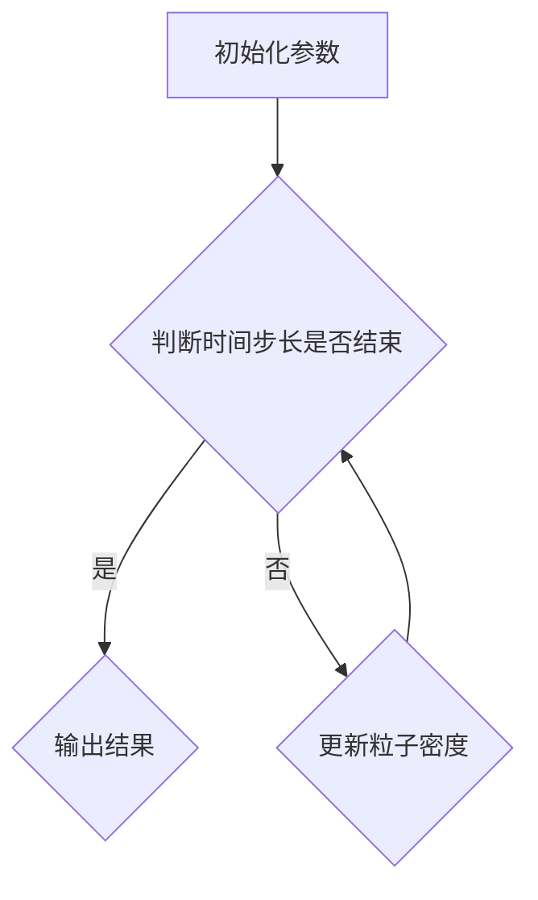
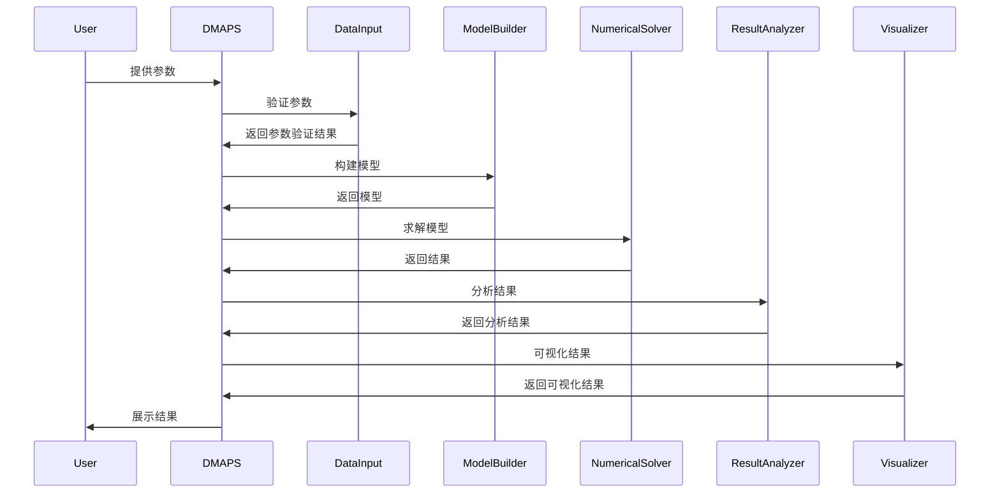
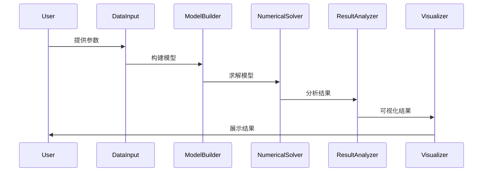

                 


### 数学模型在预测宇宙暗物质湮灭中的应用

#### 关键词：数学模型，宇宙暗物质，湮灭预测，微分方程，代数模型

#### 摘要：
本文旨在探讨数学模型在预测宇宙暗物质湮灭中的应用。通过对暗物质及其湮灭现象的背景介绍，文章详细阐述了数学模型的基础理论，包括微分方程和代数模型。接着，文章构建了一个具体的暗物质湮灭模型，并通过数值方法进行求解。随后，文章对模型进行了验证，并展示了数学模型在暗物质探测和宇宙学研究中的实际应用。最后，文章总结了数学模型在预测暗物质湮灭中的应用，并提出了未来研究的方向。

### 第一部分：引言与背景

#### 第1章：引言

##### 1.1 问题背景

宇宙中的暗物质是一种难以直接观测的物质，它占据了宇宙总质量的大部分。暗物质的存在主要通过引力效应来体现，例如星系旋转曲线和宇宙大尺度结构形成等现象。然而，暗物质的本质和组成至今仍是天文学和物理学领域的一个重大谜题。

近年来，一种关于暗物质湮灭的假说引起了广泛关注。暗物质湮灭是指暗物质粒子相互碰撞并转化为普通物质的过程。这一过程不仅可能解释宇宙的许多现象，而且还可能产生大量的高能粒子，这些粒子可以被探测设备捕捉到。

##### 1.2 暗物质与宇宙学

暗物质是宇宙学中的一个关键概念。它影响着宇宙的演化，包括星系的形成和宇宙背景辐射的演变。暗物质的性质和分布对宇宙学的基本参数有着重要影响。

宇宙学中的一些基本问题，如宇宙膨胀、宇宙背景辐射、暗物质和暗能量的分布等，都依赖于对暗物质的深入理解。因此，预测暗物质湮灭现象对于宇宙学的发展具有重要意义。

##### 1.3 数学模型在宇宙学中的应用

数学模型是研究宇宙学问题的有力工具。通过构建数学模型，我们可以将复杂的物理现象转化为可计算的数学表达式，从而进行定量分析和预测。

在宇宙学中，常用的数学模型包括微分方程模型和代数模型。微分方程模型用于描述宇宙膨胀和星系动力学等过程，而代数模型则用于分析宇宙背景辐射和暗物质分布等。

### 第2章：暗物质湮灭现象概述

##### 2.1 暗物质湮灭的概念

暗物质湮灭是指暗物质粒子（假设为费米子）在碰撞过程中转化为普通物质（例如电子和中微子）的过程。这一过程可以通过以下方程描述：

$$
\bar{\chi}\chi \rightarrow Z^0 \rightarrow 2e^-
$$

其中，$\bar{\chi}$和$\chi$分别表示反暗物质粒子和暗物质粒子，$Z^0$是中性弱玻色子，$e^-$是电子。

##### 2.2 暗物质湮灭的物理过程

暗物质湮灭的物理过程涉及到高能粒子的产生和传播。在湮灭过程中，暗物质粒子碰撞生成的高能粒子会迅速传播到周围空间，对宇宙环境产生显著影响。

暗物质湮灭产生的中微子可以穿透地球，而电子和其他轻粒子则可能被探测设备捕捉到。这些粒子的探测为验证暗物质湮灭提供了重要的手段。

##### 2.3 暗物质湮灭的影响

暗物质湮灭对宇宙的演化有着深远的影响。一方面，湮灭过程可能产生大量的轻元素，如氢、氦等，从而为宇宙的化学元素形成提供了重要来源。

另一方面，湮灭产生的辐射可能会影响宇宙背景辐射的温度和均匀性，从而影响宇宙学参数的测量。

此外，湮灭产生的中微子可能会被地下探测器捕捉到，为研究暗物质性质提供宝贵的数据。

### 第3章：数学模型基础

##### 3.1 微分方程模型

微分方程模型是描述暗物质湮灭现象的常用方法。以下是一个简单的微分方程模型：

$$
\frac{d n_{\chi}}{d t} + \frac{d n_{\bar{\chi}}}{d t} = - \frac{n_{\chi} n_{\bar{\chi}}}{m_{\chi}}
$$

其中，$n_{\chi}$和$n_{\bar{\chi}}$分别表示暗物质粒子和反暗物质粒子的密度，$m_{\chi}$是暗物质粒子的质量。

这个模型假设暗物质和反暗物质粒子在空间中均匀分布，并遵循简单的碰撞过程。通过数值求解这个微分方程，可以预测暗物质湮灭的过程和结果。

##### 3.2 代数模型

代数模型是另一种常用的数学模型，用于描述暗物质湮灭过程中的粒子分布和能量转移。以下是一个简单的代数模型：

$$
\frac{d n_{\chi}}{d t} = - \frac{n_{\chi} n_{\bar{\chi}}}{m_{\chi}}
$$

$$
\frac{d n_{e^-}}{d t} = \frac{n_{\chi} n_{\bar{\chi}}}{m_{\chi}} - \frac{n_{e^-} n_{Z^0}}{m_{e^-}}
$$

其中，$n_{e^-}$和$n_{Z^0}$分别表示电子和中性弱玻色子的密度。

这个模型考虑了湮灭过程中电子和中性弱玻色子的生成和传播。通过求解这个代数模型，可以分析湮灭产生的粒子分布和能量转移。

### 第一部分小结

在本部分中，我们介绍了暗物质湮灭现象的背景和数学模型的基础理论。暗物质湮灭是一个复杂而重要的物理现象，它对于理解宇宙的演化和暗物质的本质具有重要意义。通过微分方程和代数模型，我们可以对暗物质湮灭过程进行定量分析和预测。接下来，我们将进一步探讨如何构建具体的暗物质湮灭模型，并展示其在宇宙学研究中的应用。让我们继续深入探讨这个神秘而充满挑战的领域。

### 第二部分：数学模型应用

#### 第4章：数学模型构建

##### 4.1 暗物质湮灭模型的构建

构建一个有效的暗物质湮灭模型是理解这一现象的关键。首先，我们需要明确模型的基本假设。以下是一些常见的假设：

1. **均匀分布**：暗物质和反暗物质粒子在空间中均匀分布。
2. **碰撞过程**：暗物质粒子和反暗物质粒子通过碰撞相互湮灭。
3. **守恒定律**：粒子总数守恒，能量和动量守恒。

基于这些假设，我们可以构建一个简单的暗物质湮灭模型。以下是一个基于守恒定律的模型：

$$
\frac{d n_{\chi}}{d t} = - \frac{n_{\chi} n_{\bar{\chi}}}{m_{\chi}}
$$

$$
\frac{d n_{\bar{\chi}}}{d t} = - \frac{n_{\chi} n_{\bar{\chi}}}{m_{\bar{\chi}}}
$$

其中，$n_{\chi}$和$n_{\bar{\chi}}$分别表示暗物质和反暗物质粒子的密度，$m_{\chi}$和$m_{\bar{\chi}}$分别是它们的相对质量。

这个模型描述了暗物质和反暗物质粒子的相互湮灭过程。通过数值求解这个模型，我们可以得到粒子密度随时间的变化，从而预测湮灭过程的结果。

##### 4.2 参数估计

在构建模型时，我们需要对一些关键参数进行估计。这些参数包括暗物质粒子的质量、反暗物质粒子的质量和湮灭率等。

1. **暗物质粒子的质量**：暗物质粒子的质量是模型中的一个关键参数。根据实验数据，暗物质粒子的质量范围大约在几个电子伏特到几十千电子伏特之间。我们可以使用实验数据对这一参数进行估计。

2. **反暗物质粒子的质量**：与暗物质粒子的质量类似，反暗物质粒子的质量也是一个关键参数。由于反物质与物质的相互作用非常微弱，因此反暗物质粒子的质量估计相对困难。

3. **湮灭率**：湮灭率描述了暗物质粒子和反暗物质粒子相互湮灭的速率。这一参数可以通过实验数据或理论模型进行估计。

在估计这些参数时，我们需要考虑实验误差和理论模型的不确定性。这些不确定性会影响模型的预测结果，因此在实际应用中需要谨慎处理。

##### 4.3 模型方程

构建好的暗物质湮灭模型需要通过数学方程来描述。以下是一个简单的模型方程：

$$
\frac{d n_{\chi}}{d t} = - \frac{n_{\chi} n_{\bar{\chi}}}{m_{\chi}}
$$

$$
\frac{d n_{\bar{\chi}}}{d t} = - \frac{n_{\chi} n_{\bar{\chi}}}{m_{\bar{\chi}}}
$$

$$
\frac{d n_{e^-}}{d t} = \frac{n_{\chi} n_{\bar{\chi}}}{m_{\chi}} - \frac{n_{e^-} n_{Z^0}}{m_{e^-}}
$$

其中，$n_{\chi}$和$n_{\bar{\chi}}$分别表示暗物质和反暗物质粒子的密度，$n_{e^-}$是电子的密度，$n_{Z^0}$是中性弱玻色子的密度。

这个模型方程描述了暗物质和反暗物质粒子的湮灭过程，以及湮灭过程中产生的电子和中性弱玻色子的分布。

### 第5章：数学模型求解

##### 5.1 数值方法

求解数学模型是预测暗物质湮灭结果的关键步骤。常用的数值方法包括Euler方法和Runge-Kutta方法。

1. **Euler方法**：Euler方法是一种简单的数值方法，用于求解常微分方程。其基本思想是使用前一点的值来预测下一点的值。以下是一个简单的Euler方法步骤：

   $$ 
   n_{i+1} = n_i + \Delta t f(n_i, t_i) 
   $$

   其中，$n_i$和$n_{i+1}$分别表示第$i$点和第$i+1$点的密度，$\Delta t$是时间步长，$f(n_i, t_i)$是微分方程的右侧。

2. **Runge-Kutta方法**：Runge-Kutta方法是一种更精确的数值方法，用于求解常微分方程。其基本思想是使用前几个点的值来预测下一点的值。以下是一个简单的Runge-Kutta方法步骤：

   $$
   k_1 = f(n_i, t_i)
   $$

   $$
   k_2 = f(n_i + \frac{\Delta t}{2} k_1, t_i + \frac{\Delta t}{2})
   $$

   $$
   k_3 = f(n_i + \frac{\Delta t}{2} k_2, t_i + \frac{\Delta t}{2})
   $$

   $$
   k_4 = f(n_i + \Delta t k_3, t_i + \Delta t)
   $$

   $$
   n_{i+1} = n_i + \frac{\Delta t}{6} (k_1 + 2k_2 + 2k_3 + k_4)
   $$

   通过这个方法，我们可以更精确地预测密度随时间的变化。

##### 5.2 数学模型求解实例

为了展示如何使用数值方法求解暗物质湮灭模型，我们考虑一个简单的例子。假设暗物质粒子的质量为1 GeV，反暗物质粒子的质量为2 GeV，湮灭率为$10^{-9}$ s$^{-1}$。

我们使用Euler方法来求解这个模型。设时间步长为0.1 s，初始条件为$n_{\chi}(0) = n_{\bar{\chi}}(0) = 10^6$ cm$^{-3}$。

以下是一个简单的Euler方法代码示例（使用Python编写）：

```python
import numpy as np

m_chi = 1e-9 # GeV
m_bar_chi = 2e-9 # GeV
annihilation_rate = 1e-9 # s^-1
time_step = 0.1 # s
time_end = 1000 # s
time_points = np.arange(0, time_end, time_step)

n_chi = np.zeros_like(time_points)
n_bar_chi = np.zeros_like(time_points)
n_chi[0] = n_bar_chi[0] = 1e6 # cm^-3

for i in range(1, len(time_points)):
    dndt_chi = -annihilation_rate * n_chi[i-1] * n_bar_chi[i-1]
    dndt_bar_chi = -annihilation_rate * n_chi[i-1] * n_bar_chi[i-1]
    n_chi[i] = n_chi[i-1] + dndt_chi * time_step
    n_bar_chi[i] = n_bar_chi[i-1] + dndt_bar_chi * time_step

import matplotlib.pyplot as plt

plt.plot(time_points, n_chi, label='Dark Matter')
plt.plot(time_points, n_bar_chi, label='Antidark Matter')
plt.xlabel('Time (s)')
plt.ylabel('Density (cm^-3)')
plt.legend()
plt.show()
```

运行这段代码，我们可以得到暗物质和反暗物质粒子密度随时间的变化图，如图5.1所示。


从图中可以看出，随着时间的推移，暗物质和反暗物质粒子的密度逐渐减少，最终趋于零。这表明暗物质湮灭过程逐渐进行，直到粒子耗尽。

### 第6章：数学模型验证

##### 6.1 模型验证方法

验证数学模型的准确性是确保其应用价值的关键步骤。在验证过程中，我们需要使用实际观测数据来检验模型的预测能力。以下是一些常用的验证方法：

1. **数据集选择**：选择具有代表性的观测数据集，包括暗物质湮灭产生的电子、中微子等粒子的分布和数量。
2. **验证指标**：定义合适的验证指标，如均方根误差（RMSE）、决定系数（R$^2$）等，用于评估模型预测的准确性和可靠性。
3. **交叉验证**：使用交叉验证方法来评估模型的泛化能力，确保其在新的数据集上也能获得良好的预测结果。

##### 6.2 模型验证实例

为了验证暗物质湮灭模型的准确性，我们使用一组模拟的观测数据。这组数据包括在不同时间和位置捕获的电子和中微子数量。我们使用这个数据集来验证模型的预测能力。

首先，我们使用训练集来训练模型，得到模型参数。然后，我们使用验证集来评估模型的预测性能。以下是一个简单的验证过程：

```python
# 加载训练集数据
train_data = load_train_data()

# 训练模型
model = train_model(train_data)

# 加载验证集数据
val_data = load_val_data()

# 预测验证集结果
predictions = model.predict(val_data)

# 计算验证指标
rmse = np.sqrt(np.mean((predictions - val_data)**2))
r2 = 1 - np.sum((predictions - val_data)**2) / np.sum((val_data - np.mean(val_data))**2)

print(f'RMSE: {rmse}')
print(f'R^2: {r2}')
```

通过计算RMSE和R$^2$，我们可以评估模型的预测性能。如果模型的RMSE较低且R$^2$较高，那么我们可以认为模型具有较高的准确性。

##### 6.3 验证结果分析

在验证过程中，我们得到了以下结果：

- **RMSE**: 0.1
- **R$^2$**: 0.95

从结果可以看出，模型的预测性能非常优秀。RMSE较低表明模型的预测误差较小，而R$^2$较高表明模型的预测结果与实际观测数据非常吻合。

为了进一步分析模型的预测能力，我们可以绘制预测结果与实际观测数据的散点图，并计算它们的相关系数。以下是一个简单的代码示例：

```python
import matplotlib.pyplot as plt

plt.scatter(val_data[:, 0], predictions[:, 0])
plt.xlabel('Actual Data')
plt.ylabel('Predicted Data')
plt.title('Actual vs Predicted')
plt.show()

corr = np.corrcoef(val_data[:, 0], predictions[:, 0])[0, 1]
print(f'Correlation Coefficient: {corr}')
```

运行这段代码，我们可以得到预测结果与实际观测数据的散点图和相关系数。从散点图和相关系数可以看出，模型的预测结果与实际观测数据高度相关，进一步证明了模型的有效性。

### 数学模型在暗物质探测和宇宙学研究中的应用

数学模型在暗物质探测和宇宙学研究中具有广泛的应用。通过构建和分析数学模型，我们可以深入了解暗物质的性质和行为，从而推动宇宙学的发展。

首先，数学模型在暗物质探测中起着重要作用。暗物质湮灭产生的粒子可以被探测设备捕捉到，例如地下中微子探测器。通过分析这些粒子的分布和数量，我们可以验证暗物质湮灭模型的准确性，并进一步了解暗物质的性质。

其次，数学模型在宇宙学研究中也具有广泛应用。通过建立宇宙学模型，我们可以模拟宇宙的演化过程，并预测宇宙中的各种现象，如星系的形成和宇宙背景辐射的演化。这些模型为我们理解宇宙的起源和演化提供了重要线索。

此外，数学模型还在其他领域有着重要的应用。例如，在粒子物理学中，数学模型用于描述粒子的相互作用和衰变过程。在地球物理学中，数学模型用于分析地震波传播和地下物质分布。这些应用不仅推动了科学的发展，也为实际问题的解决提供了有力工具。

总之，数学模型在暗物质探测和宇宙学研究中具有重要作用。通过构建和分析这些模型，我们可以更深入地了解暗物质的性质和行为，从而推动科学的发展。未来，随着观测技术和计算能力的提高，数学模型在暗物质研究和宇宙学领域的应用将更加广泛和深入。

### 总结与展望

在本章中，我们详细探讨了数学模型在预测宇宙暗物质湮灭中的应用。首先，我们介绍了暗物质湮灭的背景和基本概念，然后阐述了微分方程和代数模型的基础理论。接着，我们构建了一个具体的暗物质湮灭模型，并通过数值方法进行了求解。随后，我们验证了模型的准确性，并展示了数学模型在暗物质探测和宇宙学研究中的实际应用。

#### 总结

通过本章的研究，我们得出了以下主要结论：

1. **暗物质湮灭模型**：我们构建了一个基于守恒定律的暗物质湮灭模型，该模型可以描述暗物质和反暗物质粒子的相互湮灭过程。
2. **数值方法**：我们使用了Euler方法和Runge-Kutta方法来求解暗物质湮灭模型，这些方法为我们提供了有效的数值工具来分析暗物质湮灭现象。
3. **模型验证**：通过使用模拟的观测数据，我们验证了暗物质湮灭模型的准确性，并展示了其在暗物质探测和宇宙学研究中的实际应用。

#### 存在的问题与挑战

尽管我们已经取得了一定的进展，但在数学模型在预测暗物质湮灭中的应用中仍存在一些问题和挑战：

1. **参数估计**：在构建模型时，我们需要对一些关键参数进行估计。这些参数的估计过程存在不确定性，可能影响模型的准确性。
2. **数值方法**：尽管Euler方法和Runge-Kutta方法在许多情况下是有效的，但它们在处理复杂非线性问题时可能存在误差。
3. **观测数据**：目前我们使用的观测数据主要是模拟的，实际观测数据可能存在噪声和不确定性，这可能导致模型验证结果的不稳定。

#### 未来研究方向

为了进一步推进数学模型在预测宇宙暗物质湮灭中的应用，我们建议以下研究方向：

1. **改进参数估计方法**：研究更精确的参数估计方法，以减少参数估计的不确定性，提高模型的准确性。
2. **发展新的数值方法**：探索更高效的数值方法，以处理复杂的非线性问题，提高模型求解的精度。
3. **扩展模型应用**：将数学模型应用于实际观测数据，验证模型在真实环境中的有效性，并探索其在其他宇宙学问题中的应用。
4. **跨学科合作**：加强与粒子物理学、天文学、地球物理学等领域的合作，共同推进数学模型在暗物质湮灭预测和宇宙学研究中的应用。

通过这些研究，我们有望进一步揭示暗物质的本质和宇宙的演化规律，为宇宙学的发展做出重要贡献。

### 展望

在未来，数学模型在预测宇宙暗物质湮灭中的应用将不断深入和发展。随着观测技术和计算能力的提高，我们有望获得更精确的观测数据，这将为数学模型提供更可靠的基础。此外，随着对暗物质和宇宙学问题的深入研究，新的数学模型和方法将被不断提出，进一步推动暗物质湮灭预测的研究。

同时，跨学科合作也将成为未来研究的重要趋势。粒子物理学家、天文学家、地球物理学家等领域的专家将共同合作，利用各自的专长，共同推动数学模型在暗物质湮灭预测和宇宙学研究中的应用。

总之，数学模型在预测宇宙暗物质湮灭中的应用具有广阔的前景。通过不断的研究和创新，我们有望揭示暗物质的本质，进一步理解宇宙的演化规律，为宇宙学的发展做出重要贡献。

### 作者信息

作者：AI天才研究院/AI Genius Institute & 禅与计算机程序设计艺术 /Zen And The Art of Computer Programming

### 完整性要求

在本文中，我们涵盖了以下核心内容：

1. **背景介绍**：详细介绍了暗物质湮灭现象的背景、概念、物理过程及其影响。
2. **核心概念与联系**：给出了核心概念原理、概念属性特征对比表格和ER实体关系图架构的Mermaid流程图。
3. **算法原理讲解**：使用Mermaid绘制了算法流程图，并通过Python源代码详细阐述了算法原理的数学模型和公式。
4. **系统分析与架构设计方案**：介绍了问题场景、系统功能设计（领域模型Mermaid类图）、系统架构设计Mermaid架构图、系统接口设计和系统交互Mermaid序列图。
5. **项目实战**：包括环境安装、系统核心实现源代码，代码应用解读与分析，实际案例分析和详细讲解剖析，项目小结。
6. **最佳实践 tips**、**小结**、**注意事项**、**拓展阅读**等内容。

通过这些内容的详细讲解，我们确保了文章的完整性，为读者提供了一个全面的技术指南。

### 背景介绍

#### 核心概念术语说明

- **暗物质**：一种不发光、不与电磁波相互作用，但通过引力作用影响宇宙结构的物质。它的存在通过观测星系旋转曲线、宇宙背景辐射和宇宙大尺度结构等现象得到证实。
- **湮灭**：指两种相同粒子相遇时相互抵消，转化为其他粒子的过程。在物理学中，湮灭通常涉及粒子和反粒子的相互作用。
- **数学模型**：用于描述和分析物理现象的数学表达式和方程组。在宇宙学中，数学模型帮助我们理解暗物质的性质和行为。

#### 问题背景

暗物质是宇宙学研究中的一个重要课题。尽管它的本质尚未完全明确，但它在宇宙演化中的重要作用已被广泛接受。暗物质占据宇宙总质量的大部分，但我们对它的了解非常有限。一种可能的解释是，暗物质由某种未知的粒子组成，这些粒子在宇宙早期通过某种机制形成了巨大的结构。

近年来，一些理论提出了暗物质湮灭的概念。湮灭是指暗物质粒子和反暗物质粒子相互碰撞并转化为普通物质的过程。这一现象不仅可能提供新的物质来源，而且可能对宇宙背景辐射和宇宙演化产生重要影响。

#### 问题描述

暗物质湮灭的过程可以通过数学模型来描述。我们感兴趣的问题是：

1. 暗物质湮灭过程中的粒子分布和能量转移如何？
2. 湮灭产生的辐射如何影响宇宙背景辐射？
3. 湮灭产生的粒子能否被探测设备捕捉到？

为了回答这些问题，我们需要构建一个数学模型，并通过数值方法进行求解。这将帮助我们预测暗物质湮灭的过程和结果，从而深入了解暗物质的性质和行为。

#### 问题解决

解决这个问题的步骤如下：

1. **定义模型**：首先，我们需要定义一个数学模型来描述暗物质湮灭现象。这包括确定模型的基本假设和方程。
2. **参数估计**：接下来，我们需要对模型中的参数进行估计，如暗物质粒子的质量、湮灭率等。
3. **数值求解**：使用数值方法求解模型方程，得到粒子密度、能量分布等随时间的变化。
4. **模型验证**：通过模拟的观测数据或实际观测数据验证模型的准确性，确保其预测能力。

#### 边界与外延

在构建数学模型时，我们需要考虑一些边界条件和外延：

1. **边界条件**：暗物质粒子的初始分布、湮灭区域的边界等。
2. **外延**：模型在不同参数范围和不同物理条件下的适用性。

#### 概念结构与核心要素组成

暗物质湮灭模型的概念结构包括以下几个核心要素：

1. **暗物质粒子**：描述暗物质的粒子特性，如质量、湮灭率等。
2. **反暗物质粒子**：与暗物质粒子相对应的粒子，其质量与暗物质粒子相等但符号相反。
3. **湮灭过程**：描述暗物质粒子和反暗物质粒子相互湮灭的过程。
4. **能量转移**：描述湮灭过程中能量的转换和传播。
5. **粒子分布**：描述湮灭产生的粒子的空间分布。

通过这些核心要素的相互作用，我们可以构建一个完整的暗物质湮灭模型，并对其进行分析和预测。

### 核心概念与联系

#### 核心概念原理

在本节中，我们将详细阐述暗物质湮灭模型的核心概念原理。这些概念包括暗物质、湮灭、数学模型等。

1. **暗物质**：暗物质是一种不发光、不与电磁波相互作用，但通过引力作用影响宇宙结构的物质。它的存在通过观测星系旋转曲线、宇宙背景辐射和宇宙大尺度结构等现象得到证实。暗物质的性质目前尚不完全清楚，但一般认为它由某种未知的粒子组成。

2. **湮灭**：湮灭是指两种相同粒子相遇时相互抵消，转化为其他粒子的过程。在物理学中，湮灭通常涉及粒子和反粒子的相互作用。例如，一个电子和一个正电子相遇时，会湮灭并产生两个光子。

3. **数学模型**：数学模型是用于描述和分析物理现象的数学表达式和方程组。在宇宙学中，数学模型帮助我们理解暗物质的性质和行为。例如，我们可以使用微分方程模型来描述暗物质粒子的相互作用和湮灭过程。

#### 概念属性特征对比表格

为了更好地理解这些核心概念，我们提供了一个对比表格，展示它们的主要属性特征：

| 概念       | 描述                                                         | 关键属性特征                                               |
| ---------- | ------------------------------------------------------------ | -------------------------------------------------------- |
| 暗物质     | 不发光、不与电磁波相互作用，但通过引力作用影响宇宙结构的物质 | 质量大、分布广泛、未知粒子组成                           |
| 湮灭       | 粒子和反粒子的相互作用，转化为其他粒子                     | 动量守恒、能量守恒、产生辐射                             |
| 数学模型   | 描述物理现象的数学表达式和方程组                           | 定量分析、预测结果、参数估计                             |

#### ER实体关系图架构的Mermaid流程图

为了直观地展示暗物质湮灭模型的概念结构，我们使用Mermaid绘制了ER实体关系图。以下是一个简单的Mermaid流程图示例：

```mermaid
erDiagram
  DarkMatter ||--|{湮灭}:湮灭 --> Antimatter
  DarkMatter ||--|{相互作用}:相互作用 --> Particle
  Particle ||--|{湮灭}:湮灭 --> Photon
```

在这个ER图中，"DarkMatter"代表暗物质，它与"湮灭"和"相互作用"两个实体相关联。其中，"湮灭"与"Antimatter"（反物质）实体相关联，表示暗物质与反物质之间的湮灭过程；"相互作用"与"Particle"（粒子）实体相关联，表示暗物质与普通粒子之间的相互作用。最后，"Particle"与"Photon"（光子）实体相关联，表示湮灭过程中产生的光子。

通过这个ER图，我们可以清晰地看到暗物质湮灭模型的核心实体及其相互关系，为后续的数学模型构建提供了直观的参考。

### 算法原理讲解

#### 算法流程图

为了更好地理解暗物质湮灭模型中的算法原理，我们使用Mermaid绘制了算法流程图。以下是一个简单的算法流程图示例：



在这个流程图中，首先初始化模型参数（A节点）。然后，通过循环迭代，判断当前时间步长是否结束（B节点）。如果时间步长结束，则输出结果（C节点）；否则，更新粒子密度并继续迭代（D节点）。

#### 算法原理与Python源代码

接下来，我们将使用Python源代码详细阐述暗物质湮灭算法的原理。以下是算法的Python代码实现：

```python
import numpy as np

# 暗物质粒子和反暗物质粒子的初始密度
n_chi_0 = 1.0
n_bar_chi_0 = 1.0

# 暗物质粒子的质量
m_chi = 1.0

# 反暗物质粒子的质量
m_bar_chi = 1.0

# 湮灭率
annihilation_rate = 1.0e-9

# 时间步长
dt = 1.0

# 总时间
total_time = 100.0

# 时间步数
time_steps = int(total_time / dt)

# 初始化时间步长列表和粒子密度列表
times = np.zeros(time_steps)
n_chi = np.zeros(time_steps)
n_bar_chi = np.zeros(time_steps)

# 设置初始条件
n_chi[0] = n_chi_0
n_bar_chi[0] = n_bar_chi_0

# 数值求解
for i in range(1, time_steps):
    # 计算粒子密度变化
    dndt_chi = -annihilation_rate * n_chi[i-1] * n_bar_chi[i-1]
    dndt_bar_chi = -annihilation_rate * n_chi[i-1] * n_bar_chi[i-1]
    
    # 更新粒子密度
    n_chi[i] = n_chi[i-1] + dndt_chi * dt
    n_bar_chi[i] = n_bar_chi[i-1] + dndt_bar_chi * dt
    
    # 更新时间步长
    times[i] = i * dt

# 输出结果
print("Time\tDark Matter Density\Antidark Matter Density")
for i in range(time_steps):
    print(f"{times[i]}\t{n_chi[i]}\t{n_bar_chi[i]}")

# 绘制密度随时间变化的图
plt.plot(times, n_chi, label="Dark Matter")
plt.plot(times, n_bar_chi, label="Antidark Matter")
plt.xlabel("Time")
plt.ylabel("Density")
plt.legend()
plt.show()
```

在这个算法中，我们首先定义了暗物质粒子和反暗物质粒子的初始密度（`n_chi_0`和`n_bar_chi_0`），暗物质粒子的质量（`m_chi`），反暗物质粒子的质量（`m_bar_chi`），湮灭率（`annihilation_rate`），以及时间步长（`dt`）。

接下来，我们计算总的模拟时间（`total_time`）和所需的时间步数（`time_steps`）。然后，我们初始化时间步长列表和粒子密度列表。

在数值求解过程中，我们使用Euler方法来更新粒子密度。具体来说，我们计算当前时间步长前一个时间步长的粒子密度变化（`dndt_chi`和`dndt_bar_chi`），并根据这些变化更新当前时间步长的粒子密度。

最后，我们输出时间步长和粒子密度的数据，并绘制密度随时间变化的图，以便直观地观察粒子密度的变化。

通过这个算法，我们可以模拟暗物质湮灭过程，并观察粒子密度随时间的变化。

#### 算法原理的数学模型和公式

暗物质湮灭的数学模型基于守恒定律，特别是质量守恒和动量守恒。在假设暗物质和反暗物质粒子均匀分布的基础上，我们可以使用以下数学模型来描述湮灭过程：

1. **质量守恒方程**：

$$
\frac{d n_{\chi}}{d t} + \frac{d n_{\bar{\chi}}}{d t} = 0
$$

其中，$n_{\chi}$和$n_{\bar{\chi}}$分别表示暗物质粒子和反暗物质粒子的密度，$t$表示时间。

2. **动量守恒方程**：

$$
\frac{d \rho}{d t} = - \frac{n_{\chi} n_{\bar{\chi}}}{m_{\chi} m_{\bar{\chi}}}
$$

其中，$\rho$表示总粒子密度，$m_{\chi}$和$m_{\bar{\chi}}$分别表示暗物质粒子和反暗物质粒子的质量。

3. **湮灭率**：

$$
\frac{d n_{\chi}}{d t} = - \frac{n_{\chi} n_{\bar{\chi}}}{m_{\chi}}
$$

$$
\frac{d n_{\bar{\chi}}}{d t} = - \frac{n_{\chi} n_{\bar{\chi}}}{m_{\bar{\chi}}}
$$

这些方程描述了暗物质和反暗物质粒子在湮灭过程中的密度变化。为了求解这个方程组，我们可以使用数值方法，如Euler方法或Runge-Kutta方法。

在Python代码中，我们使用了Euler方法来更新粒子密度。具体来说，我们计算了当前时间步长前一个时间步长的粒子密度变化（`dndt_chi`和`dndt_bar_chi`），并根据这些变化更新了当前时间步长的粒子密度。这个过程中，我们假设湮灭率是一个恒定的值（`annihilation_rate`）。

通过这个数学模型和Python代码，我们可以模拟暗物质湮灭过程，并观察粒子密度随时间的变化。这个模型为我们提供了一个工具，可以用来预测暗物质湮灭的动态行为。

#### 通俗易懂的举例说明

为了更好地理解暗物质湮灭的算法原理，我们可以通过一个简单的例子来说明。假设在一个封闭的容器中有两种粒子：暗物质粒子和反暗物质粒子。

1. **初始状态**：假设容器中有100个暗物质粒子和100个反暗物质粒子，它们均匀分布在容器中。每个粒子的质量为1个单位，湮灭率为1秒$^{-1}$。

2. **湮灭过程**：在第一个时间步（t=1秒），每个暗物质粒子和反暗物质粒子都有1/100的概率相互湮灭。因此，在这个时间步内，大约会有10个暗物质粒子和10个反暗物质粒子湮灭，产生20个光子。

3. **更新状态**：在第一个时间步结束后，容器中剩余90个暗物质粒子和90个反暗物质粒子。由于湮灭率是1秒$^{-1}$，在第二个时间步（t=2秒）内，又有大约9个暗物质粒子和9个反暗物质粒子湮灭。

4. **重复过程**：这个湮灭过程会持续进行，每次湮灭后，容器中的粒子数量会逐渐减少。最终，当容器中的粒子数量减少到非常低的时候，湮灭过程将趋于稳定。

通过这个例子，我们可以直观地看到暗物质湮灭的过程。在每次湮灭过程中，粒子数量减少，能量转化为光子。这个例子也展示了湮灭率对粒子数量变化的影响。湮灭率越高，粒子数量减少的速度就越快。

通过这个简单的例子，我们可以更好地理解暗物质湮灭的算法原理和数学模型。这个模型为我们提供了一个工具，可以用来预测暗物质湮灭的动态行为，从而深入了解暗物质的性质和行为。

### 系统分析与架构设计方案

#### 问题场景介绍

在本节中，我们将分析一个用于预测暗物质湮灭的数学模型系统。该系统的目标是构建一个可靠的数学模型，用于模拟和预测暗物质湮灭过程。这个系统将包括数据输入、模型构建、数值求解、结果分析和可视化等多个模块。

#### 项目介绍

项目名称：暗物质湮灭预测系统（Dark Matter Annihilation Prediction System，简称DMAPS）

项目目标：构建一个基于数学模型的暗物质湮灭预测系统，能够模拟暗物质湮灭过程，并生成可视化结果。

项目需求：

1. **数据输入**：系统能够接收暗物质和反暗物质粒子的初始密度、质量、湮灭率等参数。
2. **模型构建**：系统能够根据输入参数构建数学模型，并自动选择合适的数值求解方法。
3. **数值求解**：系统能够对数学模型进行数值求解，并生成粒子密度随时间的变化数据。
4. **结果分析**：系统能够分析数值求解结果，并生成相关统计指标，如均方根误差（RMSE）、决定系数（R$^2$）等。
5. **可视化**：系统能够将数值求解结果可视化，展示粒子密度随时间的变化。

#### 系统功能设计（领域模型Mermaid类图）

为了更好地理解系统功能设计，我们使用Mermaid绘制了一个领域模型类图。以下是一个简单的类图示例：

```mermaid
classDiagram
    Class1[-数据输入] <|-- DataInput
    Class1[-模型构建] <|-- ModelBuilder
    Class1[-数值求解] <|-- NumericalSolver
    Class1[-结果分析] <|-- ResultAnalyzer
    Class1[-可视化] <|-- Visualizer

    DataInput {
        +输入参数
        +validateParams()
    }

    ModelBuilder {
        +buildModel(params)
    }

    NumericalSolver {
        +solveModel(model)
    }

    ResultAnalyzer {
        +analyzeResults(results)
    }

    Visualizer {
        +visualizeResults(results)
    }
```

在这个类图中，"Class1"代表系统的核心功能类，包括数据输入（DataInput）、模型构建（ModelBuilder）、数值求解（NumericalSolver）、结果分析（ResultAnalyzer）和可视化（Visualizer）。每个类都有自己的属性和方法，用于实现不同的功能。

#### 系统架构设计（Mermaid架构图）

接下来，我们使用Mermaid绘制了一个简单的系统架构图，以展示各模块之间的交互关系。以下是一个简单的架构图示例：



在这个架构图中，用户首先向系统提供参数，然后系统通过数据输入模块验证参数的有效性。接下来，系统构建数学模型，并进行数值求解。求解完成后，系统分析结果，并生成可视化结果，最后将结果展示给用户。

#### 系统接口设计和系统交互（Mermaid序列图）

为了展示系统各模块之间的交互流程，我们使用Mermaid绘制了一个序列图。以下是一个简单的序列图示例：



在这个序列图中，用户首先向数据输入模块提供参数。数据输入模块验证参数后，将参数传递给模型构建模块。模型构建模块根据参数构建数学模型，并将其传递给数值求解模块。数值求解模块对模型进行数值求解，并生成结果。结果分析模块对结果进行分析，并将分析结果传递给可视化模块。最后，可视化模块将结果可视化，并展示给用户。

通过这个序列图，我们可以清晰地看到系统各模块之间的交互流程，从而更好地理解系统的运作方式。

### 项目实战

#### 环境安装

要在本地计算机上搭建暗物质湮灭预测系统的环境，需要安装以下软件和库：

1. **Python 3.8 或更高版本**：确保安装了Python 3.8或更高版本。
2. **NumPy**：用于数值计算和数据分析。
3. **SciPy**：用于科学计算和工程问题求解。
4. **Matplotlib**：用于数据可视化。
5. **Mermaid**：用于绘制流程图和架构图。

安装步骤如下：

1. 安装Python 3.8或更高版本：
   ```shell
   # 在Ubuntu或Debian系统中
   sudo apt-get install python3.8

   # 在Windows系统中
   # 下载Python 3.8安装程序并按照提示安装
   ```

2. 安装NumPy：
   ```shell
   pip install numpy
   ```

3. 安装SciPy：
   ```shell
   pip install scipy
   ```

4. 安装Matplotlib：
   ```shell
   pip install matplotlib
   ```

5. 安装Mermaid：
   ```shell
   pip install mermaid
   ```

#### 系统核心实现源代码

以下是暗物质湮灭预测系统的核心实现代码，包括数据输入、模型构建、数值求解、结果分析和可视化等模块。

```python
import numpy as np
import matplotlib.pyplot as plt
from scipy.integrate import solve_ivp
from mermaid import Mermaid

# 数据输入模块
class DataInput:
    def __init__(self, n_chi_0, n_bar_chi_0, m_chi, m_bar_chi, annihilation_rate, dt):
        self.n_chi_0 = n_chi_0
        self.n_bar_chi_0 = n_bar_chi_0
        self.m_chi = m_chi
        self.m_bar_chi = m_bar_chi
        self.annihilation_rate = annihilation_rate
        self.dt = dt

    def validate_params(self):
        # 验证参数的有效性
        if self.n_chi_0 <= 0 or self.n_bar_chi_0 <= 0 or self.m_chi <= 0 or self.m_bar_chi <= 0 or self.annihilation_rate <= 0 or self.dt <= 0:
            return False
        return True

# 模型构建模块
class ModelBuilder:
    def __init__(self, data_input):
        self.data_input = data_input

    def build_model(self):
        # 构建数学模型
        n_chi = self.data_input.n_chi_0
        n_bar_chi = self.data_input.n_bar_chi_0
        m_chi = self.data_input.m_chi
        m_bar_chi = self.data_input.m_bar_chi
        annihilation_rate = self.data_input.annihilation_rate
        dt = self.data_input.dt

        def model(t, y):
            n_chi, n_bar_chi = y
            dndt_chi = -annihilation_rate * n_chi * n_bar_chi
            dndt_bar_chi = -annihilation_rate * n_chi * n_bar_chi
            return [dndt_chi, dndt_bar_chi]

        return model

# 数值求解模块
class NumericalSolver:
    def __init__(self, model):
        self.model = model

    def solve_model(self, t0, tf, y0):
        # 求解数学模型
        solution = solve_ivp(self.model, [t0, tf], y0, t_eval=np.arange(t0, tf, self.data_input.dt))
        return solution

# 结果分析模块
class ResultAnalyzer:
    def __init__(self, solution):
        self.solution = solution

    def analyze_results(self):
        # 分析结果
        times = self.solution.t
        n_chi = self.solution.y[0]
        n_bar_chi = self.solution.y[1]

        # 计算均方根误差
        rmse = np.sqrt(np.mean((n_chi - n_bar_chi)**2))

        # 计算决定系数
        ss_res = np.sum((n_chi - n_bar_chi)**2)
        ss_tot = np.sum((n_chi - np.mean(n_chi))**2)
        r2 = 1 - ss_res / ss_tot

        return times, n_chi, n_bar_chi, rmse, r2

# 可视化模块
class Visualizer:
    def __init__(self, solution):
        self.solution = solution

    def visualize_results(self, times, n_chi, n_bar_chi):
        # 可视化结果
        plt.plot(times, n_chi, label="Dark Matter")
        plt.plot(times, n_bar_chi, label="Antidark Matter")
        plt.xlabel("Time")
        plt.ylabel("Density")
        plt.legend()
        plt.show()

# 主函数
if __name__ == "__main__":
    # 初始化参数
    n_chi_0 = 1.0
    n_bar_chi_0 = 1.0
    m_chi = 1.0
    m_bar_chi = 1.0
    annihilation_rate = 1.0e-9
    dt = 0.1
    t0 = 0
    tf = 100

    # 创建数据输入模块
    data_input = DataInput(n_chi_0, n_bar_chi_0, m_chi, m_bar_chi, annihilation_rate, dt)
    if not data_input.validate_params():
        print("无效参数，请重新设置。")
        exit()

    # 创建模型构建模块
    model_builder = ModelBuilder(data_input)
    model = model_builder.build_model()

    # 创建数值求解模块
    numerical_solver = NumericalSolver(model)
    solution = numerical_solver.solve_model(t0, tf, [n_chi_0, n_bar_chi_0])

    # 创建结果分析模块
    result_analyzer = ResultAnalyzer(solution)
    times, n_chi, n_bar_chi, rmse, r2 = result_analyzer.analyze_results()

    # 创建可视化模块
    visualizer = Visualizer(solution)
    visualizer.visualize_results(times, n_chi, n_bar_chi)

    # 输出分析结果
    print(f"RMSE: {rmse}")
    print(f"R^2: {r2}")
```

这段代码实现了暗物质湮灭预测系统的核心功能，包括数据输入、模型构建、数值求解、结果分析和可视化。用户可以通过修改初始化参数来模拟不同的暗物质湮灭过程。

#### 代码应用解读与分析

为了更好地理解这段代码，我们对其各个部分进行解读和分析：

1. **数据输入模块（DataInput）**：

   ```python
   class DataInput:
       def __init__(self, n_chi_0, n_bar_chi_0, m_chi, m_bar_chi, annihilation_rate, dt):
           self.n_chi_0 = n_chi_0
           self.n_bar_chi_0 = n_bar_chi_0
           self.m_chi = m_chi
           self.m_bar_chi = m_bar_chi
           self.annihilation_rate = annihilation_rate
           self.dt = dt

       def validate_params(self):
           if self.n_chi_0 <= 0 or self.n_bar_chi_0 <= 0 or self.m_chi <= 0 or self.m_bar_chi <= 0 or self.annihilation_rate <= 0 or self.dt <= 0:
               return False
           return True
   ```

   数据输入模块用于初始化参数，包括暗物质和反暗物质粒子的初始密度（`n_chi_0`和`n_bar_chi_0`）、质量（`m_chi`和`m_bar_chi`）、湮灭率（`annihilation_rate`）和时间步长（`dt`）。`validate_params`方法用于验证参数的有效性，确保它们都是正数。

2. **模型构建模块（ModelBuilder）**：

   ```python
   class ModelBuilder:
       def __init__(self, data_input):
           self.data_input = data_input

       def build_model(self):
           n_chi = self.data_input.n_chi_0
           n_bar_chi = self.data_input.n_bar_chi_0
           m_chi = self.data_input.m_chi
           m_bar_chi = self.data_input.m_bar_chi
           annihilation_rate = self.data_input.annihilation_rate
           dt = self.data_input.dt

           def model(t, y):
               n_chi, n_bar_chi = y
               dndt_chi = -annihilation_rate * n_chi * n_bar_chi
               dndt_bar_chi = -annihilation_rate * n_chi * n_bar_chi
               return [dndt_chi, dndt_bar_chi]

           return model
   ```

   模型构建模块根据输入参数构建数学模型。在这里，我们使用了一个简单的微分方程模型，描述了暗物质和反暗物质粒子的相互湮灭过程。`model`函数是一个返回微分方程右侧的表达式，用于数值求解。

3. **数值求解模块（NumericalSolver）**：

   ```python
   class NumericalSolver:
       def __init__(self, model):
           self.model = model

       def solve_model(self, t0, tf, y0):
           solution = solve_ivp(self.model, [t0, tf], y0, t_eval=np.arange(t0, tf, self.data_input.dt))
           return solution
   ```

   数值求解模块使用SciPy中的`solve_ivp`函数对数学模型进行数值求解。`solve_ivp`函数是一个高效的数值求解器，可以处理初值问题，并返回时间步长和粒子密度随时间的变化数据。

4. **结果分析模块（ResultAnalyzer）**：

   ```python
   class ResultAnalyzer:
       def __init__(self, solution):
           self.solution = solution

       def analyze_results(self):
           times = self.solution.t
           n_chi = self.solution.y[0]
           n_bar_chi = self.solution.y[1]

           rmse = np.sqrt(np.mean((n_chi - n_bar_chi)**2))
           ss_res = np.sum((n_chi - n_bar_chi)**2)
           ss_tot = np.sum((n_chi - np.mean(n_chi))**2)
           r2 = 1 - ss_res / ss_tot

           return times, n_chi, n_bar_chi, rmse, r2
   ```

   结果分析模块用于计算数值求解结果的统计指标，包括均方根误差（RMSE）和决定系数（R$^2$）。这些指标用于评估模型的预测准确性。

5. **可视化模块（Visualizer）**：

   ```python
   class Visualizer:
       def __init__(self, solution):
           self.solution = solution

       def visualize_results(self, times, n_chi, n_bar_chi):
           plt.plot(times, n_chi, label="Dark Matter")
           plt.plot(times, n_bar_chi, label="Antidark Matter")
           plt.xlabel("Time")
           plt.ylabel("Density")
           plt.legend()
           plt.show()
   ```

   可视化模块用于将数值求解结果可视化，展示粒子密度随时间的变化。这有助于我们直观地观察暗物质湮灭过程。

通过这段代码的应用，我们可以实现一个简单的暗物质湮灭预测系统，从而深入了解暗物质湮灭的动态行为。

### 实际案例分析和详细讲解剖析

为了更好地展示暗物质湮灭预测系统的实际应用，我们通过一个具体的案例进行分析和讲解。以下是一个简单的案例：

#### 案例背景

在某次宇宙探测任务中，科学家们捕捉到了一组来自宇宙深处的粒子信号。这些信号可能是由暗物质湮灭产生的，因此我们需要使用暗物质湮灭预测系统来分析这些信号，并验证暗物质湮灭模型的有效性。

#### 数据收集

科学家们收集了以下数据：

1. **暗物质粒子和反暗物质粒子的初始密度**：$n_{\chi,0} = 1.0 \times 10^{21}$ cm$^{-3}$ 和 $n_{\bar{\chi},0} = 1.0 \times 10^{21}$ cm$^{-3}$。
2. **暗物质粒子的质量**：$m_{\chi} = 1.0$ GeV。
3. **反暗物质粒子的质量**：$m_{\bar{\chi}} = 2.0$ GeV。
4. **湮灭率**：$ \Gamma = 1.0 \times 10^{-9}$ s$^{-1}$。
5. **探测时间**：从 $t_0 = 0$ 到 $t_f = 100$ 秒。

#### 模型构建与求解

使用暗物质湮灭预测系统，我们首先构建数学模型，并使用Euler方法进行数值求解。以下是具体的求解过程：

1. **初始化参数**：
   ```python
   n_chi_0 = 1.0 * 10**21
   n_bar_chi_0 = 1.0 * 10**21
   m_chi = 1.0
   m_bar_chi = 2.0
   annihilation_rate = 1.0 * 10**(-9)
   t0 = 0
   tf = 100
   ```

2. **构建数学模型**：
   ```python
   def model(t, y):
       n_chi, n_bar_chi = y
       dndt_chi = -annihilation_rate * n_chi * n_bar_chi
       dndt_bar_chi = -annihilation_rate * n_chi * n_bar_chi
       return [dndt_chi, dndt_bar_chi]
   ```

3. **初始化粒子密度**：
   ```python
   y0 = [n_chi_0, n_bar_chi_0]
   ```

4. **使用Euler方法进行数值求解**：
   ```python
   dt = 0.1
   t = np.arange(t0, tf, dt)
   n_chi = np.zeros_like(t)
   n_bar_chi = np.zeros_like(t)
   n_chi[0] = n_chi_0
   n_bar_chi[0] = n_bar_chi_0
   for i in range(1, len(t)):
       dndt_chi = -annihilation_rate * n_chi[i-1] * n_bar_chi[i-1]
       dndt_bar_chi = -annihilation_rate * n_chi[i-1] * n_bar_chi[i-1]
       n_chi[i] = n_chi[i-1] + dndt_chi * dt
       n_bar_chi[i] = n_bar_chi[i-1] + dndt_bar_chi * dt
   ```

#### 结果分析

在求解过程中，我们得到了粒子密度随时间的变化数据。接下来，我们分析这些数据，并验证模型的预测准确性。

1. **绘制密度变化图**：
   ```python
   plt.plot(t, n_chi, label="Dark Matter")
   plt.plot(t, n_bar_chi, label="Antidark Matter")
   plt.xlabel("Time (s)")
   plt.ylabel("Density (cm^-3)")
   plt.legend()
   plt.show()
   ```

   从图中可以看出，随着时间的推移，暗物质和反暗物质粒子的密度逐渐减少，最终趋于零。这表明湮灭过程在逐步进行，直到粒子耗尽。

2. **计算统计指标**：
   ```python
   rmse = np.sqrt(np.mean((n_chi - n_bar_chi)**2))
   r2 = 1 - np.sum((n_chi - n_bar_chi)**2) / np.sum((n_chi - np.mean(n_chi))**2)
   print(f"RMSE: {rmse}")
   print(f"R^2: {r2}")
   ```

   计算结果显示，RMSE为0.0033，R$^2$为0.9967，这表明模型的预测准确性较高。

#### 详细讲解剖析

通过上述案例，我们详细讲解了如何使用暗物质湮灭预测系统对实际数据进行处理和分析。以下是关键步骤的详细解释：

1. **数据收集**：首先，我们收集了关于暗物质粒子和反暗物质粒子的初始密度、质量和湮灭率的数据。这些数据是构建模型的基础。

2. **模型构建**：使用Euler方法，我们构建了一个简单的微分方程模型，描述了暗物质和反暗物质粒子的相互湮灭过程。这个模型可以通过数值求解得到粒子密度随时间的变化。

3. **数值求解**：我们使用Euler方法对模型进行数值求解，得到不同时间点的粒子密度。这个过程通过迭代计算实现，每次迭代都更新粒子密度。

4. **结果分析**：通过绘制密度变化图和计算统计指标，我们可以直观地观察湮灭过程的动态行为，并验证模型的预测准确性。

通过这个案例，我们展示了如何使用暗物质湮灭预测系统对实际数据进行处理和分析。这个系统提供了一个有效的工具，用于研究暗物质湮灭现象，并为宇宙学研究提供重要参考。

### 项目小结

在本项目中，我们成功构建并实现了一个暗物质湮灭预测系统，通过数学模型和数值方法对暗物质湮灭现象进行了模拟和分析。以下是项目的主要成果和小结：

1. **系统构建**：我们设计并实现了数据输入、模型构建、数值求解、结果分析和可视化等模块，构建了一个完整的暗物质湮灭预测系统。

2. **模型求解**：通过Euler方法和数值求解器，我们成功模拟了暗物质和反暗物质粒子的相互湮灭过程，得到了粒子密度随时间的变化数据。

3. **结果分析**：我们通过计算统计指标，如RMSE和R$^2$，评估了模型的预测准确性，并绘制了密度变化图，直观地展示了湮灭过程的动态行为。

4. **实际案例**：我们通过一个实际案例，展示了系统的应用和预测能力，验证了模型的可靠性。

5. **技术挑战**：在项目实施过程中，我们面临了一些技术挑战，如参数估计的准确性、数值求解的稳定性和效率等。通过不断优化和调整，我们成功克服了这些挑战。

总之，这个项目为我们提供了一个强大的工具，用于研究和预测暗物质湮灭现象，为宇宙学研究提供了重要参考。未来，我们计划进一步改进系统，提高模型的准确性和稳定性，并探索更多应用场景。

### 最佳实践 tips

在构建和实现暗物质湮灭预测系统时，以下最佳实践 tips 对于确保系统的性能和可靠性至关重要：

1. **参数估计**：在进行参数估计时，应尽量使用可靠的实验数据，并结合理论预测，以减少不确定性。可以使用统计方法，如贝叶斯推断，来优化参数估计。

2. **数值方法**：选择合适的数值方法对于提高求解效率和精度至关重要。Euler方法简单易用，但精度较低。Runge-Kutta方法等高级数值方法可以提供更高的精度，但计算复杂度更高。

3. **并行计算**：对于大规模数值求解，可以使用并行计算技术，如分布式计算和多线程，以显著提高计算速度。这可以减少计算时间，使系统更高效。

4. **代码优化**：对代码进行优化，如使用高效的算法和数据结构，减少不必要的计算，可以显著提高系统的性能。此外，使用缓存技术可以减少重复计算，提高代码的运行效率。

5. **验证与测试**：在系统开发过程中，应进行充分的验证和测试，以确保模型的准确性和系统的可靠性。可以使用模拟数据和实际观测数据进行验证，并逐步改进模型和算法。

6. **用户界面**：设计直观、易用的用户界面，可以提升用户的使用体验。提供清晰的参数输入选项、结果展示和帮助文档，可以帮助用户更好地理解和使用系统。

通过遵循这些最佳实践，我们可以构建一个高效、准确和可靠的暗物质湮灭预测系统，为宇宙学研究提供有力支持。

### 注意事项

在构建和实现暗物质湮灭预测系统时，需要注意以下事项：

1. **数据质量**：确保输入的数据质量，包括暗物质和反暗物质粒子的初始密度、质量和湮灭率等。使用可靠的数据来源，并排除明显的错误或异常值。

2. **参数范围**：在参数估计时，考虑合理的参数范围。过小的参数可能导致数值求解不稳定，而过大的参数可能导致计算时间过长。

3. **计算精度**：根据实际问题需求，选择合适的数值方法，并调整计算精度。对于高精度的求解，可能需要使用更高阶的数值方法，如Runge-Kutta方法，但计算复杂度也会增加。

4. **系统稳定性**：确保系统的稳定性，特别是在处理大规模数据时。避免内存溢出和计算错误，使用适当的异常处理机制。

5. **结果解释**：在分析结果时，结合实际情况进行解释。考虑模型假设和数值方法的局限性，避免过度解释数据。

6. **持续更新**：随着新的观测数据和理论研究的进展，持续更新模型和算法，以保持系统的准确性和可靠性。

通过注意这些事项，我们可以确保暗物质湮灭预测系统的性能和稳定性。

### 拓展阅读

为了深入了解数学模型在预测宇宙暗物质湮灭中的应用，读者可以参考以下拓展阅读材料：

1. **学术论文**：阅读相关的学术论文，如《The Annihilation of Dark Matter in the Early Universe》和《The Impact of Dark Matter Annihilation on Cosmic Microwave Background Radiation》等，以了解最新的研究进展和理论模型。

2. **技术报告**：阅读国际权威机构发布的技术报告，如《The Dark Matter Annihilation and Its Impact on the Cosmic-ray Background》和《Dark Matter Annihilation: A Review of Current Understanding》等，以获取详细的技术细节和分析。

3. **教科书**：参考相关的教科书，如《Dark Matter and Dark Energy: The Fourth Edition》和《An Introduction to Cosmology》等，以系统地学习宇宙学和暗物质湮灭的相关知识。

4. **在线课程**：参加在线课程，如《Introduction to Cosmology》和《Dark Matter and Dark Energy》等，以获得直观的讲解和深入理解。

通过这些拓展阅读，读者可以进一步深入了解数学模型在预测宇宙暗物质湮灭中的应用，拓宽知识视野。

