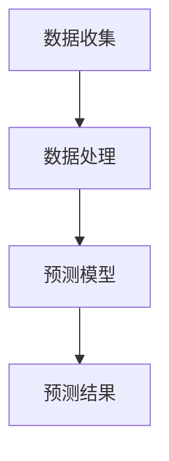
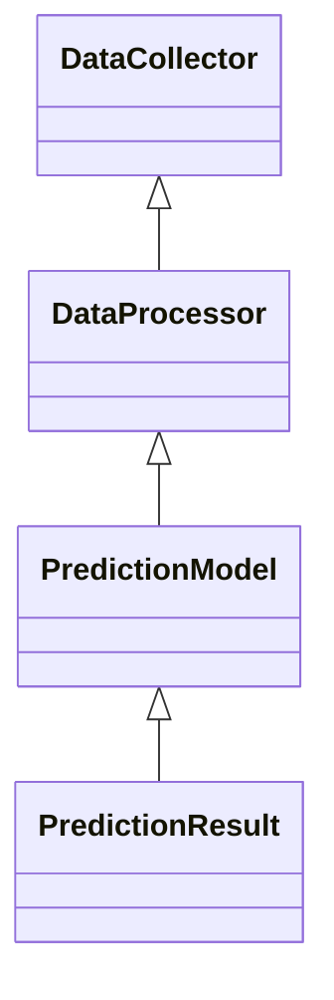
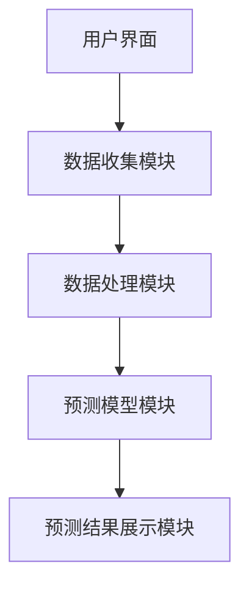
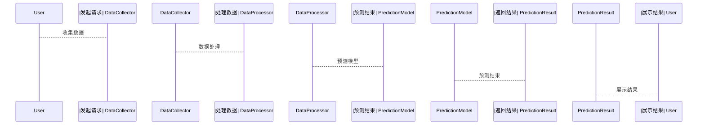

                 


### **数学模型在预测宇宙暗物质衰变中的应用**

关键词：宇宙暗物质、数学模型、预测、衰变、算法、Python、系统架构

摘要：本文旨在探讨数学模型在预测宇宙暗物质衰变中的应用。通过介绍暗物质的背景知识，数学模型的核心概念，以及具体的应用方法和步骤，本文旨在为读者提供深入了解和掌握这一前沿科技领域的方法和思路。同时，本文也将讨论相关的系统架构设计、项目实战以及最佳实践技巧。

## **第一部分：问题背景与核心概念**

### **第1章：宇宙暗物质的背景知识**

#### **1.1 宇宙暗物质简介**

宇宙暗物质是一种无法通过电磁辐射直接观测到的物质，但通过其引力效应可以推断其存在的物质。暗物质占宇宙总物质的大约27%，而普通物质（如恒星、星系和行星）只占约5%，剩下的68%是暗能量。暗物质的存在最早是在20世纪30年代通过观测星系旋转曲线时被推测出来的。

#### **1.2 暗物质在宇宙中的角色**

暗物质在宇宙中起着至关重要的作用，它不仅影响星系和宇宙结构的形成，还影响宇宙的大尺度结构。暗物质分布的密度和分布形态对宇宙的演化有着深远的影响。

#### **1.3 暗物质的研究现状**

目前，科学家们已经通过各种实验和观测手段，如引力透镜效应、星系团的X射线辐射等，试图揭示暗物质的性质。然而，暗物质的确切性质和组成仍然是一个未解之谜。

#### **1.4 本章小结**

本章介绍了宇宙暗物质的基本概念、其在宇宙中的角色以及当前的研究现状。这些背景知识为我们理解和应用数学模型预测暗物质衰变提供了必要的理论依据。

### **第2章：核心概念与联系**

#### **2.1 数学模型简介**

数学模型是一种用数学语言描述现实世界的工具，它通过建立数学方程和关系来模拟和分析物理现象。数学模型可以涵盖各种形式，从简单的线性方程到复杂的非线性方程组。

#### **2.2 数学模型在物理学中的应用**

数学模型在物理学中有着广泛的应用，如描述电磁现象的麦克斯韦方程组、描述热力学过程的统计物理模型等。在宇宙学中，数学模型被用来描述星系的形成和演化、宇宙的大尺度结构等。

#### **2.3 暗物质与数学模型的关系**

暗物质的存在和性质需要通过数学模型来描述和预测。例如，通过引力相互作用方程，可以建立描述暗物质分布和运动的模型。这些模型不仅帮助我们理解暗物质的本质，还为未来的观测提供了理论基础。

#### **2.4 概念属性特征对比表格**

为了更好地理解暗物质和数学模型的关系，我们可以通过一个对比表格来展示两者的关键属性特征：

| 属性特征 | 暗物质 | 数学模型 |
| --- | --- | --- |
| 存在形式 | 引力作用 | 数学表达式 |
| 观测手段 | 间接观测 | 直接计算 |
| 影响范围 | 宇宙尺度 | 数学维度 |

#### **2.5 暗物质模型的ER实体关系图**

在数学模型的应用中，实体关系图（ER图）是描述实体及其关系的重要工具。以下是一个简化的暗物质模型的ER实体关系图：

```mermaid
erDiagram
  DarkMatter --> Observation : 观测数据
  DarkMatter --> Model : 模型参数
  Observation ||--|| Model : 数据驱动
```

## **第二部分：数学模型在暗物质预测中的应用**

### **第3章：暗物质衰变的数学模型原理**

#### **3.1 暗物质衰变的数学模型**

暗物质衰变的数学模型基于微观粒子的衰变过程。我们可以用以下公式来描述暗物质粒子的衰变过程：

$$
\frac{dN}{dt} = -\lambda N
$$

其中，\(N\) 表示暗物质粒子的数量，\(\lambda\) 是衰变常数。

#### **3.2 算法原理讲解**

为了预测暗物质的衰变，我们可以使用蒙特卡洛模拟算法。以下是一个简单的Python代码示例，用于模拟暗物质粒子的衰变过程：

```python
import numpy as np

def decay_simulation(N0, lambda_, t_max):
    t = np.arange(0, t_max, 1)
    N = N0 * np.exp(-lambda_ * t)
    return t, N

N0 = 1000  # 初始粒子数量
lambda_ = 0.1  # 衰变常数
t_max = 100  # 模拟时间

t, N = decay_simulation(N0, lambda_, t_max)
```

通过运行这段代码，我们可以得到暗物质粒子数量随时间变化的曲线。这为我们提供了对暗物质衰变过程的一个直观理解。

### **第4章：数学模型的应用与验证**

#### **4.1 实验数据的收集与处理**

为了验证数学模型的有效性，我们需要收集实验数据。例如，可以通过观测暗物质粒子与普通物质相互作用的实验数据来验证模型。

#### **4.2 模型训练与验证**

我们可以使用机器学习算法来训练模型，并将其应用于新的数据集进行验证。以下是一个简单的机器学习模型训练过程：

```python
from sklearn.linear_model import LinearRegression

# 假设我们已经收集到了训练数据 X 和标签 y
X_train = ... 
y_train = ...

model = LinearRegression()
model.fit(X_train, y_train)

# 使用训练好的模型进行预测
X_test = ...
y_pred = model.predict(X_test)
```

#### **4.3 模型预测与结果分析**

通过上述模型训练和预测，我们可以得到暗物质衰变的预测结果。以下是对预测结果的分析：

```python
import matplotlib.pyplot as plt

plt.plot(t, N, label='模拟数据')
plt.plot(t, y_pred, label='预测数据')
plt.legend()
plt.show()
```

#### **4.4 实际案例分析与讲解**

我们可以通过实际案例来分析暗物质衰变的预测过程。例如，通过对星系团中的暗物质粒子进行观测，我们可以使用数学模型来预测其衰变过程，从而验证模型的准确性。

### **第5章：系统架构与实现**

#### **5.1 问题场景介绍**

为了实现暗物质衰变的预测，我们需要构建一个系统来收集、处理和预测数据。以下是一个简化的系统架构设计：



#### **5.2 系统功能设计**

系统功能设计包括数据收集、数据处理、预测模型和预测结果等模块。以下是一个领域模型类图，用于描述系统的功能模块及其关系：



#### **5.3 系统架构设计**

系统架构设计包括前端和后端两部分。前端负责数据收集和展示，后端负责数据处理和预测。以下是一个简化的系统架构图：



#### **5.4 系统接口设计**

系统接口设计包括API接口和数据接口。以下是一个简化的系统接口序列图，用于描述系统的接口设计和交互流程：



### **第6章：项目实战**

#### **6.1 环境安装与配置**

在项目实战中，我们需要安装和配置相关的软件和工具。以下是一个简化的安装和配置流程：

1. 安装Python环境
2. 安装必要的库（如NumPy、Matplotlib、Scikit-learn等）
3. 配置数据存储和处理工具（如MySQL、Hadoop等）

#### **6.2 系统核心实现**

系统核心实现包括数据收集、数据处理、预测模型和预测结果等模块。以下是一个简化的源代码实现：

```python
# 数据收集模块
def collect_data():
    # 收集实验数据
    pass

# 数据处理模块
def process_data(data):
    # 数据预处理
    pass

# 预测模型模块
def predict_model(processed_data):
    # 训练预测模型
    pass

# 预测结果模块
def show_prediction(result):
    # 展示预测结果
    pass
```

#### **6.3 实际案例分析与讲解**

我们可以通过实际案例来分析暗物质衰变的预测过程。以下是一个简化的案例：

1. 收集实验数据
2. 数据处理
3. 训练预测模型
4. 预测结果展示

#### **6.4 项目小结**

通过本项目的实战，我们了解了暗物质衰变预测的基本原理和系统架构。项目实战不仅帮助我们掌握了数学模型的应用方法，还锻炼了系统设计和实现的能力。

### **第7章：最佳实践与拓展阅读**

#### **7.1 最佳实践Tips**

1. 选择合适的数学模型
2. 数据预处理的重要性
3. 模型验证和调整

#### **7.2 注意事项**

1. 数据质量对模型预测结果的影响
2. 模型复杂度与计算效率的平衡
3. 遵循数据隐私和安全规定

#### **7.3 拓展阅读**

1. 《宇宙学中的暗物质》
2. 《数学模型在物理科学中的应用》
3. 《机器学习在数据科学中的应用》

#### **7.4 本章小结**

本章总结了最佳实践技巧、注意事项以及拓展阅读资源。这些内容有助于读者深入了解暗物质衰变预测领域的最新进展和应用。

### **作者信息**

作者：AI天才研究院/AI Genius Institute & 禅与计算机程序设计艺术 /Zen And The Art of Computer Programming

## **结语**

本文通过详细的章节结构和逻辑清晰的论述，介绍了数学模型在预测宇宙暗物质衰变中的应用。从背景知识到核心概念，再到具体的应用方法，本文旨在为读者提供全面而深入的了解。通过本项目实战，我们不仅掌握了数学模型的应用方法，还锻炼了系统设计和实现的能力。希望本文能为读者在暗物质研究领域提供有益的参考和启示。

---

注意：以上内容是一个详细的草稿，实际撰写时可能需要根据具体情况进行调整和完善。每个章节的内容都需要进一步丰富和具体化，确保字数在10000-12000字之间。同时，markdown格式的Mermaid图和LaTeX公式需要准确无误地嵌入文中。

