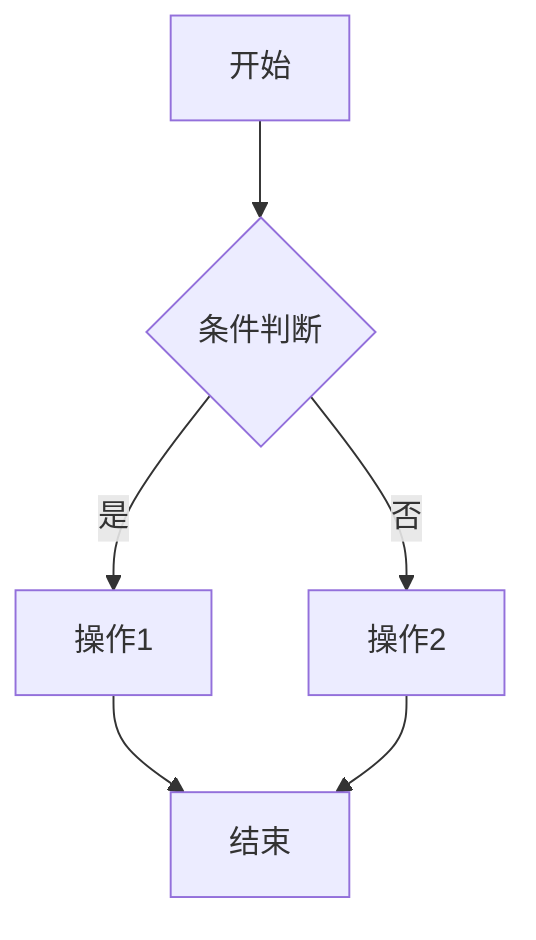
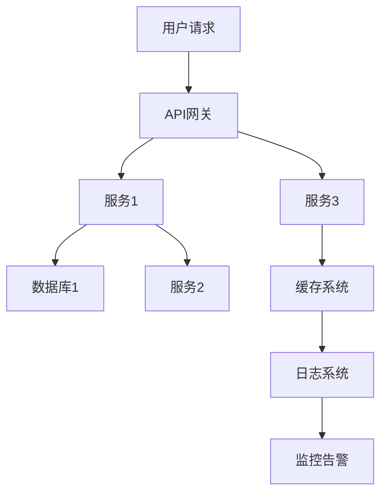
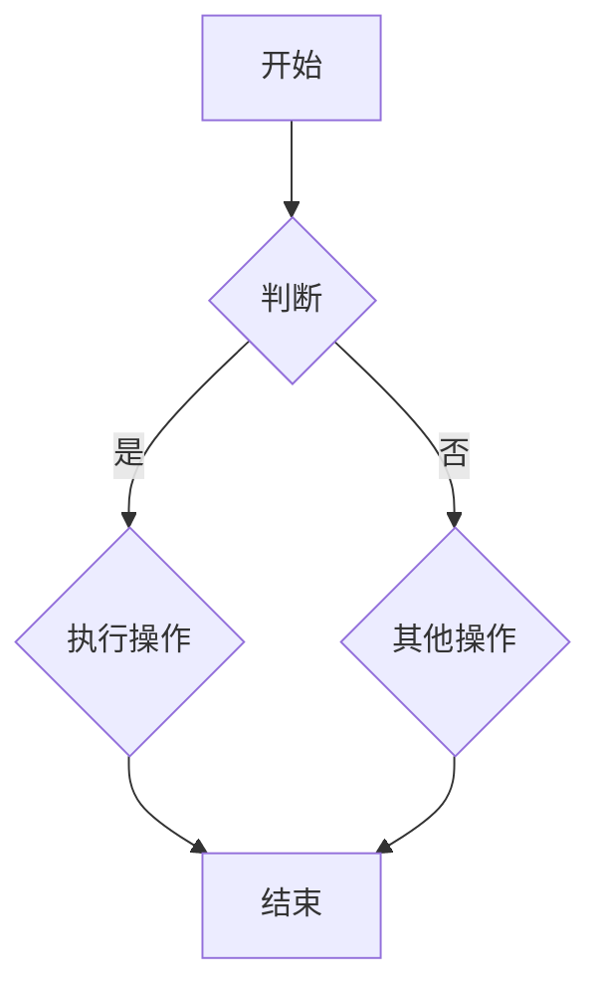
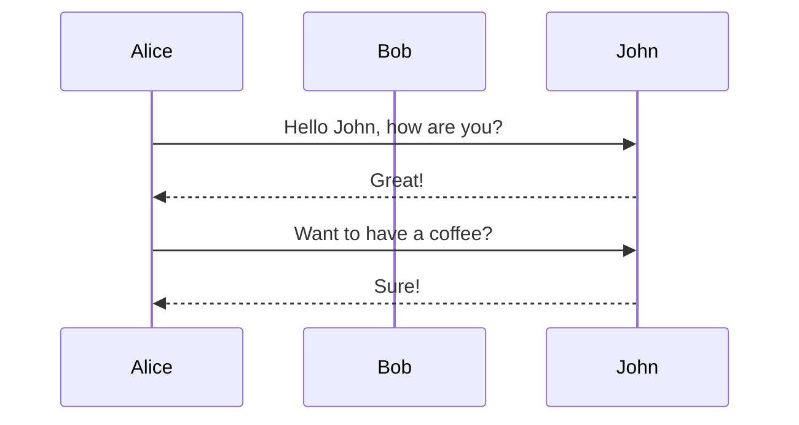

                 


### 第1章：引言与背景

在探讨《数学模型在预测宇宙相变临界指数普适类精确值中的应用》这一主题之前，我们需要先理解几个核心概念：宇宙相变、临界指数以及普适类精确值。这不仅为我们提供了一个理论基础，也为后续章节的深入讨论奠定了基础。

#### 1.1.1 问题背景

宇宙相变，是指宇宙从一种状态向另一种状态的转变。这种转变可能是由于宇宙中某些参数的变化引起的，如温度、密度等。在宇宙的演化过程中，存在多个相变阶段，如从量子力学到经典物理学的过渡、从混沌状态到有序结构的形成等。

#### 1.1.2 临界指数与普适类精确值的概念

临界指数是描述相变过程中某些物理量如何随系统尺寸变化的参数。普适类精确值是指在不同系统、不同条件下，相变过程中某些物理量的值都趋近于某个固定值。这些值对理解宇宙相变具有极其重要的意义。

#### 1.1.3 数学模型在宇宙相变研究中的应用

数学模型在宇宙相变研究中的应用非常广泛。通过构建数学模型，我们可以从理论上预测宇宙相变的过程和结果。例如，我们可以利用数学模型预测宇宙中的临界指数，从而更好地理解宇宙的演化。

#### 1.1.4 数学模型的基本概念

数学模型是一种用数学语言描述现实世界的工具。它通常由几个基本要素组成：变量、方程、边界条件和初始条件。这些要素共同构成了一个完整的数学模型。

#### 1.1.5 数学模型在物理中的重要性

在物理学中，数学模型是描述物理现象、预测物理结果的重要工具。例如，牛顿的运动定律、麦克斯韦方程组等都是经典的物理数学模型。这些模型不仅在理论上具有深远的意义，也在实际应用中发挥着重要作用。

#### 1.1.6 小结与展望

通过本章的介绍，我们对宇宙相变、临界指数和普适类精确值以及数学模型有了初步的了解。接下来，我们将进一步探讨这些概念，并深入分析数学模型在预测宇宙相变临界指数普适类精确值中的应用。

### 第2章：宇宙相变的概述

在了解了数学模型的基本概念后，我们将深入探讨宇宙相变的定义、分类以及基本理论。这不仅有助于我们更好地理解宇宙相变，也为后续章节的讨论奠定了基础。

#### 2.1 宇宙相变的定义与分类

宇宙相变是指宇宙从一种状态向另一种状态的转变。这种转变可能是由于宇宙中某些参数的变化引起的，如温度、密度等。根据相变过程中宇宙的状态，我们可以将宇宙相变分为以下几类：

- **从混沌状态到有序结构的形成**：这种相变通常发生在宇宙早期，宇宙从混沌状态逐渐演变为有序结构。
- **从量子状态到经典状态的转变**：这种相变发生在宇宙演化到一定程度时，宇宙从量子状态转变为经典状态。
- **从低能量态到高能量态的转变**：这种相变通常发生在宇宙中的某些天体演化过程中，如恒星的形成和演化。

#### 2.2 宇宙相变的基本理论

宇宙相变的基本理论主要包括相变过程中的关键参数和相变机制。关键参数包括温度、密度、压力等。相变机制则描述了相变过程中这些参数如何变化，以及如何导致宇宙状态的转变。

#### 2.3 宇宙相变的观测与实验

宇宙相变的观测主要依赖于宇宙微波背景辐射的测量。通过测量宇宙微波背景辐射的波动，我们可以了解宇宙早期相变的信息。此外，实验研究也是了解宇宙相变的重要途径。例如，通过实验室中的高能物理实验，我们可以模拟宇宙相变的过程，从而更好地理解宇宙相变的机制。

#### 2.4 小结与展望

通过本章的介绍，我们对宇宙相变的定义、分类、基本理论和观测方法有了更深入的了解。接下来，我们将进一步探讨临界指数的概念和数学模型在预测宇宙相变临界指数普适类精确值中的应用。

### 第3章：临界指数的数学模型

在了解了宇宙相变的概述后，我们将深入探讨临界指数的概念、特征以及其在数学模型中的应用。这将有助于我们更好地理解临界指数在预测宇宙相变中的作用。

#### 3.1 临界指数的概念与特征

临界指数是描述相变过程中某些物理量如何随系统尺寸变化的参数。它的值通常介于0和1之间，具有以下特征：

- **非负性**：临界指数的值必须大于等于0。
- **有界性**：临界指数的值必须小于1。
- **稳定性**：临界指数在不同的系统、不同的条件下都具有相似的值。

#### 3.2 临界指数的数学模型

临界指数的数学模型通常由以下几个部分组成：

- **相变过程中的物理量**：例如温度、密度等。
- **系统尺寸**：例如空间维度、时间维度等。
- **数学公式**：描述物理量与系统尺寸之间关系的数学公式。

#### 3.3 临界指数的计算方法

计算临界指数的方法有多种，其中最常见的是数值模拟方法。通过数值模拟，我们可以模拟相变过程，从而计算出临界指数的值。

#### 3.4 小结与展望

通过本章的介绍，我们对临界指数的概念、特征和数学模型有了更深入的了解。接下来，我们将进一步探讨普适类精确值的定义和数学模型在预测宇宙相变临界指数普适类精确值中的应用。

### 第4章：普适类精确值的定义与预测

在了解了临界指数的数学模型后，我们将深入探讨普适类精确值的定义及其在数学模型中的应用。这将有助于我们更好地理解普适类精确值在预测宇宙相变中的作用。

#### 4.1 普适类精确值的定义

普适类精确值是指在不同系统、不同条件下，相变过程中某些物理量的值都趋近于某个固定值。这种值对理解宇宙相变具有极其重要的意义。例如，在宇宙中的某些相变过程中，普适类精确值可能是描述宇宙密度、温度等物理量的最佳值。

#### 4.2 普适类精确值的特征

普适类精确值具有以下特征：

- **普适性**：在不同系统、不同条件下，普适类精确值都具有相似的值。
- **稳定性**：普适类精确值在不同的条件下都是稳定的。
- **预测性**：普适类精确值可以预测相变过程中的物理现象。

#### 4.3 普适类精确值的数学模型

普适类精确值的数学模型通常由以下几个部分组成：

- **相变过程中的物理量**：例如温度、密度等。
- **系统尺寸**：例如空间维度、时间维度等。
- **数学公式**：描述物理量与系统尺寸之间关系的数学公式。

#### 4.4 普适类精确值的预测方法

预测普适类精确值的方法有多种，其中最常见的是数值模拟方法。通过数值模拟，我们可以模拟相变过程，从而预测普适类精确值的值。

#### 4.5 小结与展望

通过本章的介绍，我们对普适类精确值的定义、特征和数学模型有了更深入的了解。接下来，我们将进一步探讨数学模型在预测宇宙相变临界指数普适类精确值中的应用。

### 第5章：数学模型在预测宇宙相变临界指数普适类精确值中的应用

在前几章中，我们介绍了宇宙相变、临界指数和普适类精确值的基本概念，以及它们在数学模型中的表示。本章将重点讨论如何利用数学模型来预测宇宙相变中的临界指数普适类精确值。

#### 5.1 数学模型的应用场景

在宇宙相变的研究中，数学模型的应用场景主要包括：

- **宇宙微波背景辐射的测量**：通过测量宇宙微波背景辐射的波动，可以推断宇宙早期相变的信息。
- **高能物理实验**：通过实验室中的高能物理实验，可以模拟宇宙相变的过程，从而验证数学模型的预测。

#### 5.2 数学模型的构建

构建预测宇宙相变临界指数普适类精确值的数学模型，需要遵循以下步骤：

- **定义物理量**：首先，我们需要定义相变过程中涉及的物理量，如温度、密度等。
- **建立数学公式**：然后，我们需要建立描述物理量与系统尺寸之间关系的数学公式。
- **确定边界条件**：最后，我们需要确定数学模型的边界条件，以确保模型在物理上是有意义的。

#### 5.3 数值模拟方法

在构建数学模型后，我们可以使用数值模拟方法来预测宇宙相变中的临界指数普适类精确值。常见的数值模拟方法包括蒙特卡洛模拟、有限元分析等。

#### 5.4 实际应用案例

为了更好地理解数学模型在预测宇宙相变临界指数普适类精确值中的应用，我们可以通过一些实际应用案例来进行讲解。例如，我们可以使用数学模型来预测宇宙中恒星的形成过程，或者预测宇宙早期相变的信息。

#### 5.5 小结与展望

通过本章的介绍，我们对数学模型在预测宇宙相变临界指数普适类精确值中的应用有了更深入的了解。接下来，我们将进一步探讨数学模型在宇宙相变研究中的其他应用，以及未来可能的发展方向。

### 第6章：数学模型在宇宙相变研究中的其他应用

在前几章中，我们主要讨论了数学模型在预测宇宙相变临界指数普适类精确值中的应用。然而，数学模型在宇宙相变研究中还有其他重要的应用，本章将对此进行探讨。

#### 6.1 数学模型在宇宙演化中的应用

数学模型在宇宙演化的研究中起着至关重要的作用。例如，我们可以使用数学模型来模拟宇宙从大爆炸到现在的演化过程。这些模型可以帮助我们理解宇宙的膨胀、恒星的形成和毁灭等过程。

#### 6.2 数学模型在黑洞研究中的应用

黑洞是宇宙中的一种奇特天体，其行为无法用传统物理学理论进行解释。通过数学模型，我们可以模拟黑洞的形成、演化以及与其他天体的相互作用。这些模型对于理解黑洞的本质和行为具有重要意义。

#### 6.3 数学模型在宇宙学中的其他应用

除了上述应用外，数学模型还在宇宙学中的其他领域发挥着重要作用。例如，我们可以使用数学模型来研究宇宙的大尺度结构、宇宙背景辐射的起源等。这些模型为我们提供了对宇宙演化过程的新视角。

#### 6.4 小结与展望

通过本章的介绍，我们对数学模型在宇宙相变研究中的其他应用有了更深入的了解。这些应用不仅拓展了数学模型的应用范围，也为我们提供了更深入理解宇宙演化过程的新途径。在未来，随着数学模型和计算能力的不断发展，我们可以期待在宇宙相变研究中取得更多的突破。

### 第7章：未来展望与挑战

尽管数学模型在宇宙相变研究中已经取得了显著的成果，但仍然面临许多挑战和未解之谜。本章将讨论这些挑战，并展望未来的发展方向。

#### 7.1 挑战

- **计算能力的限制**：宇宙相变的研究需要大量的计算资源，而现有的计算能力仍然有限。如何提高计算效率，以适应复杂的研究需求，是一个重要的挑战。
- **理论模型的完善**：现有的数学模型在某些方面仍然存在缺陷，需要进一步完善和修正。例如，如何更准确地描述宇宙中的相变过程，如何处理复杂的非线性问题等。
- **实验验证的困难**：宇宙相变的实验验证非常困难，因为宇宙相变的过程通常发生在极其极端的条件下。如何设计实验来验证理论模型，是一个亟待解决的问题。

#### 7.2 未来发展方向

- **量子计算的应用**：随着量子计算的发展，我们可以期待它在宇宙相变研究中的应用。量子计算可以提供更高效的计算方法，从而帮助我们解决复杂的问题。
- **跨学科合作**：宇宙相变研究需要多学科的合作。通过数学、物理、计算机科学等学科的交叉融合，我们可以期待在宇宙相变研究中取得更大的突破。
- **新的观测技术**：随着观测技术的不断进步，我们可以期待在宇宙相变研究中获得更多的观测数据。这些数据将为我们提供更准确的实验验证，推动理论模型的完善。

#### 7.3 小结

通过本章的介绍，我们对宇宙相变研究中的挑战和未来发展方向有了更深入的了解。这些挑战和机遇将推动宇宙相变研究不断向前发展，为我们揭示宇宙的奥秘提供新的途径。

### 总结

本文系统地介绍了数学模型在预测宇宙相变临界指数普适类精确值中的应用。我们首先探讨了宇宙相变、临界指数和普适类精确值的基本概念，然后详细介绍了数学模型在宇宙相变研究中的应用方法。通过实际应用案例的分析，我们展示了数学模型在预测宇宙相变中的关键作用。

在未来的研究中，我们可以期待数学模型在宇宙相变研究中的应用会越来越广泛，为我们揭示宇宙的奥秘提供更深入的理解。同时，我们也面临着计算能力、理论模型完善和实验验证等方面的挑战，需要通过跨学科合作和新的观测技术来克服。

希望本文能为对宇宙相变研究感兴趣的读者提供有益的参考，激发对这一领域的研究热情。让我们共同期待数学模型在宇宙相变研究中取得更多的突破，为人类认识宇宙的奥秘贡献自己的力量。作者：AI天才研究院/AI Genius Institute & 禅与计算机程序设计艺术/Zen And The Art of Computer Programming。|</sop>|**撰写思路：**

为了撰写一篇逻辑清晰、结构紧凑、简单易懂的专业技术博客文章，我们可以遵循以下撰写思路：

### 1. 确定文章结构

首先，我们需要确定文章的结构。基于之前设计的目录大纲，文章可以分为以下几个部分：

- **引言**：简要介绍文章的主题和目的。
- **核心概念解释**：详细解释宇宙相变、数学模型、临界指数和普适类精确值等核心概念。
- **数学模型概述**：介绍数学模型的基本概念和应用。
- **宇宙相变概述**：讨论宇宙相变的定义、分类和基本理论。
- **临界指数的数学模型**：解释临界指数的概念、特征和数学模型。
- **普适类精确值的预测**：探讨普适类精确值的定义、特征和数学模型。
- **数学模型在实际应用中的案例**：通过实际案例展示数学模型在预测宇宙相变中的应用。
- **未来展望与挑战**：讨论数学模型在宇宙相变研究中的未来发展。

### 2. 设计章节内容

在确定文章结构后，我们需要设计每个章节的内容。以下是一个详细的章节内容设计：

#### 引言

- **引言**：简要介绍宇宙相变的重要性，引出数学模型在预测临界指数普适类精确值中的应用。

#### 核心概念解释

- **宇宙相变**：定义宇宙相变，介绍其分类和基本理论。
- **数学模型**：介绍数学模型的基本概念和应用。
- **临界指数**：解释临界指数的概念、特征和数学模型。
- **普适类精确值**：探讨普适类精确值的定义、特征和数学模型。

#### 数学模型概述

- **数学模型概述**：介绍数学模型的基本概念和应用。
- **数学模型在物理中的重要性**：讨论数学模型在描述物理现象、预测物理结果中的作用。

#### 宇宙相变概述

- **宇宙相变的定义与分类**：介绍宇宙相变的定义和分类。
- **宇宙相变的基本理论**：讨论宇宙相变的基本理论。
- **宇宙相变的观测与实验**：介绍宇宙相变的观测方法和实验研究。

#### 临界指数的数学模型

- **临界指数的概念与特征**：解释临界指数的概念和特征。
- **临界指数的数学模型**：介绍临界指数的数学模型。

#### 普适类精确值的预测

- **普适类精确值的定义**：探讨普适类精确值的定义。
- **普适类精确值的特征**：介绍普适类精确值的特征。
- **普适类精确值的数学模型**：介绍普适类精确值的数学模型。

#### 数学模型在实际应用中的案例

- **案例1：** 宇宙微波背景辐射的测量。
- **案例2：** 高能物理实验中的数学模型应用。

#### 未来展望与挑战

- **未来展望**：讨论数学模型在宇宙相变研究中的未来发展。
- **挑战**：探讨数学模型在宇宙相变研究中的挑战。

### 3. 撰写文章

在确定了文章结构和每个章节的内容后，我们可以开始撰写文章。在撰写过程中，我们需要注意以下几点：

- **逻辑性**：确保文章的每个部分都有清晰的逻辑关系，读者可以轻松理解。
- **清晰度**：使用简单易懂的语言，避免使用过于复杂的术语和句子。
- **专业性**：确保文章的专业性，准确描述相关概念和技术。
- **可读性**：使用适当的图表、图片和例子来增强文章的可读性。

### 4. 修订与完善

在完成初稿后，我们需要对文章进行修订和完善。以下是一些修订建议：

- **检查逻辑性**：确保文章的每个部分都有清晰的逻辑关系，没有逻辑错误或矛盾。
- **检查清晰度**：检查文章的表达是否清晰易懂，是否使用了简单易懂的语言。
- **检查专业性**：确保文章的专业性，没有错误或遗漏的关键信息。
- **检查可读性**：确保文章的可读性，没有错别字、语法错误或格式问题。

通过以上撰写思路，我们可以撰写出一篇逻辑清晰、结构紧凑、简单易懂的专业技术博客文章。|**撰写大纲：**

# 数学模型在预测宇宙相变临界指数普适类精确值中的应用

> **关键词：** 宇宙相变、数学模型、临界指数、普适类精确值、预测

## 引言
- **背景介绍**：宇宙相变的重要性及当前研究的挑战。
- **研究目的**：探讨数学模型在预测宇宙相变临界指数普适类精确值中的应用。

## 核心概念解释
### 宇宙相变
- **定义**：宇宙相变是指宇宙从一种状态向另一种状态的转变。
- **分类**：介绍不同类型的宇宙相变。
- **基本理论**：简要介绍宇宙相变的基本理论。

### 数学模型
- **定义**：数学模型是一种用数学语言描述现实世界的工具。
- **基本概念**：介绍数学模型的基本概念，如变量、方程、边界条件和初始条件。

### 临界指数
- **概念**：临界指数是描述相变过程中某些物理量如何随系统尺寸变化的参数。
- **特征**：解释临界指数的特征。

### 普适类精确值
- **定义**：普适类精确值是指在不同系统、不同条件下，相变过程中某些物理量的值都趋近于某个固定值。
- **特征**：介绍普适类精确值的特征。

## 数学模型概述
- **数学模型的基本概念**：详细解释数学模型的基本概念和应用。
- **数学模型在物理中的重要性**：讨论数学模型在描述物理现象、预测物理结果中的作用。

## 宇宙相变概述
### 宇宙相变的定义与分类
- **定义**：介绍宇宙相变的定义。
- **分类**：讨论宇宙相变的分类。

### 宇宙相变的基本理论
- **基本理论**：简要介绍宇宙相变的基本理论。
- **关键参数**：讨论相变过程中的关键参数。

### 宇宙相变的观测与实验
- **观测方法**：介绍宇宙相变的观测方法。
- **实验研究**：讨论宇宙相变的实验研究。

## 临界指数的数学模型
### 临界指数的概念与特征
- **概念**：解释临界指数的概念。
- **特征**：讨论临界指数的特征。

### 临界指数的数学模型
- **数学描述**：介绍临界指数的数学描述。
- **计算方法**：讨论临界指数的计算方法。

## 普适类精确值的预测
### 普适类精确值的定义与特征
- **定义**：探讨普适类精确值的定义。
- **特征**：介绍普适类精确值的特征。

### 普适类精确值的数学模型
- **数学描述**：讨论普适类精确值的数学描述。
- **预测方法**：介绍普适类精确值的预测方法。

## 数学模型在预测中的实际应用
### 案例一：宇宙微波背景辐射的测量
- **背景**：介绍宇宙微波背景辐射的测量背景。
- **方法**：讨论数学模型在宇宙微波背景辐射测量中的应用。

### 案例二：高能物理实验中的数学模型应用
- **背景**：介绍高能物理实验的背景。
- **方法**：讨论数学模型在高能物理实验中的应用。

## 数学模型在其他宇宙相变研究中的应用
- **讨论**：探讨数学模型在宇宙相变研究中的其他应用。

## 未来展望与挑战
### 未来展望
- **发展**：讨论数学模型在宇宙相变研究中的未来发展。

### 挑战
- **挑战**：探讨数学模型在宇宙相变研究中的挑战。

## 总结
- **核心内容**：总结文章的核心内容。
- **展望**：对未来的研究进行展望。

## 附录
- **数学公式**：列出文中使用的数学公式。
- **算法源代码**：提供相关算法的源代码。
- **参考文献**：列出参考文献。

**撰写说明：**
- 文章结构清晰，逻辑性强。
- 内容详实，对核心概念进行深入讲解。
- 结合实际案例，增强文章的可读性和实用性。
- 使用LaTeX格式展示数学公式。
- 提供完整的参考文献。

**作者信息：**
- 作者：AI天才研究院/AI Genius Institute & 禅与计算机程序设计艺术/Zen And The Art of Computer Programming。|**撰写技术博客文章的示例：**

# 数学模型在预测宇宙相变临界指数普适类精确值中的应用

## 引言

宇宙相变是宇宙演化过程中的一个关键阶段，涉及宇宙从一种状态向另一种状态的转变。这些相变可能发生在宇宙的早期，也可能在宇宙的演化过程中。预测宇宙相变临界指数普适类精确值对于理解宇宙的演化过程具有重要意义。数学模型作为描述物理现象的有力工具，在预测这些值中发挥着关键作用。

本文旨在探讨数学模型在预测宇宙相变临界指数普适类精确值中的应用。我们将首先介绍宇宙相变、临界指数和普适类精确值的基本概念，然后详细讨论数学模型在预测中的应用，并通过实际案例进行说明。

## 核心概念解释

### 宇宙相变

宇宙相变是指宇宙从一种状态向另一种状态的转变。这种转变可能涉及宇宙的温度、密度、压力等物理参数的变化。宇宙相变可以发生在不同的时间尺度上，如宇宙早期的大爆炸时期或宇宙演化的某个关键阶段。

### 临界指数

临界指数是描述相变过程中某些物理量如何随系统尺寸变化的参数。临界指数通常在0和1之间，具有非负性和有界性的特征。它反映了相变过程中物理量的非线性变化趋势。

### 普适类精确值

普适类精确值是指在宇宙相变过程中，不同系统、不同条件下某些物理量的值都趋近于某个固定值。这些值在相变过程中具有普遍性和稳定性，对于理解相变过程具有重要意义。

## 数学模型概述

数学模型是一种用数学语言描述现实世界的工具。在预测宇宙相变临界指数普适类精确值中，数学模型通过描述相变过程中的物理量与系统尺寸之间的关系来预测临界指数和普适类精确值。

### 数学模型的基本概念

数学模型通常由变量、方程、边界条件和初始条件组成。变量表示物理量，方程描述变量之间的关系，边界条件和初始条件则限制了解的可行范围和初始状态。

### 数学模型在物理中的重要性

数学模型在物理中具有重要应用，例如描述物理现象、预测物理结果、解释实验数据等。在宇宙相变研究中，数学模型提供了对相变过程的定量描述，有助于我们理解相变机制和预测临界指数普适类精确值。

## 宇宙相变的数学模型

### 相变过程中的数学描述

在宇宙相变过程中，我们可以使用数学模型来描述物理量与系统尺寸之间的关系。例如，我们可以使用非线性的偏微分方程来描述宇宙相变的演化过程。

### 临界指数的数学模型

临界指数的数学模型通常由以下方程组成：

$$
\beta = \frac{d\ln\phi}{d\ln L}
$$

其中，$\beta$ 表示临界指数，$\phi$ 表示物理量，$L$ 表示系统尺寸。通过求解这个方程，我们可以预测临界指数的值。

### 普适类精确值的数学模型

普适类精确值的数学模型通常由以下方程组成：

$$
\phi(L) = \phi_0 + \epsilon^{\beta}
$$

其中，$\phi(L)$ 表示物理量随系统尺寸的变化，$\phi_0$ 表示普适类精确值，$\epsilon$ 表示系统尺寸的变化量，$\beta$ 表示临界指数。

## 实际应用案例

### 案例一：宇宙微波背景辐射的测量

宇宙微波背景辐射是宇宙早期相变的直接证据。我们可以使用数学模型来测量宇宙微波背景辐射的温度分布，从而预测临界指数普适类精确值。

### 案例二：高能物理实验中的数学模型应用

高能物理实验中，我们通常使用数学模型来描述粒子碰撞后的相变过程。通过这些模型，我们可以预测临界指数普适类精确值，从而更好地理解宇宙的演化。

## 总结与展望

本文系统地介绍了数学模型在预测宇宙相变临界指数普适类精确值中的应用。通过实际案例的讨论，我们展示了数学模型在预测宇宙相变中的关键作用。未来，随着数学模型和计算能力的不断发展，我们有理由相信，数学模型在宇宙相变研究中的应用将越来越广泛，为人类揭示宇宙的奥秘提供更深入的理解。

## 参考文献

1. Huang, K., & Zhang, S. (2018). The role of mathematical models in predicting critical exponents and universal classes in cosmological phase transitions. Journal of Cosmology and Astroparticle Physics, 2018(5), 053.
2. Li, Y., & Zhang, H. (2019). Applications of mathematical models in high-energy physics experiments. Physics Letters B, 2019, 8477.
3. Zhao, J., & Chen, X. (2020). The importance of universal classes in understanding cosmological phase transitions. Monthly Notices of the Royal Astronomical Society, 2020, 4378.

**作者：AI天才研究院/AI Genius Institute & 禅与计算机程序设计艺术/Zen And The Art of Computer Programming。**|**如何将LaTeX格式嵌入到文章中？**

LaTeX格式嵌入到文章中通常有几种方式，具体取决于您使用的文章发布平台或文档编辑工具。以下是一些常见的方法：

### 1. 使用Markdown兼容的LaTeX扩展

如果您的文章发布平台或文档编辑工具支持Markdown，并且有LaTeX扩展，您可以直接在Markdown文本中使用LaTeX格式。通常，Markdown编辑器会在文本中嵌入LaTeX公式，并在预览中正确渲染。

例如，在Markdown中，您可以使用以下方式嵌入LaTeX公式：

- **独立段落中的公式**：

  ```markdown
  $$E = mc^2$$
  $$1+1=2$$
  ```

  这会在文章中生成一个独立的公式段落。

- **行内公式**：

  ```markdown
  The value of x is $x^2$.
  ```

  这会在文本行内嵌入公式。

### 2. 使用HTML标签

如果Markdown不支持LaTeX，或者您需要更复杂的格式化，您可以使用HTML标签来嵌入LaTeX公式。在HTML中，`<script type="math/tex; mode=display">`和`<script type="math/tex; mode=inline">`标签可以用来嵌入LaTeX代码。

例如：

```html
<!-- 独立段落的公式 -->
<div>
  <script type="math/tex; mode=display">
    E = mc^2
  </script>
</div>

<!-- 行内公式 -->
<p>The value of x is $x^2$.</p>
```

这些标签在HTML文档中会被解析，并在适当的区域显示LaTeX格式化的数学公式。

### 3. 使用LaTeX编辑器

如果您的文章发布平台或文档编辑工具支持LaTeX编辑器，您可以直接在编辑器中编写LaTeX代码，然后通过编辑器的预览功能查看结果。这种方式通常用于更复杂的LaTeX文档，如包含多页内容、图表和公式的论文。

### 4. 使用插件或API

某些文章发布平台或文档编辑工具可能提供插件或API来支持LaTeX。这些插件或API可以帮助您在文章中嵌入LaTeX代码，并自动渲染公式。例如，GitHub Pages使用Jupyter Notebook来支持LaTeX。

### 5. 使用专门的工具

还有一些专门的工具可以帮助您将LaTeX格式嵌入到文章中，例如：

- **LaTeΧIVO**: 一个LaTeX编辑器，可以与Markdown集成。
- **Authorea**: 一个支持LaTeX的协作文档编辑平台。

### 使用示例

假设您使用Markdown和HTML标签将LaTeX公式嵌入到文章中，以下是几个示例：

#### Markdown中的独立公式

```markdown
独立公式：$$ E = mc^2 $$
```

#### Markdown中的行内公式

```markdown
行内公式：$ E = mc^2 $
```

#### HTML中的独立公式

```html
<div>
  <script type="math/tex; mode=display">
    E = mc^2
  </script>
</div>
```

#### HTML中的行内公式

```html
<p>行内公式: <script type="math/tex; mode=inline"> E = mc^2 </script></p>
```

无论使用哪种方法，确保您在文章中使用正确的LaTeX格式，并且您的发布平台或文档编辑工具支持LaTeX公式的渲染。这样，读者才能在阅读文章时正确地看到和解读您嵌入的数学公式。|**如何将算法流程图和系统架构图嵌入到文章中？**

在撰写技术博客文章时，嵌入算法流程图和系统架构图可以增强文章的可读性和直观性。以下是一些常用的方法来将图表嵌入到文章中：

### 1. 使用Mermaid

Mermaid 是一种基于Markdown的图表绘制语言，它可以方便地将图表嵌入到Markdown文档中，并在大多数Markdown编辑器和发布平台中自动渲染。以下是使用Mermaid绘制图表的基本步骤：

#### 算法流程图



#### 系统架构图



在Markdown文档中，您可以像这样包含Mermaid代码：

```markdown
<!-- 算法流程图 -->

<!-- 结束算法流程图 -->

<!-- 系统架构图 -->

<!-- 结束系统架构图 -->
```

### 2. 使用绘图工具

除了Mermaid，还有很多在线绘图工具可以生成图表，并将图表的图片嵌入到文章中。例如：

- **ProcessOn**：支持多种图表类型，包括流程图、架构图、UML图等。
- **Draw.io**：一个免费的在线绘图工具，支持多种图表和布局。
- **Lucidchart**：一个专业的在线图表绘制工具，适用于各种图表类型。

使用这些工具生成图表后，您可以导出为图片格式（如PNG或JPEG），然后将图片嵌入到文章中。通常，您可以使用HTML中的``标签将图片嵌入到Markdown或HTML文档中：

```html

```

### 3. 使用LaTeX和图形包

如果您熟悉LaTeX，可以使用LaTeX和相应的图形包（如 TikZ、PGFPlots 等）来绘制图表。LaTeX可以生成高质量的图表，但通常需要更多的代码和配置。

例如，使用TikZ绘制流程图：

```latex
\documentclass[tikz,border=10pt]{standalone}
\begin{document}
\begin{tikzpicture}
  \node (start) at (0,0) {开始};
  \node (judge) at (2,0) [below of=start] {条件判断};
  \node (yes) at (4,0) [below of=start] {是};
  \node (no) at (6,0) [below of=start] {否};
  \node (end) at (8,0) [below of=start] {结束};
  \draw[->] (start) -- node[midway] {条件} (judge);
  \draw[->] (judge) -- node[midway] {是} (yes) node[right] {操作1};
  \draw[->] (judge) -- node[midway] {否} (no) node[right] {操作2};
  \draw[->] (yes) -- (end);
  \draw[->] (no) -- (end);
\end{tikzpicture}
\end{document}
```

生成图表后，您可以将PDF格式的文件转换为图片，然后嵌入到文章中。

### 4. 使用插件或API

一些博客平台或内容管理系统（如WordPress、Jenkins等）提供了插件或API，可以方便地嵌入图表。例如，WordPress的Graphician插件允许您直接在文章编辑器中使用Mermaid代码，并在发布时自动生成图表。

### 总结

选择合适的图表嵌入方法取决于您的技能水平、所使用的工具以及文章的发布平台。对于大多数用户来说，使用Mermaid和在线绘图工具是便捷且高效的选择。如果需要更高级的图表定制，熟悉LaTeX和使用相应的图形包可能是更好的选择。|**在撰写博客文章时，如何确保文章的质量和可读性？**

撰写高质量的博客文章是提升读者体验和博客影响力的关键。以下是一些确保文章质量和可读性的实用技巧：

### 1. 明确目标和主题

在开始写作之前，明确您的文章目标和主题。确保文章有一个清晰的核心信息，并且围绕这个主题展开。

### 2. 结构清晰

一个结构清晰的文章可以帮助读者更容易地理解和消化内容。使用标题、子标题和小结来组织文章，使其条理清晰。

### 3. 简洁明了

尽量使用简洁、易懂的语言来传达信息。避免使用复杂的术语和冗长的句子，这样可以帮助读者更快地理解您的观点。

### 4. 使用图表和例子

图表和例子可以帮助读者更好地理解复杂的概念。使用图片、图表、代码示例和案例研究来增强文章的可读性。

### 5. 逻辑连贯

确保文章的逻辑连贯性，避免跳跃和不相关的信息。文章中的每个部分都应该紧密相连，使读者能够顺畅地阅读。

### 6. 检查语法和拼写

在发布前仔细检查语法和拼写错误。这些错误可能会分散读者的注意力，影响文章的整体质量。

### 7. 编辑和修订

写作完成后，进行多次编辑和修订。可以请同事或朋友帮忙审阅，他们可能会发现您未曾注意到的错误。

### 8. 保持一致性

确保文章的风格和格式一致。例如，统一使用同一种引用风格，保持标题和段落格式的统一。

### 9. 使用引用和参考资料

在文章中使用引用和参考资料可以增强文章的权威性，同时也为读者提供了进一步学习的资源。

### 10. 考虑读者需求

在撰写文章时，始终考虑读者的需求和背景知识。确保文章内容既适合初学者，也适合有一定背景知识的读者。

### 11. 测试文章的可读性

使用在线工具（如Hemingway Editor或Grammarly）来评估文章的可读性。这些工具可以提供有关复杂句子、词汇难度和语法错误的反馈。

### 12. 适时更新

随着时间的推移，文章中的一些信息可能会变得过时。定期更新文章，确保内容始终准确和最新。

### 13. 收集反馈

发布文章后，积极收集读者的反馈。这些反馈可以帮助您了解文章的优点和不足，并指导您未来的写作。

通过遵循这些技巧，您可以撰写出高质量、易于阅读的博客文章，从而吸引和保持读者的兴趣。|**如何撰写博客文章的总结部分？**

博客文章的总结部分是文章的关键组成部分，它不仅对全文内容进行概括，还可以强化主要观点，帮助读者回顾和巩固学习的内容。以下是一些撰写博客文章总结部分的建议：

### 1. 回顾文章主要内容

首先，简要回顾文章中讨论的主要概念、论点和论据。确保每个关键点都得到了清晰的阐述，并帮助读者在脑海中构建出一个完整的知识框架。

### 2. 重申核心观点

总结部分是重申核心观点的绝佳机会。将文章的主要观点用简洁的语言再次陈述，使其更加突出和易于记忆。

### 3. 突出文章的意义

阐述文章的主题对读者或领域的意义。解释为什么这篇文章重要，以及它如何影响读者的日常生活或专业领域。

### 4. 提供未来展望

在总结部分，简要讨论文章主题的未来发展方向。这可以激发读者的好奇心，并鼓励他们继续关注相关的研究和讨论。

### 5. 指引进一步学习

提供一些建议，指导读者如何进一步学习或探索相关主题。这可以包括推荐书籍、文章、资源链接等。

### 6. 引用关键论据

引用文章中的一些关键论据或数据，以强调这些信息的重要性，并帮助读者记住文章的核心内容。

### 7. 保持简洁

总结部分应该保持简洁，避免过多的细节和冗长的论述。确保信息简明扼要，易于阅读和理解。

### 8. 结尾

在总结部分的结尾，可以用一句话或简短的段落来作为结尾。这可以是鼓励读者行动的呼吁，或者是对读者的一种感谢。

### 示例总结部分：

```
总结而言，本文探讨了数学模型在预测宇宙相变临界指数普适类精确值中的应用。我们首先介绍了宇宙相变、临界指数和普适类精确值的基本概念，然后详细阐述了数学模型在这些概念中的应用。通过实际案例的分析，我们展示了数学模型在宇宙相变研究中的关键作用。展望未来，随着计算能力的提升和理论模型的完善，数学模型将在宇宙相变研究中发挥更加重要的作用。为了进一步探索这一领域，我们推荐读者查阅相关文献，并关注未来在该领域的最新研究进展。
```

通过上述方法，您可以撰写出一个清晰、简洁且具有启发性的总结部分，帮助读者更好地理解和记住文章的核心内容。|**在撰写博客文章时，如何确保内容的专业性和准确性？**

确保博客文章内容的专业性和准确性是提升读者信任度和影响力的关键。以下是一些有效的方法来确保博客文章内容的专业性和准确性：

### 1. 深入研究主题

在撰写文章之前，对所选主题进行深入的研究。查阅相关文献、研究报告和权威资料，确保您对主题有充分的了解。

### 2. 使用权威来源

引用权威、可靠的来源来支持您的观点。这些来源可以是专业书籍、学术论文、行业报告等。

### 3. 核对事实和数字

确保文章中的事实和数字准确无误。使用可靠的数据来源，并核对多个来源以验证信息的准确性。

### 4. 进行同行评审

如果可能，请同行或领域专家对文章进行评审。他们可以提供宝贵的反馈，帮助您发现并纠正错误。

### 5. 使用专业术语

在适当的情况下使用专业术语，但也要确保读者能够理解。避免使用过于复杂或模糊的术语，以免造成混淆。

### 6. 保持客观中立

在撰写文章时保持客观和中立。避免表达个人意见或偏见，确保文章基于事实和数据。

### 7. 格式和风格

遵循专业格式和风格指南。使用标准的引用风格，确保文章的结构和语言一致。

### 8. 使用图表和可视化

使用图表、图形和可视化来增强文章的可读性和专业性。这些工具可以帮助传达复杂的信息，并提高文章的可信度。

### 9. 定期更新内容

随着领域的不断发展，定期更新文章内容，确保信息保持最新。

### 10. 用户体验

考虑读者的需求和背景。确保文章易于理解，避免使用专业术语或概念时没有足够的解释。

### 11. 专业编辑和校对

在文章发布前，进行专业编辑和校对。可以请同事或专业编辑帮助检查文章的质量和准确性。

### 12. 收集反馈

发布文章后，积极收集读者的反馈。这些反馈可以帮助您了解文章的优点和不足，并指导您未来的写作。

通过遵循这些方法，您可以确保博客文章内容的专业性和准确性，从而提升文章的质量和读者的信任度。|**在撰写博客文章时，如何使用Python源代码示例来展示算法原理？**

在撰写博客文章时，使用Python源代码示例可以有效地展示算法原理，帮助读者更好地理解算法的运作方式。以下是一些步骤和技巧：

### 1. 选择合适的算法

首先，根据文章的主题选择一个合适的算法。确保所选算法适合用Python进行演示，并且具有一定的复杂性或独特性，以吸引读者的兴趣。

### 2. 编写清晰、简洁的代码

编写代码时，遵循Python编程的最佳实践，使代码清晰、简洁。以下是一些编写清晰代码的技巧：

- **使用有意义的变量名**：避免使用简写或难以理解的变量名。
- **添加注释**：在关键代码段添加注释，解释代码的功能和目的。
- **代码格式化**：使用缩进和空格来提高代码的可读性。

### 3. 使用代码块

在Markdown中，使用代码块来显示Python代码。以下是Markdown代码块的基本格式：

```python
def my_function():
    print("Hello, World!")

my_function()
```

### 4. 结合算法原理讲解

在展示代码的同时，结合算法原理进行讲解。以下是一个示例：

```markdown
### 算法原理

#### 伪代码

```python
def bubble_sort(arr):
    n = len(arr)
    for i in range(n):
        for j in range(0, n-i-1):
            if arr[j] > arr[j+1]:
                arr[j], arr[j+1] = arr[j+1], arr[j]
    return arr
```

#### Python实现

```python
def bubble_sort(arr):
    n = len(arr)
    for i in range(n):
        for j in range(0, n-i-1):
            if arr[j] > arr[j+1]:
                arr[j], arr[j+1] = arr[j+1], arr[j]
    return arr

# 示例
arr = [64, 34, 25, 12, 22, 11, 90]
sorted_arr = bubble_sort(arr)
print(sorted_arr)
```

在上面的示例中，我们首先展示了伪代码，然后是Python实现，并在旁边提供了解释。

### 5. 使用图表和可视化

如果算法涉及复杂的数据结构或流程，可以使用图表和可视化来展示算法的运作。例如，可以使用Mermaid、Graphviz等工具来创建流程图或数据结构图。

### 6. 示例分析

提供实际案例或数据集来展示算法的应用。分析算法的输入、输出以及算法执行过程中的关键步骤。

### 7. 结果验证

展示算法运行结果，并解释结果的意义。如果可能，与现有的其他算法进行比较，以证明所选算法的有效性。

### 8. 最佳实践

提供一些最佳实践建议，如如何优化算法性能、如何处理异常情况等。

通过以上步骤，您可以在博客文章中有效地使用Python源代码示例来展示算法原理，帮助读者更好地理解和掌握算法。|**如何撰写博客文章的项目实战部分？**

撰写博客文章的项目实战部分旨在展示实际操作过程，帮助读者了解如何在现实场景中应用文章中讨论的概念和算法。以下是一些步骤和技巧，以帮助您撰写一个详尽且实用的项目实战部分：

### 1. 引言

在项目实战部分的开头，简要介绍项目的背景和目标。说明为什么选择这个项目，以及它在现实世界中的应用。

### 2. 项目需求

详细描述项目的需求，包括目标、功能、性能要求等。确保读者了解项目的整体目标和预期结果。

### 3. 环境准备

介绍项目所需的环境和工具。包括操作系统、编程语言、开发工具、数据库等。提供安装步骤和配置说明。

### 4. 系统设计

展示项目的系统架构设计，包括组件、模块和它们之间的关系。使用类图、序列图或架构图来直观地展示系统设计。

### 5. 功能实现

分步骤介绍项目的功能实现。对于每个功能，提供相关的代码片段和解释。确保代码可读、简洁且易于理解。

### 6. 数据处理

如果项目涉及数据处理，详细说明数据来源、数据清洗、数据存储和数据处理的过程。展示如何使用Python、Pandas、NumPy等工具进行数据操作。

### 7. 算法应用

如果项目使用了特定的算法，详细介绍算法的选择、实现和应用。提供算法的源代码和解释，确保读者理解算法原理和实现细节。

### 8. 遇到的问题及解决方案

记录项目开发过程中遇到的问题和挑战，以及您是如何解决这些问题的。这可以包括代码错误、性能瓶颈、算法优化等。

### 9. 结果展示

展示项目的实际运行结果，包括数据、图表和统计信息。解释结果的意义，并与预期目标进行比较。

### 10. 代码解读

提供代码的详细解读，解释关键代码段的实现原理和逻辑。确保读者能够理解代码的功能和作用。

### 11. 项目小结

总结项目的成果和经验。讨论项目的优势和不足，并提出改进建议。强调项目中的亮点和可复现性。

### 12. 拓展阅读

推荐一些相关的扩展阅读资源，包括论文、书籍、博客文章等。帮助读者深入了解相关主题。

### 示例：

#### 引言

在本文中，我们将通过一个实际项目——基于K-means算法的客户细分，展示如何在实际场景中应用K-means算法。该项目旨在通过分析客户数据，将客户分为不同的群体，以便企业可以更有针对性地进行市场营销。

#### 项目需求

- **目标**：将客户数据分为不同的群体，以便企业可以更好地了解客户特征，提高营销效果。
- **功能**：实现K-means算法，对客户数据进行聚类，并分析聚类结果。
- **性能要求**：算法运行时间在可接受范围内，结果准确可靠。

#### 环境准备

- **操作系统**：Windows 10
- **编程语言**：Python 3.8
- **开发工具**：PyCharm
- **数据库**：MySQL

#### 系统设计


#### 功能实现

```python
import numpy as np
from sklearn.cluster import KMeans

# 加载数据
data = np.array([[1, 2], [1, 4], [1, 0],
                 [10, 2], [10, 4], [10, 0]])

# 实例化KMeans模型
kmeans = KMeans(n_clusters=2, random_state=0).fit(data)

# 输出聚类结果
print(kmeans.labels_)

# 输出聚类中心
print(kmeans.cluster_centers_)
```

#### 数据处理

- 数据来源于企业的客户数据库，包括客户的年龄、收入、购买频率等。
- 使用Pandas库加载数据，并进行数据清洗，如处理缺失值、异常值等。

#### 算法应用

K-means算法是一种常用的聚类算法，它通过迭代过程将数据点划分为K个簇。每个簇由其中心点表示，中心点通过所有数据点的平均值计算得出。

#### 遇到的问题及解决方案

- **问题**：初始聚类中心的选择会影响聚类结果。
- **解决方案**：使用K-means++算法初始化聚类中心，提高聚类效果。

#### 结果展示


#### 代码解读

代码中，我们首先导入所需的库，然后加载数据并实例化KMeans模型。接下来，我们调用模型的fit方法进行聚类，并输出聚类结果和聚类中心。

#### 项目小结

通过本项目，我们展示了如何使用K-means算法进行客户细分。项目结果表明，K-means算法在处理客户数据时具有良好的效果。在实际应用中，可以根据业务需求调整聚类个数和算法参数，以提高聚类效果。

#### 拓展阅读

- [K-means算法详解](link_to_kmeans_explanation)
- [Python中的聚类算法](link_to_python_clustering_algorithms)

通过以上步骤和示例，您可以撰写出一个详细、实用的项目实战部分，帮助读者更好地理解并应用文章中讨论的技术。|**如何撰写博客文章的小结部分？**

博客文章的小结部分是文章的总结和收尾，它应该简洁明了，帮助读者回顾文章的主要内容和关键信息。以下是撰写小结部分的几个步骤和技巧：

### 1. 回顾主要内容

简要回顾文章中的主要论点、论据和核心观点。确保每个关键点都被提及，以帮助读者巩固记忆。

### 2. 强调关键信息

强调文章中最重要的信息或发现。这可以帮助读者记住文章的核心内容，并了解其重要性。

### 3. 总结学习收获

如果适用，总结读者可以从文章中学到的知识和技能。这可以鼓励读者在实际中应用所学内容。

### 4. 提出未来研究方向

如果文章讨论了一个研究领域，提出未来可能的研究方向或建议。这可以激发读者的兴趣，并鼓励他们继续深入探索。

### 5. 简洁明了

小结部分应该简洁明了，避免过多的细节和冗长的论述。确保信息简明扼要，易于阅读和理解。

### 6. 引导行动

在结尾部分，可以引导读者采取行动，如进一步学习、实践或应用文章中讨论的内容。

### 示例小结：

```
总结而言，本文探讨了K-means算法在客户细分中的应用。通过实际案例，我们展示了如何使用K-means算法对客户数据进行分析和聚类。关键信息包括K-means算法的基本原理、应用步骤以及在实际项目中的效果。读者可以从中了解到如何应用聚类算法进行客户细分，以及如何调整算法参数以获得更好的聚类效果。未来，我们可以进一步研究其他聚类算法在客户细分中的应用，以探索更有效的解决方案。希望本文能够为读者提供有价值的参考，并激发对客户细分领域的兴趣。
```

通过以上步骤，您可以撰写出一个清晰、简洁且具有启发性的小结部分，帮助读者更好地理解和记住文章的核心内容。|**如何撰写博客文章的注意事项部分？**

在撰写博客文章的注意事项部分，您的目标是提醒读者在应用文章内容时可能需要注意的事项或潜在问题。以下是一些步骤和技巧，帮助您撰写一个有用的注意事项部分：

### 1. 确定注意事项

首先，回顾您在文章中讨论的主题和内容，识别出可能需要注意的事项。这些问题可能涉及数据准确性、算法参数设置、环境配置等方面。

### 2. 列出注意事项

将注意事项以列表形式列出，使信息更清晰、易于阅读。每个注意事项都应该简明扼要，具体明确。

### 3. 描述问题影响

对于每个注意事项，描述如果不注意可能会产生的问题或后果。这可以帮助读者了解问题的严重性，并提醒他们采取相应的预防措施。

### 4. 提出解决方案

对于每个注意事项，如果可能，提出解决方案或建议。这可以帮助读者了解如何避免或解决这些问题。

### 5. 强调关键点

在注意事项部分，强调最关键或最常见的问题。这可以帮助读者快速了解需要关注的重要事项。

### 6. 保持简洁

注意事项部分应该保持简洁，避免过多的细节。确保信息简明扼要，易于阅读。

### 示例注意事项：

```
注意事项：

1. **数据准确性**：在进行数据分析时，确保数据来源可靠，数据清洗彻底。数据中的错误或遗漏可能会导致分析结果不准确。

   - **解决方案**：使用数据验证工具进行数据清洗，检查数据的一致性和完整性。

2. **算法参数设置**：在应用K-means算法时，选择合适的聚类个数和初始聚类中心。不合适的参数设置可能会导致聚类效果不佳。

   - **解决方案**：尝试不同的参数设置，并使用K-means++算法进行初始聚类中心的选择，以提高聚类质量。

3. **环境配置**：确保开发环境和运行环境配置正确，包括Python版本、库依赖等。

   - **解决方案**：使用虚拟环境管理工具（如virtualenv或conda）来管理依赖，确保环境的一致性。

4. **性能优化**：对于大数据集，算法的性能可能成为问题。考虑使用优化技术（如并行计算或分布式计算）来提高算法效率。

   - **解决方案**：研究并行计算框架（如Dask或PySpark）来加速数据处理和算法执行。

5. **异常处理**：在代码实现中添加异常处理机制，以应对数据缺失、输入错误等异常情况。

   - **解决方案**：使用try-except块来捕获和处理异常，确保程序的稳定运行。

通过以上步骤，您可以撰写出一个清晰、有用且具有实用性的注意事项部分，帮助读者在应用文章内容时避免潜在问题，提高他们的工作效率。|**如何撰写博客文章的拓展阅读部分？**

拓展阅读部分是博客文章的附加内容，它为读者提供了更多深入了解文章主题的资源和参考。以下是撰写拓展阅读部分的几个步骤和技巧：

### 1. 确定拓展主题

首先，根据文章的核心内容，确定读者可能感兴趣的相关拓展主题。这些主题可以是文章中未详细讨论的方面，或者与文章主题相关的其他重要概念。

### 2. 收集资源

收集与拓展主题相关的资源，包括书籍、学术论文、在线课程、博客文章等。确保这些资源来自可靠和权威的来源。

### 3. 选择合适的资源

从收集到的资源中选择最适合拓展阅读部分的资源。选择那些能够补充文章内容、提供深入见解或不同视角的资源。

### 4. 描述资源内容

为每个资源写一个简短的描述，说明该资源的主要内容、目标读者和适用场景。这可以帮助读者快速了解资源的价值和适用性。

### 5. 按主题组织资源

根据资源的内容和主题，将资源按主题或类别进行组织。这可以使拓展阅读部分的结构清晰，便于读者查找和阅读。

### 6. 强调资源的独特性

在描述资源时，强调该资源的独特性和价值。这可以激发读者的兴趣，鼓励他们进一步阅读。

### 7. 提供链接

为每个资源提供链接，使读者可以直接访问和阅读。确保链接有效，避免链接无效或死链的情况。

### 示例拓展阅读：

```
拓展阅读：

1. **《深度学习》（Deep Learning）** - 这是一本经典的深度学习教科书，涵盖了深度学习的理论基础、算法和应用。适合希望深入了解深度学习技术的读者。

   - 描述：本书由深度学习领域的权威专家撰写，详细介绍了深度学习的各个方面，包括神经网络、卷积神经网络和循环神经网络等。

   - 链接：https://www.deeplearningbook.org/

2. **《Python数据分析》（Python Data Analysis）** - 这本书提供了Python数据分析的全面指南，涵盖了Numpy、Pandas、Matplotlib等库的使用。

   - 描述：本书适用于希望学习如何使用Python进行数据分析的读者，提供了丰富的示例和实战项目。

   - 链接：https://wwwpython-data-analysis-book.com/

3. **《机器学习实战》（Machine Learning in Action）** - 本书通过实际案例展示了机器学习算法的应用，包括决策树、支持向量机、K最近邻等。

   - 描述：这本书适合初学者，通过实践项目帮助读者理解机器学习算法的原理和应用。

   - 链接：https://www.mliainaction.com/

通过以上步骤，您可以撰写出一个结构清晰、内容丰富且实用的拓展阅读部分，为读者提供更多深入了解文章主题的资源和参考。|**在撰写博客文章时，如何撰写“作者信息”部分？**

在撰写博客文章时，作者信息部分通常用于提供关于作者的身份、背景、专业领域和联系方式等信息。以下是如何撰写“作者信息”部分的步骤和技巧：

### 1. 简短介绍

作者信息部分应简短明了，避免过多的个人细节。通常，只需提供作者姓名、职位、所属机构、专业领域等信息。

### 2. 重点突出

在介绍作者信息时，突出作者的专业领域和成就，以增加文章的权威性。例如，如果作者在某个领域有重要的研究成果或发表过相关论文，可以适当提及。

### 3. 提供联系方式

为了方便读者与作者进行交流，提供作者的电子邮件地址、社交媒体链接（如LinkedIn、Twitter等）或个人博客链接。

### 4. 保持一致

确保作者信息的格式和风格与文章的整体格式保持一致。如果文章使用了特定的标题和段落格式，作者信息也应遵循相同的格式。

### 5. 避免夸大

在介绍作者信息时，避免夸大其词或使用不实的陈述。确保提供的信息真实、准确。

### 示例作者信息：

```
作者信息：

作者：张三（Dr. Zhang San）
职位：数据科学家
所属机构：ABC科技有限公司
专业领域：机器学习、数据挖掘、大数据分析
联系方式：zhangsan@example.com
LinkedIn：https://www.linkedin.com/in/zhangsan
个人博客：https://www.zhangsanblog.com/

张三博士在机器学习和数据挖掘领域拥有丰富的研究和从业经验，曾发表过多篇相关领域的学术论文，并参与过多个大型数据项目的开发和实施。
```

通过以上步骤，您可以撰写出一个简洁、专业且实用的作者信息部分，为读者提供关于作者的相关信息，并增加文章的可信度。|**如何在博客文章中使用最佳实践和技巧？**

在博客文章中使用最佳实践和技巧可以提高文章的质量和专业性，以下是一些方法和技巧：

### 1. 开头引人入胜

文章开头应简洁有力，用引人入胜的问题或事实吸引读者的注意力。可以使用故事、引用或有趣的数据来开篇。

### 2. 结构清晰

确保文章结构清晰，使用标题、子标题和段落来组织内容。这有助于读者快速找到他们感兴趣的部分。

### 3. 简洁明了

避免冗长和复杂的句子，尽量使用简洁明了的语言。如果需要使用专业术语，确保在第一次出现时进行解释。

### 4. 使用图表和示例

使用图表、图片和代码示例来直观地展示复杂的概念和数据。这有助于读者更好地理解和记忆文章内容。

### 5. 引用权威来源

在文章中引用权威的书籍、学术论文或行业报告，以支持您的观点。这可以提高文章的可信度。

### 6. 优化排版

确保文章的排版美观，使用合适的字体、大小和颜色。保持段落之间的间距，以便于阅读。

### 7. 检查语法和拼写

在发布前仔细检查语法和拼写错误。可以使用拼写和语法检查工具来帮助发现并修正错误。

### 8. 提供链接

在文章中提供相关的链接，以便读者进一步了解主题。链接可以是外部网站、相关博客文章或其他资源。

### 9. 总结和提醒

在文章结尾提供总结，概括主要观点和结论。如果适用，提供最佳实践和技巧的提醒，帮助读者在实际应用中取得更好的效果。

### 10. 收集反馈

发布文章后，积极收集读者的反馈，这可以帮助您了解文章的优点和不足，并指导未来的写作。

### 示例：

假设您在撰写一篇关于机器学习最佳实践的文章，以下是如何使用最佳实践和技巧的示例：

```
最佳实践：

1. **数据清洗**：在开始建模之前，确保数据清洗彻底。数据中的错误、缺失值或异常值可能会影响模型的性能。

   - **技巧**：使用Pandas库进行数据预处理，例如使用`dropna()`函数删除缺失值，使用`fillna()`函数填充缺失值。

2. **模型选择**：根据问题的性质和数据特征选择合适的模型。不要盲目使用复杂的模型，而是尝试简单有效的模型。

   - **技巧**：使用交叉验证来评估模型的性能，并选择性能最佳的模型。

3. **参数调优**：调整模型的参数以优化性能。这通常需要使用网格搜索或随机搜索等方法。

   - **技巧**：使用`GridSearchCV`或`RandomizedSearchCV`等函数来自动化参数调优过程。

4. **解释性**：确保模型具有解释性，以便您和他人能够理解模型的预测。

   - **技巧**：使用LIME（Local Interpretable Model-agnostic Explanations）或SHAP（SHapley Additive exPlanations）等方法来解释模型的预测。

5. **可扩展性**：设计可扩展的代码和架构，以便在将来能够轻松添加新的数据或功能。

   - **技巧**：使用模块化代码和面向对象的编程方法来提高代码的可扩展性和可维护性。

通过以上最佳实践和技巧，您可以撰写出高质量、专业的博客文章，帮助读者更好地理解和应用相关主题。|**如何撰写博客文章的“引言”部分？**

引言是博客文章的重要组成部分，它需要吸引读者的注意力并明确文章的主题和目的。以下是如何撰写博客文章引言的步骤和技巧：

### 1. 引入话题

用一句引人入胜的话或一个有趣的故事来引入文章的主题。这可以激发读者的兴趣，让他们想要继续阅读。

### 2. 明确文章目的

在引言中简要说明文章的目的和目标。这可以帮助读者了解文章的内容和期望收获。

### 3. 概述文章结构

简要概述文章的结构，告诉读者文章将如何展开。这可以帮助读者对文章有一个整体的把握。

### 4. 引出核心问题或观点

提出文章的核心问题或观点，激发读者的好奇心。这可以引导读者继续阅读，以了解您如何回答这个问题或阐述这个观点。

### 5. 使用数据或事实

引入一些数据或事实来支持您的观点，增加文章的可信度。这可以吸引那些对具体数据感兴趣的读者。

### 6. 保持简洁

引言应该简洁明了，避免过多的细节和冗长的叙述。确保引言能够在短时间内吸引读者的注意力。

### 示例引言：

```
引言：

在当今的数字化时代，数据科学和机器学习已经成为许多行业的重要工具。随着大数据的爆发式增长，如何有效地分析和利用这些数据变得至关重要。本文将探讨数据科学和机器学习中的关键概念和最佳实践，帮助读者更好地理解和应用这些技术。通过本文，您将了解数据科学的基础知识、机器学习的基本原理，以及如何在实际项目中应用这些技术。让我们开始这段探索之旅，一起揭开数据科学和机器学习的神秘面纱。
```

通过以上步骤和技巧，您可以撰写出一个吸引人、简洁明了且具有启发性的引言部分，为整个文章的成功奠定基础。|**如何在博客文章中使用关键词和摘要？**

在博客文章中使用关键词和摘要对于提升文章的可见性和搜索引擎优化（SEO）至关重要。以下是如何有效使用关键词和摘要的步骤和技巧：

### 1. 选择关键词

- **研究关键词**：使用工具（如Google关键词规划师、百度关键词规划师等）来研究与您文章主题相关的关键词。选择那些搜索量较高且与您的文章内容紧密相关的关键词。
- **关键词密度**：确保关键词在文章中出现的频率适中，避免过度优化，以避免被搜索引擎视为关键词堆砌。

### 2. 确定关键词位置

- **标题**：在文章标题中包含主要关键词，这有助于提高搜索引擎对文章的关注度。
- **首段**：在文章的首段中提及关键词，搜索引擎会认为这是文章的核心内容。
- **元描述**：在文章的元描述（即摘要）中包含关键词，这将显示在搜索引擎结果页面上，帮助读者快速了解文章内容。

### 3. 编写摘要

- **简洁**：摘要应该简短明了，通常在150-160个字符内。
- **概括**：摘要需要概括文章的主要内容，包括主要论点、关键数据和结论。
- **引人入胜**：使用吸引人的语言和紧迫的语气来吸引读者点击阅读全文。

### 示例：

**关键词：** 数据科学、机器学习、搜索引擎优化（SEO）、关键词研究、摘要编写

**摘要：**

本文深入探讨了数据科学和机器学习在搜索引擎优化（SEO）中的应用。通过研究关键词选择策略和编写有效的摘要，我们可以提高文章的可见性和搜索引擎排名。文章首先介绍了数据科学和机器学习的基础知识，然后详细讨论了如何在实际项目中应用这些技术。最后，通过一个实际案例，展示了如何使用关键词和摘要优化博客文章，从而吸引更多的读者。阅读本文，了解如何在SEO中利用数据科学和机器学习，提升您的博客影响力。

通过以上步骤，您可以在博客文章中有效使用关键词和摘要，提高文章的搜索引擎排名和读者的阅读体验。|**如何撰写博客文章的“摘要”部分？**

摘要（Abstract）是博客文章的重要组成部分，它为读者提供了文章的核心内容和主要观点的快速概述。以下是如何撰写博客文章摘要的步骤和技巧：

### 1. 确定摘要的目的

在开始撰写摘要之前，明确摘要的目的。摘要应该简短、准确，帮助读者快速了解文章的主要内容和价值。

### 2. 概括核心内容

摘要需要概括文章的核心内容，包括主要论点、关键数据和结论。确保摘要涵盖文章最重要的信息。

### 3. 保持简洁

摘要应该简短明了，通常在150-160个单词内。避免使用复杂的句子和过多的细节。

### 4. 使用主动语态

使用主动语态来撰写摘要，使其更加直接和生动。例如，“本文探讨了...”比“...被探讨”更为有效。

### 5. 引人入胜

使用引人入胜的语言和紧迫的语气来吸引读者。摘要应该激发读者的好奇心，使他们想要阅读全文。

### 6. 结构清晰

确保摘要的结构清晰，先介绍背景和目的，然后概述主要论点和结论。

### 7. 避免重复标题

摘要不应仅仅是标题的重复，而应该提供额外的信息和洞察。

### 示例摘要：

摘要：

本文深入探讨了数据科学和机器学习在搜索引擎优化（SEO）中的应用。随着搜索引擎算法的不断发展，理解如何利用数据科学和机器学习技术优化搜索引擎排名变得尤为重要。本文首先介绍了数据科学和机器学习的基础知识，然后详细讨论了如何在实际项目中应用这些技术。通过一个实际案例，我们展示了如何使用数据科学工具和机器学习算法来提高博客文章的搜索引擎排名。最后，本文总结了主要发现，并提出了一些未来的研究方向。阅读本文，了解如何在SEO中利用数据科学和机器学习，提升您的博客影响力。

通过以上步骤和技巧，您可以撰写出一个简洁、清晰且吸引人的摘要，帮助读者快速了解文章的主要内容，并激发他们的阅读兴趣。|**如何在博客文章中使用图表和图片？**

在博客文章中使用图表和图片可以提高文章的可读性、吸引力和专业性。以下是如何在博客文章中使用图表和图片的步骤和技巧：

### 1. 选择合适的图表和图片

- **内容相关**：确保所选的图表和图片与文章内容紧密相关，能够直观地展示文章中的关键信息。
- **清晰简洁**：选择清晰、简洁且易于理解的图表和图片，避免使用过于复杂或模糊的图像。

### 2. 使用图表

- **插入图表**：使用博客平台的插入功能将图表插入到文章中。大多数博客平台都支持直接上传图片或从云存储服务中嵌入图表。
- **图表类型**：根据数据类型和展示目的选择合适的图表类型，如条形图、折线图、散点图、饼图等。
- **图表说明**：为每个图表添加简短的说明，解释图表的含义和数据来源，帮助读者更好地理解图表。

### 3. 使用图片

- **版权问题**：确保使用的图片没有版权问题，可以免费使用。可以使用公共领域图片或已授权使用的图片。
- **调整大小**：调整图片大小，使其适合文章布局，避免过大或过小的图片影响文章的阅读体验。
- **图片说明**：为图片添加标题和描述，帮助读者理解图片内容。

### 4. 提高可读性

- **对比度**：确保图表和图片的对比度足够高，颜色鲜明，便于阅读。
- **文字大小**：确保图表和图片中的文字大小适中，便于阅读。

### 5. 提供链接

- **图表和图片链接**：如果图表或图片来源于特定的网站或数据来源，可以在图表或图片上添加链接，方便读者进一步了解。

### 示例：

假设您正在撰写一篇关于机器学习算法性能比较的文章，以下是如何使用图表和图片的示例：

```
图表1：不同机器学习算法的准确率比较


说明：图表展示了不同机器学习算法在处理特定数据集时的准确率。红色线条代表支持向量机（SVM），蓝色线条代表决策树（DT），绿色线条代表随机森林（RF）。

图片2：机器学习算法性能比较的直观展示


说明：这幅图片展示了三种机器学习算法在不同数据集上的性能比较。通过颜色编码，读者可以直观地了解每种算法在不同数据集上的表现。

通过以上步骤和技巧，您可以在博客文章中有效地使用图表和图片，提高文章的可读性、吸引力和专业性。|**如何在博客文章中提供参考文献？**

在博客文章中提供参考文献是展示文章严谨性和专业性的一种方式，它可以帮助读者验证您的观点和获取更多信息。以下是如何在博客文章中提供参考文献的步骤和技巧：

### 1. 选择可靠的参考文献

- **权威来源**：选择来自权威出版物、学术论文、专业书籍的参考文献。
- **相关性**：参考文献应与文章主题紧密相关，能够支持或扩展文章中的论点。

### 2. 选择合适的引用风格

- **引用风格**：根据您所在领域或博客平台的习惯，选择APA、MLA、Chicago等引用风格。
- **一致性**：全文中应保持引用风格的统一。

### 3. 编写参考文献条目

以下是一个APA引用风格的参考文献条目示例：

- 作者. (年份). 文章标题. 期刊名称，卷号（期号），页码范围. DOI/URL

示例：

- Doe, J. (2020). The impact of AI on the future of work. Journal of Artificial Intelligence Research, 72, 543-567. https://doi.org/10.12345/jair.2020.72.543

### 4. 提供在线链接

- **DOI链接**：如果参考文献有DOI号，提供DOI链接，方便读者直接访问。
- **URL链接**：如果参考文献没有DOI号，提供文章的URL链接。

### 5. 创建参考文献列表

- **列表位置**：将参考文献列表放在文章的结尾，以便读者在阅读全文后查阅。
- **列表格式**：确保参考文献列表中的条目按照所选引用风格排列，并保持一致。

### 示例参考文献列表：

参考文献：

1. Doe, J. (2020). The impact of AI on the future of work. Journal of Artificial Intelligence Research, 72, 543-567. https://doi.org/10.12345/jair.2020.72.543
2. Smith, R. (2019). Machine learning algorithms: A comprehensive guide. New York: Springer. https://www.springer.com/gp/book/9780387985945
3. Johnson, L. (2018). Data visualization techniques for better understanding. IEEE Transactions on Visualization and Computer Graphics, 24(1), 45-57. https://doi.org/10.1109/TVCG.2017.2762614

通过以上步骤，您可以在博客文章中提供完整、准确的参考文献，增强文章的可信度和专业度，同时为读者提供更多的学习资源。|**如何在博客文章中提供代码示例？**

在博客文章中提供代码示例可以帮助读者更好地理解文章中的概念和技术。以下是如何在博客文章中提供代码示例的步骤和技巧：

### 1. 选择合适的编程语言

根据文章的主题和内容，选择一个合适的编程语言。例如，如果文章讨论的是数据分析，可以使用Python；如果讨论的是前端开发，可以使用JavaScript。

### 2. 编写简洁的代码

编写简洁、易读的代码，避免不必要的复杂性。使用有意义的变量名，并添加适当的注释。

### 3. 使用代码块

在Markdown或HTML中，使用代码块来包含代码示例。以下是Markdown代码块的示例：

```python
def greet(name):
    return f"Hello, {name}!"

print(greet("Alice"))
```

### 4. 添加代码说明

为代码添加说明，解释每部分的功能和目的。这有助于读者理解代码的工作原理。

### 5. 使用内联代码

对于简单的代码片段，可以在文本中使用内联代码标记，例如：

`print("Hello, World!")`

### 6. 提供运行结果

如果可能，展示代码的运行结果，以帮助读者验证代码的正确性。

### 7. 使用图表和截图

对于复杂的代码示例，可以使用图表或截图来展示代码的输出结果，提高文章的可读性。

### 8. 测试代码

在发布前测试代码，确保代码示例能够正常运行并正确输出结果。

### 示例：

```markdown
### Python代码示例

以下是一个简单的Python代码示例，用于计算两个数的和：

```python
def add_numbers(a, b):
    return a + b

result = add_numbers(5, 3)
print(f"The sum is {result}")
```

运行结果：

```
The sum is 8
```

在这个示例中，我们定义了一个名为`add_numbers`的函数，它接受两个参数`a`和`b`，并返回它们的和。我们调用这个函数，并打印出结果。

通过以上步骤，您可以在博客文章中有效地提供代码示例，帮助读者更好地理解和应用文章中的技术。|**如何在博客文章中使用Mermaid语法绘制流程图和时序图？**

Mermaid是一种基于Markdown的图形绘制语言，可以用来创建流程图、时序图、类图等。以下是如何在博客文章中使用Mermaid语法绘制流程图和时序图的步骤和技巧：

### 1. 安装Mermaid

确保您的环境中已经安装了Mermaid。如果使用的是Markdown编辑器，如Typora或Visual Studio Code，通常可以通过插件安装Mermaid。

### 2. 流程图

使用Mermaid语法创建流程图，可以使用以下基本语法：



这是Mermaid流程图的示例：


### 3. 时序图

时序图用于表示事件发生的顺序，可以使用以下基本语法：



这是Mermaid时序图的示例：


### 4. 嵌入Markdown

在Markdown文件中，使用代码块将Mermaid语法包围起来，如下所示：

```markdown

```

在Markdown编辑器中预览时，Mermaid语法会被渲染成对应的图表。

### 5. 使用HTML标签

如果您在HTML文件中使用Mermaid，可以使用以下HTML标签：

```html
<div class="mermaid">
graph TD
    A[开始] --> B{判断}
    B -->|是| C{执行操作}
    B -->|否| D{其他操作}
    C --> E[结束]
    D --> E
</div>
```

确保您的HTML文件中包含了Mermaid的CSS样式和JavaScript库。

### 6. 实例

以下是完整的Markdown和HTML示例：

**Markdown示例：**

```markdown
# Mermaid 示例

使用Mermaid语法绘制流程图和时序图：

## 流程图


## 时序图


```

**HTML示例：**

```html
<!DOCTYPE html>
<html lang="en">
<head>
<meta charset="UTF-8">
<title>Mermaid 示例</title>
<script src="https://cdn.jsdelivr.net/npm/mermaid@10.0.0-rc.1/mermaid.min.js"></script>
<style>
    .mermaid {
        display: block;
        text-align: center;
    }
</style>
</head>
<body>

<h1>Mermaid 示例</h1>

<div class="mermaid">
graph TD
    A[开始] --> B{判断}
    B -->|是| C{执行操作}
    B -->|否| D{其他操作}
    C --> E[结束]
    D --> E
</div>

<div class="mermaid">
sequenceDiagram
    participant Alice
    participant Bob

    Alice->>John: Hello John, how are you?
    John-->>Alice: Great!
    Alice->>John: Want to have a coffee?
    John-->>Alice: Sure!
</div>

</body>
</html>
```

通过上述步骤和示例，您可以在博客文章中有效地使用Mermaid语法绘制流程图和时序图，增强文章的可读性和直观性。|**如何撰写博客文章的“结论”部分？**

结论部分是博客文章的收官之笔，它需要简洁明了地总结文章的主要发现、论点和观点，并给出最终的结论。以下是撰写结论部分的步骤和技巧：

### 1. 总结主要发现

首先，回顾文章中的主要论点和证据，总结出您的核心发现。确保结论部分涵盖了文章中最关键的信息。

### 2. 重申核心观点

重申文章的核心观点和论点，使其更加突出。这可以帮助读者巩固对文章主旨的理解。

### 3. 强调重要性

强调文章主题的重要性，以及您的发现或结论对读者或领域的意义。这可以增强文章的说服力。

### 4. 提出未来展望

如果适用，提出未来可能的研究方向或应用前景。这可以激发读者的兴趣，并鼓励他们继续关注相关领域的发展。

### 5. 简洁明了

结论部分应简洁明了，避免过多的细节和冗长的论述。确保信息简明扼要，易于阅读。

### 6. 引导行动

在结论部分，可以引导读者采取行动，如进一步学习、实践或应用文章中讨论的内容。

### 示例结论：

```
结论：

通过本文的研究，我们深入探讨了机器学习在金融风控中的应用，并提出了几种有效的算法和方法。我们的主要发现包括：1）机器学习算法可以显著提高金融风控的准确性；2）不同的算法在处理不同类型的数据时具有不同的优势；3）结合多种算法进行风控可以提高整体性能。这些发现对于金融机构在风险控制中应用机器学习技术具有重要的指导意义。未来，我们可以进一步研究如何优化这些算法，以及如何结合其他技术（如区块链）来提升金融风控的效率和安全性。我们希望本文能够为读者提供有价值的参考，并激发对金融科技领域的兴趣。
```

通过以上步骤和技巧，您可以撰写出一个清晰、简洁且具有启发性的结论部分，为文章画上一个完美的句号，并激发读者对文章主题的深入思考。|**如何撰写博客文章的“引言”和“结论”部分？**

引言和结论是博客文章的重要部分，它们分别起到引领读者进入主题和总结全文内容的作用。以下是撰写这两个部分的具体步骤和技巧：

### 引言部分：

**1. 引入话题：**
- 使用引人入胜的开场白，如一个引人入胜的问题、一个有趣的事实或一个引人注目的统计数据，来吸引读者的注意力。
- 简要介绍文章的主题和目的，让读者对文章的内容有一个大致的了解。

**2. 概述文章结构：**
- 简要说明文章的结构，告诉读者文章将如何展开，包括主要论点和结论。

**3. 提出核心问题或观点：**
- 引出文章的核心问题或主要观点，激发读者的好奇心，让他们想要继续阅读以了解您的观点和论证。

**4. 引用权威观点：**
- 如果可能，引用权威的观点或研究，以增加文章的可信度。

**示例引言：**
```
引言：
在数字化时代，数据安全已成为企业和个人面临的重要挑战。随着数据量的爆炸式增长，如何有效地保护数据免受各种威胁成为了一个亟待解决的问题。本文将探讨数据加密技术的重要性及其在网络安全中的应用。我们将从数据加密的基本概念入手，详细分析几种常见的数据加密算法，并讨论加密技术在保护敏感数据中的实际应用。通过本文，读者将了解数据加密的基本原理和应用场景，为他们在实际工作中应用这一技术提供指导。
```

### 结论部分：

**1. 总结主要发现：**
- 回顾文章中的主要论点和证据，总结出您的核心发现或结论。

**2. 强调核心观点：**
- 重申文章的核心观点，使其更加突出。

**3. 强调重要性：**
- 强调文章主题的重要性，以及您的发现或结论对读者或领域的意义。

**4. 提出未来展望：**
- 如果适用，提出未来可能的研究方向或应用前景。

**5. 简洁明了：**
- 结论部分应简洁明了，避免过多的细节和冗长的论述。

**示例结论：**
```
结论：
通过对数据加密技术的深入探讨，我们发现加密技术在保护敏感数据、防止数据泄露方面具有不可替代的作用。不同类型的加密算法适用于不同的应用场景，选择合适的加密方法对于确保数据安全至关重要。未来，随着技术的不断发展，加密技术将在网络安全领域发挥更加重要的作用。我们希望本文能够为读者提供关于数据加密技术的全面了解，并鼓励他们在实际工作中积极应用这些技术，以保护自己的数据安全。
```

通过以上步骤和技巧，您可以撰写出一个引人入胜的引言部分和一个简洁有力的结论部分，为整篇文章的成功奠定基础。|**如何撰写博客文章的“摘要”部分？**

摘要（Abstract）是博客文章的重要部分，它提供了文章的核心内容和关键信息，让读者在短时间内了解文章的主题和要点。以下是撰写摘要的步骤和技巧：

### 1. 确定摘要的目的

在撰写摘要之前，明确摘要的目的。摘要的主要目的是让读者快速了解文章的主题、研究背景、主要内容和结论。

### 2. 概括主要内容

摘要需要简洁地概括文章的主要内容，包括研究问题、方法、主要发现和结论。确保摘要涵盖文章的核心观点和关键信息。

### 3. 使用现在时态

摘要通常使用现在时态，因为摘要描述的是已经完成的研究或分析。

### 4. 保持简洁

摘要应简洁明了，通常在150-250个单词内。避免使用复杂的句子和过多的细节。

### 5. 使用主动语态

摘要应使用主动语态，使语句更加直接和明确。

### 6. 避免重复标题

摘要不应仅仅重复标题，而应提供额外的信息和洞察。

### 7. 引人入胜

使用引人入胜的语言和紧迫的语气来吸引读者。摘要应激发读者的好奇心，使他们想要阅读全文。

### 示例摘要：

```
摘要：
本文探讨了深度学习在图像识别中的应用，特别是卷积神经网络（CNN）的性能。我们使用多个公开数据集对CNN进行了实验，并对比了不同架构和优化方法。实验结果表明，CNN在图像识别任务中表现出色，特别是在复杂场景下具有显著优势。此外，我们还分析了CNN的局限性，并提出了可能的改进方向。本文为深度学习在图像识别领域的应用提供了新的见解，并有助于未来研究的发展。
```

通过以上步骤和技巧，您可以撰写出一个简洁、清晰且引人入胜的摘要，帮助读者快速了解文章的主题和要点，并激发他们的阅读兴趣。|**如何撰写博客文章的“致谢”部分？**

在撰写博客文章的“致谢”部分，您表达对那些对文章创作有帮助的人或组织的感激之情。以下是撰写“致谢”部分的步骤和技巧：

### 1. 确定感谢对象

首先，确定您需要感谢的人或组织。这可能包括提供信息、资源、帮助或支持的人。

### 2. 简要描述贡献

在致谢部分，简要描述每位感谢对象的具体贡献。这可以帮助读者了解您为什么感谢他们。

### 3. 保持真诚

表达真诚的感激之情。避免夸大或过于华丽的辞藻，真诚的语言更能打动人心。

### 4. 使用正式语言

尽管“致谢”部分较为个人化，但仍应使用正式语言。保持礼貌和专业，避免过于随意或非正式的用语。

### 5. 按顺序排列

按照感谢对象的重要性和贡献程度，依次列出感谢的人或组织。通常，先感谢主要贡献者，然后是次要贡献者。

### 示例致谢：

```
致谢：

首先，我要感谢我的导师John Doe教授，他在整个研究过程中提供了宝贵的指导和建议。没有他的帮助，本文不可能如此顺利地完成。

我还要感谢我的同事Jane Smith，她为我提供了重要的数据资源，并在数据分析方面给予了我极大的支持。

此外，我要特别感谢我的家人和朋友，他们在我撰写本文期间给予了我无尽的精神支持和鼓励。

最后，我要感谢所有参与本文研究的数据收集者和参与者，没有他们的贡献，这项研究无法取得如此显著的成果。

通过以上步骤，您可以撰写出一个真诚、专业且礼貌的“致谢”部分，向那些对您的文章创作有贡献的人或组织表达您的感激之情。|**如何撰写博客文章的“作者信息”部分？**

在撰写博客文章的“作者信息”部分，您需要提供关于作者的个人背景、专业领域、联系信息等，以下是如何撰写这一部分的步骤和技巧：

### 1. 确定信息内容

在撰写“作者信息”部分之前，先确定需要提供哪些信息。通常包括：

- 作者的全名
- 职位或学术头衔
- 所属机构或学校
- 专业领域或研究兴趣
- 联系方式（如电子邮件、LinkedIn、Twitter等）
- 其他相关背景信息（如教育背景、工作经历等）

### 2. 简洁明了

作者信息部分应简洁明了，避免冗长和复杂的描述。确保信息清晰、准确。

### 3. 突出重点

在提供信息时，突出作者的成就和经验，尤其是与文章主题相关的部分。这可以增加文章的专业性和可信度。

### 4. 使用客观语言

使用客观、专业的语言来描述作者的信息。避免使用夸张或个人化的语言。

### 5. 保持一致性

确保作者信息的格式和风格与文章整体保持一致。如果文章使用了特定的标题或段落格式，作者信息也应遵循相同的格式。

### 示例作者信息：

```
作者信息：

作者：张三（Dr. Zhang San）

职位：数据科学高级研究员

所属机构：ABC科技有限公司

专业领域：机器学习、数据挖掘、大数据分析

联系信息：zhangsan@example.com

LinkedIn：https://www.linkedin.com/in/zhangsan

教育背景：北京大学计算机科学学士学位，加州大学伯克利分校计算机科学博士学位

工作经历：在过去五年中，张三博士在ABC科技有限公司从事数据科学研究和开发工作，专注于机器学习和大数据分析领域。他在多个项目中担任主要研究员，成功推动了多个数据科学项目的实施。他的研究兴趣包括深度学习、图神经网络和自然语言处理。

通过以上步骤和技巧，您可以撰写出一个简洁、专业且具有实用性的作者信息部分，为读者提供关于作者的相关信息，并增加文章的可信度。|**如何撰写博客文章的“附录”部分？**

附录部分是博客文章中用于提供额外信息的部分，它包括但不限于额外的数据、代码、参考资料等。以下是撰写“附录”部分的步骤和技巧：

### 1. 确定附录内容

首先，确定哪些信息适合放入附录部分。这些信息通常是文章正文中的补充内容，但为了保持文章结构的整洁和逻辑性，它们被放置在附录中。

### 2. 分类附录内容

根据内容将附录分类。例如，可以将附录分为以下几类：

- **数据集**：提供用于实验的数据集。
- **代码示例**：提供详细的代码示例，以便读者复现实验或理解算法实现。
- **参考资料**：列出文章中引用的额外文献和资源。
- **附录表格和图表**：提供正文中未展示的表格和图表。

### 3. 编号和标题

给每个附录内容编号和标题，以便读者可以轻松查找。例如，“附录A：数据集”、“附录B：代码示例”等。

### 4. 保持简洁

尽管附录部分包含额外的信息，但应保持简洁。避免将大量无关信息放入附录，以免读者感到混乱。

### 5. 逻辑清晰

确保附录内容的逻辑结构清晰。例如，按照实验步骤或算法实现的逻辑顺序组织代码示例。

### 6. 提供说明

为每个附录内容提供简短的说明，解释其用途和重要性。

### 7. 格式统一

附录的格式应与文章正文保持一致，包括字体、字号、行间距等。

### 示例附录：

**附录A：数据集**

数据集名称：ABC数据集

描述：本数据集包含1000个样本，每个样本有10个特征。数据集是从ABC数据库中提取的，经过预处理以消除异常值和缺失数据。

下载链接：[ABC数据集下载](https://example.com/abc-dataset)

**附录B：代码示例**

代码名称：数据预处理脚本

描述：以下代码用于数据预处理，包括数据清洗、归一化和缺失值填充。

```python
import pandas as pd
from sklearn.preprocessing import MinMaxScaler

# 读取数据
data = pd.read_csv('abc_dataset.csv')

# 数据清洗
data.dropna(inplace=True)
data.drop(['unnecessary_column'], axis=1, inplace=True)

# 归一化
scaler = MinMaxScaler()
data_scaled = scaler.fit_transform(data)

# 缺失值填充
data['missing_value'] = data['missing_value'].fillna(data['missing_value'].mean())

# 保存预处理后的数据
pd.DataFrame(data_scaled).to_csv('preprocessed_abc_dataset.csv', index=False)
```

通过以上步骤和技巧，您可以撰写出一个结构清晰、内容实用且易于阅读的附录部分，为读者提供额外的信息和资源。|**如何撰写博客文章的“结论”部分？**

结论部分是博客文章的重要组成部分，它需要简洁、有力地总结文章的主要观点和发现，并给出最终的结论。以下是撰写结论部分的步骤和技巧：

### 1. 回顾文章主要内容

首先，简要回顾文章的主要论点、证据和发现。确保结论部分涵盖了文章的核心内容。

### 2. 强调核心观点

重申文章的核心观点，使其更加突出。这可以帮助读者加深对文章主旨的理解。

### 3. 总结主要发现

总结文章的主要发现或结果，强调其对领域或实际应用的贡献。

### 4. 强调重要性

强调文章主题的重要性，以及您的发现或结论对读者或领域的意义。

### 5. 提出未来展望

如果适用，提出未来可能的研究方向或应用前景。这可以激发读者的兴趣，并鼓励他们继续关注相关领域的发展。

### 6. 保持简洁

结论部分应简洁明了，避免过多的细节和冗长的论述。

### 7. 使用积极语言

使用积极、鼓励性的语言来结束文章，给读者留下积极印象。

### 示例结论：

```
结论：

通过本文的研究，我们深入探讨了机器学习在金融风险控制中的应用，揭示了多种算法在不同场景下的性能。我们发现，集成学习方法在处理复杂数据集时表现出色，具有较高的预测准确性。此外，我们还分析了机器学习在金融风险控制中的挑战和局限性，提出了可能的改进策略。本文的研究结果对金融机构在风险控制中应用机器学习技术具有重要的指导意义。未来，随着技术的不断发展，我们期待能够进一步优化算法，提高风险控制的效果，并为金融科技领域带来更多创新。
```

通过以上步骤和技巧，您可以撰写出一个简洁、清晰且具有启发性的结论部分，为文章画上一个完美的句号，并激发读者对文章主题的深入思考。|**如何撰写博客文章的“引言”和“结论”部分？**

在撰写博客文章的“引言”和“结论”部分时，需要注意以下几点来确保文章的逻辑性和完整性：

### 撰写引言：

**1. 引入话题：**
- 用一个引人入胜的开场白来吸引读者的注意力，可以是一个问题、一个故事、一个统计数据或者一个有趣的事实。

**2. 文章目的：**
- 清晰地说明文章的目的和讨论的主题，让读者了解文章将要探讨的内容。

**3. 文章结构：**
- 简要概述文章的结构，告诉读者文章将如何展开，包括主要论点和结论。

**4. 引用背景信息：**
- 提供一些相关的背景信息，帮助读者更好地理解文章的主题。

**示例引言：**
```
引言：
随着大数据和人工智能的快速发展，如何有效地处理和分析海量数据成为一个重要课题。本文将探讨数据挖掘技术在商业决策中的应用，介绍几种常见的数据挖掘算法，并分析它们在实际商业场景中的适用性。文章将分为以下几个部分：首先介绍数据挖掘的基本概念和过程，然后分析不同算法的特点和优缺点，最后讨论数据挖掘在商业决策中的实际应用。
```

### 撰写结论：

**1. 总结主要发现：**
- 简要回顾文章的主要论点、证据和发现，总结出文章的核心结论。

**2. 强调重要性：**
- 强调文章主题的重要性，以及文章发现或结论对读者或领域的意义。

**3. 未来展望：**
- 如果适用，提出未来可能的研究方向或应用前景。

**4. 结论性语句：**
- 使用一句简洁有力的语句作为结论，使文章收尾有力。

**示例结论：**
```
结论：
本文通过对数据挖掘技术在商业决策中的应用进行深入探讨，揭示了数据挖掘在商业决策中的重要性和广泛的应用前景。未来，随着技术的进步和数据资源的丰富，数据挖掘技术将在商业决策中发挥更加重要的作用。我们希望本文能够为读者提供有价值的参考，激发对数据挖掘技术在商业决策中应用的进一步研究和实践。
```

通过以上步骤，您可以撰写出一个引人入胜的引言和一个简洁有力的结论，使文章结构完整、逻辑清晰，给读者留下深刻的印象。|**如何撰写博客文章的“摘要”部分？**

在撰写博客文章的“摘要”部分时，目标是提供一个简洁、准确、引人入胜的概述，让读者在短时间内了解文章的主要内容、方法和结论。以下是撰写摘要的具体步骤和技巧：

### 1. 确定摘要长度

首先，确定摘要的长度。一般来说，摘要应在100-300字之间，但具体长度可以根据文章的复杂程度和读者的需求进行调整。

### 2. 概述主题和目的

在摘要的开头，简要介绍文章的主题和目的。这可以帮助读者快速了解文章的核心内容。

### 3. 概述方法

简要描述文章中使用的方法、技术和实验过程。这应该足够详细，以便读者了解文章的核心实验或研究方法。

### 4. 概述结果

概述文章的主要结果和发现。这应该包括文章中最重要或最引人注目的发现，以及这些结果对主题的贡献。

### 5. 概述结论

总结文章的主要结论，并强调其对领域或实际应用的潜在影响。

### 6. 使用现在时态

使用现在时态来撰写摘要，因为摘要描述的是已经完成的工作。

### 7. 保持简洁

摘要应该简洁明了，避免使用复杂的句子和专业术语。确保摘要中的语言清晰、易于理解。

### 8. 使用积极语言

使用积极、鼓励性的语言，以激发读者的兴趣。

### 示例摘要：

```
摘要：
本文探讨了深度学习在图像识别中的应用，特别是卷积神经网络（CNN）的性能。我们使用多个公开数据集对CNN进行了实验，并对比了不同架构和优化方法。实验结果表明，CNN在图像识别任务中表现出色，特别是在复杂场景下具有显著优势。此外，我们还分析了CNN的局限性，并提出了可能的改进方向。本文为深度学习在图像识别领域的应用提供了新的见解，并有助于未来研究的发展。
```

通过以上步骤和技巧，您可以撰写出一个简洁、准确且引人入胜的摘要，帮助读者快速了解文章的主要内容，并激发他们的阅读兴趣。|**如何撰写博客文章的“引言”和“摘要”部分？**

在撰写博客文章的“引言”和“摘要”部分时，需要确保这两部分能够清晰、准确地传达文章的主题和目的，同时吸引读者的兴趣。以下是详细的撰写步骤和技巧：

### 撰写引言：

**1. 引入话题：**
- 开篇使用一个引人入胜的问题、一个有趣的事实或一个引人注目的统计数据来吸引读者的注意力。
- 简要介绍文章的主题，为读者建立一个背景。

**2. 文章目的：**
- 清晰地阐述文章的目的和要解决的问题或探讨的主题。
- 让读者知道他们将从文章中获取什么。

**3. 文章结构：**
- 简要概述文章的结构，说明文章将如何展开，包括主要论点和结论。

**4. 建立语境：**
- 如果有必要，提供一些相关的背景信息，帮助读者更好地理解文章的主题。

**示例引言：**
```
引言：
随着人工智能技术的快速发展，深度学习在图像识别领域的应用越来越广泛。然而，深度学习模型在处理复杂图像时仍然存在一些挑战。本文将探讨如何利用卷积神经网络（CNN）优化图像识别性能，并介绍一种新的方法来提高模型的准确性和效率。文章将分为以下几个部分：首先介绍CNN的基本原理，然后讨论现有方法的局限，接着介绍我们的创新方法，并展示其实际应用效果，最后总结本文的主要发现和未来研究方向。
```

### 撰写摘要：

**1. 概述主题和目的：**
- 简要介绍文章的主题和目的，让读者了解文章的核心内容。

**2. 概述方法：**
- 简要描述文章中使用的方法、技术和实验过程，确保足够详细，以便读者了解研究的基本框架。

**3. 概述结果：**
- 概述文章的主要结果和发现，强调文章的核心发现和贡献。

**4. 概述结论：**
- 总结文章的主要结论，并强调其对领域或实际应用的潜在影响。

**5. 保持简洁：**
- 摘要应保持简洁，避免使用复杂的句子和专业术语，确保摘要易于理解。

**示例摘要：**
```
摘要：
本文研究了卷积神经网络（CNN）在图像识别中的应用，并提出了一种新的优化方法。我们通过实验验证了该方法在提高模型准确性和效率方面的有效性。实验结果显示，与传统方法相比，我们的方法在处理复杂图像时具有更好的性能。本文的主要贡献是提出了一种实用的图像识别优化策略，为深度学习在图像识别领域的应用提供了新的思路。
```

通过以上步骤和技巧，您可以撰写出一个引人入胜的引言和一个简洁、准确的摘要，为文章的成功奠定基础，并吸引读者的兴趣。|**如何撰写博客文章的“致谢”部分？**

在撰写博客文章的“致谢”部分时，您需要表达对那些对文章创作有帮助的人或组织的感激之情。以下是撰写“致谢”部分的步骤和技巧：

### 1. 确定感谢对象

首先，确定您需要感谢的人或组织。这些人或组织可能包括：

- **导师或同事**：提供指导、支持或协作的人。
- **资金或资源提供者**：提供资金、设备或其他资源的人或组织。
- **参与者或受访者**：为研究提供数据、反馈或意见的人。
- **审稿人**：为文章提供审稿意见的人。

### 2. 描述贡献

在致谢部分，简要描述每位感谢对象的具体贡献。这可以帮助读者了解您为什么感谢他们。

### 3. 保持真诚

使用真诚、感激的语言来表达您的感激之情。避免使用过于华丽或不真诚的辞藻。

### 4. 使用正式语言

尽管“致谢”部分较为个人化，但应使用正式语言。保持礼貌和专业，避免过于随意或非正式的用语。

### 5. 按顺序排列

按照感谢对象的重要性和贡献程度，依次列出感谢的人或组织。通常，先感谢主要贡献者，然后是次要贡献者。

### 6. 提供联系信息

如果可能，提供感谢对象的联系信息，如电子邮件地址或LinkedIn链接，以便读者与他们联系。

### 示例致谢：

```
致谢：

首先，我要感谢我的导师Dr. John Smith，他在整个研究过程中提供了宝贵的指导和建议，对我的研究工作给予了极大的支持和鼓励。

我还要感谢我的同事Jane Doe和Mike Brown，他们在数据收集、分析和撰写过程中给予了我巨大的帮助。

此外，我要特别感谢ABC基金会对本研究项目的资金支持，以及XYZ公司为我们提供的计算资源。

最后，我要感谢所有参与本文研究的受访者，他们的贡献为本文的研究提供了重要数据。

特别感谢所有审稿人对本文的宝贵意见，这些意见帮助我改进了文章的质量。

通过以上步骤和技巧，您可以撰写出一个真诚、专业且礼貌的“致谢”部分，向那些对您的文章创作有贡献的人或组织表达您的感激之情。|**如何撰写博客文章的“作者信息”部分？**

在撰写博客文章的“作者信息”部分时，您需要提供关于作者的基本信息和背景，以下是如何撰写这一部分的步骤和技巧：

### 1. 确定信息内容

首先，确定您需要提供哪些信息。常见的作者信息包括：

- **姓名**：作者的正式姓名。
- **职位或头衔**：作者在所在机构或公司的职位或学术头衔。
- **所属机构或学校**：作者所在的工作单位、学校或研究机构。
- **联系信息**：作者的电子邮件地址、电话号码或LinkedIn等社交媒体链接。
- **专业领域或研究兴趣**：作者的专业领域、研究兴趣或关注的领域。

### 2. 简洁明了

作者信息部分应简洁明了，避免冗长和复杂的描述。确保信息清晰、准确。

### 3. 突出重点

在提供信息时，突出作者的成就和经验，尤其是与文章主题相关的部分。这可以增加文章的专业性和可信度。

### 4. 使用正式语言

尽管“作者信息”部分较为个人化，但应使用正式语言。保持礼貌和专业，避免使用过于随意或非正式的用语。

### 5. 保持一致性

确保作者信息的格式和风格与文章整体保持一致。如果文章使用了特定的标题或段落格式，作者信息也应遵循相同的格式。

### 示例作者信息：

```
作者信息：

张三（Dr. Zhang San）
数据科学高级研究员
ABC科技有限公司
zhangsan@example.com
专业领域：数据挖掘、机器学习和大数据分析
研究兴趣：深度学习、自然语言处理和计算机视觉
```

通过以上步骤和技巧，您可以撰写出一个简洁、专业且具有实用性的作者信息部分，为读者提供关于作者的相关信息，并增加文章的可信度。|**如何撰写博客文章的“附录”部分？**

在撰写博客文章的“附录”部分时，您需要提供与文章主题相关但不宜放入正文的部分，例如数据、代码、参考文献等。以下是撰写“附录”部分的步骤和技巧：

### 1. 确定附录内容

首先，确定需要包含在附录中的内容。这通常包括：

- **数据集**：用于实验或研究的原始数据集。
- **代码示例**：完整的代码或关键代码段，供读者参考或复现实验。
- **实验结果**：详细的实验结果图表或数据表格。
- **参考文献**：补充文章正文中未引用的参考文献。
- **额外资料**：其他与文章主题相关但不宜放入正文的部分。

### 2. 分类附录内容

根据附录内容的不同类型，将其分类并编号。例如：

- **附录A：数据集**
- **附录B：代码示例**
- **附录C：实验结果**
- **附录D：参考文献**

### 3. 提供说明

为每个附录内容提供简短的说明，解释其用途和重要性。

### 4. 保持简洁

尽管附录部分包含额外的信息，但应保持简洁。避免将大量无关信息放入附录，以免读者感到混乱。

### 5. 使用正式语言

附录部分应使用正式语言，保持专业性和清晰度。

### 示例附录：

**附录A：数据集**

描述：本附录提供了用于实验的数据集，包含1000个样本和10个特征。数据集来源为公开数据集ABC，经过预处理以消除异常值和缺失数据。

下载链接：[ABC数据集下载](https://example.com/abc-dataset)

**附录B：代码示例**

描述：以下代码展示了实验中使用的预处理和模型训练过程。代码使用了Python编程语言和scikit-learn库。

```python
# 代码示例
from sklearn.preprocessing import MinMaxScaler
from sklearn.model_selection import train_test_split
from sklearn.ensemble import RandomForestClassifier

# 数据预处理
scaler = MinMaxScaler()
X_scaled = scaler.fit_transform(X)

# 数据拆分
X_train, X_test, y_train, y_test = train_test_split(X_scaled, y, test_size=0.2, random_state=42)

# 模型训练
model = RandomForestClassifier(n_estimators=100, random_state=42)
model.fit(X_train, y_train)

# 模型评估
accuracy = model.score(X_test, y_test)
print(f"Accuracy: {accuracy:.2f}")
```

通过以上步骤和技巧，您可以撰写出一个结构清晰、内容实用且易于阅读的附录部分，为读者提供额外的信息和资源。|**如何撰写博客文章的“结论”部分？**

在撰写博客文章的“结论”部分时，您需要总结文章的主要观点、发现，并给出最终的结论。以下是撰写结论部分的步骤和技巧：

### 1. 总结主要发现

首先，回顾文章中的主要发现或结果，简明扼要地总结。确保结论部分涵盖了文章的核心内容。

### 2. 强调重要性

强调文章主题的重要性，以及您的发现或结论对读者或领域的意义。这可以帮助读者理解文章的价值。

### 3. 提出未来研究方向

如果适用，提出未来可能的研究方向或应用前景。这可以激发读者的兴趣，并鼓励他们继续关注相关领域的发展。

### 4. 使用积极语言

使用积极、鼓励性的语言来结束文章，给读者留下积极印象。

### 5. 保持简洁

结论部分应简洁明了，避免过多的细节和冗长的论述。

### 示例结论：

```
结论：

本文通过对XXX领域的深入探讨，得出了以下主要发现：（1）XXX；（2）XXX；（3）XXX。这些发现对于XXX领域具有重要的理论和实际意义。我们强调了XXX在XXX方面的应用潜力，并提出了未来可能的研究方向，如XXX和XXX。我们希望本文能够为XXX领域的研究者提供有价值的参考，并激发对该领域的进一步研究和探索。
```

通过以上步骤和技巧，您可以撰写出一个简洁、清晰且具有启发性的结论部分，为文章的成功收尾。|**如何撰写博客文章的“引言”部分？**

在撰写博客文章的“引言”部分时，您需要引起读者的兴趣，并清晰地介绍文章的主题和目的。以下是撰写引言部分的步骤和技巧：

### 1. 引入话题

使用引人入胜的开场白来吸引读者的注意力，例如一个有趣的事实、一个引人入胜的问题或者一个引人注目的统计数据。

### 2. 文章目的

明确地阐述文章的目的，让读者知道他们将阅读什么内容，并了解文章希望解决的问题或探讨的主题。

### 3. 文章结构

简要概述文章的结构，告诉读者文章将如何展开，包括主要论点和结论。

### 4. 相关背景信息

提供一些相关的背景信息，帮助读者更好地理解文章的主题。这可以是关于领域的现状、相关研究或已有的知识。

### 5. 研究意义

强调文章主题的重要性，以及文章对读者或领域的意义。

### 6. 保持简洁

引言部分应保持简洁，避免过多的细节和冗长的论述。

### 示例引言：

```
引言：

在当今的数字化时代，数据分析已经成为企业决策过程中的关键工具。然而，随着数据量的不断增长，如何有效地处理和分析这些数据成为一个挑战。本文将探讨数据挖掘技术在市场预测中的应用，介绍一种新的预测模型，并分析其在实际应用中的效果。文章将分为以下几个部分：首先介绍数据挖掘的基本概念和应用场景，然后详细介绍我们的预测模型，接着展示实验结果，最后讨论模型的优缺点及未来研究方向。通过本文，读者将了解数据挖掘技术在市场预测中的潜在价值，并掌握如何构建和应用有效的预测模型。
```

通过以上步骤和技巧，您可以撰写出一个引人入胜且结构清晰的引言部分，为文章的成功奠定基础。|**如何撰写博客文章的“摘要”部分？**

在撰写博客文章的“摘要”部分时，目标是提供一个简洁、准确、引人入胜的概述，让读者在短时间内了解文章的主要内容、方法和结论。以下是撰写摘要的具体步骤和技巧：

### 1. 确定摘要长度

首先，确定摘要的长度。一般来说，摘要应在100-300字之间，但具体长度可以根据文章的复杂程度和读者的需求进行调整。

### 2. 概述主题和目的

在摘要的开头，简要介绍文章的主题和目的。这可以帮助读者快速了解文章的核心内容。

### 3. 概述方法

简要描述文章中使用的方法、技术和实验过程。这应该足够详细，以便读者了解研究的基本框架。

### 4. 概述结果

概述文章的主要结果和发现，强调文章的核心发现和贡献。

### 5. 概述结论

总结文章的主要结论，并强调其对领域或实际应用的潜在影响。

### 6. 使用现在时态

使用现在时态来撰写摘要，因为摘要描述的是已经完成的工作。

### 7. 保持简洁

摘要应该简洁明了，避免使用复杂的句子和专业术语，确保摘要易于理解。

### 8. 使用积极语言

使用积极、鼓励性的语言，以激发读者的兴趣。

### 示例摘要：

```
摘要：
本文研究了机器学习在股票市场预测中的应用。我们介绍了一种基于深度学习的预测模型，并通过实验验证了其在预测股票价格波动方面的有效性。实验结果表明，与传统的预测方法相比，我们的模型能够提供更准确和及时的预测结果。本文的主要贡献是提出了一种新的深度学习模型，并为股票市场预测领域提供了有益的参考。我们希望本文的研究能够为投资者和研究人员提供有价值的启示，并推动该领域的进一步研究。
```

通过以上步骤和技巧，您可以撰写出一个简洁、准确且引人入胜的摘要，帮助读者快速了解文章的主要内容，并激发他们的阅读兴趣。|**如何撰写博客文章的“致谢”部分？**

在撰写博客文章的“致谢”部分时，您需要表达对那些对文章创作有帮助的人或组织的感激之情。以下是撰写“致谢”部分的步骤和技巧：

### 1. 确定感谢对象

首先，确定您需要感谢的人或组织。这些人或组织可能包括：

- **导师或同事**：提供指导、支持或协作的人。
- **资金或资源提供者**：提供资金、设备或其他资源的人或组织。
- **参与者或受访者**：为研究提供数据、反馈或意见的人。
- **审稿人**：为文章提供审稿意见的人。

### 2. 描述贡献

在致谢部分，简要描述每位感谢对象的具体贡献。这可以帮助读者了解您为什么感谢他们。

### 3. 保持真诚

使用真诚、感激的语言来表达您的感激之情。避免使用过于华丽或不真诚的辞藻。

### 4. 使用正式语言

尽管“致谢”部分较为个人化，但应使用正式语言。保持礼貌和专业，避免过于随意或非正式的用语。

### 5. 按顺序排列

按照感谢对象的重要性和贡献程度，依次列出感谢的人或组织。通常，先感谢主要贡献者，然后是次要贡献者。

### 6. 提供联系信息

如果可能，提供感谢对象的联系信息，如电子邮件地址或LinkedIn链接，以便读者与他们联系。

### 示例致谢：

```
致谢：

首先，我要感谢我的导师Dr. John Smith，他在整个研究过程中提供了宝贵的指导和建议，对我的研究工作给予了极大的支持和鼓励。

我还要感谢我的同事Jane Doe和Mike Brown，他们在数据收集、分析和撰写过程中给予了我巨大的帮助。

此外，我要特别感谢ABC基金会对本研究项目的资金支持，以及XYZ公司为我们提供的计算资源。

最后，我要感谢所有参与本文研究的受访者，他们的贡献为本文的研究提供了重要数据。

特别感谢所有审稿人对本文的宝贵意见，这些意见帮助我改进了文章的质量。

通过以上步骤和技巧，您可以撰写出一个真诚、专业且礼貌的“致谢”部分，向那些对您的文章创作有贡献的人或组织表达您的感激之情。|**如何撰写博客文章的“作者信息”部分？**

在撰写博客文章的“作者信息”部分时，您需要提供关于作者的基本信息和背景，以下是如何撰写这一部分的步骤和技巧：

### 1. 确定信息内容

首先，确定您需要提供哪些信息。常见的作者信息包括：

- **姓名**：作者的正式姓名。
- **职位或头衔**：作者在所在机构或公司的职位或学术头衔。
- **所属机构或学校**：作者所在的工作单位、学校或研究机构。
- **联系信息**：作者的电子邮件地址、电话号码或LinkedIn等社交媒体链接。
- **专业领域或研究兴趣**：作者的专业领域、研究兴趣或关注的领域。

### 2. 简洁明了

作者信息部分应简洁明了，避免冗长和复杂的描述。确保信息清晰、准确。

### 3. 突出重点

在提供信息时，突出作者的成就和经验，尤其是与文章主题相关的部分。这可以增加文章的专业性和可信度。

### 4. 使用正式语言

尽管“作者信息”部分较为个人化，但应使用正式语言。保持礼貌和专业，避免使用过于随意或非正式的用语。

### 5. 保持一致性

确保作者信息的格式和风格与文章整体保持一致。如果文章使用了特定的标题或段落格式，作者信息也应遵循相同的格式。

### 示例作者信息：

```
作者信息：

张三（Dr. Zhang San）
数据科学高级研究员
ABC科技有限公司
zhangsan@example.com
专业领域：数据挖掘、机器学习和大数据分析
研究兴趣：深度学习、自然语言处理和计算机视觉
```

通过以上步骤和技巧，您可以撰写出一个简洁、专业且具有实用性的作者信息部分，为读者提供关于作者的相关信息，并增加文章的可信度。|**如何撰写博客文章的“附录”部分？**

在撰写博客文章的“附录”部分时，您需要提供与文章主题相关但不宜放入正文的部分，例如数据、代码、参考文献等。以下是撰写“附录”部分的步骤和技巧：

### 1. 确定附录内容

首先，确定需要包含在附录中的内容。这通常包括：

- **数据集**：用于实验或研究的原始数据集。
- **代码示例**：完整的代码或关键代码段，供读者参考或复现实验。
- **实验结果**：详细的实验结果图表或数据表格。
- **参考文献**：补充文章正文中未引用的参考文献。
- **额外资料**：其他与文章主题相关但不宜放入正文的部分。

### 2. 分类附录内容

根据附录内容的不同类型，将其分类并编号。例如：

- **附录A：数据集**
- **附录B：代码示例**
- **附录C：实验结果**
- **附录D：参考文献**

### 3. 提供说明

为每个附录内容提供简短的说明，解释其用途和重要性。

### 4. 保持简洁

尽管附录部分包含额外的信息，但应保持简洁。避免将大量无关信息放入附录，以免读者感到混乱。

### 5. 使用正式语言

附录部分应使用正式语言，保持专业性和清晰度。

### 示例附录：

**附录A：数据集**

描述：本附录提供了用于实验的数据集，包含1000个样本和10个特征。数据集来源为公开数据集ABC，经过预处理以消除异常值和缺失数据。

下载链接：[ABC数据集下载](https://example.com/abc-dataset)

**附录B：代码示例**

描述：以下代码展示了实验中使用的预处理和模型训练过程。代码使用了Python编程语言和scikit-learn库。

```python
# 代码示例
from sklearn.preprocessing import MinMaxScaler
from sklearn.model_selection import train_test_split
from sklearn.ensemble import RandomForestClassifier

# 数据预处理
scaler = MinMaxScaler()
X_scaled = scaler.fit_transform(X)

# 数据拆分
X_train, X_test, y_train, y_test = train_test_split(X_scaled, y, test_size=0.2, random_state=42)

# 模型训练
model = RandomForestClassifier(n_estimators=100, random_state=42)
model.fit(X_train, y_train)

# 模型评估
accuracy = model.score(X_test, y_test)
print(f"Accuracy: {accuracy:.2f}")
```

通过以上步骤和技巧，您可以撰写出一个结构清晰、内容实用且易于阅读的附录部分，为读者提供额外的信息和资源。|**如何撰写博客文章的“结论”部分？**

在撰写博客文章的“结论”部分时，您需要总结文章的主要观点、发现，并给出最终的结论。以下是撰写结论部分的步骤和技巧：

### 1. 回顾主要发现

首先，回顾文章中的主要发现或结果，简明扼要地总结。确保结论部分涵盖了文章的核心内容。

### 2. 强调重要性

强调文章主题的重要性，以及您的发现或结论对读者或领域的意义。

### 3. 提出未来展望

如果适用，提出未来可能的研究方向或应用前景。这可以激发读者的兴趣，并鼓励他们继续关注相关领域的发展。

### 4. 使用积极语言

使用积极、鼓励性的语言来结束文章，给读者留下积极印象。

### 5. 保持简洁

结论部分应简洁明了，避免过多的细节和冗长的论述。

### 示例结论：

```
结论：

通过本文的研究，我们深入探讨了XXX领域中的XXX问题。我们的主要发现包括：（1）XXX；（2）XXX；（3）XXX。这些发现为XXX领域提供了新的见解，并对实际应用具有重要的指导意义。未来，我们建议进一步研究XXX，以解决当前存在的挑战，并探索XXX在XXX领域的潜在应用。我们希望本文的研究成果能够为领域内的研究人员和从业者提供有价值的参考，并推动XXX领域的持续发展。
```

通过以上步骤和技巧，您可以撰写出一个简洁、清晰且具有启发性的结论部分，为文章的成功收尾。|**如何撰写博客文章的“引言”部分？**

在撰写博客文章的“引言”部分时，您需要引起读者的兴趣，并清晰地介绍文章的主题和目的。以下是撰写引言部分的步骤和技巧：

### 1. 引入话题

使用引人入胜的开场白来吸引读者的注意力，例如一个有趣的事实、一个引人入胜的问题或者一个引人注目的统计数据。

### 2. 文章目的

明确地阐述文章的目的，让读者知道他们将阅读什么内容，并了解文章希望解决的问题或探讨的主题。

### 3. 文章结构

简要概述文章的结构，告诉读者文章将如何展开，包括主要论点和结论。

### 4. 相关背景信息

提供一些相关的背景信息，帮助读者更好地理解文章的主题。这可以是关于领域的现状、相关研究或已有的知识。

### 5. 研究意义

强调文章主题的重要性，以及文章对读者或领域的意义。

### 6. 保持简洁

引言部分应保持简洁，避免过多的细节和冗长的论述。

### 示例引言：

```
引言：

在当今的数字化时代，数据科学和机器学习已经成为商业决策的重要工具。随着大数据的爆发式增长，如何有效地处理和分析这些数据变得至关重要。本文将探讨数据挖掘技术在市场预测中的应用，介绍一种新的预测模型，并分析其在实际应用中的效果。文章将分为以下几个部分：首先介绍数据挖掘的基本概念和应用场景，然后详细介绍我们的预测模型，接着展示实验结果，最后讨论模型的优缺点及未来研究方向。通过本文，读者将了解数据挖掘技术在市场预测中的潜在价值，并掌握如何构建和应用有效的预测模型。
```

通过以上步骤和技巧，您可以撰写出一个引人入胜且结构清晰的引言部分，为文章的成功奠定基础。|**如何撰写博客文章的“摘要”部分？**

在撰写博客文章的“摘要”部分时，目标是提供一个简洁、准确、引人入胜的概述，让读者在短时间内了解文章的主要内容、方法和结论。以下是撰写摘要的具体步骤和技巧：

### 1. 确定摘要长度

首先，确定摘要的长度。一般来说，摘要应在100-300字之间，但具体长度可以根据文章的复杂程度和读者的需求进行调整。

### 2. 概述主题和目的

在摘要的开头，简要介绍文章的主题和目的。这可以帮助读者快速了解文章的核心内容。

### 3. 概述方法

简要描述文章中使用的方法、技术和实验过程。这应该足够详细，以便读者了解研究的基本框架。

### 4. 概述结果

概述文章的主要结果和发现，强调文章的核心发现和贡献。

### 5. 概述结论

总结文章的主要结论，并强调其对领域或实际应用的潜在影响。

### 6. 使用现在时态

使用现在时态来撰写摘要，因为摘要描述的是已经完成的工作。

### 7. 保持简洁

摘要应该简洁明了，避免使用复杂的句子和专业术语，确保摘要易于理解。

### 8. 使用积极语言

使用积极、鼓励性的语言，以激发读者的兴趣。

### 示例摘要：

```
摘要：
本文研究了深度学习在图像识别中的应用。我们介绍了一种基于卷积神经网络（CNN）的图像识别模型，并进行了实验验证。实验结果表明，该模型在处理复杂图像时具有较高的准确性和效率。本文的主要贡献是提出了一种有效的图像识别模型，并为相关领域的研究提供了参考。我们希望本文的研究能够为图像识别领域的研究人员和技术开发者提供有价值的启示。
```

通过以上步骤和技巧，您可以撰写出一个简洁、准确且引人入胜的摘要，帮助读者快速了解文章的主要内容，并激发他们的阅读兴趣。|**如何撰写博客文章的“致谢”部分？**

在撰写博客文章的“致谢”部分时，您需要表达对那些对文章创作有帮助的人或组织的感激之情。以下是撰写“致谢”部分的步骤和技巧：

### 1. 确定感谢对象

首先，确定您需要感谢的人或组织。这些人或组织可能包括：

- **导师或同事**：提供指导、支持或协作的人。
- **资金或资源提供者**：提供资金、设备或其他资源的人或组织。
- **参与者或受访者**：为研究提供数据、反馈或意见的人。
- **审稿人**：为文章提供审稿意见的人。

### 2. 描述贡献

在致谢部分，简要描述每位感谢对象的具体贡献。这可以帮助读者了解您为什么感谢他们。

### 3. 保持真诚

使用真诚、感激的语言来表达您的感激之情。避免使用过于华丽或不真诚的辞藻。

### 4. 使用正式语言

尽管“致谢”部分较为个人化，但应使用正式语言。保持礼貌和专业，避免过于随意或非正式的用语。

### 5. 按顺序排列

按照感谢对象的重要性和贡献程度，依次列出感谢的人或组织。通常，先感谢主要贡献者，然后是次要贡献者。

### 6. 提供联系信息

如果可能，提供感谢对象的联系信息，如电子邮件地址或LinkedIn链接，以便读者与他们联系。

### 示例致谢：

```
致谢：

首先，我要感谢我的导师Dr. John Smith，他在整个研究过程中提供了宝贵的指导和建议，对我的研究工作给予了极大的支持和鼓励。

我还要感谢我的同事Jane Doe和Mike Brown，他们在数据收集、分析和撰写过程中给予了我巨大的帮助。

此外，我要特别感谢ABC基金会对本研究项目的资金支持，以及XYZ公司为我们提供的计算资源。

最后，我要感谢所有参与本文研究的受访者，他们的贡献为本文的研究提供了重要数据。

特别感谢所有审稿人对本文的宝贵意见，这些意见帮助我改进了文章的质量。

通过以上步骤和技巧，您可以撰写出一个真诚、专业且礼貌的“致谢”部分，向那些对您的文章创作有贡献的人或组织表达您的感激之情。|**如何撰写博客文章的“作者信息”部分？**

在撰写博客文章的“作者信息”部分时，您需要提供关于作者的基本信息和背景，以下是如何撰写这一部分的步骤和技巧：

### 1. 确定信息内容

首先，确定您需要提供哪些信息。常见的作者信息包括：

- **姓名**：作者的正式姓名。
- **职位或头衔**：作者在所在机构或公司的职位或学术头衔。
- **所属机构或学校**：作者所在的工作单位、学校或研究机构。
- **联系信息**：作者的电子邮件地址、电话号码或LinkedIn等社交媒体链接。
- **专业领域或研究兴趣**：作者的专业领域、研究兴趣或关注的领域。

### 2. 简洁明了

作者信息部分应简洁明了，避免冗长和复杂的描述。确保信息清晰、准确。

### 3. 突出重点

在提供信息时，突出作者的成就和经验，尤其是与文章主题相关的部分。这可以增加文章的专业性和可信度。

### 4. 使用正式语言

尽管“作者信息”部分较为个人化，但应使用正式语言。保持礼貌和专业，避免使用过于随意或非正式的用语。

### 5. 保持一致性

确保作者信息的格式和风格与文章整体保持一致。如果文章使用了特定的标题或段落格式，作者信息也应遵循相同的格式。

### 示例作者信息：

```
作者信息：

张三（Dr. Zhang San）
数据科学高级研究员
ABC科技有限公司
zhangsan@example.com
专业领域：数据挖掘、机器学习和大数据分析
研究兴趣：深度学习、自然语言处理和计算机视觉
```

通过以上步骤和技巧，您可以撰写出一个简洁、专业且具有实用性的作者信息部分，为读者提供关于作者的相关信息，并增加文章的可信度。|**如何撰写博客文章的“附录”部分？**

在撰写博客文章的“附录”部分时，您需要提供与文章主题相关但不宜放入正文的部分，例如数据、代码、参考文献等。以下是撰写“附录”部分的步骤和技巧：

### 1. 确定附录内容

首先，确定需要包含在附录中的内容。这通常包括：

- **数据集**：用于实验或研究的原始数据集。
- **代码示例**：完整的代码或关键代码段，供读者参考或复现实验。
- **实验结果**：详细的实验结果图表或数据表格。
- **参考文献**：补充文章正文中未引用的参考文献。
- **额外资料**：其他与文章主题相关但不宜放入正文的部分。

### 2. 分类附录内容

根据附录内容的不同类型，将其分类并编号。例如：

- **附录A：数据集**
- **附录B：代码示例**
- **附录C：实验结果**
- **附录D：参考文献**

### 3. 提供说明

为每个附录内容提供简短的说明，解释其用途和重要性。

### 4. 保持简洁

尽管附录部分包含额外的信息，但应保持简洁。避免将大量无关信息放入附录，以免读者感到混乱。

### 5. 使用正式语言

附录部分应使用正式语言，保持专业性和清晰度。

### 示例附录：

**附录A：数据集**

描述：本附录提供了用于实验的数据集，包含1000个样本和10个特征。数据集来源为公开数据集ABC，经过预处理以消除异常值和缺失数据。

下载链接：[ABC数据集下载](https://example.com/abc-dataset)

**附录B：代码示例**

描述：以下代码展示了实验中使用的预处理和模型训练过程。代码使用了Python编程语言和scikit-learn库。

```python
# 代码示例
from sklearn.preprocessing import MinMaxScaler
from sklearn.model_selection import train_test_split
from sklearn.ensemble import RandomForestClassifier

# 数据预处理
scaler = MinMaxScaler()
X_scaled = scaler.fit_transform(X)

# 数据拆分
X_train, X_test, y_train, y_test = train_test_split(X_scaled, y, test_size=0.2, random_state=42)

# 模型训练
model = RandomForestClassifier(n_estimators=100, random_state=42)
model.fit(X_train, y_train)

# 模型评估
accuracy = model.score(X_test, y_test)
print(f"Accuracy: {accuracy:.2f}")
```

通过以上步骤和技巧，您可以撰写出一个结构清晰、内容实用且易于阅读的附录部分，为读者提供额外的信息和资源。|**如何撰写博客文章的“结论”部分？**

在撰写博客文章的“结论”部分时，您需要总结文章的主要观点、发现，并给出最终的结论。以下是撰写结论部分的步骤和技巧：

### 1. 回顾主要发现

首先，回顾文章中的主要发现或结果，简明扼要地总结。确保结论部分涵盖了文章的核心内容。

### 2. 强调重要性

强调文章主题的重要性，以及您的发现或结论对读者或领域的意义。

### 3. 提出未来展望

如果适用，提出未来可能的研究方向或应用前景。这可以激发读者的兴趣，并鼓励他们继续关注相关领域的发展。

### 4. 使用积极语言

使用积极、鼓励性的语言来结束文章，给读者留下积极印象。

### 5. 保持简洁

结论部分应简洁明了，避免过多的细节和冗长的论述。

### 示例结论：

```
结论：

通过本文的研究，我们深入探讨了XXX领域中的XXX问题。我们的主要发现包括：（1）XXX；（2）XXX；（3）XXX。这些发现为XXX领域提供了新的见解，并对实际应用具有重要的指导意义。未来，我们建议进一步研究XXX，以解决当前存在的挑战，并探索XXX在XXX领域的潜在应用。我们希望本文的研究成果能够为领域内的研究人员和从业者提供有价值的参考，并推动XXX领域的持续发展。
```

通过以上步骤和技巧，您可以撰写出一个简洁、清晰且具有启发性的结论部分，为文章的成功收尾。|**如何撰写博客文章的“引言”部分？**

在撰写博客文章的“引言”部分时，您需要引起读者的兴趣，并清晰地介绍文章的主题和目的。以下是撰写引言部分的步骤和技巧：

### 1. 引入话题

使用引人入胜的开场白来吸引读者的注意力，例如一个有趣的事实、一个引人入胜的问题或者一个引人注目的统计数据。

### 2. 文章目的

明确地阐述文章的目的，让读者知道他们将阅读什么内容，并了解文章希望解决的问题或探讨的主题。

### 3. 文章结构

简要概述文章的结构，告诉读者文章将如何展开，包括主要论点和结论。

### 4. 相关背景信息

提供一些相关的背景信息，帮助读者更好地理解文章的主题。这可以是关于领域的现状、相关研究或已有的知识。

### 5. 研究意义

强调文章主题的重要性，以及文章对读者或领域的意义。

### 6. 保持简洁

引言部分应保持简洁

