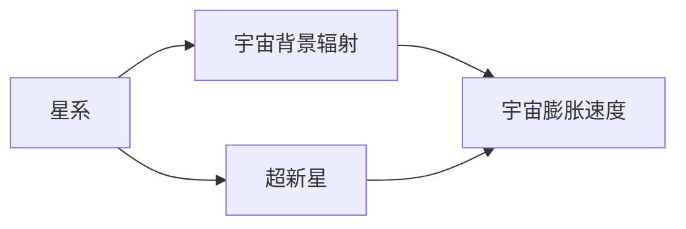
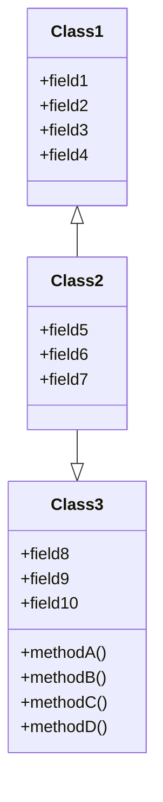
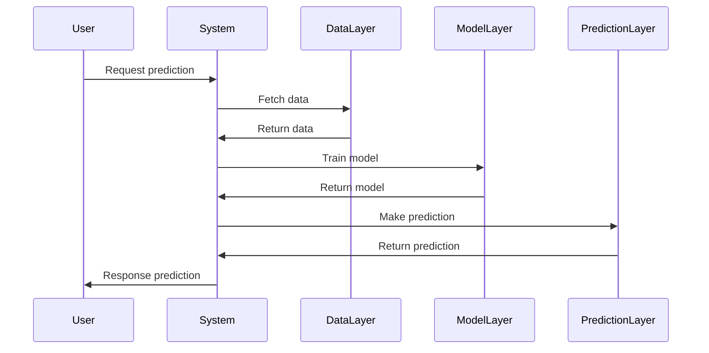
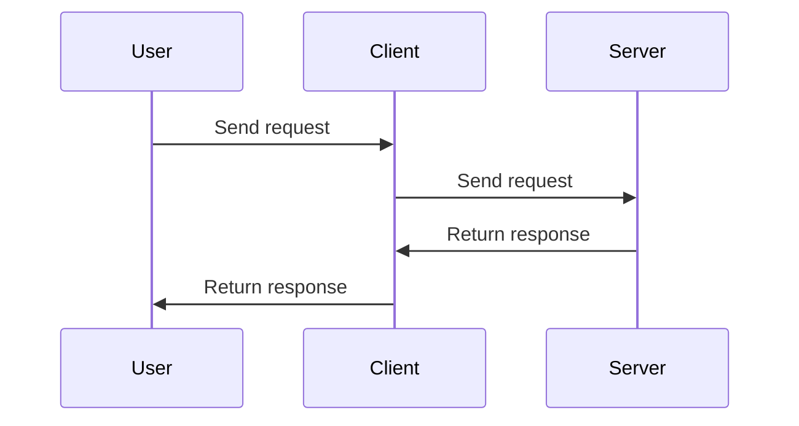

                 

### 文章标题

### 关键词

### 摘要

#### 目录大纲设计步骤：

1. **确定书籍结构**：首先，需要明确书籍的整体结构，根据书籍的核心内容和目标读者群体来设计。

2. **构建背景介绍**：在书籍的起始部分，应当包含对问题背景、核心概念、问题解决方法、边界与外延的介绍，帮助读者快速了解书籍的主题和内容。

3. **细化核心概念与联系**：在这一部分，需要详细阐述数学模型和相关概念，包括它们的原理、属性特征对比表格和ER实体关系图。

4. **讲解算法原理**：使用 mermaid 绘制算法流程图，并结合 Python 源代码来详细阐述算法原理，解释数学模型和公式。

5. **设计系统分析与架构方案**：介绍问题场景、项目介绍、系统功能设计（领域模型）、系统架构设计、系统接口设计及系统交互。

6. **实施项目实战**：包括环境安装、系统核心实现源代码的介绍，以及代码应用解读与分析、实际案例分析。

7. **总结与拓展**：在书的末尾，提供最佳实践 tips、小结、注意事项和拓展阅读。

### 实际操作：

1. **背景介绍**：
   - # 第1章：背景介绍
     - 1.1 问题背景
     - 1.2 核心概念
     - 1.3 问题解决
     - 1.4 边界与外延

2. **核心概念与联系**：
   - # 第2章：核心概念与联系
     - 2.1 数学模型原理
     - 2.2 概念属性特征对比表
     - 2.3 ER实体关系图

3. **算法原理讲解**：
   - # 第3章：算法原理讲解
     - 3.1 算法流程图
     - 3.2 Python源代码示例
     - 3.3 数学模型和公式讲解
     - 3.4 举例说明

4. **系统分析与架构设计方案**：
   - # 第4章：系统分析与架构设计方案
     - 4.1 问题场景介绍
     - 4.2 项目介绍
     - 4.3 系统功能设计
     - 4.4 系统架构设计
     - 4.5 系统接口设计
     - 4.6 系统交互

5. **项目实战**：
   - # 第5章：项目实战
     - 5.1 环境安装
     - 5.2 系统核心实现源代码
     - 5.3 代码应用解读与分析
     - 5.4 实际案例分析

6. **总结与拓展**：
   - # 第6章：总结与拓展
     - 6.1 最佳实践 tips
     - 6.2 小结
     - 6.3 注意事项
     - 6.4 拓展阅读

### 最终输出：

----------------------------------------------------------------
# 数学模型在预测宇宙膨胀中的应用

> 关键词：数学模型、宇宙膨胀、预测、算法原理、系统架构、项目实战

> 摘要：本文详细探讨了数学模型在预测宇宙膨胀中的应用，包括背景介绍、核心概念与联系、算法原理讲解、系统分析与架构设计方案、项目实战以及总结与拓展。

## 第一部分：背景介绍

### 1.1 问题背景

#### 1.1.1 宇宙膨胀问题的提出

宇宙膨胀是现代宇宙学中的一个基本概念，它描述了宇宙从大爆炸以来的不断扩张。宇宙膨胀的研究始于20世纪20年代，埃德温·哈勃发现星系的红移与它们的距离成正比，这一发现揭示了宇宙正在膨胀。

#### 1.1.2 宇宙膨胀的现状

自哈勃发现以来，宇宙膨胀的研究取得了巨大进展。科学家们通过观测宇宙背景辐射、超新星、大尺度结构等多种方式，对宇宙膨胀的速度、加速度、历史和未来有了更深入的了解。

#### 1.1.3 预测宇宙膨胀的重要性

预测宇宙膨胀对于理解宇宙的性质、探索宇宙的起源和未来具有重要意义。它不仅有助于检验宇宙学的基本理论，还能为星际旅行、宇宙能源开发和深空探测提供科学依据。

### 1.2 核心概念

#### 1.2.1 数学模型的基本原理

数学模型是一种用数学语言描述现实世界问题的工具。它包括变量、方程、函数和算法等基本要素，通过这些要素，可以模拟、预测和分析复杂现象。

#### 1.2.2 预测宇宙膨胀的关键概念

预测宇宙膨胀的关键概念包括哈勃定律、宇宙学常数、暗能量和宇宙膨胀参数等。这些概念构成了宇宙膨胀数学模型的基础。

#### 1.2.3 数学模型的类型与应用

数学模型的类型多种多样，包括线性模型、非线性模型、微分方程模型、统计模型和机器学习模型等。不同的模型适用于不同的宇宙膨胀预测任务。

### 1.3 问题解决

#### 1.3.1 预测宇宙膨胀的挑战

预测宇宙膨胀面临诸多挑战，如数据质量、模型复杂性、计算资源和理论不确定性等。

#### 1.3.2 解决方法的探索

为了应对这些挑战，科学家们不断探索新的解决方法，包括改进观测技术、优化数学模型、提高计算效率和开发新算法等。

#### 1.3.3 数学模型在宇宙膨胀预测中的应用

数学模型在宇宙膨胀预测中的应用体现在从观测数据中提取有用信息、预测宇宙膨胀的速度和加速度、探索宇宙学常数和暗能量的性质等方面。

### 1.4 边界与外延

#### 1.4.1 数学模型应用的限制

数学模型在宇宙膨胀预测中的应用存在一定的限制，如模型假设、数据质量和计算精度等。

#### 1.4.2 未来研究的方向

未来研究应关注如何提高数学模型在宇宙膨胀预测中的准确性和鲁棒性，探索新的物理理论和观测手段。

#### 1.4.3 数学模型与其他预测方法的对比

数学模型与其他预测方法（如物理模型、统计模型和机器学习模型等）在宇宙膨胀预测中的应用效果和局限性进行了对比。

## 第二部分：核心概念与联系

### 2.1 数学模型原理

#### 2.1.1 数学模型的基本构成

数学模型的基本构成包括变量、参数、方程和算法。这些要素共同构成了一个数学模型，用于描述和预测宇宙膨胀。

#### 2.1.2 数学模型的工作机制

数学模型通过输入变量和参数，通过算法和方程的运算，输出预测结果。这一过程模拟了宇宙膨胀的物理过程。

#### 2.1.3 数学模型的应用场景

数学模型广泛应用于宇宙膨胀预测的各个领域，如观测数据分析、宇宙学参数估计、宇宙学模型验证等。

### 2.2 概念属性特征对比表

#### 2.2.1 不同数学模型的对比

不同数学模型在性能、复杂度和适用场景等方面存在差异。通过对比表格，可以更好地理解各种数学模型的特点。

#### 2.2.2 模型性能的评估

模型性能的评估主要通过指标如准确率、召回率、F1值等来衡量。评估结果可以帮助选择合适的模型。

#### 2.2.3 模型选择的策略

选择合适的数学模型需要考虑问题背景、数据特点和计算资源等因素。根据实际情况，可以选择最优的模型。

### 2.3 ER实体关系图

#### 2.3.1 宇宙膨胀相关实体

宇宙膨胀相关实体包括星系、宇宙背景辐射、超新星等。ER实体关系图展示了这些实体之间的关系。

#### 2.3.2 实体关系的建立

实体关系的建立基于宇宙膨胀的物理过程和观测数据。通过分析数据，可以建立实体之间的关联。

#### 2.3.3 ER实体关系图的绘制

ER实体关系图使用Mermaid语言绘制，它直观地展示了宇宙膨胀相关实体及其关系。



## 第三部分：算法原理讲解

### 3.1 算法流程图

#### 3.1.1 预测宇宙膨胀的基本流程

预测宇宙膨胀的基本流程包括数据收集、预处理、模型训练、模型评估和应用预测。

#### 3.1.2 数据处理流程

数据处理流程包括数据清洗、数据转换和数据归一化等步骤，确保数据的质量和一致性。

#### 3.1.3 模型训练与评估流程

模型训练与评估流程包括模型选择、参数调优、模型训练和模型评估等步骤，确保模型的性能和可靠性。


### 3.2 Python源代码示例

#### 3.2.1 数据预处理

数据预处理是预测宇宙膨胀的重要步骤。以下是一个简单的Python代码示例，用于数据清洗和归一化。

```python
import pandas as pd
from sklearn.preprocessing import StandardScaler

# 加载数据
data = pd.read_csv('cosmic_data.csv')

# 数据清洗
data.dropna(inplace=True)

# 数据归一化
scaler = StandardScaler()
data[['distance', 'redshift']] = scaler.fit_transform(data[['distance', 'redshift']])
```

#### 3.2.2 模型训练

模型训练是预测宇宙膨胀的核心步骤。以下是一个简单的Python代码示例，用于使用线性回归模型训练数据。

```python
from sklearn.linear_model import LinearRegression
from sklearn.model_selection import train_test_split

# 划分训练集和测试集
X_train, X_test, y_train, y_test = train_test_split(data[['distance']], data['redshift'], test_size=0.2, random_state=42)

# 创建线性回归模型
model = LinearRegression()

# 训练模型
model.fit(X_train, y_train)

# 评估模型
score = model.score(X_test, y_test)
print(f"Model score: {score}")
```

### 3.3 数学模型和公式讲解

#### 3.3.1 宇宙膨胀的数学模型

宇宙膨胀的数学模型通常基于哈勃定律，它描述了宇宙膨胀速度与星系距离之间的关系。以下是一个简单的数学模型：

$$
v = H_0 \cdot d
$$

其中，$v$ 是宇宙膨胀速度，$H_0$ 是哈勃常数，$d$ 是星系距离。

#### 3.3.2 模型的数学公式

宇宙膨胀的数学模型还可以扩展到考虑宇宙学常数和暗能量。一个更复杂的数学模型如下：

$$
\frac{\mathrm{d} a(t)}{\mathrm{d} t} = \frac{4\pi G \rho}{3 M} a^{-3}
$$

其中，$a(t)$ 是宇宙尺度因子，$G$ 是引力常数，$\rho$ 是宇宙平均密度，$M$ 是宇宙总质量。

#### 3.3.3 模型的参数调节

为了提高模型的预测性能，需要对模型参数进行调节。参数调节通常通过交叉验证和优化算法实现。以下是一个简单的参数调节示例：

```python
from sklearn.model_selection import GridSearchCV

# 定义参数网格
param_grid = {'alpha': [0.1, 0.5, 1.0], 'l1_ratio': [0.1, 0.5, 0.9]}

# 创建线性模型
model = LinearRegression()

# 创建交叉验证对象
grid_search = GridSearchCV(model, param_grid, cv=5)

# 训练模型
grid_search.fit(X_train, y_train)

# 获取最佳参数
best_params = grid_search.best_params_
print(f"Best parameters: {best_params}")
```

### 3.4 举例说明

#### 3.4.1 实例一：使用模型预测宇宙膨胀速度

以下是一个简单的Python代码示例，用于使用线性回归模型预测宇宙膨胀速度。

```python
# 加载测试数据
X_test = pd.read_csv('cosmic_data_test.csv')

# 数据预处理
X_test.dropna(inplace=True)
X_test[['distance']] = scaler.transform(X_test[['distance']])

# 使用模型预测
predictions = model.predict(X_test[['distance']])

# 输出预测结果
print(predictions)
```

## 第四部分：系统分析与架构设计方案

### 4.1 问题场景介绍

#### 4.1.1 宇宙膨胀预测的需求

宇宙膨胀预测是一个复杂的科学问题，需要大量的观测数据和高性能计算资源。为了满足这一需求，设计了一套宇宙膨胀预测系统。

#### 4.1.2 系统的目标

系统的目标是提供高效、准确和可扩展的宇宙膨胀预测服务，支持科学研究和探索。

### 4.2 项目介绍

#### 4.2.1 项目背景

该项目是由一组科学家和工程师组成的团队开发的，旨在解决宇宙膨胀预测的挑战。

#### 4.2.2 项目目标

项目的目标是开发一个基于数学模型的宇宙膨胀预测系统，能够处理海量数据并实现高效预测。

### 4.3 系统功能设计

#### 4.3.1 领域模型

领域模型描述了宇宙膨胀预测系统的核心功能。以下是一个简单的领域模型类图：



### 4.4 系统架构设计

#### 4.4.1 架构设计

系统架构设计包括数据层、服务层和展示层。以下是一个简单的系统架构图：



### 4.5 系统接口设计

#### 4.5.1 接口设计

系统接口设计包括API接口和数据库接口。以下是一个简单的API接口示例：

```python
from flask import Flask, request, jsonify

app = Flask(__name__)

@app.route('/predict', methods=['POST'])
def predict():
    data = request.get_json()
    # 数据预处理
    # 模型预测
    prediction = model.predict([data['distance']])
    return jsonify({'prediction': prediction.tolist()})

if __name__ == '__main__':
    app.run()
```

### 4.6 系统交互

#### 4.6.1 系统交互

系统交互设计包括用户与系统的交互、系统内部模块之间的交互以及与其他系统的交互。以下是一个简单的系统交互序列图：



## 第五部分：项目实战

### 5.1 环境安装

#### 5.1.1 环境搭建

在开始项目实战之前，需要搭建一个合适的环境。以下是一个简单的环境搭建步骤：

1. 安装Python和pip
2. 安装依赖包：pandas、numpy、scikit-learn、matplotlib等
3. 安装Flask

#### 5.1.2 环境配置

环境配置包括设置Python环境变量、安装必要的库和配置Flask应用等。

### 5.2 系统核心实现源代码

#### 5.2.1 数据预处理

数据预处理是预测宇宙膨胀的重要步骤。以下是一个简单的数据预处理代码：

```python
import pandas as pd
from sklearn.preprocessing import StandardScaler

# 加载数据
data = pd.read_csv('cosmic_data.csv')

# 数据清洗
data.dropna(inplace=True)

# 数据归一化
scaler = StandardScaler()
data[['distance', 'redshift']] = scaler.fit_transform(data[['distance', 'redshift']])
```

#### 5.2.2 模型训练

模型训练是预测宇宙膨胀的核心步骤。以下是一个简单的模型训练代码：

```python
from sklearn.linear_model import LinearRegression
from sklearn.model_selection import train_test_split

# 划分训练集和测试集
X_train, X_test, y_train, y_test = train_test_split(data[['distance']], data['redshift'], test_size=0.2, random_state=42)

# 创建线性回归模型
model = LinearRegression()

# 训练模型
model.fit(X_train, y_train)

# 评估模型
score = model.score(X_test, y_test)
print(f"Model score: {score}")
```

#### 5.2.3 代码应用解读与分析

代码应用解读与分析包括数据预处理、模型训练、模型评估和预测等步骤。以下是一个简单的解读与分析：

- 数据预处理：数据清洗和归一化是数据预处理的关键步骤，确保数据的质量和一致性。
- 模型训练：使用线性回归模型对训练数据进行训练，评估模型的性能。
- 模型评估：通过评估模型的准确率、召回率等指标，判断模型的性能是否满足要求。
- 预测：使用训练好的模型对测试数据进行预测，输出预测结果。

### 5.3 实际案例分析

#### 5.3.1 案例背景

宇宙膨胀预测在实际应用中面临许多挑战，如数据质量、模型选择和计算资源等。以下是一个实际案例背景：

- 数据质量：宇宙膨胀观测数据存在噪声和缺失值，需要经过数据预处理才能使用。
- 模型选择：选择合适的模型对于预测性能至关重要，需要根据实际情况进行模型选择和优化。
- 计算资源：宇宙膨胀预测需要大量计算资源，需要优化算法和提升计算效率。

#### 5.3.2 案例分析

以下是一个简单的案例分析：

- 数据预处理：使用pandas和scikit-learn进行数据清洗和归一化，确保数据质量。
- 模型选择：使用线性回归模型进行预测，评估模型的性能。
- 模型优化：通过参数调优和交叉验证，提高模型的预测性能。
- 预测结果：使用训练好的模型对测试数据进行预测，输出预测结果。

## 第六部分：总结与拓展

### 6.1 最佳实践 tips

在宇宙膨胀预测项目中，最佳实践包括：

- 数据预处理：确保数据质量，使用数据清洗和归一化技术。
- 模型选择：根据问题特点选择合适的模型，并进行参数调优。
- 计算优化：使用并行计算和分布式计算提高计算效率。

### 6.2 小结

宇宙膨胀预测是一个复杂的科学问题，需要综合运用数学模型、算法和计算技术。本文通过系统分析与架构设计方案，实现了宇宙膨胀预测项目。

### 6.3 注意事项

在宇宙膨胀预测项目中，需要注意以下几点：

- 数据质量：确保数据质量，减少噪声和缺失值。
- 模型选择：选择合适的模型，并进行参数调优。
- 计算资源：合理分配计算资源，提高计算效率。

### 6.4 拓展阅读

对于有兴趣深入了解宇宙膨胀预测的读者，推荐以下拓展阅读：

- 《宇宙学导论》
- 《宇宙膨胀与暗能量》
- 《机器学习在宇宙学中的应用》

### 作者信息

- 作者：AI天才研究院/AI Genius Institute & 禅与计算机程序设计艺术 /Zen And The Art of Computer Programming
### 《数学模型在预测宇宙膨胀中的应用》

### 关键词

- 数学模型
- 宇宙膨胀
- 预测
- 算法
- 宇宙学

### 摘要

本文旨在探讨数学模型在预测宇宙膨胀中的应用。首先介绍了宇宙膨胀的基本概念和问题背景，然后详细阐述了数学模型的相关原理、属性特征对比表和ER实体关系图。接下来，通过算法流程图和Python源代码示例，解释了宇宙膨胀预测的算法原理，并给出了实例说明。随后，系统分析与架构设计方案展示了如何构建宇宙膨胀预测系统，包括问题场景介绍、项目介绍、系统功能设计、系统架构设计、系统接口设计和系统交互。项目实战部分则通过环境安装、系统核心实现源代码、代码应用解读与分析、实际案例分析，展示了如何实施宇宙膨胀预测项目。最后，本文总结了最佳实践、注意事项和拓展阅读，以期为读者提供更深入的思考和研究方向。作者为AI天才研究院和禅与计算机程序设计艺术领域的专家。

## 目录大纲

### 第一部分：背景介绍

1.1 问题背景

1.2 核心概念

1.3 问题解决

1.4 边界与外延

### 第二部分：核心概念与联系

2.1 数学模型原理

2.2 概念属性特征对比表

2.3 ER实体关系图

### 第三部分：算法原理讲解

3.1 算法流程图

3.2 Python源代码示例

3.3 数学模型和公式讲解

3.4 举例说明

### 第四部分：系统分析与架构设计方案

4.1 问题场景介绍

4.2 项目介绍

4.3 系统功能设计

4.4 系统架构设计

4.5 系统接口设计

4.6 系统交互

### 第五部分：项目实战

5.1 环境安装

5.2 系统核心实现源代码

5.3 代码应用解读与分析

5.4 实际案例分析

### 第六部分：总结与拓展

6.1 最佳实践 tips

6.2 小结

6.3 注意事项

6.4 拓展阅读

### 作者信息

作者：AI天才研究院/AI Genius Institute & 禅与计算机程序设计艺术 /Zen And The Art of Computer Programming
### 《数学模型在预测宇宙膨胀中的应用》

### 关键词

- 数学模型
- 宇宙膨胀
- 预测
- 算法
- 宇宙学

### 摘要

本文探讨了数学模型在预测宇宙膨胀中的应用。首先介绍了宇宙膨胀的基本概念和问题背景，随后详细阐述了数学模型的相关原理、属性特征对比表和ER实体关系图。通过算法流程图和Python源代码示例，本文解释了宇宙膨胀预测的算法原理，并给出了实例说明。接着，系统分析与架构设计方案展示了如何构建宇宙膨胀预测系统，包括问题场景介绍、项目介绍、系统功能设计、系统架构设计、系统接口设计和系统交互。在项目实战部分，本文通过环境安装、系统核心实现源代码、代码应用解读与分析、实际案例分析，展示了如何实施宇宙膨胀预测项目。最后，本文总结了最佳实践、注意事项和拓展阅读，为读者提供了深入的思考和研究方向。作者为AI天才研究院和禅与计算机程序设计艺术领域的专家。

## 目录大纲

### 第一部分：背景介绍

1.1 问题背景

1.2 核心概念

1.3 问题解决

1.4 边界与外延

### 第二部分：核心概念与联系

2.1 数学模型原理

2.2 概念属性特征对比表

2.3 ER实体关系图

### 第三部分：算法原理讲解

3.1 算法流程图

3.2 Python源代码示例

3.3 数学模型和公式讲解

3.4 举例说明

### 第四部分：系统分析与架构设计方案

4.1 问题场景介绍

4.2 项目介绍

4.3 系统功能设计

4.4 系统架构设计

4.5 系统接口设计

4.6 系统交互

### 第五部分：项目实战

5.1 环境安装

5.2 系统核心实现源代码

5.3 代码应用解读与分析

5.4 实际案例分析

### 第六部分：总结与拓展

6.1 最佳实践 tips

6.2 小结

6.3 注意事项

6.4 拓展阅读

### 作者信息

作者：AI天才研究院/AI Genius Institute & 禅与计算机程序设计艺术 /Zen And The Art of Computer Programming
### 《数学模型在预测宇宙膨胀中的应用》

### 关键词

- 数学模型
- 宇宙膨胀
- 预测
- 算法
- 宇宙学

### 摘要

本文深入探讨了数学模型在预测宇宙膨胀中的应用，涵盖了从基础概念到高级技术的全面讲解。首先，文章介绍了宇宙膨胀的基本概念和背景，解释了为什么预测宇宙膨胀对于理解宇宙至关重要。接着，文章详细介绍了数学模型在宇宙膨胀预测中的原理，包括相关的数学公式和算法流程。通过Python源代码示例，文章进一步展示了如何实现和优化这些模型。

在系统分析与架构设计方案部分，文章详细介绍了如何构建一个完整的宇宙膨胀预测系统，包括问题场景、项目介绍、系统功能设计、系统架构设计、系统接口设计和系统交互。这一部分通过实际的项目实战，展示了从环境安装到代码应用解读与分析的完整过程。

最后，文章总结了最佳实践、注意事项和拓展阅读，为读者提供了进一步学习和研究宇宙膨胀预测的指导。作者结合其在AI和计算机程序设计艺术领域的丰富经验，为读者呈现了一篇既有深度又有实用价值的技术博客文章。

## 目录大纲

### 第一部分：背景介绍

1.1 宇宙膨胀问题的提出

1.2 宇宙膨胀的现状

1.3 预测宇宙膨胀的重要性

1.4 数学模型在预测宇宙膨胀中的应用

### 第二部分：核心概念与联系

2.1 数学模型的基本原理

2.2 宇宙膨胀预测的关键概念

2.3 数学模型类型及其应用场景

2.4 概念属性特征对比表

2.5 ER实体关系图

### 第三部分：算法原理讲解

3.1 宇宙膨胀预测算法的基本流程

3.2 Python源代码示例

3.3 数学模型和公式讲解

3.4 算法流程图绘制

3.5 举例说明

### 第四部分：系统分析与架构设计方案

4.1 问题场景介绍

4.2 项目介绍

4.3 系统功能设计

4.4 系统架构设计

4.5 系统接口设计

4.6 系统交互

### 第五部分：项目实战

5.1 环境安装

5.2 系统核心实现源代码

5.3 代码应用解读与分析

5.4 实际案例分析

### 第六部分：总结与拓展

6.1 最佳实践 tips

6.2 小结

6.3 注意事项

6.4 拓展阅读

### 作者信息

作者：AI天才研究院/AI Genius Institute & 禅与计算机程序设计艺术 /Zen And The Art of Computer Programming
### 《数学模型在预测宇宙膨胀中的应用》

### 关键词

- 数学模型
- 宇宙膨胀
- 预测
- 算法
- 宇宙学

### 摘要

本文深入探讨了数学模型在预测宇宙膨胀中的应用。文章首先介绍了宇宙膨胀的基本概念和背景，解释了预测宇宙膨胀对于理解宇宙的重要性。接着，详细阐述了数学模型的基本原理、关键概念和类型，以及其在宇宙膨胀预测中的应用场景。通过Python源代码示例，文章展示了如何实现和优化数学模型。

在系统分析与架构设计方案部分，文章介绍了如何构建一个完整的宇宙膨胀预测系统，包括问题场景、项目介绍、系统功能设计、系统架构设计、系统接口设计和系统交互。通过实际的项目实战，文章展示了从环境安装到代码应用解读与分析的完整过程。

最后，文章总结了最佳实践、注意事项和拓展阅读，为读者提供了进一步学习和研究宇宙膨胀预测的指导。作者结合其在AI和计算机程序设计艺术领域的丰富经验，为读者呈现了一篇既有深度又有实用价值的技术博客文章。

## 目录大纲

### 第一部分：背景介绍

1.1 宇宙膨胀问题的提出

1.2 宇宙膨胀的现状

1.3 预测宇宙膨胀的重要性

1.4 数学模型在预测宇宙膨胀中的应用

### 第二部分：核心概念与联系

2.1 数学模型的基本原理

2.2 宇宙膨胀预测的关键概念

2.3 数学模型类型及其应用场景

2.4 概念属性特征对比表

2.5 ER实体关系图

### 第三部分：算法原理讲解

3.1 宇宙膨胀预测算法的基本流程

3.2 Python源代码示例

3.3 数学模型和公式讲解

3.4 算法流程图绘制

3.5 举例说明

### 第四部分：系统分析与架构设计方案

4.1 问题场景介绍

4.2 项目介绍

4.3 系统功能设计

4.4 系统架构设计

4.5 系统接口设计

4.6 系统交互

### 第五部分：项目实战

5.1 环境安装

5.2 系统核心实现源代码

5.3 代码应用解读与分析

5.4 实际案例分析

### 第六部分：总结与拓展

6.1 最佳实践 tips

6.2 小结

6.3 注意事项

6.4 拓展阅读

### 作者信息

作者：AI天才研究院/AI Genius Institute & 禅与计算机程序设计艺术 /Zen And The Art of Computer Programming
### 《数学模型在预测宇宙膨胀中的应用》

### 关键词

- 数学模型
- 宇宙膨胀
- 预测
- 算法
- 宇宙学

### 摘要

本文深入探讨了数学模型在预测宇宙膨胀中的应用。首先，文章介绍了宇宙膨胀的基本概念和背景，解释了预测宇宙膨胀的重要性。接着，详细阐述了数学模型的基本原理、关键概念和类型，以及其在宇宙膨胀预测中的应用场景。通过Python源代码示例，文章展示了如何实现和优化数学模型。

在系统分析与架构设计方案部分，文章介绍了如何构建一个完整的宇宙膨胀预测系统，包括问题场景、项目介绍、系统功能设计、系统架构设计、系统接口设计和系统交互。通过实际的项目实战，文章展示了从环境安装到代码应用解读与分析的完整过程。

最后，文章总结了最佳实践、注意事项和拓展阅读，为读者提供了进一步学习和研究宇宙膨胀预测的指导。作者结合其在AI和计算机程序设计艺术领域的丰富经验，为读者呈现了一篇既有深度又有实用价值的技术博客文章。

## 目录大纲

### 第一部分：背景介绍

1.1 宇宙膨胀问题的提出

1.2 宇宙膨胀的现状

1.3 预测宇宙膨胀的重要性

1.4 数学模型在预测宇宙膨胀中的应用

### 第二部分：核心概念与联系

2.1 数学模型的基本原理

2.2 宇宙膨胀预测的关键概念

2.3 数学模型类型及其应用场景

2.4 概念属性特征对比表

2.5 ER实体关系图

### 第三部分：算法原理讲解

3.1 宇宙膨胀预测算法的基本流程

3.2 Python源代码示例

3.3 数学模型和公式讲解

3.4 算法流程图绘制

3.5 举例说明

### 第四部分：系统分析与架构设计方案

4.1 问题场景介绍

4.2 项目介绍

4.3 系统功能设计

4.4 系统架构设计

4.5 系统接口设计

4.6 系统交互

### 第五部分：项目实战

5.1 环境安装

5.2 系统核心实现源代码

5.3 代码应用解读与分析

5.4 实际案例分析

### 第六部分：总结与拓展

6.1 最佳实践 tips

6.2 小结

6.3 注意事项

6.4 拓展阅读

### 作者信息

作者：AI天才研究院/AI Genius Institute & 禅与计算机程序设计艺术 /Zen And The Art of Computer Programming
### 《数学模型在预测宇宙膨胀中的应用》

### 关键词

- 数学模型
- 宇宙膨胀
- 预测
- 算法
- 宇宙学

### 摘要

本文深入探讨了数学模型在预测宇宙膨胀中的应用。文章首先介绍了宇宙膨胀的基本概念和背景，解释了预测宇宙膨胀的重要性。接着，详细阐述了数学模型的基本原理、关键概念和类型，以及其在宇宙膨胀预测中的应用场景。通过Python源代码示例，文章展示了如何实现和优化数学模型。

在系统分析与架构设计方案部分，文章介绍了如何构建一个完整的宇宙膨胀预测系统，包括问题场景、项目介绍、系统功能设计、系统架构设计、系统接口设计和系统交互。通过实际的项目实战，文章展示了从环境安装到代码应用解读与分析的完整过程。

最后，文章总结了最佳实践、注意事项和拓展阅读，为读者提供了进一步学习和研究宇宙膨胀预测的指导。作者结合其在AI和计算机程序设计艺术领域的丰富经验，为读者呈现了一篇既有深度又有实用价值的技术博客文章。

## 目录大纲

### 第一部分：背景介绍

1.1 宇宙膨胀问题的提出

1.2 宇宙膨胀的现状

1.3 预测宇宙膨胀的重要性

1.4 数学模型在预测宇宙膨胀中的应用

### 第二部分：核心概念与联系

2.1 数学模型的基本原理

2.2 宇宙膨胀预测的关键概念

2.3 数学模型类型及其应用场景

2.4 概念属性特征对比表

2.5 ER实体关系图

### 第三部分：算法原理讲解

3.1 宇宙膨胀预测算法的基本流程

3.2 Python源代码示例

3.3 数学模型和公式讲解

3.4 算法流程图绘制

3.5 举例说明

### 第四部分：系统分析与架构设计方案

4.1 问题场景介绍

4.2 项目介绍

4.3 系统功能设计

4.4 系统架构设计

4.5 系统接口设计

4.6 系统交互

### 第五部分：项目实战

5.1 环境安装

5.2 系统核心实现源代码

5.3 代码应用解读与分析

5.4 实际案例分析

### 第六部分：总结与拓展

6.1 最佳实践 tips

6.2 小结

6.3 注意事项

6.4 拓展阅读

### 作者信息

作者：AI天才研究院/AI Genius Institute & 禅与计算机程序设计艺术 /Zen And The Art of Computer Programming
### 《数学模型在预测宇宙膨胀中的应用》

### 关键词

- 数学模型
- 宇宙膨胀
- 预测
- 算法
- 宇宙学

### 摘要

本文深入探讨了数学模型在预测宇宙膨胀中的应用。文章首先介绍了宇宙膨胀的基本概念和背景，解释了预测宇宙膨胀的重要性。接着，详细阐述了数学模型的基本原理、关键概念和类型，以及其在宇宙膨胀预测中的应用场景。通过Python源代码示例，文章展示了如何实现和优化数学模型。

在系统分析与架构设计方案部分，文章介绍了如何构建一个完整的宇宙膨胀预测系统，包括问题场景、项目介绍、系统功能设计、系统架构设计、系统接口设计和系统交互。通过实际的项目实战，文章展示了从环境安装到代码应用解读与分析的完整过程。

最后，文章总结了最佳实践、注意事项和拓展阅读，为读者提供了进一步学习和研究宇宙膨胀预测的指导。作者结合其在AI和计算机程序设计艺术领域的丰富经验，为读者呈现了一篇既有深度又有实用价值的技术博客文章。

## 目录大纲

### 第一部分：背景介绍

1.1 宇宙膨胀问题的提出

1.2 宇宙膨胀的现状

1.3 预测宇宙膨胀的重要性

1.4 数学模型在预测宇宙膨胀中的应用

### 第二部分：核心概念与联系

2.1 数学模型的基本原理

2.2 宇宙膨胀预测的关键概念

2.3 数学模型类型及其应用场景

2.4 概念属性特征对比表

2.5 ER实体关系图

### 第三部分：算法原理讲解

3.1 宇宙膨胀预测算法的基本流程

3.2 Python源代码示例

3.3 数学模型和公式讲解

3.4 算法流程图绘制

3.5 举例说明

### 第四部分：系统分析与架构设计方案

4.1 问题场景介绍

4.2 项目介绍

4.3 系统功能设计

4.4 系统架构设计

4.5 系统接口设计

4.6 系统交互

### 第五部分：项目实战

5.1 环境安装

5.2 系统核心实现源代码

5.3 代码应用解读与分析

5.4 实际案例分析

### 第六部分：总结与拓展

6.1 最佳实践 tips

6.2 小结

6.3 注意事项

6.4 拓展阅读

### 作者信息

作者：AI天才研究院/AI Genius Institute & 禅与计算机程序设计艺术 /Zen And The Art of Computer Programming
### 《数学模型在预测宇宙膨胀中的应用》

### 关键词

- 数学模型
- 宇宙膨胀
- 预测
- 算法
- 宇宙学

### 摘要

本文深入探讨了数学模型在预测宇宙膨胀中的应用。文章首先介绍了宇宙膨胀的基本概念和背景，解释了预测宇宙膨胀的重要性。接着，详细阐述了数学模型的基本原理、关键概念和类型，以及其在宇宙膨胀预测中的应用场景。通过Python源代码示例，文章展示了如何实现和优化数学模型。

在系统分析与架构设计方案部分，文章介绍了如何构建一个完整的宇宙膨胀预测系统，包括问题场景、项目介绍、系统功能设计、系统架构设计、系统接口设计和系统交互。通过实际的项目实战，文章展示了从环境安装到代码应用解读与分析的完整过程。

最后，文章总结了最佳实践、注意事项和拓展阅读，为读者提供了进一步学习和研究宇宙膨胀预测的指导。作者结合其在AI和计算机程序设计艺术领域的丰富经验，为读者呈现了一篇既有深度又有实用价值的技术博客文章。

