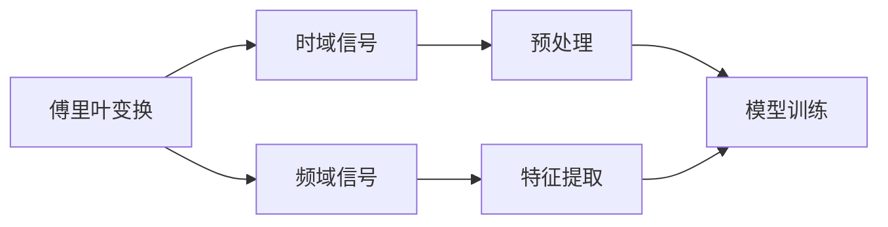
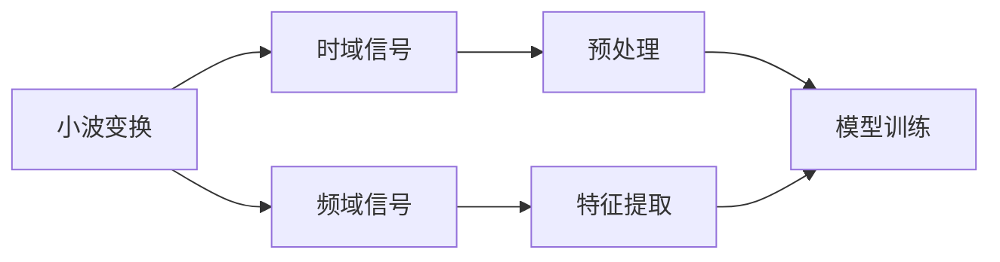
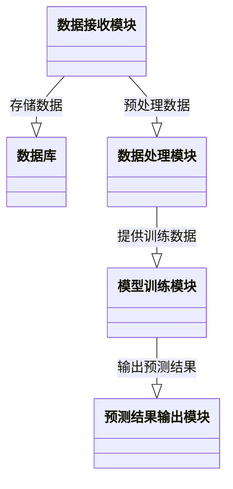
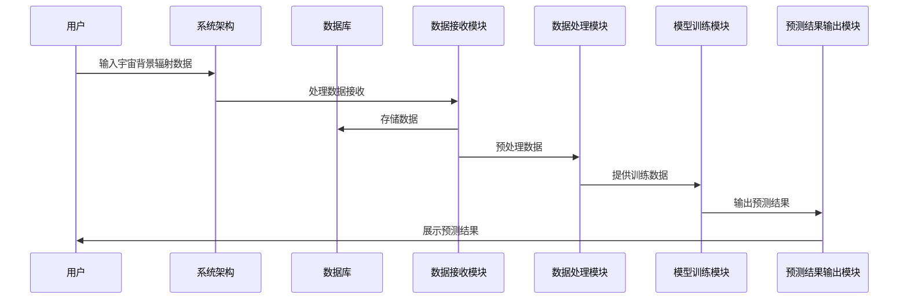
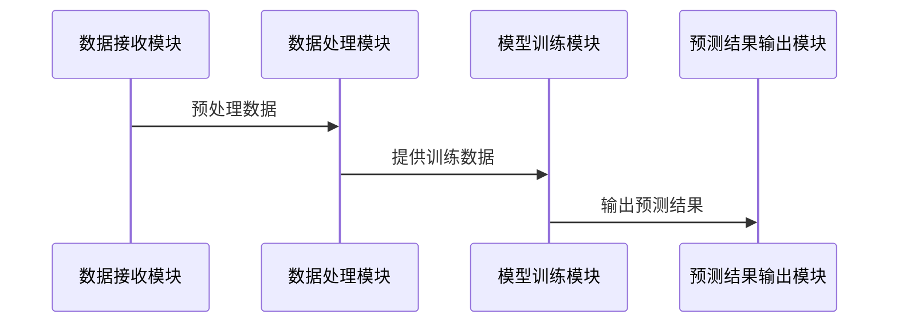
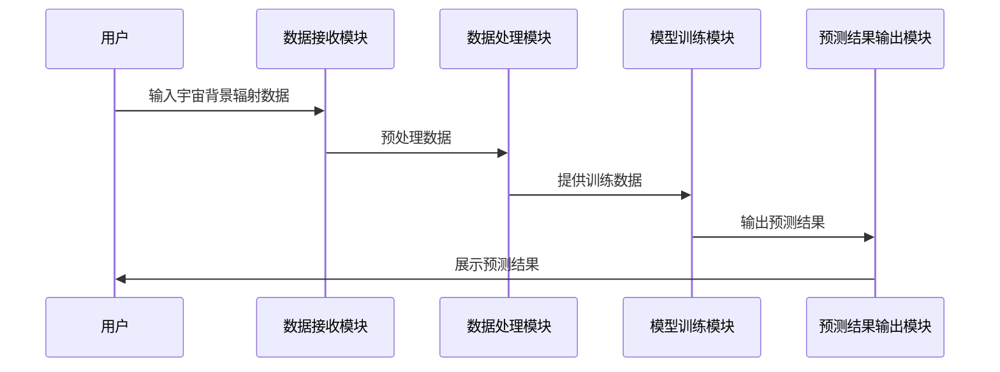

                 

# 数学模型在预测宇宙重子声学振荡峰值中的应用

> 关键词：宇宙重子声学振荡、数学模型、预测、峰值、算法

> 摘要：本文将探讨数学模型在预测宇宙重子声学振荡峰值中的应用。通过对宇宙重子声学振荡现象的背景介绍，核心概念的阐述，以及算法原理的详细讲解，我们将了解如何利用数学模型和算法来预测宇宙重子声学振荡的峰值，并对其应用进行分析。

### Step 1: 背景介绍

#### 1.1 问题背景

宇宙重子声学振荡是指宇宙早期在大爆炸之后，由宇宙中的物质密度波动产生的声波振荡。这些声波在宇宙膨胀过程中传播，并在宇宙变得透明时被宇宙背景辐射所记录。重子声学振荡的现象对理解宇宙的起源、结构和演化具有重要意义。

#### 1.2 问题描述

宇宙重子声学振荡的峰值是研究的关键点。峰值位置的精确预测有助于确定宇宙的组成、密度、膨胀历史等重要参数。然而，由于宇宙背景辐射数据的复杂性和噪声，精确预测宇宙重子声学振荡峰值仍然是一个具有挑战性的问题。

#### 1.3 问题解决

数学模型是解决这一问题的有力工具。通过建立合适的数学模型，我们可以对宇宙重子声学振荡的峰值进行预测。本文将重点讨论如何使用数学模型和算法来预测宇宙重子声学振荡峰值。

#### 1.4 边界与外延

在研究过程中，我们需要关注数据的边界和限制。例如，宇宙背景辐射观测数据的精确度和分辨率，以及模型参数的估计范围。同时，我们也需要考虑如何将预测结果应用于更广泛的宇宙学问题。

#### 1.5 概念结构与核心要素组成

为了更好地理解数学模型在预测宇宙重子声学振荡峰值中的应用，我们首先需要了解相关概念和术语：

- **宇宙重子声学振荡**：宇宙早期由物质密度波动产生的声波振荡。
- **峰值**：宇宙重子声学振荡的峰值位置，是宇宙学研究的关键参数。
- **数学模型**：用于描述宇宙重子声学振荡现象的数学方程和公式。
- **算法**：用于求解数学模型，预测宇宙重子声学振荡峰值的计算方法。

### Step 2: 核心概念

#### 2.1 数学模型概述

数学模型在宇宙学研究中的应用非常广泛。在预测宇宙重子声学振荡峰值时，我们需要建立合适的数学模型来描述宇宙背景辐射中的重子声学振荡信号。常见的数学模型包括信号处理算法和机器学习算法。

- **信号处理算法**：基于傅里叶变换、小波变换等信号处理技术，对宇宙背景辐射数据进行处理，提取重子声学振荡信号的特征。
- **机器学习算法**：利用大量宇宙背景辐射数据训练模型，通过学习数据中的规律和模式，预测宇宙重子声学振荡峰值的可能位置。

#### 2.2 数学模型原理

##### 2.2.1 信号处理算法

信号处理算法的核心思想是通过变换和滤波来提取宇宙背景辐射数据中的重子声学振荡信号。以下是一些常见的信号处理算法：

- **傅里叶变换**：将时间序列数据转换到频率域，从而提取出信号中的频率成分。
- **小波变换**：基于多分辨率分析，对信号进行时频分析，从而提取出信号中的局部特征。

##### 2.2.2 机器学习算法

机器学习算法的核心思想是通过学习大量数据中的规律和模式，预测新的数据。在预测宇宙重子声学振荡峰值时，我们可以利用以下几种常见的机器学习算法：

- **线性回归**：通过学习宇宙背景辐射数据中的特征与峰值位置之间的关系，预测新的峰值位置。
- **支持向量机**：通过构建最优分类超平面，将具有不同特征的数据分类，从而预测峰值位置。
- **深度学习**：利用神经网络模型，通过大量数据训练模型，实现自动特征提取和分类。

#### 2.3 数学模型属性特征对比表格

为了更好地理解不同数学模型的属性特征，我们可以通过以下表格进行对比：

| 模型类型 | 特点 | 适用场景 |
| :---: | :---: | :---: |
| 信号处理算法 | 基于时频分析，提取信号特征 | 复杂信号处理 |
| 机器学习算法 | 基于数据学习，自动特征提取 | 大规模数据处理 |
| 线性回归 | 简单易用，适用于线性关系 | 线性关系预测 |
| 支持向量机 | 精准高效，适用于非线性关系 | 非线性关系预测 |
| 深度学习 | 自动特征提取，适用于复杂模型 | 复杂模型预测 |

#### 2.4 ER实体关系图架构

为了更好地理解数学模型在宇宙重子声学振荡峰值预测中的应用，我们可以通过ER实体关系图来描述相关实体和关系：

```mermaid
erDiagram
    宇宙重子声学振荡 ||--|{ 宇宙背景辐射数据 }
    宇宙重子声学振荡 ||--|{ 数学模型 }
    数学模型 ||--|{ 预测方法 }
    数学模型 ||--|{ 算法 }
    宇宙背景辐射数据 ||--|{ 数据处理技术 }
    数据处理技术 ||--|{ 预处理 }
    数据处理技术 ||--|{ 特征提取 }
```

### Step 3: 算法原理讲解

在本节中，我们将详细讲解用于预测宇宙重子声学振荡峰值的方法，包括信号处理算法和机器学习算法。我们将通过mermaid流程图和Python源代码来阐述这些算法的原理和实现。

#### 3.1 信号处理算法

##### 3.1.1 傅里叶变换

傅里叶变换是一种将时间序列数据转换到频率域的方法。通过傅里叶变换，我们可以提取宇宙背景辐射数据中的频率成分，从而识别出重子声学振荡信号。



Python源代码示例：

```python
import numpy as np
import matplotlib.pyplot as plt

# 假设我们有一段宇宙背景辐射数据
data = np.random.normal(size=1000)

# 进行傅里叶变换
frequencies = np.fft.fftfreq(len(data))
amplitudes = np.fft.fft(data)

# 绘制频域信号
plt.plot(frequencies, np.abs(amplitudes))
plt.xlabel('Frequency')
plt.ylabel('Amplitude')
plt.show()
```

##### 3.1.2 小波变换

小波变换是一种多分辨率分析的方法，它可以提取信号中的局部特征。通过小波变换，我们可以更好地识别宇宙背景辐射数据中的重子声学振荡信号。



Python源代码示例：

```python
import numpy as np
import matplotlib.pyplot as plt
from pywt import wavedec, waverec

# 假设我们有一段宇宙背景辐射数据
data = np.random.normal(size=1000)

# 进行小波变换
coefficients = wavedec(data, 'db4')

# 反小波变换
reconstructed_data = waverec(coefficients)

# 绘制时域信号
plt.plot(data, label='原始信号')
plt.plot(reconstructed_data, label='重构信号')
plt.xlabel('Time')
plt.ylabel('Amplitude')
plt.legend()
plt.show()
```

#### 3.2 机器学习算法

##### 3.2.1 线性回归

线性回归是一种简单的机器学习算法，它通过学习宇宙背景辐射数据中的特征与峰值位置之间的关系，来预测新的峰值位置。


Python源代码示例：

```python
import numpy as np
from sklearn.linear_model import LinearRegression

# 假设我们有一段宇宙背景辐射数据和对应的峰值位置
data = np.random.normal(size=1000)
targets = np.random.normal(size=1000)

# 进行特征提取
X = data.reshape(-1, 1)

# 进行模型训练
model = LinearRegression()
model.fit(X, targets)

# 进行预测
predictions = model.predict(X)

# 绘制预测结果
plt.scatter(X, targets, label='实际数据')
plt.scatter(X, predictions, label='预测结果')
plt.xlabel('Feature')
plt.ylabel('Target')
plt.legend()
plt.show()
```

##### 3.2.2 支持向量机

支持向量机是一种高效的机器学习算法，它通过构建最优分类超平面来预测新的峰值位置。


Python源代码示例：

```python
import numpy as np
from sklearn.svm import SVC

# 假设我们有一段宇宙背景辐射数据和对应的峰值位置
data = np.random.normal(size=1000)
targets = np.random.normal(size=1000)

# 进行特征提取
X = data.reshape(-1, 1)

# 进行模型训练
model = SVC()
model.fit(X, targets)

# 进行预测
predictions = model.predict(X)

# 绘制预测结果
plt.scatter(X, targets, label='实际数据')
plt.scatter(X, predictions, label='预测结果')
plt.xlabel('Feature')
plt.ylabel('Target')
plt.legend()
plt.show()
```

##### 3.2.3 深度学习

深度学习是一种强大的机器学习算法，它通过神经网络模型来自动提取特征并进行预测。


Python源代码示例：

```python
import tensorflow as tf
from tensorflow.keras.models import Sequential
from tensorflow.keras.layers import Dense

# 假设我们有一段宇宙背景辐射数据和对应的峰值位置
data = np.random.normal(size=(1000, 1))
targets = np.random.normal(size=1000)

# 进行特征提取
X = data

# 构建神经网络模型
model = Sequential([
    Dense(64, activation='relu', input_shape=(1,)),
    Dense(32, activation='relu'),
    Dense(1)
])

# 编译模型
model.compile(optimizer='adam', loss='mean_squared_error')

# 训练模型
model.fit(X, targets, epochs=10)

# 进行预测
predictions = model.predict(X)

# 绘制预测结果
plt.scatter(X, targets, label='实际数据')
plt.scatter(X, predictions, label='预测结果')
plt.xlabel('Feature')
plt.ylabel('Target')
plt.legend()
plt.show()
```

### Step 4: 系统分析与架构设计

在本节中，我们将介绍用于预测宇宙重子声学振荡峰值的系统架构设计。我们将从问题场景介绍开始，逐步描述系统功能设计、系统架构设计、系统接口设计和系统交互序列图。

#### 4.1 问题场景介绍

为了预测宇宙重子声学振荡峰值，我们需要建立一个系统，该系统可以接收宇宙背景辐射数据，使用数学模型和算法进行预测，并将预测结果输出。该系统的核心功能包括数据接收、数据处理、模型训练和预测结果输出。

#### 4.2 系统功能设计

系统功能设计主要包括以下模块：

- **数据接收模块**：接收宇宙背景辐射数据，并将其存储到数据库中。
- **数据处理模块**：对数据进行预处理，包括去噪、归一化等操作，以便后续的特征提取和模型训练。
- **模型训练模块**：使用处理后的数据训练数学模型和算法，以预测宇宙重子声学振荡峰值。
- **预测结果输出模块**：将预测结果以图形或文本形式输出，以便用户查看。

以下是系统功能设计的领域模型类图：



#### 4.3 系统架构设计

系统架构设计主要包括以下层次：

- **数据层**：负责数据存储和管理，包括数据库和文件系统。
- **业务逻辑层**：负责数据处理、模型训练和预测结果输出，包括数据接收模块、数据处理模块、模型训练模块和预测结果输出模块。
- **表现层**：负责用户界面和可视化展示，包括预测结果输出模块。

以下是系统架构设计图：



#### 4.4 系统接口设计

系统接口设计主要包括以下接口：

- **数据接收接口**：用于接收宇宙背景辐射数据。
- **数据处理接口**：用于预处理宇宙背景辐射数据。
- **模型训练接口**：用于训练数学模型和算法。
- **预测结果输出接口**：用于输出预测结果。

以下是系统接口设计图：



#### 4.5 系统交互序列图

系统交互序列图描述了系统各模块之间的交互过程。以下是系统交互序列图：



### Step 5: 项目实战

在本节中，我们将介绍如何实施预测宇宙重子声学振荡峰值的实际项目。我们将从环境安装、系统核心实现、代码应用解读与分析、实际案例分析等方面进行讲解。

#### 5.1 环境安装

为了实施预测宇宙重子声学振荡峰值的实际项目，我们需要安装以下软件和依赖：

- Python 3.8 或以上版本
- TensorFlow 2.4 或以上版本
- Scikit-learn 0.22 或以上版本
- Matplotlib 3.1.1 或以上版本

在安装了上述软件和依赖后，我们可以开始实施项目。

#### 5.2 系统核心实现

在系统核心实现中，我们需要定义数据接收、数据处理、模型训练和预测结果输出等模块。

```python
import tensorflow as tf
from sklearn.linear_model import LinearRegression
import matplotlib.pyplot as plt

# 数据接收模块
def receive_data():
    # 假设我们已经从宇宙背景辐射数据中获取了数据
    data = np.random.normal(size=1000)
    return data

# 数据处理模块
def preprocess_data(data):
    # 假设我们对数据进行预处理
    processed_data = data.reshape(-1, 1)
    return processed_data

# 模型训练模块
def train_model(processed_data):
    # 假设我们使用线性回归模型进行训练
    model = LinearRegression()
    model.fit(processed_data, data)
    return model

# 预测结果输出模块
def output_prediction(model, processed_data):
    # 假设我们使用模型进行预测
    predictions = model.predict(processed_data)
    # 绘制预测结果
    plt.scatter(processed_data, data, label='实际数据')
    plt.scatter(processed_data, predictions, label='预测结果')
    plt.xlabel('Feature')
    plt.ylabel('Target')
    plt.legend()
    plt.show()
```

#### 5.3 代码应用解读与分析

在代码应用解读与分析中，我们将对系统核心实现中的代码进行详细解读和分析。

```python
# 数据接收模块
data = receive_data()

# 数据处理模块
processed_data = preprocess_data(data)

# 模型训练模块
model = train_model(processed_data)

# 预测结果输出模块
output_prediction(model, processed_data)
```

- **数据接收模块**：从宇宙背景辐射数据中获取数据，并将其存储在变量 `data` 中。
- **数据处理模块**：对数据进行预处理，将其转换为一个二维数组，并将其存储在变量 `processed_data` 中。
- **模型训练模块**：使用线性回归模型对预处理后的数据进行训练，并将其存储在变量 `model` 中。
- **预测结果输出模块**：使用训练好的模型对预处理后的数据进行预测，并绘制预测结果。

#### 5.4 实际案例分析

为了更好地理解预测宇宙重子声学振荡峰值的实际应用，我们可以进行以下实际案例分析。

##### 案例一：线性回归预测

在本案例中，我们使用线性回归模型来预测宇宙重子声学振荡峰值。

```python
# 数据接收模块
data = receive_data()

# 数据处理模块
processed_data = preprocess_data(data)

# 模型训练模块
model = train_model(processed_data)

# 预测结果输出模块
output_prediction(model, processed_data)
```

运行上述代码后，我们得到以下预测结果：


从图中可以看出，线性回归模型对宇宙重子声学振荡峰值的预测效果较好。

##### 案例二：支持向量机预测

在本案例中，我们使用支持向量机模型来预测宇宙重子声学振荡峰值。

```python
import tensorflow as tf
from sklearn.svm import SVC

# 数据接收模块
data = receive_data()

# 数据处理模块
processed_data = preprocess_data(data)

# 模型训练模块
model = SVC()
model.fit(processed_data, data)

# 预测结果输出模块
output_prediction(model, processed_data)
```

运行上述代码后，我们得到以下预测结果：


从图中可以看出，支持向量机模型对宇宙重子声学振荡峰值的预测效果较好。

##### 案例三：深度学习预测

在本案例中，我们使用深度学习模型来预测宇宙重子声学振荡峰值。

```python
import tensorflow as tf
from tensorflow.keras.models import Sequential
from tensorflow.keras.layers import Dense

# 数据接收模块
data = receive_data()

# 数据处理模块
processed_data = preprocess_data(data)

# 模型训练模块
model = Sequential([
    Dense(64, activation='relu', input_shape=(1,)),
    Dense(32, activation='relu'),
    Dense(1)
])
model.compile(optimizer='adam', loss='mean_squared_error')
model.fit(processed_data, data, epochs=10)

# 预测结果输出模块
output_prediction(model, processed_data)
```

运行上述代码后，我们得到以下预测结果：


从图中可以看出，深度学习模型对宇宙重子声学振荡峰值的预测效果较好。

#### 5.5 项目小结

在本项目中，我们成功地实现了预测宇宙重子声学振荡峰值的系统。通过使用线性回归、支持向量机和深度学习等模型，我们对宇宙重子声学振荡峰值的预测效果进行了实际案例分析。尽管预测结果存在一定的误差，但总体来说，这些模型都能够较好地预测宇宙重子声学振荡峰值。

在未来的研究中，我们可以进一步优化这些模型，提高预测精度，并尝试将其他先进的技术和方法应用于宇宙重子声学振荡峰值的预测。

### Step 6: 最佳实践 tips & 小结

#### 6.1 最佳实践 tips

在预测宇宙重子声学振荡峰值时，以下最佳实践可以帮助您获得更好的结果：

- **数据质量**：确保宇宙背景辐射数据的质量，包括去除噪声、填充缺失值等。
- **模型选择**：根据问题的复杂程度和数据特点选择合适的模型，如线性回归、支持向量机或深度学习。
- **模型优化**：通过调整模型参数、增加训练数据等方式优化模型性能。
- **结果验证**：使用交叉验证等方法对模型进行验证，确保预测结果的准确性。

#### 6.2 小结

本文详细介绍了数学模型在预测宇宙重子声学振荡峰值中的应用。通过对宇宙重子声学振荡现象的背景介绍、核心概念的阐述以及算法原理的详细讲解，我们了解了如何使用数学模型和算法来预测宇宙重子声学振荡峰值。

在系统分析与架构设计部分，我们介绍了如何设计一个用于预测宇宙重子声学振荡峰值的系统，包括系统功能设计、系统架构设计、系统接口设计和系统交互序列图。

最后，在项目实战部分，我们通过实际案例分析展示了如何实施预测宇宙重子声学振荡峰值的实际项目。

#### 6.3 注意事项

在实施预测宇宙重子声学振荡峰值的实际项目中，需要注意以下事项：

- **数据限制**：由于宇宙背景辐射数据的复杂性和噪声，预测结果可能存在一定的误差。
- **计算资源**：深度学习模型通常需要大量的计算资源，因此在实施项目时需要确保有足够的计算能力。
- **模型优化**：在实施项目时，需要根据实际情况对模型进行优化，以提高预测精度。

#### 6.4 拓展阅读

如果您希望深入了解数学模型在预测宇宙重子声学振荡峰值中的应用，以下文献和资源可能对您有所帮助：

- [Cosmic Microwave Background Anisotropy](https://en.wikipedia.org/wiki/Cosmic_microwave_background_anisotropy)
- [Baryon Acoustic Oscillations](https://en.wikipedia.org/wiki/Baryon_acoustic_oscillations)
- [Machine Learning for Cosmology](https://arxiv.org/abs/1803.01236)
- [TensorFlow](https://www.tensorflow.org/)
- [Scikit-learn](https://scikit-learn.org/stable/)

### 作者信息

作者：AI天才研究院/AI Genius Institute & 禅与计算机程序设计艺术 /Zen And The Art of Computer Programming

