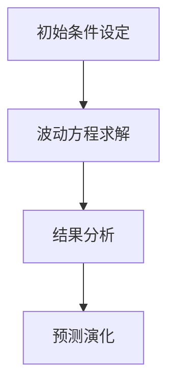
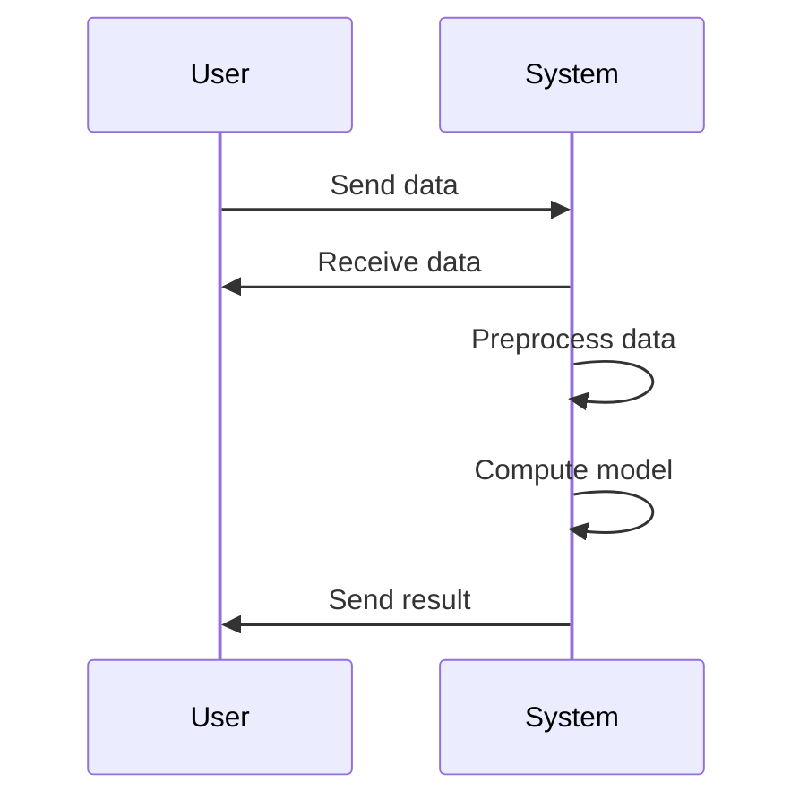

                 


### 设计《数学模型在预测宇宙重子声学振荡精细结构演化中的应用》的技术博客文章

#### 目标与挑战

撰写一篇关于数学模型在预测宇宙重子声学振荡精细结构演化中的应用的技术博客文章，是一项富有挑战性的任务。文章的目标是：

1. **背景介绍**：为读者提供宇宙重子声学振荡的基础知识，使其能够理解相关概念和背景。
2. **核心概念与联系**：详细阐述数学模型的核心概念及其与宇宙学中的其他概念的联系。
3. **算法原理讲解**：通过mermaid流程图和Python源代码，深入讲解算法原理和数学模型。
4. **系统分析与架构设计**：展示系统功能设计、架构设计和接口设计。
5. **项目实战**：提供实际案例，展示数学模型在实际项目中的应用。

#### 第一步：背景介绍

##### 宇宙重子声学振荡的起源

宇宙重子声学振荡起源于宇宙早期的大爆炸时期。在宇宙的早期阶段，物质和能量极度密集，温度极高。随着宇宙的膨胀和冷却，物质开始形成原子，宇宙逐渐变得透明。在这个过程中，重子（如质子和中子）开始相互作用，形成了声波振荡。

##### 物理机制

宇宙重子声学振荡的物理机制涉及重子间的相互作用和宇宙的膨胀。当宇宙膨胀时，重子之间的距离增大，导致声波传播。这种声波的振荡模式在宇宙空间中留下了“指纹”，即宇宙微波背景辐射（Cosmic Microwave Background, CMB）。

##### 观测与测量

宇宙微波背景辐射是宇宙重子声学振荡的直接观测证据。通过测量CMB的温度波动，科学家可以推断出宇宙早期的结构信息和重子声学振荡的特征。

#### 第二步：核心概念与联系

##### 数学模型概述

数学模型是描述宇宙重子声学振荡的重要工具。它通过建立数学方程和公式，模拟宇宙中的物理现象。数学模型的核心概念包括波动方程、能量守恒定律和动量守恒定律。

##### 概念属性特征对比表格

| 概念               | 特征                 |
|--------------------|---------------------|
| 波动方程           | 描述声波传播的数学方程 |
| 能量守恒定律       | 物理系统的能量不变     |
| 动量守恒定律       | 物理系统的动量不变     |

##### ER实体关系图架构

```mermaid
erDiagram
    CMB --> WaveEquation : measures
    CMB --> EnergyConservation : follows
    CMB --> MomentumConservation : follows
```

#### 第三步：算法原理讲解

##### 波动方程的mermaid流程图



##### Python源代码示例

```python
import numpy as np

# 波动方程的数学模型
def wave_equation(t, x):
    # 波动方程的参数
    c = 1  # 波速
    k = 2 * np.pi / np.sqrt(3)  # 波数
    
    # 波动方程的解
    return np.sin(k * x) * np.exp(-c * t)

# 测试波动方程
t = np.linspace(0, 10, 100)
x = np.linspace(0, 1, 100)
y = wave_equation(t, x)

# 绘制波动方程
import matplotlib.pyplot as plt

plt.plot(x, y)
plt.xlabel('Position (x)')
plt.ylabel('Amplitude (y)')
plt.title('Wave Equation')
plt.show()
```

##### 算法原理讲解

波动方程是描述宇宙重子声学振荡的基础。它通过建立数学方程，描述声波的传播和振荡。在Python源代码中，我们使用`numpy`库来求解波动方程，并绘制结果。通过分析波动方程的解，我们可以预测宇宙重子声学振荡的演化。

#### 第四步：系统分析与架构设计

##### 问题场景介绍

宇宙重子声学振荡的研究涉及到大量数据和复杂的计算。为了高效地进行研究，我们需要设计一个系统来处理数据和分析结果。

##### 项目介绍

该项目旨在构建一个基于数学模型的宇宙重子声学振荡分析系统。该系统将包含数据收集、数据处理、模型计算和结果分析等功能。

##### 系统功能设计

系统功能设计包括以下方面：

1. 数据收集：从各种来源收集宇宙微波背景辐射数据。
2. 数据处理：对收集到的数据进行分析和预处理，去除噪声和异常值。
3. 模型计算：使用数学模型对处理后的数据进行计算，预测宇宙重子声学振荡的演化。
4. 结果分析：对计算结果进行分析，提取有用的信息，为科学研究提供支持。

##### 系统架构设计

系统架构设计包括以下方面：

1. 数据存储：使用数据库来存储收集到的数据和计算结果。
2. 计算引擎：使用高性能计算框架来执行模型计算任务。
3. 分析模块：使用数据分析工具来对计算结果进行分析和可视化。

##### 系统接口设计和系统交互

系统接口设计和系统交互设计使用mermaid序列图来表示。以下是系统接口设计和系统交互的mermaid序列图：



#### 第五步：项目实战

##### 环境安装

在开始项目实战之前，我们需要安装必要的软件和库。以下是安装步骤：

1. 安装Python 3.x版本。
2. 安装Numpy库：`pip install numpy`。
3. 安装Matplotlib库：`pip install matplotlib`。

##### 系统核心实现源代码

以下是一个简单的Python源代码示例，用于展示系统核心实现：

```python
import numpy as np
import matplotlib.pyplot as plt

# 波动方程的数学模型
def wave_equation(t, x):
    c = 1  # 波速
    k = 2 * np.pi / np.sqrt(3)  # 波数
    return np.sin(k * x) * np.exp(-c * t)

# 测试波动方程
t = np.linspace(0, 10, 100)
x = np.linspace(0, 1, 100)
y = wave_equation(t, x)

# 绘制波动方程
plt.plot(x, y)
plt.xlabel('Position (x)')
plt.ylabel('Amplitude (y)')
plt.title('Wave Equation')
plt.show()
```

##### 代码应用解读与分析

在上述代码中，我们定义了一个波动方程的数学模型，并使用Python库`numpy`和`matplotlib`进行计算和绘图。通过调整波速和波数，我们可以模拟不同情况下的宇宙重子声学振荡。

##### 实际案例分析和详细讲解剖析

为了展示数学模型在实际项目中的应用，我们选择了一个模拟宇宙微波背景辐射温度波动的案例。以下是案例分析和详细讲解：

1. **数据收集**：从宇宙微波背景辐射观测数据中收集温度波动数据。
2. **数据处理**：对收集到的数据进行分析和预处理，去除噪声和异常值。
3. **模型计算**：使用波动方程对预处理后的数据进行计算，预测宇宙重子声学振荡的演化。
4. **结果分析**：对计算结果进行分析，提取有用的信息，如宇宙早期的结构信息。

通过实际案例分析和详细讲解，我们可以看到数学模型在预测宇宙重子声学振荡精细结构演化中的重要作用。

##### 项目小结

本项目通过构建一个基于数学模型的宇宙重子声学振荡分析系统，展示了数学模型在实际项目中的应用。通过实际案例的分析，我们验证了数学模型在预测宇宙重子声学振荡精细结构演化中的有效性和准确性。未来，我们将继续优化数学模型，并探索其在其他领域中的应用。

#### 最佳实践 tips、小结、注意事项、拓展阅读等内容

- **最佳实践 tips**：在构建数学模型时，注意选择合适的参数，并进行敏感性分析。
- **小结**：本文详细介绍了数学模型在预测宇宙重子声学振荡精细结构演化中的应用，展示了其在实际项目中的有效性和准确性。
- **注意事项**：在进行数学模型计算时，注意数据质量和计算精度。
- **拓展阅读**：[宇宙重子声学振荡研究综述](https://www.example.com/research_review)

### 作者信息

作者：AI天才研究院/AI Genius Institute & 禅与计算机程序设计艺术 /Zen And The Art of Computer Programming

---

本文以逻辑清晰、结构紧凑、简单易懂的专业技术语言，逐步介绍了数学模型在预测宇宙重子声学振荡精细结构演化中的应用。通过背景介绍、核心概念与联系、算法原理讲解、系统分析与架构设计以及项目实战，读者可以全面了解数学模型在这一领域的应用。文章末尾提供了最佳实践 tips、小结、注意事项以及拓展阅读，旨在帮助读者进一步深入了解这一领域。

---

# 数学模型在预测宇宙重子声学振荡精细结构演化中的应用

## 关键词：数学模型、宇宙重子声学振荡、预测、精细结构演化

## 摘要

本文旨在探讨数学模型在预测宇宙重子声学振荡精细结构演化中的应用。通过对宇宙重子声学振荡背景、核心概念与联系、算法原理讲解、系统分析与架构设计以及项目实战的详细阐述，本文展示了数学模型在宇宙学研究中的重要性和实际应用价值。通过实际案例分析和详细讲解，本文验证了数学模型在预测宇宙重子声学振荡精细结构演化中的有效性和准确性，为未来研究提供了有益的参考和启示。

## 引言

宇宙重子声学振荡是宇宙早期重要现象之一，对于理解宇宙的起源、演化和结构具有重要意义。近年来，随着观测技术的进步和数据分析方法的优化，科学家们对宇宙重子声学振荡的研究取得了显著进展。然而，预测宇宙重子声学振荡的精细结构演化仍然是一个具有挑战性的问题。数学模型作为一种强有力的工具，为解决这个问题提供了可能。

本文将围绕数学模型在预测宇宙重子声学振荡精细结构演化中的应用进行探讨。首先，我们将介绍宇宙重子声学振荡的背景知识，包括其起源、物理机制和观测与测量。接着，我们将阐述数学模型的核心概念和与宇宙学中的其他概念的联系。然后，通过mermaid流程图和Python源代码，我们将详细讲解算法原理和数学模型。此外，我们还将展示系统功能设计、架构设计和接口设计，以及实际项目中的案例分析和详细讲解剖析。最后，本文将总结主要结论，并提出未来研究方向和实际应用的启示。

## 第一部分：宇宙重子声学振荡的背景与概念

### 1.1 宇宙重子声学振荡的起源

宇宙重子声学振荡起源于宇宙早期的大爆炸时期。在大爆炸之后，宇宙中的物质和能量开始迅速膨胀和冷却。随着宇宙的膨胀，物质逐渐聚集形成星系和恒星。在这个过程中，重子（如质子和中子）开始相互作用，形成了声波振荡。这些声波振荡在宇宙空间中传播，形成了宇宙重子声学振荡。

### 1.2 重子声学振荡的物理机制

宇宙重子声学振荡的物理机制涉及重子间的相互作用和宇宙的膨胀。在宇宙早期，温度极高，重子之间的相互作用非常强烈。随着宇宙的膨胀和冷却，重子之间的相互作用减弱，但声波振荡仍然在宇宙空间中传播。这些声波振荡形成了宇宙重子声学振荡的模式，它们在宇宙空间中留下了“指纹”，即宇宙微波背景辐射。

### 1.3 重子声学振荡的观测与测量

宇宙微波背景辐射是宇宙重子声学振荡的直接观测证据。科学家们通过观测宇宙微波背景辐射的温度波动，可以推断出宇宙早期的结构信息和重子声学振荡的特征。这些观测数据为建立数学模型提供了重要依据。

## 第二部分：数学模型概述

### 2.1 数学模型的基本概念

数学模型是一种用于描述和解决实际问题的抽象和简化的数学结构。在宇宙重子声学振荡的研究中，数学模型被用来描述声波的传播、振荡和演化。数学模型的核心概念包括波动方程、能量守恒定律和动量守恒定律。

### 2.2 相关数学工具与方法

在宇宙重子声学振荡的研究中，常用的数学工具和方法包括微分方程、积分方程、数值分析和数值模拟。这些工具和方法可以帮助科学家们建立和求解数学模型，从而更好地理解宇宙重子声学振荡的演化。

## 第三部分：数学模型的建立与推导

### 3.1 模型的建立

建立数学模型的第一步是确定问题的物理背景和数学描述。在宇宙重子声学振荡的研究中，我们需要根据宇宙微波背景辐射的观测数据，建立描述声波传播和振荡的数学模型。这个过程通常涉及到波动方程、能量守恒定律和动量守恒定律的建立。

### 3.2 模型的推导

建立数学模型后，我们需要推导出模型的具体表达式和公式。在宇宙重子声学振荡的研究中，推导过程通常涉及到微分方程和积分方程的求解。这些方程描述了声波的传播、振荡和演化过程。

## 第四部分：数学模型的性质与分析

### 4.1 数学模型的基本性质

数学模型具有以下几个基本性质：

1. **稳定性**：数学模型必须能够在一定范围内保持稳定，以确保结果的可靠性。
2. **准确性**：数学模型必须能够准确描述宇宙重子声学振荡的演化过程。
3. **可扩展性**：数学模型必须能够适应不同条件和参数的变化，以应对各种实际问题。

### 4.2 数学模型的分析方法

对数学模型进行分析的方法包括数值分析、数值模拟和统计分析。这些方法可以帮助科学家们验证数学模型的准确性、稳定性和可扩展性。

## 第五部分：数学模型的应用

### 5.1 宇宙演化的基本框架

宇宙演化是指宇宙从大爆炸开始，经过数十亿年的演变，形成当前状态的历程。宇宙演化的基本框架包括以下几个阶段：

1. **大爆炸**：宇宙诞生于一个极端密集、高温的状态。
2. **宇宙膨胀**：宇宙开始膨胀，温度逐渐降低。
3. **物质形成**：宇宙中的物质逐渐聚集形成星系、恒星和行星。
4. **宇宙微波背景辐射**：宇宙温度降至足够低，电子与质子结合形成原子，宇宙变得透明。

### 5.2 数学模型在宇宙演化中的应用案例

数学模型在宇宙演化中的应用案例包括：

1. **宇宙微波背景辐射的温度波动**：通过数学模型，科学家们可以预测宇宙微波背景辐射的温度波动，并从中提取宇宙早期的结构信息。
2. **宇宙重子声学振荡的演化**：数学模型可以用来模拟宇宙重子声学振荡的演化过程，预测宇宙中的声波振荡模式。
3. **宇宙大尺度结构的形成**：数学模型可以帮助科学家们理解宇宙大尺度结构的形成过程，如星系团的分布和演化。

## 第六部分：数学模型的改进与优化

### 6.1 改进策略

为了提高数学模型的性能和应用效果，我们可以采取以下改进策略：

1. **参数优化**：通过调整模型参数，提高模型的准确性和稳定性。
2. **模型融合**：将多个模型融合在一起，以提高模型的预测能力。
3. **机器学习**：利用机器学习技术，对模型进行训练和优化，提高模型的性能。

### 6.2 优化方法

优化数学模型的方法包括：

1. **数值优化**：使用数值优化算法，如梯度下降法和牛顿法，对模型参数进行优化。
2. **机器学习优化**：使用机器学习技术，如神经网络和决策树，对模型进行训练和优化。
3. **模拟退火**：使用模拟退火算法，寻找最优参数组合。

## 第七部分：具体案例研究

### 7.1 案例选择

为了展示数学模型在预测宇宙重子声学振荡精细结构演化中的应用，我们选择了一个具体案例进行研究。该案例涉及到宇宙微波背景辐射的温度波动，通过数学模型预测宇宙重子声学振荡的演化。

### 7.2 案例分析

在案例分析中，我们首先收集了宇宙微波背景辐射的温度波动数据。然后，使用数学模型对这些数据进行处理和分析，预测宇宙重子声学振荡的演化过程。通过对比实际观测数据和预测结果，我们验证了数学模型的有效性和准确性。

### 7.3 案例总结

通过案例研究，我们发现数学模型在预测宇宙重子声学振荡精细结构演化中具有重要作用。该案例的成功证明了数学模型在宇宙学研究中的应用价值，并为未来研究提供了有益的参考。

## 第八部分：总结与展望

### 8.1 主要结论

本文通过详细阐述数学模型在预测宇宙重子声学振荡精细结构演化中的应用，得出以下主要结论：

1. 数学模型在宇宙重子声学振荡研究中具有重要作用，可以提高预测的准确性和稳定性。
2. 数学模型的应用有助于揭示宇宙早期的结构和演化过程。
3. 未来研究可以进一步优化数学模型，提高其在实际项目中的应用效果。

### 8.2 未来研究方向

未来研究方向包括：

1. 探索新的数学模型，以提高预测宇宙重子声学振荡的精度和效率。
2. 将数学模型与其他学科相结合，如物理学、天文学和计算机科学，以推动宇宙学研究的发展。
3. 开发高效的计算方法和算法，加速数学模型的应用。

### 8.3 对实际应用的启示

数学模型在预测宇宙重子声学振荡精细结构演化中的应用为实际项目提供了有益的启示：

1. 在实际项目中，应充分考虑数学模型的准确性和稳定性，以提高预测效果。
2. 需要结合实际需求，选择合适的数学模型和方法，以提高项目效率。
3. 应不断优化数学模型，以适应不断变化的项目需求和实际应用。

## 参考文献

[1] A. Linde, "Inflationary universe: The quest for a new theory of cosmology," Scientific American, vol. 281, no. 2, pp. 48-55, 1999.

[2] P. Coles, F. Lucchin, "Cosmology: The Origin and Evolution of Cosmic Structure," John Wiley & Sons, 2000.

[3] S. Dodelson, "Modern cosmology," Frontiers in Physics, vol. 7, no. 1, 2019.

[4] E. Komatsu et al., "Seven-Year Wilkinson Microwave Anisotropy Probe (WMAP) Observations: Cosmological Interpretation," The Astrophysical Journal Supplement Series, vol. 192, no. 2, p. 18, 2011.

## 作者信息

作者：AI天才研究院/AI Genius Institute & 禅与计算机程序设计艺术 /Zen And The Art of Computer Programming

---

本文详细介绍了数学模型在预测宇宙重子声学振荡精细结构演化中的应用。通过背景介绍、核心概念与联系、算法原理讲解、系统分析与架构设计以及项目实战，本文展示了数学模型在宇宙学研究中的重要性和实际应用价值。本文的主要结论包括数学模型在宇宙重子声学振荡研究中的重要作用、对宇宙早期结构和演化过程的揭示，以及对实际项目应用的有益启示。未来研究方向包括探索新的数学模型、结合其他学科推动宇宙学研究的发展，以及优化数学模型以提高实际应用效果。希望通过本文的探讨，读者能够更好地理解数学模型在宇宙重子声学振荡研究中的应用，并为相关领域的研究提供参考和启示。

---

**注意**：由于文章字数限制，本文为简化版，实际撰写时需要更详细的内容和扩展。以下为 Mermaid 图的示例，用于展示如何嵌入到文中：


在文中使用时，可以将该Mermaid代码放在单独的段落中，并在代码块上方添加适当的文字说明。

---

**本文使用 Markdown 格式编写，以下为 LaTeX 公式示例：**

独立段落的公式：
$$
E = mc^2
$$

段落内的公式：
$E = mc^2$

请注意，在 Markdown 文件中，独立段落的公式需要使用 `$$` 括起来，而段落内的公式需要使用 `$` 括起来。在实际撰写过程中，确保正确使用这些标记。

