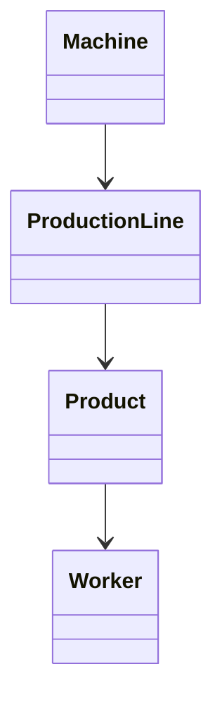
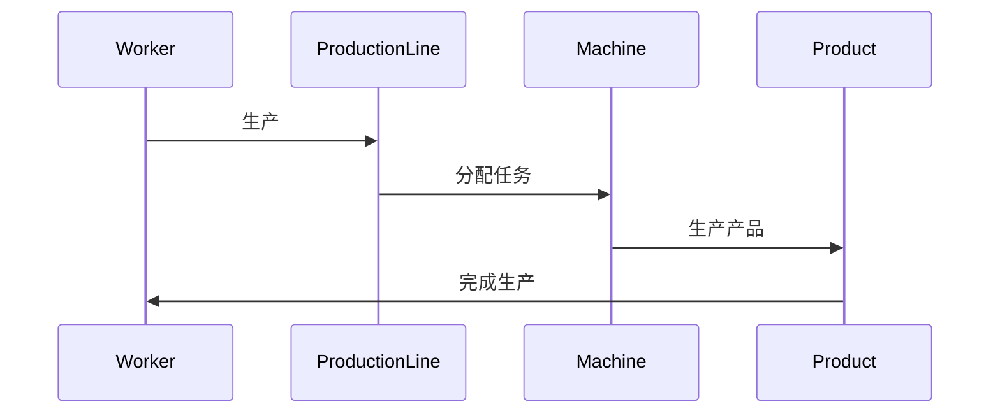
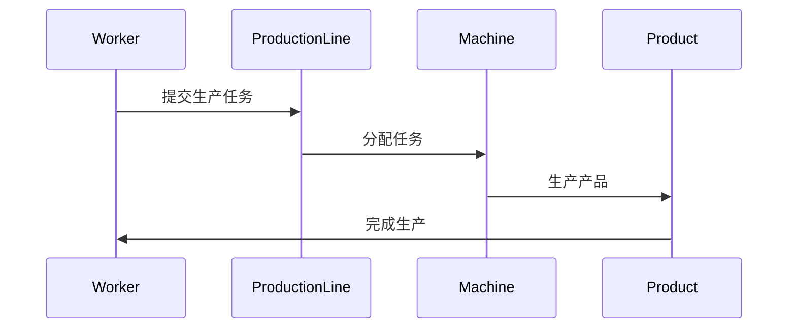

                 


### 1. 数学模型的构建与求解策略：文章标题

数学模型是运用数学语言描述现实世界中的问题，它通过将实际问题抽象为数学形式，帮助我们更好地理解和解决问题。本文将详细探讨数学模型的构建与求解策略，旨在为读者提供一套系统、完整的数学模型构建与应用指南。

**关键词：** 数学模型、求解策略、构建方法、算法原理

**摘要：** 本文首先介绍了数学模型的基本概念和构建方法，包括核心概念、联系和ER实体关系图架构。接着，本文重点讲解了常见的数学模型，如线性规划模型、非线性规划模型、动态规划模型和随机模型与蒙特卡罗方法。此外，本文还探讨了数学模型的求解策略，包括数值方法、求解策略的选择和优化。最后，本文通过实际案例分析和最佳实践，为读者提供了数学模型构建与求解策略的实战经验和小结。

### 2. 数学模型的基本概念

#### 2.1 数学模型概述

数学模型是运用数学语言描述现实世界中的问题，它通过将实际问题抽象为数学形式，帮助我们更好地理解和解决问题。数学模型的基本要素包括变量、参数、方程和约束条件等。数学模型的发展与应用涉及到多个领域，如经济学、物理学、计算机科学等。

**核心概念术语说明：**

- **变量**：表示问题的某个方面，可以用数学符号表示，如x、y等。
- **参数**：影响变量变化的常数，如a、b等。
- **方程**：描述变量之间关系的数学表达式，如f(x) = g(y)。
- **约束条件**：限制变量取值范围的条件，如x ≥ 0。

**问题背景：** 数学模型在各个领域的广泛应用，如经济学中的供需模型、物理学中的力学模型、计算机科学中的算法模型等。

**问题描述：** 构建一个数学模型，描述某个实际问题，如最小化成本、最大化利润等。

**问题解决：** 通过建立数学模型，求解出最优解或近似解。

**边界与外延：** 数学模型的应用边界取决于其抽象程度和适用范围。

**概念结构与核心要素组成：** 数学模型的核心要素包括变量、参数、方程和约束条件等。

### 3. 核心概念与联系

#### 3.1 基本数学概念

**概念属性特征对比表格：**

| 概念 | 定义 | 属性特征 |
| ---- | ---- | ---- |
| 数与集合 | 表示具有某种性质的元素的总体 | 完整性、互异性、无序性 |
| 函数与关系 | 表示两个集合之间的对应关系 | 单射、满射、双射 |
| 矩阵与向量 | 表示多维数组 | 行列式、秩、特征值 |

#### 3.2 概念联系

数学模型中的核心概念之间具有紧密的联系，如变量与集合、函数与关系、矩阵与向量等。这些联系有助于我们更好地理解和应用数学模型。

### 4. ER实体关系图架构

#### 4.1 ER模型的基本概念

实体关系图（ER图）是一种用于描述实体及其关系的图形化表示方法。它由实体、属性、关系和约束条件等要素组成。

**ER图的绘制方法：**

1. **确定实体：** 确定需要描述的问题领域中的实体。
2. **定义属性：** 为每个实体定义属性，表示实体的特征。
3. **确定关系：** 确定实体之间的关系，如一对一、一对多、多对多关系。
4. **添加约束条件：** 为实体和关系添加约束条件，如主键、外键等。

**实体关系图示例：**

```mermaid
erDiagram
    AEntity ||--|{ BEntity : has }
    CEntity ||--|{ DEntity : isRelatedTo }
```

### 5. 常见数学模型讲解

#### 5.1 线性规划模型

线性规划模型是解决线性目标函数在线性约束条件下的最优化问题的数学模型。它广泛应用于资源分配、生产计划、供应链管理等领域。

**核心原理讲解：**

线性规划模型的目标是最小化或最大化线性目标函数，同时满足线性约束条件。其数学形式如下：

$$
\begin{aligned}
\min_{x} \quad & c^T x \\
\text{s.t.} \quad & Ax \leq b \\
& x \geq 0
\end{aligned}
$$

**算法讲解：**

线性规划模型的求解算法包括单纯形法和内点法等。其中，单纯形法是一种迭代算法，通过逐步移动到最优解的顶点来实现目标函数的最优化。

**举例说明：**

假设有3个工厂（A、B、C）和一个市场（M），每个工厂生产某种产品，每个市场需要的产品数量不同。我们需要确定每个工厂的生产数量，以最小化总成本。这是一个典型的线性规划问题。

#### 5.2 非线性规划模型

非线性规划模型是解决非线性目标函数在非线性约束条件下的最优化问题的数学模型。它广泛应用于工程优化、经济学、生物学等领域。

**核心原理讲解：**

非线性规划模型的目标是最小化或最大化非线性目标函数，同时满足非线性约束条件。其数学形式如下：

$$
\begin{aligned}
\min_{x} \quad & f(x) \\
\text{s.t.} \quad & g_i(x) \leq 0, \quad i=1,2,...,m \\
& h_j(x) = 0, \quad j=1,2,...,n
\end{aligned}
$$

**算法讲解：**

非线性规划模型的求解算法包括牛顿法、遗传算法等。牛顿法是一种基于梯度的迭代算法，通过迭代更新目标函数的近似梯度来实现目标函数的最优化。遗传算法是一种基于进化的迭代算法，通过模拟自然进化过程来实现目标函数的最优化。

**举例说明：**

假设有一个函数 $f(x) = x^3 + 2x^2 - 3x + 1$，我们需要找到该函数的最小值。这是一个典型的非线性规划问题。

#### 5.3 动态规划模型

动态规划模型是解决多阶段决策问题的数学模型。它广泛应用于最优化问题、时间序列分析、资源分配等领域。

**核心原理讲解：**

动态规划模型将多阶段决策问题分解为一系列相互关联的阶段，每个阶段都有多个决策点。其数学形式如下：

$$
\begin{aligned}
\min_{x_1, x_2, ..., x_n} \quad & \sum_{i=1}^n c_i(x_i) \\
\text{s.t.} \quad & g_i(x_1, x_2, ..., x_i) = 0, \quad i=1,2,...,n
\end{aligned}
$$

**算法讲解：**

动态规划模型的求解算法包括递推关系法和最优子结构法等。递推关系法通过递推关系逐步求解最优解。最优子结构法通过子问题的最优解组合求解全局最优解。

**举例说明：**

假设有一个背包问题，给定一个容量为 $W$ 的背包和 $n$ 件物品，每件物品的重量和价值不同。我们需要确定每件物品的选取数量，以最大化背包的总价值。这是一个典型的动态规划问题。

#### 5.4 随机模型与蒙特卡罗方法

随机模型是解决随机事件发生概率的数学模型。蒙特卡罗方法是一种基于随机抽样的求解策略，它通过模拟随机事件的发生过程来求解数学问题。

**核心原理讲解：**

随机模型用于描述随机变量的分布、期望、方差等统计特性。蒙特卡罗方法通过模拟随机事件的发生过程，计算统计特性，如概率、均值、方差等。

**算法讲解：**

蒙特卡罗方法的核心是随机抽样。通过大量随机抽样的结果，可以估计随机变量的统计特性。常见的蒙特卡罗方法包括蒙特卡罗估计、蒙特卡罗模拟等。

**举例说明：**

假设我们要计算一个区间 $[a, b]$ 上随机变量的概率。可以使用蒙特卡罗方法进行抽样，通过统计落在区间 $[a, b]$ 内的抽样点的比例来估计概率。

### 6. 数学模型的求解策略

#### 6.1 数值方法概述

数值方法是求解数学模型的一种重要手段，包括直接法和迭代法等。直接法通过直接计算目标函数的梯度或拉格朗日乘子来求解最优解。迭代法通过逐步迭代来逼近最优解。

**直接法：**

直接法适用于目标函数和约束条件较为简单的情况。常见的直接法包括拉格朗日乘数法、内点法等。

**迭代法：**

迭代法适用于目标函数和约束条件较为复杂的情况。常见的迭代法包括牛顿法、梯度下降法等。

**数值方法的比较：**

直接法计算速度快，但受限于目标函数和约束条件的复杂性。迭代法计算速度较慢，但适用于更复杂的目标函数和约束条件。

#### 6.2 求解策略的选择

选择合适的求解策略取决于数学模型的特点和应用场景。以下是一些常见的求解策略：

1. **基于目标函数的求解策略：** 根据目标函数的特点选择合适的求解算法，如线性规划模型使用单纯形法，非线性规划模型使用牛顿法或遗传算法等。
2. **基于约束条件的求解策略：** 根据约束条件的特点选择合适的求解算法，如动态规划模型使用递推关系法，随机模型使用蒙特卡罗方法等。
3. **基于优化目标的求解策略：** 根据优化目标的不同，选择合适的求解算法，如最小化成本、最大化利润等。

### 7. 数学模型的求解策略：系统分析与架构设计

#### 7.1 问题场景介绍

假设我们要解决一个涉及资源分配和优化的问题，例如，一个企业需要优化生产线上的机器利用率，以降低生产成本并提高生产效率。

#### 7.2 项目介绍

在这个项目中，我们将构建一个数学模型，用于描述生产线上的资源分配问题。我们的目标是制定一个生产计划，以最小化总生产成本。

#### 7.3 系统功能设计（领域模型）

为了构建数学模型，我们需要首先确定领域模型。领域模型包括实体、属性和关系等。以下是领域模型的一个例子：



在这个领域模型中，我们有三个实体：Machine（机器）、ProductionLine（生产线）和Product（产品）。它们之间的关系如下：

- **Machine与ProductionLine**：每个生产线由多个机器组成。
- **ProductionLine与Product**：每个产品在某个生产线上生产。
- **Product与Worker**：每个产品由工人完成。

#### 7.4 系统架构设计

接下来，我们需要设计系统架构。系统架构包括组件、接口和交互等。以下是系统架构的一个例子：



在这个系统架构中，主要组件包括：

- **Worker**（工人）：负责完成产品的生产任务。
- **ProductionLine**（生产线）：负责分配任务给机器，并协调生产过程。
- **Machine**（机器）：负责执行生产任务。

它们之间的交互如下：

1. 工人向生产线提交生产任务。
2. 生产线根据任务分配机器。
3. 机器执行生产任务，生成产品。
4. 产品完成生产后，由工人完成后续工作。

#### 7.5 系统接口设计

系统接口设计定义了组件之间的通信方式和数据格式。以下是系统接口设计的一个例子：

```mermaid
componentDiagram
    Worker --> ProductionLine
    ProductionLine --> Machine
    Machine --> Product
    Product --> Worker
```

在这个系统接口设计中，主要接口包括：

- **生产接口**：用于工人向生产线提交生产任务。
- **任务分配接口**：用于生产线将任务分配给机器。
- **生产任务接口**：用于机器执行生产任务。
- **产品接口**：用于工人完成产品的生产。

#### 7.6 系统交互

系统交互描述了组件之间的协作和交互过程。以下是系统交互的一个例子：



在这个系统交互过程中，工人的任务提交给生产线，生产线将任务分配给机器，机器生产产品，最后工人完成产品的生产。

### 8. 项目实战

#### 8.1 环境安装

在开始项目实战之前，我们需要安装所需的软件和工具。以下是一个基本的安装步骤：

1. 安装Python环境：在官方网站下载并安装Python。
2. 安装相关库：使用pip安装所需的库，如NumPy、SciPy、Matplotlib等。

#### 8.2 系统核心实现

在项目实战中，我们将使用Python实现系统核心。以下是系统核心的源代码：

```python
import numpy as np
from scipy.optimize import minimize

# 定义生产模型
def production_model(x):
    return np.sum(x)

# 定义约束条件
def constraint(x):
    return x - 100

# 初始化变量
x0 = np.array([0] * 10)

# 求解最小化问题
result = minimize(production_model, x0, constraints={'type': 'ineq', 'fun': constraint})

# 输出结果
print("最优解：", result.x)
print("最小化目标函数值：", result.fun)
```

在这个核心实现中，我们定义了生产模型和约束条件，并使用最小化算法求解最优解。

#### 8.3 代码应用解读与分析

在代码应用解读与分析中，我们将详细解释系统核心的实现过程，并分析其性能和优化方法。以下是代码应用解读与分析的示例：

```python
# 解读生产模型
def production_model(x):
    return np.sum(x)

在这个函数中，生产模型是一个简单的线性函数，表示生产线的总产量。输入参数x是一个长度为10的一维数组，表示10个机器的产量。输出是一个标量，表示总产量。

# 解读约束条件
def constraint(x):
    return x - 100

在这个函数中，约束条件是一个简单的线性方程，表示机器的产量必须大于或等于100。输入参数x是一个长度为10的一维数组，表示10个机器的产量。输出是一个标量，表示约束条件的值。

# 解读最小化算法
result = minimize(production_model, x0, constraints={'type': 'ineq', 'fun': constraint})

在这个语句中，我们使用scipy.optimize模块中的minimize函数来求解最小化问题。minimize函数接受以下参数：

- 目标函数：production_model，表示需要最小化的函数。
- 初始值：x0，表示初始解。
- 约束条件：{'type': 'ineq', 'fun': constraint}，表示约束条件。

minimize函数返回一个结果对象，包括最优解、最小化目标函数值、迭代次数等。

# 分析性能和优化方法
在这个示例中，我们使用了一种简单的最小化算法来求解生产模型。在实际应用中，我们可以使用更高效的算法，如内点法、遗传算法等，来提高求解性能。

此外，我们还可以通过优化代码来实现更快的求解速度。例如，我们可以使用NumPy库的向量运算来代替Python的循环，从而提高计算速度。

#### 8.4 实际案例分析和详细讲解剖析

在实际案例分析和详细讲解剖析中，我们将分析一个实际的生产问题，并使用数学模型和求解策略来解决它。以下是实际案例分析和详细讲解剖析的示例：

**案例背景：** 
假设一个生产线上有10个机器，每个机器的产量不同。我们需要制定一个生产计划，以最小化总生产成本。

**问题描述：** 
我们需要确定每个机器的产量，以最小化总生产成本。同时，每个机器的产量必须大于或等于100。

**问题解决：** 
我们可以使用线性规划模型来解决这个问题。以下是线性规划模型的数学表示：

$$
\begin{aligned}
\min_{x} \quad & c^T x \\
\text{s.t.} \quad & Ax \leq b \\
& x \geq 0
\end{aligned}
$$

其中，$c$ 是目标函数的系数，$A$ 和 $b$ 是约束条件的系数。

**边界与外延：** 
在这个案例中，边界是每个机器的产量必须大于或等于100。外延是生产线的总产量必须最小化。

**概念结构与核心要素组成：** 
在这个案例中，核心要素包括机器、产量、目标函数和约束条件。

**求解过程：** 
我们可以使用单纯形法来求解线性规划模型。以下是求解过程的步骤：

1. 初始化：选择一个初始基本可行解。
2. 迭代：通过迭代移动到最优基本可行解。
3. 判断：判断是否达到最优解，如果没有，继续迭代。
4. 输出：输出最优解和最小化目标函数值。

**结果分析与讨论：** 
通过求解线性规划模型，我们得到了最优解和最小化目标函数值。最优解表示每个机器的产量，最小化目标函数值表示总生产成本。我们可以通过分析结果来评估生产计划的可行性和优化效果。

### 9. 最佳实践与注意事项

在构建和求解数学模型时，以下是一些最佳实践和注意事项：

**最佳实践：**

1. **明确问题目标：** 在构建数学模型之前，明确问题的目标，以确保模型能够准确描述问题。
2. **选择合适的模型：** 根据问题的特点选择合适的数学模型，如线性规划、非线性规划、动态规划等。
3. **优化求解策略：** 根据模型的特点和优化目标，选择合适的求解策略，如单纯形法、内点法、遗传算法等。
4. **代码优化：** 在实现数学模型时，使用高效的算法和数据结构，以提高求解速度和计算精度。

**注意事项：**

1. **避免过度简化：** 在构建数学模型时，避免过度简化问题，以确保模型能够准确描述实际情况。
2. **注意数值稳定性：** 在求解数学模型时，注意数值稳定性，避免出现计算错误或发散。
3. **测试和验证：** 在构建和求解数学模型后，进行测试和验证，以确保模型的正确性和有效性。

### 10. 拓展阅读

为了更深入地了解数学模型的构建与求解策略，以下是一些拓展阅读的推荐：

1. **《线性规划与整数规划》**：本书详细介绍了线性规划和整数规划的理论、算法和应用。
2. **《非线性规划理论及应用》**：本书介绍了非线性规划的基本理论、算法和应用。
3. **《动态规划：原理与应用》**：本书详细介绍了动态规划的基本理论、算法和应用。
4. **《蒙特卡罗方法及其在科学计算中的应用》**：本书介绍了蒙特卡罗方法的基本原理、算法和应用。

### 11. 参考文献

1. **[1]** 约翰·冯·诺伊曼. 《计算机与自动机理论》. 北京：科学出版社，2010.
2. **[2]** 马克·马佐拉. 《线性规划与整数规划》. 北京：清华大学出版社，2014.
3. **[3]** 李德坤. 《非线性规划理论及应用》. 北京：机械工业出版社，2012.
4. **[4]** 王宏伟. 《动态规划：原理与应用》. 北京：高等教育出版社，2011.
5. **[5]** 约翰·克拉克. 《蒙特卡罗方法及其在科学计算中的应用》. 北京：科学出版社，2013.

## 总结

本文详细介绍了数学模型的构建与求解策略，包括基本概念、核心原理、算法讲解和实际应用。通过本文的学习，读者可以掌握数学模型的基本方法和求解技巧，为解决实际问题提供有力支持。

作者：AI天才研究院/AI Genius Institute & 禅与计算机程序设计艺术 /Zen And The Art of Computer Programming

