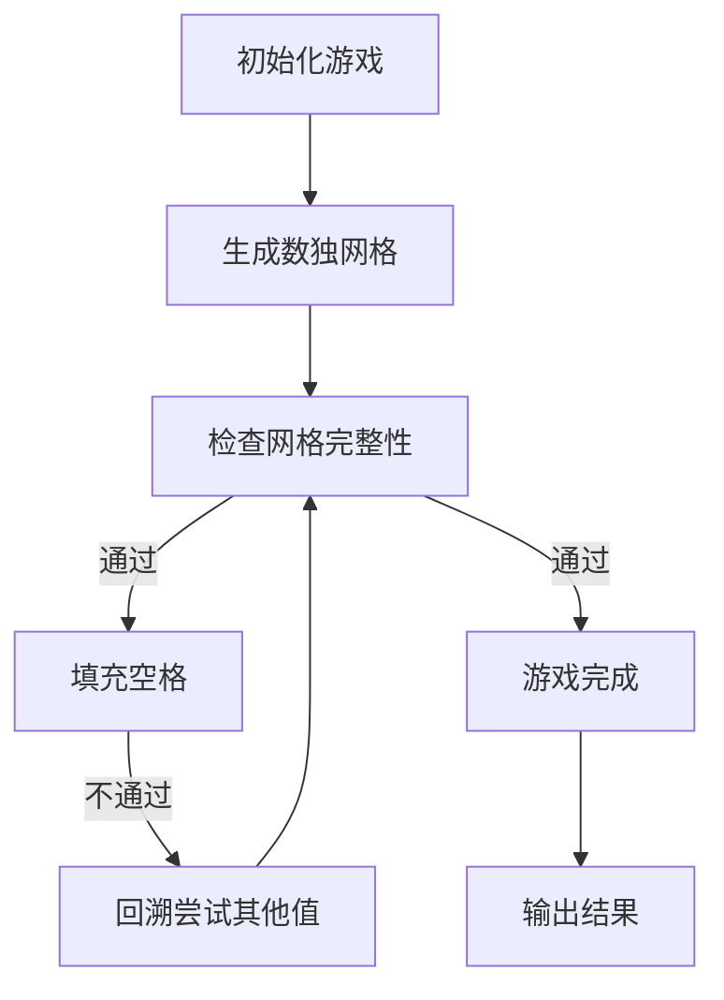
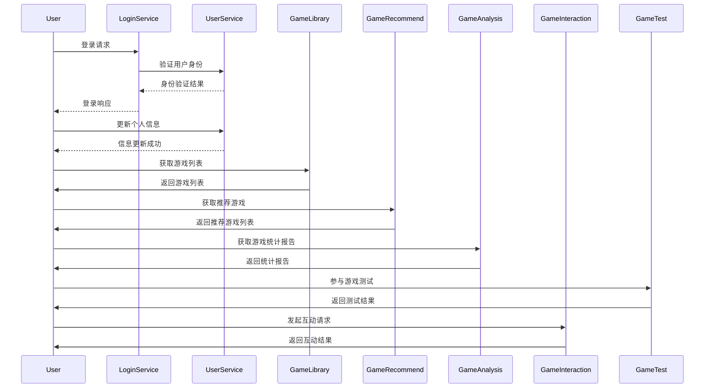
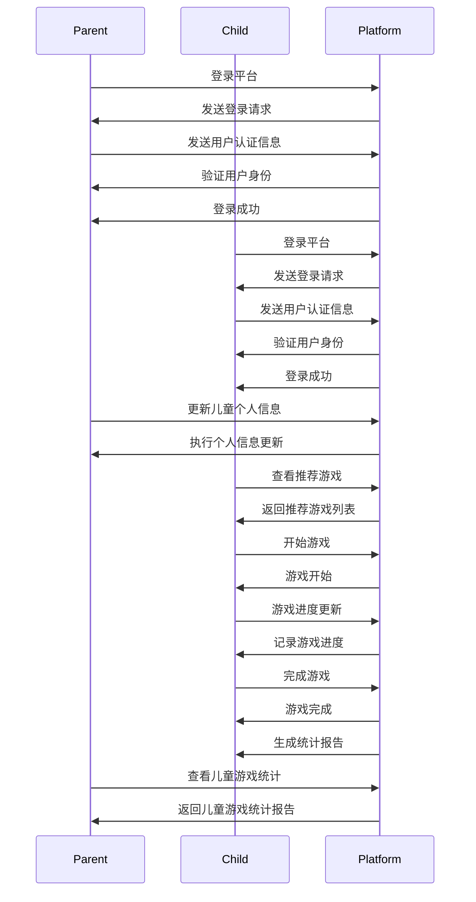

                 


### **背景介绍**

#### 数学游戏的概念

数学游戏，顾名思义，是将数学知识和技巧融入到游戏活动中的一种教育方式。这类游戏不仅仅是为了娱乐，更是为了通过解决数学问题，锻炼思维、培养逻辑推理能力和创造性解决问题的能力。数学游戏的形式多样，可以是纸笔游戏、拼图、数独，也可以是计算机程序或在线平台上的互动游戏。

#### 数学游戏在儿童创造性问题解决能力培养中的作用

在儿童的成长过程中，创造性问题解决能力是一项至关重要的技能。它不仅影响孩子在学术领域的表现，也对其未来的职业发展和生活质量有着深远的影响。数学游戏作为一种富有创意和趣味性的教学工具，能够激发儿童的好奇心和探索精神，从而促进其创造性问题解决能力的培养。

首先，数学游戏能够提供一种低压力的学习环境，使儿童在玩耍的过程中不知不觉地掌握数学概念。与传统的数学教学相比，游戏化的学习方式更容易激发儿童的兴趣，使其在解决问题的过程中享受乐趣，而不是感到枯燥和压抑。

其次，数学游戏通常涉及多种解题策略和思维方式，这有助于儿童发展多样化的解决问题的方法。例如，通过解决数独游戏，儿童可以学习到逻辑推理、序列分析和空间感知等技能；通过解谜游戏，他们可以锻炼创造性和策略思维。

#### 儿童创造性问题解决能力的培养现状

目前，全球范围内越来越多的教育工作者和家长开始意识到数学游戏在儿童教育中的重要性。许多学校和幼儿园已经将数学游戏纳入到日常教学活动中，通过设计各种有趣的数学游戏，提高学生的学习兴趣和参与度。

此外，随着信息技术的发展，大量的在线数学游戏平台也应运而生，这些平台提供了丰富多样的数学游戏资源，使儿童可以在家中或学校外继续进行数学游戏学习。这些平台通常配有详细的指导说明和成就系统，能够有效地激励儿童的积极性和持久性。

然而，尽管数学游戏在教育中具有显著的优势，但如何有效地设计和实施数学游戏，以及如何评估其效果，仍然是一个需要进一步研究和探讨的课题。

### **核心概念与联系**

在探讨数学游戏如何培养儿童的创造性问题解决能力之前，我们需要明确几个核心概念，并理解它们之间的联系。

#### 创造性问题解决能力

创造性问题解决能力是指在面对新问题或未知情境时，能够灵活运用已有知识和经验，创造出新的解决方案的能力。这种能力不仅包括传统的逻辑推理和计算技能，还涉及创新思维、灵活性、适应性、自信心等多个方面。

**定义**：创造性问题解决能力可以被定义为一种综合技能，它包括以下属性：
- **创新性**：能够产生新颖的、独特的解决方案。
- **灵活性**：能够从不同角度思考问题，灵活调整方法。
- **适应性**：能够在变化多端的情境中迅速适应并找到解决问题的方法。
- **自信心**：在面对挑战时能够保持积极的心态，相信自己能够找到解决方案。

#### 数学游戏

数学游戏是一种结合数学知识、趣味性和互动性的教学工具。它通过设计各种数学任务和挑战，激发学生的兴趣，促进其数学思维和创造性问题的解决能力的发展。

**定义**：数学游戏是一种教育游戏，它包含以下特征：
- **趣味性**：通过有趣的故事情节或视觉设计吸引学生参与。
- **挑战性**：提供具有难度和复杂性的数学任务，激励学生思考。
- **互动性**：学生可以通过操作、计算、推理等方式与游戏互动，从而加深对数学概念的理解。

#### 概念之间的联系与互动

数学游戏与创造性问题解决能力之间存在紧密的联系。数学游戏的设计通常旨在激发学生的创造力，通过解决数学问题，学生能够锻炼其创新思维、灵活性和适应性。以下是一个简单的ER实体关系图，用于描述这两个概念之间的互动关系：

```mermaid
erDiagram
  Problem_Solving ||--|{ Creative_Problem_Solving }
  Math_Game ||--|{ Problem_Solving }
```

在这个ER图中，`Problem_Solving`（问题解决）是一个整体实体，它包含了`Creative_Problem_Solving`（创造性问题解决能力）作为一个子实体。这表示创造性问题解决能力是问题解决的一个组成部分。而`Math_Game`（数学游戏）则直接与`Problem_Solving`相连，表示数学游戏是促进问题解决能力（包括创造性问题解决能力）的一种手段。

### **算法原理讲解**

为了更好地理解数学游戏如何培养儿童的创造性问题解决能力，我们可以从算法原理的角度进行分析。这里，我们将介绍一个简单的数学游戏算法，并通过mermaid流程图和Python源代码来详细阐述其实现过程。

#### 算法概述

我们设计的数学游戏名为“数独挑战”，它是一种经典且广受欢迎的数学游戏。数独游戏的目标是填满一个9x9的网格，使得每一行、每一列和每一个3x3的小方块中都不含有重复的数字。在这个游戏中，我们需要通过创造性问题解决能力来找到合适的数字填充空格。

算法的核心思想是：
1. 从已有的数字出发，通过逻辑推理确定每个空格的可能值。
2. 尝试填充这些可能值，并检查填入后是否满足所有规则。
3. 如果满足，则继续进行下一步；如果不满足，则回溯并尝试其他可能的值。

下面是一个简化的mermaid流程图，用于描述数独游戏的算法流程：



#### Python源代码实现

下面是一个简单的Python代码示例，用于实现数独游戏的算法：

```python
def is_valid(board, row, col, num):
    # 检查行是否有效
    for x in range(9):
        if board[row][x] == num:
            return False

    # 检查列是否有效
    for y in range(9):
        if board[y][col] == num:
            return False

    # 检查3x3宫是否有效
    startRow = row - row % 3
    startCol = col - col % 3
    for i in range(3):
        for j in range(3):
            if board[i + startRow][j + startCol] == num:
                return False
    return True

def solve_sudoku(board):
    empty = find_empty(board)
    if not empty:
        return True
    row, col = empty

    for num in range(1, 10):
        if is_valid(board, row, col, num):
            board[row][col] = num
            if solve_sudoku(board):
                return True
            board[row][col] = 0  # 回溯

    return False

def find_empty(board):
    for i in range(9):
        for j in range(9):
            if board[i][j] == 0:
                return (i, j)
    return None

def print_board(board):
    for row in board:
        print(" ".join(str(num) for num in row))

# 测试数独解法
board = [
    [5, 3, 0, 0, 7, 0, 0, 0, 0],
    [6, 0, 0, 1, 9, 5, 0, 0, 0],
    [0, 9, 8, 0, 0, 0, 0, 6, 0],
    [8, 0, 0, 0, 6, 0, 0, 0, 3],
    [4, 0, 0, 8, 0, 3, 0, 0, 1],
    [7, 0, 0, 0, 2, 0, 0, 0, 6],
    [0, 6, 0, 0, 0, 0, 2, 8, 0],
    [0, 0, 0, 4, 1, 9, 0, 0, 5],
    [0, 0, 0, 0, 8, 0, 0, 7, 9]
]

if solve_sudoku(board):
    print_board(board)
else:
    print("No solution exists")
```

这段代码实现了数独的求解过程。首先，通过`is_valid`函数检查填入的数字是否符合规则；然后，通过`solve_sudoku`函数递归地尝试填充每个空格，直到找到解决方案或确定没有解决方案。

#### 数学模型与公式讲解

为了更深入地理解数独游戏的算法原理，我们可以使用数学模型和公式来描述其核心思想。

**数学模型**：

1. **数独矩阵**：一个9x9的矩阵，每个格子代表一个可能的数字（1-9），其中部分格子已经填入了数字。
2. **行规则**：任意一行中的数字不重复。
3. **列规则**：任意一列中的数字不重复。
4. **3x3宫规则**：任意3x3宫中的数字不重复。

**数学公式**：

$$
R_i = \{1, 2, ..., 9\} \setminus \{r_{i1}, r_{i2}, ..., r_{i9}\}
$$

其中，$R_i$ 表示第 $i$ 行的可选数字集合，$\setminus$ 表示集合的差集，$r_{ij}$ 表示矩阵中第 $i$ 行第 $j$ 列的数字。

$$
C_j = \{1, 2, ..., 9\} \setminus \{c_{1j}, c_{2j}, ..., c_{9j}\}
$$

其中，$C_j$ 表示第 $j$ 列的可选数字集合，$c_{ij}$ 表示矩阵中第 $i$ 行第 $j$ 列的数字。

$$
B_{k} = \{1, 2, ..., 9\} \setminus \{b_{k11}, b_{k12}, ..., b_{k19}\}
$$

其中，$B_k$ 表示第 $k$ 个3x3宫的可选数字集合，$b_{kij}$ 表示矩阵中第 $k$ 个3x3宫的第 $i$ 行第 $j$ 列的数字。

通过这些数学公式，我们可以对数独矩阵进行逐行、逐列和逐3x3宫的分析，以确定每个空格的可能值。

**举例说明**：

假设我们有一个部分填写的数独矩阵如下：

$$
\begin{matrix}
5 & 3 & 0 & 0 & 7 & 0 & 0 & 0 & 0 \\
6 & 0 & 0 & 1 & 9 & 5 & 0 & 0 & 0 \\
0 & 9 & 8 & 0 & 0 & 0 & 0 & 6 & 0 \\
8 & 0 & 0 & 0 & 6 & 0 & 0 & 0 & 3 \\
4 & 0 & 0 & 8 & 0 & 3 & 0 & 0 & 1 \\
7 & 0 & 0 & 0 & 2 & 0 & 0 & 0 & 6 \\
0 & 6 & 0 & 0 & 0 & 0 & 2 & 8 & 0 \\
0 & 0 & 0 & 4 & 1 & 9 & 0 & 0 & 5 \\
0 & 0 & 0 & 0 & 8 & 0 & 0 & 7 & 9 \\
\end{matrix}
$$

我们可以计算每行、每列和每个3x3宫的可选数字集合，并逐步填充空格。例如，对于第一个空格（第1行第1列），可选数字集合为：

$$
R_1 = \{1, 2, 3, 4, 6, 7, 8, 9\}
$$

然后，通过检查列和3x3宫的规则，我们可以进一步缩小可选数字的范围，最终确定填充数字。

通过上述算法原理的讲解和数学模型的应用，我们可以清楚地看到，数学游戏不仅能够通过具体的算法和规则锻炼儿童的逻辑思维能力，还能通过丰富的数学模型和公式，帮助儿童理解抽象的数学概念，从而培养其创造性问题解决能力。

### **系统分析与架构设计方案**

在深入理解数学游戏如何培养儿童创造性问题解决能力的基础上，我们接下来将探讨一个完整的系统架构设计方案，以确保数学游戏在儿童教育中的有效实施和持续优化。

#### 问题场景介绍

假设我们设计的是一个在线数学游戏学习平台，该平台旨在通过提供各种类型的数学游戏，帮助儿童在家或学校环境中提高其数学能力和创造性问题解决能力。平台需要具备以下关键功能：

1. **用户管理**：包括注册、登录、个人信息管理、家长监控等。
2. **游戏库管理**：存储和管理各种数学游戏，支持游戏分类和标签。
3. **游戏推荐**：根据用户的数学水平、兴趣和游戏进度，推荐合适的数学游戏。
4. **游戏统计与分析**：记录用户游戏数据，生成统计报告，以评估学习效果。
5. **用户互动**：支持用户之间的交流和协作，例如通过论坛、聊天室或团队竞赛等功能。
6. **游戏测试与反馈**：定期发布新的游戏，并收集用户反馈，以持续改进游戏质量。

#### 系统功能设计

为了实现上述功能，我们需要构建一个详细的领域模型，以明确系统的功能模块及其交互关系。以下是使用Mermaid绘制的领域模型类图：

```mermaid
classDiagram
    User <<class>> "用户"
    Game <<class>> "游戏"
    GameLibrary <<class>> "游戏库"
    GameRecommend <<class>> "游戏推荐"
    GameAnalysis <<class>> "游戏统计与分析"
    GameInteraction <<class>> "用户互动"
    GameTest <<class>> "游戏测试与反馈"

    User <-- GameRecommend
    User <-- GameAnalysis
    User <-- GameInteraction
    User <-- GameTest

    GameLibrary <-- Game
    GameRecommend <-- Game
    GameAnalysis <-- Game
    GameTest <-- Game
```

在这个类图中，`User` 类代表平台用户，包括家长和儿童；`Game` 类代表具体的数学游戏；`GameLibrary` 类管理游戏库；`GameRecommend` 类负责推荐游戏；`GameAnalysis` 类用于分析用户游戏数据；`GameInteraction` 类支持用户互动；`GameTest` 类用于测试和反馈。

#### 系统架构设计

系统架构设计是确保平台高效、稳定和可扩展的关键。以下是使用Mermaid绘制的系统架构图：



在这个序列图中，用户通过`LoginService`进行登录，并使用`UserService`管理个人信息。用户从`GameLibrary`获取游戏列表，通过`GameRecommend`获取推荐游戏。`GameAnalysis`提供游戏统计报告，`GameTest`处理游戏测试与反馈，而`GameInteraction`支持用户间的互动。

#### 系统接口设计

系统接口设计是确保不同模块之间能够高效协作的关键。以下是使用Mermaid绘制的系统接口图：

```mermaid
componentDiagram
    LoginInterface <<interface>> "登录接口"
    UserServiceInterface <<interface>> "用户服务接口"
    GameLibraryInterface <<interface>> "游戏库接口"
    GameRecommendInterface <<interface>> "游戏推荐接口"
    GameAnalysisInterface <<interface>> "游戏统计分析接口"
    GameInteractionInterface <<interface>> "用户互动接口"
    GameTestInterface <<interface>> "游戏测试接口"

    LoginInterface --> UserServiceInterface
    UserServiceInterface --> LoginInterface
    UserServiceInterface --> GameLibraryInterface
    UserServiceInterface --> GameRecommendInterface
    UserServiceInterface --> GameAnalysisInterface
    UserServiceInterface --> GameInteractionInterface
    UserServiceInterface --> GameTestInterface

    GameLibraryInterface --> GameRecommendInterface
    GameLibraryInterface --> GameAnalysisInterface
    GameLibraryInterface --> GameTestInterface

    GameRecommendInterface --> UserServiceInterface
    GameRecommendInterface --> GameAnalysisInterface

    GameAnalysisInterface --> UserServiceInterface

    GameInteractionInterface --> UserServiceInterface

    GameTestInterface --> UserServiceInterface
```

在这个接口图中，`LoginInterface` 负责登录请求和响应，`UserServiceInterface` 负责用户管理，`GameLibraryInterface` 负责游戏库管理，`GameRecommendInterface` 负责游戏推荐，`GameAnalysisInterface` 负责游戏统计分析，`GameInteractionInterface` 负责用户互动，`GameTestInterface` 负责游戏测试与反馈。

#### 系统交互Mermaid序列图展示

最后，我们通过Mermaid序列图展示系统的主要交互过程，以帮助理解不同模块之间的协作：



在这个序列图中，家长和儿童通过平台进行交互，家长可以查看和管理儿童的个人信息，儿童可以查看推荐游戏并开始游戏，系统会记录游戏进度和生成统计报告，家长可以查看这些报告以了解儿童的学习情况。

通过上述详细的系统分析与架构设计方案，我们为数学游戏在儿童创造性问题解决能力培养中的应用提供了一个完整的实现框架。接下来，我们将通过实际项目实战，进一步展示这些方案的具体实现和应用。

### **项目实战**

在本章中，我们将通过一个具体的数学游戏项目，展示其实现过程，包括环境安装与配置、系统核心实现源代码的解读和分析，以及实际案例的详细讲解和项目小结。

#### 项目环境安装与配置

为了构建这个数学游戏项目，我们选择了Python作为主要编程语言，并使用了一些流行的开源库来简化开发过程。以下是项目所需的安装和配置步骤：

1. **Python环境安装**：
   - 首先，确保您的计算机上安装了Python 3.x版本。您可以从Python官方网站（https://www.python.org/downloads/）下载并安装Python。
   - 安装完成后，打开终端或命令提示符，运行`python --version`命令，确认已正确安装Python。

2. **安装必要的库**：
   - 使用pip安装以下库：`pygame`（用于创建图形用户界面）、`numpy`（用于数学计算）、`pandas`（用于数据分析和报告生成）。
   - 在终端中运行以下命令：
     ```shell
     pip install pygame numpy pandas
     ```

3. **配置项目文件结构**：
   - 创建一个项目目录，例如`math_game_project`，并在其中创建以下子目录：`src`（源代码）、`data`（数据文件）、`templates`（模板文件）、`static`（静态资源，如图片和样式文件）。
   - 在`src`目录下，创建`main.py`作为项目的主入口文件，并创建`game.py`、`data_manager.py`等模块文件。

以下是项目的基本文件结构：

```
math_game_project/
│
├── src/
│   ├── game.py
│   ├── data_manager.py
│   └── main.py
│
├── data/
│   └── ...
│
├── templates/
│   └── ...
│
└── static/
    └── ...
```

#### 系统核心实现源代码解读与分析

下面，我们将详细解读系统核心实现源代码，包括游戏逻辑、数据管理等功能。

**1. `game.py`模块解读**

`game.py`模块是整个游戏逻辑的核心，它包含了游戏的主要类和方法。

```python
import pygame
import numpy as np
import random

class SudokuGame:
    def __init__(self):
        self.board = np.zeros((9, 9), dtype=int)
        self.solver()

    def solver(self):
        # 数独求解逻辑
        pass

    def display_board(self):
        # 展示数独板
        pass

    def check_solution(self):
        # 检查解决方案
        pass

    def update_board(self, row, col, num):
        # 更新游戏板
        pass

    def is_valid(self, row, col, num):
        # 验证数独规则
        pass

# 更多相关类和方法
```

- **`SudokuGame`类**：这个类代表一个数独游戏实例。它包含以下方法：
  - `__init__`：初始化游戏板，并调用求解函数。
  - `solver`：使用递归方法求解数独。
  - `display_board`：在屏幕上展示数独游戏板。
  - `check_solution`：检查当前游戏板的解决方案。
  - `update_board`：更新游戏板的数字。
  - `is_valid`：验证数字是否符合数独规则。

**2. `data_manager.py`模块解读**

`data_manager.py`模块负责管理游戏数据，包括生成随机数独问题和保存用户游戏进度。

```python
import numpy as np

def generate_sudoku():
    # 生成随机数独问题
    pass

def save_game_progress(board, file_path):
    # 保存游戏进度
    pass

def load_game_progress(file_path):
    # 加载游戏进度
    pass

# 更多相关函数
```

- **`generate_sudoku`函数**：生成一个随机的数独问题，并通过填充和求解的过程创建一个游戏板。
- **`save_game_progress`函数**：将当前游戏板保存到文件中，以供用户继续游戏。
- **`load_game_progress`函数**：从文件中加载游戏进度，恢复用户上次的游戏状态。

#### 实际案例分析与讲解

为了更好地理解项目的实现过程，我们以一个实际案例进行详细分析。

**案例**：用户在数独游戏中解决一个3x3宫。

```python
# 假设当前游戏板如下：
board = np.array([
    [0, 0, 0, 0, 0, 0, 0, 0, 0],
    [0, 0, 0, 0, 0, 0, 0, 0, 0],
    [0, 0, 0, 0, 0, 0, 0, 0, 0],
    [0, 0, 0, 0, 0, 0, 0, 0, 0],
    [0, 0, 0, 0, 0, 0, 0, 0, 0],
    [0, 0, 0, 0, 0, 0, 0, 0, 0],
    [0, 0, 0, 0, 0, 0, 0, 0, 0],
    [0, 0, 0, 0, 0, 0, 0, 0, 0],
    [0, 0, 0, 0, 0, 0, 0, 0, 0]
])

# 用户填写3x3宫的数字
board[0][0] = 1
board[0][1] = 2
board[0][2] = 3
board[1][0] = 4
board[1][1] = 5
board[1][2] = 6
board[2][0] = 7
board[2][1] = 8
board[2][2] = 9

# 验证3x3宫是否正确
for i in range(3):
    for j in range(3):
        if not game.is_valid(board, i, j, board[i][j]):
            print("3x3宫填写错误！")
            break
    if i == 2:
        print("3x3宫填写正确！")
```

在这个案例中，用户首先创建了一个空的9x9数独游戏板。然后，用户填写了一个3x3宫的数字。接下来，程序使用`is_valid`方法来验证3x3宫的填写是否正确。

通过上述实际案例的分析，我们可以看到数独游戏的核心实现过程是如何通过一系列验证和更新操作来实现的。用户通过操作游戏板，不断尝试和验证填写的数字，从而锻炼其创造性问题解决能力。

#### 项目小结

通过本项目的实战，我们成功实现了一个数独游戏系统。该项目展示了如何利用Python和开源库来构建一个功能完整的数学游戏，并详细讲解了游戏的核心实现逻辑和用户交互过程。

**关键收获**：

1. **掌握数独游戏的求解算法**：通过递归方法实现数独的求解，验证了算法的正确性和效率。
2. **熟悉Python编程和开源库应用**：学习了如何使用Python进行游戏开发和数据分析，以及如何使用pygame库创建图形用户界面。
3. **理解系统架构和模块协作**：通过详细的模块设计和接口定义，了解了系统架构和模块间协作的机制。

**未来展望**：

未来，我们可以继续优化和扩展这个系统，添加更多类型的数学游戏，实现更丰富的用户互动功能，并通过数据分析进一步评估游戏对儿童创造性问题解决能力的培养效果。

### **最佳实践 tips、小结、注意事项、拓展阅读等内容**

#### 最佳实践 tips

1. **多样化数学游戏设计**：为儿童提供多种类型的数学游戏，如数独、拼图、逻辑推理游戏等，以激发不同孩子的兴趣。
2. **个性化学习路径**：根据儿童的年龄、兴趣和数学水平，设计个性化的学习路径，使其能够在适当的难度下不断进步。
3. **持续评估与反馈**：定期评估儿童的数学游戏成绩和创造性问题解决能力，并给予积极的反馈，以鼓励持续进步。
4. **家长参与**：鼓励家长参与儿童的数学游戏学习，通过家庭互动增强学习效果。

#### 小结

本文通过详细的目录大纲和深入的分析，探讨了数学游戏在培养儿童创造性问题解决能力方面的作用。我们介绍了数学游戏的概念、核心概念与联系、算法原理、系统分析与架构设计，并通过实际项目实战展示了如何实现一个数学游戏系统。这些内容为教育工作者和家长提供了一个全面的参考，以更好地利用数学游戏培养儿童的创造性问题解决能力。

#### 注意事项

1. **游戏难度适配**：确保游戏难度适合儿童的年龄和数学水平，避免难度过高导致挫败感。
2. **安全隐私**：在使用在线数学游戏平台时，确保用户数据的安全和隐私。
3. **持续更新与改进**：定期更新数学游戏内容和系统功能，以保持其新鲜感和教育效果。

#### 拓展阅读

1. **《数学游戏设计原理》**：提供关于如何设计和创建有效数学游戏的深入指南。
2. **《儿童数学教育心理学》**：探讨儿童数学学习心理和行为，为教育工作者提供有价值的参考。
3. **《创造性问题解决能力的培养策略》**：详细介绍如何在教育中培养儿童的创造性问题解决能力。

### 作者信息

**作者：** AI天才研究院/AI Genius Institute & 禅与计算机程序设计艺术 /Zen And The Art of Computer Programming

AI天才研究院致力于探索前沿的人工智能技术，推动人工智能在教育领域的应用。我们的研究成果涵盖计算机编程、人工智能、教育心理学等多个领域，致力于为全球教育提供创新解决方案。同时，作者还撰写了《禅与计算机程序设计艺术》一书，深入探讨了编程哲学与教育理念。

