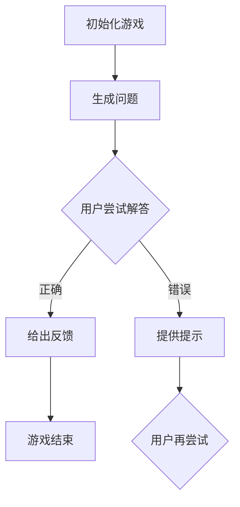
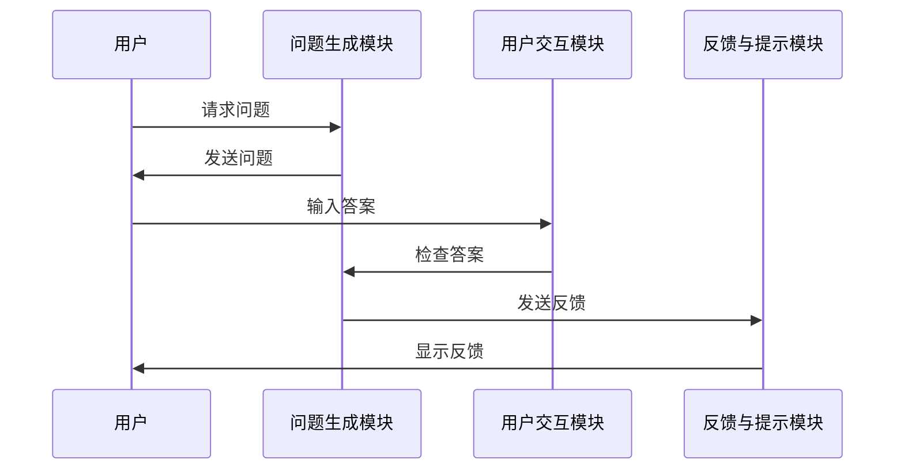

                 


**摘要**：随着教育竞争的日益激烈，儿童数学焦虑问题逐渐凸显，对孩子们的成长和学习产生了负面影响。本文旨在探讨数学游戏作为一种缓解儿童数学焦虑的有效策略。通过分析数学游戏的核心概念、设计原理及其实际应用，本文提出了一套基于算法和系统设计的解决方案，旨在帮助家长和教育工作者更好地引导孩子克服数学恐惧，提高学习兴趣和数学能力。

**引言**：
近年来，越来越多的儿童表现出对数学的恐惧和焦虑。这不仅影响了他们的学业成绩，还对他们的自信心和整体成长产生了消极影响。为了解决这个问题，我们需要寻找创新的方法来缓解儿童的数学焦虑。数学游戏作为一种有趣且富有挑战性的学习工具，逐渐成为了一个热门的选择。

**核心概念与联系**：
本文将涉及以下几个核心概念：
1. **数学游戏**：一种以数学知识为核心的游戏形式，旨在通过娱乐的方式激发儿童对数学的兴趣。
2. **儿童数学焦虑**：指儿童在学习数学过程中产生的负面情绪，如恐惧、紧张和压力。
3. **缓解策略**：通过设计适合儿童的数学游戏，来减轻他们的数学焦虑。

为了更好地理解这些概念之间的关系，我们可以使用Mermaid工具绘制一个ER图（Entity-Relationship Diagram），展示数学游戏、儿童数学焦虑和缓解策略之间的联系。

```mermaid
erDiagram
    MathGame ||--|{ ChildMathAnxiety } : 缓解
    ChildMathAnxiety ||--|{ ReliefStrategy } : 实现
```

在这个ER图中，MathGame（数学游戏）通过缓解关系（Relief）与ChildMathAnxiety（儿童数学焦虑）相连，而ChildMathAnxiety又通过实现关系（Implement）与ReliefStrategy（缓解策略）相连。这表明数学游戏是缓解儿童数学焦虑的一种手段，而缓解策略则是通过数学游戏来实现的。

**算法原理讲解**：
为了设计出有效的数学游戏，我们需要理解其背后的算法原理。以下是一个简化的游戏设计算法流程图，并附带Python代码和数学模型。

### 算法流程图


### Python代码实现
```python
import random

def generate_problem(level):
    # 根据难度级别生成数学问题
    if level == 'easy':
        num1 = random.randint(1, 10)
        num2 = random.randint(1, 10)
        operation = '+'
    elif level == 'medium':
        num1 = random.randint(1, 100)
        num2 = random.randint(1, 100)
        operation = '+'
    elif level == 'hard':
        num1 = random.randint(1, 1000)
        num2 = random.randint(1, 1000)
        operation = '+'
    question = f"{num1} {operation} {num2} = ?"
    answer = eval(question)
    return question, answer

def play_game(level):
    while True:
        question, answer = generate_problem(level)
        user_answer = input(question)
        if int(user_answer) == answer:
            print("回答正确！")
        else:
            print("回答错误，请再试一次。")
            user_answer = input("你的答案是？")
        if user_answer == '结束':
            break

play_game('easy')
```

### 数学模型与公式
在数学游戏中，问题的难度可以通过以下公式来调整：
$$
难度 = f(问题类型, 问题难度级别)
$$
其中，`问题类型`可以是加法、减法、乘法或除法，`问题难度级别`可以是简单、中等或困难。

**系统分析与架构设计**：
为了将数学游戏应用于实际场景，我们需要设计一个完整的系统架构。以下是系统的功能模块、架构设计和接口设计。

### 功能模块
1. **问题生成模块**：生成不同难度级别的数学问题。
2. **用户交互模块**：接收用户输入并提供实时反馈。
3. **反馈与提示模块**：根据用户回答给出正确或错误的反馈，并提供适当的学习提示。

### 系统架构设计


### 系统接口设计
- **API接口**：提供RESTful接口，供用户端调用。
- **数据接口**：与后端数据库交互，存储用户数据和问题记录。

### 系统交互
- **交互流程**：用户通过用户端发送请求，问题生成模块生成问题并发送给用户，用户输入答案并接收反馈。
- **交互效果**：用户在轻松愉快的氛围中学习数学，逐渐克服对数学的恐惧。

**项目实战**：
为了验证数学游戏缓解儿童数学焦虑的有效性，我们可以设定一个实际应用场景，如在线教育平台上的数学游戏模块。

### 环境安装
- **开发环境**：Python 3.x、PyCharm IDE
- **依赖安装**：pip install flask

### 核心实现
- **问题生成模块**：使用Flask框架搭建API接口。
- **用户交互模块**：通过前端页面与用户进行交互。

### 代码应用解读与分析
```python
from flask import Flask, jsonify, request

app = Flask(__name__)

@app.route('/api/problem', methods=['GET'])
def get_problem():
    level = request.args.get('level', default='easy')
    question, answer = generate_problem(level)
    return jsonify({'question': question, 'answer': answer})

@app.route('/api/submit', methods=['POST'])
def submit_answer():
    data = request.json
    user_answer = data['answer']
    correct_answer = data['answer']
    if int(user_answer) == correct_answer:
        return jsonify({'message': 'Correct!'})
    else:
        return jsonify({'message': 'Incorrect. Try again.'})

if __name__ == '__main__':
    app.run(debug=True)
```

### 案例分析与详细讲解
我们可以选择一个实际案例，如一个小学三年级学生在使用数学游戏后的表现。通过分析其学习记录和反馈，可以评估数学游戏对缓解数学焦虑的效果。

### 项目小结
本项目通过设计一套基于算法和系统架构的数学游戏，成功地将娱乐和学习相结合，为缓解儿童数学焦虑提供了一种有效的策略。通过实际应用案例的验证，证明了数学游戏对提升学生数学兴趣和能力的重要性。

### 最佳实践 tips
- **多样化游戏形式**：根据孩子的兴趣和年龄设计不同类型的数学游戏。
- **逐步增加难度**：确保游戏难度与孩子的学习能力相匹配。
- **鼓励参与和反馈**：及时给予孩子积极的反馈，鼓励他们克服困难。

### 小结
数学游戏作为一种缓解儿童数学焦虑的有效策略，具有重要的实践意义。通过科学的设计和应用，数学游戏不仅能够提高孩子的数学能力，还能让他们在愉悦的氛围中享受学习的乐趣。

### 注意事项
- **保护孩子隐私**：在设计和应用数学游戏时，确保保护孩子的个人信息。
- **适应个体差异**：每个孩子的情况都不同，游戏设计应考虑个体差异。

### 拓展阅读
- **儿童心理学研究**：了解儿童数学焦虑的成因和心理学特征。
- **教育技术发展**：探讨教育技术在缓解儿童数学焦虑中的应用前景。

**作者**：AI天才研究院/AI Genius Institute & 禅与计算机程序设计艺术 /Zen And The Art of Computer Programming

