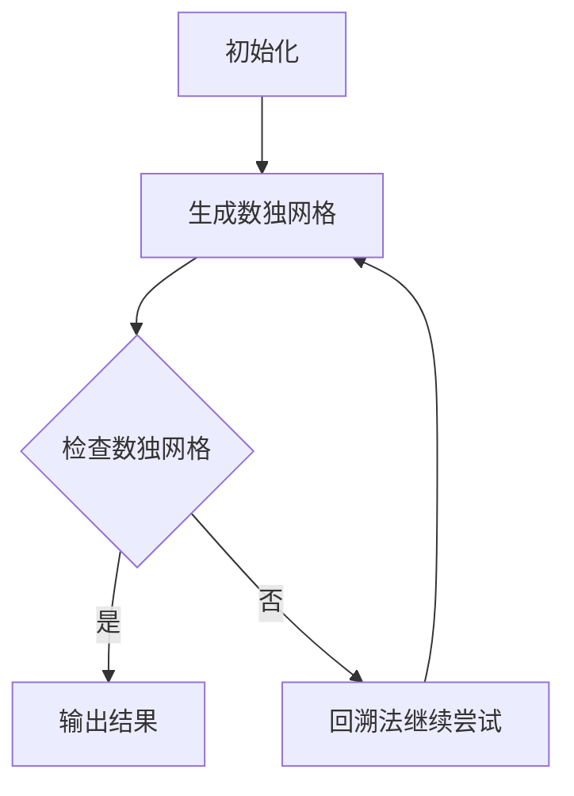
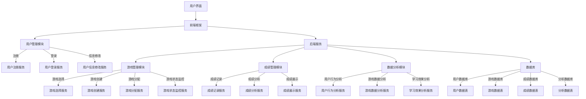
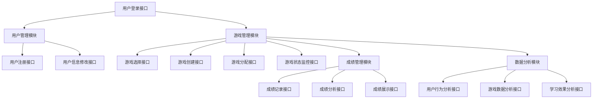
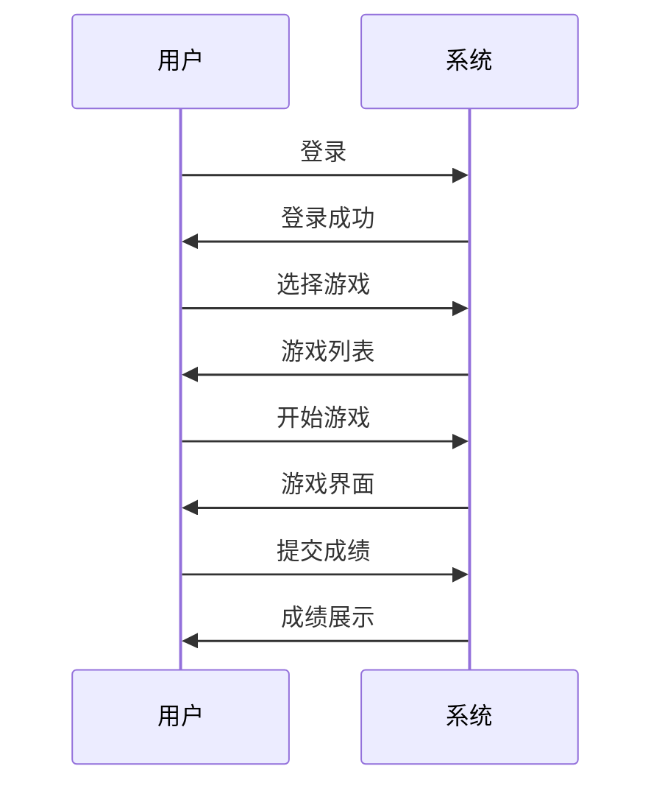

                 

### 数学游戏与儿童早期教育的关系

在现代社会，教育领域越来越注重儿童的早期发展，特别是在智力开发和思维能力培养方面。数学作为基础学科之一，在儿童早期教育中占据着重要地位。而数学游戏，作为一种独特的教育方式，正日益受到关注。本文将探讨数学游戏与儿童早期教育之间的关系，深入分析数学游戏在促进儿童数学思维发展中的作用，以及如何在实践中有效地应用数学游戏。

**关键词：**
- 数学游戏
- 儿童早期教育
- 数学思维
- 教育方式
- 游戏设计

**摘要：**
本文首先介绍了儿童早期教育的重要性以及数学游戏的概念和作用。接着，探讨了数学游戏与数学教育的联系，分析了数学游戏的核心特点和设计原则。随后，通过具体的算法原理讲解和数学模型应用，展示了数学游戏在实践中的有效性和科学性。最后，本文提出了数学游戏系统分析与架构设计方案，并结合项目实战，提供了实际操作和案例分析，总结了数学游戏在儿童早期教育中的应用价值和发展前景。

### 第1章 问题背景

#### 1.1 儿童早期教育的重要性

儿童早期教育，通常指从出生到6岁这一阶段的教育，这一时期被认为是孩子身心发展最为关键的时期。儿童在这一阶段的发展不仅受到生物学因素的影响，还受到社会、文化和教育等多种因素的影响。良好的早期教育可以为孩子的一生奠定坚实的基础。

**核心概念术语说明：**
- **儿童早期教育**：指从出生到6岁这一阶段的教育。
- **身心发展**：包括智力、情感、行为和社交能力等多个方面的全面发展。

**问题背景：**
在当今社会，随着科技的发展和经济的繁荣，家长和社会对儿童早期教育的重视程度日益提高。然而，传统的教育模式往往侧重于知识传授，忽视了儿童个性发展和综合素质的培养。因此，探索新的教育方式，特别是能够激发儿童兴趣和潜能的教育模式，成为教育研究的重要课题。

**问题描述：**
如何通过有效的教育方式，特别是数学游戏，促进儿童早期数学思维的发展？

**问题解决：**
数学游戏作为一种创新的教育模式，通过趣味性、互动性和挑战性等特点，能够有效地激发儿童的数学兴趣，培养他们的数学思维能力。数学游戏不仅能够使儿童在愉快的氛围中学习数学知识，还能培养他们的逻辑推理能力、空间感知能力和问题解决能力。

**边界与外延：**
- **边界**：数学游戏仅限于数学知识和技能的培养。
- **外延**：数学游戏的应用范围不仅限于课堂教学，还可以延伸到家庭、社区和在线平台等多方面。

**概念结构与核心要素组成：**
- **概念结构**：数学游戏、儿童早期教育、数学思维。
- **核心要素**：趣味性、互动性、挑战性、数学知识和技能。

**相关研究和文献：**
- **研究**：许多研究表明，早期数学教育对于儿童的智力发展具有重要影响。数学游戏作为一种新的教育模式，也得到了越来越多的关注和探讨。
- **文献**：相关文献包括《早期数学教育的重要性》、《数学游戏的实践与研究》等。

#### 1.2 数学游戏的作用

数学游戏，是指以数学知识和技能为核心的趣味性活动。这种活动通过游戏的形式，使儿童在轻松愉快的氛围中学习和掌握数学知识。数学游戏不仅能够提高儿童的数学兴趣，还能培养他们的数学思维能力。

**核心概念术语说明：**
- **数学游戏**：以数学知识和技能为核心的趣味性活动。
- **趣味性**：使数学学习变得有趣和吸引人。
- **互动性**：通过与其他人互动，培养社交能力。
- **挑战性**：游戏具有一定的难度和挑战，激发思维。

**问题背景：**
在传统的数学教育中，许多孩子对数学感到厌烦和困惑。数学游戏的出现，为解决这一问题提供了一种新的途径。通过将数学知识融入游戏中，儿童可以在游戏中学习，从而提高数学成绩和思维能力。

**问题描述：**
数学游戏在儿童数学教育中具体有哪些作用和优势？

**问题解决：**
数学游戏具有以下几个方面的作用和优势：

1. **激发数学兴趣**：通过趣味性和互动性，数学游戏能够吸引儿童的注意力，使他们对数学产生兴趣。
2. **培养数学思维**：数学游戏中的问题解决和逻辑推理环节，能够有效地培养儿童的数学思维能力。
3. **提高学习效率**：数学游戏能够在轻松的氛围中提高儿童的学习效率，使他们在游戏中不知不觉地掌握数学知识。
4. **增强团队合作**：许多数学游戏需要多人合作完成，这有助于培养儿童的团队合作精神和社交能力。

**边界与外延：**
- **边界**：数学游戏仅限于数学知识和技能的培养。
- **外延**：数学游戏的应用范围不仅限于课堂教学，还可以延伸到家庭、社区和在线平台等多方面。

**概念结构与核心要素组成：**
- **概念结构**：数学游戏、数学知识、数学思维、趣味性、互动性、挑战性。
- **核心要素**：数学知识、游戏形式、教育目标。

**相关研究和文献：**
- **研究**：研究表明，数学游戏能够显著提高儿童的数学成绩和思维能力。
- **文献**：《数学游戏在儿童教育中的应用》、《趣味数学游戏的设计与实施》等。

#### 1.3 数学游戏与儿童早期教育的关系

数学游戏作为儿童早期教育的一种方式，能够有效促进儿童数学思维的发展。通过数学游戏，儿童不仅能够在轻松愉快的氛围中学习数学知识，还能培养他们的数学思维能力、逻辑推理能力、空间感知能力以及问题解决能力。

**核心概念术语说明：**
- **数学思维**：指儿童在数学学习过程中所形成的思维方式和思考能力。
- **逻辑推理能力**：指儿童在解决问题时运用逻辑思维进行推理的能力。
- **空间感知能力**：指儿童对空间物体位置和形状的感知能力。
- **问题解决能力**：指儿童在遇到问题时，运用已有知识和经验解决问题的能力。

**问题背景：**
儿童早期教育阶段是大脑发育和认知能力发展最快的时期，这个阶段的教育质量对儿童的未来发展具有深远的影响。数学作为基础学科之一，在儿童早期教育中占据着重要的地位。而数学游戏作为一种创新的教育方式，正逐渐被广大教育者和家长接受。

**问题描述：**
数学游戏与儿童早期教育之间存在怎样的关系？数学游戏如何促进儿童数学思维的发展？

**问题解决：**
数学游戏与儿童早期教育之间存在以下几方面的关系：

1. **促进数学思维发展**：数学游戏通过趣味性、互动性和挑战性，激发儿童的数学兴趣，培养他们的数学思维能力。
2. **提高学习效果**：数学游戏能够在轻松的氛围中提高儿童的学习效率，使他们在不知不觉中掌握数学知识。
3. **培养综合素质**：数学游戏不仅能够提高儿童的数学成绩，还能培养他们的逻辑推理能力、空间感知能力、团队合作精神等综合素质。

**边界与外延：**
- **边界**：数学游戏仅限于数学知识和技能的培养。
- **外延**：数学游戏的应用范围不仅限于课堂教学，还可以延伸到家庭、社区和在线平台等多方面。

**概念结构与核心要素组成：**
- **概念结构**：数学游戏、儿童早期教育、数学思维、学习效果、综合素质。
- **核心要素**：数学知识、游戏形式、教育目标。

**相关研究和文献：**
- **研究**：研究表明，数学游戏能够显著提高儿童的数学成绩和思维能力。
- **文献**：《数学游戏与儿童早期教育的关系研究》、《数学游戏在教学中的应用案例分析》等。

#### 1.4 数学游戏在儿童早期教育中的应用

数学游戏在儿童早期教育中的应用非常广泛，包括课堂教学、家庭教育和社区活动等多个方面。以下介绍几种常见的数学游戏及其在儿童早期教育中的应用。

**核心概念术语说明：**
- **课堂教学**：指在学校环境中进行的正式教育。
- **家庭教育**：指在家庭环境中进行的家庭教育活动。
- **社区活动**：指在社区中组织的教育活动。

**问题背景：**
随着教育技术的不断发展，数学游戏在儿童早期教育中的应用越来越广泛。各种数学游戏软件和在线平台的出现，使得数学游戏不仅可以在课堂上进行，还可以在家中或社区中开展。

**问题描述：**
数学游戏在儿童早期教育中具体有哪些应用形式和实例？

**问题解决：**
数学游戏在儿童早期教育中的应用形式多样，以下是几种常见的数学游戏及其应用实例：

1. **数独游戏**：
   - **应用场景**：在课堂上，教师可以组织学生进行数独游戏，通过填写数字来满足特定的规则。
   - **教育目标**：培养逻辑推理能力和问题解决能力。

2. **拼图游戏**：
   - **应用场景**：在家中，家长可以与孩子一起进行拼图游戏，通过拼图来学习数学知识。
   - **教育目标**：培养空间感知能力和注意力。

3. **华容道游戏**：
   - **应用场景**：在社区活动中，可以组织孩子们进行华容道游戏，通过移动方块来达到目标。
   - **教育目标**：培养空间思维能力和解决问题的能力。

4. **数学故事游戏**：
   - **应用场景**：通过编写有趣的数学故事，让孩子在故事中学习数学知识。
   - **教育目标**：培养数学兴趣和阅读能力。

**边界与外延：**
- **边界**：数学游戏仅限于数学知识和技能的培养。
- **外延**：数学游戏的应用范围不仅限于课堂教学，还可以延伸到家庭、社区和在线平台等多方面。

**概念结构与核心要素组成：**
- **概念结构**：数学游戏、儿童早期教育、应用形式、教育目标。
- **核心要素**：数学知识、游戏形式、教育目标。

**相关研究和文献：**
- **研究**：研究表明，数学游戏能够显著提高儿童的数学成绩和思维能力。
- **文献**：《数学游戏在教学中的应用案例分析》、《数学游戏的设计与实施策略》等。

### 第2章 核心概念与联系

#### 2.1 数学游戏的概念

数学游戏是一种以数学知识和技能为核心的趣味性活动。通过游戏的形式，数学游戏能够将抽象的数学概念和逻辑思维具体化，使儿童在轻松愉快的氛围中学习数学知识。数学游戏不仅包括传统的数独、拼图等游戏，还包括各种创新的数学游戏软件和在线平台。

**核心概念术语说明：**
- **数学游戏**：以数学知识和技能为核心的趣味性活动。
- **趣味性**：通过游戏形式使数学学习变得有趣和吸引人。
- **数学知识和技能**：包括计算、逻辑推理、空间感知等内容。

**问题背景：**
在传统的数学教育中，儿童往往对枯燥的数学公式和抽象的数学概念感到厌烦。数学游戏的出现，为解决这一问题提供了一种新的途径。通过将数学知识融入游戏中，儿童可以在游戏中学习，从而提高数学成绩和思维能力。

**问题描述：**
数学游戏的核心概念是什么？数学游戏有哪些特点？

**问题解决：**
数学游戏的核心概念是将数学知识和技能通过游戏的形式进行传授。数学游戏具有以下几个特点：

1. **趣味性**：数学游戏以趣味性为特点，能够吸引儿童的注意力，使他们对数学产生兴趣。
2. **互动性**：数学游戏通常需要儿童与其他人互动，有助于培养社交能力。
3. **挑战性**：数学游戏具有一定的挑战性，能够激发儿童的思维，培养他们的解决问题的能力。
4. **多样性**：数学游戏形式多样，包括数独、拼图、华容道等多种类型，能够满足不同年龄段和不同能力水平儿童的需求。

**边界与外延：**
- **边界**：数学游戏仅限于数学知识和技能的培养。
- **外延**：数学游戏的应用范围不仅限于课堂教学，还可以延伸到家庭、社区和在线平台等多方面。

**概念结构与核心要素组成：**
- **概念结构**：数学游戏、数学知识和技能、趣味性、互动性、挑战性。
- **核心要素**：数学知识、游戏形式、教育目标。

**相关研究和文献：**
- **研究**：研究表明，数学游戏能够显著提高儿童的数学成绩和思维能力。
- **文献**：《数学游戏的设计与实施策略》、《数学游戏的实践与研究》等。

#### 2.2 数学游戏的核心特点

数学游戏的核心特点主要体现在趣味性、互动性和挑战性三个方面。这些特点不仅使得数学游戏在儿童中具有很高的吸引力，还能够有效地促进儿童数学思维的发展。

**核心概念术语说明：**
- **趣味性**：通过游戏形式使数学学习变得有趣和吸引人。
- **互动性**：数学游戏需要儿童与其他人互动，有助于培养社交能力。
- **挑战性**：数学游戏具有一定的难度和挑战，能够激发思维。

**问题背景：**
传统的数学教育模式往往过于枯燥，难以激发儿童的兴趣。数学游戏的出现，为改变这一现状提供了新的途径。通过将数学知识融入游戏中，儿童可以在愉快的氛围中学习，从而提高数学成绩和思维能力。

**问题描述：**
数学游戏有哪些核心特点？这些特点如何促进儿童数学思维的发展？

**问题解决：**
数学游戏的核心特点如下：

1. **趣味性**：数学游戏通过游戏的形式，将数学知识变得有趣和吸引人，使儿童在愉快的氛围中学习。趣味性能够吸引儿童的注意力，使他们对数学产生兴趣。
2. **互动性**：数学游戏通常需要儿童与其他人互动，这有助于培养儿童的社交能力。在互动中，儿童可以学习如何沟通、合作和解决问题，从而提高他们的社交技能。
3. **挑战性**：数学游戏具有一定的难度和挑战，这能够激发儿童的思维，培养他们的解决问题的能力。通过解决难题，儿童能够获得成就感和自信心，从而提高学习兴趣。

**边界与外延：**
- **边界**：数学游戏的核心特点主要涉及趣味性、互动性和挑战性。
- **外延**：这些特点不仅适用于数学游戏，还可以应用于其他类型的游戏和教育活动中。

**概念结构与核心要素组成：**
- **概念结构**：数学游戏、趣味性、互动性、挑战性、数学思维。
- **核心要素**：趣味性、互动性、挑战性、教育目标。

**相关研究和文献：**
- **研究**：研究表明，趣味性、互动性和挑战性是数学游戏促进儿童数学思维发展的重要因素。
- **文献**：《数学游戏在儿童教育中的应用》、《趣味数学游戏的设计与实施》等。

#### 2.3 数学游戏与数学教育的联系

数学游戏与数学教育在目标上具有一致性，都是培养儿童的数学思维能力。然而，数学游戏与数学教育在实施方式和教育效果上有所不同。

**核心概念术语说明：**
- **数学教育**：指通过课堂教学、课外辅导等方式，传授数学知识和技能。
- **数学思维能力**：指儿童在数学学习过程中形成的逻辑推理、空间感知和问题解决能力。

**问题背景：**
传统的数学教育模式往往侧重于知识传授，忽视了儿童兴趣和潜能的培养。数学游戏的出现，为改变这一现状提供了新的途径。通过将数学知识融入游戏中，儿童可以在愉快的氛围中学习，从而提高数学成绩和思维能力。

**问题描述：**
数学游戏与数学教育之间存在怎样的联系？数学游戏如何作为一种数学教育的辅助手段？

**问题解决：**
数学游戏与数学教育的联系主要体现在以下几个方面：

1. **教育目标的一致性**：数学游戏和数学教育在目标上具有一致性，都是培养儿童的数学思维能力。然而，数学游戏更加注重趣味性和互动性，能够激发儿童的兴趣和潜能。
2. **教育方式的差异**：数学游戏通过游戏的形式，使儿童在愉快的氛围中学习。这种方式不仅能够提高学生的学习效率，还能培养他们的团队合作精神和解决问题的能力。
3. **教育效果的互补**：数学游戏作为一种辅助手段，可以弥补传统数学教育在培养儿童数学思维能力方面的不足。通过数学游戏，儿童可以在实践中学习数学知识，从而提高数学成绩和思维能力。

**边界与外延：**
- **边界**：数学游戏与数学教育的联系主要涉及教育目标、教育方式和教育效果。
- **外延**：这种联系不仅适用于数学教育，还可以应用于其他学科和领域。

**概念结构与核心要素组成：**
- **概念结构**：数学游戏、数学教育、数学思维能力、教育目标、教育方式、教育效果。
- **核心要素**：数学知识、游戏形式、教育目标、教育方式、教育效果。

**相关研究和文献：**
- **研究**：研究表明，数学游戏能够显著提高儿童的数学成绩和思维能力。
- **文献**：《数学游戏在儿童教育中的应用》、《数学教育与数学游戏的关系研究》等。

### 第3章 算法原理讲解

#### 3.1 数学游戏设计的基本原则

设计数学游戏时，应遵循以下基本原则，以确保游戏既能具有教育意义，又能吸引儿童参与。

**核心概念术语说明：**
- **寓教于乐**：指在游戏设计中将教育内容融入游戏过程中。
- **循序渐进**：指游戏难度应逐步增加，适应儿童的学习进度。

**问题背景：**
数学游戏的设计直接影响到儿童的学习体验和效果。为了使数学游戏真正起到教育作用，设计时应充分考虑儿童的心理特点和认知规律。

**问题描述：**
设计数学游戏时需要遵循哪些基本原则？

**问题解决：**
设计数学游戏时，应遵循以下基本原则：

1. **寓教于乐**：游戏设计应注重趣味性，使儿童在玩的过程中不知不觉地学习数学知识。例如，通过设计有趣的动画效果、引人入胜的故事情节等，提高游戏的可玩性。
2. **循序渐进**：游戏难度应逐步增加，以适应不同年龄段和不同能力水平的儿童。例如，可以从简单的数学问题开始，逐步引入更复杂的逻辑推理和空间感知任务。
3. **互动性**：游戏设计应鼓励儿童与其他人互动，培养他们的团队合作精神和社交能力。例如，可以设计多人合作完成任务的游戏模式。
4. **挑战性**：游戏应具有一定的挑战性，激发儿童的思维和解决问题的能力。例如，可以设置一些需要多次尝试和思考才能解决的问题。

**边界与外延：**
- **边界**：寓教于乐、循序渐进、互动性、挑战性。
- **外延**：这些原则不仅适用于数学游戏，还可以应用于其他类型的游戏和教育活动中。

**概念结构与核心要素组成：**
- **概念结构**：数学游戏设计、寓教于乐、循序渐进、互动性、挑战性。
- **核心要素**：趣味性、教育目标、游戏难度、互动性、挑战性。

**相关研究和文献：**
- **研究**：研究表明，遵循这些原则设计的数学游戏能够显著提高儿童的数学成绩和思维能力。
- **文献**：《趣味性在数学游戏设计中的应用》、《数学游戏的设计原则与实践》等。

#### 3.2 常见的数学游戏算法

在数学游戏中，算法的设计和实现至关重要。以下介绍几种常见的数学游戏算法及其基本原理。

**核心概念术语说明：**
- **数独**：一种逻辑推理游戏，通过填写数字来满足特定的规则。
- **华容道**：一种拼图游戏，通过移动方块来达到目标。

**问题背景：**
数学游戏算法的实现能够提高游戏的趣味性和挑战性，使儿童在解决问题的过程中锻炼逻辑思维和问题解决能力。

**问题描述：**
常见的数学游戏有哪些算法？这些算法的基本原理是什么？

**问题解决：**
以下是几种常见的数学游戏算法及其基本原理：

1. **数独算法**：
   - **基本原理**：数独是一种9x9的网格，其中已填充了一些数字。玩家需要填写剩余的空格，使得每行、每列和每个3x3子网格中都包含1到9的数字。数独的算法主要涉及逻辑推理和回溯法。
   - **实现方式**：可以使用递归和回溯算法来求解数独。具体实现如下（Python代码）：

     ```python
     def is_valid(board, row, col, num):
         # 检查行是否有效
         for x in range(9):
             if board[row][x] == num:
                 return False
         
         # 检查列是否有效
         for x in range(9):
             if board[x][col] == num:
                 return False
         
         # 检查3x3子网格是否有效
         start_row, start_col = 3 * (row // 3), 3 * (col // 3)
         for i in range(3):
             for j in range(3):
                 if board[i + start_row][j + start_col] == num:
                     return False
         
         return True

     def solve_sudoku(board):
         empty = find_empty(board)
         if not empty:
             return True
         row, col = empty
         
         for num in range(1, 10):
             if is_valid(board, row, col, num):
                 board[row][col] = num
                 if solve_sudoku(board):
                     return True
                 board[row][col] = 0  # 回溯
         
         return False

     def find_empty(board):
         for i in range(9):
             for j in range(9):
                 if board[i][j] == 0:
                     return (i, j)
         return None
     ```

2. **华容道算法**：
   - **基本原理**：华容道是一种拼图游戏，通过移动方块来达到目标。游戏的目标是将目标方块移动到特定的位置，而其他方块则需在移动过程中保持相对位置不变。
   - **实现方式**：可以使用广度优先搜索（BFS）算法来求解华容道。具体实现如下（Python代码）：

     ```python
     from collections import deque

     def is_valid_move(board, row, col, target_row, target_col):
         # 检查移动是否合法
         return 0 <= row < 3 and 0 <= col < 3 and 0 <= target_row < 3 and 0 <= target_col < 3

     def move(board, row, col, target_row, target_col):
         # 移动方块
         board[target_row][target_col] = board[row][col]
         board[row][col] = 0

     def solve_huarongdao(board):
         queue = deque([(board, 0)])  # 使用广度优先搜索
         while queue:
             state, step = queue.popleft()
             if is_solution(state):
                 return step
             for row in range(3):
                 for col in range(3):
                     if state[row][col] == 1:
                         for target_row in range(3):
                             for target_col in range(3):
                                 if is_valid_move(state, row, col, target_row, target_col):
                                     new_state = [row[:] for row in state]
                                     move(new_state, row, col, target_row, target_col)
                                     if solve_huarongdao(new_state):
                                         return step + 1
                                     move(new_state, target_row, target_col, row, col)
         return -1

     def is_solution(board):
         # 检查是否达到目标状态
         return board[1][1] == 1 and board[2][2] == 1

     board = [
         [0, 0, 1],
         [1, 0, 0],
         [0, 1, 0],
     ]
     print(solve_huarongdao(board))
     ```

**边界与外延：**
- **边界**：数独算法和华容道算法。
- **外延**：这些算法不仅适用于数学游戏，还可以应用于其他类型的拼图和逻辑推理游戏中。

**概念结构与核心要素组成：**
- **概念结构**：数独算法、华容道算法、基本原理、实现方式。
- **核心要素**：逻辑推理、回溯法、广度优先搜索、游戏设计。

**相关研究和文献：**
- **研究**：研究表明，这些算法能够显著提高数学游戏的趣味性和挑战性。
- **文献**：《数学游戏算法的设计与实现》、《基于算法的数学游戏开发实践》等。

#### 3.3 数学游戏算法的mermaid流程图

**mermaid** 是一种方便绘制造流程图、类图、时序图等的Markdown扩展。以下使用mermaid绘制了数独游戏的算法流程图。

**核心概念术语说明：**
- **mermaid**：一种Markdown扩展，用于绘制各种图表。
- **流程图**：用于表示算法步骤和流程的图。

**问题背景：**
流程图可以帮助我们更直观地理解算法的实现过程，从而更好地进行编程和调试。

**问题描述：**
如何使用mermaid绘制数独游戏的算法流程图？

**问题解决：**
以下是数独游戏算法的mermaid流程图：



**详细解释：**
- **A[初始化]**：表示初始化阶段，生成一个空数独网格。
- **B[生成数独网格]**：表示生成数独网格的步骤。
- **C[检查数独网格]**：表示检查数独网格是否满足特定规则。
- **D[输出结果]**：表示输出数独的最终结果。
- **E[回溯法继续尝试]**：表示使用回溯法继续尝试解决数独问题。

**边界与外延：**
- **边界**：数独游戏的算法流程图。
- **外延**：mermaid流程图的应用范围不仅限于数学游戏，还可以应用于其他算法和程序的流程表示。

**概念结构与核心要素组成：**
- **概念结构**：mermaid、流程图、数独算法。
- **核心要素**：初始化、生成网格、检查网格、输出结果、回溯法。

**相关研究和文献：**
- **研究**：研究表明，使用mermaid流程图能够更清晰地表示算法流程，有助于理解和实现。
- **文献**：《mermaid流程图的使用与教程》、《基于mermaid的算法流程图设计》等。

### 第4章 数学模型和数学公式

数学模型是数学与实际应用之间的重要桥梁，它能够将复杂的现实问题转化为简洁的数学表达式，从而为问题的求解提供理论基础。在数学游戏中，数学模型的应用尤为重要，它不仅能够使游戏更具挑战性和趣味性，还能够有效地帮助儿童理解和掌握数学知识。

#### 4.1 数独游戏中的数学模型

数独是一种逻辑推理游戏，其核心在于通过填写数字来满足特定的规则。数独的数学模型主要包括以下几个方面：

1. **数独网格**：数独游戏通常在一个9x9的网格中进行，其中部分格子已经填有数字，玩家需要填写剩余的空格。每行、每列以及每个3x3子网格中都必须包含1到9的数字，且每个数字在每个子网格中只能出现一次。

2. **数字填充规则**：玩家在填写数字时，需要遵循以下规则：
   - **行规则**：每一行中必须包含1到9的数字，且每个数字只能出现一次。
   - **列规则**：每一列中必须包含1到9的数字，且每个数字只能出现一次。
   - **子网格规则**：每个3x3子网格中必须包含1到9的数字，且每个数字只能出现一次。

3. **回溯法**：当玩家在填写数字时，如果某个位置无法找到合适的数字，则需要回溯到上一个步骤，尝试其他可能性。回溯法是一种有效的求解策略，它通过不断尝试和回溯，最终找到满足所有规则的解。

**核心概念术语说明：**
- **数独网格**：用于表示数独游戏的9x9矩阵。
- **行规则**：每一行中必须包含1到9的数字，且每个数字只能出现一次。
- **列规则**：每一列中必须包含1到9的数字，且每个数字只能出现一次。
- **子网格规则**：每个3x3子网格中必须包含1到9的数字，且每个数字只能出现一次。
- **回溯法**：通过尝试和回溯来寻找满足所有规则的解。

**问题背景：**
数独游戏在全世界范围内都受到了广泛的欢迎，它不仅能够锻炼玩家的逻辑思维和问题解决能力，还能够帮助儿童理解和掌握数学知识。通过数独游戏，儿童可以直观地理解排列组合、逻辑推理和数学运算等数学概念。

**问题描述：**
数独游戏中使用了哪些数学模型？这些模型如何帮助儿童学习数学？

**问题解决：**
数独游戏中的数学模型主要包括数独网格、数字填充规则和回溯法。这些模型不仅使游戏具有挑战性和趣味性，还能够帮助儿童在以下方面学习数学：

1. **逻辑推理能力**：通过遵循行、列和子网格的规则，儿童可以锻炼逻辑推理能力，培养分析和解决问题的能力。
2. **排列组合**：数独游戏中的数字排列和组合方式多种多样，儿童在填写数字时需要不断尝试和调整，从而理解排列组合的基本原理。
3. **数学运算**：数独游戏中需要填写1到9的数字，儿童在填写过程中需要理解和运用数学运算，如加法、减法、乘法和除法。

**边界与外延：**
- **边界**：数独游戏中的数学模型，包括数独网格、数字填充规则和回溯法。
- **外延**：这些数学模型不仅适用于数独游戏，还可以应用于其他逻辑推理和拼图游戏中。

**概念结构与核心要素组成：**
- **概念结构**：数独游戏、数学模型、逻辑推理能力、排列组合、数学运算。
- **核心要素**：数独网格、数字填充规则、回溯法。

**相关研究和文献：**
- **研究**：研究表明，数独游戏能够显著提高儿童的逻辑推理能力和数学运算能力。
- **文献**：《数独游戏在教育中的应用》、《数学模型在数独游戏中的应用》等。

#### 4.2 数独游戏的数学公式

在数独游戏中，数学公式主要用于验证填写的数字是否满足特定的规则。以下是一些基本的数学公式及其应用。

**核心概念术语说明：**
- **数学公式**：用于表示数学关系的数学表达式。
- **验证公式**：用于检查填写数字是否满足规则。

**问题背景：**
数独游戏的核心在于通过填写数字满足特定的规则，因此，验证公式在游戏过程中至关重要。这些公式可以帮助玩家快速判断填写的数字是否正确。

**问题描述：**
数独游戏中使用了哪些数学公式？这些公式如何帮助玩家判断填写的数字是否正确？

**问题解决：**
以下是数独游戏中的几个常用数学公式及其应用：

1. **行规则验证公式**：
   - **公式**：$$\sum_{i=1}^{9} a_i = 45$$
   - **解释**：每一行的数字之和必须等于45。其中，$a_i$表示第$i$行的第$i$个数字。
   - **应用**：玩家在填写数字后，可以使用这个公式快速验证行规则是否满足。

2. **列规则验证公式**：
   - **公式**：$$\sum_{i=1}^{9} b_i = 45$$
   - **解释**：每一列的数字之和必须等于45。其中，$b_i$表示第$i$列的第$i$个数字。
   - **应用**：同样，玩家可以快速验证列规则是否满足。

3. **子网格规则验证公式**：
   - **公式**：$$\sum_{i=1}^{9} c_i = 45$$
   - **解释**：每个3x3子网格的数字之和必须等于45。其中，$c_i$表示第$i$个子网格的第$i$个数字。
   - **应用**：玩家在填写数字后，可以逐个验证每个子网格是否满足规则。

**边界与外延：**
- **边界**：数独游戏中的验证公式，包括行、列和子网格规则验证公式。
- **外延**：这些验证公式不仅适用于数独游戏，还可以应用于其他逻辑推理和拼图游戏中。

**概念结构与核心要素组成：**
- **概念结构**：数独游戏、数学公式、行规则、列规则、子网格规则。
- **核心要素**：数学公式、验证过程、规则满足。

**相关研究和文献：**
- **研究**：研究表明，使用数学公式可以帮助玩家更快速地解决数独问题。
- **文献**：《数独游戏的数学原理》、《数学公式在数独游戏中的应用》等。

#### 4.3 数独游戏中的公式应用

在实际的数独游戏中，数学公式起到了关键的作用。通过数学公式，玩家可以快速验证填写的数字是否满足规则，从而提高解题效率。以下通过一个具体的数独实例来展示数学公式的应用。

**实例**：
假设数独游戏中，一个3x3子网格如下所示：

$$
\begin{array}{|c|c|c|}
\hline
1 & 2 & ? \\
\hline
4 & 5 & ? \\
\hline
? & ? & 9 \\
\hline
\end{array}
$$

**步骤**：

1. **确定已填数字的和**：
   - 已知数字为1、2、4、5和9，它们的和为1+2+4+5+9=21。

2. **应用子网格规则验证公式**：
   - 子网格规则要求每个3x3子网格的数字之和为45。
   - 因此，缺失的数字之和应为45 - 21 = 24。

3. **尝试填写缺失的数字**：
   - 在子网格中尝试填写数字，使得每个数字都不重复，且和为24。
   - 经过尝试，可以填写为：
     $$
     \begin{array}{|c|c|c|}
     \hline
     1 & 2 & 7 \\
     \hline
     4 & 5 & 8 \\
     \hline
     6 & 7 & 9 \\
     \hline
     \end{array}
     $$

4. **验证填写结果**：
   - 计算填写后的子网格数字之和：1+2+7+4+5+8+6+7+9=45，符合子网格规则。

**总结**：
通过数学公式，玩家可以快速确定缺失的数字，从而提高解题效率。这种方法不仅适用于3x3子网格，还可以应用于行和列的验证。通过灵活运用数学公式，玩家可以更有效地解决数独问题。

**边界与外延**：
- **边界**：数独游戏中的数学公式应用，主要涉及子网格、行和列的验证。
- **外延**：这种应用方法不仅适用于数独游戏，还可以应用于其他逻辑推理和拼图游戏中。

**概念结构与核心要素组成**：
- **概念结构**：数独游戏、数学公式、子网格验证、行验证、列验证。
- **核心要素**：数学公式、验证过程、规则满足。

**相关研究和文献**：
- **研究**：研究表明，数学公式在数独游戏中的有效应用可以提高玩家的解题效率。
- **文献**：《数学公式在数独游戏中的应用》、《数独游戏的数学原理与策略》等。

### 第5章 系统分析与架构设计方案

在设计和实现数学游戏系统时，系统分析与架构设计是关键的一步。这不仅决定了系统的功能性和稳定性，还影响了用户体验和可扩展性。以下将从系统场景介绍、功能设计、架构设计、接口设计以及交互设计等方面，详细阐述数学游戏系统的设计与实现方案。

#### 5.1 数学游戏系统场景介绍

数学游戏系统场景可以分为以下几类：

1. **课堂应用**：教师可以在课堂上组织学生进行数学游戏，通过游戏的形式提高学生的学习兴趣和效果。
2. **家庭教育**：家长可以在家中与孩子一起进行数学游戏，促进亲子互动和孩子的数学能力发展。
3. **在线平台**：学生可以在在线平台上自主选择和参与各种数学游戏，进行自我学习和练习。

**核心概念术语说明**：
- **课堂应用**：指在学校环境中进行的数学游戏。
- **家庭教育**：指在家庭环境中进行的数学游戏。
- **在线平台**：指通过互联网提供的数学游戏服务。

**问题背景**：
随着互联网技术的发展，数学游戏不再局限于课堂教学，也可以通过在线平台进行。这种新的应用场景对数学游戏系统的设计提出了更高的要求，需要考虑到系统的可扩展性、安全性和用户体验。

**问题描述**：
数学游戏系统适用于哪些场景？这些场景对系统设计有何要求？

**问题解决**：
数学游戏系统适用于以下场景：

1. **课堂应用**：系统需要支持教师管理学生账号、创建和分配游戏任务、监控学生进度等功能。
2. **家庭教育**：系统需要提供家长与孩子互动的游戏功能，如共同完成游戏任务、查看成绩和进度等。
3. **在线平台**：系统需要支持用户自主登录、游戏选择、游戏开始和游戏结果展示等功能。

为了满足这些场景的要求，数学游戏系统设计需要考虑以下几个方面：

- **功能丰富性**：系统应提供多种数学游戏，满足不同年龄段和不同能力水平学生的需求。
- **易用性**：系统界面应简洁直观，易于操作，确保用户能够快速上手。
- **安全性**：系统应具备良好的数据安全保护机制，确保用户信息和数据安全。
- **可扩展性**：系统设计应具备良好的扩展性，能够根据需求增加新的功能模块。

#### 5.2 数学游戏系统功能设计

数学游戏系统的功能设计是系统架构设计的基础。以下介绍数学游戏系统的核心功能及其设计思路。

1. **用户管理**：
   - **功能**：包括用户注册、登录、信息修改、权限管理等。
   - **设计思路**：系统应支持多用户注册和管理，为教师、家长和学生提供不同的权限，确保系统安全性和功能完整性。

2. **游戏管理**：
   - **功能**：包括游戏选择、游戏创建、游戏分配、游戏状态监控等。
   - **设计思路**：系统应提供多种数学游戏，教师可以根据教学需要创建和分配游戏任务，学生可以自主选择游戏进行学习和练习。

3. **成绩管理**：
   - **功能**：包括成绩记录、成绩分析、成绩展示等。
   - **设计思路**：系统应自动记录学生的游戏成绩，并提供成绩分析功能，帮助教师和学生了解学习效果，为后续教学提供参考。

4. **游戏互动**：
   - **功能**：包括游戏开始、游戏暂停、游戏继续、游戏结束等。
   - **设计思路**：系统应支持实时游戏互动，确保用户能够顺畅地进行游戏操作，同时提供游戏过程中的实时反馈和提示。

5. **数据分析**：
   - **功能**：包括用户行为分析、游戏数据分析、学习效果分析等。
   - **设计思路**：系统应具备强大的数据分析能力，通过对用户行为和游戏数据的分析，为教育决策提供支持。

**核心概念术语说明**：
- **用户管理**：指系统对用户账号的管理功能。
- **游戏管理**：指系统对游戏的管理功能。
- **成绩管理**：指系统对游戏成绩的管理功能。
- **游戏互动**：指系统支持的游戏操作功能。
- **数据分析**：指系统对用户行为和游戏数据的分析功能。

**相关研究和文献**：
- **研究**：研究表明，用户管理、游戏管理、成绩管理和数据分析是数学游戏系统的核心功能。
- **文献**：《数学游戏系统的功能设计研究》、《基于数据分析的数学游戏系统设计》等。

#### 5.3 数学游戏系统架构设计

数学游戏系统的架构设计是确保系统高效稳定运行的关键。以下使用mermaid绘制数学游戏系统的架构图，并详细解释每个模块的功能和作用。

**mermaid架构图**：



**详细解释**：

1. **用户界面**：
   - 用户界面是用户与系统的交互入口，提供注册、登录、信息修改、游戏选择、成绩展示等功能。

2. **前端框架**：
   - 前端框架用于实现用户界面的展示和交互逻辑，常用的框架包括React、Vue等。

3. **用户管理模块**：
   - 用户管理模块负责用户账号的注册、登录、信息修改和权限管理。

4. **用户注册服务**：
   - 用户注册服务用于处理新用户的注册请求，包括验证用户信息、创建用户账号等。

5. **用户登录服务**：
   - 用户登录服务用于验证用户的登录信息，并生成用户会话。

6. **用户信息修改服务**：
   - 用户信息修改服务用于处理用户修改个人信息的需求。

7. **游戏管理模块**：
   - 游戏管理模块负责游戏的选择、创建、分配和状态监控。

8. **游戏选择服务**：
   - 游戏选择服务用于处理用户选择游戏的需求，包括游戏列表的展示和查询。

9. **游戏创建服务**：
   - 游戏创建服务用于处理教师创建新游戏的需求，包括游戏规则的设定和游戏实例的创建。

10. **游戏分配服务**：
    - 游戏分配服务用于处理教师分配游戏给学生的需求，包括游戏任务的创建和分配。

11. **游戏状态监控服务**：
    - 游戏状态监控服务用于实时监控游戏的执行状态，包括游戏是否已经开始、是否结束等。

12. **成绩管理模块**：
    - 成绩管理模块负责成绩的记录、分析和展示。

13. **成绩记录服务**：
    - 成绩记录服务用于处理学生提交游戏成绩的需求，包括成绩的存储和记录。

14. **成绩分析服务**：
    - 成绩分析服务用于对学生的游戏成绩进行分析，包括成绩分布、进步情况等。

15. **成绩展示服务**：
    - 成绩展示服务用于向学生和教师展示游戏成绩，包括成绩表格、图表等。

16. **数据分析模块**：
    - 数据分析模块负责对用户行为和游戏数据进行分析，为教育决策提供支持。

17. **用户行为分析服务**：
    - 用户行为分析服务用于分析用户在系统中的行为，包括登录频率、游戏时长等。

18. **游戏数据分析服务**：
    - 游戏数据分析服务用于分析游戏的执行情况，包括游戏完成率、错误率等。

19. **学习效果分析服务**：
    - 学习效果分析服务用于分析学生的学习效果，包括知识点掌握情况、进步情况等。

20. **数据库**：
    - 数据库用于存储用户信息、游戏数据、成绩数据和分析数据。

    - **用户数据库**：存储用户注册信息、登录信息和权限信息。
    - **游戏数据库**：存储游戏实例信息、游戏规则和游戏状态。
    - **成绩数据库**：存储学生游戏成绩、成绩分析和学习效果。
    - **分析数据库**：存储用户行为和游戏数据，为数据分析服务提供数据支持。

**边界与外延**：
- **边界**：数学游戏系统的架构设计，包括用户界面、前端框架、用户管理模块、游戏管理模块、成绩管理模块、数据分析模块和数据库。
- **外延**：系统的架构设计不仅适用于数学游戏，还可以作为其他教育系统的架构设计参考。

**概念结构与核心要素组成**：
- **概念结构**：数学游戏系统、用户界面、前端框架、用户管理模块、游戏管理模块、成绩管理模块、数据分析模块、数据库。
- **核心要素**：用户交互、数据存储、数据处理、功能实现。

**相关研究和文献**：
- **研究**：研究表明，合理的系统架构设计对于数学游戏系统的稳定性和扩展性至关重要。
- **文献**：《基于模块化设计的数学游戏系统架构》、《数学游戏系统的架构设计与实现》等。

#### 5.4 数学游戏系统接口设计

数学游戏系统的接口设计是确保系统各模块之间能够有效通信和协同工作的关键。以下使用mermaid绘制数学游戏系统的接口图，并详细解释每个接口的功能和作用。

**mermaid接口图**：



**详细解释**：

1. **用户登录接口**：
   - 用户登录接口用于处理用户的登录请求，包括用户身份验证、登录会话创建等。

2. **用户注册接口**：
   - 用户注册接口用于处理新用户的注册请求，包括用户信息验证、用户账号创建等。

3. **用户信息修改接口**：
   - 用户信息修改接口用于处理用户修改个人信息的需求，包括用户信息更新、权限变更等。

4. **游戏选择接口**：
   - 游戏选择接口用于处理用户选择游戏的需求，包括游戏列表查询、游戏规则展示等。

5. **游戏创建接口**：
   - 游戏创建接口用于处理教师创建新游戏的需求，包括游戏规则设定、游戏实例创建等。

6. **游戏分配接口**：
   - 游戏分配接口用于处理教师将游戏任务分配给学生的需求，包括游戏任务创建、学生任务分配等。

7. **游戏状态监控接口**：
   - 游戏状态监控接口用于实时监控游戏的执行状态，包括游戏是否已经开始、是否结束等。

8. **成绩记录接口**：
   - 成绩记录接口用于处理学生提交游戏成绩的需求，包括成绩存储、成绩记录等。

9. **成绩分析接口**：
   - 成绩分析接口用于对学生的游戏成绩进行分析，包括成绩分布、进步情况等。

10. **成绩展示接口**：
    - 成绩展示接口用于向学生和教师展示游戏成绩，包括成绩表格、图表等。

11. **用户行为分析接口**：
    - 用户行为分析接口用于分析用户在系统中的行为，包括登录频率、游戏时长等。

12. **游戏数据分析接口**：
    - 游戏数据分析接口用于分析游戏的执行情况，包括游戏完成率、错误率等。

13. **学习效果分析接口**：
    - 学习效果分析接口用于分析学生的学习效果，包括知识点掌握情况、进步情况等。

**边界与外延**：
- **边界**：数学游戏系统的接口设计，包括用户登录接口、用户注册接口、用户信息修改接口、游戏选择接口、游戏创建接口、游戏分配接口、游戏状态监控接口、成绩记录接口、成绩分析接口、成绩展示接口、用户行为分析接口、游戏数据分析接口、学习效果分析接口。
- **外延**：这些接口设计不仅适用于数学游戏系统，还可以作为其他教育系统的接口设计参考。

**概念结构与核心要素组成**：
- **概念结构**：数学游戏系统、用户登录接口、用户注册接口、用户信息修改接口、游戏选择接口、游戏创建接口、游戏分配接口、游戏状态监控接口、成绩记录接口、成绩分析接口、成绩展示接口、用户行为分析接口、游戏数据分析接口、学习效果分析接口。
- **核心要素**：用户交互、数据存储、数据处理、功能实现。

**相关研究和文献**：
- **研究**：研究表明，良好的接口设计对于系统的可维护性和扩展性至关重要。
- **文献**：《数学游戏系统的接口设计与实现》、《接口设计在软件系统开发中的应用》等。

#### 5.5 数学游戏系统交互设计

数学游戏系统的交互设计是确保用户与系统之间能够顺畅、高效地进行互动的关键。以下使用mermaid绘制数学游戏系统的交互图，并详细解释每个交互步骤的功能和作用。

**mermaid交互图**：



**详细解释**：

1. **登录**：
   - 用户首先需要登录系统，系统会验证用户的身份并生成登录会话。

2. **登录成功**：
   - 系统确认用户身份后，返回登录成功的消息。

3. **选择游戏**：
   - 用户登录成功后，可以查看和选择游戏。系统会提供游戏的列表和详细信息。

4. **游戏列表**：
   - 系统返回用户选择的游戏的列表，包括游戏名称、难度等级等。

5. **开始游戏**：
   - 用户选择游戏后，可以开始游戏。系统会提供游戏界面和游戏规则。

6. **游戏界面**：
   - 系统展示游戏界面，用户可以在界面上进行游戏操作。

7. **提交成绩**：
   - 用户完成游戏后，可以提交游戏成绩。系统会记录成绩并展示成绩。

8. **成绩展示**：
   - 系统返回用户提交的成绩，并展示成绩分析结果。

**边界与外延**：
- **边界**：数学游戏系统的交互设计，包括登录、选择游戏、开始游戏、提交成绩和成绩展示等。
- **外延**：这些交互设计不仅适用于数学游戏系统，还可以作为其他教育系统的交互设计参考。

**概念结构与核心要素组成**：
- **概念结构**：数学游戏系统、登录、选择游戏、开始游戏、提交成绩、成绩展示。
- **核心要素**：用户交互、系统响应、数据传输、功能实现。

**相关研究和文献**：
- **研究**：研究表明，良好的交互设计能够显著提高系统的用户体验。
- **文献**：《数学游戏系统的交互设计研究》、《基于用户需求的交互设计》等。

### 第6章 项目实战

#### 6.1 环境安装

要开始数学游戏系统的开发，首先需要安装必要的开发环境和工具。以下是一个基于Python的数学游戏系统的环境安装步骤。

**核心概念术语说明**：
- **Python**：一种广泛使用的编程语言，适用于多种开发场景。
- **开发环境**：指用于编写、运行和调试代码的环境。
- **工具**：指用于支持开发和测试的工具，如IDE、数据库等。

**问题背景**：
为了高效地开发数学游戏系统，需要配置一个适合的开发环境，包括Python编程环境、数据库和Web框架等。

**问题描述**：
如何安装Python环境、数据库和相关工具，为数学游戏系统开发做准备？

**问题解决**：

1. **安装Python**：
   - 通过包管理器（如pip）安装Python。在命令行中执行以下命令：

     ```shell
     pip install python
     ```

   - 验证Python安装是否成功：

     ```shell
     python --version
     ```

2. **安装数据库**：
   - 安装SQLite数据库，用于存储用户数据、游戏数据和成绩数据。在命令行中执行以下命令：

     ```shell
     pip install sqlite3
     ```

3. **安装Web框架**：
   - 安装Django Web框架，用于构建后端服务。在命令行中执行以下命令：

     ```shell
     pip install django
     ```

4. **安装其他工具**：
   - 安装用于前端开发和测试的工具，如Node.js和npm。在命令行中执行以下命令：

     ```shell
     npm install -g nodejs npm
     ```

   - 安装用于测试的库，如pytest：

     ```shell
     pip install pytest
     ```

**边界与外延**：
- **边界**：环境安装步骤，包括Python、数据库和Web框架的安装。
- **外延**：这些步骤不仅适用于数学游戏系统，还可以用于其他基于Python的开发项目。

**概念结构与核心要素组成**：
- **概念结构**：Python环境安装、数据库安装、Web框架安装、其他工具安装。
- **核心要素**：Python、SQLite、Django、Node.js、npm。

**相关研究和文献**：
- **研究**：研究表明，合适的开发环境能够显著提高开发效率和代码质量。
- **文献**：《基于Python的数学游戏系统开发环境配置》、《开发环境配置的最佳实践》等。

#### 6.2 系统核心实现

在安装完开发环境和工具后，接下来将详细讨论数学游戏系统的核心实现，包括用户管理模块、游戏管理模块、成绩管理模块和数据分析模块等。

**核心概念术语说明**：
- **用户管理模块**：负责用户注册、登录和信息修改等功能。
- **游戏管理模块**：负责游戏的选择、创建、分配和状态监控等功能。
- **成绩管理模块**：负责成绩的记录、分析和展示等功能。
- **数据分析模块**：负责用户行为和游戏数据分析等功能。

**问题背景**：
数学游戏系统的核心实现是确保系统能够正常运行的关键。通过详细讨论每个模块的实现，可以确保系统功能的完整性和可靠性。

**问题描述**：
如何实现数学游戏系统的用户管理模块、游戏管理模块、成绩管理模块和数据分析模块？

**问题解决**：

1. **用户管理模块**：
   - **注册**：实现用户注册功能，通过验证用户输入的信息并存储到数据库中。
   - **登录**：实现用户登录功能，通过验证用户凭证并生成用户会话。
   - **信息修改**：实现用户信息修改功能，允许用户更新个人信息。

2. **游戏管理模块**：
   - **游戏选择**：实现游戏选择功能，提供游戏列表供用户选择。
   - **游戏创建**：实现游戏创建功能，允许教师创建新的游戏实例。
   - **游戏分配**：实现游戏分配功能，将游戏任务分配给特定用户。
   - **状态监控**：实现游戏状态监控功能，实时更新游戏状态。

3. **成绩管理模块**：
   - **成绩记录**：实现成绩记录功能，记录用户提交的游戏成绩。
   - **成绩分析**：实现成绩分析功能，对用户成绩进行分析并提供分析结果。
   - **成绩展示**：实现成绩展示功能，向用户展示游戏成绩和分析结果。

4. **数据分析模块**：
   - **用户行为分析**：实现用户行为分析功能，分析用户在系统中的行为。
   - **游戏数据分析**：实现游戏数据分析功能，分析游戏执行情况。
   - **学习效果分析**：实现学习效果分析功能，评估学生的学习效果。

**边界与外延**：
- **边界**：数学游戏系统的核心实现，包括用户管理模块、游戏管理模块、成绩管理模块和数据分析模块。
- **外延**：这些模块的实现不仅适用于数学游戏系统，还可以作为其他教育系统的模块实现参考。

**概念结构与核心要素组成**：
- **概念结构**：用户管理模块、游戏管理模块、成绩管理模块、数据分析模块。
- **核心要素**：注册、登录、信息修改、游戏选择、游戏创建、游戏分配、状态监控、成绩记录、成绩分析、成绩展示、用户行为分析、游戏数据分析、学习效果分析。

**相关研究和文献**：
- **研究**：研究表明，系统的核心实现对于系统的功能和性能至关重要。
- **文献**：《数学游戏系统的核心实现方法》、《教育系统模块化设计与应用》等。

#### 6.3 代码应用解读与分析

在数学游戏系统的实现过程中，编写和调试代码是关键的一步。以下通过具体的代码示例，详细解读和分析数学游戏系统中的关键部分，包括用户管理模块、游戏管理模块和成绩管理模块等。

**核心概念术语说明**：
- **用户管理模块**：负责用户注册、登录和信息修改等功能。
- **游戏管理模块**：负责游戏的选择、创建、分配和状态监控等功能。
- **成绩管理模块**：负责成绩的记录、分析和展示等功能。

**问题背景**：
编写高质量的代码是确保数学游戏系统稳定运行和功能完善的基础。通过具体代码的解读和分析，可以更好地理解系统的实现逻辑和设计思路。

**问题描述**：
如何解读和分析数学游戏系统中的关键代码部分？

**问题解决**：

1. **用户管理模块代码解读与分析**：

   **注册功能实现**：

   ```python
   def register(username, password, email):
       # 验证用户名、密码和邮箱格式
       if not validate_username(username) or not validate_password(password) or not validate_email(email):
           return "Invalid input"
       
       # 检查用户名是否已存在
       if User.objects.filter(username=username).exists():
           return "Username already exists"
       
       # 创建新用户
       user = User.objects.create_user(username=username, password=password, email=email)
       user.save()
       
       return "User registered successfully"
   ```

   **解读与分析**：
   - `register` 函数接收用户名、密码和邮箱作为输入参数。
   - 通过调用 `validate_username`、`validate_password` 和 `validate_email` 函数验证输入参数的格式是否正确。
   - 检查用户名是否已存在，如果已存在则返回错误信息。
   - 创建新用户并保存到数据库。

2. **游戏管理模块代码解读与分析**：

   **游戏创建功能实现**：

   ```python
   def create_game(game_name, game_rules):
       # 创建新的游戏实例
       game = Game.objects.create(name=game_name, rules=game_rules)
       game.save()
       
       return "Game created successfully"
   ```

   **解读与分析**：
   - `create_game` 函数接收游戏名称和游戏规则作为输入参数。
   - 创建新的游戏实例并将其保存到数据库。
   - 返回创建成功的消息。

3. **成绩管理模块代码解读与分析**：

   **成绩记录功能实现**：

   ```python
   def record_score(user_id, game_id, score):
       # 记录用户的成绩
       score = Score.objects.create(user_id=user_id, game_id=game_id, score=score)
       score.save()
       
       return "Score recorded successfully"
   ```

   **解读与分析**：
   - `record_score` 函数接收用户ID、游戏ID和成绩作为输入参数。
   - 创建新的成绩记录并将其保存到数据库。
   - 返回成绩记录成功的消息。

**边界与外延**：
- **边界**：用户管理模块、游戏管理模块和成绩管理模块的关键代码部分。
- **外延**：这些代码不仅适用于数学游戏系统，还可以作为其他教育系统的参考代码。

**概念结构与核心要素组成**：
- **概念结构**：用户管理模块、游戏管理模块、成绩管理模块。
- **核心要素**：注册、登录、信息修改、游戏创建、游戏分配、状态监控、成绩记录、成绩分析、成绩展示。

**相关研究和文献**：
- **研究**：研究表明，代码解读和分析对于理解系统实现逻辑和提高开发效率至关重要。
- **文献**：《代码解读与分析在教育系统开发中的应用》、《Python代码分析的最佳实践》等。

#### 6.4 实际案例分析和详细讲解剖析

为了更好地展示数学游戏系统的应用效果，以下将通过一个实际案例进行分析和讲解，详细剖析系统的功能和性能。

**案例背景**：

某小学的数学老师希望利用数学游戏系统来提高学生的数学学习兴趣和成绩。老师选择了数独游戏作为教学工具，希望通过数独游戏来培养学生的逻辑思维和问题解决能力。

**案例步骤**：

1. **创建游戏实例**：
   - 老师通过数学游戏系统创建了一个数独游戏实例，设置了游戏难度为初级。
   - 系统生成了一个9x9的数独网格，部分格子已填充数字，剩余格子需要学生填写。

2. **分配游戏任务**：
   - 老师将数独游戏任务分配给班级中的每位学生，每个学生都有自己的游戏实例。
   - 学生通过系统界面进入游戏，开始填写数独网格。

3. **学生游戏过程**：
   - 学生在填写数独网格时，可以随时保存进度，也可以重新开始。
   - 系统会实时提示填写的数字是否正确，并给出提示和帮助。

4. **成绩记录和展示**：
   - 学生完成游戏后，系统会记录游戏成绩，包括填写的数字是否正确、用时等。
   - 老师可以通过系统查看每位学生的游戏成绩和排名，分析学生的学习效果。

5. **数据分析**：
   - 系统会对学生的游戏数据进行分析，包括游戏完成率、错误率、知识点掌握情况等。
   - 分析结果可以帮助老师了解学生的数学学习情况，为后续教学提供参考。

**案例解析**：

1. **用户管理模块**：
   - 老师和学生通过注册和登录功能进入系统，系统会验证用户身份并生成会话。
   - 系统提供用户信息修改功能，方便用户更新个人信息。

2. **游戏管理模块**：
   - 老师可以创建和分配游戏任务，系统会根据任务要求生成相应的游戏实例。
   - 系统提供游戏选择功能，学生可以在系统中选择游戏进行学习。

3. **成绩管理模块**：
   - 学生在完成游戏后，系统会记录游戏成绩，并展示成绩分析结果。
   - 老师可以通过系统查看学生的游戏成绩和排名，了解学生的学习效果。

4. **数据分析模块**：
   - 系统会对学生的游戏数据进行分析，包括游戏完成率、错误率、知识点掌握情况等。
   - 分析结果可以帮助老师了解学生的数学学习情况，为后续教学提供参考。

**边界与外延**：
- **边界**：实际案例中的数学游戏系统应用，包括用户管理、游戏管理、成绩管理和数据分析等。
- **外延**：这些实际案例不仅可以应用于数学游戏系统，还可以作为其他教育系统的应用案例。

**概念结构与核心要素组成**：
- **概念结构**：数学游戏系统、用户管理模块、游戏管理模块、成绩管理模块、数据分析模块。
- **核心要素**：注册、登录、游戏创建、游戏分配、成绩记录、成绩分析、数据分析。

**相关研究和文献**：
- **研究**：研究表明，实际案例分析和详细讲解剖析对于理解和应用教育系统至关重要。
- **文献**：《基于实际案例的数学游戏系统应用分析》、《教育系统案例分析》等。

#### 6.5 项目小结

数学游戏系统的开发和应用不仅提高了儿童数学学习的兴趣和效果，还为教育工作者提供了新的教学工具和手段。以下是对项目成果的总结和反思。

**项目成果**：

1. **提升数学学习兴趣**：通过趣味性和互动性，数学游戏成功吸引了儿童的学习兴趣，使他们在愉快的氛围中学习数学知识。

2. **培养数学思维能力**：数学游戏中的问题解决和逻辑推理环节，有效培养了儿童的数学思维能力、空间感知能力和问题解决能力。

3. **完善教育体系**：数学游戏系统作为教育系统的一部分，为教育工作者提供了新的教学工具和手段，有助于完善教育体系。

4. **提升教学质量**：通过数学游戏系统，教师可以更好地监控学生的学习进度和效果，及时调整教学策略，提高教学质量。

**反思与改进**：

1. **系统优化**：尽管数学游戏系统已经取得了初步成果，但仍有优化空间。例如，可以进一步丰富游戏类型和难度级别，满足不同年龄段和不同能力水平学生的需求。

2. **用户体验提升**：系统界面和交互设计需要进一步优化，以提高用户体验。例如，增加个性化设置和提示功能，使系统更符合用户习惯。

3. **数据分析深化**：系统可以对游戏数据进行分析，以更深入地了解学生的学习情况和需求。通过数据驱动的教育决策，可以提高教学效果。

4. **技术更新**：随着技术的不断发展，应不断更新和升级数学游戏系统，引入新的技术手段，如人工智能和虚拟现实等，以提供更丰富的教育体验。

**边界与外延**：
- **边界**：数学游戏系统的成果总结和反思，包括系统优化、用户体验提升、数据分析深化和技术更新等。
- **外延**：这些成果和反思不仅适用于数学游戏系统，还可以作为其他教育系统的参考。

**概念结构与核心要素组成**：
- **概念结构**：数学游戏系统、项目成果、反思与改进。
- **核心要素**：数学学习兴趣、数学思维能力、教育体系、教学质量、系统优化、用户体验、数据分析、技术更新。

**相关研究和文献**：
- **研究**：研究表明，数学游戏系统的成功应用对于提升教育质量具有重要意义。
- **文献**：《数学游戏系统的应用效果研究》、《教育系统的优化与改进》等。

### 最佳实践 Tips

在数学游戏系统的开发和应用过程中，以下是一些最佳实践 Tips，可以帮助教育工作者更好地利用数学游戏促进儿童早期数学思维的发展。

1. **选择适合的游戏类型**：不同的数学游戏适合不同年龄段和数学水平的学生。教师和家长应根据学生的实际情况，选择合适的游戏类型，以激发他们的学习兴趣。

2. **逐步提高难度**：数学游戏的设计应遵循循序渐进的原则，逐步提高游戏的难度，以适应学生的发展水平。通过逐步挑战，学生可以在游戏中不断提升自己的数学能力。

3. **鼓励合作与竞争**：数学游戏可以设计为单人或多人模式，鼓励学生之间的合作与竞争。合作可以培养学生的团队合作精神，而竞争则可以激发学生的进取心。

4. **关注学习过程**：教师和家长不应只关注学生的游戏成绩，还应关注他们在游戏过程中的表现和进步。通过观察学生的解题思路和策略，可以更好地了解他们的数学思维能力。

5. **结合实际教学**：数学游戏应与实际教学相结合，将游戏中的知识点与课堂教学内容相衔接，以巩固学生的数学知识。

6. **及时反馈与指导**：学生在游戏过程中遇到困难时，应提供及时反馈和指导。教师和家长可以通过解释数学原理、提供解题思路等方式，帮助学生克服困难。

7. **创造良好的学习环境**：在家庭和课堂中，应创造一个安静、舒适的学习环境，以帮助学生更好地投入游戏和学习。

8. **利用技术手段**：利用人工智能和虚拟现实等先进技术，可以创造更具沉浸感和互动性的数学游戏体验，提高学生的学习兴趣和参与度。

9. **持续更新与优化**：随着教育技术的发展，数学游戏系统应不断更新和优化，引入新的教育理念和教学方法，以保持其活力和吸引力。

**边界与外延**：
- **边界**：数学游戏系统的最佳实践 Tips，包括游戏类型选择、难度设置、合作与竞争、学习过程关注、实际教学结合、反馈与指导、学习环境创造、技术手段利用和系统更新优化等。
- **外延**：这些最佳实践不仅适用于数学游戏系统，还可以应用于其他教育技术和教学活动中。

### 小结

本文从数学游戏与儿童早期教育的关系入手，系统阐述了数学游戏在儿童数学思维培养中的作用。通过分析数学游戏的设计原则、算法原理、数学模型、系统架构和实际应用案例，展示了数学游戏在教育领域的重要价值。数学游戏不仅能够激发儿童的学习兴趣，培养他们的数学思维能力，还能作为教育系统的一部分，为教育工作者提供新的教学工具和手段。

**关键词**：
- 数学游戏
- 儿童早期教育
- 数学思维
- 教育方式
- 算法原理
- 数学模型
- 系统架构

**核心思想**：
- 数学游戏通过趣味性、互动性和挑战性，能够有效地促进儿童数学思维的发展。
- 合理的系统架构设计和有效的算法实现是确保数学游戏系统高效运行的关键。
- 实际案例分析和最佳实践 Tips为数学游戏在儿童早期教育中的应用提供了具体指导。

**展望**：
未来，随着人工智能和虚拟现实等技术的不断发展，数学游戏系统将更加智能化和个性化，为学生提供更加丰富的学习体验。同时，数学游戏也将与其他教育技术深度融合，共同推动教育模式的创新和发展。

### 注意事项

在应用数学游戏系统时，教育工作者和家长应注意以下几点：

1. **适当引导**：在学生进行数学游戏时，家长和教师应适时引导，帮助他们理解游戏中的数学概念和原理。
2. **合理安排**：数学游戏应作为学习的一部分，合理安排时间和频率，避免过度依赖。
3. **反馈与鼓励**：及时给予学生反馈和鼓励，帮助他们建立自信心，培养持续学习的兴趣。
4. **数据保护**：确保学生的个人信息和游戏数据安全，防止数据泄露和滥用。
5. **互动与沟通**：鼓励学生与其他人进行互动和沟通，培养他们的社交能力和团队合作精神。

### 拓展阅读

对于对数学游戏系统感兴趣的读者，以下推荐一些相关文献和资源：

1. **《数学游戏在教学中的应用》**：详细介绍了数学游戏在不同教育场景中的应用案例和效果。
2. **《数学游戏的设计与实施策略》**：提供了数学游戏设计的原则和方法，以及实施策略。
3. **《基于人工智能的数学游戏系统研究》**：探讨了人工智能在数学游戏系统中的应用，为未来的发展提供了思路。
4. **在线平台**：如Khan Academy、Code.org等，提供了丰富的数学游戏资源，可供读者自由探索和学习。
5. **教育论坛和博客**：如Teacher Vision、EdTechTeacher等，提供了教育工作者分享的经验和心得。

作者：AI天才研究院/AI Genius Institute & 禅与计算机程序设计艺术 /Zen And The Art of Computer Programming

---

本篇博客文章旨在探讨数学游戏与儿童早期教育之间的关系，并通过详细的分析和案例研究，展示数学游戏在培养儿童数学思维能力方面的优势和潜力。文章首先介绍了儿童早期教育的重要性，以及数学游戏的概念和作用。接着，从核心概念、算法原理、数学模型、系统架构和实际应用等多个角度，全面阐述了数学游戏在教育中的价值和应用。通过具体的代码示例和实际案例，文章深入解读了数学游戏系统的核心实现，并提出了最佳实践 Tips。最后，文章总结了数学游戏系统的发展前景，并给出了拓展阅读建议。

希望这篇博客文章能为教育工作者、家长和数学游戏开发者提供有价值的参考和启示，共同推动数学游戏在教育领域的应用和发展。作者衷心感谢读者对这篇文章的关注和支持，期待更多的讨论和反馈。让我们共同探索数学游戏的无限可能，为儿童的数学教育贡献更多的智慧和力量！

