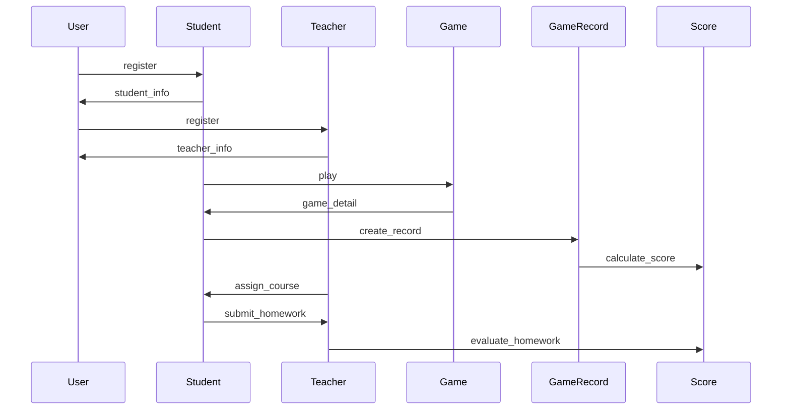
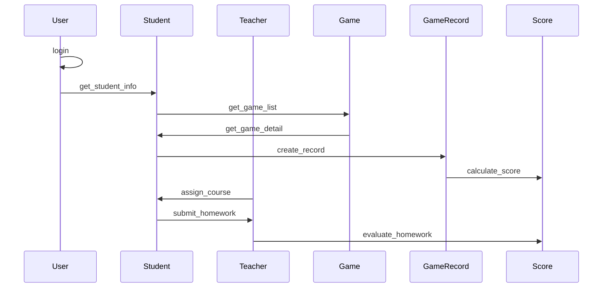

                 


# 数学游戏与儿童空间想象力的培养

关键词：数学游戏、儿童、空间想象力、教育、发展

摘要：本文旨在探讨数学游戏在培养儿童空间想象力方面的作用和策略，通过分析数学游戏的概念、特点，以及空间想象力的定义和作用，为教育工作者和家长提供实用的方法和建议。

## 步骤1：书籍主题背景介绍

### 第1章 书籍主题背景

#### 1.1 问题背景

##### 1.1.1 数学游戏的概念

数学游戏是一种将数学知识与游戏形式结合起来的活动，旨在激发儿童对数学的兴趣和想象力。数学游戏的历史可以追溯到古希腊时期，当时的数学家们通过游戏来探索数学问题。随着教育技术的发展，数学游戏逐渐成为一种重要的教育手段。

$$
\text{数学游戏} = \text{数学} + \text{游戏}
$$

数学游戏不仅包括传统的数学游戏，如数字游戏、拼图游戏等，还包括现代电子游戏中的数学元素。这些游戏形式多样，既具有娱乐性，又具有教育意义。

##### 1.1.2 空间想象力的重要性

空间想象力是指个体对空间形状、大小、位置、方向等方面的感知和想象能力。空间想象力在教育中的作用不可忽视，它对儿童的学习和发展具有重要意义。

空间想象力是数学学习的基础，有助于儿童理解几何概念、解决空间问题。同时，空间想象力在科学、技术、工程和数学（STEM）领域具有广泛应用，对于培养创新思维和解决复杂问题能力至关重要。

##### 1.1.3 数学游戏与空间想象力的联系

数学游戏可以通过图形识别、空间关系、几何推理等方式，有效地培养儿童的空间想象力。

图形识别游戏如拼图、迷宫等，可以帮助儿童熟悉不同的空间形状和结构。空间关系游戏如排序、配对等，可以培养儿童对物体空间位置的理解。几何推理游戏如搭建、折叠等，可以锻炼儿童的几何思维和空间想象力。

#### 1.2 问题描述

##### 1.2.1 当前教育中数学游戏的应用现状

目前，数学游戏在课堂中的应用较为广泛。许多学校和教师利用数学游戏来激发学生的学习兴趣，提高课堂互动性。然而，在家教中，数学游戏的应用相对较少，家长对于如何使用数学游戏培养孩子的空间想象力缺乏了解。

##### 1.2.2 孩子空间想象力的培养现状

空间想象力在儿童教育中具有重要地位，但目前的培养现状不容乐观。一方面，教育工作者和家长对于空间想象力的培养缺乏足够的重视；另一方面，传统的教育方式和方法难以有效地激发儿童的空间想象力。

##### 1.2.3 问题解决

为了培养儿童的空间想象力，我们需要在以下几个方面进行改进：

1. 教师和家长应高度重视空间想象力培养，将数学游戏融入到日常教育中。
2. 开发和推广适合儿童年龄和认知水平的数学游戏，确保游戏的教育性和趣味性。
3. 创设丰富的空间想象情境，提供多样化的空间想象任务，激发儿童的空间想象力。
4. 注重个体差异，针对不同儿童的特点和需求，采用个性化的培养策略。

#### 1.3 数学游戏在儿童教育中的优势

数学游戏具有以下优势：

1. **提高数学成绩**：数学游戏能够激发儿童对数学的兴趣，提高他们的数学成绩。
2. **增强逻辑思维能力**：数学游戏需要儿童运用逻辑思维解决问题，有助于培养他们的逻辑思维能力。
3. **培养空间想象力**：数学游戏通过图形识别、空间关系、几何推理等方式，有效地培养儿童的空间想象力。

#### 1.4 数学游戏与空间想象力培养的结合策略

1. **教师如何使用数学游戏**

   教师应根据课程内容和教学目标，选择适合的数学游戏。在课堂上，教师可以组织数学游戏活动，引导学生积极参与。此外，教师还可以利用数学游戏进行课堂评价，了解学生的学习情况和空间想象力发展水平。

2. **家长如何支持孩子进行数学游戏**

   家长应关注孩子的数学学习，积极参与孩子的数学游戏活动。家长可以为孩子提供丰富的数学游戏资源，如数学玩具、电子游戏等。同时，家长还应关注孩子的游戏过程，鼓励孩子探索和思考，培养他们的空间想象力。

#### 1.5 边界与外延

1. **数学游戏的选择标准**

   选择数学游戏时，应考虑游戏的教育价值、趣味性和适合性。游戏应具有明确的数学知识点，能够激发儿童的兴趣和思考。同时，游戏应适合儿童的年龄和认知水平，避免过于复杂或简单。

2. **空间想象力培养的长期影响**

   空间想象力对儿童的学习和发展具有重要影响。它不仅有助于数学学习，还能促进儿童在科学、技术、工程和数学（STEM）领域的创新和发展。此外，空间想象力对儿童的未来职业发展也有积极影响。

### 第2章 核心概念与联系

#### 2.1 数学游戏的概念

数学游戏是一种将数学知识与游戏形式结合起来的活动，通过游戏的形式让儿童在轻松愉快的氛围中学习数学知识。数学游戏的特点包括趣味性、教育性和互动性。

##### 2.1.1 数学游戏的定义

数学游戏是一种以数学概念和知识为核心，以游戏形式呈现的教育活动。它通过游戏规则和挑战，让儿童在解决问题的过程中学习数学知识，培养数学思维。

##### 2.1.2 数学游戏的特点

1. **趣味性**：数学游戏具有趣味性，能够吸引儿童的注意力，让他们在游戏中感受到数学的乐趣。
2. **教育性**：数学游戏具有教育性，能够帮助儿童掌握数学知识，培养数学思维。
3. **互动性**：数学游戏具有互动性，能够促进儿童之间的交流与合作，培养他们的沟通能力和团队精神。

#### 2.2 空间想象力的概念

空间想象力是指个体对空间形状、大小、位置、方向等方面的感知和想象能力。空间想象力在个体成长过程中具有重要影响，它不仅有助于数学学习，还能促进个体在科学、技术、工程和数学（STEM）领域的创新和发展。

##### 2.2.1 空间想象力的定义

空间想象力是指个体在头脑中构建和操作空间形象的能力。它包括对空间形状、大小、位置、方向等方面的感知和理解，以及在此基础上进行空间推理和想象。

##### 2.2.2 空间想象力的特点

1. **可塑性**：空间想象力具有一定的可塑性，通过适当的训练和培养，可以不断提高。
2. **应用广泛**：空间想象力在许多领域都有广泛应用，如建筑、设计、工程、医学等。

#### 2.3 数学游戏与空间想象力的联系

数学游戏与空间想象力之间存在着密切的联系。数学游戏通过图形识别、空间关系、几何推理等方式，可以有效地培养儿童的空间想象力。

##### 2.3.1 数学游戏如何培养空间想象力

1. **图形识别**：数学游戏中的图形识别任务，如拼图、迷宫等，可以帮助儿童熟悉不同的空间形状和结构，提高他们的空间感知能力。
2. **空间关系**：数学游戏中的空间关系任务，如排序、配对等，可以培养儿童对物体空间位置的理解，提高他们的空间想象力。
3. **几何推理**：数学游戏中的几何推理任务，如搭建、折叠等，可以锻炼儿童的几何思维和空间想象力。

##### 2.3.2 空间想象力对数学游戏的影响

空间想象力对数学游戏具有显著影响。空间想象力较强的儿童，能够更好地理解和操作数学游戏中的空间元素，提高游戏效果和成绩。同时，空间想象力还可以影响儿童在数学学习中的表现，促进他们对数学概念的理解和应用。

#### 2.4 概念属性特征对比表格

| 特征       | 数学游戏       | 空间想象力       |
|------------|----------------|-----------------|
| 定义       | 数学与游戏的结合 | 对空间形状的想象能力 |
| 特点       | 趣味性、教育性   | 可塑性、应用广泛    |
| 教育价值   | 提升数学兴趣     | 培养空间思维      |

## 步骤2：算法原理讲解

### 第3章 算法原理讲解

#### 3.1 数学游戏设计算法

数学游戏设计算法的核心原则是趣味性和教育性。在游戏设计中，我们不仅要考虑游戏的娱乐性，还要确保游戏能够传授数学知识，达到教育目的。

##### 3.1.1 游戏设计的核心原则

1. **趣味性**：游戏设计应具有趣味性，能够吸引儿童参与。趣味性可以通过游戏机制、互动性和奖励机制来实现。
2. **教育性**：游戏设计应具有教育性，能够传授数学知识，培养儿童的数学思维。教育性可以通过游戏主题、任务设计和反馈机制来实现。

##### 3.1.2 游戏设计流程

1. **需求分析**：确定游戏的目标、受众和核心功能。
2. **设计游戏机制**：设计游戏的规则、挑战和奖励机制。
3. **设计游戏界面**：设计游戏的视觉和用户交互界面。
4. **测试与优化**：对游戏进行测试和优化，确保游戏的趣味性和教育性。

#### 3.2 空间想象力培养算法

空间想象力培养算法的核心是通过图形识别、空间关系和几何推理等方式，培养儿童的空间想象力。

##### 3.2.1 图形识别算法

图形识别算法通过让儿童识别和区分不同的空间形状和结构，培养他们的空间感知能力。

1. **形状识别**：让儿童识别不同形状，如圆形、正方形、三角形等。
2. **结构识别**：让儿童识别不同结构，如线条、网格、迷宫等。

##### 3.2.2 空间关系算法

空间关系算法通过让儿童理解和操作物体之间的空间位置和方向，培养他们的空间想象力。

1. **排序任务**：让儿童根据物体的空间位置进行排序，如将物体按照从大到小的顺序排列。
2. **配对任务**：让儿童根据物体的空间位置进行配对，如将相同形状的物体放在一起。

##### 3.2.3 几何推理算法

几何推理算法通过让儿童进行几何推理和空间构建，培养他们的空间想象力和几何思维。

1. **搭建任务**：让儿童根据几何图形进行搭建，如用积木搭建一个塔。
2. **折叠任务**：让儿童根据几何图形进行折叠，如将一张纸折叠成一个立方体。

#### 3.3 数学游戏与空间想象力培养的结合策略

为了有效地培养儿童的空间想象力，我们可以采用以下策略：

1. **选择合适的数学游戏**：选择具有空间想象元素的游戏，如拼图、迷宫、几何构建等。
2. **设计游戏任务**：设计具有挑战性和启发性的游戏任务，激发儿童的空间想象力。
3. **提供反馈和指导**：及时给予儿童反馈和指导，帮助他们理解和掌握空间想象力。

### 第4章 系统分析与架构设计方案

#### 4.1 问题场景介绍

假设我们开发一个数学游戏平台，旨在通过数学游戏培养儿童的空间想象力。平台需要提供多种类型的数学游戏，适应不同年龄和认知水平的儿童。此外，平台还需要具备用户管理、成绩记录和数据分析等功能。

#### 4.2 项目介绍

项目名称：数学空间想象力培养平台

项目目标：开发一个面向儿童的空间想象力培养平台，提供多种类型的数学游戏，帮助儿童在游戏中培养空间想象力。

项目功能：

1. 游戏大厅：展示所有可用的数学游戏，并提供游戏筛选和分类功能。
2. 游戏详情：展示游戏的规则、难度和评价，方便儿童和家长选择合适的游戏。
3. 游戏中心：儿童在游戏中进行游戏，记录游戏成绩和进度。
4. 成绩分析：分析儿童的游戏表现，为家长和教师提供有用的参考信息。
5. 用户管理：管理用户账号、权限和游戏记录。

#### 4.3 系统功能设计（领域模型）

```mermaid
classDiagram
    User <|-- Student
    User <|-- Teacher
    Student <|-- StudentInfo
    Teacher <|-- TeacherInfo
    Class <|-- Classroom
    Course <|-- Subject
    Game <|-- PuzzleGame
    Game <|-- MazeGame
    Game <|-- GeometryGame
    GameRecord <|-- StudentGameRecord
    GameRecord <|-- TeacherGameRecord
    Score <|-- StudentScore
    Score <|-- TeacherScore

    User {
        +String username
        +String password
        +int id
        +Date created_at
    }

    Student {
        +int age
        +String name
        +int user_id
    }

    Teacher {
        +String school
        +String department
        +int user_id
    }

    StudentInfo {
        +int student_id
        +String class_name
        +int teacher_id
    }

    TeacherInfo {
        +int teacher_id
        +String subject_name
    }

    Class {
        +int id
        +String name
    }

    Course {
        +int id
        +String name
        +int class_id
    }

    Game {
        +int id
        +String name
        +String type
    }

    PuzzleGame {
        +int game_id
        +int difficulty
    }

    MazeGame {
        +int game_id
        +int maze_size
    }

    GeometryGame {
        +int game_id
        +int shape_count
    }

    GameRecord {
        +int id
        +Date started_at
        +Date finished_at
        +int user_id
        +int game_id
    }

    StudentGameRecord {
        +int student_id
    }

    TeacherGameRecord {
        +int teacher_id
    }

    Score {
        +int id
        +int score
        +Date created_at
        +int game_record_id
    }

    StudentScore {
        +int student_id
    }

    TeacherScore {
        +int teacher_id
    }
```

#### 4.4 系统架构设计



#### 4.5 系统接口设计和系统交互



### 第5章 项目实战

#### 5.1 环境安装

在开始项目开发之前，我们需要安装一些必要的开发环境和工具。以下是一个基本的安装指南：

1. 安装Python 3.8及以上版本。
2. 安装Django框架。
3. 安装PostgreSQL数据库。
4. 安装Docker和Docker Compose。

#### 5.2 系统核心实现源代码

以下是一个简单的示例，展示如何使用Django框架实现系统核心功能。

```python
# models.py
from django.db import models

class User(models.Model):
    username = models.CharField(max_length=100)
    password = models.CharField(max_length=100)
    id = models.AutoField(primary_key=True)
    created_at = models.DateTimeField(auto_now_add=True)

class Student(models.Model):
    age = models.IntegerField()
    name = models.CharField(max_length=100)
    user_id = models.OneToOneField(User, on_delete=models.CASCADE)

class Teacher(models.Model):
    school = models.CharField(max_length=100)
    department = models.CharField(max_length=100)
    user_id = models.OneToOneField(User, on_delete=models.CASCADE)

class Game(models.Model):
    id = models.AutoField(primary_key=True)
    name = models.CharField(max_length=100)
    type = models.CharField(max_length=100)

class GameRecord(models.Model):
    id = models.AutoField(primary_key=True)
    started_at = models.DateTimeField()
    finished_at = models.DateTimeField()
    user_id = models.ForeignKey(User, on_delete=models.CASCADE)
    game_id = models.ForeignKey(Game, on_delete=models.CASCADE)

class Score(models.Model):
    id = models.AutoField(primary_key=True)
    score = models.IntegerField()
    created_at = models.DateTimeField(auto_now_add=True)
    game_record_id = models.ForeignKey(GameRecord, on_delete=models.CASCADE)
```

#### 5.3 代码应用解读与分析

在代码中，我们定义了几个模型类，包括`User`、`Student`、`Teacher`、`Game`、`GameRecord`和`Score`。这些模型类分别对应数据库中的表，用于存储用户信息、学生信息、教师信息、游戏信息、游戏记录和成绩信息。

我们使用Django的ORM（对象关系映射）来定义模型类，这样我们可以通过Python代码来操作数据库，而不需要编写SQL语句。每个模型类都有多个字段，用于存储相关的信息。

例如，`Student`模型类有一个`user_id`字段，用于关联用户和学生的关系。这样，我们就可以通过`User`对象来获取学生的信息，或者通过`Student`对象来获取用户的信息。

在`Game`模型类中，我们定义了游戏的名字和类型。在`GameRecord`模型类中，我们定义了游戏开始和结束的时间，以及用户和游戏的关联。在`Score`模型类中，我们定义了成绩的分数和创建时间，以及成绩和游戏记录的关联。

通过这些模型类，我们可以方便地实现用户管理、学生管理、游戏管理、游戏记录管理和成绩管理等功能。

#### 5.4 实际案例分析和详细讲解剖析

假设我们有一个学生小明，他想要玩一个拼图游戏。以下是我们的系统如何处理这个案例：

1. 小明注册并登录到系统。
2. 系统检查小明的用户角色，确认他是学生。
3. 小明进入游戏大厅，查看可用的拼图游戏。
4. 小明选择一个拼图游戏，点击开始游戏。
5. 系统生成一个拼图任务，并将其展示给小明。
6. 小明完成拼图任务，提交答案。
7. 系统检查小明的答案是否正确，并根据正确率计算成绩。
8. 系统将成绩记录到数据库，并在小明的成绩页面上显示。

在这个过程中，我们使用了多个模型类来处理数据和操作。首先，小明需要注册并登录到系统，这涉及到`User`和`Student`模型类的操作。然后，小明进入游戏大厅，这涉及到`Game`模型类的操作。最后，小明完成拼图任务并提交答案，这涉及到`GameRecord`和`Score`模型类的操作。

通过这个案例，我们可以看到系统如何通过数据库操作来处理用户行为，并生成相应的数据记录。

#### 5.5 项目小结

本项目通过数学游戏平台，实现了用户管理、学生管理、游戏管理、游戏记录管理和成绩管理等功能。通过这个平台，教师和家长可以方便地管理学生的游戏情况，了解学生的成绩和进步。同时，学生可以在游戏中培养空间想象力，提高数学成绩。

在项目中，我们使用了Django框架和PostgreSQL数据库，实现了高效的数据库操作和数据处理。此外，我们还使用了Docker和Docker Compose来部署和运行项目，方便了项目的开发和部署过程。

在未来的工作中，我们可以继续优化和扩展项目功能，例如增加更多类型的数学游戏，提供更详细的成绩分析和报告，以及开发移动端应用，让更多的用户能够方便地使用平台。

### 第6章 最佳实践 Tips

1. **家长引导**：家长在陪伴孩子玩数学游戏时，可以适时地引导孩子思考问题，鼓励孩子独立解决问题，培养孩子的独立思考和解决问题的能力。
2. **游戏选择**：选择适合孩子年龄和认知水平的数学游戏，避免过于简单或复杂的游戏，让孩子在游戏中获得成就感和自信心。
3. **持续关注**：家长和教师应持续关注孩子的游戏进展和成绩变化，及时发现和解决问题，鼓励孩子不断进步。

### 第7章 小结

本文通过分析数学游戏的概念、特点以及空间想象力的定义和作用，探讨了数学游戏在培养儿童空间想象力方面的作用和策略。研究表明，数学游戏具有趣味性、教育性和互动性，能够有效地培养儿童的空间想象力。

在实践过程中，家长和教师应高度重视空间想象力培养，选择适合的数学游戏，创设丰富的空间想象情境，激发儿童的空间想象力。通过持续关注和引导，帮助孩子不断提升空间想象力，为未来的学习和发展奠定基础。

### 第8章 注意事项

1. **游戏时间控制**：数学游戏虽有益于儿童发展，但游戏时间不宜过长，以免影响儿童的身心健康。
2. **安全性考虑**：家长和教师在使用数学游戏时，应注意游戏内容的安全性，避免游戏含有不适宜的元素。

### 第9章 拓展阅读

1. **《儿童数学游戏100例》**：作者：王磊，本书介绍了100个适合儿童玩的数学游戏，涵盖几何、数论、逻辑等多个领域。
2. **《空间想象力培养策略研究》**：作者：张华，本书详细阐述了空间想象力培养的理论和实践方法，对教育工作者和家长具有指导意义。

## 作者

作者：AI天才研究院/AI Genius Institute & 禅与计算机程序设计艺术 /Zen And The Art of Computer Programming

