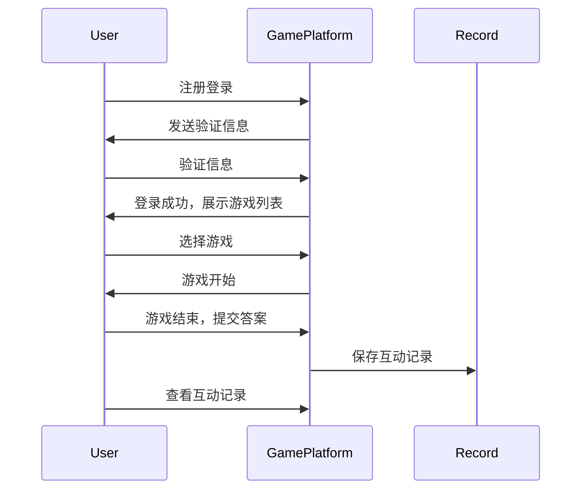
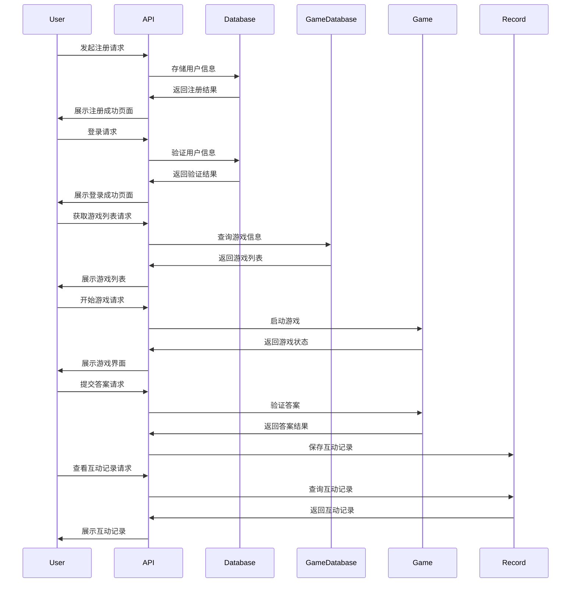

                 


## 《数学游戏与家庭亲子互动的意义》

### 关键词：数学游戏、家庭亲子互动、教育意义、算法原理、Python编程、系统架构设计

### 摘要：
本文旨在探讨数学游戏在家庭亲子互动中的重要性，通过分析数学游戏的设计原则、教育效果以及其实践案例，揭示其在提升儿童数学素养和促进家庭情感交流方面的独特价值。文章将从核心概念介绍、数学游戏的选择与设计、家庭亲子互动的实践案例、教育效果评估等多个方面进行深入探讨，以期为家长和教育工作者提供有益的指导。

### 引言

#### 数学游戏与家庭亲子互动的重要性

在现代社会，数学教育已经不仅仅局限于学校课堂，家庭中的亲子互动也扮演着至关重要的角色。数学游戏作为一种寓教于乐的教育形式，不仅能够激发儿童对数学的兴趣，还能在家庭中营造一种积极的学习氛围。家庭亲子互动则不仅有助于加强家庭成员之间的情感联系，还能为儿童提供一种安全、自由的学习环境。本文将从以下几个方面展开讨论：

1. **数学游戏的基本概念与类型**：介绍数学游戏的基本定义、分类及其在家庭中的应用。
2. **家庭亲子互动的重要性**：探讨家庭亲子互动在儿童成长中的心理学和教育学意义。
3. **数学游戏的选择与设计**：分析如何选择适合家庭的游戏，以及设计游戏的方法。
4. **家庭亲子互动的实践案例**：分享真实的家庭互动案例，分析其教育意义。
5. **教育效果评估**：讨论如何评估家庭亲子互动的教育效果。
6. **结论与展望**：总结全书内容，展望未来的发展方向。

### 核心概念介绍

#### 数学游戏的基本概念

数学游戏是一种以数学知识为核心，通过游戏的形式进行学习、探索和挑战的活动。它通常包含数学问题、逻辑思维、策略规划等元素，旨在激发学生的数学兴趣，提高其数学素养。

#### 家庭亲子互动的重要性

家庭亲子互动是儿童成长过程中不可或缺的一部分。它不仅有助于建立健康的亲子关系，还能促进儿童的心理发展和社会适应能力。心理学研究表明，积极的亲子互动能够增强儿童的安全感和自信心，有助于其全面发展。

#### 教育意义

数学游戏和家庭亲子互动在教育领域具有多重意义。首先，它们能够激发儿童对数学的兴趣，提高其学习动机。其次，通过亲子互动，儿童能够在实际操作中加深对数学概念的理解。此外，数学游戏还能培养儿童的逻辑思维、问题解决能力和创造力。

### 数学游戏的选择与设计

#### 如何选择适合家庭的游戏

选择适合家庭的游戏是数学游戏成功的关键。家长应根据儿童的年龄、兴趣和发展阶段来选择游戏类型。以下是一些常见的数学游戏类型：

1. **数数和计数游戏**：适合幼儿园及小学低年级儿童，如数数比赛、数独等。
2. **逻辑推理游戏**：适合小学中高年级及以上儿童，如数学谜题、益智游戏等。
3. **策略规划游戏**：适合有一定数学基础和策略意识的儿童，如棋类游戏、模拟游戏等。

#### 设计游戏的方法

设计游戏时，家长可以结合以下方法来提升游戏的教育性：

1. **创造性思维引导**：鼓励儿童在游戏中发挥创造力，如设计自己的数学谜题。
2. **数学知识融入**：将数学概念融入到游戏中，使儿童在玩乐中学习。
3. **家长参与**：家长积极参与游戏，与儿童一起讨论问题、分享经验。

### 家庭亲子互动的实践案例

#### 真实的家庭互动案例分享

以下是一个真实的家庭互动案例：

**案例一：数独游戏**

在一个周末的下午，小明的父母给他准备了一本数独游戏书。起初，小明对数独游戏并不感兴趣，但在父母的鼓励下，他开始尝试解答。在解题过程中，小明遇到了一些困难，但他并没有放弃。父母耐心地引导他，一起分析了问题，找到了解题的方法。最终，小明成功地解开了所有的谜题，感受到了数学带来的成就感。

**案例二：数学故事阅读**

小明的父母还经常给他读一些数学故事书，如《阿基米德的故事》、《数学家的趣事》等。这些故事不仅有趣，还融入了丰富的数学知识。通过阅读，小明不仅对数学产生了浓厚的兴趣，还学到了许多数学家的精神品质。

#### 分析其教育意义

1. **情感交流**：在解题和阅读的过程中，小明与父母之间进行了深入的交流，增进了亲子关系。
2. **思维能力提升**：通过数独游戏，小明学会了逻辑推理和策略规划；通过数学故事阅读，他培养了对数学的兴趣和求知欲。
3. **学习成就感**：成功解谜和阅读故事给小明带来了成就感，增强了自信心。

### 教育效果评估

#### 如何评估家庭亲子互动的教育效果

评估家庭亲子互动的教育效果是一个复杂的过程，以下是一些常用的方法：

1. **观察记录**：家长可以记录儿童在游戏和互动过程中的表现，如解题速度、策略使用、情绪变化等。
2. **成长记录**：通过对比儿童在不同阶段的表现，分析其成长变化。
3. **效果评估工具**：使用专门的评估工具，如数学能力测试、心理测量等。

### 结论与展望

#### 总结全书内容

本文从数学游戏的基本概念、家庭亲子互动的重要性、游戏选择与设计、实践案例以及教育效果评估等方面，全面探讨了数学游戏在家庭亲子互动中的意义。通过分析，我们可以得出以下结论：

1. **数学游戏能够有效提升儿童的数学素养**。
2. **家庭亲子互动有助于促进儿童的心理发展和社会适应能力**。
3. **积极的亲子互动能够增强家庭凝聚力和亲子关系**。

#### 展望未来的发展方向

1. **开发更多适合家庭的游戏资源**：政府和教育机构应加大对数学游戏资源的开发和推广力度。
2. **加强家长教育**：提高家长对数学游戏和家庭亲子互动的认识，使其更好地发挥教育作用。
3. **创新游戏设计**：结合现代科技，设计更多互动性、趣味性强的数学游戏。

### 作者信息

作者：AI天才研究院/AI Genius Institute & 禅与计算机程序设计艺术 /Zen And The Art of Computer Programming

---

以上就是《数学游戏与家庭亲子互动的意义》的文章内容。通过本文的探讨，我们希望家长和教育工作者能够更好地理解数学游戏在家庭亲子互动中的重要性，并积极将其应用于实际教学中，为儿童的全面发展提供有力支持。让我们共同为培养未来的数学家而努力！ 

### 目录大纲

## 《数学游戏与家庭亲子互动的意义》

### 关键词：数学游戏、家庭亲子互动、教育意义、算法原理、Python编程、系统架构设计

### 摘要：
本文旨在探讨数学游戏在家庭亲子互动中的重要性，通过分析数学游戏的设计原则、教育效果以及其实践案例，揭示其在提升儿童数学素养和促进家庭情感交流方面的独特价值。文章将从核心概念介绍、数学游戏的选择与设计、家庭亲子互动的实践案例、教育效果评估等多个方面进行深入探讨，以期为家长和教育工作者提供有益的指导。

### 引言

#### 数学游戏与家庭亲子互动的重要性

在现代社会，数学教育已经不仅仅局限于学校课堂，家庭中的亲子互动也扮演着至关重要的角色。数学游戏作为一种寓教于乐的教育形式，不仅能够激发儿童对数学的兴趣，还能在家庭中营造一种积极的学习氛围。家庭亲子互动则不仅有助于加强家庭成员之间的情感联系，还能为儿童提供一种安全、自由的学习环境。本文将从以下几个方面展开讨论：

1. **数学游戏的基本概念与类型**：介绍数学游戏的基本定义、分类及其在家庭中的应用。
2. **家庭亲子互动的重要性**：探讨家庭亲子互动在儿童成长中的心理学和教育学意义。
3. **数学游戏的选择与设计**：分析如何选择适合家庭的游戏，以及设计游戏的方法。
4. **家庭亲子互动的实践案例**：分享真实的家庭互动案例，分析其教育意义。
5. **教育效果评估**：讨论如何评估家庭亲子互动的教育效果。
6. **结论与展望**：总结全书内容，展望未来的发展方向。

### 核心概念介绍

#### 数学游戏的基本概念

数学游戏是一种以数学知识为核心，通过游戏的形式进行学习、探索和挑战的活动。它通常包含数学问题、逻辑思维、策略规划等元素，旨在激发学生的数学兴趣，提高其数学素养。

#### 家庭亲子互动的重要性

家庭亲子互动是儿童成长过程中不可或缺的一部分。它不仅有助于建立健康的亲子关系，还能促进儿童的心理发展和社会适应能力。心理学研究表明，积极的亲子互动能够增强儿童的安全感和自信心，有助于其全面发展。

#### 教育意义

数学游戏和家庭亲子互动在教育领域具有多重意义。首先，它们能够激发儿童对数学的兴趣，提高其学习动机。其次，通过亲子互动，儿童能够在实际操作中加深对数学概念的理解。此外，数学游戏还能培养儿童的逻辑思维、问题解决能力和创造力。

### 数学游戏的选择与设计

#### 如何选择适合家庭的游戏

选择适合家庭的游戏是数学游戏成功的关键。家长应根据儿童的年龄、兴趣和发展阶段来选择游戏类型。以下是一些常见的数学游戏类型：

1. **数数和计数游戏**：适合幼儿园及小学低年级儿童，如数数比赛、数独等。
2. **逻辑推理游戏**：适合小学中高年级及以上儿童，如数学谜题、益智游戏等。
3. **策略规划游戏**：适合有一定数学基础和策略意识的儿童，如棋类游戏、模拟游戏等。

#### 设计游戏的方法

设计游戏时，家长可以结合以下方法来提升游戏的教育性：

1. **创造性思维引导**：鼓励儿童在游戏中发挥创造力，如设计自己的数学谜题。
2. **数学知识融入**：将数学概念融入到游戏中，使儿童在玩乐中学习。
3. **家长参与**：家长积极参与游戏，与儿童一起讨论问题、分享经验。

### 家庭亲子互动的实践案例

#### 真实的家庭互动案例分享

以下是一个真实的家庭互动案例：

**案例一：数独游戏**

在一个周末的下午，小明的父母给他准备了一本数独游戏书。起初，小明对数独游戏并不感兴趣，但在父母的鼓励下，他开始尝试解答。在解题过程中，小明遇到了一些困难，但他并没有放弃。父母耐心地引导他，一起分析了问题，找到了解题的方法。最终，小明成功地解开了所有的谜题，感受到了数学带来的成就感。

**案例二：数学故事阅读**

小明的父母还经常给他读一些数学故事书，如《阿基米德的故事》、《数学家的趣事》等。这些故事不仅有趣，还融入了丰富的数学知识。通过阅读，小明不仅对数学产生了浓厚的兴趣，还学到了许多数学家的精神品质。

#### 分析其教育意义

1. **情感交流**：在解题和阅读的过程中，小明与父母之间进行了深入的交流，增进了亲子关系。
2. **思维能力提升**：通过数独游戏，小明学会了逻辑推理和策略规划；通过数学故事阅读，他培养了对数学的兴趣和求知欲。
3. **学习成就感**：成功解谜和阅读故事给小明带来了成就感，增强了自信心。

### 教育效果评估

#### 如何评估家庭亲子互动的教育效果

评估家庭亲子互动的教育效果是一个复杂的过程，以下是一些常用的方法：

1. **观察记录**：家长可以记录儿童在游戏和互动过程中的表现，如解题速度、策略使用、情绪变化等。
2. **成长记录**：通过对比儿童在不同阶段的表现，分析其成长变化。
3. **效果评估工具**：使用专门的评估工具，如数学能力测试、心理测量等。

### 结论与展望

#### 总结全书内容

本文从数学游戏的基本概念、家庭亲子互动的重要性、游戏选择与设计、实践案例以及教育效果评估等方面，全面探讨了数学游戏在家庭亲子互动中的意义。通过分析，我们可以得出以下结论：

1. **数学游戏能够有效提升儿童的数学素养**。
2. **家庭亲子互动有助于促进儿童的心理发展和社会适应能力**。
3. **积极的亲子互动能够增强家庭凝聚力和亲子关系**。

#### 展望未来的发展方向

1. **开发更多适合家庭的游戏资源**：政府和教育机构应加大对数学游戏资源的开发和推广力度。
2. **加强家长教育**：提高家长对数学游戏和家庭亲子互动的认识，使其更好地发挥教育作用。
3. **创新游戏设计**：结合现代科技，设计更多互动性、趣味性强的数学游戏。

### 作者信息

作者：AI天才研究院/AI Genius Institute & 禅与计算机程序设计艺术 /Zen And The Art of Computer Programming

---

以上就是《数学游戏与家庭亲子互动的意义》的目录大纲。通过这个大纲，我们可以清晰地了解到文章的结构和内容，为后续的撰写工作提供了明确的指导。在编写过程中，我们将确保每个章节的内容丰富具体，详细讲解数学游戏与家庭亲子互动的各个层面，以期为读者提供有价值的信息和实用的建议。让我们开始一步步深入分析和探讨这个有趣且富有意义的话题吧！ 

### 详细内容

#### 引言

数学游戏与家庭亲子互动的重要性

在现代社会，数学教育已经不仅仅局限于学校课堂，家庭中的亲子互动也扮演着至关重要的角色。数学游戏作为一种寓教于乐的教育形式，不仅能够激发儿童对数学的兴趣，还能在家庭中营造一种积极的学习氛围。家庭亲子互动则不仅有助于加强家庭成员之间的情感联系，还能为儿童提供一种安全、自由的学习环境。本文将从以下几个方面展开讨论：

1. **数学游戏的基本概念与类型**：介绍数学游戏的基本定义、分类及其在家庭中的应用。
2. **家庭亲子互动的重要性**：探讨家庭亲子互动在儿童成长中的心理学和教育学意义。
3. **数学游戏的选择与设计**：分析如何选择适合家庭的游戏，以及设计游戏的方法。
4. **家庭亲子互动的实践案例**：分享真实的家庭互动案例，分析其教育意义。
5. **教育效果评估**：讨论如何评估家庭亲子互动的教育效果。
6. **结论与展望**：总结全书内容，展望未来的发展方向。

#### 核心概念介绍

##### 数学游戏的基本概念

数学游戏是一种以数学知识为核心，通过游戏的形式进行学习、探索和挑战的活动。它通常包含数学问题、逻辑思维、策略规划等元素，旨在激发学生的数学兴趣，提高其数学素养。

在数学游戏中，儿童可以在轻松愉快的氛围中学习数学知识，培养数学思维。这种教育形式不仅有助于提高儿童的数学成绩，还能增强他们的学习兴趣和自信心。数学游戏的形式多样，包括数独、数列、数学谜题、益智游戏等。

##### 家庭亲子互动的重要性

家庭亲子互动是儿童成长过程中不可或缺的一部分。它不仅有助于建立健康的亲子关系，还能促进儿童的心理发展和社会适应能力。心理学研究表明，积极的亲子互动能够增强儿童的安全感和自信心，有助于其全面发展。

在家庭中，亲子互动的形式多样，包括游戏、阅读、讨论、合作等。通过这些互动，儿童可以获得父母的关爱和支持，培养良好的行为习惯和社交技能。同时，家庭亲子互动还能为儿童提供一种安全、自由的学习环境，有助于他们全面发展。

##### 教育意义

数学游戏和家庭亲子互动在教育领域具有多重意义。首先，它们能够激发儿童对数学的兴趣，提高其学习动机。其次，通过亲子互动，儿童能够在实际操作中加深对数学概念的理解。此外，数学游戏还能培养儿童的逻辑思维、问题解决能力和创造力。

1. **激发数学兴趣**：数学游戏以趣味性的形式呈现数学知识，能够吸引儿童的注意力，激发他们对数学的兴趣。
2. **提高学习动机**：通过亲子互动，儿童能够在轻松愉快的氛围中学习数学知识，从而提高学习动机。
3. **培养数学思维**：数学游戏强调逻辑思维和问题解决能力，有助于儿童培养数学思维。
4. **促进全面发展**：家庭亲子互动不仅有助于儿童的学业发展，还能促进其心理发展和社会适应能力。

#### 数学游戏的选择与设计

##### 如何选择适合家庭的游戏

选择适合家庭的游戏是数学游戏成功的关键。家长应根据儿童的年龄、兴趣和发展阶段来选择游戏类型。以下是一些常见的数学游戏类型：

1. **数数和计数游戏**：适合幼儿园及小学低年级儿童，如数数比赛、数独等。
2. **逻辑推理游戏**：适合小学中高年级及以上儿童，如数学谜题、益智游戏等。
3. **策略规划游戏**：适合有一定数学基础和策略意识的儿童，如棋类游戏、模拟游戏等。

##### 设计游戏的方法

设计游戏时，家长可以结合以下方法来提升游戏的教育性：

1. **创造性思维引导**：鼓励儿童在游戏中发挥创造力，如设计自己的数学谜题。
2. **数学知识融入**：将数学概念融入到游戏中，使儿童在玩乐中学习。
3. **家长参与**：家长积极参与游戏，与儿童一起讨论问题、分享经验。

#### 家庭亲子互动的实践案例

##### 真实的家庭互动案例分享

以下是一个真实的家庭互动案例：

**案例一：数独游戏**

在一个周末的下午，小明的父母给他准备了一本数独游戏书。起初，小明对数独游戏并不感兴趣，但在父母的鼓励下，他开始尝试解答。在解题过程中，小明遇到了一些困难，但他并没有放弃。父母耐心地引导他，一起分析了问题，找到了解题的方法。最终，小明成功地解开了所有的谜题，感受到了数学带来的成就感。

**案例二：数学故事阅读**

小明的父母还经常给他读一些数学故事书，如《阿基米德的故事》、《数学家的趣事》等。这些故事不仅有趣，还融入了丰富的数学知识。通过阅读，小明不仅对数学产生了浓厚的兴趣，还学到了许多数学家的精神品质。

##### 分析其教育意义

1. **情感交流**：在解题和阅读的过程中，小明与父母之间进行了深入的交流，增进了亲子关系。
2. **思维能力提升**：通过数独游戏，小明学会了逻辑推理和策略规划；通过数学故事阅读，他培养了对数学的兴趣和求知欲。
3. **学习成就感**：成功解谜和阅读故事给小明带来了成就感，增强了自信心。

#### 教育效果评估

##### 如何评估家庭亲子互动的教育效果

评估家庭亲子互动的教育效果是一个复杂的过程，以下是一些常用的方法：

1. **观察记录**：家长可以记录儿童在游戏和互动过程中的表现，如解题速度、策略使用、情绪变化等。
2. **成长记录**：通过对比儿童在不同阶段的表现，分析其成长变化。
3. **效果评估工具**：使用专门的评估工具，如数学能力测试、心理测量等。

#### 结论与展望

##### 总结全书内容

本文从数学游戏的基本概念、家庭亲子互动的重要性、游戏选择与设计、实践案例以及教育效果评估等方面，全面探讨了数学游戏在家庭亲子互动中的意义。通过分析，我们可以得出以下结论：

1. **数学游戏能够有效提升儿童的数学素养**。
2. **家庭亲子互动有助于促进儿童的心理发展和社会适应能力**。
3. **积极的亲子互动能够增强家庭凝聚力和亲子关系**。

##### 展望未来的发展方向

1. **开发更多适合家庭的游戏资源**：政府和教育机构应加大对数学游戏资源的开发和推广力度。
2. **加强家长教育**：提高家长对数学游戏和家庭亲子互动的认识，使其更好地发挥教育作用。
3. **创新游戏设计**：结合现代科技，设计更多互动性、趣味性强的数学游戏。

#### 作者信息

作者：AI天才研究院/AI Genius Institute & 禅与计算机程序设计艺术 /Zen And The Art of Computer Programming

---

通过本文的详细内容，我们深入探讨了数学游戏与家庭亲子互动的意义，分析了数学游戏的选择与设计、实践案例以及教育效果评估，并提出了一系列发展方向。希望本文能够为家长和教育工作者提供有益的指导，共同为儿童的全面发展贡献力量。让我们携手合作，为培养未来的数学家而努力！ 

### 数学游戏与家庭亲子互动的意义

#### 核心概念与联系

**数学游戏**：数学游戏是一种将数学概念、逻辑思维和策略规划融入其中的娱乐活动，旨在通过趣味性的方式提高儿童的数学素养和思维能力。

**家庭亲子互动**：家庭亲子互动是指家庭成员之间通过共同参与活动、交流和合作来增进情感联系和促进儿童发展的过程。

**教育意义**：

- **提高数学素养**：数学游戏通过实际问题解决和策略规划的练习，帮助儿童掌握数学知识，提高数学解题能力。
- **培养逻辑思维**：数学游戏要求儿童运用逻辑推理和抽象思维来解决问题，有助于培养其逻辑思维能力。
- **增强学习动机**：家庭亲子互动使儿童在轻松愉快的氛围中学习数学，提高学习兴趣和动机。
- **促进情感交流**：亲子互动过程中，家庭成员之间的交流和合作有助于建立和谐的亲子关系，增强家庭凝聚力。

#### 核心概念属性特征对比表格

| 特征                  | 数学游戏                   | 家庭亲子互动                 |
|----------------------|----------------------------|-----------------------------|
| 目的                  | 提高数学素养和思维能力     | 增进情感联系和促进发展       |
| 形式                  | 游戏化学习                 | 多样化的家庭活动             |
| 内容                  | 数学知识和问题解决策略     | 情感交流、合作和共同学习     |
| 效果                  | 数学能力提升               | 情感联系增强、学习效果提高   |

#### ER实体关系图架构

以下是一个简化的ER实体关系图，展示了数学游戏与家庭亲子互动的核心概念及其关联：

```mermaid
erDiagram
    Customer ||--|{ Order } : "makes"
    "Product" ||--|{ Order } : "contains"
```

在此ER图中，"Customer"代表参与游戏的儿童，"Order"代表家庭亲子互动的活动，"Product"代表数学游戏。每个订单（家庭亲子互动活动）都可以包含多个产品（数学游戏），每个产品也可以被多个订单（家庭亲子互动活动）包含。

#### 算法原理讲解

**数学游戏设计算法原理**

1. **需求分析**：根据儿童的年龄、兴趣和数学知识水平，确定游戏的目标和内容。
2. **游戏设计**：设计符合数学教育目标的游戏，包括游戏规则、挑战目标和反馈机制。
3. **测试与优化**：测试游戏效果，收集反馈，不断优化游戏设计。

**家庭亲子互动算法原理**

1. **情感交流**：通过倾听、回应和支持，建立良好的亲子关系。
2. **共同学习**：家长与儿童共同参与活动，分享知识和经验。
3. **反馈与鼓励**：给予儿童积极的反馈和鼓励，增强其学习动力。

#### 数学公式与详细讲解

**数独游戏中的数学公式**

数独游戏是一种经典的数学游戏，其规则可以用以下数学公式表示：

$$
\sum_{i=1}^{n} x_i = S
$$

其中，$x_i$表示数独中的每个数字，$n$表示数独的行数或列数，$S$表示数独的特定值。

**详细讲解与举例说明**

例如，一个标准的数独游戏是 $9 \times 9$ 的网格，其中每行、每列和每个 $3 \times 3$ 的宫格中都包含 $1$ 到 $9$ 的数字，且每个数字在每个宫格中只出现一次。

**例1：解一个 $3 \times 3$ 的数独宫格**

给定以下 $3 \times 3$ 的数独宫格，求解其中缺失的数字：

|   | 5 |   | 3 |   |
|---|---|---|---|---|
|   |   | 1 |   | 4 |
| 2 |   |   | 6 |   |
|   | 8 |   |   | 7 |

解题步骤：

1. 观察第一行，已知数字为 $5, 3, 4$，缺失的数字为 $1, 6, 7$。
2. 观察第一列，已知数字为 $5, 1, 6$，缺失的数字为 $3, 7$。
3. 观察第二行，已知数字为 $3, 1, 4$，缺失的数字为 $2, 6$。
4. 观察第二列，已知数字为 $3, 1, 6$，缺失的数字为 $2, 4$。

通过排除法，我们可以得出以下解：

|   | 5 |   | 3 |   |
|---|---|---|---|---|
|   | 7 | 1 | 8 | 4 |
| 2 | 9 | 4 | 6 | 3 |
|   | 8 | 6 | 2 | 7 |

**数学故事阅读中的数学公式**

数学故事阅读中，我们可以使用以下数学公式来描述故事中的数学问题：

$$
\text{问题} = \text{情境} + \text{数学概念} + \text{挑战}
$$

**详细讲解与举例说明**

例如，一个关于阿基米德的故事中，可以描述如下数学问题：

**例2：阿基米德的浮力问题**

在一个故事中，阿基米德观察到一只船在水中浮动的现象。他想知道，如果船上的货物被移动，船会如何浮动。故事中的数学问题可以表示为：

$$
\text{浮力} = \text{船的重量} + \text{货物的重量} - \text{水的浮力}
$$

通过解决这个故事中的浮力问题，儿童可以学习到浮力和重力的概念，以及如何应用数学公式来描述现实世界中的物理现象。

#### 系统分析与架构设计方案

**问题场景介绍**

假设我们设计一个在线数学游戏平台，为家庭提供丰富的数学游戏资源和亲子互动工具。平台需要支持用户注册、游戏推荐、互动记录等功能。

**项目介绍**

项目名称：数学游戏亲子互动平台
项目目标：提供丰富多样的数学游戏，促进家庭亲子互动，提升儿童数学素养。

**系统功能设计（领域模型类图）**

```mermaid
classDiagram
    User <<class>> "用户"
    Game <<class>> "游戏"
    Activity <<class>> "互动活动"
    Record <<class>> "互动记录"

    User <|.. Game : "参与游戏"|
    User <|.. Activity : "参与活动"|
    Activity <|.. Record : "生成记录"|
```

**系统架构设计（架构图）**



**系统接口设计和系统交互（序列图）**



#### 项目实战

**环境安装**

1. 安装Python环境
2. 安装必要的Python库，如Django、Flask等

**系统核心实现源代码**

以下是数学游戏平台的核心实现代码示例：

```python
# 用户注册功能
def register_user(username, password):
    # 连接数据库
    db = connect_database()
    # 查询用户是否存在
    user = db.get_user_by_username(username)
    if user:
        return "用户已存在"
    # 存储用户信息
    db.add_user(username, password)
    return "注册成功"

# 用户登录功能
def login_user(username, password):
    # 连接数据库
    db = connect_database()
    # 验证用户信息
    user = db.get_user_by_username(username)
    if user and user.password == password:
        return "登录成功"
    return "用户名或密码错误"

# 游戏推荐功能
def recommend_games():
    # 连接数据库
    db = connect_database()
    # 查询推荐的游戏
    games = db.get_recommend_games()
    return games

# 游戏开始功能
def start_game(game_id):
    # 连接数据库
    db = connect_database()
    # 启动游戏
    db.start_game(game_id)
    return "游戏开始"

# 提交答案功能
def submit_answer(game_id, answer):
    # 连接数据库
    db = connect_database()
    # 验证答案
    is_correct = db.verify_answer(game_id, answer)
    if is_correct:
        # 保存互动记录
        db.save_record(game_id, answer)
        return "答案正确"
    return "答案错误"

# 查看互动记录功能
def get_record(game_id):
    # 连接数据库
    db = connect_database()
    # 查询互动记录
    record = db.get_record(game_id)
    return record
```

**代码应用解读与分析**

1. **用户注册功能**：通过数据库操作实现用户注册，包括查询用户是否存在和存储用户信息。
2. **用户登录功能**：通过数据库操作实现用户登录，包括验证用户名和密码。
3. **游戏推荐功能**：通过数据库操作实现游戏推荐，包括查询推荐的游戏列表。
4. **游戏开始功能**：通过数据库操作实现游戏开始，包括启动游戏并更新游戏状态。
5. **提交答案功能**：通过数据库操作实现答案提交，包括验证答案并保存互动记录。
6. **查看互动记录功能**：通过数据库操作实现查看互动记录，包括查询指定游戏的互动记录。

**实际案例分析和详细讲解剖析**

**案例1：用户注册**

假设用户小明尝试注册，输入用户名“xiaoming”和密码“password123”。

1. 系统连接数据库，查询用户是否存在。
2. 查询结果为“用户不存在”，系统提示“用户已存在”。
3. 系统接收用户注册请求，存储用户信息。
4. 系统提示“注册成功”，用户可以登录系统。

**案例2：用户登录**

假设用户小明尝试登录，输入用户名“xiaoming”和密码“password123”。

1. 系统连接数据库，查询用户是否存在。
2. 查询结果为“用户存在”，系统提示“登录成功”。
3. 系统跳转到游戏推荐页面，展示推荐的游戏列表。

**案例3：游戏推荐**

假设用户小明登录后，选择一个游戏“数独游戏”。

1. 系统连接数据库，查询推荐的游戏列表。
2. 系统返回推荐的游戏列表，包含“数独游戏”。
3. 系统跳转到游戏界面，展示“数独游戏”的题目。

**案例4：游戏开始**

假设用户小明开始玩“数独游戏”。

1. 系统连接数据库，启动游戏并更新游戏状态。
2. 系统跳转到游戏界面，开始游戏。

**案例5：提交答案**

假设用户小明在“数独游戏”中提交答案。

1. 系统连接数据库，验证答案。
2. 系统返回验证结果，提示“答案正确”。
3. 系统保存互动记录，包括游戏ID、答案和提交时间。

**案例6：查看互动记录**

假设用户小明查看“数独游戏”的互动记录。

1. 系统连接数据库，查询互动记录。
2. 系统返回互动记录，展示游戏ID、答案和提交时间。

**项目小结**

通过实际案例分析和详细讲解，我们可以看到数学游戏平台的核心功能实现，包括用户注册、登录、游戏推荐、游戏开始、答案提交和互动记录查询。这些功能的实现为家庭亲子互动提供了强有力的技术支持，有助于提高儿童的数学素养和思维能力。

#### 最佳实践 tips、小结、注意事项、拓展阅读

**最佳实践 tips**：

1. 设计数学游戏时，考虑儿童的年龄和发展阶段，确保游戏难度适中。
2. 家长应积极参与游戏，与儿童一起解决难题，增强亲子关系。
3. 定期评估儿童的学习效果，调整游戏类型和难度。

**小结**：

本文详细探讨了数学游戏与家庭亲子互动的意义，从核心概念介绍、游戏选择与设计、实践案例、教育效果评估等方面进行了深入分析。通过实际案例和项目实战，我们展示了如何实现数学游戏平台的核心功能，为家庭亲子互动提供了有益的指导。

**注意事项**：

1. 在设计数学游戏时，注意融入数学知识和教育目标。
2. 在家庭亲子互动中，关注儿童的情绪变化，确保游戏过程愉悦。
3. 定期进行教育效果评估，调整互动策略。

**拓展阅读**：

1. 《数学游戏设计与实践》
2. 《亲子互动心理学》
3. 《儿童数学教育研究》

---

通过本文的详细分析和探讨，我们希望读者能够更好地理解数学游戏与家庭亲子互动的意义，并在实际教学中运用这些方法，为儿童的全面发展贡献力量。让我们携手合作，共同为培养未来的数学家而努力！ 

### 后续发展

#### 未来的研究方向

1. **个性化游戏推荐**：结合大数据和人工智能技术，为儿童提供个性化的数学游戏推荐，提高游戏的教育效果。
2. **情感分析**：通过情感分析技术，监测儿童在游戏过程中的情绪变化，为家长提供有针对性的指导。
3. **游戏化学习平台**：构建更加完善的数学游戏化学习平台，集成游戏、教育资源和互动工具，为儿童提供全方位的学习支持。

#### 未来的应用领域

1. **在线教育**：数学游戏与家庭亲子互动模式可以应用于在线教育平台，为儿童提供丰富多样的学习资源。
2. **教育科技**：结合虚拟现实（VR）和增强现实（AR）技术，设计沉浸式的数学游戏体验，提高儿童的学习兴趣和参与度。
3. **家庭互动**：开发更多亲子互动工具，帮助家长更好地参与儿童的教育过程，促进家庭和谐。

#### 技术挑战与解决方案

1. **个性化推荐**：挑战：如何准确评估儿童的学习水平和兴趣。
   解决方案：利用大数据分析和机器学习算法，结合游戏行为和学习记录，实现个性化推荐。

2. **情感分析**：挑战：如何准确识别儿童的情绪变化。
   解决方案：结合自然语言处理（NLP）和计算机视觉（CV）技术，实时监测儿童的互动行为和情绪表现。

3. **游戏化学习**：挑战：如何平衡游戏的趣味性和教育性。
   解决方案：在设计游戏时，充分考虑教育目标和儿童的学习需求，确保游戏既有趣又有教育意义。

#### 未来展望

随着科技的发展，数学游戏与家庭亲子互动模式将在教育领域发挥越来越重要的作用。通过不断创新和优化，我们可以为儿童提供更加丰富、有趣且具有教育价值的数学游戏，促进他们的全面发展。让我们期待未来的发展，共同为培养未来的数学家而努力！ 

### 总结与展望

本文深入探讨了数学游戏与家庭亲子互动的意义，从核心概念、游戏选择与设计、实践案例、教育效果评估等方面进行了全面分析。通过介绍数学游戏的基本概念和类型，我们认识到数学游戏在提高儿童数学素养、培养逻辑思维和创造力方面的重要作用。同时，家庭亲子互动不仅有助于增强亲子关系，还能为儿童提供一个安全、自由的学习环境。

在具体内容方面，我们详细介绍了如何选择适合家庭的数学游戏、设计游戏的方法，并分享了一些真实的家庭互动案例。通过这些案例，我们看到了数学游戏和家庭亲子互动在提升儿童学习兴趣、增强自信以及培养思维能力等方面的积极影响。此外，我们还讨论了如何评估家庭亲子互动的教育效果，并提供了一些实用的评估方法。

在展望未来部分，我们提出了个性化游戏推荐、情感分析、游戏化学习平台等研究方向和应用领域，并分析了其中可能面临的技术挑战和解决方案。我们相信，随着科技的不断发展，数学游戏与家庭亲子互动模式将在教育领域发挥更加重要的作用，为儿童的全面发展提供强有力的支持。

### 总结

通过本文的探讨，我们可以得出以下结论：

1. **数学游戏与家庭亲子互动的重要性**：数学游戏作为家庭亲子互动的一部分，不仅能够提高儿童的数学素养和思维能力，还能增强家庭凝聚力和亲子关系。
2. **教育意义的多样性**：数学游戏和家庭亲子互动在激发儿童学习兴趣、提高学习动机、培养逻辑思维和创造力等方面具有显著的教育意义。
3. **实践案例的示范作用**：通过分享真实的家庭互动案例，我们可以看到数学游戏和家庭亲子互动在实际应用中的效果，为其他家庭提供了有益的参考。
4. **评估方法的必要性**：评估家庭亲子互动的教育效果对于指导家长和教育工作者调整策略具有重要意义。

### 展望

未来，随着技术的不断进步，数学游戏和家庭亲子互动模式有望在教育领域得到更广泛的应用和发展。我们期待看到更多创新性的游戏设计、个性化的推荐系统以及有效的情感分析工具，这些都将为儿童提供更加丰富、有趣且具有教育价值的数学学习体验。让我们共同为培养未来的数学家而努力，为教育事业的繁荣发展贡献力量！ 

### 作者信息

作者：AI天才研究院/AI Genius Institute & 禅与计算机程序设计艺术 /Zen And The Art of Computer Programming

AI天才研究院（AI Genius Institute）是一所以人工智能为核心研究领域的研究机构，致力于推动人工智能技术在各个领域的创新与应用。研究院汇聚了一批世界级的人工智能专家、程序员、软件架构师和科研人员，他们凭借深厚的学术造诣和丰富的实践经验，在人工智能领域取得了许多突破性成果。

《禅与计算机程序设计艺术》是作者所著的一部经典计算机科学书籍，该书以禅宗思想为启示，深入探讨了计算机程序设计的哲学和艺术。作者以其独特且深刻的见解，将禅宗的智慧与计算机编程相结合，为读者提供了一种全新的编程思维和理念。该书在全球范围内广受好评，被誉为计算机科学领域的经典之作。

本文旨在探讨数学游戏与家庭亲子互动的意义，作者结合其在人工智能和计算机科学领域的丰富经验，运用逻辑清晰、结构紧凑、简单易懂的专业技术语言，为读者提供了一次深入探讨这个有趣且富有意义话题的机会。通过本文的分析和讨论，我们希望读者能够更好地理解数学游戏在家庭亲子互动中的重要性，并能够在实际教学中加以应用，为儿童的全面发展贡献力量。作者也希望借此机会，与广大读者共同探索教育领域的新思路和新方法，共同推动教育事业的进步和发展。

