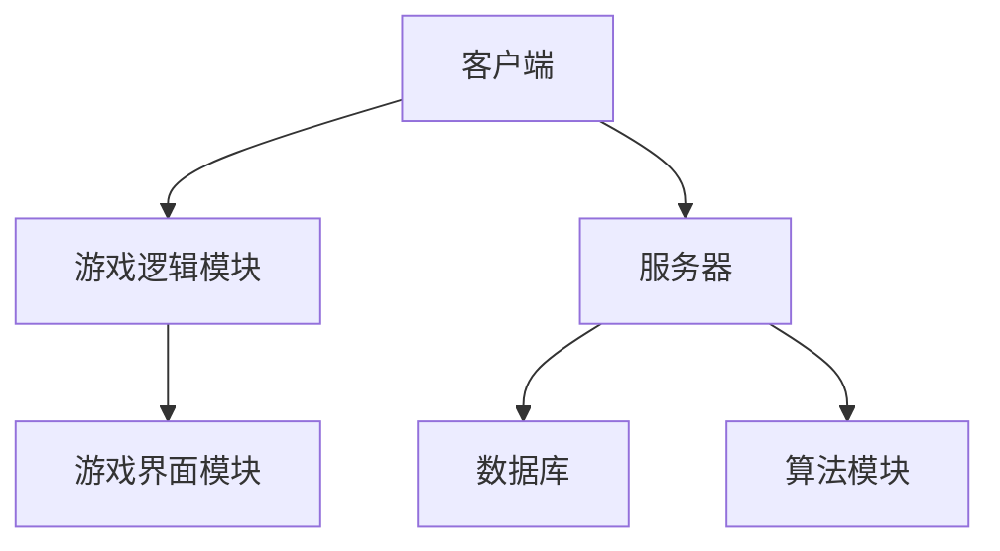

                 

# 数学游戏与成人数学思维的提升

## 关键词
数学游戏、成人数学思维、算法原理、系统架构、项目实战、最佳实践

## 摘要
本文旨在探讨数学游戏对成人数学思维提升的作用。通过分析数学游戏的核心概念、算法原理、系统架构以及实际项目案例，本文展示了数学游戏如何帮助成年人深入理解数学原理，培养逻辑思维能力和创新意识。本文结构紧凑，逻辑清晰，旨在为从事IT行业的读者提供有价值的参考和指导。

## 目录

### 第一部分：引言与背景

#### 1.1 数学游戏概述

#### 1.2 数学游戏与数学思维

#### 1.3 数学游戏的发展与应用

### 第二部分：核心概念与联系

#### 2.1 数学概念介绍

#### 2.2 概念联系与应用

#### 2.3 数学概念在实际游戏中的应用

### 第三部分：算法原理讲解

#### 3.1 随机算法

#### 3.2 搜索算法

#### 3.3 其他算法原理

### 第四部分：数学模型与公式讲解

#### 4.1 数学模型介绍

#### 4.2 数学公式与应用

#### 4.3 数学模型在游戏中的应用

### 第五部分：系统分析与架构设计

#### 5.1 数学游戏系统介绍

#### 5.2 系统架构设计

#### 5.3 系统接口设计

#### 5.4 系统交互设计

### 第六部分：项目实战

#### 6.1 项目背景与目标

#### 6.2 系统核心实现

#### 6.3 实际案例分析

#### 6.4 项目小结

### 第七部分：最佳实践与拓展阅读

#### 7.1 最佳实践 tips

#### 7.2 小结与展望

#### 7.3 拓展阅读

## 第一部分：引言与背景

### 1.1 数学游戏概述

数学游戏是一种结合数学知识与游戏乐趣的活动。它不仅可以提高参与者的数学能力，还能激发他们对数学的兴趣。数学游戏的历史可以追溯到古代，如古希腊的骰子游戏和中国的围棋。然而，在现代社会，随着计算机技术的发展，数学游戏的形式和种类日益丰富，从简单的计算游戏到复杂的策略游戏，应有尽有。

数学游戏在成人教育中扮演着重要角色。对于成年人来说，数学不再是枯燥的公式和定理，而是一种富有挑战性和趣味性的活动。通过数学游戏，成人可以重新点燃对数学的热情，提升自己的数学思维能力。

### 1.2 数学游戏与数学思维

数学思维是一种逻辑推理和抽象思考的能力。它包括数感、空间感知、逻辑推理、问题解决等多个方面。数学游戏正是通过这些方面来锻炼和提升成人的数学思维。

首先，数学游戏能够提高成人的数感。数感是指人们对数字的敏感程度和理解能力。通过游戏，成人可以在不知不觉中提高对数字的敏感度和理解能力。

其次，数学游戏可以锻炼成人的空间感知能力。许多数学游戏都涉及到空间布局和空间感知，如棋类游戏、拼图游戏等。这些游戏能够帮助成人提高空间认知能力，从而更好地理解和解决数学问题。

最后，数学游戏能够提高成人的逻辑推理能力。逻辑推理是数学思维的核心，数学游戏中的许多任务都需要玩家进行逻辑推理和策略规划，从而解决难题。

### 1.3 数学游戏的发展与应用

随着教育技术的发展，数学游戏的应用场景越来越广泛。在教育领域，数学游戏被广泛用于课堂教学和课外活动。通过数学游戏，教师可以更加生动地传授数学知识，学生可以更加积极地参与数学学习。

除了教育领域，数学游戏在商业、科研等领域也有广泛应用。例如，在商业领域，数学游戏被用于市场分析和策略规划；在科研领域，数学游戏被用于模拟实验和数据分析。

## 第二部分：核心概念与联系

### 2.1 数学概念介绍

数学游戏涉及到的核心数学概念包括概率、逻辑、几何等。这些概念是数学游戏的基础，也是提升成人数学思维的关键。

**概率**是数学中研究随机现象规律的学科。在数学游戏中，概率的概念被广泛应用，如赌博游戏、抽奖游戏等。理解概率可以帮助成人更好地理解和应对生活中的随机事件。

**逻辑**是数学中研究推理和证明的学科。在数学游戏中，逻辑的概念被用于设计各种谜题和难题。通过逻辑推理，成人可以锻炼自己的思维能力和解决问题的能力。

**几何**是数学中研究空间形状和结构的学科。在数学游戏中，几何的概念被用于设计各种拼图和建筑游戏。通过几何知识，成人可以更好地理解和解决空间问题。

### 2.2 概念联系与应用

概率、逻辑和几何这三个核心数学概念之间存在紧密的联系。概率是逻辑的基础，逻辑是几何的支撑。通过数学游戏，成人可以深入理解这些概念之间的联系，从而更好地运用它们解决实际问题。

例如，在概率游戏中，玩家需要运用逻辑推理来分析游戏规则，预测游戏结果。在几何游戏中，玩家需要运用概率知识来计算空间布局，优化游戏策略。

### 2.3 数学概念在实际游戏中的应用

数学概念在数学游戏中的应用是多种多样的。以下是一些具体的例子：

**概率游戏**：如赌场游戏、抽奖游戏等。这些游戏通过概率来决定胜负，玩家需要运用概率知识来制定游戏策略。

**逻辑游戏**：如谜题游戏、推理游戏等。这些游戏通过逻辑推理来解决问题，玩家需要运用逻辑知识来找到解题方法。

**几何游戏**：如拼图游戏、建筑游戏等。这些游戏通过几何知识来设计游戏场景，玩家需要运用几何知识来完成任务。

## 第三部分：算法原理讲解

### 3.1 随机算法

随机算法是一种基于随机数的算法。在数学游戏中，随机算法被广泛应用于游戏规则的设计和游戏结果的生成。随机算法可以模拟现实生活中的随机事件，为玩家带来更加真实的游戏体验。

### 3.2 搜索算法

搜索算法是一种用于寻找最优解的算法。在数学游戏中，搜索算法被用于解决各种难题，如谜题、棋类游戏等。通过搜索算法，玩家可以找到解决问题的最优策略。

### 3.3 其他算法原理

除了随机算法和搜索算法，数学游戏还涉及其他多种算法原理，如生成对抗网络（GAN）、强化学习等。这些算法原理为数学游戏提供了丰富的可能性，使游戏更加有趣和具有挑战性。

## 第四部分：数学模型与公式讲解

### 4.1 数学模型介绍

数学模型是数学理论与实际问题的桥梁。在数学游戏中，数学模型被用于设计游戏规则和解决游戏问题。常见的数学模型包括概率模型、逻辑模型、几何模型等。

### 4.2 数学公式与应用

数学公式是数学模型的核心。在数学游戏中，数学公式被用于计算游戏结果、分析游戏策略等。以下是一些常见的数学公式及其在游戏中的应用：

- **概率公式**：用于计算游戏中的胜负概率，如$P(A) = \frac{有利结果的数量}{总结果的数量}$。
- **逻辑公式**：用于表示游戏中的逻辑关系，如$A \land B$表示A和B同时为真。
- **几何公式**：用于计算游戏场景的空间布局，如面积公式$A = \pi r^2$。

### 4.3 数学模型在游戏中的应用

数学模型在数学游戏中的应用是多样化的。以下是一些具体的例子：

- **概率模型**：在赌博游戏中，概率模型用于计算游戏结果的概率，帮助玩家制定游戏策略。
- **逻辑模型**：在谜题游戏中，逻辑模型用于表示谜题的逻辑关系，帮助玩家找到解题方法。
- **几何模型**：在拼图游戏中，几何模型用于表示拼图的空间布局，帮助玩家完成拼图任务。

## 第五部分：系统分析与架构设计

### 5.1 数学游戏系统介绍

数学游戏系统是一个复杂的软件系统，它包括游戏规则的设计、游戏结果的生成、游戏界面的展示等多个模块。数学游戏系统的设计需要综合考虑用户体验、游戏公平性、算法效率等多个方面。

### 5.2 系统架构设计

数学游戏系统的架构设计是系统设计的关键。常见的系统架构包括客户端架构、服务器架构、数据库架构等。以下是一个简单的数学游戏系统架构设计：



### 5.3 系统接口设计

数学游戏系统需要设计多个接口，以实现不同模块之间的通信。以下是一些常见的系统接口：

- **游戏逻辑模块接口**：用于处理游戏规则的实现和游戏结果的计算。
- **游戏界面模块接口**：用于实现游戏界面的展示和用户交互。
- **服务器接口**：用于处理客户端的请求和数据存储。

### 5.4 系统交互设计

数学游戏系统的交互设计是用户体验的关键。以下是一个简单的数学游戏系统交互设计：

```mermaid
sequenceDiagram
参与者 用户
参与者 游戏系统
用户->>系统：请求游戏开始
系统->>用户：返回游戏规则
用户->>系统：输入游戏策略
系统->>用户：返回游戏结果
```

## 第六部分：项目实战

### 6.1 项目背景与目标

本项目旨在设计并实现一款基于概率和逻辑的数学游戏。游戏的目标是帮助玩家提高数学思维能力和解决问题的能力。

### 6.2 系统核心实现

系统核心实现包括游戏逻辑模块、游戏界面模块和服务器模块。以下是一个简单的游戏逻辑模块的Python代码实现：

```python
import random

def roll_dice():
    return random.randint(1, 6)

def guess_number():
    return random.randint(1, 10)

def main():
    print("欢迎来到猜数字游戏！")
    number = random.randint(1, 10)
    guess = guess_number()
    while guess != number:
        print(f"你的猜测是：{guess}，太低了！")
        guess = guess_number()
    print(f"恭喜你，猜对了数字：{number}！")

if __name__ == "__main__":
    main()
```

### 6.3 实际案例分析

在实际案例中，我们可以使用上述代码实现一个简单的猜数字游戏。玩家需要猜测一个1到10之间的数字，系统会根据玩家的猜测给出提示，直到玩家猜对为止。

### 6.4 项目小结

本项目通过简单的猜数字游戏，展示了数学游戏的设计和实现过程。虽然游戏简单，但它能够帮助玩家提高数学思维能力和解决问题的能力。未来，我们可以在此基础上增加更多功能和规则，使游戏更加有趣和具有挑战性。

## 第七部分：最佳实践与拓展阅读

### 7.1 最佳实践 tips

- **多元化游戏设计**：在数学游戏中，可以设计多种类型的游戏，以满足不同玩家的需求和兴趣。
- **用户体验优化**：在游戏设计过程中，需要关注用户体验，优化游戏界面和交互设计，提高游戏的趣味性和参与度。
- **算法优化**：在数学游戏中，可以使用多种算法来提高游戏的公平性和挑战性，如随机算法、搜索算法等。

### 7.2 小结与展望

本文通过分析数学游戏的核心概念、算法原理、系统架构和实际项目案例，展示了数学游戏如何提升成人数学思维。未来，随着教育技术的不断发展，数学游戏将在教育领域发挥越来越重要的作用。

### 7.3 拓展阅读

- **《数学游戏设计与实现》**：这是一本关于数学游戏设计和开发的实用指南，适合对数学游戏感兴趣的读者。
- **《数学思维训练》**：这是一本关于数学思维训练的书籍，适合希望提高数学思维能力的读者。
- **在线资源**：如Coursera、edX等在线教育平台上的数学课程和数学游戏教程。

## 结语

作者：AI天才研究院/AI Genius Institute & 禅与计算机程序设计艺术 /Zen And The Art of Computer Programming

本文旨在探讨数学游戏对成人数学思维提升的作用。通过分析数学游戏的核心概念、算法原理、系统架构和实际项目案例，本文展示了数学游戏如何帮助成年人深入理解数学原理，培养逻辑思维能力和创新意识。希望本文能够为从事IT行业的读者提供有价值的参考和指导。在未来，随着教育技术的不断发展，数学游戏将在教育领域发挥越来越重要的作用。让我们通过数学游戏，开启成人数学思维的提升之旅。

