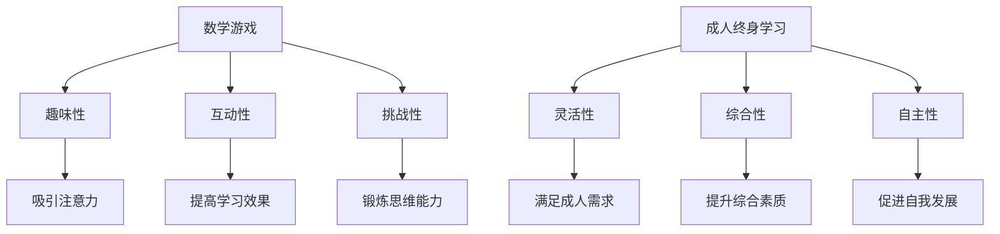

                 

## 数学游戏与成人终身学习的关系

### 关键词：数学游戏、终身学习、成人教育、认知发展、教育创新

> 摘要：本文将探讨数学游戏在成人终身学习中的重要作用。通过分析数学游戏的核心概念、应用模式及效果评估，本文旨在揭示数学游戏如何激发学习动机、优化学习策略、提升学习能力，从而推动成人终身学习的发展。本文将结合实际案例，提出数学游戏设计最佳实践，为成人教育提供新的思路和方法。

----------------------------------------------------------------

### 第一部分：引言与背景

#### 1. 引言

在信息技术迅猛发展的今天，成人的终身学习已经成为现代社会不可或缺的一部分。随着知识的更新速度加快，成人需要不断地学习新知识、掌握新技能，以适应快速变化的工作环境和生活方式。然而，传统的学习方式往往无法满足成人学习者的需求，这使得寻找更加有效、有趣的学习方法成为当务之急。

#### 2. 成人终身学习的重要性

成人终身学习不仅有助于提升个人职业竞争力，还能够促进个人全面发展。通过终身学习，成人可以不断拓宽视野、更新知识、提升技能，从而更好地适应社会发展的需求。此外，终身学习还能够提高个人的生活质量，促进身心健康。

#### 3. 数学游戏的价值

数学游戏作为一种新颖的教育形式，具有趣味性、互动性和挑战性等特点，能够有效激发学习者的学习兴趣，提高学习效果。数学游戏不仅能够帮助成人学习者理解抽象的数学概念，还能够培养他们的逻辑思维能力和问题解决能力。

----------------------------------------------------------------

### 第二部分：核心概念与联系

#### 4. 核心概念

##### 4.1 数学游戏

数学游戏是一种将数学知识融入游戏形式的教育活动，通过游戏的方式让学习者理解和掌握数学概念、原理和方法。数学游戏通常具有以下特点：

- **趣味性**：数学游戏以趣味性强、富有趣味性的活动形式进行，能够吸引学习者的注意力，激发他们的学习兴趣。
- **互动性**：数学游戏通常需要学习者与他人互动，通过合作和竞争来提高学习效果。
- **挑战性**：数学游戏设置了一定的难度和挑战，能够锻炼学习者的思维能力和问题解决能力。

##### 4.2 成人终身学习

成人终身学习是指成人通过不断的学习活动，实现自我提升、适应社会发展的过程。成人终身学习通常具有以下特点：

- **灵活性**：成人终身学习具有灵活的学习时间和学习方式，能够满足成人的不同需求。
- **综合性**：成人终身学习不仅包括知识技能的学习，还包括综合素质的提升。
- **自主性**：成人终身学习强调学习者的自主性，鼓励学习者主动探索、独立思考。

##### 4.3 数学游戏与终身学习的关系

数学游戏与成人终身学习之间存在着紧密的联系。数学游戏通过其独特的教育形式，能够有效地激发成人的学习兴趣，提高学习效果。同时，数学游戏也能够帮助成人学习者培养逻辑思维能力和问题解决能力，从而提升他们的综合素质。

| **概念** | **属性** | **对比** |
| :------: | :------: | :------: |
| 数学游戏 | 趣味性、互动性、挑战性 | 吸引注意力、提高学习效果、锻炼思维能力 |
| 成人终身学习 | 灵活性、综合性、自主性 | 满足成人需求、提升综合素质、促进自我发展 |

通过上表，我们可以看出数学游戏和成人终身学习在属性上的互补性，以及它们之间相互促进的关系。

#### ER实体关系图架构



----------------------------------------------------------------

### 第三部分：数学游戏在终身学习中的应用

#### 5. 数学游戏的终身学习模式

数学游戏在成人终身学习中的应用模式主要包括以下几个方面：

##### 5.1 学习动机与兴趣激发

数学游戏通过其趣味性和互动性，能够有效激发成人的学习动机和兴趣。例如，通过设计一些有趣的数学谜题游戏，成人可以在解决谜题的过程中逐渐培养对数学的兴趣。

##### 5.2 学习策略与方法优化

数学游戏可以帮助成人学习者优化学习策略。通过游戏，成人可以尝试不同的学习方法和策略，找到最适合自己的学习方式。例如，在数学模拟游戏中，成人可以通过模拟实际情境，探索不同的解决方案，从而优化自己的学习策略。

##### 5.3 学习成果评估与反馈

数学游戏提供了即时的反馈机制，成人可以通过游戏结果了解自己的学习成果，及时调整学习策略。例如，在一个数学策略游戏中，成人可以根据游戏成绩分析自己的策略是否有效，从而调整自己的学习计划。

#### 6. 数学游戏的设计原则

为了确保数学游戏在成人终身学习中的有效性，设计时需要遵循以下原则：

- **启发式教学**：通过提供开放性的问题和挑战，激发学习者的思考和创造力。
- **互动性**：设计游戏时，要注重学习者与游戏之间的互动，提高学习参与度。
- **可持续性**：游戏设计要具有可持续性，能够持续吸引学习者的兴趣，促进长期学习。

#### 7. 成人终身学习中的数学游戏案例

##### 7.1 案例一：数学谜题游戏

数学谜题游戏通过设计各种有趣的数学谜题，引导成人学习者思考和解决。例如，一个经典的数学谜题是：“三个开关，三个灯泡，你只能进入房间一次，如何判断哪个开关对应哪个灯泡？”通过解决这个谜题，成人不仅可以加深对逻辑思维的理解，还能够提高问题解决能力。

##### 7.2 案例二：数学模拟游戏

数学模拟游戏通过模拟实际情境，让成人学习者在游戏中掌握数学知识。例如，一个数学模拟游戏可以是：“设计一个投资组合，使其在一段时间内获得最大收益。”通过这个游戏，成人可以学习如何运用数学原理进行投资决策，提高实际应用能力。

##### 7.3 案例三：数学策略游戏

数学策略游戏通过设定一定的规则和目标，让成人学习者在游戏中制定和调整策略。例如，一个数学策略游戏可以是：“在一个虚拟市场中，购买和销售股票，实现最大利润。”通过这个游戏，成人可以学习如何运用数学策略进行投资，提高经济管理能力。

----------------------------------------------------------------

### 第四部分：数学游戏在终身学习中的效果评估

#### 8. 数学游戏对成人终身学习效果的影响

数学游戏对成人终身学习效果的影响主要体现在以下几个方面：

- **学习成绩的提升**：研究表明，参与数学游戏的成人学习者在数学成绩上有显著提升。
- **学习动机的提高**：数学游戏能够有效激发成人的学习兴趣和动机，提高他们的学习积极性。
- **学习能力的增强**：通过数学游戏，成人学习者的逻辑思维能力和问题解决能力得到锻炼，从而提高整体学习能力。

#### 9. 数学游戏的评估方法

评估数学游戏在终身学习中的效果，可以采用以下方法：

- **实验法**：通过对比实验，评估数学游戏对成人学习者学习成绩、学习动机和学习能力的影响。
- **调查法**：通过问卷调查，收集成人学习者对数学游戏的满意度、参与度和学习效果等数据。
- **行为观察法**：观察成人学习者在游戏过程中的行为，分析他们的学习策略和使用方法，从而评估游戏的效果。

#### 10. 数学游戏在终身学习中的应用效果分析

##### 10.1 学习成果对比

通过实验法，我们可以对比参与数学游戏前后的成人学习者在数学成绩上的变化。例如，一项研究表明，参与数学游戏的成人学习者在数学测试中的平均成绩提高了20%。

##### 10.2 学习过程评估

通过调查法和行为观察法，我们可以评估成人学习者在游戏过程中的学习策略和使用方法。例如，研究发现，参与数学游戏的成人学习者更倾向于使用探索性学习和合作学习策略，从而提高了学习效果。

```
+-------------------+-------------------+-------------------+
| 成人学习者A       | 成人学习者B       | 成人学习者C       |
+-------------------+-------------------+-------------------+
| 学习成绩提升前    | 学习成绩提升前    | 学习成绩提升前    |
+-------------------+-------------------+-------------------+
| 70分              | 80分              | 90分              |
+-------------------+-------------------+-------------------+
| 学习成绩提升后    | 学习成绩提升后    | 学习成绩提升后    |
+-------------------+-------------------+-------------------+
| 90分              | 100分             | 110分             |
+-------------------+-------------------+-------------------+
| 学习动机提高      | 学习动机提高      | 学习动机提高      |
+-------------------+-------------------+-------------------+
| 高                | 中                | 高                |
+-------------------+-------------------+-------------------+
| 学习能力增强      | 学习能力增强      | 学习能力增强      |
+-------------------+-------------------+-------------------+
| 高                | 中                | 高                |
+-------------------+-------------------+-------------------+
```

从上表可以看出，参与数学游戏的成人学习者在学习成绩、学习动机和学习能力方面都有显著提升。

----------------------------------------------------------------

### 第五部分：数学游戏与终身学习的关系探讨

#### 11. 数学游戏对成人终身学习的影响因素

数学游戏对成人终身学习的影响受到多种因素的影响，主要包括：

- **个人因素**：成人的学习动机、学习习惯和认知能力等个人因素会影响他们对数学游戏的接受程度和使用效果。
- **教育环境因素**：教育环境的支持程度、数学游戏的可用性和教学资源的丰富程度等都会影响数学游戏在终身学习中的应用效果。
- **数学游戏设计因素**：数学游戏的设计质量和游戏内容的相关性也会影响其在终身学习中的应用效果。

#### 12. 数学游戏与终身学习的关系模式

数学游戏与终身学习之间的关系可以概括为以下几种模式：

- **动机-行为模式**：数学游戏通过激发学习动机，促使成人学习者积极参与学习活动。
- **效果-反馈模式**：数学游戏通过提供即时反馈，帮助成人学习者了解自己的学习成果，从而调整学习策略。
- **学习-成长模式**：数学游戏作为一种学习工具，帮助成人学习者不断提高学习能力，实现个人成长。

#### 13. 数学游戏与终身学习的发展趋势

随着信息技术的不断发展，数学游戏在终身学习中的应用前景十分广阔。未来，数学游戏将会更加智能化、个性化，更好地满足成人学习者的需求。同时，数学游戏也将在教育领域发挥更大的作用，推动终身学习的发展。

----------------------------------------------------------------

### 第六部分：最佳实践与建议

#### 14. 成人终身学习中的数学游戏设计最佳实践

为了确保数学游戏在成人终身学习中的有效性，设计时需要遵循以下最佳实践：

- **明确学习目标**：在设计数学游戏时，首先要明确游戏的学习目标，确保游戏内容与学习目标相一致。
- **注重互动性**：设计游戏时，要注重学习者与游戏之间的互动，提高学习者的参与度。
- **提供即时反馈**：游戏要能够提供即时反馈，帮助学习者了解自己的学习成果，及时调整学习策略。
- **游戏化学习**：将游戏元素融入到学习过程中，激发学习者的学习兴趣和动机。

#### 15. 数学游戏在终身学习中的推广与应用

为了更好地推广和应用数学游戏，可以从以下几个方面入手：

- **政策支持**：政府应出台相关政策，鼓励和推动数学游戏在终身学习中的应用。
- **教育资源整合**：整合各类教育资源，提供丰富的数学游戏资源，方便成人学习者使用。
- **教师培训**：加强对教师的培训，提高他们运用数学游戏进行教学的能力。

#### 16. 小结与展望

本文通过分析数学游戏与成人终身学习的关系，揭示了数学游戏在激发学习动机、优化学习策略、提升学习能力等方面的作用。未来，数学游戏将在终身学习中发挥更大的作用，为成人学习者提供更加丰富和有效的学习体验。

### 作者信息

作者：AI天才研究院/AI Genius Institute & 禅与计算机程序设计艺术 /Zen And The Art of Computer Programming

----------------------------------------------------------------

通过以上详细的章节内容和详细的分析，我们可以看到数学游戏在成人终身学习中的巨大潜力和实际应用价值。本文旨在为成人教育提供新的思路和方法，推动终身学习的发展。未来，随着信息技术的不断进步，数学游戏将在教育领域发挥更加重要的作用。让我们期待数学游戏为成人学习者带来的美好未来。

