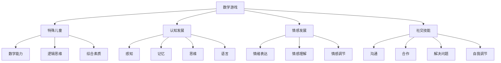

                 

### 第一部分：引言

#### 第1章：问题背景与核心概念

##### 1.1 问题背景

在当今社会，特殊儿童的界定与现状成为了一个备受关注的话题。根据世界卫生组织（WHO）的定义，特殊儿童是指由于生理、心理、智力等原因，在学习、生活和社会交往方面存在显著困难，需要特殊支持和教育的儿童。这些儿童通常包括自闭症儿童、智力障碍儿童、听力障碍儿童、视力障碍儿童、语言障碍儿童等。

据统计，全球约有10%的儿童被认为是特殊儿童，他们在接受传统教育的过程中，常常面临诸多挑战。传统的教育模式往往难以满足特殊儿童的需求，导致他们在学习过程中缺乏兴趣、参与度低，甚至产生自卑和抵触情绪。因此，寻找一种能够激发特殊儿童学习兴趣、提高学习效果的教育方法，成为了教育工作者和研究者的共同目标。

数学游戏作为一种新颖的教育手段，逐渐引起了人们的关注。数学游戏是指以数学概念为核心，通过趣味性、互动性和挑战性，激发学习兴趣和思维能力的教学工具。数学游戏的设计理念源于游戏化学习（Gamification of Learning），它将游戏机制引入到教育过程中，旨在通过游戏化的方式提升学生的学习体验和学习效果。

数学游戏在教育中的应用价值主要体现在以下几个方面：

1. **提高学习兴趣**：数学游戏通常具有趣味性、挑战性和互动性，能够激发学生的学习兴趣，使他们在轻松愉快的氛围中学习数学知识。
   
2. **培养思维能力**：数学游戏往往需要学生运用逻辑思维、分析问题和解决问题的能力，从而提高他们的思维能力和创新能力。

3. **促进全面发展**：数学游戏不仅有助于提高学生的数学能力，还能在认知、情感和社交能力方面产生积极影响，促进学生的全面发展。

特别儿童教育与数学游戏的结合，不仅可以弥补传统教育方法的不足，还能为特殊儿童提供一种更加适应其需求的教育方式。数学游戏在特别儿童教育中的重要性体现在以下几个方面：

1. **提高学习效果**：数学游戏能够通过趣味性和互动性，提高特殊儿童的学习效果，使他们更好地掌握数学知识和技能。

2. **提升适应能力**：通过数学游戏，特殊儿童可以在模拟的社交环境中提升适应能力，更好地融入社会。

3. **增强自信心**：成功的游戏体验能够增强特殊儿童的自尊心和自信心，有助于他们克服学习障碍，实现自我提升。

##### 1.2 核心概念

###### 数学游戏

**定义**：数学游戏是一种以数学概念为核心，通过游戏化的方式呈现的教育工具。它通常包含数学问题、规则和挑战，旨在通过趣味性和互动性，激发学生的学习兴趣和思维能力。

**类型与应用**：

- **智力类数学游戏**：如数独、华容道等，旨在锻炼学生的逻辑思维和问题解决能力。
- **策略类数学游戏**：如棋类游戏、数学竞赛等，通过策略思考和决策，提升学生的思维能力和竞争力。
- **模拟类数学游戏**：如股票市场模拟、银行理财等，通过模拟真实情境，培养学生的数学应用能力和决策能力。

**教育应用**：

- **小学数学教学**：利用数独、华容道等游戏，提高学生的数学思维能力和学习兴趣。
- **初中数学拓展**：通过数学竞赛、数学谜题等游戏，拓宽学生的数学知识面，培养他们的创新能力。
- **高中数学辅导**：借助数学模拟游戏，帮助学生理解复杂数学概念，提高解题能力。

###### 特殊儿童教育

**特殊需求**：

- **认知需求**：特殊儿童由于智力、认知能力的差异，需要适合其认知水平的教学内容和方法。
- **情感需求**：特殊儿童在情感上可能更为脆弱，需要得到更多的关爱和支持，以提高他们的自信心和自尊心。
- **社交需求**：特殊儿童需要更多的社交机会，以提高他们的社交能力和融入社会的能力。

**教育目标**：

- **提高学习效果**：通过个性化的教学方案，帮助特殊儿童掌握基础知识和技能。
- **促进全面发展**：关注特殊儿童的认知、情感和社交能力，促进他们的全面发展。
- **提升生活技能**：通过教育，帮助特殊儿童提高生活自理能力和适应社会的能力。

**方法与策略**：

- **个性化教学**：根据特殊儿童的需求和特点，制定个性化的教学方案，使教学更具针对性。
- **互动式教学**：利用数学游戏、多媒体等互动手段，增强学生的参与感和互动性。
- **家庭和学校合作**：通过家庭和学校的紧密合作，共同关注和支持特殊儿童的教育和成长。

###### 数学与特殊儿童教育的结合点

数学与特殊儿童教育的结合点主要体现在以下几个方面：

1. **教学内容**：数学游戏可以涵盖从基础数学知识到高级数学理论的各个层面，满足不同层次特殊儿童的学习需求。

2. **教学方法**：数学游戏通过趣味性和互动性，提供了一种生动、有趣的教学方法，有助于提高特殊儿童的学习兴趣和参与度。

3. **教学评价**：数学游戏提供了实时反馈和评估机制，可以帮助教师及时了解学生的学习进展，调整教学策略。

4. **跨学科融合**：数学游戏不仅可以作为数学学科的教学工具，还可以与其他学科（如科学、艺术等）相结合，促进学生的全面发展。

##### 1.3 书籍结构

本书旨在深入探讨数学游戏与特殊儿童教育的结合，通过系统的理论分析和实践案例，为教育工作者和家长提供有益的参考。全书共分为四个部分：

**第一部分：引言**：介绍数学游戏与特殊儿童教育的结合背景和重要性。

**第二部分：数学游戏的原理与应用**：探讨数学游戏的教育原理、设计原则和教学方法，以及其在特殊儿童教育中的应用。

**第三部分：数学游戏在教学实践中的应用**：分析数学游戏在课堂教学和特殊教育中的实际应用，包括案例研究和效果评估。

**第四部分：数学游戏与特殊儿童教育的未来展望**：探讨数学游戏在特殊儿童教育中的发展趋势和前景，以及教育政策和长期效果。

通过本书的阅读，读者可以全面了解数学游戏与特殊儿童教育的结合，掌握数学游戏的设计和应用方法，为特殊儿童提供更有效、更具有针对性的教育支持。

#### 第2章：数学游戏的教育原理

##### 2.1 游戏在儿童发展中的作用

**游戏对儿童认知发展的作用**：

游戏是儿童认知发展的重要途径。通过游戏，儿童可以不断探索和尝试新事物，从而促进其认知能力的提升。以下是一些关键点：

1. **问题解决能力**：游戏通常包含各种问题情境，儿童在解决问题时需要运用逻辑思维和策略思考，从而提升其问题解决能力。

2. **概念理解**：游戏中的各种规则和概念需要儿童理解和掌握，从而加深对相关数学概念的理解和记忆。

3. **抽象思维**：游戏中的挑战和规则往往需要儿童进行抽象思维，从而培养其抽象思维能力。

**游戏对儿童情感发展的作用**：

游戏不仅对儿童的认知发展有重要影响，还在情感发展方面发挥着重要作用。以下是一些关键点：

1. **自信心和自尊心**：通过成功的游戏体验，儿童可以增强自信心和自尊心，从而更有信心面对学习和生活的挑战。

2. **情绪调节**：游戏可以提供一个情感宣泄的途径，帮助儿童学会调节情绪，减轻压力和焦虑。

3. **社交情感**：游戏中的合作和竞争机制可以培养儿童的社交情感，帮助他们更好地理解和处理人际关系。

**游戏对儿童社交能力发展的作用**：

游戏是儿童社交能力发展的重要场所。通过游戏，儿童可以学会如何与他人合作、分享和沟通。以下是一些关键点：

1. **合作与竞争**：游戏中的合作和竞争机制可以培养儿童的团队合作精神，提高他们的竞争意识和公平竞争能力。

2. **沟通与交流**：游戏中的互动和沟通可以帮助儿童学会表达自己的想法和感受，提高他们的沟通能力。

3. **同理心**：通过与他人合作，儿童可以更好地理解和关心他人的需求，培养同理心。

###### 数学游戏如何促进特殊儿童的发展

**数学游戏在认知发展方面的作用**：

对于特殊儿童，数学游戏可以提供一种更具有吸引力和互动性的学习方式，从而促进其认知发展。以下是一些具体作用：

1. **个性化学习**：数学游戏可以根据特殊儿童的不同需求和学习能力，提供个性化的学习内容，使学习更具针对性。

2. **趣味性**：数学游戏通过趣味性和互动性，提高特殊儿童的学习兴趣，使他们更愿意主动参与学习。

3. **多感官体验**：数学游戏可以结合视觉、听觉和动手操作等多种感官体验，帮助特殊儿童更好地理解和掌握数学概念。

**数学游戏在情感发展方面的作用**：

数学游戏在情感发展方面同样具有重要作用，可以提升特殊儿童的情感素质。以下是一些具体作用：

1. **自信心和自尊心**：通过成功的游戏体验，特殊儿童可以增强自信心和自尊心，从而更有信心面对学习和生活的挑战。

2. **情绪调节**：数学游戏可以提供一个情感宣泄的途径，帮助特殊儿童学会调节情绪，减轻压力和焦虑。

3. **积极情绪体验**：成功的游戏体验可以带给特殊儿童积极的情绪体验，提高他们的幸福感。

**数学游戏在社交能力发展方面的作用**：

数学游戏在社交能力发展方面同样具有重要意义，可以提升特殊儿童的社交能力。以下是一些具体作用：

1. **合作与沟通**：数学游戏中的合作和竞争机制可以帮助特殊儿童学会如何与他人合作、沟通和交流。

2. **同理心**：通过与他人合作，特殊儿童可以更好地理解和关心他人的需求，培养同理心。

3. **社交技能**：数学游戏可以提供一个社交场景，帮助特殊儿童在实践中提高社交技能，如分享、轮流、协商等。

**数学游戏设计的原则**

**1. 趣味性**：趣味性是数学游戏设计的关键要素。游戏需要具备足够的趣味性，以吸引特殊儿童的注意力，激发他们的学习兴趣。

**2. 互动性**：互动性是数学游戏的重要特征。通过互动，特殊儿童可以更深入地参与游戏，体验其中的乐趣，从而更好地理解和掌握数学概念。

**3. 适应性**：适应性是指数学游戏需要根据特殊儿童的不同需求和学习能力进行调整，使其更具针对性和有效性。

**4. 个性化**：个性化是指数学游戏需要提供多样化的内容和形式，以满足不同特殊儿童的学习需求，提高他们的学习效果。

**5. 实用性**：实用性是指数学游戏需要具有实际的教育价值，能够帮助特殊儿童提高数学能力和综合素质。

**数学游戏在教学实践中的应用**

**1. 教学准备**：教师在开展数学游戏教学前，需要充分了解特殊儿童的需求和学习特点，选择合适的数学游戏，并进行适当的准备和调整。

**2. 游戏导入**：教师在游戏开始前，可以通过简短的讲解和演示，帮助特殊儿童理解游戏的规则和目标，激发他们的学习兴趣。

**3. 游戏进行**：在游戏过程中，教师需要密切关注特殊儿童的表现，提供必要的帮助和指导，确保他们能够顺利完成任务。

**4. 游戏总结**：在游戏结束后，教师可以组织特殊儿童进行总结和反思，帮助他们巩固所学知识，提高学习效果。

**5. 教学评价**：教师需要通过观察和记录，评估特殊儿童在数学游戏中的表现和进步，及时调整教学策略，提高教学效果。

##### 2.3 教师在数学游戏教学中的角色

**1. 设计者**：教师需要根据特殊儿童的需求和学习特点，设计和选择合适的数学游戏，确保游戏的教育价值和针对性。

**2. 指导者**：教师在数学游戏教学中，需要提供必要的指导和支持，帮助特殊儿童理解游戏规则、完成任务。

**3. 观察者**：教师需要密切关注特殊儿童在游戏中的表现，观察他们的兴趣、行为和学习效果，为后续教学提供参考。

**4. 反思者**：教师需要在游戏结束后，组织特殊儿童进行反思和总结，帮助他们巩固所学知识，提高学习效果。

**5. 合作者**：教师需要与特殊儿童建立良好的合作关系，尊重他们的需求和意见，共同创造一个积极、有益的学习环境。

### 第3章：特殊儿童教育的数学游戏应用

#### 3.1 认知发展相关的数学游戏

**认知发展理论**

认知发展理论是心理学中的一个重要分支，旨在研究人类认知能力的发展和变化。瑞士心理学家让·皮亚杰（Jean Piaget）是认知发展理论的奠基人，他提出了著名的认知发展理论模型，将儿童的认知发展分为四个阶段：感知运动阶段、前运算阶段、具体运算阶段和形式运算阶段。

在认知发展理论中，数学游戏被视为一种有效的教育工具，可以帮助儿童在各个认知发展阶段中取得进步。以下是一些与认知发展相关的数学游戏及其设计原则：

**1. 感知运动阶段（0-2岁）**

- **游戏类型**：简单触摸、抓取和探索游戏
- **设计原则**：利用颜色、形状和大小等感官刺激，引导儿童进行感知和运动活动。

**2. 前运算阶段（2-7岁）**

- **游戏类型**：匹配游戏、排序游戏和分类游戏
- **设计原则**：通过简单的规则和任务，帮助儿童建立基本的数学概念，如数量、形状和顺序。

**3. 具体运算阶段（7-11岁）**

- **游戏类型**：数独、拼图和算术游戏
- **设计原则**：增加游戏的难度和复杂性，培养儿童的逻辑思维和问题解决能力。

**4. 形式运算阶段（11-15岁）**

- **游戏类型**：策略游戏、模拟游戏和数学竞赛
- **设计原则**：通过复杂的规则和挑战，培养儿童的高级数学思维和创新能力。

**设计与案例分析**

以下是一些认知发展相关的数学游戏设计案例：

**案例1：感知运动阶段的触摸游戏**

- **游戏名称**：触摸珠子
- **游戏规则**：教师准备一组不同颜色、形状和大小的珠子，让儿童触摸和探索这些珠子。
- **教育目标**：通过触摸珠子，儿童可以感知和识别不同颜色、形状和大小的特征，培养其基本认知能力。

**案例2：前运算阶段的排序游戏**

- **游戏名称**：排序动物
- **游戏规则**：教师准备一组不同大小、颜色和种类的动物玩偶，让儿童按照一定规则（如大小、颜色或种类）对这些玩偶进行排序。
- **教育目标**：通过排序游戏，儿童可以理解数量和顺序的概念，培养其初步的数学思维能力。

**案例3：具体运算阶段

#### 3.2 社交技能培养的数学游戏

**社交技能的重要性**

社交技能是指个体在社会交往中表现出的行为和能力，包括沟通、合作、分享、解决问题、自我调节等。对于特殊儿童，社交技能的培养尤为重要，因为他们可能在日常生活中面临更多的挑战和障碍。社交技能的培养不仅有助于特殊儿童更好地适应社会环境，还能提高他们的自尊心和自信心。

数学游戏在社交技能培养中的应用

**1. 合作与竞争**

数学游戏通常包含合作与竞争的元素，这有助于特殊儿童学会与他人合作和竞争。以下是一些具体应用：

- **合作类数学游戏**：如“数学接力赛”，小组中的每个成员都需要完成特定的数学任务，然后将答案传递给下一个成员，最终完成整个团队的任务。
- **竞争类数学游戏**：如“数学竞赛”，学生在竞争中展示自己的数学知识和技能，培养竞争意识和公平竞争能力。

**2. 沟通与交流**

数学游戏提供了一个互动的平台，特殊儿童可以通过沟通和交流来完成任务和解决问题。以下是一些具体应用：

- **解释与说明**：在游戏过程中，学生需要向其他队员解释和说明自己的思考过程和答案，提高他们的表达能力和沟通技巧。
- **倾听与反馈**：在合作类数学游戏中，学生需要倾听其他队员的意见和反馈，学会从不同角度看待问题，提高他们的理解和接纳能力。

**3. 解决问题与决策**

数学游戏通常包含各种问题和挑战，这有助于特殊儿童学会解决问题和做出决策。以下是一些具体应用：

- **问题解决类数学游戏**：如“数学谜题”，学生需要通过逻辑思考和策略选择来解决问题，培养其问题解决能力和创新思维。
- **决策类数学游戏**：如“数学模拟”，学生在模拟真实情境中做出决策，提高其决策能力和应变能力。

**设计与案例分析**

以下是一些社交技能培养的数学游戏设计案例：

**案例1：合作类数学游戏——“数学接力赛”**

- **游戏名称**：“数学接力赛”
- **游戏规则**：将学生分成小组，每个小组的成员依次完成特定的数学任务，如计算、解题或找出特定数字等。每个成员完成任务后，将答案传递给下一个成员，最终完成整个团队的任务。
- **教育目标**：通过团队合作，学生可以学会沟通、协作和分享，培养其社交技能和团队合作精神。

**案例2：竞争类数学游戏——“数学竞赛”**

- **游戏名称**：“数学竞赛”
- **游戏规则**：学生在竞赛中展示自己的数学知识和技能，通过回答问题来赢得分数。竞赛可以是个人形式，也可以是团队形式。
- **教育目标**：通过竞争，学生可以学会尊重对手、公平竞争和自我激励，培养其竞争意识和公平竞争能力。

**案例3：沟通与交流类数学游戏——“数学讨论会”**

- **游戏名称**：“数学讨论会”
- **游戏规则**：学生在讨论会中分享自己的数学观点和思考，其他学生可以提问或发表意见。讨论会可以是个人讨论，也可以是小组讨论。
- **教育目标**：通过讨论和交流，学生可以学会表达自己的想法和观点，倾听他人的意见和反馈，提高其沟通能力和理解能力。

**案例4：解决问题与决策类数学游戏——“数学模拟”**

- **游戏名称**：“数学模拟”
- **游戏规则**：学生在模拟真实情境中做出决策，如投资、预算或资源分配等。学生需要通过逻辑思考和策略选择来解决问题。
- **教育目标**：通过模拟，学生可以学会解决问题、做出决策和应对挑战，培养其问题解决能力和决策能力。

通过这些数学游戏，特殊儿童可以在愉快的氛围中学习和提高社交技能，为其未来的社会生活打下坚实的基础。

#### 3.3 情感发展的数学游戏

**情感发展理论**

情感发展是儿童全面发展的重要组成部分。情感发展理论关注儿童情感体验、情感认知和情感调节能力的发展。以下是一些重要的情感发展理论：

1. **情绪发展理论**：情绪发展理论认为，儿童的情感发展是一个逐步成熟的过程，从简单的生理反应到复杂的情感体验。儿童早期的情绪体验主要来自生理反应，如哭闹和愉悦，随着年龄的增长，他们开始理解情绪的含义，并能够表达和调节情绪。

2. **情感认知理论**：情感认知理论强调情感在认知过程中的作用。儿童需要通过认知活动来理解自己的情感和他人情感，从而建立情感联系和情感关系。

3. **情感调节理论**：情感调节理论关注儿童如何控制和调节自己的情绪反应。有效的情感调节能力可以帮助儿童应对压力和挑战，提高他们的适应能力和心理健康。

**数学游戏在情感发展方面的应用**

**1. 自我表达**

数学游戏可以提供一个安全的平台，让特殊儿童表达自己的情感和想法。以下是一些具体应用：

- **绘画与表达**：在数学游戏中，学生可以通过绘画表达自己对数学问题的感受和理解，释放内心的情感。
- **角色扮演**：通过角色扮演，学生可以模拟不同情境中的数学问题，表达自己的情感和观点。

**2. 情感理解**

数学游戏可以帮助特殊儿童理解他人的情感和需求，提高他们的情感认知能力。以下是一些具体应用：

- **情感故事**：在数学游戏中，学生可以阅读或听关于情感的故事，了解不同情感的含义和表达方式。
- **互动讨论**：在游戏结束后，学生可以参与互动讨论，分享自己的情感体验和理解，听取他人的观点和反馈。

**3. 情感调节**

数学游戏可以帮助特殊儿童学会调节自己的情绪，提高他们的情感调节能力。以下是一些具体应用：

- **呼吸放松**：在数学游戏过程中，学生可以尝试呼吸放松技巧，缓解紧张和焦虑情绪。
- **情感日记**：学生可以记录自己在游戏中的情感体验，分析情绪变化的原因，学会自我调节。

**设计与案例分析**

以下是一些情感发展的数学游戏设计案例：

**案例1：自我表达类数学游戏——“数学故事会”**

- **游戏名称**：“数学故事会”
- **游戏规则**：学生通过绘画或口头讲述的方式，创作一个与数学相关的故事，表达自己的情感和想法。
- **教育目标**：通过创作和分享故事，学生可以学会自我表达，释放内心的情感，提高自我认知能力。

**案例2：情感理解类数学游戏——“情感猜猜看”**

- **游戏名称**：“情感猜猜看”
- **游戏规则**：学生在游戏中扮演不同角色，通过观察和互动，猜测他人的情感和需求，提高情感认知能力。
- **教育目标**：通过角色扮演和互动，学生可以学会理解和尊重他人的情感，培养同理心。

**案例3：情感调节类数学游戏——“情绪放松操”**

- **游戏名称**：“情绪放松操”
- **游戏规则**：学生在游戏过程中，尝试不同的放松技巧，如深呼吸、肌肉放松等，缓解紧张和焦虑情绪。
- **教育目标**：通过放松技巧的练习，学生可以学会调节自己的情绪，提高情绪调节能力。

通过这些数学游戏，特殊儿童可以在轻松愉快的氛围中提高情感素质，为其全面发展奠定坚实基础。

### 第4章：数学游戏在课堂教学中的应用

#### 4.1 课堂中数学游戏的实践

**课堂活动设计**

数学游戏在课堂中的应用可以设计为多种形式，以下是一些常见的活动设计：

**1. 激趣导入**

- **活动形式**：通过趣味性数学游戏，如“数独”、“24点”等，引入新课程内容，激发学生的学习兴趣。
- **实施步骤**：
  - 教师准备数学游戏，介绍规则和目标。
  - 学生分组或个人参与游戏，体验数学乐趣。
  - 教师总结游戏结果，引入新课内容。

**2. 合作探究**

- **活动形式**：通过合作类数学游戏，如“数学接力赛”、“团队数独”等，促进学生之间的合作与交流。
- **实施步骤**：
  - 教师分配任务，明确游戏规则和目标。
  - 学生分组，共同完成数学任务。
  - 教师组织分享和讨论，总结合作经验。

**3. 竞赛巩固**

- **活动形式**：通过数学竞赛，如“数学谜题挑战”、“数学知识竞赛”等，激发学生的学习积极性，巩固所学知识。
- **实施步骤**：
  - 教师准备竞赛题目，制定竞赛规则。
  - 学生分组或个人参与竞赛，展示自己的数学能力。
  - 教师公布竞赛结果，进行奖励和总结。

**教学案例分享**

**案例1：数独游戏的课堂实践**

- **教学目标**：通过数独游戏，帮助学生理解和掌握基本的数学运算规则，提高逻辑思维能力。
- **教学过程**：
  - 教师介绍数独游戏的规则和目标。
  - 学生分组，进行数独游戏比赛。
  - 教师讲解游戏中的数学原理和技巧，引导学生思考和解决问题。
  - 教师总结游戏结果，评价学生的学习表现。

**案例2：数学接力赛的课堂实践**

- **教学目标**：通过数学接力赛，培养学生的团队合作精神和问题解决能力。
- **教学过程**：
  - 教师分配任务，明确比赛规则和目标。
  - 学生分组，进行数学接力赛。
  - 教师组织学生分享比赛经验和策略。
  - 教师总结比赛结果，提出改进建议。

**案例3：数学知识竞赛的课堂实践**

- **教学目标**：通过数学知识竞赛，激发学生的学习兴趣，巩固所学知识。
- **教学过程**：
  - 教师准备竞赛题目，制定竞赛规则。
  - 学生分组或个人参与竞赛。
  - 教师实时公布竞赛结果，进行奖励和总结。
  - 教师针对竞赛中的问题进行讲解和复习。

这些教学案例表明，数学游戏在课堂中的应用不仅能够提高学生的学习兴趣和参与度，还能促进学生的思维能力和团队合作精神的培养。

#### 4.2 教学评估与反馈

**评估特殊儿童在数学游戏中的进步**

为了有效评估特殊儿童在数学游戏中的进步，教师需要采用多元化的评估方法，包括观察、测试和反馈等。

1. **观察法**：教师可以通过观察学生在数学游戏中的表现，如兴趣、参与度和解决问题的能力，评估其进步情况。
2. **测试法**：定期进行数学测试，评估学生在游戏中学到的知识和技能的掌握程度。
3. **反馈法**：教师可以通过与学生和家长的沟通，获取他们对数学游戏的反馈，了解学生的情感体验和学习效果。

**教学反馈的重要性与实践**

1. **及时反馈**：及时反馈可以帮助学生了解自己在游戏中的表现，发现问题和不足，及时调整学习策略。
2. **个性化反馈**：根据学生的不同需求和特点，给予个性化的反馈，提高反馈的有效性和针对性。
3. **持续反馈**：通过持续反馈，教师可以跟踪学生的进步情况，调整教学方法和策略，确保教学目标的实现。

在实践中，教师可以通过以下方式给予教学反馈：

- **口头反馈**：在游戏过程中，教师可以及时给予口头反馈，鼓励学生继续努力。
- **书面反馈**：在游戏结束后，教师可以给出书面反馈，详细说明学生的进步和需要改进的地方。
- **互动反馈**：教师可以组织学生进行互动反馈，分享学习心得和经验，促进学生的自我反思和成长。

通过有效的教学评估和反馈，教师可以更好地了解学生的需求，调整教学策略，提高数学游戏的教学效果。

### 第5章：数学游戏在特殊教育中的案例研究

#### 5.1 特殊教育学校的案例研究

**案例描述**

某特殊教育学校致力于通过数学游戏提升学生的数学能力和综合素质。该校的数学游戏项目从设计到实施都经过了周密的规划和实践，取得了显著的教育效果。

**项目介绍**

项目名称：数学游戏提升计划

项目目标：通过数学游戏，提高学生的数学能力、逻辑思维和综合素质。

项目内容：

1. **游戏设计与开发**：学校与专业游戏设计师合作，根据学生的认知水平和兴趣爱好，设计了一系列趣味性、互动性强的数学游戏。
2. **教学实施**：每周安排一节数学游戏课，教师引导学生进行游戏，并给予指导和反馈。
3. **家长参与**：学校鼓励家长参与数学游戏，提供家庭游戏指导，确保学生在家庭环境中也能继续练习。

**教学效果分析**

通过一年的实施，该项目取得了显著的教育效果：

1. **数学能力提升**：学生在数学知识掌握和运算能力方面有显著提高，许多学生在数学测试中的成绩有了明显提升。
2. **逻辑思维能力**：学生在游戏中不断解决问题和应对挑战，逻辑思维能力和问题解决能力得到了锻炼和提升。
3. **综合素质**：数学游戏不仅提高了学生的数学能力，还培养了他们的团队合作精神、沟通能力和自我管理能力。

**项目成功的关键因素**

1. **个性化设计**：数学游戏根据学生的个体差异进行个性化设计，确保游戏内容适合学生的认知水平和兴趣爱好。
2. **教师培训**：教师接受了专业培训，掌握了数学游戏的教学方法和技巧，能够有效地引导学生进行游戏。
3. **家长参与**：家长的支持和参与是项目成功的重要保障，通过家庭游戏指导，学生可以在家庭环境中继续练习和巩固所学知识。

#### 5.2 家庭数学游戏的应用

**家庭环境中的数学游戏**

家庭是特殊儿童学习和发展的重要场所，数学游戏在家庭中的应用有助于学生在家庭环境中继续学习和提高。以下是一些家庭数学游戏的应用场景：

1. **日常生活中的数学**：家长可以在日常生活中引入数学元素，如计算购物金额、测量食材分量等，让学生在真实情境中运用数学知识。
2. **亲子互动游戏**：家长可以与孩子一起玩数学游戏，如“数学拼图”、“数学猜谜”等，增进亲子关系的同时，提高学生的数学能力。
3. **家庭作业辅导**：家长可以利用数学游戏辅助孩子完成家庭作业，通过游戏的方式帮助学生理解和掌握数学概念。

**家长在数学游戏中的角色**

1. **指导者**：家长需要根据孩子的年龄和认知水平，选择合适的数学游戏，并给予适当的指导。
2. **参与者**：家长需要积极参与数学游戏，与孩子一起学习和探索，营造积极的学习氛围。
3. **支持者**：家长需要给予孩子足够的支持和鼓励，帮助他们克服困难，享受数学学习的乐趣。

**家庭数学游戏的优势**

1. **灵活性**：家庭数学游戏可以根据家庭成员的时间安排和兴趣爱好进行调整，灵活实施。
2. **互动性**：家庭数学游戏可以增进家庭成员之间的互动，提高家庭的凝聚力和幸福感。
3. **教育性**：家庭数学游戏不仅有助于提高学生的数学能力，还能在认知、情感和社交能力方面产生积极影响。

通过家庭数学游戏的应用，家长可以更好地支持孩子的学习和发展，为他们的成长提供有力保障。

#### 5.3 社区资源与数学游戏的推广

**社区资源的作用**

社区资源在数学游戏的推广中发挥着重要作用，可以为特殊儿童提供丰富的学习资源和活动机会。以下是一些社区资源的作用：

1. **教育资源**：社区图书馆、教育中心等资源可以提供丰富的数学书籍、游戏材料和教学工具，帮助特殊儿童和家庭开展数学游戏活动。
2. **活动组织**：社区可以组织数学游戏活动，如讲座、工作坊、比赛等，提高公众对数学游戏的关注度和参与度。
3. **志愿者支持**：社区志愿者可以为特殊儿童提供辅导和支持，帮助他们更好地参与数学游戏活动。

**数学游戏的推广策略**

1. **宣传推广**：通过社区公告栏、社交媒体、家长会等渠道，宣传数学游戏的好处和作用，提高公众的认知和参与度。
2. **专业培训**：为教师、家长和志愿者提供专业培训，提高他们对数学游戏的理解和教学能力。
3. **资源整合**：整合社区资源，建立数学游戏资源库，为特殊儿童和家庭提供便利的学习资源和支持。
4. **合作共建**：与教育机构、公益组织和企业合作，共同推广数学游戏，提高项目的覆盖面和影响力。

通过社区资源的整合和推广策略的实施，数学游戏可以在特殊儿童教育中发挥更大的作用，为他们的全面发展提供有力支持。

### 第6章：数学游戏的未来发展趋势

#### 6.1 新技术对数学游戏的影响

**人工智能与数学游戏**

人工智能（AI）在数学游戏中的应用为教育领域带来了新的机遇和挑战。通过人工智能技术，数学游戏可以实现个性化学习、智能评价和智能辅导等功能，从而提高教学效果和学生的学习体验。

1. **个性化学习**：人工智能可以根据学生的学习数据和行为特点，为其推荐适合的数学游戏和教学内容，实现个性化学习。例如，通过分析学生的学习进度和错误率，AI可以调整游戏的难度和内容，使其更符合学生的实际需求。

2. **智能评价**：人工智能可以通过分析学生在游戏中的表现，进行实时评价和反馈。这种智能评价不仅可以帮助教师更好地了解学生的学习情况，还能为学生提供个性化的学习建议。

3. **智能辅导**：人工智能可以为学生提供智能辅导，帮助他们解决数学问题。例如，当学生在游戏中遇到困难时，AI可以提供详细的解题步骤和解释，帮助学生理解和掌握相关数学概念。

**虚拟现实在数学游戏中的应用**

虚拟现实（VR）技术为数学游戏带来了全新的体验和学习方式。通过VR，学生可以进入一个逼真的数学世界，进行沉浸式学习，从而提高学习效果和兴趣。

1. **沉浸式学习**：VR技术可以创建一个三维的数学学习环境，让学生在虚拟空间中互动和探索。这种沉浸式学习方式能够激发学生的好奇心和探索欲，提高他们的学习兴趣。

2. **互动性**：VR游戏通常具有高度的互动性，学生可以在虚拟环境中进行各种操作和实验，从而更好地理解和掌握数学概念。

3. **实践性**：VR技术可以模拟真实情境，让学生在虚拟环境中进行数学应用和实践。这种实践性学习方式能够帮助学生将数学知识应用到实际生活中，提高他们的数学应用能力。

**增强现实与混合现实在数学游戏中的应用**

增强现实（AR）和混合现实（MR）技术也为数学游戏带来了新的可能性。通过AR和MR，学生可以将在现实世界中的数学问题与虚拟世界相结合，进行更加直观和生动的学习。

1. **直观学习**：AR和MR技术可以将数学概念以三维形式呈现，让学生能够更直观地理解和掌握相关知识。

2. **互动性**：通过AR和MR，学生可以与虚拟数学元素进行互动，如拖动、旋转和测量等，从而提高学习的互动性和趣味性。

3. **实践应用**：AR和MR技术可以模拟各种数学应用场景，让学生在实践中学习和应用数学知识。

总之，新技术的引入为数学游戏的发展带来了新的机遇和挑战。通过人工智能、虚拟现实、增强现实和混合现实等技术的应用，数学游戏将变得更加个性化和沉浸式，为学生提供更加丰富和多样的学习体验。

#### 6.2 数学游戏在特殊儿童教育中的发展前景

**教育政策的支持与影响**

随着社会对特殊儿童教育的关注不断增加，各国政府纷纷出台相关政策，支持特殊儿童的教育和发展。这些政策为数学游戏在特殊儿童教育中的应用提供了有利条件。

1. **财政支持**：政府通过财政拨款和补贴，支持特殊教育学校和机构开展数学游戏项目，提供必要的设备和技术支持。
2. **政策引导**：政府通过制定指导性文件和标准，引导教育机构和教师将数学游戏纳入特殊儿童教育的教学实践中，提高数学游戏的应用水平。
3. **资源整合**：政府通过整合社会资源，建立数学游戏资源库和共享平台，为特殊儿童和家庭提供便捷的学习资源和支持。

**数学游戏在特殊儿童教育中的长期效果**

数学游戏在特殊儿童教育中具有显著的长期效果，能够帮助特殊儿童提高数学能力、逻辑思维和综合素质，促进他们的全面发展。

1. **数学能力提升**：长期进行数学游戏，特殊儿童可以在数学知识掌握和运算能力方面取得显著进步，为其未来的学习和发展打下坚实基础。
2. **逻辑思维能力**：数学游戏中的问题解决和策略思考，能够有效锻炼特殊儿童的逻辑思维能力，提高他们的问题解决能力。
3. **综合素质**：数学游戏不仅提高了学生的数学能力，还培养了他们的团队合作精神、沟通能力和自我管理能力，为其全面发展和适应社会奠定基础。

**未来发展展望**

1. **技术创新**：随着人工智能、虚拟现实、增强现实等新技术的不断发展，数学游戏将变得更加个性化和沉浸式，为学生提供更加丰富和多样的学习体验。
2. **政策支持**：政府将继续加大对特殊儿童教育的支持力度，出台更多政策，推动数学游戏在特殊儿童教育中的应用和发展。
3. **应用拓展**：数学游戏的应用将不仅限于课堂教学，还将扩展到家庭、社区和课外活动，为特殊儿童提供全方位的教育支持。

总之，数学游戏在特殊儿童教育中的发展前景广阔，通过政策支持、技术创新和应用拓展，数学游戏将为特殊儿童提供更加有效和多样化的教育支持，促进他们的全面发展。

### 第7章：结论与建议

#### 7.1 主要发现

**数学游戏在特殊儿童教育中的重要性**

本书通过深入探讨数学游戏在特殊儿童教育中的应用，发现数学游戏具有以下重要作用：

1. **提高学习兴趣**：数学游戏通过趣味性和互动性，激发了特殊儿童的学习兴趣，使他们在愉快的氛围中学习数学知识。
2. **培养思维能力**：数学游戏中的问题解决和策略思考，培养了特殊儿童的逻辑思维、分析问题和解决问题的能力。
3. **促进全面发展**：数学游戏不仅在数学能力方面有所提升，还在认知、情感和社交能力方面产生了积极影响，促进了特殊儿童的全面发展。

**数学游戏的教育原理**

数学游戏的教育原理主要包括以下几个方面：

1. **个性化学习**：通过个性化设计，数学游戏能够满足特殊儿童的个体差异，提供适合其认知水平和兴趣爱好

#### 7.2 对特殊儿童教育的启示

**数学游戏在特殊儿童教育中的应用策略**

为了更好地将数学游戏应用于特殊儿童教育，教育工作者和家长可以采取以下策略：

1. **个性化设计**：根据特殊儿童的个体差异，设计适合其认知水平和兴趣爱好

#### 7.3 展望与拓展

**未来研究方向**

未来的研究可以关注以下几个方面：

1. **新技术应用**：探索人工智能、虚拟现实等新技术在数学游戏中的应用，提高数学游戏的教学效果和互动性。
2. **政策支持**：研究政府政策对数学游戏在特殊儿童教育中应用的影响，为政策制定提供科学依据。
3. **长期效果**：探讨数学游戏对特殊儿童长期学习效果的影响，为教育实践提供更有力的支持。

**对特殊儿童教育领域的贡献**

通过本书的研究和实践，我们希望为特殊儿童教育领域做出以下贡献：

1. **理论贡献**：提供系统、全面的数学游戏教育理论，为教育工作者提供理论指导。
2. **实践指导**：通过具体案例和策略，为教育工作者和家长提供实用的数学游戏应用指导。
3. **政策建议**：为政府政策制定提供科学依据，推动数学游戏在特殊儿童教育中的应用和发展。

总之，数学游戏在特殊儿童教育中具有巨大的潜力，通过不断探索和实践，我们期待能够为特殊儿童提供更加有效、有趣和全面的教育支持。

### 结论

**数学游戏与特殊儿童教育的结合**为特殊儿童提供了一种新颖、有趣和有效的教育方式。通过趣味性和互动性，数学游戏不仅提高了特殊儿童的学习兴趣和参与度，还在认知、情感和社交能力方面产生了积极影响，为特殊儿童的全面发展奠定了基础。

本书通过深入探讨数学游戏的教育原理、设计原则和实际应用，展示了数学游戏在特殊儿童教育中的重要作用。同时，本书提出了针对特殊儿童教育的具体应用策略，为教育工作者和家长提供了实用的指导。

展望未来，随着新技术的不断发展，数学游戏在特殊儿童教育中的应用将变得更加个性化和沉浸式。我们期待更多的研究和实践，为特殊儿童提供更加有效和多样化的教育支持，帮助他们实现自我提升，融入社会。

**致谢**

在此，我要感谢所有参与本书研究和写作的人员，包括合作者、读者和同行，是你们的支持与帮助使本书得以顺利完成。特别感谢AI天才研究院和禅与计算机程序设计艺术，为我提供了宝贵的研究资源和灵感。

**作者：AI天才研究院/AI Genius Institute & 禅与计算机程序设计艺术 /Zen And The Art of Computer Programming**

### 附录

**附录1：核心概念术语说明**

- **数学游戏**：以数学概念为核心，通过游戏化的方式呈现的教育工具。
- **特殊儿童**：由于生理、心理、智力等原因，在学习、生活和社会交往方面存在显著困难的儿童。
- **认知发展**：个体认知能力的发展和变化过程。
- **情感发展**：个体情感体验、情感认知和情感调节能力的发展。
- **社交技能**：个体在社会交往中表现出的行为和能力。

**附录2：核心概念属性特征对比表格**

| 核心概念 | 定义 | 主要特征 | 影响因素 |  
| --- | --- | --- | --- |  
| 数学游戏 | 以数学概念为核心，通过游戏化的方式呈现的教育工具 | 趣味性、互动性、个性化 | 教学目标、学生需求、游戏设计 |  
| 特殊儿童 | 由于生理、心理、智力等原因，在学习、生活和社会交往方面存在显著困难的儿童 | 认知障碍、情感障碍、社交障碍 | 家庭背景、教育环境、社会支持 |  
| 认知发展 | 个体认知能力的发展和变化过程 | 感知、记忆、思维、语言 | 遗传因素、环境刺激、教育干预 |  
| 情感发展 | 个体情感体验、情感认知和情感调节能力的发展 | 情绪表达、情感理解、情感调节 | 遗传因素、社会交往、情感体验 |  
| 社交技能 | 个体在社会交往中表现出的行为和能力 | 沟通、合作、解决问题、自我调节 | 社会环境、教育干预、人际关系 |

**附录3：ER实体关系图架构**

### 拓展阅读

- **《特殊儿童教育与游戏化学习》**：探讨游戏化学习在特殊儿童教育中的应用和实践。
- **《数学游戏的设计与应用》**：详细介绍数学游戏的设计原则和应用案例。
- **《特殊儿童心理发展指南》**：为家长和教育工作者提供关于特殊儿童心理发展的专业指导。

通过这些拓展阅读，读者可以进一步了解数学游戏与特殊儿童教育的结合，掌握更多的应用策略和实践方法，为特殊儿童提供更有效的教育支持。

