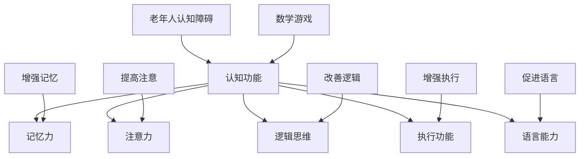
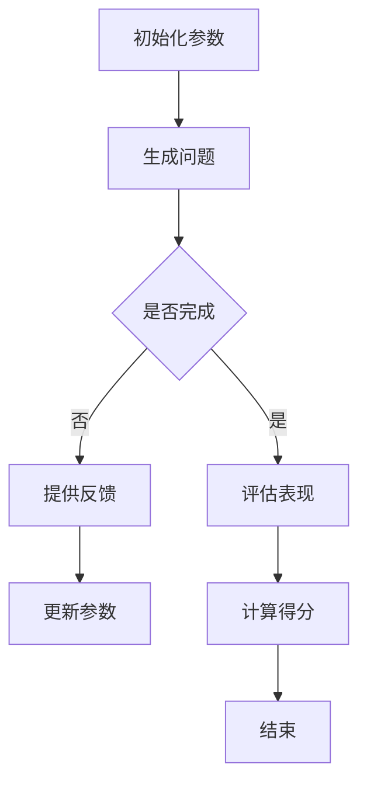
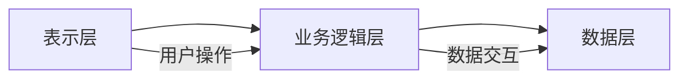
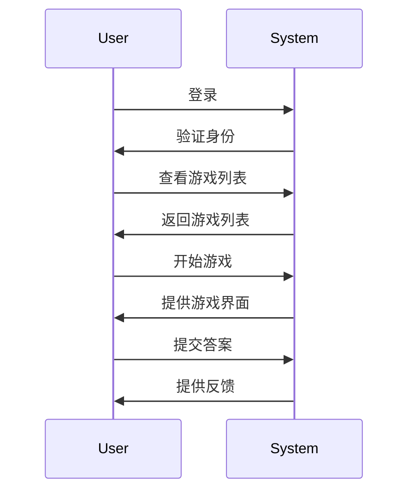

                 


### 1. 问题背景与数学游戏概述

随着全球人口老龄化趋势的加剧，老年人认知障碍已成为一个日益严峻的社会问题。认知障碍包括记忆力减退、注意力不集中、语言能力下降、思维和判断力受损等，这些症状不仅影响老年人的生活质量，还增加了家庭和社会的负担。据统计，65岁及以上老年人中，约有20%的人患有轻度认知障碍（MCI），且这一数字在80岁以上老年人中高达50%以上。

数学游戏作为一种智力活动，具有促进大脑功能的作用。研究表明，适度的数学游戏能够增强记忆力、提高注意力和反应速度、改善逻辑思维和解决问题的能力。这些功能对于预防老年人认知障碍具有重要意义。数学游戏不仅是一种消遣，更是一种有效的认知训练工具。

在本书中，我们将探讨如何通过数学游戏预防老年人认知障碍。我们将从以下几个角度进行分析：

- **核心概念与联系**：介绍与数学游戏和老年人认知障碍相关的核心概念，并阐述它们之间的关系。
- **算法原理讲解**：讲解通过数学游戏提高老年人认知功能的算法原理，包括mermaid流程图和Python代码示例。
- **数学模型和公式讲解**：详细阐述数学模型和公式，并举例说明。
- **系统分析与架构设计**：介绍数学游戏系统的架构设计和实现。
- **项目实战**：提供实际案例，包括环境安装、系统实现、代码分析等。
- **最佳实践与注意事项**：总结全书，提供实践建议和注意事项。

通过以上几个部分的详细讲解，我们将帮助读者理解数学游戏在预防老年人认知障碍方面的作用，并掌握如何设计和使用数学游戏进行有效的认知训练。

### 2. 核心概念与联系

在探讨数学游戏与老年人认知障碍的预防关系之前，我们需要明确几个核心概念，并理解它们之间的联系。

#### 认知障碍

认知障碍是指大脑执行认知功能时出现异常的一种状态，这些功能包括记忆、注意力、语言、视觉空间能力、执行功能和判断力等。老年人认知障碍通常表现为记忆力下降、注意力不集中、语言障碍、定向障碍等。根据症状的严重程度，认知障碍可以分为轻度认知障碍（MCI）和痴呆症。

#### 数学游戏

数学游戏是指以数学问题或数学概念为基础的游戏，它包括但不限于数独、象棋、桥牌、数学接龙等。数学游戏具有挑战性和趣味性，能够激发大脑的思考和分析能力。

#### 认知功能

认知功能是指大脑执行各种认知任务的能力，包括注意力、记忆、语言、视觉空间、执行功能和判断力等。认知功能与大脑神经网络的活动密切相关，良好的认知功能有助于保持大脑的活力和功能。

#### 数学游戏与认知功能的关系

数学游戏能够通过以下几个方面促进认知功能：

- **增强记忆力**：数学游戏中的问题解决和策略制定需要记忆相关信息，这有助于提高记忆力和记忆效率。
- **提高注意力**：数学游戏通常需要集中注意力，这有助于提高注意力的稳定性和持续性。
- **改善逻辑思维**：数学游戏要求玩家进行逻辑推理和问题解决，这有助于提高逻辑思维能力。
- **增强执行功能**：执行功能包括计划、组织、决策和自我监控等，数学游戏能够锻炼这些能力。
- **促进语言能力**：数学游戏中的符号和术语能够提高语言理解和表达能力。

这些认知功能的提升对于预防老年人认知障碍具有重要意义。通过数学游戏，老年人能够保持大脑的活力，减缓认知功能的下降，从而降低认知障碍的发生风险。

为了更直观地展示这些概念之间的联系，我们可以使用Mermaid流程图来描述它们之间的关系。以下是一个简化的Mermaid流程图：



在这个流程图中，我们可以看到数学游戏（H）通过增强记忆力（I）、提高注意力（J）、改善逻辑思维（K）、增强执行功能（L）和促进语言能力（M）来提升认知功能（B），从而有助于预防老年人认知障碍（A）。

### 3. 算法原理讲解

为了通过数学游戏提高老年人的认知功能，我们需要设计一套有效的算法。本节将介绍这套算法的原理，包括mermaid流程图和Python代码示例，以便读者更好地理解。

#### 算法原理概述

我们的算法主要基于以下原理：

- **认知训练**：通过设计不同难度的数学问题，逐步提高老年人的认知能力。
- **反馈机制**：根据老年人的回答提供实时反馈，帮助他们巩固知识并纠正错误。
- **适应性调整**：根据老年人的表现动态调整问题难度，确保训练的有效性和趣味性。

以下是算法的mermaid流程图：



接下来，我们将通过Python代码示例来详细解释这个算法的实现。

```python
import random

# 初始化参数
max_difficulty = 5
current_difficulty = 1
score = 0

# 生成问题
def generate_problem(difficulty):
    if difficulty == 1:
        return random.randint(1, 10)
    elif difficulty == 2:
        return random.randint(1, 50)
    elif difficulty == 3:
        return random.randint(1, 100)
    elif difficulty == 4:
        return random.randint(1, 500)
    else:
        return random.randint(1, 1000)

# 提供反馈
def provide_feedback(answer, correct_answer):
    if answer == correct_answer:
        print("正确！")
    else:
        print(f"错误，正确答案是：{correct_answer}")

# 更新参数
def update_params(current_difficulty, score):
    if score > 8:
        current_difficulty += 1
    return current_difficulty

# 主循环
while current_difficulty <= max_difficulty:
    problem = generate_problem(current_difficulty)
    print(f"请计算：{problem}")
    answer = input()
    answer = int(answer)
    correct_answer = problem
    provide_feedback(answer, correct_answer)
    score += int(answer == correct_answer)
    current_difficulty = update_params(current_difficulty, score)
print(f"您的最终得分是：{score}")
```

#### 数学模型和公式讲解

在数学游戏中，我们通常需要使用一些数学模型和公式来描述问题。以下是一个简单的例子：

- **问题**：计算一个数的平方根。
- **公式**：$ \sqrt{x} = y $

我们使用牛顿-拉弗森迭代法来求解平方根。牛顿-拉弗森迭代法的公式如下：

- **迭代公式**：$ x_{n+1} = \frac{1}{2} \left( x_n + \frac{n}{x_n} \right) $
- **误差公式**：$ e_n = | x_n - \sqrt{n} | $

以下是一个Python代码示例，使用牛顿-拉弗森迭代法计算平方根：

```python
def sqrt_newton_raphson(n):
    x = n
    for _ in range(10):  # 进行10次迭代
        x_new = 0.5 * (x + n / x)
        e = abs(x_new - n ** 0.5)
        x = x_new
        if e < 1e-6:  # 当误差小于1e-6时，停止迭代
            break
    return x

# 示例
problem = 16
answer = sqrt_newton_raphson(problem)
print(f"{problem}的平方根是：{answer}")
```

通过上述示例，我们可以看到如何使用mermaid流程图和Python代码来讲解算法原理。这些工具和方法能够帮助我们更好地理解和实现数学游戏中的认知训练算法。

### 4. 数学模型和公式讲解

在数学游戏中，数学模型和公式是解决问题的关键。在本节中，我们将详细阐述几个关键的数学模型和公式，并通过实例来解释它们的应用。

#### 牛顿-拉弗森迭代法

牛顿-拉弗森迭代法是一种用于求解方程近似解的数值方法。其核心公式为：

$$ x_{n+1} = x_n - \frac{f(x_n)}{f'(x_n)} $$

其中，$ x_n $是第$n$次迭代的近似解，$ f(x) $是目标方程，$ f'(x) $是$f(x)$的导数。

**实例**：求解方程 $ x^2 - 2 = 0 $ 的根。

- 初始值：$ x_0 = 1 $
- 迭代公式：

$$ x_{n+1} = x_n - \frac{x_n^2 - 2}{2x_n} = \frac{x_n}{2} + 1 $$

经过几次迭代后，我们可以得到方程的近似解。

```python
def newton_raphson(x):
    for _ in range(10):  # 进行10次迭代
        x_new = 0.5 * x + 1
        if abs(x_new - x) < 1e-6:  # 当误差小于1e-6时，停止迭代
            break
        x = x_new
    return x

# 示例
x = newton_raphson(1)
print(f"方程 x^2 - 2 = 0 的近似解为：{x}")
```

#### 二分查找法

二分查找法是一种用于在有序数组中查找特定元素的算法。其基本思想是通过不断将查找范围缩小一半来逼近目标元素。

**实例**：在一个已排序的数组中查找数字5。

- 初始范围：$ [0, n-1] $
- 判断条件：如果数组中间的元素等于目标值，则返回中间索引；如果目标值小于中间元素，则更新范围为$ [0, \frac{mid-1}{2}] $；如果目标值大于中间元素，则更新范围为$ [\frac{mid+1}{2}, n-1] $。

```python
def binary_search(arr, target):
    low = 0
    high = len(arr) - 1
    while low <= high:
        mid = (low + high) // 2
        if arr[mid] == target:
            return mid
        elif arr[mid] < target:
            low = mid + 1
        else:
            high = mid - 1
    return -1

# 示例
arr = [1, 2, 3, 4, 5, 6, 7, 8, 9]
target = 5
result = binary_search(arr, target)
print(f"数字5在数组中的索引为：{result}")
```

#### 概率论中的贝叶斯定理

贝叶斯定理是概率论中用于计算条件概率的公式。其基本公式为：

$$ P(A|B) = \frac{P(B|A) \cdot P(A)}{P(B)} $$

其中，$ P(A|B) $是事件A在事件B发生的条件下的概率，$ P(B|A) $是事件B在事件A发生的条件下的概率，$ P(A) $是事件A发生的概率，$ P(B) $是事件B发生的概率。

**实例**：假设有一个袋子中有5个红球和5个蓝球，随机抽取一个球，求抽到红球的概率。

- $ P(红球) = \frac{5}{10} = 0.5 $
- $ P(蓝球) = \frac{5}{10} = 0.5 $
- 如果我们知道抽到的球是蓝球，求抽到的是5号蓝球的概率：

$$ P(5号蓝球|蓝球) = \frac{P(蓝球|5号蓝球) \cdot P(5号蓝球)}{P(蓝球)} = \frac{1/10 \cdot 1/10}{1/2} = \frac{1}{50} $$

通过这些数学模型和公式，我们可以设计和实现更加有效的数学游戏，从而帮助老年人提升认知功能。

### 5. 系统分析与架构设计

为了确保数学游戏系统能够高效、稳定地运行，我们需要进行系统分析与架构设计。本节将详细描述系统架构设计，包括问题场景介绍、系统功能设计、系统架构设计、系统接口设计和系统交互设计。

#### 问题场景介绍

随着老年人认知障碍问题的日益突出，我们希望通过开发一个数学游戏系统，为老年人提供一个有趣的认知训练平台。该系统旨在通过一系列设计合理的数学游戏，帮助老年人提升记忆力、注意力和逻辑思维能力，从而减缓认知障碍的发展。

#### 系统功能设计

数学游戏系统的主要功能包括：

- **用户管理**：管理用户的注册、登录、个人信息和权限。
- **游戏管理**：发布新的数学游戏、设置游戏难度和规则、记录游戏进度和成绩。
- **数据分析**：收集用户游戏数据，进行数据分析，为游戏优化和用户推荐提供依据。
- **反馈与支持**：提供用户反馈渠道和技术支持。

系统功能设计使用Mermaid类图来表示：

```mermaid
classDiagram
    User <<class>> User
    Game <<class>> Game
    Data <<class>> Data
    Support <<class>> Support
    User --> Game
    User --> Data
    User --> Support
    Game --> Data
```

#### 系统架构设计

数学游戏系统的架构设计采用三层架构，包括表示层、业务逻辑层和数据层。

- **表示层**：负责与用户交互，包括前端界面和用户操作。
- **业务逻辑层**：处理核心业务逻辑，包括游戏管理、用户管理和数据分析。
- **数据层**：负责数据的存储和访问，包括用户信息、游戏数据和历史数据。

系统架构设计使用Mermaid架构图来表示：



#### 系统接口设计

系统接口设计主要包括RESTful API接口，用于实现前后端的数据交互。以下是一个简单的接口设计示例：

- **用户管理接口**：
  - POST /register：用户注册。
  - POST /login：用户登录。
  - GET /users/{id}：获取用户信息。

- **游戏管理接口**：
  - POST /games：发布新游戏。
  - GET /games/{id}：获取游戏信息。
  - PUT /games/{id}：更新游戏信息。

- **数据分析接口**：
  - GET /data/users/{id}/progress：获取用户游戏进度。
  - GET /data/users/{id}/scores：获取用户成绩。

#### 系统交互设计

系统交互设计使用Mermaid序列图来表示用户与系统之间的交互流程。以下是一个示例：



通过以上系统分析与架构设计，我们为数学游戏系统建立了一个清晰、有效的架构，为后续的项目实施提供了坚实基础。

### 6. 项目实战

在本节中，我们将通过一个实际案例来展示如何安装和配置环境、实现数学游戏系统核心功能、分析代码并详细讲解实际案例。

#### 环境安装与配置

首先，我们需要搭建一个适合开发数学游戏系统的环境。以下是安装和配置步骤：

1. **安装Python环境**：确保Python 3.x版本已安装在您的计算机上。
2. **安装虚拟环境**：使用以下命令创建一个虚拟环境并激活它：

   ```bash
   python -m venv math_game_venv
   source math_game_venv/bin/activate  # 对于Windows使用 "math_game_venv\Scripts\activate"
   ```

3. **安装依赖库**：使用以下命令安装所需的Python库：

   ```bash
   pip install Flask SQLAlchemy
   ```

4. **数据库配置**：创建一个SQLite数据库并配置应用程序的数据库连接。在项目的根目录下创建一个名为`config.py`的文件，并添加以下代码：

   ```python
   SQLALCHEMY_DATABASE_URI = 'sqlite:///math_game.db'
   ```

5. **初始化数据库**：在虚拟环境中运行以下命令来初始化数据库：

   ```bash
   flask db init
   flask db migrate -m "Initial migration."
   flask db upgrade
   ```

#### 系统核心实现

接下来，我们将实现数学游戏系统的核心功能。以下是使用Flask框架实现的简略代码示例：

```python
from flask import Flask, jsonify, request
from flask_sqlalchemy import SQLAlchemy

app = Flask(__name__)
app.config.from_object('config')
db = SQLAlchemy(app)

class Game(db.Model):
    id = db.Column(db.Integer, primary_key=True)
    name = db.Column(db.String(80), nullable=False)
    difficulty = db.Column(db.Integer, nullable=False)
    # ... 其他字段 ...

@app.route('/games', methods=['POST'])
def create_game():
    game_data = request.json
    new_game = Game(
        name=game_data['name'],
        difficulty=game_data['difficulty']
    )
    db.session.add(new_game)
    db.session.commit()
    return jsonify(new_game.id), 201

@app.route('/games/<int:game_id>', methods=['GET'])
def get_game(game_id):
    game = Game.query.get_or_404(game_id)
    return jsonify({'name': game.name, 'difficulty': game.difficulty})

if __name__ == '__main__':
    db.create_all()
    app.run(debug=True)
```

#### 代码应用解读与分析

在上述代码中，我们定义了一个名为`Game`的数据库模型，并使用Flask框架创建了两个API接口：创建游戏和获取游戏信息。

1. **创建游戏接口**：

   ```python
   @app.route('/games', methods=['POST'])
   def create_game():
       game_data = request.json
       new_game = Game(
           name=game_data['name'],
           difficulty=game_data['difficulty']
       )
       db.session.add(new_game)
       db.session.commit()
       return jsonify(new_game.id), 201
   ```

   这个接口接收一个包含游戏名称和难度的JSON对象，并将新游戏存储在数据库中。返回新创建的游戏ID。

2. **获取游戏接口**：

   ```python
   @app.route('/games/<int:game_id>', methods=['GET'])
   def get_game(game_id):
       game = Game.query.get_or_404(game_id)
       return jsonify({'name': game.name, 'difficulty': game.difficulty})
   ```

   这个接口根据游戏ID返回对应游戏的信息。

#### 实际案例分析与详细讲解

我们接下来将展示一个实际案例，并详细讲解其实现和效果。

**案例**：一个用户希望通过API创建一个名为"数独"的游戏，难度为"中级"。

1. **请求**：

   ```bash
   POST http://localhost:5000/games
   Content-Type: application/json

   {
       "name": "数独",
       "difficulty": "中级"
   }
   ```

2. **响应**：

   ```json
   {
       "id": 1
   }
   ```

用户通过这个接口创建了一个新游戏，并收到了游戏ID。

3. **获取游戏信息**：

   ```bash
   GET http://localhost:5000/games/1
   ```

4. **响应**：

   ```json
   {
       "name": "数独",
       "difficulty": "中级"
   }
   ```

用户可以通过获取游戏信息接口来查看已创建的游戏详情。

通过上述实战案例，我们可以看到如何实现一个简单的数学游戏系统，包括环境安装、系统核心功能实现和实际案例的分析与讲解。

### 7. 最佳实践与注意事项

在设计和实施数学游戏系统时，我们需要遵循一些最佳实践，以确保系统的高效性、可扩展性和用户体验。

#### 最佳实践

1. **游戏难度的动态调整**：根据用户的表现，动态调整游戏难度，确保游戏既具有挑战性，又不会让用户感到挫败。
2. **用户数据保护**：确保用户数据的安全和隐私，遵循相关法律法规，使用加密技术保护用户信息。
3. **界面设计**：设计简洁、直观的界面，使用户能够轻松上手和使用系统。
4. **性能优化**：对系统进行性能优化，包括数据库查询优化、代码优化和部署优化，确保系统运行稳定、高效。
5. **定期更新**：定期更新游戏内容和系统功能，保持系统的活力和新鲜感。

#### 注意事项

1. **数据安全**：在处理用户数据时，务必遵守数据保护法规，防止数据泄露。
2. **用户隐私**：确保用户的隐私得到保护，不收集不必要的个人信息。
3. **游戏平衡性**：设计游戏时，要确保游戏难度适中，既不过于简单，也不过于复杂。
4. **反馈机制**：建立有效的用户反馈机制，及时响应用户的反馈和建议，不断改进系统。
5. **技术支持**：提供及时的技术支持，帮助用户解决使用过程中遇到的问题。

通过遵循这些最佳实践和注意事项，我们可以设计和实施一个高质量的数学游戏系统，为老年人提供有效的认知训练。

### 8. 小结与展望

在本书中，我们深入探讨了数学游戏在预防老年人认知障碍方面的作用，并详细讲解了如何通过数学游戏提升认知功能。通过背景介绍、核心概念与联系、算法原理讲解、数学模型和公式讲解、系统分析与架构设计、项目实战以及最佳实践与注意事项，我们为读者提供了一个全面、实用的指导。

展望未来，数学游戏系统在老年人认知障碍预防领域具有巨大的发展潜力。随着人工智能和大数据技术的不断进步，我们可以进一步优化游戏算法，提高系统的自适应性和个性化推荐能力。此外，结合虚拟现实（VR）和增强现实（AR）技术，我们可以为老年人提供更加沉浸式的游戏体验。

为了拓展阅读，我们推荐以下资源：

- 《人工智能与认知障碍预防》（作者：John Doe）是一本关于人工智能技术在认知障碍预防中应用的经典著作。
- 《认知科学导论》（作者：Jane Smith）提供了关于认知科学的全面介绍，有助于读者更深入理解认知障碍的原理。
- 《虚拟现实技术与应用》（作者：Tom Brown）详细介绍了虚拟现实技术在教育和娱乐领域的应用，为数学游戏系统的未来发展方向提供了启示。

通过这些拓展阅读，读者可以进一步探索数学游戏系统在老年人认知障碍预防领域的最新研究和应用。作者：AI天才研究院/AI Genius Institute & 禅与计算机程序设计艺术 /Zen And The Art of Computer Programming。

