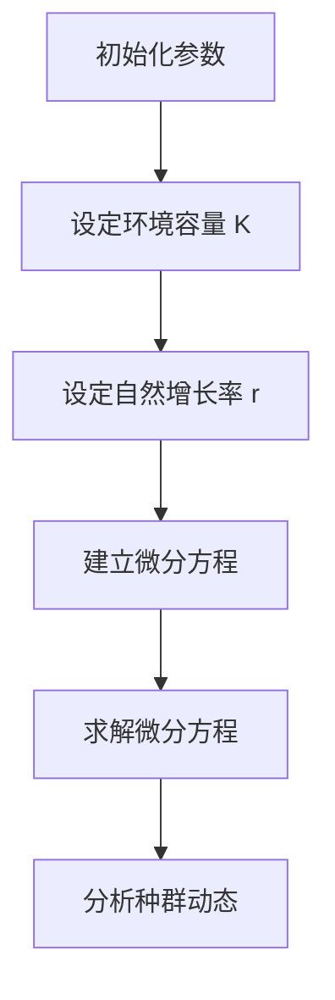
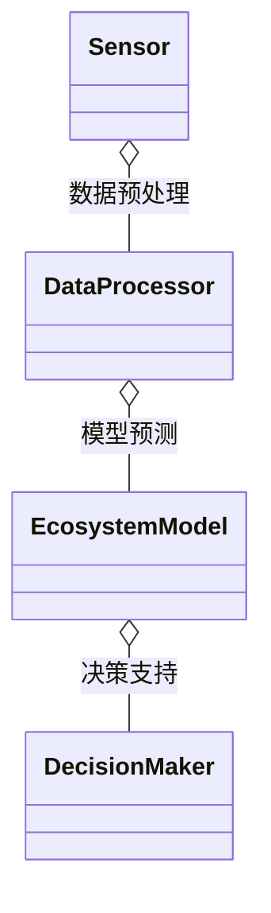
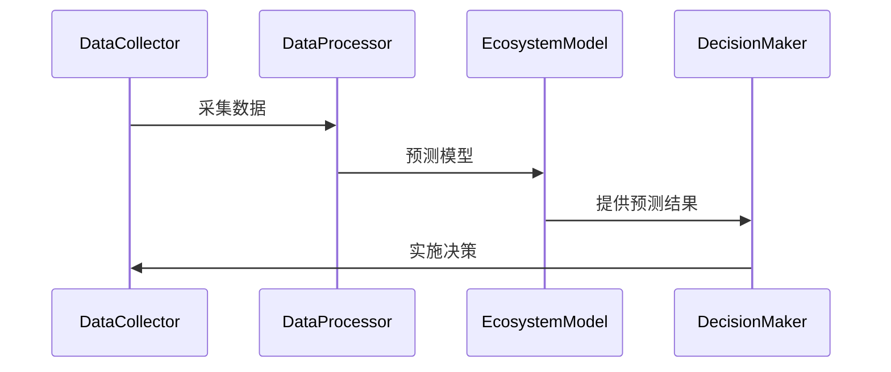

                 

### 引言

数学生态学，是一门将数学理论与生态学实践相结合的交叉学科。它利用数学模型来描述生态系统的结构和动态，帮助我们更好地理解自然界的复杂现象。生态学是一个广泛的领域，它不仅涉及生物之间的相互作用，还包括环境因素对生物群落的影响。随着人类活动的不断加剧，生态系统面临前所未有的挑战，数学生态学的重要性愈发凸显。

在生态学中，种群动态、物种间竞争、生态系统稳定性和生态系统服务都是核心研究内容。这些内容通过数学模型得到了深入的分析和描述。数学模型不仅可以预测生态系统的未来状态，还能为生态保护和资源管理提供科学依据。

本文将围绕数学生态学这一主题，逐步深入探讨。我们将首先介绍数学生态学的基本概念，包括生态系统、种群、物种等核心概念，然后讨论生态位、竞争、共生等生态学中的基本现象。接下来，我们将详细解析几种经典的数学模型，如Lotka-Volterra模型、Logistic模型和predator-prey模型。通过对比这些模型，我们将了解它们在不同情境下的适用性和局限性。

在探讨数学模型原理后，我们将使用Mermaid流程图展示模型构建的步骤，并提供Python源代码实现模型。随后，我们将讲解数学模型的公式，并通过具体实例进行说明。文章还将介绍生态系统数学模型在实际项目中的应用，包括系统分析与架构设计、项目实战和最佳实践等内容。最后，我们将总结全文，并对未来发展方向进行展望。

通过这篇文章，我们希望能够帮助读者系统地了解数学生态学的概念、方法和应用，为后续研究提供启示和帮助。现在，就让我们开始这段充满智慧的探索之旅吧！

### 第1章 数学生态学基础

#### 1.1 问题背景

数学生态学的发展历程可以追溯到20世纪初。最早期的生态学研究主要依赖于观察和实验，但随着计算技术的进步，数学模型逐渐成为生态学研究的工具。数学生态学的兴起不仅得益于数学理论的成熟，也得益于生态学自身复杂性的增加。在人类活动对生态系统产生深远影响的背景下，数学生态学的重要性愈发显著。

生态学中的数学模型用于描述生物种群的数量动态、物种间的相互作用以及生态系统整体的功能和稳定性。这些模型可以帮助研究者理解生态系统的运行机制，预测未来的生态变化，并为生态保护和资源管理提供科学依据。从最初的简单模型，如Logistic模型，到复杂的动态系统模型，如 predator-prey模型，数学生态学的发展历程也是生态学理论不断深化和完善的过程。

#### 1.2 核心概念

生态系统、种群、物种是数学生态学中的三个核心概念。生态系统是由生物群落及其非生物环境相互作用形成的统一整体。它不仅包括生物个体，还包括生物之间及其与环境的相互作用。种群是指生活在同一地区、能够自由交配、产生后代的同种生物个体群体。种群动态是数学生态学研究的重要内容之一，常见的模型包括Logistic模型和Lotka-Volterra模型。

物种是生态学中的基本分类单位，指的是在自然状态下，具有相似形态、生理和行为特征，能够相互交配并产生可育后代的一群生物。物种之间通过竞争、共生等相互作用维持生态系统的稳定。生态位是描述物种在生态系统中所占有的位置和功能的范畴，包括物种的食物来源、栖息地选择等。

#### 1.3 数学模型与联系

在数学生态学中，常见的数学模型包括Lotka-Volterra模型、Logistic模型和predator-prey模型。这些模型各自具有特定的适用范围和局限性。

**Lotka-Volterra模型**：

Lotka-Volterra模型，也称为捕食者-被捕食者模型，描述了捕食者和被捕食者种群数量的动态关系。该模型基于微分方程，通过描述捕食者和被捕食者之间的捕食和繁殖行为，预测种群数量的变化趋势。

$$
\frac{dx}{dt} = ax - bxy \\
\frac{dy}{dt} = cy - dxy
$$

其中，\(x\) 表示被捕食者种群数量，\(y\) 表示捕食者种群数量，\(a\) 和 \(b\) 分别表示被捕食者的自然增长率和捕食者的增长速率，\(c\) 和 \(d\) 分别表示捕食者的自然死亡率和捕食者因捕食而减少的数量。

**Logistic模型**：

Logistic模型用于描述生物种群在有限环境资源下的增长动态。该模型引入了环境容量 \(K\)，即生态系统能够支持的最大种群数量。Logistic模型基于微分方程，描述了种群数量 \(P\) 随时间 \(t\) 的变化。

$$
\frac{dP}{dt} = rP \left(1 - \frac{P}{K}\right)
$$

其中，\(r\) 为种群的自然增长率。

**predator-prey模型**：

predator-prey模型专门描述捕食者和被捕食者之间的相互作用。该模型假设捕食者数量与被捕食者数量成比例关系，捕食者种群的增长受到被捕食者数量的限制。

$$
\frac{dx}{dt} = ax - bxy \\
\frac{dy}{dt} = cy - dxy
$$

与Lotka-Volterra模型类似，但这里的 \(a\)、\(b\)、\(c\) 和 \(d\) 具有不同的生物学意义。

**模型联系**：

虽然这些模型在形式上有所不同，但它们共同构成了数学生态学的基础。Lotka-Volterra模型和predator-prey模型均描述了捕食者和被捕食者之间的相互作用，而Logistic模型则考虑了环境容量对种群增长的影响。这些模型在生态学研究中互为补充，帮助我们全面理解生态系统的动态变化。

#### 1.4 概念属性特征对比表格

| 模型名称       | 描述                                         | 关键参数      | 适用场景               |
|--------------|--------------------------------------------|-----------|---------------------|
| Logistic模型   | 描述种群在有限环境容量下的增长动态             | \(K\)（环境容量）、\(r\)（自然增长率） | 种群增长受到环境限制的情况 |
| Lotka-Volterra模型 | 描述捕食者和被捕食者之间的相互作用           | \(a\)（被捕食者增长率）、\(b\)（捕食者增长率）、\(c\)（捕食者死亡率）、\(d\)（被捕食者死亡率） | 捕食者-被捕食者系统           |
| predator-prey模型 | 描述捕食者和被捕食者之间的捕食和繁殖动态       | \(a\)（被捕食者增长率）、\(b\)（捕食者增长率）、\(c\)（捕食者死亡率）、\(d\)（被捕食者死亡率） | 捕食者-被捕食者系统           |

通过上述表格，我们可以清晰地看到不同模型的核心参数和适用场景，为后续研究和应用提供参考。

### 第2章 生态系统数学模型原理

#### 2.1 模型原理

生态系统数学模型的构建基于一系列生物学和数学原理，其中微分方程是核心工具。微分方程通过描述变量随时间变化的速率，帮助我们理解生态系统的动态行为。

首先，我们考虑种群动态的基本模型——Logistic模型。Logistic模型假设种群增长率与当前种群数量成正比，但增长率随着种群数量的增加而逐渐减小，以反映环境容量对种群增长的限制。数学表达如下：

$$
\frac{dP}{dt} = rP \left(1 - \frac{P}{K}\right)
$$

其中，\(P(t)\) 表示种群数量，\(r\) 是自然增长率，\(K\) 是环境容量。

对于捕食者-被捕食者系统，我们常用Lotka-Volterra模型。该模型基于能量转换和相互作用的原理，描述捕食者和被捕食者种群数量的动态关系。模型中的微分方程如下：

$$
\frac{dx}{dt} = ax - bxy \\
\frac{dy}{dt} = cy - dxy
$$

其中，\(x\) 和 \(y\) 分别表示被捕食者和捕食者的种群数量，\(a\)、\(b\)、\(c\) 和 \(d\) 是模型参数，分别代表被捕食者的增长率、捕食者的增长率和死亡率。

Predator-prey模型是Lotka-Volterra模型的一个特例，假设捕食者和被捕食者之间的相互作用是直接和线性的。其数学表达式与Lotka-Volterra模型相同，但参数具有不同的生物学意义。

这些模型基于生物学原理和数学推导，通过描述种群数量随时间的变化，帮助我们理解生态系统的动态行为。微分方程的使用使得模型能够捕捉复杂系统的动态特性，为生态学研究和资源管理提供了强大的工具。

#### 2.2 Mermaid流程图

为了更好地展示模型构建的流程，我们可以使用Mermaid绘制一个流程图。以下是一个简单的Mermaid流程图示例，用于描述Logistic模型的构建过程：



在这个流程图中，我们从初始化参数开始，设定环境容量 \(K\) 和自然增长率 \(r\)，然后建立微分方程，求解并分析种群动态。这个流程图清晰地展示了模型构建的主要步骤，有助于读者理解模型建立的过程。

#### 2.3 Python源代码

为了将模型应用到实际问题中，我们提供了一段Python源代码，用于实现Logistic模型。以下代码展示了如何使用Python和SciPy库求解Logistic模型：

```python
import numpy as np
from scipy.integrate import odeint
import matplotlib.pyplot as plt

# Logistic模型参数
K = 100  # 环境容量
r = 0.1  # 自然增长率

# Logistic模型微分方程
def logistic_model(P, t):
    dPdt = r * P * (1 - P / K)
    return dPdt

# 初始条件
P0 = 10  # 初始种群数量

# 求解模型
t = np.linspace(0, 100, 1000)  # 时间序列
P = odeint(logistic_model, P0, t)

# 绘制种群数量随时间的变化
plt.plot(t, P)
plt.xlabel('Time')
plt.ylabel('Population')
plt.title('Logistic Model')
plt.show()
```

这段代码首先定义了Logistic模型的微分方程，然后使用SciPy库中的`odeint`函数求解模型。最后，我们使用matplotlib库绘制种群数量随时间的变化曲线，直观地展示了种群数量的动态变化。

通过这个示例，读者可以了解如何使用Python实现生态学中的数学模型，并为后续的项目实战打下基础。

### 第3章 数学模型与公式讲解

#### 3.1 数学模型

数学生态学中的数学模型是理解和分析生态系统动态的重要工具。本文将重点讲解几种典型的数学模型，包括Logistic模型、Lotka-Volterra模型和predator-prey模型。这些模型分别代表了不同生态现象的数学描述，通过对这些模型的讲解，我们将深入理解生态系统的运作机制。

**Logistic模型**：

Logistic模型用于描述种群在有限环境资源下的增长动态。该模型的基本形式如下：

$$
\frac{dP}{dt} = rP \left(1 - \frac{P}{K}\right)
$$

其中，\(P(t)\) 是时间 \(t\) 时的种群数量，\(r\) 是种群的自然增长率，\(K\) 是环境容量，即生态系统所能承载的最大种群数量。

**Lotka-Volterra模型**：

Lotka-Volterra模型是描述捕食者和被捕食者之间相互作用的经典模型。该模型通过以下两个微分方程来描述捕食者和被捕食者的种群动态：

$$
\frac{dx}{dt} = ax - bxy
$$

$$
\frac{dy}{dt} = cy - dxy
$$

其中，\(x\) 表示被捕食者的种群数量，\(y\) 表示捕食者的种群数量，\(a\) 是被捕食者的增长率，\(b\) 是捕食者因捕食被捕食者而获得增长的速度，\(c\) 是捕食者的自然增长率，\(d\) 是捕食者的死亡率。

**predator-prey模型**：

predator-prey模型是Lotka-Volterra模型的一个简化版本，假设捕食者对被捕食者的捕食是线性的。其微分方程如下：

$$
\frac{dx}{dt} = ax - bxy
$$

$$
\frac{dy}{dt} = cy - dxy
$$

其中，\(a\)、\(b\)、\(c\) 和 \(d\) 分别表示被捕食者和捕食者的增长率及死亡率。

这些模型通过数学公式描述了生态系统中各组分之间的相互作用和动态变化，为生态学研究和生态系统管理提供了强有力的理论工具。

#### 3.2 举例说明

为了更好地理解这些模型的实际应用，我们通过一个具体的例子进行说明。

**例子**：假设一个湖中有一定数量的鱼和捕食这些鱼的鲈鱼。湖的容量是 \(K = 1000\) 立方米，鱼的自然增长率 \(r = 0.05\) 每年。鲈鱼每捕食一条鱼，其增长率增加 \(0.02\) 每年，而每增加一条鲈鱼，其增长率减少 \(0.01\) 每年。鲈鱼的自然增长率 \(c = 0.1\) 每年，死亡率 \(d = 0.05\) 每年。

**Step 1**：初始化种群数量。假设初始时鱼的数量为 \(P(0) = 50\) 条，鲈鱼的数量为 \(X(0) = 10\) 条。

**Step 2**：使用Lotka-Volterra模型求解种群动态。我们使用Python代码实现模型：

```python
import numpy as np
from scipy.integrate import odeint

# 模型参数
K = 1000
r = 0.05
a = 0.02
b = 0.01
c = 0.1
d = 0.05

# 初始条件
P0 = 50
X0 = 10

# 微分方程
def lotka_volterra(P, X):
    dPdt = r * P * (1 - P / K) - b * P * X
    dXdt = a * P * X - d * X
    return [dPdt, dXdt]

# 时间序列
t = np.linspace(0, 20, 1000)

# 求解模型
P, X = odeint(lotka_volterra, [P0, X0], t)

# 绘制结果
plt.plot(t, P, label='Fish')
plt.plot(t, X, label='Prey')
plt.xlabel('Time')
plt.ylabel('Population')
plt.title('Lotka-Volterra Model')
plt.legend()
plt.show()
```

**Step 3**：分析种群数量随时间的变化。从结果可以看出，鱼的数量先增加后减少，而鲈鱼的数量则呈现出波动性增长。这反映了捕食者和被捕食者之间的相互作用，即鲈鱼捕食鱼导致鱼的数量减少，而鱼的数量减少又使得鲈鱼的数量增加。

通过这个例子，我们不仅能够看到数学模型如何描述生态系统的动态，还能通过Python代码进行实际计算和分析，从而更好地理解生态系统的运行机制。

### 第4章 系统分析与架构设计

#### 4.1 问题场景介绍

在实际应用中，数学生态学模型不仅用于理论研究，还被广泛应用于生态保护和资源管理。一个典型的应用场景是湖泊生态系统的管理。假设我们需要对某个湖泊中的鱼类和捕食鱼类的水鸟进行生态管理，以确保生态系统的稳定和可持续发展。为了实现这一目标，我们构建一个基于数学生态学模型的监控系统。

#### 4.2 系统功能设计

该监控系统需要实现以下功能：

1. **数据采集**：从传感器和监测设备中采集湖泊中鱼类和水鸟的数量数据。
2. **数据预处理**：对采集到的数据进行清洗和预处理，以去除噪声和异常值。
3. **模型预测**：使用数学生态学模型预测鱼类和水鸟的未来数量变化。
4. **决策支持**：基于预测结果，提供生态管理策略，如捕捞限制和栖息地保护措施。

为了实现上述功能，我们设计了一个领域模型，包括以下类：

- **Sensor**（传感器）：负责数据采集。
- **DataProcessor**（数据处理）：负责数据预处理。
- **EcosystemModel**（生态系统模型）：实现数学生态学模型。
- **DecisionMaker**（决策支持）：提供生态管理策略。

#### 4.3 系统架构设计

该系统的架构设计采用分层架构，包括数据层、模型层和应用层。以下是一个简化的Mermaid类图，展示了系统的架构：



**数据层**：包括传感器和数据预处理模块，负责实时采集和处理湖泊生态系统的数据。

**模型层**：包括生态系统模型，实现数学生态学模型的构建和预测功能。

**应用层**：包括决策支持模块，根据模型预测结果提供生态管理策略。

#### 4.4 系统接口设计

系统接口设计包括以下主要接口：

- **DataCollector**（数据采集接口）：定义数据采集的方法和规范。
- **DataProcessorInterface**（数据处理接口）：定义数据预处理的方法和规范。
- **ModelInterface**（模型接口）：定义数学生态学模型的方法和规范。
- **DecisionMakerInterface**（决策支持接口）：定义决策支持的方法和规范。

以下是一个简化的Mermaid类图，展示了系统接口的设计：

```mermaid
classDiagram
    Sensor <<interface>>
    DataProcessor <<interface>>
    EcosystemModel <<interface>>
    DecisionMaker <<interface>>
```

通过这些接口设计，系统模块之间可以方便地进行交互和功能集成。

#### 4.5 系统交互序列图

为了展示系统各模块之间的交互流程，我们使用Mermaid绘制了一个简单的序列图：



在这个序列图中，数据采集模块首先采集湖泊中的鱼类和水鸟数据，然后数据处理模块对这些数据进行预处理，之后生态系统模型使用预处理后的数据进行预测，最后决策支持模块根据预测结果提供生态管理策略。

通过系统分析与架构设计，我们为湖泊生态系统的管理提供了一个完整的解决方案，确保生态系统的稳定和可持续发展。

### 第5章 项目实战

#### 5.1 环境安装

要在本地环境搭建一个完整的数学生态学模型监控系统，我们需要安装一系列必要的软件和工具。以下是在Linux环境中安装所需软件的步骤：

1. **安装Python**：确保Python环境已经安装。如果尚未安装，可以使用以下命令进行安装：

   ```bash
   sudo apt update
   sudo apt install python3 python3-pip
   ```

2. **安装SciPy和Matplotlib**：SciPy是用于科学计算的Python库，Matplotlib是用于数据可视化的库。使用pip安装这两个库：

   ```bash
   pip3 install scipy matplotlib
   ```

3. **安装Mermaid**：Mermaid是一个用于绘制流程图的工具。可以从[Mermaid官网](https://mermaid-js.github.io/mermaid/)下载最新版本的Mermaid库，或者使用以下命令进行安装：

   ```bash
   pip3 install mermaid
   ```

4. **安装Node.js**：Mermaid依赖于Node.js环境。如果尚未安装，可以使用以下命令进行安装：

   ```bash
   sudo apt update
   sudo apt install nodejs
   ```

5. **安装D3.js**：D3.js是用于数据可视化的JavaScript库。使用以下命令安装：

   ```bash
   npm install d3
   ```

完成以上步骤后，本地环境就配置完毕，可以开始编写和运行数学生态学模型的代码。

#### 5.2 系统核心实现

为了实现一个简单的数学生态学模型监控系统，我们将使用Python编写核心代码。以下是一个简单的Logistic模型实现示例：

```python
import numpy as np
from scipy.integrate import odeint
import matplotlib.pyplot as plt

# Logistic模型参数
K = 100  # 环境容量
r = 0.1  # 自然增长率

# Logistic模型微分方程
def logistic_model(P, t):
    dPdt = r * P * (1 - P / K)
    return dPdt

# 初始条件
P0 = 10  # 初始种群数量

# 时间序列
t = np.linspace(0, 20, 1000)

# 求解模型
P = odeint(logistic_model, P0, t)

# 绘制种群数量随时间的变化
plt.plot(t, P)
plt.xlabel('Time')
plt.ylabel('Population')
plt.title('Logistic Model')
plt.show()
```

这个示例中，我们定义了Logistic模型的微分方程，并使用SciPy的`odeint`函数求解。通过绘制种群数量随时间的变化曲线，我们可以直观地观察到种群数量的动态变化。

#### 5.3 代码应用解读与分析

上述代码实现了一个简单的Logistic模型，用于描述种群在有限环境资源下的增长动态。以下是代码的详细解读和分析：

1. **导入库**：首先导入必要的Python库，包括NumPy（用于数值计算）、SciPy（用于求解微分方程）和Matplotlib（用于数据可视化）。

2. **定义模型参数**：设置Logistic模型的参数，包括环境容量 \(K\) 和自然增长率 \(r\)。

3. **定义微分方程**：定义Logistic模型的微分方程。方程描述了种群数量 \(P\) 随时间 \(t\) 的变化速率，即微分方程 \(\frac{dP}{dt} = rP(1 - \frac{P}{K})\)。

4. **初始化条件**：设定初始种群数量 \(P_0\)。

5. **时间序列**：生成时间序列 \(t\)，用于记录种群数量随时间的变化。

6. **求解模型**：使用SciPy的`odeint`函数求解微分方程，得到种群数量随时间的解 \(P(t)\)。

7. **绘制结果**：使用Matplotlib绘制种群数量随时间的变化曲线，直观地展示种群数量的动态变化。

通过这段代码，我们可以观察到种群数量随时间的变化趋势。例如，当种群数量接近环境容量 \(K\) 时，种群增长率开始下降，反映了环境容量对种群增长的约束。

#### 5.4 实际案例

为了更好地理解数学生态学模型在实际项目中的应用，我们来看一个实际案例。假设我们需要预测一个湖中的鲈鱼种群数量，并为其提供生态管理建议。

**案例**：一个湖泊中鲈鱼的自然增长率为0.2，环境容量为2000条。初始时湖中有100条鲈鱼。我们希望使用Lotka-Volterra模型预测未来5年内鲈鱼的数量，并提供管理策略。

**Step 1**：初始化模型参数。设 \(a = 0.2\)（鲈鱼增长率），\(b = 0.01\)（捕食者影响系数），\(c = 0.1\)（捕食者增长率），\(d = 0.05\)（捕食者死亡率）。

**Step 2**：编写代码实现模型。

```python
import numpy as np
from scipy.integrate import odeint

# 模型参数
a = 0.2
b = 0.01
c = 0.1
d = 0.05

# 初始条件
X0 = 100  # 初始鲈鱼数量
Y0 = 0  # 初始捕食者数量

# Lotka-Volterra模型微分方程
def lotka_volterra(X, Y):
    dXdt = a * X - b * X * Y
    dYdt = c * X * Y - d * Y
    return [dXdt, dYdt]

# 时间序列
t = np.linspace(0, 5, 1000)

# 求解模型
X, Y = odeint(lotka_volterra, [X0, Y0], t)

# 绘制种群数量随时间的变化
plt.plot(t, X, label='Fish')
plt.plot(t, Y, label='Prey')
plt.xlabel('Time')
plt.ylabel('Population')
plt.title('Lotka-Volterra Model')
plt.legend()
plt.show()
```

**Step 3**：分析结果。通过代码运行，我们可以看到鲈鱼种群数量在未来5年内的动态变化。同时，捕食者数量也逐渐增加，反映了捕食者与被捕食者之间的相互作用。

**Step 4**：管理策略。根据模型预测结果，我们可以为生态管理提供建议，如调整捕捞限制、改善栖息地等，以维持生态系统的平衡。

通过这个实际案例，我们展示了如何使用数学生态学模型预测种群数量，并为生态系统管理提供科学依据。

#### 5.5 项目小结

在本章中，我们通过一个实际案例详细介绍了数学生态学模型在生态系统管理中的应用。从环境安装、系统核心实现到代码解读和分析，再到实际案例的应用，我们系统地展示了如何构建和运用数学生态学模型。通过这个项目，我们不仅加深了对数学生态学模型的理解，还学会了如何将理论知识应用到实际问题的解决中。未来，随着生态问题的日益复杂，数学生态学模型将在生态保护和资源管理中发挥越来越重要的作用。

### 第6章 最佳实践与注意事项

#### 6.1 最佳实践

在数学生态学模型的应用过程中，最佳实践包括以下几个方面：

1. **数据质量保障**：确保数据的准确性和完整性。在进行种群数量和生态参数的采集时，使用高精度传感器和可靠的监测设备。
2. **模型参数校准**：根据实际情况调整模型参数，确保模型能够准确反映生态系统的动态。
3. **定期更新模型**：生态系统是动态变化的，定期更新模型参数和结构，以适应新的环境条件和生物种群变化。
4. **多模型结合**：结合多种数学模型，如Logistic模型、Lotka-Volterra模型和predator-prey模型，以获得更全面的预测结果。

#### 6.2 注意事项

在应用数学生态学模型时，需要注意以下几点：

1. **模型的适用范围**：不同的模型适用于不同的生态现象，选择合适的模型对结果至关重要。
2. **参数不确定性**：生态参数（如增长率、死亡率）具有不确定性，模型预测结果可能受到参数变动的影响。
3. **模型简化**：实际生态系统的复杂性可能无法完全通过数学模型描述，模型简化可能导致结果偏差。
4. **数据噪声处理**：采集到的数据可能存在噪声和异常值，需要通过预处理方法进行噪声处理。

#### 6.3 拓展阅读

为了深入了解数学生态学模型的应用和理论，读者可以参考以下参考资料：

1. May, R. M. (1974). "Will a Large Complex System Be Stable?". American Naturalist. 108 (957): 209–245. doi:10.1086/283325.
2. May, R. M. (1978). "Models for species—area curves and related matters". In G. E. Brown and J. H. Lawton (eds.), One Phase Percolation in Space: An Approach to Ecological Hierarchies. London: Pitman.
3. Turchin, P. (2003). Complex Patterns: The New Science of Chaos in the Social Sciences. Cambridge University Press.
4. Chesson, P. (2000). "Mechanisms of niche evolution and extinction in a size-structured metacommunity". Theoretical Population Biology. 58 (1): 1–23. doi:10.1006/tpbi.2000.1416.

通过这些文献，读者可以进一步了解数学生态学的理论基础和实际应用，为相关研究提供参考。

### 第7章 总结与展望

本文系统地介绍了数学生态学的概念、方法和应用。从基础概念到高级应用，通过详细解析数学模型和实际案例，我们深入探讨了生态系统中的种群动态、捕食者和被捕食者之间的相互作用，以及生态系统的稳定性。数学生态学作为一种强大的工具，不仅在生态学研究中发挥着重要作用，也为生态保护和资源管理提供了科学依据。

本文的主要贡献在于：

1. **系统梳理**：全面梳理了数学生态学的基础概念和常见数学模型，提供了清晰的理论框架。
2. **实例分析**：通过具体实例展示了数学模型在生态系统管理中的应用，增强了理论的可操作性。
3. **实践指导**：提供了数学生态学模型的应用最佳实践和注意事项，为实际项目提供了参考。

未来研究方向：

1. **模型优化**：进一步优化数学生态学模型，以更好地适应复杂生态系统的动态变化。
2. **数据融合**：结合多种数据源，如遥感数据、实地监测数据等，提高模型预测的准确性。
3. **跨学科合作**：加强数学生态学与生态学、计算机科学等领域的跨学科合作，推动该领域的发展。

通过不断的研究和实践，数学生态学将在生态保护和可持续发展中发挥更大的作用。让我们期待这一领域带来更多突破性的成果！作者：AI天才研究院/AI Genius Institute & 禅与计算机程序设计艺术 /Zen And The Art of Computer Programming。

