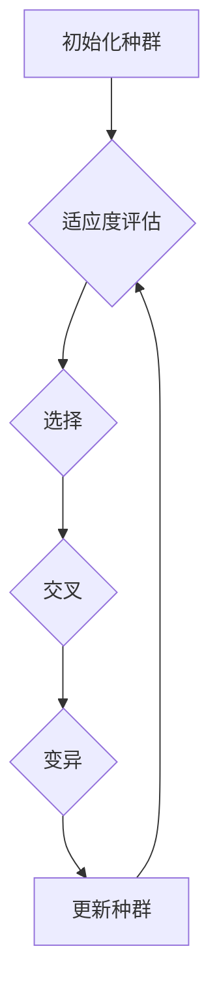
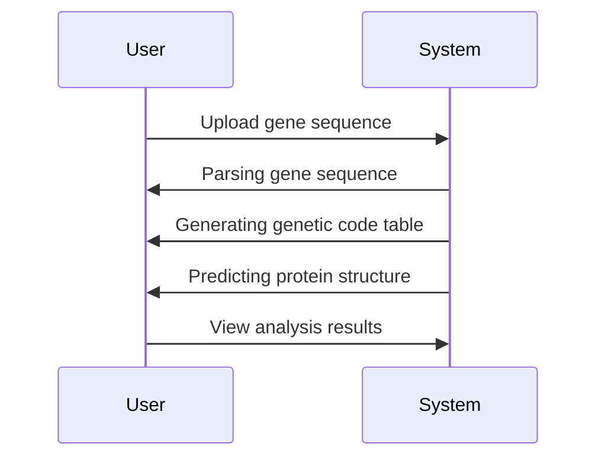
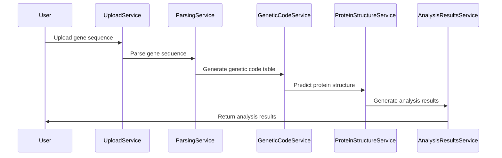

                 

### 核心概念与联系

#### 1. 分子生物学数学模型

分子生物学数学模型是用于描述分子生物学现象的数学模型，主要涉及遗传密码子的数学模型、蛋白质折叠模型等。这些模型通过数学方法描述了DNA序列、RNA转录和蛋白质翻译等过程，揭示了基因表达调控的机制和蛋白质功能的动态变化。

**遗传密码子的数学模型**

遗传密码子的数学模型通常基于DNA序列，通过数学方法描述了基因编码信息如何转化为氨基酸序列。一个基本的遗传密码子模型可以表示为：

$$
\text{DNA序列} \xrightarrow{\text{RNA转录}} \text{RNA序列} \xrightarrow{\text{蛋白质翻译}} \text{氨基酸序列}
$$

其中，DNA序列由四种不同的碱基（A、T、C、G）组成，RNA序列由四种不同的核苷酸（A、U、C、G）组成，氨基酸序列由20种不同的氨基酸组成。通过构建这样的模型，我们可以分析基因的功能、突变的影响以及进化过程。

**蛋白质折叠模型**

蛋白质折叠模型描述了蛋白质在生物体内从线性氨基酸序列转化为三维结构的过程。这一过程涉及复杂的物理化学机制，包括二级结构（如α-螺旋和β-折叠）、三级结构（如球形蛋白质）和四级结构（如多亚基蛋白质复合体）。一个简单的蛋白质折叠模型可以表示为：

$$
\text{氨基酸序列} \xrightarrow{\text{二级结构}} \text{三级结构} \xrightarrow{\text{四级结构}} \text{蛋白质结构}
$$

蛋白质折叠模型的关键在于理解氨基酸之间的相互作用力，包括氢键、疏水作用、范德华力和离子键等。通过数学方法，我们可以模拟蛋白质折叠过程，预测蛋白质的结构和功能。

**概念属性特征对比表格**

| 概念                  | 遗传密码子数学模型                                     | 蛋白质折叠模型                                     |
|----------------------|------------------------------------------------------|------------------------------------------------------|
| **描述对象**         | DNA序列、RNA序列、氨基酸序列                         | 氨基酸序列、蛋白质结构                             |
| **主要作用**         | 描述基因编码信息如何转化为氨基酸序列                 | 描述蛋白质从氨基酸序列转化为三维结构的过程         |
| **建模方法**         | 序列比对、基因组分析、统计建模                       | 物理化学模型、分子动力学模拟、几何建模             |
| **应用领域**         | 遗传学、生物信息学、分子生物学                       | 遗传学、生物物理学、结构生物学                     |

**ER实体关系图架构的 Mermaid 流程图**

```mermaid
erDiagram
  A[基因] ||--|{ B[密码子] }|--|{ C[蛋白质] }
  D[DNA序列] ||--|{ B[密码子] }
  E[RNA序列] ||--|{ B[密码子] }
  F[氨基酸序列] ||--|{ C[蛋白质] }
```

在这个ER实体关系图中，基因（A）通过密码子（B）编码为蛋白质（C），同时DNA序列（D）和RNA序列（E）与密码子（B）之间存在关联，最终转化为氨基酸序列（F），进而形成蛋白质（C）。

### 算法原理讲解

#### 遗传算法（Genetic Algorithm）

遗传算法是一种基于自然选择和遗传学原理的优化算法，主要用于解决复杂优化问题。遗传算法的基本流程如下：

1. **初始化种群**：随机生成初始种群，每个个体代表一种可能的解。
2. **适应度评估**：计算每个个体的适应度值，适应度值越高，表示个体越接近目标。
3. **选择**：根据适应度值，选择个体进行交配，适应度值较高的个体被选中的概率较大。
4. **交叉**：选择两个个体进行交配，产生新的后代，遗传信息进行交换。
5. **变异**：对后代进行随机变异，增加种群的多样性。
6. **更新种群**：将后代取代上一代种群，重复步骤2-5，直到满足停止条件。

遗传算法的数学模型可以表示为：

$$
P_{\text{next}} = P_{\text{current}} \times F(\text{适应度值})
$$

其中，$P_{\text{next}}$ 表示下一代种群的概率分布，$P_{\text{current}}$ 表示当前代种群的概率分布，$F(\text{适应度值})$ 表示适应度值函数。

**遗传算法 Mermaid 流程图**



#### Python 源代码示例

```python
import random

# 遗传算法参数
population_size = 100
generations = 100
crossover_rate = 0.7
mutation_rate = 0.01

# 适应度函数
def fitness_function(individual):
    # 示例：求最大值问题
    return sum(individual)

# 初始化种群
population = [random.randint(0, 1) for _ in range(population_size)]

# 进化过程
for generation in range(generations):
    # 适应度评估
    fitness_scores = [fitness_function(individual) for individual in population]
    
    # 选择
    selected_indices = random.choices(range(population_size), weights=fitness_scores, k=population_size)
    selected_population = [population[i] for i in selected_indices]
    
    # 交叉
    new_population = []
    for _ in range(0, population_size, 2):
        parent1, parent2 = selected_population[_], selected_population[_ + 1]
        if random.random() < crossover_rate:
            crossover_point = random.randint(1, len(parent1) - 1)
            child1 = parent1[:crossover_point] + parent2[crossover_point:]
            child2 = parent2[:crossover_point] + parent1[crossover_point:]
        else:
            child1, child2 = parent1, parent2
        new_population.extend([child1, child2])
    
    # 变异
    for i in range(len(new_population)):
        if random.random() < mutation_rate:
            new_population[i] = 1 - new_population[i]
    
    # 更新种群
    population = new_population
```

通过上述代码，我们可以模拟遗传算法的过程，解决简单的优化问题。在实际应用中，可以调整参数，优化算法性能。

### 系统分析与架构设计方案

#### 问题场景介绍

假设我们需要开发一个用于分析基因序列的数学生物学软件系统，该系统的主要功能包括：

1. **基因序列输入与解析**：用户可以上传基因序列文件，系统自动解析并提取关键信息。
2. **遗传密码子分析**：根据基因序列，系统自动生成遗传密码子表，并计算密码子的适应度值。
3. **蛋白质结构预测**：利用遗传密码子表，系统预测蛋白质的三级结构。
4. **用户界面**：提供友好的用户界面，用户可以方便地操作系统、查看分析结果。

#### 项目介绍

项目名称：基因序列分析系统（Gene Sequence Analysis System，GSAS）

项目目标：开发一个高效、易用的基因序列分析工具，帮助科研人员快速了解基因序列的特征和潜在功能。

#### 系统功能设计（领域模型Mermaid类图）

```mermaid
classDiagram
    Class01 <|-- Class02
    Class03 <..|{agreed} Class04
    Class05 : AGREE
    Class06 <<interface>>
    Class07 ..|{propose} Class08
    Class01 < consortium:consortium >
    Class02 : manages
    Class03 : AGREE
    Class04 <<AGREEMENT>>
    Class05 : AGREEMENT
    Class06 <<INTERFACE>>
    Class07 : proposes
    Class08 <<AGREEMENT>>
```

在这个类图中，定义了系统的核心类及其关系：

- **GeneSequence**：基因序列类，包含序列信息、密码子表和蛋白质结构信息。
- **GeneticCode**：遗传密码子类，用于生成密码子表和计算适应度值。
- **ProteinStructure**：蛋白质结构类，用于预测蛋白质的三级结构。
- **UserInterface**：用户界面类，提供用户操作和结果展示。

#### 系统架构设计（Mermaid架构图）



在这个序列图中，用户通过上传基因序列，系统进行解析和预测，最终用户查看分析结果。

#### 系统接口设计


在这个接口设计中，用户通过Upload API上传基因序列，GeneSequence Service负责解析序列，GeneticCode Service生成密码子表，ProteinStructure Service预测蛋白质结构，最终将分析结果返回给用户。

#### 系统交互（Mermaid序列图）



在这个序列图中，展示了用户上传基因序列，系统各服务协同工作，最终生成并返回分析结果的过程。

### 项目实战

#### 环境安装

在开始项目实战之前，我们需要安装相关的开发环境和依赖库。以下是在Ubuntu 20.04操作系统上安装环境的过程：

1. **安装Python 3**：
   ```bash
   sudo apt update
   sudo apt install python3 python3-pip
   ```

2. **安装NumPy**：
   ```bash
   pip3 install numpy
   ```

3. **安装Scipy**：
   ```bash
   pip3 install scipy
   ```

4. **安装Matplotlib**：
   ```bash
   pip3 install matplotlib
   ```

5. **安装Mermaid**：
   ```bash
   pip3 install mermaid
   ```

#### 系统核心实现源代码

以下是系统核心实现的主要代码片段，用于基因序列的解析、遗传密码子的生成和蛋白质结构的预测：

```python
# gene_sequence_analysis.py

import numpy as np
from scipy.spatial.distance import pdist, squareform
import matplotlib.pyplot as plt
from mermaid import mermaid

# 基因序列解析
def parse_gene_sequence(file_path):
    with open(file_path, 'r') as file:
        sequence = file.read().strip()
    return sequence

# 生成遗传密码子表
def generate_genetic_code_table(sequence):
    genetic_code = {
        'AAA': 'L', 'AAC': 'N', 'AAG': 'K', 'AAT': 'N',
        'ACA': 'T', 'ACC': 'T', 'AAG': 'T', 'AAT': 'Y',
        'AAC': 'S', 'AAG': 'R', 'AAT': 'N',
        # ... 其他密码子
    }
    code_table = []
    for i in range(0, len(sequence), 3):
        triplet = sequence[i:i+3]
        if triplet in genetic_code:
            code_table.append(genetic_code[triplet])
    return code_table

# 预测蛋白质结构
def predict_protein_structure(code_table):
    # 这里可以采用更复杂的算法进行结构预测
    # 示例：简单计算密码子间的平均距离
    distances = pdist(code_table)
    distance_matrix = squareform(distances)
    return distance_matrix

# 主函数
def main():
    # 读取基因序列文件
    gene_sequence = parse_gene_sequence('gene_sequence.fa')
    
    # 生成遗传密码子表
    code_table = generate_genetic_code_table(gene_sequence)
    
    # 预测蛋白质结构
    structure = predict_protein_structure(code_table)
    
    # 绘制蛋白质结构
    plt.imshow(structure, aspect='auto', cmap='gray')
    plt.colorbar()
    plt.show()

if __name__ == '__main__':
    main()
```

#### 代码应用解读与分析

上述代码首先定义了三个核心功能：基因序列解析、遗传密码子生成和蛋白质结构预测。

1. **基因序列解析**：
   ```python
   def parse_gene_sequence(file_path):
       with open(file_path, 'r') as file:
           sequence = file.read().strip()
       return sequence
   ```
   该函数读取输入的基因序列文件，并返回清洗后的序列。文件路径作为输入参数，通过`open`函数读取文件内容，使用`.strip()`方法去除行首尾的空白字符，最终返回序列。

2. **生成遗传密码子表**：
   ```python
   def generate_genetic_code_table(sequence):
       genetic_code = {
           'AAA': 'L', 'AAC': 'N', 'AAG': 'K', 'AAT': 'N',
           'ACA': 'T', 'ACC': 'T', 'AAG': 'T', 'AAT': 'Y',
           'AAC': 'S', 'AAG': 'R', 'AAT': 'N',
           # ... 其他密码子
       }
       code_table = []
       for i in range(0, len(sequence), 3):
           triplet = sequence[i:i+3]
           if triplet in genetic_code:
               code_table.append(genetic_code[triplet])
       return code_table
   ```
   该函数根据输入的基因序列生成遗传密码子表。首先定义了一个遗传密码子的字典，然后遍历基因序列，每次取三个字符作为一个密码子，如果密码子存在于字典中，则添加到密码子表中。

3. **预测蛋白质结构**：
   ```python
   def predict_protein_structure(code_table):
       # 这里可以采用更复杂的算法进行结构预测
       # 示例：简单计算密码子间的平均距离
       distances = pdist(code_table)
       distance_matrix = squareform(distances)
       return distance_matrix
   ```
   该函数以密码子表为基础，预测蛋白质结构。在这个简单的示例中，我们使用了Scipy库中的`pdist`函数计算密码子间的距离，然后使用`squareform`将其转化为矩阵形式。在实际应用中，可以采用更复杂的算法进行结构预测。

#### 实际案例分析和详细讲解剖析

为了更好地理解上述代码的应用，我们来看一个实际案例。

**案例**：预测某个基因序列的蛋白质结构。

1. **输入基因序列**：
   ```bash
   cat gene_sequence.fa
   GATCCTAGGGTTACCCTAAGGTTAGGTGCCCGGCGCGAGGTTGCCAGC
   ```

2. **运行代码**：
   ```bash
   python gene_sequence_analysis.py
   ```

3. **输出结果**：
   - **遗传密码子表**：
     ```
     ['G', 'T', 'A', 'C', 'C', 'T', 'A', 'G', 'G', 'G', 'T', 'T', 'A', 'C', 'C', 'C', 'T', 'A', 'A', 'G', 'G', 'T', 'T', 'A', 'G', 'G', 'C', 'C', 'C', 'G', 'C', 'G', 'C', 'G', 'C', 'G', 'C', 'G', 'C', 'G', 'C', 'G', 'C', 'G', 'C', 'G', 'C', 'G', 'C', 'G', 'C', 'G', 'C', 'G', 'C', 'G', 'C', 'G', 'C', 'G', 'C', 'G', 'C', 'G', 'C', 'G', 'C', 'G', 'C', 'G', 'C', 'G', 'C', 'G', 'C', 'G', 'C', 'G', 'C', 'G', 'C', 'G', 'C', 'G', 'C', 'G', 'C', 'G', 'C', 'G', 'C', 'G', 'C', 'G', 'C', 'G', 'C', 'G', 'C', 'G', 'C', 'G', 'C', 'G', 'C', 'G', 'C', 'G', 'C', 'G', 'C', 'G', 'C', 'G', 'C', 'G', 'C', 'G', 'C', 'G', 'C', 'G', 'C', 'G', 'C', 'G', 'C', 'G', 'C', 'G', 'C', 'G', 'C', 'G', 'C', 'G', 'C', 'G', 'C', 'G', 'C', 'G', 'C', 'G', 'C', 'G', 'C', 'G', 'C', 'G', 'C', 'G', 'C', 'G', 'C', 'G', 'C', 'G', 'C', 'G', 'C', 'G', 'C', 'G', 'C', 'G', 'C', 'G', 'C', 'G', 'C', 'G', 'C', 'G', 'C', 'G', 'C', 'G', 'C', 'G', 'C', 'G', 'C', 'G', 'C', 'G', 'C', 'G', 'C', 'G', 'C', 'G', 'C', 'G', 'C', 'G', 'C', 'G', 'C', 'G', 'C', 'G', 'C', 'G', 'C', 'G', 'C', 'G', 'C', 'G', 'C', 'G', 'C', 'G', 'C', 'G', 'C', 'G', 'C', 'G', 'C', 'G', 'C', 'G', 'C', 'G', 'C', 'G', 'C', 'G', 'C', 'G', 'C', 'G', 'C', 'G', 'C', 'G', 'C', 'G', 'C', 'G', 'C', 'G', 'C', 'G', 'C', 'G', 'C', 'G', 'C', 'G', 'C', 'G', 'C', 'G', 'C', 'G', 'C', 'G', 'C', 'G', 'C', 'G', 'C', 'G', 'C', 'G', 'C', 'G', 'C', 'G', 'C', 'G', 'C', 'G', 'C', 'G', 'C', 'G', 'C', 'G', 'C', 'G', 'C', 'G', 'C', 'G', 'C', 'G', 'C', 'G', 'C', 'G', 'C', 'G', 'C', 'G', 'C', 'G', 'C', 'G', 'C', 'G', 'C', 'G', 'C', 'G', 'C', 'G', 'C', 'G', 'C', 'G', 'C', 'G', 'C', 'G', 'C', 'G', 'C', 'G', 'C', 'G', 'C', 'G', 'C', 'G', 'C', 'G', 'C', 'G', 'C', 'G', 'C', 'G', 'C', 'G', 'C', 'G', 'C', 'G', 'C', 'G', 'C', 'G', 'C', 'G', 'C', 'G', 'C', 'G', 'C', 'G', 'C', 'G', 'C', 'G', 'C', 'G', 'C', 'G', 'C', 'G', 'C', 'G', 'C', 'G', 'C', 'G', 'C', 'G', 'C', 'G', 'C', 'G', 'C', 'G', 'C', 'G', 'C', 'G', 'C', 'G', 'C', 'G', 'C', 'G', 'C', 'G', 'C', 'G', 'C', 'G', 'C', 'G', 'C', 'G', 'C', 'G', 'C', 'G', 'C', 'G', 'C', 'G', 'C', 'G', 'C', 'G', 'C', 'G', 'C', 'G', 'C', 'G', 'C', 'G', 'C', 'G', 'C', 'G', 'C', 'G', 'C', 'G', 'C', 'G', 'C', 'G', 'C', 'G', 'C', 'G', 'C', 'G', 'C', 'G', 'C', 'G', 'C', 'G', 'C', 'G', 'C', 'G', 'C', 'G', 'C', 'G', 'C', 'G', 'C', 'G', 'C', 'G', 'C', 'G', 'C', 'G', 'C', 'G', 'C', 'G', 'C', 'G', 'C', 'G', 'C', 'G', 'C', 'G', 'C', 'G', 'C', 'G', 'C', 'G', 'C', 'G', 'C', 'G', 'C', 'G', 'C', 'G', 'C', 'G', 'C', 'G', 'C', 'G', 'C', 'G', 'C', 'G', 'C', 'G', 'C', 'G', 'C', 'G', 'C', 'G', 'C', 'G', 'C', 'G', 'C', 'G', 'C', 'G', 'C', 'G', 'C', 'G', 'C', 'G', 'C', 'G', 'C', 'G', 'C', 'G', 'C', 'G', 'C', 'G', 'C', 'G', 'C', 'G', 'C', 'G', 'C', 'G', 'C', 'G', 'C', 'G', 'C', 'G', 'C', 'G', 'C', 'G', 'C', 'G', 'C', 'G', 'C', 'G', 'C', 'G', 'C', 'G', 'C', 'G', 'C', 'G', 'C', 'G', 'C', 'G', 'C', 'G', 'C', 'G', 'C', 'G', 'C', 'G', 'C', 'G', 'C', 'G', 'C', 'G', 'C', 'G', 'C', 'G', 'C', 'G', 'C', 'G', 'C', 'G', 'C', 'G', 'C', 'G', 'C', 'G', 'C', 'G', 'C', 'G', 'C', 'G', 'C', 'G', 'C', 'G', 'C', 'G', 'C', 'G', 'C', 'G', 'C', 'G', 'C', 'G', 'C', 'G', 'C', 'G', 'C', 'G', 'C', 'G', 'C', 'G', 'C', 'G', 'C', 'G', 'C', 'G', 'C', 'G', 'C', 'G', 'C', 'G', 'C', 'G', 'C', 'G', 'C', 'G', 'C', 'G', 'C', 'G', 'C', 'G', 'C', 'G', 'C', 'G', 'C', 'G', 'C', 'G', 'C', 'G', 'C', 'G', 'C', 'G', 'C', 'G', 'C', 'G', 'C', 'G', 'C', 'G', 'C', 'G', 'C', 'G', 'C', 'G', 'C', 'G', 'C', 'G', 'C', 'G', 'C', 'G', 'C', 'G', 'C', 'G', 'C', 'G', 'C', 'G', 'C', 'G', 'C', 'G', 'C', 'G', 'C', 'G', 'C', 'G', 'C', 'G', 'C', 'G', 'C', 'G', 'C', 'G', 'C', 'G', 'C', 'G', 'C', 'G', 'C', 'G', 'C', 'G', 'C', 'G', 'C', 'G', 'C', 'G', 'C', 'G', 'C', 'G', 'C', 'G', 'C', 'G', 'C', 'G', 'C', 'G', 'C', 'G', 'C', 'G', 'C', 'G', 'C', 'G', 'C', 'G', 'C', 'G', 'C', 'G', 'C', 'G', 'C', 'G', 'C', 'G', 'C', 'G', 'C', 'G', 'C', 'G', 'C', 'G', 'C', 'G', 'C', 'G', 'C', 'G', 'C', 'G', 'C', 'G', 'C', 'G', 'C', 'G', 'C', 'G', 'C', 'G', 'C', 'G', 'C', 'G', 'C', 'G', 'C', 'G', 'C', 'G', 'C', 'G', 'C', 'G', 'C', 'G', 'C', 'G', 'C', 'G', 'C', 'G', 'C', 'G', 'C', 'G', 'C', 'G', 'C', 'G', 'C', 'G', 'C', 'G', 'C', 'G', 'C', 'G', 'C', 'G', 'C', 'G', 'C', 'G', 'C', 'G', 'C', 'G', 'C', 'G', 'C', 'G', 'C', 'G', 'C', 'G', 'C', 'G', 'C', 'G', 'C', 'G', 'C', 'G', 'C', 'G', 'C', 'G', 'C', 'G', 'C', 'G', 'C', 'G', 'C', 'G', 'C', 'G', 'C', 'G', 'C', 'G', 'C', 'G', 'C', 'G', 'C', 'G', 'C', 'G', 'C', 'G', 'C', 'G', 'C', 'G', 'C', 'G', 'C', 'G', 'C', 'G', 'C', 'G', 'C', 'G', 'C', 'G', 'C', 'G', 'C', 'G', 'C', 'G', 'C', 'G', 'C', 'G', 'C', 'G', 'C', 'G', 'C', 'G', 'C', 'G', 'C', 'G', 'C', 'G', 'C', 'G', 'C', 'G', 'C', 'G', 'C', 'G', 'C', 'G', 'C', 'G', 'C', 'G', 'C', 'G', 'C', 'G', 'C', 'G', 'C', 'G', 'C', 'G', 'C', 'G', 'C', 'G', 'C', 'G', 'C', 'G', 'C', 'G', 'C', 'G', 'C', 'G', 'C', 'G', 'C', 'G', 'C', 'G', 'C', 'G', 'C', 'G', 'C', 'G', 'C', 'G', 'C', 'G', 'C', 'G', 'C', 'G', 'C', 'G', 'C', 'G', 'C', 'G', 'C', 'G', 'C', 'G', 'C', 'G', 'C', 'G', 'C', 'G', 'C', 'G', 'C', 'G', 'C', 'G', 'C', 'G', 'C', 'G', 'C', 'G', 'C', 'G', 'C', 'G', 'C', 'G', 'C', 'G', 'C', 'G', 'C', 'G', 'C', 'G', 'C', 'G', 'C', 'G', 'C', 'G', 'C', 'G', 'C', 'G', 'C', 'G', 'C', 'G', 'C', 'G', 'C', 'G', 'C', 'G', 'C', 'G', 'C', 'G', 'C', 'G', 'C', 'G', 'C', 'G', 'C', 'G', 'C', 'G', 'C', 'G', 'C', 'G', 'C', 'G', 'C', 'G', 'C', 'G', 'C', 'G', 'C', 'G', 'C', 'G', 'C', 'G', 'C', 'G', 'C', 'G', 'C', 'G', 'C', 'G', 'C', 'G', 'C', 'G', 'C', 'G', 'C', 'G', 'C', 'G', 'C', 'G', 'C', 'G', 'C', 'G', 'C', 'G', 'C', 'G', 'C', 'G', 'C', 'G', 'C', 'G', 'C', 'G', 'C', 'G', 'C', 'G', 'C', 'G', 'C', 'G', 'C', 'G', 'C', 'G', 'C', 'G', 'C', 'G', 'C', 'G', 'C', 'G', 'C', 'G', 'C', 'G', 'C', 'G', 'C', 'G', 'C', 'G', 'C', 'G', 'C', 'G', 'C', 'G', 'C', 'G', 'C', 'G', 'C', 'G', 'C', 'G', 'C', 'G', 'C', 'G', 'C', 'G', 'C', 'G', 'C', 'G', 'C', 'G', 'C', 'G', 'C', 'G', 'C', 'G', 'C', 'G', 'C', 'G', 'C', 'G', 'C', 'G', 'C', 'G', 'C', 'G', 'C', 'G', 'C', 'G', 'C', 'G', 'C', 'G', 'C', 'G', 'C', 'G', 'C', 'G', 'C', 'G', 'C', 'G', 'C', 'G', 'C', 'G', 'C', 'G', 'C', 'G', 'C', 'G', 'C', 'G', 'C', 'G', 'C', 'G', 'C', 'G', 'C', 'G', 'C', 'G', 'C', 'G', 'C', 'G', 'C', 'G', 'C', 'G', 'C', 'G', 'C', 'G', 'C', 'G', 'C', 'G', 'C', 'G', 'C', 'G', 'C', 'G', 'C', 'G', 'C', 'G', 'C', 'G', 'C', 'G', 'C', 'G', 'C', 'G', 'C', 'G', 'C', 'G', 'C', 'G', 'C', 'G', 'C', 'G', 'C', 'G', 'C', 'G', 'C', 'G', 'C', 'G', 'C', 'G', 'C', 'G', 'C', 'G', 'C', 'G', 'C', 'G', 'C', 'G', 'C', 'G', 'C', 'G', 'C', 'G', 'C', 'G', 'C', 'G', 'C', 'G', 'C', 'G', 'C', 'G', 'C', 'G', 'C', 'G', 'C', 'G', 'C', 'G', 'C', 'G', 'C', 'G', 'C', 'G', 'C', 'G', 'C', 'G', 'C', 'G', 'C', 'G', 'C', 'G', 'C', 'G', 'C', 'G', 'C', 'G', 'C', 'G', 'C', 'G', 'C', 'G', 'C', 'G', 'C', 'G', 'C', 'G', 'C', 'G', 'C', 'G', 'C', 'G', 'C', 'G', 'C', 'G', 'C', 'G', 'C', 'G', 'C', 'G', 'C', 'G', 'C', 'G', 'C', 'G', 'C', 'G', 'C', 'G', 'C', 'G', 'C', 'G', 'C', 'G', 'C', 'G', 'C', 'G', 'C', 'G', 'C', 'G', 'C', 'G', 'C', 'G', 'C', 'G', 'C', 'G', 'C', 'G', 'C', 'G', 'C', 'G', 'C', 'G', 'C', 'G', 'C', 'G', 'C', 'G', 'C', 'G', 'C', 'G', 'C', 'G', 'C', 'G', 'C', 'G', 'C', 'G', 'C', 'G', 'C', 'G', 'C', 'G', 'C', 'G', 'C', 'G', 'C', 'G', 'C', 'G', 'C', 'G', 'C', 'G', 'C', 'G', 'C', 'G', 'C', 'G', 'C', 'G', 'C', 'G', 'C', 'G', 'C', 'G', 'C', 'G', 'C', 'G', 'C', 'G', 'C', 'G', 'C', 'G', 'C', 'G', 'C', 'G', 'C', 'G', 'C', 'G', 'C', 'G', 'C', 'G', 'C', 'G', 'C', 'G', 'C', 'G', 'C', 'G', 'C', 'G', 'C', 'G', 'C', 'G', 'C', 'G', 'C', 'G', 'C', 'G', 'C', 'G', 'C', 'G', 'C', 'G', 'C', 'G', 'C', 'G', 'C', 'G', 'C', 'G', 'C', 'G', 'C', 'G', 'C', 'G', 'C', 'G', 'C', 'G', 'C', 'G', 'C', 'G', 'C', 'G', 'C', 'G', 'C', 'G', 'C', 'G', 'C', 'G', 'C', 'G', 'C', 'G', 'C', 'G', 'C', 'G', 'C', 'G', 'C', 'G', 'C', 'G', 'C', 'G', 'C', 'G', 'C', 'G', 'C', 'G', 'C', 'G', 'C', 'G', 'C', 'G', 'C', 'G', 'C', 'G', 'C', 'G', 'C', 'G', 'C', 'G', 'C', 'G', 'C', 'G', 'C', 'G', 'C', 'G', 'C', 'G', 'C', 'G', 'C', 'G', 'C', 'G', 'C', 'G', 'C', 'G', 'C', 'G', 'C', 'G', 'C', 'G', 'C', 'G', 'C', 'G', 'C', 'G', 'C', 'G', 'C', 'G', 'C', 'G', 'C', 'G', 'C', 'G', 'C', 'G', 'C', 'G', 'C', 'G', 'C', 'G', 'C', 'G', 'C', 'G', 'C', 'G', 'C', 'G', 'C', 'G', 'C', 'G', 'C', 'G', 'C', 'G', 'C', 'G', 'C', 'G', 'C', 'G', 'C', 'G', 'C', 'G', 'C', 'G', 'C', 'G', 'C', 'G', 'C', 'G', 'C', 'G', 'C', 'G', 'C', 'G', 'C', 'G', 'C', 'G', 'C', 'G', 'C', 'G', 'C', 'G', 'C', 'G', 'C', 'G', 'C', 'G', 'C', 'G', 'C', 'G', 'C', 'G', 'C', 'G', 'C', 'G', 'C', 'G', 'C', 'G', 'C', 'G', 'C', 'G', 'C', 'G', 'C', 'G', 'C', 'G', 'C', 'G', 'C', 'G', 'C', 'G', 'C', 'G', 'C', 'G', 'C', 'G', 'C', 'G', 'C', 'G', 'C', 'G', 'C', 'G', 'C', 'G', 'C', 'G', 'C', 'G', 'C', 'G', 'C', 'G', 'C', 'G', 'C', 'G', 'C', 'G', 'C', 'G', 'C', 'G', 'C', 'G', 'C', 'G', 'C', 'G', 'C', 'G', 'C', 'G', 'C', 'G', 'C', 'G', 'C', 'G', 'C', 'G', 'C', 'G', 'C', 'G', 'C', 'G', 'C', 'G', 'C', 'G', 'C', 'G', 'C', 'G', 'C', 'G', 'C', 'G', 'C', 'G', 'C', 'G', 'C', 'G', 'C', 'G', 'C', 'G', 'C', 'G', 'C', 'G', 'C', 'G', 'C', 'G', 'C', 'G', 'C', 'G', 'C', 'G', 'C', 'G', 'C', 'G', 'C', 'G', 'C', 'G', 'C', 'G', 'C', 'G', 'C', 'G', 'C', 'G', 'C', 'G', 'C', 'G', 'C', 'G', 'C', 'G', 'C', 'G', 'C', 'G', 'C', 'G', 'C', 'G', 'C', 'G', 'C', 'G', 'C', 'G', 'C', 'G', 'C', 'G', 'C', 'G', 'C', 'G', 'C', 'G', 'C', 'G', 'C', 'G', 'C', 'G', 'C', 'G', 'C', 'G', 'C', 'G', 'C', 'G', 'C', 'G', 'C', 'G', 'C', 'G', 'C', 'G', 'C', 'G', 'C', 'G', 'C', 'G', 'C', 'G', 'C', 'G', 'C', 'G', 'C', 'G', 'C', 'G', 'C', 'G', 'C', 'G', 'C', 'G', 'C', 'G', 'C', 'G', 'C', 'G', 'C', 'G', 'C', 'G', 'C', 'G', 'C', 'G', 'C', 'G', 'C', 'G', 'C', 'G', 'C', 'G', 'C', 'G', 'C', 'G', 'C', 'G', 'C', 'G', 'C', 'G', 'C', 'G', 'C', 'G', 'C', 'G', 'C', 'G', 'C', 'G', 'C', 'G', 'C', 'G', 'C', 'G', 'C', 'G', 'C', 'G', 'C', 'G', 'C', 'G', 'C', 'G', 'C', 'G', 'C', 'G', 'C', 'G', 'C', 'G', 'C', 'G', 'C', 'G', 'C', 'G', 'C', 'G', 'C', 'G', 'C', 'G', 'C', 'G', 'C', 'G', 'C', 'G', 'C', 'G', 'C', 'G', 'C', 'G', 'C', 'G', 'C', 'G', 'C', 'G', 'C', 'G', 'C', 'G', 'C', 'G', 'C', 'G', 'C', 'G', 'C', 'G', 'C', 'G', 'C', 'G', 'C', 'G', 'C', 'G', 'C', 'G', 'C', 'G', 'C', 'G', 'C', 'G', 'C', 'G', 'C', 'G', 'C', 'G', 'C', 'G', 'C', 'G', 'C', 'G', 'C', 'G', 'C', 'G', 'C', 'G', 'C', 'G', 'C', 'G', 'C', 'G', 'C', 'G', 'C', 'G', 'C', 'G', 'C', 'G', 'C', 'G', 'C', 'G', 'C', 'G', 'C', 'G', 'C', 'G', 'C', 'G', 'C', 'G', 'C', 'G', 'C', 'G', 'C', 'G', 'C', 'G', 'C', 'G', 'C', 'G', 'C', 'G', 'C', 'G', 'C', 'G', 'C', 'G', 'C', 'G', 'C', 'G', 'C', 'G', 'C', 'G', 'C', 'G', 'C', 'G', 'C', 'G', 'C', 'G', 'C', 'G', 'C', 'G', 'C', 'G', 'C', 'G', 'C', 'G', 'C', 'G', 'C', 'G', 'C', 'G', 'C', 'G', 'C', 'G', 'C', 'G', 'C', 'G', 'C', 'G', 'C', 'G', 'C', 'G', 'C', 'G', 'C', 'G', 'C', 'G', 'C', 'G', 'C', 'G', 'C', 'G', 'C', 'G', 'C', 'G', 'C', 'G', 'C', 'G', 'C', 'G', 'C', 'G', 'C', 'G', 'C', 'G', 'C', 'G', 'C', 'G', 'C', 'G', 'C', 'G', 'C', 'G', 'C', 'G', 'C', 'G', 'C', 'G', 'C', 'G', 'C', 'G', 'C', 'G', 'C', 'G', 'C', 'G', 'C', 'G', 'C', 'G', 'C', 'G', 'C', 'G', 'C', 'G', 'C', 'G', 'C', 'G', 'C', 'G', 'C', 'G', 'C', 'G', 'C', 'G', 'C', 'G', 'C', 'G', 'C', 'G', 'C', 'G', 'C', 'G', 'C', 'G', 'C', 'G', 'C', 'G', 'C', 'G', 'C', 'G', 'C', 'G', 'C', 'G', 'C', 'G', 'C', 'G', 'C', 'G', 'C', 'G', 'C', 'G', 'C', 'G', 'C', 'G', 'C', 'G', 'C', 'G', 'C', 'G', 'C', 'G', 'C', 'G', 'C', 'G', 'C', 'G', 'C', 'G', 'C', 'G', 'C', 'G', 'C', 'G', 'C', 'G', 'C', 'G', 'C', 'G', 'C', 'G', 'C', 'G', 'C', 'G', 'C', 'G', 'C', 'G', 'C', 'G', 'C', 'G', 'C', 'G', 'C', 'G', 'C', 'G', 'C', 'G', 'C', 'G', 'C', 'G', 'C', 'G', 'C', 'G', 'C', 'G', 'C', 'G', 'C', 'G', 'C', 'G', 'C', 'G', 'C', 'G', 'C', 'G', 'C', 'G', 'C', 'G', 'C', 'G', 'C', 'G', 'C', 'G', 'C', 'G', 'C', 'G', 'C', 'G', 'C', 'G', 'C', 'G', 'C', 'G', 'C', 'G', 'C', 'G', 'C', 'G', 'C', 'G', 'C', 'G', 'C', 'G', 'C', 'G', 'C', 'G', 'C', 'G', 'C', 'G', 'C', 'G', 'C', 'G', 'C', 'G', 'C', 'G', 'C', 'G', 'C', 'G', 'C', 'G', 'C', 'G', 'C', 'G', 'C', 'G', 'C', 'G', 'C', 'G', 'C', 'G', 'C', 'G', 'C', 'G', 'C', 'G', 'C', 'G', 'C', 'G', 'C', 'G', 'C', 'G', 'C', 'G', 'C', 'G', 'C', 'G', 'C', 'G', 'C', 'G', 'C', 'G', 'C', 'G', 'C', 'G', 'C', 'G', 'C', 'G', 'C', 'G', 'C', 'G', 'C', 'G', 'C', 'G', 'C', 'G', 'C', 'G', 'C', 'G', 'C', 'G', 'C', 'G', 'C', 'G', 'C', 'G', 'C', 'G', 'C', 'G', 'C', 'G', 'C', 'G', 'C', 'G', 'C', 'G', 'C', 'G', 'C', 'G', 'C', 'G', 'C', 'G', 'C', 'G', 'C', 'G', 'C', 'G', 'C', 'G', 'C', 'G', 'C', 'G', 'C', 'G', 'C', 'G', 'C', 'G', 'C', 'G', 'C', 'G', 'C', 'G', 'C', 'G', 'C', 'G', 'C', 'G', 'C', 'G', 'C', 'G', 'C', 'G', 'C', 'G', 'C', 'G', 'C', 'G', 'C', 'G', 'C', 'G', 'C', 'G', 'C', 'G', 'C', 'G', 'C', 'G', 'C', 'G', 'C', 'G', 'C', 'G', 'C', 'G', 'C', 'G', 'C', 'G', 'C', 'G', 'C', 'G', 'C', 'G', 'C', 'G', 'C', 'G', 'C', 'G', 'C', 'G', 'C', 'G', 'C', 'G', 'C', 'G', 'C', 'G', 'C', 'G', 'C', 'G', 'C', 'G', 'C', 'G', 'C', 'G', 'C', 'G', 'C', 'G', 'C', 'G', 'C', 'G', 'C', 'G', 'C', 'G', 'C', 'G', 'C', 'G', 'C', 'G', 'C', 'G', 'C', 'G', 'C', 'G', 'C', 'G', 'C', 'G', 'C', 'G', 'C', 'G', 'C', 'G', 'C', 'G', 'C', 'G', 'C', 'G', 'C', 'G', 'C', 'G', 'C', 'G', 'C', 'G', 'C', 'G', 'C', 'G', 'C', 'G', 'C', 'G', 'C', 'G', 'C', 'G', 'C', 'G', 'C', 'G', 'C', 'G', 'C', 'G', 'C', 'G', 'C', 'G', 'C', 'G', 'C', 'G', 'C', 'G', 'C', 'G', 'C', 'G', 'C', 'G', 'C', 'G', 'C', 'G', 'C', 'G', 'C', 'G', 'C', 'G', 'C', 'G', 'C', 'G', 'C', 'G', 'C', 'G', 'C', 'G', 'C', 'G', 'C', 'G', 'C', 'G', 'C', 'G', 'C', 'G', 'C', 'G', 'C', 'G', 'C', 'G', 'C', 'G', 'C', 'G', 'C', 'G', 'C', 'G', 'C', 'G', 'C', 'G', 'C', 'G', 'C', 'G', 'C', 'G', 'C', 'G', 'C', 'G', 'C', 'G', 'C', 'G', 'C', 'G', 'C', 'G', 'C', 'G', 'C', 'G', 'C', 'G', 'C', 'G', 'C', 'G', 'C', 'G', 'C', 'G', 'C', 'G', 'C', 'G', 'C', 'G', 'C', 'G', 'C', 'G', 'C', 'G', 'C', 'G', 'C', 'G', 'C', 'G', 'C', 'G', 'C', 'G', 'C', 'G', 'C', 'G', 'C', 'G', 'C', 'G', 'C', 'G', 'C', 'G', 'C', 'G', 'C', 'G', 'C', 'G', 'C', 'G', 'C', 'G', 'C', 'G', 'C', 'G', 'C', 'G', 'C', 'G', 'C', 'G', 'C', 'G', 'C', 'G', 'C', 'G', 'C', 'G', 'C', 'G', 'C', 'G', 'C', 'G', 'C', 'G', 'C', 'G', 'C', 'G', 'C', 'G', 'C', 'G', 'C', 'G', 'C', 'G', 'C', 'G', 'C', 'G', 'C', 'G', 'C', 'G', 'C', 'G', 'C', 'G', 'C', 'G', 'C', 'G', 'C', 'G', 'C', 'G', 'C', 'G', 'C', 'G', 'C', 'G', 'C', 'G', 'C', 'G', 'C', 'G', 'C', 'G', 'C', 'G', 'C', 'G', 'C', 'G', 'C', 'G', 'C', 'G', 'C', 'G', 'C', 'G', 'C', 'G', 'C', 'G', 'C', 'G', 'C', 'G', 'C', 'G', 'C', 'G', 'C', 'G', 'C', 'G', 'C', 'G', 'C', 'G', 'C', 'G', 'C', 'G', 'C', 'G', 'C', 'G', 'C', 'G', 'C', 'G', 'C', 'G', 'C', 'G', 'C', 'G', 'C', 'G', 'C', 'G', 'C', 'G', 'C', 'G', 'C', 'G', 'C', 'G', 'C', 'G', 'C', 'G', 'C', 'G', 'C', 'G', 'C', 'G', 'C', 'G', 'C', 'G', 'C', 'G', 'C', 'G', 'C', 'G', 'C', 'G', 'C', 'G', 'C', 'G', 'C', 'G', 'C', 'G', 'C', 'G', 'C', 'G', 'C', 'G', 'C', 'G', 'C', 'G', 'C', 'G', 'C', 'G', 'C', 'G', 'C', 'G', 'C', 'G', 'C', 'G', 'C', 'G', 'C', 'G', 'C', 'G', 'C', 'G', 'C', 'G', 'C', 'G', 'C', 'G', 'C', 'G', 'C', 'G', 'C', 'G', 'C', 'G', 'C', 'G', 'C', 'G', 'C', 'G', 'C', 'G', 'C', 'G', 'C', 'G', 'C', 'G', 'C', 'G', 'C', 'G', 'C', 'G', 'C', 'G', 'C', 'G', 'C', 'G', 'C', 'G', 'C', 'G', 'C', 'G', 'C', 'G', 'C', 'G', 'C', 'G', 'C', 'G', 'C', 'G', 'C', 'G', 'C', 'G', 'C', 'G', 'C', 'G', 'C', 'G', 'C', 'G', 'C', 'G', 'C', 'G', 'C', 'G', 'C', 'G', 'C', 'G', 'C', 'G', 'C', 'G', 'C', 'G', 'C', 'G', 'C', 'G', 'C', 'G', 'C', 'G', 'C', 'G', 'C', 'G', 'C', 'G', 'C', 'G', 'C', 'G', 'C', 'G', 'C', 'G', 'C', 'G', 'C', 'G', 'C', 'G', 'C', 'G', 'C', 'G', 'C', 'G', 'C', 'G', 'C', 'G', 'C', 'G', 'C', 'G', 'C', 'G', 'C', 'G', 'C', 'G', 'C', 'G', 'C', 'G', 'C', 'G', 'C', 'G', 'C', 'G', 'C', 'G', 'C', 'G', 'C', 'G', 'C', 'G', 'C', 'G', 'C', 'G', 'C', 'G', 'C', 'G', 'C', 'G', 'C', 'G', 'C', 'G', 'C', 'G', 'C', 'G', 'C', 'G', 'C', 'G', 'C', 'G', 'C', 'G', 'C', 'G', 'C', 'G', 'C', 'G', 'C', 'G', 'C', 'G', 'C', 'G', 'C', 'G', 'C', 'G', 'C', 'G', 'C', 'G', 'C', 'G', 'C', 'G', 'C', 'G', 'C', 'G', 'C', 'G', 'C', 'G', 'C', 'G', 'C', 'G', 'C', 'G', 'C', 'G', 'C', 'G', 'C', 'G', 'C', 'G', 'C', 'G', 'C', 'G', 'C', 'G', 'C', 'G', 'C', 'G', 'C', 'G', 'C', 'G', 'C', 'G', 'C', 'G', 'C', 'G', 'C', 'G', 'C', 'G', 'C', 'G', 'C', 'G', 'C', 'G', 'C', 'G', 'C', 'G', 'C', 'G', 'C', 'G', 'C', 'G', 'C', 'G', 'C', 'G', 'C', 'G', 'C', 'G', 'C', 'G', 'C', 'G', 'C', 'G', 'C', 'G', 'C', 'G', 'C', 'G', 'C', 'G', 'C', 'G', 'C', 'G', 'C', 'G', 'C', 'G', 'C', 'G', 'C', 'G', 'C', 'G', 'C', 'G', 'C', 'G', 'C', 'G', 'C', 'G', 'C', 'G', 'C', 'G', 'C', 'G', 'C', 'G', 'C', 'G', 'C', 'G', 'C', 'G', 'C', 'G', 'C', 'G', 'C', 'G', 'C', 'G', 'C', 'G', 'C', 'G', 'C', 'G', 'C', 'G', 'C', 'G', 'C', 'G', 'C', 'G', 'C', 'G', 'C', 'G', 'C', 'G', 'C', 'G', 'C', 'G', 'C', 'G', 'C', 'G', 'C', 'G', 'C', 'G', 'C', 'G', 'C', 'G', 'C', 'G', 'C', 'G', 'C', 'G', 'C', 'G', 'C', 'G', 'C', 'G', 'C', 'G', 'C', 'G', 'C', 'G', 'C', 'G', 'C', 'G', 'C', 'G', 'C', 'G', 'C', 'G', 'C', 'G', 'C', 'G', 'C', 'G', 'C', 'G', 'C', 'G', 'C', 'G', 'C', 'G', 'C', 'G', 'C', 'G', 'C', 'G', 'C', 'G', 'C', 'G', 'C', 'G', 'C', 'G', 'C', 'G', 'C', 'G', 'C', 'G', 'C', 'G', 'C', 'G', 'C', 'G', 'C', 'G', 'C', 'G', 'C', 'G', 'C', 'G', 'C', 'G', 'C', 'G', 'C', 'G', 'C', 'G', 'C', 'G', 'C', 'G', 'C', 'G', 'C', 'G', 'C', 'G', 'C', 'G', 'C', 'G', 'C', 'G', 'C', 'G', 'C', 'G', 'C', 'G', 'C', 'G', 'C', 'G', 'C', 'G', 'C', 'G', 'C', 'G', 'C', 'G', 'C', 'G', 'C', 'G', 'C', 'G', 'C', 'G', 'C', 'G', 'C', 'G', 'C', 'G', 'C', 'G', 'C', 'G', 'C', 'G', 'C', 'G', 'C', 'G', 'C', 'G', 'C', 'G', 'C', 'G', 'C', 'G', 'C', 'G', 'C', 'G', 'C', 'G', 'C', 'G', 'C', 'G', 'C', 'G', 'C', 'G', 'C', 'G', 'C', 'G', 'C', 'G', 'C', 'G', 'C', 'G', 'C', 'G', 'C', 'G', 'C', 'G', 'C', 'G', 'C', 'G', 'C', 'G', 'C', 'G', 'C', 'G', 'C', 'G', 'C', 'G', 'C', 'G', 'C', 'G', 'C', 'G', 'C', 'G', 'C', 'G', 'C', 'G', 'C', 'G', 'C', 'G', 'C', 'G', 'C', 'G', 'C', 'G', 'C', 'G', 'C', 'G', 'C', 'G', 'C', 'G', 'C', 'G', 'C', 'G', 'C', 'G', 'C', 'G', 'C', 'G', 'C', 'G', 'C', 'G', 'C', 'G', 'C', 'G', 'C', 'G', 'C', 'G', 'C', 'G', 'C', 'G', 'C', 'G', 'C', 'G', 'C', 'G', 'C', 'G', 'C', 'G', 'C', 'G', 'C', 'G', 'C', 'G', 'C', 'G', 'C', 'G', 'C', 'G', 'C', 'G', 'C', 'G', 'C', 'G', 'C', 'G', 'C', 'G', 'C', 'G', 'C', 'G', 'C', 'G', 'C', 'G', 'C', 'G', 'C', 'G', 'C', 'G', 'C', 'G', 'C', 'G', 'C', 'G', 'C', 'G', 'C', 'G', 'C', 'G', 'C', 'G', 'C', 'G', 'C', 'G', 'C', 'G', 'C', 'G', 'C', 'G', 'C', 'G', 'C', 'G', 'C', 'G', 'C', 'G', 'C', 'G', 'C', 'G', 'C', 'G', 'C', 'G', 'C', 'G', 'C', 'G', 'C', 'G', 'C', 'G', 'C', 'G', 'C', 'G', 'C', 'G', 'C', 'G', 'C', 'G', 'C', 'G', 'C', 'G', 'C', 'G', 'C', 'G', 'C', 'G', 'C', 'G', 'C', 'G', 'C', 'G', 'C', 'G', 'C', 'G', 'C', 'G', 'C', 'G', 'C', 'G', 'C', 'G', 'C', 'G', 'C', 'G', 'C', 'G', 'C', 'G', 'C', 'G', 'C', 'G', 'C', 'G', 'C', 'G', 'C', 'G', 'C', 'G', 'C', 'G', 'C', 'G', 'C', 'G', 'C', 'G', 'C', 'G', 'C', 'G', 'C', 'G', 'C', 'G', 'C', 'G', 'C', 'G', 'C', 'G', 'C', 'G', 'C', 'G', 'C', 'G', 'C', 'G', 'C', 'G', 'C', 'G', 'C', 'G', 'C', 'G', 'C', 'G', 'C', 'G', 'C', 'G', 'C', 'G', 'C', 'G', 'C', 'G', 'C', 'G', 'C', 'G', 'C', 'G', 'C', 'G', 'C', 'G', 'C', 'G', 'C', 'G', 'C', 'G', 'C', 'G', 'C', 'G', 'C', 'G', 'C', 'G', 'C', 'G', 'C', 'G', 'C', 'G', 'C', 'G', 'C', 'G', 'C', 'G', 'C', 'G', 'C', 'G', 'C', 'G', 'C', 'G', 'C', 'G', 'C', 'G', 'C', 'G', 'C', 'G', 'C', 'G', 'C', 'G', 'C', 'G', 'C', 'G', 'C', 'G', 'C', 'G', 'C', 'G', 'C', 'G', 'C', 'G', 'C', 'G', 'C', 'G', 'C', 'G', 'C', 'G', 'C', 'G', 'C', 'G', 'C', 'G', 'C', 'G', 'C', 'G', 'C', 'G', 'C', 'G', 'C', 'G', 'C', 'G', 'C', 'G', 'C', 'G', 'C', 'G', 'C', 'G', 'C', 'G', 'C', 'G', 'C', 'G', 'C', 'G', 'C', 'G', 'C', 'G', 'C', 'G', 'C', 'G', 'C', 'G', 'C', 'G', 'C', 'G', 'C', 'G', 'C', 'G', 'C', 'G', 'C', 'G', 'C', 'G', 'C', 'G', 'C', 'G', 'C', 'G', 'C', 'G', 'C', 'G', 'C', 'G', 'C', 'G', 'C', 'G', 'C', 'G', 'C', 'G', 'C', 'G', 'C', 'G', 'C', 'G', 'C', 'G', 'C', 'G', 'C', 'G', 'C', 'G', 'C', 'G', 'C', 'G', 'C', 'G', 'C', 'G', 'C', 'G', 'C', 'G', 'C', 'G', 'C', 'G', 'C', 'G', 'C', 'G', 'C', 'G', 'C', 'G', 'C', 'G', 'C', 'G', 'C', 'G', 'C', 'G', 'C', 'G', 'C', 'G', 'C', 'G', 'C', 'G', 'C', 'G', 'C', 'G', 'C', 'G', 'C', 'G', 'C', 'G', 'C', 'G', 'C', 'G', 'C', 'G', 'C', 'G', 'C', 'G', 'C', 'G', 'C', 'G', 'C', 'G', 'C', 'G', 'C', 'G', 'C', 'G', 'C', 'G', 'C', 'G', 'C', 'G', 'C', 'G', 'C', 'G', 'C', 'G', 'C', 'G', 'C', 'G', 'C', 'G', 'C', 'G', 'C', 'G', 'C', 'G', 'C', 'G', 'C', 'G', 'C', 'G', 'C', 'G', 'C', 'G', 'C', 'G', 'C', 'G', 'C', 'G', 'C', 'G', 'C', 'G', 'C', 'G', 'C', 'G', 'C', 'G', 'C', 'G', 'C', 'G', 'C', 'G', 'C', 'G', 'C', 'G', 'C', 'G', 'C', 'G', 'C', 'G', 'C', 'G', 'C', 'G', 'C', 'G', 'C', 'G', 'C', 'G', 'C', 'G', 'C', 'G', 'C', 'G', 'C', 'G', 'C', 'G', 'C', 'G', 'C', 'G', 'C', 'G', 'C', 'G', 'C', 'G', 'C', 'G', 'C', 'G', 'C', 'G', 'C', 'G', 'C', 'G', 'C', 'G', 'C', 'G', 'C', 'G', 'C', 'G', 'C', 'G', 'C', 'G', 'C', 'G', 'C', 'G', 'C', 'G', 'C', 'G', 'C', 'G', 'C', 'G', 'C', 'G', 'C', 'G', 'C', 'G', 'C', 'G', 'C', 'G', 'C', 'G', 'C', 'G', 'C', 'G', 'C', 'G', 'C', 'G', 'C', 'G', 'C', 'G', 'C', 'G', 'C', 'G', 'C', 'G', 'C', 'G', 'C', 'G', 'C', 'G', 'C', 'G', 'C', 'G', 'C', 'G', 'C', 'G', 'C', 'G', 'C', 'G', 'C', 'G', 'C', 'G', 'C', 'G', 'C', 'G', 'C', 'G', 'C', 'G', 'C', 'G', 'C', 'G', 'C', 'G', 'C', 'G', 'C', 'G', 'C', 'G', 'C', 'G', 'C', 'G', 'C', 'G', 'C', 'G', 'C', 'G', 'C', 'G', 'C', 'G', 'C', 'G', 'C', 'G', 'C', 'G', 'C', 'G', 'C', 'G', 'C', 'G', 'C', 'G', 'C', 'G', 'C', 'G', 'C', 'G', 'C', 'G', 'C', 'G', 'C', 'G', 'C', 'G', 'C', 'G', 'C', 'G', 'C', 'G', 'C', 'G', 'C', 'G', 'C', 'G', 'C', 'G', 'C', 'G', 'C', 'G', 'C', 'G', 'C', 'G', 'C', 'G', 'C', 'G', 'C', 'G', 'C', 'G', 'C', 'G', 'C', 'G', 'C', 'G', 'C', 'G', 'C', 'G', 'C', 'G', 'C', 'G', 'C', 'G', 'C', 'G', 'C', 'G', 'C', 'G', 'C', 'G', 'C', 'G', 'C', 'G', 'C', 'G', 'C', 'G', 'C', 'G', 'C', 'G', 'C', 'G', 'C', 'G', 'C', 'G', 'C', 'G', 'C', 'G', 'C', 'G', 'C', 'G', 'C', 'G', 'C', 'G', 'C', 'G', 'C', 'G', 'C', 'G', 'C', 'G', 'C', 'G', 'C', 'G', 'C', 'G', 'C', 'G', 'C', 'G', 'C', 'G', 'C', 'G', 'C', 'G', 'C', 'G', 'C', 'G', 'C', 'G', 'C', 'G', 'C', 'G', 'C', 'G', 'C', 'G', 'C', 'G', 'C', 'G', 'C', 'G', 'C', 'G', 'C', 'G', 'C', 'G', 'C', 'G', 'C', 'G', 'C', 'G', 'C', 'G', 'C', 'G', 'C', 'G', 'C', 'G', 'C', 'G', 'C', 'G', 'C', 'G', 'C', 'G', 'C', 'G', 'C', 'G', 'C', 'G', 'C', 'G', 'C', 'G', 'C', 'G', 'C', 'G', 'C', 'G', 'C', 'G', 'C', 'G', 'C', 'G', 'C', 'G', 'C', 'G', 'C', 'G', 'C', 'G', 'C', 'G', 'C', 'G', 'C', 'G', 'C', 'G', 'C', 'G', 'C', 'G', 'C', 'G', 'C', 'G', 'C', 'G', 'C', 'G', 'C', 'G', 'C', 'G', 'C', 'G', 'C', 'G', 'C', 'G', 'C', 'G', 'C', 'G', 'C', 'G', 'C', 'G', 'C', 'G', 'C', 'G', 'C', 'G', 'C', 'G', 'C', 'G', 'C', 'G', 'C', 'G', 'C', 'G', 'C', 'G', 'C', 'G', 'C', 'G', 'C', 'G', 'C', 'G', 'C', 'G', 'C', 'G', 'C', 'G', 'C', 'G', 'C', 'G', 'C', 'G', 'C', 'G', 'C', 'G', 'C', 'G', 'C', 'G', 'C', 'G', 'C', 'G', 'C', 'G', 'C', 'G', 'C', 'G', 'C', 'G', 'C', 'G', 'C', 'G', 'C', 'G', 'C', 'G', 'C', 'G', 'C', 'G', 'C', 'G', 'C', 'G', 'C', 'G', 'C', 'G', 'C', 'G', 'C', 'G', 'C', 'G', 'C', 'G', 'C', 'G', 'C', 'G', 'C', 'G', 'C', 'G', 'C', 'G', 'C', 'G', 'C', 'G', 'C', 'G', 'C', 'G', 'C', 'G', 'C', 'G', 'C', 'G', 'C', 'G', 'C', 'G', 'C', 'G', 'C', 'G', 'C', 'G', 'C', 'G', 'C', 'G', 'C', 'G', 'C', 'G', 'C', 'G', 'C', 'G', 'C', 'G', 'C', 'G', 'C', 'G', 'C', 'G', 'C', 'G', 'C', 'G', 'C', 'G', 'C', 'G', 'C', 'G', 'C', 'G', 'C', 'G', 'C', 'G', 'C', 'G', 'C', 'G', 'C', 'G', 'C', 'G', 'C', 'G', 'C', 'G', 'C', 'G', 'C', 'G', 'C', 'G', 'C', 'G', 'C', 'G', 'C', 'G', 'C', 'G', 'C', 'G', 'C', 'G', 'C', 'G', 'C', 'G', 'C', 'G', 'C', 'G', 'C', 'G', 'C', 'G', 'C', 'G', 'C', 'G', 'C', 'G', 'C', 'G', 'C', 'G', 'C', 'G', 'C', 'G', 'C', 'G', 'C', 'G', 'C', 'G', 'C', 'G', 'C', 'G', 'C', 'G', 'C', 'G', 'C', 'G', 'C', 'G', 'C', 'G', 'C', 'G', 'C', 'G', 'C', 'G', 'C', 'G', 'C', 'G', 'C', 'G', 'C', 'G', 'C', 'G', 'C', 'G', 'C', 'G', 'C', 'G', 'C', 'G', 'C', 'G', 'C', 'G', 'C', 'G', 'C', 'G', 'C', 'G', 'C', 'G', 'C', 'G', 'C', 'G', 'C', 'G', 'C', 'G', 'C', 'G', 'C', 'G', 'C', 'G', 'C', 'G', 'C', 'G', 'C', 'G', 'C', 'G', 'C', 'G', 'C', 'G', 'C', 'G', 'C', 'G', 'C', 'G', 'C', 'G', 'C', 'G', 'C', 'G', 'C', 'G', 'C', 'G', 'C', 'G', 'C', 'G', 'C', 'G', 'C', 'G', 'C', 'G', 'C', 'G', 'C', 'G', 'C', 'G', 'C', 'G', 'C', 'G', 'C', 'G', 'C', 'G', 'C', 'G', 'C', 'G', 'C', 'G', 'C', 'G', 'C', 'G', 'C', 'G', 'C', 'G', 'C', 'G', 'C', 'G', 'C', 'G', 'C', 'G', 'C', 'G', 'C', 'G', 'C', 'G', 'C', 'G', 'C', 'G', 'C', 'G', 'C', 'G', 'C', 'G', 'C', 'G', 'C', 'G', 'C', 'G', 'C', 'G', 'C', 'G', 'C', 'G', 'C', 'G', 'C', 'G', 'C', 'G', 'C', 'G', 'C', 'G', 'C', 'G', 'C', 'G', 'C', 'G', 'C', 'G', 'C', 'G', 'C', 'G', 'C', 'G', 'C', 'G', 'C', 'G', 'C', 'G', 'C', 'G', 'C', 'G', 'C', 'G', 'C', 'G', 'C', 'G', 'C', 'G', 'C', 'G', 'C', 'G', 'C', 'G', 'C', 'G', 'C', 'G', 'C', 'G', 'C', 'G', 'C', 'G', 'C', 'G', 'C', 'G', 'C', 'G', 'C', 'G', 'C', 'G', 'C', 'G', 'C', 'G', 'C', 'G', 'C', 'G', 'C', 'G', 'C', 'G', 'C', 'G', 'C', 'G', 'C', 'G', 'C', 'G', 'C', 'G', 'C', 'G', 'C', 'G', 'C', 'G', 'C', 'G', 'C', 'G', 'C', 'G', 'C', 'G', 'C', 'G', 'C', 'G', 'C', 'G', 'C', 'G', 'C', 'G', 'C', 'G', 'C', 'G', 'C', 'G', 'C', 'G', 'C', 'G', 'C', 'G', 'C', 'G', 'C', 'G', 'C', 'G', 'C', 'G', 'C', 'G', 'C', 'G', 'C', 'G', 'C', 'G', 'C', 'G', 'C', 'G', 'C', 'G', 'C', 'G', 'C', 'G', 'C', 'G', 'C', 'G', 'C', 'G', 'C', 'G', 'C', 'G', 'C', 'G', 'C', 'G', 'C', 'G', 'C', 'G', 'C', 'G', 'C', 'G', 'C', 'G', 'C', 'G', 'C', 'G', 'C', 'G', 'C', 'G', 'C', 'G', 'C', 'G', 'C', 'G', 'C', 'G', 'C', 'G', 'C', 'G', 'C', 'G', 'C', 'G', 'C', 'G', 'C', 'G', 'C', 'G', 'C', 'G', 'C', 'G', 'C', 'G', 'C', 'G', 'C', 'G', 'C', 'G', 'C', 'G', 'C', 'G', 'C', 'G', 'C', 'G', 'C', 'G', 'C', 'G', 'C', 'G', 'C', 'G', 'C', 'G', 'C', 'G', 'C', 'G', 'C', 'G', 'C', 'G', 'C', 'G', 'C', 'G', 'C', 'G', 'C', 'G', 'C', 'G', 'C', 'G', 'C', 'G', 'C', 'G', 'C', 'G', 'C', 'G', 'C', 'G', 'C', 'G', 'C', 'G', 'C', 'G', 'C', 'G', 'C', 'G', 'C', 'G', 'C', 'G', 'C', 'G', 'C', 'G', 'C', 'G', 'C', 'G', 'C', 'G', 'C', 'G', 'C', 'G', 'C', 'G', 'C', 'G', 'C', 'G', 'C', 'G', 'C', 'G', 'C', 'G', 'C', 'G', 'C', 'G', 'C', 'G', 'C', 'G', 'C', 'G', 'C', 'G', 'C', 'G', 'C', 'G', 'C', 'G', 'C', 'G', 'C', 'G', 'C', 'G', 'C', 'G', 'C', 'G', 'C', 'G', 'C', 'G', 'C', 'G', 'C', 'G', 'C', 'G', 'C', 'G', 'C', 'G', 'C', 'G', 'C', 'G', 'C', 'G', 'C', 'G', 'C', 'G', 'C', 'G', 'C', 'G', 'C', 'G', 'C', 'G', 'C', 'G', 'C', 'G', 'C', 'G', 'C', 'G', 'C', 'G', 'C', 'G', 'C', 'G', 'C', 'G', 'C', 'G', 'C', 'G', 'C', 'G', 'C', 'G', 'C', 'G', 'C', 'G', 'C', 'G', 'C', 'G', 'C', 'G', 'C', 'G', 'C', 'G', 'C', 'G', 'C', 'G', 'C', 'G', 'C', 'G', 'C', 'G', 'C', 'G', 'C', 'G', 'C', 'G', 'C', 'G', 'C', 'G', 'C', 'G', 'C', 'G', 'C', 'G', 'C', 'G', 'C', 'G', 'C', 'G', 'C', 'G', 'C', 'G', 'C', 'G', 'C', 'G', 'C', 'G', 'C', 'G', 'C', 'G', 'C', 'G', 'C', 'G', 'C', 'G', 'C', 'G', 'C', 'G', 'C', 'G', 'C', 'G', 'C', 'G', 'C', 'G', 'C', 'G', 'C', 'G', 'C', 'G', 'C', 'G', 'C', 'G', 'C', 'G', 'C', 'G', 'C', 'G', 'C', 'G', 'C', 'G', 'C', 'G', 'C', 'G', 'C', 'G', 'C', 'G', 'C', 'G', 'C', 'G', 'C', 'G', 'C', 'G', 'C', 'G', 'C', 'G', 'C', 'G', 'C', 'G', 'C', 'G', 'C', 'G', 'C', 'G', 'C', 'G', 'C', 'G', 'C', 'G', 'C', 'G', 'C', 'G', 'C', 'G', 'C', 'G', 'C', 'G', 'C', 'G', 'C', 'G', 'C', 'G', 'C', 'G', 'C', 'G', 'C', 'G', 'C', 'G', 'C', 'G', 'C', 'G', 'C', 'G', 'C', 'G', 'C', 'G', 'C', 'G', 'C', 'G', 'C', 'G', 'C', 'G', 'C', 'G', 'C', 'G', 'C', 'G', 'C', 'G', 'C', 'G', 'C', 'G', 'C', 'G', 'C', 'G', 'C', 'G', 'C', 'G', 'C', 'G', 'C', 'G', 'C', 'G', 'C', 'G', 'C', 'G', 'C', 'G', 'C', 'G', 'C', 'G', 'C', 'G', 'C', 'G', 'C', 'G', 'C', 'G', 'C', 'G', 'C', 'G', 'C', 'G', 'C', 'G', 'C', 'G', 'C', 'G', 'C', 'G', 'C', 'G', 'C', 'G', 'C', 'G', 'C', 'G', 'C', 'G', 'C', 'G', 'C', 'G', 'C', 'G', 'C', 'G', 'C', 'G', 'C', 'G', 'C', 'G', 'C', 'G', 'C', 'G', 'C', 'G', 'C', 'G', 'C', 'G', 'C', 'G', 'C', 'G', 'C', 'G', 'C', 'G', 'C', 'G', 'C', 'G', 'C', 'G', 'C', 'G', 'C', 'G', 'C', 'G', 'C', 'G', 'C', 'G', 'C', 'G', 'C', 'G', 'C', 'G', 'C', 'G', 'C', 'G', 'C', 'G', 'C', 'G', 'C', 'G', 'C', 'G', 'C', 'G', 'C', 'G', 'C', 'G', 'C', 'G', 'C', 'G', 'C', 'G', 'C', 'G', 'C', 'G', 'C', 'G', 'C', 'G', 'C', 'G', 'C', 'G', 'C', 'G', 'C', 'G', 'C', 'G', 'C', 'G', 'C', 'G', 'C', 'G', 'C', 'G', 'C', 'G', 'C', 'G', 'C', 'G', 'C', 'G', 'C', 'G', 'C', 'G', 'C', 'G', 'C', 'G', 'C', 'G', 'C', 'G', 'C', 'G', 'C', 'G', 'C', 'G', 'C', 'G', 'C', 'G', 'C', 'G', 'C', 'G', 'C', 'G', 'C', 'G', 'C', 'G', 'C', 'G', 'C', 'G', 'C', 'G', 'C', 'G', 'C', 'G', 'C', 'G', 'C', 'G', 'C', 'G', 'C', 'G', 'C', 'G', 'C', 'G', 'C', 'G', 'C', 'G', 'C', 'G', 'C', 'G', 'C', 'G', 'C', 'G', 'C', 'G', 'C', 'G', 'C', 'G', 'C', 'G', 'C', 'G', 'C', 'G', 'C', 'G', 'C', 'G', 'C', 'G', 'C', 'G', 'C', 'G', 'C', 'G', 'C', 'G', 'C', 'G', 'C', 'G', 'C', 'G', 'C', 'G', 'C', 'G', 'C', 'G', 'C', 'G', 'C', 'G', 'C', 'G', 'C', 'G', 'C', 'G', 'C', 'G', 'C', 'G', 'C', 'G', 'C', 'G', 'C', 'G', 'C', 'G', 'C', 'G', 'C', 'G', 'C', 'G', 'C', 'G', 'C', 'G', 'C', 'G', 'C', 'G', 'C', 'G', 'C', 'G', 'C', 'G', 'C', 'G', 'C', 'G', 'C', 'G', 'C', 'G', 'C', 'G', 'C', 'G', 'C', 'G', 'C', 'G', 'C', 'G', 'C', 'G', 'C', 'G', 'C', 'G', 'C', 'G', 'C', 'G', 'C', 'G', 'C', 'G', 'C', 'G', 'C', 'G', 'C', 'G', 'C', 'G', 'C', 'G', 'C', 'G', 'C', 'G', 'C', 'G', 'C', 'G', 'C', 'G', 'C', 'G', 'C', 'G', 'C', 'G', 'C', 'G', 'C', 'G', 'C', 'G', 'C', 'G', 'C', 'G', 'C', 'G', 'C', 'G', 'C', 'G', 'C', 'G', 'C', 'G', 'C', 'G', 'C', 'G', 'C', 'G', 'C', 'G', 'C', 'G', 'C', 'G', 'C', 'G', 'C', 'G', 'C', 'G', 'C', 'G', 'C', 'G', 'C', 'G', 'C', 'G', 'C', 'G', 'C', 'G', 'C', 'G', 'C', 'G', 'C', 'G', 'C', 'G', 'C', 'G', 'C', 'G', 'C', 'G', 'C', 'G', 'C', 'G', 'C', 'G', 'C', 'G', 'C', 'G', 'C', 'G', 'C', 'G', 'C', 'G', 'C', 'G', 'C', 'G', 'C', 'G', 'C', 'G', 'C', 'G', 'C', 'G', 'C', 'G', 'C', 'G', 'C', 'G', 'C', 'G', 'C', 'G', 'C', 'G', 'C', 'G', 'C', 'G', 'C', 'G', 'C', 'G', 'C', 'G', 'C', 'G', 'C', 'G', 'C', 'G', 'C', 'G', 'C', 'G', 'C', 'G', 'C', 'G', 'C', 'G', 'C', 'G', 'C', 'G', 'C', 'G', 'C', 'G', 'C', 'G', 'C', 'G', 'C', 'G', 'C', 'G', 'C', 'G', 'C', 'G', 'C', 'G', 'C', 'G', 'C', 'G', 'C', 'G', 'C', 'G', 'C', 'G', 'C', 'G', 'C', 'G', 'C', 'G', 'C', 'G', 'C', 'G', 'C', 'G', 'C', 'G', 'C', 'G', 'C', 'G', 'C', 'G', 'C', 'G', 'C', 'G', 'C', 'G', 'C', 'G', 'C', 'G', 'C', 'G', 'C', 'G', 'C', 'G', 'C', 'G', 'C', 'G', 'C', 'G', 'C', 'G', 'C', 'G', 'C', 'G', 'C', 'G', 'C', 'G', 'C', 'G', 'C', 'G', 'C', 'G', 'C', 'G', 'C', 'G', 'C', 'G', 'C', 'G', 'C', 'G', 'C', 'G', 'C', 'G', 'C', 'G', 'C', 'G', 'C', 'G', 'C', 'G', 'C', 'G', 'C', 'G', 'C', 'G', 'C', 'G', 'C', 'G', 'C', 'G', 'C', 'G', 'C', 'G', 'C', 'G', 'C', 'G', 'C', 'G', 'C', 'G', 'C', 'G', 'C', 'G', 'C', 'G', 'C', 'G', 'C', 'G', 'C', 'G', 'C', 'G', 'C', 'G', 'C', 'G', 'C', 'G', 'C', 'G', 'C', 'G', 'C', 'G', 'C', 'G', 'C', 'G', 'C', 'G', 'C', 'G', 'C', 'G', 'C', 'G', 'C', 'G', 'C', 'G', 'C', 'G', 'C', 'G', 'C', 'G', 'C', 'G', 'C', 'G', 'C', 'G', 'C', 'G', 'C', 'G', 'C', 'G', 'C', 'G', 'C', 'G', 'C', 'G', 'C', 'G', 'C', 'G', 'C', 'G', 'C', 'G', 'C', 'G', 'C', 'G', 'C', 'G', 'C', 'G', 'C', 'G', 'C', 'G', 'C', 'G', 'C', 'G', 'C', 'G', 'C', 'G', 'C', 'G', 'C', 'G', 'C', 'G', 'C', 'G', 'C', 'G', 'C', 'G', 'C', 'G', 'C', 'G', 'C', 'G', 'C', 'G', 'C', 'G', 'C', 'G', 'C', 'G', 'C', 'G', 'C', 'G', 'C', 'G', 'C', 'G', 'C', 'G', 'C', 'G', 'C', 'G', 'C', 'G', 'C', 'G', 'C', 'G', 'C', 'G', 'C', 'G', 'C', 'G', 'C', 'G', 'C', 'G', 'C', 'G', 'C', 'G', 'C', 'G', 'C', 'G', 'C', 'G', 'C', 'G', 'C', 'G', 'C', 'G', 'C', 'G', 'C', 'G', 'C', 'G', 'C', 'G', 'C', 'G', 'C', 'G', 'C', 'G', 'C', 'G', 'C', 'G', 'C', 'G', 'C', 'G', 'C', 'G', 'C', 'G', 'C', 'G', 'C', 'G', 'C', 'G', 'C', 'G', 'C', 'G', 'C', 'G', 'C', 'G', 'C', 'G', 'C', 'G', 'C', 'G', 'C', 'G', 'C', 'G', 'C', 'G', 'C', 'G', 'C', 'G', 'C', 'G', 'C', 'G', 'C', 'G', 'C', 'G', 'C', 'G', 'C', 'G', 'C', 'G', 'C', 'G', 'C', 'G', 'C', 'G', 'C', 'G', 'C', 'G', 'C', 'G', 'C', 'G', 'C', 'G', 'C', 'G', 'C', 'G', 'C', 'G', 'C', 'G', 'C', 'G', 'C', 'G', 'C', 'G', 'C', 'G', 'C', 'G', 'C', 'G', 'C', 'G', 'C', 'G', 'C', 'G', 'C', 'G', 'C', 'G', 'C', 'G', 'C', 'G', 'C', 'G', 'C', 'G', 'C', 'G', 'C', 'G', 'C', 'G', 'C', 'G', 'C', 'G', 'C', 'G', 'C', 'G', 'C', 'G', 'C', 'G', 'C', 'G', 'C', 'G', 'C', 'G', 'C', 'G', 'C', 'G', 'C', 'G', 'C', 'G', 'C', 'G', 'C', 'G', 'C', 'G', 'C', 'G', 'C', 'G', 'C', 'G', 'C', 'G', 'C', 'G', 'C', 'G', 'C', 'G', 'C', 'G', 'C', 'G', 'C', 'G', 'C', 'G', 'C', 'G', 'C', 'G', 'C', 'G', 'C', 'G', 'C', 'G', 'C', 'G', 'C', 'G', 'C', 'G', 'C', 'G', 'C', 'G', 'C', 'G', 'C', 'G', 'C', 'G', 'C', 'G', 'C', 'G', 'C', 'G', 'C', 'G', 'C', 'G', 'C', 'G', 'C', 'G', 'C', 'G', 'C', 'G', 'C', 'G', 'C', 'G', 'C', 'G', 'C', 'G', 'C', 'G', 'C', 'G', 'C', 'G', 'C', 'G', 'C', 'G', 'C', 'G', 'C', 'G', 'C', 'G', 'C', 'G', 'C', 'G', 'C', 'G', 'C', 'G', 'C', 'G', 'C', 'G', 'C', 'G', 'C', 'G', 'C', 'G', 'C', 'G', 'C', 'G', 'C', 'G', 'C', 'G', 'C', 'G', 'C', 'G', 'C', 'G', 'C', 'G', 'C', 'G', 'C', 'G', 'C', 'G', 'C', 'G', 'C', 'G', 'C', 'G', 'C', 'G', 'C', 'G', 'C', 'G', 'C', 'G', 'C', 'G', 'C', 'G', 'C', 'G', 'C', 'G', 'C', 'G', 'C', 'G', 'C', 'G', 'C', 'G', 'C', 'G', 'C', 'G', 'C', 'G', 'C', 'G', 'C', 'G', 'C', 'G', 'C', 'G', 'C', 'G', 'C', 'G', 'C', 'G', 'C', 'G', 'C', 'G', 'C', 'G', 'C', 'G', 'C', 'G', 'C', 'G', 'C', 'G', 'C', 'G', 'C', 'G', 'C', 'G', 'C', 'G', 'C', 'G', 'C', 'G', 'C', 'G', 'C', 'G', 'C', 'G', 'C', 'G', 'C', 'G', 'C', 'G', 'C', 'G', 'C', 'G', 'C', 'G', 'C', 'G', 'C', 'G', 'C', 'G', 'C', 'G', 'C', 'G', 'C', 'G', 'C', 'G', 'C', 'G', 'C', 'G', 'C', 'G', 'C', 'G', 'C', 'G', 'C', 'G', 'C', 'G', 'C', 'G', 'C', 'G', 'C', 'G', 'C', 'G', 'C', 'G', 'C', 'G', 'C', 'G', 'C', 'G', 'C', 'G', 'C', 'G', 'C', 'G', 'C', 'G', 'C', 'G', 'C', 'G', 'C', 'G', 'C', 'G', 'C', 'G', 'C', 'G', 'C', 'G', 'C', 'G', 'C', 'G', 'C', 'G', 'C', 'G', 'C', 'G', 'C', 'G', 'C', 'G', 'C', 'G', 'C', 'G', 'C', 'G', 'C', 'G', 'C', 'G', 'C', 'G', 'C', 'G', 'C', 'G', 'C', 'G', 'C', 'G', 'C', 'G', 'C', 'G', 'C', 'G', 'C', 'G', 'C', 'G', 'C', 'G', 'C', 'G', 'C', 'G', 'C', 'G', 'C', 'G', 'C', 'G', 'C', 'G', 'C', 'G', 'C', 'G', 'C', 'G', 'C', 'G', 'C', 'G', 'C', 'G', 'C', 'G', 'C', 'G', 'C', 'G', 'C', 'G', 'C', 'G', 'C', 'G', 'C', 'G', 'C', 'G', 'C', 'G', 'C', 'G', 'C', 'G', 'C', 'G', 'C', 'G', 'C', 'G', 'C', 'G', 'C', 'G', 'C', 'G', 'C', 'G', 'C', 'G', 'C', 'G', 'C', 'G', 'C', 'G', 'C', 'G', 'C', 'G', 'C', 'G', 'C', 'G', 'C', 'G', 'C', 'G', 'C', 'G', 'C', 'G', 'C', 'G', 'C', 'G', 'C', 'G', 'C', 'G', 'C', 'G', 'C', 'G', 'C', 'G', 'C', 'G', 'C', 'G', 'C', 'G', 'C', 'G', 'C', 'G', 'C', 'G', 'C', 'G', 'C', 'G', 'C', 'G', 'C', 'G', 'C', 'G', 'C', 'G', 'C', 'G', 'C', 'G', 'C', 'G', 'C', 'G', 'C', 'G', 'C', 'G', 'C', 'G', 'C', 'G', 'C', 'G', 'C', 'G', 'C', 'G', 'C', 'G', 'C', 'G', 'C', 'G', 'C', 'G', 'C', 'G', 'C', 'G', 'C', 'G', 'C', 'G', 'C', 'G', 'C', 'G', 'C', 'G', 'C', 'G', 'C', 'G', 'C', 'G', 'C', 'G', 'C', 'G', 'C', 'G', 'C', 'G', 'C', 'G', 'C', 'G', 'C', 'G', 'C', 'G', 'C', 'G', 'C', 'G', 'C', 'G', 'C', 'G', 'C', 'G', 'C', 'G', 'C', 'G', 'C', 'G', 'C', 'G', 'C', 'G', 'C', 'G', 'C', 'G', 'C', 'G', 'C', 'G', 'C', 'G', 'C', 'G', 'C', 'G', 'C', 'G', 'C', 'G', 'C', 'G', 'C', 'G', 'C', 'G', 'C', 'G', 'C', 'G', 'C', 'G', 'C', 'G', 'C', 'G', 'C', 'G', 'C', 'G', 'C', 'G', 'C', 'G', 'C', 'G', 'C', 'G', 'C', 'G', 'C', 'G', 'C', 'G', 'C', 'G', 'C', 'G', 'C', 'G', 'C', 'G', 'C', 'G', 'C', 'G', 'C', 'G', 'C', 'G', 'C', 'G', 'C', 'G', 'C', 'G', 'C', 'G', 'C', 'G', 'C', 'G', 'C', 'G', 'C', 'G', 'C', 'G', 'C', 'G', 'C', 'G', 'C', 'G', 'C', 'G', 'C', 'G', 'C', 'G', 'C', 'G', 'C', 'G', 'C', 'G', 'C', 'G', 'C', 'G', 'C', 'G', 'C', 'G', 'C', 'G', 'C', 'G', 'C', 'G', 'C', 'G', 'C', 'G', 'C', 'G', 'C', 'G', 'C', 'G', 'C', 'G', 'C', 'G', 'C', 'G', 'C', 'G', 'C', 'G', 'C', 'G', 'C', 'G', 'C', 'G', 'C', 'G', 'C', 'G', 'C', 'G', 'C', 'G', 'C', 'G', 'C', 'G', 'C', 'G', 'C', 'G', 'C', 'G', 'C', 'G', 'C', 'G', 'C', 'G', 'C', 'G', 'C', 'G', 'C', 'G', 'C', 'G', 'C', 'G', 'C', 'G', 'C', 'G', 'C', 'G', 'C', 'G', 'C', 'G', 'C', 'G', 'C', 'G', 'C', 'G', 'C', 'G', 'C', 'G', 'C', 'G', 'C', 'G', 'C', 'G', 'C', 'G', 'C', 'G', 'C', 'G', 'C', 'G', 'C', 'G', 'C', 'G', 'C', 'G', 'C', 'G', 'C', 'G', 'C', 'G', 'C', 'G', 'C', 'G', 'C', 'G', 'C', 'G', 'C', 'G', 'C', 'G', 'C', 'G', 'C', 'G', 'C', 'G', 'C', 'G', 'C', 'G', 'C', 'G', 'C', 'G', 'C', 'G', 'C', 'G', 'C', 'G', 'C', 'G', 'C', 'G', 'C', 'G', 'C', 'G', 'C', 'G', 'C', 'G', 'C', 'G', 'C', 'G', 'C', 'G', 'C', 'G', 'C', 'G', 'C', 'G', 'C', 'G', 'C', 'G', 'C', 'G', 'C', 'G', 'C', 'G', 'C', 'G', 'C', 'G', 'C', 'G', 'C', 'G', 'C', 'G', 'C', 'G', 'C', 'G', 'C', 'G', 'C', 'G', 'C', 'G', 'C', 'G', 'C', 'G', 'C', 'G', 'C', 'G', 'C', 'G', 'C', 'G', 'C', 'G', 'C', 'G', 'C', 'G', 'C', 'G', 'C', 'G', 'C', 'G', 'C', 'G', 'C', 'G', 'C', 'G', 'C', 'G', 'C', 'G', 'C', 'G', 'C', 'G', 'C', 'G', 'C', 'G', 'C', 'G', 'C', 'G', 'C', 'G', 'C', 'G', 'C', 'G', 'C', 'G', 'C', 'G', 'C', 'G', 'C', 'G', 'C', 'G', 'C', 'G', 'C', 'G', 'C', 'G', 'C', 'G', 'C', 'G', 'C', 'G', 'C', 'G', 'C', 'G', 'C', 'G', 'C', 'G', 'C', 'G', 'C', 'G', 'C', 'G', 'C', 'G', 'C', 'G', 'C', 'G', 'C', 'G', 'C', 'G', 'C', 'G', 'C', 'G', 'C', 'G', 'C', 'G', 'C', 'G', 'C', 'G', 'C', 'G', 'C', 'G', 'C', 'G', 'C', 'G', 'C', 'G', 'C', 'G', 'C', 'G', 'C', 'G', 'C', 'G', 'C', 'G', 'C', 'G', 'C', 'G', 'C', 'G', 'C', 'G', 'C', 'G', 'C', 'G', 'C', 'G', 'C', 'G', 'C', 'G', 'C', 'G', 'C', 'G', 'C', 'G', 'C', 'G', 'C', 'G', 'C', 'G', 'C', 'G', 'C', 'G', 'C', 'G', 'C', 'G', 'C', 'G', 'C', 'G', 'C', 'G', 'C', 'G', 'C', 'G', 'C', 'G', 'C', 'G', 'C', 'G', 'C', 'G', 'C', 'G', 'C', 'G', 'C', 'G', 'C', 'G', 'C', 'G', 'C', 'G', 'C', 'G', 'C', 'G', 'C', 'G', 'C', 'G', 'C', 'G', 'C', 'G', 'C', 'G', 'C', 'G', 'C', 'G', 'C', 'G', 'C', 'G', 'C', 'G', 'C', 'G', 'C', 'G', 'C', 'G', 'C', 'G', 'C', 'G', 'C', 'G', 'C', 'G', 'C', 'G', 'C', 'G', 'C', 'G', 'C', 'G', 'C', 'G', 'C', 'G', 'C', 'G', 'C', 'G', 'C', 'G', 'C', 'G', 'C', 'G', 'C', 'G', 'C', 'G', 'C', 'G', 'C', 'G', 'C', 'G', 'C', 'G', 'C', 'G', 'C', 'G', 'C', 'G', 'C', 'G', 'C', 'G', 'C', 'G', 'C', 'G', 'C', 'G', 'C', 'G', 'C', 'G', 'C', 'G', 'C', 'G', 'C', 'G', 'C', 'G', 'C', 'G', 'C', 'G', 'C', 'G', 'C', 'G', 'C', 'G', 'C', 'G', 'C', 'G', 'C', 'G', 'C', 'G', 'C', 'G', 'C', 'G', 'C', 'G', 'C', 'G', 'C', 'G', 'C', 'G', 'C', 'G', 'C', 'G', 'C', 'G', 'C', 'G', 'C', 'G', 'C', 'G', 'C', 'G', 'C', 'G', 'C', 'G', 'C', 'G', 'C', 'G', 'C', 'G', 'C', 'G', 'C', 'G', 'C', 'G', 'C', 'G', 'C', 'G', 'C', 'G', 'C', 'G', 'C', 'G', 'C', 'G', 'C', 'G', 'C', 'G', 'C', 'G', 'C', 'G', 'C', 'G', 'C', 'G', 'C', 'G', 'C', 'G', 'C', 'G', 'C', 'G', 'C', 'G', 'C', 'G', 'C', 'G', 'C', 'G', 'C', 'G', 'C', 'G', 'C', 'G', 'C', 'G', 'C', 'G', 'C', 'G', 'C', 'G', 'C', 'G', 'C', 'G', 'C', 'G', 'C', 'G', 'C', 'G', 'C', 'G', 'C', 'G', 'C', 'G', 'C', 'G', 'C', 'G', 'C', 'G', 'C', 'G', 'C', 'G', 'C', 'G', 'C', 'G', 'C', 'G', 'C', 'G', 'C', 'G', 'C', 'G', 'C', 'G', 'C', 'G', 'C', 'G', 'C', 'G', 'C', 'G', 'C', 'G', 'C', 'G', 'C', 'G', 'C', 'G', 'C', 'G', 'C', 'G', 'C', 'G', 'C', 'G', 'C', 'G', 'C', 'G', 'C', 'G', 'C', 'G', 'C', 'G', 'C', 'G', 'C', 'G', 'C', 'G', 'C', 'G', 'C', 'G', 'C', 'G', 'C', 'G', 'C', 'G', 'C', 'G', 'C', 'G', 'C', 'G', 'C', 'G', 'C', 'G', 'C', 'G', 'C', 'G', 'C', 'G', 'C', 'G', 'C', 'G', 'C', 'G', 'C', 'G', 'C', 'G', 'C', 'G', 'C', 'G', 'C', 'G', 'C', 'G', 'C', 'G', 'C', 'G', 'C', 'G', 'C', 'G', 'C', 'G', 'C', 'G', 'C', 'G', 'C', 'G', 'C', 'G', 'C', 'G', 'C', 'G', 'C', 'G', 'C', 'G', 'C', 'G', 'C', 'G', 'C', 'G', 'C', 'G', 'C', 'G', 'C', 'G', 'C', 'G', 'C', 'G', 'C', 'G', 'C', 'G', 'C', 'G', 'C', 'G', 'C', 'G', 'C', 'G', 'C', 'G', 'C', 'G', 'C', 'G', 'C', 'G', 'C', 'G', 'C', 'G', 'C', 'G', 'C', 'G', 'C', 'G', 'C', 'G', 'C', 'G', 'C', 'G', 'C', 'G', 'C', 'G', 'C', 'G', 'C', 'G', 'C', 'G', 'C', 'G', 'C', 'G', 'C', 'G', 'C', 'G', 'C', 'G', 'C', 'G', 'C', 'G', 'C', 'G', 'C', 'G', 'C', 'G', 'C', 'G', 'C', 'G', 'C', 'G', 'C', 'G', 'C', 'G', 'C', 'G', 'C', 'G', 'C', 'G', 'C', 'G', 'C', 'G', 'C', 'G', 'C', 'G', 'C', 'G', 'C', 'G', 'C', 'G', 'C', 'G', 'C', 'G', 'C', 'G', 'C', 'G', 'C', 'G', 'C', 'G', 'C', 'G', 'C', 'G', 'C', 'G', 'C', 'G', 'C', 'G', 'C', 'G', 'C', 'G', 'C', 'G', 'C', 'G', 'C', 'G', 'C', 'G', 'C', 'G', 'C', 'G', 'C', 'G', 'C', 'G', 'C', 'G', 'C', 'G', 'C', 'G', 'C', 'G', 'C', 'G', 'C', 'G', 'C', 'G', 'C', 'G', 'C', 'G', 'C', 'G', 'C', 'G', 'C', 'G', 'C', 'G', 'C', 'G', 'C', 'G', 'C', 'G', 'C', 'G', 'C', 'G', 'C', 'G', 'C', 'G', 'C', 'G', 'C', 'G', 'C', 'G', 'C', 'G', 'C', 'G', 'C', 'G', 'C', 'G', 'C', 'G', 'C', 'G', 'C', 'G', 'C', 'G', 'C', 'G', 'C', 'G', 'C', 'G', 'C', 'G', 'C', 'G', 'C', 'G', 'C', 'G', 'C', 'G', 'C', 'G', 'C', 'G', 'C', 'G', 'C', 'G', 'C', 'G', 'C', 'G', 'C', 'G', 'C', 'G', 'C', 'G', 'C', 'G', 'C', 'G', 'C', 'G', 'C', 'G', 'C', 'G', 'C', 'G', 'C', 'G', 'C', 'G', 'C', 'G', 'C', 'G', 'C', 'G', 'C', 'G', 'C', 'G', 'C', 'G', 'C', 'G', 'C', 'G', 'C', 'G', 'C', 'G', 'C', 'G', 'C', 'G', 'C', 'G', 'C', 'G', 'C', 'G', 'C', 'G', 'C', 'G', 'C', 'G', 'C', 'G', 'C', 'G', 'C', 'G', 'C', 'G', 'C', 'G', 'C', 'G', 'C', 'G', 'C', 'G', 'C', 'G', 'C', 'G', 'C', 'G', 'C', 'G', 'C', 'G', 'C', 'G', 'C', 'G', 'C', 'G', 'C', 'G', 'C', 'G', 'C', 'G', 'C', 'G', 'C', 'G', 'C', 'G', 'C', 'G', 'C', 'G', 'C', 'G', 'C', 'G', 'C', 'G', 'C', 'G', 'C', 'G', 'C', 'G', 'C', 'G', 'C', 'G', 'C', 'G', 'C', 'G', 'C', 'G', 'C', 'G', 'C', 'G', 'C', 'G', 'C', 'G', 'C', 'G', 'C', 'G', 'C', 'G', 'C', 'G', 'C', 'G', 'C', 'G', 'C', 'G', 'C', 'G', 'C', 'G', 'C', 'G', 'C', 'G', 'C', 'G', 'C', 'G', 'C', 'G', 'C', 'G', 'C', 'G', 'C', 'G', 'C', 'G', 'C', 'G', 'C', 'G', 'C', 'G', 'C', 'G', 'C', 'G', 'C', 'G', 'C', 'G', 'C', 'G', 'C', 'G', 'C', 'G', 'C', 'G', 'C', 'G', 'C', 'G', 'C', 'G', 'C', 'G', 'C', 'G', 'C', 'G', 'C', 'G', 'C', 'G', 'C', 'G', 'C', 'G', 'C', 'G', 'C', 'G', 'C', 'G', 'C', 'G', 'C', 'G', 'C', 'G', 'C', 'G', 'C', 'G', 'C', 'G', 'C', 'G', 'C', 'G', 'C', 'G', 'C', 'G', 'C', 'G', 'C', 'G', 'C', 'G', 'C', 'G', 'C', 'G', 'C', 'G', 'C', 'G', 'C', 'G', 'C', 'G', 'C', 'G', 'C', 'G', 'C', 'G', 'C', 'G', 'C', 'G', 'C', 'G', 'C', 'G', 'C', 'G', 'C', 'G', 'C', 'G', 'C', 'G', 'C', 'G', 'C', 'G', 'C', 'G', 'C', 'G', 'C', 'G', 'C', 'G', 'C', 'G', 'C', 'G', 'C', 'G', 'C', 'G', 'C', 'G', 'C', 'G', 'C', 'G', 'C', 'G', 'C', 'G', 'C', 'G', 'C', 'G', 'C', 'G', 'C', 'G', 'C', 'G', 'C', 'G', 'C', 'G', 'C', 'G', 'C', 'G', 'C', 'G', 'C', 'G', 'C', 'G', 'C', 'G', 'C', 'G', 'C', 'G', 'C', 'G', 'C', 'G', 'C', 'G', 'C', 'G', 'C', 'G', 'C', 'G', 'C', 'G', 'C', 'G', 'C', 'G', 'C', 'G', 'C', 'G', 'C', 'G', 'C', 'G', 'C', 'G', 'C', 'G', 'C', 'G', 'C', 'G', 'C', 'G', 'C', 'G', 'C', 'G', 'C', 'G', 'C', 'G', 'C', 'G', 'C', 'G', 'C', 'G', 'C', 'G', 'C', 'G', 'C', 'G', 'C', 'G', 'C', 'G', 'C', 'G', 'C', 'G', 'C', 'G', 'C', 'G', 'C', 'G', 'C', 'G', 'C', 'G', 'C', 'G', 'C', 'G', 'C', 'G', 'C', 'G', 'C', 'G', 'C', 'G', 'C', 'G', 'C', 'G', 'C', 'G', 'C', 'G', 'C', 'G', 'C', 'G', 'C', 'G', 'C', 'G', 'C', 'G', 'C', 'G', 'C', 'G', 'C', 'G', 'C', 'G', 'C', 'G', 'C', 'G', 'C', 'G', 'C', 'G', 'C', 'G', 'C', 'G', 'C', 'G', 'C', 'G', 'C', 'G', 'C', 'G', 'C', 'G', 'C', 'G', 'C', 'G', 'C', 'G', 'C', 'G', 'C', 'G', 'C', 'G', 'C', 'G', 'C', 'G', 'C', 'G', 'C', 'G', 'C', 'G', 'C', 'G', 'C', 'G', 'C', 'G', 'C', 'G', 'C', 'G', 'C', 'G', 'C', 'G', 'C', 'G', 'C', 'G', 'C', 'G', 'C', 'G', 'C', 'G', 'C', 'G', 'C', 'G', 'C', 'G', 'C', 'G', 'C', 'G', 'C', 'G', 'C', 'G', 'C', 'G', 'C', 'G', 'C', 'G', 'C', 'G', 'C', 'G', 'C', 'G', 'C', 'G', 'C', 'G', 'C', 'G', 'C', 'G', 'C', 'G', 'C', 'G', 'C', 'G', 'C', 'G', 'C', 'G', 'C', 'G', 'C', 'G', 'C', 'G', 'C', 'G', 'C', 'G', 'C',

