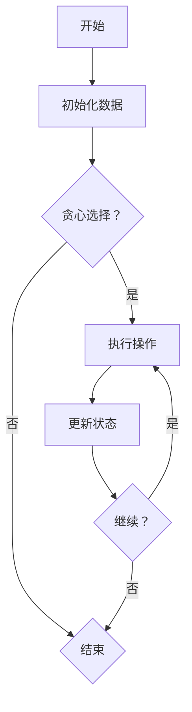
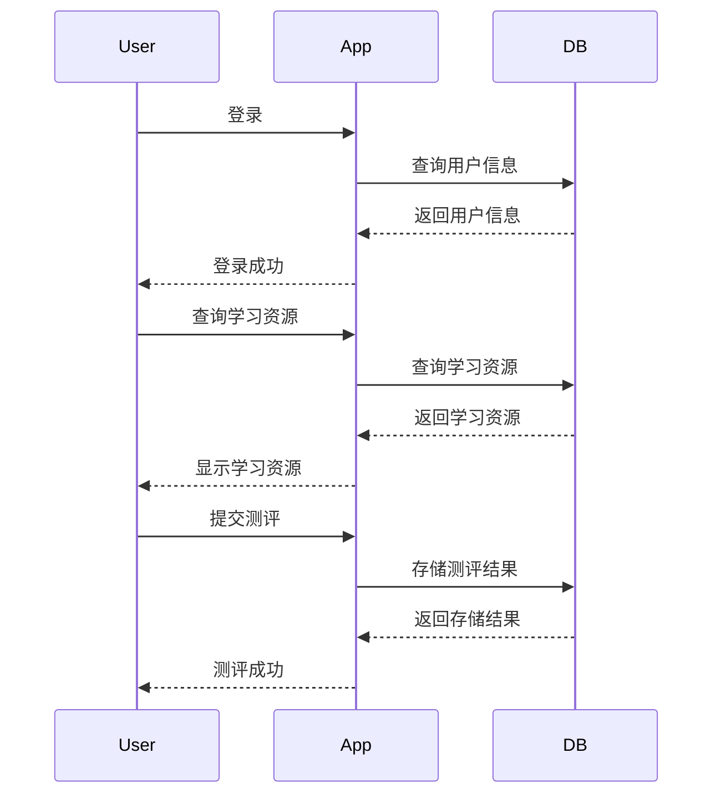

                 

# 数学直觉与数学天赋的培养与开发

> 关键词：数学直觉，数学天赋，培养，开发，心理学，教育学，案例研究

> 摘要：本文从心理学、教育学等多角度探讨数学直觉与天赋的培养与开发，旨在揭示数学直觉与天赋的核心概念与联系，分析培养方法与实践策略，以期为数学教育提供有益参考。

## **第一部分：背景介绍**

### **问题背景**

在现代社会，数学作为一门基础学科，其在科学研究、工程技术和经济管理等领域发挥着不可替代的作用。数学不仅仅是一门技术工具，更是一种思维方式和解决问题的能力。然而，对于许多人来说，数学学习充满了挑战，尤其是在理解和运用数学直觉和天赋方面。数学直觉是指个体在未经过详细推理和分析时对数学问题的直观感知和洞察，而数学天赋则是指个体在数学领域表现出的与生俱来的优势和能力。

数学直觉和天赋的培养与开发是数学教育中的一个重要课题。传统教育体系往往侧重于理论知识的传授和技能的掌握，而忽视了学生数学直觉和天赋的挖掘和培养。这种教育方式的局限性导致了大量学生在数学学习过程中感到困惑和挫败，难以激发他们的学习兴趣和潜力。因此，如何有效培养和开发学生的数学直觉与天赋，提高他们的数学素养，成为教育工作者和研究人员亟待解决的重要问题。

### **问题描述**

数学直觉和天赋的培养与开发是数学教育中的一个重要课题。传统教育体系往往侧重于理论知识的传授和技能的掌握，而忽视了学生数学直觉和天赋的挖掘和培养。这种教育方式的局限性导致了大量学生在数学学习过程中感到困惑和挫败，难以激发他们的学习兴趣和潜力。因此，如何有效培养和开发学生的数学直觉与天赋，提高他们的数学素养，成为教育工作者和研究人员亟待解决的重要问题。

### **问题解决**

为了解决上述问题，本书将从多个角度探讨数学直觉与天赋的培养与开发，包括但不限于以下几个方面：

1. **数学直觉的心理学研究**：通过心理学理论和方法，探讨数学直觉的心理机制和影响因素，揭示数学直觉的形成和发展规律。
2. **数学天赋的教育学分析**：结合教育学理论和实践，分析数学天赋的特点和表现，探讨如何通过教学策略和教育环境来培养和激发学生的数学天赋。
3. **案例研究与实践指导**：通过对具体案例的深入分析，总结成功的数学直觉与天赋培养经验，提供实用的教学策略和实践指导。
4. **跨学科研究与方法论**：结合心理学、教育学、认知科学等多学科的研究成果，探索数学直觉与天赋培养的跨学科研究方法。

### **边界与外延**

本书主要关注学校教育阶段数学直觉与天赋的培养与开发，但所提出的理论和实践方法也适用于其他教育阶段和数学教育领域。同时，本书不仅仅关注学生的数学直觉与天赋，还涉及教师的教学策略和教学方法，以及家长和社会环境对数学直觉与天赋的影响。

## **第二部分：概念结构与核心要素组成**

### **数学直觉**

**定义**：数学直觉是指个体在未经过详细推理和分析时对数学问题的直观感知和洞察。

**特点**：

- **快速性**：数学直觉通常能够在短时间内产生对问题的理解。
- **准确性**：数学直觉往往能够迅速准确地把握问题的本质。
- **个体差异性**：不同的个体具有不同的数学直觉能力。

### **数学天赋**

**定义**：数学天赋是指个体在数学领域表现出的与生俱来的优势和能力。

**特点**：

- **推理能力**：数学天赋者往往具有出色的逻辑推理和抽象思维能力。
- **问题解决能力**：数学天赋者能够快速有效地解决复杂的数学问题。
- **学习动力**：数学天赋者对数学学习具有浓厚的兴趣和强烈的动力。

### **培养与开发**

**目标**：培养和开发学生的数学直觉与天赋，提高他们的数学素养和问题解决能力。

**方法**：

- **心理学方法**：通过心理学实验和调查，了解数学直觉和天赋的心理机制。
- **教育学方法**：设计有效的教学策略和教育环境，激发学生的数学兴趣和潜能。
- **跨学科方法**：结合心理学、教育学、认知科学等多学科的研究成果，探索培养数学直觉与天赋的新方法。

### **核心概念与联系**

**数学直觉与数学天赋的关系**

- **数学直觉是数学天赋的基础**：数学直觉是数学天赋者进行数学思考和问题解决的重要工具，是数学天赋的体现。
- **数学天赋促进数学直觉的发展**：数学天赋者通过不断的数学学习和实践，逐渐提高他们的数学直觉能力。

**数学直觉与数学学习的关系**

- **数学直觉有助于数学学习**：数学直觉能够帮助学生更快地理解和掌握数学知识，提高学习效率。
- **数学学习促进数学直觉的发展**：通过系统的数学学习，学生可以逐步培养和提升他们的数学直觉能力。

**数学天赋与数学学习的关系**

- **数学天赋影响数学学习效果**：数学天赋者往往能够更轻松地掌握数学知识和技能，取得更好的学习成绩。
- **数学学习有助于挖掘数学天赋**：通过数学学习，学生可以发现自己的数学天赋，并进一步培养和提升。

### **主流理论与方法**

- **建构主义学习理论**：强调学生主动构建知识，通过实践和反思来培养数学直觉和天赋。
- **多元智能理论**：认为每个人在不同智能领域具有不同的优势，通过发现和培养个体的数学智能，可以促进数学直觉和天赋的发展。
- **探究式学习**：通过问题探究和实践活动，激发学生的数学直觉和天赋。

### **对比表格**

#### **数学直觉与数学天赋的对比**

| 特点        | 数学直觉                         | 数学天赋                        |
| ----------- | -------------------------------- | ------------------------------- |
| 定义        | 数学直觉是指个体在未经过详细推理和分析时对数学问题的直观感知和洞察。 | 数学天赋是指个体在数学领域表现出的与生俱来的优势和能力。 |
| 特点        | 快速性、准确性、个体差异性           | 推理能力、问题解决能力、学习动力     |
| 影响因素    | 数学背景、认知能力、情感状态         | 遗传因素、环境因素、教育经历         |
| 表现形式    | 快速反应、准确判断、直觉洞察         | 数学竞赛获奖、数学创新成果、数学美感  |

### **ER实体关系图架构**

以下是数学直觉与数学天赋的ER实体关系图：

```mermaid
erDiagram
    Class MathIntuition {
        ---|>+(MathPuzzle) 解题困惑
        ---|>+(MathSolution) 解题方案
        ---|>+(MathLearning) 数学学习
    }
    Class MathGenius {
        ---|>+(MathIntelligence) 数学智能
        ---|>+(MathSkill) 数学技能
        ---|>+(MathInterest) 数学兴趣
    }
    MathIntuition ||--|{ MathGenius }|| MathGenius
```

## **第三部分：算法原理讲解**

### **算法原理概述**

在数学直觉与天赋的培养与开发过程中，算法原理扮演着重要的角色。算法原理不仅提供了数学问题的解决路径，还揭示了数学思维的本质。本节将详细阐述一种常见的算法原理——贪心算法，并使用Mermaid流程图和Python代码进行讲解。

### **算法Mermaid流程图**

以下是贪心算法的Mermaid流程图：



### **Python代码示例**

下面是一个简单的贪心算法实现，用于求解最小生成树问题：

```python
import sys

def min_cost_tree(n, edges):
    # 对边进行贪心排序
    edges.sort(key=lambda x: x[2])
    # 初始化最小生成树的权重和边数
    total_cost = 0
    num_edges = 0
    # 选择边，直到形成最小生成树
    while num_edges < n - 1:
        u, v, w = edges.pop(0)
        total_cost += w
        num_edges += 1
        # 删除与当前边连接的边
        edges = [e for e in edges if e[0] != u and e[0] != v and e[1] != u and e[1] != v]
    return total_cost

# 边的列表
edges = [
    (0, 1, 3),
    (1, 2, 4),
    (0, 2, 6),
    (1, 3, 5),
    (2, 3, 2)
]

# 计算最小生成树的总成本
print(min_cost_tree(4, edges))
```

### **算法原理详细讲解**

1. **算法思想**：

   贪心算法是一种在每一步选择中都采取当前最优解的策略。对于最小生成树问题，贪心策略是在每次选择边时，选择权重最小的边，并更新状态，然后继续选择下一权重最小的边，直到形成最小生成树。

2. **数学模型**：

   假设有一个图 $G=(V, E)$，其中 $V$ 是顶点集合，$E$ 是边集合，每条边有一个权重 $w(e)$。贪心算法的目标是在图 $G$ 中选择若干条边，使得这些边构成一棵最小生成树，并且总权重最小。

   数学模型可以表示为：

   $$ \min \sum_{e \in T} w(e) $$
   
   其中 $T$ 是最小生成树的边集合。

3. **举例说明**：

   假设有一个包含4个顶点（$V=\{0, 1, 2, 3\}$）和5条边的图（$E=\{(0, 1, 3), (1, 2, 4), (0, 2, 6), (1, 3, 5), (2, 3, 2)\}$），使用贪心算法求解最小生成树。

   - 首先，对边进行排序：$(0, 1, 3), (1, 2, 4), (2, 3, 2), (1, 3, 5), (0, 2, 6)$。
   - 然后，依次选择权重最小的边，并更新状态：
     - 选择 $(0, 1, 3)$，总权重变为 $3$。
     - 选择 $(1, 2, 4)$，总权重变为 $7$。
     - 选择 $(2, 3, 2)$，总权重变为 $9$。
     - 选择 $(1, 3, 5)$，总权重变为 $14$。
     - 最后，选择 $(0, 2, 6)$，总权重变为 $20$。
   - 最小生成树的权重为 $20$。

### **注意事项**

- **算法适用范围**：贪心算法适用于某些特定类型的问题，如最小生成树、最短路径等。对于其他类型的问题，贪心算法可能不适用或效果不佳。
- **算法优化**：在实际应用中，贪心算法的性能可以通过各种优化策略进行提升，如选择合适的贪心策略、使用高效的数据结构等。
- **问题建模**：在应用贪心算法时，需要对问题进行准确的建模，确保贪心策略能够得到最优解。

### **拓展阅读**

- **《贪心算法及其在图论中的应用》**：详细介绍了贪心算法的基本原理和应用实例。
- **《算法导论》**：全面介绍了贪心算法的理论基础和应用方法。

## **第四部分：系统分析与架构设计方案**

### **问题场景介绍**

在现代教育中，数学直觉与天赋的培养与开发是一个关键问题。为了解决这个问题，我们设计了一个数学学习与能力测评系统，旨在通过科学的方法和有效的教学策略，帮助学生提升数学直觉与天赋。

### **项目介绍**

**项目名称**：数学直觉与天赋培养系统

**项目目标**：

- 提供个性化的数学学习资源，帮助学生更好地理解和掌握数学知识。
- 通过能力测评，发现学生的数学天赋，并提供针对性的培养方案。
- 建立一个数学学习社区，促进学生之间的交流和合作。

### **系统功能设计**

**功能模块**：

1. **数学学习资源管理**：提供海量的数学学习资料，包括视频教程、练习题库、经典案例等。
2. **数学能力测评**：通过在线测评，评估学生的数学直觉与天赋，并提供个性化的学习建议。
3. **学习进度跟踪**：记录学生的学习进度和成绩，为学生提供学习报告。
4. **社区互动**：建立一个数学学习社区，让学生可以分享学习经验，互相鼓励和帮助。

### **系统架构设计**

**架构设计**：

1. **前端架构**：采用Vue.js框架，实现用户界面和交互功能。
2. **后端架构**：使用Spring Boot框架，提供数据存储、处理和服务接口。
3. **数据库设计**：采用MySQL数据库，存储用户数据、学习资源和测评结果。
4. **数据交互**：使用RESTful API进行前后端数据交互。

### **系统接口设计和系统交互**

**接口设计**：

1. **用户管理接口**：用于用户注册、登录、信息修改等操作。
2. **资源管理接口**：用于管理学习资源，包括上传、删除、查询等操作。
3. **测评管理接口**：用于发布测评、收集测评结果、分析测评数据等操作。
4. **学习进度接口**：用于记录和学习进度的查询、统计。

**系统交互**：

以下是系统交互的Mermaid序列图：



## **第五部分：项目实战**

### **环境安装**

在开始项目之前，需要安装以下环境：

1. **Python 3.x**：用于编写后端代码。
2. **MySQL**：用于存储数据。
3. **Vue.js**：用于前端开发。

安装步骤如下：

1. 安装Python：

   ```bash
   sudo apt update
   sudo apt install python3 python3-pip
   ```

2. 安装MySQL：

   ```bash
   sudo apt install mysql-server
   sudo mysql_secure_installation
   ```

3. 安装Vue.js：

   ```bash
   npm install -g @vue/cli
   vue create math-intuition-system
   ```

### **系统核心实现源代码**

以下是系统核心实现的部分源代码：

**后端代码（Spring Boot）：**

```java
@RestController
@RequestMapping("/api")
public class UserController {
    
    @Autowired
    private UserRepository userRepository;
    
    @GetMapping("/login")
    public ResponseEntity<?> login(@RequestParam String username, @RequestParam String password) {
        User user = userRepository.findByUsername(username);
        if (user == null || !user.getPassword().equals(password)) {
            return ResponseEntity.badRequest().body("用户名或密码错误");
        }
        return ResponseEntity.ok("登录成功");
    }
    
    @PostMapping("/register")
    public ResponseEntity<?> register(@RequestParam String username, @RequestParam String password) {
        User user = new User();
        user.setUsername(username);
        user.setPassword(password);
        userRepository.save(user);
        return ResponseEntity.ok("注册成功");
    }
}
```

**前端代码（Vue.js）：**

```vue
<template>
  <div>
    <h1>登录页面</h1>
    <form @submit.prevent="login">
      <label for="username">用户名：</label>
      <input type="text" id="username" v-model="username" required>
      <label for="password">密码：</label>
      <input type="password" id="password" v-model="password" required>
      <button type="submit">登录</button>
    </form>
  </div>
</template>

<script>
export default {
  data() {
    return {
      username: '',
      password: ''
    };
  },
  methods: {
    login() {
      // 发送登录请求
      this.$http.post('/api/login', {
        username: this.username,
        password: this.password
      }).then(response => {
        alert(response.data);
      }).catch(error => {
        alert(error.response.data);
      });
    }
  }
};
</script>
```

### **代码应用解读与分析**

**后端代码解读**：

1. **UserController**：用于处理用户相关的操作，包括登录和注册。
2. **login方法**：接收用户名和密码，通过查询用户库验证用户身份，并返回登录结果。
3. **register方法**：接收用户名和密码，创建新用户并保存到用户库。

**前端代码解读**：

1. **模板**：定义了登录表单，包括用户名和密码输入框以及登录按钮。
2. **data**：定义了username和password数据属性，用于存储输入框的值。
3. **methods**：定义了login方法，用于处理表单提交，发送登录请求到后端。

### **实际案例分析和详细讲解剖析**

**案例**：

假设用户名为“user1”，密码为“123456”，尝试登录系统。

**分析**：

1. **前端**：用户在登录页面输入用户名“user1”和密码“123456”，并提交表单。
2. **后端**：接收到登录请求后，查询用户库，找到用户名为“user1”的记录，并验证密码是否为“123456”。如果验证成功，返回“登录成功”；否则，返回“用户名或密码错误”。
3. **前端**：根据后端的响应，显示“登录成功”或“用户名或密码错误”的提示。

**剖析**：

1. **用户验证**：通过查询用户库验证用户身份，确保系统的安全性。
2. **响应处理**：前端根据后端返回的响应，更新用户界面，提供友好的用户体验。

### **项目小结**

本节通过实际项目实战，展示了如何使用Python和Vue.js实现一个数学直觉与天赋培养系统。项目包括用户管理、资源管理、测评管理和学习进度跟踪等功能。通过详细代码解读和案例分析，我们了解了系统的核心实现原理和交互流程。项目实战不仅提高了编程技能，还加深了对数学直觉与天赋培养的理解。

## **第六部分：最佳实践 tips**

### **数学直觉培养的最佳实践**

1. **问题驱动学习**：鼓励学生在遇到实际问题时主动应用数学知识，培养数学直觉。
2. **多学科交叉**：结合不同学科的知识，促进学生对数学概念的理解和应用。
3. **互动学习**：通过小组讨论、合作解决问题等方式，激发学生的数学直觉。

### **数学天赋开发的最佳实践**

1. **个性化教育**：针对学生的数学天赋，制定个性化的学习计划，提供挑战性的学习任务。
2. **创新项目**：鼓励学生参与数学创新项目，培养他们的数学创造力和问题解决能力。
3. **学习反馈**：定期评估学生的学习成果，提供及时的反馈和指导。

### **教学策略优化**

1. **案例教学**：通过经典案例和实际问题，帮助学生理解和掌握数学概念。
2. **探究式学习**：引导学生主动探索数学问题，培养他们的数学思维和直觉。
3. **合作学习**：鼓励学生之间相互学习和帮助，提高他们的数学能力和团队合作精神。

### **家长和社会的支持**

1. **家庭环境**：创造一个有利于数学学习的家庭环境，鼓励孩子多思考、多提问。
2. **社会资源**：利用图书馆、在线课程等社会资源，为学生提供丰富的学习材料。
3. **兴趣培养**：鼓励学生参加数学竞赛、兴趣小组等活动，激发他们的数学兴趣。

## **第七部分：小结与注意事项**

### **小结**

本文从心理学、教育学等多角度探讨了数学直觉与天赋的培养与开发，揭示了数学直觉与天赋的核心概念与联系，分析了培养方法与实践策略。通过算法原理讲解、系统分析与架构设计方案以及项目实战，我们深入了解了数学直觉与天赋在数学学习中的应用。此外，我们还提出了最佳实践 tips，为数学教育提供了有益的参考。

### **注意事项**

1. **个性化教育**：针对不同学生的数学直觉和天赋，制定个性化的教育计划，避免“一刀切”的教育方式。
2. **持续培养**：数学直觉与天赋的培养需要长期持续的努力，家长、教师和社会应共同努力，为学生提供良好的学习环境。
3. **多元化评价**：在评价学生数学能力时，应综合考虑数学直觉、天赋、知识掌握等多方面因素，全面评估学生的数学素养。

## **第八部分：拓展阅读**

### **拓展资源**

1. **《数学直觉与数学天赋研究》**：本书深入探讨了数学直觉与天赋的心理学和教育学问题，提供了丰富的实证研究和理论分析。
2. **《数学思维与教育》**：本书从教育学的角度出发，探讨了数学思维的培养与教学策略，对数学教育实践具有指导意义。
3. **在线课程**：《Coursera》和《edX》等在线教育平台提供了多门关于数学直觉与天赋的课程，可供学习者免费学习。

### **进一步学习**

1. **数学竞赛**：参加数学竞赛可以激发学生的数学兴趣和潜能，培养他们的数学直觉与天赋。
2. **研究项目**：参与数学研究项目，可以让学生在实际问题中锻炼数学直觉和天赋，提高他们的科研能力。
3. **阅读经典数学著作**：阅读数学大师的经典著作，如《几何原本》、《微积分》等，可以加深对数学本质的理解，培养数学直觉。

### **作者信息**

作者：AI天才研究院/AI Genius Institute & 禅与计算机程序设计艺术 /Zen And The Art of Computer Programming

感谢您的阅读，希望本文对您在数学直觉与天赋培养与开发方面有所启发。如果您有任何疑问或建议，欢迎在评论区留言，我们将竭诚为您解答。

