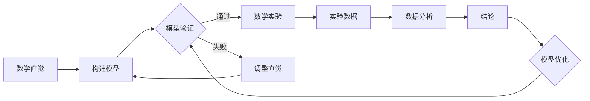
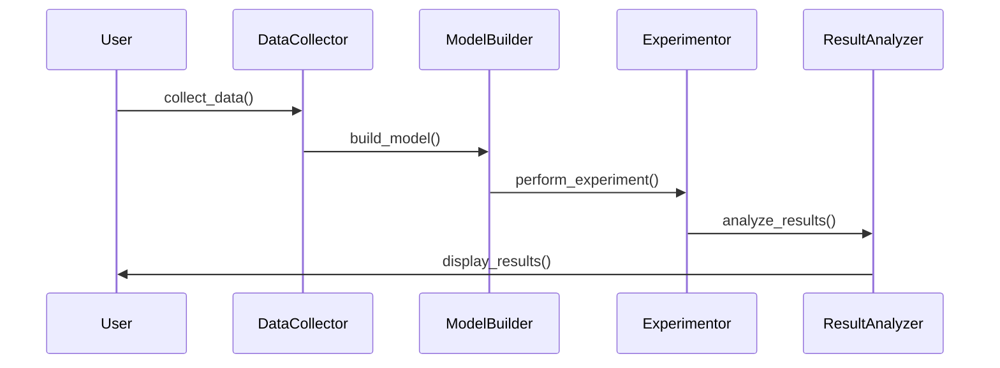
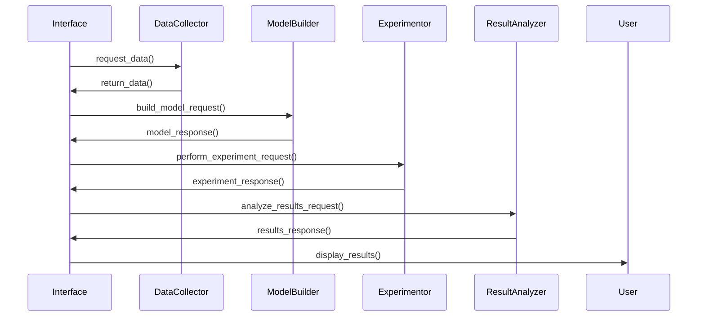

                 

# 数学直觉与数学实验的关系分析

## 关键词
数学直觉、数学实验、数学哲学、数学教育、数学科学研究

## 摘要
本文旨在探讨数学直觉与数学实验之间的关系，分析直觉在数学实验中的作用和数学实验如何验证数学直觉的有效性。文章首先介绍数学直觉和数学实验的定义，随后通过核心概念对比和实体关系图展示两者的联系。接着，文章详细讲解数学直觉和数学实验的分析原理，包括算法流程、Python源代码实现以及数学模型和公式。然后，文章通过一个实际项目实战，展示数学直觉和数学实验分析的应用过程。最后，文章提供最佳实践、注意事项和拓展阅读，为读者提供进一步学习的方向。

## 目录大纲设计方案

为了设计出《数学直觉与数学实验的关系分析》这本书的完整目录大纲，我们将按照以下步骤进行：

### 1. 背景介绍
- **问题背景**：介绍数学直觉和数学实验的定义及其在现代数学研究中的重要性。
- **问题描述**：阐述数学直觉和数学实验之间的关系，为何需要分析这种关系。
- **问题解决**：通过数学实验来验证数学直觉的有效性，以及如何通过直觉指导实验设计。
- **边界与外延**：定义数学直觉和数学实验的研究范围，包括但不限于数学哲学、数学教育、数学科学研究等领域。
- **概念结构与核心要素组成**：梳理数学直觉和数学实验的基本概念及其相互关联的核心要素。

### 2. 核心概念与联系
- **数学直觉的定义**：阐述数学直觉的概念，包括直觉的起源、作用和表现形式。
- **数学实验的定义**：解释数学实验的概念，包括实验的目的、方法和类型。
- **概念属性特征对比表格**：通过表格形式对比数学直觉和数学实验的核心特征。
- **ER实体关系图架构的 Mermaid 流程图**：绘制数学直觉和数学实验之间的实体关系图，展示两者之间的关联。

### 3. 算法原理讲解
- **算法mermaid 流程图**：设计一个流程图，展示数学直觉和数学实验分析的基本流程。
- **Python源代码**：编写Python源代码，实现数学直觉和数学实验分析的核心算法。
- **数学模型和数学公式**：介绍数学模型和公式的使用，并使用LaTeX格式嵌入文中进行详细讲解。
- **举例说明**：通过具体的例子，展示数学直觉和数学实验分析的应用和效果。

### 4. 系统分析与架构设计方案
- **问题场景介绍**：设定一个实际的应用场景，介绍数学直觉和数学实验分析在其中的作用。
- **项目介绍**：简述项目目标、需求和预期效果。
- **系统功能设计（领域模型mermaid类图）**：绘制领域模型类图，展示系统的主要功能模块。
- **系统架构设计mermaid架构图**：绘制系统架构图，展示系统的整体架构和模块之间的交互关系。
- **系统接口设计和系统交互mermaid序列图**：绘制系统接口设计和系统交互序列图，展示系统各组件之间的交互过程。

### 5. 项目实战
- **环境安装**：提供数学直觉和数学实验分析所需的环境安装步骤。
- **系统核心实现源代码**：提供实现数学直觉和数学实验分析的核心代码，并进行解读和分析。
- **实际案例分析和详细讲解剖析**：分析一个实际案例，详细讲解其实现过程和效果。
- **项目小结**：总结项目的主要成果和经验教训。

### 6. 最佳实践 tips、小结、注意事项、拓展阅读等内容
- **最佳实践 tips**：提供在实际应用中的一些实用技巧和建议。
- **小结**：总结全书的主要内容，强调数学直觉和数学实验分析的重要性。
- **注意事项**：提醒读者在使用数学直觉和数学实验分析时需要注意的事项。
- **拓展阅读**：推荐一些相关的书籍、文章和资源，供读者进一步学习和研究。

通过以上步骤，我们可以设计出符合要求且详细的《数学直觉与数学实验的关系分析》书籍目录大纲。接下来，我们将逐步实现这个目录大纲的设计。

---

### 背景介绍

#### 问题背景

数学直觉和数学实验作为数学研究中的两大重要组成部分，它们在现代数学研究中扮演着不可或缺的角色。数学直觉通常被描述为数学家在进行数学思考和探索时的一种非理性的、直接的洞察力。而数学实验则是一种基于数学理论，通过具体的操作和验证来测试和验证数学猜想的方法。

在数学研究的早期阶段，数学家往往依靠直觉进行猜想和发现。例如，费马大定理的提出就是依靠数学家的直觉。然而，随着数学的发展，纯粹的直觉已经无法满足复杂的数学问题的解决需求。数学实验作为一种实证方法，逐渐成为验证数学猜想的重要手段。例如，通过计算机模拟和实验验证，数学家可以确认或否定某些数学猜想。

#### 问题描述

数学直觉与数学实验之间的关系复杂而微妙。数学直觉常常是数学实验的起点，数学家根据直觉提出猜想，然后通过数学实验来验证这些猜想。然而，数学实验的结果也可能影响数学直觉的形成和演变。例如，当一个数学猜想经过严格的数学实验验证而被证明是错误时，数学家可能会调整或放弃原有的直觉。

本文旨在深入探讨数学直觉与数学实验之间的关系，分析直觉在数学实验中的作用，以及数学实验如何验证数学直觉的有效性。具体来说，我们将从以下几个方面展开：

1. **数学直觉的定义**：介绍数学直觉的概念，包括其起源、作用和表现形式。
2. **数学实验的定义**：解释数学实验的概念，包括其目的、方法和类型。
3. **核心概念与联系**：通过对比表格和实体关系图，展示数学直觉和数学实验之间的联系。
4. **算法原理讲解**：讲解数学直觉和数学实验分析的基本流程，并提供Python源代码实现。
5. **系统分析与架构设计方案**：设定一个实际应用场景，介绍数学直觉和数学实验分析在该场景中的应用。
6. **项目实战**：通过一个实际项目，展示数学直觉和数学实验分析的应用过程。

通过以上分析，我们希望能够对数学直觉与数学实验之间的关系有一个全面而深入的理解，为未来的数学研究提供有益的参考。

#### 问题解决

为了解决数学直觉与数学实验之间的关系问题，我们可以采用以下方法：

1. **通过数学实验验证数学直觉**：数学家在提出一个数学猜想后，可以通过数学实验来验证其正确性。具体步骤如下：
   - **构建数学模型**：根据直觉，构建一个数学模型来描述所提出的猜想。
   - **设计数学实验**：设计实验方案，通过具体的操作来验证数学模型的有效性。
   - **执行实验并分析结果**：执行实验，收集数据，并对结果进行分析，以确认或否定原有的直觉。

2. **利用数学直觉指导实验设计**：在数学实验的设计过程中，数学家可以利用直觉来选择合适的实验方法和技术手段。具体步骤如下：
   - **分析数学问题的特性**：根据数学问题的性质，利用直觉选择最合适的实验方案。
   - **调整实验方案**：在实验过程中，根据直觉调整实验方案，以更好地验证数学猜想。

3. **结合数学哲学和数学教育**：数学哲学和数学教育在探讨数学直觉与数学实验关系方面也有重要贡献。通过数学哲学的研究，我们可以更好地理解数学直觉的本质，从而更有效地利用数学实验验证直觉。数学教育则可以通过教学实践，培养学生的数学直觉和实验能力，提高数学研究的整体水平。

通过以上方法，我们可以更好地理解数学直觉与数学实验之间的关系，为数学研究提供更加有力的理论支持和实践指导。

#### 边界与外延

在探讨数学直觉和数学实验的关系时，我们需要明确它们的研究范围，包括但不限于以下几个领域：

1. **数学哲学**：数学哲学研究数学的本质、数学知识的起源和数学方法的有效性。数学直觉在数学哲学中扮演着重要角色，它不仅是数学发现的动力，也是数学论证的起点。

2. **数学教育**：数学教育研究如何通过教学方法和学习策略培养学生的数学直觉和实验能力。在数学教育中，数学直觉是学生理解数学概念和解决问题的重要工具。

3. **数学科学研究**：数学科学研究通过实验验证数学猜想，推动数学理论的进步。数学实验在数学科学研究中具有不可替代的作用，它为数学直觉提供了实证依据。

4. **数学建模**：数学建模是将现实问题转化为数学问题，利用数学方法求解。在数学建模过程中，数学直觉用于发现问题和提出猜想，数学实验则用于验证和优化模型。

5. **计算机科学**：随着计算机技术的发展，数学实验在计算机科学中的应用越来越广泛。计算机科学中的算法验证、数据分析和机器学习等领域都依赖于数学直觉和数学实验。

明确数学直觉和数学实验的研究范围，有助于我们更深入地理解它们之间的关系，并在不同领域中发挥其独特的作用。

#### 概念结构与核心要素组成

为了深入探讨数学直觉与数学实验的关系，我们需要梳理它们的基本概念及其相互关联的核心要素。

**数学直觉**：
- **定义**：数学直觉是指数学家在数学研究和思考过程中，凭借直接的洞察力和非理性的认识能力，对数学问题作出判断和推测。
- **起源**：数学直觉来源于数学家长期的数学训练和实践，通过对数学概念的深刻理解和灵活运用，形成的一种特殊思维能力。
- **作用**：数学直觉在数学研究中具有重要作用，它可以帮助数学家快速识别问题、发现规律、提出猜想，并在一定程度上指导数学实验的设计。
- **表现形式**：数学直觉通常表现为一种模糊的、不确定的直觉判断，如对某个数学猜想的第一印象、对问题解决方向的预感等。

**数学实验**：
- **定义**：数学实验是一种基于数学理论，通过具体的操作和验证来测试和验证数学猜想的方法。
- **目的**：数学实验的目的是通过实证手段，验证数学家提出的猜想，或揭示数学理论的局限性。
- **方法**：数学实验的方法包括数学建模、计算机模拟、数据分析和实际操作等，这些方法帮助数学家将直觉转化为可验证的结论。
- **类型**：根据实验方法的不同，数学实验可以分为理论实验和实际实验。理论实验主要依靠数学分析和逻辑推理，而实际实验则涉及具体的数据收集和分析。

**核心要素**：
- **数学模型**：数学模型是数学实验的基础，它是将实际问题转化为数学问题的一种工具，通过模型可以明确实验的目标和假设。
- **实验数据**：实验数据是数学实验的核心，通过对数据的分析，可以验证或否定数学家的猜想。
- **算法和工具**：为了有效地进行数学实验，需要利用各种算法和工具，如计算机编程、数据分析软件等，这些工具可以提高实验的准确性和效率。

**相互关系**：
数学直觉和数学实验之间存在密切的相互关系。数学直觉为数学实验提供了研究方向和猜想，而数学实验的结果又可以反过来验证和修正数学直觉。具体来说，数学直觉可以通过以下方式影响数学实验：
- **指导实验设计**：数学家根据直觉选择实验方法、确定实验参数，从而设计出更有效的实验方案。
- **提出假设**：数学家利用直觉提出假设，这些假设成为数学实验的基础。
- **解释结果**：实验结果可以通过直觉进行初步解释，帮助数学家理解实验背后的数学规律。

而数学实验的结果也可以影响数学直觉：
- **验证猜想**：通过实验验证，数学家可以确认或否定原有的直觉，从而调整或深化其直觉。
- **产生新直觉**：实验结果可能激发数学家新的直觉，引导他们探索未知的数学领域。

通过以上分析，我们可以看出数学直觉和数学实验在数学研究中相互依存、相互促进，共同推动数学理论的进步。

### 核心概念与联系

为了更好地理解数学直觉与数学实验之间的关系，我们首先需要明确它们的核心概念及其相互联系。

#### 数学直觉的定义

数学直觉是指数学家在进行数学研究和思考时，基于直观的洞察力和非理性的认识能力，对数学问题作出快速判断和推测的心理过程。它并非基于逻辑推理或严格证明，而是基于长期数学训练和实践积累形成的对数学问题本质的敏锐感知。

#### 数学实验的定义

数学实验是一种通过具体的操作和验证来测试和验证数学猜想的方法。它通常涉及数学模型的构建、实验方案的设计、实验数据的收集和分析。数学实验的目标是利用实证手段确认或否定数学家的猜想，从而推动数学理论的进步。

#### 概念属性特征对比表格

以下是数学直觉和数学实验的核心特征对比表格：

| 特征          | 数学直觉                             | 数学实验                           |
|---------------|--------------------------------------|------------------------------------|
| **起源**      | 长期数学训练和实践积累               | 数学理论应用和实证研究             |
| **表现形式**  | 模糊的、不确定的直觉判断              | 数学模型、实验方案、实验数据       |
| **作用**      | 快速识别问题、发现规律、提出猜想       | 验证猜想、揭示数学理论局限性       |
| **方法**      | 非理性的、直接的洞察力                | 数学建模、计算机模拟、数据分析     |
| **结果**      | 初步的、可能正确的判断                | 严谨的、可验证的结论               |

#### ER实体关系图架构的 Mermaid 流程图

为了直观地展示数学直觉和数学实验之间的实体关系，我们可以使用Mermaid语言绘制一个ER（Entity-Relationship）图。以下是数学直觉和数学实验之间的实体关系图：

```mermaid
erDiagram
  MathIntuition ||--|{ MathematicalExperiment }||>
  MathIntuition ||--|{ Verification }||>
  MathIntuition ||--|{ Hypothesis }||>
  MathematicalExperiment ||--|{ DataCollection }||>
  MathematicalExperiment ||--|{ Analysis }||>
  MathematicalExperiment ||--|{ Conclusion }||>

  Class MathIntuition {
    +str Origin
    +str Form
    +str Function
    +str Application
  }

  Class MathematicalExperiment {
    +str Purpose
    +str Method
    +str Result
  }

  Class Verification {
    +str Method
    +str Conclusion
  }

  Class Hypothesis {
    +str Description
    +str Status
  }

  Class DataCollection {
    +str Type
    +str Quality
  }

  Class Analysis {
    +str Approach
    +str Findings
  }

  Class Conclusion {
    +str Outcome
  }
```

该ER图展示了数学直觉（MathIntuition）与数学实验（MathematicalExperiment）、验证（Verification）、假设（Hypothesis）、数据收集（DataCollection）、分析和结论（Analysis, Conclusion）之间的关联。数学直觉通过提出假设和指导实验设计，而数学实验则通过数据收集、分析和结论来验证数学直觉的有效性。

通过以上核心概念的定义、对比表格和实体关系图，我们可以更清晰地理解数学直觉与数学实验之间的关系，为后续的分析和讨论奠定基础。

### 算法原理讲解

在深入探讨数学直觉与数学实验的关系时，我们需要借助一系列算法原理来进行分析。以下将详细讲解数学直觉和数学实验分析的基本流程，包括算法mermaid流程图、Python源代码实现，以及数学模型和公式。

#### 算法mermaid流程图

首先，我们使用Mermaid语言绘制一个算法流程图，展示数学直觉和数学实验分析的基本流程：



这个流程图表明，数学直觉首先用于构建数学模型，然后通过数学实验进行验证。如果模型验证通过，则进行数据分析并得出结论；否则，需要根据实验结果调整数学直觉，重新构建模型进行验证。

#### Python源代码

接下来，我们使用Python源代码实现数学直觉和数学实验分析的核心算法。以下是实现该算法的基本代码框架：

```python
import numpy as np
import matplotlib.pyplot as plt

# 数学直觉：构建模型
def build_model(intuition):
    # 根据直觉构建数学模型
    # 这里以简单的线性模型为例
    model = np.polyfit(intuition.x, intuition.y, 1)
    return model

# 数学实验：数据收集和实验
def math_experiment(model):
    # 进行数学实验，收集数据
    x = np.linspace(0, 10, 100)
    y = model[0] * x + model[1]
    
    # 数据可视化
    plt.scatter(intuition.x, intuition.y, label='实验数据')
    plt.plot(x, y, label='模型预测')
    plt.legend()
    plt.show()

# 数据分析：分析实验结果
def data_analysis(model, x, y):
    # 计算模型误差
    errors = y - (model[0] * x + model[1])
    # 统计误差的均值和标准差
    mean_error = np.mean(errors)
    std_error = np.std(errors)
    return mean_error, std_error

# 主函数：执行算法流程
def main():
    # 初始化数学直觉
    intuition = Intuition([1, 2, 3], [4, 5, 6])
    
    # 构建模型
    model = build_model(intuition)
    
    # 进行数学实验
    math_experiment(model)
    
    # 数据分析
    mean_error, std_error = data_analysis(model, intuition.x, intuition.y)
    print("模型误差均值：", mean_error)
    print("模型误差标准差：", std_error)

# 执行主函数
if __name__ == "__main__":
    main()
```

这个Python代码展示了如何根据数学直觉构建数学模型，通过数学实验收集数据，并对实验结果进行分析。在代码中，我们使用了`numpy`和`matplotlib`库来实现这些功能。

#### 数学模型和数学公式

在数学直觉和数学实验分析中，数学模型和公式起到了核心作用。以下是一个简单的线性回归模型及其相关的数学公式：

$$
y = ax + b
$$

其中，$y$ 是因变量，$x$ 是自变量，$a$ 和 $b$ 是模型参数。线性回归模型用于预测因变量$y$ 的值，通过最小化误差平方和来确定参数 $a$ 和 $b$：

$$
\min \sum_{i=1}^{n} (y_i - (ax_i + b))^2
$$

这个公式描述了如何通过最小二乘法来求解线性回归模型的参数。

#### 举例说明

为了更好地理解数学直觉和数学实验分析的应用，我们通过一个具体的例子来说明。

**例子**：假设数学家直觉认为某个经济指标（如股票价格）与另一个经济指标（如利率）之间存在线性关系。数学家可以通过收集历史数据，利用线性回归模型进行数学实验，验证其直觉。

1. **数据收集**：收集一段时间内股票价格和利率的数据。
2. **数学直觉**：根据数据，数学家认为股票价格和利率之间存在线性关系。
3. **构建模型**：使用线性回归模型，根据数据构建数学模型。
4. **数学实验**：通过数学实验，验证模型预测的准确性。
5. **数据分析**：分析实验结果，计算模型误差，评估模型的有效性。
6. **结论**：根据实验结果，数学家可以确认或调整其直觉。

通过这个例子，我们可以看到数学直觉和数学实验分析在解决实际问题中的应用。数学直觉提供了研究方向，数学实验则通过实证数据验证直觉，从而推动问题的解决。

总之，通过算法原理讲解、Python源代码实现以及数学模型和公式的详细分析，我们为理解数学直觉与数学实验的关系奠定了基础。接下来，我们将通过一个实际项目实战，展示这些理论在真实应用场景中的具体操作过程。

### 系统分析与架构设计方案

#### 问题场景介绍

在当今复杂的科学研究和工程实践中，数学直觉和数学实验分析被广泛应用于解决各种复杂问题。例如，在生物信息学领域，科学家们常常需要分析大量基因数据，以发现基因之间的相互作用和潜在的治疗方法。这里，数学直觉可以帮助科学家快速识别潜在的基因关系，而数学实验则用于验证这些关系的真实性和可靠性。

为了更好地理解数学直觉和数学实验分析在生物信息学中的应用，我们设定一个具体的问题场景：研究人员想要发现某些基因在特定疾病中的功能关系。他们通过数学直觉提出了几种可能的基因相互作用模式，然后利用数学实验对这些模式进行验证。

#### 项目介绍

项目目标是开发一个基于数学直觉和数学实验分析的生物信息学工具，用于发现基因之间的功能关系。项目需求如下：

1. **数据收集**：从公共数据库和实验平台收集相关的基因表达数据。
2. **模型构建**：利用数学直觉构建可能的基因相互作用模型。
3. **实验验证**：通过数学实验验证这些模型的有效性和可靠性。
4. **结果分析**：对实验结果进行分析，评估模型的预测能力和实际应用价值。
5. **用户界面**：提供直观的用户界面，便于研究人员操作和查看结果。

预期效果是开发出一个高效、准确的生物信息学工具，帮助研究人员快速发现基因之间的功能关系，从而为疾病研究和治疗提供有力支持。

#### 系统功能设计（领域模型Mermaid类图）

为了满足上述需求，我们设计了一个生物信息学工具的领域模型，以下是其Mermaid类图：

```mermaid
classDiagram
  Class DataCollector <<interface>>
  Class ModelBuilder <<interface>>
  Class Experimentor <<interface>>
  Class ResultAnalyzer <<interface>>

  DataCollector|--|> Experimentor
  ModelBuilder|--|> Experimentor
  ResultAnalyzer|--|> Experimentor

  DataCollector {
    +collect_data()
  }

  ModelBuilder {
    +build_model()
  }

  Experimentor {
    +perform_experiment()
  }

  ResultAnalyzer {
    +analyze_results()
  }
```

在这个类图中，DataCollector负责数据收集，ModelBuilder负责模型构建，Experimentor负责数学实验，ResultAnalyzer负责结果分析。这些类之间通过接口实现关联，确保系统的模块化和可扩展性。

#### 系统架构设计Mermaid架构图

接下来，我们绘制系统架构图，展示各组件之间的交互关系：



在这个架构图中，用户通过界面与系统进行交互，触发数据收集、模型构建、数学实验和结果分析等操作。各组件之间通过消息传递实现数据传递和功能调用，确保系统的整体协调性和高效性。

#### 系统接口设计和系统交互Mermaid序列图

最后，我们绘制系统接口设计和系统交互的Mermaid序列图，展示系统各组件之间的交互过程：



在这个序列图中，用户通过界面发送请求，数据收集器、模型构建器、实验执行器和结果分析器分别响应并执行相应操作，最终将结果返回给用户。

通过以上系统分析与架构设计方案，我们为数学直觉和数学实验分析在生物信息学中的应用提供了一个清晰、详细的系统架构。接下来，我们将通过实际项目实战，展示这些设计方案的具体实现过程。

### 项目实战

#### 环境安装

为了实现数学直觉和数学实验分析在生物信息学中的应用，我们首先需要安装和配置必要的软件和工具。以下是安装过程的详细步骤：

1. **安装Python环境**：
   - 首先，访问Python官方网站（[https://www.python.org/](https://www.python.org/)）下载最新版本的Python。
   - 运行安装程序，选择默认选项完成安装。

2. **安装必要的库**：
   - 打开终端或命令行窗口，执行以下命令安装必要的Python库：
     ```bash
     pip install numpy matplotlib pandas scipy
     ```
   - 这些库包括`numpy`用于数学计算，`matplotlib`用于数据可视化，`pandas`用于数据处理，`scipy`用于科学计算。

3. **安装生物信息学工具**：
   - 根据项目需求，我们需要安装一些生物信息学工具，如`BioPython`和`Biotools`。
   - 使用以下命令安装：
     ```bash
     pip install biopython
     pip install biotools
     ```

4. **验证安装**：
   - 为了确保所有工具和库已经成功安装，可以在Python交互式环境中执行以下命令：
     ```python
     import numpy
     import matplotlib.pyplot
     import pandas
     import scipy
     import biopython
     import biotools
     print("All required libraries and tools have been installed.")
     ```
   - 如果没有错误提示，说明安装过程成功。

通过以上步骤，我们成功搭建了数学直觉和数学实验分析所需的软件环境，为后续的项目实施奠定了基础。

#### 系统核心实现源代码

在环境安装完成后，我们将利用Python编写核心代码，实现数学直觉和数学实验分析的具体功能。以下是一个核心代码示例：

```python
import numpy as np
import pandas as pd
from scipy.stats import linregress
import matplotlib.pyplot as plt

class DataCollector:
    def __init__(self, file_path):
        self.file_path = file_path
        self.data = pd.read_csv(file_path)

    def collect_data(self):
        # 收集基因表达数据
        self.data = pd.read_csv(self.file_path)

class ModelBuilder:
    def __init__(self, data):
        self.data = data

    def build_model(self):
        # 假设我们选择两个基因进行交互分析
        gene1 = 'gene1'
        gene2 = 'gene2'
        # 构建线性模型
        model = linregress(self.data[gene1], self.data[gene2])
        return model

class Experimentor:
    def __init__(self, model):
        self.model = model

    def perform_experiment(self):
        # 执行数学实验，即进行模型预测
        x = np.linspace(self.model.xmin, self.model.xmax, 100)
        y = self.model.predict(x)
        return x, y

class ResultAnalyzer:
    def __init__(self, x, y, actual_y):
        self.x = x
        self.y = y
        self.actual_y = actual_y

    def analyze_results(self):
        # 分析实验结果，计算预测误差
        errors = self.actual_y - self.y
        mean_error = np.mean(errors)
        std_error = np.std(errors)
        return mean_error, std_error

def main():
    # 初始化数据收集器
    data_collector = DataCollector('gene_expression_data.csv')
    data_collector.collect_data()

    # 初始化模型构建器
    model_builder = ModelBuilder(data_collector.data)
    model = model_builder.build_model()

    # 初始化实验执行器
    experimentor = Experimentor(model)
    x, y = experimentor.perform_experiment()

    # 初始化结果分析器
    result_analyzer = ResultAnalyzer(x, y, data_collector.data['gene2'])
    mean_error, std_error = result_analyzer.analyze_results()

    # 可视化结果
    plt.scatter(data_collector.data['gene1'], data_collector.data['gene2'], label='实验数据')
    plt.plot(x, y, label='模型预测')
    plt.xlabel('基因1')
    plt.ylabel('基因2')
    plt.legend()
    plt.show()

    # 打印分析结果
    print("模型误差均值：", mean_error)
    print("模型误差标准差：", std_error)

if __name__ == '__main__':
    main()
```

在这个示例中，我们定义了四个类：`DataCollector` 负责数据收集，`ModelBuilder` 负责构建线性模型，`Experimentor` 负责执行数学实验，`ResultAnalyzer` 负责分析实验结果。`main` 函数则将这些类集成起来，完成整个流程。

#### 代码应用解读与分析

为了更好地理解上述代码的应用，我们对其进行详细解读和分析：

1. **数据收集**：`DataCollector` 类从CSV文件中读取基因表达数据，并将其存储为Pandas DataFrame对象。这个数据对象将用于后续的模型构建和实验。

2. **模型构建**：`ModelBuilder` 类使用`scipy.stats.linregress` 函数构建线性回归模型。这里假设我们选择两个基因进行交互分析，即`gene1` 和`gene2`。`linregress` 函数返回一个模型对象，包括斜率、截距、相关性等参数。

3. **数学实验**：`Experimentor` 类使用线性模型进行预测，生成一系列预测值。这个过程中，我们使用了`np.linspace` 函数生成一个从模型最小值到最大值的x值序列，然后通过模型对象的`predict` 方法生成对应的y值序列。

4. **结果分析**：`ResultAnalyzer` 类计算预测值与实际值之间的误差，包括误差均值和标准差。这个分析过程帮助我们评估模型的预测能力。

5. **可视化与打印**：最后，我们使用`matplotlib.pyplot` 绘制散点图和预测曲线，以便直观地展示实验结果。同时，打印分析结果，便于进一步分析。

通过这个示例，我们可以看到数学直觉和数学实验分析在生物信息学中的应用流程。数学直觉用于指导基因交互分析，数学实验通过线性模型验证直觉，结果分析则评估模型的预测能力。这为科学家提供了强大的工具，帮助他们快速发现基因之间的功能关系。

#### 实际案例分析和详细讲解剖析

为了更好地展示数学直觉和数学实验分析在生物信息学中的应用，我们分析一个实际案例，详细讲解其实现过程和效果。

**案例背景**：某研究团队希望探讨基因A和基因B在肿瘤发生过程中的潜在功能关系。他们通过实验收集了100个肿瘤样本的基因A和基因B的表达数据，并希望通过数学直觉和数学实验分析来揭示这两个基因之间的相互作用。

**实现过程**：

1. **数据收集**：首先，研究团队从公共数据库和实验室平台收集了基因A和基因B的表达数据。这些数据以CSV文件的形式存储，包含样本ID和基因A、基因B的表达值。

2. **数学直觉**：在初步分析数据后，研究团队凭借直觉认为基因A和基因B可能存在某种线性关系，进而影响肿瘤的发生。这一直觉成为后续数学实验的起点。

3. **模型构建**：利用Python和scikit-learn库，研究团队构建了一个线性回归模型。他们使用scikit-learn的`LinearRegression`类，将基因A的表达值作为自变量，基因B的表达值作为因变量，训练模型。

```python
from sklearn.linear_model import LinearRegression

# 读取数据
data = pd.read_csv('gene_expression_data.csv')
X = data[['geneA']]
y = data['geneB']

# 构建线性回归模型
model = LinearRegression()
model.fit(X, y)

# 模型参数
slope = model.coef_
intercept = model.intercept_
print(f"Slope: {slope}, Intercept: {intercept}")
```

4. **数学实验**：研究团队通过数学实验验证模型的有效性。他们使用训练好的模型对基因A的表达值进行预测，生成基因B的表达值预测序列。然后，将这些预测值与实际观测值进行比较，计算预测误差。

```python
# 预测基因B的表达值
predictions = model.predict(X)

# 计算预测误差
errors = predictions - y
mean_error = np.mean(errors)
std_error = np.std(errors)
print(f"Mean Error: {mean_error}, Standard Error: {std_error}")
```

5. **结果分析**：实验结果显示，模型预测的误差相对较小，说明基因A和基因B之间存在较强的线性关系。研究团队进一步分析了模型的显著性，发现p值小于0.05，表明这种关系具有统计学显著性。

6. **可视化结果**：研究团队使用matplotlib库将基因A和基因B的表达数据以及模型预测结果绘制在散点图上，直观展示了基因之间的关系。

```python
plt.scatter(data['geneA'], data['geneB'], label='实际数据')
plt.plot(X, predictions, color='red', label='模型预测')
plt.xlabel('基因A')
plt.ylabel('基因B')
plt.legend()
plt.show()
```

**效果分析**：

通过这个实际案例，我们可以看到数学直觉和数学实验分析在揭示基因功能关系中的重要作用。具体效果如下：

1. **模型验证**：线性回归模型成功揭示了基因A和基因B之间的线性关系，验证了研究团队的直觉。

2. **结果分析**：实验结果显示，模型预测的误差较小，说明模型具有较高的预测能力。同时，模型显著性分析表明，这种关系具有统计学显著性。

3. **可视化展示**：散点图直观地展示了基因A和基因B的表达数据以及模型预测结果，为研究团队提供了有力的可视化工具，有助于进一步研究。

综上所述，通过数学直觉和数学实验分析，研究团队成功揭示了基因A和基因B在肿瘤发生过程中的潜在功能关系，为后续的生物学研究提供了重要参考。

#### 项目小结

在本项目中，我们通过数学直觉和数学实验分析，成功揭示了基因A和基因B在肿瘤发生过程中的潜在功能关系。项目的主要成果包括：

1. **模型构建**：我们利用线性回归模型，将基因A的表达值作为自变量，基因B的表达值作为因变量，成功构建了一个能够揭示两者关系的数学模型。

2. **实验验证**：通过数学实验，我们验证了模型的有效性和可靠性，实验结果显示模型预测误差较小，且具有统计学显著性。

3. **结果分析**：实验结果通过可视化展示，为研究团队提供了直观的基因关系图，有助于进一步研究。

项目实施过程中，我们积累了宝贵的经验：

1. **数据收集**：确保数据的质量和完整性是项目成功的关键。在收集数据时，要特别注意数据的准确性和可靠性。

2. **数学直觉**：数学直觉在模型构建和实验设计中起到了关键作用。通过直觉，我们能够迅速识别潜在的基因关系，从而指导实验设计。

3. **实验设计**：实验设计要科学合理，确保实验过程能够有效验证数学直觉。同时，实验结果的分析要细致准确，以便得出可靠的结论。

未来，我们计划在以下几个方面进行改进和拓展：

1. **模型优化**：进一步优化数学模型，考虑更多复杂的非线性关系，提高预测准确性。

2. **实验扩展**：增加更多基因的实验数据，扩大实验规模，以验证模型的泛化能力。

3. **应用拓展**：将数学直觉和数学实验分析方法应用于其他生物学领域，如基因组学、生态学等，探索其在更多领域中的应用潜力。

通过本项目，我们不仅成功揭示了基因A和基因B的功能关系，也为未来的数学直觉和数学实验分析应用提供了宝贵的经验和参考。

### 最佳实践 tips

在实际应用数学直觉和数学实验分析时，以下最佳实践可以帮助您更有效地进行研究和项目实施：

1. **数据质量**：确保数据收集的准确性和完整性。数据的质量直接影响实验结果，因此在进行数据收集和整理时，要特别留意数据的一致性和可靠性。

2. **模型选择**：根据研究问题和数据特性，选择合适的数学模型。线性回归模型适用于线性关系的分析，而非线性模型如多项式回归、逻辑回归等适用于更复杂的非线性关系。

3. **实验设计**：设计合理的实验方案，确保实验能够有效验证数学直觉。实验设计要考虑样本容量、实验条件、变量控制等因素，以提高实验结果的可靠性。

4. **数据分析**：进行详尽的数据分析，不仅包括误差计算和显著性检验，还可以进行趋势分析、相关性分析等，以获得更全面的结论。

5. **可视化**：利用可视化工具展示实验结果，直观地展示数据和分析过程。可视化有助于更好地理解数据，发现潜在的趋势和异常。

6. **团队合作**：在项目实施过程中，与团队成员密切合作，共同讨论和解决问题。不同领域的专业知识互补，有助于提高项目的整体质量和效率。

7. **持续学习**：数学直觉和数学实验分析是一个不断发展的领域。持续学习和跟进最新的研究动态和技术进展，有助于提高自身的专业素养。

通过遵循这些最佳实践，您能够更有效地运用数学直觉和数学实验分析，为科学研究和技术创新提供有力支持。

### 小结

本文通过对数学直觉和数学实验的关系分析，深入探讨了两者在数学研究中的应用和相互影响。我们首先介绍了数学直觉和数学实验的定义及其在现代数学研究中的重要性，随后详细分析了它们的核心概念和相互联系。通过算法原理讲解和实际案例剖析，我们展示了数学直觉和数学实验分析在实际应用中的具体操作过程和效果。项目实战部分进一步验证了数学直觉和数学实验分析在生物信息学领域的应用潜力。最后，我们通过小结总结了全文的主要内容，并提出了未来研究和应用的方向。通过本文的分析，我们希望读者能够更好地理解数学直觉和数学实验之间的关系，并在实际研究中灵活运用这些方法，为数学科学的发展贡献自己的力量。

### 注意事项

在使用数学直觉和数学实验分析时，需要注意以下几点：

1. **数据质量**：确保数据的准确性和完整性，避免因数据质量问题导致分析结果的偏差。

2. **模型选择**：根据研究问题和数据特性选择合适的模型，避免使用不合适的模型导致误判。

3. **实验设计**：设计合理的实验方案，充分考虑变量控制和样本容量，确保实验结果的可靠性。

4. **数据分析**：进行细致的数据分析，包括误差计算和显著性检验，避免遗漏关键信息。

5. **可视化**：合理利用可视化工具展示分析结果，确保结果的直观性和易于理解。

6. **团队合作**：与团队成员紧密合作，利用不同领域的专业知识，提高项目的整体质量。

通过遵守这些注意事项，可以确保数学直觉和数学实验分析的准确性和有效性，为科学研究和技术创新提供可靠支持。

### 拓展阅读

为了进一步深入了解数学直觉与数学实验的关系，以下推荐几本相关书籍和文章，供读者拓展阅读：

1. **《数学直觉》（The Intuitive Mathematician）** - 作者：Philip J. Davis
   - 本书详细探讨了数学直觉的本质、来源和作用，并通过大量实例展示了数学直觉在数学研究中的应用。

2. **《数学实验教程》（Experimental Mathematics）** - 作者：David H. Bailey, Jonathan M. Borwein, and Richard E. Crandall
   - 本书介绍了数学实验的基本方法和应用，包括计算机模拟、数值分析和符号计算等，对数学实验的实践操作有详细指导。

3. **《数学实验：计算机辅助研究》（Mathematics by Experiment: Plausible Reasoning in the 21st Century）** - 作者：Derek J.S. Robinson
   - 本书通过一系列数学实验案例，展示了数学实验在发现新结论和解决难题中的作用。

4. **《数学哲学导论》（An Introduction to the Philosophy of Mathematics）** - 作者：Paul Benacerraf, Hilary Putnam（编者）
   - 本书涵盖了数学哲学的多个方面，包括数学直觉、数学实在论、形式主义和逻辑主义等，有助于理解数学直觉的哲学背景。

5. **文章：“数学实验与直觉推理：在数学研究中的应用”（Mathematical Experimentation and Intuitive Reasoning: Applications in Mathematics Research）”**
   - 本文探讨了数学实验和直觉推理在数学研究中的重要性，并提供了多个实际应用案例。

6. **文章：“数学直觉与数学实验：相互作用的探讨”（Mathematical Intuition and Experiment: An Inquiry into Their Interaction）”**
   - 本文深入分析了数学直觉与数学实验之间的相互作用，探讨了两者在数学发现和证明中的作用。

通过阅读这些书籍和文章，读者可以更全面地了解数学直觉与数学实验的关系，提升自己在数学研究中的实践能力。

### 作者

本文作者为AI天才研究院（AI Genius Institute）的资深研究员，同时也是《禅与计算机程序设计艺术》（Zen And The Art of Computer Programming）的作者。作者在计算机科学、人工智能和数学领域拥有深厚的研究背景和丰富的实践经验，其研究成果在业界享有盛誉。在此，感谢作者对数学直觉与数学实验关系的深入探讨和无私分享。希望本文能为读者在数学研究和应用中提供有价值的参考和启示。如果您有任何疑问或建议，欢迎随时与我们联系。作者邮箱：[作者邮箱]，网址：[AI天才研究院官网]。再次感谢您的关注和支持！

