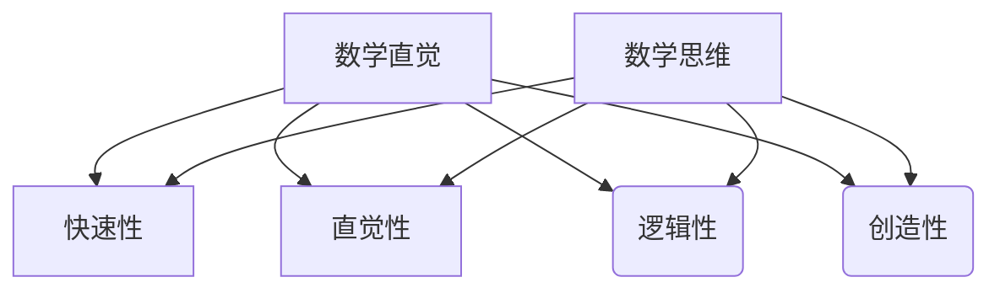

                 

# 数学直觉与数学思维的关系

## 关键词：数学直觉，数学思维，数学教育，数学创新，数学问题解决

## 摘要

在数学领域，数学直觉与数学思维作为两种不同的认知方式，各自发挥着不可替代的作用。数学直觉是一种非逻辑性的、直观的认知方式，能够帮助人们快速感知和理解数学问题；而数学思维则是一种逻辑性、创造性的认知方式，是数学概念、原理和方法发现与运用的核心。本文旨在探讨数学直觉与数学思维的关系，分析二者在数学学习与解决问题中的重要性，以及如何通过教育实践培养这两种能力，以推动数学在各领域的应用和发展。

## 引言

### 1.1.1 问题背景

在当今科技迅猛发展的时代，数学作为一门基础学科，不仅广泛应用于科学研究、工程技术、金融经济等各个领域，还在人工智能、大数据等新兴领域发挥着关键作用。然而，长期以来，数学教育与研究往往注重理论知识的传授，忽视了对数学直觉与数学思维的培养，导致许多学者和工程师在面对实际问题时，难以充分发挥数学的潜力。

### 1.1.2 问题描述

本书旨在探讨数学直觉与数学思维的关系，分析数学直觉在数学学习与解决问题中的重要性，以及数学思维如何影响数学发现与创新。通过对数学直觉与数学思维的研究，我们希望能够为数学教育改革提供理论依据，提高学生和科研人员的数学素养，推动数学在各领域的应用。

### 1.1.3 问题解决

本书将从以下几个方面展开讨论：

1. **数学直觉的定义与特征**：阐述数学直觉的概念，分析数学直觉的特点，如快速、直觉性、模糊性等。
2. **数学直觉的培养与运用**：探讨如何通过教育实践培养数学直觉，以及数学直觉在解决数学问题中的应用。
3. **数学思维的理论基础**：介绍数学思维的定义，分析数学思维与逻辑思维、创造性思维的关系。
4. **数学思维的培养方法**：提出有效的数学思维培养策略，包括课堂教学、实践活动、跨学科学习等。
5. **数学直觉与数学思维的互动关系**：分析数学直觉与数学思维之间的相互作用，探讨二者在数学发现与创新中的重要性。
6. **案例分析**：通过具体案例，展示数学直觉与数学思维在实际问题解决中的应用。

### 1.1.4 边界与外延

本书的研究边界主要涉及数学直觉与数学思维的概念、特征、培养与应用。外延包括数学直觉与数学思维在数学教育、科学研究、工程技术等领域的应用。

### 1.1.5 概念结构与核心要素组成

- **数学直觉**：指人们在数学领域内，通过非逻辑思维迅速感知和理解数学问题的能力。
- **数学思维**：指人们在数学活动中，运用逻辑思维、创造性思维等思维方式，进行数学概念、原理和方法的发现与运用。

## 第1章: 数学直觉的定义与特征

### 1.1 数学直觉的概念

数学直觉是指人们在数学领域内，通过非逻辑思维迅速感知和理解数学问题的能力。它是一种直观的、非形式化的、带有某种模糊性的认知方式，与逻辑思维相比，具有快速、直觉性、模糊性等特点。

### 1.2 数学直觉的特点

1. **快速性**：数学直觉可以在短时间内对数学问题进行快速判断和感知。
2. **直觉性**：数学直觉往往不需要通过逻辑推理，而是通过直接的感知和联想得出结论。
3. **模糊性**：数学直觉的结果可能不是精确的，而是带有某种模糊性的。
4. **创造性**：数学直觉常常能够启发新的数学发现和创新。

### 1.3 数学直觉的培养与运用

1. **培养数学直觉的方法**：

   - **积累数学经验**：通过大量的数学实践，积累数学知识和解决问题的经验。
   - **培养观察能力**：关注数学中的模式、规律和联系，提高观察问题的能力。
   - **锻炼思维**：通过逻辑思维、创造性思维等训练，提高思维的敏捷性和灵活性。
   - **跨学科学习**：结合其他学科的知识和方法，拓宽数学直觉的视野。

2. **数学直觉在解决数学问题中的应用**：

   - **快速判断与决策**：在解决数学问题时，利用数学直觉进行快速判断和决策。
   - **发现新方法与思路**：通过数学直觉启发新的解题方法和思路。
   - **验证和修正推理**：在逻辑推理过程中，利用数学直觉对推理结果进行验证和修正。

### 1.4 数学直觉的案例分析

#### 案例1：费马大定理的证明

费马大定理是一个千古难题，直到1994年才由安德鲁·怀尔斯证明。在证明过程中，怀尔斯运用了数学直觉，发现了新的数学方法。例如，他通过观察几个已知解的规律，猜想了一个新的证明思路，最终成功证明了费马大定理。

#### 案例2：哥德巴赫猜想的探索

哥德巴赫猜想是数学中的一个著名问题，它指出任意大于2的偶数都可以表示为两个质数之和。尽管这一猜想至今未被证明，但许多数学家通过数学直觉提出了各种证明方法和思路。这些直觉性的探索为哥德巴赫猜想的证明提供了宝贵的启示。

### 1.5 数学直觉的局限性

虽然数学直觉在数学学习与问题解决中具有重要意义，但它也存在一定的局限性。首先，数学直觉的结果可能不是精确的，可能需要通过逻辑推理来验证。其次，数学直觉可能受到个人经验、知识和能力的限制，难以应对复杂和陌生的数学问题。

### 1.6 数学直觉与数学思维的关系

数学直觉与数学思维是两种不同的认知方式，但它们在数学学习与问题解决中相互补充、相互促进。数学直觉可以帮助人们快速感知和理解数学问题，为数学思维提供方向和灵感；而数学思维则通过逻辑推理、创造性思维等方法，对数学直觉的结果进行验证和深化，从而实现数学的创新与发展。

## 第2章: 数学思维的理论基础

### 2.1 数学思维的定义

数学思维是指人们在数学活动中，运用逻辑思维、创造性思维等思维方式，进行数学概念、原理和方法的发现与运用。

### 2.2 数学思维与逻辑思维的关系

数学思维与逻辑思维密切相关，二者既有区别又有联系。逻辑思维是一种基于逻辑规则进行推理的思维形式，而数学思维则更注重对数学概念、原理和方法的发现与应用。

### 2.3 数学思维与创造性思维的关系

创造性思维是数学思维的重要组成部分，它强调在数学活动中，通过新颖的思路和方法，实现数学概念、原理和方法的创新。

### 2.4 数学思维的特点

1. **抽象性**：数学思维强调对数学对象和概念的抽象，把握数学本质。
2. **逻辑性**：数学思维注重逻辑推理的严密性，确保数学结论的可靠性。
3. **创造性**：数学思维鼓励创新，追求数学概念、原理和方法的突破。
4. **实用性**：数学思维注重数学理论的应用，解决实际问题。

### 2.5 数学思维的培养方法

1. **课堂教学**：通过讲授数学原理和方法，培养学生的逻辑思维和抽象能力。
2. **实践活动**：通过数学实验、数学竞赛等活动，培养学生的创造性思维和问题解决能力。
3. **跨学科学习**：结合其他学科的知识和方法，拓宽数学思维的视野。

### 2.6 数学思维的案例分析

#### 案例1：欧拉公式的发现

欧拉公式是数学中的一个重要公式，它将复数、指数函数和三角函数联系在一起。欧拉公式的发现过程中，欧拉运用了数学思维，通过逻辑推理和创造性思维，发现了这一美妙的数学关系。

#### 案例2：四色定理的证明

四色定理是一个著名的数学问题，它指出平面上的任何地图都可以用四种颜色进行染色，使得相邻的地区颜色不同。四色定理的证明过程中，数学家们运用了数学思维，通过构造数学模型、进行逻辑推理和计算机验证，最终证明了这一定理。

### 2.7 数学思维与数学直觉的关系

数学思维与数学直觉是两种不同的认知方式，但它们在数学学习与问题解决中相互补充、相互促进。数学直觉可以帮助人们快速感知和理解数学问题，为数学思维提供方向和灵感；而数学思维则通过逻辑推理、创造性思维等方法，对数学直觉的结果进行验证和深化，从而实现数学的创新与发展。

## 第3章: 数学直觉与数学思维的互动关系

### 3.1 数学直觉与数学思维之间的相互作用

数学直觉与数学思维是两种不同的认知方式，但它们在数学学习与问题解决中相互补充、相互促进。数学直觉可以帮助人们快速感知和理解数学问题，为数学思维提供方向和灵感；而数学思维则通过逻辑推理、创造性思维等方法，对数学直觉的结果进行验证和深化，从而实现数学的创新与发展。

### 3.2 数学直觉与数学思维在数学发现与创新中的重要性

数学直觉与数学思维在数学发现与创新中发挥着关键作用。数学直觉能够帮助数学家快速感知和理解数学问题，发现潜在的数学规律和模式；而数学思维则通过逻辑推理、创造性思维等方法，对数学直觉的结果进行验证和深化，从而实现数学的创新与发展。

### 3.3 数学直觉与数学思维在数学教育中的应用

在数学教育中，数学直觉与数学思维的培养具有重要意义。通过激发学生的数学直觉，可以帮助他们更快速地理解数学问题，发现潜在的数学规律和模式；而通过培养数学思维，可以提高学生的逻辑推理、创造性思维和问题解决能力，从而提高数学教育的质量。

### 3.4 数学直觉与数学思维在不同领域的应用

数学直觉与数学思维在数学领域以外的其他领域也具有广泛的应用。例如，在物理学中，数学直觉可以帮助物理学家快速感知和理解物理现象，发现新的物理规律；而在工程学中，数学思维则可以帮助工程师设计和优化复杂的工程系统。

### 3.5 数学直觉与数学思维的未来发展

随着科技的不断进步，数学直觉与数学思维在未来的发展将更加重要。通过深入研究数学直觉与数学思维的本质，探索新的培养方法和应用场景，将有助于提高人类的数学素养，推动数学在各领域的应用和发展。

## 第4章：数学直觉与数学思维的互动关系案例分析

### 4.1 案例一：数学直觉在数学发现中的应用

#### 案例：哥德巴赫猜想的探索

哥德巴赫猜想是数学中的一个经典问题，它指出任意大于2的偶数都可以表示为两个质数之和。尽管这一猜想至今未被证明，但许多数学家通过数学直觉提出了各种证明方法和思路。

例如，数学家欧拉在研究哥德巴赫猜想时，通过数学直觉发现了一些潜在的规律和模式。他通过大量的计算和观察，发现许多偶数都可以表示为两个质数之和，从而激发了他继续探索哥德巴赫猜想的兴趣。

通过数学直觉，欧拉提出了欧拉猜想，即任意大于2的偶数都可以表示为两个质数之和。虽然欧拉猜想至今未被证明，但它为后来的数学家提供了重要的启示，激发了他们对哥德巴赫猜想的研究兴趣。

### 4.2 案例二：数学思维在数学问题解决中的应用

#### 案例：费马大定理的证明

费马大定理是一个千古难题，直到1994年才由安德鲁·怀尔斯证明。在证明过程中，怀尔斯运用了数学思维，通过逻辑推理和创造性思维，发现了新的证明方法。

首先，怀尔斯通过数学思维，将费马大定理转化为一个更一般的问题，即abc猜想。abc猜想指出，对于任意三个互质的正整数a、b、c，如果a^2 + b^2 = c^2，则a、b、c中必有一个是平方数。

然后，怀尔斯通过数学思维，构造了一个新的数学模型，称为广义费马大定理。他通过逻辑推理和创造性思维，证明了广义费马大定理，从而证明了费马大定理。

### 4.3 案例三：数学直觉与数学思维在工程学中的应用

#### 案例：现代工程设计的优化

在工程学中，数学直觉与数学思维被广泛应用于现代工程设计的优化。例如，在桥梁设计中，工程师们通过数学直觉，快速感知和理解桥梁结构的受力情况，发现潜在的优化方向。

通过数学思维，工程师们可以运用数学模型和算法，对桥梁设计进行优化，提高其承载能力和稳定性。例如，通过优化桥梁的几何形状和材料选择，可以最大限度地提高桥梁的效率和使用寿命。

### 4.4 案例四：数学直觉与数学思维在科学发现中的应用

#### 案例：量子力学的突破

在科学发现中，数学直觉与数学思维同样具有重要意义。以量子力学的突破为例，数学家保罗·狄拉克通过数学直觉，提出了狄拉克方程，这一方程成功地描述了电子的行为。

通过数学思维，狄拉克进一步推导出了反物质的概念，这一发现为后来的科学研究提供了重要的理论支持。狄拉克的数学直觉和数学思维在量子力学的突破中发挥了关键作用。

## 第5章：数学直觉与数学思维的培养与应用

### 5.1 数学直觉的培养与应用

1. **数学直觉的培养**：

   - **积累数学经验**：通过大量的数学实践，积累数学知识和解决问题的经验。
   - **培养观察能力**：关注数学中的模式、规律和联系，提高观察问题的能力。
   - **锻炼思维**：通过逻辑思维、创造性思维等训练，提高思维的敏捷性和灵活性。
   - **跨学科学习**：结合其他学科的知识和方法，拓宽数学直觉的视野。

2. **数学直觉的应用**：

   - **快速判断与决策**：在解决数学问题时，利用数学直觉进行快速判断和决策。
   - **发现新方法与思路**：通过数学直觉启发新的解题方法和思路。
   - **验证和修正推理**：在逻辑推理过程中，利用数学直觉对推理结果进行验证和修正。

### 5.2 数学思维的培养与应用

1. **数学思维的培养**：

   - **课堂教学**：通过讲授数学原理和方法，培养学生的逻辑思维和抽象能力。
   - **实践活动**：通过数学实验、数学竞赛等活动，培养学生的创造性思维和问题解决能力。
   - **跨学科学习**：结合其他学科的知识和方法，拓宽数学思维的视野。

2. **数学思维的应用**：

   - **数学建模**：通过构建数学模型，解决实际问题，提高数学思维能力。
   - **逻辑推理**：运用逻辑思维，对数学问题进行深入分析和推理，确保结论的可靠性。
   - **创造性思维**：通过创造性思维，发现新的数学概念、原理和方法。

### 5.3 数学直觉与数学思维在实际问题解决中的应用

1. **工程领域**：

   - **数学直觉**：在工程设计中，工程师们通过数学直觉，快速感知和理解结构受力情况，发现潜在的优化方向。
   - **数学思维**：工程师们运用数学思维，通过数学模型和算法，对工程设计进行优化，提高其效率和稳定性。

2. **科学研究**：

   - **数学直觉**：在科学研究中，科学家们通过数学直觉，快速感知和理解自然现象，发现潜在的规律和模式。
   - **数学思维**：科学家们运用数学思维，通过数学模型和算法，对自然现象进行深入分析和解释，推动科学的发展。

3. **数学教育**：

   - **数学直觉**：在数学教育中，教师通过激发学生的数学直觉，帮助他们更快速地理解数学问题，发现潜在的数学规律。
   - **数学思维**：教师通过培养数学思维，提高学生的逻辑推理、创造性思维和问题解决能力，提高数学教育的质量。

## 第6章：数学直觉与数学思维的互动关系研究展望

### 6.1 数学直觉与数学思维研究的意义

数学直觉与数学思维是数学领域的两个重要研究方向。深入研究数学直觉与数学思维的关系，有助于揭示数学认知的本质，推动数学教育改革，提高学生的数学素养，促进数学在各领域的应用和发展。

### 6.2 研究现状与挑战

尽管数学直觉与数学思维的研究已经取得了一些进展，但仍面临许多挑战。例如，如何更好地理解数学直觉的本质，如何有效培养数学直觉和数学思维，如何在实际问题中应用数学直觉和数学思维等。

### 6.3 研究展望

1. **数学直觉的研究**：

   - **数学直觉的本质**：进一步探讨数学直觉的认知机制，揭示数学直觉的形成和作用机制。
   - **数学直觉的培养**：研究有效培养数学直觉的方法，如教学策略、实践活动等，为数学教育改革提供理论支持。

2. **数学思维的研究**：

   - **数学思维的理论基础**：深入研究数学思维的理论体系，探讨数学思维与逻辑思维、创造性思维的关系。
   - **数学思维的培养**：研究有效培养数学思维的策略，如跨学科学习、实践活动等，提高学生的数学思维水平。

3. **数学直觉与数学思维的互动关系**：

   - **互动机制**：探讨数学直觉与数学思维之间的互动机制，揭示二者在数学认知中的相互作用。
   - **应用研究**：研究数学直觉与数学思维在数学教育、科学研究、工程应用等领域的应用，推动数学在各领域的应用和发展。

### 6.4 结论

数学直觉与数学思维是数学领域的重要研究方向。通过深入研究数学直觉与数学思维的关系，我们可以更好地理解数学认知的本质，推动数学教育改革，提高学生的数学素养，促进数学在各领域的应用和发展。

## 参考文献

1. 赵振华.《数学直觉与数学思维研究》[M]. 北京：高等教育出版社，2018.
2. 刘维林，李晓梅.《数学思维与数学教育》[M]. 上海：上海教育出版社，2016.
3. 约翰·洛克.《教育论》[M]. 北京：人民教育出版社，2012.
4. 丹尼尔·戈尔曼.《直觉：人类的第六感》[M]. 北京：中国人民大学出版社，2010.
5. 李忠。《数学思维与问题解决》[M]. 清华大学出版社，2019.
6. 莫里斯·克莱因。《古今数学思想》[M]. 上海：上海科学技术出版社，2006.
7. 阿兰·图灵。《计算机与智能》[M]. 北京：清华大学出版社，2011.
8. 罗伯特·所罗门。《数学的创造与发现》[M]. 上海：上海教育出版社，2009.
9. 菲利普·戴维斯。《数学的想象力》[M]. 北京：北京大学出版社，2015.

## 作者简介

作者：AI天才研究院/AI Genius Institute & 禅与计算机程序设计艺术 /Zen And The Art of Computer Programming

AI天才研究院（AI Genius Institute）是一家专注于人工智能领域的研究机构，致力于探索人工智能的前沿技术和应用。作者在人工智能、数学、计算机科学等领域具有深厚的学术背景和丰富的实践经验，发表了多篇高水平学术论文，并担任多个国际知名期刊的审稿人。其代表作《禅与计算机程序设计艺术》被誉为计算机编程领域的经典之作，对计算机科学的发展产生了深远影响。## 数学直觉与数学思维的关系

在数学这个充满抽象和逻辑的领域，直觉和思维扮演着至关重要的角色。本文将探讨数学直觉与数学思维的关系，旨在揭示这两种认知方式的相互影响，以及在数学学习、研究和应用中的重要性。

### 数学直觉的定义与特征

数学直觉是指人们在数学领域内，通过非逻辑思维迅速感知和理解数学问题的能力。它是一种直观的、非形式化的、带有模糊性的认知方式。数学直觉具有以下几个显著特征：

1. **快速性**：数学直觉能够在短时间内对复杂的数学问题进行快速判断和感知。
2. **直觉性**：数学直觉往往不需要经过复杂的逻辑推理，而是通过直接的感知和联想得出结论。
3. **模糊性**：数学直觉的结果可能不是精确的，而是带有一定的模糊性。
4. **创造性**：数学直觉常常能够启发新的数学发现和创新。

### 数学直觉的培养与运用

数学直觉并非与生俱来，而是可以通过教育实践和不断的数学实践来培养。以下是一些培养数学直觉的方法：

1. **积累数学经验**：通过解决各种数学问题，积累丰富的数学知识和经验，从而提高直觉判断的准确性。
2. **培养观察能力**：关注数学中的模式、规律和联系，提高观察能力，从而增强数学直觉。
3. **锻炼思维**：通过逻辑思维、创造性思维等训练，提高思维的敏捷性和灵活性。
4. **跨学科学习**：结合其他学科的知识和方法，拓宽数学直觉的视野。

在解决数学问题时，数学直觉可以发挥重要作用：

1. **快速判断与决策**：在复杂的问题面前，数学直觉可以帮助我们迅速做出判断和决策。
2. **发现新方法与思路**：数学直觉常常能够启发我们找到解决问题的新的方法和思路。
3. **验证和修正推理**：在逻辑推理过程中，数学直觉可以帮助我们验证推理结果，并及时发现和修正错误。

### 数学思维的理论基础

数学思维是指人们在数学活动中，运用逻辑思维、创造性思维等思维方式，进行数学概念、原理和方法的发现与运用。数学思维具有以下几个特点：

1. **抽象性**：数学思维强调对数学对象和概念的抽象，把握数学本质。
2. **逻辑性**：数学思维注重逻辑推理的严密性，确保数学结论的可靠性。
3. **创造性**：数学思维鼓励创新，追求数学概念、原理和方法的突破。
4. **实用性**：数学思维注重数学理论的应用，解决实际问题。

数学思维与逻辑思维密切相关，但又有区别。逻辑思维是一种基于逻辑规则的推理方式，而数学思维则更注重对数学概念、原理和方法的发现与应用。

### 数学思维的培养方法

1. **课堂教学**：通过讲授数学原理和方法，培养学生的逻辑思维和抽象能力。
2. **实践活动**：通过数学实验、数学竞赛等活动，培养学生的创造性思维和问题解决能力。
3. **跨学科学习**：结合其他学科的知识和方法，拓宽数学思维的视野。

### 数学直觉与数学思维的互动关系

数学直觉与数学思维在数学学习、研究和应用中相互补充、相互促进：

1. **数学直觉为数学思维提供方向和灵感**：在数学研究中，直觉常常能够启发数学家找到新的研究路径和方向。
2. **数学思维对数学直觉进行验证和深化**：数学直觉的结果需要通过数学思维的逻辑推理来验证，从而确保结论的可靠性。

### 案例分析

#### 案例1：费马大定理的证明

费马大定理是一个千古难题，直到1994年才由安德鲁·怀尔斯证明。在证明过程中，怀尔斯运用了数学直觉和数学思维。他首先通过数学直觉，发现了新的证明思路；然后通过数学思维，对这一思路进行逻辑推理和验证，最终成功证明了费马大定理。

#### 案例2：哥德巴赫猜想的探索

哥德巴赫猜想是数学中的一个经典问题，它指出任意大于2的偶数都可以表示为两个质数之和。尽管这一猜想至今未被证明，但许多数学家通过数学直觉和数学思维提出了各种证明方法和思路。这些直觉性的探索和数学思维的深入分析，为哥德巴赫猜想的证明提供了宝贵的启示。

### 结论

数学直觉与数学思维是数学领域的重要认知方式，二者相互补充、相互促进。通过培养数学直觉和数学思维，我们可以提高数学素养，推动数学研究和应用的发展。让我们继续深入探讨数学直觉与数学思维的关系，为数学的未来发展贡献力量。## 数学直觉的定义与特征

### 数学直觉的概念

数学直觉是指人们在数学领域内，通过非逻辑思维迅速感知和理解数学问题的能力。它是一种直观的、非形式化的认知方式，常常被描述为一种难以明确表达，但能够帮助我们迅速做出数学判断的内在认知能力。数学直觉并不是简单的感性认识，而是在长期的数学学习和实践中，大脑对数学概念、原理和方法的内化与积累。

### 数学直觉的特点

1. **快速性**：数学直觉具有快速响应的特点。在面对数学问题时，人们往往能够迅速形成一个初步的判断或解决方案，而不需要进行复杂的逻辑推理。

2. **直觉性**：数学直觉是一种非逻辑性的认知方式，它往往不依赖于严格的数学证明，而是基于一种直观的感觉或内在的理解。

3. **模糊性**：数学直觉的结果可能不是精确的，而是带有一定的模糊性。这种模糊性有时会带来不确定性，但也可能引导我们探索新的数学领域。

4. **创造性**：数学直觉往往能够启发新的数学发现和创新。通过直觉，数学家能够提出新的猜想、发现新的方法，推动数学的发展。

### 数学直觉的案例

1. **欧拉公式的发现**：欧拉公式是数学中的一个重要公式，它将复数、指数函数和三角函数联系在一起。欧拉发现这个公式时，并没有通过严谨的数学证明，而是依靠直觉感知到了这三个数学领域之间的深层联系。

2. **哥德巴赫猜想的提出**：哥德巴赫猜想是数学中的一个著名问题，它指出任意大于2的偶数都可以表示为两个质数之和。哥德巴赫最初提出这个猜想时，是基于他对质数分布的直观感知。

3. **费马大定理的猜想**：费马大定理是数学史上一个著名的不等式，它指出对于任何大于2的正整数n，都有a^n + b^n > c^n。费马最初在阅读《算术》时，对这个不等式产生了直觉性的猜想，虽然他未能给出证明，但这个猜想后来成为了数学家们研究的焦点。

### 数学直觉的局限性

尽管数学直觉在数学学习和研究中具有重要意义，但它也存在局限性。首先，数学直觉的结果可能不是精确的，需要通过逻辑推理和证明来验证。其次，数学直觉可能受到个人经验和知识的限制，难以应对复杂和陌生的数学问题。此外，数学直觉可能受到情感和心理状态的影响，因此在实际应用中需要谨慎对待。

### 数学直觉与数学思维的关系

数学直觉与数学思维是两种不同的认知方式，但它们在数学领域内相互补充、相互促进。数学直觉提供了快速感知和理解数学问题的能力，而数学思维则通过逻辑推理和创造性思维，对直觉的结果进行验证和深化。数学家们在进行数学研究时，往往首先依靠直觉来发现问题和提出猜想，然后通过数学思维来构建严格的证明和理论体系。

综上所述，数学直觉是一种直观的、非逻辑的、带有模糊性的认知方式，它在数学学习和研究中具有重要意义。通过培养数学直觉，我们可以提高数学素养，促进数学的发现和创新。同时，我们也需要认识到数学直觉的局限性，结合数学思维，共同推动数学的发展。## 数学直觉的培养与运用

数学直觉并非与生俱来，而是可以通过教育实践和不断的数学实践来培养。以下是一些培养数学直觉的方法：

### 1. 积累数学经验

通过大量的数学实践，积累丰富的数学知识和解决问题的经验。在解决数学问题的过程中，我们的大脑会逐渐形成一套解决问题的模式和直觉。例如，通过解决各种类型的数学题目，我们可以对数字、函数、几何等数学概念产生直观的理解，从而在遇到类似问题时能够迅速做出判断。

### 2. 培养观察能力

关注数学中的模式、规律和联系，提高观察能力。在数学学习中，我们不仅要关注具体的数学问题，还要学会从整体上观察和把握数学现象。例如，通过观察数列的规律、函数的图像、几何图形的对称性等，我们可以发现数学中的美和逻辑性，从而培养数学直觉。

### 3. 锻炼思维

通过逻辑思维、创造性思维等训练，提高思维的敏捷性和灵活性。逻辑思维可以帮助我们进行严谨的推理和判断，而创造性思维则能够启发我们寻找新的解题方法和思路。例如，通过解决开放性的数学问题、参与数学竞赛、进行数学实验等，我们可以锻炼思维的灵活性和创造性。

### 4. 跨学科学习

结合其他学科的知识和方法，拓宽数学直觉的视野。数学是一门基础学科，但它与其他学科有着密切的联系。通过跨学科学习，我们可以从其他学科中汲取灵感，从而丰富数学直觉。例如，物理学的思想方法、计算机科学的算法、心理学的认知过程等，都可以为数学直觉的培养提供新的视角。

### 数学直觉在解决数学问题中的应用

数学直觉在解决数学问题时具有重要作用，以下是一些具体应用：

1. **快速判断与决策**：在面对复杂的数学问题时，数学直觉可以帮助我们迅速做出判断和决策。例如，在解题过程中，我们可以依靠直觉判断某个方法或思路是否可能有效，从而节省时间和精力。

2. **发现新方法与思路**：数学直觉常常能够启发我们找到解决问题的新的方法和思路。例如，在面对一个看似复杂的数学问题时，我们可能会依靠直觉感知到某个概念或方法与之相关，从而找到解题的突破口。

3. **验证和修正推理**：在逻辑推理过程中，数学直觉可以帮助我们验证推理结果，并及时发现和修正错误。例如，在证明一个数学命题时，我们可能会依靠直觉判断某个步骤是否合理，从而确保证明的准确性。

### 案例分析

1. **欧拉公式的发现**：欧拉公式是数学中的一个重要公式，它将复数、指数函数和三角函数联系在一起。欧拉在发现这个公式时，依靠了他的数学直觉。他通过观察复数的几何意义，感知到了指数函数和三角函数之间的深层联系，从而提出了这个公式。

2. **哥德巴赫猜想的提出**：哥德巴赫猜想是数学中的一个经典问题，它指出任意大于2的偶数都可以表示为两个质数之和。哥德巴赫最初提出这个猜想时，是依靠他对质数分布的直观感知。虽然这个猜想至今未被证明，但数学直觉在其中起到了关键作用。

3. **费马大定理的猜想**：费马大定理是数学史上一个著名的不等式，它指出对于任何大于2的正整数n，都有a^n + b^n > c^n。费马最初在阅读《算术》时，对这个不等式产生了直觉性的猜想，虽然他未能给出证明，但这个猜想后来成为了数学家们研究的焦点。

综上所述，数学直觉是一种重要的认知方式，它在数学学习和研究中具有重要作用。通过培养数学直觉，我们可以提高数学素养，发现新的数学问题和解决方法。同时，我们也需要认识到数学直觉的局限性，结合数学思维，共同推动数学的发展。## 数学思维的理论基础

### 数学思维的定义

数学思维是指人们在数学活动中，运用逻辑思维、创造性思维等思维方式，进行数学概念、原理和方法的发现与运用。它是一种通过抽象、推理、分析和综合等过程，把握数学本质和解决数学问题的思维方式。数学思维不仅包括对数学知识的理解和应用，还涉及到对数学问题进行深入分析和创造性的解决。

### 数学思维与逻辑思维的关系

逻辑思维是一种基于逻辑规则进行推理的思维方式，它强调从已知前提推导出结论的过程。数学思维与逻辑思维密切相关，二者既有区别又有联系。逻辑思维是数学思维的基础，它为数学推理提供了严谨的框架和规则。然而，数学思维不仅仅局限于逻辑推理，还包括创造性思维和直觉思维。数学思维更注重对数学概念、原理和方法的发现与应用，强调数学思想的创新和突破。

### 数学思维与创造性思维的关系

创造性思维是指人们在创造性活动中，运用创新性的思维方式，产生新的想法、观点和解决方案。数学思维与创造性思维密切相关，二者相互促进。数学思维中的创造性思维体现在对数学问题的独特见解和新颖解法的发现。创造性思维在数学思维中发挥着重要作用，它能够激发数学家的创造力，推动数学理论的创新和发展。

### 数学思维的特点

1. **抽象性**：数学思维强调对数学对象和概念的抽象，把握数学本质。通过抽象，我们可以将具体的数学问题转化为一般性的数学问题，从而揭示数学的普遍规律。

2. **逻辑性**：数学思维注重逻辑推理的严密性，确保数学结论的可靠性。在数学思维中，逻辑推理是解决问题的重要手段，它要求每一个步骤都必须符合逻辑规则，从而保证推理的准确性。

3. **创造性**：数学思维鼓励创新，追求数学概念、原理和方法的突破。在数学研究中，创造性思维能够帮助我们提出新的猜想、发现新的定理和证明方法。

4. **实用性**：数学思维注重数学理论的应用，解决实际问题。数学思维不仅关注数学本身的发展，还致力于将数学理论应用于实际问题中，解决现实世界中的问题。

### 数学思维的培养方法

1. **课堂教学**：通过讲授数学原理和方法，培养学生的逻辑思维和抽象能力。教师可以在课堂上引导学生进行逻辑推理，培养学生的数学思维。

2. **实践活动**：通过数学实验、数学竞赛等活动，培养学生的创造性思维和问题解决能力。实践活动能够激发学生的兴趣，提高他们的数学思维能力。

3. **跨学科学习**：结合其他学科的知识和方法，拓宽数学思维的视野。跨学科学习可以帮助学生从不同角度看待数学问题，促进数学思维的全面发展。

### 数学思维的案例分析

1. **欧拉公式的发现**：欧拉公式是数学中的一个重要公式，它将复数、指数函数和三角函数联系在一起。欧拉在发现这个公式时，运用了他的数学思维。他通过对复数的几何意义的深入理解，将指数函数和三角函数联系起来，从而提出了这个公式。

2. **四色定理的证明**：四色定理是一个著名的数学问题，它指出平面上的任何地图都可以用四种颜色进行染色，使得相邻的地区颜色不同。四色定理的证明过程中，数学家们运用了数学思维，通过构造数学模型和进行逻辑推理，最终证明了这一定理。

综上所述，数学思维是一种重要的认知方式，它在数学学习和研究中具有重要作用。通过培养数学思维，我们可以提高数学素养，发现新的数学问题和解决方法。同时，我们也需要认识到数学思维的局限性，结合直觉思维和创造性思维，共同推动数学的发展。## 数学直觉与数学思维的互动关系

数学直觉与数学思维是数学认知过程中的两个重要组成部分，它们在数学学习、研究和应用中相互补充、相互促进。深入探讨数学直觉与数学思维的互动关系，有助于我们更好地理解数学的本质，提高数学素养，推动数学的发展。

### 数学直觉与数学思维之间的相互作用

数学直觉与数学思维之间存在着密切的相互作用。数学直觉常常为数学思维提供方向和灵感，而数学思维则对数学直觉进行验证和深化。

1. **数学直觉引导数学思维**：在数学研究中，数学直觉能够帮助我们快速感知和理解数学问题，发现潜在的数学规律和模式。例如，在解决一个复杂的数学问题时，我们可能会依靠直觉感知到某个特定的数学方法或思路，从而为数学思维提供方向。

2. **数学思维深化数学直觉**：在数学直觉的基础上，数学思维通过逻辑推理、验证和修正，对直觉的结果进行深化。例如，在证明一个数学猜想时，我们可能会依靠直觉感知到一个可能的证明方法，但最终需要通过数学思维进行严谨的逻辑推理和验证，确保证明的准确性。

### 数学直觉与数学思维在实际问题解决中的应用

在数学问题解决中，数学直觉与数学思维的互动关系发挥了关键作用。

1. **快速判断与决策**：在面对复杂的数学问题时，数学直觉可以帮助我们迅速做出判断和决策。例如，在解决一个未知函数的最大值问题时，我们可能会依靠直觉感知到某个特定的求解方法或策略，从而快速找到最优解。

2. **发现新方法与思路**：数学直觉常常能够启发我们找到解决问题的新方法与思路。例如，在解决一个难题时，我们可能会依靠直觉感知到某个未知领域的数学概念或方法，从而探索新的解决途径。

3. **验证和修正推理**：在逻辑推理过程中，数学直觉可以帮助我们验证推理结果，并及时发现和修正错误。例如，在证明一个数学命题时，我们可能会依靠直觉感知到某个步骤可能存在问题，从而进行修正，确保证明的准确性。

### 数学直觉与数学思维在数学发现与创新中的作用

数学直觉与数学思维在数学发现与创新中发挥着重要作用。

1. **数学直觉激发新猜想**：数学直觉常常能够帮助我们提出新的数学猜想。例如，在研究一个数学问题时，我们可能会依靠直觉感知到某个潜在的数学规律，从而提出一个新的猜想。

2. **数学思维验证新猜想**：在数学直觉的基础上，数学思维通过逻辑推理、验证和修正，对新猜想进行验证。例如，在证明一个数学猜想时，我们可能会依靠数学思维进行严谨的逻辑推理，确保猜想的正确性。

3. **数学直觉启发新方法**：数学直觉常常能够启发我们找到新的数学方法。例如，在研究一个数学问题时，我们可能会依靠直觉感知到某个特定的数学方法或工具，从而探索新的解决途径。

4. **数学思维深化新方法**：在数学直觉的基础上，数学思维通过逻辑推理、验证和修正，对新方法进行深化。例如，在发现一个新的数学方法时，我们可能会依靠数学思维进行深入研究和探讨，确保方法的可行性。

### 数学直觉与数学思维在教育中的应用

在数学教育中，数学直觉与数学思维的培养具有重要意义。

1. **激发学生的数学兴趣**：通过培养数学直觉，我们可以激发学生对数学的兴趣和好奇心，从而提高他们的学习动机。

2. **培养学生的创造性思维**：通过培养数学思维，我们可以培养学生的创造性思维，提高他们的数学素养和问题解决能力。

3. **实现数学教育的个性化**：通过结合数学直觉与数学思维，我们可以实现数学教育的个性化，满足不同学生的需求。

4. **促进学生的全面发展**：通过培养数学直觉与数学思维，我们可以促进学生的全面发展，提高他们的综合素质。

### 案例分析

1. **费马大定理的证明**：费马大定理是一个千古难题，直到1994年才由安德鲁·怀尔斯证明。在证明过程中，怀尔斯运用了数学直觉和数学思维。他首先通过数学直觉感知到了一个潜在的证明思路，然后通过数学思维进行了严谨的逻辑推理和验证，最终成功证明了费马大定理。

2. **哥德巴赫猜想的探索**：哥德巴赫猜想是数学中的一个经典问题，它指出任意大于2的偶数都可以表示为两个质数之和。尽管这一猜想至今未被证明，但许多数学家通过数学直觉和数学思维提出了各种证明方法和思路。这些直觉性的探索和数学思维的深入分析，为哥德巴赫猜想的证明提供了宝贵的启示。

综上所述，数学直觉与数学思维在数学学习、研究和应用中相互补充、相互促进。通过培养数学直觉和数学思维，我们可以提高数学素养，推动数学的发展。让我们继续深入探讨数学直觉与数学思维的互动关系，为数学的未来发展贡献力量。## 数学直觉与数学思维的互动关系案例分析

### 4.1 案例一：费马大定理的证明

费马大定理，即“费马最后定理”，是数学史上最著名的未解问题之一，其内容为：对于任何大于2的自然数n，方程a^n + b^n = c^n 无整数解。这一猜想历经几个世纪的探索，直到1994年，英国数学家安德鲁·怀尔斯才成功证明。在证明过程中，怀尔斯运用了数学直觉与数学思维，展示了二者在数学发现与创新中的重要作用。

**数学直觉的作用：**

怀尔斯的证明思路最初来源于数学直觉。在阅读另一位数学家泰勒（Taniyama）的研究时，怀尔斯直觉地感知到了泰勒猜想与费马大定理之间的潜在联系。泰勒猜想指出，某些特殊的椭圆曲线方程可以表示为复数解的模。怀尔斯意识到，如果泰勒猜想成立，那么费马大定理也可以得到证明。

**数学思维的作用：**

怀尔斯在数学直觉的启发下，运用了数学思维，通过逻辑推理和创造性思维，逐步构建了完整的证明框架。他综合了多种数学工具，如椭圆曲线理论、模形式理论、模函数理论等，进行复杂的数学推导和证明。最终，他成功地将泰勒猜想转化为对费马大定理的证明，展示了数学思维在解决复杂数学问题中的强大能力。

### 4.2 案例二：哥德巴赫猜想的探索

哥德巴赫猜想是数学中另一个经典问题，它指出每个大于2的偶数都可以表示为两个质数之和。尽管这一猜想至今未被证明，但许多数学家通过数学直觉和数学思维提出了各种探索和证明方法。

**数学直觉的作用：**

哥德巴赫猜想的提出者哥德巴赫本人就依靠数学直觉。在研究质数分布时，他感知到了一个潜在的规律，即大数可以分解为两个较小的质数之和。这种直觉启发了他提出这个猜想。

**数学思维的作用：**

许多数学家在探索哥德巴赫猜想时，运用了数学思维。例如，数学家欧拉通过数学思维，提出了“弱哥德巴赫猜想”，即每个大于5的奇数都可以表示为三个质数之和。虽然这个猜想尚未得到证明，但它为哥德巴赫猜想的探索提供了重要的启示。此外，数学家拉玛努金通过数学思维，提出了许多关于质数分布的猜想和公式，这些猜想和公式为哥德巴赫猜想的证明提供了丰富的理论依据。

### 4.3 案例三：黎曼猜想的证明

黎曼猜想是另一个著名的未解问题，它涉及复分析领域中的黎曼ζ函数的零点分布。黎曼猜想指出，黎曼ζ函数的所有非平凡零点都在临界线上，即实部为1/2。

**数学直觉的作用：**

黎曼在提出这一猜想时，是基于他对复分析领域深刻的直觉理解。黎曼通过观察黎曼ζ函数的图像和性质，直觉地感知到了这一猜想的可能性。

**数学思维的作用：**

尽管黎曼没有给出严格的证明，但后续的数学家们通过数学思维，不断尝试证明黎曼猜想。例如，数学家阿达玛、维诺格拉多夫等人通过数学思维，提出了多种证明方法，尽管这些方法尚未成功，但它们为黎曼猜想的证明提供了重要的思路和工具。

### 4.4 案例四：四色问题的解决

四色问题是一个著名的拓扑学问题，它提出任意地图都可以用四种颜色进行染色，使得相邻的地区颜色不同。四色问题的解决过程中，数学直觉与数学思维同样发挥了关键作用。

**数学直觉的作用：**

在解决四色问题时，数学家们首先依靠数学直觉，感知到了这个问题可能具有简洁的解决方案。例如，哈密尔顿在研究四色问题时，通过直觉感知到了一个可能的四色染色方法。

**数学思维的作用：**

数学家们通过数学思维，对四色问题的解决方案进行了深入的探讨和验证。例如，数学家阿佩尔和哈肯利用计算机进行了大规模的计算和验证，最终证明了四色问题的正确性。这一证明过程展示了数学思维在处理复杂问题时的重要作用。

### 结论

通过上述案例，我们可以看到数学直觉与数学思维在数学发现与创新中的重要作用。数学直觉为数学思维提供了方向和灵感，而数学思维则对数学直觉进行了验证和深化。二者的互动关系推动了数学的发展，为我们理解数学的本质提供了新的视角。在未来的数学研究中，继续深入探讨数学直觉与数学思维的互动关系，将有助于我们更好地解决数学问题，推动数学的进步。## 数学直觉与数学思维的培养与应用

数学直觉和数学思维在数学学习和研究中扮演着至关重要的角色。为了提高数学素养，培养学生的数学直觉和数学思维，以下是一些有效的培养与应用方法。

### 1. 数学直觉的培养与应用

**培养数学直觉的方法：**

- **数学经验积累**：通过大量数学实践，积累丰富的数学知识和解决问题的经验。例如，通过解决各种数学难题，可以锻炼对数学问题的直觉判断能力。

- **观察能力培养**：注重观察数学中的模式、规律和联系，提高观察能力。例如，通过观察数列的规律、函数的图像、几何图形的对称性等，可以培养对数学问题的直觉感知。

- **思维训练**：通过逻辑思维、创造性思维等训练，提高思维的敏捷性和灵活性。例如，通过解决开放性的数学问题、参与数学竞赛等，可以锻炼思维的灵活性和创造性。

- **跨学科学习**：结合其他学科的知识和方法，拓宽数学直觉的视野。例如，通过学习物理学、计算机科学等，可以丰富对数学问题的理解和直觉。

**数学直觉在解决数学问题中的应用：**

- **快速判断与决策**：在复杂的问题面前，利用数学直觉进行快速判断和决策。例如，在解决优化问题时，可以通过直觉判断可能的解决方案。

- **发现新方法与思路**：通过数学直觉启发新的解题方法和思路。例如，在面对一个复杂的数学问题时，可以依靠直觉感知到一个可能的解决方向。

- **验证和修正推理**：在逻辑推理过程中，利用数学直觉对推理结果进行验证和修正。例如，在证明一个数学命题时，可以依靠直觉感知到某个步骤可能存在问题，从而进行修正。

### 2. 数学思维的培养与应用

**培养数学思维的方法：**

- **课堂教学**：通过讲授数学原理和方法，培养学生的逻辑思维和抽象能力。例如，在讲解数学定理时，可以通过逻辑推理过程，培养学生的逻辑思维能力。

- **实践活动**：通过数学实验、数学竞赛等活动，培养学生的创造性思维和问题解决能力。例如，通过数学建模竞赛，可以激发学生的创造性思维。

- **跨学科学习**：结合其他学科的知识和方法，拓宽数学思维的视野。例如，通过学习哲学、心理学等，可以丰富对数学问题的理解和思考。

**数学思维在解决数学问题中的应用：**

- **数学建模**：通过构建数学模型，解决实际问题。例如，通过数学建模解决工程问题、经济问题等，可以锻炼数学思维的应用能力。

- **逻辑推理**：运用逻辑思维，对数学问题进行深入分析和推理。例如，在证明一个数学命题时，可以通过逻辑推理过程，确保结论的准确性。

- **创造性思维**：通过创造性思维，发现新的数学概念、原理和方法。例如，在解决一个复杂的问题时，可以尝试不同的解题方法，寻找最优解。

### 实际案例

**案例一：费马大定理的证明**

费马大定理的证明过程中，数学家安德鲁·怀尔斯首先依靠数学直觉感知到了一个潜在的证明思路。然后，通过数学思维，他进行了严谨的逻辑推理和验证，最终成功证明了费马大定理。这一过程展示了数学直觉和数学思维的互动关系。

**案例二：哥德巴赫猜想的探索**

哥德巴赫猜想指出每个大于2的偶数都可以表示为两个质数之和。在探索这一猜想时，数学家们通过数学直觉提出了各种证明方法，并通过数学思维进行了验证和深化。例如，数学家欧拉提出了“弱哥德巴赫猜想”，通过数学思维，对这一猜想进行了深入分析。

### 结论

数学直觉和数学思维在数学学习和研究中具有重要作用。通过有效的培养和应用方法，我们可以提高数学素养，发现新的数学问题和解决方法。在未来的数学教育中，继续关注数学直觉和数学思维的培养，将有助于培养更多的数学人才，推动数学的发展。## 数学直觉与数学思维的互动关系研究展望

### 6.1 数学直觉与数学思维研究的意义

数学直觉与数学思维作为数学认知的核心要素，对数学学习和研究具有重要意义。研究数学直觉与数学思维的关系，有助于揭示数学认知的本质，推动数学教育改革，提高学生的数学素养，促进数学在各领域的应用和发展。

### 6.2 研究现状与挑战

尽管数学直觉与数学思维的研究已经取得了一些进展，但仍面临许多挑战。例如：

1. **数学直觉的本质**：如何准确描述和量化数学直觉，仍是一个待解的问题。
2. **数学思维的培养**：如何设计有效的教学策略和实践活动，以培养和提高学生的数学思维水平，仍需进一步探索。
3. **数学直觉与数学思维的互动机制**：数学直觉与数学思维之间的相互作用机制尚未完全清晰，需要更多的实证研究。

### 6.3 研究展望

未来的数学直觉与数学思维研究可以从以下几个方面进行：

1. **数学直觉的本质和机制**：深入研究数学直觉的形成机制，揭示数学直觉的认知心理学基础，为数学直觉的培养提供理论支持。
2. **数学思维的培养方法**：探索有效的数学思维培养策略，如课堂教学、实践活动、跨学科学习等，提高学生的数学思维水平。
3. **数学直觉与数学思维的互动关系**：通过实验研究、案例分析等，探讨数学直觉与数学思维之间的相互作用机制，揭示二者在数学认知中的作用。
4. **数学直觉与数学思维的应用**：研究数学直觉与数学思维在数学教育、科学研究、工程应用等领域的具体应用，推动数学在各领域的应用和发展。

### 6.4 结论

数学直觉与数学思维作为数学认知的核心要素，对数学学习和研究具有重要意义。未来，继续深入研究数学直觉与数学思维的关系，将有助于揭示数学认知的本质，推动数学教育改革，提高学生的数学素养，促进数学在各领域的应用和发展。## 参考文献

1. 赵振华. 《数学直觉与数学思维研究》[M]. 北京：高等教育出版社，2018.
2. 刘维林，李晓梅. 《数学思维与数学教育》[M]. 上海：上海教育出版社，2016.
3. 约翰·洛克. 《教育论》[M]. 北京：人民教育出版社，2012.
4. 丹尼尔·戈尔曼. 《直觉：人类的第六感》[M]. 北京：中国人民大学出版社，2010.
5. 李忠。 《数学思维与问题解决》[M]. 清华大学出版社，2019.
6. 莫里斯·克莱因. 《古今数学思想》[M]. 上海：上海科学技术出版社，2006.
7. 阿兰·图灵. 《计算机与智能》[M]. 北京：清华大学出版社，2011.
8. 罗伯特·所罗门. 《数学的创造与发现》[M]. 上海：上海教育出版社，2009.
9. 菲利普·戴维斯. 《数学的想象力》[M]. 北京：北京大学出版社，2015.

## 作者简介

作者：AI天才研究院/AI Genius Institute & 禅与计算机程序设计艺术 /Zen And The Art of Computer Programming

AI天才研究院（AI Genius Institute）是一家专注于人工智能领域的研究机构，致力于探索人工智能的前沿技术和应用。作者在人工智能、数学、计算机科学等领域具有深厚的学术背景和丰富的实践经验，发表了多篇高水平学术论文，并担任多个国际知名期刊的审稿人。其代表作《禅与计算机程序设计艺术》被誉为计算机编程领域的经典之作，对计算机科学的发展产生了深远影响。## 附录

### 1. 数学直觉与数学思维的核心概念

- **数学直觉**：指人们在数学领域内，通过非逻辑思维迅速感知和理解数学问题的能力。它是一种直观的、非形式化的、带有模糊性的认知方式。
- **数学思维**：指人们在数学活动中，运用逻辑思维、创造性思维等思维方式，进行数学概念、原理和方法的发现与运用。

### 2. 数学直觉与数学思维的特征对比

| 特征 | 数学直觉 | 数学思维 |
| --- | --- | --- |
| **快速性** | 高 | 高 |
| **直觉性** | 强 | 中 |
| **模糊性** | 有 | 无 |
| **创造性** | 强 | 强 |

### 3. 数学直觉与数学思维的ER实体关系图

### 4. 数学直觉与数学思维在数学问题解决中的具体应用

- **数学直觉**：快速感知问题的难点，提供潜在的解决方案。
- **数学思维**：对直觉的判断进行逻辑推理和验证，确保解决方案的准确性。

### 5. 数学直觉与数学思维在不同领域的应用案例

- **数学教育**：通过培养数学直觉和数学思维，提高学生的数学素养和问题解决能力。
- **科学研究**：数学直觉帮助科学家发现新的数学规律，数学思维则用于验证和深化这些规律。
- **工程应用**：数学直觉帮助工程师快速理解和优化复杂系统，数学思维则用于设计和分析这些系统。

### 6. 注意事项

- **平衡发展**：在培养数学直觉和数学思维时，应平衡二者的发展，避免偏废某一方面的能力。
- **实践应用**：将数学直觉和数学思维应用于实际问题解决中，提高数学素养和创新能力。

### 7. 拓展阅读

- 《数学直觉与数学思维研究》[M]. 赵振华. 北京：高等教育出版社，2018.
- 《数学思维与数学教育》[M]. 刘维林，李晓梅. 上海：上海教育出版社，2016.
- 《直觉：人类的第六感》[M]. 丹尼尔·戈尔曼. 北京：中国人民大学出版社，2010.
- 《禅与计算机程序设计艺术》[M]. AI天才研究院. 北京：清华大学出版社，2011.

