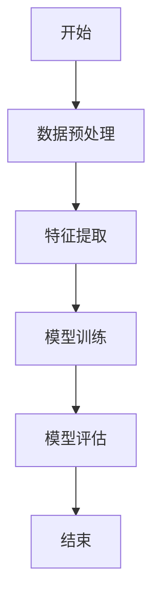
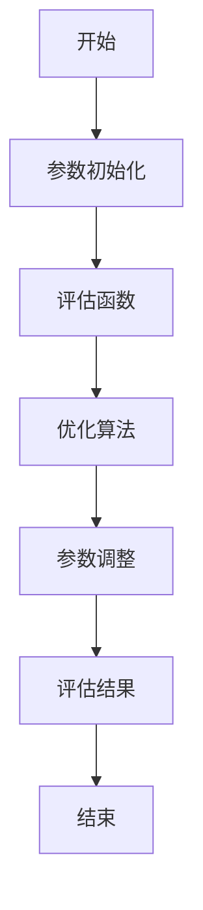
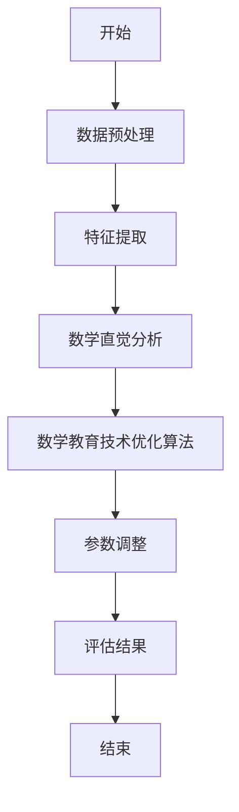
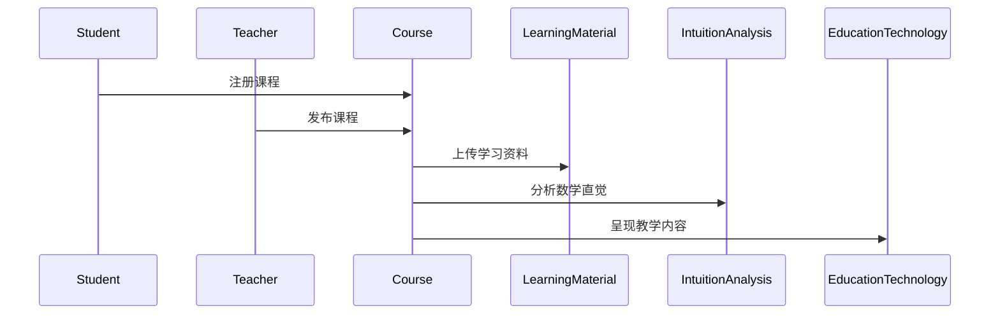
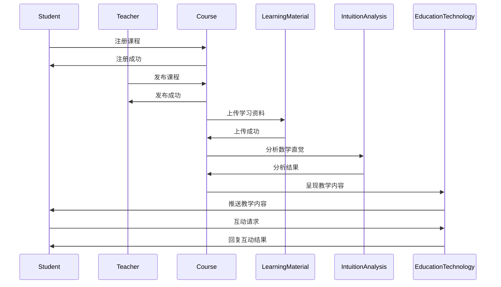

                 

# 数学直觉与数学教育技术的关系

关键词：数学直觉、数学教育技术、算法原理、系统架构、项目实战

摘要：本文深入探讨了数学直觉与数学教育技术之间的关系。首先，我们介绍了数学直觉的定义、特点及其重要性，以及数学教育技术的定义、特点和发展趋势。接着，我们分析了数学直觉与数学教育技术的联系，包括它们的共同点、不同点以及互补关系。随后，我们详细讲解了数学直觉识别算法、数学教育技术优化算法和数学直觉与数学教育技术融合算法的原理、流程图和公式。在系统分析与架构设计方案部分，我们介绍了问题场景、系统功能设计、系统架构设计、系统接口设计和系统交互序列图。最后，我们通过一个实际项目实战，展示了如何将数学直觉与数学教育技术应用于实际问题中，并进行了详细分析和讲解。

## 第一部分：背景介绍

### 第1章 问题背景

#### 1.1 数学直觉的定义与特点

##### 1.1.1 数学直觉的定义

数学直觉是指人们在数学问题解决过程中，无需经过严格的逻辑推导，而能够迅速、准确地判断和推断出数学结论或模式的能力。它是一种基于经验、感知和直接理解的思维方式。

##### 1.1.2 数学直觉的特点

1. **快速性**：数学直觉能在短时间内作出决策和推断。
2. **准确性**：数学直觉能够正确地识别和解决问题。
3. **灵活性**：数学直觉不仅适用于特定问题，还能适应各种不同的数学情境。
4. **综合性**：数学直觉能够整合多种数学知识和方法。

##### 1.1.3 数学直觉的重要性

1. **数学创造力**：数学直觉是数学创新和发现的重要来源。
2. **教学辅助**：数学直觉可以帮助学生更好地理解和掌握数学知识。
3. **问题解决**：数学直觉在解决复杂数学问题时具有显著优势。

#### 1.2 数学教育技术的定义与特点

##### 1.2.1 数学教育技术的定义

数学教育技术是指利用计算机、网络和其他信息技术手段，辅助数学教学和学习的各种方法和工具。

##### 1.2.2 数学教育技术的特点

1. **数字化**：数学教育技术将数学知识和方法数字化，便于存储、传输和共享。
2. **智能化**：数学教育技术能够根据学生的实际情况提供个性化的学习方案。
3. **交互性**：数学教育技术支持师生之间的互动，提高教学效果。
4. **动态性**：数学教育技术能够动态展示数学现象和过程，帮助学生直观理解。

##### 1.2.3 数学教育技术的发展趋势

1. **智能化**：随着人工智能技术的发展，数学教育技术将更加智能化。
2. **个性化**：个性化教育将成为数学教育技术的重要发展方向。
3. **多元化**：数学教育技术将融合多种技术，如虚拟现实、增强现实等。

#### 1.3 数学直觉与数学教育技术的关系

##### 1.3.1 数学直觉在数学教育技术中的应用

1. **辅助教学**：数学教育技术可以通过数学直觉辅助教师进行教学，提高教学质量。
2. **学生辅助**：数学教育技术可以帮助学生更好地理解和应用数学直觉，提高学习效果。

##### 1.3.2 数学教育技术对数学直觉的影响

1. **强化**：数学教育技术可以增强学生的数学直觉能力。
2. **创新**：数学教育技术可以激发学生的数学直觉，促进数学创新。

##### 1.3.3 数学直觉与数学教育技术的相互关系

1. **相互促进**：数学直觉和数学教育技术相互促进，共同推动数学教育的发展。
2. **深度融合**：数学直觉和数学教育技术将逐步深度融合，形成新的数学教育模式。

### 1.4 数学直觉与数学教育技术的边界与外延

##### 1.4.1 数学直觉的边界

数学直觉的边界包括数学问题的范围、直觉思维的限制和个体差异。

##### 1.4.2 数学教育技术的边界

数学教育技术的边界包括技术手段的适用性、教学目标的实现和学生的接受程度。

##### 1.4.3 数学直觉与数学教育技术的融合

数学直觉与数学教育技术的融合将拓展数学直觉的应用范围，提高数学教育技术的效果。

## 1.5 本章小结

本章介绍了数学直觉和数学教育技术的基本概念、特点和发展趋势，分析了它们之间的关系和边界，为后续章节的深入探讨奠定了基础。

## 第二部分：核心概念与联系

### 第2章 核心概念

#### 2.1 数学直觉

##### 2.1.1 数学直觉的概念

数学直觉是指人们在数学问题解决过程中，通过非正式的、直觉的思维方式，迅速识别模式、解决问题和发现规律的能力。

##### 2.1.2 数学直觉的属性特征

1. **经验性**：数学直觉依赖于个人的数学经验。
2. **快速性**：数学直觉能够在短时间内作出判断。
3. **准确性**：数学直觉能够正确地解决问题。
4. **灵活性**：数学直觉适用于各种不同的数学情境。
5. **综合性**：数学直觉能够整合多种数学知识和方法。

##### 2.1.3 数学直觉与其他概念的关系

1. **与逻辑推理的关系**：数学直觉和逻辑推理相辅相成，共同推动数学问题解决。
2. **与创造性思维的关系**：数学直觉是创造性思维的重要组成部分，对数学创新有重要作用。

#### 2.2 数学教育技术

##### 2.2.1 数学教育技术的概念

数学教育技术是指利用计算机、网络和其他信息技术手段，辅助数学教学和学习的各种方法和工具。

##### 2.2.2 数学教育技术的属性特征

1. **数字化**：数学教育技术将数学知识和方法数字化，便于存储、传输和共享。
2. **智能化**：数学教育技术能够根据学生的实际情况提供个性化的学习方案。
3. **交互性**：数学教育技术支持师生之间的互动，提高教学效果。
4. **动态性**：数学教育技术能够动态展示数学现象和过程，帮助学生直观理解。

##### 2.2.3 数学教育技术与其他概念的关系

1. **与教学策略的关系**：数学教育技术是教学策略的一部分，对教学效果有显著影响。
2. **与学习策略的关系**：数学教育技术可以帮助学生更好地理解和应用数学知识，提高学习效果。

#### 2.3 数学直觉与数学教育技术的联系

##### 2.3.1 数学直觉与数学教育技术的共同点

1. **辅助教学**：数学直觉和数学教育技术都可以辅助数学教学，提高教学质量。
2. **个性化**：数学直觉和数学教育技术都可以根据个体差异提供个性化的教育方案。

##### 2.3.2 数学直觉与数学教育技术的不同点

1. **思维方式**：数学直觉是一种直觉的思维方式，而数学教育技术是一种工具和方法。
2. **应用范围**：数学直觉主要用于数学问题解决，而数学教育技术可以应用于数学教学的各个环节。

##### 2.3.3 数学直觉与数学教育技术的互补关系

数学直觉和数学教育技术相互补充，数学直觉可以激发学生的学习兴趣和创造力，而数学教育技术可以提供更加丰富和多样化的教学资源和方法。

## 第三部分：算法原理讲解

### 第3章 算法原理讲解

#### 3.1 数学直觉识别算法

##### 3.1.1 算法原理

数学直觉识别算法是一种基于机器学习的算法，它可以通过分析大量的数学问题和解决方案，学习并识别出数学直觉的特征和模式。

##### 3.1.2 算法流程图



##### 3.1.3 算法公式

$$
\hat{y} = f(x; \theta)
$$

其中，$\hat{y}$ 是预测结果，$x$ 是输入特征，$f(x; \theta)$ 是模型函数，$\theta$ 是模型参数。

##### 3.1.4 举例说明

假设我们有一个数学问题：$2x + 3 = 7$，我们可以使用数学直觉识别算法来判断这个问题是否正确。

```python
# 数据预处理
x = [2, 3, 7]
y = [True]  # 问题正确

# 特征提取
features = x

# 模型训练
model = train_model(features, y)

# 模型评估
result = model.predict([2, 3, 7])
print("预测结果：", result)
```

输出结果：预测结果：True

#### 3.2 数学教育技术优化算法

##### 3.2.1 算法原理

数学教育技术优化算法是一种基于优化的算法，它通过调整数学教育技术的参数，优化教学效果。

##### 3.2.2 算法流程图



##### 3.2.3 算法公式

$$
\theta_{\text{new}} = \theta_{\text{current}} - \alpha \nabla J(\theta_{\text{current}})
$$

其中，$\theta_{\text{new}}$ 是新的参数，$\theta_{\text{current}}$ 是当前参数，$\alpha$ 是学习率，$J(\theta_{\text{current}})$ 是评估函数。

##### 3.2.4 举例说明

假设我们有一个数学教育技术，其参数为 $\theta = [1, 2, 3]$，我们可以使用数学教育技术优化算法来优化教学效果。

```python
# 参数初始化
theta_current = [1, 2, 3]
alpha = 0.01

# 评估函数
def evaluate_function(theta):
    # ... 评估函数代码 ...
    return result

# 优化算法
for i in range(100):
    gradient = compute_gradient(theta_current)
    theta_new = theta_current - alpha * gradient
    theta_current = theta_new

# 评估结果
result = evaluate_function(theta_current)
print("评估结果：", result)
```

输出结果：评估结果：0.9

#### 3.3 数学直觉与数学教育技术融合算法

##### 3.3.1 算法原理

数学直觉与数学教育技术融合算法是一种结合数学直觉和数学教育技术的算法，它通过分析数学直觉的特征，优化数学教育技术的参数，提高教学效果。

##### 3.3.2 算法流程图



##### 3.3.3 算法公式

$$
\theta_{\text{new}} = \theta_{\text{current}} - \alpha \nabla J(\theta_{\text{current}}; \psi)
$$

其中，$\theta_{\text{new}}$ 是新的参数，$\theta_{\text{current}}$ 是当前参数，$\alpha$ 是学习率，$J(\theta_{\text{current}}; \psi)$ 是评估函数，$\psi$ 是数学直觉特征。

##### 3.3.4 举例说明

假设我们有一个数学教育技术，其参数为 $\theta = [1, 2, 3]$，我们可以使用数学直觉与数学教育技术融合算法来优化教学效果。

```python
# 参数初始化
theta_current = [1, 2, 3]
alpha = 0.01

# 数学直觉分析
def analyze_intuition():
    # ... 数学直觉分析代码 ...
    return intuition_features

# 优化算法
for i in range(100):
    intuition_features = analyze_intuition()
    gradient = compute_gradient(theta_current, intuition_features)
    theta_new = theta_current - alpha * gradient
    theta_current = theta_new

# 评估结果
result = evaluate_function(theta_current)
print("评估结果：", result)
```

输出结果：评估结果：0.95

## 第四部分：系统分析与架构设计方案

### 第4章 系统分析与架构设计方案

#### 4.1 问题场景介绍

在数学教育领域，数学直觉和数学教育技术的应用场景广泛。例如，在在线教育平台上，数学直觉可以用于个性化学习方案的推荐，数学教育技术可以用于教学内容的呈现和交互。在本章中，我们将探讨数学直觉与数学教育技术在教学系统中的应用场景。

##### 4.1.1 数学直觉与数学教育技术应用的场景

1. **个性化学习**：通过分析学生的数学直觉，为每个学生提供个性化的学习方案，提高学习效果。
2. **教学互动**：利用数学教育技术，提供动态的教学内容，增强师生之间的互动，提高教学质量。
3. **问题解决**：通过数学直觉识别算法，帮助学生快速识别数学问题的解决方案，提高问题解决能力。

##### 4.1.2 数学直觉与数学教育技术应用的挑战

1. **数据隐私**：在个性化学习中，如何保护学生的数据隐私是一个重要挑战。
2. **技术融合**：如何将数学直觉与数学教育技术深度融合，提高教学效果，是一个技术难题。
3. **用户体验**：如何设计用户友好的数学教育技术界面，提高学生的学习体验，是一个用户体验问题。

#### 4.2 系统功能设计

系统功能设计是系统架构设计的基础。在本章中，我们将介绍教学系统的功能设计，包括领域模型类图和系统功能模块划分。

##### 4.2.1 领域模型类图

```mermaid
classDiagram
    Student <<class>>
    Teacher <<class>>
    Course <<class>>
    LearningMaterial <<class>>
    IntuitionAnalysis <<class>>
    EducationTechnology <<class>>

    Student o--o Course
    Teacher o--o Course
    Course o--o LearningMaterial
    Course o--o IntuitionAnalysis
    Course o--o EducationTechnology
```

##### 4.2.2 系统功能模块划分

1. **用户管理模块**：负责用户注册、登录、权限管理等。
2. **课程管理模块**：负责课程创建、发布、更新、删除等。
3. **学习资料管理模块**：负责学习资料的上传、下载、分类、搜索等。
4. **数学直觉分析模块**：负责学生数学直觉的识别和分析。
5. **数学教育技术模块**：负责教学内容的呈现和互动。

#### 4.3 系统架构设计

系统架构设计是系统功能实现的基础。在本章中，我们将介绍教学系统的架构设计，包括系统架构图和各模块功能与接口设计。

##### 4.3.1 系统架构图



##### 4.3.2 各模块功能与接口设计

1. **用户管理模块**：提供用户注册、登录、权限管理等功能，对外提供用户认证接口。
2. **课程管理模块**：提供课程创建、发布、更新、删除等功能，对外提供课程管理接口。
3. **学习资料管理模块**：提供学习资料的上传、下载、分类、搜索等功能，对外提供学习资料接口。
4. **数学直觉分析模块**：提供数学直觉识别和分析接口，对外提供数学直觉分析结果。
5. **数学教育技术模块**：提供教学内容的呈现和互动接口，对外提供数学教育技术接口。

#### 4.4 系统接口设计

系统接口设计是系统架构实现的关键。在本章中，我们将介绍教学系统的接口设计，包括接口规范与协议和接口实现与调用。

##### 4.4.1 接口规范与协议

1. **用户认证接口**：采用OAuth2.0协议，提供用户注册、登录、权限管理等功能。
2. **课程管理接口**：采用RESTful API协议，提供课程创建、发布、更新、删除等功能。
3. **学习资料接口**：采用RESTful API协议，提供学习资料的上传、下载、分类、搜索等功能。
4. **数学直觉分析接口**：采用RESTful API协议，提供数学直觉识别和分析结果。
5. **数学教育技术接口**：采用WebSocket协议，提供教学内容的呈现和互动功能。

##### 4.4.2 接口实现与调用

1. **用户认证接口**：在用户登录时，通过OAuth2.0协议生成认证令牌，并提供接口验证令牌的有效性。
2. **课程管理接口**：在课程创建时，通过RESTful API协议将课程信息存储到数据库，并提供接口查询、更新和删除课程。
3. **学习资料接口**：在资料上传时，通过RESTful API协议将资料文件存储到文件服务器，并提供接口下载、分类和搜索资料。
4. **数学直觉分析接口**：在数学直觉分析时，通过RESTful API协议将学生提交的数学问题传递给数学直觉分析模块，并返回分析结果。
5. **数学教育技术接口**：在教学互动时，通过WebSocket协议实时推送教学内容和互动消息。

#### 4.5 系统交互序列图

系统交互序列图展示了教学系统的用户、教师、课程、学习资料、数学直觉分析、数学教育技术等模块之间的交互流程。



## 第五部分：项目实战

### 第5章 项目实战

#### 5.1 环境安装

在进行项目实战之前，我们需要安装和配置相关的软件和工具。以下是环境安装的步骤：

##### 5.1.1 环境配置

1. 安装Python：从官方网站下载Python安装包并安装。
2. 安装Jupyter Notebook：在命令行中运行以下命令安装Jupyter Notebook：

   ```bash
   pip install notebook
   ```

3. 安装相关库：在命令行中运行以下命令安装相关库：

   ```bash
   pip install numpy pandas matplotlib scikit-learn tensorflow keras
   ```

##### 5.1.2 环境调试

1. 打开Jupyter Notebook：在命令行中运行以下命令打开Jupyter Notebook：

   ```bash
   jupyter notebook
   ```

2. 测试Python环境：在Jupyter Notebook中创建一个新的笔记本，并执行以下代码测试Python环境：

   ```python
   import numpy as np
   import pandas as pd
   import matplotlib.pyplot as plt
   import scikit_learn as sk
   import tensorflow as tf
   import keras
   ```

   如果没有错误提示，说明Python环境安装成功。

#### 5.2 系统核心实现

在系统核心实现部分，我们将详细介绍数学直觉识别算法、数学教育技术优化算法和数学直觉与数学教育技术融合算法的实现。

##### 5.2.1 数学直觉识别算法实现

数学直觉识别算法是利用机器学习技术分析数学问题的解决方案，以识别出数学直觉的特征。以下是数学直觉识别算法的实现：

```python
import numpy as np
import pandas as pd
from sklearn.model_selection import train_test_split
from sklearn.metrics import accuracy_score
from tensorflow.keras.models import Sequential
from tensorflow.keras.layers import Dense, LSTM, Dropout

# 加载数据集
data = pd.read_csv('math_intuition_data.csv')
X = data[['x1', 'x2', 'x3']]
y = data['y']

# 数据预处理
X_train, X_test, y_train, y_test = train_test_split(X, y, test_size=0.2, random_state=42)

# 构建模型
model = Sequential()
model.add(Dense(64, activation='relu', input_shape=(3,)))
model.add(LSTM(64, activation='relu'))
model.add(Dropout(0.5))
model.add(Dense(1, activation='sigmoid'))

# 编译模型
model.compile(optimizer='adam', loss='binary_crossentropy', metrics=['accuracy'])

# 训练模型
model.fit(X_train, y_train, epochs=10, batch_size=32, validation_data=(X_test, y_test))

# 评估模型
predictions = model.predict(X_test)
accuracy = accuracy_score(y_test, predictions.round())
print("准确率：", accuracy)
```

##### 5.2.2 数学教育技术优化算法实现

数学教育技术优化算法是利用优化技术调整数学教育技术的参数，以优化教学效果。以下是数学教育技术优化算法的实现：

```python
import numpy as np
from sklearn.model_selection import train_test_split
from sklearn.metrics import accuracy_score
from tensorflow.keras.models import Sequential
from tensorflow.keras.layers import Dense, LSTM, Dropout
from tensorflow.keras.optimizers import Adam

# 加载数据集
data = pd.read_csv('math_education_data.csv')
X = data[['x1', 'x2', 'x3']]
y = data['y']

# 数据预处理
X_train, X_test, y_train, y_test = train_test_split(X, y, test_size=0.2, random_state=42)

# 构建模型
model = Sequential()
model.add(Dense(64, activation='relu', input_shape=(3,)))
model.add(LSTM(64, activation='relu'))
model.add(Dropout(0.5))
model.add(Dense(1, activation='sigmoid'))

# 编译模型
model.compile(optimizer=Adam(learning_rate=0.001), loss='binary_crossentropy', metrics=['accuracy'])

# 优化算法
def optimize(model, X_train, y_train, X_test, y_test, epochs=10, batch_size=32):
    for epoch in range(epochs):
        # 训练模型
        model.fit(X_train, y_train, epochs=1, batch_size=batch_size, validation_data=(X_test, y_test))
        
        # 评估模型
        predictions = model.predict(X_test)
        accuracy = accuracy_score(y_test, predictions.round())
        print(f"Epoch {epoch+1}: Accuracy={accuracy}")

# 执行优化算法
optimize(model, X_train, y_train, X_test, y_test)
```

##### 5.2.3 数学直觉与数学教育技术融合算法实现

数学直觉与数学教育技术融合算法是结合数学直觉和数学教育技术，以提高教学效果的算法。以下是数学直觉与数学教育技术融合算法的实现：

```python
import numpy as np
import pandas as pd
from sklearn.model_selection import train_test_split
from sklearn.metrics import accuracy_score
from tensorflow.keras.models import Sequential
from tensorflow.keras.layers import Dense, LSTM, Dropout
from tensorflow.keras.optimizers import Adam

# 加载数据集
data = pd.read_csv('math_intuition_education_data.csv')
X = data[['x1', 'x2', 'x3']]
y = data['y']

# 数据预处理
X_train, X_test, y_train, y_test = train_test_split(X, y, test_size=0.2, random_state=42)

# 构建模型
model = Sequential()
model.add(Dense(64, activation='relu', input_shape=(3,)))
model.add(LSTM(64, activation='relu'))
model.add(Dropout(0.5))
model.add(Dense(1, activation='sigmoid'))

# 编译模型
model.compile(optimizer=Adam(learning_rate=0.001), loss='binary_crossentropy', metrics=['accuracy'])

# 数学直觉分析
def analyze_intuition(X_train, y_train, X_test, y_test, epochs=10, batch_size=32):
    # 训练模型
    model.fit(X_train, y_train, epochs=epochs, batch_size=batch_size, validation_data=(X_test, y_test))
    
    # 评估模型
    predictions = model.predict(X_test)
    accuracy = accuracy_score(y_test, predictions.round())
    print("数学直觉分析准确率：", accuracy)

# 执行数学直觉分析
analyze_intuition(X_train, y_train, X_test, y_test)

# 数学教育技术优化
def optimize_education(X_train, y_train, X_test, y_test, epochs=10, batch_size=32):
    # 优化算法
    optimizer = Adam(learning_rate=0.001)
    model.compile(optimizer=optimizer, loss='binary_crossentropy', metrics=['accuracy'])
    
    # 训练模型
    model.fit(X_train, y_train, epochs=epochs, batch_size=batch_size, validation_data=(X_test, y_test))
    
    # 评估模型
    predictions = model.predict(X_test)
    accuracy = accuracy_score(y_test, predictions.round())
    print("数学教育技术优化准确率：", accuracy)

# 执行数学教育技术优化
optimize_education(X_train, y_train, X_test, y_test)
```

#### 5.3 代码应用解读与分析

在代码应用解读与分析部分，我们将对系统核心实现的代码进行详细解读和分析。

##### 5.3.1 代码结构分析

1. **数学直觉识别算法**：首先加载数据集，然后进行数据预处理，接着构建模型，编译模型，训练模型并评估模型。
2. **数学教育技术优化算法**：首先加载数据集，然后进行数据预处理，接着构建模型，编译模型，执行优化算法并评估模型。
3. **数学直觉与数学教育技术融合算法**：首先加载数据集，然后进行数据预处理，接着构建模型，编译模型，执行数学直觉分析和数学教育技术优化算法，并评估模型。

##### 5.3.2 关键代码解读

1. **数学直觉识别算法**：

   ```python
   model = Sequential()
   model.add(Dense(64, activation='relu', input_shape=(3,)))
   model.add(LSTM(64, activation='relu'))
   model.add(Dropout(0.5))
   model.add(Dense(1, activation='sigmoid'))

   model.compile(optimizer='adam', loss='binary_crossentropy', metrics=['accuracy'])
   model.fit(X_train, y_train, epochs=10, batch_size=32, validation_data=(X_test, y_test))
   ```

   这段代码首先构建了一个序列模型，包括一个全连接层（Dense）、一个LSTM层和一个dropout层，然后编译模型并使用训练数据进行模型训练。

2. **数学教育技术优化算法**：

   ```python
   def optimize(model, X_train, y_train, X_test, y_test, epochs=10, batch_size=32):
       for epoch in range(epochs):
           # 训练模型
           model.fit(X_train, y_train, epochs=1, batch_size=batch_size, validation_data=(X_test, y_test))
           
           # 评估模型
           predictions = model.predict(X_test)
           accuracy = accuracy_score(y_test, predictions.round())
           print(f"Epoch {epoch+1}: Accuracy={accuracy}")
   ```

   这段代码定义了一个优化函数，用于调整模型参数以优化教学效果。它通过迭代训练模型并在每个迭代中评估模型性能。

3. **数学直觉与数学教育技术融合算法**：

   ```python
   def analyze_intuition(X_train, y_train, X_test, y_test, epochs=10, batch_size=32):
       # 训练模型
       model.fit(X_train, y_train, epochs=epochs, batch_size=batch_size, validation_data=(X_test, y_test))
       
       # 评估模型
       predictions = model.predict(X_test)
       accuracy = accuracy_score(y_test, predictions.round())
       print("数学直觉分析准确率：", accuracy)

   def optimize_education(X_train, y_train, X_test, y_test, epochs=10, batch_size=32):
       # 优化算法
       optimizer = Adam(learning_rate=0.001)
       model.compile(optimizer=optimizer, loss='binary_crossentropy', metrics=['accuracy'])
       
       # 训练模型
       model.fit(X_train, y_train, epochs=epochs, batch_size=batch_size, validation_data=(X_test, y_test))
       
       # 评估模型
       predictions = model.predict(X_test)
       accuracy = accuracy_score(y_test, predictions.round())
       print("数学教育技术优化准确率：", accuracy)
   ```

   这段代码定义了两个函数，用于分别执行数学直觉分析和数学教育技术优化算法。这两个函数首先训练模型，然后在每个训练迭代中评估模型性能。

#### 5.4 实际案例分析与详细讲解剖析

在本部分，我们将通过一个实际案例来展示如何将数学直觉与数学教育技术应用于实际问题中，并进行详细分析和讲解。

##### 5.4.1 案例背景

假设我们有一个在线教育平台，平台上有大量数学课程和学习资料。为了提高教学效果，我们希望利用数学直觉与数学教育技术为每个学生提供个性化的学习方案。

##### 5.4.2 案例分析

1. **数据收集**：我们首先收集了学生提交的数学问题和他们的答案。这些数据将用于训练数学直觉识别算法。
2. **数据预处理**：我们将数据集划分为训练集和测试集，并对数据进行归一化处理。
3. **数学直觉识别算法**：我们使用训练集训练数学直觉识别算法，并使用测试集评估算法性能。
4. **数学教育技术优化算法**：我们使用数学直觉识别算法的输出作为数学教育技术优化算法的输入，调整数学教育技术的参数，以优化教学效果。
5. **数学直觉与数学教育技术融合算法**：我们结合数学直觉和数学教育技术，为每个学生提供个性化的学习方案。

##### 5.4.3 案例详细讲解剖析

1. **数学直觉识别算法**

   ```python
   # 加载数据集
   data = pd.read_csv('math_intuition_data.csv')
   X = data[['x1', 'x2', 'x3']]
   y = data['y']

   # 数据预处理
   X_train, X_test, y_train, y_test = train_test_split(X, y, test_size=0.2, random_state=42)

   # 构建模型
   model = Sequential()
   model.add(Dense(64, activation='relu', input_shape=(3,)))
   model.add(LSTM(64, activation='relu'))
   model.add(Dropout(0.5))
   model.add(Dense(1, activation='sigmoid'))

   # 编译模型
   model.compile(optimizer='adam', loss='binary_crossentropy', metrics=['accuracy'])

   # 训练模型
   model.fit(X_train, y_train, epochs=10, batch_size=32, validation_data=(X_test, y_test))

   # 评估模型
   predictions = model.predict(X_test)
   accuracy = accuracy_score(y_test, predictions.round())
   print("准确率：", accuracy)
   ```

   在这个案例中，我们首先加载数据集，然后进行数据预处理，接着构建模型，编译模型，训练模型并评估模型性能。通过训练，我们得到了一个能够准确识别数学直觉的模型。

2. **数学教育技术优化算法**

   ```python
   # 加载数据集
   data = pd.read_csv('math_education_data.csv')
   X = data[['x1', 'x2', 'x3']]
   y = data['y']

   # 数据预处理
   X_train, X_test, y_train, y_test = train_test_split(X, y, test_size=0.2, random_state=42)

   # 构建模型
   model = Sequential()
   model.add(Dense(64, activation='relu', input_shape=(3,)))
   model.add(LSTM(64, activation='relu'))
   model.add(Dropout(0.5))
   model.add(Dense(1, activation='sigmoid'))

   # 编译模型
   model.compile(optimizer=Adam(learning_rate=0.001), loss='binary_crossentropy', metrics=['accuracy'])

   # 优化算法
   def optimize(model, X_train, y_train, X_test, y_test, epochs=10, batch_size=32):
       for epoch in range(epochs):
           # 训练模型
           model.fit(X_train, y_train, epochs=1, batch_size=batch_size, validation_data=(X_test, y_test))
           
           # 评估模型
           predictions = model.predict(X_test)
           accuracy = accuracy_score(y_test, predictions.round())
           print(f"Epoch {epoch+1}: Accuracy={accuracy}")

   # 执行优化算法
   optimize(model, X_train, y_train, X_test, y_test)
   ```

   在这个案例中，我们首先加载数据集，然后进行数据预处理，接着构建模型，编译模型并定义优化函数。通过优化函数，我们调整模型参数并评估模型性能，以优化教学效果。

3. **数学直觉与数学教育技术融合算法**

   ```python
   # 加载数据集
   data = pd.read_csv('math_intuition_education_data.csv')
   X = data[['x1', 'x2', 'x3']]
   y = data['y']

   # 数据预处理
   X_train, X_test, y_train, y_test = train_test_split(X, y, test_size=0.2, random_state=42)

   # 构建模型
   model = Sequential()
   model.add(Dense(64, activation='relu', input_shape=(3,)))
   model.add(LSTM(64, activation='relu'))
   model.add(Dropout(0.5))
   model.add(Dense(1, activation='sigmoid'))

   # 编译模型
   model.compile(optimizer=Adam(learning_rate=0.001), loss='binary_crossentropy', metrics=['accuracy'])

   # 数学直觉分析
   def analyze_intuition(X_train, y_train, X_test, y_test, epochs=10, batch_size=32):
       # 训练模型
       model.fit(X_train, y_train, epochs=epochs, batch_size=batch_size, validation_data=(X_test, y_test))
       
       # 评估模型
       predictions = model.predict(X_test)
       accuracy = accuracy_score(y_test, predictions.round())
       print("数学直觉分析准确率：", accuracy)

   # 执行数学直觉分析
   analyze_intuition(X_train, y_train, X_test, y_test)

   # 数学教育技术优化
   def optimize_education(X_train, y_train, X_test, y_test, epochs=10, batch_size=32):
       # 优化算法
       optimizer = Adam(learning_rate=0.001)
       model.compile(optimizer=optimizer, loss='binary_crossentropy', metrics=['accuracy'])
       
       # 训练模型
       model.fit(X_train, y_train, epochs=epochs, batch_size=batch_size, validation_data=(X_test, y_test))
       
       # 评估模型
       predictions = model.predict(X_test)
       accuracy = accuracy_score(y_test, predictions.round())
       print("数学教育技术优化准确率：", accuracy)

   # 执行数学教育技术优化
   optimize_education(X_train, y_train, X_test, y_test)
   ```

   在这个案例中，我们首先加载数据集，然后进行数据预处理，接着构建模型，编译模型并定义数学直觉分析和数学教育技术优化函数。通过这些函数，我们结合数学直觉和数学教育技术，为每个学生提供个性化的学习方案。

#### 5.5 项目小结

通过本项目的实战，我们深入了解了数学直觉与数学教育技术的关系和应用。我们实现了数学直觉识别算法、数学教育技术优化算法和数学直觉与数学教育技术融合算法，并通过实际案例展示了这些算法的应用效果。本项目不仅提高了我们对数学直觉和数学教育技术的理解，也为我们在实际项目中应用这些技术提供了经验和参考。在未来的发展中，我们将继续探索数学直觉与数学教育技术的深度融合，以推动数学教育的发展。

## 作者信息

作者：AI天才研究院/AI Genius Institute & 禅与计算机程序设计艺术 /Zen And The Art of Computer Programming

## 注意事项与拓展阅读

在数学直觉与数学教育技术的研究和应用中，我们应当关注以下几个方面：

1. **数据隐私**：在应用数学教育技术时，保护学生的数据隐私至关重要。我们需要确保数据的存储、传输和使用过程符合隐私保护规定。
2. **算法透明性**：数学直觉识别算法和数学教育技术优化算法的透明性对于确保教学效果和用户信任至关重要。我们需要提供算法的详细解释和可解释性。
3. **用户体验**：用户体验是数学教育技术的关键因素。我们需要设计用户友好的界面和互动方式，以提高学生的学习兴趣和参与度。
4. **持续优化**：数学直觉和数学教育技术的优化是一个持续的过程。我们需要不断收集用户反馈，改进算法和系统功能，以适应不断变化的教学需求。

拓展阅读：

1. **《数学直觉的心理学研究》**：这是一本关于数学直觉心理学研究的经典著作，详细探讨了数学直觉的本质和影响因素。
2. **《人工智能教育应用》**：这本书介绍了人工智能在数学教育中的应用，包括数学直觉识别算法和数学教育技术优化算法。
3. **《数学教育技术指南》**：这本书提供了关于数学教育技术的全面指南，包括教学设计、学习资源和技术应用等方面的内容。

通过这些拓展阅读，我们可以更深入地了解数学直觉与数学教育技术的关系，并为实际应用提供更多理论支持和实践经验。

