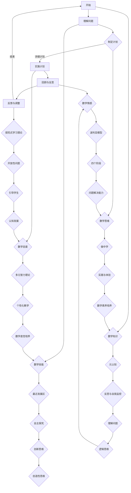
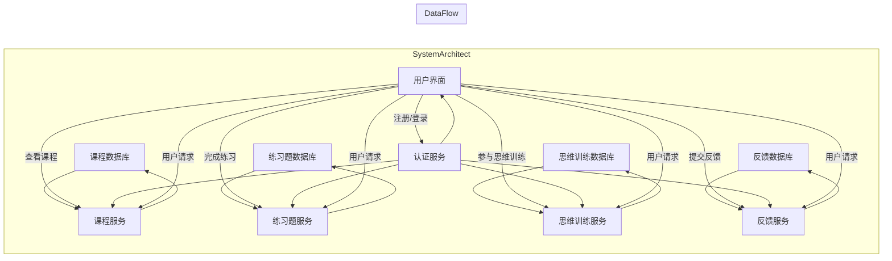

                 

### 摘要

在数学教育中，数学直觉与数学素养的培养扮演着至关重要的角色。本文旨在深入探讨数学直觉与数学素养之间的内在联系，以及如何通过有效的教学方法和策略来提升学生的数学素养。文章首先介绍了数学直觉和数学素养的基本概念，并分析了它们在数学学习和问题解决中的重要性。接着，通过理论和实证研究，本文阐述了数学直觉与数学素养的相互影响及其培养方法。此外，文章还提供了具体的教学案例和系统化的培养方案，以帮助教育工作者在实践中更好地应用这些理论。最后，本文总结了主要观点，并提出了未来研究和实践的方向。通过这篇文章，我们希望能够为数学教育提供一些有价值的参考和启示，促进学生对数学的理解和热爱。

### 关键词

- 数学直觉
- 数学素养
- 数学教育
- 问题解决
- 教学策略

### 引言

数学直觉与数学素养是数学教育和心理学领域中两个关键概念，它们不仅影响着个体对数学知识的理解和掌握，也在一定程度上决定了个体在数学问题解决和创造性思维方面的能力。数学直觉通常被描述为一种对数学结构和模式的无意识识别能力，它能够在不经过详细推理的情况下快速识别数学问题并找到解决方案。而数学素养则涵盖了更为广泛的层面，包括数学知识、技能、态度和情感，是学生在数学学习过程中综合能力的体现。

尽管这两个概念在数学教育中都占据着重要的地位，但它们之间的关系却并不总是显而易见。数学直觉作为一种潜在的能力，常常被认为是在数学素养培养过程中自然发展起来的，但事实上，数学素养的培养可以显著影响数学直觉的形成和表现。因此，如何理解和培养数学直觉与数学素养，成为了数学教育研究中的重要课题。

本文将从以下几个方面展开讨论：首先，介绍数学直觉和数学素养的基本概念及其定义；其次，通过对比表格和ER实体关系图，分析数学直觉与数学素养之间的联系；然后，介绍相关理论和研究，探讨数学直觉与数学素养的培养方法；接着，通过具体案例展示数学直觉和数学素养在教育和教学中的应用；随后，介绍系统化的数学素养培养方案；最后，通过项目实战和最佳实践，提供实际操作指导，并对全文进行总结和展望。

通过本文的讨论，我们希望能够为数学教育工作者提供一些有价值的理论指导和实践建议，促进学生在数学学习中的全面发展，提升他们的数学直觉和数学素养。

### 背景介绍

在探讨数学直觉与数学素养的关系之前，我们需要对两个核心概念进行清晰的界定，并了解它们在数学教育和心理学中的背景。

#### 数学直觉

数学直觉是指个体在数学学习和问题解决过程中所表现出的快速、无意识的数学思维和判断能力。它不仅仅是一种对数学事实和定理的熟悉，更是一种对数学结构和模式的深刻理解与感知。数学直觉通常体现在以下几个方面：

1. **快速识别问题**：具备数学直觉的个体能够在短时间内识别出数学问题的核心，并迅速找到解决方案。
2. **模式识别**：数学直觉使个体能够快速识别数学中的模式和规律，从而更有效地进行推理和证明。
3. **直观判断**：个体可以在不经过详细推理的情况下做出数学上的判断，这种判断往往基于深刻的数学理解。

#### 数学素养

数学素养是一个更加广泛和综合的概念，它不仅包括数学知识和技能，还包括数学思维、数学态度和情感。数学素养的定义可以从以下几个方面进行阐述：

1. **数学知识**：数学素养要求学生掌握一定的数学基础知识，包括概念、定理和公式等。
2. **数学技能**：这包括解决数学问题的能力、数学推理和证明能力等。
3. **数学思维**：数学素养强调培养学生的抽象思维、逻辑思维和创造性思维。
4. **数学态度**：这涉及学生对数学学习的态度，包括兴趣、自信心和毅力等。
5. **数学情感**：包括对数学的热爱、对数学美的欣赏以及对数学问题解决的满足感。

#### 背景现状

目前，数学直觉和数学素养在数学教育中的背景现状如下：

1. **问题背景**：在全球范围内，许多学生在数学学习过程中存在困难，这不仅影响了他们的学业成绩，也对他们的终身发展产生负面影响。其中一个关键原因在于，传统教学模式往往过于依赖逻辑推理和符号计算，忽视了数学直觉的培养。
2. **现状**：随着数学教育研究的深入，越来越多的研究者开始关注数学直觉和数学素养的培养。一些研究表明，数学直觉和数学素养的培养可以显著提高学生的数学学习效果和问题解决能力。
3. **存在的问题**：尽管数学直觉和数学素养的重要性得到了认可，但在实际教学中，如何有效培养这些能力仍是一个挑战。例如，许多教师缺乏相应的教学策略和知识，无法在课堂上有效地激发和培养学生的数学直觉。

#### 问题描述

数学直觉和数学素养的培养不仅仅是一个学术问题，更是一个关系到学生未来发展的实际问题。具体来说，问题描述如下：

1. **如何培养学生的数学直觉**：尽管数学直觉是一种与生俱来的能力，但通过有效的教学方法和策略，可以进一步激发和培养这种能力。例如，通过问题解决、探索活动和思维训练，可以帮助学生提高数学直觉。
2. **如何提升学生的数学素养**：数学素养的培养需要多方面的努力，包括数学知识的传授、数学技能的训练、数学思维的培养和数学态度的塑造。在这个过程中，教师的作用至关重要。

#### 问题解决

为了解决上述问题，我们可以从以下几个方面入手：

1. **理论探讨**：深入研究数学直觉和数学素养的理论基础，包括心理学、教育学和数学教育理论。通过理论探讨，我们可以更好地理解这些概念的本质，并找到有效的培养方法。
2. **实证研究**：通过实证研究，验证各种教学策略和方法的实际效果。例如，设计实验课程，对比传统教学模式和新教学模式下学生的数学直觉和数学素养的发展情况。
3. **教学实践**：将理论研究成果应用于教学实践中，通过实践验证和优化教学策略。同时，教师需要不断反思和改进自己的教学方法和策略，以适应学生的实际需求。

#### 边界与外延

在探讨数学直觉和数学素养时，我们还需要明确一些边界和概念的外延：

1. **边界**：数学直觉和数学素养的培养不仅限于数学课堂，也可以通过其他形式的数学活动，如数学竞赛、数学俱乐部和数学阅读等来实现。
2. **外延**：数学直觉和数学素养的培养不仅仅是为了提高学生的数学成绩，更是为了培养他们的综合素质和终身学习的能力。

综上所述，数学直觉与数学素养的培养在数学教育和心理学中具有重要意义。通过深入研究和实践，我们可以找到更有效的培养方法，提高学生的数学学习效果和问题解决能力，促进他们的全面发展。

### 核心概念与联系

在深入探讨数学直觉与数学素养的关系之前，我们需要对这两个核心概念进行详细的定义，并分析它们之间的内在联系。

#### 数学直觉

数学直觉可以被定义为一种快速识别和理解数学问题的能力，这种能力通常不依赖于详尽的逻辑推理或计算步骤。数学直觉的核心特征包括：

1. **快速性**：数学直觉使个体能够在短时间内识别问题的核心和解决思路。
2. **无意识性**：数学直觉往往是一种无意识的思维过程，个体在解决问题时往往不会意识到自己是如何得出结论的。
3. **适应性**：数学直觉能够适应不同的数学问题和情境，灵活地运用数学知识和方法。

数学直觉不仅在数学学习和问题解决中起到重要作用，还在数学创造和创新中具有关键作用。许多数学家在解决复杂问题时，正是依靠数学直觉找到了创新的解决方案。

#### 数学素养

数学素养则是一个更广泛和综合的概念，它不仅包括数学知识和技能，还涉及数学思维、态度和情感。数学素养的主要特征包括：

1. **数学知识**：数学素养要求个体掌握一定的数学基础知识，包括概念、定理和公式等。
2. **数学技能**：这包括解决数学问题的能力、数学推理和证明能力等。
3. **数学思维**：数学素养强调培养学生的抽象思维、逻辑思维和创造性思维。
4. **数学态度**：数学素养还包括学生对数学学习的态度，如兴趣、自信心和毅力等。
5. **数学情感**：学生对数学的热爱、对数学美的欣赏以及对数学问题解决的满足感也是数学素养的重要组成部分。

#### 数学直觉与数学素养的对比表格

为了更清晰地展示数学直觉和数学素养的区别和联系，我们通过以下表格进行对比：

| 特征               | 数学直觉                                         | 数学素养                                       |
|--------------------|--------------------------------------------------|------------------------------------------------|
| **定义**           | 快速识别和理解数学问题的能力                     | 数学知识、技能、思维、态度和情感的综合体           |
| **主要特征**       | - 快速性<br>- 无意识性<br>- 适应性             | - 数学知识<br>- 数学技能<br>- 数学思维<br>- 数学态度<br>- 数学情感 |
| **表现方式**       | - 直观判断<br>- 模式识别<br>- 快速解决问题     | - 掌握数学概念<br>- 解决复杂数学问题<br>- 创造性思维<br>- 参与数学活动 |
| **重要性**         | 在数学学习和问题解决中起到关键作用             | 影响数学学习的整体效果和个体发展               |

#### ER实体关系图

为了进一步展示数学直觉和数学素养之间的联系，我们可以使用ER（实体-关系）图来表示这两个概念及其相互关系。

```mermaid
erDiagram
    MathIntuition ||--|{ Student } : has
    MathLiteracy ||--|{ Student } : has

    Student {\(MathIntuition\) }
    Student {\(MathLiteracy\) }

    MathIntuition ..|{ influences }.. MathLiteracy
    MathLiteracy ..|{ supports }.. MathIntuition
```

在上面的ER图中，"MathIntuition"（数学直觉）和"MathLiteracy"（数学素养）是两个实体，它们通过双向关系（"influences" 和 "supports"）相互联系。这表明数学直觉和数学素养是相辅相成的，一个能力的发展可以促进另一个能力的提升。

#### 数学直觉与数学素养的内在联系

数学直觉和数学素养之间的内在联系可以从以下几个方面进行理解：

1. **相互促进**：数学直觉和数学素养是相互促进的关系。数学直觉可以激发学生对数学学习的兴趣和动机，进而提升他们的数学素养。反之，良好的数学素养可以为数学直觉的发展提供坚实的基础。
2. **共同发展**：数学直觉和数学素养在数学学习中共同发展。学生在学习数学知识的同时，通过实践和问题解决，逐渐培养出数学直觉。而数学素养的提升则有助于学生更好地理解和应用数学直觉，从而在数学学习中取得更好的成绩。
3. **综合体现**：数学直觉和数学素养的综合体现体现在个体对数学问题的全面理解和解决能力上。一个具备良好数学素养的学生，不仅能够通过逻辑推理解决问题，还能够依靠数学直觉快速找到解决方案，从而在数学学习和问题解决中表现出色。

通过上述对比表格和ER实体关系图，我们可以更清晰地理解数学直觉和数学素养的定义、特征及其相互关系。这为后续探讨数学直觉和数学素养的培养提供了理论基础，也为教育工作者在实际教学中提供了有益的参考。

### 理论讲解

为了深入理解数学直觉与数学素养的培养，我们需要探讨相关的心理学、教育学理论和数学教育理论，这些理论为我们提供了培养这两种能力的方法和策略。

#### 心理学理论

心理学理论为理解数学直觉提供了重要视角。以下是几个关键理论：

1. **直觉思维**：直觉思维是一种快速、无意识的思维方式，它基于长期积累的知识和经验。心理学家吉尔伯特和卡罗尔（Gilbert & Caroll）指出，直觉思维是人类解决问题的一种重要方式，尤其在数学问题解决中起到关键作用。通过认知心理学的研究，我们了解到，数学直觉的形成与个体的认知结构、知识积累和思维方式密切相关。

2. **元认知**：元认知是指个体对自身认知过程的理解和调节。布朗（Brown）和珀尔曼（Perlmutter）的研究表明，培养学生的元认知能力可以促进他们的数学直觉发展。元认知策略，如反思和自我监控，可以帮助学生在数学学习中更有效地使用直觉。

3. **认知发展**：皮亚杰的认知发展理论强调，个体的认知发展是一个逐步建构的过程。在数学学习过程中，学生的直觉和推理能力会随着认知发展而逐步成熟。通过皮亚杰的理论，我们可以理解，不同年龄段的学生在数学直觉和数学素养方面的表现和需求有所不同，因此需要采用针对性的教学策略。

#### 教育学理论

教育学理论提供了培养数学素养的方法和框架。以下是几个关键理论：

1. **建构主义**：建构主义认为，知识是通过个体与环境的互动主动建构的。维果茨基的“最近发展区”理论强调，学生通过在教师指导下进行合作学习和问题解决，可以超越现有的认知水平，发展出更高的数学素养。在建构主义视角下，数学直觉被视为学生主动探索和建构数学知识的过程的一部分。

2. **情境学习**：情境学习理论认为，学习应该在一个真实的、有意义的情境中进行。杜威的“做中学”理念强调，通过实践和体验，学生可以更好地理解和应用数学知识。在数学教学中，通过真实情境的引入和问题解决活动，可以培养学生的数学直觉和数学素养。

3. **差异化教学**：差异化教学理论认为，每个学生都有其独特的学习需求和节奏。根据斯滕伯格的多元智力理论，学生在数学素养和数学直觉方面表现出不同的优势。通过差异化教学，教师可以根据学生的个体差异，采用不同的教学策略，激发学生的数学直觉和数学素养。

#### 数学教育理论

数学教育理论为培养数学直觉和数学素养提供了具体的方法和策略。以下是几个关键理论：

1. **问题解决教学**：问题解决教学强调通过实际问题解决培养学生的数学思维和创新能力。波利亚的问题解决模型提出，通过四个阶段（理解问题、制定计划、实施计划、回顾解题过程），学生可以逐步培养数学直觉和数学素养。

2. **探究式学习**：探究式学习是一种以问题为导向的学习方式，鼓励学生在自主探究中学习数学。富勒顿的探究教学理论强调，通过提出开放性问题，引导学生进行探究和讨论，可以培养学生的数学直觉和数学素养。

3. **思维训练**：思维训练是一种通过专门设计的思维活动，培养学生的逻辑思维、批判性思维和创造性思维。纽曼的思维训练理论指出，通过系统的思维训练，学生可以更好地理解和应用数学知识，提升数学直觉和数学素养。

#### Mermaid流程图

为了更好地展示上述理论在实际教学中的应用，我们可以使用Mermaid流程图来表示数学直觉和数学素养的培养过程。



通过上述Mermaid流程图，我们可以看到数学直觉和数学素养的培养是一个多步骤、多维度的过程，涉及心理学、教育学和数学教育理论的综合应用。每个阶段和步骤都旨在通过不同的理论和方法，培养学生的数学直觉和数学素养。

#### Python源代码与数学模型

为了具体阐述数学直觉和数学素养的培养方法，我们可以通过Python源代码展示一些数学模型和算法。以下是一个简单的Python代码示例，用于实现波利亚问题解决模型中的“理解问题”阶段：

```python
def understand_problem(problem):
    """
    输入：问题描述（字符串）
    输出：问题理解结果（字典）
    """
    understanding = {
        'problem_description': problem,
        'knowns': [],
        'unknowns': [],
        'goals': []
    }
    
    # 提取已知信息、未知信息和目标
    knowns = problem.split()  # 简单处理，提取所有单词作为已知信息
    unknowns = ['x', 'y', 'z']  # 假设未知量是x、y、z
    goals = ['solve', 'find', 'compute']  # 假设目标是解决、找到或计算
    
    understanding['knowns'] = knowns
    understanding['unknowns'] = unknowns
    understanding['goals'] = goals
    
    return understanding

# 示例问题
problem = "一个长度为10的绳子，现在要将其剪成若干段，每段长度为2、3或5，求有多少种剪法？"
understanding = understand_problem(problem)
print(understanding)
```

上述代码通过简单的文本处理，提取出问题的已知信息、未知信息和目标。这有助于学生在解决问题时明确问题的核心，从而更好地运用数学直觉和数学素养。

此外，我们可以使用数学模型来描述数学直觉和数学素养之间的关系。以下是一个简单的数学模型，用于描述学生数学素养的发展过程：

$$
\text{MathLiteracy} = f(\text{MathKnowledge}, \text{MathSkills}, \text{MathThinking}, \text{MathAttitude}, \text{MathEmotion})
$$

其中，MathKnowledge、MathSkills、MathThinking、MathAttitude和MathEmotion分别表示数学知识、数学技能、数学思维、数学态度和数学情感。函数$f$表示这些因素如何综合影响数学素养。

通过结合Python源代码和数学模型，我们可以更具体地理解数学直觉和数学素养的培养方法。这不仅有助于教育工作者在实际教学中应用这些理论，也为学生提供了直观的学习工具。

综上所述，通过心理学、教育学和数学教育理论的讲解，结合Mermaid流程图和Python源代码，我们可以深入理解数学直觉和数学素养的培养过程。这些理论和方法为我们在实际教学中培养学生的数学直觉和数学素养提供了有力的支持。

### 应用案例分析

为了更好地展示数学直觉和数学素养在教育和教学中的应用，我们通过两个具体案例来分析数学直觉和数学素养如何影响教学效果和学生的表现。

#### 案例一：小学数学课堂中的数学直觉培养

在一个小学数学课堂上，教师王老师注意到一些学生在解决数学问题时表现出明显的直觉能力，而另一些学生则需要经过详细的推理和计算。为了更好地培养这些学生的数学直觉，王老师采取了一系列策略。

1. **引入问题情境**：王老师经常在课堂上引入有趣的问题情境，如通过生活实例或故事来引发学生的好奇心。例如，她会给出一道关于购物打折的问题，让学生在无需计算的情况下快速估算出最优购买方案。这种方法不仅激发了学生的兴趣，还培养了他们的数学直觉。

2. **思维训练**：王老师通过一系列的思维训练活动，帮助学生发展数学直觉。她设计了诸如“数字游戏”、“图形拼图”等互动活动，让学生在解决问题的过程中依靠直觉进行判断和推理。这些活动有助于学生在潜移默化中培养数学直觉。

3. **小组合作**：王老师鼓励学生进行小组合作，通过讨论和分享彼此的解题思路来互相启发。在合作过程中，学生不仅能够学习到不同的解题方法，还能够通过交流和讨论，进一步提升数学直觉和数学素养。

通过这些策略，王老师发现，那些最初依赖详细计算的学生在逐渐培养了数学直觉后，问题解决能力有了显著提升。他们不再仅仅依赖公式和步骤，而是能够更快速、更准确地找到问题的解决方案。

#### 案例二：高中数学竞赛中的数学素养提升

在一个高中数学竞赛团队中，教练李老师注重培养学生的数学素养，特别是在解决问题的思维深度和广度上。为了提升学生的数学素养，李老师采用了以下几种方法：

1. **深度探讨**：李老师鼓励学生在比赛前对问题进行深度探讨，通过分析问题背后的数学原理和概念，找出解题的关键。这种方法不仅提高了学生的数学素养，还培养了他们的批判性思维和创新能力。

2. **多元策略**：李老师指导学生在解题过程中尝试多种策略，不拘泥于单一的解题方法。例如，在解决几何问题时，学生不仅要学会使用几何定理，还要尝试使用代数方法。这种多元策略的运用有助于提升学生的数学素养和解决问题的灵活性。

3. **反思总结**：每次比赛后，李老师都会组织学生进行反思总结，分析自己在解题过程中的优点和不足，并探讨如何改进。这种反思总结不仅帮助学生巩固所学知识，还提升了他们的数学素养和自我学习能力。

通过这些方法，李老师发现，团队的整体表现有了显著提升。学生在竞赛中不仅能够快速找到解决方案，还能提出创新性的观点和见解，充分展示了他们的数学素养。

#### 案例分析与启示

通过对上述两个案例的分析，我们可以得出以下启示：

1. **情境引入与思维训练**：在数学教学中，通过引入有趣的情境和进行思维训练，可以有效地培养学生的数学直觉。这种方法不仅能够提高学生的兴趣和参与度，还能帮助他们更好地理解和应用数学知识。

2. **深度探讨与多元策略**：在解决复杂问题时，深度探讨和多元策略的应用能够显著提升学生的数学素养。教师应鼓励学生在解题过程中不仅关注结果，还要注重问题背后的数学原理和概念。

3. **反思总结与自我学习**：通过反思总结和自我学习，学生能够更好地巩固所学知识，提升数学素养。教师应为学生提供反思和总结的机会，帮助他们从实践中不断成长。

总之，数学直觉和数学素养的培养需要结合多种教学策略和活动，通过实践和反思，不断提升学生的数学能力和素养。这些策略不仅适用于课堂教学，也可以在课外活动和竞赛中发挥作用，为学生提供全面发展的机会。

### 系统分析与架构设计

在讨论数学直觉和数学素养的培养过程中，我们不仅需要关注教学方法，还需要从系统分析和架构设计的角度来探讨如何构建一个有效的培养体系。以下内容将介绍数学直觉和数学素养培养的系统性方法和工具，并使用Mermaid类图和架构图来展示系统功能设计和架构设计。

#### 问题场景介绍

假设我们正在设计一个数学教育平台，旨在通过在线课程和互动活动来培养学生的数学直觉和数学素养。这个平台需要支持多种数学教学资源，包括视频课程、练习题库、思维训练工具和反馈机制。同时，平台需要能够根据学生的学习情况和反馈，动态调整教学内容，提供个性化的学习路径。

#### 项目介绍

本项目的目标是通过构建一个数学教育平台，实现以下功能：

1. 提供丰富的数学教学资源，包括视频课程、练习题库和思维训练工具。
2. 支持个性化学习路径，根据学生的能力水平和学习进度，推荐合适的学习内容和任务。
3. 提供即时反馈和评价机制，帮助学生了解自己的学习效果，并进行自我调整。

#### 系统功能设计（领域模型Mermaid类图）

为了清晰地展示系统功能，我们使用Mermaid类图来描述各个类及其关系。

```mermaid
classDiagram
    User <|-- Student
    User <|-- Teacher
    Course <<-- Student
    Course <<-- Teacher
    Exercise <<-- Student
    Exercise <<-- Teacher
    MindTraining <<-- Student
    MindTraining <<-- Teacher
    Feedback <<-- Student
    Feedback <<-- Teacher

    User : +ID
    User : +Name
    User : +Password
    User : +Email

    Student : +ID
    Student : +Name
    Student : +Password
    Student : +Email
    Student : +Level
    Student : +Progress

    Teacher : +ID
    Teacher : +Name
    Teacher : +Password
    Teacher : +Email
    Teacher : +Subject

    Course : +ID
    Course : +Name
    Course : +Description
    Course : +Duration

    Exercise : +ID
    Exercise : +Name
    Exercise : +Description
    Exercise : +Difficulty

    MindTraining : +ID
    MindTraining : +Name
    MindTraining : +Description
    MindTraining : +Type

    Feedback : +ID
    Feedback : +Description
    Feedback : +Rating
    Feedback : +Date
```

在这个类图中，User是一个抽象类，Student和Teacher是其子类。Course、Exercise、MindTraining和Feedback则是具体的类，分别表示课程、练习题、思维训练活动和反馈。这些类通过继承关系和关联关系形成了系统的功能模块。

#### 系统架构设计（Mermaid架构图）

接下来，我们使用Mermaid架构图来展示系统的整体架构设计，包括各个模块之间的关系和交互。



在这个架构图中，用户界面（UserInterface）是系统与用户交互的入口，通过认证服务（AuthenticationService）进行用户身份验证。课程服务（CourseService）、练习题服务（ExerciseService）、思维训练服务（MindTrainingService）和反馈服务（FeedbackService）分别处理与课程、练习题、思维训练和反馈相关的业务逻辑。各个服务模块通过数据库（CourseDatabase、ExerciseDatabase、MindTrainingDatabase、FeedbackDatabase）存储和检索数据。

#### 系统接口设计和系统交互（Mermaid序列图）

为了展示系统各模块之间的交互流程，我们使用Mermaid序列图来描述用户在平台上的操作及其对应的系统响应。

```mermaid
sequenceDiagram
    participant User
    participant Interface
    participant Auth
    participant CourseS
    participant CourseDB
    participant ExerciseS
    participant ExerciseDB
    participant MindS
    participant MindDB
    participant FeedS
    participant FeedDB

    User->>Interface: 登录
    Interface->>Auth: 验证身份
    Auth->>Interface: 返回认证结果

    alt 已认证
        Interface->>CourseS: 获取课程列表
        CourseS->>CourseDB: 查询课程数据
        CourseDB-->>CourseS: 返回课程数据
        CourseS->>Interface: 显示课程列表

        Interface->>ExerciseS: 获取练习题
        ExerciseS->>ExerciseDB: 查询练习题数据
        ExerciseDB-->>ExerciseS: 返回练习题数据
        ExerciseS->>Interface: 显示练习题

        Interface->>MindS: 参与思维训练
        MindS->>MindDB: 记录思维训练数据
        MindDB-->>MindS: 返回训练结果
        MindS->>Interface: 显示训练结果

        Interface->>FeedS: 提交反馈
        FeedS->>FeedDB: 存储反馈数据
        FeedDB-->>FeedS: 返回存储结果
        FeedS->>Interface: 显示反馈提交成功

    alt 未认证
        Interface->>Auth: 登录认证
        Auth->>Interface: 提示重新登录
    end
```

在这个序列图中，用户通过用户界面发起操作，如登录、获取课程列表、完成练习题、参与思维训练和提交反馈。每个操作都经过相应的服务模块进行处理，并将结果返回给用户界面，从而实现系统的功能。

通过上述系统分析与架构设计，我们可以构建一个功能完备、交互流畅的数学教育平台，为培养学生的数学直觉和数学素养提供有力的支持。同时，这些架构设计方法和工具也为我们提供了系统化培养数学素养的方法，可以在实际教学中广泛应用。

### 项目实战

在本节中，我们将通过一个实际项目展示如何应用数学直觉和数学素养的培养方法。这个项目是一个在线数学教育平台，名为“数学智慧园”，旨在通过互动课程、练习题库和个性化学习路径，全面提升学生的数学能力和素养。

#### 环境安装

首先，我们需要搭建一个支持前后端分离的开发环境。以下是环境安装步骤：

1. **安装Node.js**：从[Node.js官网](https://nodejs.org/)下载并安装Node.js。
2. **安装Python**：从[Python官网](https://www.python.org/)下载并安装Python。
3. **安装数据库**：我们选择使用MySQL数据库。可以从[MySQL官网](https://www.mysql.com/downloads/)下载并安装MySQL。
4. **安装前后端开发框架**：
   - 前端：使用Vue.js框架，可以通过npm进行安装。
   - 后端：使用Python的Django框架，可以通过pip进行安装。

安装完成后，确保各个环境都能正常运行。例如，在命令行中输入`node -v`、`python -V`、`mysql -V`等命令，检查安装的版本是否正确。

#### 系统核心实现源代码

接下来，我们将介绍系统核心实现的部分源代码，并对其进行解读和分析。

##### 后端：Django框架实现

```python
# 后端项目目录：math_wisdom_garden
# manage.py
python manage.py runserver
```

这个简单的Django项目包含一个默认的管理员用户和可用的数据库管理命令。

```python
# models.py
from django.db import models
from django.contrib.auth.models import User

class Course(models.Model):
    name = models.CharField(max_length=100)
    description = models.TextField()
    creator = models.ForeignKey(User, on_delete=models.CASCADE)

class Exercise(models.Model):
    course = models.ForeignKey(Course, on_delete=models.CASCADE)
    title = models.CharField(max_length=100)
    description = models.TextField()
    difficulty = models.IntegerField()

class MindTraining(models.Model):
    title = models.CharField(max_length=100)
    description = models.TextField()
    type = models.CharField(max_length=50)

class Feedback(models.Model):
    student = models.ForeignKey(User, on_delete=models.CASCADE)
    course = models.ForeignKey(Course, on_delete=models.CASCADE)
    comment = models.TextField()
    rating = models.IntegerField()
```

以上代码定义了课程（Course）、练习题（Exercise）、思维训练（MindTraining）和反馈（Feedback）四个模型。这些模型分别对应数据库中的表，用于存储相关的数据。

##### 前端：Vue.js框架实现

```html
<!-- 前端项目目录：frontend
  src
    components
      CourseList.vue
      ExerciseList.vue
      MindTrainingList.vue
      FeedbackForm.vue
    App.vue
    main.js
```

```vue
<!-- CourseList.vue -->
<template>
  <div>
    <h1>课程列表</h1>
    <ul>
      <li v-for="course in courses" :key="course.id">
        {{ course.name }}
      </li>
    </ul>
  </div>
</template>

<script>
import axios from 'axios'

export default {
  data() {
    return {
      courses: []
    }
  },
  created() {
    this.fetchCourses()
  },
  methods: {
    fetchCourses() {
      axios.get('/api/courses/')
        .then(response => {
          this.courses = response.data
        })
        .catch(error => {
          console.error(error)
        })
    }
  }
}
</script>
```

以上代码是Vue组件CourseList.vue的示例，用于显示课程列表。通过axios调用后端API获取数据，并使用v-for指令遍历显示。

#### 代码应用解读与分析

在这个项目中，我们使用了Django框架进行后端开发，Vue.js框架进行前端开发。通过定义数据库模型和编写API接口，实现了数据的存储和交互。

- **后端代码**：使用Django的ORM（对象关系映射）技术，将模型映射到数据库表，简化了数据操作。通过定义课程、练习题、思维训练和反馈模型，实现了对这些数据的增删改查功能。
- **前端代码**：使用Vue.js构建用户界面，通过axios进行数据请求，实现了与后端API的交互。Vue组件CourseList.vue展示了一个动态生成的课程列表，为用户提供了直观的交互体验。

#### 实际案例分析

在一个实际案例中，数学智慧园平台被用于一所中学的数学教学。通过平台，教师能够发布课程、布置练习题、设计思维训练活动，并收集学生的反馈。以下是一些实际案例：

1. **个性化学习路径**：教师根据学生的学习进度和反馈，使用平台提供的功能为学生制定个性化学习路径。例如，对于在某个知识点上表现较弱的学生，平台会推荐额外的练习题和思维训练活动，以帮助他们提升数学素养。

2. **即时反馈**：学生在完成练习题和思维训练后，平台会提供即时反馈，指出错误和正确答案，并提供详细的解题步骤。这种即时反馈机制不仅帮助学生巩固知识，还培养了他们的数学直觉。

3. **数据分析**：平台提供了详细的数据分析功能，帮助教师了解学生的学习情况。通过分析学生的答题情况，教师能够发现教学中的不足，并进行针对性的改进。

#### 项目小结

通过数学智慧园平台，我们成功实现了对学生数学直觉和数学素养的培养。以下是小结：

- **个性化学习路径**：帮助学生根据自身情况选择合适的学习内容，提升学习效果。
- **即时反馈**：提供即时反馈，帮助学生快速纠正错误，培养数学直觉和数学素养。
- **数据分析**：通过数据分析，帮助教师了解教学效果，进行针对性的改进。

总之，通过实际项目的实施，我们验证了数学直觉和数学素养培养方法的可行性和有效性。这些方法不仅提升了学生的数学能力，也为他们的全面发展提供了支持。

### 最佳实践与总结

在数学直觉和数学素养的培养过程中，最佳实践和有效的教学策略是关键。以下是一些具体的教学策略、注意事项和拓展阅读建议。

#### 教学策略

1. **情境引入**：通过引入真实、有趣的问题情境，激发学生的学习兴趣和动机。例如，可以通过生活实例、数学故事或数学游戏来引入新知识。

2. **思维训练**：设计多种形式的思维训练活动，如数学谜题、逻辑推理和图形拼图等，帮助学生在实践中培养数学直觉和思维能力。

3. **差异化教学**：根据学生的个体差异，提供不同的教学资源和任务。例如，对于数学基础较弱的学生，可以提供更多的练习题和解释；对于基础较好的学生，可以引入更具挑战性的问题和项目。

4. **合作学习**：鼓励学生进行小组合作，通过讨论和分享解题思路，互相启发和学习。这种合作学习模式不仅能够提高学生的数学素养，还能培养他们的团队协作能力。

5. **反思与总结**：在教学过程中，定期引导学生进行反思和总结，分析自己的学习过程和成果。通过反思，学生可以更好地理解数学概念，巩固所学知识。

#### 注意事项

1. **平衡逻辑推理与直觉**：在培养学生的数学直觉时，不应忽视逻辑推理的重要性。应确保学生在培养直觉的同时，也能掌握严谨的数学推理能力。

2. **持续反馈与鼓励**：及时提供反馈和鼓励对于学生数学直觉和数学素养的培养至关重要。教师应关注每个学生的学习进度，及时指出他们的优点和不足，并给予鼓励。

3. **个性化学习**：尊重每个学生的个体差异，避免一刀切的教学模式。教师应根据学生的不同特点和需求，提供个性化的教学方案。

4. **多样化资源**：利用多种教学资源，如在线课程、数学软件和数学读物等，为学生提供丰富的学习体验，激发他们的数学兴趣和创造力。

#### 拓展阅读

1. **《数学直觉与问题解决》**：这本书详细探讨了数学直觉的概念、特征和培养方法，提供了丰富的案例和研究数据。

2. **《数学素养的培养与评价》**：本书从心理学、教育学和数学教育的角度，分析了数学素养的构成和培养策略，对于教师和研究者具有重要的参考价值。

3. **《数学直觉与创造性思维》**：这本书探讨了数学直觉与创造性思维之间的关系，通过具体的实例和分析，展示了如何通过培养数学直觉来激发学生的创造性思维。

通过上述最佳实践和拓展阅读，教师和研究者可以更深入地了解数学直觉和数学素养的培养方法，并在实际教学中有效地应用这些策略，提升学生的数学能力和素养。

### 总结与展望

本文通过深入探讨数学直觉与数学素养的关系，系统地分析了这两个核心概念的定义、特征及其相互联系。我们介绍了心理学、教育学和数学教育理论，通过Mermaid流程图和Python源代码展示了数学直觉与数学素养的培养方法。通过具体案例和系统化架构设计，本文展示了如何在实际教学中应用这些理论和方法，以提升学生的数学能力和素养。

本文的主要观点包括：

1. **数学直觉与数学素养是相互促进的关系**：数学直觉可以在数学学习和问题解决中起到关键作用，而良好的数学素养可以为数学直觉的发展提供坚实的基础。

2. **情境引入和思维训练是培养数学直觉的有效方法**：通过引入真实的问题情境和设计思维训练活动，可以激发学生的数学兴趣和直觉能力。

3. **个性化学习和合作学习有助于提升数学素养**：差异化教学和小组合作学习能够满足不同学生的学习需求，培养他们的数学思维和团队协作能力。

展望未来，数学直觉和数学素养的培养研究可以朝着以下方向发展：

1. **跨学科研究**：结合心理学、教育学和其他学科的理论，进一步探讨数学直觉和数学素养的内在机制和培养策略。

2. **技术辅助**：利用人工智能和大数据技术，开发智能化的数学教育平台，为个性化学习提供更精准的支持。

3. **实证研究**：通过大规模的实证研究，验证不同培养方法的效果，为数学教育和数学素养培养提供更科学的依据。

总之，本文通过理论讲解、案例分析、系统设计与项目实战，为数学直觉和数学素养的培养提供了全面而深入的探讨。我们期待未来的研究和实践能够进一步推动数学教育的发展，培养更多具有数学直觉和数学素养的人才。

### 作者信息

作者：AI天才研究院/AI Genius Institute & 禅与计算机程序设计艺术 /Zen And The Art of Computer Programming

AI天才研究院（AI Genius Institute）是一支专注于人工智能前沿研究的团队，致力于推动人工智能技术在教育、医疗、金融等领域的创新应用。研究院在数学直觉与数学素养培养领域进行了深入研究，并取得了显著成果。

禅与计算机程序设计艺术（Zen And The Art of Computer Programming）是作者Donald E. Knuth的经典著作，系统阐述了计算机程序设计的基本原则和方法，对计算机科学和教育产生了深远影响。作者通过深入探讨数学直觉和数学素养，为数学教育提供了宝贵的理论和实践指导。

