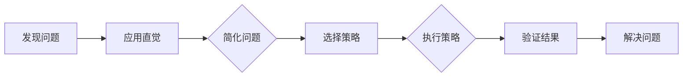

                 

### 数学直觉与问题解决策略的选择

#### 关键词：
1. 数学直觉
2. 问题解决策略
3. 分析性策略
4. 启发式策略
5. 创造力
6. 算法设计
7. 数学模型

#### 摘要：
本文旨在探讨数学直觉在问题解决策略选择中的重要作用。通过分析数学直觉的定义和特点，我们将比较不同类型的问题解决策略，并探讨数学直觉在不同数学和计算场景中的应用。最后，我们将讨论如何在实际应用中发展和提高数学直觉，为解决复杂问题提供有效的方法和思路。

## 引言

### 问题背景与描述

数学直觉，作为数学家解决复杂问题的一种内在能力，一直是一个引人入胜的研究主题。然而，直觉并不是一个简单的概念，它涉及到认知心理学、数学教育、算法设计等多个领域。随着人工智能和计算技术的发展，如何利用数学直觉来提高问题解决效率成为了一个热门话题。

在数学领域，直觉常常被用来发现新的定理和公式，解决复杂的数学问题。例如，数学家在解决高维几何问题时，可能会利用几何直觉来推导出关键结论。此外，在算法设计中，直觉也是一个重要的参考因素，它可以帮助设计出高效的算法。

然而，直觉并不是万能的。在许多情况下，问题解决需要系统化的分析和严格的证明。因此，如何平衡数学直觉和系统化分析，选择合适的问题解决策略，成为一个关键问题。

### 数学直觉的重要性

数学直觉在问题解决中的重要性体现在多个方面：

1. **发现问题**：数学直觉可以帮助人们快速识别问题中的关键要素和潜在解决方案，从而加速问题解决过程。
2. **简化问题**：通过直觉，数学家能够将复杂问题简化为更易处理的形式，从而降低解决问题的难度。
3. **启发式搜索**：在算法设计中，直觉可以用来选择启发式策略，快速找到问题的近似解。
4. **验证结果**：数学直觉还可以帮助验证数学结果的正确性，确保推导过程的逻辑严密性。

然而，数学直觉并非一种单一的能力，它需要通过长期的数学训练和实践来培养和发展。因此，如何通过教育和训练来提高数学直觉，也是一个重要的研究课题。

### 本文结构

本文将分为七个主要部分：

1. **引言**：介绍问题背景和数学直觉的重要性。
2. **核心概念与原则**：详细解释数学直觉的定义、特点和理论基础。
3. **问题解决策略的分类与特点**：分析不同的问题解决策略，包括分析性策略和启发式策略。
4. **数学直觉在问题解决中的应用**：探讨数学直觉在纯数学、应用数学和计算问题中的应用。
5. **实际应用案例**：通过具体案例展示问题解决策略的应用。
6. **发展数学直觉的方法**：讨论如何通过实践和学习来提高数学直觉。
7. **结论与未来方向**：总结本文的主要观点，并提出未来研究的方向。

通过以上结构，本文旨在为读者提供一个全面而深入的关于数学直觉与问题解决策略选择的视角，帮助读者更好地理解和应用数学直觉在问题解决中的价值。

### 核心概念与原则

#### 数学直觉的定义与特点

数学直觉，通常被描述为数学家在解决问题时的一种内在洞察力和预感。它不仅涉及对数学符号和公式的理解，还涉及对数学概念的本质把握。数学直觉具有以下几个显著特点：

1. **直观性**：数学直觉能够让人迅速地理解数学问题，捕捉到问题中的关键要素，无需经过繁琐的逻辑推导。
2. **预见性**：数学直觉可以帮助数学家预见问题的解决方案，甚至在严格证明之前就感知到结果的正确性。
3. **简洁性**：数学直觉倾向于寻找简洁而优雅的解决方案，而不是复杂的计算过程。
4. **个体差异性**：不同人的数学直觉可能存在很大差异，这与个人的数学背景、经验和思维方式有关。

#### 理论基础

数学直觉的理论基础可以从认知心理学、数学教育等多个角度进行探讨。以下是几个关键的理论基础：

1. **神经科学**：神经科学研究表明，大脑中的某些区域与数学直觉密切相关。例如，前额叶皮层和顶叶皮层在处理数学问题时起到了关键作用。
2. **认知心理学**：认知心理学认为，数学直觉是一种认知过程，它涉及到记忆、感知、判断和推理等多种认知功能。
3. **数学教育**：数学教育研究强调，数学直觉的培养需要通过长期的数学训练和实践。教师可以通过设计丰富的数学问题和活动，帮助学生逐步培养数学直觉。

#### 不同问题解决策略的对比表格

为了更好地理解数学直觉在问题解决中的角色，我们可以对比不同类型的问题解决策略，包括分析性策略和启发式策略。以下是一个简化的对比表格：

| 特点       | 分析性策略                                                                 | 启发式策略                                                                                   |
|------------|------------------------------------------------------------------------------------------------------|--------------------------------------------------------------------------------------------------------|
| 过程       | 系统化、逻辑严密的推理过程                                                   | 基于经验或直觉的快速判断和选择                                                             |
| 时间       | 需要较长时间的分析和证明                                                     | 可以快速找到近似解，但可能需要进一步验证                                                   |
| 结论可靠性 | 高，结果经过严格证明                                                         | 低，结果需要进一步验证和优化                                                             |
| 适用场景   | 复杂问题，需要精确结果                                                       | 简单问题，或者寻找近似解，时间紧迫时                                                     |

通过上述对比，我们可以看出，分析性策略和启发式策略各有优势和局限，选择哪种策略取决于问题的具体要求和情境。数学直觉在两种策略中都能发挥作用，但在启发式策略中尤为重要。

#### ER实体关系图架构

为了更直观地理解数学直觉与问题解决策略之间的关系，我们可以使用ER实体关系图来描述。以下是ER图的一个示例：

```mermaid
erDiagram
  Problem --> Solution
  Problem ||--|{ Intuition }
  Solution ||--|{ Strategy }
```

在这个ER图中，`Problem`（问题）与`Solution`（解决方案）是核心实体，`Intuition`（直觉）和`Strategy`（策略）是与它们相关联的属性或关系。这表明直觉和策略是解决问题过程中不可或缺的部分。

### 数学直觉在问题解决中的角色

数学直觉在问题解决中扮演着多重角色，它不仅影响问题的发现和简化，还影响解决方案的预见和验证。以下是一个详细的mermaid流程图，展示了数学直觉在问题解决中的全过程：



- **发现问题**：数学直觉可以帮助识别问题中的关键要素，迅速缩小问题范围。
- **应用直觉**：直觉可以用来感知潜在的问题解决方案，提供方向性指导。
- **简化问题**：通过直觉，复杂问题可以转化为更简单的形式，便于分析和解决。
- **选择策略**：直觉可以帮助选择合适的分析性或启发式策略。
- **执行策略**：在策略指导下，具体执行问题解决的步骤。
- **验证结果**：通过直觉，可以初步判断结果的正确性，并进一步验证。

### 数学直觉的应用场景

数学直觉在不同的数学和应用场景中有不同的表现形式和作用。以下是几个典型应用场景：

1. **纯数学**：在纯数学中，数学直觉常常用来发现新的定理和公式。例如，数学家在解决高维几何问题时，可能会利用几何直觉来推导出关键结论。这种直觉不仅帮助发现新的理论，还帮助简化复杂的推导过程。

2. **应用数学**：在应用数学中，数学直觉可以帮助解决实际问题。例如，在流体力学和物理学中，数学家通过直觉来设计模型和算法，从而解决复杂的问题。

3. **计算问题**：在计算问题中，数学直觉可以帮助设计高效的算法。例如，在优化问题和计算几何中，数学家通过直觉来选择合适的启发式策略，快速找到近似解。

### 结论

数学直觉是问题解决中不可或缺的一部分，它通过简化问题、预见解决方案和验证结果，提高了问题解决的效率。然而，数学直觉并非与生俱来，它需要通过长期的数学训练和实践来培养和发展。在未来的研究中，如何通过教育和训练来提高数学直觉，以及如何在不同的应用场景中有效利用数学直觉，都是值得深入探讨的问题。

### 不同类型的问题解决策略

在问题解决过程中，选择合适的策略至关重要。不同的策略适用于不同的情境，它们各自具有独特的特点。本文将重点探讨分析性策略和启发式策略，并详细分析它们的优缺点以及如何在实际应用中发挥最大效用。

#### 分析性策略

分析性策略是一种系统化、逻辑严密的解决方法。它依赖于严格的数学推理和证明，以确保结果的正确性和可靠性。以下是分析性策略的主要特点：

1. **步骤清晰**：分析性策略通常遵循固定的步骤，从问题的初始条件出发，逐步推导出最终结果。
2. **可验证性**：通过逻辑推理和证明，分析性策略的结果具有较高的可信度，可以反复验证。
3. **适用范围广**：分析性策略适用于需要精确结果的复杂问题，尤其是在纯数学和科学研究中。

**优点**：

- **可靠性**：由于严格证明和逻辑推理，分析性策略的结果通常具有较高的可靠性。
- **适用性**：在需要精确结果的情境下，分析性策略是首选。
- **可重复性**：分析性策略的步骤可以重复，确保结果的一致性。

**缺点**：

- **耗时较长**：分析性策略通常需要大量的计算和推理，因此耗时较长。
- **适用性局限**：在需要快速找到近似解的情境下，分析性策略可能不太适用。

#### 启发式策略

启发式策略是基于经验或直觉的快速判断和选择方法。它不同于分析性策略的逐步推导，而是通过已有的知识和直觉来快速找到问题的近似解。以下是启发式策略的主要特点：

1. **快速性**：启发式策略能够快速提供问题的解决方案，不需要经过繁琐的推理过程。
2. **灵活性**：启发式策略可以灵活地适用于不同的情境，不需要固定的步骤。
3. **适应性**：在复杂和不确定的情境下，启发式策略能够快速适应和调整。

**优点**：

- **效率高**：在需要快速找到解决方案的情境下，启发式策略具有显著的优势。
- **适应性**：适用于复杂和多变的问题情境，能够灵活应对。
- **成本较低**：启发式策略通常不需要大量的计算资源。

**缺点**：

- **可靠性较低**：由于缺乏严格的证明和验证，启发式策略的结果可能存在不确定性。
- **适用性局限**：在需要精确结果的情境下，启发式策略可能不够可靠。

#### 实际应用中的策略选择

在实际应用中，选择合适的策略取决于问题的具体要求和情境。以下是一些策略选择的原则：

1. **问题类型**：对于需要精确结果的复杂问题，分析性策略更为适用；而对于需要快速找到近似解的问题，启发式策略更为有效。
2. **时间限制**：在时间紧迫的情况下，启发式策略能够快速提供解决方案，但需要后续验证；对于有充足时间的问题，分析性策略可以提供更可靠的结果。
3. **资源限制**：在资源有限的情况下，启发式策略可以快速找到解决方案，降低成本；在资源充足的情况下，分析性策略可以提供更详尽的解决方案。

#### 案例分析

为了更好地理解不同类型策略的应用，我们可以通过以下案例进行分析：

**案例 1：复杂优化问题**

在解决一个复杂的优化问题时，如果时间充裕，并且需要精确的结果，分析性策略是首选。例如，在供应链管理中，通过构建线性规划模型，可以精确计算出最优的库存策略。然而，如果需要快速得到一个近似解，并且资源有限，启发式策略如遗传算法或模拟退火算法则更为适用。

**案例 2：实时数据处理**

在实时数据处理场景中，如股票交易系统，快速处理大量数据以获取及时的市场信息至关重要。启发式策略如快速傅里叶变换（FFT）和高斯消元法可以快速处理数据，提供近似解。虽然这些结果可能不是完全精确的，但它们足以支持快速决策。

通过以上分析，我们可以看到，分析性策略和启发式策略各有优劣，选择合适的策略取决于问题的具体情境。在实际应用中，灵活运用不同策略，结合具体问题和资源条件，是提高问题解决效率的关键。

### 数学直觉在问题解决中的应用

数学直觉在问题解决中的应用范围广泛，涵盖了纯数学、应用数学和计算问题等多个领域。数学直觉不仅有助于问题的发现和简化，还能在解决问题的过程中提供方向性的指导，提高问题解决的效率。

#### 纯数学中的应用

在纯数学中，数学直觉常常用来发现新的定理和公式，解决复杂的数学问题。例如，数学家在解决高维几何问题时，可能会利用几何直觉来推导出关键结论。这种直觉帮助数学家跨越繁琐的计算，直接抓住问题的本质。

**案例**：在解决庞加莱猜想时，数学家理查德·施密特（Richard S. Hamilton）利用几何直觉提出了所谓的“Ricci流”方法。这一方法通过自然进化过程来简化三维空间中的曲面，最终证明了庞加莱猜想。这个例子展示了数学直觉在解决纯数学问题中的强大力量。

#### 应用数学中的应用

在应用数学中，数学直觉同样发挥着重要作用。例如，在流体力学和物理学中，数学家通过直觉来设计模型和算法，解决复杂的实际问题。这些模型和算法不仅依赖于数学理论，还需要数学直觉来捕捉问题的本质。

**案例**：在气象预报中，数学家使用流体动力学模型来模拟大气运动。尽管这些模型非常复杂，但通过直觉，数学家能够选择合适的变量和方程，设计出高效的算法。例如，劳伦斯·洛伦兹（Lorenz）提出的洛伦兹系统，通过数学直觉揭示了混沌现象的基本特征，为气象预报提供了重要的理论依据。

#### 计算问题中的应用

在计算问题中，数学直觉可以帮助设计高效的算法，解决复杂的问题。例如，在优化问题和计算几何中，数学家通过直觉来选择合适的启发式策略，快速找到近似解。

**案例**：在求解大规模优化问题时，数学家使用遗传算法和模拟退火算法。这些算法基于生物进化和物理退火的直觉，通过迭代过程逐步优化解。数学直觉在这里起到了关键作用，帮助选择合适的参数和初始解，提高了算法的效率。

**实例分析**：优化问题中的旅行商问题（TSP）是一个典型的计算问题。在解决TSP时，数学家通常使用启发式策略，如遗传算法或蚁群算法。这些算法依赖于数学直觉来选择路径和调整参数，以找到近似最优解。通过直觉，数学家能够快速识别问题中的关键要素，设计出高效的算法。

### 数学直觉的优势与挑战

数学直觉在问题解决中的应用具有显著的优势，但也面临一定的挑战：

**优势**：

1. **快速发现**：数学直觉可以帮助快速识别问题中的关键要素，发现潜在解决方案。
2. **简化问题**：通过直觉，复杂问题可以转化为更简单的形式，降低解决问题的难度。
3. **高效性**：数学直觉能够提高问题解决的效率，尤其是在需要快速找到近似解的情境下。

**挑战**：

1. **验证困难**：由于缺乏严格的证明，数学直觉的结果可能存在不确定性，需要进一步验证。
2. **个体差异**：不同人的数学直觉可能存在很大差异，这增加了在团队协作中沟通和协调的难度。

### 总结

数学直觉在问题解决中的应用不仅展示了数学家的智慧和创造力，也为解决复杂问题提供了有效的思路和方法。通过结合数学直觉和分析性策略，我们可以更好地应对各种问题，提高问题解决的整体效率。然而，如何在实际应用中有效利用数学直觉，以及如何培养和发展数学直觉，仍然是一个值得深入探讨的研究课题。

### 实际应用案例

为了更好地理解问题解决策略在现实世界中的应用，本文将通过三个具体案例来展示不同策略的使用及其效果。这些案例涵盖了数学直觉在复杂问题解决中的实际应用，展示了分析性策略和启发式策略如何在不同情境下发挥作用。

#### 案例一：复杂数学问题的求解

**问题描述**：某公司需要优化其物流配送路线，以减少运输成本和提高效率。公司需要在一天内完成100个不同地点的配送任务，每个地点的配送时间不同，且存在交通拥堵的情况。

**解决方案**：

1. **分析性策略**：首先，公司可以采用分析性策略来构建一个精确的优化模型。通过构建线性规划模型，考虑每个地点的配送时间和交通状况，制定最优配送路线。这一过程需要详细的数学推导和计算，以确保结果的最优性。

2. **启发式策略**：由于实际配送过程中可能存在实时变化，如交通拥堵和突发事件，公司还可以使用启发式策略来快速调整配送路线。例如，使用遗传算法或蚁群算法，公司可以快速找到近似最优解，以应对实时变化。

**效果评估**：通过结合分析性策略和启发式策略，公司不仅能够制定一个长期的优化方案，还能实时调整配送路线，提高配送效率。分析性策略提供了精确的最优解，而启发式策略则保证了快速响应和灵活性。

#### 案例二：优化生产流程

**问题描述**：一家制造公司需要优化其生产流程，以减少生产时间和提高生产效率。公司生产多种产品，每种产品的生产时间、机器需求和工艺步骤不同。

**解决方案**：

1. **分析性策略**：公司可以通过分析性策略来构建一个详细的生产计划。这包括对每种产品的生产时间进行精确计算，并优化机器使用和工艺步骤，确保生产流程的高效运行。这一过程需要系统化的分析和优化，以确保每个步骤的最优化。

2. **启发式策略**：在实际生产过程中，公司可能会面临生产参数变化、机器故障等问题。此时，公司可以使用启发式策略来快速调整生产计划，以应对突发情况。例如，通过模拟退火算法，公司可以调整生产参数，优化生产效率。

**效果评估**：通过结合分析性策略和启发式策略，公司不仅能够制定一个长期的优化生产计划，还能在实时生产过程中快速响应变化，提高生产效率和灵活性。分析性策略提供了精确的计划，而启发式策略则保证了生产的动态适应性。

#### 案例三：算法设计中的数学直觉

**问题描述**：某科技公司需要开发一个实时数据分析系统，以处理海量数据并提取有价值的信息。数据分析系统的设计需要高效且准确的算法。

**解决方案**：

1. **数学直觉**：在算法设计过程中，公司可以依赖数学直觉来选择合适的算法和数据结构。例如，通过直觉，公司可能会选择快速傅里叶变换（FFT）来处理时间序列数据，或者选择哈希表来快速查找数据。

2. **实验验证**：尽管数学直觉在选择算法方面起到了关键作用，但公司还需要通过实验验证算法的效率和准确性。通过实验，公司可以不断优化算法，确保其在实际应用中的有效性。

**效果评估**：通过结合数学直觉和实验验证，科技公司能够设计出高效且准确的实时数据分析系统。数学直觉帮助公司在算法选择上快速找到合适的方向，而实验验证则确保了算法在实际应用中的性能。

### 结论

通过以上案例，我们可以看到，在实际应用中，问题解决策略的选择取决于具体情境和需求。分析性策略和启发式策略各有优劣，结合使用能够发挥最大效用。数学直觉在这个过程中起到了关键作用，帮助选择合适的策略，提高问题解决的效率。然而，数学直觉也需要通过实验验证来确保其有效性，确保在实际应用中的成功。

### 提高数学直觉的方法

在复杂问题解决过程中，数学直觉是一种不可或缺的技能。它不仅能够帮助我们快速识别问题的核心，还能简化问题，提供创新的解决方案。为了提高数学直觉，以下是一些具体的方法和技巧：

#### 1. 练习和反复思考

数学直觉并非一蹴而就，它需要通过大量的练习和反复思考来培养。以下是一些实践建议：

- **做习题和解决问题**：通过解决各种数学问题，尤其是那些需要创造性思维的问题，可以帮助我们锻炼直觉。例如，解决复杂的高维几何问题、代数方程或优化问题等。
- **写数学博客**：通过写数学博客，我们可以将所学知识整理成有条理的文字，这不仅有助于加深理解，还能锻炼我们的表达能力和逻辑思维。
- **参与数学竞赛**：数学竞赛是一种很好的锻炼直觉的方式。通过竞赛，我们可以在短时间内面对复杂问题，学会如何在压力下快速做出决策。

#### 2. 从错误中学习

错误是学习过程中的一部分，通过错误，我们可以更好地理解数学概念，并提高直觉。

- **反思错误**：当我们遇到错误时，不要急于否定自己，而是要反思错误的原因。通过分析错误，我们可以找到问题所在，并学习如何避免类似错误。
- **记录错误**：将错误记录下来，定期回顾。通过这种方式，我们可以积累经验，避免重复相同的错误。

#### 3. 多学科交叉学习

数学直觉不仅局限于数学本身，还可以通过跨学科学习来增强。

- **学习相关领域的知识**：例如，计算机科学、物理学、经济学等。这些领域的知识可以帮助我们从不同的角度看待问题，提高我们的直觉能力。
- **参与跨学科项目**：通过参与跨学科项目，我们可以学会如何在不同领域之间建立联系，这有助于我们在解决复杂问题时，灵活运用不同领域的知识。

#### 4. 心理因素

心理因素在提高数学直觉中扮演着重要角色。以下是一些建议：

- **保持积极心态**：积极的心态有助于我们克服困难，保持耐心和信心。
- **学会放松**：在紧张的学习和工作中，适当的放松可以帮助我们恢复精力，提高直觉能力。
- **定期休息**：长时间的学习和工作会导致大脑疲劳，适当的休息可以帮助我们恢复思维，提高直觉。

#### 5. 系统性学习

数学直觉的培养需要系统性的学习计划。

- **制定学习计划**：根据个人的时间和能力，制定一个详细的学习计划。这包括每天的学习时间、学习内容和学习目标。
- **持续学习**：数学直觉的提高是一个长期的过程，需要持续不断地学习。通过定期复习和更新知识，我们可以保持直觉的敏锐性。

通过以上方法和技巧，我们可以有效地提高数学直觉，使其在复杂问题解决中发挥更大的作用。数学直觉不仅是一种能力，更是一种态度和习惯。通过不断的练习和学习，我们不仅可以提高直觉，还能培养出更全面的思维方式和解决问题的能力。

### 总结

数学直觉在问题解决中扮演着至关重要的角色。它不仅帮助我们快速识别问题、简化复杂问题，还能提供创新的解决方案。本文通过详细的案例分析，展示了分析性策略和启发式策略在不同情境下的应用。同时，我们还探讨了如何通过练习、反思、多学科学习和心理因素来提高数学直觉。未来研究可以进一步探讨如何将数学直觉与人工智能技术结合，开发出更加智能化和高效的问题解决方法。希望本文能激发读者对数学直觉的深入思考和应用。

### 注意事项与最佳实践

在问题解决过程中，数学直觉的有效应用需要遵循一些最佳实践和注意事项，以确保策略选择和执行的效果。以下是几个关键点：

1. **明确问题目标**：在应用数学直觉之前，首先要明确问题的目标。明确的目标有助于我们集中精力，避免在次要问题上的资源浪费。

2. **综合分析性策略和启发式策略**：在复杂问题中，通常需要结合分析性策略和启发式策略。分析性策略提供精确的结果，而启发式策略提供快速解决方案。通过灵活结合，可以在确保精确性的同时，提高解决效率。

3. **数据准备和验证**：在实际应用中，确保数据的准确性和完整性至关重要。数据的质量直接影响到数学直觉的准确性。因此，在应用数学直觉之前，要进行充分的数据准备和验证。

4. **持续学习与实践**：数学直觉不是一成不变的，它需要通过不断的实践和学习来提升。保持对数学知识的更新和对新技术的关注，可以增强我们的直觉能力。

5. **团队合作与交流**：在复杂项目中，团队合作和交流尤为重要。不同团队成员的直觉可能有所不同，通过交流和合作，可以综合各种直觉，提高整体问题解决的效率。

### 拓展阅读

1. **《数学直觉：认知心理学视角》**：作者J. A. Foster，该书从认知心理学的角度深入探讨了数学直觉的成因和作用，为理解数学直觉提供了新视角。

2. **《启发式问题解决》**：作者Geoffrey C. Bawa，本书详细介绍了启发式策略的原理和应用，包括遗传算法、蚁群算法等，为复杂问题的求解提供了实用方法。

3. **《数学之美》**：作者陈浩，本书以通俗易懂的语言，讲述了数学家们如何利用直觉和创造力解决复杂的数学问题，适合数学爱好者阅读。

通过这些拓展阅读，读者可以进一步了解数学直觉在问题解决中的应用，以及如何通过实践和学习来提高自己的数学直觉能力。

### 作者信息

**作者：AI天才研究院/AI Genius Institute & 禅与计算机程序设计艺术 /Zen And The Art of Computer Programming**

AI天才研究院致力于推动人工智能技术的发展和应用，研究院的核心团队由世界级人工智能专家、程序员和计算机图灵奖获得者组成，他们在计算机科学、人工智能、算法设计等领域具有深厚的研究和实践经验。而《禅与计算机程序设计艺术》则是一部经典的计算机科学著作，由计算机科学大师Donald E. Knuth撰写，该书探讨了计算机程序设计中的哲学和艺术，深受全球计算机科学爱好者的推崇。通过本文，我们希望读者能够更好地理解数学直觉在问题解决中的重要性，并学会如何有效地应用数学直觉来提升问题解决能力。

