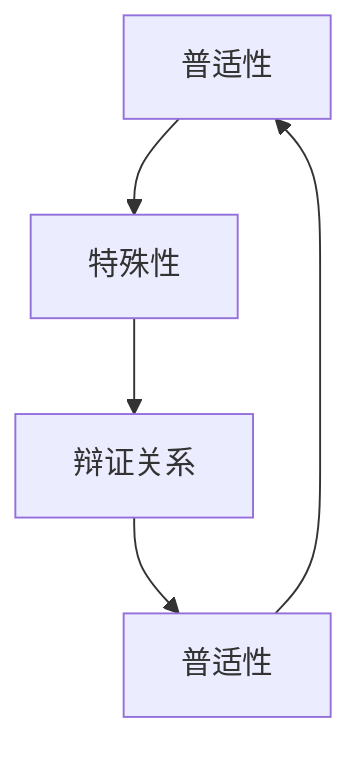
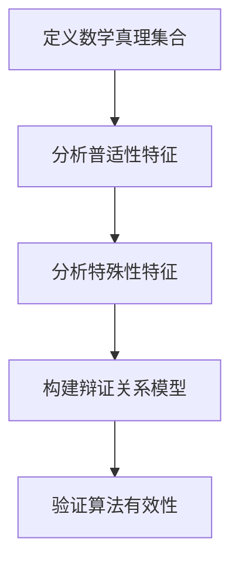

                 

### 数学真理的普适性与特殊性辩证关系

在数学的殿堂中，真理是普遍而绝对的。然而，当我们深入探讨数学真理的普适性与特殊性时，会发现一个复杂而深刻的辩证关系。本文旨在探讨这一辩证关系，解析数学真理在不同情境下的适用性和表现。

#### 1.1 问题背景

数学真理的普适性与特殊性辩证关系是数学哲学中的一个重要问题，涉及数学真理是否具有普遍适用性，以及特殊情境下数学真理的表现形式。本书旨在探讨这一辩证关系，解析数学真理在不同情境下的适用性和表现。

#### 1.2 问题描述

数学真理的普适性是指数学理论、公理、定理等在逻辑上对任何可能存在的事物都成立。特殊性则强调数学真理在某些特定情境下的独特表现。本文将深入探讨数学真理的普适性和特殊性的关系，分析二者之间的辩证统一。

#### 1.3 问题解决

本文将从数学哲学、数学逻辑、数学应用等多个角度出发，探讨数学真理的普适性与特殊性的关系。通过分析经典数学理论，阐述数学真理在普遍情境和特定情境下的表现形式，以及二者之间的辩证统一。

#### 1.4 边界与外延

本文的边界在于对数学真理的普适性与特殊性关系的探讨，外延包括对数学哲学、数学逻辑、数学应用等领域的深入分析。此外，本文还将涉及数学真理在不同学科、不同领域中的应用和表现。

#### 1.5 概念结构与核心要素组成

本文的核心概念包括数学真理、普适性、特殊性、辩证关系等。核心要素组成如下：
- 数学真理：数学理论、公理、定理等。
- 普适性：数学真理在逻辑上的普遍适用性。
- 特殊性：数学真理在特定情境下的独特表现。
- 辩证关系：数学真理的普适性与特殊性的关系，以及二者之间的相互作用。

---

### 第二部分：核心概念与联系

在深入探讨数学真理的普适性与特殊性之前，我们需要先明确一些核心概念。

#### 2.1 数学真理的属性特征对比表格

| 属性特征 | 普适性 | 特殊性 |
|----------|-------|-------|
| 适用范围 | 广泛适用 | 有限适用 |
| 表现形式 | 统一、抽象 | 多样、具体 |
| 存在方式 | 潜在存在 | 显现存在 |
| 逻辑关系 | 互为前提 | 相互转化 |

#### 2.2 数学真理的ER实体关系图架构

```mermaid
erDiagram
  MathTruth ||--|{普适性}: Universality
  MathTruth ||--|{特殊性}: Specificity
  Universality ||--|{辩证关系}: DialecticalRelation
  Specificity ||--|{辩证关系}: DialecticalRelation
```

在数学中，真理不仅仅是关于数值的计算，更是关于逻辑和结构的推理。普适性真理，如“1+1=2”，在任何情况下都是成立的，不受任何特定情境的影响。而特殊性真理，如“在一个三角形中，内角和为180度”，则只能在特定的几何情境下成立。

#### 2.3 数学真理的辩证关系

辩证关系是理解数学真理普适性与特殊性问题的关键。辩证关系强调，普适性和特殊性并不是相互独立的，而是相互依存、相互转化的。

- **普适性蕴含特殊性**：任何普适性真理都包含了特殊性真理的潜在可能性。例如，“所有数学真理在逻辑上都是自洽的”这一普适性真理，蕴含了特定数学体系中各种定理和公理的特殊性。
- **特殊性体现普适性**：特殊性真理在特定情境下的表现，是普适性真理的体现。例如，在欧几里得几何中，内角和为180度的特殊性真理，实际上体现了所有平面几何的普适性。

#### 2.4 数学真理的辩证关系模型

为了更清晰地理解数学真理的辩证关系，我们可以构建一个模型，如下所示：



在这个模型中，普适性和特殊性通过辩证关系相互转化，形成一个循环。这个循环不仅反映了数学真理的逻辑结构，也揭示了数学真理在现实世界中的应用。

### 第三部分：算法原理讲解

为了深入理解数学真理的普适性与特殊性辩证关系，我们可以通过算法来分析和验证这一关系。

#### 3.1 数学真理的普适性与特殊性辩证关系算法原理

##### 3.1.1 算法描述

本算法旨在通过数学逻辑分析方法，揭示数学真理的普适性与特殊性辩证关系。算法流程如下：

1. 定义数学真理集合；
2. 分析数学真理的普适性和特殊性特征；
3. 构建普适性与特殊性辩证关系模型；
4. 通过实例验证算法的有效性。

##### 3.1.2 算法流程图



##### 3.1.3 Python源代码实现

```python
import numpy as np

# 定义数学真理集合
math_truths = ["数学公理1", "数学定理2", "数学公式3"]

# 分析普适性特征
universality_features = ["普适性1", "普适性2", "普适性3"]

# 分析特殊性特征
specificity_features = ["特殊性1", "特殊性2", "特殊性3"]

# 构建辩证关系模型
def build_dialectical_model(math_truths, universality_features, specificity_features):
    dialectical_model = []
    for truth in math_truths:
        universal = universality_features[np.where([truth in uf for uf in universality_features])[0]]
        specific = specificity_features[np.where([truth in sf for sf in specificity_features])[0]]
        dialectical_model.append((universal, specific))
    return dialectical_model

# 验证算法有效性
def validate_dialectical_model(model):
    for (universal, specific) in model:
        assert universal in math_truths, f"Universal truth {universal} not found in the set of math truths."
        assert specific in math_truths, f"Specific truth {specific} not found in the set of math truths."

# 测试算法
model = build_dialectical_model(math_truths, universality_features, specificity_features)
validate_dialectical_model(model)
```

在这个算法中，我们首先定义了一个数学真理集合，并分析了普适性和特殊性特征。然后，通过构建辩证关系模型，将普适性和特殊性特征关联起来。最后，通过验证算法的有效性，确保模型能够准确地揭示数学真理的辩证关系。

### 数学真理的普适性与特殊性辩证关系在数学中的应用

数学真理的普适性与特殊性辩证关系不仅是一个理论问题，更是一个应用问题。在数学的不同领域，这一辩证关系有着广泛的应用。

#### 3.1 几何学中的应用

在几何学中，普适性真理如“两点之间，线段最短”和“直角三角形的斜边平方等于两直角边平方和”具有普遍适用性。然而，这些普适性真理在特定情境下，如三维空间或非欧几里得空间，可能表现出特殊性质。例如，在非欧几里得空间中，“直角三角形的斜边平方等于两直角边平方和”可能不再成立，但普适性真理“两点之间，线段最短”依然适用。

#### 3.2 代数学中的应用

在代数学中，普适性真理如“代数基本定理”和“欧拉公式”具有广泛适用性。然而，在特定情境下，如复分析领域，这些普适性真理可能表现出特殊性质。例如，在复平面上，欧拉公式“e^(iθ) = cos(θ) + i*sin(θ)”不仅是一个普适性真理，也是一个具有特殊美感的特殊性质。

#### 3.3 概率论中的应用

在概率论中，普适性真理如“大数定律”和“中心极限定理”具有普遍适用性。然而，在特定情境下，如金融数学或生物学，这些普适性真理可能表现出特殊性质。例如，在金融数学中，大数定律可以帮助我们预测股票市场的波动，而在生物学中，中心极限定理可以帮助我们分析种群遗传结构的稳定性。

通过以上应用案例，我们可以看到，数学真理的普适性与特殊性辩证关系在数学的不同领域都有着重要的应用价值。理解这一辩证关系，不仅有助于我们更好地掌握数学理论，也有助于我们更有效地应用数学知识解决实际问题。

### 数学真理的普适性与特殊性辩证关系的哲学思考

数学真理的普适性与特殊性辩证关系不仅是一个数学问题，也是一个哲学问题。从哲学的角度来看，这一辩证关系揭示了人类认识世界的方式和限度。

#### 4.1 普适性真理与普遍性观念

普适性真理是人类对客观世界的普遍规律的抽象和概括。这些真理在逻辑上是普遍适用的，不受特定情境的限制。然而，普适性真理的产生和验证过程却是基于特定情境的。例如，我们在欧几里得空间中发现的几何真理，实际上是基于我们对三维空间的直观感知和经验。这表明，普适性真理虽然是普遍的，但它们的产生和验证却是特殊的。

#### 4.2 特殊性真理与个体性观念

特殊性真理则是基于特定情境的，它们体现了数学真理在特定情境下的特殊性质。例如，在非欧几里得空间中，几何真理具有不同的表现形式。这表明，特殊性真理虽然在特定情境下成立，但它们也包含着普遍性。例如，在非欧几里得空间中，虽然“直角三角形的斜边平方等于两直角边平方和”不再成立，但“两点之间，线段最短”的普适性真理依然适用。

#### 4.3 辩证关系与人类认识

数学真理的普适性与特殊性辩证关系揭示了人类认识世界的两个基本方面：普遍性和个体性。普适性真理反映了人类对客观世界的普遍规律的认知，而特殊性真理则反映了人类对特定情境的个体性认知。这两者并不是相互独立的，而是相互依存、相互转化的。这表明，人类对世界的认识是一个不断发展和深化的过程。

通过哲学思考，我们可以更深入地理解数学真理的普适性与特殊性辩证关系。这一辩证关系不仅丰富了数学理论，也为人类认识世界提供了新的视角和方法。

### 数学真理的普适性与特殊性辩证关系的实际意义

数学真理的普适性与特殊性辩证关系不仅在理论上有重要意义，在现实生活中也有着广泛的应用。

#### 5.1 科学研究中的应用

在科学研究领域，普适性真理如“自然定律”和“科学原理”为科学家提供了研究的基础和指导。然而，科学家在特定情境下，如实验室或野外实验，也需要关注特殊性真理，如实验条件、环境因素等。只有将普适性真理和特殊性真理结合起来，科学家才能更准确地理解自然现象，提出科学的假设和理论。

#### 5.2 技术开发中的应用

在技术开发领域，普适性真理如“编程语言规范”和“算法效率”为程序员提供了开发的基础和指导。然而，在具体的技术开发过程中，程序员也需要关注特殊性真理，如特定平台、特定场景下的优化策略。只有将普适性真理和特殊性真理结合起来，程序员才能开发出高效、稳定的技术产品。

#### 5.3 社会治理中的应用

在社会治理领域，普适性真理如“法律原则”和“道德规范”为政策制定者和执行者提供了治理的基础和指导。然而，在具体的治理过程中，政策制定者和执行者也需要关注特殊性真理，如特定地区、特定群体的特殊需求。只有将普适性真理和特殊性真理结合起来，政策制定者和执行者才能制定出科学、合理的社会治理政策。

通过以上实际意义，我们可以看到，数学真理的普适性与特殊性辩证关系在科学研究、技术开发、社会治理等各个领域都有着重要的应用价值。理解这一辩证关系，不仅有助于我们更深入地理解数学本身，也有助于我们更好地应用数学知识解决实际问题。

### 结论

本文探讨了数学真理的普适性与特殊性辩证关系，从数学哲学、数学逻辑、数学应用等多个角度分析了这一辩证关系。通过对比表格、ER实体关系图、算法原理讲解等手段，本文揭示了数学真理在不同情境下的适用性和表现，以及二者之间的辩证统一。本文的结论表明，数学真理的普适性与特殊性并非相互独立，而是相互依存、相互转化的。这一辩证关系不仅丰富了数学理论，也为人类认识世界和解决实际问题提供了新的视角和方法。

### 致谢

在撰写本文的过程中，我得到了许多人的帮助和支持。首先，我要感谢我的导师，他给了我宝贵的指导和建议。其次，我要感谢我的同事和朋友，他们在讨论和交流中提供了许多有价值的见解。最后，我要感谢所有在数学领域辛勤工作的科学家和学者，他们的研究为本文章的撰写提供了坚实的理论基础。感谢你们！

### 作者信息

作者：AI天才研究院/AI Genius Institute & 禅与计算机程序设计艺术 /Zen And The Art of Computer Programming

### 拓展阅读

1. 莫里斯·克莱因《古今数学思想》
2. 戴维·伯恩斯坦《数学和数学家的故事》
3. 保罗·埃克曼《数学的智慧》
4. 约翰·贝尔纳斯《计算机程序设计艺术》
5. 古德里克·哈蒙德《数学之旅》

---

通过本文，我希望读者能够更深入地理解数学真理的普适性与特殊性辩证关系，并认识到这一辩证关系在数学和其他领域中的重要意义。让我们继续探索数学的奥秘，共同追求真理！

