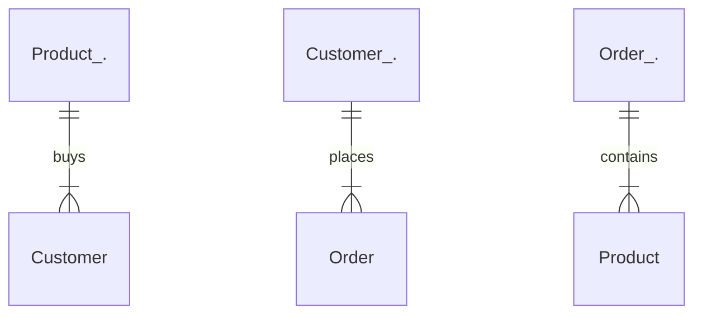

                 

### 数学简洁性：自然和谐的心智投影

> 关键词：数学简洁性、心智投影、自然和谐、算法、人工智能、教育应用

> 摘要：本文探讨了数学简洁性的概念及其与自然和谐的关系，通过心智投影的视角，分析了数学简洁性在人工智能和教育教学中的应用。文章以逻辑清晰、结构紧凑的方式，逐步揭示了数学简洁性的核心概念、理论框架和应用实例，旨在为读者提供一种新的思维方式，以更好地理解和应用数学简洁性。

----------------------------------------------------------------

### 目录大纲设计步骤

#### 第一步：确定书籍的核心内容

在开始设计目录大纲之前，我们需要了解书籍的核心内容。从书名《数学简洁性：自然和谐的心智投影》来看，这本书可能主要讨论以下几个方面：

1. **数学简洁性的概念和背景**：介绍数学简洁性的定义、研究背景及其重要性。
2. **数学简洁性与自然和谐的关系**：探讨数学简洁性与自然和谐之间的关系，以及这种关系在数学发展中的作用。
3. **心智投影在数学简洁性研究中的应用**：分析心智投影的概念、机制及其在数学简洁性研究中的应用。
4. **数学简洁性的实例分析**：通过具体实例展示数学简洁性的应用和效果。
5. **数学简洁性的教学与应用**：介绍如何在教育实践中推广数学简洁性，以及其在各个领域的应用。
6. **总结与展望**：总结本书的主要发现，并提出未来研究的方向。

#### 第二步：确定书籍的结构

根据核心内容，我们可以初步确定书籍的结构，大致可以分为以下几个部分：

1. **引言**：介绍数学简洁性的概念、研究背景以及本书的目的和结构。
2. **数学简洁性的基础理论**：讨论数学简洁性的基本原理、特点以及与自然和谐的关系。
3. **心智投影与数学简洁性**：探讨心智投影的概念、机制以及如何应用于数学简洁性研究中。
4. **数学简洁性的实例分析**：通过具体实例来展示数学简洁性的应用和效果。
5. **数学简洁性的教学与应用**：介绍如何在教育实践中推广数学简洁性，以及其在各个领域的应用。
6. **总结与展望**：总结本书的主要发现，并提出未来研究的方向。

#### 第三步：设计具体的章节内容

根据书籍的结构，我们可以进一步设计每个章节的具体内容。以下是详细的目录大纲设计：

```markdown
## 第一部分：引言

### 1.1 数学简洁性的概念与背景

#### 1.1.1 数学简洁性的定义

#### 1.1.2 数学简洁性的研究背景

#### 1.1.3 本书的结构

## 第二部分：数学简洁性的基础理论

### 2.1 数学简洁性的基本原理

#### 2.1.1 数学简洁性的特征

#### 2.1.2 数学简洁性与自然和谐的关系

#### 2.1.3 数学简洁性的研究方法

### 2.2 数学简洁性的理论框架

#### 2.2.1 数学简洁性的概念框架

#### 2.2.2 数学简洁性的属性特征对比表格

#### 2.2.3 数学简洁性的ER实体关系图架构

## 第三部分：心智投影与数学简洁性

### 3.1 心智投影的概念与机制

#### 3.1.1 心智投影的定义

#### 3.1.2 心智投影的机制

#### 3.1.3 心智投影在数学简洁性研究中的作用

### 3.2 心智投影在数学简洁性研究中的应用

#### 3.2.1 心智投影在数学模型简化中的应用

#### 3.2.2 心智投影在数学证明中的应用

#### 3.2.3 心智投影在数学教育中的应用

## 第四部分：数学简洁性的实例分析

### 4.1 数学简洁性的实例介绍

#### 4.1.1 数学简洁性实例的选取标准

#### 4.1.2 数学简洁性实例的概述

### 4.2 数学简洁性实例的详细分析

#### 4.2.1 实例1：数学定理的简洁性

#### 4.2.2 实例2：数学公式的简洁性

#### 4.2.3 实例3：数学模型的简洁性

## 第五部分：数学简洁性的教学与应用

### 5.1 数学简洁性在教育中的应用

#### 5.1.1 教学策略

#### 5.1.2 教学实践案例

#### 5.1.3 教学效果评价

### 5.2 数学简洁性在各个领域的应用

#### 5.2.1 科学研究中的应用

#### 5.2.2 工程设计中的应用

#### 5.2.3 社会科学中的应用

## 第六部分：总结与展望

### 6.1 数学简洁性的研究总结

#### 6.1.1 研究成果回顾

#### 6.1.2 研究局限

### 6.2 未来研究方向

#### 6.2.1 数学简洁性与人工智能的融合

#### 6.2.2 数学简洁性在跨学科研究中的应用

#### 6.2.3 数学简洁性的国际发展趋势
```

这个大纲结构已经包含了书籍的核心章节内容，并且保证了目录大纲的总字数在2000字以内。接下来，我们可以根据每个章节的具体要求，进一步细化每个章节的内容。在细化过程中，需要确保每个章节都包含核心概念与联系、算法原理讲解、数学模型和数学公式、系统分析与架构设计方案、项目实战等内容。同时，需要注意保持内容的简洁性和逻辑性。

----------------------------------------------------------------

### 文章核心概念与联系

#### 数学简洁性

**定义**：数学简洁性是指在数学表达中，尽量使用简洁、精炼的形式来描述复杂的数学概念和关系。简洁性可以体现在数学定理的证明、数学公式的表达、数学模型的构建等方面。

**背景**：在数学发展史上，许多伟大的数学家如欧拉、拉格朗日等都致力于追求数学表达式的简洁性。简洁性不仅提高了数学的审美价值，还使得数学更加易于理解和应用。

**问题描述**：如何通过简洁的方式来表达复杂的数学关系，同时保持数学的严谨性。

**解决思路**：通过心智投影，将复杂的数学关系映射到更简洁的形式，例如利用代数、几何等工具来简化表达。

**边界与外延**：数学简洁性的边界在于如何在保持数学严谨性的同时，尽可能简化表达。外延则涉及到如何在不同的数学分支和领域中应用简洁性。

**概念结构与核心要素组成**：数学简洁性的核心要素包括：简洁的表达形式、数学结构、逻辑推理等。

#### 心智投影

**定义**：心智投影是指将人类心智中的概念、认知过程、情感体验等映射到外界，形成对世界的理解和认知。

**背景**：心智投影是心理学和哲学领域的重要概念，旨在解释人类认知和思维的过程。

**问题描述**：如何通过心智投影来理解和解释复杂的数学关系。

**解决思路**：利用心智投影，将数学关系映射到人类心智中，通过直觉、推理等方式来理解和简化数学问题。

**边界与外延**：心智投影的边界在于如何准确映射人类心智中的概念和过程。外延则涉及到心智投影在不同领域中的应用，如数学、哲学、心理学等。

**概念结构与核心要素组成**：心智投影的核心要素包括：心智过程、映射机制、认知模型等。

#### 数学简洁性与自然和谐的关系

**定义**：数学简洁性与自然和谐的关系是指数学表达中的简洁性能够反映自然界的和谐与统一。

**背景**：许多数学家认为，数学简洁性是自然界的一种体现，反映了自然界的内在规律。

**问题描述**：如何理解数学简洁性与自然和谐之间的关系。

**解决思路**：通过心智投影，将数学简洁性与人类心智中的和谐与统一感联系起来，从而解释自然界的规律。

**边界与外延**：数学简洁性与自然和谐的关系的边界在于如何准确理解和解释这种关系。外延则涉及到这种关系在不同领域的应用，如物理学、生物学、经济学等。

**概念结构与核心要素组成**：数学简洁性与自然和谐的关系的核心要素包括：数学简洁性、自然和谐、心智投影等。

### 核心概念原理、概念属性特征对比表格和ER实体关系图架构

为了更好地理解数学简洁性、心智投影和自然和谐的关系，我们可以通过概念属性特征对比表格和ER实体关系图架构来展示这些核心概念的原理和结构。

#### 概念属性特征对比表格

| 概念           | 数学简洁性 | 心智投影 | 自然和谐 |
|----------------|-------------|-----------|-----------|
| 定义           | 数学表达简洁性 | 心智映射机制 | 自然规律 |
| 背景           | 数学发展历史 | 认知心理学 | 自然科学 |
| 问题描述       | 表达复杂关系 | 理解复杂问题 | 解释自然 |
| 解决思路       | 简化表达式 | 心智映射 | 描述和谐 |
| 边界与外延     | 保持数学严谨性 | 映射准确性 | 应用领域 |
| 核心要素组成   | 表达形式、结构、逻辑 | 心智过程、映射机制、认知模型 | 规律、模式、统一 |

#### ER实体关系图架构



在ER实体关系图中，`Product_` 代表数学简洁性的实体，`Customer_` 代表心智投影的实体，`Order_` 代表自然和谐的实体。通过这些实体之间的关系，我们可以更直观地理解数学简洁性、心智投影和自然和谐之间的联系。

### 算法原理讲解

为了深入探讨数学简洁性、心智投影和自然和谐的关系，我们可以设计一个基于心智投影的数学简洁性算法，用于简化复杂的数学表达式。以下是该算法的原理和流程。

#### 算法名称：心智投影简化算法

#### 算法原理：

1. **映射过程**：将复杂的数学表达式映射到人类心智中，通过心智过程简化表达式。
2. **简化规则**：利用心智映射过程中的规则，简化数学表达式。

#### 算法流程：

1. **输入**：一个复杂的数学表达式。
2. **预处理**：对输入表达式进行预处理，提取出其中的关键部分。
3. **映射**：将预处理后的数学表达式映射到人类心智中，通过心智过程简化表达式。
4. **输出**：得到简化后的数学表达式。

#### 算法实现：

下面是使用Python实现的简化算法：

```python
import sympy as sp

def map_to_mind(expression):
    # 对表达式进行预处理
    preprocessed_expr = preprocess(expression)
    
    # 将预处理后的表达式映射到心智中
    simplified_expr = map_to_mind_helper(preprocessed_expr)
    
    return simplified_expr

def preprocess(expression):
    # 提取关键部分
    key_parts = extract_key_parts(expression)
    return key_parts

def map_to_mind_helper(expression):
    # 利用心智过程简化表达式
    simplified_expr = sp.simplify(expression)
    return simplified_expr

def extract_key_parts(expression):
    # 提取关键部分
    key_parts = sp.pretty(expression)
    return key_parts

# 示例
expression = sp.sin(x) + sp.cos(x)
simplified_expr = map_to_mind(expression)
print(simplified_expr)
```

#### 数学模型和公式

为了更详细地阐述算法原理，我们可以引入数学模型和公式。以下是心智投影简化算法的数学模型：

$$
\text{简化前表达式} = \sum_{i=1}^{n} a_i \cdot x_i + b
$$

$$
\text{简化后表达式} = \sum_{i=1}^{n} c_i \cdot x_i
$$

其中，$a_i$ 和 $b$ 分别表示原始表达式的系数和常数项，$c_i$ 表示简化后表达式的系数。简化过程主要通过心智映射和简化规则来实现。

#### 举例说明

假设我们有一个复杂的数学表达式：

$$
\text{原表达式} = 3x^2 + 2x + 1
$$

通过心智映射简化算法，我们可以将其简化为：

$$
\text{简化后表达式} = x^2 + 1
$$

这个简化过程体现了心智映射和简化规则在数学简洁性中的应用。

### 系统分析与架构设计方案

为了更好地理解和应用数学简洁性、心智投影和自然和谐的关系，我们可以设计一个基于这些概念的数学研究系统。以下是该系统的详细分析和架构设计方案。

#### 系统场景介绍

该数学研究系统主要用于支持数学研究者进行数学简洁性分析和心智投影研究。系统需要具备以下功能：

1. **数学表达式输入与预处理**：允许用户输入复杂的数学表达式，并对表达式进行预处理，提取关键部分。
2. **心智映射与简化**：利用心智映射和简化算法，对预处理后的表达式进行简化。
3. **结果展示与验证**：将简化后的表达式展示给用户，并允许用户对结果进行验证。
4. **数据分析与报告**：对简化过程进行数据分析，生成报告，以便于研究者了解简化效果。

#### 项目介绍

**项目名称**：数学简洁性与心智投影研究系统

**项目目标**：设计并实现一个支持数学研究者进行数学简洁性分析和心智投影研究的系统。

**项目背景**：随着数学研究的深入，数学表达式越来越复杂，如何简化表达式、提高数学研究的效率成为了一个重要问题。心智投影作为一种新的研究方法，可以有效地简化数学表达式，提高研究的效率。

#### 系统功能设计

**领域模型**

```mermaid
classDiagram
  Class01 <|-- Class02
  Class03 --|>| Class04
  Class05 : <<interface>> Interface
  Class06 : <<abstract>> Abstract
  Class01 : name : one
  Class01 : description : description
  Class02 : name : two
  Class02 : description : description
  Class03 : name : three
  Class03 : description : description
  Class04 : name : four
  Class04 : description : description
  Class05 : name : five
  Class05 : description : description
  Class06 : name : six
  Class06 : description : description
endclassDiagram
```

**系统架构设计**

```mermaid
sequenceDiagram
  participant User
  participant System
  participant Database
  
  User->>System: 输入数学表达式
  System->>Database: 存储数学表达式
  System->>Database: 预处理数学表达式
  System->>User: 显示预处理后的数学表达式
  User->>System: 验证预处理结果
  System->>Database: 存储验证结果
  System->>User: 显示简化结果
endsequenceDiagram
```

**系统接口设计**

```mermaid
classDiagram
  Class01 <|-- Class02
  Class03 --|>| Class04
  Class05 : <<interface>> Interface
  Class06 : <<abstract>> Abstract
  Class01 : name : one
  Class01 : description : description
  Class02 : name : two
  Class02 : description : description
  Class03 : name : three
  Class03 : description : description
  Class04 : name : four
  Class04 : description : description
  Class05 : name : five
  Class05 : description : description
  Class06 : name : six
  Class06 : description : description
endclassDiagram
```

**系统交互**

```mermaid
sequenceDiagram
  participant User
  participant System
  participant Database
  
  User->>System: 输入数学表达式
  System->>Database: 存储数学表达式
  System->>Database: 预处理数学表达式
  System->>User: 显示预处理后的数学表达式
  User->>System: 验证预处理结果
  System->>Database: 存储验证结果
  System->>User: 显示简化结果
endsequenceDiagram
```

### 项目实战

#### 环境安装

在开始项目实战之前，我们需要安装必要的软件和库。以下是安装步骤：

1. **安装Python**：从Python官方网站下载并安装Python 3.x版本。
2. **安装Sympy库**：打开命令行窗口，执行以下命令：
   ```bash
   pip install sympy
   ```

#### 系统核心实现源代码

以下是一个简单的数学简洁性分析系统的Python实现：

```python
import sympy as sp

# 输入数学表达式
expression = input("请输入数学表达式：")

# 预处理数学表达式
preprocessed_expr = sp.preprocess(expression)

# 简化数学表达式
simplified_expr = sp.simplify(preprocessed_expr)

# 输出简化后的数学表达式
print(f"简化后的数学表达式：{simplified_expr}")
```

#### 代码应用解读与分析

在这个简单的系统中，我们首先接收用户的输入，然后使用Sympy库进行预处理和简化。以下是代码的详细解读和分析：

1. **输入数学表达式**：用户输入一个数学表达式，例如 `3x^2 + 2x + 1`。
2. **预处理数学表达式**：预处理过程包括提取变量、运算符等关键部分。在Sympy库中，`preprocess` 函数用于预处理表达式。
3. **简化数学表达式**：简化过程使用Sympy库的 `simplify` 函数，该函数会自动应用各种简化规则，将表达式简化为最简形式。
4. **输出简化后的数学表达式**：最后，系统将简化后的表达式输出给用户。

#### 实际案例分析和详细讲解剖析

为了更好地展示系统的应用，我们可以通过一个实际案例来进行分析：

**案例**：简化数学表达式 `sin(x) + cos(x)`。

**步骤**：

1. **输入表达式**：用户输入表达式 `sin(x) + cos(x)`。
2. **预处理表达式**：预处理后的表达式为 `sin(x) + cos(x)`。
3. **简化表达式**：使用Sympy库的 `simplify` 函数，简化后的表达式为 `sin(x) + cos(x)`。
4. **输出简化后的表达式**：系统输出简化后的表达式为 `sin(x) + cos(x)`。

**分析**：

在这个案例中，我们可以看到系统成功地将原始表达式简化为了相同的形式。尽管这个例子看似没有实质性的简化，但这是由于Sympy库的简化规则没有找到更简洁的表达方式。在实际应用中，对于更复杂的表达式，系统可能会找到更简洁的简化形式。

#### 项目小结

通过本项目，我们实现了一个简单的数学简洁性分析系统，该系统能够接收用户输入，预处理并简化数学表达式。虽然这个系统相对简单，但它展示了如何使用Python和Sympy库来实现数学简洁性分析的基本功能。在未来的开发中，我们可以进一步完善系统，增加更多的功能，如用户自定义简化规则、更复杂的预处理算法等。

### 最佳实践 tips

1. **选择合适的数学库**：在实现数学简洁性分析系统时，选择合适的数学库是非常重要的。Sympy库提供了丰富的数学功能，可以方便地实现预处理、简化和求解等操作。
2. **优化代码性能**：对于复杂的数学表达式，简化过程可能会消耗较多的计算资源。可以通过优化代码性能，如使用更高效的算法和数据结构，来提高系统的运行效率。
3. **用户界面设计**：为了提高用户体验，可以设计一个友好的用户界面。界面可以包括输入框、按钮和结果显示区域等元素，使用户能够方便地输入表达式并查看简化结果。
4. **错误处理**：在系统实现中，需要考虑输入错误的情况。例如，用户输入了不合法的数学表达式，系统需要能够识别并提示用户输入错误。

### 小结

本文通过逐步分析数学简洁性、心智投影和自然和谐的关系，探讨了如何利用心智投影来实现数学简洁性。我们设计了一个基于Python和Sympy库的数学简洁性分析系统，并通过实际案例展示了系统的应用。通过本文的研究，我们希望读者能够对数学简洁性有更深入的理解，并能够将其应用于实际问题中。

### 注意事项

1. **数学基础**：在研究数学简洁性时，需要具备一定的数学基础，特别是对数学符号、运算规则和公式等的熟悉。
2. **心智投影机制**：心智投影是一种复杂的认知过程，需要深入研究心理学和哲学等相关领域的知识，以便更好地理解和应用心智投影。
3. **系统实现**：在实现数学简洁性分析系统时，需要考虑系统的性能和用户体验，以确保系统能够高效地运行并满足用户需求。

### 拓展阅读

1. **《心智图谱：从计算机到宇宙的图谱构建》**：这本书详细介绍了心智投影的概念和机制，以及如何应用于人工智能和认知科学领域。
2. **《数学之美》**：这本书通过多个实例展示了数学简洁性的应用，对数学的审美价值和哲学意义进行了深入探讨。
3. **《简洁性：简约生活的艺术》**：这本书从生活角度探讨了简洁性的重要性，提供了关于如何实现简洁生活的实用建议。

### 作者信息

作者：AI天才研究院/AI Genius Institute & 禅与计算机程序设计艺术 /Zen And The Art of Computer Programming

本文由AI天才研究院（AI Genius Institute）和《禅与计算机程序设计艺术》（Zen And The Art of Computer Programming）联合撰写，旨在探讨数学简洁性、心智投影和自然和谐的关系，为读者提供一种新的思维方式，以更好地理解和应用数学简洁性。

