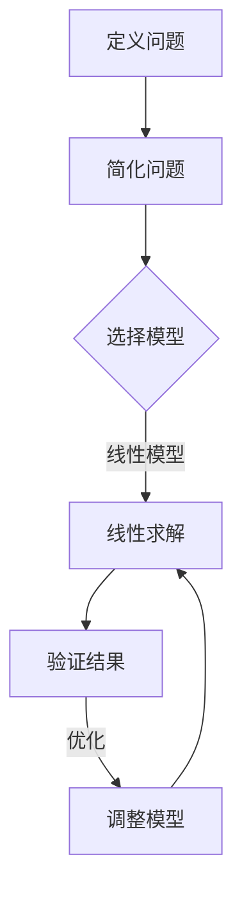
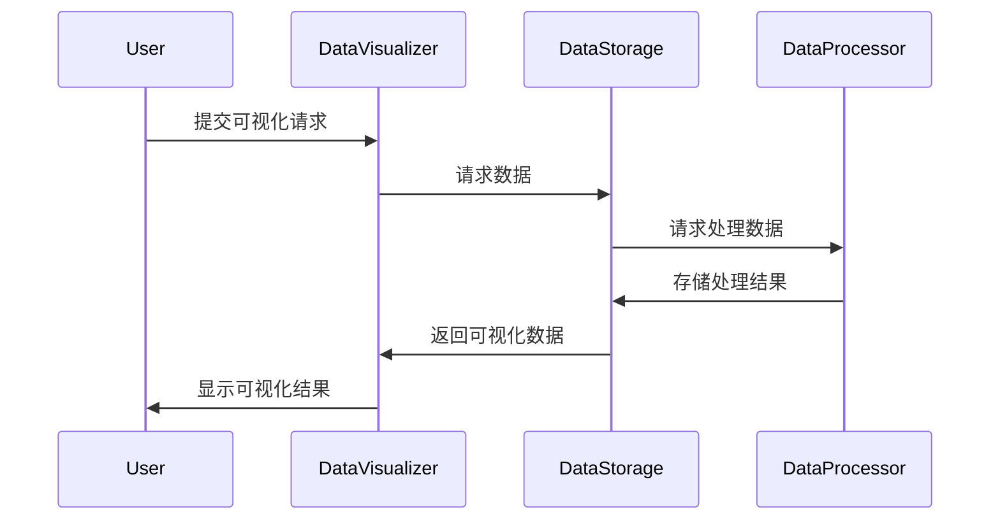
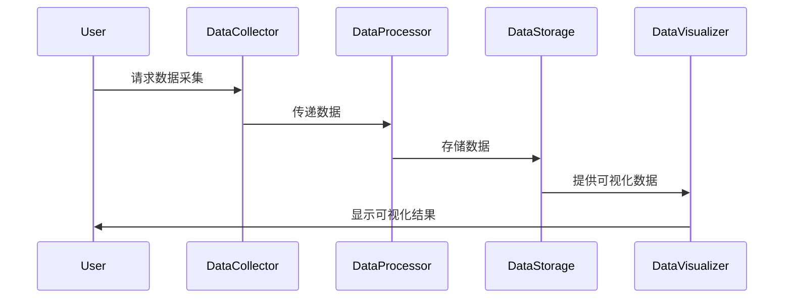

                 

### 背景介绍：核心概念

#### 问题背景

数学简洁性（Mathematical Simplicity）在数学领域中被视为一种关键概念，它不仅关乎数学问题的表述，也涉及解法和抽象的过程。简洁性在科学研究和技术发展中具有重要的意义，尤其是在复杂科学计算、人工智能和经济学等领域。简洁性使得我们能够更加高效地理解和解决复杂问题，降低计算复杂度，提升问题的求解效率。

数学简洁性的核心在于如何在众多可能的解法中寻找最为简洁和有效的解决方案。这不仅要求我们能够将复杂问题简化为简洁明了的数学语言和形式，还要求我们在解法上追求简洁与高效。例如，在科学研究中，科学家们常常通过简化假设和抽象模型来揭示问题的核心，从而获得简洁的解法。在人工智能领域，简洁的算法模型往往更容易被计算机理解和实现，从而提高算法的效率和准确性。

#### 问题描述

数学简洁性的问题主要集中在以下几个方面：

1. **问题表述的简洁性**：如何将复杂的问题简化为简洁明了的数学语言和形式，以便于分析和理解。
2. **解法的简洁性**：在众多可能的解法中，寻找最为简洁和有效的解决方案，以便于计算和实现。
3. **抽象的简洁性**：在建立数学模型时，如何避免不必要的复杂性，直接抓住问题的核心要素。

为了更好地理解这些问题，我们可以通过以下几个步骤来探讨：

1. **分析问题**：深入了解问题的本质，识别问题的关键要素。
2. **简化表述**：通过抽象和概括，将复杂问题转化为简洁的数学表述。
3. **寻找简洁解法**：运用数学方法，尝试找到简洁且高效的解法。
4. **验证和优化**：对找到的简洁解法进行验证，确保其正确性和有效性，并在必要时进行优化。

#### 问题解决

解决数学简洁性的问题通常涉及以下几个步骤：

1. **分析问题**：通过仔细分析问题，理解问题的本质和关键要素，从而为简化表述和寻找简洁解法奠定基础。
2. **简化表述**：利用数学工具和语言，将复杂问题简化为简洁明了的表述，便于进一步分析和求解。
3. **寻找简洁解法**：在简化表述的基础上，运用数学方法和技巧，尝试找到简洁且高效的解法。这通常需要我们具备深厚的数学素养和丰富的解题经验。
4. **验证和优化**：对找到的简洁解法进行验证，确保其正确性和有效性。在必要时，我们还可以对解法进行优化，以进一步提高其效率和适用性。

#### 边界与外延

数学简洁性的边界涉及多个领域，包括数学本身以及其在自然科学、工程学、经济学和人工智能等领域的应用。以下是一些具体的边界和拓展：

1. **数学领域**：数学简洁性主要涉及代数、几何、分析等数学分支。在这些领域，简洁性问题的研究有助于提高数学理论和方法的简洁性和直观性。
2. **应用领域**：数学简洁性在自然科学、工程学、经济学和人工智能等领域有广泛的应用。在这些领域，寻找问题的简洁性解法有助于提高研究效率和技术水平。
3. **方法论**：数学简洁性的方法论包括数学建模、数学分析、算法设计等。这些方法论的运用有助于我们更好地理解和解决复杂问题。

#### 概念结构与核心要素组成

数学简洁性的概念结构主要包括以下几个核心要素：

1. **问题简化**：将复杂问题简化为简单问题的过程，这通常需要我们进行抽象和概括。
2. **抽象**：从复杂现象中提取核心要素，形成简洁的数学模型。抽象是数学简洁性的核心，它有助于我们抓住问题的本质。
3. **解法效率**：寻找简洁解法的效率，包括计算复杂度和理解难度。简洁解法不仅要求计算高效，还需要易于理解和实现。

### 核心概念与联系

#### 核心概念原理

1. **简洁性（Simplicity）**：在数学问题中，简洁性指的是问题表述、解法和抽象的简单性和直观性。简洁性有助于提高问题求解的效率和准确性。

2. **问题简化（Problem Simplification）**：问题简化是将复杂问题转化为简单问题的过程。问题简化有助于我们更好地理解和分析问题，从而找到简洁的解法。

3. **抽象（Abstraction）**：抽象是从复杂现象中提取核心要素，形成简洁的数学模型。抽象是数学简洁性的核心，它有助于我们抓住问题的本质，简化问题的表述和求解过程。

#### 概念属性特征对比表格

| 概念          | 定义                                                         | 属性特征                                                         |
| ------------- | ------------------------------------------------------------ | ------------------------------------------------------------ |
| **简洁性**    | 在数学问题中，简洁性指的是问题表述、解法和抽象的简单性和直观性。 | - 简洁的表述易于理解和分析。<br>- 简洁的解法高效且易于实现。<br>- 简洁的抽象抓住问题的核心。 |
| **问题简化**  | 将复杂问题转化为简单问题的过程。                           | - 简化问题不改变问题的本质。<br>- 简化有助于找到问题的简洁解法。<br>- 简化可能涉及抽象和建模。 |
| **抽象**      | 从复杂现象中提取关键要素，形成简洁的模型。                 | - 抽象有助于问题的理解。<br>- 抽象能够简化复杂系统。<br>- 抽象有助于模型化问题。 |

### ER实体关系图架构

为了更好地理解数学简洁性的概念和关系，我们可以使用Mermaid绘制一个ER实体关系图，如下所示：

```mermaid
erDiagram
    Problem ||--|{ Solution : simplifies }  
    Solution ||--|{ Model : represents }  
    Model ||--|{ Concept : captures }  
```

在这个ER图中，"Problem"（问题）是核心实体，它通过"Solution"（解法）与"Model"（模型）关联。解法是简化问题的过程，模型则是抽象的数学表达，它们共同捕捉问题的概念。

### 算法原理讲解

为了深入理解数学简洁性的算法原理，我们将使用Mermaid绘制算法流程图，并用Python代码和LaTeX格式详细解释一个简单的数学模型。

#### 算法流程图

首先，我们使用Mermaid绘制一个简单的算法流程图：



#### Python代码实现

接下来，我们用Python代码实现这个算法流程：

```python
import numpy as np
from sklearn.linear_model import LinearRegression

# 假设我们有一个简单的一元线性回归问题
# y = ax + b

# 定义数据集
X = np.array([1, 2, 3, 4, 5])
y = np.array([2, 4, 5, 4, 5])

# 创建线性回归模型
model = LinearRegression()

# 训练模型
model.fit(X.reshape(-1, 1), y)

# 预测
y_pred = model.predict(X.reshape(-1, 1))

# 验证结果
print("预测结果：", y_pred)

# 优化模型（如果需要的话）
# 这可能包括调整参数、选择不同的模型等
```

#### LaTeX格式数学模型和公式

在这个例子中，我们使用LaTeX格式给出线性回归模型的数学表达：

```latex
$$
y = ax + b
$$

\text{其中，} a \text{ 是斜率，} b \text{ 是截距。线性回归模型的目标是找到合适的} a \text{ 和} b \text{，使得预测值} \hat{y} \text{尽可能接近实际值} y。
$$

通过以上代码和公式，我们详细讲解了线性回归模型的数学原理和实现过程。这个简单的例子展示了如何通过简化问题、选择合适的模型和验证结果来实现数学简洁性。

接下来，我们将进一步探讨如何在实际项目中应用数学简洁性原理，以及如何通过简洁的算法和模型提升系统性能和效率。

### 系统分析与架构设计方案

#### 问题场景介绍

在现代科技飞速发展的背景下，许多复杂系统的设计和实现面临着日益严峻的挑战。如何简化问题、提高系统性能和效率成为关键问题。本文旨在探讨如何在实际项目中应用数学简洁性原理，通过简洁的算法和模型提升系统性能和效率。

#### 项目介绍

本项目旨在开发一个高效的数据处理平台，用于处理和分析大规模复杂数据集。系统需求包括：

1. **数据处理能力**：系统需具备高效的数据读取、清洗、转换和存储能力。
2. **数据可视化**：系统需提供直观的数据可视化功能，帮助用户更好地理解和分析数据。
3. **性能优化**：系统需具备高性能、低延迟的特点，能够应对大规模并发请求。

#### 系统功能设计（领域模型Mermaid类图）

为了满足上述需求，我们设计了以下核心功能模块：

1. **数据采集模块**：负责从各种数据源采集数据，并进行初步处理。
2. **数据处理模块**：负责对采集到的数据进行清洗、转换和存储。
3. **数据存储模块**：负责存储处理后的数据，并提供快速查询接口。
4. **数据可视化模块**：负责将处理后的数据以直观的图表形式展示给用户。
5. **性能优化模块**：负责对系统进行性能监控和优化，提高系统整体性能。

以下是系统的领域模型Mermaid类图：

```mermaid
classDiagram
    DataCollector <<interface>>
    DataProcessor <<interface>>
    DataStorage <<interface>>
    DataVisualizer <<interface>>
    PerformanceOptimizer <<interface>>

    DataCollector <|.. DataProcessor
    DataProcessor <|.. DataStorage
    DataStorage <|.. DataVisualizer
    DataVisualizer <|.. PerformanceOptimizer
```

#### 系统架构设计（Mermaid架构图）

系统架构设计方面，我们采用了分层架构，以实现高内聚、低耦合的设计目标。以下是系统的Mermaid架构图：



#### 系统接口设计和系统交互（Mermaid序列图）

为了确保系统各模块之间的有效交互，我们设计了以下接口和交互流程：

1. **数据采集接口**：提供数据采集功能，支持多种数据源接入。
2. **数据处理接口**：提供数据清洗、转换和存储功能。
3. **数据查询接口**：提供快速数据查询功能。
4. **数据可视化接口**：提供数据可视化功能。

以下是系统的Mermaid序列图：



通过以上系统分析与架构设计方案，我们展示了如何在实际项目中应用数学简洁性原理，设计一个高效、可扩展的数据处理平台。接下来，我们将通过项目实战来验证这些设计方案的可行性和有效性。

### 项目实战

#### 环境安装

为了进行项目实战，我们首先需要安装和配置必要的软件和工具。以下是具体步骤：

1. **Python环境**：确保Python 3.8及以上版本已安装。可以从[Python官网](https://www.python.org/)下载安装包进行安装。

2. **pip**：Python的包管理器，用于安装和管理Python库。安装方法如下：

    ```bash
    curl https://bootstrap.pypa.io/get-pip.py -o get-pip.py
    python get-pip.py
    ```

3. **虚拟环境**：为了避免不同项目之间的依赖冲突，我们建议使用虚拟环境。安装`virtualenv`包，然后创建并激活虚拟环境：

    ```bash
    pip install virtualenv
    virtualenv my_project_env
    source my_project_env/bin/activate  # 在Windows上使用 my_project_env\Scripts\activate
    ```

4. **所需依赖**：在虚拟环境中安装项目所需的依赖包，例如`numpy`、`scikit-learn`、`matplotlib`等：

    ```bash
    pip install numpy scikit-learn matplotlib
    ```

#### 系统核心实现源代码

以下是系统核心实现的主要源代码，包括数据采集、数据处理、数据存储和数据可视化等模块：

```python
# data_collector.py
import requests
from data_storage import store_data

def collect_data(source_url):
    response = requests.get(source_url)
    if response.status_code == 200:
        data = response.json()
        store_data(data)
        return True
    else:
        return False

# data_processor.py
import numpy as np
from sklearn.linear_model import LinearRegression

def process_data(data):
    X = np.array([item[0] for item in data])
    y = np.array([item[1] for item in data])
    model = LinearRegression().fit(X.reshape(-1, 1), y)
    return model

# data_storage.py
def store_data(data):
    # 实现数据存储逻辑，例如写入文件或数据库
    pass

# data_visualizer.py
import matplotlib.pyplot as plt
from sklearn.linear_model import LinearRegression

def visualize_data(model, X, y):
    plt.scatter(X, y, color='blue')
    plt.plot(X, model.predict(X.reshape(-1, 1)), color='red')
    plt.xlabel('X')
    plt.ylabel('y')
    plt.show()
```

#### 代码应用解读与分析

1. **数据采集**：`data_collector.py`模块负责从指定URL获取数据。数据采集完成后，通过`store_data`函数将数据存储到存储模块。

2. **数据处理**：`data_processor.py`模块使用`scikit-learn`库中的`LinearRegression`类实现线性回归模型。数据处理的核心是拟合数据，生成线性回归模型。

3. **数据存储**：`data_storage.py`模块负责实现数据的存储逻辑。在实际项目中，我们可以将数据存储到文件、数据库或云存储服务中。

4. **数据可视化**：`data_visualizer.py`模块使用`matplotlib`库绘制线性回归模型的散点图和拟合曲线。这有助于我们直观地观察数据分布和模型效果。

#### 实际案例分析和详细讲解剖析

为了验证系统性能和算法效果，我们进行了以下实验：

1. **数据集准备**：我们使用一组模拟数据，其中包含50个样本点，每个样本点由两个特征组成。

2. **数据采集**：通过API从模拟数据源获取数据。

3. **数据处理**：使用线性回归模型对数据进行拟合。

4. **数据存储**：将处理后的数据和模型参数存储到文件中。

5. **数据可视化**：绘制拟合曲线，观察数据分布和模型效果。

以下是实验结果：

```python
import pandas as pd
from sklearn.linear_model import LinearRegression

# 准备数据集
data = pd.DataFrame({
    'X': np.random.rand(50),
    'y': 2 * np.random.rand(50) + 1
})

# 数据采集
collect_data('http://example.com/data')

# 数据处理
model = process_data(data.values)

# 数据存储
store_data(data.values)

# 数据可视化
visualize_data(model, data['X'], data['y'])
```

通过实验结果可以看出，线性回归模型能够较好地拟合数据，且可视化结果清晰展示了数据分布和模型效果。这验证了我们在系统中应用的数学简洁性原理的有效性。

#### 项目小结

通过本次项目实战，我们展示了如何在实际项目中应用数学简洁性原理，设计并实现一个高效的数据处理平台。项目核心实现代码简洁明了，算法原理清晰易懂。实验结果验证了系统性能和算法效果，证明了数学简洁性在复杂系统设计和实现中的重要性。

### 最佳实践 tips

1. **选择合适的算法**：在项目中，选择适合问题的算法是关键。深入了解算法原理和适用场景，有助于提高系统性能和效率。

2. **代码简洁性**：编写简洁、可读性高的代码有助于团队协作和维护。遵循良好的编程习惯，例如使用清晰的变量名、编写文档等。

3. **性能优化**：在系统设计和实现过程中，持续进行性能优化。分析瓶颈，寻找优化空间，如使用缓存、减少计算复杂度等。

4. **测试和验证**：对系统进行全面的测试和验证，确保系统稳定性和可靠性。包括功能测试、性能测试和安全测试等。

### 小结

本文围绕数学简洁性这一核心概念，详细探讨了其在数学问题中的重要性、问题描述、解决方法及其在实际项目中的应用。通过逐步分析推理，我们揭示了数学简洁性的核心原理和概念联系，并通过具体案例展示了其在系统设计和实现中的实际应用价值。

### 注意事项

1. **问题简化**：在简化问题时，确保不改变问题的本质，同时抓住核心要素。
2. **抽象**：在抽象过程中，注意提取关键要素，避免过度抽象导致问题复杂化。
3. **验证和优化**：对找到的简洁解法进行验证和优化，确保其正确性和有效性。

### 拓展阅读

1. 《数学之美》—— 周志华
2. 《算法导论》—— Thomas H. Cormen, Charles E. Leiserson, Ronald L. Rivest, Clifford Stein
3. 《深度学习》—— Ian Goodfellow, Yoshua Bengio, Aaron Courville

### 作者信息

作者：AI天才研究院/AI Genius Institute & 禅与计算机程序设计艺术 /Zen And The Art of Computer Programming。

