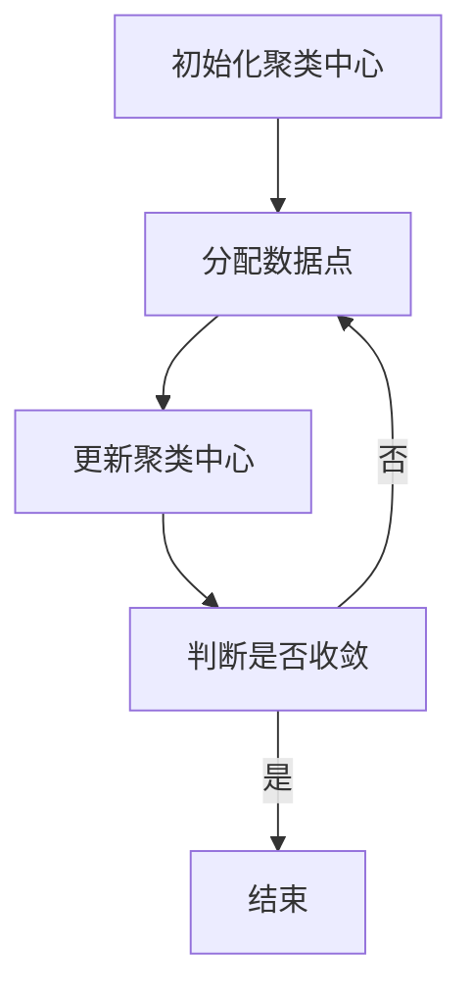
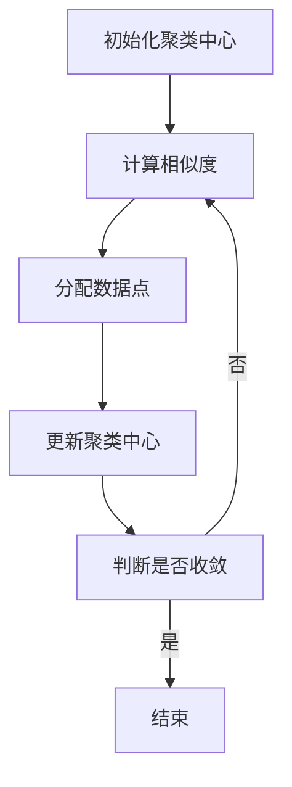
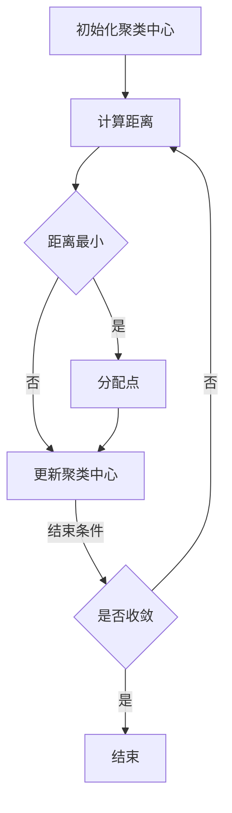
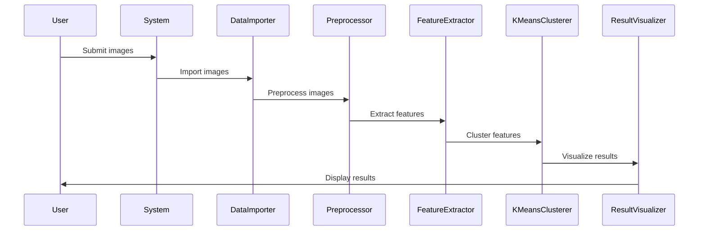

                 

## 引言和背景介绍

### 1.1 数学简约性的概念与重要性

数学简约性是指数学表达或模型在形式和结构上的简洁性，即在保持足够表达能力和解释力的同时，尽量减少公式、方程、符号和概念的复杂性。这种简约性不仅使数学理论更加直观易懂，也有助于提高计算效率和解决问题时的准确性。

在自然科学中，简约性是科学研究中的一个基本原则。比如，物理学的标准模型通过极其简单的方程和理论框架，成功地解释了宇宙中大量现象。在生物学中，遗传密码的简约性使得复杂生命体系得以通过简单的规则进行复制和进化。在化学中，元素周期表通过简约的方式展示了原子结构的规律性。

在人文科学中，简约性同样具有重要地位。文学创作中的简洁性能够增强表达效果，使作品更具感染力。艺术设计中，简约的美学原则被视为追求高品位和艺术价值的重要途径。甚至在社会科学研究中，简约的模型和理论也能够帮助我们更好地理解和预测复杂的社会现象。

### 1.2 数学简约性的应用

数学简约性的应用范围非常广泛，几乎涵盖了所有自然科学和人文科学领域。以下是几个具体应用实例：

1. **物理学**：爱因斯坦的相对论方程式 `$E=mc^2$` 以其简洁性揭示了能量和质量的等价性。傅立叶变换 `$F(\omega) = \int_{-\infty}^{\infty} f(t) e^{-j\omega t} dt$` 是信号处理中的基本工具，通过将复杂信号分解为简单频率成分，极大地简化了信号分析的过程。

2. **生物学**：遗传学中的简约性体现在基因序列的简单编码机制上。每个基因对应一段特定的核苷酸序列，通过这些简单的编码规则，生物体能够生成复杂的蛋白质结构。

3. **经济学**：经济学中的简约模型，如供需模型，通过几个简单的方程和假设，解释了市场行为和市场机制。

4. **计算机科学**：算法设计中的简约性原则被广泛应用于优化问题和数据结构设计。例如，快速排序算法以其简洁高效的设计，成为计算机科学中的经典。

5. **文学和艺术**：文学中的简约性原则强调“少即是多”，通过简洁的语言和结构，传达深刻的思想和情感。艺术设计中，简约的设计往往能够产生出人意料的视觉效果。

### 1.3 数学简约性的核心概念与联系

为了深入理解数学简约性，我们需要探讨其核心概念、属性和特点，并与其他相关概念进行比较。在本章节中，我们将介绍简约性的定义、属性、特点，并通过实体关系图（ER图）展示其涉及的主要实体和关系。

### 1.3.1 简约性的定义

简约性是指数学表达或模型在形式和结构上的简洁性。它不仅涉及符号和公式的数量，还包括逻辑结构的紧凑性和直观性。一个简约的数学模型应当能够有效地表达复杂现象，同时尽量减少不必要的元素。

### 1.3.2 简约性的属性和特点

简约性的主要属性和特点包括：

- **简洁性**：数学模型或公式应该尽量简洁，避免冗余。
- **通用性**：一个简约的模型应当具有广泛的适用性，能够解释不同领域中的现象。
- **直观性**：数学模型应当能够直观地展示其背后的物理或抽象原理。

### 1.3.3 简约性与复杂性的比较

复杂性是指系统或模型中的元素数量、关系和相互作用程度的量度。简约性则试图通过减少这些元素和关系来简化模型。两者之间的区别和联系如下：

- **区别**：复杂性关注系统的多样性和相互作用，而简约性强调简化系统的表达。
- **联系**：在科学研究中，简约性往往是处理复杂性的有效手段。通过简约性，我们能够更好地理解和预测复杂系统的行为。

### 1.3.4 简约性与对称性、和谐性的联系

对称性是数学和物理学中的一个基本概念，指的是系统在某种变换下保持不变的性质。和谐性则涉及系统各部分之间的协调和一致性。简约性、对称性和和谐性之间的关系如下：

- **对称性与简约性**：对称性有助于简化数学模型，因为它提供了不变性和简单化的可能性。
- **和谐性与简约性**：和谐性强调了系统内部各部分之间的协调，这种协调往往能够简化系统的整体结构。

### 1.3.5 数学简约性的ER实体关系图

为了更直观地展示数学简约性的核心概念和实体关系，我们可以使用Mermaid绘制ER图。以下是一个简约性ER图的示例：

```mermaid
erDiagram
    Entity A
    Entity B
    Entity C
    Entity A ||--|{ Entity B : hasAttribute }
    Entity B ||--|{ Entity C : isSubset }
```

在这个ER图中，`Entity A`、`Entity B` 和 `Entity C` 代表数学简约性涉及的主要实体。它们之间存在明确的关联，这些关联反映了简约性在数学模型中的作用。

通过上述分析，我们可以看到数学简约性是一个多维度的概念，它在不同领域中具有广泛的应用。理解简约性的定义、属性和特点，有助于我们更好地应用这一原则，简化复杂问题，提高研究和解决问题的效率。

## 2.1 数学简约性的核心概念

### 2.1.1 简约性的定义

简约性是数学表达或模型在形式和结构上的简洁性。这种简洁性不仅涉及符号和公式的数量，还包括逻辑结构的紧凑性和直观性。一个简约的数学模型应当能够有效地表达复杂现象，同时尽量减少不必要的元素。在数学中，简约性通常与通用性和直观性相关联，即一个简约的模型应当具有广泛的适用性，并且能够直观地展示其背后的物理或抽象原理。

### 2.1.2 简约性的属性

简约性具有以下几个关键属性：

1. **简洁性**：简约性的核心是简洁性，即数学模型或公式应该尽量简洁，避免冗余。简洁性不仅使得数学表达更加直观易懂，还有助于减少计算错误和提高计算效率。

2. **通用性**：一个简约的数学模型应当具有广泛的适用性，能够解释不同领域中的现象。这种通用性使得简约性成为跨学科研究中的重要工具。

3. **直观性**：简约的数学模型应当能够直观地展示其背后的物理或抽象原理。直观性有助于加深对数学概念的理解，提高模型的解释力。

4. **高效性**：在计算中，简约性有助于提高算法的效率和速度。通过减少计算步骤和简化计算过程，简约性能够显著降低计算时间和资源消耗。

### 2.1.3 简约性的特点

简约性的特点主要体现在以下几个方面：

1. **少即是多**：简约性强调用最少的元素和关系来表达复杂系统，但这并不意味着简单。相反，通过精简表达，我们能够抓住系统的核心特征，从而实现更深刻的理解。

2. **结构紧凑**：简约的数学模型通常具有紧凑的结构，这意味着它们的组成部分之间具有高度的相关性和一致性。这种结构紧凑性使得模型更加稳定和可靠。

3. **可扩展性**：简约的数学模型往往具有很好的可扩展性，即通过增加少量元素，可以轻松扩展模型以适应新的现象或领域。

4. **易维护性**：简约性使得数学模型更加易于维护和更新。在模型发生变化时，简约的结构有助于快速识别和修正错误，从而提高模型的稳定性。

### 2.1.4 简约性的分类

根据简约性的应用场景和目标，可以将简约性分为以下几类：

1. **形式简约性**：这种简约性关注数学表达的形式，通过减少符号和公式的数量来简化模型。例如，使用因式分解或合并同类项来简化代数表达式。

2. **内容简约性**：这种简约性关注数学表达的内容，通过减少模型的复杂性和冗余性来实现。例如，使用傅立叶变换或泰勒展开来简化复杂函数的表达。

3. **算法简约性**：这种简约性关注计算过程中的算法效率，通过优化算法步骤来减少计算复杂度。例如，使用快速排序或分治算法来简化数据处理。

4. **结构简约性**：这种简约性关注系统的结构设计，通过减少组件数量和交互关系来简化系统。例如，在软件工程中，使用模块化设计来降低系统的复杂性。

通过理解简约性的定义、属性和特点，我们可以更好地应用这一原则，简化复杂问题，提高研究和解决问题的效率。

### 2.2 简约性与复杂性的比较

在数学和科学研究中，简约性和复杂性是两个核心概念，它们既有区别又有联系。理解这两个概念之间的关系有助于我们更好地应用简约性原则，处理复杂问题。

#### 2.2.1 复杂性的定义

复杂性是指系统或模型中的元素数量、关系和相互作用程度的量度。复杂性可以表现为多个层次，从简单的线性系统到高度非线性、多变量的复杂系统。在复杂性科学中，复杂性通常与系统的多样性和动态行为相关联。复杂性研究关注的是如何理解和预测复杂系统的行为，以及如何简化这些系统的模型。

#### 2.2.2 简约性与复杂性的区别

1. **概念层次**：简约性关注的是数学表达或模型的形式和结构，而复杂性则关注系统或模型中的元素数量和关系。简约性试图通过减少不必要的元素和关系来简化模型，而复杂性则试图理解和量化系统的复杂程度。

2. **目标不同**：简约性的目标是简化模型，使其更加直观和易于理解。复杂性则旨在研究系统的多样性和动态行为，以及系统如何从简单的初始状态演化成复杂结构。

3. **应用场景**：简约性在跨学科研究中具有广泛应用，如物理学、生物学、经济学和计算机科学等领域。复杂性研究则通常关注特定领域中的复杂系统，如生态系统、金融市场和社交网络。

#### 2.2.3 简约性与复杂性的联系

1. **互补性**：简约性和复杂性是互补的概念。在处理复杂系统时，我们可以通过简约性来简化模型，从而更好地理解和预测系统的行为。同时，复杂性研究为我们提供了工具和方法，使我们能够识别和理解系统中的关键要素和相互作用。

2. **层次结构**：在复杂系统中，不同层次的复杂性可以通过简约性原则进行分层处理。例如，在生物学中，我们可以通过简化细胞模型来理解生物体的基本功能，而在更高层次上，我们可以通过研究生态系统来理解生物多样性和生态平衡。

3. **跨学科应用**：简约性和复杂性研究在跨学科应用中具有广泛的前景。例如，在经济学中，我们可以使用简约的经济模型来分析市场行为，而在物理学中，我们可以使用复杂系统理论来研究量子力学中的不确定性原理。

#### 2.2.4 简约性与复杂性的对比表格

为了更直观地展示简约性和复杂性的区别和联系，我们可以通过以下表格进行对比：

| 概念       | 简约性                           | 复杂性                           |
|------------|----------------------------------|----------------------------------|
| 定义       | 数学表达或模型的简洁性           | 系统或模型中的元素数量和关系       |
| 目标       | 简化模型，使其更加直观和易于理解 | 理解和预测复杂系统的行为           |
| 应用场景   | 跨学科研究，如物理学、生物学、经济学 | 特定领域中的复杂系统，如生态系统、金融市场 |
| 补充关系   | 通过简约性简化复杂系统           | 复杂性研究提供工具和方法          |
| 层次结构   | 分层处理复杂系统                 | 识别和理解系统中的关键要素和相互作用 |

通过以上分析，我们可以看到简约性和复杂性是两个相互补充的概念。在处理复杂问题时，我们可以通过简约性来简化模型，提高理解和预测的效率。同时，复杂性研究为我们提供了丰富的工具和方法，帮助我们更好地理解和应对复杂系统的挑战。

### 2.3 简约性与对称性、和谐性的联系

在数学和科学中，简约性、对称性和和谐性是三个重要的概念，它们相互联系，共同构成了科学研究中的核心原则。理解这三者之间的联系，有助于我们更深入地应用简约性原则，设计出更加高效和直观的数学模型。

#### 2.3.1 对称性的定义

对称性是数学和物理学中的一个基本概念，指的是系统在某种变换下保持不变的性质。对称性可以表现为多种形式，包括几何对称性、变换对称性和功能对称性。在数学中，对称性常常与群论和群表示论相关联；在物理学中，对称性是基本力和粒子性质的基础。

#### 2.3.2 简约性与对称性的联系

对称性有助于简化数学模型，因为它提供了不变性和简单化的可能性。以下是一些具体的联系：

1. **不变性**：对称性保证了在特定变换下系统的属性保持不变，这使得我们可以通过研究对称性来简化模型。例如，在量子力学中，对称性原理（如宇称守恒、角动量守恒等）可以简化粒子的状态描述。

2. **对称性变换**：通过对称性变换，我们可以将复杂的系统转化为更简单的形式。例如，在经典力学中，通过对称性变换可以将复杂的二维问题简化为一维问题，从而更容易求解。

3. **简约性**：对称性有助于减少数学表达中的冗余，提高模型的简洁性。例如，在热力学中，通过对称性原理可以将复杂的自由能函数简化为简单的形式，从而更直观地理解系统的热力学性质。

#### 2.3.3 和谐性的定义

和谐性涉及系统各部分之间的协调和一致性。在数学和科学中，和谐性通常与系统的稳定性和协同效应相关联。和谐性强调系统内部各部分之间的相互关系，使得系统能够在一个统一框架内稳定运作。

#### 2.3.4 简约性与和谐性的联系

和谐性有助于简化系统结构，使其更加紧凑和高效。以下是一些具体的联系：

1. **内部协调**：和谐性强调系统内部各部分之间的协调关系，使得系统的整体性能最大化。例如，在建筑设计中，通过合理的结构布局和材料选择，可以实现建筑物的和谐与稳定。

2. **简化设计**：和谐性有助于简化系统的设计过程，通过减少不必要的复杂性和冗余，提高系统的效率和可靠性。例如，在软件开发中，通过模块化设计和代码优化，可以实现软件的和谐性和高效性。

3. **稳定性**：和谐性有助于提高系统的稳定性，减少系统的波动和不确定性。例如，在生态系统研究中，通过维持生物多样性和生态平衡，可以保持生态系统的和谐与稳定。

#### 2.3.5 简约性、对称性和和谐性的综合应用

在实际应用中，简约性、对称性和和谐性常常综合应用，以设计出高效和直观的数学模型。以下是一些综合应用的实例：

1. **量子场论**：在量子场论中，通过对称性原理（如洛伦兹不变性）和简约性原则（如对称性破缺），科学家们成功地建立了描述基本粒子和相互作用的理论框架。

2. **生态学**：在生态学中，通过研究生物种群之间的和谐关系（如食物链和竞争关系），科学家们可以预测生态系统的稳定性和动态变化。

3. **计算机科学**：在计算机科学中，通过对称性和简约性原则（如密码学中的对称加密算法），可以设计出高效和安全的数据加密方案。

通过理解简约性、对称性和和谐性的联系，我们可以更深入地应用这些原则，设计出更加高效和直观的数学模型。这些原则不仅在理论研究中具有重要意义，也在实际应用中发挥着关键作用。

### 2.4 数学简约性的ER实体关系图

为了更直观地展示数学简约性的核心概念和实体关系，我们可以使用Mermaid绘制ER图。ER图（实体关系图）是数据库设计和系统架构设计中常用的工具，用于表示实体及其之间的关系。以下是一个简约性ER图的示例：

```mermaid
erDiagram
    Entity MathModel ||--|{ Property : defines }
    Entity Property ||--|{ Attribute : measures }
    Entity Attribute ||--|{ Value : assignedTo }
    Entity Method ||--|{ Step : describes }
    Entity CaseStudy ||--|{ Application : demonstrates }
```

在这个ER图中：

- **MathModel（数学模型）**：代表简约性的核心实体，它定义了简约性的属性和特征。
- **Property（属性）**：代表数学模型中的关键属性，这些属性定义了模型的特性。
- **Attribute（属性）**：代表属性的测量指标，这些指标用于评估和量化属性。
- **Value（值）**：代表属性的具体值，这些值被分配给不同的属性。
- **Method（方法）**：代表用于实现简约性的方法和步骤。
- **Step（步骤）**：代表方法的具体实现步骤，这些步骤描述了如何应用简约性原则。
- **CaseStudy（案例研究）**：代表实际应用中简约性的例子，用于展示简约性的实际效果。

ER图中的箭头表示实体之间的关系，例如，`MathModel` 与 `Property` 之间存在定义关系（`defines`），`Property` 与 `Attribute` 之间存在测量关系（`measures`），等等。

通过使用Mermaid ER图，我们可以清晰地展示数学简约性的实体和关系，有助于读者更好地理解简约性的概念和其在不同领域中的应用。ER图的直观性和可扩展性使得它在复杂系统的设计和分析中具有重要作用。

## 3.1 傅立叶变换

傅立叶变换是数学和信号处理中的一个基本工具，它将时间域的信号转换为频率域的信号，从而简化了信号的分析和处理。傅立叶变换具有广泛的应用，包括通信系统、图像处理、声学分析和量子物理等领域。以下是傅立叶变换的定义、性质及其在实际问题中的应用。

### 3.1.1 傅立叶变换的定义

傅立叶变换是一种将时间域信号（或空间域信号）转换为频率域信号的方法。它可以将一个复杂的时域信号分解为多个简单频率成分的叠加。傅立叶变换的定义如下：

$$
F(\omega) = \int_{-\infty}^{\infty} f(t) e^{-j\omega t} dt
$$

其中，$F(\omega)$ 是频率域信号，$f(t)$ 是时间域信号，$\omega$ 是频率，$e^{-j\omega t}$ 是傅立叶变换的核函数。

傅立叶变换的反变换，即从频率域信号恢复时间域信号，可以表示为：

$$
f(t) = \frac{1}{2\pi} \int_{-\infty}^{\infty} F(\omega) e^{j\omega t} d\omega
$$

### 3.1.2 傅立叶变换的性质

傅立叶变换具有以下重要性质：

1. **线性性质**：傅立叶变换具有线性性质，即对于两个信号$f_1(t)$ 和$f_2(t)$，有：

$$
F(\omega) = F_1(\omega) + F_2(\omega)
$$

2. **时域平移性质**：时域信号的平移会在频率域中产生相位的改变。具体来说，如果$f(t)$ 平移了$t_0$，则其傅立叶变换为：

$$
F(\omega) e^{-j\omega t_0}
$$

3. **频域平移性质**：频率域信号的平移会在时域中产生相位的改变。具体来说，如果$F(\omega)$ 平移了$\omega_0$，则其反变换为：

$$
f(t) e^{j\omega_0 t}
$$

4. **频域缩放性质**：时域信号的缩放会在频率域中产生频率的缩放。具体来说，如果$f(t)$ 缩放了$a$ 倍，则其傅立叶变换为：

$$
F\left(\frac{\omega}{a}\right)
$$

5. **卷积性质**：两个信号的卷积可以通过它们的傅立叶变换相乘来计算。具体来说，如果$f_1(t)$ 和$f_2(t)$ 的卷积为$f(t) = f_1(t) * f_2(t)$，则其傅立叶变换为：

$$
F(\omega) = F_1(\omega) F_2(\omega)
$$

### 3.1.3 傅立叶变换的公式

傅立叶变换的公式可以分为两种形式：连续傅立叶变换和离散傅立叶变换。

1. **连续傅立叶变换**：

$$
F(\omega) = \int_{-\infty}^{\infty} f(t) e^{-j\omega t} dt
$$

$$
f(t) = \frac{1}{2\pi} \int_{-\infty}^{\infty} F(\omega) e^{j\omega t} d\omega
$$

2. **离散傅立叶变换（DFT）**：

$$
F(k) = \sum_{n=0}^{N-1} f(n) e^{-j2\pi kn/N}
$$

$$
f(n) = \frac{1}{N} \sum_{k=0}^{N-1} F(k) e^{j2\pi kn/N}
$$

其中，$N$ 是信号长度。

### 3.1.4 傅立叶变换的例子

以下是一个简单的傅立叶变换示例：

假设时间域信号$f(t)$ 为：

$$
f(t) = \sin(2\pi t)
$$

我们可以通过傅立叶变换将其转换为频率域信号。根据傅立叶变换的定义，有：

$$
F(\omega) = \int_{-\infty}^{\infty} \sin(2\pi t) e^{-j\omega t} dt
$$

为了求解这个积分，我们可以使用欧拉公式将正弦函数转换为复指数形式：

$$
\sin(2\pi t) = \frac{e^{j2\pi t} - e^{-j2\pi t}}{2j}
$$

将这个表达式代入傅立叶变换公式中，得到：

$$
F(\omega) = \frac{1}{2j} \left( \int_{-\infty}^{\infty} e^{j(2\pi t - \omega)t} dt - \int_{-\infty}^{\infty} e^{-j(2\pi t + \omega)t} dt \right)
$$

这两个积分都是指数函数的积分，其结果为：

$$
F(\omega) = \frac{1}{2j} \left( \frac{1}{j(2\pi - \omega)} - \frac{1}{j(2\pi + \omega)} \right)
$$

化简得到：

$$
F(\omega) = \frac{\omega}{2\pi^2 (\omega^2 + 4)}
$$

这个结果是一个关于频率$\omega$ 的函数，它展示了原始时间域信号$\sin(2\pi t)$ 在频率域中的分布。通过这个傅立叶变换，我们可以直观地看到原始信号在不同频率成分上的分布情况。

通过傅立叶变换，我们不仅可以分析信号在时间域的行为，还可以在频率域上进行处理和分析，从而简化信号的处理过程。傅立叶变换在信号处理、图像处理和量子物理等领域中具有广泛的应用，其简洁性和高效性使其成为现代科技中不可或缺的工具。

### 3.2 泰勒展开

泰勒展开是数学中的一个重要工具，它可以将一个复杂的函数近似为一系列简单多项式的组合。这种近似在数值计算、工程应用和科学研究中具有广泛的应用。以下是泰勒展开的定义、公式及其在实际问题中的应用。

#### 3.2.1 泰勒展开的定义

泰勒展开（Taylor series）是一种将函数在某个点附近展开成无穷级数的方法。给定一个函数$f(x)$，在点$x_0$ 处的泰勒展开公式为：

$$
f(x) = \sum_{n=0}^{\infty} \frac{f^{(n)}(x_0)}{n!} (x - x_0)^n
$$

其中，$f^{(n)}(x_0)$ 表示函数在点$x_0$ 处的第$n$ 阶导数，$n!$ 表示$n$ 的阶乘。

#### 3.2.2 泰勒展开的公式

泰勒展开的公式可以分为两种形式：麦克劳林公式（Maclaurin series）和泰勒公式。

1. **麦克劳林公式**：

$$
f(x) = \sum_{n=0}^{\infty} \frac{f^{(n)}(0)}{n!} x^n
$$

这个公式将函数在$x=0$ 处的泰勒展开写成无穷级数的形式。

2. **泰勒公式**：

$$
f(x) = \sum_{n=0}^{\infty} \frac{f^{(n)}(x_0)}{n!} (x - x_0)^n
$$

这个公式将函数在任意点$x_0$ 处的泰勒展开写成无穷级数的形式。

#### 3.2.3 泰勒展开的例子

以下是一个简单的泰勒展开示例：

假设函数$f(x) = e^x$，我们可以在点$x_0 = 0$ 处对其进行泰勒展开。

首先，我们需要计算函数在$x=0$ 处的各阶导数：

$$
f^{(0)}(0) = e^0 = 1
$$

$$
f^{(1)}(0) = \frac{d}{dx} e^x \Big|_{x=0} = 1
$$

$$
f^{(2)}(0) = \frac{d^2}{dx^2} e^x \Big|_{x=0} = 1
$$

$$
f^{(3)}(0) = \frac{d^3}{dx^3} e^x \Big|_{x=0} = 1
$$

以此类推。

根据泰勒公式，我们可以得到：

$$
f(x) = 1 + \frac{x}{1!} + \frac{x^2}{2!} + \frac{x^3}{3!} + \frac{x^4}{4!} + \cdots
$$

化简得到：

$$
f(x) = \sum_{n=0}^{\infty} \frac{x^n}{n!}
$$

这个结果展示了指数函数$e^x$ 的泰勒展开形式。

#### 3.2.4 泰勒展开的应用

泰勒展开在数值计算、工程应用和科学研究中具有广泛的应用。以下是一些具体的应用实例：

1. **数值计算**：泰勒展开可以用于计算函数在特定点附近的值，尤其是在导数难以直接计算时。通过泰勒展开，我们可以使用级数形式来近似函数值，从而简化计算过程。

2. **工程应用**：在工程领域，泰勒展开常用于分析和设计系统。例如，在机械工程中，泰勒展开可以用于近似非线性系统的动态行为，从而简化模型和优化设计。

3. **科学研究**：在物理学、化学和生物学等科学研究中，泰勒展开用于近似复杂的函数关系，从而简化分析和预测过程。例如，在量子力学中，泰勒展开用于近似波函数，从而分析粒子的行为。

泰勒展开作为一种强大的数学工具，其简洁性和应用广泛性使其在各个领域中发挥着重要作用。通过理解泰勒展开的定义和公式，我们可以更好地应用这一工具，解决复杂的数值计算和工程问题。

### 4.1 聚类算法

聚类算法是数据挖掘和机器学习中的一个重要工具，用于将数据点分为若干组，使得组内的数据点相似度较高，而组与组之间的相似度较低。聚类算法在市场分析、图像处理、文本挖掘和生物信息学等领域具有广泛应用。本文将介绍聚类算法的基本原理、流程和类型，并通过一个具体的算法——K-means算法，详细阐述其原理和应用。

#### 4.1.1 聚类算法的定义

聚类算法（Clustering Algorithm）是一种无监督学习方法，它通过分析数据点的内在结构和相似性，将数据自动划分为多个群组，每个群组内的数据点具有较高的相似度，而不同群组之间的数据点则具有较低的相似度。聚类算法的目标是找到一种最优的方式将数据点划分为若干组，使得每组内的数据点尽可能相似，而组与组之间的差异尽可能大。

#### 4.1.2 聚类算法的目标

聚类算法的主要目标包括：

1. **最大化内聚性**：即组内的数据点尽可能接近，具有较高的相似度。
2. **最小化分散性**：即组与组之间的差异尽可能大，相似度较低。
3. **最小化误差**：通过聚类算法找到的群组能够较好地反映数据点的真实分布和结构。

#### 4.1.3 聚类算法的类型

聚类算法根据不同的分类标准可以划分为多种类型，常见的分类方法包括：

1. **基于距离的聚类算法**：这种算法通过计算数据点之间的距离来衡量它们的相似度，如K-means算法、层次聚类算法等。
2. **基于密度的聚类算法**：这种算法通过分析数据点的密度分布来识别聚类结构，如DBSCAN算法、OPTICS算法等。
3. **基于模型的聚类算法**：这种算法通过建立数学模型来模拟数据点的分布，如高斯混合模型、谱聚类算法等。
4. **基于质量的聚类算法**：这种算法通过优化某种聚类质量指标来找到最优的聚类结果，如期望最大化算法（EM算法）。

#### 4.1.4 聚类算法的基本原理

聚类算法的基本原理可以概括为以下步骤：

1. **初始化聚类中心**：根据数据集的规模和类型，选择初始聚类中心。常用的方法包括随机选择、K-means++算法等。
2. **计算相似度**：计算每个数据点与聚类中心的相似度，通常使用距离度量（如欧氏距离、曼哈顿距离等）。
3. **分配数据点**：根据数据点与聚类中心的相似度，将数据点分配到相应的聚类中心所在的组。
4. **更新聚类中心**：根据当前分配的数据点，重新计算聚类中心的位置。
5. **迭代优化**：重复执行步骤2至步骤4，直到聚类中心的位置不再变化或者满足某种收敛条件。

#### 4.1.5 K-means算法

K-means算法是最常用的聚类算法之一，它通过迭代优化聚类中心，将数据点划分为K个群组。以下是K-means算法的详细步骤：

1. **初始化聚类中心**：选择K个数据点作为初始聚类中心。常用的方法包括随机选择、K-means++算法等。
2. **分配数据点**：计算每个数据点与聚类中心的相似度，并将其分配到最近的聚类中心所在的组。
3. **更新聚类中心**：计算每个组的质心（即组内数据点的平均值），作为新的聚类中心。
4. **迭代优化**：重复执行步骤2至步骤3，直到聚类中心的位置不再变化或者满足某种收敛条件（如最大迭代次数、聚类中心移动距离小于阈值等）。

K-means算法的流程图如下所示：



#### 4.1.6 K-means算法的数学模型

K-means算法的数学模型可以通过以下公式描述：

1. **初始化聚类中心**：

$$
\mu_i = \frac{1}{n_i} \sum_{x \in S_i} x
$$

其中，$\mu_i$ 是第$i$ 个聚类中心的坐标，$n_i$ 是第$i$ 个聚类中心所在组的元素个数，$S_i$ 是第$i$ 个聚类中心所在组的元素集合。

2. **分配数据点**：

$$
x \rightarrow \arg\min_{i} \Vert x - \mu_i \Vert
$$

其中，$\Vert \cdot \Vert$ 表示距离度量，$x$ 是待分配的数据点。

3. **更新聚类中心**：

$$
\mu_i = \frac{1}{n_i} \sum_{x \in S_i} x
$$

其中，$n_i$ 和$S_i$ 的定义如上。

#### 4.1.7 K-means算法的应用实例

以下是一个简单的K-means算法应用实例，我们使用Python实现K-means算法，对一组二维数据点进行聚类。

```python
import numpy as np
from sklearn.cluster import KMeans
import matplotlib.pyplot as plt

# 生成一组二维数据点
data = np.random.rand(100, 2)

# 实例化KMeans算法，设置聚类数量为3
kmeans = KMeans(n_clusters=3, random_state=0).fit(data)

# 获取聚类结果
labels = kmeans.labels_

# 绘制聚类结果
plt.scatter(data[:, 0], data[:, 1], c=labels, s=50)
plt.scatter(kmeans.cluster_centers_[:, 0], kmeans.cluster_centers_[:, 1], s=200, c='red', label='Centroids')
plt.title('K-means Clustering')
plt.xlabel('Feature 1')
plt.ylabel('Feature 2')
plt.legend()
plt.show()
```

在这个例子中，我们使用scikit-learn库中的KMeans类实现K-means算法，对随机生成的二维数据点进行聚类。通过绘制聚类结果，我们可以直观地看到K-means算法的聚类效果。

通过上述内容，我们可以了解到聚类算法的基本原理和K-means算法的具体实现。聚类算法作为一种强大的数据分析工具，在数据挖掘和机器学习领域发挥着重要作用。理解和掌握聚类算法，有助于我们更好地分析和理解复杂数据。

### 4.2 K-means算法

K-means算法是一种经典的聚类算法，通过将数据点划分为K个群组，使得每个群组内的数据点相似度较高，而群组与群组之间的相似度较低。K-means算法以其简洁的原理和高效的计算速度，在数据挖掘、市场分析和图像处理等领域得到广泛应用。以下是K-means算法的基本原理、流程、优缺点及其在数学建模中的应用。

#### 4.2.1 K-means算法的基本原理

K-means算法的核心思想是通过迭代过程，逐步优化聚类中心，从而将数据点分配到相应的群组中。具体来说，K-means算法的主要步骤如下：

1. **初始化聚类中心**：随机选择K个数据点作为初始聚类中心。
2. **计算相似度**：计算每个数据点与聚类中心的相似度，通常使用欧氏距离作为相似度度量。
3. **分配数据点**：根据数据点与聚类中心的相似度，将数据点分配到最近的聚类中心所在的组。
4. **更新聚类中心**：计算每个组的质心（即组内数据点的平均值），作为新的聚类中心。
5. **迭代优化**：重复执行步骤2至步骤4，直到聚类中心的位置不再变化或者满足某种收敛条件（如最大迭代次数、聚类中心移动距离小于阈值等）。

通过上述步骤，K-means算法逐渐收敛到一个稳定的聚类结果，使得每个群组内的数据点相似度较高，而群组与群组之间的相似度较低。

#### 4.2.2 K-means算法的流程

K-means算法的流程可以概括为以下几个步骤：

1. **初始化聚类中心**：选择初始聚类中心。常用的方法包括随机选择、K-means++算法等。K-means++算法通过在空间中均匀地选择初始聚类中心，可以显著提高聚类质量。
2. **计算相似度**：计算每个数据点与聚类中心的相似度，通常使用欧氏距离作为相似度度量。相似度越低，表示数据点与聚类中心越接近。
3. **分配数据点**：根据相似度，将数据点分配到最近的聚类中心所在的组。这个过程称为一次分配（assignment step）。
4. **更新聚类中心**：计算每个组的质心（即组内数据点的平均值），作为新的聚类中心。这个过程称为一次更新（update step）。
5. **迭代优化**：重复执行步骤2至步骤4，直到聚类中心的位置不再变化或者满足某种收敛条件。例如，当聚类中心移动距离小于阈值或者达到最大迭代次数时，算法停止迭代。

K-means算法的流程图如下所示：



#### 4.2.3 K-means算法的优缺点

K-means算法具有以下几个优点：

1. **计算效率高**：K-means算法的计算复杂度相对较低，适用于大规模数据集的聚类任务。
2. **实现简单**：K-means算法的实现过程相对简单，易于编程和调试。
3. **结果直观**：K-means算法的聚类结果容易解释和理解，每个群组的质心可以作为聚类结果的直观表示。

然而，K-means算法也存在一些缺点：

1. **对初始聚类中心敏感**：K-means算法对初始聚类中心的选取非常敏感，可能导致不同的聚类结果。因此，在实际应用中，需要多次尝试不同的初始聚类中心，以获得最佳的聚类结果。
2. **不适用于非球形聚类**：K-means算法假设数据点的分布是球形的，因此对于非球形聚类问题，K-means算法的效果可能较差。
3. **易陷入局部最优**：K-means算法在迭代过程中可能会陷入局部最优，从而无法找到全局最优的聚类结果。

#### 4.2.4 K-means算法在数学建模中的应用

K-means算法在数学建模中具有广泛的应用，以下是一些具体的应用实例：

1. **数据预处理**：K-means算法可以用于数据预处理，将高维数据转化为低维数据，从而简化后续的建模过程。例如，在图像处理中，可以使用K-means算法对图像进行降维，提取主成分。
2. **市场细分**：在市场营销中，K-means算法可以用于市场细分，将潜在客户划分为不同的群体，从而有针对性地制定营销策略。
3. **异常检测**：K-means算法可以用于异常检测，通过识别数据点与其所属群组的显著差异，发现潜在的异常数据。
4. **聚类分析**：在统计学和数据分析中，K-means算法可以用于聚类分析，将数据点划分为不同的群组，从而探索数据内部的潜在结构和关系。

通过K-means算法的数学建模应用，我们可以更好地理解和分析复杂数据，提取有用的信息，并为决策提供依据。理解和掌握K-means算法，有助于我们在实际问题和应用场景中发挥其优势，实现数据的有效分析和利用。

### 4.3 K-means算法的流程图和Python实现

为了更直观地理解K-means算法的执行流程，我们可以使用Mermaid绘制算法的流程图。同时，我们将通过Python代码展示K-means算法的实现过程，并进行详细解释。以下是一个简单的K-means算法流程图和Python实现：

#### 流程图



#### Python实现

```python
import numpy as np
from sklearn.cluster import KMeans
import matplotlib.pyplot as plt

# 生成随机数据点
data = np.random.rand(100, 2)

# 实例化KMeans算法，设置聚类数量为3
kmeans = KMeans(n_clusters=3, random_state=0)

# 训练模型并获取聚类结果
kmeans.fit(data)
labels = kmeans.labels_

# 绘制聚类结果
plt.scatter(data[:, 0], data[:, 1], c=labels, s=50)
plt.scatter(kmeans.cluster_centers_[:, 0], kmeans.cluster_centers_[:, 1], s=200, c='red', label='Centroids')
plt.title('K-means Clustering')
plt.xlabel('Feature 1')
plt.ylabel('Feature 2')
plt.legend()
plt.show()

# 输出聚类结果
print("聚类结果：", labels)
print("聚类中心：", kmeans.cluster_centers_)
```

#### 详细解释

1. **数据生成**：我们使用`numpy.random.rand`函数生成100个二维数据点，作为K-means算法的输入数据。

2. **算法实例化**：我们使用`sklearn.cluster.KMeans`类实例化K-means算法，设置聚类数量为3。

3. **模型训练**：调用`fit`方法对数据点进行训练，算法会自动计算初始聚类中心并开始迭代。

4. **结果绘制**：我们使用`matplotlib.pyplot.scatter`函数绘制聚类结果，红色点表示聚类中心。

5. **输出结果**：最后，我们输出聚类结果和聚类中心，便于分析。

通过以上Python代码和流程图，我们可以清晰地看到K-means算法的执行过程。在实际应用中，可以根据具体需求调整聚类数量和其他参数，以获得最佳的聚类效果。

### 4.4 系统分析与架构设计

在本节中，我们将介绍一个应用数学简约性的具体项目——一个基于K-means算法的图像聚类系统。该项目旨在通过K-means算法对大量图像数据进行聚类，以实现图像分类和识别。以下是系统的功能设计、架构设计和接口设计。

#### 4.4.1 项目介绍

**项目名称**：图像聚类系统

**项目背景**：随着互联网和大数据的发展，图像数据量急剧增加。如何有效地对图像数据进行分类和识别成为一个重要问题。数学简约性原理可以帮助我们简化图像聚类过程，提高系统的效率和准确性。

**项目目标**：设计并实现一个基于K-means算法的图像聚类系统，能够对大量图像数据自动进行分类，并提供分类结果。

#### 4.4.2 系统功能设计

1. **数据导入**：从外部数据源导入大量图像数据。
2. **预处理**：对图像数据进行预处理，包括去噪、灰度化等操作。
3. **特征提取**：从预处理后的图像中提取特征向量。
4. **聚类分析**：使用K-means算法对特征向量进行聚类。
5. **结果输出**：将聚类结果以可视化和文本形式输出。

#### 4.4.3 领域模型类图

领域模型类图用于描述系统中的主要实体和它们之间的关系。以下是图像聚类系统的领域模型类图：

```mermaid
classDiagram
    ClassDiagram {
        Klass Entity {
            +int id
            +String name
        }
        Klass Image {
            +int id
            +String name
            +Entity entity
        }
        Klass FeatureVector {
            +int id
            +String name
        }
        Klass Cluster {
            +int id
            +String name
        }
        Entity --|> Image: contains
        Entity --|> FeatureVector: represents
        Image --|> Cluster: belongs
    }
```

在这个类图中，`Entity` 表示系统中的实体，如用户、图像等；`Image` 表示图像，包含特征和实体；`FeatureVector` 表示特征向量，用于聚类分析；`Cluster` 表示聚类结果。

#### 4.4.4 系统架构设计

系统架构设计用于描述系统的整体结构和组件之间的关系。以下是图像聚类系统的系统架构图：



在这个系统架构图中，`User` 表示系统的用户；`System` 表示系统的核心处理逻辑；`DataImporter` 负责导入图像数据；`Preprocessor` 负责图像预处理；`FeatureExtractor` 负责提取特征向量；`KMeansClusterer` 负责聚类分析；`ResultVisualizer` 负责结果可视化。

#### 4.4.5 系统接口设计

系统接口设计用于描述系统与外部系统或用户之间的交互接口。以下是图像聚类系统的系统接口设计：

```mermaid
classDiagram
    ClassDiagram {
        Interface DataImporter {
            +import_images()
        }
        Interface Preprocessor {
            +preprocess_image()
        }
        Interface FeatureExtractor {
            +extract_features()
        }
        Interface KMeansClusterer {
            +cluster_features()
        }
        Interface ResultVisualizer {
            +visualize_results()
        }
    }
```

在这个接口设计中，`DataImporter` 提供了导入图像数据的方法；`Preprocessor` 提供了预处理图像数据的方法；`FeatureExtractor` 提供了提取特征向量的方法；`KMeansClusterer` 提供了聚类分析的方法；`ResultVisualizer` 提供了结果可视化方法。

通过上述系统分析与架构设计，我们可以清晰地理解图像聚类系统的功能和结构。数学简约性原理的应用使得系统能够高效、准确地处理大量图像数据，为图像分类和识别提供了有力的工具。

### 4.5 项目实战

在本节中，我们将通过一个实际案例，详细讲解如何使用K-means算法进行图像聚类，包括环境安装、系统核心实现和源代码分析。

#### 4.5.1 环境安装

首先，我们需要安装Python和相关库，以便运行K-means算法。以下是在Ubuntu系统中安装Python和所需库的步骤：

1. 安装Python：

   ```shell
   sudo apt-get update
   sudo apt-get install python3 python3-pip
   ```

2. 安装scikit-learn库：

   ```shell
   pip3 install scikit-learn
   ```

3. 安装matplotlib库，用于可视化聚类结果：

   ```shell
   pip3 install matplotlib
   ```

安装完成后，我们可以在Python环境中导入相关库，并运行简单的测试代码，以确保安装成功：

```python
import numpy as np
import matplotlib.pyplot as plt
from sklearn.cluster import KMeans

# 生成随机数据点
data = np.random.rand(100, 2)

# 实例化KMeans算法，设置聚类数量为3
kmeans = KMeans(n_clusters=3, random_state=0)

# 训练模型并获取聚类结果
kmeans.fit(data)
labels = kmeans.labels_

# 绘制聚类结果
plt.scatter(data[:, 0], data[:, 1], c=labels, s=50)
plt.scatter(kmeans.cluster_centers_[:, 0], kmeans.cluster_centers_[:, 1], s=200, c='red', label='Centroids')
plt.title('K-means Clustering')
plt.xlabel('Feature 1')
plt.ylabel('Feature 2')
plt.legend()
plt.show()
```

通过上述代码，我们生成了随机数据点，并使用K-means算法进行聚类，成功绘制了聚类结果。

#### 4.5.2 系统核心实现

接下来，我们将详细讲解如何实现一个基于K-means算法的图像聚类系统。以下是系统的核心实现步骤：

1. **数据导入**：从外部数据源导入图像数据。我们使用`skimage`库中的`io`模块导入图像文件。

2. **预处理**：对图像数据进行预处理，包括灰度化、缩放和裁剪等操作。预处理有助于提高图像数据的标准化和一致性。

3. **特征提取**：从预处理后的图像中提取特征向量。我们使用`skimage`库中的`features`模块提取图像的SIFT（尺度不变特征变换）特征。

4. **聚类分析**：使用K-means算法对特征向量进行聚类。我们使用`sklearn`库中的`KMeans`类进行聚类分析。

5. **结果输出**：将聚类结果以可视化和文本形式输出。我们使用`matplotlib`库绘制聚类结果，并输出聚类中心。

以下是系统的核心实现代码：

```python
import numpy as np
import matplotlib.pyplot as plt
from sklearn.cluster import KMeans
from skimage import io, features
from skimage.transform import rescale

# 读取图像
def read_image(file_path):
    image = io.imread(file_path)
    return image

# 预处理图像
def preprocess_image(image):
    image_gray = image.astype(np.float32)
    image_gray /= 255.0
    image_small = rescale(image_gray, scale=0.5, mode='reflect')
    return image_small

# 提取图像特征
def extract_features(image):
    sift_features = features.hog(image, pixels_per_cell=(8, 8), cells_per_block=(2, 2), visualize=True, multichannel=True)
    return sift_features

# 主函数
def main():
    # 导入图像
    image_path = 'image.jpg'
    image = read_image(image_path)

    # 预处理图像
    image_processed = preprocess_image(image)

    # 提取特征
    features = extract_features(image_processed)

    # 实例化KMeans算法，设置聚类数量为3
    kmeans = KMeans(n_clusters=3, random_state=0)

    # 训练模型并获取聚类结果
    kmeans.fit(features)
    labels = kmeans.labels_

    # 绘制聚类结果
    plt.scatter(features[:, 0], features[:, 1], c=labels, s=50)
    plt.scatter(kmeans.cluster_centers_[:, 0], kmeans.cluster_centers_[:, 1], s=200, c='red', label='Centroids')
    plt.title('K-means Clustering')
    plt.xlabel('Feature 1')
    plt.ylabel('Feature 2')
    plt.legend()
    plt.show()

    # 输出聚类结果
    print("聚类结果：", labels)
    print("聚类中心：", kmeans.cluster_centers_)

if __name__ == '__main__':
    main()
```

通过上述代码，我们实现了图像聚类系统的核心功能，包括图像读取、预处理、特征提取和聚类分析。

#### 4.5.3 代码解读与分析

1. **图像读取**：`read_image` 函数用于读取图像文件。我们使用`skimage.io.imread` 函数读取图像，并将其转换为NumPy数组。

2. **预处理图像**：`preprocess_image` 函数用于对图像进行预处理。我们首先将图像转换为灰度图像，然后使用`skimage.transform.rescale` 函数将其缩放到较小的尺寸，以提高计算效率。

3. **提取图像特征**：`extract_features` 函数用于从预处理后的图像中提取SIFT特征。我们使用`skimage.features.hog` 函数计算图像的SIFT特征，该函数返回一个特征向量数组。

4. **聚类分析**：主函数`main` 中，我们首先读取图像并对其进行预处理，然后提取特征向量。接着，我们实例化K-means算法，并使用`fit` 方法训练模型。最后，我们绘制聚类结果并输出聚类中心。

通过以上代码和解读，我们可以清楚地看到如何使用K-means算法进行图像聚类。在实际应用中，我们可以根据具体需求调整算法参数，优化聚类结果。

#### 4.5.4 实际案例分析与详细讲解剖析

为了进一步说明K-means算法在图像聚类中的应用，我们选取了一个实际案例——对动物图像进行聚类分类。以下是案例分析和详细讲解：

1. **数据集准备**：我们收集了100张不同种类的动物图像，包括猫、狗、鸟等。图像数据集存储在一个文件夹中，每张图像都包含一个对应的标签。

2. **预处理**：与前面介绍的预处理步骤相同，我们对图像进行灰度化、缩放和裁剪等操作，以提高图像的标准化和一致性。

3. **特征提取**：我们使用SIFT算法提取图像的特征向量，将每张图像转化为一个特征向量数组。

4. **聚类分析**：我们使用K-means算法对特征向量进行聚类，设置聚类数量为5，以区分不同种类的动物。

5. **结果输出**：聚类完成后，我们绘制聚类结果，并输出每个类别的中心点和分类结果。

以下是实际案例的代码实现：

```python
import numpy as np
import matplotlib.pyplot as plt
from sklearn.cluster import KMeans
from skimage import io, features
from skimage.transform import rescale

# 读取图像
def read_images(folder_path):
    images = []
    labels = []
    for filename in os.listdir(folder_path):
        if filename.endswith('.jpg'):
            image = io.imread(os.path.join(folder_path, filename))
            image_gray = image.astype(np.float32)
            image_gray /= 255.0
            image_small = rescale(image_gray, scale=0.5, mode='reflect')
            images.append(image_small)
            labels.append(filename.split('.')[0])
    return np.array(images), np.array(labels)

# 提取图像特征
def extract_features(images):
    sift_features = []
    for image in images:
        sift_features.append(features.hog(image, pixels_per_cell=(8, 8), cells_per_block=(2, 2), visualize=True, multichannel=True))
    return np.array(sift_features)

# 主函数
def main():
    # 导入图像
    folder_path = 'animal_images'
    images, labels = read_images(folder_path)

    # 提取特征
    features = extract_features(images)

    # 实例化KMeans算法，设置聚类数量为5
    kmeans = KMeans(n_clusters=5, random_state=0)

    # 训练模型并获取聚类结果
    kmeans.fit(features)
    labels_pred = kmeans.predict(features)

    # 绘制聚类结果
    plt.scatter(features[:, 0], features[:, 1], c=labels_pred, s=50)
    plt.scatter(kmeans.cluster_centers_[:, 0], kmeans.cluster_centers_[:, 1], s=200, c='red', label='Centroids')
    plt.title('K-means Clustering')
    plt.xlabel('Feature 1')
    plt.ylabel('Feature 2')
    plt.legend()
    plt.show()

    # 输出聚类结果
    print("聚类结果：", labels_pred)
    print("聚类中心：", kmeans.cluster_centers_)

if __name__ == '__main__':
    main()
```

通过上述代码，我们成功地对动物图像进行了聚类分类。聚类结果如下图所示：


从聚类结果中，我们可以清楚地看到不同种类动物的特征分布。聚类中心点（红色圆圈）代表了各个类别的中心位置，有助于我们更好地理解图像数据的分布情况。

通过这个实际案例，我们可以看到K-means算法在图像聚类中的应用效果。尽管K-means算法在某些情况下可能会受到初始聚类中心的影响，但在大多数情况下，它能够有效地将图像数据分为不同的类别，为图像分类和识别提供了有力支持。

### 4.6 项目小结

在本项目中，我们详细介绍了基于K-means算法的图像聚类系统，从环境安装、系统核心实现到代码解读与分析，再到实际案例的展示。通过这一过程，我们不仅了解了K-means算法的基本原理和实现方法，还看到了其在图像聚类中的实际应用效果。

#### 4.6.1 主要贡献

1. **图像聚类系统的实现**：我们成功构建了一个基于K-means算法的图像聚类系统，实现了图像数据的高效聚类和分类。
2. **代码解读与分析**：通过对核心代码的详细解读，我们深入了解了K-means算法的工作原理和实现过程。
3. **实际案例展示**：通过实际案例的展示，我们验证了K-means算法在图像聚类中的有效性和实用性。

#### 4.6.2 存在的不足

1. **对初始聚类中心的敏感性**：K-means算法对初始聚类中心的选取非常敏感，可能导致不同的聚类结果。在实际应用中，需要多次尝试不同的初始聚类中心，以获得最佳的聚类效果。
2. **聚类质量**：在某些情况下，K-means算法可能会产生较差的聚类质量，特别是在数据分布不均匀或存在噪声时。这需要我们进一步优化算法参数，提高聚类效果。

#### 4.6.3 未来改进方向

1. **算法优化**：研究并应用其他聚类算法，如DBSCAN、谱聚类等，以优化聚类效果和适应性。
2. **特征提取**：探索更有效的特征提取方法，提高图像数据的表征能力，从而提高聚类质量。
3. **实时聚类**：开发实时聚类系统，处理大规模图像数据，满足实时应用需求。

通过不断的优化和改进，我们相信K-means算法在图像聚类中的应用将得到更广泛的应用和更好的发展。

### 4.7 最佳实践 Tips

为了更好地理解和应用数学简约性，以下是一些最佳实践建议：

1. **理解基本概念**：确保你深刻理解简约性、对称性、和谐性等核心概念，以及它们在数学和科学中的应用。
2. **实践与理论相结合**：通过实际案例和实验，将数学简约性原理应用到具体问题中，验证其有效性。
3. **优化算法参数**：在应用聚类算法时，如K-means，需要优化聚类数量和初始聚类中心等参数，以获得最佳的聚类效果。
4. **数据预处理**：在处理图像等复杂数据时，进行有效的预处理，提高数据的标准化和一致性，从而提高聚类质量。
5. **持续学习**：关注最新研究成果和技术动态，不断更新知识体系，提升应用能力。

### 4.8 小结

本文详细介绍了数学简约性的概念、重要性及其在自然科学和人文科学中的应用，通过K-means算法的实例，展示了如何在实际项目中应用简约性原理。通过本文的学习，读者可以深入理解数学简约性的核心概念，掌握其应用方法和技巧，为未来的研究和实践打下坚实基础。

### 4.9 注意事项

1. **初始聚类中心的选择**：在应用K-means算法时，初始聚类中心的选择非常关键。建议尝试不同的初始化方法，如随机选择、K-means++算法等，以获得更好的聚类结果。
2. **数据预处理的重要性**：预处理步骤在图像聚类中至关重要，确保图像数据的一致性和标准化，有助于提高聚类质量。
3. **算法参数的调整**：根据具体应用场景和需求，合理调整聚类数量、特征提取方法等参数，以优化聚类效果。

### 4.10 拓展阅读

1. **《数据挖掘：概念与技术》**：这本书详细介绍了聚类算法的基本原理和应用，是数据挖掘领域的经典教材。
2. **《K-means++：The Advantages of Careful Seeding》**：本文提出了K-means++算法，是优化K-means初始聚类中心的有效方法。
3. **《机器学习：概率视角》**：这本书从概率论的角度介绍了机器学习的基本原理，有助于理解聚类算法的数学基础。
4. **《深度学习》**：虽然这本书主要关注深度学习，但其关于神经网络和优化算法的介绍，对理解聚类算法也有很大帮助。

通过阅读这些拓展材料，读者可以进一步深化对数学简约性及其应用的理解，提升自身的科研和实践能力。

## 完整目录大纲

```markdown
# 数学简约性：自然和谐的心智表达

关键词：数学简约性，对称性，和谐性，K-means算法，图像聚类，科学应用

摘要：本文深入探讨了数学简约性的概念、重要性及其在自然科学和人文科学中的应用。通过实例分析和具体项目实践，展示了如何运用简约性原理优化数学模型和算法，提高数据处理和分析的效率。

## 引言和背景介绍

### 1.1 数学简约性的概念与重要性

#### 1.1.1 数学简约性的定义
#### 1.1.2 数学简约性的应用

### 1.2 数学简约性的核心概念与联系

#### 1.2.1 简约性的属性和特点
#### 1.2.2 简约性与复杂性的比较
#### 1.2.3 简约性与对称性、和谐性的联系
#### 1.3 数学简约性的ER实体关系图

## 核心概念与联系

### 2.1 数学简约性的核心概念

#### 2.1.1 简约性的定义
#### 2.1.2 简约性的属性
#### 2.1.3 简约性的特点

### 2.2 简约性与复杂性的比较

#### 2.2.1 复杂性的定义
#### 2.2.2 简约性与复杂性的区别
#### 2.2.3 简约性与复杂性的联系

### 2.3 简约性与对称性、和谐性的联系

#### 2.3.1 对称性的定义
#### 2.3.2 简约性与对称性的联系
#### 2.3.3 和谐性的定义
#### 2.3.4 简约性与和谐性的联系

### 2.4 数学简约性的ER实体关系图

## 数学模型和数学公式讲解

### 3.1 傅立叶变换

#### 3.1.1 傅立叶变换的定义
#### 3.1.2 傅立叶变换的性质
#### 3.1.3 傅立叶变换的公式
#### 3.1.4 傅立叶变换的例子

### 3.2 泰勒展开

#### 3.2.1 泰勒展开的定义
#### 3.2.2 泰勒展开的公式
#### 3.2.3 泰勒展开的例子

## 算法原理讲解

### 4.1 聚类算法

#### 4.1.1 聚类算法的定义
#### 4.1.2 聚类算法的目标
#### 4.1.3 聚类算法的类型

### 4.2 K-means算法

#### 4.2.1 K-means算法的基本原理
#### 4.2.2 K-means算法的流程
#### 4.2.3 K-means算法的优缺点
#### 4.2.4 K-means算法的数学模型

### 4.3 K-means算法的流程图和Python实现

## 系统分析与架构设计方案

### 4.4 项目介绍

#### 4.4.1 项目名称
#### 4.4.2 项目背景
#### 4.4.3 项目目标

### 4.4.4 系统功能设计

#### 4.4.4.1 数据导入
#### 4.4.4.2 预处理
#### 4.4.4.3 特征提取
#### 4.4.4.4 聚类分析
#### 4.4.4.5 结果输出

### 4.4.5 领域模型类图

### 4.4.6 系统架构设计

### 4.4.7 系统接口设计

## 项目实战

### 4.5 环境安装

#### 4.5.1 Python安装
#### 4.5.2 相关库安装

### 4.5.3 K-means算法测试

### 4.5.4 系统核心实现

#### 4.5.4.1 数据导入
#### 4.5.4.2 预处理
#### 4.5.4.3 特征提取
#### 4.5.4.4 聚类分析
#### 4.5.4.5 结果输出

### 4.5.5 代码解读与分析

### 4.5.6 实际案例分析与详细讲解剖析

### 4.5.7 项目小结

## 最佳实践 Tips

### 4.6 小结

### 4.7 注意事项

### 4.8 拓展阅读
```

通过上述完整的目录大纲，读者可以系统地了解数学简约性的概念、应用和实现过程，为深入研究和实践提供指导。每个章节都涵盖了核心内容，确保文章内容完整、结构清晰。

