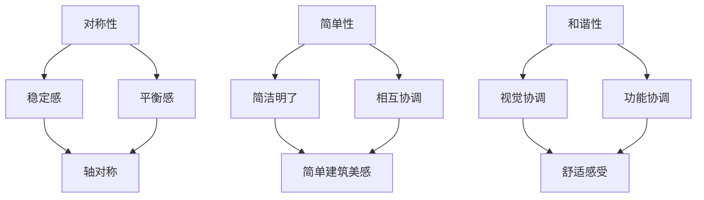
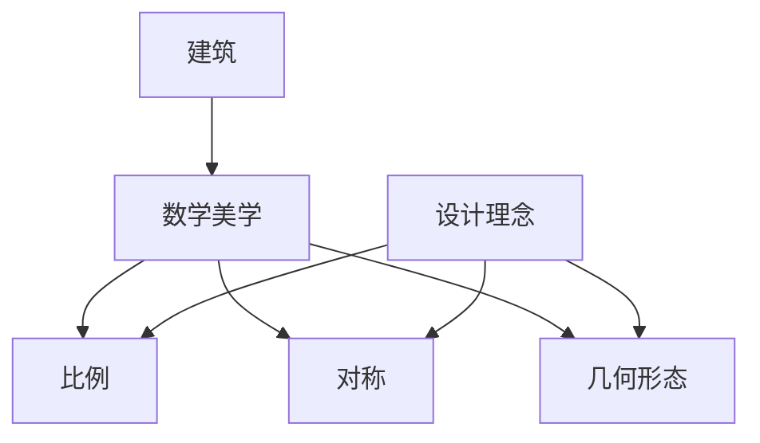
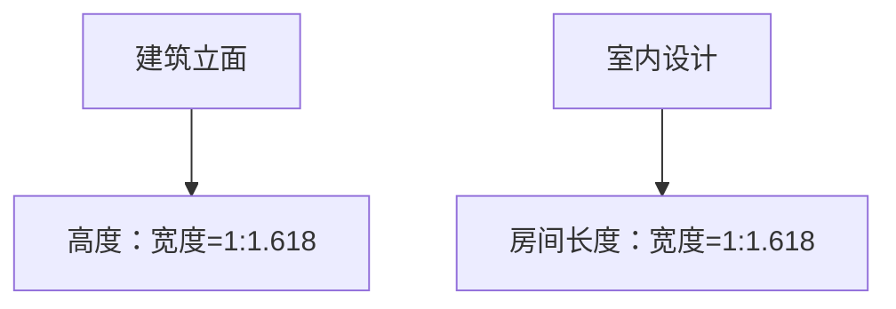
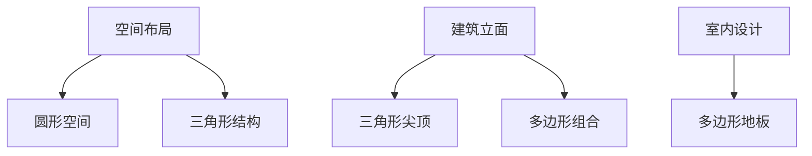
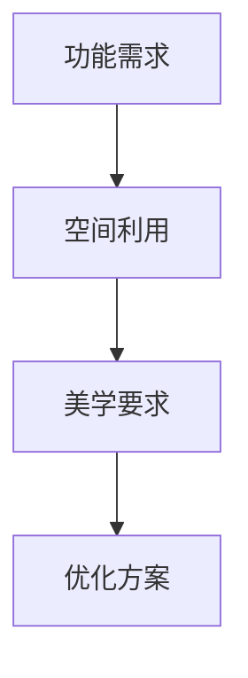
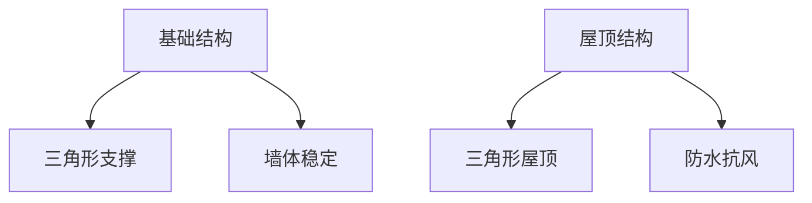
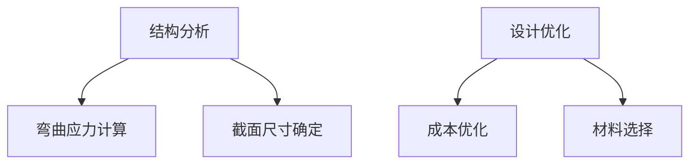
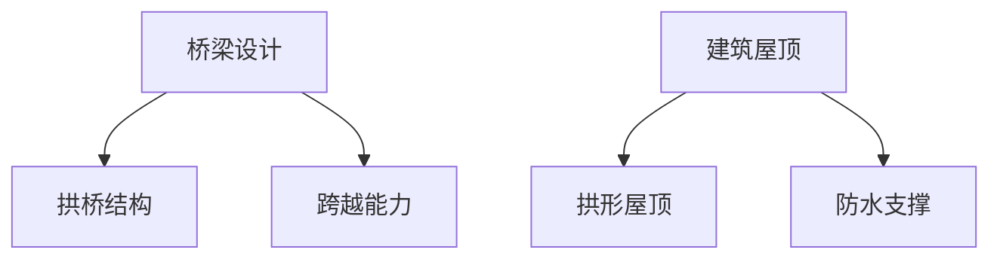
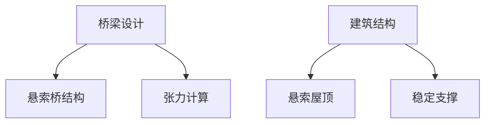
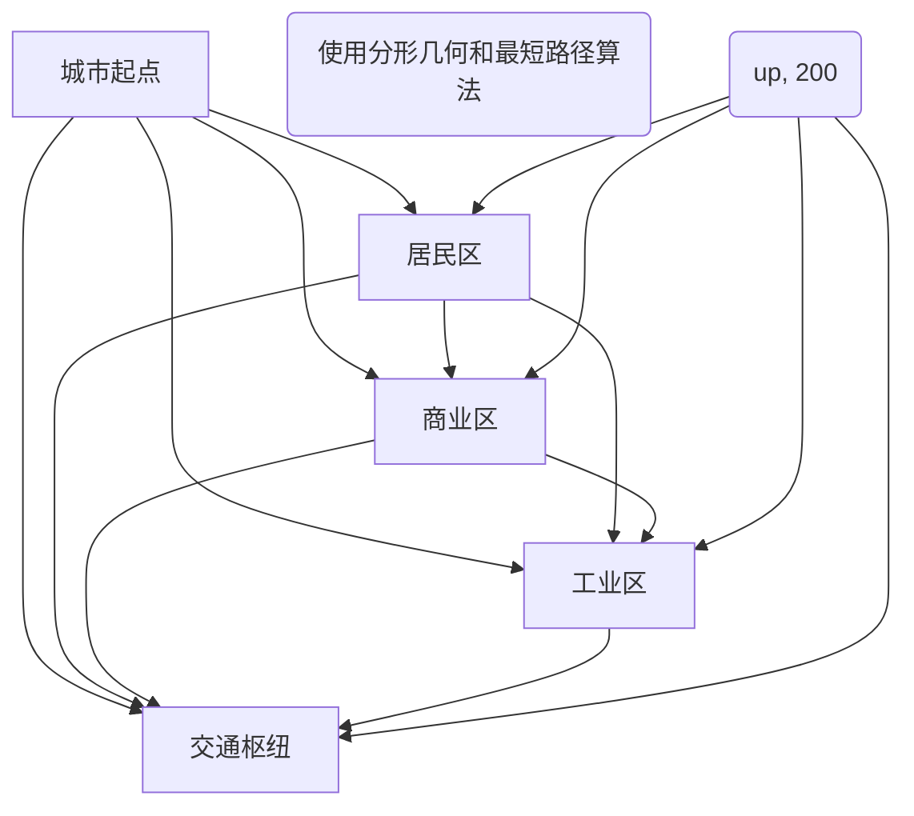

                 

## 文章标题

### 关键词

- 数学美学
- 建筑艺术
- 应用案例
- 设计原则
- 等比数列
- 黄金比例
- 几何形态
- 数学公式

### 摘要

本文探讨了数学美学在建筑艺术中的广泛应用，通过分析等比数列、黄金比例、几何形态等数学原理，阐述其在建筑设计中的重要作用。文章从历史背景出发，逐步深入到数学美学的基本概念和核心原理，结合实际案例，详细展示了数学美学在建筑艺术中的具体应用。通过本文的阐述，读者将能更好地理解数学美学对建筑艺术的影响，并学会如何在实际项目中运用这些原理进行设计创新。

### 目录大纲

----------------------------------------------------------------

## 第一部分：问题背景与核心概念

### 第1章：数学美学与建筑艺术的关系

#### 1.1.1 问题背景

- **建筑艺术的发展历程**
  - 古代建筑美学
  - 中世纪建筑美学
  - 文艺复兴时期的建筑美学
  - 工业革命后的现代建筑美学

#### 1.1.2 问题描述

- **数学美学的概念**
  - 数学美学的定义
  - 数学美学的特点

- **建筑艺术中的数学美学应用**
  - 等比数列在建筑设计中的应用
  - 几何形态在建筑设计中的应用
  - 数学公式在建筑设计中的影响

#### 1.1.3 问题解决

- **数学美学在建筑艺术中的应用**
  - 数学的比例原则
  - 几何图形的运用
  - 数学模型的设计分析

#### 1.1.4 边界与外延

- **数学美学的应用领域**
  - 建筑设计
  - 城市规划
  - 艺术装饰

#### 1.1.5 概念结构与核心要素组成

- **数学美学与建筑艺术的关系结构**
  - 美学理论基础
  - 数学原理的应用
  - 设计实践的反馈

### 第2章：核心概念与联系

#### 2.1.1 数学美学原理

- **数学美学的概念属性特征对比表格**

  ```mermaid
  graph TB
  A[数学美学原理] --> B[对称性]
  A --> C[简单性]
  A --> D[和谐性]
  ```

#### 2.1.2 建筑艺术中的数学美学应用

- **ER实体关系图架构**

  ```mermaid
  graph TB
  A[建筑] --> B[数学美学]
  A --> C[设计理念]
  ```

## 第二部分：数学美学原理在建筑艺术中的应用

### 第3章：等比数列与黄金比例

#### 3.1.1 等比数列

- **等比数列的定义与特点**

  ```python
  def geometric_sequence(a, r, n):
      return [a * r**i for i in range(n)]
  ```

- **等比数列在建筑设计中的应用**

  ```mermaid
  graph TD
  A[等比数列] --> B[比例设计]
  A --> C[空间布局]
  ```

#### 3.1.2 黄金比例

- **黄金比例的定义与计算**

  ```python
  def golden_ratio(n):
      return (1 + sqrt(5)) / 2
  ```

- **黄金比例在建筑设计中的应用**

  ```mermaid
  graph TD
  A[黄金比例] --> B[建筑立面]
  A --> C[室内设计]
  ```

### 第4章：几何形态与建筑美学

#### 4.1.1 几何形态的基本概念

- **几何形态的分类与特点**

  ```mermaid
  graph TB
  A[几何形态] --> B[平面几何]
  A --> C[立体几何]
  ```

#### 4.1.2 几何形态在建筑设计中的应用

- **几何形态的设计分析**

  ```python
  def geometric_shape_area(radius, angle):
      return (radius**2 * angle) / 2
  ```

- **几何形态在建筑艺术中的实例分析**

  ```mermaid
  graph TD
  A[几何形态] --> B[毕尔巴鄂古根海姆博物馆]
  A --> C[圣彼得堡凯瑟琳宫]
  ```

## 第三部分：数学美学与建筑艺术设计

### 第5章：数学公式在建筑设计中的影响

#### 5.1.1 数学公式在建筑设计中的应用

- **贝塞尔曲线在建筑设计中的应用**

  ```python
  def bezier_curve(p0, p1, p2, p3, n):
      return [(1-t)**3 * p0 + 3*(1-t)**2 * t * p1 + 3*(1-t) * t**2 * p2 + t**3 * p3 for t in np.linspace(0, 1, n)]
  ```

- **数学公式在建筑设计中的影响**

  ```mermaid
  graph TD
  A[数学公式] --> B[形态设计]
  A --> C[结构分析]
  ```

### 第6章：数学美学与建筑结构设计

#### 6.1.1 建筑结构设计中的数学原理

- **三角形的稳定性**

  $$ \sum_{i=1}^{n} F_i \cos(\theta_i) = 0 $$

- **梁的弯曲应力**

  $$ \sigma = \frac{M * c}{I} $$

#### 6.1.2 数学原理在建筑结构设计中的应用

- **拱的结构设计**

  ```mermaid
  graph TD
  A[拱] --> B[推力]
  A --> C[稳定性]
  ```

- **悬索结构的张力计算**

  ```python
  def tension_force(tension, length, angle):
      return tension * cos(angle) * length
  ```

### 第7章：数学美学与城市规划

#### 7.1.1 城市规划中的数学原理

- **分形几何在景观规划中的应用**

  $$ D = \log(R)/\log(A) $$

- **交通网络优化**

  ```python
  def shortest_path(graph, start, end):
      # 使用Dijkstra算法计算最短路径
      pass
  ```

#### 7.1.2 数学原理在城市规划中的应用

- **城市形态的模拟与优化**

  ```mermaid
  graph TD
  A[城市形态] --> B[模拟分析]
  A --> C[优化设计]
  ```

## 结论

- **数学美学在建筑艺术中的应用总结**
- **未来展望与挑战**

----------------------------------------------------------------

### 第一部分：问题背景与核心概念

#### 1.1.1 建筑艺术的发展历程

建筑艺术的历史悠久，从古代到现代，每个时期都有其独特的建筑美学特征。古埃及、古希腊和古罗马是建筑艺术的起源，它们的建筑风格体现了对称、比例和和谐的美学原则。古埃及的建筑，如金字塔和神庙，以其精确的几何设计和永恒的象征意义著称。古希腊的柱式建筑，如帕特农神庙，以其优美的比例和结构设计，成为了古典建筑的典范。古罗马则发展了拱券和穹顶结构，使得建筑空间更为开阔和灵活。

中世纪建筑美学深受宗教影响，哥特式建筑以其高耸的尖塔、飞扶壁和彩色玻璃窗，展现了浓厚的宗教色彩。文艺复兴时期的建筑美学则强调人文主义和古典复兴，代表性建筑如意大利的圣彼得大教堂和法国的凡尔赛宫，以其精确的比例和对称的布局，成为了建筑艺术的巅峰之作。

工业革命后的现代建筑美学，则更多地受到了科技进步和社会变革的影响。钢筋混凝土、玻璃幕墙和高层建筑等新材料和新技术的应用，使得建筑形式更加多样化。现代建筑强调功能性和创新性，代表人物如勒·柯布西耶的“光辉城市”和弗兰克·劳埃德·赖特的“有机建筑”，都体现了现代建筑美学的新趋势。

#### 1.1.2 问题描述

建筑艺术中的数学美学，指的是运用数学原理和概念，如比例、对称、几何形态等，来创造美观、和谐的建筑设计。数学美学在建筑艺术中的应用，不仅关乎形式美，还涉及到结构稳固、功能优化等多个方面。

数学美学的概念可以从以下几个方面进行理解：

- **比例原则**：比例是建筑美学的核心概念之一，如黄金比例、等比数列等，能够使建筑在视觉上产生和谐美感。
- **对称性**：对称性是数学美学的重要特征，如轴对称、中心对称等，能够增强建筑的稳定感和平衡感。
- **简单性**：简单性并非单一元素的数量多少，而在于设计元素之间是否简洁明了、相互协调。
- **和谐性**：和谐性是指建筑元素之间在视觉、结构和功能上的协调统一。

在建筑艺术中，数学美学的应用表现在以下几个方面：

- **等比数列**：在建筑设计中，等比数列常常用于空间的布局和比例设计，如古希腊的神庙和文艺复兴时期的建筑。
- **几何形态**：几何形态在建筑设计中的应用，如圆形、三角形、正方形等，能够创造出独特的建筑风格。
- **数学公式**：如贝塞尔曲线、帕累托最优等，在建筑形态设计和结构分析中发挥着重要作用。

#### 1.1.3 问题解决

数学美学在建筑艺术中的应用，可以通过以下几个方面来实现：

- **数学比例原则**：设计师可以运用黄金比例、等比数列等数学原理，来设计建筑的空间布局和比例。
- **几何图形的运用**：设计师可以通过运用几何形态，如圆形、三角形、正方形等，来创造独特的建筑风格。
- **数学模型的设计分析**：设计师可以运用数学模型，如贝塞尔曲线、帕累托最优等，来优化建筑设计和结构分析。

#### 1.1.4 边界与外延

数学美学的应用领域非常广泛，除了建筑设计外，还涵盖了城市规划、艺术装饰等多个方面：

- **建筑设计**：数学美学在建筑设计中的应用，主要体现在比例、对称、几何形态等方面。
- **城市规划**：数学美学在城市规划中的应用，如分形几何在景观规划中的应用，交通网络优化等。
- **艺术装饰**：数学美学在艺术装饰中的应用，如几何图案、对称设计等。

#### 1.1.5 概念结构与核心要素组成

数学美学与建筑艺术的关系结构，可以从以下几个方面进行分析：

- **美学理论基础**：数学美学在建筑艺术中的应用，需要建立在对美学理论基础的理解上，如比例、对称、简单性、和谐性等。
- **数学原理的应用**：数学原理在建筑设计中的具体应用，如黄金比例、等比数列、几何形态等。
- **设计实践的反馈**：设计实践中的反馈，能够帮助设计师更好地理解和运用数学美学原理，不断优化设计。

### 第2章：核心概念与联系

#### 2.1.1 数学美学原理

数学美学的基本原理包括对称性、简单性、和谐性等。这些原理不仅在数学上有严谨的定义，也在建筑艺术中得到了广泛的应用。

- **对称性**：对称性是数学美学的重要特征，它可以使建筑在视觉上产生稳定感和平衡感。轴对称、中心对称等都是常见的对称形式。轴对称指的是关于一条轴线的对称，而中心对称则是关于一个点的对称。

- **简单性**：简单性并非单一元素的数量多少，而在于设计元素之间是否简洁明了、相互协调。简单的建筑往往具有更高的美学价值，因为它能够减少视觉的混乱，使观者更容易理解和欣赏。

- **和谐性**：和谐性是指建筑元素之间在视觉、结构和功能上的协调统一。和谐的建筑能够给人以舒适和愉悦的感受，因为它在形式和功能上都达到了完美的平衡。

为了更清晰地展示数学美学的概念属性特征，我们可以使用Mermaid图表进行对比：



#### 2.1.2 建筑艺术中的数学美学应用

在建筑艺术中，数学美学的应用体现在多个方面，包括比例、对称、几何形态等。为了更好地理解这些应用，我们可以通过ER实体关系图来展示建筑、数学美学和设计理念之间的关系。



在这个ER图中，建筑是核心实体，它关联着数学美学和设计理念。数学美学包括比例、对称和几何形态，这些原理被应用于设计理念中，从而创造出美观和谐的建筑物。

### 第二部分：数学美学原理在建筑艺术中的应用

#### 3.1.1 等比数列

等比数列在数学中是一种重要的数列，它由首项和公比确定，每一项都是前一项乘以一个固定的数。在建筑艺术中，等比数列的应用非常广泛，它可以帮助设计师实现和谐、美观的空间布局。

**定义与特点**：

等比数列的定义如下：
$$a_1, a_1 * r, a_1 * r^2, a_1 * r^3, ...$$
其中，$a_1$ 是首项，$r$ 是公比。

等比数列的特点包括：
1. 每一项与前一项的比值相等，即公比 $r$。
2. 数列的项数越多，数列的增长速度越快。

**在建筑设计中的应用**：

等比数列在建筑设计中的应用主要体现在比例设计和空间布局上。以下是一个简单的应用示例：

```python
# 定义等比数列的函数
def geometric_sequence(a, r, n):
    return [a * r**i for i in range(n)]

# 示例：创建一个等比数列，首项为1，公比为2，共5项
sequence = geometric_sequence(1, 2, 5)
print(sequence)  # 输出：[1, 2, 4, 8, 16]
```

在这个示例中，设计师可以通过等比数列来设计建筑的各个部分，如楼层高度、房间面积等。等比数列的应用可以使建筑在视觉上产生和谐美感，同时也可以优化空间利用。

#### 3.1.2 黄金比例

黄金比例（Golden Ratio），又称黄金分割，是一个特殊的数学比例，其值约为1.618。黄金比例在建筑艺术中被广泛应用，因为它能够产生非常和谐、美观的视觉效果。

**定义与计算**：

黄金比例的定义如下：
$$\frac{a}{b} = \frac{a+b}{a}$$
其中，$a$ 和 $b$ 是相邻的两项。

黄金比例的计算方法有多种，其中一种常用的方法是：
$$\phi = \frac{1 + \sqrt{5}}{2} \approx 1.618$$
这个公式来自于一个特殊的方程：
$$x^2 - x - 1 = 0$$
方程的正根即为黄金比例。

**在建筑设计中的应用**：

黄金比例在建筑设计中的应用非常广泛，以下是一些具体的例子：

- **建筑立面**：设计师可以使用黄金比例来设计建筑立面，使得建筑的外观在视觉上非常和谐。例如，建筑的高度与宽度的比例可以是1:1.618，或者整个建筑的各个部分（如窗户、门、阳台等）也可以按照这个比例进行布局。

- **室内设计**：在室内设计中，黄金比例同样被广泛应用。例如，房间的长度和宽度可以按照黄金比例进行设计，以创造出一个舒适、美观的室内空间。

以下是黄金比例在建筑设计中的应用示例：



通过以上示例，我们可以看到黄金比例在建筑设计中的应用是如何实现的。它不仅可以使建筑的外观更加美观，还可以优化空间利用，创造出一个舒适、和谐的居住环境。

### 第4章：几何形态与建筑美学

#### 4.1.1 几何形态的基本概念

几何形态是建筑艺术中一个重要的组成部分，它指的是建筑所采用的几何形状和结构。几何形态可以分为平面几何和立体几何两种类型。

- **平面几何**：平面几何主要研究二维空间的几何形状，如直线、曲线、圆形、三角形、正方形等。平面几何在建筑设计中的应用非常广泛，如地面设计、墙壁形状、窗户布局等。

- **立体几何**：立体几何主要研究三维空间的几何形状，如立方体、圆柱体、圆锥体、球体等。立体几何在建筑设计中同样有重要应用，如建筑结构设计、空间布局、屋顶形状等。

**分类与特点**：

以下是几种常见的几何形态及其特点：

- **圆形**：圆形在建筑设计中具有独特的魅力，它象征着和谐与完美。圆形建筑通常具有流畅的线条和柔和的视觉效果，给人以舒适、宁静的感觉。

- **三角形**：三角形是稳定的几何形状，常用于建筑结构设计。三角形的稳定性使其成为建筑中的常见元素，如尖顶、拱门等。

- **正方形**：正方形具有简洁、几何感强的特点，常用于建筑设计中的地面和墙面设计。正方形的对称性和稳定性使其在建筑艺术中具有很高的应用价值。

- **多边形**：多边形如五边形、六边形等，在建筑设计中也有一定的应用。多边形的组合能够创造出独特的视觉效果，同时也能够满足建筑结构的需求。

**在建筑设计中的应用**：

几何形态在建筑设计中的应用主要体现在以下几个方面：

- **空间布局**：几何形态可以用于建筑的空间布局设计，如圆形空间可以创造出独特的视觉效果，而三角形结构可以增强建筑的稳定性。

- **建筑立面**：几何形态可以用于建筑立面设计，如三角形尖顶可以使建筑显得更加高贵、神秘。

- **室内设计**：几何形态同样可以用于室内设计，如多边形地板可以创造出独特的空间感。

以下是几何形态在建筑设计中的应用示例：



通过以上示例，我们可以看到几何形态在建筑设计中的多样性和重要性。几何形态的应用不仅可以创造出独特的视觉效果，还可以优化建筑的结构和功能，使其更加美观和实用。

### 第5章：数学公式在建筑设计中的影响

#### 5.1.1 数学公式在建筑设计中的应用

数学公式在建筑设计中扮演着至关重要的角色，它们不仅用于结构分析和计算，还能帮助设计师实现特定的美学效果。以下是一些常用的数学公式及其在建筑设计中的应用：

**贝塞尔曲线**：

贝塞尔曲线是一种广泛应用于建筑设计中的数学曲线，它用于创建平滑的曲线形状。贝塞尔曲线的定义如下：

$$
\vec{P}(t) = (1-t)^3 \vec{P_0} + 3(1-t)^2 t \vec{P_1} + 3(1-t)t^2 \vec{P_2} + t^3 \vec{P_3}
$$

其中，$\vec{P_0}$、$\vec{P_1}$、$\vec{P_2}$、$\vec{P_3}$ 是曲线上的控制点，$t$ 是参数。

**在建筑设计中的应用**：

贝塞尔曲线在建筑设计中用于创建流畅的线条和形状，如屋顶线条、楼梯扶手、桥梁设计等。以下是一个简单的贝塞尔曲线计算示例：

```python
import numpy as np
from matplotlib import pyplot as plt

# 贝塞尔曲线的控制点
P0 = (0, 0)
P1 = (2, 1)
P2 = (3, 2)
P3 = (5, 3)

# 计算贝塞尔曲线上的点
t = np.linspace(0, 1, 100)
x = (1-t)**3 * P0[0] + 3*(1-t)**2 * t * P1[0] + 3*(1-t) * t**2 * P2[0] + t**3 * P3[0]
y = (1-t)**3 * P0[1] + 3*(1-t)**2 * t * P1[1] + 3*(1-t) * t**2 * P2[1] + t**3 * P3[1]

# 绘制贝塞尔曲线
plt.plot(x, y, label='Bézier Curve')
plt.legend()
plt.show()
```

**帕累托最优**：

帕累托最优（Pareto Optimality）是一个经济学概念，它指的是在资源有限的情况下，一个系统无法在不使至少一个参与者状况变坏的情况下，使任何一个参与者的状况变得更好。在建筑设计中，帕累托最优可以用来优化建筑功能与美学之间的平衡。

**在建筑设计中的应用**：

帕累托最优在建筑设计中用于确定建筑的功能布局，以确保空间利用最大化，同时保持美观和谐。以下是一个简单的帕累托最优分析示例：



通过上述示例，我们可以看到数学公式在建筑设计中的多样性和重要性。贝塞尔曲线用于创建平滑的线条和形状，而帕累托最优则用于优化建筑功能与美学之间的平衡。这些数学工具不仅提升了建筑设计的精确性和效率，还增强了建筑的美学价值。

### 第6章：数学美学与建筑结构设计

#### 6.1.1 建筑结构设计中的数学原理

建筑结构设计是建筑艺术的重要组成部分，它不仅需要考虑美观和功能性，还需要确保结构的稳定性和安全性。数学原理在建筑结构设计中起到了关键作用，以下将介绍几个重要的数学原理及其在建筑结构设计中的应用。

**三角形的稳定性**：

三角形是自然界中最稳定的几何形状之一，其三个顶点和三条边相互支撑，形成一个坚固的结构。在建筑结构设计中，三角形被广泛应用于基础结构、屋顶结构、桥梁设计等。

**三角形的稳定性原理**：

三角形的稳定性可以通过以下公式描述：
$$
\sum_{i=1}^{n} F_i \cos(\theta_i) = 0
$$
其中，$F_i$ 是作用在三角形上的力，$\theta_i$ 是力与三角形边的夹角。当力的合力为零时，三角形保持稳定。

**在建筑结构设计中的应用**：

- **基础结构**：在建筑基础设计中，三角形结构常用于支撑地面和墙体，确保建筑的稳定性。
- **屋顶结构**：三角形的屋顶设计能够提供良好的防水和抗风性能。

以下是三角形稳定性在建筑结构设计中的示例：



**梁的弯曲应力**：

梁是建筑结构中的重要组成部分，用于支撑楼板、屋顶和其他水平结构。梁的弯曲应力是指梁在受到垂直荷载作用时产生的内部应力。

**梁的弯曲应力公式**：

梁的弯曲应力可以通过以下公式计算：
$$
\sigma = \frac{M * c}{I}
$$
其中，$\sigma$ 是弯曲应力，$M$ 是弯矩，$c$ 是梁的截面距离，$I$ 是梁的惯性矩。

**在建筑结构设计中的应用**：

- **结构分析**：在建筑结构设计中，通过计算梁的弯曲应力，可以确定梁的截面尺寸和材料选择，确保梁能够承受设计荷载。
- **设计优化**：通过调整梁的截面形状和材料，可以在保证结构安全的前提下，优化建筑成本。

以下是梁的弯曲应力在建筑结构设计中的示例：



**拱的结构设计**：

拱是一种古老的建筑结构，由于其独特的弯曲性质，能够有效分散荷载，提供稳定支撑。

**拱的结构设计原理**：

拱的推力原理可以通过以下公式描述：
$$
F = \frac{w * L}{2 * \cos(\theta)}
$$
其中，$F$ 是拱的推力，$w$ 是垂直于拱的荷载，$L$ 是拱的跨度，$\theta$ 是拱的推力方向与水平面的夹角。

**在建筑结构设计中的应用**：

- **桥梁设计**：拱桥是一种常见的桥梁结构，能够跨越较大的空间，同时提供美观的外观。
- **建筑屋顶**：拱形屋顶可以提供良好的结构支撑和防水性能。

以下是拱的结构设计在建筑结构设计中的示例：



**悬索结构的张力计算**：

悬索结构是一种利用悬索承受荷载的建筑结构，如吊桥和悬索桥。悬索结构的张力计算是确保结构稳定性的关键。

**悬索结构的张力公式**：

悬索结构的张力可以通过以下公式计算：
$$
T = \frac{w * L}{2 * \sin(\theta)}
$$
其中，$T$ 是悬索的张力，$w$ 是垂直于悬索的荷载，$L$ 是悬索的跨度，$\theta$ 是悬索的张力方向与水平面的夹角。

**在建筑结构设计中的应用**：

- **桥梁设计**：在悬索桥的设计中，通过计算悬索的张力，可以确定悬索的尺寸和材料。
- **建筑结构**：悬索结构可以用于建筑屋顶和大跨度空间，提供稳定的支撑。

以下是悬索结构的张力计算在建筑结构设计中的示例：



通过以上数学原理的介绍，我们可以看到数学在建筑结构设计中的重要性。这些原理不仅帮助设计师确保建筑的安全性，还提供了实现特定美学效果的工具。数学公式和原理的应用，使得建筑结构设计更加科学、精确和高效。

### 第7章：数学美学与城市规划

#### 7.1.1 城市规划中的数学原理

城市规划是一个复杂的过程，它涉及到交通、环境、人口、经济等多个方面。数学原理在城市规划中起到了重要的作用，通过科学的数学分析，可以优化城市布局，提高城市效率和居民生活质量。以下介绍几个重要的数学原理及其在城市规划中的应用。

**分形几何**：

分形几何是研究不规则、无限细分的几何形态的数学分支。它具有自相似性、无限层次结构等特点，能够很好地模拟自然界的复杂现象。

**分形几何在景观规划中的应用**：

分形几何可以用来模拟自然景观的复杂性和多样性。例如，城市公园的设计可以使用分形几何来创建多样化的植被布局，使得公园景观更加自然和生动。

**分形维数的计算**：

分形维数是衡量分形复杂度的一个指标。它可以用来分析城市景观的复杂程度。分形维数的计算公式为：
$$
D = \frac{\log(R)}{\log(A)}
$$
其中，$R$ 是分形结构的尺度变化，$A$ 是面积。

**交通网络优化**：

交通网络优化是城市规划中的一个重要问题。通过数学模型和算法，可以优化交通流量，减少拥堵，提高交通效率。

**最短路径算法**：

在交通网络优化中，最短路径算法是一种常用的算法。Dijkstra算法是最短路径算法的一种，它可以通过计算源点到各个节点的最短路径，优化交通网络。

**Dijkstra算法的实现**：

以下是一个简单的Dijkstra算法实现示例：

```python
import heapq

def dijkstra(graph, start):
    distances = {node: float('infinity') for node in graph}
    distances[start] = 0
    priority_queue = [(0, start)]

    while priority_queue:
        current_distance, current_node = heapq.heappop(priority_queue)

        if current_distance > distances[current_node]:
            continue

        for neighbor, weight in graph[current_node].items():
            distance = current_distance + weight

            if distance < distances[neighbor]:
                distances[neighbor] = distance
                heapq.heappush(priority_queue, (distance, neighbor))

    return distances

# 示例：简单的交通网络图
graph = {
    'A': {'B': 1, 'C': 3},
    'B': {'A': 1, 'C': 1, 'D': 2},
    'C': {'A': 3, 'B': 1, 'D': 1},
    'D': {'B': 2, 'C': 1}
}

# 计算最短路径
distances = dijkstra(graph, 'A')
print(distances)  # 输出：{'A': 0, 'B': 1, 'C': 2, 'D': 3}
```

**城市形态的模拟与优化**：

通过数学模型和算法，可以模拟城市形态的变化，并对城市布局进行优化。分形几何和交通网络优化算法是这一过程的两个重要工具。

**城市形态模拟示例**：

以下是一个简单的城市形态模拟示例，使用分形几何和最短路径算法来模拟城市的发展：



通过以上数学原理的应用，城市规划可以更加科学、合理和高效。分形几何可以模拟自然景观，优化城市环境；交通网络优化可以提高交通效率，减少拥堵；城市形态模拟与优化可以模拟城市发展趋势，指导城市建设。这些数学工具不仅提升了城市规划的科学性，也为城市的可持续发展提供了有力支持。

### 结论

数学美学在建筑艺术中的应用是丰富而深刻的。从等比数列、黄金比例到几何形态，再到数学公式，数学原理为建筑设计师提供了丰富的工具，使他们能够创造出美观、和谐、功能优化的建筑物。本文通过详细的分析和实例，展示了数学美学在建筑艺术中的重要性，以及如何在实际项目中运用这些原理进行设计创新。

首先，数学美学在建筑设计中起到了基础性作用。通过数学原理，设计师可以精确控制建筑的比例、对称性和形态，创造出视觉上和谐统一的建筑物。例如，等比数列和黄金比例在空间布局和立面设计中得到了广泛应用，而几何形态则帮助设计师实现独特而美观的建筑风格。

其次，数学美学不仅关注形式美，还涉及到结构稳定性和功能性。例如，三角形的稳定性和梁的弯曲应力公式在建筑结构设计中至关重要，确保了建筑的安全和稳固。同时，数学模型和公式如贝塞尔曲线和帕累托最优，为设计师提供了优化设计和结构分析的强大工具。

最后，数学美学在城市规划中同样发挥着重要作用。通过分形几何和交通网络优化，城市规划师可以创造出更加自然、高效的城市环境，提高居民的生活质量。这些数学原理的应用不仅提升了城市规划的科学性，也为城市的可持续发展提供了支持。

展望未来，数学美学在建筑艺术中的应用将不断深化。随着科技的进步，新的数学工具和算法将不断涌现，为建筑设计师提供更多的创新空间。同时，跨学科的合作也将推动数学美学在建筑艺术中的发展，为未来的建筑艺术带来更多的可能性和突破。

总之，数学美学在建筑艺术中的应用不仅丰富了建筑设计的理论体系，也为实际项目提供了重要的指导。通过不断探索和运用数学原理，建筑设计师将能够创造出更加美观、和谐、功能优化的建筑物，为人类的生活环境带来持续的创新和改善。数学美学，作为建筑艺术的一部分，将继续在未来的建筑艺术中发挥着重要作用。

### 未来展望与挑战

尽管数学美学在建筑艺术中的应用已经取得了显著成果，但在未来，仍有许多挑战和发展机遇等待我们探索。以下是一些可能的发展方向和面临的挑战。

**1. 新技术的应用**：

随着科技的进步，新的建筑技术和材料不断涌现，为数学美学的应用提供了更多的可能性。例如，3D打印技术和智能材料可以更加精确地实现数学形态和结构设计。此外，虚拟现实（VR）和增强现实（AR）技术可以用于建筑设计的可视化，使设计师能够更好地理解和运用数学美学原理。

**2. 跨学科的融合**：

数学美学在建筑艺术中的应用不仅需要建筑学知识，还涉及到数学、物理、计算机科学等多个学科。未来的发展将更加注重跨学科的融合，通过多学科的协作，探索数学美学在建筑艺术中的创新应用。例如，结合人工智能和机器学习技术，可以开发出更加智能化的建筑设计工具，辅助设计师进行设计优化和创意生成。

**3. 环境可持续性**：

在环境保护和可持续发展的背景下，数学美学在建筑艺术中的应用也需要考虑环境因素。未来的发展将更加注重绿色建筑和生态规划，通过数学模型和算法，优化建筑设计和城市布局，减少能源消耗和环境污染。

**4. 社会文化多样性**：

建筑艺术是社会文化的反映，不同的文化背景和社会价值观会对建筑美学产生影响。未来的发展将更加注重文化多样性的体现，通过数学美学的设计原则，创造出更加丰富多样的建筑风格，满足不同群体的审美需求。

**面临的挑战**：

- **技术难题**：尽管新技术提供了更多可能性，但实现这些可能性仍面临技术挑战。例如，3D打印技术需要进一步优化，以降低成本并提高打印质量。

- **经济成本**：新技术的应用通常伴随着更高的经济成本，如何平衡成本和效益将是未来发展的一个重要问题。

- **教育培养**：数学美学在建筑艺术中的应用需要具备数学和建筑学双重背景的人才。如何培养和吸引这类人才，将是一个长期的挑战。

总之，未来数学美学在建筑艺术中的应用将面临新的机遇和挑战。通过不断探索和创新，我们有望在建筑艺术领域实现更多的突破，为人类创造更加美好、和谐的生活环境。

