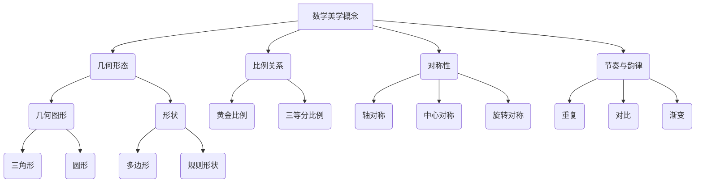

                 

### 数学美学的核心概念

#### 1.1.1 数学美学的概念

数学美学是一门跨学科的领域，旨在探索数学在艺术、哲学和科学中的美学应用和表现形式。它不仅仅关注数学理论本身，更强调数学如何影响和塑造视觉艺术、文学、音乐等其他艺术形式的美感。数学美学通常包括对几何形态、比例关系、对称性以及数学公式和结构在艺术作品中的审美应用的探讨。

在数学美学的研究中，一些关键概念值得深入理解。首先是**几何形态**，这是指在视觉艺术中，各种几何图形、形状和结构的应用。几何形态是数学美学的核心元素，它们通过数学原理和规则来创造和谐、对称和有序的视觉效果。

其次是**比例与比例关系**，比例是数学美学中的基本概念之一，它指的是两个量之间的相对大小关系。在视觉艺术中，正确的比例关系可以增强作品的整体美感，使观众感受到和谐与平衡。著名的**黄金比例**（Golden Ratio，约等于1:1.618）是数学美学中一个重要的比例概念，它在艺术、建筑、设计等多个领域被广泛应用。

另外，**对称性**是数学美学中的另一个重要概念。对称性指的是物体在某种规则下具有镜像或旋转等性质。对称性不仅在自然界中普遍存在，如蝴蝶的翅膀、树叶的形状等，也在艺术作品中扮演着重要角色，它可以为作品带来平衡与稳定的美感。

#### 1.1.2 数学美学的发展历程

数学美学的历史可以追溯到古希腊时期，当时的哲学家和数学家如柏拉图和欧几里得就曾探讨过数学与美学之间的关系。他们认识到数学不仅是一种科学，也是一种艺术形式，它通过简洁、对称和和谐的结构创造出美。

在文艺复兴时期，艺术家们开始更加注重科学和数学知识的应用，试图通过精确的几何比例和形态来创作出具有高度美学价值的作品。达芬奇就是一个典型代表，他的绘画和设计作品充分体现了数学美学的基本原则。

19世纪末至20世纪初，随着现代主义艺术的兴起，数学美学在视觉艺术和建筑设计中得到了进一步的探索和推广。艺术家如毕加索、蒙德里安等人在他们的作品中运用了几何形态、对称性和比例关系，创造出独特的美学效果。

进入20世纪中叶，计算机技术的发展为数学美学的研究提供了新的工具和平台。计算机图形学、算法艺术和计算机辅助设计等领域开始广泛应用数学原理来创作艺术作品，使数学美学成为现代艺术的一个重要组成部分。

#### 1.1.3 数学美学的重要性

数学美学在多个领域具有重要应用价值，其中最为突出的包括艺术创作、建筑设计、产品设计以及计算机科学等。

首先，在艺术创作中，数学美学的应用可以提升艺术作品的审美价值。通过几何形态、比例关系和对称性等数学原理，艺术家可以创造出更具视觉冲击力和和谐美感的作品。例如，毕加索的立体派画作、蒙德里安的抽象画作等，都是数学美学的经典例子。

其次，在建筑设计中，数学美学有助于设计师创造出具有和谐美感且功能合理的建筑作品。例如，法国巴黎的埃菲尔铁塔，其独特的几何形态和比例关系使其成为建筑史上的经典之作。

再者，在产品设计领域，数学美学的应用可以提升产品的实用性和美观度。例如，苹果公司的产品设计就充分体现了数学美学，通过精确的几何比例和对称性，创造出简洁、优雅且易于操作的产品。

最后，在计算机科学中，数学美学的应用可以提升算法效率和系统性能。例如，在计算机图形学中，通过数学模型和算法，可以实现更逼真的视觉效果和更高效的图像处理。

总之，数学美学不仅丰富了人类对美的理解，还为各个领域的创作和设计提供了重要的理论支持和实践指导。它跨越了学科界限，成为连接数学与艺术、科学的重要桥梁。

### 数学美学的结构与应用

#### 2.1.1 数学美学的核心原理

数学美学在视觉艺术和设计中有着独特的核心原理，这些原理不仅提供了美学上的理论基础，还为实际创作提供了具体的操作指南。以下是数学美学中几个关键的核心原理：

**1. 对称性（Symmetry）**

对称性是数学美学中的基础概念之一。它指的是物体在某种规则下具有镜像或旋转等性质。对称性在自然界和艺术作品中广泛存在，能够带来平衡与稳定的美感。例如，蝴蝶的翅膀、雪花图案以及许多雕塑作品，都展示了不同形式的对称性。对称性分为轴对称、中心对称和旋转对称，这些形式在艺术创作中可以灵活运用，创造出和谐且引人注目的效果。

**2. 比例与比例关系（Proportion and Proportional Relationships）**

比例是指两个量之间的相对大小关系。在视觉艺术中，正确的比例关系可以增强作品的整体美感，使观众感受到和谐与平衡。著名的黄金比例（Golden Ratio，约等于1:1.618）是数学美学中一个重要的比例概念，它在艺术、建筑、设计等多个领域被广泛应用。其他常见的比例关系如黄金分割（Golden Section）、三等分比例等，也为艺术家提供了丰富的创作灵感。

**3. 几何形态（Geometric Form）**

几何形态是数学美学中的重要组成部分，包括各种几何图形、形状和结构。几何形态通过数学原理和规则来创造和谐、对称和有序的视觉效果。在绘画、雕塑、建筑设计等艺术形式中，几何形态的应用可以增强作品的科学性和精确性，同时也赋予作品独特的艺术魅力。

**4. 结构与秩序（Structure and Order）**

结构与秩序是数学美学的核心原则之一。通过数学原理构建的结构和秩序，可以为艺术作品提供内在的稳定性与美感。艺术家可以通过数学方法来设计复杂的结构，使作品在视觉上具有层次感和深度感。例如，在建筑设计中，通过精确的几何结构和比例关系，可以创造出宏伟且稳定的建筑作品。

**5. 节奏与韵律（Rhythm and Harmony）**

节奏与韵律是数学美学中的重要组成部分，它们通过重复、对比和渐变等手法，创造出动态感和流动感。在音乐中，节奏和韵律是音乐的基本元素，而在视觉艺术中，这些元素同样可以用来增强作品的表现力。例如，通过重复某种几何形状或颜色，可以创造出强烈的节奏感，而对比和渐变则可以带来丰富的视觉层次。

这些核心原理不仅构成了数学美学的基础，也为艺术创作提供了具体的方法和指导。艺术家可以通过理解和运用这些原理，创造出具有高度美学价值和科学内涵的艺术作品。

#### 2.1.2 数学美学的属性特征对比

为了更清晰地理解数学美学的属性特征，我们可以通过一个对比表格来展示几何形态、比例关系、对称性和节奏韵律等核心概念之间的异同。以下是这些属性特征的对比表格：

| 属性特征 | 定义 | 实例 | 效果 |
| --- | --- | --- | --- |
| 几何形态 | 几何图形和形状 | 三角形、圆形、多边形 | 精确、有序、稳定 |
| 比例关系 | 两个量之间的相对大小 | 黄金比例、三等分比例 | 和谐、平衡、美感 |
| 对称性 | 物体的镜像或旋转性质 | 轴对称、中心对称、旋转对称 | 平衡、稳定、简洁 |
| 节奏与韵律 | 重复、对比和渐变 | 节奏感、视觉层次感 | 动态、流动、表现力 |

通过这个对比表格，我们可以看到每个属性特征都有其独特的定义和效果。例如，几何形态通过精确的图形和形状来增强视觉稳定性；比例关系通过和谐的比例来创造视觉美感；对称性通过镜像和旋转来带来视觉平衡；节奏与韵律通过重复和对比来增强视觉动态感。这些属性特征共同构成了数学美学的基础，为艺术创作提供了丰富的工具和资源。

#### 2.1.3 数学美学的结构图解

为了更直观地展示数学美学的结构，我们可以使用Mermaid流程图来绘制其核心要素和相互关系。以下是一个简化的数学美学结构图：

这个Mermaid流程图展示了数学美学的核心概念和它们之间的相互关系。几何形态包括了各种几何图形和形状，如三角形、圆形和多边形，这些形态通过数学原理来创造和谐有序的效果。比例关系包括黄金比例和三等分比例等，它们在视觉艺术中用于增强作品的美感和平衡。对称性分为轴对称、中心对称和旋转对称，这些形式为艺术作品提供了稳定和简洁的外观。最后，节奏与韵律通过重复、对比和渐变等手法，创造出动态感和流动感。

通过这个图解，我们可以更清晰地理解数学美学的基本结构和各个要素之间的相互关系。这不仅有助于我们更好地掌握数学美学的基本原理，也为实际的艺术创作提供了具体的参考和指导。

### 数学美学在艺术领域的应用

数学美学在艺术领域的应用广泛而深远，不仅丰富了艺术创作的表现手法，还提升了艺术作品的美感和科学内涵。以下是数学美学在绘画、雕塑和建筑等艺术形式中的应用，具体分析其在这些艺术形式中的表现和影响。

#### 绘画中的数学美学

在绘画中，数学美学主要通过几何形态、比例关系、对称性和节奏韵律等要素来提升作品的美感和视觉效果。以下是几个具体的应用实例：

**1. 几何形态**

几何形态在绘画中的应用非常普遍。例如，荷兰画家埃舍尔（M.C. Escher）的作品充满了复杂的几何图形和结构，通过非欧几何和不可能空间的创作手法，打破了传统的视觉规则，创造出独特的视觉体验。他的画作《平面的无限》和《瀑布》等都是几何形态应用的典范。

**2. 比例关系**

正确的比例关系可以增强绘画的和谐美感。例如，意大利文艺复兴大师达芬奇在创作《蒙娜丽莎》时，使用了黄金比例来安排人物的面部特征和整体构图，使作品具有强烈的视觉吸引力。黄金比例不仅在绘画中广泛应用，也在建筑设计、产品设计等领域有着重要的影响。

**3. 对称性**

对称性在绘画中的应用可以创造出稳定和简洁的美感。例如，法国新古典主义画家安格尔（Ingres）在创作《大宫女》时，使用了严格的对称性来安排人物和背景，使作品具有古典的庄严和优雅。对称性不仅在绘画中有着广泛应用，也在雕塑和建筑中起到重要的作用。

**4. 节奏与韵律**

节奏与韵律通过重复、对比和渐变等手法，为绘画作品注入了动态感和流动感。例如，美国画家波洛克（Jackson Pollock）在创作抽象表现主义画作时，通过无规则的线条和滴溅，创造出富有节奏感的视觉效果。他的作品《1号1948》就是节奏与韵律在绘画中的经典实例。

#### 雕塑中的数学美学

在雕塑中，数学美学同样发挥着重要作用，通过几何形态、比例关系和对称性等要素，雕塑家可以创造出极具视觉冲击力的作品。以下是几个具体的应用实例：

**1. 几何形态**

几何形态在雕塑中的应用非常广泛，如亨利·摩尔（Henry Moore）的作品，他通过简单的几何形态，如圆形、椭圆形和矩形体，创造出独特且富有抽象美感的雕塑作品。例如，他的代表作《内部和外部》系列，通过几何形态的运用，展现了人体形态的内部和外部空间关系。

**2. 比例关系**

比例关系在雕塑中同样重要。例如，古希腊雕塑家菲迪亚斯（Phidias）在创作《雅典娜神像》时，使用了黄金比例来安排人体各个部分的比例关系，使雕塑具有和谐美感和崇高感。这种比例关系在古希腊雕塑中得到了广泛应用，对后世的雕塑艺术产生了深远影响。

**3. 对称性**

对称性在雕塑中的应用可以增强作品的稳定性和庄重感。例如，意大利文艺复兴雕塑家米开朗基罗（Michelangelo）在创作《大卫》雕像时，使用了完美的对称性来展现人体的动态和平衡。这座雕像不仅具有高度的审美价值，也成为了文艺复兴雕塑的代表作之一。

#### 建筑中的数学美学

在建筑中，数学美学通过几何形态、比例关系、对称性和节奏韵律等要素，创造出和谐、稳定且富有美感的建筑作品。以下是几个具体的应用实例：

**1. 几何形态**

几何形态在建筑设计中的应用非常广泛。例如，法国巴黎的埃菲尔铁塔，其独特的几何形态不仅具有高度的艺术价值，也成为了巴黎的标志性建筑。埃菲尔铁塔的几何形态通过精确的计算和设计，展现了数学美学的魅力。

**2. 比例关系**

比例关系在建筑设计中起着至关重要的作用。例如，古希腊帕特农神庙，其设计严格按照黄金比例来安排建筑各个部分的尺寸和比例，创造了和谐美感的视觉效果。帕特农神庙的建造不仅是古希腊建筑技术的巅峰，也是数学美学在建筑中的经典实例。

**3. 对称性**

对称性在建筑设计中的应用可以增强建筑的稳定感和庄严感。例如，法国巴黎圣母院，其建筑风格采用了严格的对称性，使整个建筑看起来庄重而稳定。巴黎圣母院不仅具有高度的艺术价值，也成为了哥特式建筑的代表作之一。

**4. 节奏与韵律**

节奏与韵律在建筑设计中通过重复、对比和渐变等手法，创造出动态感和流动感。例如，意大利建筑师伦佐·皮亚诺（Renzo Piano）设计的悉尼歌剧院，其屋顶采用了波浪形的几何形态，通过渐变和对比，创造出独特的节奏感和韵律感。悉尼歌剧院不仅成为了澳大利亚的标志性建筑，也成为了现代建筑的典范。

总之，数学美学在艺术领域的广泛应用，不仅丰富了艺术创作的表现形式，也提升了艺术作品的美感和科学内涵。通过几何形态、比例关系、对称性和节奏韵律等要素，艺术家和设计师可以创造出更具深度和价值的艺术作品，为人类文明的发展做出了重要贡献。

### 数学美学在音乐创作中的运用

数学美学在音乐创作中的运用同样具有重要意义，通过数学关系和结构，音乐家可以创造出富有美感和逻辑性的音乐作品。以下是数学美学在音乐中的几个关键应用方面，以及具体的实例分析。

#### 音乐中的数学关系

音乐与数学之间存在深刻的内在联系，这些关系包括节奏、旋律和和声等方面。

**1. 节奏与数学关系**

节奏是音乐的基本元素之一，它通过时间的长短和强弱的组合，产生旋律和和声。节奏的安排与数学中的比例关系密切相关。例如，二重奏或三重奏中，不同乐器之间的节奏比例可以按照黄金比例来安排，使音乐具有和谐美感。此外，节奏中的重复和渐变也体现了数学中的周期性和变化规律。

**2. 旋律与数学模式**

旋律是音乐的核心，它通过音高的变化来传达情感和信息。许多著名的旋律都遵循了数学模式，如斐波那契数列和黄金比例。例如，美国作曲家乔治·格什温（George Gershwin）的《蓝色狂想曲》中，主题旋律就采用了斐波那契数列的模式，使音乐具有独特的节奏感和旋律美。

**3. 和声与数学关系**

和声是音乐中音高关系的组合，它与数学中的三角函数和对称性密切相关。例如，和声中的大三和弦和小三和弦可以通过三角函数来解释，它们的音高比例和和谐关系使音乐作品具有稳定性和美感。此外，和声的对称性也可以增强音乐的稳定性，如平行五度和平行八度等。

#### 音乐的节奏与数学关系

音乐的节奏可以通过数学中的比例关系来分析，不同节奏之间的组合和对比为音乐创作提供了丰富的可能性。

**1. 节奏的分割与组合**

在音乐创作中，节奏可以通过分割和组合来实现复杂的节奏模式。例如，通过将简单的四分音符分割成两个八分音符，或者将一个八分音符组合成两个四分音符，可以创造出丰富多样的节奏变化。这种分割与组合的方法在数学上可以看作是比例关系的应用。

**2. 比例关系在节奏中的应用**

比例关系在节奏中的应用非常广泛，如二重奏和三重奏中的节奏比例。例如，两支乐器可以按照1:1的比例演奏相同的节奏，也可以按照1:2或1:3的比例来组合，创造出复杂的节奏对比。这种比例关系的应用使音乐具有多样性和层次感。

**3. 节奏模式与数学模型**

音乐的节奏模式可以通过数学模型来解释和预测。例如，斐波那契数列在音乐节奏中的应用非常常见，它可以通过重复和组合来创造出富有节奏感和旋律美的音乐。此外，黄金比例也在音乐节奏中得到了应用，通过将音乐节奏按照黄金比例进行分割和组合，可以创造出和谐美感的音乐作品。

#### 音乐的旋律与数学模式

旋律是音乐的核心，许多著名的旋律都遵循了数学模式，这些模式为音乐创作提供了深刻的启示。

**1. 斐波那契数列**

斐波那契数列（0, 1, 1, 2, 3, 5, 8, 13, ...）在音乐创作中有着广泛的应用。例如，美国作曲家约翰·凯奇（John Cage）的《四分三十三秒》中，就使用了斐波那契数列的节奏模式来创造独特的音乐效果。这种模式通过重复和渐变，使音乐具有动态感和节奏感。

**2. 黄金比例**

黄金比例（约等于1:1.618）在音乐旋律中的应用非常常见。例如，德国作曲家巴赫（Johann Sebastian Bach）的《音乐的奉献》中，主题旋律就按照黄金比例进行了设计。这种比例关系使旋律具有和谐美感和独特的音乐魅力。

**3. 音程与数学关系**

音程是音乐中两个音高之间的关系，它与数学中的比例关系密切相关。例如，大三和弦和小三和弦的音程比例可以通过三角函数来解释，它们的音高比例和和谐关系使音乐作品具有稳定性和美感。

#### 音乐的结构与数学美学

音乐的整个结构也可以通过数学原理来分析和设计，这种结构美学使音乐作品具有逻辑性和层次感。

**1. 对称性**

对称性在音乐创作中有着广泛应用，通过严格的对称性，音乐作品可以具有稳定和简洁的美感。例如，德国作曲家罗伯特·舒曼（Robert Schumann）的作品《交响练习曲》中，就使用了严格的对称结构，使音乐具有平衡感和统一性。

**2. 重复与渐变**

重复与渐变是音乐创作中常用的手法，通过重复某个旋律或节奏，可以创造出强烈的节奏感和动态感。同时，通过渐变，音乐可以逐步引导听众的情感体验。例如，法国作曲家弗朗西斯·普朗克（Francis Poulenc）的《吉诺佩蒂塔》中，通过重复和渐变的手法，使音乐作品具有丰富的层次感和动态感。

**3. 数学模型**

数学模型在音乐创作中的应用可以创造出独特的音乐效果。例如，通过运用分形几何，可以创造出具有复杂节奏模式和动态感的音乐。美国作曲家菲利普·格拉斯（Philip Glass）的《钟》就是分形几何在音乐创作中的经典实例，通过重复和渐变的手法，使音乐具有强烈的节奏感和动态感。

总之，数学美学在音乐创作中的广泛应用，不仅丰富了音乐的表现形式，也提升了音乐作品的美感和科学内涵。通过数学关系、节奏模式、旋律结构等要素，音乐家可以创造出更具深度和逻辑性的音乐作品，为人类文明的发展做出了重要贡献。

### 数学美学在影视动画创作中的基础应用

数学美学在影视动画创作中具有广泛且基础的应用，它通过几何形态、比例关系和对称性等数学原理，为动画作品提供了丰富的视觉表现力和艺术感染力。以下将详细探讨数学美学在影视动画中的具体应用，并通过实际案例进行说明。

#### 影视动画中的数学比例与构图

在影视动画中，数学比例和构图的应用是基础且关键的。正确的比例关系可以使角色和场景在视觉上更加协调和自然。以下是几个具体的应用方面：

**1. 角色设计的比例关系**

角色设计中的比例关系对于动画作品的视觉效果至关重要。一个常见的应用实例是**黄金比例**。黄金比例在动画角色设计中被广泛应用，比如角色的头部、身体和四肢的比例。例如，在经典动画电影《狮子王》中，主要角色的身体比例就严格遵循黄金比例，使角色显得更加自然和谐。

**2. 场景构图的比例关系**

场景构图中的比例关系也至关重要。例如，在动画电影《冰雪奇缘》中，场景设计遵循了黄金比例的原则，通过精心设计的比例关系，使得场景中的建筑物、森林和冰川等元素在视觉上显得更加平衡和和谐。

**3. 镜头设计的比例关系**

在镜头设计方面，比例关系同样重要。例如，通过利用黄金比例分割画面，可以将镜头分为三部分，主角色通常位于三分之二处，这样的布局不仅美观，还能突出主角的地位。

#### 数学构图在动画场景中的应用

数学构图在动画场景中的应用可以增强场景的视觉冲击力和美感。以下是一些具体的应用实例：

**1. 几何形状的应用**

几何形状在动画场景中可以用来增强视觉效果。例如，在动画电影《千与千寻》中，宫崎骏通过使用几何形状，如圆形、三角形和方形等，来构建场景和角色。这些几何形状不仅使场景具有结构感，还通过几何形态的规律性，增强了场景的和谐美感。

**2. 对称性与不对称性的结合**

对称性与不对称性的结合可以创造出独特的视觉效果。例如，在动画电影《魔发奇缘》中，场景设计结合了严格的对称性和不对称性，通过对称性来创造稳定感，同时通过不对称性来增加动态感和变化感，使场景更加丰富和有趣。

**3. 比例关系与视觉引导**

在动画场景中，通过合理运用比例关系，可以引导观众的视线。例如，在动画电影《头脑特工队》中，通过将角色和物体按照比例关系放置在画面中，可以有效地引导观众关注重点。通过这种方法，场景设计不仅具有美感，还能有效地传达故事情节。

#### 数学比例与构图在镜头设计中的应用

镜头设计中的数学比例和构图同样重要，以下是一些具体的应用实例：

**1. 黄金分割法**

黄金分割法在镜头设计中被广泛应用。例如，在动画电影《疯狂动物城》中，镜头常常按照黄金分割法来构图，通过将画面分割为三个部分，使角色和背景元素在视觉上更加和谐和美观。

**2. 三分法**

三分法是镜头设计中常用的技巧，通过将画面分为三等分，可以在水平和垂直方向上引导观众的视线。例如，在动画电影《冰雪奇缘》的许多镜头中，通过将主角放置在画面的三分之二处，使主角显得更加突出和重要。

**3. 对比与平衡**

通过对比和平衡，可以增强镜头的视觉效果。例如，在动画电影《玩具总动员》中，通过对比玩具的大小和颜色，创造出了强烈的视觉冲击力。同时，通过平衡不同的元素，如明暗对比、色彩对比等，可以创造出更加生动和有趣的镜头。

总之，数学美学在影视动画创作中的应用，通过几何形态、比例关系和对称性等数学原理，为动画作品提供了丰富的视觉表现力和艺术感染力。通过实际案例的说明，我们可以看到，数学美学不仅提升了动画作品的美学价值，还增强了作品的逻辑性和叙事效果。随着技术的不断进步，数学美学在影视动画创作中的应用将越来越广泛，为观众带来更加精彩和独特的视觉体验。

### 数学美学在动画角色设计中的运用

在动画角色设计中，数学美学通过几何形态、比例关系和对称性等原理，为角色创造提供了科学而美感的指导。以下将详细探讨数学美学在动画角色设计中的应用，并通过具体案例来展示这些应用的实际效果。

#### 形态学在角色设计中的应用

形态学是数学美学在角色设计中的一个重要应用领域，它通过几何形态的规则性和有序性来塑造角色的外观。以下是一些具体的应用实例：

**1. 几何形态的规则性**

在角色设计中，通过几何形态的规则性，可以创造出具有稳定性和统一性的角色。例如，在动画电影《玩具总动员》中，主角胡迪（Woody）的设计采用了矩形体和圆形的基本几何形态。这些规则几何形态不仅赋予了角色鲜明的特征，还使角色在视觉上具有一致性和稳定性。

**2. 几何形态的组合**

通过组合不同的几何形态，可以创造出复杂而富有创意的角色设计。例如，在动画电影《千与千寻》中，主角千寻的设计结合了圆形、三角形和矩形等多种几何形态。这种组合不仅使角色在视觉上具有层次感，还通过形态的变化增强了角色的个性和表现力。

**3. 几何形态的应用扩展**

几何形态的应用不仅限于基础形态，还可以通过扩展和应用，创造出更加丰富和多样化的角色设计。例如，在动画电影《冰雪奇缘》中，艾尔莎（Elsa）的服装设计采用了复杂的几何图案，如对称的几何图形和波浪形的装饰。这些几何图案不仅增强了角色的美感，还通过几何形态的有序排列，传递了角色内心的稳定性和力量感。

#### 数学对称与角色设计

对称性是数学美学中的重要概念，在角色设计中通过对称性可以创造出平衡感和稳定感。以下是一些具体的应用实例：

**1. 对称性与角色形态**

对称性在角色设计中可以通过几何形态的镜像和旋转来实现。例如，在动画电影《狮子王》中，主要角色如辛巴（Simba）和娜娜（Nala）的设计都采用了轴对称和中心对称的方式。这些对称性不仅增强了角色的视觉稳定性，还通过对称形态的规则性，传达了角色坚强和正直的特质。

**2. 对称性与角色表情**

在角色设计中，对称性还可以体现在角色的表情和动作中。例如，在动画电影《阿凡达》中，纳美族人（Na'vi）的面部设计采用了严格的对称性，使角色在动画过程中无论表情如何变化，都能保持视觉上的和谐和美感。

**3. 对称性与角色环境**

角色与环境之间的对称性设计可以增强场景的整体美感。例如，在动画电影《魔发奇缘》中，角色蒂安娜（Tiana）的服饰和环境设计都采用了对称性原则，通过对称布局，使角色和环境在视觉上形成统一，提升了整体的艺术效果。

#### 数学比例与角色设计

比例关系是数学美学在角色设计中的另一个关键应用，通过正确的比例关系，角色在视觉上可以更加协调和自然。以下是一些具体的应用实例：

**1. 黄金比例在角色设计中的应用**

黄金比例在角色设计中被广泛应用，通过黄金比例来安排角色的头部、身体和四肢的比例，可以创造出和谐而优美的视觉效果。例如，在动画电影《狮子王》中，主要角色的身体比例就严格遵循了黄金比例，使角色在视觉上显得更加自然和协调。

**2. 三等分比例的应用**

三等分比例是另一个重要的比例关系，通过将角色分为三等分，可以创造出视觉上的层次感和平衡感。例如，在动画电影《玩具总动员》中，角色安迪（Andy）和他的玩具伙伴们的比例设计就采用了三等分比例，使角色在视觉上具有一致性和层次感。

**3. 比例关系的动态变化**

在角色设计中，通过动态变化比例关系，可以创造出富有创意和表现力的角色。例如，在动画电影《头脑特工队》中，主角们的心情感受到情绪变化的影响，角色的大小和形状也会随之变化，通过这种动态比例关系，角色在视觉上表现出情感的变化和内心的波动。

综上所述，数学美学在动画角色设计中的应用，通过几何形态、对称性和比例关系等数学原理，为角色创造提供了科学而美感的指导。通过实际案例的展示，我们可以看到，数学美学不仅提升了动画角色的视觉效果，还增强了角色的艺术感染力和表现力。随着技术的不断进步，数学美学在动画角色设计中的应用将更加广泛和深入，为观众带来更加精彩和独特的角色体验。

### 数学美学在动画场景设计中的实践

在动画场景设计中，数学美学的应用不仅能够提升场景的美感，还能够增强故事情节的叙事效果。通过几何形态、比例关系和对称性等数学原理，设计师可以创造出丰富多样且具有视觉冲击力的场景。以下将详细探讨数学美学在动画场景设计中的应用，并通过具体案例进行分析。

#### 场景设计的数学原则

**1. 几何形态的应用**

几何形态在场景设计中具有广泛的应用，通过规则的几何形态，场景可以显得更加有序和稳定。例如，在动画电影《疯狂动物城》中，设计团队利用几何形态构建了各种建筑物和街道。这些几何形态不仅增强了场景的结构感，还通过规则排列，传达了城市的有序和现代感。

**2. 比例关系的应用**

比例关系在场景设计中的关键作用是创造和谐和平衡。通过合理的比例关系，场景中的各个元素在视觉上能够更加协调。例如，在动画电影《千与千寻》中，宫崎骏运用了黄金比例来设计场景中的建筑和自然元素。这些比例关系不仅使场景显得更加自然和美观，还通过视觉上的和谐感，增强了观众的沉浸体验。

**3. 对称性的应用**

对称性是场景设计中的一个重要原则，通过对称性，场景可以显得更加稳定和平衡。例如，在动画电影《魔发奇缘》中，蒂安娜（Tiana）的餐厅设计采用了严格的对称性。这种对称性不仅使场景在视觉上具有美感，还通过对称布局，增强了场景的稳定感和统一性。

#### 数学比例与场景布局

**1. 黄金比例在场景布局中的应用**

黄金比例是场景布局中的一个重要工具，通过将场景按照黄金比例分割，可以创造出具有视觉吸引力的布局。例如，在动画电影《冰雪奇缘》中，艾尔莎（Elsa）的宫殿设计严格按照黄金比例进行布局，通过黄金比例分割，宫殿的各个部分在视觉上显得更加协调和和谐。

**2. 三等分比例在场景布局中的应用**

三等分比例是另一种有效的布局工具，通过将场景分为三个部分，可以创造出层次感丰富的布局。例如，在动画电影《头脑特工队》中，角色们的思维空间设计采用了三等分比例。通过这种布局，思维空间的各个部分在视觉上具有明显的层次感，增强了故事的叙事效果。

**3. 比例关系与视觉引导**

在场景布局中，通过合理运用比例关系，可以有效地引导观众的视线。例如，在动画电影《疯狂动物城》中，通过将主要角色放置在黄金分割点处，设计团队成功地引导了观众的视线，使主角在视觉上更加突出和重要。

#### 数学形态与场景构建

**1. 几何形态的规则性**

在场景构建中，通过规则的几何形态，可以创造出具有结构感的场景。例如，在动画电影《疯狂动物城》中，设计团队通过使用规则的几何形态，如正方形、长方形和圆形等，构建了城市中的各种建筑物和街道。这些几何形态不仅增强了场景的结构感，还通过规则排列，使城市在视觉上显得更加有序和现代。

**2. 几何形态的组合**

通过组合不同的几何形态，可以创造出更加丰富和多样化的场景。例如，在动画电影《千与千寻》中，设计团队通过将几何形态如圆形、三角形和矩形等组合在一起，构建了丰富的场景。这种组合不仅增强了场景的视觉吸引力，还通过形态的变化，增强了场景的故事表现力。

**3. 几何形态的应用扩展**

几何形态的应用不仅限于基础形态，还可以通过扩展和应用，创造出更加复杂和具有创意的场景。例如，在动画电影《冰雪奇缘》中，设计团队通过使用复杂的几何图案，如对称的几何图形和波浪形的装饰，构建了丰富的场景。这些复杂的几何形态不仅增强了场景的美感，还通过几何图案的有序排列，增强了场景的叙事效果。

#### 数学对称与场景美学

**1. 对称性与场景稳定**

在场景设计中，对称性可以创造出稳定和平衡的视觉效果。例如，在动画电影《魔发奇缘》中，通过使用对称性，设计团队成功地构建了一个具有稳定感的场景。这种对称性不仅使场景在视觉上显得更加平衡，还通过对称布局，增强了场景的稳定感。

**2. 对称性与故事叙述**

对称性在场景设计中的另一个重要作用是强化故事叙述。例如，在动画电影《疯狂动物城》中，通过使用对称性，设计团队传达了故事中的主题，如正义与邪恶的对抗。通过场景中的对称布局，故事情节在视觉上得到了强调，使观众更加深入地理解故事内容。

**3. 对称性与角色互动**

对称性还可以用于角色互动的设计，通过对称性，可以创造出有趣的互动场景。例如，在动画电影《玩具总动员》中，设计团队通过使用对称性，使玩具们在不同场景中的互动显得更加有趣和生动。这种对称性不仅增强了角色的互动效果，还通过视觉上的对称性，使观众更容易理解和感受到角色之间的情感。

总之，数学美学在动画场景设计中的广泛应用，通过几何形态、比例关系和对称性等数学原理，为动画作品提供了丰富的视觉表现力和艺术感染力。通过具体案例的分析，我们可以看到，数学美学不仅提升了动画场景的美学价值，还增强了故事情节的叙事效果。随着技术的不断进步，数学美学在动画场景设计中的应用将越来越广泛和深入，为观众带来更加精彩和独特的视觉体验。

### 数学美学与动画故事结构

在动画创作中，数学美学不仅体现在视觉效果上，还能深刻影响故事结构和叙事节奏，从而增强观众的沉浸感和故事的表现力。通过数学原理和模式的应用，动画创作者可以构建出具有逻辑性和层次感的叙事结构，使故事更加引人入胜。以下将详细探讨数学美学在动画故事结构中的应用，并通过具体案例进行分析。

#### 数学美学在故事情节中的应用

**1. 箭头型叙事结构**

箭头型叙事结构是动画故事中常用的一种结构模式，它类似于数学中的箭头符号，表示故事情节的推进和转变。这种结构通过数学上的递进和转折，使故事情节更加紧凑和具有节奏感。

**案例：《狮子王》**

在动画电影《狮子王》中，故事情节采用了箭头型叙事结构。影片从辛巴（Simba）的童年开始，逐渐推进到他的成年、离开家、遇到挑战、最终回归和成为国王。这种结构通过数学上的递进关系，将故事情节串联起来，使观众在观看过程中能够感受到情节的推进和变化。

**2. 黄金比例在故事节奏中的应用**

黄金比例是数学美学中的重要概念，它不仅在视觉效果中应用广泛，也在故事节奏中发挥了关键作用。通过黄金比例，动画创作者可以合理安排故事情节的节奏，使故事在高潮和低谷之间形成和谐的比例关系。

**案例：《冰雪奇缘》**

在动画电影《冰雪奇缘》中，黄金比例被广泛应用于故事节奏的安排。影片从艾尔莎（Elsa）的孤独成长到她与安娜（Anna）的相遇，再到两人共同面对挑战，最终达成和解。这种节奏安排通过黄金比例的关系，使故事在情感上形成了高潮和低谷的和谐对比，增强了故事的吸引力和感染力。

**3. 斐波那契数列在故事情节中的应用**

斐波那契数列是数学中的一个重要序列，它在动画故事情节中的应用，可以通过重复和递增的关系，创造出具有动态感的叙事节奏。

**案例：《头脑特工队》**

在动画电影《头脑特工队》中，斐波那契数列被巧妙地应用于故事情节中。影片讲述了主人公们大脑中的五个情感角色（快乐、愤怒、悲伤、厌恶和恐惧）之间的互动和成长。故事情节通过斐波那契数列的递增关系，展现了情感角色的变化和成长，使故事在情感上具有层次感和动态感。

#### 数学美学与故事节奏

**1. 节奏的重复与渐变**

在动画故事中，通过重复和渐变，可以创造出富有节奏感和动态感的叙事效果。数学美学中的重复和渐变原理，为故事节奏的安排提供了有力的支持。

**案例：《魔发奇缘》**

在动画电影《魔发奇缘》中，通过重复和渐变，故事节奏得到了有效的安排。影片通过重复舞蹈场景和渐变的音乐节奏，使故事在情感上形成了高潮和低谷的交替，增强了观众的沉浸感和故事的吸引力。

**2. 节奏与情感表达**

通过合理的节奏安排，可以有效地传达情感和表达主题。数学美学中的节奏原理，为动画创作者提供了丰富的工具，使他们能够通过节奏的变化，传达故事中的情感和主题。

**案例：《疯狂动物城》**

在动画电影《疯狂动物城》中，通过节奏的变化，故事中的情感和主题得到了有效的传达。影片通过快速节奏的追逐场景和缓慢节奏的内心独白，使观众能够感受到角色之间的情感冲突和成长。这种节奏安排不仅增强了故事的吸引力，还通过情感表达，使故事更加深入人心。

**3. 节奏与叙事结构**

节奏不仅是情感表达的工具，也是叙事结构的重要组成部分。通过合理的节奏安排，动画创作者可以构建出层次丰富、逻辑清晰的叙事结构。

**案例：《千与千寻》**

在动画电影《千与千寻》中，节奏的安排与叙事结构紧密结合。影片通过快速节奏的开场，展现了主人公千寻的意外冒险，然后通过渐变的节奏，展示了她在奇幻世界中的成长和变化。这种节奏安排不仅使故事情节更加紧凑，还通过叙事结构的层次感，增强了故事的吸引力和表现力。

总之，数学美学在动画故事结构中的应用，通过几何形态、比例关系、对称性以及数学模式等原理，为故事情节和叙事节奏提供了科学而美感的指导。通过具体案例的分析，我们可以看到，数学美学不仅提升了动画故事的美学价值，还增强了故事的叙事效果和观众的沉浸感。随着技术的不断进步，数学美学在动画故事结构中的应用将更加广泛和深入，为观众带来更加精彩和独特的叙事体验。

### 数学美学在动画视觉效果中的创新

在动画视觉效果的创新中，数学美学扮演了至关重要的角色。通过先进的数学模型和算法，动画创作者能够创造出更加逼真和富有创意的视觉效果，进一步提升观众的视觉体验。以下将详细探讨数学美学在动画视觉效果中的创新应用，并通过具体案例进行分析。

#### 数学原理与视觉效果

**1. 分形几何**

分形几何是数学美学中的一种重要工具，它通过无穷层次的自我相似结构，创造出极具视觉冲击力的图像。分形几何在动画中的应用，不仅能够增强场景的细节和层次感，还能够创造出独特的视觉效果。

**案例：《阿凡达》**

在动画电影《阿凡达》中，分形几何被广泛应用于场景设计。导演詹姆斯·卡梅隆（James Cameron）通过分形几何的结构，构建了潘多拉星上的各种自然景观，如山脉、森林和河流。这些分形结构不仅使场景具有逼真的视觉效果，还通过复杂的形态，增强了场景的神秘感和探索感。

**2. 模拟物理**

模拟物理是动画制作中常用的技术，通过物理定律和数学模型，动画创作者可以创造出真实的物理效果，如重力、碰撞、流体等。这种技术不仅提升了动画的逼真度，还通过物理现象的数学表达，增强了视觉效果的创新性。

**案例：《疯狂动物城》**

在动画电影《疯狂动物城》中，模拟物理技术被广泛应用于动物角色的动作和场景的设计。通过精确的物理模型，角色在碰撞、跳跃和奔跑中的动作显得更加真实和自然。同时，通过模拟物理，场景中的车辆、建筑物等元素在运动中的视觉效果也显得更加逼真，提升了整体动画的视觉效果。

#### 数学模型与视觉效果设计

**1. 渲染算法**

渲染算法是动画视觉效果设计中的关键环节，通过数学模型和算法，动画创作者可以创造出丰富的光影效果和材质表现。先进的渲染算法不仅能够提升动画的视觉效果，还能够实现更加逼真的物理效果。

**案例：《冰雪奇缘》**

在动画电影《冰雪奇缘》中，先进的渲染算法被广泛应用于场景设计和角色渲染。通过高质量的渲染算法，场景中的冰雪效果、光影变化和角色细节都得到了精细的表现。这种高质量的视觉效果不仅增强了动画的美感，还通过逼真的物理效果，提升了观众的沉浸感。

**2. 纹理映射**

纹理映射是动画视觉效果设计中的重要技术，通过数学模型和算法，将纹理信息映射到三维模型上，使模型具有更加真实的视觉效果。纹理映射技术的创新，不仅提升了动画的细节表现力，还通过纹理的多样性，增强了场景的创意和表现力。

**案例：《千与千寻》**

在动画电影《千与千寻》中，纹理映射技术被广泛应用于场景设计和角色渲染。通过精细的纹理映射，场景中的建筑、自然元素和角色细节都得到了逼真的表现。这种纹理映射技术不仅提升了动画的视觉效果，还通过真实的细节，增强了观众的沉浸感。

#### 新兴技术对数学美学的影响

**1. 深度学习**

深度学习是近年来兴起的一种人工智能技术，通过神经网络和大数据分析，深度学习能够在视觉识别、图像生成等方面实现突破。深度学习在动画制作中的应用，不仅提升了视觉效果的创新性，还为数学美学的应用提供了新的思路。

**案例：《玩具总动员4》**

在动画电影《玩具总动员4》中，深度学习技术被广泛应用于角色设计和场景生成。通过深度学习算法，角色在视觉上的细节和动作表现得到了大幅提升，场景生成也变得更加自动化和多样化。这种深度学习技术的应用，不仅提升了动画的视觉效果，还通过创新的生成方式，为数学美学在动画制作中的应用开辟了新的方向。

**2. 数据可视化**

数据可视化是一种通过图形和图像来展示数据的技术，它通过数学模型和算法，将复杂的数据转化为直观的视觉形式。数据可视化在动画制作中的应用，不仅能够提升视觉效果的创新性，还为动画创作者提供了新的创作工具。

**案例：《头脑特工队》**

在动画电影《头脑特工队》中，数据可视化技术被广泛应用于角色设计和场景表现。通过数据可视化，角色内心的情感状态和思维过程得到了直观的展示，场景中的各种元素也通过数据可视化技术，展现了丰富的信息和层次感。这种数据可视化技术的应用，不仅提升了动画的视觉效果，还通过创新的展示方式，增强了观众的沉浸感。

总之，数学美学在动画视觉效果中的创新应用，通过分形几何、模拟物理、渲染算法、纹理映射以及新兴技术如深度学习和数据可视化，不仅提升了动画的视觉效果，还通过创新的手段，为数学美学在动画制作中的应用提供了新的思路和可能性。随着技术的不断进步，数学美学在动画视觉效果中的创新应用将越来越广泛，为观众带来更加精彩和独特的视觉体验。

### 数学美学在经典影视动画中的案例研究

在影视动画领域，数学美学通过几何形态、比例关系、对称性等原理，为经典动画作品注入了独特的视觉魅力和艺术价值。以下将详细分析几个具有代表性的经典动画电影，探讨它们如何应用数学美学，创造出令人难忘的视觉效果和艺术风格。

#### 《狮子王》中的数学美学

**1. 几何形态的应用**

在《狮子王》中，设计团队通过几何形态的应用，创造出丰富的视觉元素。例如，辛巴和娜娜的体态设计严格遵循了黄金比例，使角色在视觉上显得更加协调和自然。此外，影片中的草原、河流和森林等场景设计，也大量运用了几何形态，如圆形的河流、三角形的草原植被等。这些几何形态不仅增强了场景的视觉美感，还通过有序排列，使场景具有稳定的结构感。

**2. 对称性的应用**

《狮子王》中的场景设计大量运用了对称性，这不仅使场景在视觉上显得更加平衡，还通过对称布局，传达了故事中的主题，如正义与邪恶的对立。例如，辛巴的出生地水塘，其圆形的边界和对称的植被布局，象征了辛巴纯洁、正义的特质。同时，影片中的动物角色也通过对称性设计，表现出它们自然、和谐的生物特征。

**3. 比例关系的应用**

影片中的角色和场景比例设计，严格遵循了黄金比例和三等分原则。通过合理运用比例关系，角色和场景在视觉上显得更加协调和自然。例如，辛巴的身体比例和草原的植被布局，都遵循了黄金比例，使观众在观看过程中感受到视觉上的和谐美感。

#### 《千与千寻》中的数学美学

**1. 几何形态的创意应用**

在《千与千寻》中，宫崎骏运用了丰富的几何形态，创造出独特的场景设计。例如，影片中的神秘世界“浴池镇”设计，通过几何形态的组合，如圆形的浴池、三角形的小屋等，形成了一种富有层次感和立体感的视觉体验。这种创意性的几何形态应用，不仅增强了场景的视觉冲击力，还通过形态的变化，传达了故事中的神秘氛围。

**2. 对称性与非对称性的结合**

《千与千寻》中的场景设计，巧妙地结合了对称性和非对称性，创造出独特的视觉效果。例如，汤婆婆的房间设计，通过严格的对称性，使房间在视觉上显得稳定和庄重；而千寻的房间则采用了非对称性设计，通过形态的变化和布局的错落，使房间具有动态感和生动性。这种对称性与非对称性的结合，不仅丰富了场景的视觉效果，还通过对比，增强了故事的叙事效果。

**3. 节奏与韵律的数学关系**

在《千与千寻》中，宫崎骏通过数学中的节奏与韵律关系，创造出了独特的视觉节奏感。例如，影片中的浴池镇场景，通过重复的几何形态和对称的布局，使观众在视觉上感受到一种节奏感。同时，通过渐变的几何形态和光影变化，影片还创造出了丰富的视觉层次感，增强了观众的沉浸感。

#### 《冰雪奇缘》中的数学美学

**1. 几何形态与冰雪效果**

在《冰雪奇缘》中，设计团队通过几何形态的应用，创造出独特的冰雪效果。例如，艾尔莎的城堡设计，通过几何形态的规则排列，使城堡在视觉上显得简洁而优雅。同时，影片中的冰雪场景，通过几何形态的应用，使冰雪效果具有逼真的视觉效果。例如，雪花的设计采用了几何形态的组合，通过规则的排列，创造出丰富的细节和层次感。

**2. 对称性与非对称性的平衡**

《冰雪奇缘》中的场景设计，在保持对称性的同时，也注重非对称性的平衡。例如，艾尔莎的城堡内部设计，通过严格的对称性，使空间在视觉上显得稳定和庄重；而城堡的外部设计则采用了非对称性，通过形态的变化和布局的错落，使城堡具有动态感和生动性。这种对称性与非对称性的平衡，不仅丰富了场景的视觉效果，还通过对比，增强了故事的叙事效果。

**3. 黄金比例在场景布局中的应用**

在《冰雪奇缘》中，黄金比例被广泛应用于场景布局。例如，艾尔莎的城堡内部设计，通过黄金比例的分割，使空间在视觉上显得和谐和平衡。同时，影片中的角色和场景比例设计，也严格遵循了黄金比例，使角色和场景在视觉上显得更加协调和自然。

综上所述，数学美学在经典影视动画中的广泛应用，不仅提升了动画作品的视觉魅力和艺术价值，还通过几何形态、比例关系、对称性等原理，为动画创作提供了丰富的创作工具和表现手法。这些经典动画电影通过数学美学的应用，不仅为观众带来了独特的视觉体验，还通过创新的叙事手法和视觉效果，为动画艺术的发展做出了重要贡献。

### 当前前沿的数学美学应用

随着科技的不断进步，数学美学在影视动画领域的应用也呈现出前所未有的创新和突破。特别是深度学习、数据可视化和新兴技术，为数学美学带来了全新的视角和工具。以下将详细探讨这些前沿技术如何与数学美学相结合，推动动画创作的进一步发展。

#### 深度学习与数学美学的结合

深度学习作为一种人工智能技术，通过神经网络和大量数据训练，可以自动学习和模拟复杂的数学模型。在影视动画中，深度学习技术的应用极大地提升了动画效果的创新性和逼真度。

**1. 自动角色生成**

在动画角色设计中，深度学习可以用于自动生成具有独特外貌和特征的角色。通过训练大规模的图像数据集，深度学习模型可以学习到各种角色的外貌特征，从而生成具有高度多样性的角色。这种自动生成角色技术，不仅提高了动画创作的效率，还通过数学模型的应用，为角色设计注入了更多创意和艺术价值。

**2. 角色表情识别与生成**

深度学习技术在角色表情识别与生成中也有着广泛应用。通过训练深度神经网络，动画创作者可以捕捉到真实人物的表情特征，并将其应用到动画角色中。这种技术不仅使动画角色的表情更加真实和丰富，还通过数学模型的优化，提升了表情生成的准确性和自然度。

**3. 动画风格迁移**

深度学习还可以用于动画风格迁移，即通过将一种风格应用到其他动画作品中，创造出独特的视觉效果。例如，通过训练深度学习模型，可以将经典的绘画风格迁移到动画作品中，使动画作品具有独特的艺术风格和视觉魅力。这种风格迁移技术，不仅丰富了动画创作的表现手法，还通过数学模型的应用，提升了动画的美学价值。

#### 数据可视化与数学美学

数据可视化是一种通过图形和图像展示数据的技术，它通过数学模型和算法，将复杂的数据转化为直观的视觉形式。在影视动画中，数据可视化技术的应用，不仅提升了视觉效果的创新性，还为数学美学提供了新的表现手段。

**1. 数据驱动动画**

数据可视化技术可以用于数据驱动动画，即通过分析大量的数据，生成具有动态变化的动画效果。例如，通过分析气象数据，可以生成逼真的气象动画，如风暴、海浪等。这种数据驱动动画技术，不仅增强了动画的视觉效果，还通过数学模型的应用，使动画具有高度的逼真度和科学性。

**2. 数据艺术**

数据可视化技术还可以用于数据艺术，即通过展示大量数据，创造出独特的视觉艺术作品。例如，通过分析社交网络数据，可以生成动态的社交网络图，展示人们之间的互动和关系。这种数据艺术作品，不仅具有高度的艺术价值，还通过数学模型的应用，展现了数据的复杂性和美感。

**3. 可视化辅助设计**

在动画场景设计中，数据可视化技术可以用于辅助设计。例如，通过可视化技术，设计师可以直观地看到场景中各个元素的比例关系、色彩搭配等，从而进行更加科学和合理的设计。这种可视化辅助设计技术，不仅提升了设计效率，还通过数学模型的应用，增强了场景设计的艺术性和科学性。

#### 新兴技术对数学美学的影响

**1. 增强现实（AR）**

增强现实技术通过将虚拟元素叠加到现实世界中，创造出沉浸式的视觉体验。在影视动画中，AR技术的应用，不仅为观众带来了全新的互动体验，还通过数学模型的应用，提升了动画作品的视觉效果和艺术价值。

**2. 虚拟现实（VR）**

虚拟现实技术通过模拟现实环境，为观众带来沉浸式的体验。在影视动画中，VR技术的应用，不仅使观众能够身临其境地感受动画场景，还通过数学模型的应用，提升了动画的视觉效果和艺术感染力。

**3. 联网协作**

随着互联网技术的发展，动画创作者可以跨国界、跨地域进行协作，创造出更加复杂和精美的动画作品。在动画创作中，互联网协作技术不仅提高了创作效率，还通过数学模型的应用，实现了更高质量和更富有创意的动画作品。

总之，当前前沿技术如深度学习、数据可视化和新兴技术，为数学美学在影视动画中的应用带来了前所未有的创新和突破。这些技术不仅提升了动画的视觉效果和艺术价值，还通过数学模型的应用，为动画创作提供了丰富的创作工具和表现手法。随着科技的不断进步，数学美学在影视动画领域的应用将更加广泛和深入，为观众带来更加精彩和独特的视觉体验。

### 数学美学在影视动画创作中的未来

随着科技的飞速发展，数学美学在影视动画创作中的应用前景广阔，不仅推动了动画艺术的发展，也为观众带来了全新的视觉体验。以下是数学美学在影视动画创作中未来的发展趋势和可能的应用领域。

#### 科技进步与数学美学

随着计算机技术和人工智能的不断发展，数学美学在影视动画创作中的应用将更加深入和广泛。特别是深度学习、虚拟现实（VR）和增强现实（AR）等前沿技术的成熟，将极大地提升动画创作的效率和视觉效果。例如，通过深度学习算法，动画角色和场景可以自动生成，实现高度多样化的视觉表现；通过VR和AR技术，观众可以身临其境地体验动画世界的奇幻与魅力。

**1. 自动化角色生成**

未来，自动化角色生成技术将更加成熟，通过深度学习算法，动画创作者可以快速生成具有独特外貌和特征的动画角色。这不仅提高了创作效率，还为动画创作提供了更多的可能性。通过结合数学美学原则，自动生成的角色在视觉效果和美学表现上也将更加符合观众的审美需求。

**2. 智能化场景设计**

智能化的场景设计将是未来数学美学在动画创作中的重要应用领域。通过大数据分析和机器学习，动画创作者可以更精准地分析观众的行为和喜好，从而设计出更加符合观众期待的动画场景。同时，通过数学模型的应用，场景中的光影效果、色彩搭配等都将更加精确和协调，提升整体视觉效果。

#### 数学美学在动画制作中的未来

**1. 多维动画表现**

随着科技的发展，未来动画制作将突破传统的二维和三维限制，进入多维动画时代。通过虚拟现实和增强现实技术，动画作品可以呈现出更加立体和互动的视觉效果。数学美学将在这个过程中发挥关键作用，通过精确的数学模型和算法，创造出具有高度真实感和艺术价值的动画场景。

**2. 跨媒体融合**

未来，数学美学将在跨媒体融合中发挥重要作用。通过人工智能和大数据技术，动画作品可以与文学、音乐、电影等多种艺术形式进行融合，创造出全新的艺术体验。例如，通过分析文学作品中的数学结构和节奏，动画创作者可以设计出更具故事性和节奏感的动画作品；通过结合音乐中的数学模式，动画作品可以呈现出更具感染力的视觉和听觉效果。

**3. 可视化数据分析**

数学美学在数据可视化中的应用将为动画创作提供新的可能性。通过大数据分析，动画创作者可以更深入地了解观众的行为和喜好，从而设计出更加符合观众期待的动画作品。例如，通过数据可视化技术，动画创作者可以直观地看到观众对某一动画片段的反应，从而优化和调整创作策略。

#### 数学美学在动画教育中的角色

数学美学在动画教育中也将发挥重要作用，通过数学美学教育，培养新一代动画创作者的审美能力和创新意识。以下是几个具体的应用方向：

**1. 数学美学课程**

在动画教育中，开设数学美学课程将有助于学生理解和掌握数学美学的基本原理和应用方法。通过这些课程，学生可以学习到几何形态、比例关系、对称性等数学美学概念，并将其应用到实际创作中，提升动画作品的艺术价值。

**2. 数学美学实验项目**

通过数学美学实验项目，学生可以亲身体验和探索数学美学在动画创作中的应用。例如，通过设计数学形态的动画角色或场景，学生可以实践和验证数学美学原则，提高动画创作的技能和创新能力。

**3. 数学美学比赛和展览**

举办数学美学比赛和展览，可以激发学生和创作者的创意和热情，推动数学美学在动画创作中的广泛应用。这些比赛和展览不仅为学生提供了展示自己才华的平台，还可以促进数学美学与其他艺术形式的融合，推动动画艺术的发展。

总之，随着科技的不断进步，数学美学在影视动画创作中的应用将越来越广泛和深入。未来，数学美学不仅将推动动画艺术的创新和发展，还将为观众带来更加精彩和独特的视觉体验。通过跨学科的合作和技术的创新，数学美学将在动画制作、动画教育以及跨媒体融合等众多领域发挥重要作用，为人类文明的发展做出新的贡献。

### 数学美学在影视动画创作中的意义与价值

数学美学在影视动画创作中具有重要的意义与价值，它不仅提升了动画的艺术表现力，还增强了叙事效果和观众体验。以下是数学美学在影视动画创作中的文化价值、社会价值和人类文明发展中的角色。

#### 文化价值

数学美学在动画创作中体现了深厚的文化内涵和审美价值。通过几何形态、比例关系、对称性等数学原理，动画作品传达了独特的审美观念和文化精神。例如，经典动画电影《狮子王》通过严格的几何形态和比例关系，展现了对非洲大地的热爱和对自然的尊重。这些作品不仅具有艺术价值，也成为了文化传承的重要载体，通过视觉艺术的方式，向全球观众传递了不同文化的精髓。

#### 社会价值

数学美学在动画创作中的社会价值体现在多个方面。首先，它为观众带来了独特的视觉体验，丰富了文化生活，提升了公众的艺术素养。例如，《千与千寻》通过复杂的几何形态和对称性，为观众创造了一个充满神秘和奇幻的世界，激发了观众对自然和人类情感的思考。其次，数学美学在动画产业中发挥了重要的经济推动作用，通过技术创新和艺术创作，推动了动画产业的发展，创造了大量的就业机会。

#### 人类文明发展中的角色

数学美学在人类文明发展中扮演了重要角色。首先，它通过数学与艺术的结合，推动了科学和艺术的发展，丰富了人类对美的理解。例如，古希腊哲学家柏拉图和数学家欧几里得在探讨数学与艺术关系的过程中，提出了许多深刻的见解，为后来的艺术创作提供了理论基础。其次，数学美学在教育和科技领域中也发挥了重要作用。通过数学美学教育，可以培养人们的审美能力和创新思维，推动科技与艺术的融合，促进社会的全面发展。

总之，数学美学在影视动画创作中的意义与价值不仅体现在艺术表现和观众体验上，还对社会发展和人类文明进步产生了深远影响。它通过独特的艺术形式，丰富了人类对美的认识，推动了科学和艺术的交融，为人类文明的发展注入了新的活力。随着科技的不断进步和艺术创新的深入，数学美学将在未来继续发挥重要作用，为动画艺术的发展和社会进步做出新的贡献。

### 总结与展望

综上所述，数学美学在影视动画创作中具有深远的意义和广泛的应用。通过几何形态、比例关系、对称性等数学原理，动画创作者能够创造出具有高度美学价值和科学内涵的作品，从而提升动画的艺术表现力和叙事效果。数学美学不仅在绘画、雕塑、建筑等领域有着广泛的应用，还在音乐、计算机科学等多个领域发挥着重要作用。

展望未来，随着科技的不断进步，数学美学在影视动画创作中将迎来更多的发展机遇。深度学习、虚拟现实、增强现实等新兴技术的应用，将为数学美学提供更丰富的工具和表现手段。自动化角色生成、智能场景设计、跨媒体融合等创新应用，将使动画创作更加高效和多样。此外，数学美学在教育中的角色也将越来越重要，通过数学美学教育，可以培养新一代创作者的审美能力和创新思维，推动动画艺术的持续发展。

在未来的研究中，我们应进一步探索数学美学在影视动画创作中的具体应用方法和技术，特别是如何将深度学习、数据可视化等新兴技术与数学美学相结合，创造更加丰富和逼真的动画作品。同时，还应关注数学美学在跨学科领域的应用，如艺术、科学、教育等，推动数学与艺术的深度融合，为人类文明的进步做出新的贡献。通过持续的研究和实践，数学美学将在未来继续发挥重要作用，为动画艺术的发展和社会进步注入新的活力。

