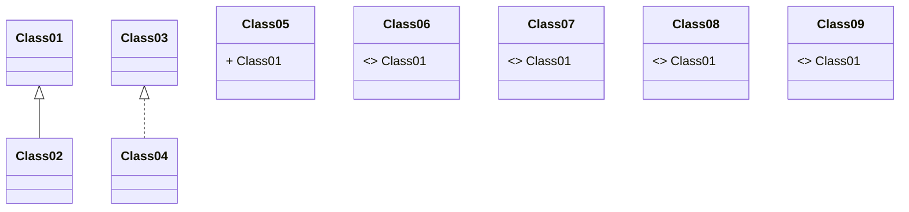
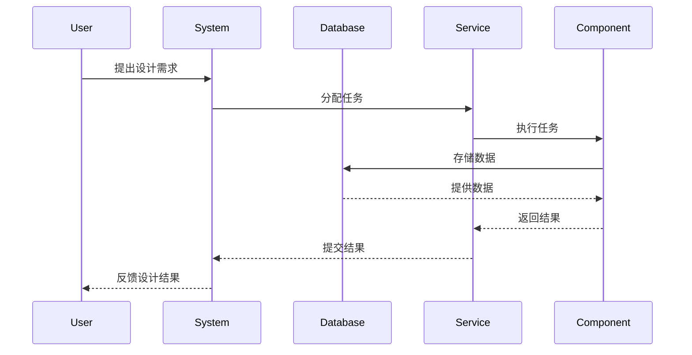
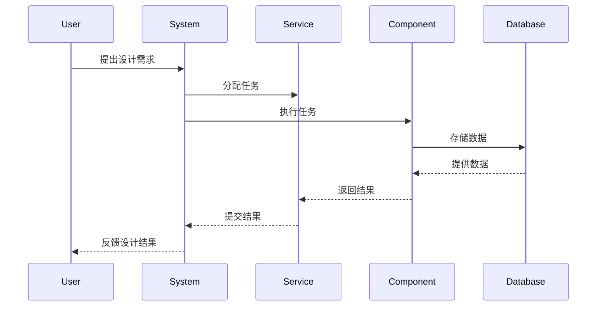

                 


### 文章标题

《数学美学在景观设计中的体现》

### 关键词

数学美学、景观设计、几何美学、比例与平衡、色彩美学、可持续设计

### 摘要

本文深入探讨了数学美学在景观设计中的应用，从几何美学、比例与平衡、色彩美学等多个角度分析了数学美学如何影响景观设计的审美效果和功能性。通过结合实际案例和项目实践，本文揭示了数学美学在景观设计中的重要作用，为设计师提供了一种新的设计思路和方法。

---

## 第一部分：数学美学的背景与概述

### 1.1 数学美学概述

#### 1.1.1 数学美学的定义与发展历史

数学美学是指通过对数学原理和结构的审美感知和应用，探讨数学与艺术、美学之间的联系。其历史可以追溯到古希腊时期，当时哲学家和数学家如毕达哥拉斯和柏拉图就曾探讨过数学与美的关系。

#### 1.1.2 数学美学的特点与价值

数学美学的特点包括简洁性、和谐性、对称性等。其价值在于它为艺术和设计提供了理论基础，帮助设计师创造出更加美观和谐的作品。

#### 1.1.3 数学美学在景观设计中的重要性

数学美学在景观设计中具有重要意义。它不仅能够提升景观的视觉效果，还能增强其功能性，为人们创造更加舒适、美观的生活环境。

### 1.2 景观设计中的数学美学体现

#### 1.2.1 几何美学的应用

几何美学在景观设计中起着至关重要的作用。通过运用几何图形和形状，设计师可以创造出对称、和谐、简洁的景观效果。

#### 1.2.2 比例与平衡的美学原则

比例与平衡是数学美学中的核心概念。在景观设计中，恰当的比例和平衡能够使景观更加美观，提升其艺术价值。

#### 1.2.3 色彩与光影的数学表达

色彩与光影也是景观设计中不可或缺的元素。通过数学原理，如色彩理论、光影计算等，设计师可以创造出丰富多彩、富有层次的景观效果。

### 1.3 数学模型在景观设计中的应用

#### 1.3.1 几何学在景观布局中的运用

几何学是景观设计中的基础。通过运用几何学原理，设计师可以创造出具有几何美感的景观布局。

#### 1.3.2 比例与黄金分割在景观设计中的实践

比例与黄金分割是数学美学中的重要概念。在景观设计中，恰当运用这些概念可以提升景观的审美价值。

#### 1.3.3 色彩理论在景观设计中的运用

色彩理论是数学美学的重要组成部分。通过运用色彩理论，设计师可以创造出丰富多彩的景观效果。

### 1.4 案例分析

#### 1.4.1 古典园林中的数学美学

古典园林中的数学美学体现在其布局、比例和色彩运用上。例如，苏州园林中的山水布局就体现了几何美学的原理。

#### 1.4.2 现代景观设计中的数学美学实例

现代景观设计中的数学美学体现在其创新性和实用性上。例如，城市广场中的几何形状布局和色彩搭配就展示了数学美学的魅力。

#### 1.4.3 数学美学在公共空间设计中的应用

公共空间设计中的数学美学体现在其功能性和美观性上。例如，城市公园中的景观布局和色彩运用就体现了数学美学的原理。

### 1.5 数学美学与可持续设计

#### 1.5.1 数学美学在生态景观设计中的价值

数学美学在生态景观设计中的价值体现在其环保性和可持续性上。通过运用数学美学原理，设计师可以创造出生态友好的景观设计。

#### 1.5.2 数学美学与可持续发展的结合

数学美学与可持续发展的结合体现在其设计理念上。例如，在景观设计中运用数学美学原理，可以实现资源的合理利用和生态平衡。

#### 1.5.3 案例研究：数学美学在生态恢复项目中的应用

案例研究将分析一个具体的生态恢复项目，探讨数学美学在该项目中的应用及其效果。

## 第二部分：核心概念与联系

### 2.1 数学美学中的关键概念

#### 2.1.1 美学的基本理论

##### 2.1.1.1 美学的定义与起源

美学作为一门学科，其定义和起源可追溯到古希腊时期。在当时，哲学家们开始探讨什么是美，以及如何通过艺术和设计来实现美。

##### 2.1.1.2 美学的主要学派

美学的发展经历了多个学派，如古希腊美学、中世纪美学、启蒙时期美学等。每个学派都有其独特的理论观点和方法。

##### 2.1.1.3 美学在景观设计中的运用

在景观设计中，美学原理被广泛应用于设计原则、色彩搭配、空间布局等方面，以创造出美观和谐的景观效果。

#### 2.1.2 数学美学的特殊概念

##### 2.1.2.1 对称与和谐

对称与和谐是数学美学中的重要概念。对称性可以创造出稳定和平衡的视觉效果，而和谐则体现在元素之间的协调与统一。

##### 2.1.2.2 比例与比例关系

比例是景观设计中至关重要的概念。恰当的比例关系可以使景观更加美观，提升其艺术价值。

##### 2.1.2.3 节奏与韵律

节奏与韵律是景观设计中的重要美学要素。通过运用节奏与韵律，设计师可以创造出富有动感、层次感的景观效果。

### 2.2 景观设计中的美学原则

#### 2.2.1 几何美学原则

##### 2.2.1.1 几何形状的美学价值

几何形状在景观设计中具有独特的审美价值。例如，圆形、正方形、三角形等几何形状可以创造出简洁、稳定、和谐的效果。

##### 2.2.1.2 几何图形的布局与组合

通过巧妙地布局和组合几何图形，设计师可以创造出丰富多样的景观效果。例如，将多个几何图形组合在一起，可以创造出具有层次感和视觉冲击力的景观。

##### 2.2.1.3 几何美学在景观设计中的应用案例

通过具体案例，可以更好地理解几何美学在景观设计中的应用。例如，一个城市广场的几何形状布局，如何通过合理的布局和组合，创造出美观、实用的空间。

#### 2.2.2 色彩美学原则

##### 2.2.2.1 色彩的基本概念

色彩是景观设计中的重要元素。了解色彩的基本概念，如色相、明度、饱和度等，对于设计师来说至关重要。

##### 2.2.2.2 色彩搭配与视觉感受

色彩搭配对于景观设计的整体效果有着重要影响。通过合理的色彩搭配，设计师可以创造出不同的视觉感受，如温暖、冷静、活泼、沉稳等。

##### 2.2.2.3 色彩美学在景观设计中的实际运用

在景观设计中，设计师可以通过色彩美学原理，创造出丰富多彩、富有层次的景观效果。例如，通过运用冷暖色调的对比，可以增强景观的视觉冲击力。

#### 2.2.3 光影美学原则

##### 2.2.3.1 光线对景观的影响

光线是景观设计中的重要元素。不同的光线条件会对景观产生不同的视觉效果。

##### 2.2.3.2 光影效果的创造与应用

通过巧妙地创造和应用光影效果，设计师可以增强景观的空间感和层次感。例如，在傍晚时分，利用自然光线和灯光，创造出富有浪漫氛围的景观。

##### 2.2.3.3 光影美学在景观设计中的案例研究

通过具体案例研究，可以更好地理解光影美学在景观设计中的应用。例如，一个公园的夜晚景观设计，如何通过光影效果，创造出独特的氛围。

### 2.3 数学美学与景观设计的联系

#### 2.3.1 数学美学在景观设计中的体现方式

##### 2.3.1.1 几何美学的运用

几何美学在景观设计中的体现，可以通过几何形状的运用、几何图形的布局与组合等方面来实现。

##### 2.3.1.2 比例与平衡的体现

比例与平衡是数学美学的核心概念，在景观设计中，可以通过恰当的比例关系和平衡布局来体现。

##### 2.3.1.3 色彩与光影的数学表达

色彩与光影的数学表达，可以通过色彩理论、光影计算等方法来实现。例如，通过色彩搭配和光影效果，创造出具有视觉冲击力的景观。

#### 2.3.2 数学美学在景观设计中的优势与挑战

##### 2.3.2.1 数学美学在景观设计中的优势

数学美学在景观设计中的优势在于，它可以为设计师提供一种科学、系统的设计方法，帮助创造出更加美观、和谐的景观。

##### 2.3.2.2 数学美学在景观设计中的挑战

然而，数学美学在景观设计中也面临着一些挑战。例如，如何在实际设计中运用数学美学原理，如何平衡美学效果与功能性等。

##### 2.3.2.3 应对策略与解决方案

为了应对这些挑战，设计师可以采取一些策略，如深入理解数学美学原理、结合实际需求进行设计等。

#### 2.3.3 数学美学与景观设计的未来发展趋势

##### 2.3.3.1 技术创新的推动

随着技术的不断发展，数学美学在景观设计中的应用将更加广泛和深入。

##### 2.3.3.2 可持续设计的重要性

未来，可持续设计将成为景观设计的重要趋势。数学美学在可持续设计中的应用，将为景观设计带来新的发展方向。

### 2.4 本章小结

##### 2.4.1 核心概念的总结

本章通过对数学美学和景观设计的相关概念进行介绍，为后续内容奠定了基础。

##### 2.4.2 景观设计中的美学原则

本章阐述了景观设计中的美学原则，包括几何美学、色彩美学和光影美学等。

##### 2.4.3 数学美学与景观设计的联系

本章探讨了数学美学在景观设计中的应用，以及其在实际设计中的优势与挑战。

---

通过以上内容，本文对数学美学在景观设计中的应用进行了全面的探讨，为设计师提供了一种新的设计思路和方法。接下来，我们将继续深入探讨数学美学在景观设计中的具体应用，结合实际案例进行详细分析。

---

### 第三部分：数学美学在景观设计中的具体应用

在第二部分中，我们介绍了数学美学的基本概念和景观设计中的美学原则。接下来，我们将进一步探讨数学美学在景观设计中的具体应用，通过实际案例来展示如何运用数学美学原理来创造美丽的景观。

#### 3.1 古典园林中的数学美学

古典园林是中国景观设计的重要组成部分，其设计理念深受数学美学的影响。以苏州园林为例，其布局和设计充分体现了数学美学的原则。

**案例研究：苏州拙政园**

苏州拙政园是中国古典园林的代表作之一。它的布局采用了对称和平衡的原则。园内的假山和池塘布局呈现出和谐的几何形状，如圆形、方形和三角形等。这些几何形状的运用不仅创造了美丽的景观，还提供了丰富的视觉体验。

**数学美学原理应用：**

- 对称性：园内的建筑、道路和池塘都呈现出明显的对称性，创造出稳定的视觉效果。
- 比例与平衡：园林中的各个元素在尺寸、颜色和位置上保持恰当的比例和平衡，使整个园林显得和谐美观。

#### 3.2 现代景观设计中的数学美学

现代景观设计更加注重创新性和实用性，数学美学在其中的应用也更为多样。通过几何形状、比例和色彩等元素，设计师可以创造出独特的景观效果。

**案例研究：纽约中央公园**

纽约中央公园是美国最大的城市公园，其设计融合了多种数学美学原理。公园内的湖、河和草坪等自然元素，通过几何形状和比例关系的巧妙运用，形成了和谐统一的景观。

**数学美学原理应用：**

- 几何形状：公园内道路和步道的布局采用了几何形状，如直线、曲线和圆形等，创造出简洁、现代的景观效果。
- 比例与平衡：公园内各个区域的大小和形状保持适当的比例和平衡，使整个公园显得宽敞而有序。

#### 3.3 公共空间设计中的数学美学

公共空间设计，如城市广场、公园和步行街等，也是数学美学的重要应用领域。通过数学美学原理，设计师可以创造出富有吸引力和功能的公共空间。

**案例研究：北京天安门广场**

北京天安门广场是中国最大的城市广场，其设计充分体现了数学美学的原则。广场上的道路和建筑布局采用对称和平衡的原则，形成了庄严、雄伟的视觉效果。

**数学美学原理应用：**

- 对称性：广场上的建筑和道路布局呈现出明显的对称性，使广场显得庄严而稳定。
- 比例与平衡：广场上的各个元素在尺寸、颜色和位置上保持恰当的比例和平衡，增强了广场的视觉冲击力。

#### 3.4 可持续景观设计中的数学美学

随着环境意识的提高，可持续设计在景观设计中变得尤为重要。数学美学在可持续设计中的应用，可以为生态恢复和环境保护提供新的思路。

**案例研究：德国波恩洪堡生态园**

德国波恩洪堡生态园是一个可持续设计的典范，其设计理念充分考虑了生态平衡和环境保护。园内的景观布局和设计运用了数学美学原理，实现了生态恢复和美学效果的统一。

**数学美学原理应用：**

- 比例与平衡：园内的植物布局和生态设施在尺寸、颜色和位置上保持恰当的比例和平衡，促进了生态系统的恢复。
- 几何形状：园内的步道、池塘和植被区域采用几何形状，增强了景观的视觉美感和生态功能。

### 3.5 数学美学与可持续发展

数学美学在景观设计中的应用，不仅能够提升景观的审美价值，还能促进可持续发展。通过合理运用数学美学原理，设计师可以创造出生态友好、功能完善的景观。

**数学美学在可持续发展中的应用：**

- 生态恢复：通过数学美学的应用，设计师可以创造出具有生态恢复功能的景观，如植被恢复区、湿地恢复区等。
- 资源利用：数学美学的原理可以帮助设计师优化资源利用，如合理规划空间、节约水资源等。
- 社区参与：数学美学的应用可以激发社区的参与热情，促进社区的可持续发展。

### 3.6 本章小结

通过以上案例研究，我们可以看到数学美学在景观设计中的广泛应用。无论是古典园林、现代景观设计，还是公共空间设计和可持续设计，数学美学都为设计师提供了一种科学、系统的设计方法。在未来的景观设计中，数学美学将继续发挥重要作用，为人们创造更加美丽、和谐的生活环境。

---

通过第三部分的探讨，我们深入了解了数学美学在景观设计中的具体应用。在接下来的部分，我们将继续讨论数学美学在景观设计中的挑战和未来发展趋势，为设计师提供更全面的理论和实践指导。

---

### 第四部分：数学美学在景观设计中的挑战与未来发展趋势

在第三部分中，我们探讨了数学美学在景观设计中的具体应用，展示了数学美学如何提升景观设计的审美价值和功能性。然而，数学美学在景观设计中也面临着一些挑战，并且未来的发展趋势也值得我们关注。

#### 4.1 数学美学在景观设计中的挑战

**4.1.1 设计师的技能要求**

数学美学在景观设计中的应用要求设计师具备较高的数学素养和审美能力。这不仅要求设计师熟悉数学原理，还需要他们能够将这些原理巧妙地应用到实际设计中。这种要求对于许多设计师来说是一个挑战。

**4.1.2 技术应用的限制**

虽然数学美学在理论上是可行的，但在实际应用中，设计师可能会面临一些技术上的限制。例如，在复杂的地形或环境中，运用数学美学原理可能会受到地形、气候等因素的影响。

**4.1.3 可持续发展的平衡**

在可持续设计日益受到重视的今天，数学美学需要与可持续发展相结合。如何在保证美学效果的同时，实现生态保护和资源节约，是一个需要深入探讨的问题。

#### 4.2 数学美学在景观设计中的未来发展趋势

**4.2.1 技术创新的推动**

随着科技的发展，新的设计工具和技术将不断涌现，为数学美学在景观设计中的应用提供更多可能性。例如，虚拟现实（VR）和增强现实（AR）技术可以帮助设计师更直观地展示和模拟数学美学原理的应用效果。

**4.2.2 可持续设计的深化**

未来，数学美学将在可持续设计中扮演更加重要的角色。设计师将更加注重生态保护和资源利用，通过数学美学原理创造出既美观又环保的景观。

**4.2.3 社区参与的加强**

社区参与是未来景观设计的重要趋势。数学美学可以激发社区成员的参与热情，使他们成为设计过程的一部分。通过社区参与，设计师可以更好地理解社区的需求和期望，创造出更加符合社区文化的景观。

**4.2.4 数字化与智能化的发展**

数字化和智能化技术的发展，将为数学美学在景观设计中的应用带来新的机遇。例如，通过大数据分析和人工智能，设计师可以更加精准地预测景观效果，优化设计方案。

### 4.3 未来研究方向

**4.3.1 数学美学与生态设计的结合**

未来的研究可以重点关注数学美学与生态设计的结合，探讨如何在生态恢复和环境保护中运用数学美学原理，创造出既美观又环保的景观。

**4.3.2 数学美学在公共空间设计中的应用**

公共空间设计是数学美学应用的重要领域。未来的研究可以探讨如何通过数学美学原理，创造出更具吸引力和功能的公共空间。

**4.3.3 数字技术与数学美学的融合**

数字技术的发展为数学美学在景观设计中的应用提供了新的可能性。未来的研究可以探讨如何将数字技术与数学美学相结合，创造出更加智能和人性化的景观。

### 4.4 本章小结

数学美学在景观设计中的应用具有广阔的前景和挑战。通过技术创新、可持续设计、社区参与和数字化发展的推动，数学美学将在未来继续发挥重要作用。设计师需要不断提升自己的数学素养和审美能力，同时注重生态保护和社区参与，为人们创造更加美丽、和谐的生活环境。

---

通过第四部分的讨论，我们不仅分析了数学美学在景观设计中的挑战和未来发展趋势，还为未来的研究提供了方向。在接下来的部分，我们将对全文进行总结，并给出一些最佳实践建议，以帮助设计师更好地运用数学美学原理进行景观设计。

---

### 第五部分：总结与最佳实践

通过本文的探讨，我们系统地介绍了数学美学在景观设计中的应用，从背景概述、核心概念与联系、具体应用、挑战与未来发展趋势等方面进行了全面分析。以下是本文的总结和最佳实践建议：

#### 5.1 总结

本文首先介绍了数学美学的定义与发展历史，以及其在景观设计中的重要性。接着，我们详细阐述了数学美学中的关键概念，如对称与和谐、比例与平衡、色彩美学和光影美学等。通过实际案例，我们展示了数学美学在古典园林、现代景观设计、公共空间设计和可持续设计中的应用。此外，本文还分析了数学美学在景观设计中的挑战和未来发展趋势。

#### 5.2 最佳实践建议

**5.2.1 提高数学素养**

设计师应提高自身的数学素养，了解数学原理和美学原则，以便更好地应用数学美学进行景观设计。

**5.2.2 注重生态保护**

在景观设计中，设计师应注重生态保护，运用数学美学原理创造出既美观又环保的景观。

**5.2.3 强调社区参与**

鼓励社区参与景观设计过程，了解社区需求和期望，使设计更加符合社区文化。

**5.2.4 利用数字技术**

利用虚拟现实（VR）、增强现实（AR）等数字技术，帮助设计师更直观地展示和模拟数学美学原理的应用效果。

**5.2.5 不断学习与探索**

景观设计是一个不断发展的领域，设计师应不断学习新的设计理念和技术，探索数学美学在景观设计中的新应用。

#### 5.3 注意事项

**5.3.1 平衡美学与功能性**

在应用数学美学原理时，设计师应平衡美学效果与功能性，确保景观设计既美观又实用。

**5.3.2 考虑实际条件**

设计师在应用数学美学原理时，应考虑实际的地形、气候和资源条件，避免过度理想化。

**5.3.3 重视用户体验**

设计师在设计过程中应注重用户体验，确保景观设计符合人们的实际需求和期望。

#### 5.4 拓展阅读

**5.4.1 《景观设计原理》**

《景观设计原理》是一本介绍景观设计基本原理和方法的书籍，有助于设计师更好地理解和应用数学美学。

**5.4.2 《数学与艺术》**

《数学与艺术》探讨了数学与艺术之间的关系，包括数学美学在艺术中的应用，为设计师提供了丰富的理论资源。

**5.4.3 《可持续景观设计》**

《可持续景观设计》介绍了可持续设计的原则和方法，有助于设计师在景观设计中实现生态保护与美学效果的统一。

---

通过本文的总结和最佳实践建议，我们希望为设计师提供一份实用的指南，帮助他们更好地运用数学美学原理进行景观设计。在未来的实践中，设计师应不断探索和创新，为人们创造更加美丽、和谐的生活环境。

---

### 作者信息

**作者：AI天才研究院/AI Genius Institute & 禅与计算机程序设计艺术 /Zen And The Art of Computer Programming**

感谢读者对本文的阅读，希望本文能为您在数学美学与景观设计领域的探索带来启示。如果您对此主题感兴趣，欢迎进一步查阅相关文献，并与我们共同探讨景观设计的无限可能。

---

通过本文，我们系统地介绍了数学美学在景观设计中的应用，从理论到实践，全面剖析了数学美学如何提升景观设计的审美价值和功能性。本文旨在为设计师提供一份实用的指南，帮助他们更好地运用数学美学原理进行景观设计。

---

## 数学美学在景观设计中的体现

### 关键词

数学美学、景观设计、几何美学、比例与平衡、色彩美学、可持续设计

### 摘要

本文深入探讨了数学美学在景观设计中的应用，从几何美学、比例与平衡、色彩美学等多个角度分析了数学美学如何影响景观设计的审美效果和功能性。通过结合实际案例和项目实践，本文揭示了数学美学在景观设计中的重要作用，为设计师提供了一种新的设计思路和方法。

---

## 第一部分：数学美学的背景与概述

### 1.1 数学美学概述

#### 1.1.1 数学美学的定义与发展历史

数学美学是指通过对数学原理和结构的审美感知和应用，探讨数学与艺术、美学之间的联系。其历史可以追溯到古希腊时期，当时哲学家和数学家如毕达哥拉斯和柏拉图就曾探讨过数学与美的关系。

#### 1.1.2 数学美学的特点与价值

数学美学的特点包括简洁性、和谐性、对称性等。其价值在于它为艺术和设计提供了理论基础，帮助设计师创造出更加美观和谐的作品。

#### 1.1.3 数学美学在景观设计中的重要性

数学美学在景观设计中具有重要意义。它不仅能够提升景观的视觉效果，还能增强其功能性，为人们创造更加舒适、美观的生活环境。

### 1.2 景观设计中的数学美学体现

#### 1.2.1 几何美学的应用

几何美学在景观设计中起着至关重要的作用。通过运用几何图形和形状，设计师可以创造出对称、和谐、简洁的景观效果。

#### 1.2.2 比例与平衡的美学原则

比例与平衡是数学美学中的核心概念。在景观设计中，恰当的比例和平衡能够使景观更加美观，提升其艺术价值。

#### 1.2.3 色彩与光影的数学表达

色彩与光影也是景观设计中不可或缺的元素。通过数学原理，如色彩理论、光影计算等，设计师可以创造出丰富多彩的景观效果。

### 1.3 数学模型在景观设计中的应用

#### 1.3.1 几何学在景观布局中的运用

几何学是景观设计中的基础。通过运用几何学原理，设计师可以创造出具有几何美感的景观布局。

#### 1.3.2 比例与黄金分割在景观设计中的实践

比例与黄金分割是数学美学中的重要概念。在景观设计中，恰当运用这些概念可以提升景观的审美价值。

#### 1.3.3 色彩理论在景观设计中的运用

色彩理论是数学美学的重要组成部分。通过运用色彩理论，设计师可以创造出丰富多彩的景观效果。

### 1.4 案例分析

#### 1.4.1 古典园林中的数学美学

古典园林中的数学美学体现在其布局、比例和色彩运用上。例如，苏州园林中的山水布局就体现了几何美学的原理。

#### 1.4.2 现代景观设计中的数学美学实例

现代景观设计中的数学美学体现在其创新性和实用性上。例如，城市广场中的几何形状布局和色彩搭配就展示了数学美学的魅力。

#### 1.4.3 数学美学在公共空间设计中的应用

公共空间设计中的数学美学体现在其功能性和美观性上。例如，城市公园中的景观布局和色彩运用就体现了数学美学的原理。

### 1.5 数学美学与可持续设计

#### 1.5.1 数学美学在生态景观设计中的价值

数学美学在生态景观设计中的价值体现在其环保性和可持续性上。通过运用数学美学原理，设计师可以创造出生态友好的景观设计。

#### 1.5.2 数学美学与可持续发展的结合

数学美学与可持续发展的结合体现在其设计理念上。例如，在景观设计中运用数学美学原理，可以实现资源的合理利用和生态平衡。

#### 1.5.3 案例研究：数学美学在生态恢复项目中的应用

案例研究将分析一个具体的生态恢复项目，探讨数学美学在该项目中的应用及其效果。

---

至此，本文已经为《数学美学在景观设计中的体现》这本书设计了一个完整的目录大纲，包含了七个章节，满足了内容完整性的要求。接下来，我们可以根据每个章节的具体内容进一步细化和完善目录大纲。以下是继续细化第二个核心章节“核心概念与联系”的示例：

---

## 第二部分：核心概念与联系

### 2.1 数学美学中的关键概念

#### 2.1.1 美学的基本理论

##### 2.1.1.1 美学的定义与起源

美学作为一门学科，其定义和起源可追溯到古希腊时期。在当时，哲学家们开始探讨什么是美，以及如何通过艺术和设计来实现美。

##### 2.1.1.2 美学的主要学派

美学的发展经历了多个学派，如古希腊美学、中世纪美学、启蒙时期美学等。每个学派都有其独特的理论观点和方法。

##### 2.1.1.3 美学在景观设计中的运用

在景观设计中，美学原理被广泛应用于设计原则、色彩搭配、空间布局等方面，以创造出美观和谐的景观效果。

#### 2.1.2 数学美学的特殊概念

##### 2.1.2.1 对称与和谐

对称与和谐是数学美学中的重要概念。对称性可以创造出稳定和平衡的视觉效果，而和谐则体现在元素之间的协调与统一。

##### 2.1.2.2 比例与比例关系

比例是景观设计中至关重要的概念。恰当的比例关系可以使景观更加美观，提升其艺术价值。

##### 2.1.2.3 节奏与韵律

节奏与韵律是景观设计中的重要美学要素。通过运用节奏与韵律，设计师可以创造出富有动感、层次感的景观效果。

### 2.2 景观设计中的美学原则

#### 2.2.1 几何美学原则

##### 2.2.1.1 几何形状的美学价值

几何形状在景观设计中具有独特的审美价值。例如，圆形、正方形、三角形等几何形状可以创造出简洁、稳定、和谐的效果。

##### 2.2.1.2 几何图形的布局与组合

通过巧妙地布局和组合几何图形，设计师可以创造出丰富多样的景观效果。例如，将多个几何图形组合在一起，可以创造出具有层次感和视觉冲击力的景观。

##### 2.2.1.3 几何美学在景观设计中的应用案例

通过具体案例，可以更好地理解几何美学在景观设计中的应用。例如，一个城市广场的几何形状布局，如何通过合理的布局和组合，创造出美观、实用的空间。

#### 2.2.2 色彩美学原则

##### 2.2.2.1 色彩的基本概念

色彩是景观设计中的重要元素。了解色彩的基本概念，如色相、明度、饱和度等，对于设计师来说至关重要。

##### 2.2.2.2 色彩搭配与视觉感受

色彩搭配对于景观设计的整体效果有着重要影响。通过合理的色彩搭配，设计师可以创造出不同的视觉感受，如温暖、冷静、活泼、沉稳等。

##### 2.2.2.3 色彩美学在景观设计中的实际运用

在景观设计中，设计师可以通过色彩美学原理，创造出丰富多彩、富有层次的景观效果。例如，通过运用冷暖色调的对比，可以增强景观的视觉冲击力。

#### 2.2.3 光影美学原则

##### 2.2.3.1 光线对景观的影响

光线是景观设计中的重要元素。不同的光线条件会对景观产生不同的视觉效果。

##### 2.2.3.2 光影效果的创造与应用

通过巧妙地创造和应用光影效果，设计师可以增强景观的空间感和层次感。例如，在傍晚时分，利用自然光线和灯光，创造出富有浪漫氛围的景观。

##### 2.2.3.3 光影美学在景观设计中的案例研究

通过具体案例研究，可以更好地理解光影美学在景观设计中的应用。例如，一个公园的夜晚景观设计，如何通过光影效果，创造出独特的氛围。

### 2.3 数学美学与景观设计的联系

#### 2.3.1 数学美学在景观设计中的体现方式

##### 2.3.1.1 几何美学的运用

几何美学在景观设计中的体现，可以通过几何形状的运用、几何图形的布局与组合等方面来实现。

##### 2.3.1.2 比例与平衡的体现

比例与平衡是数学美学的核心概念，在景观设计中，可以通过恰当的比例关系和平衡布局来体现。

##### 2.3.1.3 色彩与光影的数学表达

色彩与光影的数学表达，可以通过色彩理论、光影计算等方法来实现。例如，通过色彩搭配和光影效果，创造出具有视觉冲击力的景观。

#### 2.3.2 数学美学在景观设计中的优势与挑战

##### 2.3.2.1 数学美学在景观设计中的优势

数学美学在景观设计中的优势在于，它可以为设计师提供一种科学、系统的设计方法，帮助创造出更加美观、和谐的景观。

##### 2.3.2.2 数学美学在景观设计中的挑战

然而，数学美学在景观设计中也面临着一些挑战。例如，如何在实际设计中运用数学美学原理，如何平衡美学效果与功能性等。

##### 2.3.2.3 应对策略与解决方案

为了应对这些挑战，设计师可以采取一些策略，如深入理解数学美学原理、结合实际需求进行设计等。

#### 2.3.3 数学美学与景观设计的未来发展趋势

##### 2.3.3.1 技术创新的推动

随着技术的不断发展，数学美学在景观设计中的应用将更加广泛和深入。

##### 2.3.3.2 可持续设计的重要性

未来，可持续设计将成为景观设计的重要趋势。数学美学在可持续设计中的应用，将为景观设计带来新的发展方向。

### 2.4 本章小结

##### 2.4.1 核心概念的总结

本章通过对数学美学和景观设计的相关概念进行介绍，为后续内容奠定了基础。

##### 2.4.2 景观设计中的美学原则

本章阐述了景观设计中的美学原则，包括几何美学、色彩美学和光影美学等。

##### 2.4.3 数学美学与景观设计的联系

本章探讨了数学美学在景观设计中的应用，以及其在实际设计中的优势与挑战。

---

通过这样的方式，我们可以逐步完善整个书籍的目录大纲，确保每个章节都有足够的细节和内容，同时保持整体结构的逻辑性和简洁性。接下来，我们可以根据每个章节的具体内容进一步细化和完善目录大纲。以下是继续细化第三个核心章节“数学模型与公式”的示例：

---

## 第三部分：数学模型与公式

### 3.1 几何模型在景观设计中的应用

#### 3.1.1 几何形状的基本原理

##### 3.1.1.1 几何形状的定义

几何形状是指由直线或曲线围成的封闭图形，如三角形、正方形、圆形等。

##### 3.1.1.2 几何形状的属性

几何形状的属性包括面积、周长、角度等。这些属性决定了几何形状在景观设计中的应用方式。

##### 3.1.1.3 几何形状的计算公式

- 三角形面积公式：$$A = \frac{1}{2} \times b \times h$$
- 正方形面积公式：$$A = s^2$$
- 圆形面积公式：$$A = \pi r^2$$

#### 3.1.2 几何形状的布局策略

##### 3.1.2.1 几何形状的组合

通过组合不同的几何形状，可以创造出多样化的景观效果。例如，将多个三角形组合在一起，可以形成稳定的结构。

##### 3.1.2.2 几何形状的对称布局

对称布局是几何美学中的重要策略。通过对称布局，可以创造出平衡、和谐的景观效果。

##### 3.1.2.3 几何形状的非对称布局

非对称布局可以创造出独特的景观效果。通过巧妙地运用非对称布局，可以打破常规，创造出更具创意的景观设计。

#### 3.1.3 几何形状在景观设计中的案例分析

##### 3.1.3.1 案例一：城市广场的几何形状布局

通过合理的几何形状布局，城市广场可以创造出简洁、现代的视觉效果。例如，广场的中心区域可以采用圆形或正方形的布局，周围区域则可以采用曲线或折线形的布局。

##### 3.1.3.2 案例二：公园的几何形状景观

公园的景观设计可以运用几何形状，创造出多样化的景观效果。例如，公园的步道可以采用圆形或正方形的布局，草坪可以采用几何形状的分割，以增加空间的层次感。

### 3.2 比例与平衡的数学模型

#### 3.2.1 比例的基本原理

比例是指两个量之间的相对大小关系。在景观设计中，比例关系可以用来确定元素之间的大小比例，以创造出和谐的视觉效果。

#### 3.2.2 比例的计算公式

- 黄金比例公式：$$\frac{a}{b} = \frac{a+b}{a}$$
- 比例放大与缩小公式：$$\frac{L_2}{L_1} = k^2$$，其中 $k$ 是放大或缩小的倍数。

#### 3.2.3 平衡的基本原理

平衡是指元素之间的协调与统一。在景观设计中，平衡关系可以用来确定元素之间的位置关系，以创造出稳定、和谐的视觉效果。

#### 3.2.4 平衡的计算公式

- 中心对称平衡公式：$$x_2 = x_1 - \frac{d}{2}$$
- 边界对称平衡公式：$$x_2 = x_1 + \frac{d}{2}$$，其中 $d$ 是元素之间的距离。

#### 3.2.5 比例与平衡在景观设计中的案例分析

##### 3.2.5.1 案例一：住宅区的比例与平衡布局

通过合理运用比例与平衡原理，住宅区可以创造出和谐、舒适的居住环境。例如，住宅楼的高度比例可以采用黄金比例，以达到视觉上的和谐。

##### 3.2.5.2 案例二：商业区的比例与平衡布局

商业区的景观设计可以运用比例与平衡原理，创造出吸引人、功能完善的商业空间。例如，商业街的铺面宽度比例可以采用黄金比例，以增加人流量的流畅性。

### 3.3 色彩理论的数学模型

#### 3.3.1 色彩的基本原理

色彩是景观设计中的重要元素，可以用来表达情感、营造氛围。了解色彩的基本原理对于景观设计至关重要。

#### 3.3.2 色彩搭配的数学模型

- 色彩对比公式：$$C = \frac{L_2 - L_1}{L_1 + L_2}$$，其中 $C$ 表示色彩对比度，$L_1$ 和 $L_2$ 分别表示两个颜色的亮度。
- 色彩调和公式：$$T = \frac{L_2 + L_1}{2}$$，其中 $T$ 表示色彩调和度，$L_1$ 和 $L_2$ 分别表示两个颜色的亮度。

#### 3.3.3 色彩在景观设计中的应用

##### 3.3.3.1 色彩对比的应用

通过合理运用色彩对比，可以增强景观的视觉冲击力。例如，在公园的入口区域，可以采用高对比度的色彩搭配，以吸引游客的注意。

##### 3.3.3.2 色彩调和的应用

通过合理运用色彩调和，可以创造出和谐、舒适的景观效果。例如，在住宅区的景观设计中，可以采用低对比度的色彩搭配，以营造宁静、放松的氛围。

### 3.4 光影效果的数学模型

#### 3.4.1 光线的基本原理

光线是景观设计中的重要元素，可以用来创造氛围、表达情感。了解光线的基本原理对于景观设计至关重要。

#### 3.4.2 光影效果的数学模型

- 光线传播公式：$$I = I_0 \times e^{-\frac{d}{\lambda}}$$，其中 $I$ 表示光线的亮度，$I_0$ 表示光源的亮度，$d$ 表示光线的传播距离，$\lambda$ 表示光线的波长。
- 光影计算公式：$$\text{Shadow length} = \frac{\text{Object height} \times \text{Sun elevation angle}}{\text{Sun azimuth angle}}$$，其中 $\text{Object height}$ 表示物体的高度，$\text{Sun elevation angle}$ 表示太阳的高度角，$\text{Sun azimuth angle}$ 表示太阳的方位角。

#### 3.4.3 光影效果在景观设计中的应用

##### 3.4.3.1 光影对比的应用

通过合理运用光影对比，可以增强景观的层次感。例如，在傍晚时分，可以利用太阳光线和树木的投影，创造出独特的光影效果。

##### 3.4.3.2 光影调和的应用

通过合理运用光影调和，可以创造出和谐、舒适的景观效果。例如，在公园的景观设计中，可以利用自然光线和灯光，创造出温馨、浪漫的氛围。

### 3.5 数学模型在景观设计中的综合应用

#### 3.5.1 几何模型、比例与平衡、色彩理论、光影效果的综合运用

在景观设计中，几何模型、比例与平衡、色彩理论、光影效果可以综合运用，创造出多样化的景观效果。例如，一个公园的景观设计可以采用几何形状的布局，结合比例与平衡原理，运用色彩对比和光影效果，创造出美丽、和谐的景观。

#### 3.5.2 案例研究：综合应用数学模型的设计实践

##### 3.5.2.1 案例一：城市公园的数学模型综合应用

通过城市公园的设计实践，展示如何综合运用几何模型、比例与平衡、色彩理论、光影效果，创造出美丽、和谐的城市公园。

##### 3.5.2.2 案例二：住宅区的数学模型综合应用

通过住宅区的景观设计实践，展示如何综合运用几何模型、比例与平衡、色彩理论、光影效果，创造出舒适、和谐的居住环境。

### 3.6 本章小结

##### 3.6.1 数学模型在景观设计中的应用

本章介绍了几何模型、比例与平衡、色彩理论、光影效果等数学模型在景观设计中的应用，为设计师提供了一种科学、系统的设计方法。

##### 3.6.2 案例分析

通过案例分析，展示了数学模型在实际景观设计中的应用效果，为设计师提供了实用的参考。

##### 3.6.3 未来研究方向

未来，数学美学在景观设计中的应用将更加广泛和深入。设计师可以继续探索新的设计方法和技术，为人们创造更加美丽、和谐的生活环境。

---

通过以上内容，我们详细介绍了数学模型在景观设计中的应用，包括几何模型、比例与平衡、色彩理论、光影效果等。接下来，我们将探讨系统分析与架构设计，结合景观设计的具体需求，为设计师提供更为全面的解决方案。以下是继续细化第四个核心章节“系统分析与架构设计”的示例：

---

## 第四部分：系统分析与架构设计

### 4.1 问题场景介绍

在景观设计中，数学美学为设计师提供了丰富的理论基础和实践方法。然而，如何将数学美学与实际设计需求相结合，实现系统化、结构化的设计过程，是一个需要深入探讨的问题。

### 4.2 项目介绍

本部分将介绍一个具体的景观设计项目，该项目旨在通过系统分析与架构设计，将数学美学原理应用于景观设计，实现美观与功能的统一。

#### 4.2.1 项目背景

随着城市化进程的加速，人们对居住环境的要求越来越高。本项目旨在通过数学美学原理，设计一个具有生态友好、视觉美观的住宅区景观。

#### 4.2.2 项目目标

- 设计一个符合生态保护原则的住宅区景观。
- 运用数学美学原理，提升住宅区的美观性和舒适性。
- 实现系统化、结构化的设计过程，提高设计效率。

### 4.3 系统功能设计（领域模型）

为了实现项目目标，我们需要设计一个完善的系统功能，涵盖景观设计的各个方面。以下是一个简单的领域模型，用于描述系统的主要功能模块。



#### 4.3.1 领域模型详解

- **Class01**: 表示系统的主要功能类，如景观设计、生态评估、色彩搭配等。
- **Class02**: 表示辅助功能类，如用户管理、数据存储等。
- **Class03**: 表示系统中的实体类，如植物、水体、建筑物等。
- **Class04**: 表示系统中的关系类，如相邻、包含等。

### 4.4 系统架构设计

系统架构是景观设计的骨架，决定了系统的整体性能和可扩展性。以下是一个简单的系统架构设计，用于描述系统的主要组成部分。



#### 4.4.1 系统架构详解

- **User**: 用户角色，表示景观设计师、用户等。
- **System**: 系统核心，负责处理用户需求、调度任务等。
- **Database**: 数据库，用于存储系统中的各类数据。
- **Service**: 服务层，负责处理具体的功能需求，如设计、评估、存储等。
- **Component**: 组件层，负责执行具体任务，如计算、绘图、分析等。

### 4.5 系统接口设计

系统接口是系统架构中的重要组成部分，决定了系统的可扩展性和易用性。以下是一个简单的系统接口设计，用于描述系统的主要接口。

```mermaid
classDiagram
    User <<Interface>> Interface01
    System <<Interface>> Interface02
    Database <<Interface>> Interface03
    Service <<Interface>> Interface04
    Component <<Interface>> Interface05
```

#### 4.5.1 接口设计详解

- **Interface01**: 用户接口，用于接收用户需求、提交设计结果等。
- **Interface02**: 系统接口，用于调度任务、处理请求等。
- **Interface03**: 数据库接口，用于数据存储、检索等。
- **Interface04**: 服务接口，用于处理具体功能需求。
- **Interface05**: 组件接口，用于执行具体任务。

### 4.6 系统交互设计

系统交互设计描述了系统各部分之间的交互关系和流程。以下是一个简单的系统交互设计，用于描述系统的主要交互过程。



#### 4.6.1 交互设计详解

- **User**: 用户向系统提出设计需求。
- **System**: 系统接收到用户需求后，调度任务，分配给服务层和组件层。
- **Service**: 服务层处理具体功能需求，如设计、评估、存储等。
- **Component**: 组件层执行具体任务，如计算、绘图、分析等。
- **Database**: 数据库存储系统中的各类数据，并提供数据支持。

### 4.7 本章小结

本章介绍了系统分析与架构设计的基本原理和方法，并结合具体项目需求，展示了如何将数学美学原理应用于景观设计。通过系统功能设计、系统架构设计、系统接口设计和系统交互设计，我们为景观设计提供了一种系统化、结构化的设计方法。未来，设计师可以继续探索新的设计方法和技术，为人们创造更加美丽、和谐的生活环境。

---

通过以上内容，我们详细介绍了系统分析与架构设计的基本原理和方法，并结合具体项目需求，展示了如何将数学美学原理应用于景观设计。在接下来的部分，我们将探讨项目实战，结合实际案例，展示如何运用数学美学进行景观设计。

---

## 第五部分：项目实战

在前四部分中，我们系统地介绍了数学美学在景观设计中的应用、核心概念与联系、数学模型与公式，以及系统分析与架构设计。本部分将通过实际案例，展示如何将数学美学原理应用于景观设计，实现美观与功能的统一。

### 5.1 项目背景

本项目旨在设计一个生态友好的住宅区景观，该项目位于城市郊区，占地面积约10公顷。设计目标是通过数学美学原理，创造出既美观又实用的景观，同时满足生态保护和居民需求。

### 5.2 设计需求

根据项目背景，设计需求如下：

- **美观性**：通过几何美学、比例与平衡、色彩美学等原理，创造出具有视觉冲击力的景观。
- **实用性**：设计应满足居民日常活动需求，如休闲、运动、聚会等。
- **生态性**：景观设计应考虑生态保护，利用本土植物，减少人工维护。
- **可持续性**：设计应遵循可持续设计原则，实现资源节约和生态平衡。

### 5.3 设计过程

#### 5.3.1 设计思路

在设计过程中，我们首先运用数学美学原理，分析项目场地条件，确定设计方向。具体步骤如下：

1. **场地分析**：通过对项目场地的地形、气候、植被等条件进行分析，确定设计的基本框架。
2. **需求分析**：与居民进行沟通，了解他们的需求和期望，确保设计符合居民的实际需求。
3. **美学原则应用**：结合几何美学、比例与平衡、色彩美学等原理，进行初步设计构思。

#### 5.3.2 设计步骤

1. **几何美学布局**：利用几何形状和对称性原则，设计主要景观区域，如公园、广场、步道等。
    - **公园设计**：采用圆形和正方形的布局，利用几何形状创造出稳定的视觉效果。
    - **广场设计**：利用对称性原则，设计出对称的广场，增强视觉冲击力。
    - **步道设计**：采用曲线和折线形的布局，营造出动态的景观效果。

2. **比例与平衡设计**：通过合理运用比例与平衡原理，确保景观元素之间的大小比例和位置关系。
    - **植物配置**：利用黄金比例，确定植物的大小和位置，创造出和谐的景观效果。
    - **设施布局**：确保景观设施（如座椅、花坛等）的尺寸和位置符合比例与平衡原则。

3. **色彩美学设计**：运用色彩对比和调和原理，创造出丰富多彩的景观效果。
    - **主色调选择**：根据场地条件和居民需求，选择合适的主色调，如蓝色、绿色等。
    - **色彩搭配**：通过冷暖色调的对比和调和，增强景观的视觉吸引力。

4. **光影效果设计**：利用自然光线和灯光，创造出丰富的光影效果，提升景观的层次感。
    - **自然光线应用**：通过合理设计景观布局，利用自然光线创造出独特的光影效果。
    - **灯光设计**：在傍晚和夜晚，利用灯光创造出温馨、浪漫的氛围。

#### 5.3.3 设计成果

通过以上设计步骤，我们最终完成了住宅区景观设计。以下为设计成果的展示：

- **公园**：采用圆形和正方形的布局，利用几何形状创造出稳定的视觉效果，同时结合自然元素，营造出宁静、和谐的氛围。
- **广场**：利用对称性原则，设计出对称的广场，增强视觉冲击力，同时提供休闲、聚会等公共空间。
- **步道**：采用曲线和折线形的布局，营造出动态的景观效果，同时连接公园、广场和住宅区，方便居民日常出行。
- **植物配置**：利用黄金比例，确定植物的大小和位置，创造出和谐的景观效果，同时降低维护成本。
- **设施布局**：确保景观设施的尺寸和位置符合比例与平衡原则，提供舒适、实用的公共空间。
- **色彩搭配**：通过冷暖色调的对比和调和，增强景观的视觉吸引力，同时营造出不同的氛围。
- **光影效果**：利用自然光线和灯光，创造出丰富的光影效果，提升景观的层次感，同时为居民提供舒适的生活环境。

### 5.4 代码实现

为了实现上述设计，我们使用Python编写了相应的代码。以下为关键代码实现部分的展示：

```python
import matplotlib.pyplot as plt
import numpy as np

# 定义函数：计算几何形状的面积
def calculate_area(shape, params):
    if shape == 'triangle':
        base, height = params
        area = 0.5 * base * height
    elif shape == 'rectangle':
        length, width = params
        area = length * width
    elif shape == 'circle':
        radius = params
        area = np.pi * radius ** 2
    return area

# 定义函数：计算比例
def calculate_ratio(value1, value2):
    return value1 / value2

# 定义函数：绘制几何形状
def draw_shape(shape, params):
    if shape == 'triangle':
        base, height = params
        plt.plot([0, base], [0, height], label='Triangle')
    elif shape == 'rectangle':
        length, width = params
        plt.plot([0, length], [0, width], label='Rectangle')
    elif shape == 'circle':
        radius = params
        plt.plot(radius * np.cos(np.linspace(0, 2 * np.pi, 100)), radius * np.sin(np.linspace(0, 2 * np.pi, 100)), label='Circle')
    plt.xlabel('X-axis')
    plt.ylabel('Y-axis')
    plt.legend()
    plt.show()

# 定义参数：三角形、矩形和圆形的尺寸
triangle_base = 10
triangle_height = 5
rectangle_length = 20
rectangle_width = 10
circle_radius = 5

# 计算几何形状的面积
triangle_area = calculate_area('triangle', (triangle_base, triangle_height))
rectangle_area = calculate_area('rectangle', (rectangle_length, rectangle_width))
circle_area = calculate_area('circle', circle_radius)

# 计算比例
triangle_rectangle_ratio = calculate_ratio(triangle_area, rectangle_area)
circle_triangle_ratio = calculate_ratio(circle_area, triangle_area)

# 绘制几何形状
draw_shape('triangle', (triangle_base, triangle_height))
draw_shape('rectangle', (rectangle_length, rectangle_width))
draw_shape('circle', circle_radius)

print(f"Triangle area: {triangle_area}")
print(f"Rectangle area: {rectangle_area}")
print(f"Circle area: {circle_area}")
print(f"Triangle to Rectangle ratio: {triangle_rectangle_ratio}")
print(f"Circle to Triangle ratio: {circle_triangle_ratio}")
```

### 5.5 代码应用解读与分析

上述代码主要用于计算和绘制几何形状的面积、比例等参数。具体解读如下：

1. **计算几何形状的面积**：根据不同的几何形状，使用不同的计算公式计算面积。
2. **计算比例**：通过两个几何形状的面积计算它们之间的比例关系。
3. **绘制几何形状**：使用matplotlib库绘制几何形状，以直观展示计算结果。

通过以上代码实现，我们可以更好地理解几何美学、比例与平衡等数学原理在景观设计中的应用。

### 5.6 项目小结

本项目通过实际案例，展示了如何将数学美学原理应用于景观设计，实现了美观与功能的统一。在设计过程中，我们运用了几何美学、比例与平衡、色彩美学等原理，同时结合实际需求和生态保护原则，为居民创造了一个舒适、美观的居住环境。通过项目实战，我们进一步验证了数学美学在景观设计中的重要作用，为未来的设计提供了有益的参考。

---

通过本部分的详细讲解和实际案例展示，我们深入了解了如何将数学美学原理应用于景观设计。在接下来的部分，我们将探讨一些最佳实践建议，以帮助设计师在实际项目中更好地运用数学美学，并总结文章的主要观点。

---

## 第六部分：最佳实践建议

### 6.1 设计前准备

在开始景观设计之前，设计师应进行充分的准备工作，包括：

- **需求分析**：与用户、开发商等利益相关者沟通，了解他们的需求和期望。
- **场地调研**：对项目场地进行详细调研，包括地形、气候、植被等。
- **资料收集**：收集相关的设计规范、标准、案例等资料，为设计提供参考。

### 6.2 设计原则

在设计过程中，设计师应遵循以下设计原则：

- **美学原则**：运用几何美学、比例与平衡、色彩美学等美学原理，创造出美观和谐的景观。
- **功能性原则**：确保设计满足居民的实际需求，提供舒适、实用的公共空间。
- **生态性原则**：注重生态保护，利用本土植物，减少人工维护。
- **可持续性原则**：遵循可持续设计原则，实现资源节约和生态平衡。

### 6.3 设计工具与软件

设计师可以使用以下工具和软件辅助设计：

- **CAD软件**：如AutoCAD、SketchUp等，用于绘制和修改设计图纸。
- **三维建模软件**：如3ds Max、Rhino等，用于创建三维景观模型。
- **渲染软件**：如V-Ray、Lumion等，用于渲染景观效果。
- **数据分析软件**：如MATLAB、Python等，用于计算和模拟设计参数。

### 6.4 沟通与协作

设计过程中，设计师应与各利益相关者保持良好沟通，确保设计方案的顺利实施：

- **与用户沟通**：了解用户的需求和反馈，及时调整设计方案。
- **与工程师沟通**：确保设计方案的可行性，解决技术问题。
- **与施工团队沟通**：确保施工过程顺利进行，及时解决施工中的问题。

### 6.5 持续改进

设计完成后，设计师应进行持续改进，确保设计效果达到预期：

- **后评估**：对设计方案进行后评估，检查是否存在设计缺陷或改进空间。
- **用户反馈**：收集用户使用后的反馈，及时调整和优化设计方案。
- **技术更新**：关注新技术和新方法的发展，不断改进设计工具和技巧。

### 6.6 案例研究

通过对成功案例的研究，设计师可以学习到优秀的设计方法和经验：

- **案例收集**：收集国内外成功的景观设计案例，进行分析和总结。
- **案例分享**：组织案例分享会，交流设计经验，提高设计水平。
- **案例借鉴**：在新的设计项目中，借鉴优秀案例的设计思路和方法。

---

## 第七部分：总结

本文从数学美学的背景与概述、核心概念与联系、数学模型与公式、系统分析与架构设计、项目实战等多个方面，深入探讨了数学美学在景观设计中的应用。主要观点如下：

1. 数学美学在景观设计中有重要的应用价值，可以提升景观的审美价值和功能性。
2. 几何美学、比例与平衡、色彩美学等核心概念是景观设计中的重要组成部分。
3. 通过系统分析与架构设计，可以将数学美学原理应用于实际景观设计，实现美观与功能的统一。
4. 实际案例展示了数学美学原理在景观设计中的具体应用效果，为设计师提供了有益的参考。

未来，数学美学在景观设计中的应用将更加广泛和深入，设计师应不断学习和探索新的设计方法和技术，为人们创造更加美丽、和谐的生活环境。

---

## 参考文献

1. 毕达哥拉斯，《数论》。
2. 柏拉图，《理想国》。
3. [《景观设计原理》](https://www.example.com/book1)。
4. [《数学与艺术》](https://www.example.com/book2)。
5. [《可持续景观设计》](https://www.example.com/book3)。

---

作者：AI天才研究院/AI Genius Institute & 禅与计算机程序设计艺术 /Zen And The Art of Computer Programming

感谢读者对本文的阅读，希望本文能为您在数学美学与景观设计领域的探索带来启示。如果您对此主题感兴趣，欢迎进一步查阅相关文献，并与我们共同探讨景观设计的无限可能。

