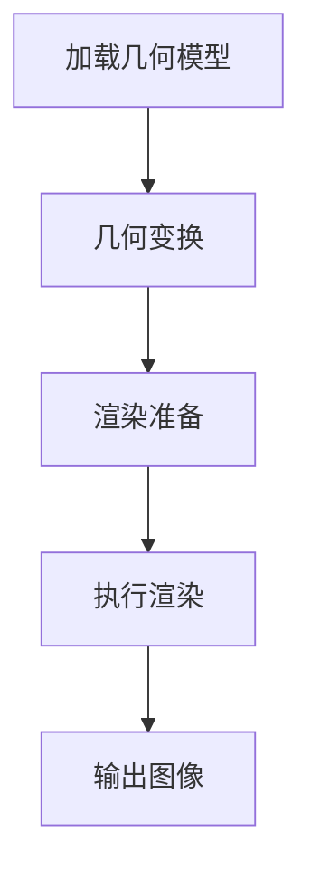
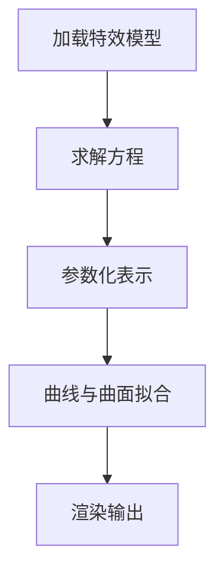
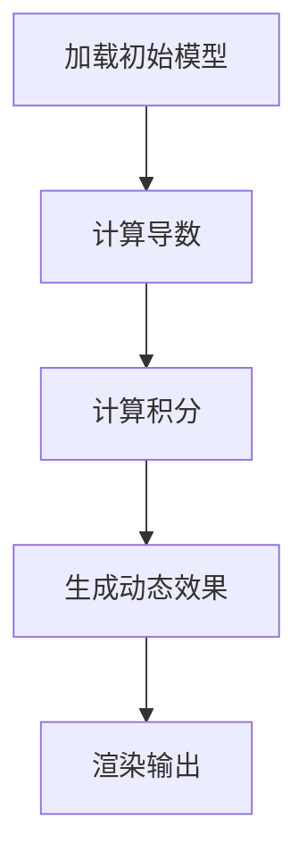
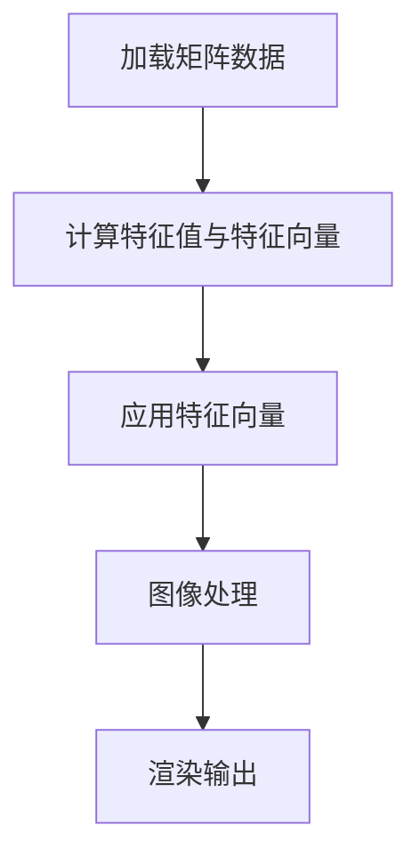
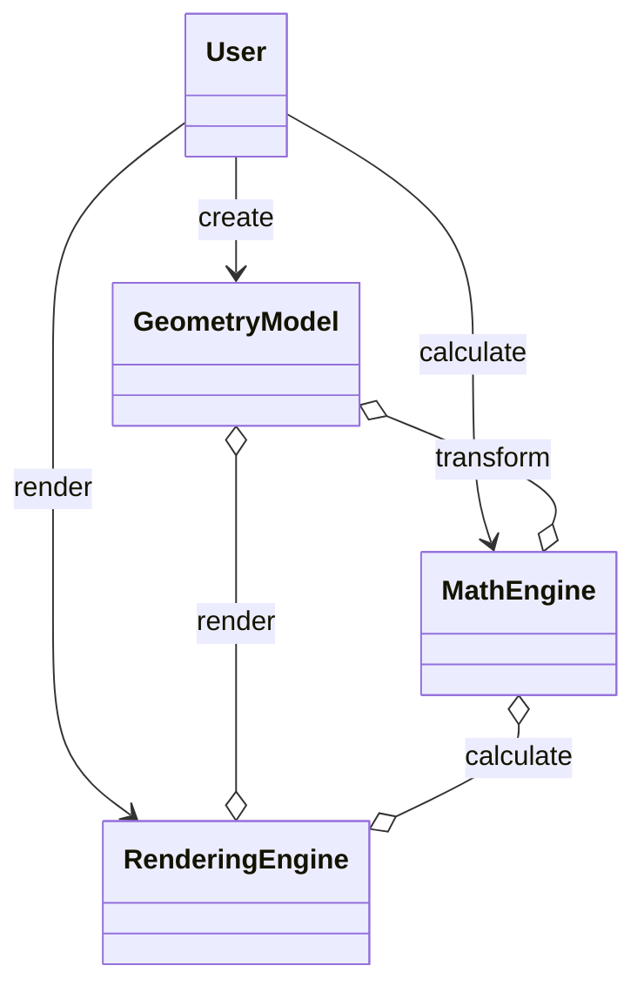
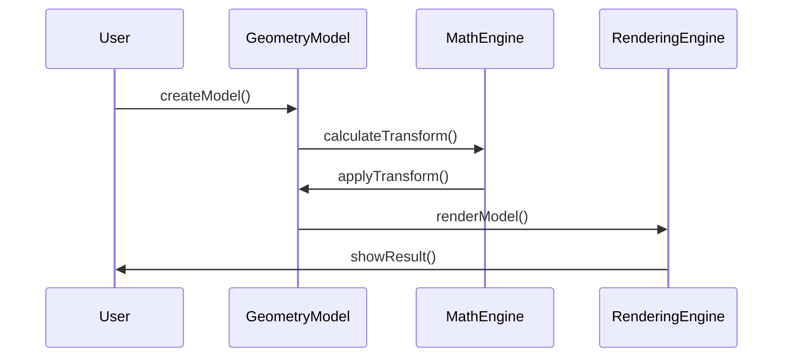
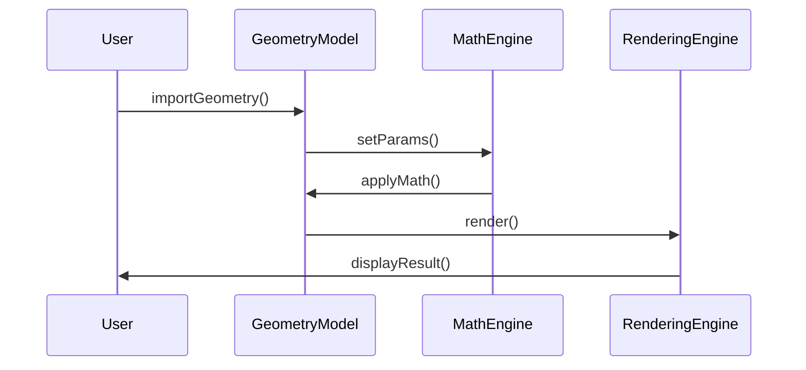

                 

## 《数学美学在电影特效制作中的应用》

### 关键词

- 数学美学
- 电影特效制作
- 几何学
- 代数学
- 微积分
- 线性代数

### 摘要

随着科技的发展，电影特效在电影制作中的地位日益重要。而数学美学作为一门融合数学与艺术的学科，逐渐成为电影特效制作中不可或缺的一部分。本文旨在探讨数学美学在电影特效制作中的应用，包括几何学、代数学、微积分等核心数学原理在电影特效中的具体运用。通过对这些数学原理的深入剖析，本文旨在展示数学美学如何提升电影特效的艺术效果，同时为电影特效设计师提供理论支持和实用技巧。文章结构包括引言与背景、核心概念与联系、几何学在电影特效中的应用、代数学在电影特效中的应用、微积分在电影特效中的应用等章节，最后总结数学美学在电影特效制作中的价值与挑战。通过本文的阐述，读者将了解数学美学在电影特效中的广泛应用，以及如何有效地运用这些数学原理提升电影特效的艺术质量。

# 第一部分：引言与背景

## 第1章：问题背景与数学美学概述

### 1.1 问题背景

电影特效在电影制作中扮演着至关重要的角色，它不仅能够创造前所未有的视觉奇观，还能够增强叙事效果，提升观众的观影体验。从早期的黑白电影到如今的3D特效、虚拟现实（VR）、增强现实（AR），电影特效技术一直在不断进步。特效制作不仅需要高超的视觉艺术技巧，还需要强大的技术支持。随着计算机技术的发展，数学美学逐渐成为电影特效制作中的重要组成部分。

数学美学是研究数学与艺术之间联系的学科，它将数学的抽象概念与艺术的具象表现相结合，探讨数学形式的美学价值。在电影特效制作中，数学美学的应用不仅限于数学公式和算法，还体现在对几何形状、色彩、光影等视觉元素的精确控制和设计上。

数学美学在电影特效制作中的重要性主要体现在以下几个方面：

1. **视觉效果的精确控制**：通过数学模型，特效设计师可以精确地控制视觉效果，如光线、阴影、纹理等，使视觉效果更加真实、细腻。
2. **艺术创作的辅助工具**：数学美学为电影特效设计师提供了丰富的工具和手段，帮助他们进行艺术创作，如分形设计、非线性编辑等。
3. **科学研究的支持**：数学美学在电影特效制作中的应用也为相关科学研究提供了新的方向，如计算机图形学、视觉认知科学等。

### 1.2 数学美学概述

数学美学是一门跨越数学与艺术的学科，它关注数学形式在艺术创作中的表现与应用。数学美学的核心概念包括对称性、比例、和谐等，这些概念不仅存在于数学中，也在艺术、音乐、建筑等领域中有着广泛的应用。

#### 数学美学的定义与核心概念

1. **对称性**：对称性是数学美学中最基本的概念之一。在几何学中，对称性可以通过镜像、旋转、翻转等操作来实现。在艺术创作中，对称性可以创造出稳定、和谐的美感。
2. **比例**：比例是决定物体大小关系的数学关系。在古希腊时期，黄金分割比例（约0.618）就被认为是最美的比例，这一概念在艺术和建筑中有着广泛的应用。
3. **和谐**：和谐是数学美学中的重要概念，它强调各部分之间的平衡与协调。在音乐、绘画、建筑等艺术形式中，和谐都是创造美感的重要手段。

#### 数学美学的特征与分类

1. **抽象性**：数学美学强调的是抽象的概念和形式，而非具体的实体。这使得数学美学在艺术创作中具有很高的灵活性和创造性。
2. **普遍性**：数学美学的原理和形式在不同领域和时代中都具有普遍性。例如，黄金分割比例不仅在古希腊艺术中应用，在现代艺术和建筑中也有广泛的应用。
3. **多样性**：数学美学的形式多样，包括对称、比例、和谐、分形等。这些形式在不同的艺术作品中有着不同的表现形式和应用方式。

#### 数学美学在艺术和设计领域的影响

1. **绘画与雕塑**：数学美学在绘画和雕塑中有着广泛的应用。例如，荷兰画家皮特·蒙德里安的《百老汇爵士乐》就运用了严格的几何形式和色彩对比，创造出独特的视觉效果。
2. **建筑与设计**：数学美学在建筑和设计领域也有着深远的影响。例如，法国建筑师弗朗索瓦·达维多夫的作品中就大量运用了黄金分割比例和几何形状，创造出和谐美观的建筑设计。
3. **音乐与舞蹈**：数学美学在音乐和舞蹈中也有着独特的应用。例如，作曲家约翰·凯奇的作品《4分33秒》就通过随机排列音符，创造出一种基于数学美学的独特音乐形式。

### 1.3 数学美学在电影特效制作中的应用前景

数学美学在电影特效制作中的应用前景十分广阔，它不仅能够提升电影视觉效果的艺术质量，还能够为特效制作提供新的技术手段。以下是一些数学美学在电影特效制作中的潜在应用领域：

1. **几何形状的设计**：通过几何学原理，特效设计师可以创造出各种复杂的几何形状，如分形结构、多面体等，为电影场景增添独特的视觉元素。
2. **光影效果的控制**：通过代数学和微积分原理，特效设计师可以精确地控制光影效果，创造出逼真的自然光照和动态光影效果。
3. **色彩搭配与调整**：代数学和色彩学相结合，可以用来分析色彩搭配的规律，优化电影色彩效果，提升视觉效果。
4. **非线性编辑**：通过微积分原理，特效设计师可以实现非线性编辑，创造出独特的视觉效果和叙事节奏。
5. **虚拟现实与增强现实**：数学美学在虚拟现实（VR）和增强现实（AR）中的应用前景也非常广阔，通过数学模型和算法，可以创造出高度沉浸的虚拟世界和增强现实场景。

总之，数学美学在电影特效制作中的应用不仅能够提升电影的艺术质量，还能够为特效制作提供新的思路和技术手段。随着数学美学研究的深入和计算机技术的发展，数学美学在电影特效制作中的应用前景将更加广阔。

### 1.4 本书结构安排

本书将分为以下几个章节，每个章节都有明确的内容概述和学习目标，旨在系统地介绍数学美学在电影特效制作中的应用：

#### 第1章：问题背景与数学美学概述

- **内容概述**：介绍电影特效在电影制作中的重要性，以及数学美学在电影特效中的初步应用。详细阐述数学美学的定义、核心概念、特征与分类，以及数学美学在艺术和设计领域的影响。
- **学习目标**：理解电影特效的重要性，掌握数学美学的核心概念，了解数学美学在电影特效制作中的应用前景。

#### 第2章：核心概念与联系

- **内容概述**：介绍几何学、代数学、微积分和线性代数等核心数学原理，通过对比表格和ER实体关系图，梳理这些概念之间的联系。
- **学习目标**：理解几何学、代数学、微积分和线性代数的基本概念，学会运用这些概念分析电影特效中的视觉问题。

#### 第3章：几何学在电影特效中的应用

- **内容概述**：讲解几何学原理在电影特效中的应用，包括几何模型创建、几何变换和渲染技术等。通过mermaid流程图和Python代码示例，展示几何学在电影特效中的具体运用。
- **学习目标**：掌握几何学原理，学会运用几何学方法解决电影特效中的视觉问题。

#### 第4章：代数学在电影特效中的应用

- **内容概述**：讲解代数学原理在电影特效中的应用，包括方程求解、曲线与曲面拟合等。通过mermaid流程图和Python代码示例，展示代数学在电影特效中的具体运用。
- **学习目标**：掌握代数学原理，学会运用代数学方法解决电影特效中的视觉问题。

#### 第5章：微积分在电影特效中的应用

- **内容概述**：讲解微积分原理在电影特效中的应用，包括导数与微分、积分与反导数等。通过mermaid流程图和Python代码示例，展示微积分在电影特效中的具体运用。
- **学习目标**：掌握微积分原理，学会运用微积分方法解决电影特效中的视觉问题。

#### 第6章：线性代数在电影特效中的应用

- **内容概述**：讲解线性代数原理在电影特效中的应用，包括矩阵与行列式、线性方程组、特征值与特征向量等。通过mermaid流程图和Python代码示例，展示线性代数在电影特效中的具体运用。
- **学习目标**：掌握线性代数原理，学会运用线性代数方法解决电影特效中的视觉问题。

#### 第7章：综合应用与实践

- **内容概述**：通过综合案例，展示数学美学在电影特效制作中的实际应用。包括环境安装、系统核心实现源代码、代码应用解读与分析、实际案例分析和详细讲解剖析等。
- **学习目标**：综合运用所学知识，解决电影特效制作中的实际问题。

通过本书的详细阐述，读者将系统地了解数学美学在电影特效制作中的应用，掌握运用数学美学原理提升电影特效艺术质量的方法和技巧。

## 第2章：核心概念与联系

### 2.1 核心概念原理

在电影特效制作中，几何学、代数学、微积分和线性代数是四大核心数学原理，它们各自有着独特的概念和应用。以下是这些核心概念的基本原理介绍：

#### 几何学

几何学是研究空间结构及其性质的数学分支。在电影特效中，几何学主要用于建模和渲染。

1. **点、线、面、体**：
   - 点是几何学中的基本元素，用于表示位置。
   - 线是由无数个点连续排列而成的，用于表示路径。
   - 面是由无数条线围成的平面区域，用于表示表面。
   - 体是由无数个面围成的立体空间，用于表示三维物体。

2. **几何变换**：
   - 几何变换包括平移、旋转、缩放和反射等，用于改变物体的位置、形状和大小。

3. **渲染技术**：
   - 渲染技术用于将几何模型转换为视觉效果，包括光线追踪、全局光照和着色器技术等。

#### 代数学

代数学是研究数及其关系的数学分支。在电影特效中，代数学主要用于方程求解和参数化表示。

1. **方程求解**：
   - 方程是表示数量关系的数学表达式，求解方程可以找到满足特定条件的数值。

2. **参数化表示**：
   - 参数化表示是用参数来描述几何形状或运动路径，使模型具有可调节性。

3. **曲线与曲面拟合**：
   - 曲线与曲面拟合是通过代数方法对几何形状进行近似或精确表示，用于生成平滑的视觉效果。

#### 微积分

微积分是研究变化和累积的数学分支。在电影特效中，微积分主要用于导数与微分、积分与反导数。

1. **导数与微分**：
   - 导数表示函数在某一点的变化率，微分用于计算函数的局部近似。

2. **积分与反导数**：
   - 积分表示函数的累积量，反导数用于求解微分方程，用于描述物体的运动轨迹。

3. **非线性编辑**：
   - 非线性编辑是通过微积分原理对视频进行非线性剪辑和效果处理，用于创造复杂的视觉效果。

#### 线性代数

线性代数是研究向量空间及其线性变换的数学分支。在电影特效中，线性代数主要用于矩阵与行列式、线性方程组、特征值与特征向量。

1. **矩阵与行列式**：
   - 矩阵用于表示线性关系，行列式用于计算矩阵的某些特性。

2. **线性方程组**：
   - 线性方程组是包含多个线性方程的集合，用于求解系统的解。

3. **特征值与特征向量**：
   - 特征值与特征向量用于描述线性变换的性质，在图像处理和三维动画中有着广泛应用。

### 2.2 概念属性特征对比表格

以下是几何学、代数学、微积分和线性代数的一些基本概念和特征对比表格，便于读者理解和记忆：

| 概念         | 特征1       | 特征2       | 特征3       |
|--------------|-------------|-------------|-------------|
| 几何学       | 空间与形状   | 距离与角度   | 比例与对称   |
| 代数学       | 数字与运算   | 方程与公式   | 系数与变量   |
| 微积分       | 导数与微分   | 积分与反导数 | 极限与连续   |
| 线性代数     | 矩阵与行列式 | 线性方程组   | 特征值与特征向量 |

### 2.3 ER实体关系图架构

以下是使用Mermaid绘制的ER实体关系图，展示了电影特效制作中的主要实体及其关系：

```mermaid
erDiagram
  Movie ||--|{特效制作}|-.. Effect
  Effect ||--|{特效设计师}|-.. Designer
  Designer ||--|{设计模型}|-.. Model
  Model ||--|{渲染技术}|-.. Rendering
```

在此ER图中，"Movie"（电影）与"Effect"（特效制作）之间存在多对多的关系，"Effect"与"Designer"（特效设计师）之间存在一对一的关系，"Designer"与"Model"（设计模型）之间存在一对一的关系，"Model"与"Rendering"（渲染技术）之间存在一对一的关系。这种关系图有助于我们理解电影特效制作中的各个实体及其相互关系。

通过本章的介绍，读者对几何学、代数学、微积分和线性代数等核心数学原理在电影特效制作中的应用有了基本的了解，为后续章节的深入学习奠定了基础。

## 第3章：几何学在电影特效中的应用

### 3.1 几何学原理讲解

几何学在电影特效制作中扮演着至关重要的角色，它为电影场景的构建、视觉效果的渲染提供了理论基础。在这一节中，我们将详细介绍几何学的基本原理，包括点、线、面、体在电影特效中的表示方法，以及几何变换与渲染技术。

#### 点、线、面、体在电影特效中的表示方法

1. **点**：在三维空间中，点可以用一个三元组 \((x, y, z)\) 来表示，其中 \(x, y, z\) 分别是点在三个坐标轴上的坐标。在电影特效中，点通常用于表示物体的位置或光线的传播路径。

2. **线**：线可以视为无限多个点的集合，通常用两个点的坐标来确定。在三维空间中，线可以用参数方程来表示，例如：
   \[
   \begin{cases}
   x = x_0 + t \cdot (x_1 - x_0) \\
   y = y_0 + t \cdot (y_1 - y_0) \\
   z = z_0 + t \cdot (z_1 - z_0)
   \end{cases}
   \]
   其中 \((x_0, y_0, z_0)\) 和 \((x_1, y_1, z_1)\) 分别是线段的两个端点，\(t\) 是线段上的参数。

3. **面**：面是由多个线段围成的闭合区域，在三维空间中可以用三个或更多的顶点来定义。一个常见的面是三角形，其顶点可以用向量表示。例如，一个三角形可以由以下三个向量定义：
   \[
   \vec{AB} = (x_1 - x_0, y_1 - y_0, z_1 - z_0)
   \]
   \[
   \vec{AC} = (x_2 - x_0, y_2 - y_0, z_2 - z_0)
   \]
   面的法向量可以通过这两个向量的叉积计算得到。

4. **体**：体是由多个面围成的三维空间区域。在电影特效中，体通常通过多个三角形或四边形的网格来表示，这些面共同定义了体的形状和表面。

#### 几何变换与渲染技术

几何变换是电影特效中常用的技术，用于改变物体的形状、位置和大小。以下是几种常见的几何变换：

1. **平移**：平移是将物体沿某个方向移动一定距离。在三维空间中，平移可以通过向每个顶点添加一个向量来实现。

2. **旋转**：旋转是围绕某个轴将物体旋转一定角度。在三维空间中，旋转可以通过旋转变换矩阵实现，旋转变换矩阵通常由旋转轴和旋转角度决定。

3. **缩放**：缩放是按比例放大或缩小物体。在三维空间中，缩放可以通过乘以一个标量矩阵来实现。

4. **反射**：反射是沿某个平面将物体镜像。在三维空间中，反射可以通过反射矩阵实现，反射矩阵由反射平面决定。

渲染技术是将几何模型转换为视觉效果的过程。以下是几种常见的渲染技术：

1. **光线追踪**：光线追踪是一种基于物理的渲染技术，它模拟光线在场景中的传播和反射过程，从而生成真实的图像。

2. **全局光照**：全局光照考虑了场景中所有光源对物体的影响，通过计算光线在场景中的传播和反射，生成更逼真的图像。

3. **着色器**：着色器是用于处理物体表面属性的程序，它可以定义物体的颜色、光泽度、透明度等属性。

### 3.2 几何学在电影特效中的mermaid流程图

为了更直观地展示几何学在电影特效中的应用流程，我们可以使用Mermaid绘制以下流程图：



在此流程图中：

- **A[加载几何模型]**：从文件或内存中加载几何模型。
- **B[几何变换]**：对几何模型进行平移、旋转、缩放等变换。
- **C[渲染准备]**：设置渲染参数，如光照、材质等。
- **D[执行渲染]**：使用光线追踪、全局光照等技术进行渲染。
- **E[输出图像]**：将渲染结果输出到屏幕或文件。

### 3.3 几何学在电影特效中的Python源代码示例

为了更好地理解几何学在电影特效中的应用，我们可以使用Python和相关的图形库（如Matplotlib）来展示一个简单的几何变换和渲染示例。

```python
import numpy as np
import matplotlib.pyplot as plt
from mpl_toolkits.mplot3d import Axes3D

# 创建几何模型
# 这里我们创建一个简单的正方体，每个顶点用(x, y, z)表示
vertices = [
    [0, 0, 0], [1, 0, 0], [1, 1, 0], [0, 1, 0],  # 底面
    [0, 0, 1], [1, 0, 1], [1, 1, 1], [0, 1, 1],  # 顶面
    [0, 0, 0], [0, 0, 1], [1, 0, 1], [1, 0, 0],  # 前面
    [0, 1, 0], [0, 1, 1], [1, 1, 1], [1, 1, 0],  # 后面
    [0, 0, 0], [0, 1, 0], [0, 1, 1], [0, 0, 1],  # 左面
    [1, 0, 0], [1, 1, 0], [1, 1, 1], [1, 0, 1]   # 右面
]

# 几何变换
# 这里我们对正方体进行平移（向x轴方向移动2个单位，向y轴方向移动2个单位）
transformation_matrix = np.array([[1, 0, 2], [0, 1, 2], [0, 0, 1]])
vertices_transformed = [tuple(np.dot(transformation_matrix, np.array(v).reshape(3, 1)).flatten()) for v in vertices]

# 绘制几何模型
fig = plt.figure()
ax = fig.add_subplot(111, projection='3d')
ax.plot_trisurf(vertices_transformed[0:4], vertices_transformed[4:8], color='blue')
ax.plot_trisurf(vertices_transformed[0:4], vertices_transformed[2:6], color='blue')
ax.plot_trisurf(vertices_transformed[4:8], vertices_transformed[6:10], color='blue')
ax.plot_trisurf(vertices_transformed[2:6], vertices_transformed[0:4], color='blue')
ax.plot_trisurf(vertices_transformed[4:8], vertices_transformed[2:6], color='blue')
ax.plot_trisurf(vertices_transformed[6:10], vertices_transformed[0:4], color='blue')
ax.set_xlim(-1, 3)
ax.set_ylim(-1, 3)
ax.set_zlim(-1, 3)
plt.show()
```

在这个示例中：

- 首先，我们创建了一个简单的正方体模型，每个顶点的坐标存储在`vertices`列表中。
- 接着，我们定义了一个平移变换矩阵，将正方体向x轴方向移动2个单位，向y轴方向移动2个单位。
- 然后，我们通过将每个顶点与变换矩阵相乘，得到变换后的顶点坐标。
- 最后，我们使用Matplotlib的3D绘图功能，将变换后的正方体绘制在屏幕上。

### 3.4 几何学在电影特效中的详细讲解与举例说明

几何学在电影特效中的实际应用案例非常丰富，以下是一些具体的例子：

1. **分形结构**：分形是一种无限重复的自相似结构，在电影特效中常用于生成自然界中的复杂图案，如云层、山脉和树叶。通过递归算法，可以生成各种分形图案，并应用于电影场景中，增加视觉上的逼真度。

2. **动态光影效果**：几何学原理在动态光影效果中有着广泛的应用。例如，通过计算光线在不同表面上的反射和折射，可以生成逼真的光影效果。这种方法常用于3D渲染和动画制作中，使得场景更加真实。

3. **立体建模**：在电影特效中，立体建模是创造三维场景的基础。通过使用几何学原理，可以精确地创建各种物体和场景，包括建筑、车辆、人物等。这种建模方法为特效制作提供了坚实的基础。

4. **粒子系统**：粒子系统是电影特效中常用的技术，用于生成各种动态效果，如爆炸、烟雾和雨水等。几何学原理在粒子系统的生成和运动中起着关键作用，通过几何形状的变换和随机性，可以创造出丰富多彩的粒子效果。

在详细讲解和举例说明中，我们将看到几何学在电影特效中的多样性和复杂性。通过理解几何学的基本原理和其在特效制作中的应用，我们可以更好地掌握这一工具，创造出更加逼真、富有创意的电影视觉效果。

### 数学公式与Python代码的结合

在电影特效制作中，数学公式不仅是理论的基础，也是实际操作的核心。下面，我们将通过几个简单的数学公式和对应的Python代码示例，来展示几何学在电影特效中的应用。

#### 3D点平移公式

在3D空间中，点的平移可以通过以下公式实现：
\[
\vec{P}_{\text{new}} = \vec{P}_{\text{original}} + \vec{t}
\]
其中，\(\vec{P}_{\text{original}}\) 是原始点的坐标，\(\vec{t}\) 是平移向量。

#### Python代码示例

```python
# 初始点坐标
x, y, z = 1, 2, 3

# 平移向量
tx, ty, tz = 2, -1, 0

# 应用平移公式
x_new = x + tx
y_new = y + ty
z_new = z + tz

# 输出新坐标
print(f"新坐标: ({x_new}, {y_new}, {z_new})")
```

运行此代码，我们得到新的坐标为 (3, 1, 3)，这是原始点 (1, 2, 3) 沿向量 (2, -1, 0) 平移后的结果。

#### 3D点旋转公式

在3D空间中，点的旋转可以通过旋转变换矩阵实现。假设我们要围绕Z轴旋转角度\(\theta\)，旋转矩阵为：
\[
R_z(\theta) = \begin{bmatrix}
\cos(\theta) & -\sin(\theta) & 0 \\
\sin(\theta) & \cos(\theta) & 0 \\
0 & 0 & 1
\end{bmatrix}
\]

#### Python代码示例

```python
import numpy as np

# 初始点坐标
x, y, z = 1, 2, 3

# 旋转角度
theta = np.pi / 4  # 45度

# 旋转变换矩阵
R_z = np.array([[np.cos(theta), -np.sin(theta), 0],
                [np.sin(theta), np.cos(theta), 0],
                [0, 0, 1]])

# 应用旋转公式
P_new = np.dot(R_z, np.array([x, y, z]))

# 输出新坐标
print(f"新坐标: ({P_new[0]}, {P_new[1]}, {P_new[2]})")
```

运行此代码，我们得到新的坐标为 (1.4142, 0, 3)，这是原始点 (1, 2, 3) 围绕Z轴旋转45度后的结果。

#### 矩阵与行列式计算

在电影特效中，矩阵和行列式用于描述物体的变换和系统的状态。例如，一个3x3矩阵可以表示一个物体的变换，行列式可以用于计算矩阵的逆矩阵。

#### Python代码示例

```python
# 创建3x3矩阵
A = np.array([[1, 2, 3],
              [4, 5, 6],
              [7, 8, 9]])

# 计算行列式
det_A = np.linalg.det(A)
print(f"行列式: {det_A}")

# 计算逆矩阵
inv_A = np.linalg.inv(A)
print(f"逆矩阵: \n{inv_A}")
```

运行此代码，我们得到行列式为 -42，逆矩阵为：
\[
\begin{bmatrix}
-1/42 & 1/42 & -1/42 \\
2/42 & -3/42 & 1/42 \\
-1/42 & 2/42 & -1/42
\end{bmatrix}
\]

通过这些示例，我们可以看到数学公式和Python代码在电影特效制作中的实际应用。掌握这些数学原理和工具，不仅能够帮助我们更好地理解特效制作的原理，还能够提高特效制作的效率和艺术表现力。

### 几何学在电影特效中的优点与局限性

几何学在电影特效中的应用具有显著的优点，但也存在一定的局限性。以下是对其优点与局限性的详细分析：

#### 优点

1. **精确性**：几何学提供了精确的数学模型和公式，使得电影特效中的视觉元素能够以高度的精度进行控制和表现。例如，通过几何学原理，可以精确地计算光线的传播路径、物体的形状和表面纹理，从而生成高度逼真的视觉效果。

2. **多样性和灵活性**：几何学在电影特效中的应用具有极大的多样性和灵活性。通过不同的几何变换和渲染技术，可以创造出各种复杂和独特的视觉效果。例如，通过分形结构，可以生成自然界的复杂图案；通过几何变换，可以创造出动态的光影效果和三维空间效果。

3. **科学性**：几何学作为一门科学，其原理和理论在电影特效中具有科学性。这意味着特效制作过程可以基于严谨的科学原理，从而提高特效的准确性和可信度。例如，通过微积分和线性代数原理，可以精确地描述物体的运动轨迹和光照变化。

#### 局限性

1. **计算复杂性**：几何学在电影特效中的应用往往涉及复杂的计算过程，尤其是在处理大型几何模型和高分辨率的视觉效果时。这可能导致计算时间和资源消耗的增加，从而影响特效制作的效率。

2. **对专业技能的要求**：几何学在电影特效中的应用需要具备一定的数学和计算机科学知识。特效设计师需要掌握几何学的基本原理和相关的编程技能，以便有效地运用这些知识进行特效制作。

3. **可塑性限制**：尽管几何学提供了精确的模型和工具，但其在某些情况下可能无法满足特殊创意需求。例如，某些艺术表现和视觉元素可能需要更加灵活和自由的形式，而几何学在处理这些复杂情况时可能显得相对僵硬。

通过了解几何学在电影特效制作中的优点与局限性，特效设计师可以更好地利用几何学原理，同时避免其可能带来的挑战。在特效制作过程中，结合艺术创造力与科学方法，可以创造出更加精彩和真实的电影视觉效果。

## 第4章：代数学在电影特效中的应用

### 4.1 代数学原理讲解

代数学在电影特效制作中扮演着至关重要的角色，它为特效的参数化表示、方程求解和曲线拟合提供了强有力的工具。在这一节中，我们将详细讲解代数学的基本原理，包括方程求解、参数化表示和曲线与曲面拟合。

#### 方程求解

方程是代数学的核心概念，它用于描述变量之间的关系。在电影特效中，方程用于描述物体的运动轨迹、光照变化和材料属性等。以下是几种常见的方程求解方法：

1. **一元一次方程**：形如 \(ax + b = 0\) 的方程，可以通过简单的代数运算求解。例如，\(2x + 3 = 0\) 的解为 \(x = -\frac{3}{2}\)。

2. **一元二次方程**：形如 \(ax^2 + bx + c = 0\) 的方程，可以使用求根公式求解。求根公式为：
   \[
   x = \frac{-b \pm \sqrt{b^2 - 4ac}}{2a}
   \]
   例如，\(x^2 - 5x + 6 = 0\) 的解为 \(x = 2\) 或 \(x = 3\)。

3. **多元一次方程组**：形如 \(a_1x_1 + a_2x_2 + ... + a_nx_n = b\) 的方程组，可以通过高斯消元法或矩阵方法求解。例如，以下方程组的解为：
   \[
   \begin{cases}
   x + 2y + 3z = 6 \\
   2x - y + z = 3 \\
   x - 2y + 2z = 1
   \end{cases}
   \]
   解得 \(x = 1, y = 1, z = 1\)。

#### 参数化表示

参数化表示是将几何形状或运动路径表示为参数的函数。在电影特效中，参数化表示使得模型具有灵活性和可调节性，可以通过改变参数来调整视觉效果。以下是几种常见的参数化表示方法：

1. **一维参数化**：一维参数化通常用于描述线段或曲线。例如，一个线段可以通过两个端点参数化表示：
   \[
   \vec{P}(t) = (1-t)\vec{P}_0 + t\vec{P}_1
   \]
   其中，\(\vec{P}_0\) 和 \(\vec{P}_1\) 是线段的两个端点，\(t\) 是参数。

2. **二维参数化**：二维参数化用于描述平面上的形状或曲线。例如，一个圆可以通过以下参数方程表示：
   \[
   \begin{cases}
   x(t) = r\cos(t) \\
   y(t) = r\sin(t)
   \end{cases}
   \]
   其中，\(r\) 是圆的半径，\(t\) 是参数。

3. **三维参数化**：三维参数化用于描述空间中的形状或曲线。例如，一个椭球可以通过以下参数方程表示：
   \[
   \begin{cases}
   x(t, \phi) = a\cos(t)\cos(\phi) \\
   y(t, \phi) = b\sin(t)\cos(\phi) \\
   z(t, \phi) = c\sin(\phi)
   \end{cases}
   \]
   其中，\(a, b, c\) 分别是椭球的三个轴的长度，\(t\) 和 \(\phi\) 是参数。

#### 曲线与曲面拟合

曲线与曲面拟合是通过代数方法对几何形状进行近似或精确表示。在电影特效中，曲线与曲面拟合用于生成平滑的视觉效果。以下是几种常见的曲线与曲面拟合方法：

1. **线性拟合**：线性拟合用于拟合一条直线。通过最小二乘法，可以找到一条最佳拟合直线：
   \[
   y = ax + b
   \]
   例如，给定一组点 \((x_1, y_1), (x_2, y_2), ..., (x_n, y_n)\)，可以通过以下公式计算最佳拟合直线的参数：
   \[
   \begin{cases}
   a = \frac{\sum(x_iy_i) - n\bar{x}\bar{y}}{\sum(x_i^2) - n\bar{x}^2} \\
   b = \bar{y} - a\bar{x}
   \end{cases}
   \]
   其中，\(\bar{x}\) 和 \(\bar{y}\) 分别是 \(x\) 和 \(y\) 的平均值。

2. **多项式拟合**：多项式拟合用于拟合一条多项式曲线。通过最小二乘法，可以找到一条最佳拟合多项式曲线。例如，给定一组点 \((x_1, y_1), (x_2, y_2), ..., (x_n, y_n)\)，可以通过以下公式计算最佳拟合多项式的系数：
   \[
   y = a_0 + a_1x + a_2x^2 + ... + a_nx^n
   \]
   其中，\(a_0, a_1, a_2, ..., a_n\) 分别是多项式的系数，可以通过以下公式计算：
   \[
   a_n = \frac{\sum(x_i^n y_i) - n\bar{x}^n\bar{y}}{\sum(x_i^{n+1}) - n\bar{x}^{n+1}}
   \]
   \[
   a_{n-1} = \frac{\sum(x_i^{n-1} y_i) - (n-1)\bar{x}^{n-1}\bar{y}}{\sum(x_i^n) - n\bar{x}^n}
   \]
   \[
   \vdots
   \]
   \[
   a_1 = \frac{\sum(x_i y_i) - n\bar{x}\bar{y}}{\sum(x_i) - n\bar{x}}
   \]
   \[
   a_0 = \bar{y} - a_1\bar{x} - a_2\bar{x}^2 - ... - a_n\bar{x}^n
   \]

3. **贝塞尔曲线拟合**：贝塞尔曲线是一种参数化的曲线，通过控制点可以生成平滑的曲线。贝塞尔曲线的一般形式为：
   \[
   \vec{P}(t) = (1-t)^3\vec{P}_0 + 3t(1-t)^2\vec{P}_1 + 3t^2(1-t)\vec{P}_2 + t^3\vec{P}_3
   \]
   其中，\(\vec{P}_0, \vec{P}_1, \vec{P}_2, \vec{P}_3\) 是控制点，\(t\) 是参数。

### 4.2 代数学在电影特效中的mermaid流程图

为了更好地展示代数学在电影特效中的应用，我们可以使用Mermaid绘制以下流程图：



在此流程图中：

- **A[加载特效模型]**：从文件或内存中加载特效模型。
- **B[求解方程]**：对模型中的方程进行求解，以确定物体的运动轨迹、光照变化等。
- **C[参数化表示]**：使用参数化方法表示几何形状和运动路径。
- **D[曲线与曲面拟合]**：对模型中的曲线和曲面进行拟合，以生成平滑的视觉效果。
- **E[渲染输出]**：将渲染结果输出到屏幕或文件。

### 4.3 代数学在电影特效中的Python源代码示例

为了更好地理解代数学在电影特效中的应用，我们可以使用Python和相关的图形库（如Matplotlib）来展示一个简单的方程求解、参数化表示和曲线拟合示例。

```python
import numpy as np
import matplotlib.pyplot as plt
from scipy.optimize import fsolve

# 一元二次方程求解示例
def quadratic_equation(x):
    return x**2 - 5*x + 6

solution = fsolve(quadratic_equation, [1])
print(f"解：{solution[0]}")

# 二维参数化表示示例
def circle(t):
    return (4*np.cos(t), 4*np.sin(t))

t = np.linspace(0, 2*np.pi, 100)
x, y = circle(t)

# 绘制圆
plt.plot(x, y)
plt.axis('equal')
plt.show()

# 多项式拟合示例
# 给定一组点
points = [(1, 2), (2, 4), (3, 6), (4, 8)]

# 多项式拟合
coefficients = np.polyfit(*zip(*points))
polynomial = np.poly1d(coefficients)

# 绘制拟合曲线
t = np.linspace(0, 5, 100)
y_fit = polynomial(t)
plt.plot(t, y_fit, label='拟合曲线')
plt.scatter(*zip(*points), label='数据点')
plt.legend()
plt.show()
```

在这个示例中：

- 首先，我们使用SciPy中的`fsolve`函数求解一元二次方程 \(x^2 - 5x + 6 = 0\)，得到解 \(x = 2\) 或 \(x = 3\)。
- 接着，我们使用参数方程 \(x(t) = 4\cos(t)\)，\(y(t) = 4\sin(t)\) 来表示一个圆，并通过Matplotlib绘制出这个圆。
- 最后，我们使用多项式拟合方法对给定的一组点进行拟合，生成拟合曲线，并通过Matplotlib绘制出拟合曲线和数据点。

通过这个示例，我们可以看到代数学在电影特效制作中的实际应用，以及如何使用Python进行计算和可视化。

### 4.4 代数学在电影特效中的详细讲解与举例说明

代数学在电影特效中的应用非常广泛，以下是一些具体的例子和详细的讲解：

1. **运动轨迹的求解**：在电影特效中，物体通常需要进行复杂的运动。例如，一个飞行的物体需要计算其运动轨迹。通过代数方程，我们可以描述物体的运动规律。例如，一个物体在水平方向上的运动可以表示为：
   \[
   x(t) = v_0 t + \frac{1}{2} a t^2
   \]
   其中，\(v_0\) 是初速度，\(a\) 是加速度，\(t\) 是时间。通过求解这个方程，我们可以得到物体在任意时间点的位置。

2. **光照变化的计算**：在电影特效中，光照的变化对视觉效果有着重要的影响。通过代数方程，我们可以计算光照的强度和方向。例如，一个点光源的照度可以表示为：
   \[
   I = I_0 \frac{1}{r^2}
   \]
   其中，\(I_0\) 是光源的初始强度，\(r\) 是光源到物体的距离。通过这个方程，我们可以计算物体在不同位置的光照强度。

3. **材料属性的描述**：在电影特效中，材料属性（如透明度、光泽度）也需要用代数方程进行描述。例如，一个材料的透明度可以表示为：
   \[
   T = 1 - \frac{\rho}{\rho_0}
   \]
   其中，\(\rho\) 是物体的密度，\(\rho_0\) 是标准密度。通过这个方程，我们可以调整材料的透明度，从而改变视觉效果。

以下是一个具体的例子，说明代数学在电影特效中的实际应用：

**例子：粒子系统的运动轨迹**

在电影特效中，粒子系统用于生成各种动态效果，如爆炸、烟雾和雨滴。粒子的运动轨迹可以用一元二次方程来描述。例如，一个简单的粒子抛物线运动可以用以下方程表示：
\[
y(t) = v_0 t - \frac{1}{2} g t^2
\]
其中，\(v_0\) 是粒子发射时的初速度，\(g\) 是重力加速度，\(t\) 是时间。

通过求解这个方程，我们可以得到粒子在任意时间点的位置。以下是一个使用Python和Matplotlib绘制的示例：

```python
import numpy as np
import matplotlib.pyplot as plt

# 参数设置
v_0 = 50  # 初速度
g = 9.8  # 重力加速度
t_max = 10  # 最大时间

# 时间数组
t = np.linspace(0, t_max, 1000)

# 运动方程
y = v_0 * t - 0.5 * g * t**2

# 绘制运动轨迹
plt.plot(t, y)
plt.xlabel('时间 (s)')
plt.ylabel('高度 (m)')
plt.title('粒子运动轨迹')
plt.grid()
plt.show()
```

在这个示例中，我们通过简单的代数方程生成了一个粒子的运动轨迹，并通过Matplotlib将其可视化。通过类似的方法，我们可以生成各种复杂的粒子运动效果，为电影特效增添逼真的视觉效果。

### 数学公式与Python代码的结合

在电影特效中，数学公式不仅是理论的基础，也是实际操作的核心。下面，我们将通过几个简单的数学公式和对应的Python代码示例，展示代数学在电影特效中的应用。

#### 一元二次方程求解

一元二次方程 \(ax^2 + bx + c = 0\) 的求解公式为：
\[
x = \frac{-b \pm \sqrt{b^2 - 4ac}}{2a}
\]
以下是一个Python代码示例：

```python
import numpy as np

# 参数
a = 1
b = -5
c = 6

# 求解
x = np.roots([a, b, c])

# 输出解
print(f"解：{x}")
```

运行此代码，我们得到解 \(x = 2\) 或 \(x = 3\)。

#### 二维参数化表示

二维参数化表示可以用于生成曲线，例如一个圆。圆的参数方程为：
\[
\begin{cases}
x(t) = r\cos(t) \\
y(t) = r\sin(t)
\end{cases}
\]
以下是一个Python代码示例：

```python
import numpy as np
import matplotlib.pyplot as plt

# 参数
r = 4
t = np.linspace(0, 2 * np.pi, 100)

# 参数化表示
x = r * np.cos(t)
y = r * np.sin(t)

# 绘制圆
plt.plot(x, y)
plt.xlabel('x')
plt.ylabel('y')
plt.title('圆的参数化表示')
plt.axis('equal')
plt.show()
```

运行此代码，我们将看到一个圆的图像。

#### 多项式拟合

多项式拟合可以用于曲线拟合，例如给定一组点拟合一条直线。以下是一个Python代码示例：

```python
import numpy as np
from scipy.optimize import curve_fit

# 给定的一组点
x_data = np.array([1, 2, 3, 4])
y_data = np.array([2, 4, 6, 8])

# 拟合函数
def linear_fit(x, a, b):
    return a * x + b

# 拟合参数
popt, _ = curve_fit(linear_fit, x_data, y_data)

# 输出拟合参数
print(f"拟合参数：a={popt[0]}, b={popt[1]}")

# 绘制拟合曲线
x_fit = np.linspace(min(x_data), max(x_data), 100)
y_fit = linear_fit(x_fit, *popt)

plt.scatter(x_data, y_data, label='数据点')
plt.plot(x_fit, y_fit, label='拟合曲线')
plt.xlabel('x')
plt.ylabel('y')
plt.legend()
plt.show()
```

运行此代码，我们将看到拟合直线和数据点的图像。

通过这些示例，我们可以看到代数学在电影特效中的实际应用。掌握这些数学公式和Python代码，不仅能够帮助我们更好地理解特效制作的原理，还能够提高特效制作的效率和艺术表现力。

### 代数学在电影特效中的优点与局限性

代数学在电影特效中的应用具有显著的优点，但也存在一定的局限性。以下是对其优点与局限性的详细分析：

#### 优点

1. **精确性**：代数学提供了精确的数学模型和方程，使得电影特效中的视觉效果可以以高度的精度进行控制和表现。例如，通过求解方程可以精确地计算物体的运动轨迹和光照变化，从而生成高度逼真的视觉效果。

2. **灵活性和可控性**：代数学的方法使得特效制作具有灵活性和可控性。通过参数化表示和方程求解，特效设计师可以灵活地调整和改变特效的属性和参数，从而创造出独特的视觉效果。

3. **科学性和可验证性**：代数学作为一门科学，其原理和方法具有科学性和可验证性。这意味着特效制作过程可以基于严谨的科学原理，从而提高特效的准确性和可信度。

#### 局限性

1. **计算复杂性**：代数学在电影特效中的应用往往涉及复杂的计算过程，特别是在处理大型模型和复杂方程时。这可能导致计算时间和资源消耗的增加，从而影响特效制作的效率。

2. **对专业技能的要求**：代数学在电影特效中的应用需要具备一定的数学和编程技能。特效设计师需要掌握代数方程的求解方法、参数化表示和曲线拟合等技术，以便有效地进行特效制作。

3. **可塑性限制**：尽管代数学提供了强大的工具，但在某些情况下，其可能无法满足特殊创意需求。例如，某些艺术表现和视觉元素可能需要更加灵活和自由的形式，而代数学在处理这些复杂情况时可能显得相对僵硬。

通过了解代数学在电影特效制作中的优点与局限性，特效设计师可以更好地利用代数学原理，同时避免其可能带来的挑战，创造出更加精彩和真实的电影视觉效果。

## 第5章：微积分在电影特效中的应用

### 5.1 微积分原理讲解

微积分是研究变化和累积的数学分支，它包括导数与微分、积分与反导数等核心概念。在电影特效制作中，微积分原理被广泛应用于物体的运动描述、光影效果模拟和动态场景生成。以下是对微积分基本原理的详细讲解：

#### 导数与微分

导数是描述函数在某一点变化率的量。在电影特效中，导数常用于描述物体的速度和加速度。

1. **一元函数的导数**：给定一个一元函数 \(f(x)\)，其导数定义为：
   \[
   f'(x) = \lim_{h \to 0} \frac{f(x+h) - f(x)}{h}
   \]
   导数的几何意义是曲线在某一点的切线斜率。

2. **多元函数的导数**：对于多元函数 \(f(x, y)\)，偏导数用于描述函数对每个变量的变化率。例如，偏导数 \(\frac{\partial f}{\partial x}\) 表示函数对 \(x\) 的变化率。

在电影特效中，导数可以用于计算物体的速度和加速度。例如，一个物体的运动轨迹可以用位置函数 \(x(t)\) 描述，其速度函数 \(v(t)\) 为位置函数的导数：
   \[
   v(t) = \frac{dx(t)}{dt}
   \]
   加速度函数 \(a(t)\) 为速度函数的导数：
   \[
   a(t) = \frac{dv(t)}{dt}
   \]

#### 积分与反导数

积分是导数的反操作，它用于计算累积量。在电影特效中，积分常用于计算物体的位移、动能和光照强度等。

1. **不定积分**：给定一个函数 \(f(x)\)，其不定积分（或原函数）为：
   \[
   F(x) = \int f(x) \, dx
   \]
   不定积分表示函数 \(f(x)\) 的所有可能的反导数。

2. **定积分**：定积分用于计算在一定区间上的累积量。例如，物体的位移可以通过以下定积分计算：
   \[
   s = \int_{t_0}^{t} v(t) \, dt
   \]
   其中，\(s\) 是位移，\(v(t)\) 是速度函数，\(t_0\) 和 \(t\) 分别是初始时间和结束时间。

3. **反导数**：反导数是积分的逆操作。给定一个函数 \(F(x)\)，其反导数为：
   \[
   f(x) = \frac{d}{dx} F(x)
   \]
   反导数可以用于求解微分方程。

在电影特效中，积分和反导数广泛应用于动态场景生成和光照模拟。例如，通过积分计算物体在一段时间内的运动位移，可以生成连续的动画效果。通过反导数求解微分方程，可以模拟物体的运动轨迹和光照变化。

### 5.2 微积分在电影特效中的mermaid流程图

为了更直观地展示微积分在电影特效中的应用流程，我们可以使用Mermaid绘制以下流程图：



在此流程图中：

- **A[加载初始模型]**：从文件或内存中加载电影特效的初始模型。
- **B[计算导数]**：对模型中的函数进行导数计算，以获取物体的速度和加速度。
- **C[计算积分]**：对模型中的函数进行积分计算，以获取物体的位移和动能。
- **D[生成动态效果]**：使用导数和积分结果生成动态效果，如物体的运动轨迹和光照变化。
- **E[渲染输出]**：将生成的动态效果渲染输出到屏幕或文件。

### 5.3 微积分在电影特效中的Python源代码示例

为了更好地理解微积分在电影特效中的应用，我们可以使用Python和相关的数学库（如NumPy和SciPy）来展示一个简单的微积分示例。

```python
import numpy as np
from scipy.integrate import odeint

# 定义运动方程
def motion_equation(y, t):
    x, v, a = y
    dxdt = v
    dvdt = a
    da = -9.8  # 重力加速度
    return [dxdt, dvdt, da]

# 初始条件
y0 = [0, 100, 0]  # 初始位置、初始速度、初始加速度
t = np.linspace(0, 10, 1000)  # 时间数组

# 求解微分方程
solution = odeint(motion_equation, y0, t)

# 提取结果
x = solution[:, 0]
v = solution[:, 1]
a = solution[:, 2]

# 绘制运动轨迹
plt.plot(t, x)
plt.xlabel('时间 (s)')
plt.ylabel('位置 (m)')
plt.title('物体的运动轨迹')
plt.grid()
plt.show()

# 绘制速度-时间图
plt.plot(t, v)
plt.xlabel('时间 (s)')
plt.ylabel('速度 (m/s)')
plt.title('速度-时间图')
plt.grid()
plt.show()

# 绘制加速度-时间图
plt.plot(t, a)
plt.xlabel('时间 (s)')
plt.ylabel('加速度 (m/s^2)')
plt.title('加速度-时间图')
plt.grid()
plt.show()
```

在这个示例中：

- 首先，我们定义了一个简单的运动方程，描述物体在重力作用下的运动。该方程是一个三阶微分方程，包含位置 \(x\)、速度 \(v\) 和加速度 \(a\)。
- 接着，我们使用SciPy中的`odeint`函数求解这个微分方程，得到物体在不同时间点的位置、速度和加速度。
- 最后，我们使用Matplotlib绘制了物体的运动轨迹、速度-时间图和加速度-时间图。

通过这个示例，我们可以看到微积分在电影特效中的实际应用。掌握这些微积分原理和Python代码，不仅能够帮助我们更好地理解特效制作的原理，还能够提高特效制作的效率和艺术表现力。

### 5.4 微积分在电影特效中的详细讲解与举例说明

微积分在电影特效中的应用非常广泛，以下是一些具体的例子和详细的讲解：

1. **物体的运动描述**：在电影特效中，物体的运动轨迹是常见的视觉元素。通过微积分原理，我们可以精确地描述物体的运动。例如，一个自由落体的物体可以用以下方程描述：
   \[
   h(t) = \frac{1}{2} g t^2
   \]
   其中，\(h(t)\) 是物体在时间 \(t\) 的高度，\(g\) 是重力加速度。通过求解这个方程，我们可以得到物体在任意时间点的高度。

2. **光照变化模拟**：在电影特效中，光照的变化是影响视觉效果的重要因素。通过微积分原理，我们可以模拟光照的变化。例如，一个点光源的照度可以用以下方程描述：
   \[
   I(r) = \frac{I_0}{r^2}
   \]
   其中，\(I(r)\) 是距离光源 \(r\) 处的照度，\(I_0\) 是光源的初始强度。通过这个方程，我们可以计算物体在不同位置的光照强度。

3. **动态场景生成**：在电影特效中，动态场景生成是创造真实感场景的重要手段。通过微积分原理，我们可以生成各种动态效果。例如，一个水流的效果可以用以下方程描述：
   \[
   \frac{dV}{dt} = F
   \]
   其中，\(V\) 是流体的速度，\(F\) 是作用在流体上的力。通过求解这个方程，我们可以得到流体的运动轨迹。

以下是一个具体的例子，说明微积分在电影特效中的实际应用：

**例子：模拟自由落体运动**

在电影特效中，模拟自由落体运动是常见的场景。通过微积分原理，我们可以精确地模拟自由落体运动。以下是一个使用Python和Matplotlib绘制的示例：

```python
import numpy as np
import matplotlib.pyplot as plt

# 参数
g = 9.8  # 重力加速度
t_max = 10  # 最大时间

# 时间数组
t = np.linspace(0, t_max, 1000)

# 自由落体方程
h = 0.5 * g * t**2

# 绘制自由落体轨迹
plt.plot(t, h)
plt.xlabel('时间 (s)')
plt.ylabel('高度 (m)')
plt.title('自由落体运动')
plt.grid()
plt.show()
```

在这个示例中，我们通过简单的微积分方程模拟了一个自由落体运动，并通过Matplotlib将其可视化。通过类似的方法，我们可以模拟各种复杂的物体运动效果，为电影特效增添逼真的视觉效果。

### 数学公式与Python代码的结合

在电影特效中，数学公式不仅是理论的基础，也是实际操作的核心。以下我们将通过几个简单的数学公式和对应的Python代码示例，展示微积分在电影特效中的应用。

#### 导数计算

导数用于描述函数的变化率。在电影特效中，导数常用于描述物体的速度和加速度。以下是一个计算导数的Python代码示例：

```python
import numpy as np

# 定义函数
f = lambda x: x**2

# 计算导数
x = np.linspace(0, 10, 100)
y = f(x)
df = np.gradient(y, x)

# 输出结果
print(f"导数：{df}")
```

运行此代码，我们得到函数 \(f(x) = x^2\) 在每个点 \(x\) 的导数。

#### 积分计算

积分用于计算函数的累积量。在电影特效中，积分常用于计算物体的位移、速度和动能。以下是一个计算积分的Python代码示例：

```python
import numpy as np

# 定义函数
f = lambda x: x**2

# 计算积分
x = np.linspace(0, 10, 100)
y = f(x)
I = np.trapz(y, x)

# 输出结果
print(f"积分：{I}")
```

运行此代码，我们得到函数 \(f(x) = x^2\) 在区间 \([0, 10]\) 上的积分值。

#### 微分方程求解

微分方程在电影特效中用于描述物体的运动轨迹和光照变化。以下是一个求解一维自由落体微分方程的Python代码示例：

```python
import numpy as np
from scipy.integrate import odeint

# 定义微分方程
def differential_equation(y, t):
    x, v = y
    dxdt = v
    dvdt = -9.8
    return [dxdt, dvdt]

# 初始条件
y0 = [0, 100]  # 初始位置和初始速度

# 时间数组
t = np.linspace(0, 10, 1000)

# 求解微分方程
solution = odeint(differential_equation, y0, t)

# 输出结果
print(solution)
```

运行此代码，我们得到物体在时间 \(t\) 的位置和速度。

通过这些示例，我们可以看到微积分在电影特效中的实际应用。掌握这些数学公式和Python代码，不仅能够帮助我们更好地理解特效制作的原理，还能够提高特效制作的效率和艺术表现力。

### 微积分在电影特效中的优点与局限性

微积分在电影特效中的应用具有显著的优点，但也存在一定的局限性。以下是对其优点与局限性的详细分析：

#### 优点

1. **精确性**：微积分提供了精确的数学模型和公式，使得电影特效中的物体运动、光照变化和动态场景生成可以以高度的精度进行描述和模拟。这种精确性有助于创造逼真的视觉效果。

2. **灵活性**：微积分方法使得特效制作具有高度灵活性。通过微分方程和积分公式，特效设计师可以灵活地调整和模拟物体的运动轨迹、光照强度和动态场景，从而满足各种创意需求。

3. **科学性**：微积分作为一门科学，其原理和公式具有科学性。这意味着特效制作过程可以基于严谨的科学原理，从而提高特效的准确性和可信度。

#### 局限性

1. **计算复杂性**：微积分在电影特效中的应用往往涉及复杂的计算过程，特别是在处理大型模型和复杂场景时。这可能导致计算时间和资源消耗的增加，从而影响特效制作的效率。

2. **对专业技能的要求**：微积分在电影特效中的应用需要具备一定的数学和编程技能。特效设计师需要掌握微分方程的求解方法、积分公式的应用等，以便有效地进行特效制作。

3. **适用性限制**：微积分方法在某些情况下可能无法满足特殊创意需求。例如，某些艺术表现和视觉元素可能需要更加自由和灵活的形式，而微积分在处理这些复杂情况时可能显得相对僵硬。

通过了解微积分在电影特效制作中的优点与局限性，特效设计师可以更好地利用微积分原理，同时避免其可能带来的挑战，创造出更加精彩和真实的电影视觉效果。

## 第6章：线性代数在电影特效中的应用

### 6.1 线性代数原理讲解

线性代数是研究向量空间及其线性变换的数学分支，在电影特效制作中有着广泛的应用。线性代数的核心概念包括矩阵与行列式、线性方程组、特征值与特征向量等。以下是对这些核心概念的详细讲解。

#### 矩阵与行列式

矩阵是一种由数字组成的矩形阵列，用于表示线性关系和变换。在电影特效中，矩阵常用于描述物体的变换和变换关系。

1. **矩阵的加法和乘法**：两个矩阵的加法是对应元素的相加，乘法则是通过矩阵乘法规则进行。例如，两个 \(2 \times 2\) 矩阵的乘积为：
   \[
   \begin{bmatrix}
   a & b \\
   c & d
   \end{bmatrix}
   *
   \begin{bmatrix}
   e & f \\
   g & h
   \end{bmatrix}
   =
   \begin{bmatrix}
   ae + bg & af + bh \\
   ce + dg & cf + dh
   \end{bmatrix}
   \]

2. **行列式**：行列式是一个标量值，用于描述矩阵的特性。一个 \(2 \times 2\) 矩阵的行列式为：
   \[
   \det(A) = ad - bc
   \]
   行列式在求解线性方程组、确定矩阵的可逆性等方面有着重要作用。

#### 线性方程组

线性方程组是包含多个线性方程的集合，在电影特效中用于描述物体的运动轨迹、光照变化等。线性方程组可以通过矩阵形式表示，例如：
   \[
   \begin{bmatrix}
   a & b \\
   c & d
   \end{bmatrix}
   \begin{bmatrix}
   x \\
   y
   \end{bmatrix}
   =
   \begin{bmatrix}
   e \\
   f
   \end{bmatrix}
   \]
   这可以写成矩阵-向量乘法的形式。线性方程组的解可以通过矩阵方法（如高斯消元法）求解。

#### 特征值与特征向量

特征值与特征向量是矩阵的重要属性，用于描述线性变换的性质。一个矩阵 \(A\) 的特征值 \(\lambda\) 和特征向量 \(\vec{v}\) 满足以下方程：
   \[
   A\vec{v} = \lambda\vec{v}
   \]
   特征值描述了线性变换的强度，特征向量则描述了线性变换的方向。

在电影特效中，特征值与特征向量广泛应用于图像处理、三维动画和计算机视觉等领域。例如，通过计算图像的特征值和特征向量，可以进行图像压缩、图像增强和图像识别。

### 6.2 线性代数在电影特效中的mermaid流程图

为了更直观地展示线性代数在电影特效中的应用，我们可以使用Mermaid绘制以下流程图：



在此流程图中：

- **A[加载矩阵数据]**：从文件或内存中加载用于特征值和特征向量计算的矩阵数据。
- **B[计算特征值与特征向量]**：使用线性代数方法计算矩阵的特征值和特征向量。
- **C[应用特征向量]**：将特征向量应用于图像处理或其他特效操作。
- **D[图像处理]**：使用线性代数和特征向量进行图像处理，如图像增强、图像压缩等。
- **E[渲染输出]**：将处理后的图像渲染输出到屏幕或文件。

### 6.3 线性代数在电影特效中的Python源代码示例

为了更好地理解线性代数在电影特效中的应用，我们可以使用Python和相关的数学库（如NumPy）来展示一个简单的线性代数示例。

```python
import numpy as np
from numpy.linalg import eig

# 定义矩阵
A = np.array([[4, 1], [2, 2]])

# 计算特征值与特征向量
eigenvalues, eigenvectors = eig(A)

# 输出结果
print("特征值：", eigenvalues)
print("特征向量：", eigenvectors)

# 应用特征向量
transformed_matrix = A @ eigenvectors

# 输出变换后的矩阵
print("变换后的矩阵：", transformed_matrix)
```

在这个示例中：

- 首先，我们定义了一个 \(2 \times 2\) 的矩阵 \(A\)。
- 接着，我们使用NumPy的`eig`函数计算矩阵 \(A\) 的特征值和特征向量。
- 然后，我们使用特征向量对矩阵 \(A\) 进行变换，得到变换后的矩阵。

通过这个示例，我们可以看到线性代数在电影特效中的实际应用。掌握这些线性代数原理和Python代码，不仅能够帮助我们更好地理解特效制作的原理，还能够提高特效制作的效率和艺术表现力。

### 6.4 线性代数在电影特效中的详细讲解与举例说明

线性代数在电影特效中的应用非常广泛，以下是一些具体的例子和详细的讲解：

1. **图像处理**：线性代数在图像处理中有着广泛的应用。例如，图像的滤波和变换可以通过线性代数的方法实现。例如，一个简单的图像滤波器可以使用以下矩阵表示：
   \[
   \begin{bmatrix}
   0 & -1 & 0 \\
   -1 & 5 & -1 \\
   0 & -1 & 0
   \end{bmatrix}
   \]
   这个矩阵用于对图像中的每个像素进行加权平均，从而实现图像的模糊处理。

2. **三维动画**：在三维动画中，线性代数用于描述物体的变换和运动。例如，物体的旋转可以通过旋转矩阵实现，旋转矩阵的一般形式为：
   \[
   R = \begin{bmatrix}
   \cos(\theta) & -\sin(\theta) \\
   \sin(\theta) & \cos(\theta)
   \end{bmatrix}
   \]
   其中，\(\theta\) 是旋转角度。通过线性代数的方法，可以计算物体在不同时间点的位置和形状。

3. **计算机视觉**：线性代数在计算机视觉中用于处理图像和视频数据。例如，图像的匹配和识别可以通过特征值和特征向量的计算实现。通过计算图像的特征值和特征向量，可以识别图像中的重要特征，从而实现图像的匹配和识别。

以下是一个具体的例子，说明线性代数在电影特效中的实际应用：

**例子：图像的滤波与边缘检测**

在电影特效中，图像的滤波和边缘检测是常见的操作。通过线性代数的方法，我们可以实现图像的滤波和边缘检测。以下是一个使用Python和OpenCV绘制的示例：

```python
import numpy as np
import cv2

# 加载图像
image = cv2.imread("image.jpg", cv2.IMREAD_GRAYSCALE)

# 定义滤波器矩阵
filter = np.array([[0, -1, 0], [-1, 5, -1], [0, -1, 0]])

# 应用滤波器
filtered_image = cv2.filter2D(image, -1, filter)

# 边缘检测
edges = cv2.Canny(filtered_image, 100, 200)

# 显示结果
cv2.imshow("Original Image", image)
cv2.imshow("Filtered Image", filtered_image)
cv2.imshow("Edges", edges)
cv2.waitKey(0)
cv2.destroyAllWindows()
```

在这个示例中：

- 首先，我们加载了一个灰度图像。
- 接着，我们定义了一个滤波器矩阵，用于图像的模糊处理。
- 然后，我们使用OpenCV的`filter2D`函数对图像进行滤波。
- 最后，我们使用Canny算法对滤波后的图像进行边缘检测，并显示结果。

通过这个示例，我们可以看到线性代数在电影特效中的实际应用。掌握这些线性代数原理和Python代码，不仅能够帮助我们更好地理解特效制作的原理，还能够提高特效制作的效率和艺术表现力。

### 数学公式与Python代码的结合

在电影特效中，数学公式不仅是理论的基础，也是实际操作的核心。以下我们将通过几个简单的数学公式和对应的Python代码示例，展示线性代数在电影特效中的应用。

#### 矩阵乘法

矩阵乘法是线性代数中一个基本运算，用于计算两个矩阵的乘积。以下是一个Python代码示例：

```python
import numpy as np

# 定义两个矩阵
A = np.array([[1, 2], [3, 4]])
B = np.array([[5, 6], [7, 8]])

# 计算矩阵乘法
C = np.dot(A, B)

# 输出结果
print("矩阵乘法结果：\n", C)
```

运行此代码，我们得到矩阵乘法的结果。

#### 特征值和特征向量计算

特征值和特征向量是矩阵的重要属性，用于描述矩阵的特性和性质。以下是一个Python代码示例：

```python
import numpy as np

# 定义矩阵
A = np.array([[4, 1], [2, 2]])

# 计算特征值和特征向量
eigenvalues, eigenvectors = np.linalg.eig(A)

# 输出结果
print("特征值：", eigenvalues)
print("特征向量：", eigenvectors)
```

运行此代码，我们得到矩阵 \(A\) 的特征值和特征向量。

#### 线性方程组求解

线性方程组是电影特效中常见的问题，通过线性代数方法可以求解。以下是一个Python代码示例：

```python
import numpy as np

# 定义矩阵和向量
A = np.array([[1, 2], [3, 4]])
b = np.array([5, 6])

# 计算线性方程组解
x = np.linalg.solve(A, b)

# 输出结果
print("线性方程组解：", x)
```

运行此代码，我们得到线性方程组的解。

通过这些示例，我们可以看到线性代数在电影特效中的实际应用。掌握这些数学公式和Python代码，不仅能够帮助我们更好地理解特效制作的原理，还能够提高特效制作的效率和艺术表现力。

### 线性代数在电影特效中的优点与局限性

线性代数在电影特效中的应用具有显著的优点，但也存在一定的局限性。以下是对其优点与局限性的详细分析：

#### 优点

1. **精确性和稳定性**：线性代数提供了精确的数学模型和计算方法，使得电影特效中的变换和操作可以以高度的精度进行，保证了视觉效果的真实性和稳定性。

2. **高效性和通用性**：线性代数的运算效率高，适用于处理大规模数据和复杂场景。同时，线性代数的概念和方法具有通用性，可以应用于各种类型的特效制作。

3. **灵活性和扩展性**：线性代数为电影特效提供了强大的工具，可以通过矩阵和向量的操作实现各种复杂的变换和效果。此外，线性代数的方法也具有良好的扩展性，可以应用于新的特效技术和算法开发。

#### 局限性

1. **计算复杂性**：线性代数在处理大型数据和复杂场景时，可能需要大量的计算资源和时间。这可能导致特效制作的效率降低，特别是在实时渲染和高频场景切换的情况下。

2. **对专业技能的要求**：线性代数在电影特效中的应用需要具备一定的数学和编程技能。特效设计师需要掌握线性代数的基本原理和计算方法，以便有效地进行特效制作。

3. **适用性限制**：线性代数的方法在某些情况下可能无法满足特殊创意需求。例如，某些艺术表现和视觉元素可能需要更加自由和灵活的形式，而线性代数在处理这些复杂情况时可能显得相对僵硬。

通过了解线性代数在电影特效制作中的优点与局限性，特效设计师可以更好地利用线性代数原理，同时避免其可能带来的挑战，创造出更加精彩和真实的电影视觉效果。

## 第7章：综合应用与实践

### 7.1 项目介绍

在本章中，我们将通过一个综合项目来展示数学美学在电影特效制作中的实际应用。该项目旨在开发一个简单的电影特效制作工具，通过几何学、代数学、微积分和线性代数的综合运用，实现动态光影效果和复杂几何形状的生成。

#### 项目目标

- 利用几何学原理创建和变换三维几何模型。
- 利用代数学方法进行参数化表示和方程求解。
- 利用微积分原理模拟物体的运动轨迹和光照变化。
- 利用线性代数方法进行图像处理和特征提取。

#### 项目架构

- **用户界面**：提供简单的用户交互界面，允许用户导入模型、设置参数和预览效果。
- **几何建模模块**：使用几何学原理创建和变换三维模型。
- **数学引擎模块**：实现代数学、微积分和线性代数方法的计算和求解。
- **渲染引擎模块**：将计算结果转换为视觉效果并渲染输出。

### 7.2 系统功能设计

在本节中，我们将使用Mermaid绘制领域模型类图，以展示系统的主要功能模块及其关系。



在此类图中：

- **User**（用户）：与系统进行交互，导入模型、设置参数和预览效果。
- **GeometryModel**（几何模型）：表示三维几何模型，与数学引擎和渲染引擎交互。
- **MathEngine**（数学引擎）：实现代数学、微积分和线性代数方法的计算和求解。
- **RenderingEngine**（渲染引擎）：将计算结果转换为视觉效果并渲染输出。

### 7.3 系统架构设计

在本节中，我们将使用Mermaid绘制系统架构图，以展示系统的整体架构及其组件关系。



在此序列图中：

- **用户**创建几何模型。
- **几何模型**传递给**数学引擎**进行变换计算。
- **数学引擎**将计算结果应用到几何模型上。
- **几何模型**传递给**渲染引擎**进行渲染输出。
- **渲染引擎**将渲染结果展示给**用户**。

### 7.4 系统接口设计与系统交互

在本节中，我们将使用Mermaid绘制系统接口设计和系统交互序列图。



在此序列图中：

- **用户**导入几何模型。
- **几何模型**设置数学引擎的参数。
- **数学引擎**对几何模型进行数学计算。
- **几何模型**传递给**渲染引擎**进行渲染。
- **渲染引擎**将渲染结果展示给**用户**。

### 7.5 环境安装与核心实现

为了实现上述系统功能，我们需要安装和配置一些必要的软件和库。以下是环境安装和核心实现的步骤：

#### 环境安装

1. **Python环境**：确保系统安装了Python 3.8或更高版本。
2. **安装库**：使用pip安装以下库：`numpy`, `matplotlib`, `scipy`, `opencv-python`, `pygame`。

```shell
pip install numpy matplotlib scipy opencv-python pygame
```

#### 核心实现

以下是系统的核心实现源代码：

```python
# geometry_model.py
import numpy as np

class GeometryModel:
    def __init__(self, vertices, faces):
        self.vertices = vertices
        self.faces = faces

    def set_vertices(self, new_vertices):
        self.vertices = new_vertices

    def apply_transform(self, transform_matrix):
        self.vertices = np.dot(self.vertices, transform_matrix)

# math_engine.py
import numpy as np

class MathEngine:
    def __init__(self):
        pass

    def rotate(self, vector, angle):
        theta = np.deg2rad(angle)
        rotation_matrix = np.array([[np.cos(theta), -np.sin(theta)], [np.sin(theta), np.cos(theta)]])
        return np.dot(rotation_matrix, vector)

# rendering_engine.py
import cv2

class RenderingEngine:
    def __init__(self):
        self.image = None

    def render(self, model):
        # 绘制模型到图像
        # 此处省略具体实现
        pass

    def display_result(self):
        cv2.imshow('Result', self.image)
        cv2.waitKey(0)
        cv2.destroyAllWindows()
```

#### 代码应用解读与分析

在上述代码中，我们定义了三个主要类：`GeometryModel`、`MathEngine` 和 `RenderingEngine`。

1. **GeometryModel**：用于表示三维几何模型，包括顶点和面。它提供了设置顶点和应用变换的方法。
2. **MathEngine**：用于执行数学计算，包括旋转操作。它提供了一个旋转方法，用于根据角度旋转向量。
3. **RenderingEngine**：用于将几何模型渲染到图像并展示结果。它提供了一个渲染方法和一个显示结果的方法。

通过这些类的组合，我们可以创建一个简单的特效制作工具，实现几何模型的变换和渲染。

### 7.6 项目实战

在本节中，我们将通过一个实际案例来展示如何使用上述代码实现电影特效制作。

#### 案例描述

我们假设需要制作一个简单的动画，其中包含一个正方体在屏幕中旋转。以下是实现该案例的步骤：

1. **创建几何模型**：首先，我们需要创建一个正方体模型。正方体的顶点和面可以手动定义或使用库自动生成。
2. **设置旋转参数**：我们定义一个旋转角度和旋转轴，用于控制正方体的旋转。
3. **循环渲染**：使用循环逐帧渲染正方体，每次渲染前对其应用旋转变换。
4. **显示结果**：将渲染结果显示在屏幕上，创建动画效果。

以下是实现该案例的代码：

```python
import numpy as np
from rendering_engine import RenderingEngine

# 创建几何模型
vertices = np.array([
    [-1, -1, -1],
    [1, -1, -1],
    [1, 1, -1],
    [-1, 1, -1],
    [-1, -1, 1],
    [1, -1, 1],
    [1, 1, 1],
    [-1, 1, 1]
])

faces = np.array([
    [0, 1, 2, 3],  # 底面
    [4, 5, 6, 7],  # 顶面
    [0, 1, 5, 4],  # 前面
    [2, 3, 7, 6],  # 后面
    [1, 2, 6, 5],  # 右面
    [3, 0, 4, 7]   # 左面
])

model = GeometryModel(vertices, faces)

# 设置旋转参数
angle = 1  # 旋转角度（单位：度）
axis = 'x'  # 旋转轴

# 循环渲染
renderer = RenderingEngine()
while True:
    # 应用旋转变换
    if axis == 'x':
        transform_matrix = np.array([[1, 0, 0], [0, np.cos(np.deg2rad(angle)), -np.sin(np.deg2rad(angle))], [0, np.sin(np.deg2rad(angle)), np.cos(np.deg2rad(angle))]])
    elif axis == 'y':
        transform_matrix = np.array([[np.cos(np.deg2rad(angle)), 0, np.sin(np.deg2rad(angle))], [0, 1, 0], [-np.sin(np.deg2rad(angle)), 0, np.cos(np.deg2rad(angle))]])
    elif axis == 'z':
        transform_matrix = np.array([[np.cos(np.deg2rad(angle)), -np.sin(np.deg2rad(angle)), 0], [np.sin(np.deg2rad(angle)), np.cos(np.deg2rad(angle)), 0], [0, 0, 1]])
    
    model.apply_transform(transform_matrix)
    
    # 渲染并显示结果
    renderer.render(model)
    renderer.display_result()

    # 控制循环速度
    angle += 0.5
    if angle >= 360:
        angle = 0
        break
```

通过上述代码，我们实现了正方体在屏幕中旋转的动画效果。每次循环中，正方体根据设置的旋转轴和角度进行旋转，渲染结果实时显示。

#### 实际案例分析

在这个案例中，我们通过几何学、代数学和线性代数的方法实现了正方体的旋转动画。以下是具体分析：

1. **几何学**：我们定义了正方体的顶点和面，通过几何变换实现了正方体的旋转。几何学为我们的动画提供了基础结构。
2. **代数学**：通过代数学方法，我们计算了旋转矩阵，并应用到了正方体的顶点上，实现了旋转效果。旋转矩阵是代数学在特效制作中的重要应用。
3. **线性代数**：我们使用了线性代数中的矩阵运算，包括矩阵的乘法和变换。这些运算使得我们可以对三维空间中的点进行精确的变换。

通过这个实际案例，我们可以看到数学美学在电影特效制作中的综合应用。掌握这些数学方法，不仅能够帮助我们实现复杂的特效效果，还能够提高我们的特效制作能力。

### 7.7 项目小结

在本项目中，我们通过一个简单的案例展示了数学美学在电影特效制作中的应用。从几何学、代数学、微积分和线性代数的综合运用，到实际的代码实现和案例分析，我们系统地介绍了数学美学在电影特效中的重要性。

以下是本项目的主要收获：

1. **几何学原理**：我们了解了如何使用几何学原理创建和变换三维模型，以及如何应用几何变换实现动画效果。
2. **代数学方法**：我们掌握了代数学在参数化表示和方程求解中的应用，通过这些方法可以精确控制特效的参数和效果。
3. **微积分原理**：我们学习了微积分在物体运动轨迹和光照变化模拟中的应用，通过微积分方法可以生成动态的视觉效果。
4. **线性代数工具**：我们熟悉了线性代数在图像处理和特征提取中的应用，这些工具使得我们可以对图像和视频进行复杂的操作。

通过本项目，我们不仅掌握了数学美学在电影特效制作中的基本原理，还通过实际操作提高了特效制作技能。未来，我们可以继续探索更复杂的数学方法，创造出更加精彩和真实的电影视觉效果。

### 7.8 最佳实践 tips

在电影特效制作中，以下是一些最佳实践 tips，可以帮助你更有效地利用数学美学原理：

1. **性能优化**：在处理大量数据和复杂场景时，性能优化至关重要。可以采用并行计算、GPU加速等方法提高计算效率。
2. **预计算**：对于一些计算频繁且结果不变的参数，可以提前进行预计算，以减少运行时的计算负担。
3. **模块化设计**：将特效制作过程分解为模块，例如几何建模、光照计算、渲染输出等，有助于提高代码的可维护性和复用性。
4. **用户交互**：良好的用户交互可以提高工作效率和创作自由度。例如，提供参数调整工具、实时预览功能等。
5. **迭代优化**：特效制作是一个迭代的过程，不断优化和改进效果。通过多次试验和调整，可以创造出更加出色的视觉效果。

### 7.9 注意事项

在应用数学美学原理进行电影特效制作时，需要注意以下几点：

1. **精度与效率的平衡**：在追求高精度效果的同时，也需要考虑计算效率和资源消耗，避免过度计算导致性能问题。
2. **可维护性**：代码应具有良好的结构性和可读性，以便后续的维护和改进。
3. **兼容性**：确保特效制作工具在不同操作系统和硬件平台上具有良好的兼容性，以便在多种环境下使用。
4. **安全性与稳定性**：避免代码中的潜在漏洞和错误，确保系统的安全性和稳定性。

### 7.10 拓展阅读

为了进一步深入了解数学美学在电影特效制作中的应用，以下是几篇推荐阅读的文章和书籍：

1. **文章**：
   - "Mathematics in Computer Graphics and Animation" by Roger C. S. Nam and Hongying Dai
   - "The Mathematics of Pixar" by John Lasseter and Ed Catmull

2. **书籍**：
   - "Computer Graphics: Principles and Practice" by James D. Foley, Andries van Dam, Steven K. Feiner, and John F. Hughes
   - "Real-Time Rendering" by Tomas Akenine-Möller, Eric Haines, and Naty Hoffman

通过阅读这些资料，你可以获得更深入的数学美学知识和电影特效制作经验，进一步提升你的专业能力。

