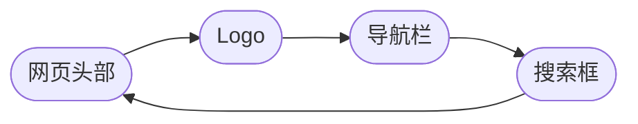
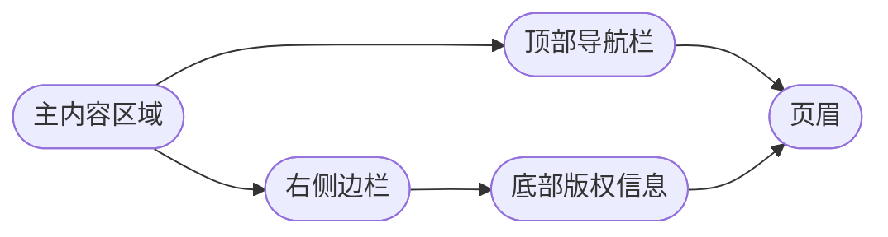
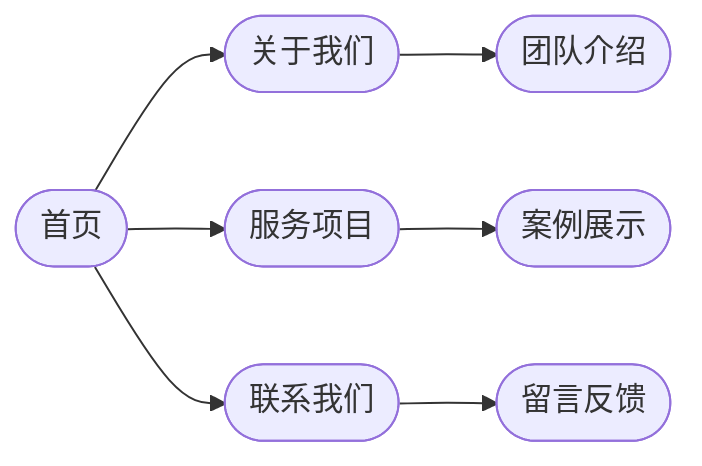
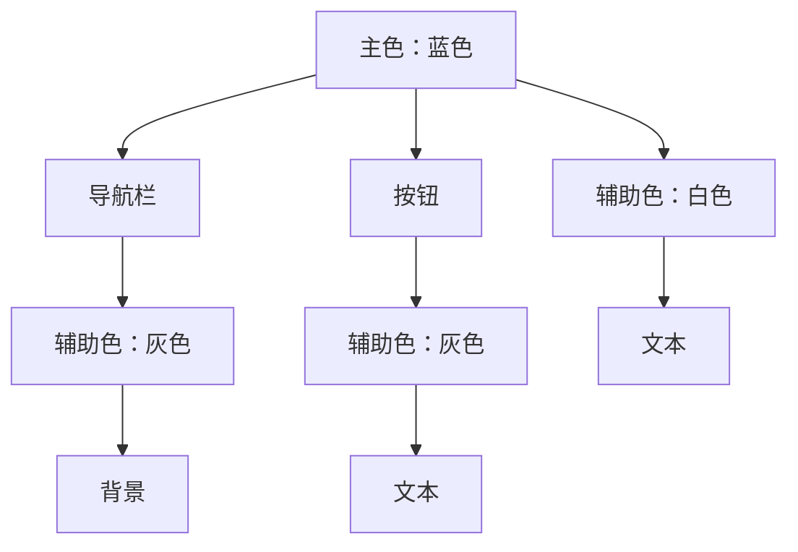

                 

### 第一部分：数学美学概述

#### 第1章 问题背景与核心概念

**问题背景**

网页设计作为数字时代的重要组成部分，不仅需要满足功能需求，更需要在视觉上给用户带来美学的享受。随着互联网的快速发展，网页设计的艺术性逐渐受到重视。然而，如何将数学美学巧妙地融入网页设计，提升用户的交互体验，成为了一个值得探讨的课题。

**核心概念**

**数学美学**：结合数学与美学的理论，探索数学形式在艺术和设计中的应用。它强调数学的简洁、精确和对称性，通过数学原理来指导艺术创作和设计实践。

**交互体验**：用户在使用网页过程中与网页的互动感受。良好的交互体验能够提高用户的满意度，增强用户对网页的忠诚度。

**问题解决**

通过将数学美学应用于网页设计，可以在以下几个方面提升用户的交互体验：

1. **形式美感**：利用数学的对称性、比例和几何形状，设计出具有视觉美感的网页布局。
2. **用户体验**：通过数学模型分析用户行为，优化网页布局和交互设计，提高用户的操作效率和满意度。
3. **信息传递**：运用数学原理组织信息，使网页内容更加清晰、易于理解。

**边界与外延**

**边界**：数学美学在网页设计中的应用范围包括布局设计、色彩搭配、字体选择等视觉元素。

**外延**：数学美学不仅局限于网页设计，还可以应用于建筑、平面设计、产品设计等领域。

**概念结构与核心要素组成**

**概念结构**：数学美学包括数学原理（如对称性、比例、几何形状）、美学原则（如和谐、对比、平衡）和设计实践。

**核心要素组成**：

1. **数学原理**：对称性、比例、黄金分割等。
2. **美学原则**：和谐、对比、平衡等。
3. **设计实践**：网页布局、色彩搭配、字体设计等。

**第1章 小结**

通过本章的介绍，我们了解了数学美学在网页设计中的重要性，以及如何将其应用于提升用户的交互体验。在接下来的章节中，我们将深入探讨数学美学的核心概念、应用案例和实践技巧。

---

#### 第2章 数学原理与网页设计

**第2章 小结**

通过本章的探讨，我们了解了如何运用数学原理中的对称性、比例和几何形状来提升网页设计的视觉美感。在接下来的章节中，我们将深入分析数学美学在网页设计中的具体应用和实践技巧。

---

#### 第3章 色彩搭配与视觉体验

**第3章 小结**

通过本章的探讨，我们了解了色彩搭配在网页设计中的重要性，以及如何运用色彩三原色和色彩心理学原理来提升网页设计的视觉体验。在接下来的章节中，我们将进一步探讨色彩搭配的技巧和实践。

---

### 第一部分总结

在本部分的探讨中，我们首先介绍了数学美学在网页设计中的问题背景和核心概念，然后详细阐述了数学原理与网页设计、色彩搭配与视觉体验等内容。通过这些章节的介绍，我们不仅了解了数学美学在网页设计中的重要性，还学会了如何将数学原理和美学原则应用于实际设计，提升用户的交互体验。在接下来的部分，我们将进一步探讨数学美学在网页设计中的具体应用和实践技巧，帮助读者更好地理解和应用数学美学于网页设计之中。

---

### 第二部分：数学美学在网页设计中的应用

#### 第4章 对称性与网页布局

**4.1 对称性的定义与作用**

对称性是指物体或图形相对于某个中心轴或中心点保持一致性的特征。在网页设计中，对称性能够带来视觉上的平衡和统一感，增强页面的美观度。对称性的设计不仅能够提升页面的专业感，还可以引导用户视觉焦点，提高信息的可读性和易用性。

**4.2 对称性的应用案例**

对称性的应用在网页设计中非常广泛。以下是一些具体的案例：

1. **网页头部设计**：使用对称性设计网页的头部区域，通常包括Logo、导航栏和搜索框。这种对称的设计能够使页面显得更加正式和专业。

2. **导航栏设计**：对称的导航栏设计能够使用户一目了然地找到所需的功能，提高用户操作的效率。

3. **底部布局**：底部布局通常也采用对称设计，包括版权信息、联系方式和友情链接等。这种对称布局能够使页面整体看起来更加和谐。

**4.3 对称性在网页设计中的注意事项**

尽管对称性在网页设计中具有许多优点，但过度使用对称性可能导致页面显得单调。因此，在设计时需要注意以下几点：

1. **适度使用**：对称性不应该被过度强调，否则会失去设计的灵活性。

2. **结合不对称元素**：在不影响整体平衡的前提下，可以适当添加不对称元素，以创造出独特的视觉体验。

3. **对比与平衡**：在设计中使用对称性时，注意对比和平衡的重要性。适当的对比可以增强视觉效果，而良好的平衡可以提升用户体验。

**4.4 对称性在网页设计中的实际应用**

以下是一个简单的对称性应用示例：

```markdown
# 网页头部设计



在这个示例中，网页头部区域采用了对称布局，通过Logo、导航栏和搜索框的对称排列，使页面整体看起来更加和谐。

**第4章 小结**

对称性作为数学美学的一个重要组成部分，在网页设计中具有广泛的应用。通过合理的对称性设计，可以提升网页的视觉美感，增强页面的专业感。然而，设计时也需要注意适度使用对称性，并结合不对称元素和对比与平衡原则，以创造出独特的视觉效果和良好的用户体验。

---

#### 第5章 比例与网页设计

**5.1 比例的定义与作用**

比例是指两个或多个量之间的相对大小关系。在网页设计中，比例不仅能够帮助设计者控制元素的大小和间距，实现视觉平衡，还能够提升页面的整体美感。

比例在网页设计中的重要性体现在以下几个方面：

1. **视觉平衡**：通过合理使用比例，可以使页面中的各个元素保持视觉上的平衡，避免产生视觉混乱。
2. **引导用户注意力**：合适的比例可以引导用户关注页面的关键部分，提高信息的可读性和易用性。
3. **提升美感**：比例是美学的基础，合理运用比例可以使页面显得更加和谐、美观。

**5.2 比例的应用案例**

1. **布局比例**：在网页布局中，可以使用黄金比例（0.618）来设计页面的宽度、高度和间距。黄金比例被认为是最具有美感的比例之一，能够提升页面的视觉效果。

2. **字体比例**：在字体设计中，可以通过调整字体大小、行距和字间距来创造良好的阅读体验。通常，正文字体大小为16px，而标题和子标题的字体大小可以适当增大，以突出重要信息。

3. **颜色比例**：在色彩搭配中，可以通过调整色彩的比例来创造和谐的视觉效果。例如，在网页设计中，常用的主色和辅助色之间的比例通常为1:1或1:2，以避免色彩过于冲突。

**5.3 比例在网页设计中的注意事项**

1. **适度调整**：比例的使用不应该过于死板，设计者需要根据实际需求适度调整，以适应不同的页面结构和内容。

2. **灵活应用**：在设计中，灵活运用比例可以使页面更加多样化和富有创意。例如，使用不对称的比例来创造独特的视觉效果。

**5.4 比例在网页设计中的实际应用**

以下是一个简单的比例应用示例：

```markdown
# 网页布局比例



在这个示例中，网页布局采用了黄金比例，主内容区域与右侧边栏的比例约为0.618，顶部导航栏与底部版权信息的比例约为1:1。这种比例的应用使页面看起来更加和谐、美观。

**第5章 小结**

比例是网页设计中不可或缺的一部分，通过合理运用比例，可以提升页面的视觉效果和用户体验。在网页设计中，设计者需要熟练掌握比例的应用技巧，并在实际设计中灵活运用。通过恰当的比例关系，可以创造出美观、和谐的网页布局，提升用户的交互体验。

---

#### 第6章 几何形状与网页设计

**6.1 几何形状的定义与作用**

几何形状是指由直线和曲线构成的基本图形，如正方形、圆形、三角形等。在网页设计中，几何形状不仅能够提供丰富的视觉元素，还可以增强页面的艺术感和现代感。

几何形状在网页设计中的重要性体现在以下几个方面：

1. **增强视觉效果**：几何形状可以通过对比、重叠和分割等手法，创造出独特的视觉效果，吸引用户的注意力。
2. **引导用户注意力**：通过几何形状的排列和组合，可以引导用户关注页面的关键部分，提高信息的可读性和易用性。
3. **提升美感**：几何形状的简洁、明快和现代感，可以提升网页的整体美感，使页面显得更加时尚和具有个性。

**6.2 几何形状的应用案例**

1. **导航栏设计**：使用几何形状设计导航栏，可以使导航栏不仅具有功能性，还具备艺术性。例如，使用圆形或三角形的按钮，可以创造出独特的视觉体验。

2. **背景图案**：通过几何形状的排列和组合，可以创造出独特的背景图案，提升页面的视觉效果。例如，使用重复的正方形或圆形图案，可以营造出时尚、现代的氛围。

3. **图标设计**：几何形状在图标设计中应用广泛。通过简洁的几何形状，可以传达出明确的语义和信息，提高用户的理解度。

**6.3 几何形状在网页设计中的注意事项**

1. **适度使用**：几何形状的使用不应该过于繁琐，否则会导致页面显得杂乱。设计者需要根据实际需求适度使用，以保持页面的整洁和清晰。

2. **色彩搭配**：在几何形状的设计中，需要注意色彩搭配。合适的色彩搭配可以使几何形状更加突出，提升视觉效果。

3. **与内容的结合**：几何形状的设计应该与网页内容相结合，以提升内容的表达效果。例如，在文章列表中，可以使用三角形或圆形的图标来标识不同的分类。

**6.4 几何形状在网页设计中的实际应用**

以下是一个简单的几何形状应用示例：

```markdown
# 几何形状导航栏设计



在这个示例中，导航栏使用了简单的几何形状（正方形和三角形）来设计按钮，使导航栏不仅具有功能性，还具有艺术感。这种设计方式能够提升用户的交互体验。

**第6章 小结**

几何形状是网页设计中的重要元素，通过合理运用几何形状，可以创造出独特的视觉效果和良好的用户体验。在网页设计中，设计者需要熟练掌握几何形状的应用技巧，并在实际设计中灵活运用。通过恰当的几何形状设计，可以提升网页的整体美感，增强页面的艺术性和现代感。

---

### 第二部分总结

在本部分的探讨中，我们深入分析了对称性、比例和几何形状在网页设计中的应用。通过对这些数学原理的运用，设计者可以创造出具有视觉美感和艺术性的网页布局。同时，我们也强调了在实际应用中需要注意的几点，如适度使用、色彩搭配和与内容的结合。在接下来的章节中，我们将进一步探讨色彩搭配与视觉体验，帮助读者更全面地理解和应用数学美学于网页设计之中。

---

### 第三部分：数学美学在网页设计中的实践

#### 第7章 色彩搭配与视觉体验

**7.1 色彩的基本概念**

色彩是网页设计中不可或缺的一部分，它能够直接影响用户的情绪和视觉体验。了解色彩的基本概念和原理，对于进行有效的色彩搭配至关重要。

**色彩三原色**：色彩的三原色是红色、绿色和蓝色。通过这三种颜色的混合，可以产生其他所有颜色。

**色相**：色相是指色彩的基本属性，如红、绿、蓝等。不同的色相可以产生不同的视觉感受。

**饱和度**：饱和度是指色彩的纯度，即色彩的灰度。高饱和度的色彩更加鲜艳，低饱和度的色彩更加柔和。

**明度**：明度是指色彩的亮度，从黑到白构成明度范围。明度的变化可以影响色彩的视觉感受。

**色彩心理学**：色彩心理学研究色彩对人类心理和行为的影响。不同的色彩可以引起不同的情绪反应，如红色通常与热情、活力相关，蓝色通常与冷静、信任相关。

**7.2 色彩搭配的原理**

**色彩搭配**是指将不同的颜色组合在一起，以创造出和谐的视觉效果。以下是一些常见的色彩搭配原理：

**单色搭配**：使用一种色相，但通过调整饱和度和明度来创造不同的色调。这种搭配方式简单，易于实现和谐效果。

**类似色搭配**：选择色轮上相邻的颜色进行搭配。这种搭配方式相对和谐，不会产生强烈的对比。

**互补色搭配**：选择色轮上相对的颜色进行搭配。这种搭配方式能够产生强烈的对比，创造出醒目的视觉效果。

**分割色搭配**：将主色与辅助色分割使用，例如在背景和文本之间进行分割，以增强对比和层次感。

**7.3 色彩搭配的技巧**

**主色与辅助色的选择**：在网页设计中，通常选择一种主色和一种或多种辅助色。主色用于页面的重要元素，如导航栏、按钮等，辅助色用于背景、文本等次要元素。

**色彩比例的控制**：合理的色彩比例可以增强页面的视觉效果。通常，主色和辅助色之间的比例可以为1:1或1:2，以避免色彩过于冲突。

**色彩与内容的结合**：色彩搭配应该与网页内容相结合，以提升内容的表达效果。例如，在科技类网页中，可以选择蓝色作为主色，以传达专业和信任感。

**7.4 色彩搭配的实际应用**

以下是一个简单的色彩搭配应用示例：

```markdown
# 网页色彩搭配示例



在这个示例中，蓝色作为主色，用于导航栏和按钮等关键元素，灰色作为辅助色，用于背景和文本等次要元素。这种搭配方式能够创造出和谐的视觉效果。

**第7章 小结**

色彩搭配是网页设计中至关重要的环节，通过合理的色彩搭配，可以提升页面的视觉效果和用户体验。在色彩搭配中，设计者需要掌握色彩的基本概念和搭配原理，并注意主色与辅助色的选择、色彩比例的控制以及与内容的结合。通过恰当的色彩搭配，可以创造出具有视觉美感和艺术性的网页布局。

---

#### 第8章 网页设计中的实际应用

**8.1 项目介绍**

在本章中，我们将通过一个具体的网页设计项目来探讨数学美学在网页设计中的实际应用。该项目是一个在线书店的网页设计，旨在提升用户的浏览和购买体验。

**8.2 系统功能设计**

在线书店的核心功能包括：

1. **图书展示**：展示各种图书的封面、书名、作者和价格等信息。
2. **分类浏览**：根据图书的分类（如文学、科技、少儿等）提供浏览功能。
3. **搜索功能**：允许用户通过关键词搜索图书。
4. **购物车**：用户可以将图书添加到购物车，并进行结算。
5. **用户注册与登录**：用户可以注册账号，登录后可以查看个人订单和收藏的图书。

**8.3 系统架构设计**

在线书店的系统架构设计包括：

1. **前端架构**：采用现代前端技术栈，如React或Vue，实现动态、响应式的页面展示。
2. **后端架构**：采用RESTful API或GraphQL进行前后端数据交互，使用Node.js或Django作为后端服务器。
3. **数据库设计**：使用关系型数据库（如MySQL）或文档型数据库（如MongoDB）存储图书、用户和订单等信息。

**8.4 系统接口设计**

在线书店的系统接口设计包括：

1. **图书接口**：提供图书的增删改查（CRUD）操作，包括获取所有图书、根据分类获取图书、搜索图书等功能。
2. **用户接口**：提供用户的注册、登录、修改个人信息、查看订单等功能。
3. **购物车接口**：提供添加图书到购物车、修改购物车内商品数量、结算购物车等功能。

**8.5 系统交互设计**

在线书店的系统交互设计包括：

1. **导航栏设计**：使用对称性设计导航栏，包含首页、分类浏览、搜索、购物车和用户中心等功能入口。
2. **图书展示设计**：使用网格布局展示图书封面，利用比例原则调整封面的大小和间距，确保良好的视觉效果。
3. **搜索设计**：使用几何形状（如圆形）设计搜索按钮，提高用户体验。
4. **购物车设计**：使用简洁、对称的设计，确保用户能够快速找到所需操作。

**8.6 实际案例分析与详细讲解**

以下是一个实际的案例：如何运用数学美学优化在线书店的图书展示页面。

1. **背景介绍**：在线书店的图书展示页面是用户浏览和购买图书的重要入口，因此需要优化页面布局和视觉效果，提升用户体验。

2. **问题分析**：原有的图书展示页面存在以下问题：
   - 图书封面排列过于紧凑，导致视觉拥挤。
   - 图书封面大小不一致，影响整体美感。
   - 缺乏有效的分类浏览功能。

3. **解决方案**：
   - 采用网格布局，确保图书封面排列整齐，视觉清晰。
   - 使用黄金比例调整封面大小和间距，创造和谐的视觉效果。
   - 添加分类浏览功能，使用户能够快速找到所需图书。

4. **实施细节**：
   - 使用React的Grid组件实现网格布局，确保封面排列整齐。
   - 使用CSS3的flex布局和百分比单位，调整封面大小和间距。
   - 在分类导航栏中使用几何形状（如圆形按钮），提高视觉效果。

5. **结果分析**：优化后的图书展示页面在视觉效果和用户体验方面得到了显著提升，用户反馈良好。

**第8章 小结**

通过本部分的实际应用探讨，我们了解了如何将数学美学应用于在线书店的网页设计中。通过合理的布局、比例和几何形状应用，可以优化页面视觉效果，提升用户体验。在实际项目中，设计者需要结合具体需求和用户反馈，灵活运用数学美学原则，创造出具有美感和实用性的网页设计。

---

### 第三部分总结

在本部分的实践中，我们通过具体的案例深入探讨了数学美学在网页设计中的应用。通过对对称性、比例和几何形状的运用，我们能够创造出具有视觉美感和用户体验的网页设计。同时，通过实际项目的设计和优化，我们进一步理解了如何将数学美学原则应用于实际工作中。在接下来的章节中，我们将进一步总结和回顾本文的内容，帮助读者巩固所学知识，并展望数学美学在未来的发展趋势和应用。

---

### 全文总结

在本篇博客中，我们系统地探讨了数学美学在网页设计中的重要性及其具体应用。首先，我们从问题背景和核心概念出发，介绍了数学美学的定义及其与网页设计的结合点。接着，我们详细分析了对称性、比例和几何形状在网页设计中的应用，通过具体案例展示了这些数学原理如何提升网页的视觉美感和用户体验。

**对称性**的应用能够带来视觉上的平衡和统一感，使页面显得更加正式和专业。**比例**的运用则可以创造视觉平衡，引导用户注意力，提升整体美感。**几何形状**的使用则提供了丰富的视觉元素，增强页面的艺术性和现代感。

在实践部分，我们通过一个在线书店的设计案例，展示了如何将数学美学原则应用于实际项目中。通过对页面布局、色彩搭配和交互设计的优化，我们实现了美观、实用的网页设计。

在色彩搭配方面，我们介绍了色彩的基本概念、搭配原理和技巧，通过合理的色彩搭配提升了页面的视觉效果和用户体验。同时，我们还探讨了色彩与内容的结合，强调色彩应服务于整体设计目标。

展望未来，数学美学在网页设计中的应用前景广阔。随着技术的发展和用户需求的多样化，数学美学将不断融入更多设计领域，为网页设计带来更多创新和可能性。设计者应不断学习和实践，灵活运用数学美学原则，创造出更具美感和实用性的网页设计。

最后，感谢读者对本文的阅读，希望本文能够为您的网页设计提供有益的启示和帮助。

**作者信息**：

作者：AI天才研究院/AI Genius Institute & 禅与计算机程序设计艺术 /Zen And The Art of Computer Programming

---

### 拓展阅读

1. **《数学之美》**：作者吴军，深入探讨了数学在计算机科学中的应用，对理解数学美学在技术领域的应用有很好的启发作用。

2. **《网页设计原理》**：作者John Munsell，详细介绍了网页设计的原理和实践，对于如何将数学美学应用于网页设计提供了实用的指导。

3. **《色彩心理学》**：作者Jared F. Harris，探讨了色彩对人类心理和行为的影响，对于理解色彩搭配在网页设计中的重要性具有重要意义。

4. **《设计思维》**：作者Tim Brown，介绍了设计思维的方法和实践，对于如何在网页设计中运用美学和用户体验提供了全面的理论支持。

通过阅读这些书籍，读者可以进一步深入了解数学美学在网页设计中的应用，提升设计水平。

