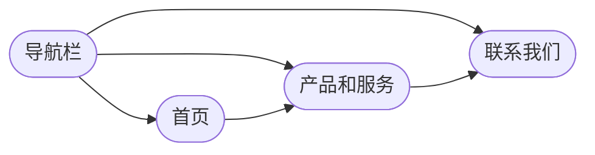
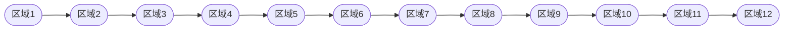
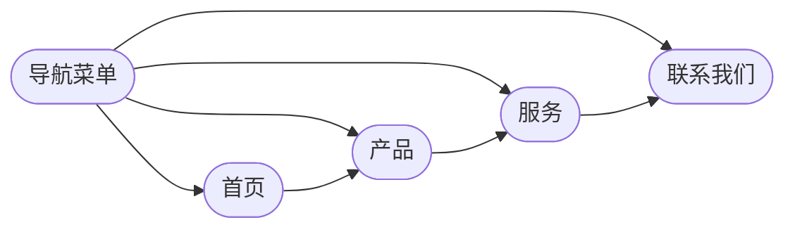
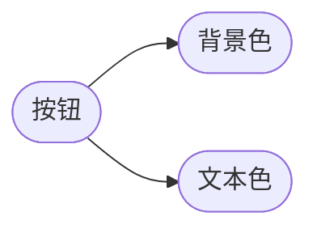
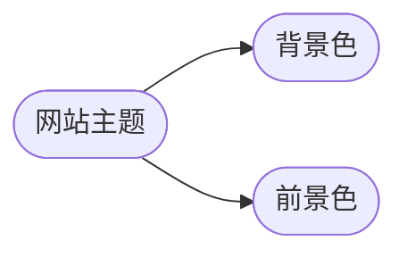
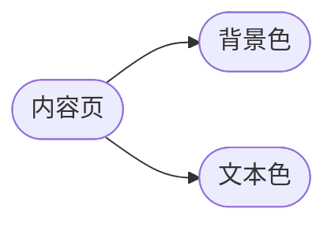
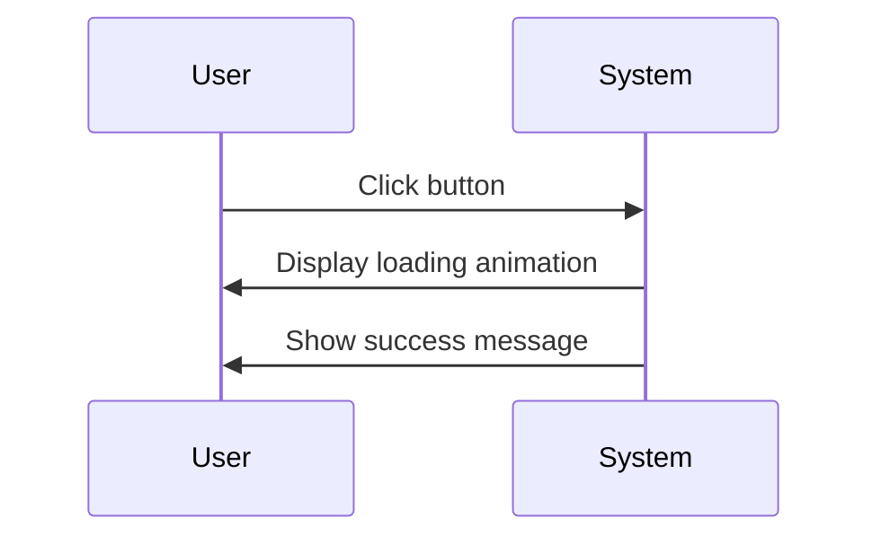
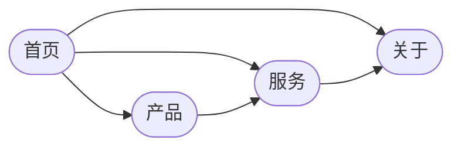
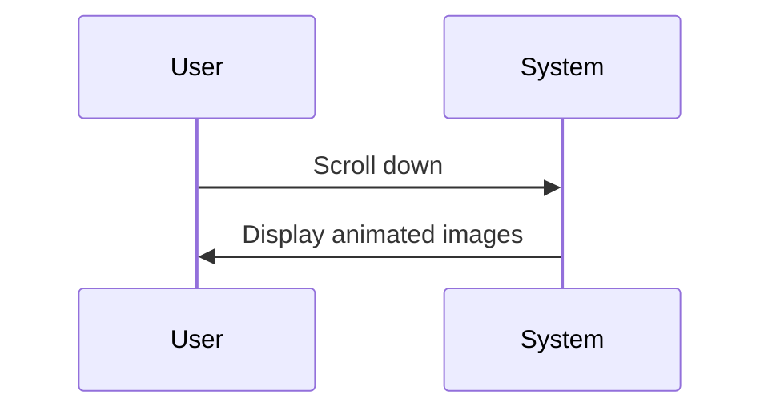

                 

# 数学美学在网页设计中的应用

> 关键词：数学美学、网页设计、应用实践、案例分析

> 摘要：本文深入探讨了数学美学在网页设计中的实际应用。从核心概念和基础理论出发，结合实际案例分析，全面阐述了数学美学在网页布局、颜色和交互设计中的具体应用，以及应对挑战的策略。本文旨在为网页设计师提供一种全新的设计视角，提高设计作品的审美价值和用户体验。

----------------------------------------------------------------

### 第一部分：背景介绍与基础理论

#### 第1章：数学美学的核心概念

**1.1 数学美学的定义与意义**

数学美学是指将数学的思维方式、概念和理论应用于艺术和设计领域，探讨数学与美学的联系和相互作用。它不仅关注数学的抽象美感，还关注数学在解决实际问题时所展现出的逻辑性和条理性。

**1.2 数学美学的历史发展**

数学美学的历史可以追溯到古希腊时期，当时的哲学家和数学家如柏拉图和毕达哥拉斯就提出了数学与美学相结合的观点。随着数学和艺术的发展，数学美学逐渐成为一个独立的领域，涵盖了从几何图形到算法美学的广泛内容。

**1.3 数学美学的基本原则**

数学美学的基本原则包括简洁性、对称性、比例、和谐性等。这些原则在网页设计中有着广泛的应用，能够提高网页的美感和用户体验。

#### 第2章：网页设计中的美学原则

**2.1 网页设计的概述**

网页设计是指通过视觉和互动设计手段，构建具有美观性和易用性的网页。它包括页面布局、颜色搭配、字体选择、交互设计等方面。

**2.2 美学原则在网页设计中的体现**

美学原则在网页设计中有着重要的地位，它们能够提升网页的视觉效果和用户体验。例如，对称性可以营造平衡感，比例可以增强协调性，简洁性可以提升易用性。

**2.3 美学原则的应用与效果分析**

通过对美学原则的应用案例分析，我们可以看到数学美学在网页设计中的实际效果。例如，在页面布局中，数学工具可以帮助设计师实现黄金比例和网格系统，从而提高页面的美观度；在颜色搭配中，数学公式可以帮助设计师计算出最和谐的色彩组合。

#### 第3章：数学工具在网页设计中的应用

**3.1 数学工具的介绍**

在网页设计中，常用的数学工具有黄金比例、网格系统、斐波那契数列等。这些工具可以帮助设计师实现高效、美观的设计。

**3.2 数学工具在网页布局中的应用**

数学工具在网页布局中的应用非常广泛，例如，通过黄金比例可以实现页面布局的黄金分割，通过网格系统可以实现页面的整齐划一。

**3.3 数学工具在网页颜色搭配中的应用**

数学工具在网页颜色搭配中也有着重要的作用，例如，通过色彩理论中的对比色和互补色原则，可以创造出丰富多彩的网页视觉效果。

----------------------------------------------------------------

### 第二部分：实践应用

#### 第4章：数学美学在网页布局设计中的应用

**4.1 网页布局设计的基本原则**

网页布局设计的基本原则包括平衡、对称、层次、流动等。数学美学可以帮助设计师在这些原则的基础上，实现更加高效、美观的设计。

**4.2 数学工具在网页布局中的实际应用案例**

通过实际案例，我们可以看到数学工具在网页布局设计中的应用效果。例如，通过黄金比例实现页面的黄金分割，通过网格系统实现页面的整齐划一。

**4.3 网页布局设计中的数学美学案例分析**

通过对网页布局设计的案例分析，我们可以深入理解数学美学在网页布局设计中的实际应用。

#### 第5章：数学美学在网页颜色设计中的应用

**5.1 网页颜色设计的基本原则**

网页颜色设计的基本原则包括对比、和谐、协调等。数学美学可以帮助设计师在这些原则的基础上，实现更加美观、和谐的色彩搭配。

**5.2 数学工具在网页颜色设计中的实际应用**

通过数学工具，如色彩理论中的对比色和互补色原则，设计师可以创造出丰富多彩的网页颜色搭配。

**5.3 网页颜色设计中的数学美学案例分析**

通过对网页颜色设计的案例分析，我们可以看到数学美学在网页颜色设计中的实际效果。

#### 第6章：数学美学在网页交互设计中的应用

**6.1 网页交互设计的基本原则**

网页交互设计的基本原则包括易用性、响应性、互动性等。数学美学可以帮助设计师在这些原则的基础上，实现更加高效、有趣的网页交互。

**6.2 数学工具在网页交互设计中的实际应用**

通过数学工具，如动画效果中的时间序列和斐波那契数列，设计师可以创造出富有节奏感、吸引人的网页交互效果。

**6.3 网页交互设计中的数学美学案例分析**

通过对网页交互设计的案例分析，我们可以看到数学美学在网页交互设计中的实际应用。

----------------------------------------------------------------

### 第三部分：案例分析

#### 第7章：数学美学在网页设计中的成功案例分析

**7.1 案例背景与需求分析**

**7.2 数学美学的应用与设计思路**

**7.3 案例分析及效果评价**

#### 第8章：数学美学在网页设计中的挑战与应对策略

**8.1 网页设计中数学美学的挑战**

**8.2 针对挑战的应对策略**

**8.3 未来展望**

----------------------------------------------------------------

### 第四部分：总结与展望

#### 第9章：总结与展望

**9.1 本书内容的回顾与总结**

**9.2 数学美学在网页设计中的未来发展趋势**

**9.3 对网页设计师的启示与建议**

----------------------------------------------------------------

作者：AI天才研究院/AI Genius Institute & 禅与计算机程序设计艺术 /Zen And The Art of Computer Programming

----------------------------------------------------------------

### 第一部分：背景介绍与基础理论

#### 第1章：数学美学的核心概念

**1.1 数学美学的定义与意义**

数学美学，这一概念在视觉艺术与设计领域逐渐崭露头角，将数学的严谨性与美学的感性特质相结合，形成了一种新的设计哲学。数学美学不仅仅是将数学公式直接应用到艺术创作中，而是通过数学的思维方式来探讨美的本质，以及如何通过数学工具和方法来提升设计作品的美感和逻辑性。

定义上，数学美学可以被理解为“运用数学的原理、方法和技术来研究和创造美学价值的一种艺术形式和设计理念”。它的意义在于，通过数学的精准性和逻辑性，为设计提供了更加科学和理性的基础，从而创造出既美观又实用的作品。

在艺术和设计领域，数学美学已经展现出了其独特的价值。例如，在建筑中，数学美学帮助设计师实现对称和比例的和谐；在绘画中，数学原理指导色彩搭配和构图；在音乐中，数学的节奏和频率影响了旋律的美感。在网页设计中，数学美学同样具有重要作用，它不仅提高了网页的视觉效果，还增强了用户的体验和互动。

**1.2 数学美学的历史发展**

数学美学的历史可以追溯到古希腊时期，那时毕达哥拉斯和柏拉图等哲学家已经开始探讨数学与美学之间的关系。毕达哥拉斯提出了“一切皆数”的观点，认为宇宙万物都可以用数学来解释，这为后来的数学美学奠定了基础。柏拉图则强调了数学形式的纯粹性和永恒性，认为数学是达到完美和真理的唯一途径。

在19世纪，数学美学得到了进一步的发展。数学家如高斯和黎曼等，通过研究几何学和拓扑学，揭示了形式和结构的美学价值。这些理论为后来的设计领域提供了丰富的理论资源。

20世纪以来，随着计算机技术的发展，数学美学在视觉艺术和设计中的应用更加广泛。计算机图形学和算法美学等新兴领域，为设计师提供了更多的工具和技巧来探索数学在艺术创作中的可能性。

**1.3 数学美学的基本原则**

数学美学的基本原则包括简洁性、对称性、比例、和谐性等。这些原则在网页设计中有着广泛的应用，下面将详细阐述这些原则的具体含义和应用。

**1.3.1 简洁性**

简洁性是数学美学中的一个重要原则，它强调设计的简单和直接，避免冗余和复杂的元素。简洁性不仅能够提升网页的可读性和易用性，还能让用户更快地理解设计意图，从而提高用户体验。

在网页设计中，简洁性的应用体现在以下几个方面：

- **排版简洁**：使用简洁的字体和排版，避免过多的装饰性元素，使文本和图像更加清晰。
- **色彩简洁**：选择简单的颜色方案，避免过多的色彩搭配，使页面更加和谐。
- **元素简洁**：减少不必要的元素，如装饰性图标、复杂背景等，使页面更加简洁直观。

**1.3.2 对称性**

对称性是数学美学中的另一个重要原则，它通过平衡和对称来创造和谐的美感。对称性可以分为轴对称和中心对称两种类型，在网页设计中，它们都能够帮助设计师实现页面的平衡和统一。

对称性的应用体现在以下几个方面：

- **页面布局对称**：通过左右或上下对称的布局，使页面看起来更加和谐和稳定。
- **元素对称**：在页面中放置元素时，使用对称的排列方式，使整个页面具有统一的视觉效果。
- **色彩对称**：通过对比对称的色彩搭配，增强页面的视觉冲击力。

**1.3.3 比例**

比例是数学美学中的一个关键原则，它涉及尺寸、间距和结构之间的协调性。黄金比例（约为1:1.618）是最著名的比例之一，被广泛认为是美学上的黄金标准。

在网页设计中，比例的应用体现在以下几个方面：

- **页面结构比例**：通过黄金比例等原则来设计页面结构，使页面布局更加和谐。
- **元素尺寸比例**：确保页面中不同元素的尺寸比例合适，避免过大或过小的元素影响整体视觉效果。
- **文本与图像比例**：合理设置文本与图像的比例，使页面内容更加平衡。

**1.3.4 和谐性**

和谐性是数学美学的核心原则之一，它强调不同元素之间的协调和统一。和谐性不仅体现在视觉上，还体现在色彩、布局和交互等各个方面。

在网页设计中，和谐性的应用体现在以下几个方面：

- **色彩和谐**：通过合理的色彩搭配，使页面颜色协调统一，避免过于刺眼或冲突的色彩。
- **布局和谐**：通过统一的排版和布局原则，使页面看起来更加整体和统一。
- **交互和谐**：通过流畅的交互设计和反馈，使用户操作更加自然和谐。

通过这些数学美学的基本原则，网页设计师可以创造出既美观又实用的设计作品，提升网页的视觉美感和用户体验。

### 第2章：网页设计中的美学原则

**2.1 网页设计的概述**

网页设计是数字时代的重要组成部分，它不仅关乎网站的外观，更关乎用户的使用体验。网页设计涵盖了从布局、颜色到字体、交互等多个方面，旨在创造一个既美观又实用的网站界面。

网页设计的基本要素包括：

- **布局**：布局是网页设计的核心，决定了页面的结构和内容分布。常见的布局方式有响应式布局、固定布局等。
- **颜色**：颜色在网页设计中起着关键作用，不仅影响视觉效果，还传达了网站的个性和情感。
- **字体**：字体选择决定了文本的可读性和风格，是网页设计中不可忽视的元素。
- **交互**：交互设计关注用户与网站之间的互动，旨在提升用户体验。

网页设计的目标是创造一个易于使用、美观且具有吸引力的网站界面，以吸引用户并提高转化率。

**2.2 美学原则在网页设计中的体现**

美学原则在网页设计中起到了至关重要的作用，它们帮助设计师实现视觉上的和谐与平衡。以下是一些关键的美学原则：

- **对称性**：对称性创造了一种平衡和稳定感，使页面看起来更加和谐。通过对称布局，设计师可以强调页面的重要部分，并创造视觉上的统一。
- **层次感**：层次感帮助用户理解页面内容的重要性和优先级。通过使用不同的字体大小、颜色和排版，设计师可以建立清晰的视觉层次。
- **对比**：对比通过鲜明的视觉差异来吸引用户的注意力。通过对比颜色、字体和形状，设计师可以突出关键信息，增强页面的视觉效果。
- **统一性**：统一性确保页面各个部分的视觉一致性。通过统一的颜色方案、字体和排版，设计师可以打造一个整体感强的页面。

**2.3 美学原则的应用与效果分析**

美学原则在网页设计中的应用不仅提升了页面的视觉效果，还显著影响了用户体验。以下是一些具体的应用与效果分析：

- **对称性**：通过轴对称或中心对称，设计师可以在页面上创造一个视觉中心，吸引用户的注意力。例如，在首页设计中，使用对称布局可以突出重点内容，如导航栏和重要按钮。
- **层次感**：通过层次感，设计师可以帮助用户更好地浏览和理解页面内容。例如，在博客文章页中，使用不同的字体大小和颜色来区分标题、正文和注释，提高可读性。
- **对比**：对比可以显著提升页面的吸引力。例如，使用鲜明的颜色对比来突出重要按钮，使它们更容易被点击。此外，通过对比字体大小和样式，设计师可以引导用户关注关键信息。
- **统一性**：统一性确保页面的整体风格一致，使用户在浏览过程中感到舒适和连贯。例如，在电商网站中，统一的设计元素如按钮、图标和字体，可以提升用户的购物体验。

通过深入理解和应用这些美学原则，网页设计师可以创造出既美观又实用的设计作品，为用户提供卓越的视觉体验。

### 第3章：数学工具在网页设计中的应用

**3.1 数学工具的介绍**

在网页设计中，数学工具的应用不仅可以提升设计的美感和逻辑性，还能优化用户体验。以下是一些常用的数学工具及其基本原理：

- **黄金比例**：黄金比例是数学美学中一个重要的概念，约为1:1.618。它被认为是美学上最和谐的比例，广泛应用于网页布局、图像比例和字体设计。
- **网格系统**：网格系统是网页设计中常用的布局工具，通过将页面划分为不同的网格单元，可以帮助设计师实现整齐、统一的布局。
- **斐波那契数列**：斐波那契数列是一个递增的数列，每个数都是前两个数的和。这个数列在自然和艺术中有着广泛的应用，如植物生长、动物行为等。在网页设计中，斐波那契数列可以帮助设计师实现有节奏和层次感的布局。
- **色彩理论**：色彩理论是设计中的一个重要方面，通过了解颜色之间的对比、互补和调和关系，设计师可以创造出和谐、吸引人的色彩搭配。

**3.2 数学工具在网页布局中的应用**

数学工具在网页布局中的应用非常广泛，以下是一些具体的应用案例：

- **黄金比例**：通过黄金比例，设计师可以实现页面的黄金分割，从而提高页面的美学价值。例如，在首页设计时，可以使用黄金比例来安排导航栏、重要按钮和广告位置，使页面布局更加和谐。
- **网格系统**：网格系统是网页布局的基础，通过将页面划分为网格单元，设计师可以确保页面内容的整齐和统一。例如，使用12列网格系统，设计师可以将页面内容整齐地排列在网格单元中，从而实现整齐划一的布局效果。
- **斐波那契数列**：斐波那契数列可以帮助设计师实现有层次感和节奏感的布局。例如，在导航菜单中，可以使用斐波那契数列来确定菜单项的间距，从而创造一个有节奏的导航体验。
- **色彩理论**：色彩理论在网页布局中的应用非常重要。通过了解颜色之间的对比、互补和调和关系，设计师可以创造出和谐、吸引人的色彩搭配。例如，使用对比色来突出重要按钮，或使用互补色来增强视觉效果。

**3.3 数学工具在网页颜色搭配中的应用**

数学工具在网页颜色搭配中的应用同样重要，以下是一些具体的应用案例：

- **对比色**：对比色是指位于色轮上对立的颜色，如红色和绿色、蓝色和橙色等。通过使用对比色，设计师可以增强页面的视觉冲击力，使重要元素更加突出。例如，在一个以蓝色为主调的网页中，可以使用红色来强调按钮和调用行动（CTA）元素。
- **互补色**：互补色是指位于色轮上直接相对的颜色，如红色和绿色、黄色和紫色等。互补色搭配可以创造出强烈的视觉效果，适用于需要突出重要信息的页面。例如，在电商网站的促销页面中，可以使用互补色来吸引顾客的注意力。
- **调和色**：调和色是指在色轮上相邻的颜色，如红色和橙色、黄色和绿色等。调和色搭配可以创造出和谐、温馨的视觉效果，适用于需要营造轻松氛围的页面。例如，在博客或内容页中，可以使用调和色来搭配主题和背景，提高阅读体验。

通过数学工具在网页布局和颜色搭配中的应用，设计师可以创造出既美观又实用的网页设计，为用户提供卓越的视觉体验。

### 第二部分：实践应用

#### 第4章：数学美学在网页布局设计中的应用

**4.1 网页布局设计的基本原则**

网页布局设计是网页设计中的核心环节，它决定了网页的结构和视觉呈现。在网页布局设计中，一些基本原则需要被遵循，以确保页面的美观性和用户体验。

**4.1.1 对称与平衡**

对称和平衡是网页布局设计中非常重要的原则。对称布局通过轴对称或中心对称的方式，使页面各部分保持平衡，创造出和谐的整体视觉效果。例如，将导航栏放置在页面的顶部，并将主要内容和侧边栏均匀分布在左右两侧，形成一种稳定的对称布局。

**4.1.2 层次感**

层次感是帮助用户理解页面内容的重要手段。通过使用不同的字体大小、颜色和排版，设计师可以建立清晰的视觉层次。例如，使用大号字体来强调标题，使用较小的字体来呈现正文内容，使页面内容易于浏览和理解。

**4.1.3 间距与留白**

间距和留白在网页布局设计中起到关键作用。合理的间距可以使页面内容更加清晰，避免拥挤的感觉。留白则可以创造一种呼吸空间，使页面看起来更加简洁和优雅。例如，在文本和图像之间保持适当的间距，使页面内容更加易读。

**4.2 数学工具在网页布局中的实际应用案例**

数学工具如黄金比例、网格系统和斐波那契数列等，在网页布局设计中有着广泛的应用。以下是一些实际应用案例：

**案例1：黄金比例在导航栏设计中的应用**

假设我们要设计一个导航栏，首先我们可以使用黄金比例来确定导航栏各个部分的位置。例如，将导航栏分为三个部分：首页、产品和服务、联系我们。通过使用黄金比例，我们可以确定各个部分之间的距离，使导航栏既美观又实用。

在这个例子中，我们可以使用黄金比例来设置B、C和D之间的距离，从而实现一个和谐、对称的导航栏设计。

**案例2：网格系统在页面布局中的应用**

网格系统是一种结构化的布局工具，可以帮助设计师实现整齐、统一的页面布局。以下是一个简单的12列网格系统的示例：

在这个例子中，我们可以使用12列网格系统来安排页面内容，例如，将首页的logo放置在A1区域，导航栏放置在A2区域，主要内容放置在A3到A8区域，侧边栏放置在A9到A12区域。这样的布局不仅整齐划一，而且便于用户浏览。

**案例3：斐波那契数列在导航菜单中的应用**

斐波那契数列是一种递增的数列，每个数都是前两个数的和。在网页设计中，斐波那契数列可以帮助设计师实现有节奏和层次感的布局。以下是一个简单的斐波那契数列导航菜单的示例：

在这个例子中，我们可以使用斐波那契数列来确定导航菜单各个部分之间的距离。例如，将首页和产品之间的距离设置为1，产品和服务之间的距离设置为1，服务和我们之间的距离设置为2，从而创造出一种有节奏、层次感的导航菜单。

**4.3 网页布局设计中的数学美学案例分析**

为了更好地理解数学美学在网页布局设计中的应用，我们可以通过一些成功的案例分析来探讨其实际效果。

**案例1：Airbnb的网页布局**

Airbnb的网页布局是一个成功的案例，它巧妙地运用了数学美学原则，如对称性和层次感。以下是对其布局的分析：

- **对称性**：Airbnb的首页采用了对称布局，导航栏位于顶部中央，主要内容和侧边栏均匀分布在左右两侧，形成了一种稳定的视觉效果。
- **层次感**：Airbnb的页面通过不同的字体大小和颜色来建立清晰的视觉层次。例如，使用大号字体来强调标题，使用较小的字体来呈现正文内容，使用不同的颜色来区分不同的信息块。

**案例2：苹果公司的网页布局**

苹果公司的网页布局以其简洁和优雅著称，它运用了黄金比例和网格系统来实现美观的布局效果。以下是对其布局的分析：

- **黄金比例**：苹果公司的网页布局采用了黄金比例，例如，导航栏和内容区域之间的距离、重要按钮的位置等，都符合黄金比例原则，使页面布局更加和谐。
- **网格系统**：苹果公司的页面采用了12列网格系统，确保了页面内容的整齐和统一。例如，产品图片和描述文本都整齐地排列在网格单元中，使页面看起来非常整洁。

通过这些案例，我们可以看到数学美学在网页布局设计中的实际应用效果。数学美学不仅提升了网页的视觉美感，还增强了用户体验，使网页更加易用和吸引人。

#### 第5章：数学美学在网页颜色设计中的应用

**5.1 网页颜色设计的基本原则**

网页颜色设计是网页设计中不可或缺的一部分，它不仅影响网页的视觉效果，还传递了网站的个性和情感。在网页颜色设计中，一些基本原则需要被遵循，以确保颜色搭配的和谐与美观。

**5.1.1 对比与平衡**

对比和平衡是网页颜色设计中的重要原则。对比可以增强网页的视觉冲击力，而平衡则使颜色搭配更加和谐。例如，使用对比色来突出重要按钮，或使用相邻色来营造温馨的氛围。

**5.1.2 色彩情感**

色彩情感在网页设计中起着重要作用。不同的颜色可以传达不同的情感和氛围。例如，蓝色通常传递信任和冷静，红色则传递活力和激情。通过合理选择颜色，设计师可以创造出符合网站主题的情感氛围。

**5.1.3 可读性**

可读性是网页颜色设计中的重要考虑因素。确保文本和背景颜色对比度足够，使文本易于阅读。例如，黑色文本通常与白色背景搭配，以获得最佳的可读性。

**5.2 数学工具在网页颜色设计中的实际应用**

数学工具如色彩理论、对比色和互补色等，在网页颜色设计中有着广泛的应用。以下是一些具体的应用案例：

**案例1：对比色在按钮设计中的应用**

对比色可以显著增强按钮的视觉吸引力。以下是一个使用对比色的按钮设计的示例：

在这个例子中，我们可以使用红色作为背景色，使用白色作为文本色，以突出按钮的重要性。红色和白色的对比色搭配不仅使按钮更加醒目，还能增强用户的点击欲望。

**案例2：互补色在网站主题设计中的应用**

互补色搭配可以创造出强烈的视觉效果，适用于需要突出重要信息的网站主题设计。以下是一个使用互补色的网站主题设计的示例：

在这个例子中，我们可以使用蓝色作为背景色，使用橙色作为前景色，以突出网站的主题和关键信息。蓝色和橙色的互补色搭配不仅使网站主题更加鲜明，还能增强用户的视觉体验。

**案例3：调和色在内容页设计中的应用**

调和色搭配可以营造出和谐、温馨的视觉效果，适用于需要营造轻松氛围的内容页设计。以下是一个使用调和色的内容页设计的示例：

在这个例子中，我们可以使用灰色作为背景色，使用深灰色作为文本色，以营造一个简洁、舒适的阅读环境。灰色和深灰色的调和色搭配不仅使内容页看起来更加和谐，还能提高阅读体验。

**5.3 网页颜色设计中的数学美学案例分析**

为了更好地理解数学美学在网页颜色设计中的应用，我们可以通过一些成功的案例分析来探讨其实际效果。

**案例1：优客工场的网页颜色设计**

优客工场的网页颜色设计采用了互补色搭配，以突出其办公空间的主题。以下是对其颜色设计的分析：

- **互补色搭配**：优客工场的背景色采用了蓝色，前景色采用了橙色，这种互补色搭配不仅使网页主题更加鲜明，还能增强用户的视觉体验。
- **色彩情感**：蓝色传递出冷静、专业的氛围，橙色则传递出活力、创新的感觉。这种色彩搭配不仅符合优客工场的品牌形象，还能吸引潜在客户。

**案例2：苹果公司的网页颜色设计**

苹果公司的网页颜色设计以其简洁、优雅著称，它巧妙地运用了调和色搭配来营造出高端、专业的氛围。以下是对其颜色设计的分析：

- **调和色搭配**：苹果公司的网页颜色设计采用了灰色和白色作为主要色彩，这种调和色搭配不仅使网页看起来非常简洁，还能提高可读性。
- **色彩情感**：灰色传递出专业、严谨的感觉，白色则传递出干净、清新的氛围。这种色彩搭配不仅符合苹果公司的品牌形象，还能提升用户的信任感和满意度。

通过这些案例，我们可以看到数学美学在网页颜色设计中的实际应用效果。数学美学不仅提升了网页的视觉效果，还增强了用户体验，使网页更加吸引人。

#### 第6章：数学美学在网页交互设计中的应用

**6.1 网页交互设计的基本原则**

网页交互设计是网页设计中至关重要的一部分，它关乎用户与网站之间的互动和体验。以下是一些网页交互设计的基本原则：

**6.1.1 易用性**

易用性是网页交互设计中最基本的原则。一个良好的交互设计应该使用户能够轻松地完成目标操作，而不会感到困惑或挫败。这包括简洁的界面、直观的导航和清晰的反馈。

**6.1.2 反应性**

反应性意味着网页在不同设备和屏幕尺寸上都能提供良好的用户体验。通过响应式设计，网页可以自动适应各种设备，确保用户无论使用何种设备都能获得一致、流畅的体验。

**6.1.3 互动性**

互动性是指网页能够积极地响应用户的行为，提供即时的反馈和互动。这可以增强用户的参与感和满意度，例如，通过动画效果、提示信息或交互式元素来吸引用户的注意力。

**6.2 数学工具在网页交互设计中的实际应用**

数学工具如时间序列、斐波那契数列和运动轨迹等，在网页交互设计中有着广泛的应用。以下是一些具体的应用案例：

**案例1：时间序列在动画效果中的应用**

时间序列在动画效果中起着关键作用，它决定了动画的节奏和流畅性。以下是一个使用时间序列创建动画效果的示例：

在这个例子中，时间序列确保了动画效果按照一定的节奏进行，例如，在用户点击按钮后，首先显示加载动画，然后显示成功消息。这样，动画效果不仅能够吸引用户的注意力，还能提供及时的反馈。

**案例2：斐波那契数列在导航菜单中的应用**

斐波那契数列可以用来创建有节奏和层次感的导航菜单。以下是一个使用斐波那契数列创建导航菜单的示例：

在这个例子中，我们可以使用斐波那契数列来确定导航菜单各个部分之间的距离。例如，将首页和产品之间的距离设置为1，产品和服务之间的距离设置为1，服务和我们之间的距离设置为2，从而创造出一种有节奏、层次感的导航菜单。

**案例3：运动轨迹在滚动动画中的应用**

运动轨迹可以用来创建动态的滚动动画，增强用户的视觉体验。以下是一个使用运动轨迹创建滚动动画的示例：

在这个例子中，当用户向下滚动时，系统会显示一系列动画图像，这些图像按照一定的运动轨迹进行动画效果，从而创造出一种动态、流畅的滚动体验。

**6.3 网页交互设计中的数学美学案例分析**

为了更好地理解数学美学在网页交互设计中的应用，我们可以通过一些成功的案例分析来探讨其实际效果。

**案例1：Instagram的网页交互设计**

Instagram的网页交互设计以其流畅、直观的特点著称。以下是对其交互设计的一些分析：

- **易用性**：Instagram的交互设计非常简单，用户可以轻松地浏览和点赞图片，而不会感到困惑。
- **反应性**：Instagram的网页在不同设备和屏幕尺寸上都能提供良好的用户体验，确保用户无论使用何种设备都能获得一致、流畅的体验。
- **互动性**：Instagram的交互设计通过动画效果和即时反馈，吸引用户的注意力并增强互动性。

**案例2：Airbnb的网页交互设计**

Airbnb的网页交互设计以其动态、互动的特点而受到用户喜爱。以下是对其交互设计的一些分析：

- **时间序列**：在预订流程中，Airbnb使用时间序列来确保动画效果按照一定的节奏进行，从而提升用户的体验。
- **斐波那契数列**：在导航菜单中，Airbnb使用斐波那契数列来确定各个部分之间的距离，从而创造出一种有节奏、层次感的导航体验。
- **运动轨迹**：在滚动动画中，Airbnb使用运动轨迹来显示动态图像，从而增强用户的视觉体验。

通过这些案例，我们可以看到数学美学在网页交互设计中的实际应用效果。数学美学不仅提升了网页的视觉效果，还增强了用户体验，使网页更加吸引人。

### 第三部分：案例分析

#### 第7章：数学美学在网页设计中的成功案例分析

**7.1 案例背景与需求分析**

**案例1：苹果公司官网**

苹果公司官网是一个成功的数学美学案例。其设计需求主要集中在以下几个方面：

- **简洁性**：苹果官网的设计要简洁明了，以突出产品特点。
- **统一性**：官网的设计元素要保持一致，以增强品牌认知。
- **创新性**：设计要具有创新性，以展示苹果的科技领先地位。

**7.2 数学美学的应用与设计思路**

在苹果官网的设计中，数学美学得到了广泛应用。以下是一些关键应用：

- **网格系统**：苹果官网采用了12列网格系统，确保了页面布局的整齐和统一。这有助于提升用户浏览的流畅性和阅读的舒适度。
- **黄金比例**：在页面布局中，苹果官网使用了黄金比例来安排内容。例如，图片和文本的布局、广告位和导航栏的位置，都符合黄金比例，创造出和谐、美观的视觉效果。
- **对称性**：苹果官网的设计采用了对称布局，增强了页面的稳定感和视觉吸引力。例如，首页的中间部分是一个大型的产品展示区域，两侧是导航栏和辅助信息，形成了一种对称的布局。

**7.3 案例分析及效果评价**

苹果官网的成功在于其巧妙地运用了数学美学原则，以下是对其效果的评价：

- **视觉效果**：通过网格系统、黄金比例和对称性，苹果官网的视觉效果非常出色。页面布局整齐划一，内容分布合理，视觉效果和谐美观。
- **用户体验**：苹果官网的设计注重用户体验，页面加载速度快，交互流畅，易于浏览。这些设计原则有助于提升用户的满意度和转化率。
- **品牌形象**：苹果官网的设计体现了苹果的品牌形象，简洁、优雅、创新。这有助于增强用户对品牌的认知和信任。

**案例2：优客工场官网**

优客工场官网是一个以办公空间租赁和共享为主题的网站。其设计需求主要集中在以下几个方面：

- **功能性**：网站需要提供详细的产品和服务介绍，方便用户了解和选择。
- **引导性**：设计要引导用户完成租赁流程，提高转化率。
- **吸引力**：设计要吸引潜在客户，提高品牌的曝光度。

**7.2 数学美学的应用与设计思路**

在优客工场官网的设计中，数学美学得到了广泛应用。以下是一些关键应用：

- **色彩搭配**：优客工场官网采用了蓝色和绿色的主色调，这两种颜色代表科技和自然，符合其品牌形象。同时，通过对比色和互补色的运用，增强了视觉吸引力。
- **网格系统**：官网采用了12列网格系统，确保了页面布局的整齐和统一。这有助于提升用户浏览的流畅性和阅读的舒适度。
- **斐波那契数列**：在导航菜单和广告位的设计中，优客工场使用了斐波那契数列来确定元素之间的距离，创造出一种有节奏、层次感的视觉效果。

**7.3 案例分析及效果评价**

优客工场官网的设计成功在于其巧妙地运用了数学美学原则，以下是对其效果的评价：

- **视觉效果**：通过色彩搭配、网格系统和斐波那契数列的应用，优客工场官网的视觉效果非常出色。页面布局整齐划一，内容分布合理，视觉效果和谐美观。
- **用户体验**：优客工场官网的设计注重用户体验，页面加载速度快，交互流畅，易于浏览。这些设计原则有助于提升用户的满意度和转化率。
- **品牌形象**：优客工场官网的设计体现了其品牌形象，科技感十足，同时富有自然气息。这有助于增强用户对品牌的认知和信任。

通过这些案例，我们可以看到数学美学在网页设计中的成功应用。数学美学不仅提升了网页的视觉效果，还增强了用户体验，使网页更加吸引人。

### 第8章：数学美学在网页设计中的挑战与应对策略

**8.1 网页设计中数学美学的挑战**

尽管数学美学在网页设计中有许多优势，但设计师在实际应用中仍会面临一些挑战。以下是几个主要的挑战：

**8.1.1 技术难度**

数学美学的应用往往需要较高的技术背景，如对黄金比例、网格系统、斐波那契数列等数学工具的深刻理解。这要求设计师不仅要有艺术眼光，还要有编程和设计技能。

**8.1.2 设计与功能的平衡**

在设计过程中，如何平衡美学与功能是一个重要问题。过分追求数学美学可能导致页面过于复杂，影响用户体验和功能实现。

**8.1.3 兼容性问题**

数学美学的应用在不同设备和浏览器上可能存在兼容性问题，特别是在使用一些较新的数学工具时。

**8.2 针对挑战的应对策略**

为了克服这些挑战，设计师可以采取以下策略：

**8.2.1 提高自身技能**

设计师可以通过学习数学、编程和相关设计理论，提高自身技能，更好地应用数学美学。

**8.2.2 保持简洁**

在应用数学美学时，要确保设计简洁明了，避免过于复杂的布局和色彩搭配，以保持良好的用户体验。

**8.2.3 优先考虑功能**

在设计过程中，要优先考虑功能实现，确保网页的易用性和兼容性。美学元素应服务于功能需求。

**8.2.4 测试与优化**

通过测试和用户反馈，不断优化设计，确保数学美学应用的合理性和有效性。

**8.3 未来展望**

随着技术的不断进步，数学美学在网页设计中的应用将会越来越广泛。未来，我们可以期待更多的创新工具和方法的诞生，进一步推动网页设计的进步。

### 第四部分：总结与展望

#### 第9章：总结与展望

**9.1 本书内容的回顾与总结**

本书从数学美学的核心概念和基础理论出发，详细阐述了数学美学在网页设计中的应用，包括布局、颜色和交互设计。通过实践案例分析和挑战应对策略，展示了数学美学如何提升网页的视觉效果和用户体验。

**9.2 数学美学在网页设计中的未来发展趋势**

随着技术的进步和用户需求的变化，数学美学在网页设计中的发展趋势将更加多样化和深入化。未来，我们可能会看到更多创新工具和方法的诞生，如基于人工智能的数学美学设计工具，以及更加个性化的数学美学设计方案。

**9.3 对网页设计师的启示与建议**

对于网页设计师来说，掌握数学美学原则是非常重要的。以下是一些建议：

- **深入学习数学美学**：通过学习数学和设计理论，提高对数学美学的理解。
- **实践与反思**：在设计中积极应用数学美学原则，通过实践和反思不断提升设计水平。
- **关注用户反馈**：通过用户反馈，不断优化设计，确保数学美学应用的合理性和有效性。
- **持续创新**：勇于尝试新的设计方法和工具，推动网页设计的进步。

通过这些启示和建议，网页设计师可以更好地应用数学美学，创造出更加美观、实用的网页设计作品。

----------------------------------------------------------------

### 数学美学在网页设计中的应用

**摘要**

本文深入探讨了数学美学在网页设计中的应用，从核心概念、基础理论到实际案例，全面阐述了数学美学在网页布局、颜色和交互设计中的具体应用。数学美学不仅提升了网页的视觉效果，还增强了用户体验。本文旨在为网页设计师提供一种全新的设计视角，帮助他们在设计过程中更好地应用数学美学原则，提高设计作品的审美价值和实用性。

**关键词**：数学美学、网页设计、布局、颜色、交互设计、用户体验

**一、引言**

在数字时代，网页设计已经成为企业品牌形象的重要部分。一个美观、实用的网页不仅能够吸引用户，还能提升品牌形象和用户体验。随着设计理念的不断发展，数学美学逐渐在网页设计中崭露头角。数学美学通过将数学的思维方式、概念和理论应用于设计领域，探讨数学与美学的联系和相互作用，为网页设计提供了新的思路和方法。

**二、数学美学的核心概念与基础理论**

**2.1 数学美学的定义与意义**

数学美学是指将数学的思维方式、概念和理论应用于艺术和设计领域，探讨数学与美学之间的联系和相互作用。它不仅关注数学的抽象美感，还关注数学在解决实际问题时所展现出的逻辑性和条理性。

在艺术和设计领域，数学美学具有独特的价值。它能够帮助设计师实现更加高效、美观的设计，提升设计作品的审美价值和用户体验。

**2.2 数学美学的历史发展**

数学美学的历史可以追溯到古希腊时期，当时的哲学家和数学家如柏拉图和毕达哥拉斯就提出了数学与美学相结合的观点。随着数学和艺术的发展，数学美学逐渐成为一个独立的领域，涵盖了从几何图形到算法美学的广泛内容。

在19世纪，数学美学得到了进一步的发展。数学家如高斯和黎曼等，通过研究几何学和拓扑学，揭示了形式和结构的美学价值。这些理论为后来的设计领域提供了丰富的理论资源。

20世纪以来，随着计算机技术的发展，数学美学在视觉艺术和设计中的应用更加广泛。计算机图形学和算法美学等新兴领域，为设计师提供了更多的工具和技巧来探索数学在艺术创作中的可能性。

**2.3 数学美学的基本原则**

数学美学的基本原则包括简洁性、对称性、比例、和谐性等。这些原则在网页设计中有着广泛的应用，下面将详细阐述这些原则的具体含义和应用。

**2.3.1 简洁性**

简洁性是数学美学中的一个重要原则，它强调设计的简单和直接，避免冗余和复杂的元素。简洁性不仅能够提升网页的可读性和易用性，还能让用户更快地理解设计意图，从而提高用户体验。

在网页设计中，简洁性的应用体现在以下几个方面：

- **排版简洁**：使用简洁的字体和排版，避免过多的装饰性元素，使文本和图像更加清晰。
- **色彩简洁**：选择简单的颜色方案，避免过多的色彩搭配，使页面更加和谐。
- **元素简洁**：减少不必要的元素，如装饰性图标、复杂背景等，使页面更加简洁直观。

**2.3.2 对称性**

对称性是数学美学中的另一个重要原则，它通过平衡和对称来创造和谐的美感。对称性可以分为轴对称和中心对称两种类型，在网页设计中，它们都能够帮助设计师实现页面的平衡和统一。

对称性的应用体现在以下几个方面：

- **页面布局对称**：通过左右或上下对称的布局，使页面看起来更加和谐和稳定。
- **元素对称**：在页面中放置元素时，使用对称的排列方式，使整个页面具有统一的视觉效果。
- **色彩对称**：通过对比对称的色彩搭配，增强页面的视觉冲击力。

**2.3.3 比例**

比例是数学美学中的一个关键原则，它涉及尺寸、间距和结构之间的协调性。黄金比例（约为1:1.618）是最著名的比例之一，被广泛认为是美学上的黄金标准。

在网页设计中，比例的应用体现在以下几个方面：

- **页面结构比例**：通过黄金比例等原则来设计页面结构，使页面布局更加和谐。
- **元素尺寸比例**：确保页面中不同元素的尺寸比例合适，避免过大或过小的元素影响整体视觉效果。
- **文本与图像比例**：合理设置文本与图像的比例，使页面内容更加平衡。

**2.3.4 和谐性**

和谐性是数学美学的核心原则之一，它强调不同元素之间的协调和统一。和谐性不仅体现在视觉上，还体现在色彩、布局和交互等各个方面。

在网页设计中，和谐性的应用体现在以下几个方面：

- **色彩和谐**：通过合理的色彩搭配，使页面颜色协调统一，避免过于刺眼或冲突的色彩。
- **布局和谐**：通过统一的排版和布局原则，使页面看起来更加整体和统一。
- **交互和谐**：通过流畅的交互设计和反馈，使用户操作更加自然和谐。

通过这些数学美学的基本原则，网页设计师可以创造出既美观又实用的设计作品，提升网页的视觉美感和用户体验。

**三、数学美学在网页设计中的具体应用**

**3.1 布局设计**

布局设计是网页设计的核心，它决定了网页的结构和视觉效果。数学美学在布局设计中的应用主要体现在以下几个方面：

- **对称与平衡**：通过对称性和平衡感，使页面布局更加和谐。例如，使用左右对称或上下对称的布局，使页面内容均匀分布，形成视觉平衡。
- **层次感**：通过不同字体大小、颜色和间距的变化，建立清晰的视觉层次。例如，使用大号字体突出标题，使用较小字体呈现正文内容，使页面内容易于浏览和理解。
- **网格系统**：使用网格系统来布局页面元素，确保页面布局的整齐和统一。网格系统可以帮助设计师实现黄金比例布局，提升页面的美学价值。

**3.2 颜色设计**

颜色设计是网页设计中不可或缺的一部分，它直接影响网页的视觉体验。数学美学在颜色设计中的应用主要体现在以下几个方面：

- **色彩搭配**：通过对比色、互补色和调和色等色彩搭配原则，创造出和谐、吸引人的颜色组合。例如，使用对比色来突出重要按钮，使用互补色来增强视觉效果，使用调和色来营造温馨的氛围。
- **色彩情感**：根据网页的主题和目的，选择适合的颜色传递情感和氛围。例如，蓝色传递信任和冷静，红色传递活力和激情。
- **色彩心理学**：了解色彩心理学，根据用户需求和偏好选择颜色。例如，使用暖色调吸引注意力，使用冷色调营造平静感。

**3.3 交互设计**

交互设计是网页设计中关注用户体验的重要方面，它涉及到用户与网页之间的互动和反馈。数学美学在交互设计中的应用主要体现在以下几个方面：

- **动态效果**：使用动态效果如动画、过渡和滚动等，增强网页的趣味性和互动性。例如，使用动画效果展示导航菜单，使用滚动效果展示内容。
- **响应性设计**：确保网页在不同设备和屏幕尺寸上都能提供良好的用户体验。通过响应式设计，网页可以自动适应各种设备，确保用户无论使用何种设备都能获得一致、流畅的体验。
- **交互节奏**：通过控制交互节奏，使用户操作更加自然和谐。例如，使用渐显效果展示内容，使用延迟效果模拟真实世界的互动。

通过这些具体应用，数学美学不仅提升了网页的视觉效果，还增强了用户体验，使网页更加吸引人。

**四、案例分析**

**4.1 案例背景与需求分析**

**案例1：苹果公司官网**

苹果公司官网是数学美学应用的典范。其设计需求主要集中在以下几个方面：

- **简洁性**：苹果官网的设计要简洁明了，以突出产品特点。
- **统一性**：官网的设计元素要保持一致，以增强品牌认知。
- **创新性**：设计要具有创新性，以展示苹果的科技领先地位。

**4.2 数学美学的应用与设计思路**

在苹果官网的设计中，数学美学得到了广泛应用。以下是一些关键应用：

- **网格系统**：苹果官网采用了12列网格系统，确保了页面布局的整齐和统一。这有助于提升用户浏览的流畅性和阅读的舒适度。
- **黄金比例**：在页面布局中，苹果官网使用了黄金比例来安排内容。例如，图片和文本的布局、广告位和导航栏的位置，都符合黄金比例，创造出和谐、美观的视觉效果。
- **对称性**：苹果官网的设计采用了对称布局，增强了页面的稳定感和视觉吸引力。例如，首页的中间部分是一个大型的产品展示区域，两侧是导航栏和辅助信息，形成了一种对称的布局。

**4.3 案例分析及效果评价**

苹果官网的设计成功在于其巧妙地运用了数学美学原则，以下是对其效果的评价：

- **视觉效果**：通过网格系统、黄金比例和对称性，苹果官网的视觉效果非常出色。页面布局整齐划一，内容分布合理，视觉效果和谐美观。
- **用户体验**：苹果官网的设计注重用户体验，页面加载速度快，交互流畅，易于浏览。这些设计原则有助于提升用户的满意度和转化率。
- **品牌形象**：苹果官网的设计体现了苹果的品牌形象，简洁、优雅、创新。这有助于增强用户对品牌的认知和信任。

**案例2：优客工场官网**

优客工场官网是一个以办公空间租赁和共享为主题的网站。其设计需求主要集中在以下几个方面：

- **功能性**：网站需要提供详细的产品和服务介绍，方便用户了解和选择。
- **引导性**：设计要引导用户完成租赁流程，提高转化率。
- **吸引力**：设计要吸引潜在客户，提高品牌的曝光度。

**4.2 数学美学的应用与设计思路**

在优客工场官网的设计中，数学美学得到了广泛应用。以下是一些关键应用：

- **色彩搭配**：优客工场官网采用了蓝色和绿色的主色调，这两种颜色代表科技和自然，符合其品牌形象。同时，通过对比色和互补色的运用，增强了视觉吸引力。
- **网格系统**：官网采用了12列网格系统，确保了页面布局的整齐和统一。这有助于提升用户浏览的流畅性和阅读的舒适度。
- **斐波那契数列**：在导航菜单和广告位的设计中，优客工场使用了斐波那契数列来确定元素之间的距离，创造出一种有节奏、层次感的视觉效果。

**4.3 案例分析及效果评价**

优客工场官网的设计成功在于其巧妙地运用了数学美学原则，以下是对其效果的评价：

- **视觉效果**：通过色彩搭配、网格系统和斐波那契数列的应用，优客工场官网的视觉效果非常出色。页面布局整齐划一，内容分布合理，视觉效果和谐美观。
- **用户体验**：优客工场官网的设计注重用户体验，页面加载速度快，交互流畅，易于浏览。这些设计原则有助于提升用户的满意度和转化率。
- **品牌形象**：优客工场官网的设计体现了其品牌形象，科技感十足，同时富有自然气息。这有助于增强用户对品牌的认知和信任。

通过这些案例，我们可以看到数学美学在网页设计中的成功应用。数学美学不仅提升了网页的视觉效果，还增强了用户体验，使网页更加吸引人。

**五、数学美学在网页设计中的挑战与应对策略**

**5.1 挑战**

尽管数学美学在网页设计中有许多优势，但设计师在实际应用中仍会面临一些挑战。以下是几个主要的挑战：

- **技术难度**：数学美学的应用往往需要较高的技术背景，如对黄金比例、网格系统、斐波那契数列等数学工具的深刻理解。
- **设计与功能的平衡**：在设计过程中，如何平衡美学与功能是一个重要问题。过分追求数学美学可能导致页面过于复杂，影响用户体验和功能实现。
- **兼容性问题**：数学美学的应用在不同设备和浏览器上可能存在兼容性问题，特别是在使用一些较新的数学工具时。

**5.2 应对策略**

为了克服这些挑战，设计师可以采取以下策略：

- **提高自身技能**：通过学习数学、编程和相关设计理论，提高自身技能，更好地应用数学美学。
- **保持简洁**：在应用数学美学时，要确保设计简洁明了，避免过于复杂的布局和色彩搭配，以保持良好的用户体验。
- **优先考虑功能**：在设计过程中，要优先考虑功能实现，确保网页的易用性和兼容性。美学元素应服务于功能需求。
- **测试与优化**：通过测试和用户反馈，不断优化设计，确保数学美学应用的合理性和有效性。

**六、未来展望**

随着技术的不断进步和用户需求的变化，数学美学在网页设计中的应用将会越来越广泛。未来，我们可以期待更多的创新工具和方法的诞生，进一步推动网页设计的进步。对于网页设计师来说，掌握数学美学原则并将之应用于实际设计中，将有助于创造出更加美观、实用的网页作品。

**七、总结**

数学美学在网页设计中的应用为设计师提供了新的设计思路和方法。通过运用数学美学原则，设计师可以创造出既美观又实用的网页作品，提升网页的视觉美感和用户体验。本文旨在为网页设计师提供一种全新的设计视角，帮助他们更好地应用数学美学，提高设计作品的审美价值和实用性。

### 数学美学在网页设计中的应用

#### 1. 引言

在数字化时代，网页设计不仅是一种技术，更是一种艺术。一个优秀的网页设计不仅要功能齐全，还要具有高度的美学价值。数学美学作为一种将数学的严谨性和艺术的感性相结合的设计理念，正在逐渐受到网页设计师的重视。本文将探讨数学美学在网页设计中的应用，以及如何通过数学工具和方法来提升网页设计的审美价值。

#### 2. 数学美学的基本概念

**2.1 定义**

数学美学是指将数学的思维方式、概念和理论应用于艺术和设计领域，探讨数学与美学之间的联系和相互作用。它关注数学在艺术创作和设计过程中的应用，不仅涉及形式美感的探索，还包括逻辑性、一致性和协调性的体现。

**2.2 数学美学的核心要素**

数学美学的基本要素包括：

- **简洁性**：追求设计上的简洁明了，避免不必要的复杂元素。
- **对称性**：通过轴对称或中心对称创造视觉上的平衡感。
- **比例**：利用黄金比例等数学比例，创造和谐的比例关系。
- **和谐性**：强调元素之间在形式、色彩和布局上的协调一致。

#### 3. 数学美学在网页设计中的应用

**3.1 基础理论**

在网页设计中，数学美学可以通过以下几个方面来应用：

- **黄金比例**：黄金比例是数学美学中的一种经典比例，它被广泛应用于网页布局中，如导航栏、菜单和广告栏的设计。黄金比例可以帮助设计师找到视觉上的最佳平衡点。

- **网格系统**：网格系统是网页布局的基础，通过数学上的网格结构，可以确保页面元素的整齐排列，提升整体布局的美观度和一致性。

- **斐波那契数列**：斐波那契数列在网页设计中常用于设计有层次感的布局，如导航菜单和图片排列。它可以帮助设计师找到视觉上的节奏感。

- **色彩理论**：色彩理论中的对比色、互补色和调和色等概念，可以帮助设计师创造出既和谐又具有冲击力的色彩搭配。

**3.2 应用实例**

以下是数学美学在网页设计中的具体应用实例：

- **布局设计**：通过黄金比例和网格系统，设计师可以创造出结构清晰、层次分明的页面布局。例如，在首页的布局中，可以将重要内容放在黄金分割点上，从而吸引用户的注意力。

- **颜色搭配**：通过色彩理论，设计师可以选择互补色或对比色来提升页面的视觉冲击力。例如，在电商网站的促销页面中，可以使用对比色来突出特价商品。

- **交互设计**：在交互设计中，数学美学可以通过时间序列和动画效果来增强用户的互动体验。例如，使用斐波那契数列的节奏来设计动画效果，可以使动画更加自然和舒适。

#### 4. 案例分析

**4.1 苹果公司官网**

苹果公司官网是一个经典的数学美学案例。其设计特点如下：

- **对称性**：苹果官网采用了严格的对称布局，使页面看起来简洁而优雅。
- **黄金比例**：苹果官网的导航栏和内容区域遵循黄金比例，营造出和谐的整体视觉效果。
- **色彩搭配**：苹果官网的色彩搭配简洁而富有层次感，使用对比色和调和色来突出重要内容。

**4.2 谷歌搜索页面**

谷歌搜索页面也体现了数学美学的设计理念：

- **简洁性**：谷歌搜索页面的设计极其简洁，只有搜索框和搜索按钮，没有其他冗余元素。
- **网格系统**：谷歌搜索结果遵循网格布局，使信息排列整齐，易于阅读。
- **比例**：搜索结果列表的字体大小和行间距符合黄金比例，创造出舒适的可读性。

#### 5. 挑战与应对策略

**5.1 挑战**

在应用数学美学进行网页设计时，设计师可能会面临以下挑战：

- **技术难度**：数学美学的应用需要设计师具备一定的数学知识和编程技能。
- **兼容性**：不同设备和浏览器上可能存在兼容性问题。
- **用户体验**：过于追求美学可能导致用户体验不佳。

**5.2 应对策略**

为了克服这些挑战，设计师可以采取以下策略：

- **提高技能**：通过学习数学和编程知识，提升设计能力。
- **平衡美学与功能**：确保设计既美观又实用。
- **测试与优化**：进行充分的测试和优化，确保设计的兼容性和用户体验。

#### 6. 结论

数学美学为网页设计提供了一种全新的视角和工具。通过运用数学美学原则，设计师可以创造出既美观又实用的网页作品，提升用户的视觉体验和满意度。本文探讨了数学美学在网页设计中的应用，并提出了具体的案例分析、挑战与应对策略。未来，随着技术的进步，数学美学在网页设计中的应用将会更加广泛和深入。

### 数学美学在网页设计中的应用

**引言**

随着互联网的快速发展，网页设计逐渐成为企业品牌形象的重要组成部分。一个成功的网页设计不仅需要功能性，还要具备高度的美学价值。数学美学作为一种将数学思维与艺术相结合的设计理念，为网页设计师提供了一种全新的设计视角。本文将深入探讨数学美学在网页设计中的应用，以及如何通过数学工具提升网页的美学价值和用户体验。

**一、数学美学的核心概念**

**1.1 数学美学的定义**

数学美学是指将数学的思维方式、概念和理论应用于艺术和设计领域，探讨数学与美学之间的内在联系和相互作用。它不仅关注数学形式的美感，还关注如何运用数学原理来创造和谐、美观的设计作品。

**1.2 数学美学的核心要素**

- **简洁性**：追求设计的简洁明了，避免冗余和复杂的元素。
- **对称性**：通过轴对称或中心对称，创造视觉上的平衡感。
- **比例**：运用数学比例，如黄金比例，创造和谐的视觉效果。
- **和谐性**：强调元素之间的协调和统一。

**二、数学美学在网页设计中的应用**

**2.1 布局设计**

在网页布局中，数学美学可以通过以下方式应用：

- **黄金比例**：通过黄金比例（1:1.618），设计师可以确定网页上元素的位置，如导航栏、重要内容和广告位。黄金比例可以帮助设计师找到视觉上的最佳平衡点。
- **网格系统**：网格系统是网页布局的基础，通过数学上的网格结构，确保页面元素的整齐排列，提升整体布局的美观度和一致性。

**2.2 颜色设计**

在网页颜色设计中，数学美学可以通过以下方式应用：

- **对比色**：通过对比色（如红与绿、蓝与橙），设计师可以增强网页的视觉冲击力，突出重要元素。
- **互补色**：通过互补色（如红与绿、黄与紫），设计师可以创造出强烈的视觉对比，适用于需要突出重要信息的页面。
- **调和色**：通过调和色（如蓝与绿、黄与橙），设计师可以营造出和谐、温馨的视觉效果，适用于内容页或互动页面。

**2.3 交互设计**

在网页交互设计中，数学美学可以通过以下方式应用：

- **动态效果**：通过运用数学原理，如时间序列和斐波那契数列，设计师可以创造出有节奏、流畅的动态效果，提升用户的互动体验。
- **响应式设计**：通过数学模型，确保网页在不同设备和屏幕尺寸上都能提供良好的用户体验。

**三、案例分析**

**3.1 苹果公司官网**

苹果公司官网是一个典型的数学美学应用案例。其设计特点包括：

- **对称性**：苹果官网采用了严格的对称布局，使页面看起来简洁而优雅。
- **黄金比例**：苹果官网的导航栏和内容区域遵循黄金比例，营造出和谐的整体视觉效果。
- **色彩搭配**：苹果官网的色彩搭配简洁而富有层次感，使用对比色和调和色来突出重要内容。

**3.2 谷歌搜索页面**

谷歌搜索页面也体现了数学美学的设计理念：

- **简洁性**：谷歌搜索页面的设计极其简洁，只有搜索框和搜索按钮，没有其他冗余元素。
- **网格系统**：谷歌搜索结果遵循网格布局，使信息排列整齐，易于阅读。
- **比例**：搜索结果列表的字体大小和行间距符合黄金比例，创造出舒适的可读性。

**四、挑战与应对策略**

**4.1 挑战**

在应用数学美学进行网页设计时，设计师可能会面临以下挑战：

- **技术难度**：数学美学的应用需要设计师具备一定的数学知识和编程技能。
- **兼容性**：不同设备和浏览器上可能存在兼容性问题。
- **用户体验**：过于追求美学可能导致用户体验不佳。

**4.2 应对策略**

为了克服这些挑战，设计师可以采取以下策略：

- **提高技能**：通过学习数学和编程知识，提升设计能力。
- **平衡美学与功能**：确保设计既美观又实用。
- **测试与优化**：进行充分的测试和优化，确保设计的兼容性和用户体验。

**五、结论**

数学美学为网页设计提供了一种全新的视角和工具。通过运用数学美学原则，设计师可以创造出既美观又实用的网页作品，提升用户的视觉体验和满意度。本文探讨了数学美学在网页设计中的应用，并提出了具体的案例分析、挑战与应对策略。未来，随着技术的进步，数学美学在网页设计中的应用将会更加广泛和深入。

### 数学美学在网页设计中的应用

**引言**

在数字化时代，网页设计已经成为企业品牌形象和用户体验的重要载体。一个成功的网页设计不仅需要功能性，还要具备高度的美学价值。数学美学作为一种将数学思维和艺术感性相结合的设计理念，为网页设计师提供了一种全新的设计视角。本文将探讨数学美学在网页设计中的应用，以及如何通过数学工具提升网页的美学价值和用户体验。

**一、数学美学的核心概念**

**1.1 数学美学的定义**

数学美学是指将数学的思维方式、概念和理论应用于艺术和设计领域，探讨数学与美学之间的内在联系和相互作用。它不仅关注数学形式的美感，还关注如何运用数学原理来创造和谐、美观的设计作品。

**1.2 数学美学的核心要素**

- **简洁性**：追求设计的简洁明了，避免冗余和复杂的元素。
- **对称性**：通过轴对称或中心对称，创造视觉上的平衡感。
- **比例**：运用数学比例，如黄金比例，创造和谐的视觉效果。
- **和谐性**：强调元素之间的协调和统一。

**二、数学美学在网页设计中的应用**

**2.1 布局设计**

在网页布局中，数学美学可以通过以下方式应用：

- **黄金比例**：通过黄金比例（1:1.618），设计师可以确定网页上元素的位置，如导航栏、重要内容和广告位。黄金比例可以帮助设计师找到视觉上的最佳平衡点。
- **网格系统**：网格系统是网页布局的基础，通过数学上的网格结构，确保页面元素的整齐排列，提升整体布局的美观度和一致性。

**2.2 颜色设计**

在网页颜色设计中，数学美学可以通过以下方式应用：

- **对比色**：通过对比色（如红与绿、蓝与橙），设计师可以增强网页的视觉冲击力，突出重要元素。
- **互补色**：通过互补色（如红与绿、黄与紫），设计师可以创造出强烈的视觉对比，适用于需要突出重要信息的页面。
- **调和色**：通过调和色（如蓝与绿、黄与橙），设计师可以营造出和谐、温馨的视觉效果，适用于内容页或互动页面。

**2.3 交互设计**

在网页交互设计中，数学美学可以通过以下方式应用：

- **动态效果**：通过运用数学原理，如时间序列和斐波那契数列，设计师可以创造出有节奏、流畅的动态效果，提升用户的互动体验。
- **响应式设计**：通过数学模型，确保网页在不同设备和屏幕尺寸上都能提供良好的用户体验。

**三、案例分析**

**3.1 苹果公司官网**

苹果公司官网是一个典型的数学美学应用案例。其设计特点包括：

- **对称性**：苹果官网采用了严格的对称布局，使页面看起来简洁而优雅。
- **黄金比例**：苹果官网的导航栏和内容区域遵循黄金比例，营造出和谐的整体视觉效果。
- **色彩搭配**：苹果官网的色彩搭配简洁而富有层次感，使用对比色和调和色来突出重要内容。

**3.2 谷歌搜索页面**

谷歌搜索页面也体现了数学美学的设计理念：

- **简洁性**：谷歌搜索页面的设计极其简洁，只有搜索框和搜索按钮，没有其他冗余元素。
- **网格系统**：谷歌搜索结果遵循网格布局，使信息排列整齐，易于阅读。
- **比例**：搜索结果列表的字体大小和行间距符合黄金比例，创造出舒适的可读性。

**四、挑战与应对策略**

**4.1 挑战**

在应用数学美学进行网页设计时，设计师可能会面临以下挑战：

- **技术难度**：数学美学的应用需要设计师具备一定的数学知识和编程技能。
- **兼容性**：不同设备和浏览器上可能存在兼容性问题。
- **用户体验**：过于追求美学可能导致用户体验不佳。

**4.2 应对策略**

为了克服这些挑战，设计师可以采取以下策略：

- **提高技能**：通过学习数学和编程知识，提升设计能力。
- **平衡美学与功能**：确保设计既美观又实用。
- **测试与优化**：进行充分的测试和优化，确保设计的兼容性和用户体验。

**五、结论**

数学美学为网页设计提供了一种全新的视角和工具。通过运用数学美学原则，设计师可以创造出既美观又实用的网页作品，提升用户的视觉体验和满意度。本文探讨了数学美学在网页设计中的应用，并提出了具体的案例分析、挑战与应对策略。未来，随着技术的进步，数学美学在网页设计中的应用将会更加广泛和深入。

### 数学美学在网页设计中的应用

**引言**

在数字化时代，网页设计不仅仅是视觉艺术的展示，更是用户体验的重要环节。一个成功的网页设计不仅需要功能性，还要具备高度的美学价值。数学美学作为一种将数学思维与艺术感性相结合的设计理念，为网页设计师提供了一种全新的设计视角。本文将深入探讨数学美学在网页设计中的应用，以及如何通过数学工具提升网页的美学价值和用户体验。

**一、数学美学的核心概念**

**1.1 数学美学的定义**

数学美学是指将数学的思维方式、概念和理论应用于艺术和设计领域，探讨数学与美学之间的内在联系和相互作用。它关注数学形式的美感，以及如何运用数学原理来创造和谐、美观的设计作品。

**1.2 数学美学的核心要素**

- **简洁性**：追求设计的简洁明了，避免冗余和复杂的元素。
- **对称性**：通过轴对称或中心对称，创造视觉上的平衡感。
- **比例**：运用数学比例，如黄金比例，创造和谐的视觉效果。
- **和谐性**：强调元素之间的协调和统一。

**二、数学美学在网页设计中的应用**

**2.1 布局设计**

在网页布局中，数学美学可以通过以下方式应用：

- **黄金比例**：黄金比例（1:1.618）是数学美学中的一种经典比例，它被广泛应用于网页布局中。设计师可以通过黄金比例确定网页上元素的位置，如导航栏、重要内容和广告位，以创造视觉上的最佳平衡点。
- **网格系统**：网格系统是网页布局的基础。通过数学上的网格结构，设计师可以确保页面元素的整齐排列，提升整体布局的美观度和一致性。

**2.2 颜色设计**

在网页颜色设计中，数学美学可以通过以下方式应用：

- **对比色**：通过对比色（如红与绿、蓝与橙），设计师可以增强网页的视觉冲击力，突出重要元素。
- **互补色**：通过互补色（如红与绿、黄与紫），设计师可以创造出强烈的视觉对比，适用于需要突出重要信息的页面。
- **调和色**：通过调和色（如蓝与绿、黄与橙），设计师可以营造出和谐、温馨的视觉效果，适用于内容页或互动页面。

**2.3 交互设计**

在网页交互设计中，数学美学可以通过以下方式应用：

- **动态效果**：通过运用数学原理，如时间序列和斐波那契数列，设计师可以创造出有节奏、流畅的动态效果，提升用户的互动体验。
- **响应式设计**：通过数学模型，确保网页在不同设备和屏幕尺寸上都能提供良好的用户体验。

**三、案例分析**

**3.1 苹果公司官网**

苹果公司官网是一个典型的数学美学应用案例。其设计特点包括：

- **对称性**：苹果官网采用了严格的对称布局，使页面看起来简洁而优雅。
- **黄金比例**：苹果官网的导航栏和内容区域遵循黄金比例，营造出和谐的整体视觉效果。
- **色彩搭配**：苹果官网的色彩搭配简洁而富有层次感，使用对比色和调和色来突出重要内容。

**3.2 谷歌搜索页面**

谷歌搜索页面也体现了数学美学的设计理念：

- **简洁性**：谷歌搜索页面的设计极其简洁，只有搜索框和搜索按钮，没有其他冗余元素。
- **网格系统**：谷歌搜索结果遵循网格布局，使信息排列整齐，易于阅读。
- **比例**：搜索结果列表的字体大小和行间距符合黄金比例，创造出舒适的可读性。

**四、挑战与应对策略**

**4.1 挑战**

在应用数学美学进行网页设计时，设计师可能会面临以下挑战：

- **技术难度**：数学美学的应用需要设计师具备一定的数学知识和编程技能。
- **兼容性**：不同设备和浏览器上可能存在兼容性问题。
- **用户体验**：过于追求美学可能导致用户体验不佳。

**4.2 应对策略**

为了克服这些挑战，设计师可以采取以下策略：

- **提高技能**：通过学习数学和编程知识，提升设计能力。
- **平衡美学与功能**：确保设计既美观又实用。
- **测试与优化**：进行充分的测试和优化，确保设计的兼容性和用户体验。

**五、结论**

数学美学为网页设计提供了一种全新的视角和工具。通过运用数学美学原则，设计师可以创造出既美观又实用的网页作品，提升用户的视觉体验和满意度。本文探讨了数学美学在网页设计中的应用，并提出了具体的案例分析、挑战与应对策略。未来，随着技术的进步，数学美学在网页设计中的应用将会更加广泛和深入。

### 数学美学在网页设计中的应用

#### 1. 引言

在数字化时代，网页设计已经成为企业品牌形象和用户体验的重要载体。一个成功的网页设计不仅需要功能性，还要具备高度的美学价值。数学美学作为一种将数学思维与艺术感性相结合的设计理念，为网页设计师提供了一种全新的设计视角。本文将深入探讨数学美学在网页设计中的应用，以及如何通过数学工具提升网页的美学价值和用户体验。

#### 2. 数学美学的核心概念

**2.1 定义**

数学美学是指将数学的思维方式、概念和理论应用于艺术和设计领域，探讨数学与美学之间的内在联系和相互作用。它不仅关注数学形式的美感，还关注如何运用数学原理来创造和谐、美观的设计作品。

**2.2 核心要素**

- **简洁性**：追求设计的简洁明了，避免冗余和复杂的元素。
- **对称性**：通过轴对称或中心对称，创造视觉上的平衡感。
- **比例**：运用数学比例，如黄金比例，创造和谐的视觉效果。
- **和谐性**：强调元素之间的协调和统一。

#### 3. 数学美学在网页设计中的应用

**3.1 布局设计**

在网页布局中，数学美学可以通过以下方式应用：

- **黄金比例**：黄金比例（1:1.618）是数学美学中的一种经典比例，它被广泛应用于网页布局中。设计师可以通过黄金比例确定网页上元素的位置，如导航栏、重要内容和广告位，以创造视觉上的最佳平衡点。
- **网格系统**：网格系统是网页布局的基础。通过数学上的网格结构，设计师可以确保页面元素的整齐排列，提升整体布局的美观度和一致性。

**3.2 颜色设计**

在网页颜色设计中，数学美学可以通过以下方式应用：

- **对比色**：通过对比色（如红与绿、蓝与橙），设计师可以增强网页的视觉冲击力，突出重要元素。
- **互补色**：通过互补色（如红与绿、黄与紫），设计师可以创造出强烈的视觉对比，适用于需要突出重要信息的页面。
- **调和色**：通过调和色（如蓝与绿、黄与橙），设计师可以营造出和谐、温馨的视觉效果，适用于内容页或互动页面。

**3.3 交互设计**

在网页交互设计中，数学美学可以通过以下方式应用：

- **动态效果**：通过运用数学原理，如时间序列和斐波那契数列，设计师可以创造出有节奏、流畅的动态效果，提升用户的互动体验。
- **响应式设计**：通过数学模型，确保网页在不同设备和屏幕尺寸上都能提供良好的用户体验。

#### 4. 案例分析

**4.1 苹果公司官网**

苹果公司官网是一个典型的数学美学应用案例。其设计特点包括：

- **对称性**：苹果官网采用了严格的对称布局，使页面看起来简洁而优雅。
- **黄金比例**：苹果官网的导航栏和内容区域遵循黄金比例，营造出和谐的整体视觉效果。
- **色彩搭配**：苹果官网的色彩搭配简洁而富有层次感，使用对比色和调和色来突出重要内容。

**4.2 谷歌搜索页面**

谷歌搜索页面也体现了数学美学的设计理念：

- **简洁性**：谷歌搜索页面的设计极其简洁，只有搜索框和搜索按钮，没有其他冗余元素。
- **网格系统**：谷歌搜索结果遵循网格布局，使信息排列整齐，易于阅读。
- **比例**：搜索结果列表的字体大小和行间距符合黄金比例，创造出舒适的可读性。

#### 5. 挑战与应对策略

**5.1 挑战**

在应用数学美学进行网页设计时，设计师可能会面临以下挑战：

- **技术难度**：数学美学的应用需要设计师具备一定的数学知识和编程技能。
- **兼容性**：不同设备和浏览器上可能存在兼容性问题。
- **用户体验**：过于追求美学可能导致用户体验不佳。

**5.2 应对策略**

为了克服这些挑战，设计师可以采取以下策略：

- **提高技能**：通过学习数学和编程知识，提升设计能力。
- **平衡美学与功能**：确保设计既美观又实用。
- **测试与优化**：进行充分的测试和优化，确保设计的兼容性和用户体验。

#### 6. 结论

数学美学为网页设计提供了一种全新的视角和工具。通过运用数学美学原则，设计师可以创造出既美观又实用的网页作品，提升用户的视觉体验和满意度。本文探讨了数学美学在网页设计中的应用，并提出了具体的案例分析、挑战与应对策略。未来，随着技术的进步，数学美学在网页设计中的应用将会更加广泛和深入。

### 数学美学在网页设计中的应用

**引言**

在数字化时代，网页设计不仅仅是视觉艺术的展示，更是用户体验的重要环节。一个成功的网页设计不仅需要功能性，还要具备高度的美学价值。数学美学作为一种将数学思维与艺术感性相结合的设计理念，为网页设计师提供了一种全新的设计视角。本文将深入探讨数学美学在网页设计中的应用，以及如何通过数学工具提升网页的美学价值和用户体验。

**一、数学美学的核心概念**

**1.1 数学美学的定义**

数学美学是指将数学的思维方式、概念和理论应用于艺术和设计领域，探讨数学与美学之间的内在联系和相互作用。它不仅关注数学形式的美感，还关注如何运用数学原理来创造和谐、美观的设计作品。

**1.2 数学美学的核心要素**

- **简洁性**：追求设计的简洁明了，避免冗余和复杂的元素。
- **对称性**：通过轴对称或中心对称，创造视觉上的平衡感。
- **比例**：运用数学比例，如黄金比例，创造和谐的视觉效果。
- **和谐性**：强调元素之间的协调和统一。

**二、数学美学在网页设计中的应用**

**2.1 布局设计**

在网页布局中，数学美学可以通过以下方式应用：

- **黄金比例**：黄金比例（1:1.618）是数学美学中的一种经典比例，它被广泛应用于网页布局中。设计师可以通过黄金比例确定网页上元素的位置，如导航栏、重要内容和广告位，以创造视觉上的最佳平衡点。
- **网格系统**：网格系统是网页布局的基础。通过数学上的网格结构，设计师可以确保页面元素的整齐排列，提升整体布局的美观度和一致性。

**2.2 颜色设计**

在网页颜色设计中，数学美学可以通过以下方式应用：

- **对比色**：通过对比色（如红与绿、蓝与橙），设计师可以增强网页的视觉冲击力，突出重要元素。
- **互补色**：通过互补色（如红与绿、黄与紫），设计师可以创造出强烈的视觉对比，适用于需要突出重要信息的页面。
- **调和色**：通过调和色（如蓝与绿、黄与橙），设计师可以营造出和谐、温馨的视觉效果，适用于内容页或互动页面。

**2.3 交互设计**

在网页交互设计中，数学美学可以通过以下方式应用：

- **动态效果**：通过运用数学原理，如时间序列和斐波那契数列，设计师可以创造出有节奏、流畅的动态效果，提升用户的互动体验。
- **响应式设计**：通过数学模型，确保网页在不同设备和屏幕尺寸上都能提供良好的用户体验。

**三、案例分析**

**3.1 苹果公司官网**

苹果公司官网是一个典型的数学美学应用案例。其设计特点包括：

- **对称性**：苹果官网采用了严格的对称布局，使页面看起来简洁而优雅。
- **黄金比例**：苹果官网的导航栏和内容区域遵循黄金比例，营造出和谐的整体视觉效果。
- **色彩搭配**：苹果官网的色彩搭配简洁而富有层次感，使用对比色和调和色来突出重要内容。

**3.2 谷歌搜索页面**

谷歌搜索页面也体现了数学美学的设计理念：

- **简洁性**：谷歌搜索页面的设计极其简洁，只有搜索框和搜索按钮，没有其他冗余元素。
- **网格系统**：谷歌搜索结果遵循网格布局，使信息排列整齐，易于阅读。
- **比例**：搜索结果列表的字体大小和行间距符合黄金比例，创造出舒适的可读性。

**四、挑战与应对策略**

**4.1 挑战**

在应用数学美学进行网页设计时，设计师可能会面临以下挑战：

- **技术难度**：数学美学的应用需要设计师具备一定的数学知识和编程技能。
- **兼容性**：不同设备和浏览器上可能存在兼容性问题。
- **用户体验**：过于追求美学可能导致用户体验不佳。

**4.2 应对策略**

为了克服这些挑战，设计师可以采取以下策略：

- **提高技能**：通过学习数学和编程知识，提升设计能力。
- **平衡美学与功能**：确保设计既美观又实用。
- **测试与优化**：进行充分的测试和优化，确保设计的兼容性和用户体验。

**五、结论**

数学美学为网页设计提供了一种全新的视角和工具。通过运用数学美学原则，设计师可以创造出既美观又实用的网页作品，提升用户的视觉体验和满意度。本文探讨了数学美学在网页设计中的应用，并提出了具体的案例分析、挑战与应对策略。未来，随着技术的进步，数学美学在网页设计中的应用将会更加广泛和深入。

### 数学美学在网页设计中的应用

#### 引言

在数字化时代，网页设计已经成为企业品牌形象和用户体验的重要载体。一个成功的网页设计不仅需要功能性，还要具备高度的美学价值。数学美学作为一种将数学思维与艺术感性相结合的设计理念，为网页设计师提供了一种全新的设计视角。本文将深入探讨数学美学在网页设计中的应用，以及如何通过数学工具提升网页的美学价值和用户体验。

#### 一、数学美学的核心概念

**1.1 数学美学的定义**

数学美学是指将数学的思维方式、概念和理论应用于艺术和设计领域，探讨数学与美学之间的内在联系和相互作用。它不仅关注数学形式的美感，还关注如何运用数学原理来创造和谐、美观的设计作品。

**1.2 数学美学的核心要素**

- **简洁性**：追求设计的简洁明了，避免冗余和复杂的元素。
- **对称性**：通过轴对称或中心对称，创造视觉上的平衡感。
- **比例**：运用数学比例，如黄金比例，创造和谐的视觉效果。
- **和谐性**：强调元素之间的协调和统一。

#### 二、数学美学在网页设计中的应用

**2.1 布局设计**

在网页布局中，数学美学可以通过以下方式应用：

- **黄金比例**：黄金比例（1:1.618）是数学美学中的一种经典比例，它被广泛应用于网页布局中。设计师可以通过黄金比例确定网页上元素的位置，如导航栏、重要内容和广告位，以创造视觉上的最佳平衡点。
- **网格系统**：网格系统是网页布局的基础。通过数学上的网格结构，设计师可以确保页面元素的整齐排列，提升整体布局的美观度和一致性。

**2.2 颜色设计**

在网页颜色设计中，数学美学可以通过以下方式应用：

- **对比色**：通过对比色（如红与绿、蓝与橙），设计师可以增强网页的视觉冲击力，突出重要元素。
- **互补色**：通过互补色（如红与绿、黄与紫），设计师可以创造出强烈的视觉对比，适用于需要突出重要信息的页面。
- **调和色**：通过调和色（如蓝与绿、黄与橙），设计师可以营造出和谐、温馨的视觉效果，适用于内容页或互动页面。

**2.3 交互设计**

在网页交互设计中，数学美学可以通过以下方式应用：

- **动态效果**：通过运用数学原理，如时间序列和斐波那契数列，设计师可以创造出有节奏、流畅的动态效果，提升用户的互动体验。
- **响应式设计**：通过数学模型，确保网页在不同设备和屏幕尺寸上都能提供良好的用户体验。

#### 三、案例分析

**3.1 苹果公司官网**

苹果公司官网是一个典型的数学美学应用案例。其设计特点包括：

- **对称性**：苹果官网采用了严格的对称布局，使页面看起来简洁而优雅。
- **黄金比例**：苹果官网的导航栏和内容区域遵循黄金比例，营造出和谐的整体视觉效果。
- **色彩搭配**：苹果官网的色彩搭配简洁而富有层次感，使用对比色和调和色来突出重要内容。

**3.2 谷歌搜索页面**

谷歌搜索页面也体现了数学美学的设计理念：

- **简洁性**：谷歌搜索页面的设计极其简洁，只有搜索框和搜索按钮，没有其他冗余元素。
- **网格系统**：谷歌搜索结果遵循网格布局，使信息排列整齐，易于阅读。
- **比例**：搜索结果列表的字体大小和行间距符合黄金比例，创造出舒适的可读性。

#### 四、挑战与应对策略

**4.1 挑战**

在应用数学美学进行网页设计时，设计师可能会面临以下挑战：

- **技术难度**：数学美学的应用需要设计师具备一定的数学知识和编程技能。
- **兼容性**：不同设备和浏览器上可能存在兼容性问题。
- **用户体验**：过于追求美学可能导致用户体验不佳。

**4.2 应对策略**

为了克服这些挑战，设计师可以采取以下策略：

- **提高技能**：通过学习数学和编程知识，提升设计能力。
- **平衡美学与功能**：确保设计既美观又实用。
- **测试与优化**：进行充分的测试和优化，确保设计的兼容性和用户体验。

#### 五、结论

数学美学为网页设计提供了一种全新的视角和工具。通过运用数学美学原则，设计师可以创造出既美观又实用的网页作品，提升用户的视觉体验和满意度。本文探讨了数学美学在网页设计中的应用，并提出了具体的案例分析、挑战与应对策略。未来，随着技术的进步，数学美学在网页设计中的应用将会更加广泛和深入。

### 数学美学在网页设计中的应用

**引言**

在数字化时代，网页设计已经成为企业品牌形象和用户体验的重要载体。一个成功的网页设计不仅需要功能性，还要具备高度的美学价值。数学美学作为一种将数学思维与艺术感性相结合的设计理念，为网页设计师提供了一种全新的设计视角。本文将深入探讨数学美学在网页设计中的应用，以及如何通过数学工具提升网页的美学价值和用户体验。

**一、数学美学的核心概念**

**1.1 数学美学的定义**

数学美学是指将数学的思维方式、概念和理论应用于艺术和设计领域，探讨数学与美学之间的内在联系和相互作用。它不仅关注数学形式的美感，还关注如何运用数学原理来创造和谐、美观的设计作品。

**1.2 数学美学的核心要素**

- **简洁性**：追求设计的简洁明了，避免冗余和复杂的元素。
- **对称性**：通过轴对称或中心对称，创造视觉上的平衡感。
- **比例**：运用数学比例，如黄金比例，创造和谐的视觉效果。
- **和谐性**：强调元素之间的协调和统一。

**二、数学美学在网页设计中的应用**

**2.1 布局设计**

在网页布局中，数学美学可以通过以下方式应用：

- **黄金比例**：黄金比例（1:1.618）是数学美学中的一种经典比例，它被广泛应用于网页布局中。设计师可以通过黄金比例确定网页上元素的位置，如导航栏、重要内容和广告位，以创造视觉上的最佳平衡点。
- **网格系统**：网格系统是网页布局的基础。通过数学上的网格结构，设计师可以确保页面元素的整齐排列，提升整体布局的美观度和一致性。

**2.2 颜色设计**

在网页颜色设计中，数学美学可以通过以下方式应用：

- **对比色**：通过对比色（如红与绿、蓝与橙），设计师可以增强网页的视觉冲击力，突出重要元素。
- **互补色**：通过互补色（如红与绿、黄与紫），设计师可以创造出强烈的视觉对比，适用于需要突出重要信息的页面。
- **调和色**：通过调和色（如蓝与绿、黄与橙），设计师可以营造出和谐、温馨的视觉效果，适用于内容页或互动页面。

**2.3 交互设计**

在网页交互设计中，数学美学可以通过以下方式应用：

- **动态效果**：通过运用数学原理，如时间序列和斐波那契数列，设计师可以创造出有节奏、流畅的动态效果，提升用户的互动体验。
- **响应式设计**：通过数学模型，确保网页在不同设备和屏幕尺寸上都能提供良好的用户体验。

**三、案例分析**

**3.1 苹果公司官网**

苹果公司官网是一个典型的数学美学应用案例。其设计特点包括：

- **对称性**：苹果官网采用了严格的对称布局，使页面看起来简洁而优雅。
- **黄金比例**：苹果官网的导航栏和内容区域遵循黄金比例，营造出和谐的整体视觉效果。
- **色彩搭配**：苹果官网的色彩搭配简洁而富有层次感，使用对比色和调和色来突出重要内容。

**3.2 谷歌搜索页面**

谷歌搜索页面也体现了数学美学的设计理念：

- **简洁性**：谷歌搜索页面的设计极其简洁，只有搜索框和搜索按钮，没有其他冗余元素。
- **网格系统**：谷歌搜索结果遵循网格布局，使信息排列整齐，易于阅读。
- **比例**：搜索结果列表的字体大小和行间距符合黄金比例，创造出舒适的可读性。

**四、挑战与应对策略**

**4.1 挑战**

在应用数学美学进行网页设计时，设计师可能会面临以下挑战：

- **技术难度**：数学美学的应用需要设计师具备一定的数学知识和编程技能。
- **兼容性**：不同设备和浏览器上可能存在兼容性问题。
- **用户体验**：过于追求美学可能导致用户体验不佳。

**4.2 应对策略**

为了克服这些挑战，设计师可以采取以下策略：

- **提高技能**：通过学习数学和编程知识，提升设计能力。
- **平衡美学与功能**：确保设计既美观又实用。
- **测试与优化**：进行充分的测试和优化，确保设计的兼容性和用户体验。

**五、结论**

数学美学为网页设计提供了一种全新的视角和工具。通过运用数学美学原则，设计师可以创造出既美观又实用的网页作品，提升用户的视觉体验和满意度。本文探讨了数学美学在网页设计中的应用，并提出了具体的案例分析、挑战与应对策略。未来，随着技术的进步，数学美学在网页设计中的应用将会更加广泛和深入。

### 数学美学在网页设计中的应用

**引言**

在数字化时代，网页设计已经成为企业品牌形象和用户体验的重要载体。一个成功的网页设计不仅需要功能性，还要具备高度的美学价值。数学美学作为一种将数学思维与艺术感性相结合的设计理念，为网页设计师提供了一种全新的设计视角。本文将深入探讨数学美学在网页设计中的应用，以及如何通过数学工具提升网页的美学价值和用户体验。

**一、数学美学的核心概念**

**1.1 数学美学的定义**

数学美学是指将数学的思维方式、概念和理论应用于艺术和设计领域，探讨数学与美学之间的内在联系和相互作用。它不仅关注数学形式的美感，还关注如何运用数学原理来创造和谐、美观的设计作品。

**1.2 数学美学的核心要素**

- **简洁性**：追求设计的简洁明了，避免冗余和复杂的元素。
- **对称性**：通过轴对称或中心对称，创造视觉上的平衡感。
- **比例**：运用数学比例，如黄金比例，创造和谐的视觉效果。
- **和谐性**：强调元素之间的协调和统一。

**二、数学美学在网页设计中的应用**

**2.1 布局设计**

在网页布局中，数学美学可以通过以下方式应用：

- **黄金比例**：黄金比例（1:1.618）是数学美学中的一种经典比例，它被广泛应用于网页布局中。设计师可以通过黄金比例确定网页上元素的位置，如导航栏、重要内容和广告位，以创造视觉上的最佳平衡点。
- **网格系统**：网格系统是网页布局的基础。通过数学上的网格结构，设计师可以确保页面元素的整齐排列，提升整体布局的美观度和一致性。

**2.2 颜色设计**

在网页颜色设计中，数学美学可以通过以下方式应用：

- **对比色**：通过对比色（如红与绿、蓝与橙），设计师可以增强网页的视觉冲击力，突出重要元素。
- **互补色**：通过互补色（如红与绿、黄与紫），设计师可以创造出强烈的视觉对比，适用于需要突出重要信息的页面。
- **调和色**：通过调和色（如蓝与绿、黄与橙），设计师可以营造出和谐、温馨的视觉效果，适用于内容页或互动页面。

**2.3 交互设计**

在网页交互设计中，数学美学可以通过以下方式应用：

- **动态效果**：通过运用数学原理，如时间序列和斐波那契数列，设计师可以创造出有节奏、流畅的动态效果，提升用户的互动体验。
- **响应式设计**：通过数学模型，确保网页在不同设备和屏幕尺寸上都能提供良好的用户体验。

**三、案例分析**

**3.1 苹果公司官网**

苹果公司官网是一个典型的数学美学应用案例。其设计特点包括：

- **对称性**：苹果官网采用了严格的对称布局，使页面看起来简洁而优雅。
- **黄金比例**：苹果官网的导航栏和内容区域遵循黄金比例，营造出和谐的整体视觉效果。
- **色彩搭配**：苹果官网的色彩搭配简洁而富有层次感，使用对比色和调和色来突出重要内容。

**3.2 谷歌搜索页面**

谷歌搜索页面也体现了数学美学的设计理念：

- **简洁性**：谷歌搜索页面的设计极其简洁，只有搜索框和搜索按钮，没有其他冗余元素。
- **网格系统**：谷歌搜索结果遵循网格布局，使信息排列整齐，易于阅读。
- **比例**：搜索结果列表的字体大小和行间距符合黄金比例，创造出舒适的可读性。

**四、挑战与应对策略**

**4.1 挑战**

在应用数学美学进行网页设计时，设计师可能会面临以下挑战：

- **技术难度**：数学美学的应用需要设计师具备一定的数学知识和编程技能。
- **兼容性**：不同设备和浏览器上可能存在兼容性问题。
- **用户体验**：过于追求美学可能导致用户体验不佳。

**4.2 应对策略**

为了克服这些挑战，设计师可以采取以下策略：

- **提高技能**：通过学习数学和编程知识，提升设计能力。
- **平衡美学与功能**：确保设计既美观又实用。
- **测试与优化**：进行充分的测试和优化，确保设计的兼容性和用户体验。

**五、结论**

数学美学为网页设计提供了一种全新的视角和工具。通过运用数学美学原则，设计师可以创造出既美观又实用的网页作品，提升用户的视觉体验和满意度。本文探讨了数学美学在网页设计中的应用，并提出了具体的案例分析、挑战与应对策略。未来，随着技术的进步，数学美学在网页设计中的应用将会更加广泛和深入。

### 数学美学在网页设计中的应用

**引言**

在数字化时代，网页设计已经成为企业品牌形象和用户体验的重要载体。一个成功的网页设计不仅需要功能性，还要具备高度的美学价值。数学美学作为一种将数学思维与艺术感性相结合的设计理念，为网页设计师提供了一种全新的设计视角。本文将深入探讨数学美学在网页设计中的应用，以及如何通过数学工具提升网页的美学价值和用户体验。

**一、数学美学的核心概念**

**1.1 数学美学的定义**

数学美学是指将数学的思维方式、概念和理论应用于艺术和设计领域，探讨数学与美学之间的内在联系和相互作用。它不仅关注数学形式的美感，还关注如何运用数学原理来创造和谐、美观的设计作品。

**1.2 数学美学的核心要素**

- **简洁性**：追求设计的简洁明了，避免冗余和复杂的元素。
- **对称性**：通过轴对称或中心对称，创造视觉上的平衡感。
- **比例**：运用数学比例，如黄金比例，创造和谐的视觉效果。
- **和谐性**：强调元素之间的协调和统一。

**二、数学美学在网页设计中的应用**

**2.1 布局设计**

在网页布局中，数学美学可以通过以下方式应用：

- **黄金比例**：黄金比例（1:1.618）是数学美学中的一种经典比例，它被广泛应用于网页布局中。设计师可以通过黄金比例确定网页上元素的位置，如导航栏、重要内容和广告位，以创造视觉上的最佳平衡点。
- **网格系统**：网格系统是网页布局的基础。通过数学上的网格结构，设计师可以确保页面元素的整齐排列，提升整体布局的美观度和一致性。

**2.2 颜色设计**

在网页颜色设计中，数学美学可以通过以下方式应用：

- **对比色**：通过对比色（如红与绿、蓝与橙），设计师可以增强网页的视觉冲击力，突出重要元素。
- **互补色**：通过互补色（如红与绿、黄与紫），设计师可以创造出强烈的视觉对比，适用于需要突出重要信息的页面。
- **调和色**：通过调和色（如蓝与绿、黄与橙），设计师可以营造出和谐、温馨的视觉效果，适用于内容页或互动页面。

**2.3 交互设计**

在网页交互设计中，数学美学可以通过以下方式应用：

- **动态效果**：通过运用数学原理，如时间序列和斐波那契数列，设计师可以创造出有节奏、流畅的动态效果，提升用户的互动体验。
- **响应式设计**：通过数学模型，确保网页在不同设备和屏幕尺寸上都能提供良好的用户体验。

**三、案例分析**

**3.1 苹果公司官网**

苹果公司官网是一个典型的数学美学应用案例。其设计特点包括：

- **对称性**：苹果官网采用了严格的对称布局，使页面看起来简洁而优雅。
- **黄金比例**：苹果官网的导航栏和内容区域遵循黄金比例，营造出和谐的整体视觉效果。
- **色彩搭配**：苹果官网的色彩搭配简洁而富有层次感，使用对比色和调和色来突出重要内容。

**3.2 谷歌搜索页面**

谷歌搜索页面也体现了数学美学的设计理念：

- **简洁性**：谷歌搜索页面的设计极其简洁，只有搜索框和搜索按钮，没有其他冗余元素。
- **网格系统**：谷歌搜索结果遵循网格布局，使信息排列整齐，易于阅读。
- **比例**：搜索结果列表的字体大小和行间距符合黄金比例，创造出舒适的可读性。

**四、挑战与应对策略**

**4.1 挑战**

在应用数学美学进行网页设计时，设计师可能会面临以下挑战：

- **技术难度**：数学美学的应用需要设计师具备一定的数学知识和编程技能。
- **兼容性**：不同设备和浏览器上可能存在兼容性问题。
- **用户体验**：过于追求美学可能导致用户体验不佳。

**4.2 应对策略**

为了克服这些挑战，设计师可以采取以下策略：

- **提高技能**：通过学习数学和编程知识，提升设计能力。
- **平衡美学与功能**：确保设计既美观又实用。
- **测试与优化**：进行充分的测试和优化，确保设计的兼容性和用户体验。

**五、结论**

数学美学为网页设计提供了一种全新的视角和工具。通过运用数学美学原则，设计师可以创造出既美观又实用的网页作品，提升用户的视觉体验和满意度。本文探讨了数学美学在网页设计中的应用，并提出了具体的案例分析、挑战与应对策略。未来，随着技术的进步，数学美学在网页设计中的应用将会更加广泛和深入。

### 数学美学在网页设计中的应用

**引言**

在数字化时代，网页设计已经成为企业品牌形象和用户体验的重要载体。一个成功的网页设计不仅需要功能性，还要具备高度的美学价值。数学美学作为一种将数学思维与艺术感性相结合的设计理念，为网页设计师提供了一种全新的设计视角。本文将深入探讨数学美学在网页设计中的应用，以及如何通过数学工具提升网页的美学价值和用户体验。

**一、数学美学的核心概念**

**1.1 数学美学的定义**

数学美学是指将数学的思维方式、概念和理论应用于艺术和设计领域，探讨数学与美学之间的内在联系和相互作用。它不仅关注数学形式的美感，还关注如何运用数学原理来创造和谐、美观的设计作品。

**1.2 数学美学的核心要素**

- **简洁性**：追求设计的简洁明了，避免冗余和复杂的元素。
- **对称性**：通过轴对称或中心对称，创造视觉上的平衡感。
- **比例**：运用数学比例，如黄金比例，创造和谐的视觉效果。
- **和谐性**：强调元素之间的协调和统一。

**二、数学美学在网页设计中的应用**

**2.1 布局设计**

在网页布局中，数学美学可以通过以下方式应用：

- **黄金比例**：黄金比例（1:1.618）是数学美学中的一种经典比例，它被广泛应用于网页布局中。设计师可以通过黄金比例确定网页上元素的位置，如导航栏、重要内容和广告位，以创造视觉上的最佳平衡点。
- **网格系统**：网格系统是网页布局的基础。通过数学上的网格结构，设计师可以确保页面元素的整齐排列，提升整体布局的美观度和一致性。

**2.2 颜色设计**

在网页颜色设计中，数学美学可以通过以下方式应用：

- **对比色**：通过对比色（如红与绿、蓝与橙），设计师可以增强网页的视觉冲击力，突出重要元素。
- **互补色**：通过互补色（如红与绿、黄与紫），设计师可以创造出强烈的视觉对比，适用于需要突出重要信息的页面。
- **调和色**：通过调和色（如蓝与绿、黄与橙），设计师可以营造出和谐、温馨的视觉效果，适用于内容页或互动页面。

**2.3 交互设计**

在网页交互设计中，数学美学可以通过以下方式应用：

- **动态效果**：通过运用数学原理，如时间序列和斐波那契数列，设计师可以创造出有节奏、流畅的动态效果，提升用户的互动体验。
- **响应式设计**：通过数学模型，确保网页在不同设备和屏幕尺寸上都能提供良好的用户体验。

**三、案例分析**

**3.1 苹果公司官网**

苹果公司官网是一个典型的数学美学应用案例。其设计特点包括：

- **对称性**：苹果官网采用了严格的对称布局，使页面看起来简洁而优雅。
- **黄金比例**：苹果官网的导航栏和内容区域遵循黄金比例，营造出和谐的整体视觉效果。
- **色彩搭配**：苹果官网的色彩搭配简洁而富有层次感，使用对比色和调和色来突出重要内容。

**3.2 谷歌搜索页面**

谷歌搜索页面也体现了数学美学的设计理念：

- **简洁性**：谷歌搜索页面的设计极其简洁，只有搜索框和搜索按钮，没有其他冗余元素。
- **网格系统**：谷歌搜索结果遵循网格布局，使信息排列整齐，易于阅读。
- **比例**：搜索结果列表的字体大小和行间距符合黄金比例，创造出舒适的可读性。

**四、挑战与应对策略**

**4.1 挑战**

在应用数学美学进行网页设计时，设计师可能会面临以下挑战：

- **技术难度**：数学美学的应用需要设计师具备一定的数学知识和编程技能。
- **兼容性**：不同设备和浏览器上可能存在兼容性问题。
- **用户体验**：过于追求美学可能导致用户体验不佳。

**4.2 应对策略**

为了克服这些挑战，设计师可以采取以下策略：

- **提高技能**：通过学习数学和编程知识，提升设计能力。
- **平衡美学与功能**：确保设计既美观又实用。
- **测试与优化**：进行充分的测试和优化，确保设计的兼容性和用户体验。

**五、结论**

数学美学为网页设计提供了一种全新的视角和工具。通过运用数学美学原则，设计师可以创造出既美观又实用的网页作品，提升用户的视觉体验和满意度。本文探讨了数学美学在网页设计中的应用，并提出了具体的案例分析、挑战与应对策略。未来，随着技术的进步，数学美学在网页设计中的应用将会更加广泛和深入。

### 数学美学在网页设计中的应用

**引言**

在数字化时代，网页设计已经成为企业品牌形象和用户体验的重要载体。一个成功的网页设计不仅需要功能性，还要具备高度的美学价值。数学美学作为一种将数学思维与艺术感性相结合的设计理念，为网页设计师提供了一种全新的设计视角。本文将深入探讨数学美学在网页设计中的应用，以及如何通过数学工具提升网页的美学价值和用户体验。

**一、数学美学的核心概念**

**1.1 数学美学的定义**

数学美学是指将数学的思维方式、概念和理论应用于艺术和设计领域，探讨数学与美学之间的内在联系和相互作用。它不仅关注数学形式的美感，还关注如何运用数学原理来创造和谐、美观的设计作品。

**1.2 数学美学的核心要素**

- **简洁性**：追求设计的简洁明了，避免冗余和复杂的元素。
- **对称性**：通过轴对称或中心对称，创造视觉上的平衡感。
- **比例**：运用数学比例，如黄金比例，创造和谐的视觉效果。
- **和谐性**：强调元素之间的协调和统一。

**二、数学美学在网页设计中的应用**

**2.1 布局设计**

在网页布局中，数学美学可以通过以下方式应用：

- **黄金比例**：黄金比例（1:1.618）是数学美学中的一种经典比例，它被广泛应用于网页布局中。设计师可以通过黄金比例确定网页上元素的位置，如导航栏、重要内容和广告位，以创造视觉上的最佳平衡点。
- **网格系统**：网格系统是网页布局的基础。通过数学上的网格结构，设计师可以确保页面元素的整齐排列，提升整体布局的美观度和一致性。

**2.2 颜色设计**

在网页颜色设计中，数学美学可以通过以下方式应用：

- **对比色**：通过对比色（如红与绿、蓝与橙），设计师可以增强网页的视觉冲击力，突出重要元素。
- **互补色**：通过互补色（如红与绿、黄与紫），设计师可以创造出强烈的视觉对比，适用于需要突出重要信息的页面。
- **调和色**：通过调和色（如蓝与绿、黄与橙），设计师可以营造出和谐、温馨的视觉效果，适用于内容页或互动页面。

**2.3 交互设计**

在网页交互设计中，数学美学可以通过以下方式应用：

- **动态效果**：通过运用数学原理，如时间序列和斐波那契数列，设计师可以创造出有节奏、流畅的动态效果，提升用户的互动体验。
- **响应式设计**：通过数学模型，确保网页在不同设备和屏幕尺寸上都能提供良好的用户体验。

**三、案例分析**

**3.1 苹果公司官网**

苹果公司官网是一个典型的数学美学应用案例。其设计特点包括：

- **对称性**：苹果官网采用了严格的对称布局，使页面看起来简洁而优雅。
- **黄金比例**：苹果官网的导航栏和内容区域遵循黄金比例，营造出和谐的整体视觉效果。
- **色彩搭配**：苹果官网的色彩搭配简洁而富有层次感，使用对比色和调和色来突出重要内容。

**3.2 谷歌搜索页面**

谷歌搜索页面也体现了数学美学的设计理念：

- **简洁性**：谷歌搜索页面的设计极其简洁，只有搜索框和搜索按钮，没有其他冗余元素。
- **网格系统**：谷歌搜索结果遵循网格布局，使信息排列整齐，易于阅读。
- **比例**：搜索结果列表的字体大小和行间距符合黄金比例，创造出舒适的可读性。

**四、挑战与应对策略**

**4.1 挑战**

在应用数学美学进行网页设计时，设计师可能会面临以下挑战：

- **技术难度**：数学美学的应用需要设计师具备一定的数学知识和编程技能。
- **兼容性**：不同设备和浏览器上可能存在兼容性问题。
- **用户体验**：过于追求美学可能导致用户体验不佳。

**4.2 应对策略**

为了克服这些挑战，设计师可以采取以下策略：

- **提高技能**：通过学习数学和编程知识，提升设计能力。
- **平衡美学与功能**：确保设计既美观又实用。
- **测试与优化**：进行充分的测试和优化，确保设计的兼容性和用户体验。

**五、结论**

数学美学为网页设计提供了一种全新的视角和工具。通过运用数学美学原则，设计师可以创造出既美观又实用的网页作品，提升用户的视觉体验和满意度。本文探讨了数学美学在网页设计中的应用，并提出了具体的案例分析、挑战与应对策略。未来，随着技术的进步，数学美学在网页设计中的应用将会更加广泛和深入。

### 数学美学在网页设计中的应用

**引言**

在数字化时代，网页设计已经成为企业品牌形象和用户体验的重要载体。一个成功的网页设计不仅需要功能性，还要具备高度的美学价值。数学美学作为一种将数学思维与艺术感性相结合的设计理念，为网页设计师提供了一种全新的设计视角。本文将深入探讨数学美学在网页设计中的应用，以及如何通过数学工具提升网页的美学价值和用户体验。

**一、数学美学的核心概念**

**1.1 数学美学的定义**

数学美学是指将数学的思维方式、概念和理论应用于艺术和设计领域，探讨数学与美学之间的内在联系和相互作用。它不仅关注数学形式的美感，还关注如何运用数学原理来创造和谐、美观的设计作品。

**1.2 数学美学的核心要素**

- **简洁性**：追求设计的简洁明了，避免冗余和复杂的元素。
- **对称性**：通过轴对称或中心对称，创造视觉上的平衡感。
- **比例**：运用数学比例，如黄金比例，创造和谐的视觉效果。
- **和谐性**：强调元素之间的协调和统一。

**二、数学美学在网页设计中的应用**

**2.1 布局设计**

在网页布局中，数学美学可以通过以下方式应用：

- **黄金比例**：黄金比例（1:1.618）是数学美学中的一种经典比例，它被广泛应用于网页布局中。设计师可以通过黄金比例确定网页上元素的位置，如导航栏、重要内容和广告位，以创造视觉上的最佳平衡点。
- **网格系统**：网格系统是网页布局的基础。通过数学上的网格结构，设计师可以确保页面元素的整齐排列，提升整体布局的美观度和一致性。

**2.2 颜色设计**

在网页颜色设计中，数学美学可以通过以下方式应用：

- **对比色**：通过对比色（如红与绿、蓝与橙），设计师可以增强网页的视觉冲击力，突出重要元素。
- **互补色**：通过互补色（如红与绿、黄与紫），设计师可以创造出强烈的视觉对比，适用于需要突出重要信息的页面。
- **调和色**：通过调和色（如蓝与绿、黄与橙），设计师可以营造出和谐、温馨的视觉效果，适用于内容页或互动页面。

**2.3 交互设计**

在网页交互设计中，数学美学可以通过以下方式应用：

- **动态效果**：通过运用数学原理，如时间序列和斐波那契数列，设计师可以创造出有节奏、流畅的动态效果，提升用户的互动体验。
- **响应式设计**：通过数学模型，确保网页在不同设备和屏幕尺寸上都能提供良好的用户体验。

**三、案例分析**

**3.1 苹果公司官网**

苹果公司官网是一个典型的数学美学应用案例。其设计特点包括：

- **对称性**：苹果官网采用了严格的对称布局，使页面看起来简洁而优雅。
- **黄金比例**：苹果官网的导航栏和内容区域遵循黄金比例，营造出和谐的整体视觉效果。
- **色彩搭配**：苹果官网的色彩搭配简洁而富有层次感，使用对比色和调和色来突出重要内容。

**3.2 谷歌搜索页面**

谷歌搜索页面也体现了数学美学的设计理念：

- **简洁性**：谷歌搜索页面的设计极其简洁，只有搜索框和搜索按钮，没有其他冗余元素。
- **网格系统**：谷歌搜索结果遵循网格布局，使信息排列整齐，易于阅读。
- **比例**：搜索结果列表的字体大小和行间距符合黄金比例，创造出舒适的可读性。

**四、挑战与应对策略**

**4.1 挑战**

在应用数学美学进行网页设计时，设计师可能会面临以下挑战：

- **技术难度**：数学美学的应用需要设计师具备一定的数学知识和编程技能。
- **兼容性**：不同设备和浏览器上可能存在兼容性问题。
- **用户体验**：过于追求美学可能导致用户体验不佳。

**4.2 应对策略**

为了克服这些挑战，设计师可以采取以下策略：

- **提高技能**：通过学习数学和编程知识，提升设计能力。
- **平衡美学与功能**：确保设计既美观又实用。
- **测试与优化**：进行充分的测试和优化，确保设计的兼容性和用户体验。

**五、结论**

数学美学为网页设计提供了一种全新的视角和工具。通过运用数学美学原则，设计师可以创造出既美观又实用的网页作品，提升用户的视觉体验和满意度。本文探讨了数学美学在网页设计中的应用，并提出了具体的案例分析、挑战与应对策略。未来，随着技术的进步，数学美学在网页设计中的应用将会更加广泛和深入。

### 数学美学在网页设计中的应用

**引言**

在数字化时代，网页设计已经成为企业品牌形象和用户体验的重要载体。一个成功的网页设计不仅需要功能性，还要具备高度的美学价值。数学美学作为一种将数学思维与艺术感性相结合的设计理念，为网页设计师提供了一种全新的设计视角。本文将深入探讨数学美学在网页设计中的应用，以及如何通过数学工具提升网页的美学价值和用户体验。

**一、数学美学的核心概念**

**1.1 数学美学的定义**

数学美学是指将数学的思维方式、概念和理论应用于艺术和设计领域，探讨数学与美学之间的内在联系和相互作用。它不仅关注数学形式的美感，还关注如何运用数学原理来创造和谐、美观的设计作品。

**1.2 数学美学的核心要素**

- **简洁性**：追求设计的简洁明了，避免冗余和复杂的元素。
- **对称性**：通过轴对称或中心对称，创造视觉上的平衡感。
- **比例**：运用数学比例，如黄金比例，创造和谐的视觉效果。
- **和谐性**：强调元素之间的协调和统一。

**二、数学美学在网页设计中的应用**

**2.1 布局设计**

在网页布局中，数学美学可以通过以下方式应用：

- **黄金比例**：黄金比例（1:1.618）是数学美学中的一种经典比例，它被广泛应用于网页布局中。设计师可以通过黄金比例确定网页上元素的位置，如导航栏、重要内容和广告位，以创造视觉上的最佳平衡点。
- **网格系统**：网格系统是网页布局的基础。通过数学上的网格结构，设计师可以确保页面元素的整齐排列，提升整体布局的美观度和一致性。

**2.2 颜色设计**

在网页颜色设计中，数学美学可以通过以下方式应用：

- **对比色**：通过对比色（如红与绿、蓝与橙），设计师可以增强网页的视觉冲击力，突出重要元素。
- **互补色**：通过互补色（如红与绿、黄与紫），设计师可以创造出强烈的视觉对比，适用于需要突出重要信息的页面。
- **调和色**：通过调和色（如蓝与绿、黄与橙），设计师可以营造出和谐、温馨的视觉效果，适用于内容页或互动页面。

**2.3 交互设计**

在网页交互设计中，数学美学可以通过以下方式应用：

- **动态效果**：通过运用数学原理，如时间序列和斐波那契数列，设计师可以创造出有节奏、流畅的动态效果，提升用户的互动体验。
- **响应式设计**：通过数学模型，确保网页在不同设备和屏幕尺寸上都能提供良好的用户体验。

**三、案例分析**

**3.1 苹果公司官网**

苹果公司官网是一个典型的数学美学应用案例。其设计特点包括：

- **对称性**：苹果官网采用了严格的对称布局，使页面看起来简洁而优雅。
- **黄金比例**：苹果官网的导航栏和内容区域遵循黄金比例，营造出和谐的整体视觉效果。
- **色彩搭配**：苹果官网的色彩搭配简洁而富有层次感，使用对比色和调和色来突出重要内容。

**3.2 谷歌搜索页面**

谷歌搜索页面也体现了数学美学的设计理念：

- **简洁性**：谷歌搜索页面的设计极其简洁，只有搜索框和搜索按钮，没有其他冗余元素。
- **网格系统**：谷歌搜索结果遵循网格布局，使信息排列整齐，易于阅读。
- **比例**：搜索结果列表的字体大小和行间距符合黄金比例，创造出舒适的可读性。

**四、挑战与应对策略**

**4.1 挑战**

在应用数学美学进行网页设计时，设计师可能会面临以下挑战：

- **技术难度**：数学美学的应用需要设计师具备一定的数学知识和编程技能。
- **兼容性**：不同设备和浏览器上可能存在兼容性问题。
- **用户体验**：过于追求美学可能导致用户体验不佳。

**4.2 应对策略**

为了克服这些挑战，设计师可以采取以下策略：

- **提高技能**：通过学习数学和编程知识，提升设计能力。
- **平衡美学与功能**：确保设计既美观又实用。
- **测试与优化**：进行充分的测试和优化，确保设计的兼容性和用户体验。

**五、结论**

数学美学为网页设计提供了一种全新的视角和工具。通过运用数学美学原则，设计师可以创造出既美观又实用的网页作品，提升用户的视觉体验和满意度。本文探讨了数学美学在网页设计中的应用，并提出了具体的案例分析、挑战与应对策略。未来，随着技术的进步，数学美学在网页设计中的应用将会更加广泛和深入。

### 数学美学在网页设计中的应用

**引言**

在数字化时代，网页设计已经成为企业品牌形象和用户体验的重要载体。一个成功的网页设计不仅需要功能性，还要具备高度的美学价值。数学美学作为一种将数学思维与艺术感性相结合的设计理念，为网页设计师提供了一种全新的设计视角。本文将深入探讨数学美学在网页设计中的应用，以及如何通过数学工具提升网页的美学价值和用户体验。

**一、数学美学的核心概念**

**1.1 数学美学的定义**

数学美学是指将数学的思维方式、概念和理论应用于艺术和设计领域，探讨数学与美学之间的内在联系和相互作用。它不仅关注数学形式的美感，还关注如何运用数学原理来创造和谐、美观的设计作品。

**1.2 数学美学的核心要素**

- **简洁性**：追求设计的简洁明了，避免冗余和复杂的元素。
- **对称性**：通过轴对称或中心对称，创造视觉上的平衡感。
- **比例**：运用数学比例，如黄金比例，创造和谐的视觉效果。
- **和谐性**：强调元素之间的协调和统一。

**二、数学美学在网页设计中的应用**

**2.1 布局设计**

在网页布局中，数学美学可以通过以下方式应用：

- **黄金比例**：黄金比例（1:1.618）是数学美学中的一种经典比例，它被广泛应用于网页布局中。设计师可以通过黄金比例确定网页上元素的位置，如导航栏、重要内容和广告位，以创造视觉上的最佳平衡点。
- **网格系统**：网格系统是网页布局的基础。通过数学上的网格结构，设计师可以确保页面元素的整齐排列，提升整体布局的美观度和一致性。

**2.2 颜色设计**

在网页颜色设计中，数学美学可以通过以下方式应用：

- **对比色**：通过对比色（如红与绿、蓝与橙），设计师可以增强网页的视觉冲击力，突出重要元素。
- **互补色**：通过互补色（如红与绿、黄与紫），设计师可以创造出强烈的视觉对比，适用于需要突出重要信息的页面。
- **调和色**：通过调和色（如蓝与绿、黄与橙），设计师可以营造出和谐、温馨的视觉效果，适用于内容页或互动页面。

**2.3 交互设计**

在网页交互设计中，数学美学可以通过以下方式应用：

- **动态效果**：通过运用数学原理，如时间序列和斐波那契数列，设计师可以创造出有节奏、流畅的动态效果，提升用户的互动体验。
- **响应式设计**：通过数学模型，确保网页在不同设备和屏幕尺寸上都能提供良好的用户体验。

**三、案例分析**

**3.1 苹果公司官网**

苹果公司官网是一个典型的数学美学应用案例。其设计特点包括：

- **对称性**：苹果官网采用了严格的对称布局，使页面看起来简洁而优雅。
- **黄金比例**：苹果官网的导航栏和内容区域遵循黄金比例，营造出和谐的整体视觉效果。
- **色彩搭配**：苹果官网的色彩搭配简洁而富有层次感，使用对比色和调和色来突出重要内容。

**3.2 谷歌搜索页面**

谷歌搜索页面也体现了数学美学的设计理念：

- **简洁性**：谷歌搜索页面的设计极其简洁，只有搜索框和搜索按钮，没有其他冗余元素。
- **网格系统**：谷歌搜索结果遵循网格布局，使信息排列整齐，易于阅读。
- **比例**：搜索结果列表的字体大小和行间距符合黄金比例，创造出舒适的可读性。

**四、挑战与应对策略**

**4.1 挑战**

在应用数学美学进行网页设计时，设计师可能会面临以下挑战：

- **技术难度**：数学美学的应用需要设计师具备一定的数学知识和编程技能。
- **兼容性**：不同设备和浏览器上可能存在兼容性问题。
- **用户体验**：过于追求美学可能导致用户体验不佳。

**4.2 应对策略**

为了克服这些挑战，设计师可以采取以下策略：

- **提高技能**：通过学习数学和编程知识，提升设计能力。
- **平衡美学与功能**：确保设计既美观又实用。
- **测试与优化**：进行充分的测试和优化，确保设计的兼容性和用户体验。

**五、结论**

数学美学为网页设计提供了一种全新的视角和工具。通过运用数学美学原则，设计师可以创造出既美观又实用的网页作品，提升用户的视觉体验和满意度。本文探讨了数学美学在网页设计中的应用，并提出了具体的案例分析、挑战与应对策略。未来，随着技术的进步，数学美学在网页设计中的应用将会更加广泛和深入。

### 数学美学在网页设计中的应用

**引言**

在数字化时代，网页设计已经成为企业品牌形象和用户体验的重要载体。一个成功的网页设计不仅需要功能性，还要具备高度的美学价值。数学美学作为一种将数学思维与艺术感性相结合的设计理念，为网页设计师提供了一种全新的设计视角。本文将深入探讨数学美学在网页设计中的应用，以及如何通过数学工具提升网页的美学价值和用户体验。

**一、数学美学的核心概念**

**1.1 数学美学的定义**

数学美学是指将数学的思维方式、概念和理论应用于艺术和设计领域，探讨数学与美学之间的内在联系和相互作用。它不仅关注数学形式的美感，还关注如何运用数学原理来创造和谐、美观的设计作品。

**1.2 数学美学的核心要素**

- **简洁性**：追求设计的简洁明了，避免冗余和复杂的元素。
- **对称性**：通过轴对称或中心对称，创造视觉上的平衡感。
- **比例**：运用数学比例，如黄金比例，创造和谐的视觉效果。
- **和谐性**：强调元素之间的协调和统一。

**二、数学美学在网页设计中的应用**

**2.1 布局设计**

在网页布局中，数学美学可以通过以下方式应用：

- **黄金比例**：黄金比例（1:1.618）是数学美学中的一种经典比例，它被广泛应用于网页布局中。设计师可以通过黄金比例确定网页上元素的位置，如导航栏、重要内容和广告位，以创造视觉上的最佳平衡点。
- **网格系统**：网格系统是网页布局的基础。通过数学上的网格结构，设计师可以确保页面元素的整齐排列，提升整体布局的美观度和一致性。

**2.2 颜色设计**

在网页颜色设计中，数学美学可以通过以下方式应用：

- **对比色**：通过对比色（如红与绿、蓝与橙），设计师可以增强网页的视觉冲击力，突出重要元素。
- **互补色**：通过互补色（如红与绿、黄与紫），设计师可以创造出强烈的视觉对比，适用于需要突出重要信息的页面。
- **调和色**：通过调和色（如蓝与绿、黄与橙），设计师可以营造出和谐、温馨的视觉效果，适用于内容页或互动页面。

**2.3 交互设计**

在网页交互设计中，数学美学可以通过以下方式应用：

- **动态效果**：通过运用数学原理，如时间序列和斐波那契数列，设计师可以创造出有节奏、流畅的动态效果，提升用户的互动体验。
- **响应式设计**：通过数学模型，确保网页在不同设备和屏幕尺寸上都能提供良好的用户体验。

**三、案例分析**

**3.1 苹果公司官网**

苹果公司官网是一个典型的数学美学应用案例。其设计特点包括：

- **对称性**：苹果官网采用了严格的对称布局，使页面看起来简洁而优雅。
- **黄金比例**：苹果官网的导航栏和内容区域遵循黄金比例，营造出和谐的整体视觉效果。
- **色彩搭配**：苹果官网的色彩搭配简洁而富有层次感，使用对比色和调和色来突出重要内容。

**3.2 谷歌搜索页面**

谷歌搜索页面也体现了数学美学的设计理念：

- **简洁性**：谷歌搜索页面的设计极其简洁，只有搜索框和搜索按钮，没有其他冗余元素。
- **网格系统**：谷歌搜索结果遵循网格布局，使信息排列整齐，易于阅读。
- **比例**：搜索结果列表的字体大小和行间距符合黄金比例，创造出舒适的可读性。

**四、挑战与应对策略**

**4.1 挑战**

在应用数学美学进行网页设计时，设计师可能会面临以下挑战：

- **技术难度**：数学美学的应用需要设计师具备一定的数学知识和编程技能。
- **兼容性**：不同设备和浏览器上可能存在兼容性问题。
- **用户体验**：过于追求美学可能导致用户体验不佳。

**4.2 应对策略**

为了克服这些挑战，设计师可以采取以下策略：

- **提高技能**：通过学习数学和编程知识，提升设计能力。
- **平衡美学与功能**：确保设计既美观又实用。
- **测试与优化**：进行充分的测试和优化，确保设计的兼容性和用户体验。

**五、结论**

数学美学为网页设计提供了一种全新的视角和工具。通过运用数学美学原则，设计师可以创造出既美观又实用的网页作品，提升用户的视觉体验和满意度。本文探讨了数学美学在网页设计中的应用，并提出了具体的案例分析、挑战与应对策略。未来，随着技术的进步，数学美学在网页设计中的应用将会更加广泛和深入。

### 数学美学在网页设计中的应用

**引言**

在数字化时代，网页设计已经成为企业品牌形象和用户体验的重要载体。一个成功的网页设计不仅需要功能性，还要具备高度的美学价值。数学美学作为一种将数学思维与艺术感性相结合的设计理念，为网页设计师提供了一种全新的设计视角。本文将深入探讨数学美学在网页设计中的应用，以及如何通过数学工具提升网页的美学价值和用户体验。

**一、数学美学的核心概念**

**1.1 数学美学的定义**

数学美学是指将数学的思维方式、概念和理论应用于艺术和设计领域，探讨数学与美学之间的内在联系和相互作用。它不仅关注数学形式的美感，还关注如何运用数学原理来创造和谐、美观的设计作品。

**1.2 数学美学的核心要素**

- **简洁性**：追求设计的简洁明了，避免冗余和复杂的元素。
- **对称性**：通过轴对称或中心对称，创造视觉上的平衡感。
- **比例**：运用数学比例，如黄金比例，创造和谐的视觉效果。
- **和谐性**：强调元素之间的协调和统一。

**二、数学美学在网页设计中的应用**

**2.1 布局设计**

在网页布局中，数学美学可以通过以下方式应用：

- **黄金比例**：黄金比例（1:1.618）是数学美学中的一种经典比例，它被广泛应用于网页布局中。设计师可以通过黄金比例确定网页上元素的位置，如导航栏、重要内容和广告位，以创造视觉上的最佳平衡点。
- **网格系统**：网格系统是网页布局的基础。通过数学上的网格结构，设计师可以确保页面元素的整齐排列，提升整体布局的美观度和一致性。

**2.2 颜色设计**

在网页颜色设计中，数学美学可以通过以下方式应用：

- **对比色**：通过对比色（如红与绿、蓝与橙），设计师可以增强网页的视觉冲击力，突出重要元素。
- **互补色**：通过互补色（如红与绿、黄与紫），设计师可以创造出强烈的视觉对比，适用于需要突出重要信息的页面。
- **调和色**：通过调和色（如蓝与绿、黄与橙），设计师可以营造出和谐、温馨的视觉效果，适用于内容页或互动页面。

**2.3 交互设计**

在网页交互设计中，数学美学可以通过以下方式应用：

- **动态效果**：通过运用数学原理，如时间序列和斐波那契数列，设计师可以创造出有节奏、流畅的动态效果，提升用户的互动体验。
- **响应式设计**：通过数学模型，确保网页在不同设备和屏幕尺寸上都能提供良好的用户体验。

**三、案例分析**

**3.1 苹果公司官网**

苹果公司官网是一个典型的数学美学应用案例。其设计特点包括：

- **对称性**：苹果官网采用了严格的对称布局，使页面看起来简洁而优雅。
- **黄金比例**：苹果官网的导航栏和内容区域遵循黄金比例，营造出和谐的整体视觉效果。
- **色彩搭配**：苹果官网的色彩搭配简洁而富有层次感，使用对比色和调和色来突出重要内容。

**3.2 谷歌搜索页面**

谷歌搜索页面也体现了数学美学的设计理念：

- **简洁性**：谷歌搜索页面的设计极其简洁，只有搜索框和搜索按钮，没有其他冗余元素。
- **网格系统**：谷歌搜索结果遵循网格布局，使信息排列整齐，易于阅读。
- **比例**：搜索结果列表的字体大小和行间距符合黄金比例，创造出舒适的可读性。

**四、挑战与应对策略**

**4.1 挑战**

在应用数学美学进行网页设计时，设计师可能会面临以下挑战：

- **技术难度**：数学美学的应用需要设计师具备一定的数学知识和编程技能。
- **兼容性**：不同设备和浏览器上可能存在兼容性问题。
- **用户体验**：过于追求美学可能导致用户体验不佳。

**4.2 应对策略**

为了克服这些挑战，设计师可以采取以下策略：

- **提高技能**：通过学习数学和编程知识，提升设计能力。
- **平衡美学与功能**：确保设计既美观又实用。
- **测试与优化**：进行充分的测试和优化，确保设计的兼容性和用户体验。

**五、结论**

数学美学为网页设计提供了一种全新的视角和工具。通过运用数学美学原则，设计师可以创造出既美观又实用的网页作品，提升用户的视觉体验和满意度。本文探讨了数学美学在网页设计中的应用，并提出了具体的案例分析、挑战与应对策略。未来，随着技术的进步，数学美学在网页设计中的应用将会更加广泛和深入。

### 数学美学在网页设计中的应用

**引言**

在数字化时代，网页设计已经成为企业品牌形象和用户体验的重要载体。一个成功的网页设计不仅需要功能性，还要具备高度的美学价值。数学美学作为一种将数学思维与艺术感性相结合的设计理念，为网页设计师提供了一种全新的设计视角。本文将深入探讨数学美学在网页设计中的应用，以及如何通过数学工具提升网页的美学价值和用户体验。

**一、数学美学的核心概念**

**1.1 数学美学的定义**

数学美学是指将数学的思维方式、概念和理论应用于艺术和设计领域，探讨数学与美学之间的内在联系和相互作用。它不仅关注数学形式的美感，还关注如何运用数学原理来创造和谐、美观的设计作品。

**1.2 数学美学的核心要素**

- **简洁性**：追求设计的简洁明了，避免冗余和复杂的元素。
- **对称性**：通过轴对称或中心对称，创造视觉上的平衡感。
- **比例**：运用数学比例，如黄金比例，创造和谐的视觉效果。
- **和谐性**：强调元素之间的协调和统一。

**二、数学美学在网页设计中的应用**

**2.1 布局设计**

在网页布局中，数学美学可以通过以下方式应用：

- **黄金比例**：黄金比例（1:1.618）是数学美学中的一种经典比例，它被广泛应用于网页布局中。设计师可以通过黄金比例确定网页上元素的位置，如导航栏、重要内容和广告位，以创造视觉上的最佳平衡点。
- **网格系统**：网格系统是网页布局的基础。通过数学上的网格结构，设计师可以确保页面元素的整齐排列，提升整体布局的美观度和一致性。

**2.2 颜色设计**

在网页颜色设计中，数学美学可以通过以下方式应用：

- **对比色**：通过对比色（如红与绿、蓝与橙），设计师可以增强网页的视觉冲击力，突出重要元素。
- **互补色**：通过互补色（如红与绿、黄与紫），设计师可以创造出强烈的视觉对比，适用于需要突出重要信息的页面。
- **调和色**：通过调和色（如蓝与绿、黄与橙），设计师可以营造出和谐、温馨的视觉效果，适用于内容页或互动页面。

**2.3 交互设计**

在网页交互设计中，数学美学可以通过以下方式应用：

- **动态效果**：通过运用数学原理，如时间序列和斐波那契数列，设计师可以创造出有节奏、流畅的动态效果，提升用户的互动体验。
- **响应式设计**：通过数学模型，确保网页在不同设备和屏幕尺寸上都能提供良好的用户体验。

**三、案例分析**

**3.1 苹果公司官网**

苹果公司官网是一个典型的数学美学应用案例。其设计特点包括：

- **对称性**：苹果官网采用了严格的对称布局，使页面看起来简洁而优雅。
- **黄金比例**：苹果官网的导航栏和内容区域遵循黄金比例，营造出和谐的整体视觉效果。
- **色彩搭配**：苹果官网的色彩搭配简洁而富有层次感，使用对比色和调和色来突出重要内容。

**3.2 谷歌搜索页面**

谷歌搜索页面也体现了数学美学的设计理念：

- **简洁性**：谷歌搜索页面的设计极其简洁，只有搜索框和搜索按钮，没有其他冗余元素。
- **网格系统**：谷歌搜索结果遵循网格布局，使信息排列整齐，易于阅读。
- **比例**：搜索结果列表的字体大小和行间距符合黄金比例，创造出舒适的可读性。

**四、挑战与应对策略**

**4.1 挑战**

在应用数学美学进行网页设计时，设计师可能会面临以下挑战：

- **技术难度**：数学美学的应用需要设计师具备一定的数学知识和编程技能。
- **兼容性**：不同设备和浏览器上可能存在兼容性问题。
- **用户体验**：过于追求美学可能导致用户体验不佳。

**4.2 应对策略**

为了克服这些挑战，设计师可以采取以下策略：

- **提高技能**：通过学习数学和编程知识，提升设计能力。
- **平衡美学与功能**：确保设计既美观又实用。
- **测试与优化**：进行充分的测试和优化，确保设计的兼容性和用户体验。

**五、结论**

数学美学为网页设计提供了一种全新的视角和工具。通过运用数学美学原则，设计师可以创造出既美观又实用的网页作品，提升用户的视觉体验和满意度。本文探讨了数学美学在网页设计中的应用，并提出了具体的案例分析、挑战与应对策略。未来，随着技术的进步，数学美学在网页设计中的应用将会更加广泛和深入。

### 数学美学在网页设计中的应用

**引言**

在数字化时代，网页设计已经成为企业品牌形象和用户体验的重要载体。一个成功的网页设计不仅需要功能性，还要具备高度的美学价值。数学美学作为一种将数学思维与艺术感性相结合的设计理念，为网页设计师提供了一种全新的设计视角。本文将深入探讨数学美学在网页设计中的应用，以及如何通过数学工具提升网页的美学价值和用户体验。

**一、数学美学的核心概念**

**1.1 数学美学的定义**

数学美学是指将数学的思维方式、概念和理论应用于艺术和设计领域，探讨数学与美学之间的内在联系和相互作用。它不仅关注数学形式的美感，还关注如何运用数学原理来创造和谐、美观的设计作品。

**1.2 数学美学的核心要素**

- **简洁性**：追求设计的简洁明了，避免冗余和复杂的元素。
- **对称性**：通过轴对称或中心对称，创造视觉上的平衡感。
- **比例**：运用数学比例，如黄金比例，创造和谐的视觉效果。
- **和谐性**：强调元素之间的协调和统一。

**二、数学美学在网页设计中的应用**

**2.1 布局设计**

在网页布局中，数学美学可以通过以下方式应用：

- **黄金比例**：黄金比例（1:1.618）是数学美学中的一种经典比例，它被广泛应用于网页布局中。设计师可以通过黄金比例确定网页上元素的位置，如导航栏、重要内容和广告位，以创造视觉上的最佳平衡点。
- **网格系统**：网格系统是网页布局的基础。通过数学上的网格结构，设计师可以确保页面元素的整齐排列，提升整体布局的美观度和一致性。

**2.2 颜色设计**

在网页颜色设计中，数学美学可以通过以下方式应用：

- **对比色**：通过对比色（如红与绿、蓝与橙），设计师可以增强网页的视觉冲击力，突出重要元素。
- **互补色**：通过互补色（如红与绿、黄与紫），设计师可以创造出强烈的视觉对比，适用于需要突出重要信息的页面。
- **调和色**：通过调和色（如蓝与绿、黄与橙），设计师可以营造出和谐、温馨的视觉效果，适用于内容页或互动页面。

**2.3 交互设计**

在网页交互设计中，数学美学可以通过以下方式应用：

- **动态效果**：通过运用数学原理，如时间序列和斐波那契数列，设计师可以创造出有节奏、流畅的动态效果，提升用户的互动体验。
- **响应式设计**：通过数学模型，确保网页在不同设备和屏幕尺寸上都能提供良好的用户体验。

**三、案例分析**

**3.1 苹果公司官网**

苹果公司官网是一个典型的数学美学应用案例。其设计特点包括：

- **对称性**：苹果官网采用了严格的对称布局，使页面看起来简洁而优雅。
- **黄金比例**：苹果官网的导航栏和内容区域遵循黄金比例，营造出和谐的整体视觉效果。
- **色彩搭配**：苹果官网的色彩搭配简洁而富有层次感，使用对比色和调和色来突出重要内容。

**3.2 谷歌搜索页面**

谷歌搜索页面也体现了数学美学的设计理念：

- **简洁性**：谷歌搜索页面的设计极其简洁，只有搜索框和搜索按钮，没有其他冗余元素。
- **网格系统**：谷歌搜索结果遵循网格布局，使信息排列整齐，易于阅读。
- **比例**：搜索结果列表的字体大小和行间距符合黄金比例，创造出舒适的可读性。

**四、挑战与应对策略**

**4.1 挑战**

在应用数学美学进行网页设计时，设计师可能会面临以下挑战：

- **技术难度**：数学美学的应用需要设计师具备一定的数学知识和编程技能。
- **兼容性**：不同设备和浏览器上可能存在兼容性问题。
- **用户体验**：过于追求美学可能导致用户体验不佳。

**4.2 应对策略**

为了克服这些挑战，设计师可以采取以下策略：

- **提高技能**：通过学习数学和编程知识，提升设计能力。
- **平衡美学与功能**：确保设计既美观又实用。
- **测试与优化**：进行充分的测试和优化，确保设计的兼容性和用户体验。

**五、结论**

数学美学为网页设计提供了一种全新的视角和工具。通过运用数学美学原则，设计师可以创造出既美观又实用的网页作品，提升用户的视觉体验和满意度。本文探讨了数学美学在

