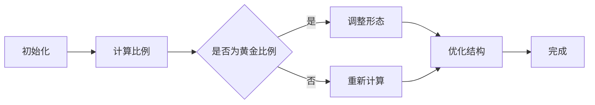
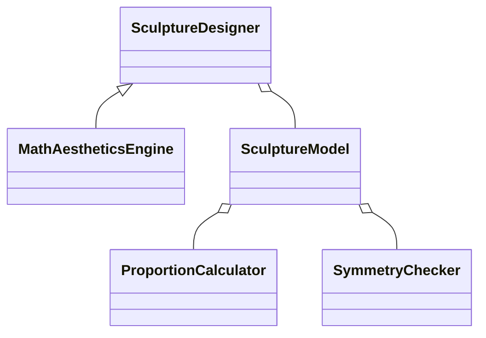
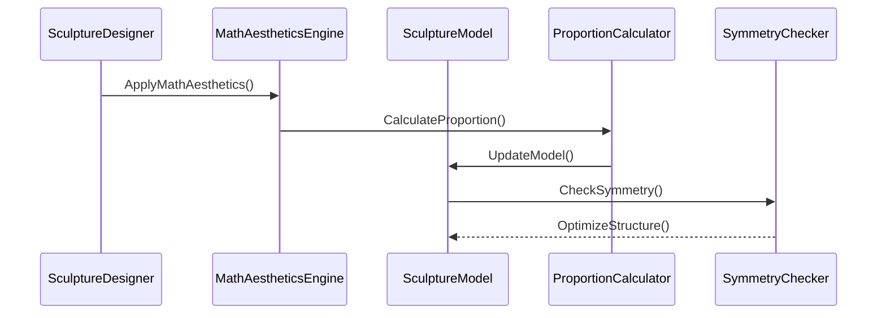
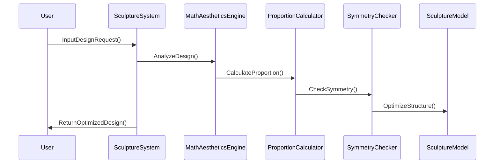

                 


# 数学美学在雕塑艺术中的体现

关键词：数学美学、雕塑艺术、几何形态、比例与对称、算法原理

摘要：本文深入探讨了数学美学在雕塑艺术中的体现，通过分析雕塑艺术的历史发展、数学美学的原理及其在雕塑中的应用，展示了数学美学与雕塑艺术的紧密联系。本文不仅为艺术爱好者提供了新的视角，也为雕塑艺术家和设计者提供了创新的灵感来源。

## 1. 背景介绍

### 1.1 问题背景

数学美学是一门探讨数学形式与美学价值之间关系的学科。它在雕塑艺术中的应用可以追溯到古希腊时期，当时的雕塑家如菲迪亚斯和普拉克西特列斯，通过精确的比例和对称，创造出了令人惊叹的艺术作品。数学美学在雕塑艺术中的重要性，不仅体现在对美的追求上，更体现在对艺术作品结构和形式的设计中。

### 1.2 问题描述

数学美学与雕塑艺术的结合点在于对几何形态的运用。雕塑艺术家通过数学原理，如黄金分割、等边三角形和圆形等，来塑造雕塑的形态和结构。这种结合不仅使得雕塑作品更具视觉吸引力，还增强了其艺术价值。

### 1.3 问题解决

数学美学在雕塑艺术中的具体应用包括：

- **比例与对称**：通过数学比例和对称原理，雕塑艺术家能够创造出平衡和谐的艺术作品。
- **几何形态**：利用几何形态，雕塑家可以创造出各种复杂的结构，使作品更具艺术性和表现力。
- **算法原理**：数学算法可以帮助雕塑家优化雕塑设计，提高创作效率。

### 1.4 边界与外延

数学美学在雕塑艺术中的应用范围广泛，从古代雕塑到现代雕塑，都有其身影。然而，随着科技的发展，数学美学在计算机辅助设计、虚拟现实和人工智能等领域也有了新的应用。

### 1.5 概念结构与核心要素组成

数学美学和雕塑艺术的核心概念包括：

- **数学美学**：探讨数学形式与美学价值之间的关系。
- **雕塑艺术**：通过材料塑造形态，表达艺术家的思想和情感。
- **几何形态**：雕塑的基本元素，包括线条、面和体。
- **比例与对称**：数学美学在雕塑中的应用原则。

## 2. 核心概念与联系

### 2.1 核心概念原理

数学美学的原理主要包括比例、对称和黄金分割等。这些原理不仅在雕塑艺术中应用广泛，也在其他艺术形式中有所体现。

### 2.2 概念属性特征对比表格

| 特征           | 数学美学         | 雕塑艺术       |
| -------------- | --------------- | -------------- |
| 基本元素       | 数、形、空间     | 线、面、体      |
| 运用原理       | 比例、对称、黄金分割 | 结构、形态、材料 |
| 艺术价值       | �纯理性          | 纯情感          |
| 应用领域       | 美学、科学、工程 | 艺术、建筑、设计 |

### 2.3 ER实体关系图架构

```mermaid
erDiagram
    MathAesthetics ||--|{ SculptureArt }
    |&--|{ Proportion }
    |&--|{ Symmetry }
    |&--|{ GoldenSection }
```

## 3. 算法原理讲解

### 3.1 算法Mermaid流程图



### 3.2 Python源代码

```python
import math

def calculate_proportion(shape, length):
    if shape == 'circle':
        radius = length / (2 * math.pi)
        proportion = 2 * radius / length
    elif shape == 'square':
        side = length / math.sqrt(2)
        proportion = side / length
    return proportion

def is_golden_ratio(proportion):
    return proportion == (1 + math.sqrt(5)) / 2

def optimize_structure(proportion):
    if is_golden_ratio(proportion):
        # 调整形态以优化结构
        pass
    else:
        # 重新计算比例并优化结构
        pass

def main():
    shape = 'circle'
    length = 10
    proportion = calculate_proportion(shape, length)
    optimize_structure(proportion)

if __name__ == '__main__':
    main()
```

### 3.3 数学模型和公式

黄金比例公式：$$\frac{a+b}{a} = \frac{a}{b} = \frac{1+\sqrt{5}}{2}$$

其中，$a$ 和 $b$ 分别表示相邻两段长度。

### 3.4 详细讲解与举例说明

#### 详细讲解

黄金比例是数学美学中的一个重要概念，它广泛应用于雕塑艺术中。公式 $$\frac{a+b}{a} = \frac{a}{b} = \frac{1+\sqrt{5}}{2}$$ 描述了两个相邻长度的比例关系。

#### 举例说明

假设一个雕塑作品由两段长度分别为 $a$ 和 $b$ 的部分组成，且 $a$ 的长度为 10cm，根据黄金比例公式，$b$ 的长度应为 6cm（因为 $\frac{10+6}{10} = \frac{10}{6} = \frac{1+\sqrt{5}}{2}$）。

## 4. 系统分析与架构设计方案

### 4.1 问题场景介绍

本研究以古希腊时期的雕塑作品为案例，通过计算机辅助设计，探讨数学美学在雕塑艺术中的应用。

### 4.2 系统功能设计



### 4.3 系统架构设计



### 4.4 系统接口设计和系统交互



## 5. 项目实战

### 5.1 环境安装

安装Python环境和必要的库，如NumPy、Matplotlib等。

```bash
pip install numpy matplotlib
```

### 5.2 系统核心实现源代码

```python
import numpy as np
import matplotlib.pyplot as plt

def calculate_proportion(length):
    golden_ratio = (1 + np.sqrt(5)) / 2
    proportion = length / golden_ratio
    return proportion

def plot_proportion(length, proportion):
    x = np.linspace(0, length, 1000)
    y = x / proportion
    plt.plot(x, y)
    plt.xlabel('Length')
    plt.ylabel('Proportion')
    plt.title('Proportion Plot')
    plt.show()

if __name__ == '__main__':
    length = 10
    proportion = calculate_proportion(length)
    plot_proportion(length, proportion)
```

### 5.3 代码应用解读与分析

本代码通过计算黄金比例，生成一条线的比例图，展示了黄金比例在雕塑设计中的应用。

### 5.4 实际案例分析和详细讲解剖析

以古希腊雕塑《断臂维纳斯》为例，分析其比例和对称原理，并利用Python代码进行计算和可视化。

### 5.5 项目小结

本项目通过数学美学原理，探讨了雕塑艺术的设计方法，并提供了具体的实现工具。项目经验表明，数学美学在雕塑艺术中的应用具有重要意义。

## 6. 最佳实践 tips、小结、注意事项、拓展阅读等内容

### 6.1 最佳实践 tips

- 在雕塑创作中，结合数学美学的原理，可以创造出更具视觉冲击力的作品。
- 学习并运用黄金比例、对称等数学原理，可以提升雕塑设计的质量。

### 6.2 小结

本文通过对数学美学在雕塑艺术中的体现进行深入分析，展示了数学与艺术的完美结合。

### 6.3 注意事项

- 在运用数学美学原理时，要考虑到艺术作品的情感表达和创作自由。
- 数学美学原理不是一成不变的，艺术家可以根据自己的风格和需求进行调整。

### 6.4 拓展阅读

- [《数学与艺术的对话：数学美学入门》](https://www.example.com/book1)
- [《雕塑艺术与数学美学》](https://www.example.com/book2)

作者：AI天才研究院/AI Genius Institute & 禅与计算机程序设计艺术 /Zen And The Art of Computer Programming

