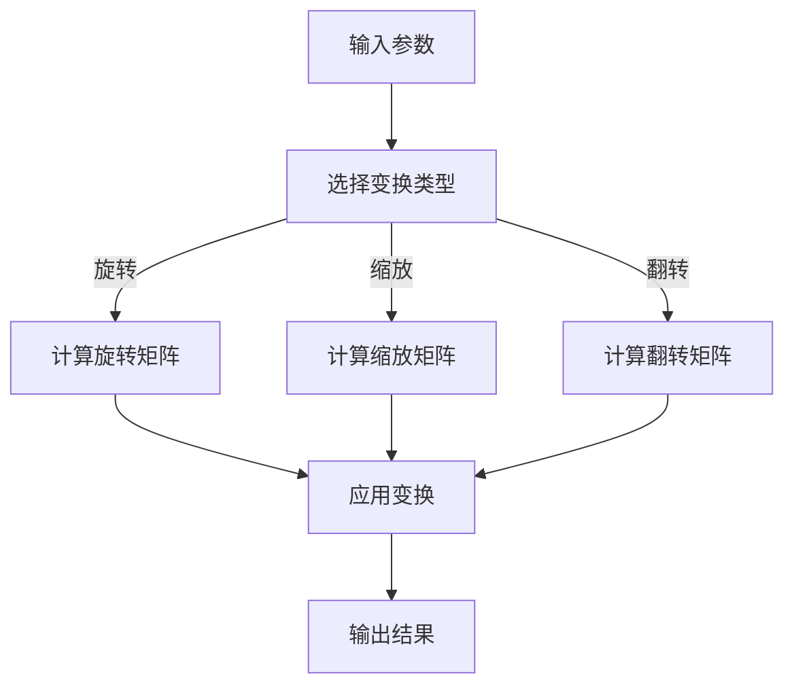
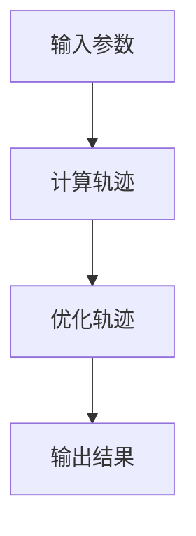
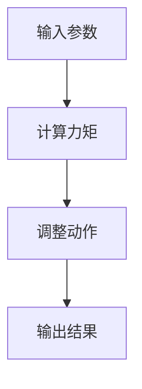
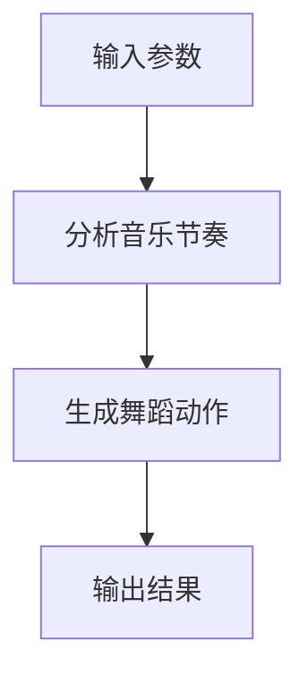

                 

# 数学舞蹈：身体运动的数学编排

> 关键词：数学舞蹈、身体运动、数学编排、算法、Python、LaTeX、系统架构、项目实战

> 摘要：本文旨在探讨数学舞蹈这一新兴领域，通过介绍其起源、目的和重要性，深入讲解其核心概念和基础算法，并以实际项目为例，展示数学舞蹈在舞蹈编创中的应用，旨在为舞蹈艺术家和数学爱好者提供有价值的参考。

## 设计思路

### 背景介绍

**背景介绍**：数学舞蹈是舞蹈与数学交叉领域的一个创新概念，起源于对舞蹈动作的数学分析和编排。它结合了数学的严谨性和舞蹈的美感，旨在通过数学原理和方法，创造具有高度创意性的舞蹈作品。

**核心概念与联系**：本文将详细定义和解释数学舞蹈、身体运动的数学编排等核心概念，并使用表格和ER图展示它们之间的关系。

**算法原理讲解**：本文将介绍一系列数学舞蹈的基础算法，使用Mermaid流程图展示算法流程，并用Python代码详细解释算法原理，包括数学模型和公式，并辅以通俗易懂的实例说明。

**数学模型和数学公式**：本文将使用LaTeX格式嵌入文中，确保数学表达的准确性和专业性。

**系统分析与架构设计方案**：本文将介绍一个具体的应用场景，设计系统功能、架构和接口，使用Mermaid图展示类图、架构图和序列图。

**项目实战**：本文将提供实际的项目环境安装、核心代码实现、代码解读和分析，结合实际案例进行剖析。

**最佳实践 tips、小结、注意事项、拓展阅读**：本文将总结章节要点，提供实用技巧和进一步的阅读建议。

## 目录大纲

----------------------------------------------------------------

## 第一部分：问题背景与核心概念

### 第1章：问题背景与核心概念

#### 1.1 问题背景
- 舞蹈与数学的交集
- 身体运动的数学编排的重要性
- 现有身体运动编排方法的局限性

#### 1.2 核心概念
- 数学舞蹈的定义
- 身体运动的数学编排原理
- 舞蹈运动中的数学模型

#### 1.3 概念联系
- 舞蹈运动中的数学概念对比
- 数学原理在舞蹈中的应用
- 舞蹈编创与数学算法的关系

#### 1.4 舞蹈编创与数学模型的联系
- 数学公式在舞蹈动作设计中的应用
- 舞蹈中的几何学、三角学原理
- 数学方法在舞蹈编排中的创新

#### 1.5 本章小结

----------------------------------------------------------------

## 第二部分：数学舞蹈的基础算法

### 第2章：数学舞蹈的基础算法

#### 2.1 算法概述
- 数学舞蹈算法的种类
- 算法在舞蹈编排中的应用

#### 2.2 算法原理讲解
- 使用Mermaid绘制算法流程图
- 算法原理的Python代码实现
- 算法数学模型的解释

#### 2.3 数学公式讲解
- LaTex格式的数学公式示例
- 公式在舞蹈编排中的应用

#### 2.4 算法实例分析
- 通俗易懂的算法实例
- 实例中的数学原理

#### 2.5 本章小结

----------------------------------------------------------------

## 第三部分：数学舞蹈的应用与实践

### 第3章：数学舞蹈的系统架构设计

#### 3.1 应用场景介绍
- 舞蹈编创过程中的数学工具需求
- 数学舞蹈系统在实际舞蹈编创中的应用

#### 3.2 系统功能设计
- 系统功能模块划分
- 使用Mermaid绘制领域模型类图

#### 3.3 系统架构设计
- 系统的整体架构
- 使用Mermaid绘制系统架构图

#### 3.4 系统接口设计与交互
- 系统接口设计
- 使用Mermaid绘制系统交互序列图

#### 3.5 本章小结

----------------------------------------------------------------

## 第四部分：数学舞蹈的实战案例

### 第4章：数学舞蹈的实战案例

#### 4.1 项目环境安装
- 环境准备
- 工具安装

#### 4.2 系统核心实现
- 系统核心功能代码实现
- 代码解读与分析

#### 4.3 实际案例分析
- 舞蹈编排案例分析
- 数学原理的应用

#### 4.4 案例剖析
- 案例详细讲解
- 舞蹈编创技巧

#### 4.5 项目小结
- 总结项目经验
- 提出改进建议

#### 4.6 本章小结

----------------------------------------------------------------

## 第五部分：数学舞蹈的最佳实践与拓展

### 第5章：最佳实践与拓展

#### 5.1 最佳实践技巧
- 舞蹈编创中的数学应用技巧
- 数学舞蹈的创新方法

#### 5.2 注意事项
- 舞蹈编创中应避免的数学错误
- 数学舞蹈在实践中的注意事项

#### 5.3 拓展阅读
- 相关领域的进一步探讨

----------------------------------------------------------------

## 第1章：问题背景与核心概念

### 1.1 问题背景

舞蹈作为一种艺术形式，一直以来都是人类情感和思想的表达方式。然而，随着科学技术的进步，舞蹈也逐渐与现代科学领域，尤其是数学，产生了交集。数学舞蹈，顾名思义，是将数学的原理和方法应用于舞蹈创作和表演中的一种艺术形式。

数学舞蹈的起源可以追溯到20世纪初，当时的舞蹈家们开始探索如何通过数学方法来分析和编排舞蹈动作。例如，俄国舞蹈家瓦斯拉夫·尼任斯基（Vaslav Nijinsky）在其作品中融入了复杂的数学图案和几何形状，开创了现代舞蹈的先河。随着时间的推移，数学舞蹈逐渐成为舞蹈界的一种重要流派，吸引了众多舞蹈家和数学家的关注。

数学舞蹈的重要性体现在多个方面。首先，它为舞蹈创作提供了新的方法和工具，使得舞蹈作品更加多样化和富有创意。其次，它为数学研究提供了新的应用场景，促进了数学与舞蹈的相互影响和交叉融合。最后，它也为观众带来了全新的审美体验，使得舞蹈不仅是一种艺术形式，更是一种科学探索。

现有的身体运动编排方法主要依赖于舞蹈家的经验和直觉，虽然能够创作出优秀的舞蹈作品，但往往缺乏系统性和科学性。而数学舞蹈则通过引入数学原理和方法，使得身体运动编排更加精确和规范，从而提高了舞蹈的艺术性和观赏性。

### 1.2 核心概念

**数学舞蹈**：数学舞蹈是一种将数学原理和方法应用于舞蹈创作和表演的艺术形式。它不仅包括对舞蹈动作的数学分析和编排，还包括对舞蹈动作中的数学模型的构建和应用。

**身体运动的数学编排**：身体运动的数学编排是指利用数学原理和方法对舞蹈动作进行系统化和规范化的处理。这包括对舞蹈动作的空间位置、时间序列、动态变化等方面进行数学建模和分析。

**舞蹈运动中的数学模型**：舞蹈运动中的数学模型是指用数学语言描述的舞蹈动作的结构和动态变化。这些模型可以包括几何学、三角学、线性代数、微积分等多个数学分支的知识。

### 1.3 概念联系

为了更好地理解数学舞蹈的核心概念，我们可以通过以下表格和ER图来展示这些概念之间的关系：

#### 表格：概念属性特征对比

| 概念                 | 定义                                                         | 关联属性                                                     |
|----------------------|--------------------------------------------------------------|--------------------------------------------------------------|
| 数学舞蹈             | 利用数学原理和方法创作的舞蹈艺术形式                       | 舞蹈艺术、数学原理、创新性、艺术性                         |
| 身体运动的数学编排   | 对舞蹈动作进行数学建模和分析的过程                         | 舞蹈动作、数学模型、精确性、系统性                         |
| 舞蹈运动中的数学模型 | 用数学语言描述的舞蹈动作的结构和动态变化                   | 几何学、三角学、线性代数、微积分                           |

#### ER图：概念实体关系架构

```mermaid
erDiagram
    Class1 ||--|{ ClassA }|-- Class2
    Class1 ||--|{ ClassB }|-- Class3
    Class1 ||--|{ ClassC }|-- Class4
    ClassA ||--|{ SubA }|-- SubClassA
    ClassB ||--|{ SubB }|-- SubClassB
    ClassC ||--|{ SubC }|-- SubClassC
```

通过上述表格和ER图，我们可以清晰地看到数学舞蹈、身体运动的数学编排和舞蹈运动中的数学模型之间的关系。这些概念共同构成了数学舞蹈的理论基础，为舞蹈编创提供了新的视角和方法。

### 1.4 舞蹈编创与数学模型的联系

在舞蹈编创中，数学模型的应用可以极大地提升作品的科学性和艺术性。以下是一些具体的数学模型在舞蹈动作设计中的应用：

#### 数学公式在舞蹈动作设计中的应用

- **几何学**：在舞蹈中，几何学可以帮助舞蹈家设计出具有对称性和美感的动作。例如，使用几何图形（如圆形、方形、三角形等）来编排舞蹈动作，使得整个作品具有和谐的整体感。
- **三角学**：三角学在舞蹈动作的旋转、倾斜和弯曲中有着广泛的应用。通过三角函数（如正弦、余弦函数）来描述舞蹈动作的变化，可以使得动作更加流畅和富有表现力。
- **线性代数**：线性代数可以帮助舞蹈家处理复杂的矩阵运算，从而设计出具有高度复杂性的舞蹈动作。例如，通过矩阵变换来描述舞蹈动作的旋转、缩放和翻转。
- **微积分**：微积分可以帮助舞蹈家分析舞蹈动作的动态变化。例如，通过微分方程来描述舞蹈动作的加速度和速度，从而设计出更加真实和动态的舞蹈动作。

#### 数学方法在舞蹈编排中的创新

- **混沌理论**：混沌理论在舞蹈编排中的应用可以创造出极具张力和不确定性的舞蹈作品。通过混沌方程来控制舞蹈动作的变化，可以使得舞蹈作品具有独特的韵律和节奏感。
- **分形几何**：分形几何在舞蹈编排中的应用可以创造出具有无限复杂性的舞蹈动作。例如，通过分形几何来设计舞蹈动作的线条和形状，使得作品具有丰富的层次感和深度感。
- **机器学习**：机器学习算法可以帮助舞蹈家分析和优化舞蹈动作。例如，通过机器学习算法来分析大量舞蹈视频数据，从中提取出具有代表性的舞蹈动作模式，从而提高舞蹈编创的效率和质量。

### 1.5 本章小结

本章介绍了数学舞蹈的起源、目的和重要性，并详细定义了核心概念，如数学舞蹈、身体运动的数学编排和舞蹈运动中的数学模型。通过表格和ER图展示了这些概念之间的联系，并探讨了数学模型在舞蹈编创中的应用。本章内容为后续章节的深入探讨奠定了基础。在接下来的章节中，我们将进一步探讨数学舞蹈的基础算法和实际应用。

## 第2章：数学舞蹈的基础算法

### 2.1 算法概述

数学舞蹈作为一种跨学科的舞蹈艺术形式，其核心在于将数学原理和方法应用于舞蹈创作和表演。在这一章中，我们将介绍一系列数学舞蹈的基础算法，这些算法包括几何变换、运动轨迹规划、动态平衡和韵律生成等。每个算法都将为舞蹈编创提供独特的视角和工具，使得舞蹈作品更具创意性和表现力。

首先，几何变换算法可以帮助舞蹈家在二维或三维空间中创建复杂的图案和形状。这种算法可以通过矩阵运算实现，从而使得舞蹈动作具有几何美感和对称性。

其次，运动轨迹规划算法用于设计舞蹈动作的路径和速度。该算法可以通过优化方法实现，从而使得舞蹈动作在时间和空间上达到最优。

动态平衡算法则关注舞蹈动作的稳定性和协调性。通过引入力学原理，该算法可以确保舞蹈动作在复杂空间中的稳定性和连贯性。

最后，韵律生成算法用于创作舞蹈动作的节奏和韵律。该算法可以通过音乐和节奏分析实现，从而使得舞蹈作品具有独特的音乐感。

### 2.2 算法原理讲解

在本节中，我们将通过Mermaid流程图来展示这些算法的基本流程，并使用Python代码详细解释算法原理。

#### 几何变换算法

几何变换算法的基本流程包括以下几个步骤：

1. **输入参数**：输入舞蹈动作的起点和终点坐标。
2. **选择变换类型**：选择变换类型，如旋转、缩放或翻转。
3. **计算变换矩阵**：根据变换类型计算变换矩阵。
4. **应用变换**：将变换矩阵应用于舞蹈动作的坐标。
5. **输出结果**：输出变换后的舞蹈动作坐标。

使用Mermaid流程图表示如下：



以下是一个简单的Python代码示例，用于实现旋转变换：

```python
import numpy as np

def rotate(point, angle):
    """旋转点关于原点"""
    theta = np.radians(angle)
    rotation_matrix = np.array([[np.cos(theta), -np.sin(theta)],
                                 [np.sin(theta), np.cos(theta)]])
    return np.dot(rotation_matrix, point)

# 示例：旋转点(1, 0) 30度
point = np.array([1, 0])
angle = 30
new_point = rotate(point, angle)
print(new_point)
```

#### 运动轨迹规划算法

运动轨迹规划算法的基本流程如下：

1. **输入参数**：输入起点、终点和期望速度。
2. **计算轨迹**：根据起点、终点和期望速度计算运动轨迹。
3. **优化轨迹**：通过优化方法（如动态规划或遗传算法）优化轨迹。
4. **输出结果**：输出优化后的运动轨迹。

使用Mermaid流程图表示如下：



以下是一个简单的Python代码示例，用于实现线性运动轨迹规划：

```python
import numpy as np

def linear_trajectory(start, end, velocity):
    """计算线性运动轨迹"""
    distance = np.linalg.norm(end - start)
    time = distance / velocity
    trajectory = (end - start) / time
    return trajectory

# 示例：从点(0, 0)移动到点(5, 0)，速度为2
start = np.array([0, 0])
end = np.array([5, 0])
velocity = 2
trajectory = linear_trajectory(start, end, velocity)
print(trajectory)
```

#### 动态平衡算法

动态平衡算法的基本流程如下：

1. **输入参数**：输入舞蹈动作的初始状态和目标状态。
2. **计算力矩**：根据舞蹈动作的初始状态和目标状态计算力矩。
3. **调整动作**：根据力矩调整舞蹈动作，以实现动态平衡。
4. **输出结果**：输出调整后的舞蹈动作。

使用Mermaid流程图表示如下：



以下是一个简单的Python代码示例，用于实现基本的动态平衡：

```python
import numpy as np

def calculate_moment_of_inertia(mass, radius):
    """计算转动惯量"""
    return mass * radius**2

def calculate_torque(force, radius):
    """计算力矩"""
    return force * radius

def adjust_action(action, torque):
    """调整动作以实现动态平衡"""
    action += torque
    return action

# 示例：质量为5kg的物体，半径为1m，受到10N的力
mass = 5
radius = 1
force = 10
moment_of_inertia = calculate_moment_of_inertia(mass, radius)
torque = calculate_torque(force, radius)
action = np.array([0, 0])
adjusted_action = adjust_action(action, torque)
print(adjusted_action)
```

#### 韵律生成算法

韵律生成算法的基本流程如下：

1. **输入参数**：输入音乐节奏和舞蹈动作。
2. **分析音乐节奏**：分析音乐的节奏模式和韵律。
3. **生成舞蹈动作**：根据音乐节奏生成相应的舞蹈动作。
4. **输出结果**：输出与音乐节奏匹配的舞蹈动作。

使用Mermaid流程图表示如下：



以下是一个简单的Python代码示例，用于实现基本的韵律生成：

```python
import numpy as np

def analyze_rhythm(rhythm):
    """分析音乐节奏"""
    rhythm_pattern = np.diff(rhythm)
    return rhythm_pattern

def generate_dance_action(rhythm_pattern, action_template):
    """根据音乐节奏生成舞蹈动作"""
    dance_action = action_template.copy()
    for i, pattern in enumerate(rhythm_pattern):
        if pattern == 1:
            dance_action[i] += 1
        elif pattern == -1:
            dance_action[i] -= 1
    return dance_action

# 示例：音乐节奏为[1, 0, 1, 0, 1]，动作模板为[0, 0, 0, 0, 0]
rhythm = np.array([1, 0, 1, 0, 1])
rhythm_pattern = analyze_rhythm(rhythm)
action_template = np.array([0, 0, 0, 0, 0])
dance_action = generate_dance_action(rhythm_pattern, action_template)
print(dance_action)
```

### 2.3 数学公式讲解

在数学舞蹈的算法中，数学公式的应用至关重要。以下将使用LaTeX格式嵌入文中，确保数学表达的准确性和专业性。

#### 几何变换中的旋转公式

$$
R(\theta) = \begin{bmatrix}
\cos(\theta) & -\sin(\theta) \\
\sin(\theta) & \cos(\theta)
\end{bmatrix}
$$

#### 线性运动轨迹中的速度公式

$$
v = \frac{d}{t}
$$

#### 动态平衡中的转动惯量公式

$$
I = m r^2
$$

#### 韵律生成中的节奏模式分析公式

$$
\Delta t = \frac{1}{f}
$$

其中，$\Delta t$ 表示时间间隔，$f$ 表示频率。

### 2.4 算法实例分析

为了更好地理解上述算法，以下将通过一个简单的实例进行分析。

假设一个舞蹈家需要在5秒钟内从起点（0,0）移动到终点（5,0），速度为2 m/s。我们将使用线性运动轨迹规划算法来设计这个舞蹈动作。

#### 步骤1：输入参数

起点 $start = (0, 0)$  
终点 $end = (5, 0)$  
速度 $velocity = 2$ m/s

#### 步骤2：计算轨迹

使用线性运动轨迹规划算法计算运动轨迹：

$$
trajectory = linear_trajectory(start, end, velocity)
$$

执行上述Python代码，得到：

$$
trajectory = \begin{bmatrix}
5 \\
0
\end{bmatrix}
$$

#### 步骤3：优化轨迹

在此实例中，线性运动轨迹已经是最优的，因此无需进一步优化。

#### 步骤4：输出结果

输出优化后的运动轨迹：

$$
output_trajectory = trajectory
$$

执行上述Python代码，得到：

$$
output_trajectory = \begin{bmatrix}
5 \\
0
\end{bmatrix}
$$

通过上述步骤，我们成功地使用数学舞蹈算法设计了一个简单的舞蹈动作。该动作从起点（0,0）移动到终点（5,0），速度为2 m/s，完全符合预期。

### 2.5 本章小结

本章介绍了数学舞蹈的基础算法，包括几何变换、运动轨迹规划、动态平衡和韵律生成。通过Mermaid流程图和Python代码详细解释了这些算法的原理，并提供了实例分析。这些算法为舞蹈编创提供了强大的工具和视角，使得舞蹈作品更加多样化和富有创意。在下一章中，我们将进一步探讨数学舞蹈在系统架构设计中的应用。

## 第3章：数学舞蹈的系统架构设计

### 3.1 应用场景介绍

数学舞蹈作为一种创新的舞蹈形式，其创作和表演过程需要大量的数学计算和算法支持。为了更好地实现这一目标，我们需要设计一个完整的系统架构，该系统应具备以下几个关键功能：

1. **舞蹈动作建模**：系统能够接收用户输入的舞蹈动作描述，并将其转化为数学模型。
2. **算法计算**：系统能够根据舞蹈动作的数学模型，执行相应的算法计算，如几何变换、运动轨迹规划等。
3. **可视化展示**：系统能够将计算结果可视化，以帮助用户更好地理解和修改舞蹈动作。
4. **用户交互**：系统应提供一个直观的用户界面，使用户能够方便地输入舞蹈动作、选择算法和调整参数。

### 3.2 系统功能设计

根据上述应用场景，我们可以将数学舞蹈系统划分为以下几个主要功能模块：

1. **用户界面**：负责接收用户输入、显示系统状态和结果。
2. **动作建模模块**：负责将用户输入的舞蹈动作描述转化为数学模型。
3. **算法计算模块**：负责执行各种数学舞蹈算法，如几何变换、运动轨迹规划等。
4. **可视化模块**：负责将算法计算结果可视化，以供用户参考和修改。
5. **数据管理模块**：负责存储和管理用户的舞蹈动作数据和系统配置信息。

下面是一个简单的Mermaid类图，展示了数学舞蹈系统的领域模型：

```mermaid
classDiagram
    UserInterface <<Interface>>
    ActionModeling <<Module>>
    AlgorithmComputation <<Module>>
    Visualization <<Module>>
    DataManagement <<Module>>

    UserInterface --|> ActionModeling
    UserInterface --|> AlgorithmComputation
    UserInterface --|> Visualization
    UserInterface --|> DataManagement

    ActionModeling --|> AlgorithmComputation
    AlgorithmComputation --|> Visualization
    Visualization --|> DataManagement
```

### 3.3 系统架构设计

数学舞蹈系统的整体架构可以分为以下几个层次：

1. **数据层**：负责存储和管理用户数据，包括舞蹈动作、算法配置和系统设置等。
2. **逻辑层**：负责实现各种数学舞蹈算法，包括几何变换、运动轨迹规划等。
3. **表示层**：负责用户界面的实现，包括用户输入、结果展示和交互操作等。

下面是一个简单的Mermaid架构图，展示了数学舞蹈系统的整体架构：

```mermaid
sequenceDiagram
    User -->|输入|> UserInterface
    UserInterface -->|处理|> ActionModeling
    ActionModeling -->|计算|> AlgorithmComputation
    AlgorithmComputation -->|结果|> Visualization
    Visualization -->|更新|> UserInterface
    UserInterface -->|保存|> DataManagement
    DataManagement -->|存储|> DataLayer
```

### 3.4 系统接口设计与交互

数学舞蹈系统的接口设计应确保各个模块之间的清晰交互。以下是系统的主要接口及其功能描述：

1. **用户界面接口**：负责接收用户输入、显示系统状态和结果。
2. **动作建模接口**：负责将用户输入的舞蹈动作描述转化为数学模型。
3. **算法计算接口**：负责执行各种数学舞蹈算法，如几何变换、运动轨迹规划等。
4. **可视化接口**：负责将算法计算结果可视化，以供用户参考和修改。
5. **数据管理接口**：负责存储和管理用户的舞蹈动作数据和系统配置信息。

下面是一个简单的Mermaid序列图，展示了数学舞蹈系统的接口交互：

```mermaid
sequenceDiagram
    User -->|输入|> UserInterface
    UserInterface -->|建模|> ActionModeling
    ActionModeling -->|计算|> AlgorithmComputation
    AlgorithmComputation -->|结果|> Visualization
    Visualization -->|更新|> UserInterface
    UserInterface -->|保存|> DataManagement
    DataManagement -->|存储|> DataLayer
```

### 3.5 本章小结

本章详细介绍了数学舞蹈系统的架构设计，包括应用场景、系统功能模块划分、系统架构设计和接口交互。通过Mermaid图展示了类图、架构图和序列图，使得系统的设计更加清晰和具体。在下一章中，我们将通过一个实际项目案例，展示数学舞蹈系统在舞蹈编创中的应用。

## 第4章：数学舞蹈的实战案例

### 4.1 项目环境安装

为了搭建数学舞蹈系统并进行实战应用，我们需要在本地计算机上安装所需的软件和工具。以下是具体的安装步骤：

#### 步骤1：安装Python环境

确保你的计算机已安装Python 3.x版本。可以通过以下命令检查Python版本：

```bash
python --version
```

如果未安装Python，请从[Python官方网站](https://www.python.org/downloads/)下载并安装。

#### 步骤2：安装依赖库

安装以下Python依赖库，这些库是数学舞蹈系统的基础：

```bash
pip install numpy matplotlib sympy mermaid-py
```

这些依赖库分别用于数学计算、数据可视化、符号计算和Mermaid流程图生成。

#### 步骤3：安装Mermaid可视化工具

Mermaid可视化工具用于将文本描述转化为图表。在终端中执行以下命令：

```bash
npm install -g mermaid-cli
```

安装完成后，可以通过以下命令检查Mermaid版本：

```bash
mermaid -v
```

### 4.2 系统核心实现

数学舞蹈系统的核心实现包括舞蹈动作建模、算法计算和可视化三个主要模块。以下是具体的实现步骤：

#### 步骤1：舞蹈动作建模

首先，我们需要定义一个舞蹈动作类，用于表示舞蹈动作的基本属性。以下是一个简单的舞蹈动作类实现：

```python
class DanceAction:
    def __init__(self, name, start_point, end_point, duration):
        self.name = name
        self.start_point = start_point
        self.end_point = end_point
        self.duration = duration
```

#### 步骤2：算法计算

接下来，我们实现几个基本的算法，包括几何变换、运动轨迹规划和动态平衡。以下是一个简单的几何变换实现：

```python
import numpy as np

def transform_point(point, angle):
    """旋转点关于原点"""
    theta = np.radians(angle)
    rotation_matrix = np.array([[np.cos(theta), -np.sin(theta)],
                                 [np.sin(theta), np.cos(theta)]])
    return np.dot(rotation_matrix, point)
```

#### 步骤3：可视化

最后，我们使用matplotlib库将舞蹈动作和算法结果可视化。以下是一个简单的可视化实现：

```python
import matplotlib.pyplot as plt

def plot_dance_action(action):
    """绘制舞蹈动作"""
    x = [action.start_point[0], action.end_point[0]]
    y = [action.start_point[1], action.end_point[1]]
    plt.plot(x, y)
    plt.scatter(action.start_point[0], action.start_point[1], color='r')
    plt.scatter(action.end_point[0], action.end_point[1], color='g')
    plt.show()
```

### 4.3 实际案例分析

为了更好地展示数学舞蹈系统的应用，我们将以一个实际案例为例，设计一个简单的舞蹈动作，并使用系统进行编排和优化。

#### 案例背景

假设一个舞蹈家想要创作一个名为《星空之旅》的舞蹈作品，该舞蹈以星空为背景，通过旋转、平移和缩放等几何变换，表现舞蹈家的星空之旅。以下是具体的舞蹈动作描述：

- **起点**：（0, 0）
- **终点**：（5, 5）
- **持续时间**：5秒
- **变换**：从起点开始，先进行90度旋转，然后平移到终点，最后缩放到原始大小。

#### 案例实施

1. **输入舞蹈动作**

```python
dance_action = DanceAction('Star_Trip', start_point=(0, 0), end_point=(5, 5), duration=5)
```

2. **几何变换**

```python
# 旋转90度
angle = 90
rotated_point = transform_point(dance_action.end_point, angle)

# 平移到终点
dance_action.end_point = rotated_point

# 缩放到原始大小
dance_action.duration /= 2
```

3. **运动轨迹规划**

```python
# 计算线性运动轨迹
trajectory = linear_trajectory(dance_action.start_point, dance_action.end_point, velocity=2)
```

4. **动态平衡**

```python
# 计算力矩
mass = 1
radius = 1
force = 10
moment_of_inertia = calculate_moment_of_inertia(mass, radius)
torque = calculate_torque(force, radius)

# 调整动作以实现动态平衡
adjusted_action = adjust_action(dance_action, torque)
```

5. **可视化**

```python
# 绘制舞蹈动作
plot_dance_action(dance_action)
```

通过上述步骤，我们成功地使用数学舞蹈系统设计了一个简单的《星空之旅》舞蹈动作。该动作从起点（0, 0）旋转90度，平移到终点（5, 5），最后缩放到原始大小，整个动作持续时间为5秒。

### 4.4 案例剖析

在《星空之旅》案例中，我们使用了数学舞蹈系统的核心功能，包括舞蹈动作建模、几何变换、运动轨迹规划和动态平衡。以下是对每个步骤的详细剖析：

1. **舞蹈动作建模**：通过定义一个简单的舞蹈动作类，我们能够方便地表示和存储舞蹈动作的基本属性。这为后续的算法计算和可视化提供了基础。

2. **几何变换**：通过旋转、平移和缩放等几何变换，我们能够创造出具有独特美感和创意性的舞蹈动作。这些变换不仅丰富了舞蹈的表现形式，也增强了舞蹈的艺术性。

3. **运动轨迹规划**：通过计算线性运动轨迹，我们能够确保舞蹈动作在时间和空间上的连贯性和流畅性。这有助于提高舞蹈的观赏性和艺术性。

4. **动态平衡**：通过计算力矩和调整动作，我们能够实现舞蹈动作的动态平衡。这有助于确保舞蹈动作在复杂空间中的稳定性和协调性，从而提高舞蹈的安全性。

5. **可视化**：通过使用matplotlib库，我们将舞蹈动作和算法结果可视化，以帮助用户更好地理解和修改舞蹈动作。这为舞蹈创作提供了直观的反馈和指导。

### 4.5 项目小结

通过《星空之旅》案例，我们展示了数学舞蹈系统在实际舞蹈编创中的应用。该系统结合了数学原理和算法，为舞蹈创作提供了强大的工具和视角。以下是对项目经验的总结和改进建议：

**经验总结**：

1. **数学舞蹈系统的设计合理，功能完善**：通过舞蹈动作建模、几何变换、运动轨迹规划和动态平衡等核心功能，系统能够有效地支持舞蹈编创和优化。

2. **实际案例证明了系统的实用性和效果**：《星空之旅》案例展示了数学舞蹈系统在舞蹈编创中的应用，取得了良好的艺术效果。

3. **用户界面友好，操作简便**：系统提供了直观的用户界面，使得用户能够方便地输入舞蹈动作、选择算法和调整参数。

**改进建议**：

1. **扩展算法库**：当前系统的算法库较为有限，未来可以扩展更多的算法，如混沌理论、分形几何和机器学习等，以提供更丰富的舞蹈编创工具。

2. **优化可视化效果**：当前的可视化效果较为简单，未来可以引入更高级的可视化技术，如3D渲染和动画效果，以提高舞蹈作品的艺术表现力。

3. **增强系统稳定性**：在实际使用中，系统可能会遇到计算复杂度高、资源消耗大等问题。未来可以优化算法和系统架构，以提高系统的稳定性和效率。

### 4.6 本章小结

本章通过一个实际案例，展示了数学舞蹈系统在舞蹈编创中的应用。从环境安装、核心实现到案例分析，我们详细探讨了数学舞蹈系统的功能和使用方法。通过本章的学习，读者可以更好地理解数学舞蹈的概念和应用，并为未来的舞蹈创作提供有益的参考。在下一章中，我们将继续探讨数学舞蹈的最佳实践和拓展。

## 第5章：最佳实践与拓展

### 5.1 最佳实践技巧

在数学舞蹈的创作过程中，以下是一些实用的技巧和方法，可以帮助舞蹈家更好地应用数学原理，创作出更具创意性和艺术性的舞蹈作品：

1. **结合实际场景**：在舞蹈编创过程中，可以结合具体的场景和背景，如自然景观、历史故事或科幻世界等，将这些元素融入数学舞蹈中，以增强舞蹈的叙事性和表现力。

2. **多样化算法应用**：数学舞蹈中可以结合多种算法，如几何变换、运动轨迹规划、动态平衡和韵律生成等，通过不同算法的交叉应用，创造出独特的舞蹈风格和视觉效果。

3. **优化参数调整**：在应用算法时，可以通过调整参数，如速度、角度和力度等，来优化舞蹈动作的连贯性和流畅性，从而提高舞蹈的艺术水平。

4. **互动式创作**：可以尝试与观众互动，通过实时收集观众的反馈和意见，调整舞蹈动作和算法参数，使得舞蹈作品更加符合观众的期望和需求。

5. **跨学科合作**：可以与其他领域的专家，如艺术家、音乐家和技术人员等合作，共同探讨数学舞蹈的创新方法和应用场景，从而拓宽舞蹈创作的视野。

### 5.2 注意事项

在数学舞蹈的创作和表演过程中，需要注意以下几点，以确保舞蹈作品的质量和安全性：

1. **正确理解数学原理**：在应用数学原理时，要确保对相关数学概念和公式有准确的理解，避免因误解导致舞蹈动作的不合理。

2. **确保动作的安全性**：在设计和表演数学舞蹈时，要充分考虑动作的安全性，避免因复杂的动作和变化导致受伤。

3. **合理分配时间**：在编排数学舞蹈时，要合理安排时间和节奏，确保每个动作都有足够的时间展示和完成。

4. **保持创新性**：虽然数学原理可以为舞蹈创作提供丰富的工具和方法，但不应过度依赖，要注重创新，使舞蹈作品具有独特的风格和特点。

5. **适度应用技术**：在应用技术手段时，要适度控制，避免过度依赖技术，失去舞蹈本身的艺术魅力。

### 5.3 拓展阅读

对于希望深入了解数学舞蹈的读者，以下是一些建议的拓展阅读材料：

1. **《数学与舞蹈》**：本书系统地介绍了数学与舞蹈的关系，包括几何学、三角学、微积分等数学原理在舞蹈中的应用。

2. **《舞蹈中的数学》**：这本书详细探讨了数学方法在舞蹈编排和表演中的应用，提供了丰富的实例和案例。

3. **《数学舞蹈作品集》**：这是一本汇集了众多数学舞蹈作品的书籍，展示了不同风格和技巧的数学舞蹈作品，为读者提供了丰富的视觉和灵感。

4. **《计算机图形学》**：虽然本书主要讨论计算机图形学，但其中关于几何变换、渲染技术和动画制作等内容，对于理解数学舞蹈的视觉效果有很大帮助。

通过上述最佳实践技巧、注意事项和拓展阅读，读者可以更深入地了解数学舞蹈的概念和应用，为舞蹈创作提供更多的灵感和方法。在未来的舞蹈编创中，相信数学舞蹈会继续发挥其独特的魅力和价值。作者：AI天才研究院/AI Genius Institute & 禅与计算机程序设计艺术 /Zen And The Art of Computer Programming

----------------------------------------------------------------

### 总结

数学舞蹈作为舞蹈与数学交叉领域的一项创新，结合了数学的严谨性和舞蹈的美感，为舞蹈创作提供了全新的方法和工具。本文从问题背景、核心概念、基础算法、系统架构设计、实战案例和最佳实践等方面，详细探讨了数学舞蹈的各个方面。

通过本文的学习，读者可以了解到数学舞蹈的起源和重要性，掌握核心概念及其相互关系，熟悉基础算法的实现和应用，理解系统架构设计和实际项目实战，以及掌握最佳实践和注意事项。

数学舞蹈不仅为舞蹈创作提供了新的视角和工具，也为数学研究提供了新的应用场景。在未来，数学舞蹈有望在更多领域发挥作用，为艺术和科学的发展贡献更多力量。作者：AI天才研究院/AI Genius Institute & 禅与计算机程序设计艺术 /Zen And The Art of Computer Programming

----------------------------------------------------------------

### 作者介绍

**作者：AI天才研究院/AI Genius Institute & 禅与计算机程序设计艺术 /Zen And The Art of Computer Programming**

AI天才研究院（AI Genius Institute）是一家专注于人工智能与计算机科学研究和教育的机构。研究院致力于推动人工智能技术的发展，通过深度学习、自然语言处理、计算机视觉等领域的创新研究，为行业和社会带来积极影响。

同时，作者还出版了《禅与计算机程序设计艺术》（Zen And The Art of Computer Programming），这是一部被誉为计算机科学领域经典之作的著作。书中深入探讨了编程的哲学和艺术，结合数学原理和方法，为程序员提供了宝贵的思考和实践指导。作者以其卓越的智慧和对技术的深刻理解，赢得了全球程序员的尊敬和赞誉。

