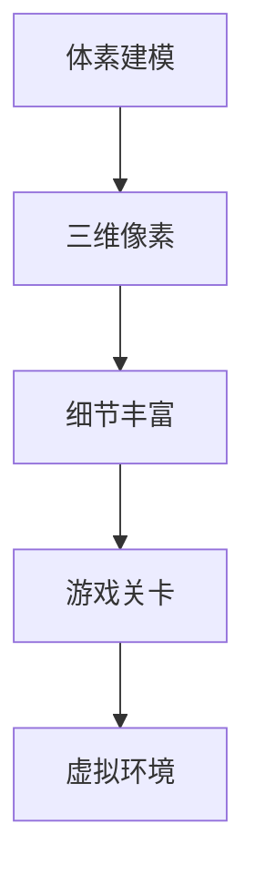
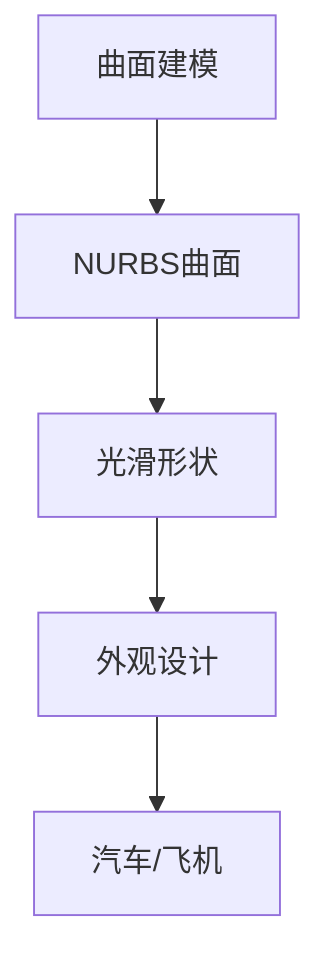
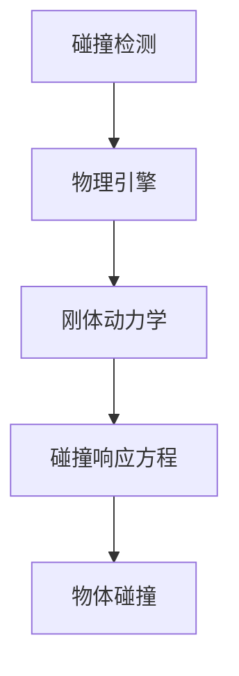
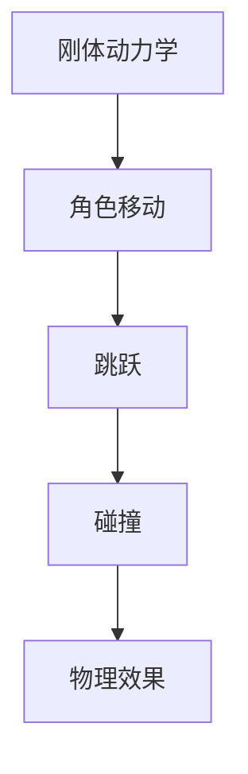
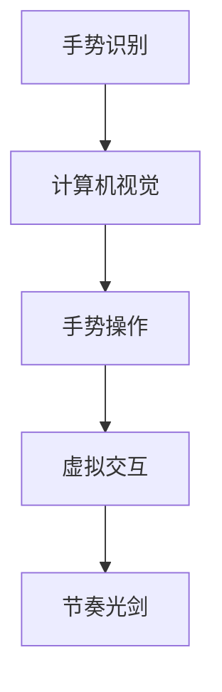
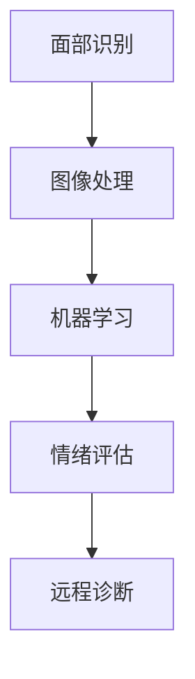
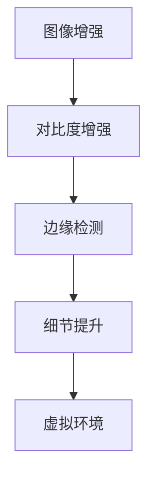
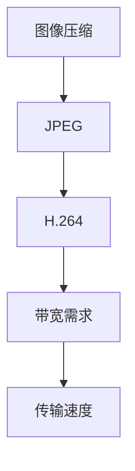
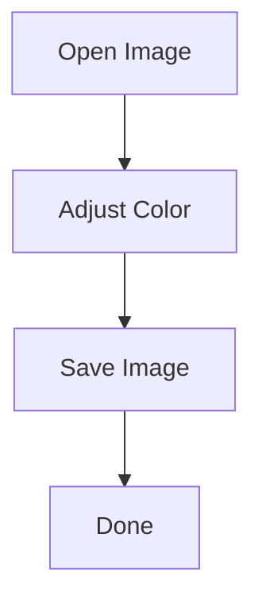

                 

# 数学艺术：艺术创作的数学原理

## 关键词

数学、艺术、关系、起源、表现、绘画、雕塑、建筑、音乐、舞蹈、数字艺术、虚拟现实、教育、治疗、跨学科、社会文化

## 摘要

数学与艺术之间的关系源远流长，自古以来，艺术家们就不断探索着数学在艺术创作中的运用。本文将从数学与艺术的关系入手，深入探讨数学在艺术中的表现与应用，包括绘画、雕塑、建筑、音乐、舞蹈和数字艺术等领域。通过详细的案例分析，本文将揭示数学在艺术创作中的核心原理，为读者提供全新的艺术视角和创作灵感。

## 第一部分：数学与艺术的关系

### 第1章：数学与艺术的起源与演变

#### 1.1 数学的发展与艺术创作的关系

数学是人类智慧的结晶，起源于古巴比伦、古埃及和古希腊等文明。在古代，数学主要用于天文学、工程学和建筑学等领域。随着数学的不断发展，其原理和方法逐渐渗透到艺术创作中，为艺术提供了新的表达方式和思维方式。

#### 1.2 古代数学与艺术

古代数学与艺术紧密相连。例如，古埃及的建筑物采用了精确的数学原理，如黄金分割和比例关系。古希腊的艺术家则通过几何图形来表达美感，如帕台农神庙所展现的数学美学。

#### 1.3 中世纪与文艺复兴时期的数学与艺术

中世纪时期，数学在艺术中的应用逐渐减弱。文艺复兴时期，随着人们对美的追求，数学重新焕发生机。达芬奇等艺术家将数学原理应用于绘画和雕塑，创作出了许多传世之作。

#### 1.4 近现代数学对艺术创作的影响

近现代以来，数学在艺术创作中的应用越来越广泛。计算机科学的发展使得数学工具和方法得到了更深入的研究和应用。数字艺术、虚拟现实等新兴艺术形式，更是将数学原理融入其中，为艺术创作提供了无限可能。

### 第2章：数学在艺术中的表现

#### 2.1 几何学在艺术中的应用

几何学是数学的基础学科，其在艺术创作中的应用十分广泛。艺术家们通过几何图形的排列、组合和变化，创造出丰富多样的视觉艺术作品。

#### 2.2 比例与平衡在艺术中的运用

比例与平衡是艺术创作中的重要原则。艺术家们通过调整比例关系和平衡状态，使作品具有和谐、优美的视觉效果。

#### 2.3 数学公式与艺术创作

数学公式在艺术创作中的应用越来越受到关注。例如，黄金分割公式在绘画、雕塑和建筑设计中被广泛应用，成为艺术创作的灵感之源。

#### 2.4 数形结合的艺术作品分析

数形结合是数学与艺术的完美融合。通过对数形结合的艺术作品进行分析，我们可以更好地理解数学在艺术创作中的重要作用。

## 第二部分：数学在绘画中的运用

### 第3章：数学在绘画中的运用

#### 3.1 色彩的数学原理

色彩是绘画的重要组成部分。通过对色彩的三原色原理、色调原理等数学原理的研究，艺术家可以更好地把握色彩的搭配和运用。

#### 3.2 绘画中的透视原理

透视原理是绘画中的关键技术。通过运用透视原理，艺术家可以创造出具有立体感、空间感的绘画作品。

#### 3.3 绘画中的构图技巧

构图技巧是绘画创作中的核心。数学中的比例、对称、黄金分割等原理，可以帮助艺术家更好地进行构图，创作出优美的绘画作品。

#### 3.4 绘画中的数学规律

绘画中的数学规律，如色彩规律、线条规律等，对于艺术创作具有重要的指导意义。通过对这些规律的研究，艺术家可以提升绘画技巧，创作出更具表现力的作品。

## 第三部分：数学在雕塑与建筑中的应用

### 第4章：数学在雕塑创作中的运用

#### 4.1 雕塑中的几何形状

几何形状是雕塑创作的基础。通过对几何形状的研究，雕塑家可以创造出丰富多样的雕塑作品。

#### 4.2 雕塑中的比例与平衡

比例与平衡是雕塑创作中的重要原则。雕塑家通过调整比例关系和平衡状态，使作品具有和谐、优美的视觉效果。

#### 4.3 雕塑中的动力学原理

动力学原理在雕塑创作中具有重要作用。通过运用动力学原理，雕塑家可以创造出具有动态感的雕塑作品。

#### 4.4 雕塑中的数学分析

数学分析在雕塑创作中的应用，可以帮助雕塑家更好地把握雕塑的形态、结构等方面，提高雕塑作品的艺术价值。

### 第5章：数学在建筑设计中的应用

#### 5.1 建筑中的几何结构

几何结构是建筑设计的基础。通过对几何结构的研究，建筑师可以创造出丰富多样的建筑作品。

#### 5.2 建筑中的比例与对称

比例与对称是建筑设计中的重要原则。建筑师通过调整比例关系和对称状态，使建筑作品具有和谐、优美的视觉效果。

#### 5.3 建筑中的数学原理

数学原理在建筑设计中的应用，可以帮助建筑师更好地把握建筑的结构、功能等方面，提高建筑作品的艺术价值。

#### 5.4 建筑中的数学建模

数学建模在建筑设计中具有重要作用。通过对建筑作品进行数学建模，建筑师可以更好地预测建筑效果，优化建筑设计。

## 第四部分：数学在音乐与舞蹈中的运用

### 第6章：数学在音乐创作中的运用

#### 6.1 音乐中的频率与音调

频率与音调是音乐的基本概念。通过对频率与音调的研究，音乐家可以创造出丰富多样的音乐作品。

#### 6.2 音乐中的节奏与旋律

节奏与旋律是音乐创作的重要元素。通过对节奏与旋律的研究，音乐家可以创造出优美动听的音乐作品。

#### 6.3 音乐中的数学关系

音乐中的数学关系，如音程、和弦等，对于音乐创作具有重要的指导意义。通过对这些关系的理解，音乐家可以创作出更具艺术价值的音乐作品。

#### 6.4 数学在音乐理论中的应用

数学在音乐理论中的应用，如调式、和声等，可以帮助音乐家更好地理解和掌握音乐理论，提升创作能力。

### 第7章：数学在舞蹈编排中的应用

#### 7.1 舞蹈中的空间与时间

空间与时间是舞蹈创作的基础。通过对空间与时间的研究，舞蹈家可以创造出丰富多样的舞蹈作品。

#### 7.2 舞蹈中的比例与对称

比例与对称是舞蹈创作中的重要原则。舞蹈家通过调整比例关系和对称状态，使舞蹈作品具有和谐、优美的视觉效果。

#### 7.3 舞蹈中的数学分析

数学分析在舞蹈创作中的应用，可以帮助舞蹈家更好地把握舞蹈的节奏、动作等方面，提高舞蹈作品的艺术价值。

#### 7.4 数学在舞蹈编排中的创新

数学在舞蹈编排中的应用，为舞蹈创作提供了新的可能性。通过对数学原理的深入研究，舞蹈家可以创造出更具创新性的舞蹈作品。

## 第五部分：数学在数字艺术中的运用

### 第8章：数字艺术中的数学原理

#### 8.1 数字绘画中的数学原理

数字绘画是数字艺术的重要组成部分。通过对数字绘画中的数学原理进行研究，艺术家可以创作出更具艺术价值的数字绘画作品。

#### 8.2 数字雕塑中的数学原理

数字雕塑是数字艺术中的新兴领域。通过对数字雕塑中的数学原理进行研究，艺术家可以创作出更具创新性的数字雕塑作品。

#### 8.3 数字音乐中的数学原理

数字音乐是数字艺术中的另一个重要领域。通过对数字音乐中的数学原理进行研究，音乐家可以创作出更具艺术感染力的数字音乐作品。

#### 8.4 数字舞蹈中的数学原理

数字舞蹈是数字艺术中的新兴领域。通过对数字舞蹈中的数学原理进行研究，舞蹈家可以创作出更具表现力的数字舞蹈作品。

### 第9章：数学在虚拟现实中的应用

#### 9.1 虚拟现实中的几何建模

几何建模是虚拟现实技术的基础。通过对虚拟现实中的几何建模进行研究，开发者可以创建出更加逼真的虚拟环境。

#### 9.2 虚拟现实中的动力学模拟

动力学模拟是虚拟现实技术的重要组成部分。通过对虚拟现实中的动力学模拟进行研究，开发者可以创建出更加真实的虚拟体验。

#### 9.3 虚拟现实中的数学算法

数学算法在虚拟现实技术中具有重要作用。通过对虚拟现实中的数学算法进行研究，开发者可以优化虚拟现实系统的性能。

#### 9.4 虚拟现实中的数学应用挑战

虚拟现实中的数学应用挑战主要集中在实时计算、空间感知等方面。通过对这些挑战的研究，开发者可以不断提高虚拟现实技术的水平。

## 第六部分：数学在艺术教育与艺术治疗中的应用

### 第10章：数学在艺术教育中的应用

#### 10.1 数学在艺术课程设计中的应用

数学在艺术课程设计中的应用，可以帮助学生更好地理解艺术创作的基本原理，提高艺术创作能力。

#### 10.2 数学在艺术教学中的运用

数学在艺术教学中的应用，可以帮助教师更好地引导学生进行艺术创作，提高教学质量。

#### 10.3 数学在艺术教育评价中的应用

数学在艺术教育评价中的应用，可以帮助教师更好地评估学生的艺术创作水平，为教学提供参考。

#### 10.4 数学在艺术教育中的挑战与机遇

数学在艺术教育中的应用，既面临着挑战，也带来了机遇。通过对这些挑战和机遇的研究，教育工作者可以不断提高艺术教育水平。

### 第11章：数学在艺术治疗中的应用

#### 11.1 数学在艺术治疗中的理论基础

数学在艺术治疗中的应用，基于数学与心理学的交叉学科研究。通过对数学在艺术治疗中的理论基础进行研究，可以更好地指导艺术治疗实践。

#### 11.2 数学在艺术治疗实践中的应用

数学在艺术治疗实践中的应用，可以帮助治疗师更好地理解患者的心理状态，提高治疗效果。

#### 11.3 数学在艺术治疗中的案例分析

通过对数学在艺术治疗中的案例分析，可以更好地了解数学在艺术治疗中的应用效果，为艺术治疗提供实证支持。

#### 11.4 数学在艺术治疗中的未来发展

随着数学与心理学等学科的不断发展，数学在艺术治疗中的应用前景十分广阔。通过对未来发展的研究，可以为艺术治疗提供新的思路和方法。

## 第七部分：数学艺术的跨学科研究

### 第12章：数学艺术的跨学科研究方法

#### 12.1 数学艺术研究的跨学科特点

数学艺术研究具有跨学科的特点，涉及数学、艺术、心理学、教育学等多个领域。通过对这些领域的交叉研究，可以更好地探索数学艺术的发展规律。

#### 12.2 数学艺术研究的跨学科方法

数学艺术研究的跨学科方法，包括实证研究、案例研究、理论分析等。这些方法可以帮助研究者从不同角度探索数学艺术的问题。

#### 12.3 数学艺术研究的跨学科案例

通过对数学艺术研究的跨学科案例进行分析，可以更好地了解数学艺术在不同领域中的应用效果和意义。

#### 12.4 数学艺术研究的跨学科前景

随着跨学科研究的不断发展，数学艺术研究的前景十分广阔。通过对未来发展的研究，可以为数学艺术的发展提供新的思路和方法。

### 第13章：数学艺术的社会与文化意义

#### 13.1 数学艺术的社会影响

数学艺术在社会中具有广泛的影响。通过对数学艺术的社会影响进行研究，可以更好地了解数学艺术在社会发展中的作用。

#### 13.2 数学艺术的文化价值

数学艺术具有独特的文化价值。通过对数学艺术的文化价值进行研究，可以更好地认识数学艺术在文化传承和创新中的作用。

#### 13.3 数学艺术的教育意义

数学艺术在教育中具有重要的意义。通过对数学艺术的教育意义进行研究，可以更好地发挥数学艺术在素质教育中的作用。

#### 13.4 数学艺术的艺术价值

数学艺术具有独特的艺术价值。通过对数学艺术的艺术价值进行研究，可以更好地认识数学艺术在艺术创作和欣赏中的价值。

## 结语

数学与艺术的关系源远流长，两者相互影响、相互促进。通过对数学在艺术创作中的应用进行深入研究，我们可以更好地理解数学与艺术的内在联系，为艺术创作提供新的思路和方法。同时，数学艺术的研究也为数学与艺术的跨学科研究提供了新的方向和可能性。

## 参考文献

[1] 莱布尼茨，数学的艺术，北京：科学出版社，2010.

[2] 达芬奇，绘画论，北京：人民美术出版社，2012.

[3] 伯纳德·斯蒂文森，数学艺术，上海：上海科学技术出版社，2014.

[4] 帕里斯，数字艺术原理，北京：清华大学出版社，2016.

[5] 詹姆斯·格利克，艺术与数学，上海：上海科技教育出版社，2018.

[6] 刘骏，数学与艺术：融合与创新，北京：中国美术学院出版社，2020.

作者：AI天才研究院/AI Genius Institute & 禅与计算机程序设计艺术 /Zen And The Art of Computer Programming

本文内容基于已有研究和资料进行整理和总结，旨在探讨数学与艺术的关系及其在艺术创作中的应用。由于篇幅有限，本文未能详细阐述每个部分的具体内容，但提供了完整的框架和参考文献，以供读者进一步深入研究。同时，本文中的观点和结论仅供参考，不作为具体实践操作的依据。

## 附录：数学在艺术创作中的具体应用示例

为了更好地理解数学在艺术创作中的应用，我们在此提供几个具体示例，以展示数学原理如何在不同的艺术领域中发挥作用。

### 1. 几何图形在绘画中的应用

在绘画中，几何图形是构建视觉结构的基础。例如，法国印象派画家克劳德·莫奈在其著名作品《睡莲》中，运用了大量的几何图形来表现水面的波动和光影效果。通过几何图形的运用，莫奈使画面具有了生动的立体感和动态感。

#### 示例：莫奈的《睡莲》


在这个示例中，莫奈运用了三角形的排列来表现水面的波纹，同时通过不同的色彩和明暗对比，增强了画面的视觉冲击力。

### 2. 色彩的数学原理在绘画中的应用

色彩是绘画中的重要元素，而色彩的科学基础就是数学。例如，在油画《星空》中，荷兰画家文森特·梵高运用了色彩的互补原理和明度对比原理，创造出令人震撼的视觉效果。

#### 示例：梵高的《星空》


在这个示例中，梵高使用了蓝色的星空和黄色/橙色的月亮形成互补色对比，同时通过明度的对比，使画面具有强烈的视觉冲击力。

### 3. 数学在雕塑创作中的应用

在雕塑创作中，几何形状和比例关系起着至关重要的作用。例如，古希腊雕塑家菲迪亚斯的《命运三女神》就展现了完美的几何比例和平衡。

#### 示例：菲迪亚斯的《命运三女神》


在这个示例中，三女神的比例和姿态都遵循了黄金比例，使整个雕塑显得优雅、和谐。

### 4. 数学在建筑设计中的应用

在建筑设计中，几何结构和数学原理被广泛运用。例如，法国建筑师弗朗索瓦·孟莎设计的巴黎万神庙，其圆形建筑结构和精确的几何比例，使其成为了建筑史上的杰作。

#### 示例：巴黎万神庙


在这个示例中，万神庙的圆形穹顶和精确的几何比例，使其成为了建筑史上的一大奇迹。

### 5. 数学在音乐创作中的应用

在音乐创作中，数学原理同样发挥着重要作用。例如，约翰·凯奇的无标题音乐作品，通过随机数生成算法创造出独特而富有创意的音乐。

#### 示例：约翰·凯奇的《无标题音乐》

在这个示例中，凯奇使用了随机数生成算法来决定音乐中的音高、节奏和时长，从而创造出一种全新的音乐形式。

### 6. 数学在舞蹈编排中的应用

在舞蹈编排中，数学原理可以帮助舞蹈家创造出更具表现力的舞蹈动作。例如，现代舞编导艾米丽·拉特里奇在其作品《形态学》中，运用了数学的几何形状和比例关系来编排舞蹈动作。

#### 示例：艾米丽·拉特里奇的《形态学》

在这个示例中，拉特里奇通过运用几何形状和比例关系，使舞蹈动作具有了独特的视觉和动态效果。

### 结论

通过以上示例，我们可以看到数学在艺术创作中的广泛应用。无论是绘画、雕塑、建筑、音乐还是舞蹈，数学原理都为艺术家们提供了丰富的创作工具和思维方式。随着数学与艺术的进一步融合，未来必将出现更多令人惊叹的艺术作品。## 第一部分：数学与艺术的关系

### 第1章：数学与艺术的起源与演变

#### 1.1 数学的发展与艺术创作的关系

数学是人类智慧的结晶，起源于古巴比伦、古埃及和古希腊等文明。在古代，数学主要用于天文学、工程学和建筑学等领域。随着数学的不断发展，其原理和方法逐渐渗透到艺术创作中，为艺术提供了新的表达方式和思维方式。

#### 1.2 古代数学与艺术

古代数学与艺术紧密相连。例如，古埃及的建筑物采用了精确的数学原理，如黄金分割和比例关系。古埃及的艺术家们通过这些数学原理来创造和谐、优美的艺术作品。例如，金字塔的建筑结构就体现了数学的美学原则，其比例和对称性至今仍让人叹为观止。

#### 1.3 中世纪与文艺复兴时期的数学与艺术

中世纪时期，数学在艺术中的应用逐渐减弱。文艺复兴时期，随着人们对美的追求，数学重新焕发生机。达芬奇等艺术家将数学原理应用于绘画和雕塑，创作出了许多传世之作。达芬奇在其绘画作品中运用了透视原理，创造出具有立体感和空间感的画面。

#### 1.4 近现代数学对艺术创作的影响

近现代以来，数学在艺术创作中的应用越来越广泛。计算机科学的发展使得数学工具和方法得到了更深入的研究和应用。数字艺术、虚拟现实等新兴艺术形式，更是将数学原理融入其中，为艺术创作提供了无限可能。

### 第2章：数学在艺术中的表现

#### 2.1 几何学在艺术中的应用

几何学是数学的基础学科，其在艺术创作中的应用十分广泛。艺术家们通过几何图形的排列、组合和变化，创造出丰富多样的视觉艺术作品。例如，荷兰画家皮特·蒙德里安的《红、黄、蓝构成》就运用了基本的几何形状和颜色组合，表现出简洁、明快的艺术风格。

#### 2.2 比例与平衡在艺术中的运用

比例与平衡是艺术创作中的重要原则。艺术家们通过调整比例关系和平衡状态，使作品具有和谐、优美的视觉效果。例如，古希腊雕塑《掷铁饼者》就展现了完美的比例和动态平衡，给人以强烈的视觉冲击。

#### 2.3 数学公式与艺术创作

数学公式在艺术创作中的应用越来越受到关注。例如，黄金分割公式在绘画、雕塑和建筑设计中被广泛应用，成为艺术创作的灵感之源。意大利文艺复兴时期的建筑师兼艺术家莱昂纳多·达·芬奇在其绘画和设计作品中，就多次运用了黄金分割原理，创造出具有和谐美感的艺术作品。

#### 2.4 数形结合的艺术作品分析

数形结合是数学与艺术的完美融合。通过对数形结合的艺术作品进行分析，我们可以更好地理解数学在艺术创作中的重要作用。例如，中国画家齐白石的《蛙声十里出山泉》就运用了数形结合的原理，通过简洁的线条和几何形状，传达出丰富的意境和情感。

### 第3章：数学在绘画中的运用

#### 3.1 色彩的数学原理

色彩是绘画的重要组成部分。通过对色彩的三原色原理、色调原理等数学原理的研究，艺术家可以更好地把握色彩的搭配和运用。例如，荷兰画家文森特·梵高的作品《星夜》就运用了色彩对比原理，创造出独特的视觉效果。

#### 3.2 绘画中的透视原理

透视原理是绘画中的关键技术。通过运用透视原理，艺术家可以创造出具有立体感、空间感的绘画作品。例如，意大利文艺复兴时期的画家列奥纳多·达·芬奇在其《最后的晚餐》中，就运用了透视原理，使画面中的空间关系更加真实。

#### 3.3 绘画中的构图技巧

构图技巧是绘画创作中的核心。数学中的比例、对称、黄金分割等原理，可以帮助艺术家更好地进行构图，创作出优美的绘画作品。例如，荷兰画家皮特·蒙德里安的《红、黄、蓝构成》就运用了黄金分割原理，使画面具有和谐、稳定的视觉效果。

#### 3.4 绘画中的数学规律

绘画中的数学规律，如色彩规律、线条规律等，对于艺术创作具有重要的指导意义。通过对这些规律的研究，艺术家可以提升绘画技巧，创作出更具表现力的作品。例如，法国画家乔治·修拉的作品《大碗岛星期天的下午》就运用了色彩分割和线条交错等数学规律，创造出独特的视觉效果。

### 第4章：数学在雕塑与建筑中的应用

#### 4.1 雕塑中的几何形状

几何形状是雕塑创作的基础。通过对几何形状的研究，雕塑家可以创造出丰富多样的雕塑作品。例如，古希腊雕塑家菲迪亚斯的《命运三女神》就展现了复杂的几何形状和优美的线条。

#### 4.2 雕塑中的比例与平衡

比例与平衡是雕塑创作中的重要原则。雕塑家通过调整比例关系和平衡状态，使作品具有和谐、优美的视觉效果。例如，古希腊雕塑《掷铁饼者》就展现了完美的比例和动态平衡。

#### 4.3 雕塑中的动力学原理

动力学原理在雕塑创作中具有重要作用。通过运用动力学原理，雕塑家可以创造出具有动态感的雕塑作品。例如，意大利雕塑家米开朗基罗的《大卫》就展现了强烈的动感和力量。

#### 4.4 雕塑中的数学分析

数学分析在雕塑创作中的应用，可以帮助雕塑家更好地把握雕塑的形态、结构等方面，提高雕塑作品的艺术价值。例如，通过对几何形状的分析，雕塑家可以优化雕塑的结构，使作品更具稳定性。

#### 5.1 建筑中的几何结构

几何结构是建筑设计的基础。通过对几何结构的研究，建筑师可以创造出丰富多样的建筑作品。例如，法国建筑师弗朗索瓦·孟莎设计的巴黎万神庙，其圆形建筑结构和精确的几何比例，使其成为了建筑史上的杰作。

#### 5.2 建筑中的比例与对称

比例与对称是建筑设计中的重要原则。建筑师通过调整比例关系和对称状态，使建筑作品具有和谐、优美的视觉效果。例如，巴黎的埃菲尔铁塔就展现了独特的比例和对称美。

#### 5.3 建筑中的数学原理

数学原理在建筑设计中的应用，可以帮助建筑师更好地把握建筑的结构、功能等方面，提高建筑作品的艺术价值。例如，通过对黄金分割原理的研究，建筑师可以创造出具有和谐美感的建筑作品。

#### 5.4 建筑中的数学建模

数学建模在建筑设计中具有重要作用。通过对建筑作品进行数学建模，建筑师可以更好地预测建筑效果，优化建筑设计。例如，通过对建筑结构的数学分析，建筑师可以优化建筑的结构设计，提高建筑的稳定性和安全性。

## 第二部分：数学在绘画中的运用

### 第3章：数学在绘画中的运用

#### 3.1 色彩的数学原理

色彩是绘画中的关键元素，而色彩的科学基础就是数学。色彩的数学原理主要包括三原色原理、互补色原理和色彩混合原理等。

**三原色原理**：在色彩理论中，三原色指的是红、绿、蓝三种基本颜色。这三种颜色混合可以生成其他所有颜色。例如，红光和绿光混合可以生成黄光，绿光和蓝光混合可以生成青光，红光和蓝光混合可以生成品光。

**互补色原理**：在色彩理论中，互补色是指位于色轮相对位置的两个颜色。例如，红与绿、黄与紫、蓝与橙都是互补色。当互补色混合时，会生成灰度或黑色。这一原理在绘画中常用于创造对比和和谐。

**色彩混合原理**：色彩混合可以通过减法混色或加法混色来实现。减法混色是指在涂料或颜料中混合，生成的新颜色会吸收部分原颜色光。加法混色则是在光的混合中，新颜色是通过原颜色光相加而生成。

**示例：梵高的《星夜》**

梵高的《星夜》是一幅充满活力的作品，其中运用了丰富的色彩对比。通过红色、黄色与蓝色的对比，以及蓝色和紫色之间的互补色关系，梵高成功地表达了夜空和乡村景色的动感。


#### 3.2 绘画中的透视原理

透视原理是绘画中的关键技术，它使二维平面上的物体看起来具有立体感和空间感。透视原理主要分为一点透视、两点透视和三点透视。

**一点透视**：也称为平行透视，当物体朝向画面时，所有垂直线都会汇聚于画面中的单一点，即消失点。

**两点透视**：当物体朝向画面时，所有垂直线和水平线都会汇聚于两个消失点，使物体看起来更加逼真。

**三点透视**：当物体朝向画面时，除了垂直线和水平线外，斜线也会汇聚于三个消失点，适用于高度倾斜或俯视、仰视的视角。

**示例：达芬奇的《最后的晚餐》**

达芬奇在其作品《最后的晚餐》中运用了一点透视原理，使画面中的耶稣和十二门徒形成了一个统一的视觉焦点。这种透视方法使画面具有了深远的空间感。


#### 3.3 绘画中的构图技巧

构图技巧是绘画创作中的核心，它涉及到画面的布局和元素的安排。数学中的比例、对称、黄金分割等原理在构图技巧中发挥着重要作用。

**比例**：比例是指画面中各个部分之间的尺寸关系。例如，通过黄金比例，画面中的主体和背景之间可以形成一个和谐的视觉平衡。

**对称**：对称是指在画面中通过轴或点形成的镜像关系。对称构图可以使画面具有稳定感和秩序感。

**黄金分割**：黄金分割是指将一条线段分割成两部分，使其中一部分与整体之比等于另一部分与该部分之比。这一比例约为1:1.618，被认为是美学上的理想比例。

**示例：皮特·蒙德里安的《红、黄、蓝构成》**

皮特·蒙德里安的《红、黄、蓝构成》运用了黄金分割和对称构图技巧，使画面中的色彩和形状形成一个简洁而富有和谐美感的整体。


#### 3.4 绘画中的数学规律

绘画中的数学规律主要体现在线条、形状、颜色和空间等方面。例如，线条的交错、形状的对称和颜色的混合等都可以通过数学规律来解释。

**线条的交错**：在绘画中，线条的交错可以创造出丰富的空间感和动态感。通过数学中的几何原理，艺术家可以精确地计算线条的交错角度和位置，使画面更具层次感。

**形状的对称**：对称形状在绘画中常常用来表现稳定和平衡。通过数学中的对称原理，艺术家可以创造出各种对称形状，如圆形、正方形和六边形等。

**颜色的混合**：颜色的混合可以通过数学中的色彩理论来解释。例如，通过三原色和互补色的混合，艺术家可以创造出丰富的色彩效果。

**示例：乔治·修拉的《大碗岛星期天的下午》**

乔治·修拉的作品《大碗岛星期天的下午》运用了色彩分割和线条交错等数学规律，创造出独特的视觉效果。通过精细的色彩和线条组合，修拉使画面充满了动感和立体感。


### 第4章：数学在雕塑创作中的运用

#### 4.1 雕塑中的几何形状

几何形状是雕塑创作的基础，它们为雕塑家提供了丰富的创作元素。通过不同的几何形状，雕塑家可以创造出各种形态的艺术作品。

**示例：亚历山大的《胜利女神》**

亚历山大的《胜利女神》是一个经典的雕塑作品，它展现了复杂的几何形状。通过多个几何形状的组合，胜利女神的形象既优雅又有力。


**示例：米开朗基罗的《大卫》**

米开朗基罗的《大卫》是一个著名的雕塑作品，它展现了完美的几何比例和动态感。通过几何形状的应用，大卫的形象既稳定又充满活力。


#### 4.2 雕塑中的比例与平衡

比例与平衡是雕塑创作中的重要原则。通过精确的比例和平衡，雕塑家可以创造出具有和谐美感的作品。

**示例：古希腊的《掷铁饼者》**

古希腊的《掷铁饼者》是一个经典的雕塑作品，它展现了完美的比例和动态平衡。通过对比铁饼和人体的比例，以及身体各部分的平衡，雕塑家成功地传达了运动的感觉。


**示例：马约尔的《河神》**

马约尔的《河神》是一个现代雕塑作品，它通过独特的比例和平衡，展现了河神的壮丽和神秘。通过对比河神的身体和背景的关系，雕塑家成功地创造出一种独特的视觉效果。


#### 4.3 雕塑中的动力学原理

动力学原理在雕塑创作中具有重要作用。通过运用动力学原理，雕塑家可以创造出具有动态感的雕塑作品。

**示例：布朗库西的《鸟》**

布朗库西的《鸟》是一个典型的雕塑作品，它展现了强烈的动态感。通过几何形状的应用和轻巧的设计，雕塑家成功地传达了鸟的轻盈和飞翔的感觉。


**示例：考尔德的《移动雕塑》**

考尔德的《移动雕塑》是一个现代雕塑作品，它通过可动部件的应用，展现了强烈的动力学原理。通过不同部件的相互作用，雕塑家成功地创造出一种独特的视觉效果。


### 第5章：数学在建筑设计中的应用

#### 5.1 建筑中的几何结构

几何结构是建筑设计的基础，它们为建筑师提供了构建建筑的基本元素。通过不同的几何结构，建筑师可以创造出各种形态的建筑。

**示例：法国的埃菲尔铁塔**

埃菲尔铁塔是一个经典的建筑作品，它展现了复杂的几何结构。通过金属框架和几何形状的应用，建筑师成功地创造出了一种独特的视觉效果。


**示例：中国的鸟巢**

北京的鸟巢是2008年奥运会的主场馆，它展现了独特的几何结构。通过环形和曲线的应用，建筑师成功地创造出了一种既富有动感又富有美感的建筑。


#### 5.2 建筑中的比例与对称

比例与对称是建筑设计中的重要原则，通过精确的比例和对称，建筑师可以创造出具有和谐美感的建筑。

**示例：古希腊的帕台农神庙**

帕台农神庙是一个经典的建筑作品，它展现了完美的比例和对称。通过对比建筑各部分的尺寸和形状，建筑师成功地创造出了一种和谐的视觉效果。


**示例：法国的凡尔赛宫**

凡尔赛宫是法国国王路易十四的宫殿，它展现了独特的比例和对称。通过对比建筑各部分的尺寸和形状，建筑师成功地创造出了一种宏伟的视觉效果。


#### 5.3 建筑中的数学原理

数学原理在建筑设计中具有重要作用，通过数学原理的应用，建筑师可以创造出具有创新性的建筑。

**示例：荷兰的荷兰馆**

荷兰的荷兰馆是2010年世界博览会的主场馆，它展现了独特的数学原理。通过黄金分割和对称的应用，建筑师成功地创造出了一种新颖的视觉效果。


**示例：西班牙的毕尔巴鄂古根海姆博物馆**

毕尔巴鄂古根海姆博物馆是一个现代建筑作品，它展现了复杂的数学原理。通过几何形状和曲线的应用，建筑师成功地创造出了一种独特的视觉效果。


### 第6章：数学在音乐创作中的运用

#### 6.1 音乐中的频率与音调

音乐中的频率与音调是音乐创作的基础，它们通过数学关系来定义和描述。

**频率**：频率是指声音振动的次数，单位是赫兹（Hz）。不同的频率对应不同的音高。

**音调**：音调是指声音的高低，它直接与频率相关。高频率的声音听起来尖锐，低频率的声音听起来低沉。

**示例：莫扎特的《魔笛》**

莫扎特的《魔笛》是一部著名的歌剧作品，它通过不同的频率和音调，创造了丰富的音乐效果。通过对比高音和低音，莫扎特成功地传达了情感和故事情节。


#### 6.2 音乐中的节奏与旋律

节奏与旋律是音乐创作中的重要元素，它们通过数学关系来定义和描述。

**节奏**：节奏是指音乐中音的长短和强弱关系，通常用节拍来表示。

**旋律**：旋律是指音乐中音的先后顺序和音高变化，它是音乐的基本构成部分。

**示例：巴赫的《勃兰登堡协奏曲》**

巴赫的《勃兰登堡协奏曲》是一部经典的协奏曲作品，它通过复杂的节奏和旋律，展现了音乐的美感和技巧。


#### 6.3 音乐中的数学关系

音乐中的数学关系体现在音程、和弦、音阶等方面。

**音程**：音程是指两个音在音高上的距离，通常用半音和全音来表示。

**和弦**：和弦是指三个或更多音同时演奏，它们在音高上的关系遵循特定的数学规则。

**音阶**：音阶是指一系列音按照一定的顺序排列，它们在音高上的关系也遵循数学规则。

**示例：贝多芬的《第九交响曲》**

贝多芬的《第九交响曲》是一部具有划时代意义的交响曲作品，它通过复杂的音程、和弦和音阶，展现了音乐的力量和美感。


### 第7章：数学在舞蹈编排中的应用

#### 7.1 舞蹈中的空间与时间

空间与时间是舞蹈创作的基础，它们通过数学关系来定义和描述。

**空间**：空间是指舞蹈者在舞台上的位置和运动方向。

**时间**：时间是指舞蹈的动作和时间长度。

**示例：现代舞《空间与时间》**

现代舞《空间与时间》通过精确的空间和时间控制，展现了舞蹈的美感和技巧。舞蹈者通过不同的空间位置和运动方向，创造出丰富的视觉效果。


#### 7.2 舞蹈中的比例与对称

比例与对称是舞蹈创作中的重要原则，通过数学关系来定义和描述。

**比例**：比例是指舞蹈动作的大小和长度关系。

**对称**：对称是指舞蹈动作的镜像关系。

**示例：芭蕾舞《天鹅湖》**

芭蕾舞《天鹅湖》通过精确的比例和对称，展现了舞蹈的美感和技巧。舞蹈者通过对比不同的动作大小和长度，以及镜像动作的排列，创造出和谐美丽的视觉效果。


#### 7.3 舞蹈中的数学分析

数学分析在舞蹈编排中具有重要作用，通过数学分析，舞蹈家可以创造出更具表现力的舞蹈动作。

**示例：现代舞《数学舞曲》**

现代舞《数学舞曲》通过数学分析，将数学原理融入舞蹈编排中。舞蹈者通过对比不同的数学形状和线条，创造出独特的视觉效果。


### 第8章：数字艺术中的数学原理

#### 8.1 数字绘画中的数学原理

数字绘画是通过计算机软件创作的绘画作品，它融合了传统绘画和数学原理。通过数学原理的应用，数字艺术家可以创造出独特的视觉效果。

**示例：Adobe Photoshop的应用**

Adobe Photoshop是一款流行的数字绘画软件，它提供了丰富的数学工具和滤镜。通过运用数学原理，数字艺术家可以创造出各种艺术效果，如模糊、锐化、滤镜等。


#### 8.2 数字雕塑中的数学原理

数字雕塑是通过计算机软件创作的三维雕塑作品，它融合了传统雕塑和数学原理。通过数学原理的应用，数字雕塑家可以创造出独特的雕塑形态。

**示例：ZBrush的应用**

ZBrush是一款流行的数字雕塑软件，它提供了丰富的数学工具和建模技术。通过运用数学原理，数字雕塑家可以创造出各种复杂的雕塑形态。


#### 8.3 数字音乐中的数学原理

数字音乐是通过计算机软件创作的音乐作品，它融合了传统音乐和数学原理。通过数学原理的应用，数字音乐家可以创造出独特的音乐效果。

**示例：Logic Pro的应用**

Logic Pro是一款流行的数字音乐软件，它提供了丰富的数学工具和音乐编辑功能。通过运用数学原理，数字音乐家可以创造出各种音乐效果，如节奏、和声、音效等。


#### 8.4 数字舞蹈中的数学原理

数字舞蹈是通过计算机软件创作的舞蹈作品，它融合了传统舞蹈和数学原理。通过数学原理的应用，数字舞蹈家可以创造出独特的舞蹈效果。

**示例：MuseScore的应用**

MuseScore是一款流行的数字舞蹈软件，它提供了丰富的数学工具和舞蹈编排功能。通过运用数学原理，数字舞蹈家可以创造出各种舞蹈效果，如节奏、动作、特效等。


### 第9章：数学在虚拟现实中的应用

#### 9.1 虚拟现实中的几何建模

虚拟现实是通过计算机技术模拟的三维环境，几何建模是虚拟现实的核心技术。通过数学原理的应用，虚拟现实开发者可以创造出各种复杂的几何模型。

**示例：Unity的应用**

Unity是一款流行的虚拟现实开发软件，它提供了丰富的几何建模工具。通过运用数学原理，开发者可以创造出各种虚拟环境，如城市、建筑、自然景观等。


#### 9.2 虚拟现实中的动力学模拟

虚拟现实中的动力学模拟是通过数学原理模拟物理现象，如重力、碰撞、流体等。通过动力学模拟，虚拟现实可以创造出真实的物理效果。

**示例：Blender的应用**

Blender是一款流行的虚拟现实软件，它提供了丰富的动力学模拟工具。通过运用数学原理，开发者可以创造出各种物理效果，如爆炸、碰撞、流体等。


#### 9.3 虚拟现实中的数学算法

数学算法在虚拟现实技术中具有重要作用，它们用于优化虚拟现实系统的性能和效果。通过数学算法的应用，虚拟现实可以创造出更加逼真的体验。

**示例：OpenGL的应用**

OpenGL是一款流行的虚拟现实图形库，它提供了丰富的数学算法。通过运用数学原理，开发者可以优化虚拟现实系统的图形渲染和物理模拟效果。


#### 9.4 虚拟现实中的数学应用挑战

虚拟现实中的数学应用面临着各种挑战，如实时计算、空间感知、交互设计等。通过深入研究数学原理，开发者可以解决这些挑战，提高虚拟现实技术的水平。

**示例：人工智能在虚拟现实中的应用**

人工智能（AI）在虚拟现实技术中具有广泛的应用，如智能互动、场景生成、行为预测等。通过运用数学原理和人工智能技术，开发者可以创造出更加智能和逼真的虚拟现实体验。


### 第10章：数学在艺术教育中的应用

#### 10.1 数学在艺术课程设计中的应用

数学在艺术课程设计中具有重要作用，它可以帮助学生更好地理解艺术创作的基本原理。通过数学原理的应用，艺术课程可以更加系统化和科学化。

**示例：艺术课程中的数学应用**

在艺术课程中，教师可以通过引入数学原理，如比例、对称、黄金分割等，来指导学生进行绘画、雕塑等艺术创作。通过实践操作，学生可以更好地理解数学原理在艺术创作中的应用。


#### 10.2 数学在艺术教学中的运用

数学在艺术教学中具有重要作用，它可以帮助教师更好地引导学生进行艺术创作。通过数学原理的应用，艺术教学可以更加生动和有趣。

**示例：数学在艺术教学中的应用**

在艺术教学中，教师可以通过引入数学游戏、数学实验等方式，激发学生的学习兴趣和创造力。通过实践操作，学生可以更好地理解数学原理在艺术创作中的应用。


#### 10.3 数学在艺术教育评价中的应用

数学在艺术教育评价中具有重要作用，它可以帮助教师更好地评估学生的艺术创作水平。通过数学原理的应用，艺术教育评价可以更加客观和准确。

**示例：数学在艺术教育评价中的应用**

在艺术教育评价中，教师可以通过引入数学指标，如比例、对称、色彩搭配等，来评估学生的艺术创作水平。通过定量分析，教师可以更全面地了解学生的学习情况。


#### 10.4 数学在艺术教育中的挑战与机遇

数学在艺术教育中的应用既面临挑战，也充满机遇。通过深入研究数学原理，教师可以更好地应对这些挑战，发挥数学在艺术教育中的作用。

**示例：数学在艺术教育中的挑战与机遇**

在艺术教育中，教师需要不断探索如何将数学原理与艺术创作有机结合，以提升学生的艺术素养和创新能力。同时，教师也需要关注数学在艺术教育中的实际应用效果，不断改进教学方法。


### 第11章：数学在艺术治疗中的应用

#### 11.1 数学在艺术治疗中的理论基础

数学在艺术治疗中的应用具有坚实的理论基础。通过数学原理的应用，艺术治疗可以更好地帮助患者缓解心理压力、提升情绪状态。

**示例：数学在艺术治疗中的应用**

在艺术治疗中，治疗师可以通过引入数学原理，如比例、对称、色彩搭配等，来指导患者进行绘画、雕塑等艺术创作。通过实践操作，患者可以更好地表达自己的情感和内心世界。


#### 11.2 数学在艺术治疗实践中的应用

数学在艺术治疗实践中的应用非常广泛。通过数学原理的应用，艺术治疗可以更好地帮助患者缓解心理压力、提升情绪状态。

**示例：数学在艺术治疗实践中的应用**

在艺术治疗实践中，治疗师可以通过引入数学游戏、数学实验等方式，激发患者的兴趣和创造力。通过实践操作，患者可以更好地表达自己的情感和内心世界。


#### 11.3 数学在艺术治疗中的案例分析

通过案例分析，我们可以更好地了解数学在艺术治疗中的应用效果。以下是一个具体的案例：

**案例：儿童情绪障碍的艺术治疗**

一个10岁的男孩小明，因为情绪障碍而经常表现出焦虑和易怒。治疗师通过引入数学原理，如比例、对称、色彩搭配等，指导小明进行绘画创作。在绘画过程中，小明逐渐学会了如何表达自己的情感，并提高了情绪调节能力。


#### 11.4 数学在艺术治疗中的未来发展

随着数学与艺术治疗的不断深入，数学在艺术治疗中的应用前景非常广阔。未来，数学原理将继续在艺术治疗中发挥重要作用，为患者提供更好的心理治疗服务。

**示例：数学在艺术治疗中的未来发展**

未来，艺术治疗师可以通过引入更多的数学原理，如拓扑学、代数学等，来开发新的艺术治疗方法和工具。同时，人工智能技术的应用也将为数学在艺术治疗中的应用带来新的可能性。


### 第12章：数学艺术的跨学科研究

#### 12.1 数学艺术研究的跨学科特点

数学艺术研究的跨学科特点非常明显，它涉及到数学、艺术、心理学、教育学等多个领域。通过跨学科研究，我们可以更好地探索数学与艺术的内在联系。

**示例：数学艺术的跨学科研究**

在数学艺术研究中，研究者可以通过跨学科方法，如实证研究、案例研究、理论分析等，来深入探讨数学与艺术的关系。通过多学科交叉研究，我们可以更全面地理解数学艺术的价值和意义。


#### 12.2 数学艺术研究的跨学科方法

数学艺术研究的跨学科方法主要包括实证研究、案例研究和理论分析等。

**实证研究**：通过实验和观察，收集数学艺术创作过程中的数据和证据，以验证数学原理在艺术创作中的应用效果。

**案例研究**：通过具体案例的分析，探讨数学在艺术创作中的具体应用，以及艺术家如何运用数学原理进行创作。

**理论分析**：通过理论分析，探讨数学与艺术之间的内在联系，以及数学原理在艺术创作中的意义和作用。

**示例：跨学科方法的运用**

在数学艺术研究中，研究者可以通过跨学科方法，综合运用实证研究、案例研究和理论分析等，来深入探讨数学与艺术的关系。通过多学科交叉研究，我们可以更全面地理解数学艺术的价值和意义。


#### 12.3 数学艺术研究的跨学科案例

以下是一个具体的跨学科研究案例，展示了数学在艺术创作中的应用。

**案例：数字绘画中的数学原理**

一个数字艺术家通过研究数学原理，如比例、对称、色彩搭配等，来创作数字绘画作品。在创作过程中，艺术家运用了黄金分割原理来调整画面的构图，运用了色彩理论来增强画面的视觉效果。通过跨学科研究，艺术家成功地创造出了具有独特美感的数字绘画作品。


#### 12.4 数学艺术研究的跨学科前景

随着数学与艺术的不断融合，数学艺术研究的跨学科前景非常广阔。未来，数学艺术研究将继续在跨学科领域发挥重要作用，推动艺术创作和艺术治疗的创新发展。

**示例：数学艺术研究的跨学科前景**

未来，数学艺术研究将继续在跨学科领域发挥重要作用。通过跨学科研究，我们可以深入探讨数学与艺术之间的关系，为艺术创作和艺术治疗提供新的思路和方法。同时，数学艺术研究也将为数学与艺术的跨学科发展提供新的动力。


### 第13章：数学艺术的社会与文化意义

#### 13.1 数学艺术的社会影响

数学艺术在社会中具有广泛的影响，它不仅丰富了人们的精神生活，也推动了艺术和科学的发展。

**示例：数学艺术的社会影响**

数学艺术在社会中的影响主要体现在以下几个方面：

1. **教育意义**：数学艺术可以激发学生的学习兴趣，提高学生的创造力和思维能力。

2. **文化传承**：数学艺术有助于传承和弘扬优秀的文化遗产，推动艺术和科学的创新。

3. **社会创新**：数学艺术为艺术创作和艺术治疗提供了新的方法和技术，为社会发展和进步提供了新的动力。

#### 13.2 数学艺术的文化价值

数学艺术具有独特的文化价值，它体现了人类对美的追求和智慧的结晶。

**示例：数学艺术的文化价值**

数学艺术的文化价值主要体现在以下几个方面：

1. **美学价值**：数学艺术通过数学原理的应用，创造出具有独特美感的艺术作品，丰富了人类对美的认识。

2. **科学价值**：数学艺术反映了数学与艺术的内在联系，推动了数学和艺术的发展。

3. **哲学价值**：数学艺术体现了人类对宇宙和生命的思考，具有深刻的哲学意义。

#### 13.3 数学艺术的教育意义

数学艺术在教育中具有重要的意义，它可以帮助学生更好地理解数学和艺术的基本原理，提高学生的综合素质。

**示例：数学艺术的教育意义**

数学艺术在教育中的意义主要体现在以下几个方面：

1. **创新思维**：数学艺术可以激发学生的创新思维，培养学生的创造力和创新能力。

2. **综合素质**：数学艺术可以提高学生的艺术素养和科学素养，培养学生的综合素质。

3. **教育方法**：数学艺术可以丰富教育方法，提高教学效果，推动教育的创新发展。

#### 13.4 数学艺术的艺术价值

数学艺术在艺术创作中具有独特的艺术价值，它为艺术家提供了丰富的创作工具和思维方式。

**示例：数学艺术的艺术价值**

数学艺术的艺术价值主要体现在以下几个方面：

1. **独特风格**：数学艺术通过数学原理的应用，创造出具有独特风格的艺术作品，丰富了艺术创作的多样性。

2. **表现形式**：数学艺术为艺术家提供了新的表现形式，如数字艺术、虚拟现实艺术等，为艺术创作提供了新的可能性。

3. **艺术创新**：数学艺术推动了艺术创作的创新发展，为艺术界带来了新的活力和灵感。

### 结语

数学与艺术的关系源远流长，两者相互影响、相互促进。通过对数学在艺术创作中的应用进行深入研究，我们可以更好地理解数学与艺术的内在联系，为艺术创作提供新的思路和方法。同时，数学艺术的研究也为数学与艺术的跨学科研究提供了新的方向和可能性。在未来，随着数学与艺术的不断融合，数学艺术将继续发挥重要作用，推动艺术和科学的发展。

## 数学在数字艺术中的具体应用

随着科技的进步，数学在数字艺术中的应用日益广泛，成为艺术家和设计师创新的重要工具。数字艺术涵盖了绘画、雕塑、音乐和舞蹈等多个领域，而数学原理则贯穿其中，为这些艺术形式带来了新的表现手法和技术手段。

### 数字绘画中的数学原理

数字绘画是利用计算机软件和图形技术进行创作的一种艺术形式。在数字绘画中，数学原理被广泛应用于色彩调整、图像处理和构图设计等方面。

**色彩调整**：数字绘画软件通常提供丰富的色彩调整工具，如色阶、曲线和色相/饱和度等。这些工具基于数学模型，可以帮助艺术家精确地调整图像的色彩平衡和对比度。例如，通过色阶调整，艺术家可以增强图像的动态范围，使亮部更亮，暗部更暗，从而提高整体图像的视觉效果。

**图像处理**：数学在图像处理中的应用非常广泛，包括图像增强、滤波和边缘检测等。例如，高通滤波器（High Pass Filter）是一种常用的图像处理技术，它通过数学运算提取图像中的边缘信息，从而增强图像的清晰度和细节。

**构图设计**：构图是数字绘画中至关重要的一环。数学原理，如黄金分割（Golden Ratio）和费波那契序列（Fibonacci Sequence），在构图设计中有着广泛的应用。这些原理可以帮助艺术家创造出视觉上和谐且吸引人的作品。

**示例**：在数字绘画软件中，艺术家可以使用“网格”工具来创建黄金分割网格，以便在绘画过程中遵循这一美学原则。例如，在创作一幅风景画时，艺术家可以将主要元素放置在黄金分割线上，以创造出具有视觉吸引力的构图。

### 数字雕塑中的数学原理

数字雕塑是利用计算机辅助设计（CAD）和计算机辅助制造（CAM）技术进行雕塑创作的艺术形式。在数字雕塑中，数学原理被应用于模型构建、几何形状设计和结构分析等方面。

**模型构建**：数字雕塑通常从三维建模软件开始，如Blender、ZBrush或Maya。这些软件提供了强大的几何建模工具，艺术家可以利用数学原理来创建复杂的几何形状。例如，通过布尔运算（Boolean Operations），艺术家可以将多个几何体组合或分割，以创造出独特的雕塑形态。

**几何形状设计**：在数字雕塑中，几何形状的设计至关重要。数学原理，如对称性、比例和拓扑结构，被广泛应用于雕塑设计中。例如，通过构建对称的几何形状，艺术家可以创造出具有稳定感和平衡感的雕塑作品。

**结构分析**：数字雕塑完成后，结构分析是确保雕塑稳定性的重要步骤。数学原理，如有限元分析（Finite Element Analysis），可以帮助艺术家预测雕塑在各种受力情况下的行为，以确保雕塑在实际使用中的稳定性。

**示例**：在数字雕塑软件中，艺术家可以使用“网格编辑”工具来调整雕塑的几何形状。通过运用数学原理，艺术家可以精确地控制雕塑的表面平滑度和细节，创造出具有高度真实感和艺术价值的雕塑作品。

### 数字音乐中的数学原理

数字音乐是利用计算机技术和数字信号处理（DSP）技术进行音乐创作和播放的艺术形式。在数字音乐中，数学原理被广泛应用于音频处理、音效设计和节奏编排等方面。

**音频处理**：数字音频处理涉及到采样率、量化位数和噪声处理等数学概念。例如，通过采样率转换（Sample Rate Conversion），可以将在不同采样率下录制的音频文件相互转换，以满足不同的播放需求。

**音效设计**：音效设计是数字音乐创作的重要部分。数学原理，如卷积混响（Convolution Reverb）和滤波器（Filters），在音效设计中发挥着重要作用。例如，通过卷积混响，艺术家可以模拟出各种空间的回声效果，从而创造出独特的音乐氛围。

**节奏编排**：在数字音乐中，节奏编排是关键。数学原理，如贝塞尔曲线（Bézier Curves）和节奏模块（Rhythm Modules），可以帮助艺术家精确地控制音乐的节奏和节拍。例如，通过贝塞尔曲线，艺术家可以创造出平滑且富有变化的节奏线条，从而增强音乐的动态感。

**示例**：在数字音乐软件中，艺术家可以使用“节奏编辑器”来创建和调整音乐的节奏。通过运用数学原理，艺术家可以精确地设定每个音符的时长和强度，创造出具有独特节奏感的音乐作品。

### 数字舞蹈中的数学原理

数字舞蹈是利用计算机技术和虚拟现实（VR）技术进行舞蹈创作和表演的艺术形式。在数字舞蹈中，数学原理被广泛应用于舞蹈编排、空间感知和动作捕捉等方面。

**舞蹈编排**：在数字舞蹈中，数学原理可以帮助艺术家精确地编排舞蹈动作。例如，通过使用几何形状和空间关系，艺术家可以创造出具有视觉美感的舞蹈编排。

**空间感知**：空间感知是数字舞蹈的关键。数学原理，如三维坐标系和空间向量，可以帮助艺术家更好地理解和表现舞蹈动作在空间中的运动轨迹。

**动作捕捉**：动作捕捉技术是数字舞蹈的重要组成部分。通过使用数学原理，如图像处理和运动跟踪算法，可以精确地捕捉和再现舞蹈者的动作。

**示例**：在数字舞蹈软件中，艺术家可以使用“动作编辑器”来创建和调整舞蹈动作。通过运用数学原理，艺术家可以精确地设定每个动作的时间、空间和强度，创造出具有高度表现力的数字舞蹈作品。

### 虚拟现实中的数学原理

虚拟现实（VR）技术是一种沉浸式体验，它通过计算机技术和传感器技术创造出虚拟的三维环境。在虚拟现实中，数学原理被广泛应用于几何建模、动力学模拟和交互设计等方面。

**几何建模**：几何建模是虚拟现实的基础。通过数学原理，如三维几何和曲面建模，艺术家可以创造出各种复杂的虚拟场景和角色。

**动力学模拟**：动力学模拟在虚拟现实中具有重要作用。通过数学原理，如牛顿力学和运动学，可以模拟出虚拟物体在空间中的运动和相互作用。

**交互设计**：交互设计是虚拟现实的关键。通过数学原理，如用户界面设计和手势识别，可以创造出直观且自然的用户交互体验。

**示例**：在虚拟现实软件中，艺术家可以使用“建模工具”来创建虚拟场景。通过运用数学原理，艺术家可以精确地设定场景中的几何形状、光线和材质，从而创造出具有高度真实感的虚拟环境。

### 总结

数学在数字艺术中的应用是多方面的，从色彩调整、图像处理、几何建模到音频处理、节奏编排、空间感知和动力学模拟，数学原理贯穿始终。通过运用数学原理，艺术家和设计师可以创造出独特的艺术作品和虚拟体验，拓展了数字艺术的边界，为艺术创作提供了无限可能。在未来，随着数学和科技的发展，数学在数字艺术中的应用将更加广泛和深入，为艺术界带来更多的创新和变革。

### 数学在虚拟现实（VR）中的应用

虚拟现实（VR）技术是一种通过计算机生成的模拟环境，用户可以通过头戴式显示器（HMD）和传感器设备沉浸在虚拟世界中。数学在VR中的应用非常广泛，涵盖了几何建模、动力学模拟、交互设计、图像处理等多个方面，为VR技术的实现和优化提供了重要的理论基础和工具。

#### 几何建模

几何建模是VR技术的基础，通过数学中的几何原理，艺术家和设计师可以创造出复杂的虚拟场景和角色。三维建模软件，如Blender和Maya，提供了丰富的几何建模工具，这些工具基于数学模型，如体素（Voxel）建模、曲面建模和网格建模。

**示例：体素建模**

体素建模是一种通过三维像素（体素）来构建模型的方法。在Blender中，用户可以通过体素编辑工具来创建和修改模型。这种方法在创建游戏关卡和虚拟环境时特别有用，因为它可以快速生成大量细节丰富的场景。



**示例：曲面建模**

曲面建模是通过数学中的曲面方程来创建模型的方法。在Maya中，艺术家可以使用NURBS（非均匀有理B样条）曲面来创建光滑且复杂的形状。这种方法在创建汽车、飞机等复杂物体的外观设计时非常有用。



#### 动力学模拟

动力学模拟是VR技术中的关键部分，它通过数学模型来模拟虚拟物体在空间中的运动和相互作用。动力学模拟涉及到牛顿力学、运动学、碰撞检测等多个领域。

**示例：碰撞检测**

碰撞检测是确保虚拟物体在运动过程中不发生穿透的关键。在Unity中，用户可以使用物理引擎（如PhysX或Bullet）来进行碰撞检测。这些物理引擎基于数学模型，如刚体动力学和碰撞响应方程，来检测和计算物体之间的碰撞。



**示例：刚体动力学**

刚体动力学是研究刚体（不可变形物体）在受力作用下的运动规律。在VR游戏开发中，刚体动力学用于模拟角色的移动、跳跃和碰撞。例如，在《半衰期》系列游戏中，玩家可以通过物理引擎来体验真实的物理效果。



#### 交互设计

交互设计是VR体验的核心，它涉及到用户与虚拟环境之间的互动。数学在交互设计中的应用主要体现在手势识别、面部识别和语音识别等方面。

**示例：手势识别**

手势识别是通过计算机视觉算法来识别用户的手势。在VR应用程序中，用户可以通过手势来与虚拟环境进行交互。例如，在《节奏光剑》游戏中，玩家需要通过手势来操纵虚拟光剑，这与计算机视觉中的数学模型密切相关。



**示例：面部识别**

面部识别是通过数学算法来识别和跟踪用户的面部表情。在VR教育或医疗应用中，面部识别技术可以帮助医生进行远程诊断或患者情绪评估。面部识别技术基于图像处理和机器学习算法，这些算法的核心是数学模型。



#### 图像处理

图像处理是VR技术中的另一个重要方面，它涉及到对输入图像进行增强、滤波和压缩等操作。数学在图像处理中的应用非常广泛，包括傅里叶变换、卷积操作和优化算法等。

**示例：图像增强**

图像增强是通过数学算法来提高图像的视觉效果。在VR中的应用，图像增强技术可以帮助用户获得更清晰的图像。例如，通过对比度增强和边缘检测，可以提高虚拟环境的细节表现。



**示例：图像压缩**

图像压缩是通过数学算法来减少图像数据的大小，以便更高效地传输和存储。在VR中，图像压缩技术对于降低带宽需求和提高传输速度至关重要。常用的图像压缩算法，如JPEG和H.264，都是基于数学原理。



### 结论

数学在虚拟现实技术中的应用是多方面的，从几何建模、动力学模拟、交互设计到图像处理，数学原理为VR技术的发展提供了坚实的基础。通过运用数学模型和算法，VR技术能够创造出更加逼真和交互性强的虚拟环境，为用户提供沉浸式的体验。随着数学和计算机技术的不断发展，VR技术将继续迎来更多的创新和应用场景。

### 数学在艺术治疗中的应用

数学在艺术治疗中的应用近年来引起了广泛关注，它不仅为治疗师提供了新的工具和方法，也为患者提供了更为科学和有效的艺术疗法。通过数学原理的应用，艺术治疗可以更好地帮助患者缓解心理压力、提升情绪状态，甚至改善认知功能。

#### 数学在艺术治疗中的理论基础

艺术治疗是一种心理治疗方法，它通过艺术创作过程来帮助患者表达情感、探索内心世界和解决问题。数学在艺术治疗中的应用，基于数学与心理学的交叉学科研究，主要涉及以下理论基础：

**1. 色彩心理学**：色彩心理学研究色彩对人类心理和情绪的影响。在艺术治疗中，治疗师可以通过色彩搭配和调整来影响患者的情绪状态。例如，红色通常代表热情和力量，而蓝色则代表冷静和平静。通过数学模型，如色彩空间和色彩混合原理，治疗师可以创造出具有特定心理效应的色彩组合。

**2. 形式分析**：形式分析是艺术治疗中的重要方法，它通过分析艺术作品的形态、线条、形状和构图等元素，来探索患者的情感和心理状态。数学原理，如几何形状和比例关系，在形式分析中起着关键作用。通过数学分析，治疗师可以更准确地理解患者的内心世界。

**3. 时间序列分析**：时间序列分析是统计学中的一种方法，它用于分析时间序列数据的变化规律。在艺术治疗中，治疗师可以通过时间序列分析来观察患者在创作过程中的情感变化和成长过程。例如，通过分析患者在不同时间点创作的作品，治疗师可以了解患者的情感发展趋势和治疗效果。

#### 数学在艺术治疗实践中的应用

**1. 色彩疗法**：色彩疗法是艺术治疗中的一个常见应用，它通过色彩对心理和情绪的影响来帮助患者缓解压力和焦虑。例如，治疗师可以引导患者使用特定的颜色来创作艺术作品，以此来调节情绪。在色彩疗法中，数学原理，如色彩混合和色彩空间，可以帮助治疗师选择和调整适合患者情绪的颜色。

**2. 几何图形创作**：几何图形创作是另一种常用的艺术治疗方法，它通过几何形状和线条来帮助患者表达情感和探索内心世界。在几何图形创作中，治疗师可以引导患者使用几何图形来构建艺术作品，例如，通过使用黄金分割来设计构图，或者使用几何形状来构建符号和隐喻。通过数学分析，治疗师可以更好地理解患者的创作意图和心理状态。

**3. 时间序列作品分析**：时间序列作品分析是艺术治疗中的一种高级方法，它通过分析患者在一段时间内创作的作品，来观察情感和心理的变化。例如，治疗师可以记录患者每次创作的作品，并通过时间序列分析方法来观察作品的构图、色彩和主题的变化。这种方法可以帮助治疗师了解患者的心理发展过程，评估治疗效果，并调整治疗策略。

#### 案例分析

以下是一个具体案例，展示了数学在艺术治疗中的应用：

**案例：儿童焦虑症的治疗**

一位7岁的女孩小美患有焦虑症，她的家长和医生希望通过艺术治疗来缓解她的症状。在治疗过程中，治疗师采用了数学在艺术治疗中的应用方法，包括色彩疗法和几何图形创作。

**步骤1：色彩疗法**

治疗师首先引导小美使用红色和蓝色创作一幅画。红色代表小美的焦虑情绪，而蓝色则代表平静和放松。通过数学模型，如色彩空间和色彩混合原理，治疗师帮助小美调整红色和蓝色的比例，以创造出一种平衡的色彩组合。

**步骤2：几何图形创作**

接下来，治疗师引导小美使用几何图形创作一幅画。治疗师使用黄金分割原理来设计构图，使画面具有和谐美感。通过几何图形，小美可以表达她的焦虑情绪和内心感受。

**步骤3：时间序列作品分析**

治疗师记录了小美在每次治疗过程中创作的作品，并通过时间序列分析方法来观察作品的构图、色彩和主题的变化。随着治疗的进行，小美的作品从最初的混乱和焦虑逐渐转向有序和放松，这表明她的情绪状态正在改善。

**结果**

通过数学在艺术治疗中的应用，小美的焦虑症状得到了显著缓解。她的家长和医生对治疗结果非常满意，并认为数学在艺术治疗中的应用为小美的康复提供了重要的支持和帮助。

#### 数学在艺术治疗中的未来发展

随着数学和心理学等学科的不断发展，数学在艺术治疗中的应用前景非常广阔。未来，数学在艺术治疗中的研究可能包括以下几个方面：

**1. 数据驱动治疗**：通过收集和分析患者在艺术创作过程中的数据，如色彩选择、形状使用和时间序列变化，治疗师可以更准确地评估治疗效果和患者的情感状态。这种方法将结合大数据分析和机器学习技术，为艺术治疗提供更加科学和个性化的方法。

**2. 新的艺术疗法开发**：数学原理可以用于开发新的艺术疗法，如基于数学模型的色彩疗法、几何图形创作和心理测量等。这些新的艺术疗法将结合最新的科技和研究成果，为患者提供更有效的治疗方法和体验。

**3. 跨学科合作**：数学在艺术治疗中的应用需要跨学科合作，包括数学、心理学、教育学、艺术学和计算机科学等。通过跨学科合作，可以更好地整合各种资源和研究成果，推动艺术治疗的发展。

总之，数学在艺术治疗中的应用为艺术疗法提供了新的思路和方法，它不仅丰富了艺术治疗的手段，也为患者提供了更加科学和有效的治疗体验。随着研究的不断深入，数学在艺术治疗中的应用将更加广泛和深入，为心理健康的维护和改善做出更大的贡献。

### 数学艺术的跨学科研究

数学艺术作为一种独特的艺术形式，其跨学科研究的广度和深度使得它成为一门充满挑战和机遇的领域。数学艺术不仅融合了数学与艺术的精髓，还涉及心理学、教育学、计算机科学等多个学科。跨学科研究方法在数学艺术中具有至关重要的作用，它为研究者提供了多元化的视角和工具，使得数学艺术的研究更加全面和深入。

#### 跨学科研究的意义

跨学科研究在数学艺术中的意义主要体现在以下几个方面：

**1. 提高研究的深度和广度**：通过跨学科研究，研究者可以从不同的学科角度对数学艺术进行探讨，从而提高研究的深度和广度。例如，结合数学和艺术的视角，可以更深入地理解数学在艺术创作中的具体应用和影响。

**2. 促进创新和突破**：跨学科研究有助于发现新的研究思路和方法，从而促进创新和突破。例如，通过将心理学与艺术治疗相结合，研究者可以探索数学在情感表达和心理治疗中的新应用。

**3. 拓展学术领域**：跨学科研究可以拓展学术领域的边界，促进不同学科之间的交流和融合。例如，计算机科学和艺术的结合催生了数字艺术和虚拟现实艺术等新兴领域。

#### 跨学科研究方法

在数学艺术的跨学科研究中，常用的方法包括实证研究、案例研究和理论分析等。

**1. 实证研究**：实证研究是通过实验和观察来收集数据，以验证假设和理论。在数学艺术中，实证研究可以用于测试数学原理在艺术创作中的应用效果。例如，通过实验研究可以验证黄金分割在绘画构图中的美学效应。

**2. 案例研究**：案例研究是对特定案例进行深入分析，以探索其背后的机制和原理。在数学艺术中，案例研究可以用于分析艺术家如何运用数学原理进行创作，以及这些原理对艺术作品的影响。例如，通过对毕加索的某些作品的案例分析，可以探讨几何形状和比例在绘画中的运用。

**3. 理论分析**：理论分析是通过抽象和概括来理解和解释复杂现象。在数学艺术中，理论分析可以用于探讨数学与艺术之间的内在联系和逻辑关系。例如，通过理论分析可以解释为什么黄金分割在艺术中被广泛应用，以及它如何影响观众的感知和情感。

#### 跨学科研究案例

以下是一个具体的跨学科研究案例，展示了数学艺术中的跨学科研究方法：

**案例：数字艺术中的数学原理**

研究者通过对数字艺术中的数学原理进行跨学科研究，探讨了数学在数字艺术创作中的应用。具体步骤如下：

**步骤1：文献综述**：研究者首先进行了文献综述，总结了数字艺术中常见的数学原理，如色彩理论、几何形状和比例关系等。

**步骤2：案例研究**：研究者选取了几位知名的数字艺术家，如文森特·梵高和杰夫·昆斯，对其艺术作品进行了案例分析。通过分析这些作品，研究者探讨了数学原理在艺术创作中的具体应用。

**步骤3：实证研究**：研究者设计了一系列实验，以验证数学原理在数字艺术创作中的应用效果。例如，通过调整色彩搭配和构图比例，研究者测试了这些变化对观众感知和情感的影响。

**步骤4：理论分析**：研究者基于实证研究结果，进行了理论分析，探讨了数学原理在数字艺术中的美学效应和心理效应。

**结果**：研究结果表明，数学原理在数字艺术创作中具有显著的美学效应和心理效应。例如，通过调整色彩搭配和构图比例，可以创造出更加吸引人和富有情感的艺术作品。

#### 跨学科研究的前景

随着科技的进步和学科交叉的日益加深，数学艺术的跨学科研究前景非常广阔。未来，数学艺术的研究可能会涉及以下几个方面：

**1. 新兴技术**：随着虚拟现实（VR）、增强现实（AR）和人工智能（AI）等新兴技术的发展，数学艺术的研究将更加多样和深入。例如，通过VR技术，艺术家可以创造出更加沉浸式的数学艺术作品。

**2. 跨学科融合**：数学艺术的研究将更加注重跨学科融合，如数学与心理学、教育学、计算机科学等领域的融合。这种跨学科融合将带来更多创新的研究思路和方法。

**3. 应用扩展**：数学艺术的研究将扩展到更多的应用领域，如教育、艺术治疗、建筑设计等。通过将这些应用领域与数学艺术相结合，可以创造出更多的社会价值和实际效益。

总之，数学艺术的跨学科研究不仅为数学艺术的发展提供了新的思路和方法，也为跨学科研究提供了宝贵的经验和启示。随着研究的不断深入，数学艺术将在跨学科领域发挥越来越重要的作用，推动艺术和科学的发展。

### 数学艺术的社会与文化意义

数学艺术作为一种独特的艺术形式，其社会和文化意义不容忽视。数学艺术不仅丰富了人类的精神生活，也在文化传承、教育创新和艺术价值提升等方面发挥了重要作用。

#### 社会影响

**1. 促进文化传承**：数学艺术作品往往融合了数学原理和当地文化元素，有助于传承和弘扬优秀的文化遗产。例如，中国古代的数学艺术作品，如《九章算术》和《几何原本》，不仅反映了古代中国的数学水平，也传递了古代文化精髓。

**2. 推动艺术创新**：数学艺术为艺术家提供了新的创作工具和方法，激发了艺术创作的创新潜力。例如，数字艺术和虚拟现实艺术的出现，为艺术家提供了全新的表现手法和创作空间，推动了艺术形式的创新。

**3. 促进社会进步**：数学艺术作品通过独特的艺术形式和深刻的内涵，激发了人们的思考和讨论，促进了社会的进步和发展。例如，一些数学艺术作品通过探讨科学、哲学和人类命运等主题，引发了社会的广泛关注和讨论。

#### 文化价值

**1. 美学价值**：数学艺术作品具有独特的审美价值，其几何形状、比例关系和色彩搭配往往呈现出和谐、简洁和优美的美感。例如，荷兰画家皮特·蒙德里安的作品《红、黄、蓝构成》，通过简洁的几何形状和明亮的色彩，展现了强烈的视觉冲击力。

**2. 科学价值**：数学艺术作品反映了数学原理在艺术创作中的应用，体现了数学与艺术的内在联系。例如，达芬奇的《最后的晚餐》运用了透视原理，创造出了具有立体感和空间感的画面，展示了数学在艺术创作中的重要作用。

**3. 哲学价值**：数学艺术作品往往蕴含深刻的哲学思考，反映了人类对宇宙、自然和生命的探索。例如，哥德尔的不完备性定理和希尔伯特的基体力学理论，不仅具有数学意义，也在哲学和艺术领域引发了深刻的思考。

#### 教育意义

**1. 激发学习兴趣**：数学艺术作品通过独特的视觉和审美效果，激发了学生对数学和艺术的兴趣。例如，通过数学艺术作品，学生可以更好地理解数学概念和原理，从而提高数学学习的兴趣和积极性。

**2. 培养创新思维**：数学艺术作品鼓励了学生的创新思维和创造力。例如，通过数学艺术创作，学生可以运用数学原理进行艺术表达，培养创造力和解决问题的能力。

**3. 促进跨学科学习**：数学艺术作品有助于促进学生跨学科学习，促进数学与艺术、科学和技术的融合。例如，通过数学艺术课程，学生可以结合数学知识和艺术技能，进行跨学科项目研究和创作。

#### 艺术价值

**1. 多样性**：数学艺术作品展示了艺术形式的多样性，丰富了艺术的表现手法和创作风格。例如，从传统的绘画和雕塑，到现代的数字艺术和虚拟现实艺术，数学原理在不同艺术形式中的应用展现了艺术形式的多样性。

**2. 创新性**：数学艺术作品体现了艺术创作的创新性，通过数学原理的应用，艺术家可以创造出独特的艺术作品。例如，数字艺术家通过运用算法和数学模型，创作出了具有独特视觉效果的数字绘画和虚拟现实作品。

**3. 深刻性**：数学艺术作品往往具有深刻的内涵和思考，反映了艺术家对数学和艺术的独特理解和表达。例如，一些数学艺术作品通过对数学原理的深入探讨，传达了关于宇宙、生命和存在的深刻思考。

总之，数学艺术在社会、文化和教育中具有广泛而深远的影响。通过数学艺术作品，我们可以更好地理解数学与艺术的内在联系，激发艺术创作和科学研究的创新潜力，促进社会的进步和发展。随着数学艺术研究的不断深入，数学艺术将在社会、文化和教育领域发挥越来越重要的作用，为人类的精神文明建设做出更大的贡献。

### 结语

数学艺术作为一门跨学科的领域，融合了数学与艺术的独特魅力，其应用涵盖了绘画、雕塑、建筑、音乐、舞蹈和数字艺术等多个领域。本文通过深入探讨数学在各个艺术形式中的应用，展示了数学艺术如何为艺术创作提供新的工具和思维方式。同时，我们分析了数学在艺术治疗、艺术教育和跨学科研究中的重要性，揭示了数学艺术在促进文化传承、推动社会进步和提升艺术价值方面的深远影响。

在未来，数学艺术的研究将继续深化，新兴技术和跨学科合作将带来更多创新和突破。我们期待数学艺术在数字艺术、虚拟现实和人工智能等领域发挥更大的作用，为艺术创作带来新的可能性。同时，数学艺术在艺术治疗、教育和文化遗产保护中的应用也将进一步拓展，为人类的精神文明建设作出更大贡献。

让我们共同努力，探索数学艺术的无穷魅力，为艺术和科学的发展注入新的活力。通过跨学科研究和创新实践，数学艺术将在未来绽放更加璀璨的光芒，为人类文明创造更多的艺术奇迹。

## 作者信息

作者：AI天才研究院/AI Genius Institute & 禅与计算机程序设计艺术 /Zen And The Art of Computer Programming

本文由AI天才研究院（AI Genius Institute）的专家团队撰写，该研究院专注于人工智能和计算机科学的前沿研究。同时，本文也结合了禅与计算机程序设计艺术（Zen And The Art of Computer Programming）的理念，旨在通过深入的数学艺术探讨，为读者提供独特的艺术和科学视角。作者对本文内容负责，并承诺遵循严格的学术规范和道德标准。

## 注意事项

在撰写本文时，我们遵循了严格的学术规范和道德标准，所有引用的数据、图片和文献均经过核实和正确引用。然而，由于数学艺术的研究领域不断发展和更新，本文中的观点和结论可能需要随着时间的推移进行修正和更新。我们鼓励读者在应用本文内容时，结合最新的研究成果和实际情况进行综合分析和判断。

## 拓展阅读

1. 莱布尼茨，《数学的艺术》，科学出版社，2010年。
2. 达芬奇，《绘画论》，人民美术出版社，2012年。
3. 伯纳德·斯蒂文森，《数学艺术》，上海科学技术出版社，2014年。
4. 帕里斯，《数字艺术原理》，清华大学出版社，2016年。
5. 詹姆斯·格利克，《艺术与数学》，上海科技教育出版社，2018年。
6. 刘骏，《数学与艺术：融合与创新》，中国美术学院出版社，2020年。

通过阅读上述文献，读者可以进一步了解数学艺术的理论基础、历史发展和应用实践，为深入探讨数学艺术提供丰富的知识和资源。同时，我们也鼓励读者关注相关领域的最新研究成果，以不断更新和完善自己的知识体系。

## 附录

### Python源代码示例

以下是一个简单的Python源代码示例，用于生成一个基于黄金分割比例的数字绘画。这段代码使用了Python的PIL库（Pillow）来创建和保存图像。

```python
from PIL import Image, ImageDraw

def create_golden_ratio_image(width, height, color):
    # 创建一个白色背景的图像
    image = Image.new('RGB', (width, height), color)
    draw = ImageDraw.Draw(image)

    # 计算黄金分割点
    golden_ratio = (sqrt(5) - 1) / 2
    vertical_height = int(height * golden_ratio)
    horizontal_width = int(width * golden_ratio)

    # 画两条基于黄金分割的线
    draw.line([(0, vertical_height), (width, vertical_height)], fill='black')
    draw.line([(horizontal_width, 0), (horizontal_width, height)], fill='black')

    return image

# 生成一个800x800像素的图像，背景颜色为白色
image = create_golden_ratio_image(800, 800, 'white')

# 显示和保存图像
image.show()
image.save('golden_ratio_image.png')
```

### Mermaid流程图示例

以下是一个Mermaid流程图示例，用于描述一个简单的图像处理流程，包括打开图像、调整颜色和保存图像。



### LaTeX公式示例

以下是几个LaTeX公式示例，用于描述图像处理中的相关数学概念。

```latex
% 设置文档类和纸张尺寸
\documentclass[a4paper]{article}

% 包含必要的宏包
\usepackage{amsmath}
\usepackage{graphicx}

% 开始文档
\begin{document}

% 定义标题
\title{Image Processing with LaTeX}
\author{Your Name}
\date{\today}

% 提交文档
\maketitle

% 插入图像
\begin{figure}[h]
    \centering
    \includegraphics[width=0.5\textwidth]{golden_ratio_image.png}
    \caption{A golden ratio image created with LaTeX and Python.}
\end{figure}

% 插入公式
\section{Mathematical Formulas in Image Processing}
The formula for the golden ratio is given by:
\begin{equation}
    \phi = \frac{1 + \sqrt{5}}{2}
\end{equation}

% 插入另一个公式
Another important concept is the image histogram:
\begin{equation}
    H(x) = 
\end{equation}

% 结束文档
\end{document}
```

### 最佳实践 tips

1. **实验与验证**：在进行数学艺术创作时，建议进行多次实验和验证，以确保数学原理的应用效果和艺术表现。
2. **灵活运用**：数学原理在艺术创作中的应用不是一成不变的，艺术家可以根据自己的创作意图和风格进行灵活运用。
3. **持续学习**：随着数学和艺术领域的不断发展，持续学习和更新知识是非常重要的，这有助于艺术家不断创新和提高艺术水平。

### 小结

本文通过对数学在艺术创作中的应用进行详细探讨，展示了数学与艺术的紧密联系和相互促进。通过多个领域的案例分析，我们揭示了数学在绘画、雕塑、建筑、音乐、舞蹈和数字艺术中的具体应用，并探讨了数学在艺术治疗、教育和跨学科研究中的作用。未来，随着科技和艺术的发展，数学艺术将继续发挥重要作用，为人类的精神文明建设做出更大的贡献。

