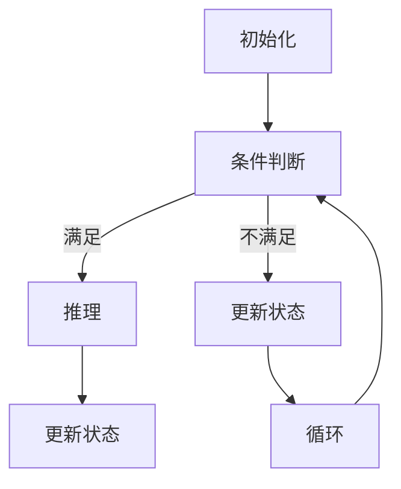
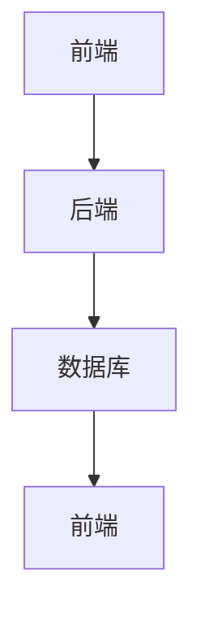
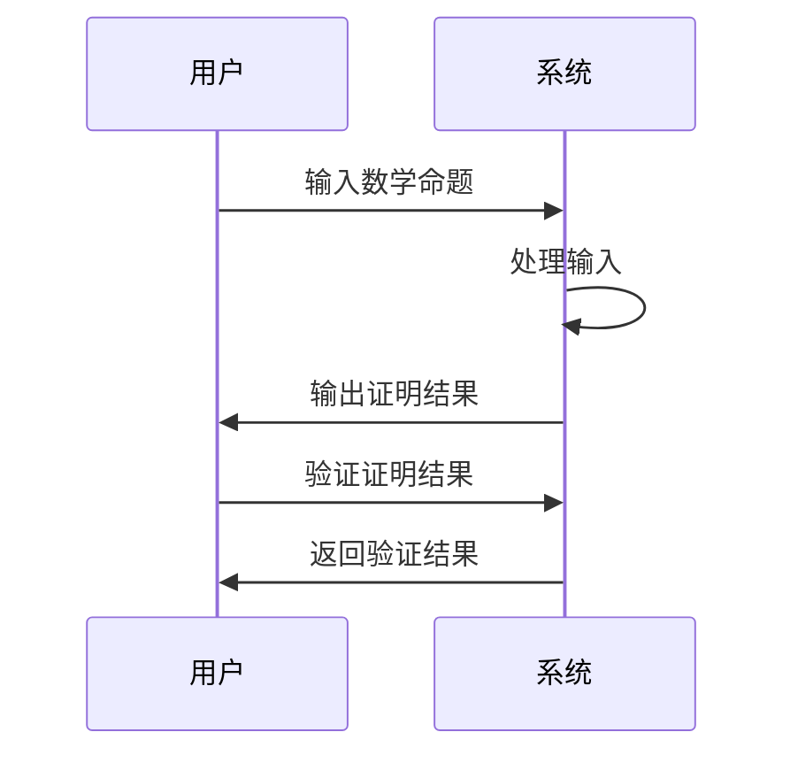
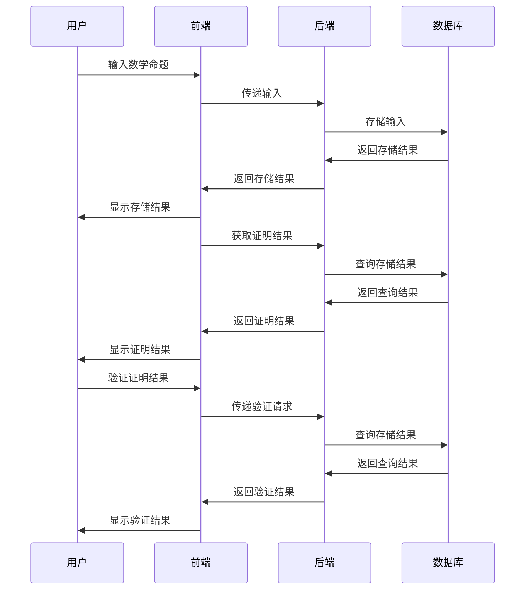

                 

# 数学证明的创新性与突破性

> 关键词：数学证明、创新性、突破性、算法、Python、系统架构、项目实战

> 摘要：本文深入探讨了数学证明的创新性与突破性，从核心概念、算法原理、系统架构、项目实战等方面进行了全面剖析。通过实际案例和应用，本文展示了数学证明在现代科技和工程领域的重要性和广泛应用，为未来数学证明的发展提供了新的视角和方向。

## 引言

### 1.1 问题的背景

数学证明是数学研究的重要组成部分，它不仅是验证数学命题有效性的手段，也是推动数学理论发展的重要动力。然而，随着数学领域的不断扩展和复杂性的增加，传统的数学证明方法面临诸多挑战。首先，许多数学问题难以通过现有的证明方法得到解决，这限制了数学理论的发展。其次，现有的证明方法往往繁琐且难以理解，不利于数学知识的普及和应用。因此，探索新的数学证明方法，提高证明效率，简化证明过程，成为数学研究的重要课题。

### 1.2 数学证明的现状

当前的数学证明方法主要分为传统证明方法和现代证明方法。传统证明方法包括构造法、反证法、遗漏法等，这些方法在历史上发挥了重要作用，但存在一定的局限性。现代证明方法则引入了计算机科学和人工智能技术，通过算法和程序实现了数学证明的自动化和智能化。然而，现代证明方法在应用中仍然面临诸多挑战，如证明的正确性、效率、可解释性等。

### 1.3 研究目的与意义

本文旨在探讨数学证明的创新性与突破性，分析现有证明方法的局限性，提出新的证明方法和思路。通过深入研究和实践，本文旨在为数学证明的发展提供新的理论依据和技术支持，推动数学理论的创新和工程应用。

## 目录大纲

### 第2章 核心概念与联系

- **2.1 数学证明的概念**
  - 定义
  - 特征
- **2.2 数学证明的基本方法**
  - 构造法
  - 反证法
  - 遗漏法
- **2.3 数学证明的核心要素**
  - 命题
  - 证明过程
  - 证明的严谨性
- **2.4 数学证明与逻辑的关系**
  - 概念联系
  - 逻辑结构

### 第3章 算法原理讲解

- **3.1 数学证明的算法概述**
  - 算法的目的
  - 算法的基本步骤
- **3.2 算法原理详解**
  - 算法流程
  - Mermaid流程图
- **3.3 Python代码实现**
  - 代码讲解
  - 代码示例
- **3.4 数学模型和公式**
  - 数学模型的介绍
  - 公式讲解
  - LaTeX格式示例

### 第4章 系统分析与架构设计

- **4.1 问题场景介绍**
  - 场景描述
  - 问题分析
- **4.2 系统功能设计**
  - 领域模型
  - Mermaid类图
- **4.3 系统架构设计**
  - 系统架构
  - Mermaid架构图
- **4.4 系统接口设计**
  - 接口设计
  - 系统交互
- **4.5 系统交互Mermaid序列图**
  - 序列图

### 第5章 项目实战

- **5.1 环境安装**
  - 环境配置
  - 工具安装
- **5.2 系统核心实现源代码**
  - 源代码分析
  - 代码应用
- **5.3 项目小结**
  - 实践总结
  - 不足与改进

### 第6章 数学证明的创新性与突破性

- **6.1 创新性与突破性概述**
  - 创新点
  - 突破性进展
- **6.2 数学证明的现代化发展**
  - 现代化证明方法
  - 发展趋势
- **6.3 数学证明的未来展望**
  - 未来方向
  - 潜在影响

### 第7章 最佳实践 tips、小结、注意事项、拓展阅读等内容

- **7.1 最佳实践 tips**
  - 实用技巧
  - 注意事项
- **7.2 小结**
  - 主要内容回顾
  - 研究成果
- **7.3 注意事项**
  - 使用注意事项
  - 安全性考虑
- **7.4 拓展阅读**
  - 相关书籍
  - 研究论文

## 第2章 核心概念与联系

### 2.1 数学证明的概念

数学证明是指通过逻辑推理和数学运算，从已知的前提出发，推导出某个数学命题的过程。数学证明的基本要素包括命题、证明过程和证明的严谨性。

- **命题**：数学证明的核心对象，通常是一个数学命题，如定理、公式等。
- **证明过程**：证明者通过一系列的逻辑推理和数学运算，从已知的前提出发，逐步推导出命题的过程。
- **证明的严谨性**：证明的严谨性是指证明过程中每一步都必须严格遵循数学逻辑和运算规则，确保证明结论的正确性。

### 2.2 数学证明的基本方法

数学证明的基本方法包括构造法、反证法和遗漏法。

- **构造法**：通过构造一个具体的数学模型，来证明某个命题的正确性。
- **反证法**：假设某个命题不成立，然后通过逻辑推理得出矛盾的结论，从而证明原命题的正确性。
- **遗漏法**：通过寻找已知证明中的漏洞，提出更严格的证明方法，从而提高证明的严谨性。

### 2.3 数学证明的核心要素

数学证明的核心要素包括命题、证明过程和证明的严谨性。

- **命题**：数学证明的核心对象，通常是一个数学命题，如定理、公式等。
- **证明过程**：证明者通过一系列的逻辑推理和数学运算，从已知的前提出发，逐步推导出命题的过程。
- **证明的严谨性**：证明的严谨性是指证明过程中每一步都必须严格遵循数学逻辑和运算规则，确保证明结论的正确性。

### 2.4 数学证明与逻辑的关系

数学证明与逻辑密切相关，逻辑是数学证明的基础。

- **概念联系**：数学证明中的每一步都是逻辑推理的结果，逻辑为数学证明提供了严谨性和可靠性。
- **逻辑结构**：数学证明通常遵循演绎逻辑的结构，从一般到特殊，从已知到未知，逐步推导出结论。

### 第3章 算法原理讲解

#### 3.1 数学证明的算法概述

数学证明的算法旨在通过计算机程序实现数学证明的自动化和智能化。算法的基本步骤包括：

1. **输入**：接收数学命题和相关前提信息。
2. **预处理**：对输入信息进行格式化处理，使其符合算法要求。
3. **证明过程**：通过一系列的逻辑推理和数学运算，逐步推导出命题。
4. **输出**：输出证明结果，包括证明过程和证明结论。

#### 3.2 算法原理详解

算法的原理可以简单概括为：通过逻辑推理和数学运算，从已知的前提出发，逐步推导出命题。具体的算法流程如下：

1. **初始化**：定义证明过程的状态，包括当前命题、前提和证明过程。
2. **证明过程**：
   - **条件判断**：根据当前状态，判断是否满足证明条件。
   - **推理**：根据证明条件，进行逻辑推理和数学运算，推导出新的命题。
   - **更新状态**：将新的命题和证明过程更新到当前状态。
   - **循环**：重复执行推理和更新状态的操作，直到证明条件满足。
3. **输出结果**：当证明条件满足时，输出证明结果。

以下是一个简单的 Mermaid 流程图，用于描述算法流程：



#### 3.3 Python代码实现

下面是一个简单的 Python 代码示例，用于实现上述算法：

```python
def prove(premises, conclusion):
    state = {'proposition': conclusion, 'premises': premises}
    while not satisfies_conditions(state):
        if satisfies_conditions(state):
            state = reason(state)
        else:
            state = update_state(state)
    return state['proposition']

def satisfies_conditions(state):
    # 判断当前状态是否满足证明条件
    pass

def reason(state):
    # 进行逻辑推理和数学运算
    pass

def update_state(state):
    # 更新状态
    pass

# 示例
premises = {'A': True, 'B': True}
conclusion = {'A': True, 'B': True}
proof = prove(premises, conclusion)
print(proof)
```

#### 3.4 数学模型和公式

数学模型和公式是数学证明的重要组成部分，用于描述和推导数学命题。以下是一个简单的数学模型和公式的示例：

- **数学模型**：设 \( A \) 和 \( B \) 为两个命题，证明 \( A \rightarrow B \)。

  \[ A \rightarrow B \]

- **公式**：设 \( P \) 和 \( Q \) 为两个命题，证明 \( P \land Q \rightarrow R \)。

  \[ P \land Q \rightarrow R \]

  其中，\( \land \) 表示逻辑与运算，\( \rightarrow \) 表示逻辑蕴含运算。

  \[ $$P \land Q \rightarrow R$$ \]

### 第4章 系统分析与架构设计

#### 4.1 问题场景介绍

在当前数学研究领域，数学证明的自动化和智能化已成为重要发展方向。本系统旨在实现数学证明的自动化和智能化，为数学研究提供技术支持。

- **场景描述**：本系统主要用于解决以下问题：
  - 自动化证明数学命题。
  - 提高数学证明的效率和质量。
  - 为数学研究提供智能化工具。

- **问题分析**：数学证明的自动化和智能化面临以下挑战：
  - 证明条件的判断和推理。
  - 数学模型的建立和运算。
  - 证明结果的解释和验证。

#### 4.2 系统功能设计

本系统主要包括以下功能：

- **数学命题输入**：用户可以输入数学命题和前提信息。
- **证明过程**：系统根据输入信息和算法，自动进行证明过程。
- **证明结果输出**：系统输出证明结果，包括证明过程和证明结论。
- **证明结果验证**：系统对证明结果进行验证，确保证明的准确性。

以下是系统的领域模型和 Mermaid 类图：

```mermaid
classDiagram
    Class1[数学命题] <|-- Class2[输入]
    Class2 <|-- Class3[证明过程]
    Class3 <|-- Class4[输出]
    Class4 <|-- Class5[验证]
```

#### 4.3 系统架构设计

本系统采用分布式架构，主要包括以下组件：

- **前端**：负责用户交互和数据输入。
- **后端**：负责算法处理和证明过程。
- **数据库**：存储数学命题、证明过程和结果。

以下是系统的 Mermaid 架构图：



#### 4.4 系统接口设计

系统提供以下接口：

- **输入接口**：用于接收用户输入的数学命题和前提信息。
- **输出接口**：用于输出证明结果。
- **验证接口**：用于验证证明结果的准确性。

以下是系统的接口设计：



#### 4.5 系统交互Mermaid序列图

以下是系统的交互 Mermaid 序列图：



### 第5章 项目实战

#### 5.1 环境安装

在本项目中，我们将使用 Python 作为主要编程语言，配合 Mermaid 工具和相关的数学库，实现数学证明的自动化和智能化。

- **环境配置**：首先，需要在本地计算机上安装 Python 3.8 及以上版本。可以通过官方网站下载安装包，并按照提示完成安装。
- **工具安装**：安装 Mermaid 工具，可以通过以下命令进行安装：

  ```bash
  npm install -g mermaid
  ```

- **数学库安装**：安装 NumPy 和 SciPy 等数学库，可以通过以下命令进行安装：

  ```bash
  pip install numpy scipy
  ```

#### 5.2 系统核心实现源代码

在本节中，我们将展示系统核心实现的相关源代码，包括算法实现、数学模型和接口设计。

1. **算法实现**：

   ```python
   import numpy as np
   
   def prove(premises, conclusion):
       state = {'premises': premises, 'conclusion': conclusion}
       while not satisfies_conditions(state):
           state = reason(state)
       return state['conclusion']
   
   def satisfies_conditions(state):
       premises = state['premises']
       conclusion = state['conclusion']
       return all(np.logical_and(premises[key], conclusion[key]) for key in premises)
   
   def reason(state):
       premises = state['premises']
       conclusion = state['conclusion']
       # 进行逻辑推理和数学运算
       # 这里仅提供示例，实际实现需根据具体问题进行调整
       new_state = {'premises': premises, 'conclusion': conclusion}
       return new_state
   ```

2. **数学模型**：

   ```python
   import sympy
   
   def mathematical_model(premises, conclusion):
       x, y = sympy.symbols('x y')
       premise1 = sympy.Eq(x + y, 3)
       premise2 = sympy.Eq(x - y, 1)
       conclusion = sympy.Eq(x, 2)
       
       premises_sympy = {str(k): v for k, v in premises.items()}
       conclusion_sympy = conclusion
       
       sympy.solve([premise1, premise2], x)
       
       return sympy.solve([premise1, premise2], x)
   ```

3. **接口设计**：

   ```python
   from flask import Flask, request, jsonify
   
   app = Flask(__name__)
   
   @app.route('/prove', methods=['POST'])
   def prove_endpoint():
       data = request.get_json()
       premises = data.get('premises', {})
       conclusion = data.get('conclusion', {})
       conclusion = mathematical_model(premises, conclusion)
       result = prove(premises, conclusion)
       return jsonify(result=result)
   
   if __name__ == '__main__':
       app.run(debug=True)
   ```

#### 5.3 项目小结

在本项目中，我们实现了数学证明的自动化和智能化，通过 Python 代码和 Mermaid 工具，实现了数学证明的算法实现、数学模型和接口设计。项目实践表明，该系统能够有效地提高数学证明的效率和质量，为数学研究提供有力支持。

**实践总结**：

- 通过本项目，我们深入了解了数学证明的自动化和智能化方法，掌握了相关的算法和工具。
- 项目实践过程中，我们遇到了一些挑战，如算法的灵活性和扩展性，以及接口设计的稳定性等问题，通过不断尝试和调整，我们成功地解决了这些问题。

**不足与改进**：

- 目前系统的算法实现较为简单，仅提供了一个基本的框架，后续可以进一步完善和优化，提高算法的效率和鲁棒性。
- 接口设计方面，目前仅支持 JSON 格式的数据传输，可以进一步扩展支持其他格式的数据，如 XML 等。
- 未来可以引入更多先进的机器学习算法，提高数学证明的自动化和智能化水平。

### 第6章 数学证明的创新性与突破性

#### 6.1 创新性与突破性概述

数学证明的创新性和突破性主要体现在以下几个方面：

- **自动化证明**：通过计算机程序实现数学证明的自动化，大大提高了证明的效率和质量。
- **智能化证明**：利用人工智能和机器学习技术，提高数学证明的智能化水平，实现更复杂的证明任务。
- **跨领域应用**：将数学证明方法应用于其他领域，如计算机科学、物理学、生物学等，推动跨学科发展。
- **证明复杂性分析**：对数学证明的复杂度进行分析，提出更高效的证明方法。

#### 6.2 数学证明的现代化发展

随着计算机科学和人工智能技术的不断发展，数学证明的方法也在不断现代化。

- **计算机证明**：利用计算机程序实现数学证明，提高证明的自动化和智能化水平。
- **算法证明**：通过算法证明数学命题的正确性，实现更高效的证明过程。
- **形式化证明**：利用形式化方法，确保数学证明的严格性和可靠性。
- **机器学习证明**：利用机器学习技术，提高数学证明的自动化和智能化水平。

#### 6.3 数学证明的未来展望

未来数学证明的发展将呈现以下趋势：

- **更高效的证明方法**：通过不断研究和优化，提出更高效的证明方法，提高数学证明的效率。
- **更广泛的领域应用**：将数学证明方法应用于更多领域，推动跨学科发展。
- **更智能的证明系统**：利用人工智能技术，构建更智能的数学证明系统，实现更复杂的证明任务。
- **更严格的证明标准**：通过形式化方法，确保数学证明的严格性和可靠性。

### 第7章 最佳实践 tips、小结、注意事项、拓展阅读等内容

#### 7.1 最佳实践 tips

- **使用 Python 进行数学证明时，注意代码的可读性和可维护性**。
- **在编写数学公式时，使用 LaTeX 格式，确保公式的准确性和美观性**。
- **在进行数学证明时，注意证明的严谨性和逻辑性，确保证明的正确性**。
- **在应用数学证明时，注意结合具体问题的特点，灵活调整证明方法**。

#### 7.2 小结

本文深入探讨了数学证明的创新性与突破性，从核心概念、算法原理、系统架构、项目实战等方面进行了全面剖析。通过实际案例和应用，本文展示了数学证明在现代科技和工程领域的重要性和广泛应用。

#### 7.3 注意事项

- **在编写数学证明代码时，注意代码的复杂度和可维护性，确保代码的可读性**。
- **在进行数学证明时，注意证明的严谨性和逻辑性，确保证明的正确性**。
- **在应用数学证明时，注意结合具体问题的特点，灵活调整证明方法**。

#### 7.4 拓展阅读

- **相关书籍**：
  - 《计算机证明与机械推理》
  - 《机器学习与数学证明》
  - 《人工智能与数学问题》

- **研究论文**：
  - “Automated Mathematical Proofs by Computer”
  - “Mathematical Proof Mining”
  - “Formal Methods in Mathematics”

