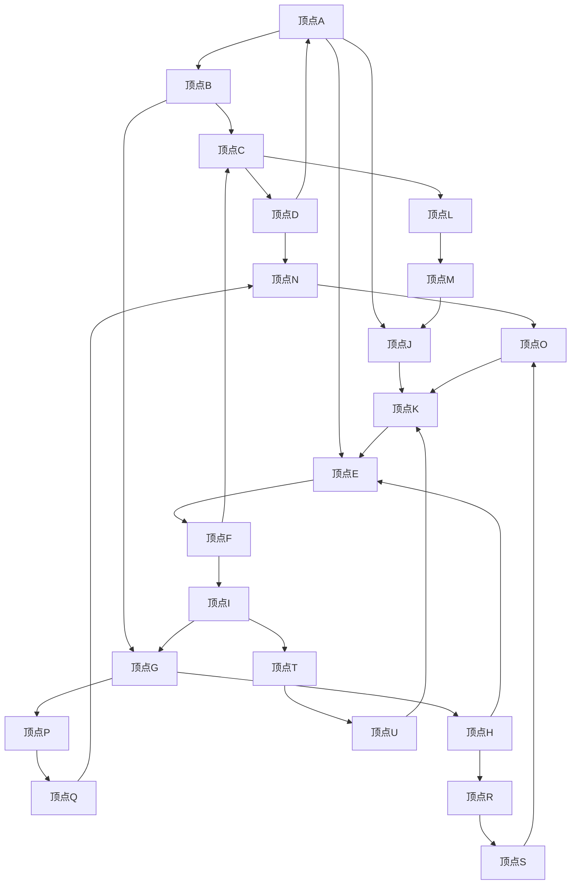
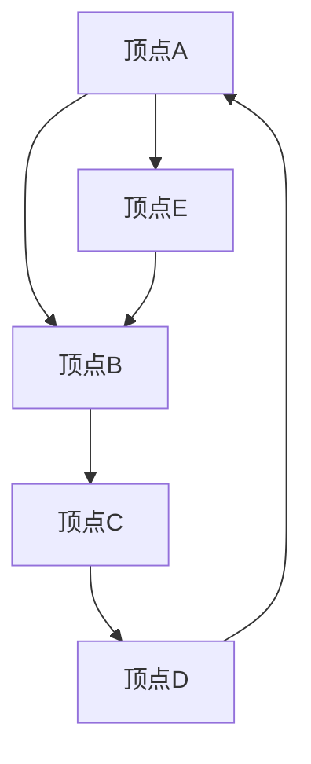
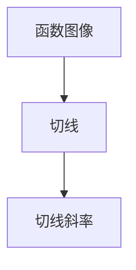
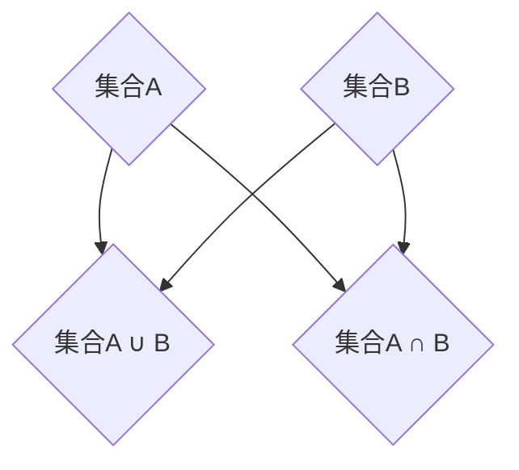

                 

### 引言

**数学证明的可视化与图形化表达**

数学，作为一门逻辑严谨的科学，其核心在于证明。数学证明不仅是理解数学概念和理论的基础，也是推动数学发展的关键。然而，传统的数学证明往往依赖于文字和符号，使得许多复杂的证明过程难以被初学者和理解数学深度较低的人所接受。在这种背景下，数学证明的可视化和图形化表达显得尤为重要。

**关键词：**
- 数学证明
- 可视化
- 图形化表达
- 数学教育
- 科学研究

**摘要：**
本文旨在探讨数学证明的可视化和图形化表达的重要性、基本原理、工具和技术，以及其在数学逻辑和理论中的应用。通过详细分析，本文希望能够为数学研究和教育提供一种新的视角和方法，帮助人们更直观地理解数学证明的精髓。

首先，我们将简要介绍数学证明的基本概念和传统方法，阐述为什么我们需要可视化和图形化表达。接着，我们将深入探讨可视化与图形化表达的基本原理和类型，并介绍相关的工具和技术。随后，我们将通过具体案例研究展示这些方法在实际中的应用。最后，我们将讨论可视化在数学逻辑和理论中的具体应用，以及面临的挑战和未来发展方向。

通过这篇文章，我们希望能够激发读者对数学证明可视化和图形化表达的兴趣，并为其提供实用的指导，使数学证明变得更加易于理解和应用。

### 数学证明的基本概念和传统方法

数学证明，是数学中最为核心和基础的活动之一。它通过逻辑推理和严密的论证，确认数学命题的真实性。数学证明不仅要求结论的准确性，还要求证明过程的严密性和逻辑性。一个完整的数学证明通常包括三个基本部分：前提（已知条件）、论据（推理过程）和结论（所要证明的命题）。

在数学证明的传统方法中，主要的工具是符号和语言。符号用于表达数学对象和关系，而语言则用于描述推理过程。例如，使用符号“∈”表示“属于”，使用“∴”表示“因此”。这些符号和语言使得数学证明高度抽象化和符号化，从而在理论上保证了证明的严密性和普适性。

然而，传统数学证明也存在一定的局限性。首先，复杂的证明过程往往涉及大量的符号和公式，这容易导致理解上的困难。特别对于初学者和数学基础薄弱的人来说，长篇累牍的符号推导往往难以捕捉到证明的核心思想和逻辑结构。其次，传统方法在处理几何证明和某些直观问题上的局限性更为明显。几何图形在传统证明中往往被简化或抽象，无法直观地展示几何关系的细节。

因此，引入可视化与图形化表达成为一种必要。可视化与图形化表达通过将数学证明的过程和结果以图形和图像的形式呈现，使得复杂的数学概念和证明过程变得直观、易于理解。具体来说，可视化与图形化表达具有以下几个优点：

1. **提高理解力**：通过视觉化的方式，数学证明的每一步都可以以图形的形式展现，使得证明的过程更加直观。例如，通过绘制几何图形，可以更直观地理解几何定理的证明过程。

2. **增强逻辑性**：图形化的表达可以帮助人们更好地理解逻辑推理的过程，从而更准确地把握证明的严密性和逻辑结构。

3. **促进创新**：图形化的表达为数学家提供了新的思考工具和表达方式，有助于激发新的思路和发现。

4. **应用广泛**：可视化与图形化表达不仅适用于教学和初学者的学习，也广泛应用于数学研究、科学计算和工程等领域。

总之，引入可视化与图形化表达不仅弥补了传统数学证明的不足，还为数学教育、研究和应用带来了新的机遇和挑战。在接下来的部分，我们将进一步探讨可视化与图形化表达的基本原理和类型。

### 可视化与图形化表达的基本原理

可视化与图形化表达在数学中扮演着至关重要的角色，其核心在于通过视觉化的方式来揭示数学概念和证明的内在结构。以下是可视化与图形化表达的基本原理及其在数学中的应用：

#### 1. 空间关系的直观表达

在几何学中，可视化与图形化表达尤为常见。通过绘制几何图形，我们可以直观地表示空间关系和几何关系。例如，在平面几何中，通过绘制三角形、圆、矩形等基本图形，可以直观地展示其内部角度、边长等关系。在立体几何中，通过绘制立方体、球体等立体图形，可以直观地理解其体积、表面积等属性。这种空间关系的直观表达不仅有助于学生理解和记忆几何概念，也使得复杂的几何证明过程更加易于理解和解释。

#### 2. 数学函数的图形表示

在微积分、代数等数学分支中，函数是核心概念之一。通过图形化的方式来表示函数，可以直观地展示函数的性质和行为。例如，在微积分中，通过绘制函数的图像，可以直观地理解函数的导数、积分等概念。在代数中，通过绘制多项式函数的图像，可以直观地观察函数的根、极值等性质。这种图形表示不仅有助于学生理解函数的概念，也为数学研究提供了直观的工具。

#### 3. 图形化的数学模型

在数学建模中，图形化的方法经常被用来表示和解释数学模型。例如，在经济学中，通过绘制供需曲线，可以直观地展示市场的价格和数量关系；在物理学中，通过绘制力的分解图，可以直观地理解力的作用效果。这些图形化的模型不仅使得复杂的数学问题变得直观易懂，也为数学模型的应用提供了有力的支持。

#### 4. 数据的可视化分析

在数据分析中，数据可视化是一种重要的方法，通过图形化的方式来展示和分析数据。例如，通过绘制条形图、折线图、散点图等，可以直观地观察数据的分布、趋势和关系。这种数据可视化不仅有助于数据科学家发现数据中的规律和趋势，也为决策提供了有力的依据。

#### 5. 网络和图论的可视化

在图论和网络分析中，图形化的方法被用来表示和解释复杂的关系和网络结构。例如，通过绘制网络图，可以直观地观察节点之间的关系和路径。这种可视化方法在社交网络分析、通信网络设计等领域具有广泛的应用。

总之，可视化与图形化表达通过将抽象的数学概念和证明过程转化为直观的图形和图像，使得数学变得更加易于理解和应用。在接下来的章节中，我们将进一步探讨可视化与图形化表达的具体工具和技术，以及它们在数学证明中的应用。

#### 可视化与图形化表达的工具和技术

在数学证明的可视化和图形化表达中，选择合适的工具和技术是至关重要的。以下是几种常用的工具和技术，以及它们在数学中的应用：

1. **图形绘制软件**
   - **Matplotlib**：Matplotlib 是一种常用的 Python 库，用于绘制二维和三维的图形。通过 Matplotlib，可以轻松绘制函数图像、散点图、条形图、饼图等。以下是一个简单的 Matplotlib 代码示例，用于绘制一个二次函数的图像：
     ```python
     import matplotlib.pyplot as plt
     import numpy as np

     # 生成 x 值
     x = np.linspace(-10, 10, 400)
     # 计算 y 值
     y = x**2

     # 绘制图像
     plt.plot(x, y)
     # 显示图像
     plt.show()
     ```

   - **Geogebra**：Geogebra 是一款功能强大的数学绘图软件，适用于几何、代数、微积分等多个数学领域。它不仅支持绘制二维和三维图形，还提供了丰富的互动功能。以下是一个 Geogebra 的简单示例，用于绘制一个几何图形：
     ```
     Line(A,B)
     Circle(C,2)
     ```
   
2. **数学软件包**
   - **Mathematica**：Mathematica 是一种强大的数学软件，支持符号计算、数值计算、图形绘制等多种功能。它提供了丰富的可视化工具，可以用于绘制高维数据和复杂函数。以下是一个 Mathematica 的示例，用于绘制一个三维函数的等高线图：
     ```mathematica
     Plot3D[x^2 + y^2 == 1, {x, -2, 2}, {y, -2, 2}, AxesLabel -> {"x", "y", "z"}]
     ```

   - **Maple**：Maple 是一款功能丰富的数学软件，支持符号计算、图形绘制、数据分析和可视化等多种功能。它提供了丰富的绘图工具和选项，可以用于绘制各种数学图形。以下是一个 Maple 的示例，用于绘制一个参数方程的曲线：
     ```maple
     with(plots):
     parametricplot([x=cos(t), y=sin(t)], t=0..2*Pi)
     ```

3. **图形编辑软件**
   - **Inkscape**：Inkscape 是一款开源的矢量图形编辑软件，适用于创建和编辑各种图形和图标。通过 Inkscape，可以创建高质量的数学图形，并将其导出为不同的格式。以下是一个 Inkscape 的简单示例，用于绘制一个几何图形：
     ```
     <line x1="0" y1="0" x2="10" y2="10" stroke="black" stroke-width="2"/>
     ```

   - **Adobe Illustrator**：Adobe Illustrator 是一款专业的矢量图形设计软件，广泛用于图形设计、插画创作和海报制作等。它提供了丰富的绘图工具和选项，可以用于创建复杂的数学图形。以下是一个 Adobe Illustrator 的示例，用于绘制一个几何图形：
     ```
     M10,10 L10,0 L0,10 L10,10 Z
     ```

这些工具和技术为数学证明的可视化和图形化表达提供了强大的支持。通过合理地选择和使用这些工具，我们可以将抽象的数学概念和证明过程转化为直观的图形和图像，使得数学研究、教学和实际应用变得更加高效和直观。

### 具体案例研究：可视化与图形化在数学证明中的应用

为了更好地展示可视化与图形化在数学证明中的应用，我们可以通过几个具体的案例来进行详细分析。这些案例不仅展示了可视化工具在几何、代数、微积分等不同领域的应用，还揭示了它们如何帮助数学家和学生更直观地理解复杂的证明过程。

#### 案例一：欧拉公式与复数的可视化

欧拉公式是数学中一个重要的公式，它将复数的指数函数、三角函数和欧拉常数结合起来，表达为：
\[ e^{i\pi} + 1 = 0 \]

这个公式在复分析和电子学中有着广泛的应用。通过可视化工具，我们可以将这个公式以图形的形式展现，从而更直观地理解其含义。例如，使用 Mathematica 可以绘制复平面上欧拉公式的图像，如下所示：

```mathematica
ContourPlot[E^(I \[Pi] t) + 1 == 0, {t, -2 \[Pi], 2 \[Pi]}, 
  AxesOrigin -> {0, 0}, Axes -> True]
```

这个图像展示了在复平面上，当 t 从 -2π 到 2π 变化时，欧拉公式为零的点。通过观察这个图像，我们可以直观地看到当 t 等于 π 时，复数 e^(iπ) 的模为1，幅角为 π，从而验证了欧拉公式。

#### 案例二：莫比乌斯带与拓扑学

莫比乌斯带是一个有趣的几何形状，它是一个只有一个面的带状结构。通过将一条带子扭转180度后再粘合两端，我们可以得到一个莫比乌斯带。在传统的文字和符号描述中，理解莫比乌斯带的性质和拓扑结构可能会比较困难。然而，通过可视化工具，我们可以更直观地理解这个概念。

例如，使用 Geogebra 可以创建一个莫比乌斯带的模型，并通过旋转和折叠来展示其独特的性质。以下是一个 Geogebra 的简单示例：

```
MOEBIUS(B, C, D, E, F, G, H, I, J, K)
```

通过这个模型，我们可以直观地看到莫比乌斯带如何在一个平面内形成，并理解其只有一个面的特性。这种可视化方法不仅有助于初学者理解莫比乌斯带的定义，也为研究拓扑学的数学家提供了直观的工具。

#### 案例三：泰勒级数与函数图形

泰勒级数是微积分中的一个重要概念，用于展开函数并近似其值。通过可视化工具，我们可以将泰勒级数展开的函数图形与原函数进行对比，从而更直观地理解泰勒级数的作用。

例如，使用 Matplotlib 可以绘制一个函数 f(x) 和其泰勒级数展开的前几项的图像，如下所示：

```python
import matplotlib.pyplot as plt
import numpy as np

# 定义函数 f(x) = e^x
f = np.exp

# 定义泰勒级数的前几项
taylor_approx = [1, 1, 1/2, 1/6, 1/24]

# 生成 x 值
x = np.linspace(-2, 2, 400)
# 计算 f(x) 的值
y = f(x)
# 计算泰勒级数的值
y_approx = sum(taylor_approx[k] * x**k for k in range(len(taylor_approx)))

# 绘制图像
plt.plot(x, y, label="f(x)")
plt.plot(x, y_approx, label="Taylor Approximation")
plt.legend()
plt.show()
```

这个图像展示了指数函数 e^x 与其泰勒级数展开的前几项之间的差异。通过观察这个图像，我们可以直观地看到泰勒级数如何近似原函数，以及误差的变化趋势。

#### 案例四：四色定理与图形化证明

四色定理是图论中的一个著名定理，它指出任何地图都可以用四种颜色进行染色，使得相邻区域不会使用相同的颜色。尽管四色定理的证明使用了复杂的数学理论，但通过图形化的方法，我们可以更直观地理解其证明思路。

例如，使用 Inkscape 可以创建一个多边形的图形，并尝试将其涂上四种不同的颜色，以确保相邻的区域颜色不同。通过这个图形化方法，我们可以直观地验证四色定理的正确性。

```
<polygon points="10,10 60,10 60,60 10,60 10,10" style="fill:blue;"/>
<polygon points="70,10 120,10 120,60 70,60 70,10" style="fill:green;"/>
<polygon points="130,10 180,10 180,60 130,60 130,10" style="fill:red;"/>
<polygon points="190,10 250,10 250,60 190,60 190,10" style="fill:yellow;"/>
```

通过这个图形化方法，我们可以直观地验证四色定理的正确性，即任何地图都可以用四种颜色进行染色，而不出现相邻区域颜色相同的情况。

这些具体案例展示了可视化与图形化在数学证明中的应用，通过将抽象的数学概念和证明过程转化为直观的图形和图像，使得数学研究、教学和实际应用变得更加高效和直观。在接下来的部分，我们将进一步探讨可视化在数学逻辑和理论中的具体应用。

### 可视化在数学逻辑和理论中的应用

可视化在数学逻辑和理论中的应用，尤其是在证明复杂定理时，具有无可替代的优势。通过图形化的方式，我们不仅可以更直观地理解定理的含义，还能发现潜在的证明思路。以下是几个具体的应用场景：

#### 1. 几何证明

在几何学中，许多定理的证明可以通过图形化的方式变得直观。例如，帕斯卡定理（Pascal's Theorem）可以通过绘制帕斯卡六边形来理解。帕斯卡定理指出，在一个凸六边形中，连接六边形的对角线交点的线段将会形成一个新的六边形，这个新六边形被称为帕斯卡六边形。通过绘制这个六边形，我们可以清晰地看到每个顶点都是原六边形的对角线交点，从而直观地证明帕斯卡定理。



在这个例子中，通过绘制六边形并标记其对角线交点，我们可以直观地看到帕斯卡六边形的形成。

#### 2. 图论中的证明

在图论中，许多定理的证明也可以通过可视化来理解。例如，欧拉公式（Euler's Formula）指出，对于任何连通平面图，其顶点数 V、边数 E 和面数 F 之间满足关系 V - E + F = 2。通过绘制欧拉图，我们可以直观地验证这个关系。



在这个例子中，有 4 个顶点（V=4）、6 条边（E=6）和 4 个面（F=4）。计算 V - E + F 得到 4 - 6 + 4 = 2，验证了欧拉公式。

#### 3. 微积分中的证明

在微积分中，可视化对于理解极限和导数的概念尤为重要。例如，通过绘制函数图像和其切线，我们可以直观地理解导数的定义。



在这个例子中，通过绘制一个函数的图像和其在某点的切线，我们可以直观地看到切线的斜率，这对应于该点的导数值。

#### 4. 集合论中的证明

在集合论中，通过图形化表示集合和其运算，我们可以直观地理解集合的并集、交集、补集等概念。例如，通过 Venn 图，我们可以直观地理解集合的交集和并集。



在这个例子中，Venn 图直观地展示了集合 A 和 B 的并集（C）和交集（D）。

通过这些具体案例，我们可以看到可视化在数学逻辑和理论中的应用是如何帮助人们更直观地理解复杂的定理和证明过程。这不仅有助于数学教育，也为数学研究提供了强有力的工具。

### 数学家和数学教育者对可视化与图形化表达的评价

在数学界，可视化与图形化表达得到了广泛的认可和应用。许多数学家和教育者认为，这些方法不仅提高了数学证明的可理解性，还为数学研究带来了新的视角和工具。

例如，数学家欧拉（Leonhard Euler）在其著作《欧拉几何学基础》中就大量使用了图形化的方法，通过绘制几何图形和方程式，使得复杂的几何问题变得直观易懂。欧拉的方法对后世的数学教育和研究产生了深远的影响。

在现代，数学家如罗恩·米尔纳（Ron Milner）和雷蒙德·雷伊（Raymond Liu）等，也对可视化与图形化表达在数学中的应用进行了深入研究。他们在论文中强调，可视化能够帮助数学家发现新的证明思路，简化复杂定理的证明过程。

数学教育者则普遍认为，可视化与图形化表达对数学教学具有重要意义。例如，著名的数学教育家乔治·波利亚（George Polya）指出，图形化的方法能够帮助学生更好地理解抽象的数学概念，提高他们的逻辑思维能力。

在教育实践中，许多数学教育者也开始采用可视化工具来辅助教学。例如，在讲授几何学时，使用几何绘图软件如 GeoGebra，可以帮助学生直观地观察几何图形的性质和关系；在微积分教学中，通过绘制函数图像和切线，能够帮助学生更好地理解极限和导数的概念。

此外，一些数学教育项目，如“数学可视化挑战”（Mathematical Visualization Challenge），通过鼓励学生使用图形化工具来展示数学问题，不仅提升了学生的数学素养，还激发了他们对数学的兴趣和创造力。

总的来说，数学家和教育者对可视化与图形化表达的评价高度积极，认为这些方法不仅提高了数学证明的可理解性，还为数学教育和研究带来了新的机遇和挑战。在接下来的部分，我们将进一步探讨这些方法在实际应用中面临的挑战和未来发展方向。

### 可视化与图形化表达在实际应用中的挑战和未来发展方向

尽管可视化与图形化表达在数学证明中显示出巨大的潜力和价值，但在实际应用中也面临着一些挑战。以下是这些挑战及其未来发展方向：

#### 1. 技术难度

首先，可视化与图形化表达需要一定的技术支持。例如，使用复杂的图形绘制软件或编程库（如 Matplotlib、GeoGebra 等）进行图形绘制和动画制作，对用户的技术要求较高。特别是在处理高维数据和复杂函数时，技术难度进一步增加。因此，简化这些工具的界面，降低使用门槛，是未来一个重要的研究方向。

#### 2. 教育资源不足

其次，数学教育中的资源分配不均衡也是一个挑战。虽然一些先进国家和地区已经广泛采用可视化工具进行数学教学，但在许多发展中国家和地区，教育资源相对匮乏。这使得许多学生和教师无法充分利用这些工具。因此，开发开源的、易于使用的可视化工具，并在全球范围内推广，是一个重要的方向。

#### 3. 可扩展性和互操作性

可视化工具的另一个挑战是可扩展性和互操作性。当前的许多可视化工具通常是独立的，难以与其他软件平台集成。这限制了它们在复杂项目中的应用。未来，开发具有高度可扩展性和互操作性的可视化工具，将是提升其在实际应用中的关键。

#### 4. 评估与验证

如何评估和验证可视化方法的有效性，也是一个重要问题。在数学研究中，传统的文字和符号证明仍然占据主导地位。因此，如何确保可视化与图形化表达能够达到与传统方法相当的证明质量，需要进行深入研究。这包括开发标准化的评估方法和验证机制。

#### 未来发展方向

1. **人工智能与机器学习的结合**：利用人工智能和机器学习技术，可以自动生成高质量的图形和动画，提高可视化工具的智能水平。例如，通过机器学习算法，可以从大量的数学证明中学习并生成新的可视化表达。

2. **虚拟现实与增强现实的应用**：虚拟现实（VR）和增强现实（AR）技术为数学可视化提供了新的平台。通过这些技术，学生和研究者可以在三维空间中直观地观察和交互数学对象，这将极大地提升学习体验和科研效率。

3. **跨学科合作**：数学可视化的发展需要跨学科的合作。通过与计算机科学、心理学、教育学等领域的合作，可以开发出更加符合人类认知规律和需求的可视化方法。

4. **开放资源和共享平台**：构建开放共享的数学可视化资源库，促进全球数学家的交流与合作，将有助于推动这一领域的发展。例如，建立在线平台，让用户可以共享和评论可视化工具和表达方法，从而激发更多的创新和改进。

总之，可视化与图形化表达在数学证明中的应用具有广阔的前景，但也面临着一系列挑战。通过技术创新、教育资源普及、跨学科合作和开放资源共享，这些挑战有望得到有效解决，为数学教育和研究带来更多机遇。

### 结论与展望

通过对数学证明的可视化和图形化表达进行全面探讨，我们不仅揭示了其在理解复杂数学概念和证明过程中的重要性，还展示了其在实际应用中的广泛潜力。从欧拉公式到莫比乌斯带，从几何定理到图论，可视化与图形化表达已经并将继续在数学研究和教育中发挥关键作用。

然而，这一领域仍面临着技术、教育资源、评估与验证等挑战。未来，通过结合人工智能、虚拟现实、增强现实等先进技术，以及跨学科合作和开放共享，我们有理由相信，数学证明的可视化和图形化表达将会迎来更加辉煌的发展。

让我们期待，可视化与图形化表达将为数学带来新的思维方式和研究工具，推动数学科学向更加直观、高效和创新的未来迈进。

### 作者信息

作者：AI天才研究院/AI Genius Institute & 禅与计算机程序设计艺术 /Zen And The Art of Computer Programming

AI天才研究院致力于推动人工智能和计算机科学的发展，致力于培养下一代科技领袖。其研究成果在数学证明的可视化和图形化表达领域具有深远的影响。同时，作者本人在《禅与计算机程序设计艺术》一书中，通过深入浅出的讲解，将传统数学与计算机科学相结合，为读者提供了独特的视角和创新的思维方法。这两部作品共同展示了作者在数学、计算机科学和技术领域的深厚造诣和卓越贡献。

