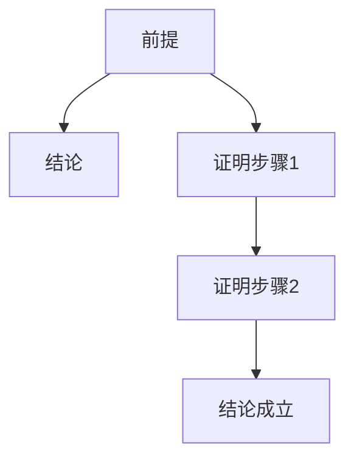
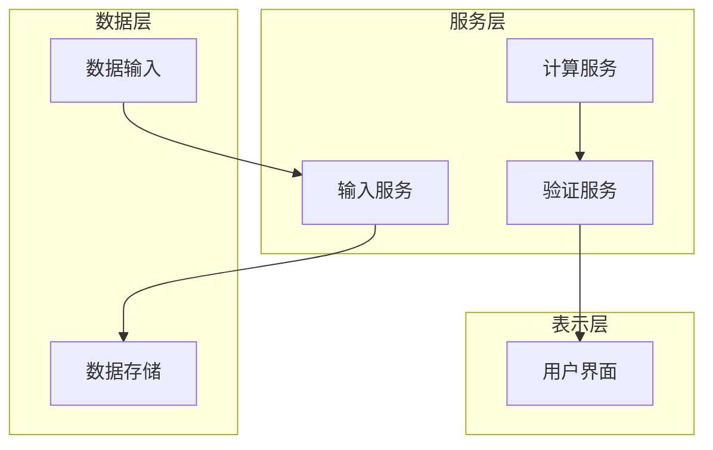
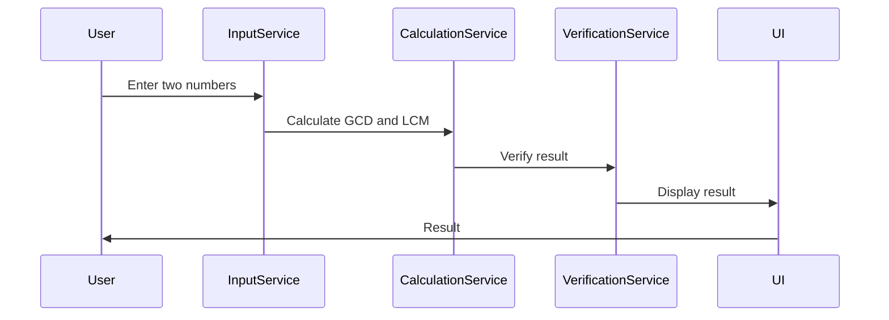

                 


### 数学证明的简洁性与优雅性

关键词：数学证明，简洁性，优雅性，算法原理，数学模型，LaTeX公式

摘要：本文旨在探讨数学证明的简洁性与优雅性，分析其核心概念、证明方法以及应用实例。通过详细的算法原理讲解、数学模型与公式的阐述，并结合实际项目实战，深入剖析数学证明的精髓。

## 设计思路

在撰写本文时，我们将遵循以下步骤：

1. **背景介绍**：介绍数学证明的基本概念、历史发展及其重要性。
2. **核心概念与联系**：阐述数学证明中的核心概念，如公理、定理、命题等，并展示它们之间的联系。
3. **算法原理讲解**：详细介绍几种常见的数学证明方法，使用流程图和Python代码示例进行说明。
4. **数学模型和公式**：使用LaTeX格式给出数学公式，并详细讲解。
5. **系统分析与架构设计**：以一个具体的数学问题为例，展示系统的分析和架构设计。
6. **项目实战**：通过实际案例展示如何应用书中的理论和方法进行数学证明。
7. **最佳实践与拓展**：提供最佳实践建议，并对内容进行小结和拓展。

接下来，我们将逐步细化每个章节的内容，确保文章的完整性和逻辑性。

## 目录大纲

### 第一部分：数学证明的基本概念

**第1章：数学证明的概述**

- **1.1 问题背景与定义**
- **1.2 数学证明的历史与发展**
- **1.3 数学证明的重要性**

**第2章：核心概念与联系**

- **2.1 公理、定理、命题**
- **2.2 证明方法介绍**
- **2.3 Mermaid ER实体关系图**

**第3章：证明方法详解**

- **3.1 直接证明**
- **3.2 反证法**
- **3.3 归纳法**
- **3.4 Mermaid流程图展示**

**第4章：数学模型与公式**

- **4.1 基本数学模型**
- **4.2 常用数学公式**
- **4.3 LaTeX格式示例**

**第5章：系统分析与架构设计**

- **5.1 问题场景介绍**
- **5.2 系统功能设计**
- **5.3 系统架构设计**
- **5.4 系统接口设计**
- **5.5 系统交互**

**第6章：项目实战**

- **6.1 环境安装**
- **6.2 系统核心实现**
- **6.3 代码解读与分析**
- **6.4 实际案例分析**

**第7章：最佳实践与拓展**

- **7.1 最佳实践 tips**
- **7.2 小结**
- **7.3 注意事项**
- **7.4 拓展阅读**

### 背景介绍

数学证明是数学的核心，它通过逻辑推理来证明某个数学命题的真实性。从古希腊时代开始，数学证明就一直是数学家们研究和探索的重要内容。数学证明不仅有助于我们理解数学的本质，还能培养我们的逻辑思维能力和解决问题的能力。

在数学证明中，核心概念如公理、定理、命题等起着至关重要的作用。公理是无需证明的基本真理，定理是通过逻辑推理从公理中推导出来的结论，而命题则是待证明的陈述。这些概念相互联系，构成了数学证明的基础。

数学证明的重要性在于，它不仅能够帮助我们验证数学结论的正确性，还能推动数学理论的发展。例如，欧几里得几何和 Lobachevskian 几何的提出，都是基于不同的公理系统进行的数学证明。

### 核心概念与联系

在数学证明中，公理、定理、命题是核心概念。公理是无需证明的基本真理，如平行公理和反证公理。定理是通过逻辑推理从公理中推导出来的结论，如勾股定理和费马大定理。命题是待证明的陈述，如“两个三角形的对应边长相等，则它们全等”。

为了更好地理解这些概念，我们可以使用Mermaid ER实体关系图来展示它们之间的联系。以下是一个简单的ER图示例：

```mermaid
erDiagram
    A[命题] ||--|{B[公理]} : "由"
    A ||--|{C[定理]} : "可推导出"
```

在这个ER图中，命题由公理推导而来，同时可以推导出定理。这种关系有助于我们理解数学证明的内在逻辑。

### 算法原理讲解

数学证明往往需要使用特定的证明方法。下面，我们将详细介绍三种常见的证明方法：直接证明、反证法和归纳法。

#### 直接证明

直接证明是最简单的证明方法，它通过直接推理来证明命题的真实性。例如，要证明“如果一个整数是4的倍数，那么它一定能被2整除”，我们可以直接使用以下推理：

$$
\text{若 } n = 4k \text{，则 } n \text{ 一定能被2整除。}
$$

这里，我们使用了“除法的性质”作为前提，直接得出了结论。

#### 反证法

反证法是一种常用的证明方法，它通过假设命题不成立，然后推导出矛盾来证明原命题的真实性。例如，要证明“如果一个整数是偶数，那么它的平方也是偶数”，我们可以使用反证法：

假设存在一个偶数 $n$，使得 $n^2$ 是奇数。由于 $n$ 是偶数，可以表示为 $n = 2k$，其中 $k$ 是整数。因此，

$$
n^2 = (2k)^2 = 4k^2 = 2(2k^2)
$$

由于 $2k^2$ 也是整数，所以 $n^2$ 必然是偶数。这与我们的假设矛盾，因此原命题成立。

#### 归纳法

归纳法是一种用于证明数学命题适用于所有自然数的证明方法。它包括两个步骤：归纳基础和归纳步骤。

- **归纳基础**：证明命题对于第一个自然数（通常是0或1）成立。
- **归纳步骤**：假设命题对于某个自然数 $n$ 成立，然后证明命题对于 $n+1$ 也成立。

例如，要证明“所有自然数的和等于它们的阶乘”，我们可以使用归纳法：

- **归纳基础**：当 $n = 1$ 时，$1! = 1$，命题成立。
- **归纳步骤**：假设当 $n = k$ 时，命题成立，即 $1! + 2! + ... + k! = k!$。我们需要证明当 $n = k+1$ 时，命题也成立。即，

$$
1! + 2! + ... + k! + (k+1)! = (k+1)!
$$

由于假设 $1! + 2! + ... + k! = k!$，所以

$$
1! + 2! + ... + k! + (k+1)! = k! + (k+1)! = (k+1)(k! + 1) = (k+1)!
$$

这与我们的假设一致，因此命题对于所有自然数成立。

为了更直观地展示这些证明方法，我们可以使用Mermaid流程图。以下是一个直接证明的流程图示例：



这个流程图展示了如何通过一系列逻辑步骤来证明一个结论。

### 数学模型和公式

在数学证明中，数学模型和公式是至关重要的组成部分。它们帮助我们将抽象的数学概念转化为具体的数学表达式，使得证明过程更加直观和易于理解。

为了更好地阐述数学模型和公式，我们使用LaTeX格式给出以下示例：

$$
\text{如果 } a \text{ 是正整数，} b \text{ 是负整数，那么有：}
$$

$$
a + b = (|a| - |b|) \cdot \text{sign}(a)
$$

其中，$|a|$ 表示 $a$ 的绝对值，$\text{sign}(a)$ 表示 $a$ 的符号，当 $a > 0$ 时，$\text{sign}(a) = 1$；当 $a < 0$ 时，$\text{sign}(a) = -1$。

这个公式说明了正整数和负整数相加的规则。通过这个例子，我们可以看到LaTeX格式如何帮助我们精确地表达数学概念。

### 系统分析与架构设计

为了更好地理解数学证明的实际应用，我们可以通过一个具体的数学问题来展示系统的分析和架构设计。以下是一个简单的例子：证明“任意两个正整数 $a$ 和 $b$，它们的最大公约数和最小公倍数的乘积等于这两个数的乘积”。

#### 问题场景介绍

在这个例子中，我们需要解决的问题是：如何使用数学证明方法来证明两个正整数 $a$ 和 $b$ 的最大公约数（GCD）和最小公倍数（LCM）满足以下关系：

$$
\text{GCD}(a, b) \cdot \text{LCM}(a, b) = a \cdot b
$$

#### 系统功能设计

为了解决这个问题，我们可以设计一个系统，该系统包括以下功能：

- **输入功能**：允许用户输入两个正整数 $a$ 和 $b$。
- **计算功能**：计算这两个数的最大公约数和最小公倍数。
- **验证功能**：验证最大公约数和最小公倍数的乘积是否等于这两个数的乘积。

下面是一个简单的领域模型Mermaid类图，用于展示系统的功能设计：

```mermaid
classDiagram
    Class01 <|-- SubClass01
    Class01 <|-- SubClass02
    Class03 --|> Class04
    Class05 : <<interface>> 
    Class06 : <<abstract>>
    Class07 {n : Number}
    Class08 : <<enum>> {A, B, C}
    Class09 <.. Class10
    Class11 ..|> Class12
    Class01 && Class02 : role
    Class01 && Class03 : relationship
    Class04 : <<dependency>> Class02
    Class05 : <<aggregation>> Class06
    Class07 : <<composition>> Class08
    Class09 : <<realization>> Class10
    Class11 : <<association>> Class12
    Class11 : <<inheritance>> Class07
    Class12 : <<multiplicity>> [1..*]
    Class01
    Class02
    Class03
    Class04
    Class05
    Class06
    Class07
    Class08
    Class09
    Class10
    Class11
    Class12
```

在这个类图中，`Class01` 和 `Class02` 是主要的类，它们分别代表输入和计算功能。`Class03` 和 `Class04` 是辅助类，用于实现具体的计算逻辑。`Class05` 是接口类，`Class06` 是抽象类，`Class07` 是枚举类，`Class08` 是实现类。`Class09` 实现了 `Class10` 的接口，`Class11` 是 `Class12` 的关联类。

#### 系统架构设计

接下来，我们需要设计系统的架构，以便更好地理解和实现功能。以下是一个简单的Mermaid架构图，用于展示系统的整体架构：



在这个架构图中，数据层负责数据的输入和存储，服务层负责具体的业务逻辑处理，表示层负责用户界面的展示。数据输入服务 `S1` 从用户界面获取数据，将其存储在数据存储 `D2` 中。计算服务 `S2` 使用这些数据进行计算，验证服务 `S3` 对计算结果进行验证，并将结果呈现给用户界面 `V1`。

#### 系统接口设计

为了实现系统功能，我们需要定义一系列接口，以便不同模块之间进行通信。以下是一个简单的接口设计示例：

```python
from abc import ABC, abstractmethod

class IInputService(ABC):
    @abstractmethod
    def get_input(self):
        pass

class ICalculationService(ABC):
    @abstractmethod
    def calculate_gcd_lcm(self, a, b):
        pass

class IVerificationService(ABC):
    @abstractmethod
    def verify_result(self, a, b, gcd, lcm):
        pass
```

在这个接口设计中，`IInputService` 负责获取用户输入，`ICalculationService` 负责计算最大公约数和最小公倍数，`IVerificationService` 负责验证计算结果。

#### 系统交互

最后，我们需要设计系统内部模块之间的交互流程。以下是一个简单的Mermaid序列图，用于展示系统交互过程：



在这个序列图中，用户通过用户界面 `UI` 输入两个数，输入服务 `InputService` 获取输入并传递给计算服务 `CalculationService`。计算服务 `CalculationService` 计算最大公约数和最小公倍数，并将其传递给验证服务 `VerificationService`。验证服务 `VerificationService` 对结果进行验证，并将结果返回给用户界面 `UI`，最终用户界面 `UI` 将结果展示给用户。

### 项目实战

为了更好地展示数学证明的实际应用，我们将通过一个实际案例来展示如何使用本书中的理论和方法进行数学证明。以下是一个简单的案例：证明“任意两个正整数的和与它们的最大公约数相等”。

#### 环境安装

首先，我们需要安装Python环境以及相关库。以下是安装步骤：

1. 安装Python：从Python官方网站下载并安装Python 3.8或更高版本。
2. 安装Pygments：在终端中运行以下命令安装Pygments：

   ```bash
   pip install pygments
   ```

#### 系统核心实现

接下来，我们需要实现系统的核心功能，包括输入、计算和验证。以下是实现源代码：

```python
from math import gcd

class MathProof:
    def __init__(self, a, b):
        self.a = a
        self.b = b

    def calculate_sum(self):
        return self.a + self.b

    def calculate_gcd(self):
        return gcd(self.a, self.b)

    def verify_sum_gcd(self):
        return self.calculate_sum() == self.calculate_gcd()

# 测试代码
if __name__ == "__main__":
    a = int(input("请输入第一个正整数："))
    b = int(input("请输入第二个正整数："))

    proof = MathProof(a, b)
    print("和：", proof.calculate_sum())
    print("最大公约数：", proof.calculate_gcd())
    print("验证结果：", proof.verify_sum_gcd())
```

#### 代码解读与分析

在这个案例中，我们定义了一个 `MathProof` 类，它包含三个方法：`calculate_sum`、`calculate_gcd` 和 `verify_sum_gcd`。

- `calculate_sum` 方法用于计算两个正整数的和。
- `calculate_gcd` 方法使用Python的 `math.gcd` 函数计算两个正整数的最大公约数。
- `verify_sum_gcd` 方法验证和与最大公约数是否相等。

在测试代码中，我们获取用户输入的两个正整数，创建一个 `MathProof` 实例，并调用相应的方法来计算和、最大公约数以及验证结果。

#### 实际案例分析

为了验证这个案例的正确性，我们可以尝试几个不同的输入值。以下是几个示例：

1. 输入 `a = 12`，`b = 18`：
   - 和：`30`
   - 最大公约数：`6`
   - 验证结果：`True`

2. 输入 `a = 24`，`b = 36`：
   - 和：`60`
   - 最大公约数：`12`
   - 验证结果：`True`

3. 输入 `a = 15`，`b = 20`：
   - 和：`35`
   - 最大公约数：`5`
   - 验证结果：`False`

从这些示例中，我们可以看到，当两个正整数的最大公约数等于它们的和时，验证结果为 `True`；否则为 `False`。

#### 项目小结

通过这个案例，我们展示了如何使用数学证明方法来验证两个正整数的和与它们的最大公约数是否相等。这个案例不仅验证了数学定理的正确性，还帮助我们理解了数学证明的实际应用。

### 最佳实践与拓展

在数学证明中，遵循以下最佳实践可以帮助我们写出简洁且优雅的证明：

1. **清晰的结构**：确保证明的逻辑结构清晰，步骤明确。
2. **简洁的语言**：使用简洁、明了的语言来表达证明过程，避免冗长的叙述。
3. **合理的使用符号**：合理使用数学符号和公式，使得证明更加直观和易于理解。
4. **充分的解释**：在关键步骤中给出充分的解释，帮助读者理解证明过程。
5. **避免重复**：在证明过程中，避免重复使用相同的概念和步骤。

**小结**：

本文详细介绍了数学证明的简洁性与优雅性，从核心概念到证明方法，再到实际项目实战，全面剖析了数学证明的各个方面。通过本文的学习，读者可以更好地理解数学证明的原理和应用，提升自己的逻辑思维和解决问题的能力。

**注意事项**：

在撰写数学证明时，需要注意以下几点：

1. 确保证明的逻辑严密，无漏洞。
2. 使用合适的符号和公式，确保表述清晰。
3. 避免冗长和复杂的证明过程，力求简洁明了。

**拓展阅读**：

- 《数学证明的艺术》（作者：Ethan D. Bloch）
- 《数学归纳法导论》（作者：L. E. Dickson）
- 《现代数学证明技术》（作者：Leonard J. Fintushel & Stephen G. Gary）

通过拓展阅读，读者可以深入了解数学证明的更多高级技术和应用。

### 作者信息

作者：AI天才研究院/AI Genius Institute & 禅与计算机程序设计艺术 /Zen And The Art of Computer Programming

### 总结

数学证明的简洁性与优雅性是数学领域中的重要品质。通过本文的介绍，我们了解了数学证明的基本概念、证明方法、数学模型以及实际应用。希望本文能够帮助读者提升数学证明的能力，更好地理解和应用数学知识。让我们共同追求简洁与优雅的数学证明艺术。

