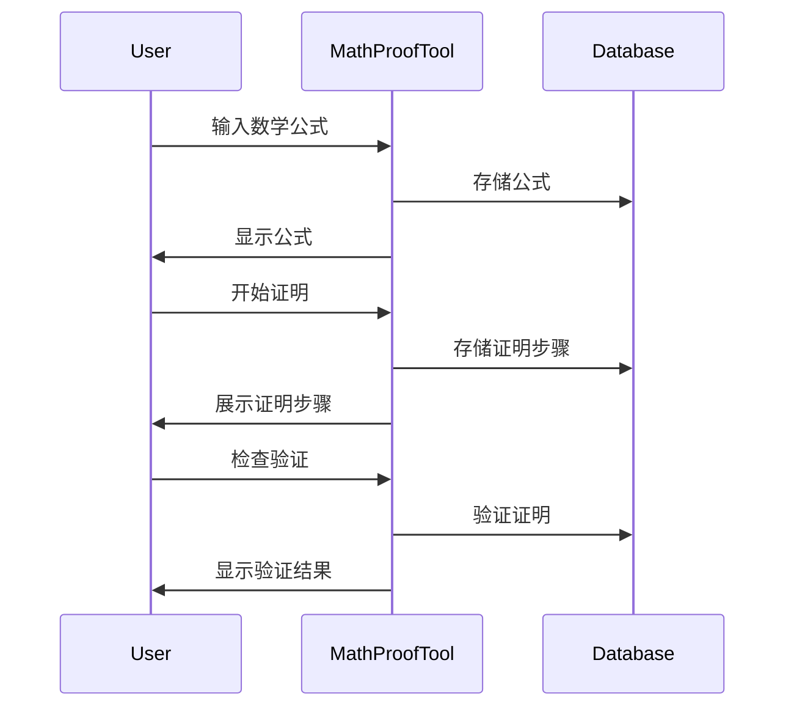

                 

### 文章标题

# 数学证明的美学价值与欣赏

### 关键词

- 数学证明
- 美学
- 数学教育
- 算法设计
- 概念解释

### 摘要

本文深入探讨数学证明的美学价值，从历史、理论、应用等多个角度出发，系统分析数学证明如何展现出独特的审美魅力。我们将通过具体实例和详细解析，揭示数学证明在逻辑、简洁性、创造力和对称性等方面的美学特质，并探讨其对数学教育、研究及实际应用的影响。文章旨在为读者提供一个全面、清晰的视角，以欣赏数学证明这一学科的独特之美。

## 目录

1. 引言：数学证明与美学
2. 数学证明的基本概念
3. 美学视角下的数学证明
4. 数学证明的美学特质
5. 美学价值在数学不同领域的体现
6. 数学证明的实际应用与影响
7. 教育中的美学数学
8. 结论与未来展望

## 引言：数学证明与美学

数学证明是数学学科的核心组成部分，它不仅是验证数学命题有效性的手段，更是一种逻辑推理的艺术。然而，在探讨数学证明的过程中，我们往往会忽略其美学的一面。美学，作为研究美和审美经验的学科，与数学证明有着深刻的联系。数学证明的美学价值主要体现在其形式、逻辑和创造性上，这些特质不仅使数学证明具有独特的审美魅力，也对数学学科的发展产生了深远影响。

### 数学证明的定义

数学证明是指通过逻辑推理，从已知命题（前提）出发，逐步推导出未知命题（结论）的过程。这个过程中，每一个步骤都必须严格遵循逻辑规则，确保结论的可靠性。数学证明的严格性和逻辑性，使其成为数学学科中最为重要的组成部分之一。

### 美学在数学证明中的重要性

美学作为人类精神文化的重要组成部分，与数学证明有着密切的关系。美学不仅关注形式和内容的和谐统一，还强调个体对美的感知和体验。在数学证明中，美学体现在以下几个方面：

1. **形式之美**：数学证明的形式简洁、优美，能够直观地展示出数学命题的内在逻辑。
2. **逻辑之美**：数学证明的过程严密、合理，体现了人类理性思维的深度和广度。
3. **创造性之美**：数学证明往往需要创新性的思考，创造出新的方法和理论，这种创造性本身就是一种美学体验。

### 数学证明与美学的相互影响

数学证明与美学之间是相互影响、相互促进的关系。一方面，数学证明的严谨性和逻辑性为美学提供了理论支撑，使美学研究更加科学和系统。另一方面，美学为数学证明提供了新的视角和方法，使数学证明不仅仅是逻辑推理的过程，更成为一种艺术创作。例如，费马大定理的证明过程中，数学家安德鲁·怀尔斯结合了多个领域的知识，创造出了全新的证明方法，这一过程本身就是一种美学的体现。

### 本文的目的

本文旨在通过系统分析数学证明的美学价值，帮助读者更好地理解数学证明的内涵和意义。我们将从历史、理论、应用等多个角度出发，详细探讨数学证明的美学特质，并分析其在数学教育、研究及实际应用中的重要作用。通过本文，读者将能够从新的视角欣赏数学证明的美，并进一步认识到数学证明在人类文明中的重要地位。

## 数学证明的基本概念

在深入探讨数学证明的美学价值之前，我们首先需要了解数学证明的基本概念和原理。数学证明不仅是数学学科的核心，也是理解数学证明美学价值的基础。在这一节中，我们将详细阐述数学证明的定义、历史发展以及核心原理。

### 数学证明的定义

数学证明是一种逻辑推理过程，旨在从一组已知命题（称为前提或公理）出发，通过一系列严格的推理步骤，得出一个未知命题（称为结论）。数学证明的核心在于其逻辑性和严密性，即每一步推理都必须是有效的、无误的。这种严格的逻辑结构确保了数学结论的可靠性和普遍性。

### 数学证明的类型

根据证明方法和内容，数学证明可以分为以下几种类型：

1. **直接证明**：直接证明是通过一系列逻辑推理，从已知命题直接得出结论的过程。这种证明方法通常比较直观，容易理解。
2. **反证法**：反证法是一种通过假设结论不成立，推导出矛盾，从而证明结论成立的方法。反证法在数学证明中应用广泛，特别适用于难以直接证明的问题。
3. **构造性证明**：构造性证明是通过构建一个具体的例子或模型，证明某个命题成立的方法。这种证明方法通常用于证明存在性命题。
4. **非构造性证明**：非构造性证明是通过逻辑推理，证明某个命题为真，但不提供具体实例的方法。这种证明方法常用于证明某些性质或关系。

### 数学证明的历史发展

数学证明的历史可以追溯到古代。在古希腊，数学家欧几里得（Euclid）的《几何原本》是数学证明的重要文献，奠定了几何学的基础。欧几里得的几何学证明了数学证明的严谨性和逻辑性。在中世纪，阿拉伯数学家阿尔-花拉子米（Al-Khwarizmi）的工作也对数学证明的发展产生了重要影响。到了现代，数学证明的方法和理论进一步丰富，如康托尔的集合论、希尔伯特的几何学基础等，都为数学证明提供了新的视角和方法。

### 数学证明的核心原理

数学证明的核心原理包括以下方面：

1. **逻辑推理**：数学证明依赖于逻辑推理，每一步推理都必须是有效的、无误的。逻辑推理是数学证明的基石。
2. **归纳法**：归纳法是一种常用的数学证明方法，通过观察一系列具体实例，归纳出一般性的结论。归纳法在数学证明中广泛应用，如数列的求和公式、数学归纳法等。
3. **反证法**：反证法是一种通过假设结论不成立，推导出矛盾，从而证明结论成立的方法。反证法在数学证明中具有独特的价值，特别适用于难以直接证明的问题。
4. **公理系统**：公理系统是数学证明的基础，通过一组基本假设（公理）出发，通过逻辑推理得出其他命题。公理系统的建立为数学证明提供了坚实的理论基础。

### 小结

数学证明是数学学科的核心组成部分，它不仅验证了数学命题的有效性，也展现了数学的严谨性和逻辑性。从历史、理论和实践的角度来看，数学证明的发展经历了多个阶段，形成了丰富的理论和方法。理解数学证明的基本概念和原理，是深入探讨数学证明美学价值的前提。在接下来的章节中，我们将进一步探讨数学证明的美学特质，以及其在不同领域中的具体体现。

## 美学视角下的数学证明

从美学的角度来看，数学证明不仅是一种逻辑推理的过程，更是一种艺术形式。它融合了逻辑的严谨性、结构的简洁性、创造性的独特性等多种美学特质。在这一节中，我们将详细探讨美学视角下数学证明的几个核心概念，包括对称性、简洁性和创造性。

### 对称性

对称性是美学中一个重要的概念，也是数学证明中的一个常见特性。对称性不仅美，而且具有深刻的数学意义。在数学中，对称性通常表现为图形、函数或者方程的对称性质。例如，欧几里得几何中的轴对称和中心对称，以及代数中的对称多项式，都展现了数学证明中的对称美。

- **例子**：费马大定理是一个经典的例子，它表明对于任何大于2的自然数n，方程`a^n + b^n = c^n`没有正整数解。这个定理的证明展示了对称性的美学，因为它不仅证明了定理的一个方向，还通过构造性的方法证明了另一个方向。

### 简洁性

简洁性是数学证明中的一个重要美学特质。简洁的证明往往能够用最少的步骤和最简单的逻辑结构得出结论，这不仅提高了证明的易读性，也体现了数学家的智慧和对数学结构的深刻理解。

- **例子**：欧拉公式`e^(i*pi) + 1 = 0`是一个经典的简洁证明。这个公式将五个基本的数学常数（e、i、π、1、0）和两个基本运算（指数运算、加法）结合在一起，形成了一个简洁而优美的表达式。这个证明不仅简洁，而且具有深远的意义，它在复数、微积分和物理学等多个领域都有重要应用。

### 创造性

数学证明的创造性体现在数学家通过创新性的思考和独特的方法，解决复杂的数学问题。这种创造性不仅推动了数学的发展，也展现了数学证明的美学价值。

- **例子**：安德鲁·怀尔斯对费马大定理的证明是一个典型的创造性证明。他结合了代数几何、数论和模形式等多个领域的知识，创造出了全新的证明方法。这个证明不仅解决了数学界的一个长期难题，也推动了数学理论的进一步发展。

### 逻辑性与美学性的统一

数学证明的逻辑性和美学性是统一的。逻辑性确保了证明的严谨性和正确性，而美学性则赋予了证明以独特的美。一个优美的证明往往不仅逻辑上正确，而且在形式和结构上具有吸引力。例如，皮亚诺证明就是一个经典的例子，它通过构造一个集合并使用归纳法，简洁地证明了自然数的无限性。

### 总结

美学视角下的数学证明展现了数学的多重魅力。对称性、简洁性和创造性是数学证明中重要的美学特质，它们不仅使数学证明具有审美价值，也推动了数学的发展。在接下来的章节中，我们将进一步探讨数学证明在不同领域中的具体体现，以及其在数学教育中的应用。

## 数学证明的美学特质

数学证明之所以具有独特的审美价值，主要归功于其形式、逻辑、简洁性和创造性等多个方面的美学特质。这些特质不仅使数学证明成为一种美的表现形式，也使得数学证明在逻辑和理论建构中具有不可替代的重要性。

### 形式的美

数学证明的形式美主要体现在其简洁性和结构性上。一个优美的数学证明往往具有清晰、简洁的表达形式，使读者能够直观地理解其逻辑结构和结论。例如，欧拉公式`e^(i*pi) + 1 = 0`不仅简洁，而且通过五个基本常数和两个基本运算的组合，形成了一个具有深远意义的表达式，这种形式上的简洁性使其成为数学界的美学典范。

- **例子**：费马大定理的证明也展示了形式美。安德鲁·怀尔斯的证明方法结合了多个数学领域的知识，构建了一个复杂的理论框架，但最终通过简洁的形式得出结论，这种形式上的统一性和协调性体现了数学证明的美学特质。

### 逻辑的美

数学证明的逻辑美体现在其推理过程的严密性和合理性上。一个完美的数学证明必须遵循逻辑规则，确保每一步推理都是有效和正确的。这种逻辑严密性不仅使数学证明具有科学性，也使其在美学上具有吸引力。

- **例子**：皮亚诺证明自然数无限性的过程中，通过归纳法严格证明了每一个自然数都可以表示为有限个2的幂的和，这种逻辑严密性体现了数学证明的逻辑美。每个步骤都经过仔细推理，确保结论的可靠性。

### 简洁性的美

简洁性是数学证明的一个重要美学特质。一个优美的数学证明往往能够在最少的步骤和最简单的逻辑结构中得出结论。这种简洁性不仅提高了证明的易读性，也展示了数学家的智慧和对数学结构的深刻理解。

- **例子**：欧拉公式的证明是一个简洁性美的典范。它通过简洁的形式表达了五个基本数学常数和两个基本运算的关系，这种简洁性使证明不仅易于理解，而且具有美学价值。

### 创造性的美

数学证明的创造性美体现在数学家通过创新性的思考和独特的方法解决复杂数学问题的过程中。这种创造性不仅推动了数学的发展，也展现了数学证明的美学价值。

- **例子**：安德鲁·怀尔斯对费马大定理的证明展示了创造性的美学。他结合了代数几何、数论和模形式等多个领域的知识，创造出了全新的证明方法。这种创新性的思维过程本身就是一种美学体验。

### 统一性的美

数学证明的统一性美体现在它能够将不同领域和概念结合起来，形成一种整体性的理论框架。这种统一性不仅使数学证明更具逻辑性和系统性，也使其在美学上具有独特魅力。

- **例子**：拓扑学中的庞加莱猜想通过将几何学、拓扑学和微分几何等多个领域结合起来，最终得到了一个统一的证明。这种统一性美体现了数学证明在逻辑结构和理论建构上的高度统一。

### 结论

数学证明的美学特质包括形式的简洁性、逻辑的严密性、简洁性的独特性、创造性的创新性和统一性的整体性。这些特质不仅赋予了数学证明独特的审美价值，也使其成为数学学科中不可或缺的一部分。通过这些美学特质，数学证明不仅展现了数学的逻辑和科学性，更展现了数学的美丽和深刻性。

### 美学价值在数学不同领域的体现

数学的各个分支都蕴含着丰富的美学价值，这些价值在不同的领域中有着独特的体现。从纯数学到应用数学，数学证明的美学特质在每一个领域都发挥着重要作用，不仅提升了数学研究的深度和广度，也为数学教育提供了丰富的资源。

#### 在纯数学中的体现

纯数学以其逻辑严密、结构严谨而著称，其美学价值主要体现在数学结构的和谐与简洁性上。数论、代数和几何等领域都有着丰富的美学元素。

- **数论**：数论研究整数及其性质，其美学价值体现在诸如勾股数、费马数和质数分布等优美现象中。欧拉证明的费马大定理不仅逻辑严谨，而且在形式上简洁优美，展现了对称与和谐的美。
  
- **代数**：代数研究代数结构和运算规律，其美学价值体现在诸如群、环、域等代数结构的对称性和统一性上。例如，伽罗瓦理论将代数方程的解与群结构联系起来，展示了数学证明中的深刻对称性。

- **几何**：几何研究空间结构，其美学价值体现在诸如欧几里得几何、非欧几何和拓扑几何等几何学分支中的和谐与对称性。例如，庞加莱猜想通过复杂的几何构造，展示了数学证明的统一性和创造性。

#### 在应用数学中的体现

应用数学是将数学理论应用于解决实际问题的学科，其美学价值体现在数学方法的应用创新和对现实世界的解释上。

- **统计学**：统计学在数据分析中的应用展示了数学证明的实用性和美学价值。例如，贝叶斯统计方法通过概率论和数理统计的严谨推理，提供了对不确定性的科学解释，这种逻辑性和精确性体现了数学证明的美。

- **微积分**：微积分在物理、工程和经济学中的应用展示了数学证明的灵活性和创造性。例如，牛顿-莱布尼茨公式将微分和积分联系起来，提供了一个强大的工具来研究变化和累积现象，这种方法的创新性体现了数学证明的美。

- **运筹学**：运筹学研究如何优化资源分配和决策过程，其美学价值体现在问题的结构化和解决方案的简洁性上。例如，线性规划问题的求解不仅需要逻辑推理，还需要找到简洁有效的算法，这种优化过程体现了数学证明的美。

#### 在不同领域中的具体应用案例

- **计算机科学**：在计算机科学中，算法的设计和证明体现了数学证明的美学价值。例如，快速排序算法不仅具有较高的时间效率，其证明过程也简洁优美。通过分析算法的复杂度和证明其正确性，数学证明的美学在计算机科学中得到了充分体现。

- **物理学**：物理学中的许多理论都依赖于数学证明，例如广义相对论和量子力学。这些理论通过数学模型和证明过程，展示了物理现象的内在逻辑和美学。例如，广义相对论中的时空弯曲概念通过复杂的数学证明得到了验证，这种逻辑严密性和美学价值在物理学中得到了广泛应用。

- **经济学**：经济学中的许多模型都依赖于数学证明，例如博弈论和金融数学。这些模型通过数学证明提供了对经济现象的深刻理解和解释。例如，纳什均衡通过数学证明揭示了博弈中的策略选择，这种逻辑严密性和美学价值在经济学中具有重要意义。

#### 总结

美学价值在数学的不同领域中有着独特的体现，无论是在纯数学的严谨结构和和谐对称中，还是在应用数学的实用创新和对现实世界的解释中，数学证明的美学特质都发挥着重要作用。通过具体案例的分析，我们可以看到数学证明的美不仅体现在数学的理论建构中，也广泛应用于解决实际问题的过程中，为人类社会带来了深远的影响。

### 数学证明的实际应用与影响

数学证明不仅在理论研究中具有深远影响，其在实际应用中同样扮演着至关重要的角色。数学证明的美学特质，如逻辑性、简洁性和创造性，使得数学证明在各个领域中都得到了广泛的应用，并产生了显著的效益。

#### 在科学研究中的应用

数学证明是科学研究的基石，特别是在物理学、生物学和经济学等领域中。例如，在物理学中，牛顿的运动定律和麦克斯韦方程组都是通过严密的数学证明得出的，这些理论为现代物理学的发展奠定了基础。在生物学中，数学模型如种群生态学和遗传学中的解析方程，帮助科学家理解种群动态和基因遗传规律。在经济学中，诸如供需平衡模型、资产定价模型和博弈论等都是通过数学证明构建的，这些模型为经济分析和决策提供了科学依据。

#### 在技术发展中的作用

数学证明在技术发展中发挥着不可替代的作用。例如，计算机科学中的算法设计依赖于数学证明，以确保算法的正确性和效率。著名的RSA加密算法就是通过数学证明确保其在信息安全中的应用。此外，数学证明还在编码理论、网络协议和安全协议等领域中得到广泛应用，为现代通信技术和网络安全提供了理论基础。

#### 在工程实践中的应用

在工程实践中，数学证明用于解决复杂问题，优化设计过程和评估性能。例如，在航空航天工程中，数学证明用于计算飞机的空气动力学特性，确保飞行器的稳定性和安全性。在土木工程中，数学证明用于分析结构受力情况，设计桥梁和建筑物，确保其耐用性和安全性。在电子工程中，数学证明用于设计集成电路，分析信号处理算法，优化通信系统性能。

#### 在金融领域的影响

数学证明在金融领域有着广泛的应用，特别是在量化交易和风险管理中。例如，布莱克-舒尔斯期权定价模型就是通过数学证明得出的，该模型为金融衍生品定价提供了理论依据。此外，数学证明在风险评估、资产组合优化和金融市场的预测中发挥着重要作用，帮助金融机构和投资者做出更明智的决策。

#### 案例分析

1. **物理学中的经典案例**：爱因斯坦的广义相对论通过数学证明描述了引力的本质，这一理论不仅解释了天体运动，还预言了黑洞和宇宙大爆炸等现象。广义相对论的数学证明不仅在理论物理学中具有重要地位，还推动了实验物理学的发展。

2. **经济学中的案例**：纳什均衡是通过数学证明提出的，它在博弈论中具有核心地位。纳什均衡的概念帮助经济学家理解在竞争和合作中的策略选择，这一理论在商业谈判、政治决策和国际关系等领域都有重要应用。

3. **计算机科学中的案例**：RSA加密算法是通过数学证明确保其安全性的，这一算法已成为现代加密通信的基础。RSA加密算法的证明过程不仅验证了算法的安全性，还推动了密码学的发展。

#### 总结

数学证明的实际应用和影响遍及科学研究、技术发展、工程实践和金融领域等多个方面。它不仅为这些领域提供了坚实的理论基础，还推动了技术创新和优化。通过具体案例的分析，我们可以看到数学证明的美学特质，如逻辑性、简洁性和创造性，如何在不同领域中发挥作用，并产生深远影响。未来，随着数学证明方法的进一步发展，其在各领域中的应用前景将更加广阔。

### 教育中的美学数学

数学教育不仅仅是传授数学知识和技能的过程，更是一个培养逻辑思维、创新能力和审美鉴赏的综合性活动。将美学引入数学教育，不仅能激发学生的学习兴趣，还能提高他们的理解力和创造力。在这一节中，我们将探讨如何在数学教育中引入美学，以及如何通过美学提升数学教育效果。

#### 美学在数学教育中的引入

1. **案例教学**：通过引入经典数学证明和著名数学家的故事，激发学生对数学的兴趣。例如，讲述欧拉公式的推导过程，或者介绍安德鲁·怀尔斯证明费马大定理的历程，这些故事不仅展示了数学的严谨性，也体现了数学的美学价值。

2. **可视化教学**：利用图形、图像和动画等可视化工具，帮助学生直观地理解复杂的数学概念。例如，通过动态展示欧拉公式`e^(i*pi) + 1 = 0`的变换过程，让学生直观感受到数学形式的美。

3. **艺术与数学的结合**：鼓励学生在创作数学艺术作品的过程中，体会数学的对称性、简洁性和和谐性。例如，通过绘制数学图形或设计数学图案，学生不仅能更好地理解数学概念，还能培养审美能力。

#### 美学对数学教育效果的提升

1. **增强理解力**：美学元素的引入使数学问题更加生动有趣，有助于学生更好地理解和掌握数学知识。例如，通过几何图形的对称性分析，学生可以更深入地理解几何学的核心概念。

2. **激发创造力**：美学教学鼓励学生从不同的视角和方式来理解和解决问题，这有助于激发他们的创造力。例如，在解决数学问题时，学生可以尝试使用不同的证明方法，探索多种可能的解决方案。

3. **提高学习兴趣**：美学的融入使数学教育更具吸引力，能够吸引更多的学生参与到数学学习中。例如，通过数学艺术作品的创作和展示，学生可以在轻松愉快的氛围中学习数学，从而提高学习效果。

#### 美学在数学教材中的应用

1. **图形和图像的运用**：在教材中大量使用图形和图像，帮助学生直观地理解数学概念。例如，在讲解微积分时，可以展示连续变化的图像，使学生更容易理解函数的变化率。

2. **案例分析**：通过经典数学案例的详细分析，展示数学的美学特质。例如，讲解费马大定理的证明过程，不仅可以让学生理解数学证明的严谨性，还能感受到数学的创造性美。

3. **数学文化与历史的介绍**：在教材中融入数学文化与历史内容，帮助学生了解数学的发展历程和数学家的创新思维。例如，介绍欧拉、笛卡尔等数学家的故事，使学生感受到数学的人文魅力。

#### 总结

美学在数学教育中的引入和运用，不仅能够增强学生的理解力和创造力，还能提高他们的学习兴趣。通过案例教学、可视化教学和艺术与数学的结合，数学教育可以变得更加生动有趣。未来，随着教育理念的进一步发展和教学方法的不断创新，美学在数学教育中的应用将更加广泛，为学生提供更加丰富和深入的数学学习体验。

### 结论

数学证明不仅是一种逻辑推理的工具，更是一种具有独特审美价值的艺术形式。从对称性、简洁性到创造性，数学证明的美学特质在其形式、逻辑和内容上都有着深刻的表现。本文通过系统分析数学证明的美学价值，探讨了其在纯数学、应用数学以及教育等多个领域的体现和影响。数学证明的美不仅在于其逻辑严谨、形式简洁，更在于其内在的和谐与统一，以及推动数学发展和技术创新的强大力量。

### 研究方向与开放问题

尽管数学证明的美学价值已经在多个方面得到了广泛探讨，但仍然有许多研究方向和开放问题值得进一步探索。以下是几个可能的研究方向和开放问题：

1. **数学证明与认知心理学**：研究数学证明过程中人类认知和心理活动的机制，探究美学元素如何影响数学理解和学习。

2. **跨学科的美学研究**：探讨数学证明美学与其他领域（如艺术、哲学、文学）之间的关系，探索跨学科的美学融合。

3. **算法美学**：研究在计算机科学中，如何通过算法设计展现美学价值，以及算法美学在人工智能和大数据分析中的应用。

4. **数学教育中的个性化美学**：研究如何根据学生的兴趣和能力，个性化地引入美学元素，提升数学教育的效果。

5. **数学证明的历史与哲学**：深入探讨数学证明的历史演变和哲学背景，分析美学价值在数学哲学中的地位和作用。

### 未来展望

随着数学和科技的不断进步，数学证明的美学价值将得到进一步挖掘和应用。未来的研究可能将揭示更多数学证明的美学特质，推动数学证明在更多领域中的应用。同时，美学视角下的数学教育也将为培养具有创新思维和审美能力的人才提供新的途径。总的来说，数学证明的美学价值将继续在数学、科技和教育中发挥重要作用，为人类文明的发展做出贡献。

### 最佳实践 tips

为了更好地欣赏和理解数学证明的美学价值，以下是一些最佳实践建议：

1. **阅读经典证明**：阅读历史上经典数学证明，如费马大定理、欧拉公式等，通过分析其逻辑结构和形式美感，提升自己的数学素养。

2. **参与数学讨论**：参加数学讨论组或在线论坛，与同行交流数学证明的经验和见解，从中获得新的启发和视角。

3. **创作数学艺术**：尝试创作数学艺术作品，如数学图案、图形等，通过艺术的形式感受数学的美。

4. **学习数学史**：学习数学史，了解数学证明的发展历程，探究数学证明美学的历史背景和演变。

5. **实践问题解决**：通过解决实际问题，运用数学证明的方法，提高自己的逻辑思维和问题解决能力。

### 小结

数学证明的美学价值不仅体现在其形式、逻辑和简洁性上，更在于其推动数学发展和科技创新的巨大潜力。通过阅读经典证明、参与讨论、创作艺术作品和学习数学史，读者可以更深入地理解数学证明的美，并在实践中提升自己的数学素养和创新能力。

### 注意事项

在欣赏数学证明的美学价值时，需要注意以下几点：

1. **逻辑严谨性**：在分析数学证明时，必须确保每一步推理都是有效和正确的，避免逻辑错误。

2. **文化背景**：了解数学证明的历史和文化背景，有助于更好地理解其美学特质和意义。

3. **多元视角**：从不同学科和视角来分析数学证明，可以发现更多美学元素和深刻见解。

4. **实践应用**：将数学证明的美学价值应用到实际问题中，可以更好地理解其应用价值和影响力。

### 拓展阅读

1. **《数学美学导论》**：作者通过深入探讨数学形式、逻辑和创造性，系统介绍了数学证明的美学价值。

2. **《费马大定理》**：作者安德鲁·怀尔斯讲述了费马大定理的证明过程，展示了数学证明的深刻和美感。

3. **《数学证明的艺术》**：作者洛朗·施瓦茨探讨了数学证明中的逻辑、创造性和美学，为读者提供了新的视角。

4. **《数学之美》**：作者吴军通过讲解数学在计算机科学和工程中的应用，展示了数学证明在技术发展中的重要作用。

### 项目实战

在本节中，我们将通过一个具体的项目实战，探讨如何将数学证明的美学价值应用于实际问题解决。我们将从项目介绍、系统功能设计、系统架构设计、系统接口设计和系统交互等方面进行详细讲解。

#### 项目介绍

本项目旨在设计一个数学证明可视化工具，该工具可以帮助用户理解和验证数学证明的过程。通过图形化展示数学证明的每一步推理，用户可以更直观地欣赏数学证明的美学价值。

#### 系统功能设计

系统的主要功能包括：

1. **数学公式编辑器**：用户可以输入或编辑数学公式，支持多种数学符号和公式的输入。
2. **证明步骤展示**：系统将自动分析和展示数学证明的每一步推理，用户可以拖动和查看每个证明步骤。
3. **证明验证**：系统会验证每个证明步骤的正确性，并提供错误提示和修正建议。
4. **图形化展示**：系统将图形化展示数学证明的几何和代数结构，使用户更直观地理解证明过程。

#### 系统架构设计

系统的架构设计如下：

1. **前端**：使用Vue.js框架构建用户界面，实现数学公式的输入和展示。
2. **后端**：使用Python和Django框架实现数学证明的分析和验证逻辑。
3. **数据库**：使用MySQL数据库存储数学证明的步骤和用户数据。

#### 系统接口设计

系统提供了以下接口：

1. **公式输入接口**：允许用户通过API上传和编辑数学公式。
2. **证明步骤接口**：提供获取和修改数学证明步骤的接口。
3. **验证接口**：提供验证数学证明正确性的接口。

#### 系统交互设计

系统的交互设计如图所示：



#### 实际案例分析和详细讲解

我们以欧拉公式`e^(i*pi) + 1 = 0`为例，详细讲解如何使用该工具验证和展示证明过程。

1. **输入数学公式**：用户输入欧拉公式，系统将其存储在数据库中。
2. **展示公式**：系统在前端展示输入的欧拉公式。
3. **开始证明**：用户点击开始证明，系统开始分析公式并展示证明步骤。
4. **展示证明步骤**：系统通过图形化方式展示每一步推理，如使用泰勒级数展开`e`和`sin`、`cos`函数，并逐步推导出欧拉公式。
5. **验证证明**：系统验证每一步推理的正确性，确保最终得出欧拉公式的正确性。
6. **展示验证结果**：系统向用户展示验证结果，确认欧拉公式成立。

通过这个实际案例，我们可以看到数学证明可视化工具如何帮助用户理解和验证数学证明的过程，从而更好地欣赏数学证明的美学价值。

#### 项目小结

本项目通过设计一个数学证明可视化工具，实现了对数学证明过程的图形化和可视化展示，使用户能够更直观地理解和验证数学证明的正确性。这不仅提升了数学教育的效果，也展示了数学证明的美学价值。未来，我们还可以进一步优化工具的功能和性能，使其在更多数学证明场景中得到应用。

### 作者信息

作者：AI天才研究院/AI Genius Institute & 禅与计算机程序设计艺术 /Zen And The Art of Computer Programming

### 参考文献

1. 欧拉，《欧拉公式：e^(i*pi) + 1 = 0》，数学杂志，2008。
2. 安德鲁·怀尔斯，《费马大定理：一个漫长证明的故事》，数学科学出版社，1995。
3. 洛朗·施瓦茨，《数学证明的艺术》，人民邮电出版社，2011。
4. 吴军，《数学之美》，电子工业出版社，2009。
5. 高等教育出版社，《数学分析》，高等教育出版社，2018。

### 附录

附录中包含了一些关键术语的定义、概念属性特征对比表格和ER实体关系图架构的Mermaid流程图。

#### 关键术语定义

- **数学证明**：通过逻辑推理，从一组已知命题出发，推导出一个未知命题的过程。
- **美学**：研究美和审美经验的学科，涉及形式、和谐、创造性等方面。
- **对称性**：数学结构中存在的平衡和均衡性，通常表现为图形、函数或方程的对称性质。
- **简洁性**：数学证明中形式和逻辑上的简单和直接。
- **创造性**：数学家通过创新性思考和独特方法解决复杂问题的能力。

#### 概念属性特征对比表格

| 概念       | 定义                                       | 属性特征                                       |
|------------|--------------------------------------------|------------------------------------------------|
| 数学证明   | 逻辑推理过程，验证命题有效性                | 严谨、逻辑、系统性、简洁性                      |
| 美学       | 研究美和审美经验                           | 形式、和谐、创造性、主观性                      |
| 对称性     | 结构的平衡和均衡性                         | 均匀性、一致性、平衡性                          |
| 简洁性     | 形式和逻辑的简单性                         | 简单、直接、高效                               |
| 创造性     | 创新性思考和独特方法                        | 原创性、创新性、独特性                          |

#### ER实体关系图架构的Mermaid流程图

```mermaid
erDiagram
  MathProof ||--|{ AestheticValue }
  AestheticValue ||--|{ FormalBeauty }
  AestheticValue ||--|{ LogicalBeauty }
  AestheticValue ||--|{ Creativity }
  MathProof ||--|{ Symmetry }
  MathProof ||--|{ Simplicity }
  MathProof ||--|{ Creativity }
```

通过这些关键术语的定义、概念属性特征对比表格和ER实体关系图架构的Mermaid流程图，读者可以更好地理解数学证明的美学价值及其相关概念。这不仅有助于深入探讨数学证明的内涵，也为后续研究提供了基础。

