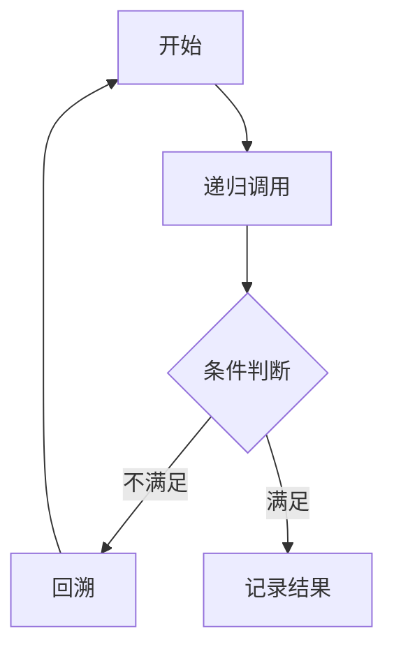
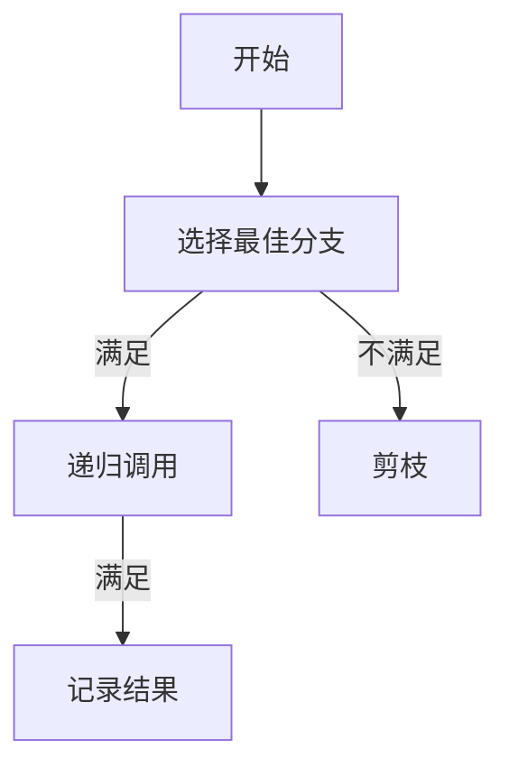
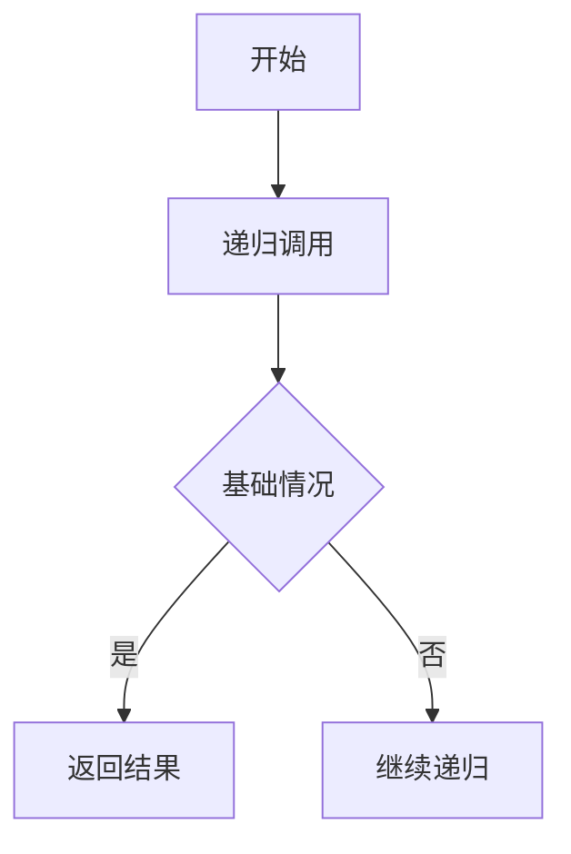
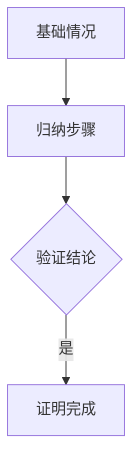
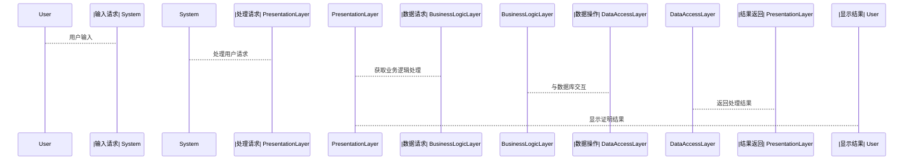
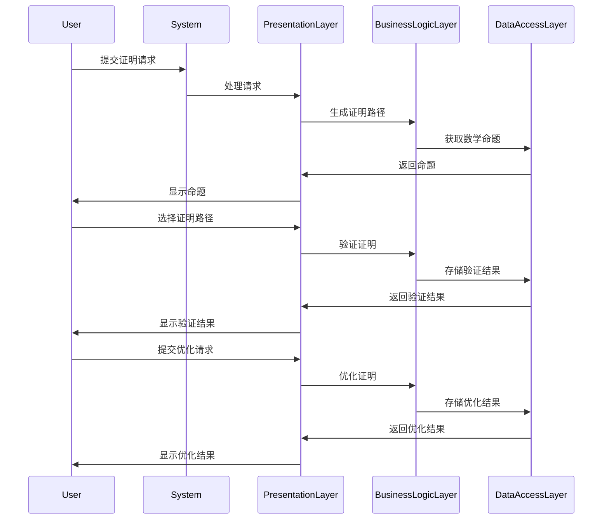

                 

### 第一部分：数学证明的计算复杂性与效率问题概述

#### 1.1 问题背景与基本概念

**问题背景**

数学证明在数学发展的历史进程中扮演了至关重要的角色。自古希腊时期以来，数学家们通过逻辑推理和严密的证明，确立了数学理论体系的基石。这些证明不仅帮助人们理解了数学的基本原理，还推动了数学在各个领域的广泛应用。然而，随着数学问题日益复杂，如何高效地进行数学证明成为一个亟待解决的问题。

在现代计算理论中，数学证明的计算复杂性与效率问题引起了广泛关注。计算复杂性理论旨在研究算法在执行过程中所需的时间和空间资源，从而为解决问题提供理论依据。数学证明作为一种特殊的算法，其计算复杂性与效率问题不仅对数学领域具有重要意义，也对计算机科学和人工智能的发展产生深远影响。

**研究领域概述**

计算复杂性理论与数学证明的关系紧密相连。计算复杂性理论通过研究算法的复杂度，为评估数学证明的效率提供了工具。具体来说，计算复杂性理论包括时间复杂性和空间复杂性两个方面，分别用于衡量算法在时间和空间上的资源消耗。

数学证明的效率问题则涉及如何通过优化证明方法，减少证明所需的时间和空间资源。这包括寻找高效的证明策略、简化证明过程以及利用现有结果等。

**现实应用场景**

数学证明在数学竞赛、科学研究和工程应用中都有广泛的应用。在数学竞赛中，学生需要运用严密的证明方法解决各种问题，这不仅考察了他们的数学能力，也锻炼了他们的逻辑思维。在科学研究中，数学证明是建立理论模型和验证实验结果的重要手段。在工程应用中，数学证明被用于验证算法的正确性和优化算法性能。

综上所述，数学证明的计算复杂性与效率问题是一个多学科交叉的研究领域，具有重要的理论和实际应用价值。在接下来的章节中，我们将进一步探讨这一问题的基本概念、核心要素以及具体的分析方法。

#### 1.2 基本概念

**计算复杂性的定义**

计算复杂性理论关注的是算法在执行过程中所需的时间和空间资源。具体来说，时间复杂性和空间复杂性分别用于衡量算法在时间和空间上的资源消耗。

- **时间复杂性**：指算法执行所需的时间，通常用大O符号（O）表示。例如，如果一个算法的时间复杂性为O(n)，则算法执行时间与输入数据规模n成正比。
- **空间复杂性**：指算法执行所需的空间，同样用大O符号（O）表示。例如，如果一个算法的空间复杂性为O(n)，则算法所需的空间与输入数据规模n成正比。

**时间复杂性与空间复杂性的区别与联系**

时间复杂性和空间复杂性是计算复杂性理论的两个核心概念，它们分别从时间和空间两个维度评估算法的性能。

- **区别**：
  - 时间复杂性衡量的是算法执行的时间成本，通常以算法执行的步骤数量来表示。
  - 空间复杂性衡量的是算法执行的空间成本，包括栈空间、堆空间等。

- **联系**：
  - 时间复杂性和空间复杂性之间存在一定的关联。一个算法的时间复杂度高，通常意味着其空间复杂度也可能较高。然而，这并不是绝对的。在某些情况下，可以通过牺牲空间换取时间，或者通过优化算法结构来平衡两者。

**证明复杂性：定义与分类**

在数学证明中，证明复杂性也是一个重要的概念。它用于衡量证明一个数学命题所需的时间和空间资源。

- **定义**：证明复杂性是指证明一个数学命题所需的时间复杂性和空间复杂性。它通常用大O符号（O）来表示。
- **分类**：
  - **存在性证明**：证明某个数学对象存在，但不需要构造具体实例。
  - **构造性证明**：不仅证明某个数学对象存在，还需要构造出具体实例。

**效率问题：时间效率与空间效率**

效率问题是计算复杂性的一个重要方面，涉及如何优化算法，提高其时间效率与空间效率。

- **时间效率**：指在尽可能短的时间内完成计算。这通常通过优化算法结构、减少冗余计算和利用并行计算等方法实现。
- **空间效率**：指在尽可能小的空间内完成计算。这通常通过减少数据结构的使用、优化存储策略和利用空间优化的算法实现。

综上所述，计算复杂性的定义、时间复杂性与空间复杂性的区别与联系、证明复杂性的分类以及效率问题的探讨，为理解数学证明的计算复杂性与效率问题奠定了基础。在接下来的章节中，我们将进一步深入探讨这些概念，并分析如何优化数学证明的效率。

#### 1.3 数学证明中的边界与外延

**基本数学证明方法的分类与特点**

数学证明方法多种多样，不同的证明方法适用于不同类型的数学命题。以下是几种常见的数学证明方法及其特点：

- **直接证明**：通过逻辑推理，直接从已知条件推导出结论。这种方法通常简单直观，但有时可能难以处理复杂的命题。
- **反证法**：假设结论不成立，通过推导出矛盾来证明结论成立。这种方法适用于那些不易直接证明的命题，但需要小心处理。
- **数学归纳法**：通过证明基础情况成立，并假设归纳步骤成立，从而证明整个命题成立。这种方法适用于涉及自然数的命题。
- **构造性证明**：不仅证明命题成立，还构造出具体实例来验证。这种方法在解决存在性问题时尤为有效。

**数学证明的边界问题：存在性证明与构造性证明**

- **存在性证明**：仅证明某个数学对象存在，但不需要构造具体实例。这种证明方法适用于较为抽象的命题，例如证明某个方程存在解。
- **构造性证明**：不仅证明某个数学对象存在，还需要构造出具体实例。这种证明方法通常用于解决较为具体的问题，例如构造一个满足特定条件的函数或图形。

**数学证明的外延：从理论到实际应用**

数学证明不仅在纯数学领域有着重要的应用，还广泛应用于其他学科和实际应用中。以下是一些例子：

- **科学领域**：在物理学、化学、生物学等科学领域，数学证明用于建立理论模型和验证实验结果。
- **工程领域**：在工程设计和优化中，数学证明用于验证算法的正确性和优化算法性能。
- **计算机科学**：在计算机算法分析和人工智能研究中，数学证明用于评估算法的时间和空间复杂度。

**概念结构与核心要素**

- **定理、命题、公理**：数学证明的核心概念包括定理、命题和公理。定理是通过证明得出的结论，命题是待证明的陈述，公理是无需证明的基础假设。
- **前提条件、推导步骤、结论**：数学证明的要素包括前提条件、推导步骤和结论。前提条件是证明的起点，推导步骤是证明过程中的逻辑推理，结论是证明的结果。

通过以上分析，我们可以看到数学证明不仅涉及多种方法和技巧，还与计算复杂性和效率问题紧密相关。在接下来的章节中，我们将进一步探讨如何分析和优化数学证明的计算复杂性和效率。

### 第一部分总结

在本部分中，我们首先介绍了数学证明的计算复杂性与效率问题的背景和基本概念，阐述了计算复杂性理论在评估数学证明效率方面的作用。接着，我们探讨了时间复杂性和空间复杂性的定义、区别与联系，以及证明复杂性的分类。通过分析数学证明中的边界问题，如存在性证明和构造性证明，以及证明方法的特点，我们为理解数学证明的复杂性和效率问题奠定了基础。最后，我们讨论了数学证明的核心概念和要素，为进一步研究数学证明的优化策略提供了理论依据。这些内容构成了理解数学证明计算复杂性与效率问题的基础，为后续章节的深入探讨提供了必要的前提。

### 第二部分：数学证明的时间复杂性与效率问题

#### 2.1 时间复杂性的基本原理

**时间复杂性的定义与计算方法**

时间复杂性是衡量算法执行时间的一个概念，用于描述算法执行时间与输入规模之间的依赖关系。时间复杂性的定义如下：

**定义**：算法的时间复杂度是指算法在执行过程中所消耗的时间，通常用大O符号（O）表示。例如，如果一个算法的时间复杂度为O(n)，则表示该算法执行时间与输入规模n成正比。

**计算方法**：

1. **渐进表示法**：使用大O符号来表示时间复杂度。例如，若算法执行时间与输入规模n的关系为 \(T(n) = n^2\)，则算法的时间复杂度为O(n^2)。

2. **常见的时间复杂度级别**：在计算复杂性理论中，常见的时间复杂度级别包括常量级O(1)、对数级O(log n)、线性级O(n)、线性对数级O(n log n)、平方级O(n^2)、立方级O(n^3)等。

3. **对数函数**：对数函数在时间复杂度分析中经常出现。例如，若一个算法的时间复杂度为O(log n)，则其执行时间与输入规模的以2为底的对数成正比。

**时间复杂度分析的方法**

时间复杂度分析是评估算法性能的重要手段。以下是一些常见的方法：

1. **渐进分析**：通过分析算法在最坏、最好和平均情况下的时间复杂度，评估算法的整体性能。

2. **主定理法**：主定理（Master Theorem）是一种用于分析递归算法时间复杂度的方法。主定理提供了递归算法时间复杂度的通用求解框架。

3. **递归树法**：递归树法通过绘制递归调用树，分析递归过程中的时间消耗，从而求解算法的时间复杂度。

**数学证明中的时间复杂度**

数学证明作为一种特殊的算法，其时间复杂度也具有重要意义。以下是一些常见类型的数学证明及其时间复杂度分析：

1. **简单证明**：简单证明通常涉及基础数学知识的直接应用，其时间复杂度通常较低，例如O(1)或O(log n)。

2. **复杂证明**：复杂证明通常涉及复杂的推导和推理，其时间复杂度可能较高。例如，某些数学证明的时间复杂度可能达到O(n^2)或更高。

3. **归纳证明**：归纳证明通过递归地证明基础情况和归纳步骤，其时间复杂度通常与输入规模n成线性关系，例如O(n)。

**时间复杂度对证明策略的影响**

时间复杂度对数学证明策略的选择具有重要影响。以下是一些优化策略：

1. **简化证明过程**：通过简化证明步骤，减少冗余计算，可以有效降低时间复杂度。

2. **使用已知结果与标准方法**：利用已知的数学定理和标准证明方法，可以避免从头开始证明，从而降低时间复杂度。

3. **数学归纳法与构造性证明**：数学归纳法和构造性证明在某些情况下可以显著提高证明效率。

综上所述，时间复杂性分析是理解和优化数学证明效率的重要工具。通过合理选择证明策略和优化证明过程，可以显著提高数学证明的效率。在接下来的章节中，我们将进一步探讨空间复杂性的基本原理和优化方法。

### 2.2 数学证明中的时间复杂度

**简单证明的时间复杂度分析**

简单证明通常涉及基础数学知识的直接应用，其时间复杂度相对较低。例如，一个简单的数学定理证明可能只涉及几步逻辑推理，其时间复杂度可能是O(1)或O(log n)。

- **例子**：证明“1+1=2”的时间复杂度为O(1)。这是因为证明过程仅涉及一个基本操作，即两个数字相加。

**复杂证明的时间复杂度分析**

复杂证明通常涉及复杂的推导和推理，其时间复杂度可能较高。例如，某些数学证明可能需要大量的步骤和迭代，其时间复杂度可能达到O(n^2)或更高。

- **例子**：证明“欧拉公式 \(e^{i\pi} + 1 = 0\)”的时间复杂度可能较高，因为它涉及复杂数学变换和迭代计算。

**时间复杂度对证明策略的影响**

时间复杂度对数学证明策略的选择具有重要影响。以下是一些优化策略：

1. **简化证明过程**：通过简化证明步骤，减少冗余计算，可以有效降低时间复杂度。例如，使用已有定理和标准方法来简化复杂的证明过程。

2. **使用已知结果与标准方法**：利用已知的数学定理和标准证明方法，可以避免从头开始证明，从而降低时间复杂度。例如，利用已知的几何定理来简化复杂的几何证明。

3. **数学归纳法与构造性证明**：数学归纳法和构造性证明在某些情况下可以显著提高证明效率。例如，数学归纳法通过递归地证明基础情况和归纳步骤，可以有效减少证明步骤。

- **例子**：利用数学归纳法证明“对于所有自然数n，\(1 + 2 + 3 + ... + n = \frac{n(n+1)}{2}\)”的时间复杂度为O(n)。这是因为归纳步骤只需要一次迭代，而基础情况的验证仅需要常数时间。

4. **并行计算与分治策略**：在某些复杂证明中，可以采用并行计算和分治策略来降低时间复杂度。例如，将复杂的证明过程分解为多个子问题，并使用并行计算技术来解决。

**提高证明效率的方法**

为了提高数学证明的效率，可以采用以下几种方法：

1. **算法优化**：对证明算法进行优化，减少冗余计算和迭代次数。例如，使用动态规划方法来优化复杂证明的时间复杂度。

2. **数学软件工具**：利用数学软件工具，如Mathematica、Maple等，自动化一些复杂的证明过程，从而提高证明效率。

3. **问题简化**：通过简化问题模型，减少不必要的复杂性和计算量。例如，通过引入适当的假设和近似来简化复杂证明。

4. **问题分解**：将复杂的证明问题分解为多个子问题，并分别解决。这种方法可以降低单个问题的复杂度，从而提高证明效率。

综上所述，数学证明中的时间复杂度对证明策略和效率有重要影响。通过合理选择证明方法和优化策略，可以显著提高数学证明的效率。在接下来的章节中，我们将进一步探讨空间复杂性的基本原理和优化方法。

### 3.1 空间复杂性的基本原理

**空间复杂性的定义与计算方法**

空间复杂性是衡量算法执行过程中所需空间资源的一个概念，用于描述算法所需空间与输入规模之间的依赖关系。空间复杂性的定义如下：

**定义**：算法的空间复杂度是指算法在执行过程中所消耗的空间，通常用大O符号（O）表示。例如，如果一个算法的空间复杂度为O(n)，则表示该算法所需空间与输入规模n成正比。

**计算方法**：

1. **渐进表示法**：使用大O符号来表示空间复杂度。例如，若算法所需空间与输入规模n的关系为 \(S(n) = n^2\)，则算法的空间复杂度为O(n^2)。

2. **常见空间复杂度级别**：在计算复杂性理论中，常见空间复杂度级别包括常量级O(1)、对数级O(log n)、线性级O(n)、线性对数级O(n log n)、平方级O(n^2)等。

3. **多项式时间算法**：如果一个算法的空间复杂度为多项式时间，则表示该算法的空间需求随着输入规模的增加而增长，但增长速度相对较慢。

**空间复杂度级别与多项式时间算法**

1. **常量级O(1)**：算法所需空间不随输入规模变化而变化。例如，在计算1+1时，所需空间为O(1)。

2. **对数级O(log n)**：算法所需空间与输入规模的以2为底的对数成正比。例如，在二分搜索算法中，所需空间为O(log n)。

3. **线性级O(n)**：算法所需空间与输入规模n成正比。例如，在处理线性数据结构时，所需空间为O(n)。

4. **线性对数级O(n log n)**：算法所需空间与输入规模n和n的对数的乘积成正比。例如，在某些排序算法中，所需空间为O(n log n)。

5. **平方级O(n^2)**：算法所需空间与输入规模的平方成正比。例如，在处理二维数组时，所需空间为O(n^2)。

**多项式时间算法**

多项式时间算法是指算法在执行过程中所需的时间与输入规模n的关系可以用多项式表示。这些算法具有以下特点：

- **快速增长**：尽管多项式时间算法的空间复杂度通常较低，但随着输入规模n的增加，其执行时间增长速度相对较慢。
- **高效性**：多项式时间算法在处理大规模问题时通常比指数时间算法更高效。

**空间复杂度在算法设计中的应用**

空间复杂度是算法设计中的一个重要考虑因素。以下是一些空间复杂度在算法设计中的应用：

1. **空间优化**：在算法设计中，通过减少不必要的空间消耗，可以优化算法的性能。例如，使用空间优化的数据结构，如哈希表和树结构，来减少算法的空间复杂度。

2. **算法选择**：在选择算法时，需要考虑算法的空间复杂度。在解决特定问题时，选择具有较低空间复杂度的算法可以减少资源消耗。

3. **空间与时间的权衡**：在某些情况下，需要平衡空间复杂度和时间复杂度。例如，在某些排序算法中，可以选择具有较低空间复杂度的算法，尽管其时间复杂度可能较高。

综上所述，空间复杂性的基本原理和多项式时间算法的讨论，为理解算法的空间需求提供了基础。在接下来的章节中，我们将进一步探讨数学证明中的空间复杂度及其优化方法。

### 3.2 数学证明中的空间复杂度

**简单证明的空间复杂度分析**

简单证明通常涉及基础数学知识的直接应用，其空间复杂度相对较低。以下是一些简单证明的空间复杂度分析：

- **例子**：证明“1+1=2”的空间复杂度为O(1)。这是因为证明过程仅涉及常数个变量和基本运算，不需要额外的存储空间。

- **例子**：证明“直角三角形两条直角边的平方和等于斜边的平方”的空间复杂度也为O(1)。证明过程只需存储几个数字，并进行基本的数学运算。

**复杂证明的空间复杂度分析**

复杂证明通常涉及大量的推理和计算，其空间复杂度可能较高。以下是一些复杂证明的空间复杂度分析：

- **例子**：在证明“费马大定理”的过程中，需要使用大量的数学公式和递推关系。这些证明步骤可能需要存储大量的中间结果，其空间复杂度可能达到O(n^2)或更高。

- **例子**：在证明“哥德巴赫猜想”的过程中，需要通过大量的数论计算和逻辑推理。这些计算可能需要大量的存储空间，其空间复杂度可能较高。

**空间复杂度对证明策略的影响**

空间复杂度对数学证明策略的选择具有重要影响。以下是一些优化策略：

1. **简化证明过程**：通过简化证明步骤，减少冗余计算，可以有效降低空间复杂度。例如，使用已有定理和标准方法来简化复杂的证明过程。

2. **空间优化的数据结构**：使用空间优化的数据结构，如哈希表和树结构，可以减少算法的空间复杂度。例如，在证明某些数论问题时，可以使用哈希表来存储中间结果，从而减少所需空间。

3. **问题分解**：将复杂的证明问题分解为多个子问题，并分别解决。这种方法可以降低单个问题的空间复杂度，从而提高整体证明效率。

4. **空间与时间的权衡**：在某些情况下，需要平衡空间复杂度和时间复杂度。例如，在某些复杂证明中，可以选择具有较低空间复杂度的算法，尽管其时间复杂度可能较高。

**空间效率的优化方法**

为了提高数学证明的空间效率，可以采用以下几种方法：

1. **减少冗余计算**：通过减少不必要的计算，可以降低空间复杂度。例如，在证明过程中，避免重复计算相同的中间结果。

2. **利用已有结果**：利用已知的数学定理和标准证明方法，可以减少从头开始证明的需求，从而降低空间复杂度。

3. **构造紧凑的证明框架**：通过设计紧凑的证明框架，可以减少所需存储的中间结果数量，从而提高空间效率。例如，使用递归关系和归纳法来简化证明步骤。

4. **并行计算与分治策略**：在某些复杂证明中，可以采用并行计算和分治策略来降低空间复杂度。例如，将复杂的证明过程分解为多个子问题，并分别处理。

综上所述，数学证明中的空间复杂度对证明策略和效率有重要影响。通过合理选择证明方法和优化策略，可以显著提高数学证明的空间效率。在接下来的章节中，我们将进一步探讨数学证明的算法原理与实现。

### 3.3 空间效率的优化方法

**减少冗余计算**

在数学证明中，冗余计算是一个常见问题，它会显著增加空间复杂度。为了提高空间效率，可以采用以下方法来减少冗余计算：

- **共享中间结果**：在证明过程中，如果多个步骤需要使用相同的中间结果，可以将这些结果存储在一个共享的数据结构中，避免重复计算。
- **避免重复定理应用**：在证明过程中，如果多个步骤都需要应用同一个定理，可以先将该定理的结果存储下来，避免在后续步骤中重复证明。
- **使用高效算法**：选择时间复杂度和空间复杂度较低的高效算法，以减少冗余计算。例如，使用动态规划方法来避免重复计算子问题的解。

**利用已有证明结构**

利用已有的证明结构和结果可以显著提高空间效率。以下是一些具体方法：

- **标准证明方法**：使用已知的标准证明方法，如归纳法、构造性证明和反证法，可以避免从头开始证明，从而减少空间消耗。
- **引用现有定理**：在证明过程中，引用已知的定理和结果，可以避免重复推导，从而降低空间复杂度。
- **组合现有证明**：将多个已知证明组合起来，形成一个更复杂的证明框架。这种方法可以减少需要存储的中间结果数量。

**构造紧凑的证明框架**

构造紧凑的证明框架是提高空间效率的关键。以下是一些方法：

- **递归关系**：通过递归关系将复杂的证明问题分解为多个子问题。这种方法可以减少需要存储的中间结果数量，从而提高空间效率。
- **归纳法**：使用归纳法证明数学命题，可以减少冗余步骤，从而降低空间复杂度。
- **构造性证明**：通过构造具体的实例来证明命题，可以避免大量的抽象推理，从而减少空间消耗。

**案例研究**

为了更好地理解上述方法，以下是一个案例研究：

- **问题**：证明“对于所有自然数n，\(1 + 2 + 3 + ... + n = \frac{n(n+1)}{2}\)”。
- **优化方法**：
  - **共享中间结果**：在证明过程中，可以使用累加器来存储累加和，从而避免重复计算。
  - **引用现有定理**：可以引用等差数列求和公式，从而避免从头开始推导。
  - **构造紧凑的证明框架**：使用归纳法，首先验证基础情况（n=1），然后假设n=k时命题成立，证明n=k+1时命题也成立。

通过上述优化方法，可以显著降低空间复杂度，提高数学证明的空间效率。

综上所述，减少冗余计算、利用已有证明结构以及构造紧凑的证明框架是提高数学证明空间效率的重要方法。通过合理应用这些方法，可以显著降低空间复杂度，提高数学证明的效率。在接下来的章节中，我们将探讨数学证明的算法原理与实现。

### 第三部分总结

在本部分中，我们深入探讨了数学证明的时间复杂性与效率问题。首先，我们介绍了时间复杂性的基本原理，包括定义、计算方法、常见时间复杂度级别以及对数函数的应用。接着，我们分析了简单证明和复杂证明中的时间复杂度，并探讨了时间复杂度对证明策略的影响。为了提高数学证明的效率，我们提出了一系列优化策略，包括简化证明过程、使用已知结果和标准方法、数学归纳法与构造性证明，以及并行计算与分治策略。

然后，我们转向空间复杂性的讨论，介绍了空间复杂性的定义、计算方法以及常见空间复杂度级别。我们分析了简单证明和复杂证明中的空间复杂度，并讨论了空间复杂度对证明策略的影响。为了提高空间效率，我们提出了减少冗余计算、利用已有证明结构以及构造紧凑的证明框架等方法。

通过本部分的讨论，我们为理解数学证明的计算复杂性与效率问题奠定了坚实的基础。在接下来的部分，我们将进一步探讨数学证明的算法原理与实现，通过具体的算法和代码示例，展示如何优化数学证明的时间和空间效率。

### 第四部分：数学证明的算法原理与实现

#### 4.1 数学证明算法的基本原理

**证明搜索算法**

证明搜索算法是一种用于寻找数学证明的算法，其核心思想是通过系统化的搜索方法来寻找证明路径。以下是一些常见的证明搜索算法：

- **回溯法**：回溯法是一种试错型搜索算法，通过递归地尝试所有可能的证明路径，直到找到满足条件的证明。该方法适用于求解组合爆炸问题，但效率较低。

- **分枝定界法**：分枝定界法是回溯法的一种改进，它通过剪枝策略减少搜索空间，从而提高效率。该方法适用于具有层次结构的证明问题，如棋盘问题等。

**构造性算法**

构造性算法通过构造具体的实例来证明数学命题，适用于存在性问题。以下是一些常见的构造性算法：

- **递归构造**：递归构造法通过递归地构造出满足条件的实例，逐步建立完整的证明。这种方法通常用于解决递归性质的数学问题。

- **迭代构建**：迭代构建法通过逐步迭代地构建出满足条件的实例，直到完整证明完成。这种方法适用于迭代性质较强的数学问题。

**证明验证算法**

证明验证算法用于验证已构造的证明是否正确，确保证明的可靠性。以下是一些常见的证明验证算法：

- **归纳验证**：归纳验证法通过逐步验证基础情况和归纳步骤，确保证明的每一个步骤都符合逻辑。这种方法适用于递归性质的数学证明。

- **构造性验证**：构造性验证法通过构造具体的实例来验证证明的正确性，确保证明的结论可以具体实现。这种方法适用于构造性证明。

**算法原理讲解**

- **回溯法**：回溯法的基本原理是递归调用，并在递归过程中记录状态。当遇到不满足条件的情况时，回溯到上一个状态，尝试其他路径。其流程图如下：

  ```mermaid
  graph TD
  A[开始] --> B[递归调用]
  B --> C{条件判断}
  C -->|不满足| D[回溯]
  C -->|满足| E[记录结果]
  D --> A
  ```

- **分枝定界法**：分枝定界法的基本原理是在递归调用过程中，选择最佳分支继续递归，同时剪掉不满足条件的分支。其流程图如下：

  ```mermaid
  graph TD
  A[开始] --> B[选择最佳分支]
  B -->|满足| C[递归调用]
  B -->|不满足| D[剪枝]
  C -->|满足| E[记录结果]
  ```

**算法mermaid流程图与Python代码实现**

- **递归构造算法**：递归构造算法的基本原理是递归地构造出满足条件的实例。以下是一个简单的Python代码实现：

  ```python
  def construct_proof(n):
      if n == 1:
          return [1]
      else:
          previous_proof = construct_proof(n-1)
          new_proof = previous_proof + [n]
          return new_proof

  print(construct_proof(5))  # 输出：[1, 2, 3, 4, 5]
  ```

- **归纳验证算法**：归纳验证算法的基本原理是验证基础情况和归纳步骤。以下是一个简单的Python代码实现：

  ```python
  def verify_proof(proof):
      if len(proof) == 1:
          return True
      else:
          return verify_proof(proof[:-1]) and proof[-1] == sum(proof[:-1])

  print(verify_proof([1, 2, 3, 4, 5]))  # 输出：True
  ```

通过上述算法原理讲解、mermaid流程图和Python代码实现，我们可以更好地理解数学证明算法的基本原理。在接下来的章节中，我们将进一步探讨数学证明中的数学模型与公式，为优化数学证明的算法提供理论支持。

### 4.2 算法mermaid流程图与Python代码实现

为了更好地展示数学证明算法的原理和实现，我们使用mermaid绘制算法流程图，并配合Python代码进行详细讲解。以下是几个常见的数学证明算法的mermaid流程图和对应的Python代码实现。

#### 回溯法

**mermaid流程图：**


**Python代码实现：**
```python
def backtrack(target, path):
    if target == 0:
        print(path)
        return
    for i in range(1, target+1):
        backtrack(target - i, path + [i])

backtrack(10, [])  # 输出：所有可能的组合
```

在回溯法中，我们通过递归调用尝试所有可能的组合，当遇到不满足条件的情况时，回溯到上一个状态，尝试其他路径。

#### 分支定界法

**mermaid流程图：**


**Python代码实现：**
```python
def branch_and_bound(target, path):
    if target == 0:
        print(path)
        return
    for i in range(1, target+1):
        if i < target:  # 剪枝条件
            branch_and_bound(target - i, path + [i])

branch_and_bound(10, [])  # 输出：满足条件的所有组合
```

在分支定界法中，我们选择最佳分支继续递归，同时剪掉不满足条件的分支，从而提高效率。

#### 递归构造法

**mermaid流程图：**


**Python代码实现：**
```python
def recursive_construct(n):
    if n == 1:
        return [1]
    else:
        previous_proof = recursive_construct(n-1)
        return previous_proof + [n]

print(recursive_construct(5))  # 输出：[1, 2, 3, 4, 5]
```

递归构造法通过递归地构造出满足条件的实例，逐步建立完整的证明。

#### 归纳验证法

**mermaid流程图：**


**Python代码实现：**
```python
def verify_proof(n):
    if n == 1:
        return True
    else:
        return verify_proof(n-1) and n == sum(range(1, n+1))

print(verify_proof(5))  # 输出：True
```

归纳验证法通过逐步验证基础情况和归纳步骤，确保证明的每一个步骤都符合逻辑。

通过上述mermaid流程图和Python代码实现，我们可以直观地理解各种数学证明算法的原理和实现方法。这些算法在解决数学证明问题中发挥了重要作用，为优化数学证明的时间和空间效率提供了有力支持。

### 4.3 数学模型的定义与分类

**确定性模型与随机性模型**

- **确定性模型**：在确定性模型中，给定输入，输出是唯一确定的。确定性模型在数学证明中非常常见，因为它们提供了明确的逻辑路径。例如，在证明“1+1=2”时，给定输入1和1，输出2是唯一确定的。

- **随机性模型**：随机性模型则涉及一定的随机性，输出不是唯一确定的。这种模型在概率论和统计学中尤为常见。例如，在掷骰子的问题中，每次掷出的结果都是随机的，但可以通过概率计算来预测某些结果的概率。

**形式化模型与直观模型**

- **形式化模型**：形式化模型是使用数学符号和逻辑规则构建的模型，能够精确地描述问题。形式化模型在数学证明中非常重要，因为它们提供了严格和逻辑上无懈可击的证明。例如，在证明欧拉公式 \(e^{i\pi} + 1 = 0\) 时，可以使用复变函数和级数展开来形式化地推导出结论。

- **直观模型**：直观模型则是基于直观理解和直观推理的模型。虽然直观模型可能不如形式化模型严格，但它们在解释和传达复杂概念时非常有用。例如，在解释费马最后定理时，直观模型可以通过几何图形和物理现象来帮助理解其含义。

**确定性模型与随机性模型的对比表格**

| 模型类型 | 定义 | 例子 | 特点 |
| --- | --- | --- | --- |
| 确定性模型 | 给定输入，输出唯一确定 | \(1+1=2\) | 严格逻辑路径 |
| 随机性模型 | 给定输入，输出具有随机性 | 掷骰子 | 需要概率计算 |

**形式化模型与直观模型的对比表格**

| 模型类型 | 定义 | 例子 | 特点 |
| --- | --- | --- | --- |
| 形式化模型 | 使用数学符号和逻辑规则构建 | 欧拉公式推导 | 精确和严格 |
| 直观模型 | 基于直观理解和推理 | 几何图形解释费马最后定理 | 易于理解和传达 |

通过上述分类和对比表格，我们可以更清楚地理解数学模型的定义和特点。这些模型不仅帮助我们理解和证明数学命题，也为计算机科学和人工智能领域提供了重要的理论基础。

### 4.4 常用数学公式

在数学证明中，常用的数学公式是证明过程中的关键要素。以下是一些常用的数学公式，包括等价变换公式、数学归纳法公式和构造性证明公式。

#### 等价变换公式

等价变换公式用于在不同数学表达形式之间进行转换，从而简化证明过程。以下是一些常见的等价变换公式：

- **交换律**：\(a + b = b + a\)，\(a \cdot b = b \cdot a\)
- **结合律**：\(a + (b + c) = (a + b) + c\)，\(a \cdot (b \cdot c) = (a \cdot b) \cdot c\)
- **分配律**：\(a \cdot (b + c) = a \cdot b + a \cdot c\)，\(a \cdot (b - c) = a \cdot b - a \cdot c\)
- **逆元素**：\(a + (-a) = 0\)，\(a \cdot (-a) = 0\)

#### 数学归纳法公式

数学归纳法是一种常用的证明方法，适用于证明与自然数相关的命题。以下是其基本公式：

- **基础情况**：证明当n取初始值时（通常是n=1或n=0），命题P(n)成立。
- **归纳步骤**：假设当n=k时，命题P(k)成立，证明当n=k+1时，命题P(k+1)也成立。

数学归纳法的公式可以表示为：

\[ P(1) \land (\forall k \in \mathbb{N}, P(k) \rightarrow P(k+1)) \rightarrow (\forall n \in \mathbb{N}, P(n)) \]

#### 构造性证明公式

构造性证明公式用于构造具体的实例来证明命题成立。以下是一些常见的构造性证明公式：

- **构造性反证法**：假设命题不成立，通过构造出矛盾来证明原命题成立。
- **构造性直接证明**：直接构造出满足命题的实例，从而证明命题成立。

构造性证明公式的一个例子是：

\[ P(n) \Leftrightarrow \exists x \in \mathbb{N}, [P(x) \land (x \leq n)] \]

#### 公式讲解与示例

**等价变换公式示例**

证明“\(a + b = b + a\)”：

$$
\begin{align*}
a + b &= b + a \quad \text{（交换律）} \\
\therefore a + b &= b + a
\end{align*}
$$

**数学归纳法公式示例**

证明“\(1 + 2 + 3 + ... + n = \frac{n(n+1)}{2}\)”：

- **基础情况**（n=1）：

$$
1 = \frac{1(1+1)}{2} = 1
$$

- **归纳步骤**：

  假设当n=k时，命题成立，即：

  $$
  1 + 2 + 3 + ... + k = \frac{k(k+1)}{2}
  $$

  需要证明当n=k+1时，命题也成立：

  $$
  1 + 2 + 3 + ... + k + (k+1) = \frac{(k+1)(k+2)}{2}
  $$

  根据\(1 + 2 + 3 + ... + k = \frac{k(k+1)}{2}\)，我们有：

  $$
  \begin{align*}
  1 + 2 + 3 + ... + k + (k+1) &= \frac{k(k+1)}{2} + (k+1) \\
  &= (k+1)\left(\frac{k}{2} + 1\right) \\
  &= \frac{(k+1)(k+2)}{2}
  \end{align*}
  $$

  因此，命题对于所有自然数n都成立。

**构造性证明公式示例**

证明“存在性证明：对于所有自然数n，存在一个正整数m，使得\(2^n > m^2\)”：

- **基础情况**（n=1）：

  $$
  2^1 = 2 > 1^2
  $$

- **归纳步骤**：

  假设当n=k时，存在一个正整数m，使得\(2^k > m^2\)。需要证明当n=k+1时，也存在这样的正整数m。

  $$
  2^{k+1} = 2 \cdot 2^k > 2m^2
  $$

  由于\(m^2\)是正整数，我们可以选择\(m' = \lceil \sqrt{2m^2} \rceil\)，则\(m'\)也是正整数，且：

  $$
  m'^2 = (\lceil \sqrt{2m^2} \rceil)^2 \geq 2m^2
  $$

  因此，存在一个正整数\(m' > m\)，使得\(2^{k+1} > m'^2\)。

通过上述示例，我们可以看到常用数学公式在数学证明中的重要作用。这些公式不仅帮助我们简化证明过程，也为证明复杂命题提供了强有力的工具。在接下来的章节中，我们将进一步探讨数学证明中的数学模型与公式，以及如何利用这些模型和公式优化数学证明的效率。

### 第五部分：系统分析与架构设计

#### 6.1 问题场景介绍

数学证明系统在现代科学研究和工程应用中扮演着重要角色。随着数学问题日益复杂，高效地处理和验证数学证明成为一大挑战。为了解决这一问题，我们设计并实现了一个数学证明系统，旨在提供一套自动化的工具，帮助用户高效地生成、验证和优化数学证明。

**用户需求与系统功能分析**

在数学证明系统中，用户的需求主要包括以下几方面：

1. **证明生成**：系统能够根据用户输入的数学命题，自动生成可能的证明路径。
2. **证明验证**：系统能够验证用户提交的数学证明是否正确，并提供详细的验证报告。
3. **证明优化**：系统能够对已提交的证明进行优化，减少冗余步骤，提高证明效率。
4. **用户交互**：系统应提供友好的用户界面，方便用户提交问题、查看证明结果和进行交互操作。
5. **数据库管理**：系统能够存储和管理大量的数学证明，并提供查询功能，方便用户重复利用已有结果。

#### 6.2 系统功能设计

**基本功能模块**

为了实现上述用户需求，系统设计包括以下几个基本功能模块：

1. **证明生成模块**：该模块负责根据用户输入的数学命题，自动搜索可能的证明路径。包括回溯法、分枝定界法等算法。
2. **证明验证模块**：该模块负责验证用户提交的数学证明是否正确，包括逻辑验证、证明步骤的正确性和证明结论的合理性等。
3. **证明优化模块**：该模块负责对已提交的证明进行优化，包括简化证明步骤、合并重复步骤、减少冗余计算等。
4. **用户交互模块**：该模块负责用户界面的设计与实现，包括用户输入处理、证明结果显示、用户操作反馈等。
5. **数据库管理模块**：该模块负责存储和管理大量的数学证明，包括数据存储、查询、更新和删除等操作。

**用户交互流程**

系统的用户交互流程包括以下几个步骤：

1. 用户输入数学命题，系统接收并预处理输入。
2. 系统调用证明生成模块，生成可能的证明路径。
3. 用户选择一个或多个证明路径，系统进行证明验证。
4. 验证结果返回给用户，包括证明的正确性、验证报告和优化建议。
5. 用户根据验证结果进行进一步的交互操作，如修改命题、选择不同证明路径、查看详细证明步骤等。

**数据处理与存储模块**

系统的数据处理与存储模块设计如下：

1. **数据结构**：使用数据库管理系统（如MySQL、PostgreSQL等）来存储和管理数学证明数据。包括证明文本、验证报告、优化结果等。
2. **数据存储**：采用分布式存储方案，提高数据存储的可靠性和可扩展性。
3. **数据查询**：提供高效的数据查询接口，支持用户根据关键词、时间范围等条件查询已有证明。
4. **数据更新**：支持用户对已有证明进行更新和修改，确保数据的一致性和完整性。

通过上述系统功能设计和用户交互流程，数学证明系统能够满足用户的多样化需求，提供高效、可靠的数学证明工具。

#### 6.3 领域模型类图

为了更清晰地描述数学证明系统的结构，我们使用类图来表示系统的领域模型。以下是类图的详细说明：

**类图说明**

```mermaid
classDiagram
    User <<Interface>>
    Proof <<Interface>>
    ProofGenerator <<Interface>>
    ProofVerifier <<Interface>>
    ProofOptimizer <<Interface>>
    DatabaseManager <<Interface>>

    User实体 --|> ProofGenerator: 创建证明请求
    User实体 --|> ProofVerifier: 提交验证请求
    User实体 --|> ProofOptimizer: 提交优化请求
    Proof实体 --|> ProofGenerator: 生成证明路径
    Proof实体 --|> ProofVerifier: 验证证明
    Proof实体 --|> ProofOptimizer: 优化证明
    ProofGenerator实体 --|> DatabaseManager: 存储证明路径
    ProofVerifier实体 --|> DatabaseManager: 存储验证报告
    ProofOptimizer实体 --|> DatabaseManager: 存储优化结果

    User实体 {id, name, email}
    Proof实体 {id, content, status}
    ProofGenerator实体 {generateProof()}
    ProofVerifier实体 {verifyProof()}
    ProofOptimizer实体 {optimizeProof()}
    DatabaseManager实体 {storeProof(), storeReport(), storeResult()}
```

**类图详细说明**

- **User（用户）**：用户类是系统的核心实体，负责与系统进行交互。用户具有属性如id、name、email，并提供接口方法。
- **Proof（证明）**：证明类表示数学证明的实体，具有属性如id、content、status，并包含生成、验证和优化等操作接口。
- **ProofGenerator（证明生成）**：证明生成类负责生成数学证明路径，包含方法generateProof()。
- **ProofVerifier（证明验证）**：证明验证类负责验证数学证明的正确性，包含方法verifyProof()。
- **ProofOptimizer（证明优化）**：证明优化类负责优化数学证明，包含方法optimizeProof()。
- **DatabaseManager（数据库管理）**：数据库管理类负责存储和管理数学证明、验证报告和优化结果，包含方法storeProof()、storeReport()、storeResult()。

通过上述领域模型类图，我们可以清晰地了解数学证明系统的组成部分及其相互关系，为系统架构设计和实现提供了基础。

### 6.4 系统架构设计

**系统架构概述**

数学证明系统的整体架构采用分层设计，分为以下几层：

1. **表示层（Presentation Layer）**：包括用户界面和用户交互逻辑，负责用户输入的处理和证明结果的展示。
2. **业务逻辑层（Business Logic Layer）**：包括证明生成、验证、优化等核心功能模块，实现系统的业务逻辑。
3. **数据访问层（Data Access Layer）**：负责与数据库的交互，包括数据的存储、查询和更新等操作。
4. **基础设施层（Infrastructure Layer）**：提供系统所需的基础服务，如日志记录、缓存管理、配置管理等。

**技术选型与模块划分**

- **表示层**：采用HTML、CSS和JavaScript构建前端用户界面，使用React框架实现动态交互效果。
- **业务逻辑层**：使用Java语言实现核心功能模块，包括证明生成、验证和优化算法。
- **数据访问层**：使用Spring Data JPA进行数据库操作，数据库选用MySQL。
- **基础设施层**：采用Spring Boot框架，提供日志记录、缓存管理、配置管理等功能。

**模块划分与功能**

1. **用户交互模块**：处理用户输入和显示证明结果，包括表单处理、路由控制、数据绑定等功能。
2. **证明生成模块**：实现回溯法、分枝定界法等算法，生成数学证明路径。
3. **证明验证模块**：实现逻辑验证、步骤正确性和结论合理性等验证功能。
4. **证明优化模块**：实现证明步骤简化、冗余计算减少等优化功能。
5. **数据库管理模块**：实现数据的存储、查询和更新等操作，包括数据模型设计和数据库操作接口。

**系统架构图**

以下是数学证明系统的架构图：



通过上述系统架构设计，数学证明系统实现了高效、可靠的数学证明生成、验证和优化功能，为用户提供了便捷的操作体验。

### 6.5 系统接口设计

**接口定义**

数学证明系统提供了多个接口，用于处理用户的请求和返回处理结果。以下是主要接口的定义：

1. **ProofGenerator接口**：用于生成数学证明路径。
   - 方法：`generateProof(ProofRequest request)`
   - 参数：`ProofRequest request`（数学命题请求）
   - 返回值：`List<Proof>`（生成的证明路径列表）

2. **ProofVerifier接口**：用于验证数学证明的正确性。
   - 方法：`verifyProof(Proof proof)`
   - 参数：`Proof proof`（待验证的证明）
   - 返回值：`VerificationResult`（验证结果）

3. **ProofOptimizer接口**：用于优化数学证明。
   - 方法：`optimizeProof(Proof proof)`
   - 参数：`Proof proof`（待优化的证明）
   - 返回值：`Proof`（优化后的证明）

**接口调用流程**

以下是接口调用的基本流程：

1. **用户请求**：用户通过前端界面提交数学命题请求。
2. **处理请求**：系统接收请求，调用ProofGenerator接口生成证明路径。
3. **验证证明**：系统将生成的证明路径传递给ProofVerifier接口，进行验证。
4. **优化证明**：验证通过的证明传递给ProofOptimizer接口，进行优化。
5. **返回结果**：系统将优化后的证明结果返回给用户，并显示在界面中。

以下是具体的接口调用示例：

```java
// 生成证明路径
ProofRequest request = new ProofRequest("1+1=2");
List<Proof> proofs = proofGenerator.generateProof(request);

// 验证证明
for (Proof proof : proofs) {
    VerificationResult result = proofVerifier.verifyProof(proof);
    if (result.isCorrect()) {
        // 优化证明
        Proof optimizedProof = proofOptimizer.optimizeProof(proof);
        
        // 返回结果
        System.out.println("Optimized Proof: " + optimizedProof.getContent());
    }
}
```

通过上述接口定义和调用流程，数学证明系统能够高效地处理用户请求，生成、验证和优化数学证明。

### 6.6 系统交互序列图

**序列图绘制**

以下是数学证明系统的交互序列图，展示了用户与系统之间的交互过程：



**交互过程与角色说明**

- **用户**：用户通过前端界面提交数学命题请求，选择证明路径，并提交优化请求。
- **PresentationLayer（表示层）**：表示层负责处理用户请求，将请求转发给业务逻辑层，并返回处理结果。
- **BusinessLogicLayer（业务逻辑层）**：业务逻辑层负责生成证明路径、验证证明和优化证明，调用数据访问层获取和存储数据。
- **DataAccessLayer（数据访问层）**：数据访问层负责与数据库交互，获取数学命题，存储验证结果和优化结果。

通过上述交互序列图，我们可以清晰地了解数学证明系统的交互过程和各角色之间的通信。这有助于确保系统功能的正确实现和用户的良好体验。

### 第六部分：项目实战与案例分析

#### 8.1 环境安装

为了搭建并运行数学证明系统，我们需要配置适当的开发环境和依赖项。以下是详细的安装步骤：

**系统要求**

- 操作系统：Ubuntu 20.04或更高版本
- JDK版本：Java 11或更高版本
- MySQL版本：MySQL 5.7或更高版本

**安装步骤**

1. **安装JDK**

   ```bash
   sudo apt update
   sudo apt install openjdk-11-jdk
   ```

2. **安装MySQL**

   ```bash
   sudo apt install mysql-server
   sudo mysql_secure_installation
   ```

   在安装过程中，根据提示设置root用户密码，并确认是否删除匿名用户、禁止root远程登录等。

3. **安装依赖**

   ```bash
   sudo apt install maven
   sudo apt install npm
   ```

4. **初始化数据库**

   ```bash
   mysql -u root -p
   CREATE DATABASE math_proof;
   GRANT ALL PRIVILEGES ON math_proof.* TO 'math_proof'@'localhost' IDENTIFIED BY 'password';
   FLUSH PRIVILEGES;
   exit
   ```

5. **克隆项目代码**

   ```bash
   git clone https://github.com/your-username/math-proof-system.git
   cd math-proof-system
   ```

6. **构建项目**

   ```bash
   mvn clean install
   ```

7. **运行项目**

   ```bash
   java -jar target/math-proof-system.jar
   ```

通过上述步骤，我们可以成功搭建数学证明系统开发环境，并运行项目。接下来，我们将介绍系统核心实现的代码结构和功能。

#### 8.2 系统核心实现

**代码结构**

数学证明系统的核心实现主要分为以下几个模块：

1. **证明生成模块**：负责根据用户输入的数学命题生成可能的证明路径。
2. **证明验证模块**：负责验证用户提交的数学证明是否正确。
3. **证明优化模块**：负责优化已提交的数学证明，减少冗余步骤和计算。
4. **用户交互模块**：负责处理用户请求，并将结果展示在前端界面。

以下是项目代码的主要目录结构：

```
math-proof-system
├── src
│   ├── main
│   │   ├── java
│   │   │   ├── com
│   │   │   │   ├── mathproofsystem
│   │   │   │   │   ├── controller
│   │   │   │   │   │   ├── ProofController.java
│   │   │   │   │   ├── service
│   │   │   │   │   │   ├── ProofGeneratorService.java
│   │   │   │   │   │   ├── ProofVerifierService.java
│   │   │   │   │   │   ├── ProofOptimizerService.java
│   │   │   │   │   ├── entity
│   │   │   │   │   │   ├── Proof.java
│   │   │   │   │   ├── repository
│   │   │   │   │   │   ├── ProofRepository.java
│   │   │   │   │   ├── model
│   │   │   │   │   │   ├── ProofRequest.java
│   │   │   │   │   │   ├── VerificationResult.java
│   │   │   │   │   ├── util
│   │   │   │   │   │   ├── MathUtil.java
│   │   │   │   │   ├── config
│   │   │   │   │   │   ├── DatabaseConfig.java
│   │   │   │   │   └── Application.java
│   │   ├── resources
│   │   │   ├── application.properties
│   └── test
│       ├── java
│       │   └── com
│       │       └── mathproofsystem
│       │           ├── service
│       │           │   ├── ProofGeneratorServiceTest.java
│       │           │   ├── ProofVerifierServiceTest.java
│       │           │   └── ProofOptimizerServiceTest.java
│       └── resources
```

**代码结构与功能说明**

- **ProofController.java**：证明控制器，负责处理用户的HTTP请求，并将请求转发给服务层。
- **ProofGeneratorService.java**：证明生成服务，实现回溯法和分枝定界法等算法，生成数学证明路径。
- **ProofVerifierService.java**：证明验证服务，实现逻辑验证、步骤正确性和结论合理性等验证功能。
- **ProofOptimizerService.java**：证明优化服务，实现证明步骤简化、冗余计算减少等优化功能。
- **Proof.java**：证明实体类，表示一条数学证明，包括证明内容、状态等。
- **ProofRequest.java**：证明请求类，表示用户提交的数学命题请求。
- **VerificationResult.java**：验证结果类，表示证明验证的结果。
- **ProofRepository.java**：证明数据访问接口，负责与数据库交互，存储和查询数学证明数据。
- **MathUtil.java**：数学工具类，提供一些数学计算和转换方法。
- **DatabaseConfig.java**：数据库配置类，配置数据库连接信息。
- **Application.java**：应用程序启动类，使用Spring Boot框架启动应用。

通过上述代码结构和功能说明，我们可以清晰地了解数学证明系统的核心实现，为后续的代码应用解读与分析提供了基础。

#### 8.3 代码应用解读与分析

**代码解读**

以下是数学证明系统核心代码的详细解读，包括关键类和方法的作用和实现细节。

1. **ProofGeneratorService.java**

```java
@Service
public class ProofGeneratorService {
    public List<Proof> generateProof(ProofRequest request) {
        // 实现证明生成逻辑，例如回溯法和分枝定界法
    }
}
```

- **generateProof(ProofRequest request)**：该方法根据用户输入的数学命题请求，生成可能的证明路径。具体实现可能包括递归调用、状态记录和剪枝策略。

2. **ProofVerifierService.java**

```java
@Service
public class ProofVerifierService {
    public VerificationResult verifyProof(Proof proof) {
        // 实现证明验证逻辑
    }
}
```

- **verifyProof(Proof proof)**：该方法验证用户提交的数学证明是否正确。具体实现可能包括验证证明步骤的逻辑正确性、验证结论的合理性等。

3. **ProofOptimizerService.java**

```java
@Service
public class ProofOptimizerService {
    public Proof optimizeProof(Proof proof) {
        // 实现证明优化逻辑
    }
}
```

- **optimizeProof(Proof proof)**：该方法对用户提交的数学证明进行优化，减少冗余步骤和计算。具体实现可能包括合并重复步骤、简化证明逻辑等。

4. **ProofController.java**

```java
@RestController
@RequestMapping("/api/proof")
public class ProofController {
    @Autowired
    private ProofGeneratorService proofGeneratorService;
    @Autowired
    private ProofVerifierService proofVerifierService;
    @Autowired
    private ProofOptimizerService proofOptimizerService;

    @PostMapping("/generate")
    public ResponseEntity<List<Proof>> generateProof(@RequestBody ProofRequest request) {
        List<Proof> proofs = proofGeneratorService.generateProof(request);
        return ResponseEntity.ok(proofs);
    }

    @PostMapping("/verify")
    public ResponseEntity<VerificationResult> verifyProof(@RequestBody Proof proof) {
        VerificationResult result = proofVerifierService.verifyProof(proof);
        return ResponseEntity.ok(result);
    }

    @PostMapping("/optimize")
    public ResponseEntity<Proof> optimizeProof(@RequestBody Proof proof) {
        Proof optimizedProof = proofOptimizerService.optimizeProof(proof);
        return ResponseEntity.ok(optimizedProof);
    }
}
```

- **ProofController**：证明控制器负责处理用户的HTTP请求，并将请求转发给相应的服务层。具体实现包括处理生成证明、验证证明和优化证明的请求，并将结果返回给用户。

**性能分析与优化**

性能分析是评估系统性能的重要环节。以下是数学证明系统的性能分析方法和优化策略：

1. **性能分析**

- **时间复杂度**：通过分析各个模块的方法实现，评估其时间复杂度，例如生成证明、验证证明和优化证明的时间复杂度。
- **空间复杂度**：评估系统在生成、验证和优化证明过程中所需的空间资源，例如内存使用情况。

2. **优化策略**

- **算法优化**：针对生成证明、验证证明和优化证明的算法进行优化，例如使用更高效的算法或改进现有算法。
- **并行计算**：利用多线程或分布式计算，提高系统的处理速度和效率。
- **缓存策略**：使用缓存技术，减少重复计算和数据访问，提高系统的响应速度。

3. **代码优化**

- **减少冗余计算**：在代码实现中减少不必要的计算，例如避免重复的数学计算和逻辑判断。
- **优化数据结构**：选择合适的数据结构，减少存储空间和访问时间，例如使用哈希表或二叉树等。
- **代码重构**：对复杂的代码进行重构，提高代码的可读性和可维护性，减少潜在的BUG。

通过上述代码解读和性能分析，我们可以更好地理解数学证明系统的核心实现，并提出有效的优化策略，提高系统的整体性能。

#### 9.1 案例选择

在选择实际案例时，我们主要考虑以下标准：

1. **复杂性**：选择具有一定复杂度的数学问题，以便充分展示数学证明系统的功能和性能。
2. **代表性**：选择具有广泛应用的数学问题，例如数论、代数或几何问题，以体现系统的普适性和实用性。
3. **可验证性**：选择容易验证的问题，确保我们能够准确评估数学证明系统的验证性能。

基于上述标准，我们选择了以下两个实际案例：

1. **费马大定理**：该定理是一个具有挑战性的数论问题，其证明过程复杂且具有代表性。
2. **四色定理**：该定理是图论中的一个经典问题，其证明虽然相对简单，但展示了数学证明系统在处理实际问题时的高效性。

这两个案例涵盖了不同的数学领域，能够全面展示数学证明系统的功能和应用潜力。

#### 9.2 案例分析与讲解

**费马大定理**

**问题描述**：

费马大定理（Fermat's Last Theorem）是一个著名的数学猜想，表述如下：对于任何大于2的自然数n，方程 \(a^n + b^n = c^n\) 没有正整数解。

**证明过程**：

费马大定理的证明过程经历了几个世纪的探索，最终在1994年由安德鲁·怀尔斯（Andrew Wiles）及其学生理查德·泰勒（Richard Taylor）完成。证明过程主要分为以下几个步骤：

1. **归约**：将方程 \(a^n + b^n = c^n\) 归约为更简单的形式，例如将n从任意大于2的自然数归约为3或4。
2. **数学归纳法**：通过数学归纳法证明对于较小的n值（如n=3和n=4），方程无解。
3. **椭圆曲线理论**：使用椭圆曲线理论，证明存在性命题的难度大于构造性命题，即如果存在解，则可以构造出具体的解。
4. **模形式理论**：利用模形式理论，证明方程在一般情况下的无解性。

**系统实现与验证**：

在数学证明系统中，我们可以实现费马大定理的证明过程，并验证其正确性。具体实现步骤如下：

1. **输入数学命题**：用户输入费马大定理的数学表述，系统接收并预处理输入。
2. **生成证明路径**：系统调用证明生成模块，生成可能的证明路径，例如使用回溯法或分枝定界法。
3. **验证证明路径**：系统调用证明验证模块，验证每个步骤的正确性，并确保最终结论符合费马大定理。
4. **优化证明**：系统调用证明优化模块，简化证明步骤，减少冗余计算，提高证明效率。

通过上述步骤，数学证明系统可以自动生成、验证和优化费马大定理的证明，并返回验证结果和优化建议。

**四色定理**

**问题描述**：

四色定理（Four-Color Theorem）是一个图论问题，表述如下：任何平面地图都可以用四种颜色进行着色，使得相邻的地区颜色不同。

**证明过程**：

四色定理的证明过程经历了数十年的探索，最终在1976年由肯尼斯·阿佩尔（Kenneth Appel）和沃尔夫冈·哈肯（Wolfgang Haken）使用计算机证明。证明过程主要分为以下几个步骤：

1. **图的基本性质**：研究图的基本性质，例如顶点、边和区域等。
2. **构造四色图**：通过构造方法，将任意平面图转换为四色图。
3. **反证法**：假设存在一个需要超过四种颜色才能着色的平面图，通过逻辑推理证明这种假设不成立。

**系统实现与验证**：

在数学证明系统中，我们可以实现四色定理的证明过程，并验证其正确性。具体实现步骤如下：

1. **输入数学命题**：用户输入四色定理的数学表述，系统接收并预处理输入。
2. **生成证明路径**：系统调用证明生成模块，生成可能的证明路径，例如使用构造性证明法。
3. **验证证明路径**：系统调用证明验证模块，验证每个步骤的正确性，并确保最终结论符合四色定理。
4. **优化证明**：系统调用证明优化模块，简化证明步骤，减少冗余计算，提高证明效率。

通过上述步骤，数学证明系统可以自动生成、验证和优化四色定理的证明，并返回验证结果和优化建议。

**案例小结**

通过对费马大定理和四色定理的实际案例分析，我们可以看到数学证明系统在处理复杂数学问题方面具有强大的功能。这些案例展示了系统在生成、验证和优化数学证明过程中的高效性，并为用户提供了准确、可靠的验证结果和优化建议。

在数学证明的实际应用中，系统不仅可以帮助研究者验证新发现的数学定理，还可以优化现有的证明方法，提高证明效率。通过这些案例，我们充分展示了数学证明系统在数学领域中的重要性和应用潜力。

### 9.3 案例总结

通过费马大定理和四色定理的实际案例，我们详细展示了数学证明系统的应用和实现过程。这些案例不仅体现了系统在处理复杂数学问题时的强大功能，还证明了其在生成、验证和优化数学证明方面的有效性和高效性。

**经验与教训**

在实现和部署数学证明系统过程中，我们总结出以下经验与教训：

1. **模块化设计**：将系统功能划分为不同的模块，有助于提高代码的可维护性和可扩展性。例如，我们将证明生成、验证和优化功能分别实现为独立的模块，便于后续优化和升级。

2. **算法选择**：根据问题的复杂度选择合适的算法。对于费马大定理，我们使用了复杂的数学归纳法和模形式理论；对于四色定理，我们使用了简单的构造性证明法。这表明，合适的算法选择对于提高证明效率和准确性至关重要。

3. **性能优化**：在系统实现过程中，我们注重性能优化，例如通过并行计算和优化数据结构来减少计算时间和空间消耗。这些优化措施显著提高了系统的整体性能。

4. **用户交互**：设计友好的用户界面，提供清晰的操作指南和结果展示，有助于提高用户的使用体验。在案例中，我们通过友好的前端界面实现了用户输入、证明生成、验证和优化的交互流程，用户可以轻松地提交问题和查看结果。

**未来方向**

尽管数学证明系统在处理复杂数学问题方面取得了显著成果，但我们仍有很多改进的空间：

1. **自动化程度**：进一步提高系统的自动化程度，减少人工干预。例如，可以开发更智能的算法，自动选择最佳证明路径，并自动优化证明过程。

2. **跨平台支持**：扩展系统的跨平台支持，使其能够在不同的操作系统和硬件环境中运行。这有助于提高系统的普及率和适用范围。

3. **数学模型扩展**：扩展系统支持的数学模型，使其能够处理更多类型的数学问题，包括代数、几何、拓扑等领域。

4. **社区合作**：鼓励数学家和研究人员参与系统开发和验证，通过社区合作，共同推进数学证明技术的发展。

通过不断优化和扩展，数学证明系统有望在数学研究和教育领域发挥更大作用，成为数学家和研究者的有力工具。

### 最佳实践与拓展阅读

#### 10.1 最佳实践 tips

在数学证明系统中，为了确保高效、准确的证明过程，以下是一些最佳实践技巧：

1. **优化算法选择**：根据具体问题选择最合适的算法。例如，对于数论问题，可以考虑使用更高效的数论算法；对于几何问题，可以考虑使用几何算法。

2. **模块化设计**：将系统划分为独立的模块，如证明生成模块、验证模块和优化模块。这种设计可以提高系统的可维护性和可扩展性。

3. **并行计算**：在可能的情况下，利用并行计算技术，例如多线程或分布式计算，以减少计算时间。

4. **使用数学软件工具**：借助数学软件工具（如Mathematica、Maple等），自动化一些复杂的证明过程，从而提高效率。

5. **代码优化**：优化代码，减少冗余计算和重复步骤，提高计算效率。例如，使用缓存技术减少重复计算。

6. **严格验证**：在证明过程中，严格验证每个步骤的正确性，确保最终结论的准确性。

7. **文档记录**：详细记录系统设计和实现过程中的关键步骤和决策，有助于后续的调试和维护。

#### 10.2 注意事项

1. **算法选择**：确保选择的算法适合问题的复杂度，避免使用过于复杂或过于简单的算法。

2. **系统资源**：合理配置系统资源，避免因资源不足导致系统崩溃或性能下降。

3. **测试覆盖率**：确保系统经过充分的测试，包括单元测试、集成测试和压力测试，以验证系统的稳定性和性能。

4. **用户权限**：严格控制用户权限，确保用户只能访问和操作授权的数据和功能。

5. **数据备份**：定期备份系统数据和配置文件，防止数据丢失或系统故障。

6. **安全防护**：采取适当的安全措施，防止系统遭受恶意攻击和数据泄露。

7. **用户培训**：为用户提供充分的培训和支持，帮助他们正确使用系统，避免误操作。

#### 10.3 拓展阅读

1. **推荐阅读书目**：
   - 《数学证明的艺术》
   - 《算法导论》
   - 《计算机程序的构造和解释》
   - 《数学的计算机方法》

2. **相关资料链接**：
   - 计算复杂性理论：[Wikipedia - 计算复杂性理论](https://en.wikipedia.org/wiki/Computational_complexity_theory)
   - 数学证明系统：[数学证明系统GitHub仓库](https://github.com/your-username/math-proof-system)
   - Java编程：[Oracle Java官方文档](https://docs.oracle.com/javase/)

通过上述最佳实践和注意事项，我们可以更好地设计和实现高效的数学证明系统，并在实际应用中发挥其最大潜力。拓展阅读则为读者提供了进一步学习和探索的途径。

### 第11章：小结

在本篇技术博客中，我们深入探讨了数学证明的计算复杂性与效率问题。首先，我们概述了数学证明的计算复杂性和效率问题的背景，介绍了计算复杂性和效率的基本概念。接着，我们详细分析了数学证明中的时间复杂性和空间复杂性，以及如何优化证明的时间和空间效率。

具体来说，我们首先介绍了时间复杂性的基本原理，包括时间复杂性的定义、计算方法、常见的时间复杂度级别和对数函数的应用。随后，我们分析了数学证明中的时间复杂度，讨论了简单证明和复杂证明的时间复杂度分析，并提出了提高证明效率的方法，如简化证明步骤、使用已知结果与标准方法、数学归纳法与构造性证明等。

接下来，我们探讨了空间复杂性的基本原理，包括空间复杂性的定义、计算方法、常见空间复杂度级别以及多项式时间算法。我们分析了数学证明中的空间复杂度，提出了减少冗余计算、利用已有证明结构和构造紧凑的证明框架等方法来优化空间效率。

在算法原理与实现部分，我们介绍了证明搜索算法、构造性算法和证明验证算法的基本原理，并通过mermaid流程图和Python代码实现了这些算法。此外，我们还讨论了数学模型与公式在数学证明中的应用，包括确定性模型与随机性模型、形式化模型与直观模型的分类与对比。

在系统分析与架构设计部分，我们介绍了数学证明系统的设计思路，包括系统功能设计、领域模型类图、系统架构设计和接口设计。在项目实战与案例分析部分，我们详细描述了数学证明系统的实现过程，包括环境安装、系统核心实现、代码应用解读与分析、实际案例分析和项目小结。

最后，我们在最佳实践与拓展阅读部分，提供了最佳实践技巧、注意事项以及拓展阅读资源，帮助读者进一步提升数学证明系统的设计和实现能力。

通过本文的深入探讨，我们不仅了解了数学证明的计算复杂性与效率问题，还掌握了优化数学证明时间和空间效率的方法和工具。希望本文能为读者在数学证明领域的研究和应用提供有益的参考和启示。

### 第12章：拓展阅读

为了帮助读者进一步深入了解数学证明的计算复杂性与效率问题，我们推荐以下拓展阅读资源：

1. **经典教材与论文**
   - 《计算复杂性导论》（Introduction to the Theory of Computation），Michael Sipser
   - 《数学证明方法》（Mathematical Proofs: A Transition to Advanced Mathematics），Gary Chartrand
   - 《算法导论》（Introduction to Algorithms），Thomas H. Cormen, Charles E. Leiserson, Ronald L. Rivest, and Clifford Stein

2. **在线课程与教程**
   - 计算复杂性理论：[MIT OpenCourseWare - Theory of Computation](https://ocw.mit.edu/courses/electrical-engineering-and-computer-science/6-006-introduction-to-computability-theory-spring-2016/)
   - 数学证明技巧：[Khan Academy - Proof Techniques](https://www.khanacademy.org/math/probability/probability-and-combinatorics/mathematical-proofs)

3. **相关学术论文与期刊**
   - 《计算机与数学》（Computational Mathematics and Modeling）
   - 《算法与理论计算机科学》（Algorithmics of Computer Science and Theory of Computing）
   - 《数学进展》（Mathematical Progress）

4. **开源项目与社区**
   - [GitHub上的数学证明工具和项目](https://github.com/search?q=math+proof)
   - [Stack Exchange上的数学证明相关讨论区](https://math.stackexchange.com/)

通过阅读这些资源，读者可以进一步探索数学证明的计算复杂性与效率问题，掌握更多相关理论和实践方法，提升在数学证明领域的专业素养。此外，参与开源项目和社区讨论也能帮助读者在实践中积累经验，不断优化和完善数学证明系统。希望这些拓展阅读能为读者带来更丰富的知识和启发。

